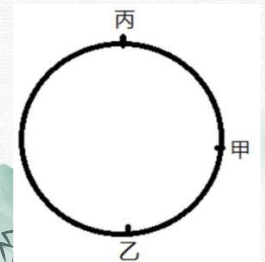

# Table of Contents

* [多对象相对变化中的特值应用](#多对象相对变化中的特值应用)
  * [总结](#总结)
  * [例题](#例题)
* [数字 0 的相对静止思维速解应用](#数字-0-的相对静止思维速解应用)
  * [总结](#总结-1)
  * [例题](#例题-1)
* [数字01 实战应用](#数字01-实战应用)
* [作业](#作业)


# 多对象相对变化中的特值应用

## 总结

1. 查看题目是否有几个方程组，是否可以有特值来做 

2. **特值，只是替代原有方程的未知数，使之计算更简便**

3. 如果用特值，应该假设哪个为特值？一般来说就是比较特殊的，

4. 再利用题目给的条件列方程。【这里的意思是，特值只是减少了变量，不代表不能继续设未知数】

   

## 例题


**使用条件：未知对象数>方程数**

例题 1：【2012 浙江】 某班级去超市采购体育用品时发现买 4 个篮球和 2 个排球共需 560 元，而买 2 个排球和 4个足球则共需 500 元。问如果篮球、排球和足球各买 1 个，共需多少元? A.250 元 B.255 元 C.260 元 D.265 元

```
这题最开始第一反应就是设方程，
设排球是0元
4蓝=560
4足=500
1蓝+1足+1排=265
```

-----

例题 2：【2016 联考】 木匠加工 2 张桌子和 4 张凳子共需要 10 个小时，加工 4 张桌子和 8 张椅子需要 22 个小时。 问如果他加工桌子、凳子和椅子各 10 张，共需要多少小时？ A.47.5 B.50 C.52.5 D.55

```
桌子1
凳子2
椅子就是：9/4=2.25
加起来就是(1+2+2.25)*10=52.5
```

----

例题 3:【2023 联考】 某校举行插班生考试，共有 60 人录取。按成绩编入相应班级，原定 5 人进入竞赛班，15 人进入强基班，40 人进入普通班。按照这一方案，强基班平均分比普通班高 7 分。由于招生方案调整，现有 10 人进入竞赛班，20 人进入强基班，30 人进入普通班。调整后竞赛班平均分下降 3 分，强基班平均分下降 2 分，普通班平均分下降 1 分。求调整后竞赛班比强基班平均分高几分? A.1 B.2 C.4 D.5

```
这题最开始的时候，设
普通班 1 强为 8 但是竞赛怎么设置？就无从下手了 这里有一个隐藏前提，那就是不管怎么调整，平均分肯定是相等的。 设竞赛为a
5a+120+40=10(a-3)+120+0
5a=70
a=14

那么现在就是 0 6 11 选D

```


-----

例题 4:某数学学习小组进行阶段测试，小王发现自己的分数比小组其他同学的平均分少 14分，如果他再多得 28 分则小组平均分会提高 2 分。那么小王本次测试实际分数比小组平均分低几分？ A.10 B.11 C.12 D.13

```
小王0 其他14
再多得 28 分则小组平均分会提高 2 分[人数*平均分 人数不变的情况下提高2分是28]
总人数：28/2=14
13*14/14=13 -0 =13 选D
```

---

例题 5：【2016 山东】 某企业采购了一批文具和书本赠送给希望小学的学生。如果向每个学生捐赠 2 件文具和 3本书，则剩下书的数量是文具的 1.5 倍；如果向每个学生再多捐赠 1 件文具和 1 本书，则剩下书的数量是文具的两倍。该企业最终决定向每个学生捐赠 6 件文具和 10 本书，则其还需要采购的书本数量是文具的多少倍（ ） A．1 B．2 C．3  D．4

```
做这题我就蒙了，不知道怎么特值了，这个时候要把原有方程的未知数列出来，特值，只是替代原有方程的未知数。
原有方程有三个变量 学生、文具 书本 分别设为 1 x y 可得2个方程组
1.5(x-2)=y-3
2(x-3)=y-4
x=4
y=6
决定向每个学生捐赠 6 件文具和 10 本书，则其还需要采购的书本数量是文具的多少倍 2 4 也就是2倍 选2
----
我这里用的是方程，但是老师用的是份数，快速求出了原来的数量
原来是3：2
现在是2:1
也就是1分就是1 原来文具就是4 书就是6 贼快，但是我没想到
----
后面老师又列了个方程，我怎么就想不到。。。。
3x:2x
3x-1/2x-1 =2 x=1
```

-----


# 数字 0 的相对静止思维速解应用

## 总结

一般假设速度小的为0 ，便于计算，是一个相对量

## 例题


母题讲解： 某人畅游长江，逆流而上，在 A 处丢失一只水壶，他又向前游了 20 分钟后，才发现丢了水壶，立即返回追寻，在距离 A 处 2 千米的地方追到，他返回追寻用了多少分钟？

```
距离=逆水的时间+顺水的时间，直接假设水流速度为0 
直接20分钟即可

```

-----


例题 1：【2023 深圳】 老杨、老朱和小张三人开展社区巡防工作，巡防路线固定，三人同时同向出发，老杨开车，老朱骑自行车，小张走路。已知老杨每 20 分钟追上小张一次，每 40 分钟追上老朱一次，则老朱每（ ）分钟追上小张一次。 A.30 B.40 C.50 D.60

```
设小张速度为0 
老杨20分钟一圈
老朱40分钟一圈
直接选B走人

```


-----


例题 2：【2021 浙江】 甲、乙、丙从长 360 米的圆形跑道上的不同点同时出发，沿顺时针方向匀速跑步。3 分钟后 甲追上乙，又过 1 分 30 秒后丙也追上乙，又过 3 分 30 秒后丙追上甲，又过 5 分 30 秒后丙 第二次追上乙。问出发时甲在乙身后多少米 A．48 B．84 C．108 D．144+



```
2次丙追上乙，可以得到丙的速度
360/9分钟=40

8*(40-v甲)+3v甲=4.5*40
丙甲+甲乙=丙乙

```


----


例题 3：【2024 四川】 现有浓度为 70%的盐水 100 克。从中倒出 40 克，再加入 40 克浓度为 20%的盐水，如此操作共 5 次后，问盐水的浓度在以下哪个范围内？ A.低于 23% B.在 23%到 25%之间 C.在 25%到 27%之间 D.高于 27%

```

```


----


# 数字01 实战应用

1.【2018上海】 现有甲、乙、丙三种货物，若购买甲1件、乙3件、丙7件共需200元；若购买甲2件、乙5件、丙11件共需350元。则购买甲、乙、丙各1件共需（）元。 A.50 B.100 C.150 D.200

8.【2018北京】 老张购买学习和生活用品捐赠给山区贫困小学生。3个笔盒、2个皮球和4个杯子一共89元，4个笔盒、3个皮球和6个杯子一共127元。则一个笔盒多少元？ A.10             B.11           C.12             D.13

4.【2023模考】 甲骑摩托艇、乙划船从上游的泊位同时出发前往下游的露营地，10分钟后甲到达露营地时，乙还需再划5分钟才能到泊位和露营地的中点，但因船桨掉落，只能等待甲返回迎接。已知水速与乙在静水中的船速一致，则甲从露营地出发到接到乙用时多久？（ ） A.4分钟 B.6分钟 C.8分钟 D.10分钟

7.【2024四川】 在一块玉米地中使用甲、乙两台自动播种机进行播种。如只使用甲播种机需要12小时，只使用乙播种机需要20小时，计划同时使用两台播种机完成播种任务。两台播种机共同播种3小时后，乙播种机出现故障用时2小时维修，修好后的效率降低了20%，之后两台播种机共同工作直到任务完成。问实际播种时间比原计划多多长时间？  A.不到1小时  B.1小时-1小时20分之间  C.1小时20分-1小时40分之间  D.1小时40分以上


3.【2021广东紧缺公务员招聘】 一艘维修快艇沿着河流逆流而上执行维修任务，快艇航行到途中某处时工具包掉进了河里，10分钟后，驾驶员到达目的地时发现工具包丢失后立即返回追寻。已知水的流速为每秒1米，如果工具包会浮在水面上漂流，那么驾驶员将在距离丢失处（  ）米的地方找回工具包。 A.640 B.900 C.1080 D.1200


# 作业

1.【2018上海】
现有甲、乙、丙三种货物，若购买甲1件、乙3件、丙7件共需200元；若购买甲2件、乙5件、丙11件共需350元。则购买甲、乙、丙各1件共需（）元。
A.50
B.100
C.150
D.200

2.【2018全国事业统考】
某公司有甲、乙、丙、丁四个事业部，甲和丁事业部人数之和是乙和丙人数之和的2倍，甲事业部人数是乙的5倍，丙事业部人数是丁的3倍。问丁事业部人数相当于四个事业部总人数的：
A.1/12
B.1/14
C.1/16
D.1/18

3.【2021广东紧缺公务员招聘】
一艘维修快艇沿着河流逆流而上执行维修任务，快艇航行到途中某处时工具包掉进了河里，10分钟后，驾驶员到达目的地时发现工具包丢失后立即返回追寻。已知水的流速为每秒1米，如果工具包会浮在水面上漂流，那么驾驶员将在距离丢失处（    ）米的地方找回工具包。
A.640
B.900
C.1080
D.1200

4.【2023模考】
甲骑摩托艇、乙划船从上游的泊位同时出发前往下游的露营地，10分钟后甲到达露营地时，乙还需再划5分钟才能到泊位和露营地的中点，但因船桨掉落，只能等待甲返回迎接。已知水速与乙在静水中的船速一致，则甲从露营地出发到接到乙用时多久？（  ）
A.4分钟
B.6分钟
C.8分钟
D.10分钟

5.【国家2009】
甲买了3支签字笔、7支圆珠笔和1支铅笔，共花了32元，乙买了4支同样的签字笔、10支圆珠笔和1支铅笔，共花了43元。如果同样的签字笔、圆珠笔、铅笔各买一支，共用多少钱?   
A. 21元          
B. 11元        
C. 10元         
D. 17元 

6.【吉林2014】
某学校组织一次教工接力比赛，共准备了25件奖品分发给获得一、二、三等奖的职工，为设计获得各级奖励的人数，制定两种方案：若一等奖每人发5件，二等奖每人发3件，三等奖每人发2件，刚好发完奖品；若一等奖每人发6件，二等奖每人发3件，三等奖每人发1件，也刚好发完奖品，则获得二等奖的教工有多少人？   
A.6          
B.5          
C.4           
D.3

7.【2024四川】
在一块玉米地中使用甲、乙两台自动播种机进行播种。如只使用甲播种机需要12小时，只使用乙播种机需要20小时，计划同时使用两台播种机完成播种任务。两台播种机共同播种3小时后，乙播种机出现故障用时2小时维修，修好后的效率降低了20%，之后两台播种机共同工作直到任务完成。问实际播种时间比原计划多多长时间？ 
A.不到1小时 
B.1小时-1小时20分之间 
C.1小时20分-1小时40分之间 
D.1小时40分以上 

8.【2018北京】
老张购买学习和生活用品捐赠给山区贫困小学生。3个笔盒、2个皮球和4个杯子一共89元，4个笔盒、3个皮球和6个杯子一共127元。则一个笔盒多少元？
A.10            
B.11          
C.12            
D.13

9.【2021浙江】
某俱乐部选拔优秀选手参加游泳比赛，选手在规定时间内游完全程，就能获得参赛资格。 
已知有四分之一的选手获得了参赛资格，获得参赛资格选手的平均完成时间比规定时间快 6 
秒，未获得参赛资格选手的平均完成时间比规定时间慢 10 秒，所有选手的平均完成时间为 
140 秒，则本次选拔的规定时间为多少秒： 
A.116 
B.125 
C.134 
D.139
