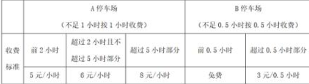
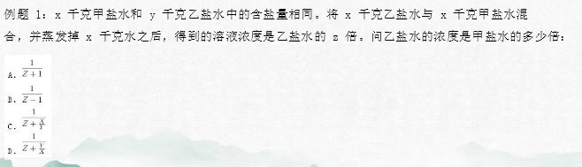
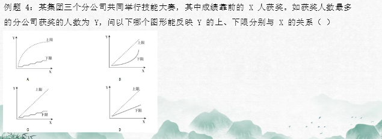
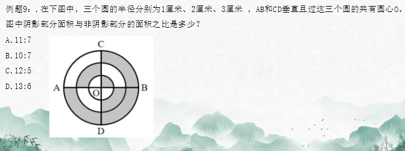

# Table of Contents

* [总结](#总结)
* [问法突破思维-秒杀](#问法突破思维-秒杀)
  * [单一问法](#单一问法)
    * [猜题思维](#猜题思维)
  * [和差](#和差)
    * [抢答](#抢答)
    * [经典题型刷题](#经典题型刷题)
    * [猜题](#猜题)
  * [乘法](#乘法)
  * [极值问法突破](#极值问法突破)
* [题干突破思维-速解](#题干突破思维-速解)
  * [单一定值思维](#单一定值思维)
  * [积定值](#积定值)
  * [积定值比例法加练](#积定值比例法加练)
  * [和定值](#和定值)
  * [差定值](#差定值)
  * [公式比列法 a=b*c](#公式比列法-abc)
  * [调和参照份数思维](#调和参照份数思维)
  * [归元思维](#归元思维)
    * [归一思维](#归一思维)
  * [四大维度](#四大维度)
    * [归元](#归元)
    * [抢答](#抢答-1)
  * [特殊数据突破思维](#特殊数据突破思维)
    * [等属性【相同数据】](#等属性相同数据)
    * [等属性【成倍数关系】](#等属性成倍数关系)
  * [调和平均数](#调和平均数)
    * [归元](#归元-1)
    * [极值-范围估算](#极值-范围估算)
  * [调和平均数进阶思维](#调和平均数进阶思维)
    * [常见调和平均数](#常见调和平均数)
    * [上坡下坡](#上坡下坡)


数量关系重在于寻找关系，那么从哪几个地方寻找关系呢？很显然，一道题出来后无非就是**题干+问法+选项**。所以我们重点从这三个角度去学习对应的速解思维，接下来我们就一个个来看下，先看下**选项突破思维**：


# 总结

+ 看到百分号，写成份数

+ 乘法因子传递性： a是m的倍数。 a(1+r%)不管**乘什么数**的结果，一定含有m因子

+ 单一问法

  1. 直接: 题目直接告诉你的
  2. 间接: 通过其他关联关系告诉你的
  3. 间接:列式


#  问法突破思维-秒杀


+ 单一问法
+ 和差问法
+ 乘除问法突破思维


## 单一问法

1. 直接:因子
2. 间接:奇数偶数
3. 间接:列式

例题 1：【2022 广东】 小陈计划在一定时间内完成法律常识题库中的所有练习题。如果每天做 50 道题，那么最后2天每天要做 85 道题才能完成，如果每天做 55 道题，恰好可以提前 1 天完成，则该题库共有（ ）道题。 A.1215 B.1250 C.1320 D.1375

```
该题库共有（ ）道题 单一

题目问题库一共有多少个 查看材料 每天做 55 道题，恰好可以提前 1 天 一定是11倍数 
排除AB 代入选C
50n+170 都是10倍数 直接C

```

例题 2：某商店销售 A、B 两种商品，计划均按 30%的利润率来销售。但是在实际销售中，A商品的售价比定价高 10%，B 商品按定价的八折出售，两种商品各售出 2 件后，共盈利 274元。已知 A、B 两种商品的进货单价之比为 3：2，则 A 商品每件的实际售价比 B 商品高多少元？ A.77 B.100 C.221 D.200

```
题目问的是  A 商品每件的实际售价比 B 商品高多少元
是和差问法
A-B 这个问法会想到什么? A+B 以及 A+b-2b 
看看题目有没有给条件
 A、B 两种商品，计划均按 30%的利润率
利润率=利润/成本 3/10 也就是 售价是13份 
后面不管降价、打折什么的，13这个因子都是会传递下去的 ------------------这句话很重要！！！！！！！！！！！！！
所以A-B 13n-13n=13n
查看选项C符合

```

例题 3：某市服务行业举行业务技能大赛，其中东区参赛人数占总数的 1/5，西区参赛人数占总数的 2/5，南区参赛人数占总数的 1/4，其余的是北区的参赛人员。结果东区参赛人数的 1/3 获奖，西区参赛人数的 1/12 获奖，南区参赛人数的 1/9 获奖。已知参赛总人数超过 100 人，不到 200 人，则参赛总人数为? A.120 B.140 C.160 D.180

```
参赛总人数为多少
查看与参赛总人数相关的
 1/5  2/5 1/4 
 1/3  1/12  1/9
3的倍数 排除B C
9的倍数直接选D
```
例题 4：某研究团队开展小学生身体健康状况调查活动，需要从某市三所小学中抽取部分小学生组成研究样本，其中实验小学抽取的人数占其他两所小学抽取人数的五分之一，解放路小学抽取的人数占其他两所小学抽取人数的二分之一，精英小学抽取的人数为 180 人，那么三所小学合计抽取多少人？ A.540 B.480 C.360 D.280

```
那么三所小学合计抽取多少人
看看有没有直接条件
实验小学抽取的人数占其他两所小学抽取人数的五分之一  总人数 6 3倍数 
解放路小学抽取的人数占其他两所小学抽取人数的二分之一 3倍数

-180 是3倍数  这里我只看到这些  这个时候单一问法解决不了题目了
------------------以下是没想到的思路 题干突破
总人数是不变的
1/6 1/3 进行配同 1/6 2/6 另一个有个就是3/10  3份180 6份就是360


```
例题 5：某企业预计今年营业收入增长 15%，营业支出增长 10%，营业利润增加 600 万元。已知该企业去年的营业利润为 1000 万元，则其今年的预计营业支出是 A.9000 万元 B.9900 万元 C.10800 万元 D.11500 万元

```
今年的预计营业支出
营业支出增长  1/10 去年10份今年增长1份 就是11份

a(1+10%) 11a

如果问今年营业收入增长 15/100 3/20 23倍数
```
例题 6：某老旧写字楼重新装修，需要将原有的窗户全部更换为单价 90 元每扇的新窗户。已知每 7 扇换下来的旧窗户可以跟厂商兑换一个新窗户。全部更换完毕后共花费 16560 元且剩余 4 个旧窗户没有兑换，那么该写字楼一共有多少扇窗户？ A.214 B.218 C.184 D.188

```
写字楼一共有多少扇窗户

每 7 扇换下来的旧窗户可以跟厂商兑换一个新窗  剩余 4 个旧窗户没有兑换
x-4 是7的倍数

```
例题 7：某直播平台为 3 种特色农产品直播带货 3 小时，第 1 小时 B 产品销售额比 A 产品多50 万元，C 产品只有 B 产品的 60%；第 2 小时与第 1 小时相比：A 翻倍，B 增加幅度比 A 少20%，而 C 增加两倍；最后 1 小时共带货 3090 万元，且 A 产品带货额比第 1 小时大幅增加300%，B、C 均比第 2 小时增加 50%，问第 2 小时直播带货额是多少万元： A．1580 B．1600 C．1860 D．2000

```
第 2 小时直播带货额 
查看直接关系 
第 2 小时与第 1 小时相比 A 翻倍，B 增加幅度比 A 少20% ,而 C 增加两倍   2n  4/5n  2的倍数   B是9的倍数 C是3倍数

A+b+c  

最后 1 小时共带货 3090 万元，且 A 产品带货额比第 1 小时大幅增加300% ,时增加 50%

 4a+ 1/2是3的倍数
4a+3的倍数=3090 3的倍速 所以a肯定也是3倍数

直接选C
```
例题 8：现有 5 盒动画卡片，各盒卡片张数分别为：7、9、11、14、17。卡片按图案分为米老鼠、葫芦娃、喜洋洋、灰太狼 4 种，每个盒内装的是同图案的卡片。已知米老鼠图案的卡片只有一盒，而喜洋洋、灰太狼图案的卡片数之和比葫芦娃图案的多 1 倍，那么图案为米老鼠的卡片的张数为? A.7 B.9 C.14 D.17

```
那么图案为米老鼠的卡片的张数为 
而喜洋洋、灰太狼图案的卡片数之和比葫芦娃图案的多 1 倍  ,看到这里立马想起来这里总共是3倍 

总数-米老鼠=3倍数
58 那么米老鼠肯定不是3倍数
直接选A

```
例题 9：某农户饲养有肉兔和宠物兔两种不同用途的兔子共计 2200 只，所有兔子的毛色分为黑、白两种颜色。肉兔中有 87.5%的毛色为黑色，宠物兔有 23%的毛色为白色。那么毛色为白色的肉兔至少有多少只？ A.25 B.50 C.100 D.200

```
那么毛色为白色的肉兔至少有多少只
直接关系
肉兔中有 87.5%的毛色为黑色 7/8  肉兔是8倍数  黑色肉兔是7倍数

宠物兔有 23%的毛色为白色 23/100 宠物兔总量 100倍数


肉兔+宠物兔= 2200 只
说明肉兔 也是100倍数 又是8

7/8=175/200  25 那么最小就是25倍数 选A

```
例题 10：社区工作人员小张连续 4 天为独居老人采买生活必需品。已知前三天共采买 65 次，其中第二天采买次数比第一天多 50%，第三天采买次数比前两天采买次数的和少 15 次，第四天采买次数比第一天的 2 倍少 5 次，问这 4 天中，小张为独居老人采买次数最多和最少的日子，单日采买次数相差多少次？ A.9 B.10 C.11 D.12

```
第二天采买次数比第一天多 50% 1/2  
2份 16 
3份 24
5份-15 25 
4份-15  27 
买次数最多和最少 
前三天共采买 65 次  1份就是8

```
例题 11：某地举办铁人三项比赛，全程为 51.5 千米，游泳、自行车、长跑的路程之比为 3：80：20.小陈在这三个项目花费的时间之比为 3：8：4，比赛中他长跑的平均速度是 15 千米/小时，且两次换项共耗时 4 分钟，那么他完成比赛共耗时多少？ A.2 小时 14 分钟 B.2 小时 24 分钟 C.2 小时 34 分钟 D.2 小时 44 分钟

```

那么他完成比赛共耗时多少
项目花费的时间之比为 3：8：4 15 3的倍数
共耗时 4 分钟
x-4是3的倍数

```
例题 12：某企业按三个等级给员工发放奖金，一、二、三等奖的获奖人数之比为 1：3：10，奖金总额之比为 2：3：1。已知获奖员工总数 126 人，发放奖金总额 16.2 万元，则三等奖的奖金是 A.250 元 B.300 元 C.350 元 D.400 元

```
三等奖的奖金是？
直接相关  奖金总额之比为 2：3：1 奖金是6份   16.2 一份就是2.7 3的倍数 直接选B

```
例题 13：某公司研发部、市场部和销售部共新招了十几名员工，其中研发部新员工数与市场部和销售部新员工数的总和相同。销售部如果将 1/3 的新员工调到市场部，则两个部门的新员工数相同。现在要为每名新员工各采购一台电脑，其中研发部的电脑每台不超过 1 万元，销售部和市场部的电脑每台不超过 6 千元。问采购这批电脑最多需要多少万元？ A.14.4 B.12.8 C.11.2 D.9.6
```
问采购这批电脑最多需要多少万元？
，其中研发部的电脑每台不超过 1 万元，销售部和市场部的电脑每台不超过 6 千元。 需要知道研发和销售以及市场
销售部如果将 1/3 的新员工调到市场部，则两个部门的新员工数相同 
销售3 市场1 研发4  共新招了十几名员工 是一个模糊状态，但是是8的倍速 只能为16人
8+4.8=12.8 
```


### 猜题思维


1. 简单问题直接做

2. 复杂问题技巧做

3. 实在不行在猜

   1. 排除2个选项------------------ 前提
   2. 告诉a和b 求a，则b为陷阱。
   3. 选项偏移：BCDA 【真题总结】
   4. 题干中不能相同的数据
5. 最大的求最大 最小是最小
   
   

例题 1：小王和小张分别于早上 8：00 和 8：30 从甲地出发，匀速骑摩托车前往乙地。10：00 小王到达两地的中点丙地，此时小张距丙地尚有 5 千米。11：00 时小张追上小王。则甲、乙两地相距多少千米？ A.50 B.75 C.90 D.100

```
甲、乙两地相距多少千米 -- 问 ab
小王和小张分别于早上 8：00  10：00 小王到达两地的中点丙地 2 倍关系
直接选D
```

例题 2：甲、乙两人分别从 A、B 两地同时出发，6 小时后在 A、B 两地中点相遇，如果甲每小时多走 8 公里，乙提前 2 小时出发，则甲、乙两人仍在中点相遇，那么 A、B 两地相距多少公里？ A.168 B.192 C.256 D.304.

```
第一反应3的倍数 排除cd
则甲、乙两人仍在中点相遇  选项偏移：BCDA  选B 都有2倍关系

```

例题 3：甲车上午 8 点从 A 地出发匀速开往 B 地，出发 30 分钟后乙车从 A 地出发以甲车 2 倍的速度前往 B 地，并在距离 B 地 10 千米时追上甲车。如乙车 9 点 10 分到达B地，问甲车的速度为多少千米/小时（ ） A.30 B.36 C.45 D.60

```
告诉a和b 求a，则b为陷阱。
问甲车的速度为多少千米/小时  a
乙车从 A 地出发以甲车 2 倍的速度前往 B 地  b是a的2倍 不能选b 那就直接选A
```


## 和差

+ 奇偶性
+ 和差转化 -灵活
  + 可以转换为a
  + 可以转换为b
+ a+b=C
  +  如果数a和数b都能被数c整除，那么它们的和或差也能被数c整除  
+ 代入
+ 猜题

例题 1：大小两个数字之差为 2345，其中大数是小数的 8 倍，求两数之和： A.3015 B.3126 C.3178 D.3224

```
a+b 立马想到看奇偶
题目告诉了a-b=2345 和差同性  a+b肯定是奇数 直接选A

```

例题 2：一次数学考试共有 50 道题，规定答对一题得 2 分，答错一题扣 1 分，未答的题 不计分。考试结束后，小明共得 73 分。求小明这次考试中答对的题目跟答错和未答的题目 之和可能相差： A.25 B.29 C.32 D.35

```
题目问 a-(b+c)

题目告诉了 a-+(b+c)=50 排除ABD 选C
```

例题 3：一个人到书店购买了一本书和一本杂志，在付钱时，他把书的定价中的个位上的数 字和十位上的看反了，准备付 21 元取货，售货员说：“您应该付 39 元才对。”请问书比 杂志贵多少钱（ ） A.20 B.21 C.23 D.24

```

个位上的数 字和十位上的看反了 9的倍数
9n+杂志=39 排除AD
21题目出现 且不符合题目 直接选C
```


例题 4：A、B 两个停车场收费标准如下： 



  小明在 A、B 两个停车场分别停车一次，停车时长相同，A 停车场收费比 B 停车场多 10 元。 问两次停车共收费多少元？ A.76    B.82    C.88      D.94

```
关系转换
题目问 a+b 是多少
题目告诉了 a-b=10 用已知条件转换为问法条件

a+b 把b换掉就是 a+a-10=2a-10

a如何求，查看收费标准 10+18+8n 为什么这么多，我们看选项 肯定是大于33的
a=10+18+8n=28+8n 是4的倍数
那么2a就是8的倍数
2a-10=答案   查看选项只有D
---------------------
我们要学会利用【题目给出的已知条件】转换为 题目问的，如果第一时间想不到，可以先把已知条件写出来，这样便于自己转换

```

例题 5：某批发市场有大、小两种规格的盒装鸡蛋，每个大盒里装有 23 个鸡蛋，每个小盒 里装有 16 个鸡蛋。餐厅采购员小王去该市场买了 500 个鸡蛋，则大盒装一共比小盒装（ ）。 【2017 广州】 A.多 2 盒 B.少 1 盒 C.少 46 个鸡蛋 D.多 52 个鸡蛋

```
问：大盒装一共比小盒 这一题比较不好猜，看选项都是坑，单位都不告诉你

23a+16b=500
16b 是4的倍数 
500 是4的倍数
那么23a 一定是4的倍数

代入4 不符合
代入8 500不是8倍数
代入12  23a=276 224 相差52个 答案选D
```

例题 6：企业销售甲、乙、丙三种不同的机械，单价分别为 33 万元、17 万元和 13 万元，某 月三种设备共销售 53 台，甲设备的销量是丙设备的 3 倍，且乙设备的销售额比甲、丙设备 的销售额之和高 1 万元，问当月，丙设备的销售额比乙设备少多少万元？ A.385 B.415 C.466 D.496

```
题目问 乙-丙 查看题目没有直接变量
但是题目告诉了 乙-(甲+丙) 转换为题目问法

乙-(甲+丙)=【乙-(甲+丙)】 +甲= 乙-丙
乙-丙=甲+1 
乙-丙 -1=甲 倍数甲 33 也就是11倍数
 直接选D
```


例题 7：某地市区有一个长方形广场，其面积为 1600 平方米。由此可知，这个广场的周长 至少有： A.160 米 B.200 米 C.240 米 D.320 米

```
m=n时
m+n 最小
mn最大
40*40
2(40+40)=160
```


### 抢答

1.甲、乙、丙三人合修一条公路，甲、乙合修6天修好公路的1/3 ，乙、丙合修2天修好余下的1/4 ， 剩余的三人又修了5天才完成。共得收入1800元，如果按工作量计酬，则乙可获得收入为：  A. 330元  B. 910元  C. 560元  D. 980元

```
问：乙可获得收入
查看乙工作量为6+2+5=13 肯定是13倍数 直接选B
```

2.一件商品按定价的八折出售，可以获得相当于进价20%的利润，如果以原价出售，可以获得相当于进价百分之几的利润：  A. 20%  B. 30%  C. 40%  D. 50%

```
进价百分之几的利润 问的还是利润的问题

20%=1/5  成本+利润 说明定价是6 3的倍数，后面不管在怎么打折，肯定实在定价的基础上， 乘法，因子传递，肯定是3的倍数 选B

----------------------------
这里做的有问题 
错1：进价20%的利润 说明实在原来进价基础上加了20% 所以说是1.2 3倍数 

错2：3的倍数，也不能直接选，答案告诉的也是利润率，我们需要还原为定价 成本+利润=定价

查看选项 1/5 3/10 2/5 5/10  发现AD符合，但不可能是A 只能选D

```

4.某校的学生总数是一个三位数，平均每个班35人，统计员提供的学生总数比实际总人数少270人，原来，他在记录时粗心地将三位数的百位与十位数字对调了，该学校学生总数最多是多少人? A.748 B.630 C.525 D.360

```
三位数的百位与十位数字 
90倍数 相差为3 发现都是3 

平均每个班35人 35 5的尾数只能为0 或者5 排除AD
BC怎么办  代入就好 
选择B
```

5.12个啤酒空瓶可以免费换1瓶啤酒，现有101个啤酒空瓶，最多可以免费喝到的啤酒为：  A. 10瓶  B. 11瓶  C. 8瓶  D. 9瓶

```
12个啤酒空瓶 =1瓶+空瓶
11空=酒
101/11答案选D

```

6.有一本畅销书，今年每册书的成本比去年增加了10%，因此每册书的利润下降了20%，但是今年的销量比去年增加了70%。则今年销售该畅销书的总利润比去年增加了：  A. 36%  B. 25%  C. 20%  D. 15%

```
总利润=总销量*单个利润
1.7*0.8
这里跟上面一题一样，需要把选项转化为份数 9/25 1/4 1/5 3/20  只能选A
```

7.某单位2014年年终评比中，良好等级的人数占总人数3/5。2015年年终评比又多了60人被评为良好等级，此时该等级的人数占总人数9/11。如果在这两年间该单位的人员没有变化，则该单位共有（  ）人。 A．120	             B．275              C．330              D．800

```
5的倍数 
11的而倍数
只能选C
```

8.一辆动车组列车和一辆快速列车相向而行，动车组列车的车长是260米，快速列车的车长是455米。坐在动车组列车上的人看快速列车驶过的时间是7秒，那么坐在快速列车上的人看动车组列车驶过的时间是： A.3秒     B.4秒     C.5秒     D.6秒

```
坐在动车组列车上的人看快速列车驶过的时间是7秒
快速列车=455/7=65

260/65=4 选B

```

9.某超市购入每瓶200毫升和500毫升两种规格的沐浴露各若干箱，200毫升沐浴露每箱20瓶，500毫升沐浴露每箱12瓶，定价分别为14元/瓶和25元/瓶。货品卖完后，发现两种规格沐浴露销售收入相同，那么这批沐浴露中，200毫升的最少有几箱？ A.3  B.8  C.10  D.15

```
两种规格沐浴露销售收入相同

14*20*a=12*25*b
12a:15b
a 是15的倍数
```

10.工程队接到一项工程，投入80台挖掘机。如连续施工30天，每天工作10小时，正好按期完成。但施工过程中遭遇大暴雨，有10天时间无法施工。工期还剩8天时，工程队增派70台挖掘机并加班施工。若工程队想按期完成，则平均每天需多工作多少个小时（ ）　 A.1.5      B.2      C.2.5       D.3

```
10天没干活 后面新增70就是要干这几天没干的

10*10*80=8000  平均每天1000

1000=80*10+70*(10+n)
----------------- 这里我最开始列的有问题

多的量 应该是80台多做的 （自己之前干完的）+ 70台 从头到尾多做的

1000=80*n+70*(10+n) n=2 选B
```


### 经典题型刷题

1.某公司组织员工游湖，共使用六条游船分三批出发。已知游船分别搭载了15、16、18、20、21和30人，前两批共使用了五艘游船，且第一批出发的人数是第二批的2倍。则最后出发的有多少人? A.16 B.18 C.20 D.21

```
第一批出发的人数是第二批的2倍 
3的倍数+x=120
x是3的倍数 排除AC
代入b不符合 选择D
```

2.林华全家是阅读爱好者，家里有各种书籍，版本也多。已知他家有五分之三的书是 中文版的,六分之一是英文版的，八分之一是中英文互译版的，还有多于 11 本但少于 17 本是其它版本的， 问他家有多少本英文版书？ A.72 本  B.20 本  C.15 本  D.13 本

```
五分之三的书是 中文版的 总数是5的倍数 n
六分之一是英文版的  n*1/6
八分之一是中英文互译版的   总数是8的倍数 N

 5n*1/6 5的倍数会传递 排除AD
 8n*1/6 同时约去2 4的倍数会传递 选择b

```

3.某商店购进了140 支铅笔和115 支钢笔，每天售出10 支铅笔和15 支钢笔，问多少天后，剩余铅笔数是钢笔的7 倍？ A.5                     B.6                     C.7                D.8

```
第一反应代入 
但是可以用因子
剩余铅笔数是钢笔的7 倍 

140- 10n=7的倍数
n=7的倍数 直接C

```

4.某车站在检票前若干分钟就开始排队，每分钟来的旅客人数一样多。从开始检票到等候检票的队伍消失，同时开4个检票口需30分钟，同时开5个检票口需20分钟。如果同时打开7个检票口，那么需多少分钟？ A.16 B.14 C.10 D.12

```
直接牛吃草公式

4  5  7

2  3  5
-  -  --
60 60 60 
直接选D
------------------------也可以用增减模型

```

5.甲乙两人分别从AB两地同时同向出发，乙在前，甲在后，两人均匀速运动，结果甲在C地追上乙。如果甲每小时多行1千米，则会在距离C地12千米的地方追上乙；如果甲每小时少行0.5千米，则会在距离C地24千米地方追上乙；如果甲每小时多行0.5千米，则甲会在距离C地多少千米地方追上乙？ A.8 B.9 C.10 D.12  【经典题目】

```
第一反应 增减模型
以匀速为参照系

1    12
0.5  24

V=4:1

3份差1.5 V=2
t=1:4
3份差12  t=4

-------------- 以上全是错误做法
S=V* t =(V甲-V乙)*t

1    12/v乙
0.5  24/v乙  是在C点右边

V=4:1

3份差1.5 V=2 原来就是1 

后面的学了追击和比例法在做
```


6.校长去机票代理处为单位团购票 10 张，商务舱定价 1200 元/张，经济舱定价 700 元。由于买的数量多，代理商给予优惠，商务舱按定价的 9 折付钱，经济舱按定价 6 折付钱，如果他付的钱比按定价少 31%，那么校长一共买了经济舱几张? A．6	 B．7	 C．8	 D．9

```
9                折扣钱
  6.9 3/7  比值=-----------
                 总钱
6

这里有2个陷阱  1.如果他付的钱比按定价少 31%  2.十字交叉分母之比

1200a  3
---- = ---
700b   7
a/b=1/4  一份2 经济就是8

```

7.工厂有 5 条效率不同的生产线。某个生产项目如果任选 3 条生产线一起加工，最快 需要 6 天整，最慢需要 12 天整；5 条生产线一起加工，则需要 5 天整。问如果所有生产 线的产能都扩大一倍，任选 2 条生产线一起加工最多需要多少天完成？  A.11  B.13  C.15  D.30 【】

```
等比模型

abcde
选 3 条生产线 cde  6-5=1
任选 2 条生产线 abc
5 条生产线一起加工，则需要 5 天整 相遇时间

任选 2 条生产线一起加工最多需要多少天完成  那就是最慢的 ab

25=1*T
t=25 
最慢的就是25+5=30  这里又踩坑了

问如果所有生产 线的产能都扩大一倍

所以直接选C
```


### 猜题

+ a=b+C

  > b 已知 
  >
  > C 未知

+ 中点 来回  猜2倍关系

例题 1：某车间安排了若干工人加工甲、乙两种零件，每个工人每天可加工甲零件 15 个，或者加工乙零件 10 个。 某种仪器每套需配有甲零件 2 个和乙零件 3 个。已知只安排 8个工人加工甲零件。要使每天加工的零件恰好配套，该车间安排了（ ）个工人加工甲、乙两种零件。 A.18 B.21 C.23 D.26

```
a=b+C
b 已知 8
c 未知 陷阱就是b

答案和陷阱相差【已知】
A+8=D 
```

例题 2：清晨，爷爷、爸爸和小磊在同一条笔直跑道上朝同一方向匀速晨跑，某一时刻，爷 爷在前，爸爸在中，小磊在后，且三人之间的间距正好相等。跑了 12 分钟后小磊追上了爸 爸，又跑了 6 分钟后小磊追上了爷爷，则再过（）分钟，爸爸可追上爷爷。 A.12 B.15 C.18 D.36

```
总时间-答案=18
答案和错误相差18
再过几分钟 肯定是小的
```

例题 3：上午 8 点甲、乙二人同时从 A.地出发前往 B 地，甲骑电动车，乙步行。40 分钟后甲到达 B 地，此时乙距离两地的中点处还需走 10 分钟，于是乙停下来等待甲返回接他。若甲立刻原速返回，当甲到达乙处接上乙立刻前往 B 地，速度保持不变。则甲、乙到达 B 地时甲共骑行（ ）分钟。 A.88 B.44 C.80 D.94

```
总时间=t+答案
      40
这里没挖坑

中点一倍的关系，直接猜A 
```

例题 4：小张将带领三位专家到当地 B.单位调研，距离 B.单位 1.44 千米处设有地铁站出口。调研工作于上午 9 点开始，他们需提前 10 分钟到达 B.单位，则小张应通知专家最晚几点一起从地铁站出口出发，步行前往 B.单位？（假设小张和专家的步行速度均为 1.2 米/秒）  A.8 点 26 分 B.8 点 30 分 C.8 点 36 分 D.8 点 40 分

```
10分钟 
但是AB都差10分钟
选项偏移 选B

```


例题 5：设乙地在甲、丙两地之间，小赵从乙地出发到甲地去送材料，小钱从乙地到丙地去送另一份材料，两人同时出发，10 分钟后，小孙发现小赵小钱两人都忘记带介绍信，于是他从乙地出发骑车去追赶小赵和小钱，以便把介绍信送给他们。已知小赵小钱小孙的速度之比为 1：2：3，且中途不停留。那么，小孙从乙地出发到把介绍信送到后返回乙地最少需要多少分钟？ A.45 B.70 C.90 D.95

```
来回2倍关系
选C
```


## 乘法

+ a=b*c

+ 因子传递性 

+ 如果是2个数进行相比，要注意，可能会约掉相同的因子

+ 概率题

  + 看概率 先看分母因子，在看分子有没有超过1/2
  + 分母一定是全部数量的因子
  
+ 排列组合

  + 如果是分类，分母也是对应的因子
  
  

例题 1：某公司研发出了一款新产品，当每件新产品的售价为3000元时，恰好能售出15万件。若新产品的售价每增加200元时，就要少售出1万件。如果该公司仅售出12万件新产品，那么该公司新产品的销售总额为： A.4.72亿元 B.4.46亿元 C.4.64亿元 D.4.32亿元

```
a=b*C
总额=数量*单价
数量已经告诉 12n 3的倍数 直接选D

12=3*4 
4.32 是3的倍数 也是4的倍数
```

例题 2：小车和客车从甲地开往乙地，货车从乙地开往甲地，它们同时出发，货车与小车相遇 20 分钟后又遇客车。已知小车、货车和客车的速度分别为 75 千米/小时、60 千米/小时和 50 千米/小时，则甲、乙两地的距离是（ ） A.205 千米 B.203 千米 C.201 千米 D.198 千米

```
，则甲、乙两地的距离
货车与小车相遇 
货车与小车相遇 20 分钟后又遇客车

60+75=135
60+50=110
我这里想的都是相遇 速度*时间 
11的倍数选D  除5以外的因子
```

例题 3：小王从单位开车去省城，如果他把车速提高 20%，可以比原定时间提前 15 分钟到达；如果按原速行驶 30 千米后再将车速提高 25%，也比原定时间提前 15 分钟到达。问小王单位距离省城多少千米？ A.60 B.120 C.180 D.240

```
s=vt
速度 1.2   3的倍数 TMD没答案
速度 1.25  5的倍数 TMD的没答案

-30是5的倍数 还是没答案 

比例突破会讲
```

例题 4：某长途汽车从甲市到乙市正常行驶需要 6 小时，某天该长途汽车从甲市出发走了 72千米之后提速 20%；为了尽快到达乙地，在走完剩余路程的一半时，再次提速 1/3，最终到达乙地所用时间比正常行驶少用了 78 分钟。则甲、乙两地之间相距多少千米？ A.360 B.288 C.400 D.472

```
6的倍数  排除CD

再看AB相差72 选A

=----------------

这里为什么选B? 选项偏移？

```

例题 5：某企业举行职业技能大赛，3 个下属分公司均选 2 名员工参赛。若同一分公司的员工比赛时出场顺序不能相邻，则参赛的 6 名员工不同的出场顺序共有： A.80 B.120 C.160 D.240

```
猜6的倍数  bd 选项偏移 选B

但其实做错了

2C1*2C1*2C1*3A3=48 倍数 只能选D
```

例题 6：某品牌的葛粉进价为20元，现降价20%卖出，结果还获得进价52%的利润。那么,该葛粉的定价是多少元? A.36 B.37 C.38 D.39

```
52%
52/100 13/25 38的倍数 直接选C
```

例题 7：小波通过往圆圈里投掷米粒（米粒本身长度不计，视为一个点）的方式决定自己的周末活动。经过试验，他将米粒投进圆圈内的成功率达到 100%，但投掷在圆内的位置随机。如果米粒到圆心的距离大于圆半径的一半，那么他周末去看电影；若米粒到圆心的距离小于半径的 1/4，他会去打篮球；否则，他将在家看书。据此可知小波周末不在家看书的概率为： A.13/16 B.2/5 C.3/5 D.1/16

```
不会做 没思路
------
米粒到圆心的距离小于半径的 1/4 那么半径一定是4的倍数，面积就是16 排除BC无16因子、

这个时候看下剩余的概率是否大于1/2  
题目求得是 不在家看书，发现大于1/2 直接选A
```

例题 8：某公益组织登记在册的男、女志愿者人数之比为 2：3，男性志愿者中 20%为教师，女性志愿者中 25%为教师。现从该公益组织登记在册的志愿者中随机选出 1 人，恰好为教师，则该志愿者为男性的概率是： A.2/5 B.3/7 C.9/16 D.8/23

```
不会做 没思路-

----- 这里总人数是老师 

所有人选一个是教师 

2:3 1/5  男生相等

10:15 2:10  1/4 女生相等

40:60  8:40 15:60  
那么教师就是23份
这个23 也是没办法约掉，直接选D
```

例题 9：随着人们生活水平的提高，汽车拥有量迅速增长，汽车牌照号码需要扩容。某地级市交通管理部门出台了一种小型汽车牌照组成办法，每个汽车牌照后五位的要求必须是：前三位为阿拉伯数字，后两位为两个不重复的英文字母（除 O、I 外），那么这种方法可以给该地区汽车上牌照的数量为： A．397440 辆 B．402400 辆 C．552000 辆 D．576000 辆

```
不会做 没思路
---

-----
10*10*10*24*23 直接选C
```

例题10：超市购进一批面包，按照 50%的利润率定价销售。售出 90 个面包后，按照定价的八折售出了剩余面包数量的 60%，最后剩余 20 个面包按照定价的五折全部售出，一共获利 230元。问打折售出的面包共获利多少元？ A.55 B.30 C.25 D.5

```
90n+答案=230
230-3的倍数=答案
230不是3倍数 多疑答案肯定不是3倍数 排除b
代入 230-55=175 不是3倍数 只有D符合
```


## 极值问法突破

例题 1：几个朋友相约游泳，男士统一戴白色泳帽，女士统一戴红色泳帽。每位男士看到的白色泳帽数量与红色泳帽数量一样多，每位女士看到的白色泳帽数量都是红色泳帽数量的倍数。女士最少有（ ）人。 A.1 B.2 C.3 D.4

```
代入B符合
```

例题 2：某零件加工厂采用计件工资。已知合格品每件 1 元，优良品每件 2 元，瑕疵品不得工资。当生产的优良品达到生产总数的 30%时，可额外获得 400 元奖励。某工人生产了 3000个零件，共获得计件工资 4000 元，请问该工人生产的零件中，合格品最多为多少个？ A.2100 B.2000 C.1800 D.1200

```
代入看看
900个 
900*2+400=2200 
还有1800操作空间 直接选C
```


例题3：某草莓经销商有 201 箱的草莓要分配给若干个水果店，要求无论选用怎样的分配方 式，都要有水果店至少分到 8 箱，则水果店至多有 A．20 个 B．21 个 C．28 个 D．29 个

```
都要有水果店至少分到 8 箱 并不是所有，只要有一个就可以

代入28 每个7个就是196 还有5 
代入29 每个7个 203 不够的 所以直接选C
```

例题4：某机构计划派 45 名志愿者分别前往 A、B、C、D 四个地区参与扶贫活动，其中 A 地 区的志愿者人数要比 B 地区多 4 人，C 地区人数为全部志愿者人数的 1/5，D 地区人数不超 过任何其他地区，则 A 地区至少有多少名志愿者： A.12 B.13 C.15 D.16

```
C 地区人数为全部志愿者人数的 1/5  9名
D 地区人数不超 过任何其他地区 
x+x+4+9 
2x+13+D=45 所以d只能是偶数 也就是 8
x=12 选D 16

也可以直接猜题法，  A 地 区的志愿者人数要比 B 地区多 4 人 陷阱就是b A+4=D 直接选D
```


# 题干突破思维-速解

## 单一定值思维

+ 比例转换为百分数
+ 找到分数之间的定值关系，总数
+ 找到真实的数值，转换份数和真实值得关系
+ 分数的每个数据代表谁 要注意 比如 分子 分母各是什么意思
+ 如果没时间：份数与真实值对应 那么总数一定是真实值的特殊因子
+ 特殊应用
  + 股数不变但是股价在变，股数是定值


例题 1：年终某大型企业的甲、乙、丙三个部门评选优秀员工，已知甲、乙部门优秀员工数分别占三个部门总优秀员工数的 1/3 和 2/5，且甲部门优秀员工数比丙部门的多 12 人，问三个部门共评选出优秀员工多少人？ A.120 B.150 C.160 D.180。

```
定值：总人数不变
5/15 6/15 那么丙就是4份 
1份就是12 
15*12=180
------

12 真实值，那么答案肯定能被12整除 AD选项偏移选D
---
12 含有3因子 1/3 也有3因子 3*3=9 因子 选D
---
当然有时间还是要做的

```

例题 2：某企业在软件园区的分公司有甲、乙 2 个开发团队，现从乙团队调走 25 人，此时甲、乙团队人数比为 4:3，然后又从甲团队调走 42 人，此时甲、乙团队人数比为 2:5。问两次调动之前，甲、乙团队人数比为： A.3:4 B.6:7 C.1:2 D.2:5

```
从甲团队调走 42 人  乙不变 
20：15 6:15
14f->42  1f=3
原来就是60：45 加上25
那就是6：7 直接选B


```

例题 3：某研究团队开展小学生身体健康状况调查活动，需要从某市三所小学中抽取部分小学生组成研究样本，其中实验小学抽取的人数占其他两所小学抽取人数的五分之一，解放路小学抽取的人数占其他两所小学抽取人数的二分之一，精英小学抽取的人数为 180 人，那么三所小学合计抽取多少人？ A.540 B.480 C.360 D.280

```
1/5  总人数就是6 
1/2 总人数就是3 
1/5 2/4 那么精英就是3f 3f->180  6f就是360 选C
```

例题 4：甲、乙两个单位人数相同，甲单位的党员占总人数的 20%，乙单位的党员占总人数的 25%。如果乙单位 20 名党员与甲单位 20 名群众互换单位，则两个单位党员占比相同。问两个单位共有党员多少人？  A.256 B.288 C.324 D.360 

```
转换
1/5 1/4
5/20 4/20
20 名党员与甲单位 20 名群众互换单位
4.5/20
0.5f=20
1f=40
9f=360 选D
```

例题 5：某单位本科、研究生学历的职工人数之比为 7∶5。上半年公开招聘本科毕业生若干人后，本科与研究生之比为 3∶1；下半年通过引才计划引入研究生若干人后，本科与研究生之比为 15∶8。已知该年度引进的本科生比研究生多 10 人，则该单位原有本科与研究生学历的职工共（）人。 A.12 B.24 C.36 D.48

```
 7∶5  研究生不变 3:1
 7：5 15：5  引入研究生若干人后，本科与研究生之比为 15∶8 

8f-3f=10 1f=2
12f=24 选B
 
```

例题 6：甲、乙、丙三人去超市买了 100 元的商品，如果甲付钱，那么甲剩下的钱是乙、丙两人钱数之和的 2/13；如果乙付钱，则乙剩下的钱是甲、丙两人钱数之和的 9/16；如果丙付钱，丙用他的会员卡可享受 9 折优惠，结果丙剩下的钱是甲、乙两人钱数之和的 1/3；那么，甲、乙、丙三人开始时一共带了多少钱？ A.850 元 B.900 元 C.950 元 D.1000 元

```
如果丙付钱，丙用他的会员卡可享受 9 折优惠，结果丙剩下的钱是甲、乙两人钱数之和的 1/3

90+4的倍数=答案 
100+15的倍数=答案

选A
```

例题 7：商店购入一百多件 A 款服装，其单件进价为整数元，总进价为 1 万元，已知单件 B款服装的定价为其进价的 1.6 倍，其进价为 A 款服装的 75%，销售每件 B 款款服装的利润为A款服装的一半，某日商店以定价销售 A 服装的总销售额超过 2500 元，问当天至少销售了多少件 A 款服装？ A.13 B.15 C.17 D.19

```
单件 B款服装的定价为其进价的 1.6 倍 
8：5  32：20
B其进价为 A 款服装的 75%
3/4  15：20

B定价是32   A进价：20
B进价是15   A利润是34

---------------------- 这里做错了  这里第一句话理解错了
单件 B款服装的定价为其进价的 1.6 倍 
8：5  24：15
B其进价为 A 款服装的 75%
3/4  15：20

B定价是24   A进价：20
B进价是15   A利润是18
那么A定价是38 

1000/38f 代入选项看下 

商店购入一百多件 A 款服装，其单件进价为整数元，总进价为 1 万元
进价是20f的倍数，只能是80  1f就是4

10000/38*4 =17


```

例题 8：某单位从理工大学、政法大学和财经大学总计招聘应届毕业生三百多人。其中从理工大学招聘人数是政法大学和财经大学之和的 80%，从政法大学招聘的人数比财经大学多60%。问该单位至少再多招聘多少人，就能将从这三所大学招聘的应届生平均分配到 7 个部门？ A.6 B.5 C.4 D.3

```
三百多人 半模糊状态

4/5 总数就是9f  政法+财经是5f

8/5 加起来是13f 政法+财经是相同的 陪同

52/65  40/25

总共52+65=117份 又是三百多人，所以只能是  351+6=357 最少 所以选A

```

例题 9：林华全家是阅读爱好者，家里有各种书籍，版本也多。已知他家有五分之三的书是中文版的，六分之一是英文版的，八分之一是中英文互译版的，还有多于 11 本但少于 17本是其它版本的，问他家有多少本英文版书？ A.72 本 B.20 本 C.15 本 D.13 本

```
A'lao
```

例题11：小张用 10 万元购买某只股票 1000 股，在亏损 20%时，又增持该只股票 1000 股。一段时间 后，小张将该只股票全部卖出，不考虑交易成本，获利 2 万元。那么，这只股票在小张第二次买入到卖出期间涨了多少？ A.0% B.20% C.25% D.30%

```
最开始单价 100
亏损20% 80 
又买入1000 8w

10w+8w+2w=第二次的钱

第二次买入是 80 
卖出时20w/2000 =100 
那就是2/8=25%

```

例题12：甲以技术入股加人某互联网初创企业，占企业总股份的 10%。随后企业先后两次引入外来投资，其中第二次投资的金额是第一次的 10 倍。在两次投资完成之后，甲持有的股份占企业总股份的比例先后下降到 8%和 5%。那么第一次投资前公司的估算价值是第二次投资前的百分之几? A.24% B.28% C.32% D.36%

```
1/10 2/25 1 /20 股数不变

2/20 2/25 2/40 说明总股数在不断稀释 

总价值=总股数*股价
金额之比：1：10

1/5:10/15=3：10  就是买入的股份之比 

20*3：25*10= 
```


## 积定值

+ 特征：总不变=a*b


乘积比例法经常体现的是乘法表达式思想，A=B*C,这种形式在我们数运里面有很多，如路程=速度*时间；利润=利润率*本钱；工作总量=工作效率*工作时间等。对于这种形式，要注意ABC中必须要有其中一个是定值，其他两个才能构造比例关系。如A不变，则B与C成反比；当B不变时，A与C成正比；当C不变，A与B成正比。

例题1：某公司计划采购一批电脑，正好赶上促销期，电脑打9 折出售，同样的预算可以比平时多买10 台电脑。问该公司的预算在平时能买多少台电脑?

A.60

B.70

C.80

D.90

```
单价：10:9 
总量相等=单价*数量
数量:9：10
多1f就是10 9份就是90 
```

例题 2：某公司有员工 100 人从事某产品的生产。现在，公司决定从这些员工中分流一些去生产新产品。分流后，继续从事老产品生产的员工平均每人每年创造产值在原有的基础上最多可增长 1.2 倍。若要保证老产品的年产值不减少，则最多能分流的人数是：

A.15 人

B.16 人

C.53 人

D.54 人

```
这里注意一个坑点：可增长 1.2 倍 其实是2.2倍
产能5:11 
人数11:5 100/11 *6=54人 6f是分出去的份数
```

例题 3：将一批葡萄平均分装在 36 个箱子中，发现箱子没有装满，如果每箱多装 1/8，则只需要使用箱子：

A.31 个

B.32 个

C.33 个

D.34 个

```
多对象积
现在箱子8:9
原来每箱数量9:8 差1f 
```

例题 4：甲、乙两人用相同工作时间共生产了 484 个零件，已知生产 1 个零件甲需 5 分钟、乙需 6 分钟，则甲比乙多生产的零件数是：

A.40 个

B.44 个

C.45 个

D.46 个

```
a+b=484
a-b是偶数 排除c
5a+6b=484
5尾数0或者5

生产 1 个零件甲需 5 分钟、乙需 6 分钟
时间比5：6
效率比6：5

484/11=44 选b

```


## 积定值比例法加练

+ 比例法是对变化对象进行求值【**好好体会这句话**】
+ 中点出相遇48 这个差值是96！！！
+ 全程比例和部分比例 【见 加练5】


加练1：一个学生从家到学校，先用每分50米的速度走了2分，如果这样走下去，他会迟到8分；后来他改用每分60米的速度前进，结果早到学校5分。这个学生家到学校的路程是多少米？

```
没有选项
S=vt

v=5:6
t=6:5
1f=13

13*6*50
---------------- 上面都是错了

a---c--------b

这里变化的是CB
v=5:6
t=6:5  这里都是对的
1f=13 这里也是对的
13*6*50 这里是Cb不是AB

50*（78+2）

```

加练2：甲、乙两地间的公路，汽车行全程需1.4小时，步行全程需14小时。一个人由甲地出发，步行3.5小时后改乘汽车，他到达乙地总共还需要用多少小时?
A.1.05 
B.1.15 
C.2.15 
D2.25

```
S 固定 v 不变
  汽 步
t=10:1
v=1:10


------------没思路了

a---c--------b
ac步行
cb 骑车


t=10:1

14-3.5=10.5=10f
1f=1.05 直接选A

```

加练3：两辆汽车同时从两地相向开出，甲车每小时行驶60千米，乙车每小时行驶48千米，两车在离两地中点48千米处相遇。则两地相距（  ）千米
A．192	           
B．224	         
C．416             
D．864

```
这题最开始出过，速度和108 9因子选D
-------------也可以用积定值

时间相等
v=5:4
t=1:1
S=5；4
s 1f相差96 ，这里很容易搞成48 ，中点+48 中点-48，所以是96
96*9=864 没有因子快

```

加练4：某工人的步行速度为每小时5公里，如果他先步行上班路程的1/10，然后乘上速度为每小时25公里的汽车，最后再行1公里刚好到厂，那么他可以比完全步行上班早二小时到厂。问他的上班路程有多少公里？

```
这里变化的是 中间坐上汽车和步行的距离[这是重点哦]

v=1:5
t=5:1
4f=2 1f=0.5

2.5*5+1=13.5=9/10

```

加练5：小王每天以v千米/小时的速度骑车到单位上班，如果速度提高20%，则可以提前10分钟到单位；如果以原速度骑行2千米后再提速30%，也可以提前10分钟到达。问小王家距离单位多少千米？
A.5.4 
B.7.2 
C.8.5 
D.9.6

```
问法突破更快
6的倍数
-2是13的倍数
---------------

这题比较经典，用了全程比例和部分比例

全程比列用来求总时间
5 6 
6 5  1f=10 
6f=60


s=vt
变得是 如果以原速度骑行2千米后再提速30%，也可以提前10分钟到达


V=10:13
t=13:10  这里的真是值是 10？
1f=10/3
t=130/3

2千米=60-130/3=50/3
v=6/50
s=vt=360/50=7.2

问法突破快多了

```

加练6：一辆汽车以每小时40千米的速度从甲城开往乙城，返回时它用原速度走了全程的4分之3多5千米，再改用每小时30千米的速度走完余下的路程，因此，返回甲城的时间比前往乙城的时间多用了10分钟，甲、乙两城相距多远？

```
变化的时间 

v=4:3
t=3；4
1f=10 分钟
原来 4*0.5=20= s1/4-5
s=100
```

加练7：一辆从甲地开往乙地，如果车速提高20%，可以比原定时间提前1小时到达；如果以原速行驶120千米后，再将速度提高25%，则可提前40分钟到达。那么甲乙两地相距多少千米？

```
5:6
6;5 1f=1 6f=6 360分

4：5
5；4
1f=40 5f=200份

v=120/160=3/4 
270
```


## 和定值

+ 内部交换 和定制

我们经常在考试当中会遇到某个量前后保持不变，但是却存在多种比例 状态，比例系数不相同，如 m＝a＋b，m 表示总量，a，b 表示分量，m 不变，而题目中 a 与 b 在不同状态下却存在不同的比例关系，这个时候我们要抓住其中恒定的量来建立比例关系的统一标准来对表达式的其他部分进行比例整合。利用定值不变进行比例法的灵活配同 （一般取最小公倍数），具体我们用在课堂上用下面例题来讲解

例题1：两个相同的瓶子装满酒精溶液，一个瓶子中酒精与水的体积比是3:1，另一个瓶子中酒精与水的体积比是4:1，若把两瓶酒精溶液混合，则混合后的酒精和水的体积之比是多少？

A.31:9

B.7:2

C.31:40

D.20:11

```
4:1
3:1
两个相同的瓶子装满酒精溶液 
4:1 = 3:1 总量相等
进行配同
16:4 =15:5 注意这里。。是总份数相等，每一份需要单独乘配同的量，好好体会这句话

```

例题 2：有 A、B 两瓶混合液，A 瓶中水、油、醋的比例为 3：8：5，B 瓶中水、油、醋的比例为 1:2:3，将 A、B 两瓶混合液倒在一起后，得到的混合液中水、油、醋的比例可能为：

A.4:5:2

B.2:3:5

C.3:7:7

D.1:3:1

```
这题就要注意了，没有说和定值

这里直接用混合就好
```

例题 3：小刚给王奶奶运蜂窝煤，第一次运了全部的 3/8，第二次运了 50 块，这时已运来的恰好是没运来的 5/7。问还有多少块蜂窝煤没有运来？

A.700

B.840

C.900

D.1000

```
总量不变 
3/8 8
5/7 12 注意这里加起来才是全部的
配同

9/24   9代表已运 
10/14 10代表已运 14代表未运

9->10 表示1f=50
14f=14*50=700
```

例题 4：某公司年终获利颇丰，公司董事会讨论决定拿出 30 万元重奖贡献突出的三位职工，原计划按职务的高低以 4:3:2 的比例为甲，乙，丙分配奖金，后公司董事会采纳了职工建议，按实际对公司的贡献大小一 5:4:3 的比例为甲，乙，丙分配奖金。前后两个方案中奖金减少的职工是哪个？

A.职工甲

B.职工乙

C.职工丙

D.三人均无变化

```
总奖金不变
9 12 
48 36 24
45 36 27
甲减少 丙增加

```

例题 5：某抗洪指挥部的所有人员中，有 2/3 的人在前线指挥抢险。由于汛情紧急，又增派6 人前往，此时在前线指挥抢险的人数占总人数的 75%。如该抗洪指挥部需要保留至少 10%的人员在应急指挥中心，那么最多还能再派多少人去前线（ ）

A.8

B.9

C.10

D.11

```
符不符合 和定值
已去+未去=总人数
第一次 2:1
第二次 3:1 
8:4
9:3

```

例题 6：小明去某楼盘售楼部咨询售房情况。置业顾问告诉他，如果再卖出 50 套，则已卖出的数量与未卖出数量相等；如果再卖出 150 套，则已卖出的数量比未卖出的数量多一半，问该楼盘目前还剩下多少套房子未卖出：

A.350 套

B.450 套

C.550 套

D.650 套

```
如果再卖出 50 套，则已卖出的数量与未卖出数量相等 1:1 
如果再卖出 150 套，则已卖出的数量比未卖出的数量多一半 3:2

卖出 剩余
1:1 总2 5:5
3:2 总5 6:4  这里差值一f是多少？是100 150-50=100，是相对多了150 

5f=500 但是【如果再卖出 50 套，则已卖出的数量与未卖出数量相等】 500+50=550


```

例题 7：某工厂有甲、乙两个生产车间，每个工人的生产效率都相同。甲车间的总生产效率是乙车间的 1.5 倍；从甲车间调派 30 名工人到乙车间之后，甲车间的生产效率是乙车间的1.2 倍。问需要从甲车间再调多少名工人到乙车间，两个车间的生产效率才能相同：

A.20

B.22

C.24

D.25

```
某工厂有甲、乙两个生产车间，每个工人的生产效率都相同 总效率不变

3:2    6:5 
33:22  30:25
3f对于30 1f对应10
2.5*10=25
```


## 差定值

+ 增量相同，差定值

+ 不同对象和定值，可以转化为差定值

  > 甲网+甲羽=乙网+乙羽 【已知甲要生产的球拍总数和乙相同】
  > 甲网-乙网=乙羽-甲羽

+ 


例题 1.小张家养了一只大狗和一只小狗。现在，小狗的体重只有大狗的一半。如果两只狗的体重各增加 5 千克，那么小狗的体重将达到大狗的 60%。据此可知，若两只狗的体重各增加 10 千克，小狗、大狗的体重比将会是： A.1:2 B.2:3 C.3:4 D.4:5

```
小 大
1：2 差值1 2：4
3：5 差值2 3：5

1f=5 
增加10千克

4:6 选B

```

例题 2:两件快递的重量之比是 3：2，去除包装之后的重量之比是 9：5。若包装重量都是120克，则两件快递的重量分别是 A.390 克、260 克 B.480 克、320 克 C.540 克、360 克 D.630 克、420 克

```
3:2 1 12:8
9:5 4 9:5

3f=120 1f=40
480 320 选B

```

例题3：某农场有 A、B、C 三个粮仓，原先粮食储量之比为 5:9:10，今年丰收后每个粮仓新增加的粮食储量相同，A、B 两个粮仓的储量之比变为 3:5，则今年丰收后三个粮仓的储存总量比原先增加： A.12.5% B.15% C.17.5% D.20%

```
5:9 4 5:9
3:5 2 6:10
增加1f 三个是3f 原来是5 9 10 =24

3/24=1/8 选A
```

例题 4：从 A 市到 B 市的机票如果打 6 折，包含接送机出租车交通费 90 元、机票税费 60 元在内的总乘机成本是机票打 4 折时总乘机成本的 1.4 倍。问从 A 市到 B 市的全价机票价格（不含税费）为多少元（ ） A.1200 B.1250 C.1500 D.1600

```
这题看了下，为什么只有一个比值关系？

成本：7:5
-------------
机票：3：2  果打 6 折 票打 4 折

7:5 2  7:5
3:2 1  6:4 
1f=150
6*150=900/6=1500
--------------------- 这题主要没读懂题目

```

例题 5：甲、乙两条生产线同时接到羽毛球、网球两种球拍的生产任务。已知甲要生产的球拍总数和乙相同，甲的网球拍生产任务是乙的三分之一，乙的羽毛球拍生产任务是甲的四分之一，如甲、乙工作效率相同，且单个羽毛球拍生产时间是网球拍的一半，问甲、乙完成任务用时之比为： A.7:10 B.10:7 C.13:19 D.19:13

```
第一反应 应该是积定值吧 总量相同 时间应该是反比吧
1/3 1/12 时间之比3：4 没答案
----------------------------- 这里错了，不同对象的份数不同是不能相加的

甲网+甲羽=乙网+乙羽 【已知甲要生产的球拍总数和乙相同】
甲网-乙网=乙羽-甲羽
   甲 乙
网 1:3  3：9
羽 4:1  8：2
上面表示的是生产任务，总任务完成时间=生产任务*时间 
假设羽毛球1 网球2

甲=3*2+8=14
乙=2*9+1*2=20
选A
```

例题 6：某日停电，房间里同时点燃了两支同样长的蜡烛，两支蜡烛的质量不同，一支可以维持 4 小时，一支可以维持 7 小时。来电时，发现其中一只剩下的长度是另一支剩下长度的4 倍，请问这次停电时间是多久？ A.2.5 小时 B.3 小时 C.3.5 小时 D.3.8 小时

```
燃烧的量是固定的
粗 细
7：4
    烧掉是固定的
4：1
写道这里，不知道接下来怎么做了。
--------------------------------

	 粗 细
消耗    4：7    --------------------这里为什么是4：7 S燃烧的=VT 时间之比7：4 效率之比就是4：7
     烧掉是固定的
剩余  4：1

原来一共又8份，可以烧4个小时，那效率就是2
现在消耗了7份，也就是消费了3.5小时

```

例题 7：甲、乙两人计划分装会议材料，9 点多先后开始工作，且两人每分钟完成分装的份数相同。9 点 38 分时，甲完成的份数是乙的 4 倍，9 点 53 分时，甲完成的份数是乙的 1.5倍。那么，甲比乙早（ ）分钟开始工作。 A.4 B.6 C.8 D.9

```
标准差定值
4：1 3  4：1
3；2 1  9：6
5f=15
3f=9 直接D
```


## 公式比列法 a=b*c

+ 不存在定值，就是公式比例法

S=VT 每个对象都在变

S =5:6

V=1：2

T=S/V=5:3


为什么可以这么做？

S =5a:6a

V=1b：2b

T=S/V=5:3 ab被削掉了

这里有一个小技巧 十字相乘


例题 1：台风过后，某单位发起救灾捐款活动，甲、乙两部门的员工人数之比是 4:3，捐款总额之比是 5:4。若甲部门的人均捐款是 300 元，则乙部门的人均捐款是
A.270 元
B.290 元
C.320 元
D.350 元

```
a=b*c
5；4
4；3
15：16
直接选C

```


例 2：甲、乙两人生产零件，甲的任务量是乙的 2 倍，甲每天生产 200 个零件，乙每天生产150 个零件，甲完成任务的时间比乙多 2 天，则甲、乙任务量总共为多少个零件？
A．1200
B．1800
C．2400
D．3600

```
V=4:3
s=2:1

t=3:2 一份多2  3f=6

200*6+150*4=1800
```

例题 3：某楼盘的地下停车位，第一次开盘时平均价格为 15 万元/个；第二次开盘时，车位的销售量增加了一倍、销售额增加了 60%。那么，第二次开盘的车位平均价格为：
A.10 万元/个
B.11 万元/个
C.12 万元/个
D.13 万元/个

```

```

例题 4：某银行推出 3 年期和 5 年期的两种理财产品 A 和 B。小王分别购买这两种产品各 1万元，结果发现，按单利计算（即利息不产生收益），B 产品平均年收益率比 A 产品多 2 个百分点，期满后，B 产品总收益是 A 产品的 2.5 倍。那么，小王各花 1 万元购买 A、B 两种产品的平均年收益分别是：
A.700 元和 900 元
B.600 元和 900 元
C.500 元和 700 元
D.400 元和 600 元

```
  A B
总 2 :5
年 3:5
2:3 高了2个百分点 1w 就是200 1f=200

400 600
```

例题 5：AB 两地间有县道连接，BC 两地间有高速公路连接，且 AB 间路程是 BC 间路程的 3/4。郭某从 A 地开车匀速前往 B 地，到 B 地后以 AB 间 2 倍的速度开往 C 地，共用时 2 小时 30分。由 C 地返回 A 地时高速公路行驶速度不变，县道行驶速度比去程降低 1/3，则返程用时为:
A.2 小时 45 分
B.2 小时 50 分
C.3 小时 10 分
D.3 小时 15 分

【经典题目】

```
  县   高
a----b----c

s=3:4
v=1:2

t=3:2
5f=150 1f=30  90 60 

ab不变  县道行驶速度比去程降低 1/3

原来 现在
V=3：2
t=2:3

2f=90 1f=45
45*3=135 +60 195 选D


```

例题 6：由于采用了新的种植技术，某种农产品的产量和品质都得到了提升。在平均每亩增产 25％的同时，每千克售价也增加了 20％。尽管每亩生产成本增加了 35％，但每亩利润也增加了 100％。问采用新种植技术后，每亩利润占每亩销售收入的比例在以下哪个范围内：
A．不到 25％
B．25％—35％
C．35％—45％
D．超过 45％

```
利润=增产*(售价 -成本)

每亩增产：4：5
每亩售价：5：6
每亩利润：1：2
每亩成本：20：27

每亩收入:20:30=2：3  交叉相乘是除法
-------------- 以下想不到的思路
设利润为y 有2y
20+y  2
--- = --   注意这里都是份数 不是真实值  这里是把 利润和成本的f配同。
27+2y   3

y=6f 

12/39 =小于1/3
```


## 调和参照份数思维

+ 2个对象三段论
  + 比值 
  + 真实
  + 比值
+ 告诉比值
+ 告诉增加量
+ 告诉最后的比值

例题 1：目前某单位女职工和男职工的人数之比为 1:30。如果女职工的人数增加 5 人，男职工的人数增加 50 人。则两者之比变为 1:25，则目前女职工的人数是多少人？ A.8 B.10 C.15 D.25

```
30:1
150(50) :5
30(25):1
5f=100
1f=20 是最后的 20-5=15 选C

```

例题 2：某企业男职员的人数是女职员的 1.5 倍，现由于市场环境等因素，为减少人力成本，按照男女人数之比 2：1 的比例进行裁员，裁员之后，女职员的人数比男职员少 20%，则该企业裁员后的女职员占原企业职员总数的？ A.1/4 B.2/15 C.3/20 D.4/15

```
男 女
3:2
3a(4a)：2a
6(5):4

6-5=1f=4a-3a
1f=a

裁员后是4 直接选D
原来=裁员+没裁员=9+6
4/15
```

例题 3：有一堆围棋子,白棋是黑棋的 3 倍,每次抓白棋 7 颗,黑棋 4 颗,经过若干次(不到十次),白棋数量是黑棋数量的 11 倍,原有白棋多少颗?

```
3:1
12（7n）：4n
3（11）：1
8f=5n  n只能等于8
if=5
白棋=55+7*8=111
```


## 归元思维

归元思维是一种对复杂题干进行化繁为简的实用思维，经常会把不同状态的条件通过归元思维拉到同一条件进行研究，但什么时候用归元思维，又如何拉到同一条件呢？接下来我们就一起来研究研究：


➽多对象整体归一法:鸡兔同笼

 例题1：玻璃厂委托运输公司运送 400 箱玻璃。双方约定：每箱运费 30 元，如箱中玻璃有破损，那么该箱的运费不支付且运输公司需赔偿损失 60 元。最终玻璃厂向运输公司共支付 9750 元，则此次运输中玻璃破损的箱子有： A.25 箱 B.28 箱 C.27 箱 D.32 箱

```
400*30=12000-9750=2250/90=25 
```

例题2：商店购入一批某种水果，如按定价销售，每千克盈利 23 元。销售总量的 5/9 后，每千克降价 8 元卖出剩余部分，销售这批水果共盈利 2275 元。问按原定售价卖出了多少千克水果？ A.60 B.65 C.75 D.80

```
5a 9a
23*9a-2275=15a

```

例题 4：某文具厂计划每周生产 A、B 两款文件夹共 9000 个，其中 A 款文件夹每个生产成本为 1.6 元，售价为 2.3 元，B 款文件夹每个生产成本为 2 元，售价为 3 元。假设该厂每周在两款文件夹上投入的总生产成本不高于 15000 元，则要使利润最大，该厂每周应生产 A 款文件夹（ ）个。 A.0 B.6000 C.7500 D.9000

```
9000*2-15000=3000/0.4=7500
```


### 归一思维

例题 1：某装配式建筑企业接到一个生产 1033 套楼板的订单。甲班组生产 5 天后，乙班组再生产 4 天，刚好完成任务。若甲班组比乙班组每天多生产 23 套，则甲班组生产楼板的套数是 A.625 套 B.645 套 C.535 套 D.515 套

```
出现2个对象 把乙转化为甲  就是强行把乙的效率提高变成甲，但是天数不变，自然就会少做，
 23*4=92
总的量就是1033+92=1125

1165/9=125 就是甲的效率 甲*5=125*5=625  就是甲做的数量
归元只是为了方便计算甲真正的效率，因为出现2个变量，没法直接用总量/天数 所以需要转换为同一个变量
```

例题5：某商铺甲、乙两组员工利用包装礼品的边角料制作一批花朵装饰门店。甲组单独制作需要10小时，乙组单独制作需要 15 小时，现两组一起做，期间乙组休息了1小时40 分， 完成时甲组比乙组多做300朵。问这批花有多少朵（ ） A.600  B.900  C.1350  D.1500

```
这题也是的 甲没休息，乙休息了，变量不统一，没法用总量算出甲工作的时间，如果乙不休息
30 10 15
    3 2

30+2*5/3 这是甲乙不休息共同做的

100/3 /5=20/3 这是甲乙共同工作的时间 也就是甲工作的时间

20/3*3 -15/3*2 =10f  多做了这么多时间

10f=300 1f=30 原来是30f 那就是900
```

例题2：某块面积为30亩的稻田，种满了产量相同的水稻。若将其中9亩换成亩产525公斤的水稻品种进行种植，则整片稻田产量将提升15%；若继续将剩余部分中的9亩稻田换成亩产为700公斤的品种，则整片稻田产量较原始产量提升了多少？（ ）  A.25%  B.30% C.40% D.45%

```
这里课后做过，整除来说
9 525 15%
9 700 肯定是大于15% 
整体就是大于30%
又是3的倍数 直接选D
-------------------
9->15%
要是30亩都换呢？
30->50%

那么每亩就是50% 
525*2/3 这是资料分析技巧=350
9*350
----  =30%
30*350

原有的加现在的就是45% 【这里增量可以相加】
```

例题3.水果店购进 50 公斤香蕉，每公斤进价 5 元，按期望获利 40%定价出售卖掉 35 公斤后，店老板为了提前收回资金，打折处理剩下的香蕉，售完全部香蕉后，实际利润比期望利润低了 18%，余下的香蕉是打（ ）销售的。  A.七五折  B.八三折  C.八五折  D.九五折

```

15公斤->18%  这里为什么是减18% 不是乘以
50公斤->60%  50全部打折就是期望利润低了60%
利润 4/10
50*4=200 最开始的利润
200*60%=120 打折后的总价钱  【这里为什么是乘60%  x40%，是50公斤总利润  x60%   是50公斤减少的利润】

120/50=2.4  每个减少的利润
4-2.4=1.6+10= 打折后的售价
11.6/14 就是打折后的钱/打着前的
```

例题4：甲乙丙三人同乘汽车到外地旅行，三人所带行李的重量都超过了可免费携带行李的重量，需另付行李费，三人共付 4 元，而三人行李共重 150 千克，如果一个人带 150 千克的行李，除免费部分外，应另付行李费 8 元，则每人可免费携带的行李重量为（ ）？ A.30 千克 B.35 千克 C.40 千克 D.45 千克

```
假设免费的也收费 x

4+3x=8+x
x=2 
150  8 2  
收费和不收费是 4:1 那就是不收费为30
```

例题7.小王从家开车上班，汽车行驶10分钟后发生了故障，小王从后备箱中取出自行车继续赶路。由于自行车的速度只有汽车速度的3/5，小王比预计时间晚了20分钟到达单位，如果之前汽车再多行驶6公里，他就能少迟到10分钟，问小王从家到单位的距离是多少公里。 A.12 B.14 C.15 D.16

```
积定值法

V 3:5
t 5;3  骑车30分钟 总共40分钟

多行驶6公里，他就能少迟到10分钟
多行驶12公里，他就能少迟到20分
A-------------c----------b
那就是cb距离
那么12公里 就是30分钟
40分钟就是 16kM
```

例题8：一战斗机从甲机场匀速开往乙机场，如果速度提高 25%，可比原定时间提前12分钟到达；如果以原定速度飞行 600 千米后，再将速度提高 1/3，可以提前 5 分钟到达。那么甲乙两机场的距离是多少千米？  A.750 B.800 C.900 D.1000

```
正常做法
 4 5
 5 4 1f=12 60 48
 
 a---c----b
 ac 600
3 4  43 1f=5 4f=20

ac=600/40=15 
15*60=900 
2次积定值就出来了
--------------------------------


```

例题9：小张需租某店铺制作贩售绿茶。他计划以 8 万元现金及若干固定袋数的绿茶作为一年租金。若每袋茶叶售价 75 元，则一年租金等价于每平方米 70 元；若每袋茶叶在原价的基础上再涨价三分之一，则一年租金相当于每平方米 80 元。那么该店铺的面积为多少平方米?  A.1600 B.2000 C.2500 D.3000

```
8+75n=70x
8+100n=80x
25n=10x
75n=30x
8=40x
x=2000
```


## 四大维度

+ 奇偶维度

> 4x+3y=58 
>
> 1. y一定是偶数
> 2. 58不是3倍数 4x肯定不是3倍数
> 3. 58不是4倍数  y肯定不是4倍数

+ 因子维度 

+ 余数维度 

  + 和的余数等于余数的和

  > 4x+3y=58 
  >
  > 58/3 1
  >
  > 4x/3 1
  >
  > 余数可加可减
  > a+b=c
  >
  > ​    /3.. 2  /3.. 1
  >
  > 那么a是多少？ /3..2
  >
  > 根据中国余数定理，可以借一个除数

  + 积的余数等于余数的积分

    > a  *  b =c
    >
    > /3..2  /3...1  c是多少？ c/3..2

+ 尾数维度

​      4x+5y=58

​    5的尾数要么是5要么是0

  5y是偶数 y必然为0 


例题 1：某部门正在准备会议材料，共有 153 份相同的文件，需要装到大小两种文件袋里送至会场，大的每个能装 24 份文件，小的每个能装 15 份文件。如果要使每个文件袋都正好装满，则需要大文件袋（ ）个。 A.2 B.3 C.5 D.7

```
15x+24y=153
15x肯定是奇数 尾数是5  排除BC D不能
选A
```

例题 2：某企业年终评选了 30 名优秀员工，分三个等级，分别按每人 10 万元、5 万元、1万元给与奖励。若共发放奖金 89 万元，则获得 1 万元奖金的员工有： A.14 人 B.19 人 C.20 人 D.21 人

```
10a+5b+C =89  
5b+C 是9
C要么是9 要么是4 答案是A和B 代入选B
```

例题 3:某次田径运动会中，选手参加各单项比赛计入所在团体总分的规则为：一等奖得 9分，二等奖得 5 分，三等奖得 2 分。甲队共有 10 位选手参赛，均获奖。现知甲队最后总分为 61 分，问该队最多有几位选手获得一等奖？ A.3 B.4 C.5 D.6

```
9a+5b+2z=61 

9a+5b 尾数是1
9a要么1 要么6  选b
------------------这题不行 因为没有10倍数

鸡兔
如果全是2等 61-20=41
7x+3y=41

7x不是3倍数排除AD
代入选C

也可以看余数

```

例题 4：老张购进一批商品，共 20 件。销售时，每件合格的商品可以赚 50 元，不合格的商品一件亏20元。他卖出的这20件商品中有几件是不合格的，那么卖出这批商品可能赚： A.690 元 B.720 元 C.780 元 D.850 元

```
全是赚 
1000-70的倍数=答案  选B
```

例题 5：已知 2017 年、2018 年和 2019 年全球共发射卫星 1132 颗，2019 年发射的卫星数量是 2017 年的 1.5 倍还多 2 颗，2018 年比 2017 年多 31 颗，则 2019 年全球共发射卫星： A.314 颗 B.345 颗 C.452 颗 D.473 颗

```
2x
2018 2x+31
2019 3x+2
奇数 排除ac   1132  2018 年比 2017 年多 31 颗
3倍数+2=答案 排除B
选D
```

例题 6：甲、乙两个单位周末分别安排 60%和 75%的职工下沉社区帮助困难群众，中其中甲单位派出的职工比乙单位少 3 人。后两单位又在剩下的职工中，分别抽调 40%和 75%的职工，共计 24 人参加周末的业务培训。问甲单位职工人数比乙单位： A.少 3 人 B.少 11 人 C.多 3 人 D.多 11 人

```
3/5 3/4   单对象定值思维
2/5  3/4  进行配同

注意这里是剩下的员工
15   4
--  --    
25   10


12   3
--  --    
16   4      

注意这里25 16 是不能直接减的 因为没有配同，份数代表的意思不一样
4a+3b=24 
b是偶数 a是3倍数只能为3
a=3 b=4
25*3-16*4=11 多11人

```

例题 7：某地遭受重大自然灾害后，A.公司立即组织捐款救灾。已知该公司有 100 名员工捐款，捐款额有 300 元、500 元和 2000 元三种，捐款总额为 36000 元，则捐款 500 元的员工数是： A.11 人 B.12 人 C.13 人 D.14 人

```
鸡兔 

3 5 20  360
假设都是20
100*20=2000=360=1640

17a+15b=1640

用余数来做 

2 ？ 5 那就/5..3 选C
```

例题 8：某食品厂速冻饺子的包装有大盒和小盒两种规格，现生产了 11000 只饺子，恰好装满 100 个大盒和 200 个小盒。若 3 个大盒与 5 个小盒装的饺子数量相等，则每个小盒与每个大盒装入的饺子数量分别是 A.24 只、40 只 B.30 只、50 只 C.36 只、60 只 D.27 只、45 只

```
x+2y= 110

x 一定是偶数 排除D
代入选B

3*x=5*y

```

例题 9：工人甲一分钟可生产螺丝3个或螺丝帽9个，工人乙一分钟可生产螺丝2个或螺丝帽7个，现在两人各花20分钟，共生产螺丝和螺丝帽134个，问生产的螺丝比螺丝帽多几个？ A.34个       B.32个       C.30个       D.28个

```
a-b 
a+b=134 排除不了

-------------- 这题难在 不知道谁做了什么？这种如何去做呢

有部分和整体　鸡兔
都是螺丝　100　　34个

６ａ＋５ｂ＝34
ａ＝４
ｂ＝２

4*9+7*2＝50

134-2ｂ＝３４

```


### 归元

例题10.一油罐车为三家加油站送油，在第一家加油站卸下车中 20%的油料后整个车重为 21吨，在第二家加油站卸下余下油料的 30%后车重18 吨，在第三家加油站卸下了剩下的油料。该油罐车本身的重量与所送全部油料重量相比 A.一样重 B.重 1 吨 C.轻 1.5 吨 D.重 1.5 吨

```


余下油料的 30%后车重18 比原来下降3 把他消掉呢
         100%  下降10
     那么车重就是 11 余下就是80% 总共就是10 直接选B
```


例题13：某单位办事大厅有 3 个相同的办事窗口，2 天最多可以办理 600 笔业务，每个窗口办理单笔业务的用时均相同。现对该办事大厅进行流程优化，增设 2 个与以前相同的办事窗口，且每个办事窗口办理每笔业务的用时缩短到以前的2/3。问优化后的办事大厅办理6000 笔业务最少需要多少天？ A.8 B.10 C.12 D.15

```
这里原来是3个 现在是5个 想办法转换到一起

3  2 600
30 2    6000
5*6 2 6000
5 12  6000
5个窗口需要12天 现在是原来的2/3就是8天
这里有个疑惑？为什么5个窗口的因子6可以转移到天数上去？
```


###  抢答


1.甲乙两个运输队向地震灾区运送一批救灾物资，甲队每天运送100吨，甲队比乙队每天多运40%，如果甲乙两队同时运送，当甲队运了全部救灾物资的一半时，比乙队多运了190吨。这些救灾物资一共多少吨： 

A. 900吨 

B. 950吨 

C. 1000吨 

D. 1330吨

 

```
问法突破

2/5 甲是7倍数 2倍也是7倍数 选D
```

2.某汽车销售中心以每辆18万元售出两辆小汽车，与成本相比较，其中一辆获利20％，另一辆则亏损10％，则该中心该笔交易的盈亏额是： 

A. 赚1万元 

B. 亏1万元 

C. 赚5.84万元 

D. 0元(不赔不赚)

 

```
成本:售价
5:6
10：9

15:18
20：18

36-35=1f 1f=1 赚了1万元
```

3.有A、B两种商品，如果A的利润增长20%，B的利润减少10%，那么，A、B两种商品的利润就相同了。问原来A商品的利润是B商品利润的百分之几： 

A. 80% 

B. 70% 

C. 85% 

D. 75%

 

```
前利润:后利润
5:6
10:9
单定值
15:18
20：18
15/20=0.75 选D
```

4.有两支蜡烛，粗细不同，长度相等，粗蜡烛燃尽需要2小时，细蜡烛燃尽需要1小时。一天晚上停电，同时点燃了这两支蜡烛，若干分钟后来电了，将两支蜡烛同时熄灭，此时，粗蜡烛的长度是细蜡烛的2倍。假如蜡油的燃烧速度（单位时间的蜡油燃量）恒定，则停电时长为多少分钟？

A.30    

B.35    

C.40    

D.45

 

```
长度的差定值
粗消+粗剩=长消+长剩
粗消-长消=长剩-粗剩
    粗 细
消耗 1:2
剩下 2:1
和定值
3f/1 3f可以烧120分钟 1f就是40分钟
```

5.甲和乙两个公司2014年的营业额相同，2015年乙公司受店铺改造工程影响，营业额比上年下降300万元。而甲公司则引入电商业务，营业额比上年增长600万元，正好是乙公司2015年营业额的3倍。则2014年两家公司的营业额之和为多少万元？（  ）

A．900        

B．1200　       

C．1500　     

D．1800

 

```
3(x-300)=x+600
2x=1500
直接选C

还有一种思路就是比例法
3:1 差2f 差的是900 1f就是450
1350：450=1800-300=1500
感觉还没有第一种快
```

6.甲工厂每天生产的零件数比乙工厂的1.5倍还多40个，乙工厂每天生产的零件数比甲工厂的一半多20个。则两个工厂每天共能生产多少个零件？

A.400　  

B. 420　　  

C. 440　   　

D. 460

 

```
乙 x
3x+20 选C
```

7.某工程流水线有甲、乙、丙三道工序，为保证甲工序进程优先，开始安排的工人数甲是乙的2倍，一周后发现乙工序有滞后倾向，于是从甲工序抽调10名工人到乙工序，从丙工序抽调3名工人到乙工序。这样乙工序的工人数就为甲工序的2倍，则最初甲工序安排了（ ）名工人。 

A.18 

B.22 

C.24 

D.28

 

```
2x x

x+10+3 =2(2x-10)
x=11
选b

```

8.老张购进一批商品，共 20 件。销售时，每件合格的商品可以赚 50 元，不合格的商品一件亏20元。他卖出的这20件商品中有几件是不合格的，那么卖出这批商品可能赚：

A.690 元 

B.720 元 

C.780 元 

D.850 元

 

```
假设全都是赚的
1000-70n=答案
选B
```

9.某科技创新项目有 6 人投资，共筹资 110 万元。投资额度有 10 万元、20 万元和 30 万元三种。已知投资 10 万元的比投资 20 万元的多 2 人，问投资 30 万元的有多少人？ 

A.2 

B.3 

C.4 

D.5

 

```
 x x+2 2x+2
 说明30万一定是偶数 排除BD 带出C 不可能只能A
```

10.甲、乙两种商品，其成本价共100元，如甲乙商品分别按30%和20%的利润定价，并以定价的90%出售，全部售出后共获得利润14.3元，则甲商品的成本价是？  

A.55元    

B.60元    

C.70元    

D.98元

```
部分 整体 
利润率=利润/本钱

3/10 1/5 定价的90%   14.3 100  14.3%

17                  7
     14.3   本钱比  --  直接选C
                    3
8

```


## 特殊数据突破思维

一个三位数，其百位数字与十位数字之和为8，将百位数字与十位数字对调后，得到的新三位数比原三位数大一百多。则原三位数的十位数字为：

A.4 

B.5 

C.6 

D.7

```
90的倍数是100多 只能是2 然后调换后新的大
a+b=3
a-b=2
a=5 b=3
十位是5 选B
```

今年小王一家四口的年龄和为136岁，妈妈的年龄为45岁，爸爸和小王的年龄差与妈妈和弟弟的年龄差相等。若两年后爸爸的年龄是小王的2倍，则几年后妈妈的年龄是弟弟的2倍？

A.3 

B.4 

C.5 

D.6

```
两年后爸爸的年龄是小王的2倍  3的 倍数
136+8=144 3的倍数
所以【妈+弟】也是3倍数  直接选C
```

今甲、乙两人位于一条直线跑道的两端。若甲、乙同时出发相向而行，2分钟后，乙停下休息，甲继续前行，两人相遇时甲比乙多跑了500米；若甲比乙先出发，乙出发3分钟后两人相遇，两人相遇时甲比乙多跑了300米。若乙保持速度不变，从跑道一端出发，做往返运动，则经过多少分钟后乙第3次到达跑道另一端？（不考虑掉头所花时间）

A.54 

B.45 

C.36 

D.27

```
则经过多少分钟后乙第3次到达跑道另一端
A----b
假设最开始在  b a b a b 不管怎么跑肯定是5倍数 选B 这题老头没有为难人
```


### 等属性【相同数据】


+ 相同数据交替出现，叠加思维

例题1：一项工程，如果小王先单独干 6 天后，小刘接着单独干 9 天可完成总任务量的 2/5；如果小王单独干 9 天后，小刘接着单独干 6 天可完成总任务量的 7/20。则小王和小刘一起完成这项工作需要多少天？A.15B.20C.24D.28

```
先问法突破 没有
在定值思维 好像也不行
但是这题会发现数据交替出现  【单独干 6 天后，小刘接着单独干 9 天 果小王单独干 9 天后，小刘接着单独干 6 天 】
进行叠加：共同做15天 8/20+7/20=15/20  【这里为什么可以叠加？】
那20f就是20天 选B
```

例题 2：某企业有甲、乙两个口罩生产车间，每天工作 8 小时，共生产口罩 3 万只，若每天甲乙两个车间分别加班两小时和三小时，则可多生产口罩一万只，若每天甲乙两个车间分别加班三小时和两小时，则两个车间生产 62 万只口罩，所需的时间为：A.14 天B.15 天C.16 天D.17 天

```
同上叠加后
23  32   加班5个小时
1   x     15/8

若每天甲乙两个车间分别加班三小时和两小时，则两个车间生产 62 万只口罩
3+(15/8-1)=21/8

62 *(8/21)=24 天
```

例题 3:小王去超市购买便携包和小哑铃作为知识竞赛活动的奖品。这两种商品超市正在进行促销，便携包单价 18 元，买 2 送 1;小哑铃单价 12 元，买 3 送 1.小王按计划购买了便携包和小哑铃合计 56 个，共使用活动经费 606 元，则他购买小哑铃的数量是：A.24 个B.25 个C.26 个D.27 个

```
同没问法和题干
这里发现 2个组的单价是相等的 36 元
606/36=16.。30  你会发现题目设置的太好了，刚好18+12
4n+1=答案  选B
```

例题 4：某公司按 1︰3︰4 的比例订购了一批红色、蓝色、黑色的签字笔，实际使用时发现三种颜色的笔消耗比例为 1︰4︰5。当某种颜色的签字笔用完时，发现另两种颜色的签字笔共剩下 100 盒。此时又购进三种颜色签字笔总共 900 盒，从而使三种颜色的签字笔可以同时用完。则新购进黑色签字笔多少盒（ ）A.450B.425C.500D.475

```
观察题目发现
现有库存：1+3=4 红蓝做为一个整体 黑色做为一个整体
消耗比例:1+4=5 把 红蓝做为一个整体a 黑色做为一个整体b
也就是说 剩下的数量一定是 a+b=100 且a=b  
购进三种颜色签字笔总共 900 盒，从而使三种颜色的签字笔可以同时用完 也就是比例也是相同
450 直接选B

消耗比例相等 剩下的也相等 
```


例题 5：某种商品有小箱和大箱两种包装，一大箱这种商品有 400 件，张和王同时开始制造这种商品，制造一小箱和一大箱这种商品后，张比王多做 50 件。如果王此时的效率提高100%，并与张再共同制造一大箱这种商品，则王制造的总件数比张多 50 件。问一小箱这种商品有多少件：A.50B.100C.150D.200

```
观察题目发现 50
提升效率后 多50，原来少50 也就是多做了100，一共是400
王 250 张150 
V=5:3 那么原来就是 2.5:3=5:6 
1f=50 11f=550  制造一小箱和一大箱这种商品
550-400=150 选C
```

例题 6：某社区拟对一块梯形活动场地进行扩建，经测算，如果将梯形的上底边增加 1 米，下底边增加 1 米，则面积将扩大 10 平方米；如果将梯形的上底边增加 1 倍，下底边增加 1米，则面积将扩大 55 平方米；如果将上底边增加 1 米，下底边增加 1 倍，则面积将扩大 105平方米。现拟将梯形的上底边增加 1 倍还多 2 米，下底边增加 3 倍还多 4 米，则面积将扩大多少？A.280 平方米B.380 平方米C.420 平方米D.480 平方米

```

```

例题 7：某省在新冠疫情期间派出包括传染科医生、重症科医生和护士在内的三批援鄂医疗队。三批医疗队中三者人数之比分别为 4:2:4,；5:2:3 和 4:3:3。已知第二批医疗队中医生比护士多 40 人，且传染科医生数逐批增加并成等差数列，三批共派出护士 113 人。则三批医疗队共有多少人：A.339B.350C．360D．390

```
等差数列 a b c  2a=b+C
第二批医疗队中医生比护士多 40 人  5:2:3 那就是 50 20 30
且传染科医生数逐批增加并成等差数列 
 4:2:4 每f为a  4:3:3  每f为b
 4(a+b)=100 等差中项
 都是10f
 10(a+b)=250+100=350 选B

```

例题 8：某政府机关将甲、乙两个部门合并。合并前，甲、乙两部门的男女人数之比分别为4：1 和 3：2，男女党员人数之比分别为 9：2 和 9：4，乙部门女党员人数占本部门人数的比重是甲部门的两倍。合并后，若男女人数之比为 7：3，则男女党员人数之比为：A.18：5B.27：8C.3：1D.27：10

```
这题就很有意思了，数据都给你配好了
直接
9:2
9:4
18：6 = 3；1 选C
```

例题 9：有一项测验由 20 道单选题组成，每道题有 A.、B.、C.、D.四个选项。回答正确 1道题得 2 分，回答错误 1 道题倒扣 1 分。若 20 道题全部选择 A.，得分将为-5 分；若全部选B.，得分将为 4 分；若全部选 C.，得分将为 1 分。那么该项测验中正确答案为 D.项的题目有多少道？A.0B.2C.3D.4

```
这题带了一点判断题的味道
如果我做4次 每次都选一样的选项，那么4次分数
-5
4
1
这个时候你会发现，做了三遍不同答案后，分数已经抵消了，说明什么，说明之前选的三个答案肯定是正确答案
也就是说D不是正确答案 直接选A 0道
```

例题 10：某工厂生产过程中需要用到 A、B、C 三种零件，工厂仓库中原有三种零件的数量比为 1:2:3，现在采购部门新购进一批零件，新购进三种零件的数量比是 3:2:4，工厂每天使用的三种零件数量相同，当 A 零件用完的时候，B 零件还剩下 10 个，C 零件还剩下 170个，请问工厂仓库中原有 A、B、C 零件各多少个？A.40 80 120B.50 100 150C.60 120 180D.70 140 210

```

```


### 等属性【成倍数关系】

+ 题目问法存在倍数
+ 明显的倍数关系

例题 1：某列车通过 1200 米长的隧道要用时 33 秒，与另一列长 150 米速度为 50 米/秒列车 错车而过需要 3 秒，则该列车减速一半后，通过一座 600 米的梁所需的时间为多少秒？ A.18 秒 B.20 秒 C.30 秒 D.36 秒

```
【这里明显600 和1200】
某列车通过 1200 米长的隧道要用时 33 秒
则该列车减速一半后，通过一座 600 米的梁所需
正常来说 速度减少 距离减少 应该还是 33 
但是
1200=车+桥
600=车+桥
时间肯定更长。

```

例题 2：甲乙两个工程队承担了精准扶贫村公路的修筑任务，先是甲工程队单独修了 10 天，完成了总工程的四分之一，接着乙工程队加入合作，完成剩余工程。在第 14 天完成到总工程的一半，则按照这种进度完成全部工程所用的天数比由甲单独完成这项工程少用的天数  A.18 天  B.16 天  C.12 天  D.20 天

```

第 14 天完成到总工程的一半 那就是4天完成总工程的1/4 
甲 30 
甲乙 3/4 就是 12 天 
那不直接30-12=18天
```

例题 3：甲、乙、丙和丁四辆卡车运输一批货物，已知甲车满载可以装 50 箱，乙车满载可 以装 35 箱。如果只使用甲车和丁车，满载 4 次正好可以运完；如果只使用乙车和丁车，满 载 5 次正好可以运完；如果只使用丙车和丁车，满载 6 次正好可以运完。问丙车满载可以装 多少箱？ A.18 B.20 C.25 D.27

```
观察题目  4 5 6 等差数列

2 *5(乙+丁)=4(甲+丁)+6(丙+丁)
10乙=4甲+6丙
乙=25
```


## 调和平均数

+ A=B*C 
+ A不变 
+ B或者C在不同状态下成等差数列 【这个是最重要的】

例题1:一种溶液，蒸发掉一定量的水后，溶液的浓度为10％；再蒸发掉同样多的水后，溶液的浓度变为12％；第三次蒸发掉同样多的水后，溶液的浓度将变为多少?（　） A.14％　　             B.17％　        　 C.16％　　       D.15％

```
第一反应 我其实不是调和 而是定值思维 溶质不变
10     12     60    60
--     --   ----   ---
100    100   600    500 
我们会发现溶液少了 【溶液=溶质+水】 减少的就是水，根据题目意思 第三次就是 60/400 =15 直接选D
------
溶质=溶液*浓度
10% * S-x
12% * S-2x 【调和中项】
? * S-3x
12*2=24 略小于 10+? ?=15 选D
          2*10x
正常求 12=--------   x=15
           10+x
```

例题2：一个人骑自行车过桥，上桥的速度为每小时12公里，下桥的速度为每小时24公里。上下桥所经过的路程相等，中间没有停顿。问此人过桥的平均速度是多少？（　） A.14公里/小时　                   　 B.16公里/小时　　 C.18公里/小时　　                    D.20公里/小时

```
S=12*t1
S=24*t2
2S=v*(t1+t2)-->S=v*(t1+t2)/2
时间成调和中项
   2*12*24
V=---------  也是日常 平均速度的由来
   12+24
```

例题3:某市气象局观测发现，今年第一、二季度本市降水量分别比去年同期增加了11%和9%，而两个季度降水量的绝对增量刚好相同。那么今年上半年该市降水量同比增长多少？  A.9.5%         B.10%   C.9.9%   D.10.5% 

```
增长量=水量*增长率
11*降水量1
x*(1+2)/2 
9*降水量2

x=11+9 /2 =10 比10小 选C
```

例题5:骑自行车从甲地到乙地，以10千米/小时的速度进行，下午1点到乙地；以15千米/小时的速度行进，上午11点到乙地。如果希望中午12点到，那么应以怎样的速度行进？ A. 11千米/小时  B. 12千米/小时  C. 12.5千米/小时 D. 13.5千米/小时 

```
15   11
x    12
10  13
x=12.5 选B
```

例题 9:清晨，爷爷、爸爸和小磊在同一条笔直跑道上朝同一方向匀速晨跑，某一时 刻，爷爷在前，爸爸在中，小磊在后，且三人之间的间距正好相等。跑了 12 分钟后小磊追上了爸爸，又跑了6分钟后小磊追上了爷爷，则再过（ ）分钟，爸爸可追上爷爷。  A.12  B.15  C.18  D.36

```

1.应该是速度大的减去速度小的

s=12*(v小-v爸)
2s=18*(v小-v爷)  调和中项
s=x * (v爸-v爷)

这里如果用算术平均数 不应该是 18*2 -12=24  24-12=12吗
				  2*12*x
  如果用公式 18=  --------- x= 36  这里怎么算的不一样 
                    12+z
             
```


### 归元

例题12：某社团组织周末自驾游，集合后发现小王和小李未到。由于每辆小车限坐 5 人，按照现有车辆恰有 1 人坐不上车。为难之际，小王和小李分别开车赶到，于是所有人都坐上车，且每辆车人数均相同。那么，参加本次自驾游的小车数为： A.9 B.8 C.7 D.6

```
第一种 人数 5N+3 代入C符合 因为人数相同
-----------
1人不上车 又来了2个车加2个人，总共10个位置，还剩下7个空位， 每辆车都坐5个人，还有7个空位，人是不够的，需要把7个人拉出来，在平分，那就是7辆车 
```


## 极值-范围估算

+ 涉及平均和比较的时候


例题 7：在公司年会表演中，有甲、乙、丙、丁四个部门的员工参演。已知甲、乙两部门共 有 16 名员工参演，乙、丙两部门共有 20 名员工参演，丙、丁两部门共有 34 名员工参演。 且各部门参演人数从少到多的顺序为：甲<乙<丙。由此可知，丁部门有多少人参演？ A.16 B.20 C.23 D.25

```
如果男女30 男生大于女生 男生就是16
----
乙大于8 9 甲就是8 丙 就是11 丁就是23 
```

例题 8：某研究机构有 40 名研究人员。上半年发表论文数量最多的人发表了 4 篇，发表 3 篇论文的人比发表 2 篇的多，比发表 4 篇的少；发表 1 篇论文的人比发表 2 篇的少，且所有 人都发表了论文。如所有人全年共发表论文 205 篇，则上半年发表的论文数量至少比下半年 多： A.9 篇 B.13 篇 C.17 篇 D.21 篇


抢答8:小张和小王的年龄之和为45岁。5 年之后小李的年龄比小张的3倍少16岁。已知小张的年龄比小王小，那么再过5年，3人的平均年龄最大可能为多少岁？ A.45  B.48 C.50  D.54

```

```


## 调和平均数进阶思维

+ 并不是所有的上下坡都要用调和，简单问题直接做

### 常见调和平均数

+ 10 12 15 20 30 60 

+ 碰到直接用

+ 没有可以等比例放缩

  > 50   ?     75  先看谁满足 2 : 3
  >
  > 10  12     15

+ 

例题1:一种溶液，蒸发掉一定量的水后，溶液的浓度为10％；再蒸发掉同样多的水后，溶液的浓度变为12％；第三次蒸发掉同样多的水后，溶液的浓度将变为多少?（　） A.14％　　             B.17％　        　 C.16％　　       D.15％

```
浓度成等差 直接 10 12 15 选D
```

### 上坡下坡

+ 【等距离】求平均速度用调和公式
+ 题目告诉你三段，2段相等，没有告诉第三段是否相等，整个过程就是第三段的速度 
  + 这里有一个前提，是没告诉你第三段路程和其他2段路程的关系

```
A------上---B----下--C
Sab=bc【注意这是前提】
s=v上*t1
s=v下*t2
2s=v平*(t2+t1) 看到这里就明白， 这个肯定是调和中项  时间成等差

这里是单程等距离相等
```

+ 上下坡距离不相等，这里要把上下坡做为一个整体

```
这里要把上下坡做为一个整体
A------上---B----下--C

S上=ab+bc
S下=bc+ab  
2s=2V上V下/v上+v下  * t总

```


1.【2021联考】
一条环形赛道前半段为上坡，后段为下坡，上坡和下坡的长度相等，两辆车同时从赛道起点出发同向行驶，其中A车上、下坡时速相等，而B车上坡时速比A车慢20%，下坡时速比A车快20%，问A车跑到第几圈时两车再次齐头并进：
A.23 B.22 C.24 D.25

```
1/5 假设a是5 那么 Vb上就是4  Vb下就是6
【等距离】求平均速度用调和公式 Vb平=4.8
问A车跑到第几圈时两车再次齐头并进 其实就是2人追上了，就是时间相同
V=5:4.8=25:24 A是25倍数 选D
```

2.【2021广东】
某天，自行车运动员小吴训练了3个小时，他先匀速骑行了一段上坡路程，又以2倍的速度匀速骑行了一段下坡路程，最终共骑行60千米，则（）。
A．如果上坡路程大于下坡路程，他上坡的时速必然小于15千米
B．如果上坡路程大于下坡路程，他上坡的时速必然大于20千米
C．如果下坡路程大于上坡路程，他下坡的时速必然小于30千米
D．如果下坡路程大于上坡路程，他下坡的时速必然大于25千米

```

A----B-----C
60/3=20 这里告诉的是平均速度，是不是调和平均速度？ 没有告诉上下坡距离是否相等
特值：题目没有告诉你的，都可以，假设上下坡距离相等
那20就是调和速度 根据常见调和数
VAB=15 Vbc=30 排除AC
A 如果上坡距离长，速度肯定要大于15，不然时间就会超过3小时
A 如果小坡距离长，速度无限接近于0

```

3.【2017事业联考】
A、B两地之间的公路中有1/3的距离为平路，其余为上坡路或下坡路，甲、乙两车从A地出发开往B地。甲车在平路、上坡路和下坡路的速度相同，而乙车在平路上的速度和甲车相同，在上坡路和下坡路的速度分别为平路的50%和150%，结果甲、乙两车均用1.5小时到达B地。问甲车从B地返回A地所用的时间比乙车少多少分钟？（    ）
A.10
B.20
C.30
D.40

```
A-b-c-d

把乙车 上+下看作一个整体 假设速度是10
速度比:10:7.5 =4：3  t=3:4  --- 这里我就不知道怎么去处理了

甲 A-d 单程 1.5 2/3的就是1 来回就是2 120分钟
3:4
120 160 差值就是40 选D  
这里注意去的时间相等，所以返回就是来回的差值！！！！！
```

4.【2022四川】
从甲地到乙地全程为9千米。其中前1/6为下坡路；剩下路程中，前2/3为平路，后1/3为上坡路。小张从甲地到乙地，下坡路转平路、平路转上坡路时各休息5分钟，下坡路、平路和上坡路的用时之比为1：4：5（休息时间不计）。已知他走上坡路的速度为2千米/小时，则其全程用时为：
A.2小时
B.2小时30分钟
C.2小时40分钟
D.3小时

```

问法突破 全程是10份+10 发现答案排除不了 
给出时间比 给出上坡速度，给出上坡距离 直接求
9*(5/6)*(1/3)=2.5
2.5/2=1.25
1:4:5  5f=1.25  1f=0.25 *10=2.5 小时
还休息了10分钟  那就是C
```

5.【2023广东】
某地举办了“铁人三项”体育活动，先进行蛙跳，后游泳，最后竞走到达终点。一位选手在上午7点出发，9点到达了终点，全程未休息，其蛙跳、游泳和竞走的速度分别为每小时2千米、3千米和6千米。如果蛙跳和竞走的路程相同，则所有项目的总路程是（ ）。 
A.无法计算 
B.6千米 
C.8千米 
D.12千米

```
看到蛙跳和竞走的路程相同，眼睛都亮了，
V蛙跳竞走=2*6*2/8=3
在22混合=2*3*3 /3=3
S=vt=2*3=6
```

6.【2019江苏】
警校某班学生分两个小组在甲、乙两地间进行野外负重拉练。已知去程两个小组的速度分别是5千米/小时、4千米/小时，返程两个小组的速度都下降了20%。若两个小组的出发时间相差54分钟，但同时返回到出发点，则甲、乙两地间的距离是：
A.20千米
B.16千米
C.12千米
D.8千米

```
甲 5 4 
乙 4 3.2  两个小组的出发时间相差54分钟，但同时返回到出发点
也即是 V=5：3.2  t=3.2:5   1.8f=54 f=30 

30*3.2=96分钟
96/60 * 5=8  为什么乘以5 可以看作单程，甲5 乙3.2 相差时间为54
```

7.【2024山东】
某单位给车加油，可以用两种方式：第一种不考虑油价的升降，每次加 200元的油；第二种也不考虑油价的升降，每次加 20 升油。若单位加油两次，采用第一种方式加油的平均价格为 x 元/升，第二种方式加油的平均价格为 y 元/升，下列选项正确的是： 
A.x>y 
B.x≥y 
C.x<y 
D.x≤y

```
第一种不考虑油价的升降，每次加 200元的油 【 不管油价多少，我都加200】

第一种就是调和平均数 总路程一样=V*t

第二种= a1*L+a2*L
       -------- =化简后 就是算术平均数
         2L
         
 算术平均数 略大于 调和平均数  如果油价相等，是相等的 选C
```

8.【2021四川】
在周长为300米的环形跑道的某处，甲、乙两人分别以6米/秒，3米/秒的速度同时同向出发，沿跑道奔跑，甲每次追上乙后都减速0.5米/秒，直至他们两人的速度相同，问在他们出发后的30分钟内，甲和乙以相同速度跑过的路程为多少米? 
A.990 
B.1080 
C.1530 
D.1800

```
先求出什么时候相遇，再用30分钟减去相遇时间，就可以得到结果
每次追上后减0.5，也就是6次后，速度是一样的。

【圆形 追击，追上的时候，快的比慢多走一圈】  甲先冲出去了，跑一圈后在追上乙

S=vt 速度是等差的 因为每次追击都减少0.5
这题巧妙就巧妙在追上6次，并且题目没有告诉你任何速度相关信息，我们常见的调和
第一次追击时间300/(6-3)=100秒
10 12 15 20 30 60 
100 120 150 200 300 600 

总共花了147 【这里为什么要× 10】
1800-1470= 330 11倍数 选A


```


## 调和集成

9.【2023国考】 一辆汽车从甲地开往乙地，先以 40 千米/小时的速度匀速行驶一半的路程，然后均匀加速;行驶完剩下路程的一半时，速度达到 80 千米/小时;此后均匀减速，到达乙地时的速度正好降为 0。问其全程的平均速度在以下哪个范围内?  A.不到 44 千米/小时  B.在 44~45 千米/小时之间 C.在 45~46 千米/小时之间  D.超过 46 千米/小时

```javascript
A-----B-----C----D
  40    加速 80   0
  AB=BC+CD BC=CD

1.第三段的速度就等于调和平均？直接选40【错的，如果题目没有告诉Ab和BCD的关系时，成立】 

 2. 之前鸿哥讲过，2段距离相等时，速度成调和，【等距离成平均】
 3.但是这里BC和CD是 均匀加速和均匀减速， BC的速度是不能用调和的，只有一段距离。
 速度成等差，平均速度就是等差中项目

 Vbc=80+40/2=60
 Vcd=80/2=40
 BCCD调和速度就是 48
 
 AB BD调和速度就是 40  48  调和速度小于44 选A
 
 
 
```


# 选项突破

+ 同构选项
+ 题目出现的数据，一般不会出现在选项中



```
题目没说不可以的都可以
```


例题 2：某区财政局年度考核，办公室与国库科平均得分 90 分，预算科与政府采购科平均 得分 84 分，办公室与政府采购科平均得分 86 分，政府采购科比预算科多 10 分，国库科 的得分比综合科多 5 分，那么办公室、预算科、国库科、政府采购科、综合科的平均得分 是 A.84 分 B.86 分 C.88 分 D.90 分





## 比值选项之加和速解突破

+ 看到 比值 想到  相加或相减  【非常重要！！！！】


例题 8：甲、乙两个投资公司共同投资了 A、B 两个项目，甲公司在 A 项目中的投资额是 B 项目的 2 倍，乙公司在 A 项目中的投资额是 B 项目的一半，这两个投资公司在 A 项目的总投 资额是 B 项目总投资额的 1.2 倍，问甲公司总投资额与乙公司总投资额之比为： A.5：3 B.7：4 C.9：5 D.14：9 





例题10：由于改良了种植技术，农场 2017 年种植的 A 和 B 两种作物，产量分别增加了 10% 和 25%。已知 2017 年两种作物总产量增加了 18%，问 2017 年 A 和 B 两种作物的产量比为： A.7∶8  B.8∶7  C.176∶175  D.77∶100

例题11：玩具公司将原来标价为120元的模型飞机增加配件并重新包装后提价了10%。为了促销，打九折销售。已知原模型飞机的利润率是20%，则现在的利润率是多少？（配件、包装成本不计） A.10% B.11% C.17% D.18.8%


例题12：编制一批“中国结”，甲乙合作6天可完成；乙丙合作10天可完成；甲乙合作4天后，乙再单独做5天可完成，则甲、乙、丙的工作效率之比是  A.3：2：1  B.4：3：2  C.5：3：1  D.6：4：3


## 抢答

抢答1:一个游泳池，甲管注满水需6小时，甲、乙两管同时注水，注满要4小时。如果只用乙管注水，那么注满水需多少小时：  A. 14  B. 12  C. 10  D. 8


抢答2:A、B两山村之间的路不是上坡就是下坡，相距60千米。邮递员骑车从A村到B村，用了3.5小时；再沿原路返回，用了4.5小时。已知上坡时邮递员车速是12千米/小时，则下坡时邮递员的车速是：  A. 10千米/小时  B. 12千米/小时  C. 14千米/小时  D. 20千米/小时

抢答3:某快速反应部队运送救灾物资到灾区。飞机原计划每分钟飞行12千米，由于灾情危急，飞行速度提高到每分钟15千米，结果比原计划提前30分钟到达灾区，则机场到灾区的距离是多少千米：  A. 1600  B. 1800  C. 2050  D. 2250

抢答4:甲、乙两人骑车在路上追逐，甲的速度为27千米/小时，每骑5分钟休息1分钟，乙的速度是300米/分，现在已知乙先行1650米，甲开始追乙，追到乙所需的时间是：  A. 10分钟  B. 15分钟  C. 16分钟  D. 17分钟


抢答5:某工程项目由甲项目公司单独做，需4天完成，由乙项目公司单独做，需6天才能完成，甲、乙 、丙三个公司共同做2天就可以完成，现因交工日期在即，需多公司合作，但甲公司因故退出，则由乙、丙公司合作完成此项目共需多少天：  A. 3  B. 4  C. 5  D. 6


抢答6:某篮球队共有九人，分三组举行三人制篮球赛，他们的球衣号码分别是从1号到9号，分组后发现三组的球衣号码之和不同，且最大和是最小和的两倍。则各组号码之和不可能是下列哪个数？ A.10 B.11 C.12 D.13


抢答7:某次田径运动会中，选手参加各单项比赛计入所在团体总分的规则为：一等奖得9分，二等奖得5分，三等奖得2分。甲队共有10位选手参赛，均获奖。现知甲队最后总分为61分，问该队最多有几位选手获得一等奖？ A.3 B.4 C.5 D.6

抢答8:小张和小王的年龄之和为45岁。5 年之后小李的年龄比小张的3倍少16岁。已知小张的年龄比小王小，那么再过5年，3人的平均年龄最大可能为多少岁？ A.45  B.48 C.50  D.54

抢答9:甲乙两人分别从 A、B 两地同时出发，相向而行。甲的速度是 8 公里/小时，乙的速度是 5公里/小时，甲乙两人相遇时，距离 A/B 两地的中点正好 1 公里，问当甲到达 B 地后，乙还需要多长时间才能到达 A 地？  A．39 分钟  B．31 分钟  C．22 分钟  D．14 分钟 


抢答10:甲、乙两人分别从 A、B 两地同时出发，6 小时后在 A、B 两地中点相遇，如果甲每小时多走 8 公里，乙提前 2 小时出发，则甲、乙两人仍在中点相遇，那么 A，B 两地相距多少公里？  A.168  B.192  C.256  D.304