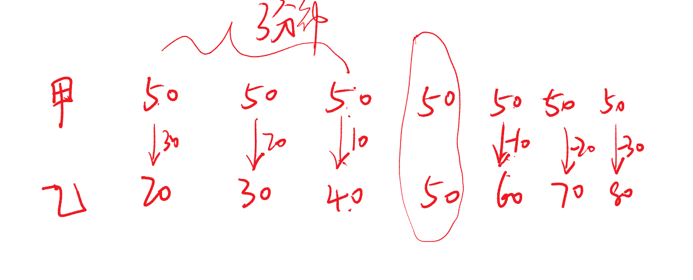

# Table of Contents

* [等差](#等差)
  * [基本公式介绍](#基本公式介绍)
  * [等差追击-对称性](#等差追击-对称性)
  * [等差数列求和估算思维及其应用](#等差数列求和估算思维及其应用)
  * [等差伸缩!!!](#等差伸缩)
  * [无限逼近原则-最不利](#无限逼近原则-最不利)
  * [练习](#练习)
  * [数列扩展](#数列扩展)
* [等比](#等比)


# 等差

**等差定义：**

一般地，如果一个数列从第二项起，每一项减去它的前一项所得的差都等于一个数，那么这个数列就是等差数列，这个数叫做等差数列的公差，公差通常用d来表示。

**题型识别：****后一项比前一项多d
“第三层及以上的住户，每层比下一层多交纳10元”；
每小时匀速变小
每日的供水量都比上一日多2万立方米”**


## 基本公式介绍

+ 第一反应 等差中项

+ 通项公式：an＝a1＋（n－1）×d

+ 通项公式：an＝am＋（n－m）×d  m等于1的时候，就是上个公式

+ an+am=a（n-k）+a（m+k）

  > 下标之和相等，数值之和一定相等

+ 求和公式：总和＝【（首项＋末项）÷2】×项数=**中间项**\*项数  【非常重要！！！！】

  > (n+1)/2
  >
  > 奇数：等差中项 整数
  >
  > 偶数: 等差中项为.5

+ 偶数的等差中项和前后相差【0.5项】


例题1：红旗汽车厂为生产汽车编号，依次为101，103，105，……，则编号为303的汽车是第（   ）辆。
A.101          
B.102   
C.103       
D.104

```
直接套公式
303=101+(n-1)2
n=102 
选B
```

例题2：有10个连续奇数，第一个数等于第十个数的5/11，则第一个数是（    ）
A.7                 
B.11                
C.15                 
D.12

```
e额。。 这不5因子直接秒了

```

例题3：【2024江苏】
已知 4 人的年龄总和为 142 岁，且他们的年龄恰好构成等差数列，若其中一人的年龄为 47 岁，则这 4 人中年龄最大的为：
A.62 岁
B.70 岁
C.80 岁
D.91 岁

```
142/4=35.5 等中
35.5 47 
0.5d=11.5  [这里等中和下一项是0.5的差距]
d=23
 47+23=70
```

例1：【2017四川】
电梯在竖直的矿井内匀速下降。王工程师对电梯开始下降后每分钟的海拔高度数值进行记录（将开始下降后第n分钟的读数记为an，海拔高度在0以下时记为负数），发现a5+a6>a7-a8， a5+a7<a8-a10，问电梯是在开始下降后的哪个时间段内降到海拔高度0以下的？
A.第6分钟之前
B.第6到第7分钟
C.第7到第8分钟
D.第8分钟之后

```
题目明细告诉你 
5+6>7-8
4+7>7-8
4+8>0
2a6>0
同理 a7<0  选B
```

例题1：办公室小李发现写字台上的台历就没有翻了，就一次翻了7张，这些台历的日期数加起来恰好是77，请问这一天是几号：
A.14
B.15
C.16
D.17

```
翻了7页 当前天 不包含当前页数
77/7=11 可以被整数 说明没有跨月
11+4 注意是加4 
11是7的等差中项 
```

例题3：【2022 青海】
某市对下辖9个文艺表演团体去年新创节目的数量进行统计分析，发现9个团体新创节目的数量恰好成等差数列，其中前5个团体的新创节目总数是60，前7个团体的新创节目总数是70。那么这9个文艺表演团体去年新创节目的总数是：
A.72
B.76
C.78
D.80

```
直接套公式 
项数=9 9因子 选A
```

例题4：【2021 联考】
送奶工人给11楼住户送牛奶，由于小区停电导致电梯无法使用。如果他走楼梯从第1层到第2层需要5秒，以后每多走一层需多花2秒，其中走到5层以后每多走一层需多休息5秒，那么他走到11层需要多少秒？
A.210
B.215
C.220
D.235

```
走楼梯是间隔 ，最后一层不休息 

走楼梯花的时间 1-11层 有10个间隔 a1=5 a10=5+9*2=23  总量为 23+5=28/2=14*10=140 【等中*项数】
休息了多久 5-11 5个个间隔 15*5=75
140+75=215
```

例题5：【2017 联考】
有一根9节的竹子，其任意节与相邻节的长度成等差数列，上面4节的长度共3尺，下面3节的长度共4尺，则从上到下第6节的长度为多少尺？
A.66/65
B.65/66
C.33/37
D.37/33

```
上面4节的长度共3尺 a2.5=3/4
下面3节的长度共4尺 a8=4/3
a8=a2.5+5.5*d
求出等差中项 d=7/66
a6=a2.5+3.5d 分母是33 选D
```

例题6：【2020国考】
某种糖果的进价为12元/千克，现购进这种糖果若干千克，每天销售10千克，且从第二天起每天都比前一天降价2元/千克。已知以6元/千克的价格销售的那天正好卖完最后10千克，且总销售额是总进货成本的2倍。问总共进了多少千克这种糖果？
A.180        　　
B.190         　　
C.160         　　
D.170

```
且总销售额是总进货成本的2倍
这句话告诉我们 平均售价=2平均进价  进价是不会变的，售价是等差数列，那么24就是售价的等差中项
?  24  6
24 6 是公差为2 间隔为9 项目为10 同理前面也是间隔9 那就是19个项数，
每天10千克 19*10=190
```

例题7：【2020国考】
某种产品每箱48个。小李制作这种产品，第1天制作了1个，以后每天都比前一天多制作1个。X天后总共制作了整数箱产品。问X的最小值在以下哪个范围内？
A.不到20 　　   
B.在20～40之间       
C.在41～60之间  　　
D.超过60

```
等差数列和
x (x+1)=48n*2=96n 问x的取值范围
       = 3*32*N   
       因子拆解后，会发现 n=11符合要求
x(x+1) 是奇数偶数交替出现的自然数
```

例题8：【2024国考】
甲乙两条生产线同一天开始生产某种产品，甲每天比前一天多生产 m 件，乙每天比前一天少生产2m件，第 5 天两条生产线的当日产量相同，且前 5 天乙的累计产量是甲的2倍。问第一天乙的产量是甲的多少倍？
A.6
B.7
C.4
D.5

```
第一句话 2个都是等差数列
看到等差第一反应就是等差项
且前 5 天乙的累计产量是甲的2倍   A3乙=2 A3甲
等差中项： 乙:甲=1:2  差值一份
第 5 天两条生产线的当日产量相同  a5+2m  a5-4m 差值为6 
乙：甲=6m：12m
倒推到第一天就是 4m 16m 选C
```

例题9：【2022 广东】
如图，仓库有一堆管材，每一层的数量都比上一层多 1 根。搬运工人将管材逐根 搬离，搬了99 根后发现，管材堆少了 3 层，且剩余每层的管材数量都减少了 3 根。如果这堆管材刚好还剩 10 层，则剩下的管材共有 ( ) 根。
A.245
B.265
C.305
D.325

```
问法突破
99+答案=13的倍数 
/3....1
答案是 265/3..1 选B
```

就题论题

连续自然数是奇数偶数交替进行


## 等差追击-对称性

+ 匀加速问题，一般就是用等差中项，也就是平均速度来代替。
+ 等差问题，一般就是看什么时候追上。
+ 一个均速一个匀加速



```
以追上为对称轴，对称轴这个不参与计算
7分钟后 甲乙路程相等

```

例题1：【2023国考】
甲和乙两人8：00同时从A地出发前往B地，其中乙全程匀速，甲出发时的速度是乙的一半，但全程均匀加速。已知10：00甲追上乙，11：00甲到达B地。问乙什么时间到达B地？
A.11：30
B.11：45
C.12：00
D.12：15

```
      8   9   10   11
V乙   1   1    1   1
V甲  1/2  1   3/2  4/2  
9点追上，10点中路程相等， 10-11距离相等，时间和速度成反比
V甲的平均速度=3.5/2=1.75
V=1：1.75=7:4
t=4：7

1f=15 差值3f =11点+45 选B
------ 为什么取平均速度，因为10-11点乙的速度一直在变化，只能取平均速度。
```

例题1：【2021联考】
小张和小李负责生产1200个零件，小张每天均生产20个。小李第一天生产10个，往后除最后一天外，每一天的产量都比前一天多1个。问整个任务中小张生产的个数比小李：
A.多40个
B.多80个
C.少40个
D.少80个

```
经过9天 
10天后相等，21天后总量相等----这里好好体会下
-------------------------------
第一天10 经过10天，也就是第11天到达20  20=10+(n-1)*2 n=11
对称轴是11 左边10 右边10 那就是21天的时候总量相等

21*2*20=840

张：20 20 20 20   
李：31  32       对称完后，速度是20+10=30 22天速度就是31
大概就是7天左右【这里怎么来的？估算了每天50多 8天多 6天少】
小张7*20=140
360-140=220-140=80
```


## 等差数列求和估算思维及其应用

+ 一个等差数列，中间增加或者减少一项，对数据基本不影响

+ 从1开始的n个连续奇数的和是【N的平方】

  > 根据an=a1+(n-1)*d推导

+ 从2开始连续b个偶数之和 n*（n+1）

例题1：小华在练习自然数求和，从1开始，数着数着他发现自己重复数了一个数。在这种情况下，他将所数的全部数求平均，结果为7.4，请问他重复的那个数是：（ ）
A.2
B.6
C.8
D.10

```
1.一个等差数列，中间增加或者减少一项，对数据基本不影响
2.等差偶数 等差中肯定是.5
7.4最接近是7.5 那么项数就是 14项 
7.4*15-7.5*14=6

----
算出7.5后，7.4比原来小，说明重复的数，拉低了平均值。

```

例题2：王老师在黑板上写有从1开始的若干个连续的奇数，现在擦去其中一个奇数，剩下的奇数之和为1998。那么擦去的奇数是多少？
A.25         
B.26         
C.27        
D.28

```
答案+1998 平方数=
40^2 =1600 50^2=2500
45^2=利用快速计算 2025
选C
```


## 等差伸缩!!!

+ 几项合并，合并后的公差等于【合并项数的平方*原来的公差】

  >  1 2 3 4 5 6
  >
  > 6  15
  >
  > 原来公差为1 现在公差为9 就是9*1=9

+ 整体等差数列的，局部成等差

  > 这样有什么用？局部成等差的话，可以利用等差中项的因子特征进行做题

+ 也可以把原有合并的等差，拆解为一个一个等差

+ 那你要知道什么时候用这种伸缩技法，一般来讲就是题干中有两种单位，那么第一种单位可能是小单位，第二种单位呢，是有好几个小单位合在一起组成的单位，那么。如果是这种题型等差数列，我们一般会采用伸缩原理，就像这道题，题干中有天又有周，对吧？

某工厂引入新的生产技术，从2019年2月开始，每个月产量都比上个月高X件。已知2019年8月的产量是3月的1.5倍，11月生产了14.4万件产品。问工厂2020年上半年共生产了多少件产品？
A.108万
B.112.8万
C.116万
D.120万

```
2019年上半年 123 456 789 101112   整体成等差
告诉你11月 三项一合并 
101112 14.4*3=43.2 
公差是9x
-----------后面就不知道怎么做了
题目问的是2020年
2020 123 等于2019(101112)+9x
2020 345 等于 123+9x
上半年=9x+9x 一定是9的倍数 选A
```

例题 1：【2021 浙江】
某企业在“十二五”期间第一年的营业额比上一年增长了 1.5 亿元，且往后每年的 营业额增量都保持 1.5 亿元不变。已知该企业在“十四五”期间的营业额将是“十二五”和 “十三五”期间营业额之和的80%。问该企业在“十二五”到“十四五”期间的总营业额在 以下哪个范围内：
A.不到 300 亿元
B.300—330 亿元
C.330—360 亿元
D.超过 360 亿元

```
1.题目成等差 5年一合并 合并后等差为1.5*25=37.5
2.看到分数转换为份数，也就是4/5 总共是9份
12 13 14 总共是9份，且是奇数等差 那么中间项就是3份
2f   3f  4f
3f-2f=f=37.5
等差和=9f=37.5*9= 选C
```

例题 2：某公司原有甲乙丙三个部门，现决定从这三个部门中分别抽调 1/5,2/11,3/13 的人 成立丁部门。已知丁部门有 21 人，且抽调后丁， 甲，乙，丙四个部门的人数恰好依次构成 等差数列。问该公司一共有多少人？
A.89
B.92
C.102
D.108

```
整体成等差，局部也是等差
丁， 甲，乙，丙
把  甲，乙，丙 进行合并？为什么 因为是奇数项，有3因子
甲，乙，丙=3乙，乙原来是11份 现在是9份
总人数=21+9乙  21不是9的倍数 说明答案也不是9的倍数 且是3的倍数 
选C
```

例题 3：【2021 国考】
某工厂在做好防疫工作的前提下全面复工复产，复工后第 1 天的产能即恢复到停工 前日产能的 60%，复工后每生产 4 天，日产能都会比前 4 天的水平提高 1000 件/日。已知复 工 80 天后，总产量相当于停工前 88 天的产量，问复工后的总产量达到 100 万件是在复工后 的第几天？
A.54
B.56
C.58
D.60

```
4天拆成一天来看，听一遍完全不会做。
如果题干本身就是合并，就需要拆解等差数列
```


## 无限逼近原则-最不利

1. 特定对象求最值
   1. 尽可能大，就要以自己上限为基准
   2. 尽可能小，就要以自己下限为基准
2. 根据题目条件求最值
   1. 用x去消耗总人次，在消耗过程中，注意是否有溢出或者最小的情况
   2. 消耗人次和总人次
   3. 消耗人次大于总人次，需要从消耗人次取出来 【见数列扩展 跳舞】
   4. 消耗人次小于总人次，把总人次往消耗人次带


例题1：【2017江苏】
在一次竞标中，评标小组对参加竞标的公司进行评分，满分 120 分。按得分排名，前 5 名的平均分为 115 分，且得分是互不相同的整数，则第三名得分至少是：
A.112 分
B.113 分
C.115 分
D.116 分

```
1 2 3 4 5 总和是固定的。求第三名最少，其他人就要最多。
    x
第一名最大就是120 第二名最大就是119 x-1 x-2

    120+119+3x-3=575
    x=113
    如果有余数1，对于这题来说，只能加在x上， 加119会超120，加x后面，x就不是最小
    如果有余数2  x还是只能加1，如果加2 就超了上下限了【能够加在其他地方，就加在其他地方】
```

例题2：【2018山东】
某企业招聘一批新员工，有 65%的应聘者通过笔试，在面试环节有 20 人被淘汰，最 终录取的人数占总应聘人数的40%，企业将录取的新员工分成若干个小组进行业务培训，每 个小组的人数都不相同，每组至少 2 人， 问至多可以分成多少个组？
A.7
B.8
C.5
D.6

```

```

例题 3：【2018四川】
企业今年从全国 6 所知名大学招聘了 500 名应届生，从其中任意2所大学招聘的 应届生数量均不相同。其中从 A 大学招聘的应届生数量最少且正好为B大学的一半。从 B 大学招聘的应届生数量为6所大学中最多的，则该企业今年从 A 大学至少招聘了多少名应届生？
A.48
B.47
C.46
D.45

```
x  .....  2x x最少，其他就最多
10x-15+x=500
x=46.9  这个余数不能放在其他人变量上， 只能放在本身，
加在2x 其他都要变
那就是47
```

例题4：在阳光明媚的一天下午，甲、乙、丙、丁四人给100盆花浇水，已知甲浇了30盆， 乙浇了75盆，丙浇了80盆，丁浇了90盆，请问：恰好被3个人浇过的花最少有多少盆？
A.10
B.12
C.15
D.20

```
为什么第一次放2个人的时候，不考虑30 这个变量呢
反而在第二次在放2个，也就是4个的时候，要考虑30这个变量了。第二次考虑我理解是甲只浇了30盆，所以75/2=37 甲的一部分是不能算在4个人里面的
答：2个人浇过的花，这两个人不一定有甲  但是4个人浇的花就一定有甲 

溢出的情况：看最小的
3个人浇的少，2个人和4个人最多。

30+75+80+90=275 没必要从1个人算，肯定是2个人或者4个人

100*2=200 275-200=75 100盆花2个浇会消耗200人次，还剩下75人次，要使
3个人浇花最少，那就是4个人最多，每个花在放2个人，75/2=37.5
但是题目限制了，甲只能30盆，那么4个人浇最大就是30*2=60,还有15个人次 只能放在1次花上，就是3次浇花。

-----2024.5.29补充
要想3个人最多，首先肯定是被2个人浇过，然后4个人最少，4个人的时候，题目4个人必然都会用到，需要看最少的浇花了多少，算极限4个人，
```


例题5：在阳光明媚的一天下午，甲、乙、丙、丁四人给100盆花浇水，已知甲浇了30盆， 乙浇了75盆，丙浇了80盆，丁浇了90盆，请问：恰好被1个人浇过的花最多有多少盆？
A.10
B.20
C.22
D.27

```
这题跟上相反，问最多1个人浇花有多少，那就要把人次分给其他花，
4次=30*4=120  30盆
3次 45*3=135   45盆
2次 270-
---- 这也算 好像有重复

先给每个花，分一个人  100 275-100=175
最多1个人浇花有多少，那就要把人次分给其他花
在分3个人，甲30  也就是 175-90=   85
再分2给个人   85/2=42 
再分给1个次   在分给一个人

100-30-42-1=27人
----------------补充
1个人浇花做多，假设是就是100盆，但是会剩下一些人次，那么就需要将这些人次转移到其他花上，变成4个人最少，3个人最少的极限值，最终就是1人次的最多。

```


## 练习

12.一个班里有30名学生，有23人会跳拉丁舞，有18人会跳肚皮舞，有25人会跳芭蕾舞。问至多有几人会跳两种舞蹈？ A.20 B.22 C.24 D.26

16.工厂从某周第一天开始生产某种零件，每周生产 7 天，从第二天开始每一天都比前一天多生产 200 件。已知工厂第三周的产量是第一周的 2 倍，问第几天其日产量第一次达到 1 万件？  A.37  B.38  C.39  D.40

15.某水果种植特色镇创办水果加工厂，从去年年初开始通过电商平台销售桃汁、橙汁两种  产品。从去年2月开始，每个月桃汁的销量都比上个月多5000盒，橙汁的销量都比上个月多2000盒。已知去年第一季度桃汁的总销量比橙汁少 4.5万盒，则去年桃汁的销量比橙汁：【2022国考】  A.少不到5万盒  B.少 5 万盒以上  C.多不到 5 万盒  D.多 5 万盒以上

11.在连续奇数1，3，…，205，207中选取N个不同数，使得它们的和为2359，那么N的最大值是:  A. 47 B. 48 C. 50 D. 51

```
这题注意，题目只是说选几个，没说是连续，所以不能代入公式

2359 是奇数，只能是奇数项 排除BC
代入D试试 51*51=2500多
选A
```

9.某单位2011年招聘了65名毕业生，拟分配到该单位的7个不同部门。假设行政部门分得的毕业生人数比其他部门都多，问行政部门分得的毕业生人数至少为多少名(    ) A.10 B.11 C.12 D.13

## 数列扩展

某公司2017年每个月的销售额都比上个月高x万元。其9月的销售额是1月的2倍，11月的销售额为900万元。问该公司2017年全年的销售额是多少万元?
A.7200
B.7650
C.8100
D.8550

```
等差伸缩  等差中项
11月是10 11 12 的倍数 第四季度为 2700

123  456 789  101112  伸缩后公差为9x
456=2(一二)
2700+27x 答案一定是27倍数
```

论文集中收录了一篇十多页的论文，其所在各页的所有页码之和为1023，问这篇论文之后的一篇论文是从第几页开始的？
A. 94
B. 99
C. 102
D. 109

```
题型识别：等差 翻页问题
S=A中*项
1023=3*341=3*11*31
那就只能是11页 A中等于93  11页  中为6 差5 
93+5=98  问这篇论文之后的一篇论文是从第几页开始的 选B
```

小李家住在一个小胡同里，各家门牌号从1开始按顺序排列。已知胡同里各家门牌号之和减去小李家门牌号等于85，则小李家门牌号是
A. 5
B. 6
C. 7
D. 8

```

```
某书的页码是从1开始的连续自然数，1，2，3，4，......莎莎将该书页码全部相加时，不小心将其中某页码多加了1次，结果和为2003，则被多加的页码为（ ）
A.45
B.50
C.56
D.62

```
题型识别：多了一次 等差估算
设n
n(n+1)=4006
n=62 左右 
代入62计算 62*63 /2=1953 
2003-1953=50 选B
```
阅览室有100本杂志，小赵借阅过其中75本，小王借阅过70本，小刘借阅过60本，则三人共同借阅过的杂志最少有（  ）本。
A.5             
B.10              
C.15             
D.30

```
三人共同结果最少，那就是2本或者1本最多  总人次 75+70+60=205
一本：100 还有 105人次  
在放一本：100  剩余5人次
剩下人次的只能放三本 就是 5人次 选A
-- 

```
某软件公司对旗下甲、乙、丙、丁四款手机软件进行使用情况调查，在接受调查的1000 人中，有 68%的人使用过甲软件，有 87%的人使用过乙软件，有 75%的人使用过丙软件，有 82%的人使用过丁软件。那么，在这 1000 人中，使用过全部四款手机软件的至少有( )人。
A.120
B.250
C.380
D.430

```
680 870 750 820 总人次=3120人次
使用过全部四款手机软件的至少有，那么其他就是最多
3款都用：3000  120还有120个人次
给第四款 直接选A
```
某公司共有60人参加行业考试，考试共设5道必答题，满分为100分，每题答对得20分，答错不扣分，总分60分即为合格。经统计，第1至5题分别有52人、56人、48人、42人、30人答对，则该公司至少有（   ）人及格。
A.30
B.36
C.38
D.39

【这题很经典 如果换成答对，难度就下降了】

```
公司至少有（   ）人及格，那就0个人及格 
总答对人次是 52 +56+48+42+30 =228 【为什么找答对人次？】
都不及格 每人对2道 消耗了 120次 剩余 108 
在给3道题  108/3=36 这个时候有没有溢出？ [为什么在给3 因为要想不及格多，那就是把人次全部都给答对的]
这个时候有溢出的，最小为30  30*3=90 剩下 18个人次 
继续放2  可以放9个  这9个也是及格的  【为什么不放3了，因为5个人都对的情况已经消耗完了】


---- 这里是不是可以看出来，人次后面的就是，就是要消耗人次的属性。

```

一个班里有30名学生，有12人会跳拉丁舞，有8人会跳肚皮舞，有10人会跳芭蕾舞。 问至多有几人会跳两种舞蹈？ 
Ａ.12人 
Ｂ.14人 
Ｃ.15人 
Ｄ.16人

```
问至多有几人会跳两种舞蹈？ 那就是其他最少  总人次是30
先给1 发现不对，那就所有都是2中 1中为0  选C
--------------
最多就是30人都会2种舞蹈
30*2=60人次 但是总人次只有30，没法消耗这么多。反而要从60人次种拿出30人次
最多能拿多少？可以拿出2个，这样就是30/2=15 [为什么是2个？因为可以一种舞蹈都不会]
```

一个班里有30名学生，有18人会跳拉丁舞，有8人会跳肚皮舞，有9人会跳芭蕾舞。 问至多有几人会跳两种舞蹈？

```
18+8+9=35
先都给2  35/2=17  多1个， 那就是17个 
----
先给2 需要60 但是只有35 拿出25 25/2=12..1 就是13 30-13=17人次
```

一个班里有30名学生，有23人会跳拉丁舞，有18人会跳肚皮舞，有25人会跳芭蕾舞。问至多有几人会跳两种舞蹈？
A.20
B.22
C.24
D.26

```
总人次 23+18+25=66
先全部给2  30人*2= 60 剩余6 只能在分
再给1   6个  【为什么只能加1 因为只有三种舞蹈】
30-6=24
```

某地 10 户贫困农户共申请扶贫小额信贷 25 万元已知每人申请金额都是 1000 元的整数倍，申请金额最高的农户申请金额不超过申请金额最低农户的 2 倍，且任意 2 户农户的申请金额都不相同问申请金额最低的农户最少可能申请多少万元信贷？
A.1.5 
B.1.6 
C.1.7 
D.1.8

```
最低 x 最大2x x最小 其他最大。题目告诉不同，如果没告诉 都可以为2x
2x 2x-0.1 2x-0.2 .。。。。。 x
18x-0.36+x=25
x=1.5.。。
余数只能加在x上？【其他数据都是联动的】 取1.6 选b
```

有30名学生，参加一次满分为100分的考试，已知该次考试的平均分是85分，问不及格（小于60分）的学生最多有几人？（   ）
A.9人      
B.10人           
C.11人       
D.12人

```
最多就是全部不及格
30*59=  1770 总共是30*85 说明还要继续消耗人次 剩余30(85-59)=780
全都都给100分 那就是每个人在给41  780/41=19.多 就是20 

30-20=10人 选B

```

共有100个人参加某公司的招聘考试，考试内容共有5道题，1－5题分别有80人、92 人、86人、78人和74人答对，答对了3道和3道以上的人员能通过考试，请问至少有多少人能通过考试？ 
A.30 
B.55 
C.70 
D.74

```
那就是没有人通过考试，所有人答对2道 总人次 80+92+86+74=332+78=410
每个人先给2道 100*2=200   剩余 210人次
全部都给5道，每人再给3道
210/3=70 这个时候没有溢出情况 直接选C


```

共有100个人参加某公司的招聘考试，考试内容共有5道题，1－5题分别有80人，92人，98人，90人和50人答对，答对了3道和3道以上的人员能通过考试，请问至少有多少人能通过考试：
A30  B55
C70  D80

# 等比

+ 即成等差和等比的就是常数列

```
 2 4 6 8 10 
 D=2
 an=a*d (n-1)次方 
 Sn=
```

例题 1：某公司计划通过四周的市场活动为其官方微博拉动人气。第一周该公司微博的关注 人数增加了 300 人，往后三周每周的关注人数增量都是上一周增量的两倍。活动结束时该公 司微博的关注人数是活动之前的 4 倍。则该公司活动前微博的关注人数是多少？ 
A.1200 
B.1500 
C.1800 
D.2100

```
 300 600 1200 2400 加起来除以4 
 4500/4=B 【这里直接除以4 为什么不行？ 没搞懂】
 -----------
 这里4500是增量
 4：1  差值3份  3
```

例题 2：某位党员同志制定了个人“新时代 e 支部”学习目标：每天学习时长都比前一天增 加 50%。如果他第一天学习时长是 16 分钟，第 5 天他的学习时长是：（   ）
 A.27 分钟 
B.54 分钟 
C.81 分钟 
D.100 分钟

```
简单题 直接做
16 24 36 54 81选C
```

例题 3：某游戏击中一次加 1 分，如果连续击中，从第二次击中开始是前一次得分的 2 倍。 小明在游戏中共得到了 74 分，那么他最多连续击中____次。 
A.4 
B.5 
C.6 
D.7

```
1 2 4 8 16 32 64  不可能是7次 最多只能6次
```
例题 4：红星中学高二年级在本次期末考试中竞争激烈，年级前 7 名的三科（语文、数学、 英语）平均成绩构成公差为 1 的等差数列；第 7、8、9 名的平均成绩既构成等差数列，又构 成等比数列。张龙位列第 10，与第 9 名相差 1 分；张龙的英语成绩为 121 分，但老师登记 为 112 分。问张龙本应排在第几名? 
A.4 
B.5 
C.7 
D.8

```
112 121 差9份 平均分差3分
  5 6 789 10
  那就是第五名 选B
```
【2019上半年全国联考C】
某高校组织新生军训。已知学生的总人数是能被5整除的4位数，千位和个位相同，百位和十位相同。已知学生将被分成人数相同且小于150人的35个组，那么每组有多少学生？（   )
A.132
B.143
C.145
D.147

```

千位和个位相同，百位和十位相同  11倍数
 11 和5的倍数 且尾数不能是0 只能选B
```
【2019下半年全国联考D】
甲、乙、丙三人参加跳水训练，某日三人分别训练了x、y、z次，且x/z＝z/y＝n（n为整数）。已知三人共计训练70次，问乙当日训练了多少次？
A.10
B.8
C.14
D.12
```
z=yn
x=zn=n^2y
x+y+x=y(n^2+n+1)=70 
里面有7因子 代入A符合

```
例题5：【2020下半年全国联考】
一堆棋子中，黑棋子的数量是白棋子的4倍。从这堆棋子中每次取出黑棋子6颗，白棋子4颗，当黑棋子剩42颗时，白棋子还剩3颗。问这堆棋子中黑棋子比白棋子多多少颗？
A.30 
B.35 
C.40 
D.45 

```
问这堆棋子中黑棋子比白棋子多多少颗？

a=4b
a-b=3b 3倍数排除AC 
总数10n+45=a+b
选D
--------------
2n+39 每次多2n
------
4:1        ------比值
16n( 6n):4n-------真实值
14f（4f） 1f ------比值

10f=10n     14f=42   n=3

3*2+39=45


```

