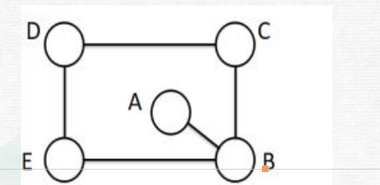

# Table of Contents

* [计数原理](#计数原理)
* [排列与组合](#排列与组合)
* [特优法](#特优法)
  * [特优分类 (48)](#特优分类-48)
  * [组不同](#组不同)
* [捆绑法](#捆绑法)
* [插空法](#插空法)


# 计数原理

+ 加法原理-分类

> 每种情况都能单独完成一件事情
>
> 或 来理解 

+ 乘法原理-分步

  > 不能独立完成一件事，就需要用乘法

+ Cnn=1  Cnm=Cn n-m

 分类用加法，分步用乘法

+ 排列组合是一个计数工具，只是帮助更好算出数值

```
1.从6个人里面选3个人来跑步，有几种方法。
C63 
6*5*4
----  
3*2*1  分母从小的开始*到1

2.从6个人里面选3个人出来->C63
3.从6个人里面选3个人出来排队，有几种方法。
先把3个人选出来， 在去排队.排队是有顺序
C63*A33
我们会发现，约分后就是A63
6A3=6*5*4  小数有几项 就乘以几项
```

+ 如何判断有没有顺序

   假设有顺序，看有没有影响。
   
+ 人坐椅子模型

   >1. 分类还是分步
   >
   >2. 数量少的当椅子，椅子摆好就不能动，用人来决定顺序，椅子需要不同
   >
   >3. 每把椅子都需要人做 
   >
   >4. .把人选出来 按在椅子上 
   >
   >   借用
   >   这个椅子就是简化过程，找好椅子也就不需要再次排列了，只把组合做好就行了！一招鲜吃遍天，鸿哥的东西要吃透，基本要把以前的观念全部打碎
   >


# 排列与组合

例题 1：一条铁路线上共有 18 个站点（包括两端的站点），请问需设计多少种不同的票价？

```
首先看票价跟顺序是否有关？顺序不影响结果 
江苏-浙江 票价是一样的，不管谁到谁
没有关系那就直接18C2
```


例题 2：一条铁路线上共有 18 个站点（包括两端的站点），请问需设计多少种不同的车票？

```
问的是车票，A-B B-A 顺序不同是影响结果的
18A2

先选站点，在排序
18C2 2A2
```

例题 1：有颜色不同的四盏灯，每次使用一盏、两盏、三盏或四盏，并按一定的次序挂在灯杆上表示信号，问共可表示多少种不同的信号？ 
A.24 种 
B.48 种 
C.64 种 
D.72 种

```
或 表示是分类 那就是加法
按一定的次序 说了要按照顺序
4A1 + 4A2+4A3+4A4

```

例题2：【2017浙江】
某公司销售部拟派3名销售主管和6名销售人员前往3座城市进行市场调研，每座城市 派销售主管1名，销售人员2名。那么，不同的人员派遣方案有（）种：
A.540 
B.1080 
C.1620 
D.3240

```
人坐椅子模型
前提条件：椅子固定不动 
1.数量少的当椅子
2.顺序体现在哪里？人的顺序

 A           B           C  【椅子先固定，就是一个参照系，保证不重复，一换就会有重复 】
3C1 6C2 *   2C1 4C2  *  1C1 2C2          【完成一件事情，是分步】

椅子摆好就不能动
```
例题 3：【2019 广东】
小李今天上午有 A、B、C、D 这 4 项工作要完成，下午有 e、f、g 这 3 项工作要完 成，每半天内各项工作的顺序可以随意调整，则他今天有（ ）种完成工作的顺序。 
A.30 
B.60 
C.72 
D.144

```
今天 说明是分步完成一件事情 
把上午和下午看作是椅子

4A4*3A3 =24*6=144
```
例题 4：【2018 浙江】 
某班共有 8 名战士，现在从中挑出 4 人平均分成两个战斗小组分别参加射击和格斗考核，问共有多少种不同的方案？
A.210 
B.420 
C.630 
D.840

```
分别射击和格斗 是分步
射击和格斗作为椅子
挑除4个人 没说有顺序

8C4*4C4=

-----这里有坑 4个人平均分成2个小组 每个小组2个人
8C2*6C2=
```
例题 5：【2020 广东】
某单位的两个部门计划订阅报纸。每个部门需要在指定的 5 种报纸中选择其中的 3种，且这两个部门在选择时应做好沟通，做到 5 种报纸都有部门订阅，则订阅报纸的方案共有（ ）种。
A.20
B.30
C.60
D.100

```
两个部门计划订阅报纸 ，那就是分步
没说不能重复，也就是有一个报纸都选了
部门是椅子

先从5个里面选一个公共的的，剩下4个再分。
5C1*4C2*2C2=30
-------------
5C3     先从5个里面选3个
3C1*2C2 再从甲的3中选一个 
 也是30 
```

例题 6：【2020 安徽】
某公司现有 6 箱不同的水果，安排三个配送员送到 A、B、C 三个不同的仓储点，其中 A 地 1 箱，B 地 2 箱，C 地 3 箱，问配送方式有：
A.60 种
B.180 种
C.360 种
D.420 种

```
问配送方式 分步
把水果安排给仓储点
仓储是椅子
    先选水果 在选人
A   6C1 3C1    18
B   5C2 2C1    20
C   3C3 1C1     1

18*20*1=360

```


# 特优法

+ 先让特殊的优先进行排列

+ 一般来说是从大数据到小数据，不容易漏 例题13

  

例题 7：【2017 四川】 
某交警大队的 16 名民警中，男性为 10 人，现要选 4 人进行夜间巡逻工作，要 求男性民警不得少于 2 名，问有多少种选人方法？
A.1605 
B.1520 
C.1071 
D.930

```
2男2女=10C2 *6C2
3男1女=10C3 * 6C1
4男0女=10C4 
进行相加 因为是分类，每个都可以独立完成任务

但是不是特优法吗？只能这么一个一个加？
按照男生特殊来先排列
```
例题 8：【2018 联考】 
某单位要从 9 名同学中选出 4 名同学去四个不同的乡镇甲、乙、丙、丁参加三下乡 活动，其中有两名同学不能去乡镇丁，则分配方案共有多少种？
A.2352 
B.2452 
C.2552 
D.2652

```
这题是有区别的，有限制条件
乡镇就是椅子，先让特殊的排
分步完成一件事
丁：2名不能去，是知道的， 7C1
甲：还剩下8个 8C1
乙 7C1
丙 6C1

7*8*7*6=
```
例题 9：【2021 联考】
随着人们生活水平的提高，汽车拥有量迅速增长，汽车牌照号码需要扩容。某地级 市交通管理部门出台了一种小型汽车牌照组成办法，每个汽车牌照后五位的要求必须是：前 三位为阿拉伯数字，后两位为两个不重复的英文字母（除 O、I 外），那么这种方法可以给 该地区汽车上牌照的数量为： 
A．397440 辆 
B．402400 辆 
C．552000 辆 
D．576000 辆

```
数字安排到车牌号上去
后面5位是椅子

0-9 数字
10*10*10*24*23
题目没说不可以重复 后面字母不可以重复
```
例题 10：【2018 广 州】
某部门开展年终评选工作，需从 11 名员工评选出一名优秀员工和两名积极员工， 且优秀员工与积极员工不能为同一人，则可能会出现的评选结果共有（ ）种。
A.495 
B.990 
C.1210 
D.1980

```
分步
优秀员工是椅子
优秀：11C1
积极：10C2

反过来也一样
积极：11C2
优秀：9C1
```

例题 12：【2020 联考】
某小学组织 6 个年级的学生外出参观包括 A 科技馆在内的 6 个科技馆，每个年级任选一个科技馆参观，则有且只有两个年级选择 A 科技馆的方案共有：
A.1800 种
B.18750 种
C.3800 种
D.9375 种

```
这个选谁当椅子呢？科技馆？ 
每个年级任选一个科技馆参观，会存在没选的情况
那么就是学生当椅子，因为学生是必须要去一个科技馆的
特优：只有两个年级选择 A 科技馆 反过来就是A先给2个年纪
问题来了，这2个年纪确定吗？ 不确定
6C2 
后面每个年级都可以选5个科技馆
6C2 *5*5*5*5*5=  尾数是5
```


## 特优分类 (48)

12.【2022联考】
某市举办世界遗产大会，开幕式会场需要从6组志愿者中选出4组分别从事防疫协助、嘉宾引导、英语翻译、物资发放四项不同的工作，其中甲、乙组不能从事英语翻译工作，丙组只能从事防疫协助工作，则派选方案有：
A.36种 
B.72种 
C.108种 
D.144种

```
丙组只能从事防疫协助工作，没说 防疫协助 只能让丙来做，意思是不一样的【理解错了 就做错了】
谁是椅子 工作是椅子 ，少且必须有人

       防  英   嘉宾  物资
有丙    1  3C1  4C1  3C1
 无丙的意思是 丙不做防疫
无丙   5c1 但是这个时候英语很难选，第一个人 到底包含甲乙不？
------------------用英语做特殊元素，更特殊
	  英  防     嘉宾  物资
有丙  3C1  1    4C1  3C1

无丙  3C1 4C1   3C1  2C1 [丙不做防疫，相当于从6个人中剔除了]
         因为英语选了，丙不能选 只有4个人了
         
36+72=108
-------- 还有一种不分类的情况
英： 3C1 {甲乙丙都不行}
嘉：4C1 [第一个和丙]
物：3C1 
防：3C1 最后3个人的话 随便一个都可以做
```

例题 11：【2021 山东】 
将 5 个相同的圆锥体零件表面涂上红、黄、蓝三种颜色。要求同一个零件的底面 只能用一种颜色，同一个零件的斜面也只能用一种颜色，且 5 个零件的颜色彼此不完全相同， 问总共有多少种不同的涂色方式： 
A．84 
B．126 
C．172 
D．180

```
面涂颜色 是颜色多还是面多
面做梯子 然后怎么做
猜题 5的倍数 选D
-------
一个圆锥体总共有多少涂法？
把颜色涂到面上，通俗表达
底面: 3C1 三种颜色
斜面：3C1 三种颜色
3*3=9 一个圆锥可以有9种涂法
9C5=126
```

例题 13：【2017国考】
小张需要在 5 个长度分别为 15 秒、53 秒、22 秒、47 秒、23 秒的视频片段中选取若干个，合成为一个长度在 80~90 秒之间的宣传视频。如果每个片段均需完整使用且最多使用一次，并且片段间没有空闲时段，问他按照要求可能做出多少个不同的视频（ ）
A.12
B.6
C.24
D.18

```
分类讨论最容易漏掉
一般来说是从大数据到小数据，不容易漏
1.53+【22 15 】  只有才满足
2.47+【23 15】【22 15】
3.23+ 没有搭配

3个片段合成一个视频，3A3=6种 但是每个内部都可以互相排
3个3A3相加就是 18 这里不容易就会错。。。
```

例题 14：【2019国考】
某单位要求职工参加 20 课时线上教育课程，其中政治理论 10 课时，专业技能 10课时。可供选择的政治理论课共 8 门，每门 2 课时；可供选择的专业技能课共 10 门，其中2 课时的有 5 门，1 课时的有 5 门。问可选择的课程组合共有多少种（ ）
A.5656
B.5600
C.1848
D.616

```
课程是椅子，政治和专业技能

政治的话8门选5个 8C5=56 倍数 AB选一个 选项偏移选B
----具体做法
专业10课时 5*2  2*3+4  4*2+2*1
【5C3*5C4 】*2 =100+1=101
101*56 尾数是6 选A

```


例题 16：【2018 联考】
五个图相连,总共有三个颜色,相相连的两个图形颜色不可以一样,问有多少种排列 的方法?
A.36 
B.72 
C.112 
D.144



```
先涂那个？3的倍数猜B
----


```

例题 17：【2021 联考】
A、B、C 三个社区需要建设若干个 5G 基站，三个社区可供选择的建设基站地点分 别有 2个、4 个、5 个，现从 A、B、C 三个社区分别选取 1、2、3 个地点随机分配给甲、乙、 丙三个施工队进行建设，要求每个施工队只能承接一个社区，则承建方式有： 
A.720 种 
B.480 种 
C.360 种 
D.120 种

```

```

例题 18：【2019 联考】 
正值毕业季，306 宿舍有 A、B、C、D 四位男同学，他们准备找班主任宋老师合影， 若要求宋老师坐正中间，A、B 两位同学不能挨着坐，那么总共有多少种坐法？
A.8 种 
B.12 种 
C.16 种 
D.24 种

```

```

## 组不同

例题 19：某单位组织志愿者参加公益活动，有 8 名员工报名，其中 2 名超过 50 岁。现 将他们分成 3 组，人数分别为 3、3、2，要求 2 名超过 50 岁的员工不在同组，则不同分 组的方案共有:
 A.120 种 
B.150 种 
C.160 种 
D.210 种

```
分类，判断50岁员工在哪一个组
这题组数是不存在椅子的。组与组之间是没有，椅子是不同的。
只是选出来，没有特殊性，有特殊的才是椅子

超过50岁的人当椅子 甲 乙 对组进行一个区分

2 3 3 排法 
甲 6C1
乙 5C2
剩下椅子
3 2 3 排法
甲 6C2
乙 4C1
剩下椅子
 3 3 2 
 6C2 4C2
 全部加起来 210种
 -----49讲补充
 人坐椅子，椅子一定要是不同的，
```


例题 21：【2020 广东】
县公安局计划举办篮球比赛，6 支报名参赛的队伍将平均分为上午组和下午组进行 小组赛。其中甲队与乙队来自同部门，不能分在同一组，则分组情况共有（）种可能。 
A.6 
B.8 
C.10 
D.12

```
这题就有区别了，这是不同的组
上午组和下午组

上午 2C1 *4C2 甲乙选一个，4个选一个
下午 

 2C1 *4C2 =12人
```


## 49补充-梯子必看

```
6个人 ABC三把椅子每个椅子一个人
6c1*5c1*4c1
什么时候可以直接分给椅子，每个椅子都是均衡。

6个人 分给三个班级 一个班级1个人 2 个人 3个人
1.先找类别
2.然后再把类别给椅子
```


奶奶有6颗口味各不相同的糖，现分给3个孙子，其中1人得1颗，1人得2颗，1人得3颗，则共有

多少种分法： 

A. 60 

B. 120 

C. 240 

D. 360

```


当椅子代表的东西不一样的时候，

比如说这椅子中第一个孙子能三颗糖，一个孙子一颗糖，一个孙子两颗糖

那这三个孙子三张椅子是不一样的，所以他们也是有顺序可以排


先分好三堆，在把三堆给椅子。

6C1*5C2=60 先分好三堆，在给椅子
60*3A3=60*6=360
```


# 捆绑法

```
4个人排队，甲乙一起，有几种排法？

先排丙丁，没有先后顺序 2A2
丙丁排序后，有3个空隙，然后选一个放进去 3C1
但是甲乙内部也可以排序 2A2
2A2* 3C1* 2A2

也可以捆绑到一起 变为3个人 直接3A3 在内部排序


```

```
做题步骤：
1.先把相邻对象做为一个对象和其他对象进行排列
2.注意相邻对象内部有无顺序
```


例题 1：由数字 1、2、3、4、5、6、7 组成无重复数字的七位数，求三个偶数必相邻的七位 数的个数。

```
 2 4 6 相邻就是放在一起
变成5个数 5A5 *3A3 
```

例题 3：【2017 联考】 
甲、乙、丙三所学校的学生被安排在周一至周五参观某革命纪念馆。纪念馆每天最多只能安排一所学校，其中甲学校连续参观两天，其余学校均只参观一天，那么共有多少种 安排方法？
A.12 种 
B.24 种 
C.36 种 
D.60 种
```
这里谁做椅子 应该是学校，把天数给学校
天数 甲的2天合为1天 总共是4天
把4天分给3个椅子
3A2*2= 12种【4C1*3C1*2C1=4*3*2=24 】

甲 4C1
乙 3C1
丙 2C1


=========== 不用椅子的做法
甲 乙 丙
从4天里面选3天 4A3
```

例题 2：【2017 云南】
某兴趣组有男女生各 5 名，他们都准备了表演节目。现在需要选出 4 名学生各自 表演 1 个节目，这 4 人中既要有男生、也要有女生，且不能由男生连续表演节目。那么， 不同的节目安 排有多少种（ ）
A.3600 
B.3000 
C.2400 
D.1200

```

```

例题 5：【2024联考】
某公司开展迎新春三分球投篮比赛。3个部门分别派出2、4、4个选手共计10人参加。规则要求同一个部门的选手顺序相连、全部投完再安排另一个部门的人员，则这10人不同的投篮顺序种数的范围是： 
A.小于1000 
B.1000~5000 
C.5001~10000 
D.10000以上 
```
3A3*2A2*4A4*4A4
正常做法，内部排序
```


例题 4：【2019 浙江】
小王想报名英语、计算机和会计三个培训班，要求每个培训班都在每周固定时间的 晚上上课，且一个晚上只能参加一个培训班。已知小王周一晚上需要值班，且他不希望一周 内连续两个晚上不上课也不值班，也不希望把英语和会计课程安排在连续两个晚上。问有几 种不同的安排方式？
A.12
B.20 
C.24 
D.36
```

```

例题 15：【2020国考】
扶贫干部某日需要走访村内 6 个贫困户甲、乙、丙、丁、戊和己。已知甲和乙的走访次序要相邻，丙要在丁之前走访，戊要在丙之前走访，己只能在第一个或最后一个走访。问走访顺序有多少种不同的安排方式？
A.24
B.16
C.48
D.32

```
  戊  丙  丁    甲乙捆绑 己只能在第一个和最后一个
先首位，在中间
己只能在第一个或最后一个走访  2C1
  己+ 除甲乙外 变成4个空 4C1内部 还要排序 2A2

2C1*4c1*2A2

```
某场学术论坛有6家企业作报告，其中A企业和B企业要求在相邻的时间内作报告，C企业作报告的时间必须在D企业之后，在E企业之前，F企业要求不能第一个，也不能最后一个作报告。如满足所有企业的要求，则报告的先后次序共有多少种不同的安排方式？ 

A.12   

B.24    

C.72    

D.144

```
Ab 捆绑  D C E   注意上面2题的区别 一个只能 一个不能
不能的话就不能先排了，因为你不知道哪里是第一个或者最后一个

DCE本身会产生3个空 4C1 放捆绑
AB 排列完后，产生了3个空，头尾F不能 
4C1*2A2 *3C1=24

```


例题3:四对情侣排成一队买演唱会门票，已知每对情侣必须排在一起，问共有多少种不同的排队顺序： 

A. 24种 

B. 96种 

C. 384种 

D. 40320种

```
4A4*每对内部都是可以排序 *2*2*2*2=
```


例题 20：【2022 江苏】
某企业举行职业技能大赛，3 个下属分公司均选 2 名员工参赛。若同一分公司的员 工比赛时出场顺序不能相邻，则参赛的 6 名员工不同的出场顺序共有： 
A.80 
B.120 
C.160 
D.240

```
要求不能相邻，没有特殊元素了，
人椅合一
```


# 插空 (49)

+ 不相邻就是插空
+ 先把不相邻对象之外的元素进行排列
+ 把不相邻的元素插入其他对象的空中，注意有无顺序

**例题 1：由数字 1、2、3、4、5、6、7 组成无重复数字的七位数，求三个偶数互不相邻的七 位数的个数。**

```
3个偶数不相邻，排其他对象
1 3 5 7 
1357 排 4A4
产生5个空 5A3
```


例题 2：小区内空着一排相邻的 8 个车位，现有 4 辆车随机停进车位，恰好没有连续空位的 停车方式共有多少种？ 

A.48 

B.120 

C.360 

D.1440

```
车辆4个车 4A4
形成5个空位 5C4 为什么不是A 因为空位自己没有顺序
24*5=120
----课后解析
不相邻的是空位，排其他对象，那就是车
车排序 4a4
会产生5个空 ，一共有8个空位，4辆车还有4个空位，从车产生的5个空位中，取4个
5C4 
----个人理解，都不懂题，如果把题目换成 恰好4个空位不相邻都好做。
```

例题 3：【2020 联考】

某学习平台的学习内容由观看视频、阅读文章、收藏分享、论坛交流、考试答题五 个部分组成。某学员要先后学完这五个部分，若观看视频和阅读文章不能连续进行，该学员 学习顺序的选择有： 

A.24 种 

B.72 种 

C.96 种 

D.120 种

```
先排其他三个 3A3
产生4个空 4A2
3A3*4A2=6*4*3=72
```

例题 4：【2017 联考】

某兴趣组有男女生各 5 名，他们都准备了表演节目。现在需要选出 4 名学生各自表 演 1 个节目，这 4 人中既要有男生,也要有女生，且不能由男生连续表演节目。那么，不同 的节目安排有多少种？ 

A.3600 

B.3000 

C.2400 

D.1200

```
题目没有给出明确女生人数，需要分类讨论
4个人 2+2 3+1
                     3个空
2女 2男 5C2 *5C2 *2A2*3A3

女生3 男生1 5C3*4A4

分类需要加 
```

例题 5：【2021 江苏】 难题 放弃

某单位开设 abcdef 等六门培训课程，员工自愿报名参加，经统计，员工选择的课 程组合共有四种，a+f，d+f，a+c+e，b+c+f，所有培训结束后，统一安排考试，为不影响工 作要求，在 1 月 4 日至 10 日中的连续六天考完，每天只考一门，且每位员工都不会连续两 天参加考试，则安排这六门课程考试日期的不同方法共有： 

A.2 种 

B.4 种 

C.8 种 

D.12 种

```

```

例题 6：【2018 广东】

某条道路一侧共有 20 盏路灯。为了节约用电，计划只打开其中的 10 盏。但为了不 影响行路安全，要求相邻的两盏路灯中至少有一盏是打开的，则共有（ ）种开灯方案。  

A.2 

B.6 

C.11 

D.13

```
先找不相邻，灭掉的 先排其他对象

10灯形成11个空， 选10个没掉的排进去

11C10 灯是一样的
```

## 逐步插空法


例题 7：一张节目表上原有3个节目，如果保持这3个节目的相对顺序不变，再添进去2个新节目，有多少种安排方法？

A.20    

B.12    

C.6    

D.4

```
4c1*2 =8 为什么没答案。。

-------------逐步插空法
3个  4个空   选一个节目加进去 4C1
产生了5个空 5C1

4C1*5C1=20
```


# 插板法

```
6个相同的苹果，分给3个不同的小朋友，没人至少分一个，有几种分法。
n=6
m=3

n个东西，他会形成n减一个空,就跟植树问题一样 

公式是C n -1,m -1

3个限定条件
1.相同苹果
2.不同小朋友
3.每人至少一个 【喜欢在这里改造】

插板法：插板呢？他只是一个工具一个媒介，
他不是一个具体的东西，就是用于把这一堆东
西切割分割出来

```

​	例题 1：有 10 个相同的篮球，分给 7 个班，每班至少一个，有多少种分配方案？ 

A.36 

B.64 

C.84 

D.210

```
直接带公式
9C7
```

例题 2：某城市一条道路上有 4 个十字路口，每个十字路口至少有一名交通协管员，现将 8 个协管员名额分配到这 4 个路口，则每个路口协管员名额的分配方案有：【2020 联考】 

A.35 种 

B.70 种 

C.96 种 

D.114 种
```
直接带公式
7c3
```


## **插板法变形1**

例题 1：把 20 台相同的电脑分给 8 个部门，每个部门至少 2 台，问共有几种分法？ 

A.165 

B.330 

C.792 

D.1485
```
违背第三个条件，转化下
每个部门至少 2 台-》先给每个部门一台
20-8=12
11C7=11C3=11*10*9/3*2=165
```

## **插板法变形2**


例题 2：将 7 个相同的苹果，分给 3 个小朋友，任意分，分完即可，有多少种不同分法？ 

A.2187 

B.343 

C.72 

D.36
```
这是固定的模型直接套就可以了，不要想太多
任意分->至少分2个 
先从小朋友借一个，7+3=10 ，还回去的时候，至多还一个，就可以套公式了。
9C2=36

```

## 插板法变形3

```
解题思路：
一定要先认识到分苹果，给别人跟别人分苹果给你是一回事，分进去跟拿出来是一回事， 
只是对象不一样，但是都是第一对应，相对而言的。 

就如六个人中，选三个人出来排队，要选出去人的方法跟留下人的方法是一样的，因为是相对应
相对而言的

--------但是要注意会有不满足情况的产生

```

例题3:将 10 个完全相同的球放到 3 个不同的盒子中，要求每个盒子至少放一个、至多放四 个球，一共有多少种方法？ 

A.3 

B.6 

C.12 

D.21

```
第一步，先极限分配到快要溢出的那个数最多的+1 则能够转化成至少分到一个给
我，以此来满足插板法的第三个条件
先给每个人5个球，总共15个，但是题目给了10个，那么就转化为了从5个对象里面至少拿一个

4C2


```

例题 3：甲、乙、丙 3 个单位订阅同一款报刊，已知 3 个单位共订了 12 份，其中，每个单 位订阅数量不少于 3 份，但不超过 5 份，则这 3 个单位的报刊订阅数量可能有（ ）种组合。 【2022 广东】 

A.2 

B.6 

C.7 

D.9
```
最大3*6=18-12=6

从ABC中拿6分，每个对象至少拿1分
5C2 这是总情况

A  B  C
6  6  6  
5  5  5 
每个单 位订阅数量不少于 3 份 ，如果都在A，A就不符合要求了。
10-3=7
```


某单位将11本《党员学习手册》分发给甲、乙.丙共3个党支部。已知甲支部至少分得3本，乙支部至少分得2本，丙支部至少分得4本，问一共有多少种不同的分配方式?()
```
15-11=4
3C2=
```