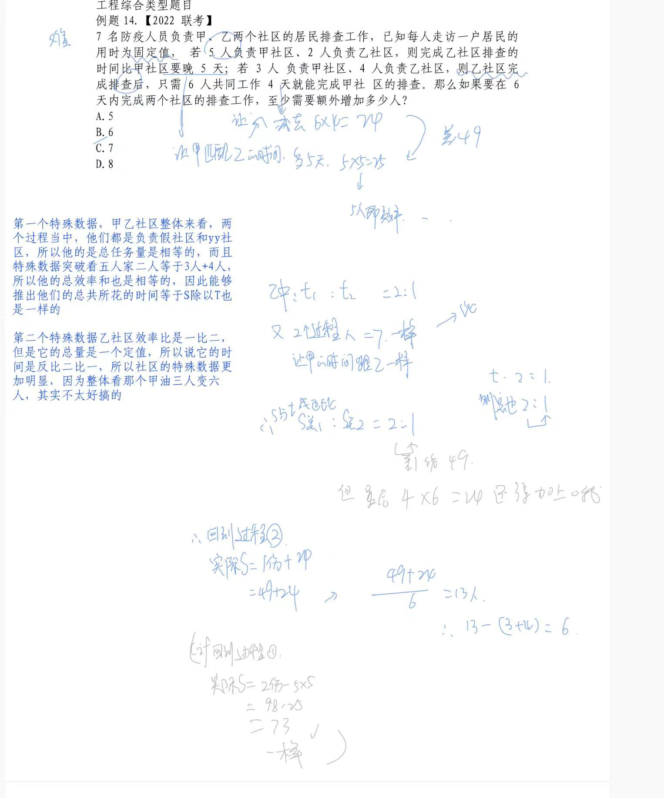

# Table of Contents

* [积定值](#积定值)
* [713](#713)
* [模型应用二：公式比例法之a=b*c](#模型应用二公式比例法之abc)
* [模型应用三：a=b*c模型之等比速解思维](#模型应用三abc模型之等比速解思维)
* [模型应用四：a=b*c模型之相对增减思维](#模型应用四abc模型之相对增减思维)
* [714](#714)
* [复习](#复习)
* [模型应用一：和定值份数比例思维](#模型应用一和定值份数比例思维)
* [模型应用二：十字交叉思维](#模型应用二十字交叉思维)
* [模型应用三：鸡兔同笼思维(7.15)](#模型应用三鸡兔同笼思维715)
* [单一工程考点](#单一工程考点)
  * [牛吃草](#牛吃草)
  * [份数考点](#份数考点)
  * [工程机动模型速解](#工程机动模型速解)
  * [工程主体分割思维速解](#工程主体分割思维速解)
  * [单人“缺席”考点速解(717)](#单人缺席考点速解717)
  * [工程“不移动”问题](#工程不移动问题)
  * [单对象盈亏 -重点](#单对象盈亏--重点)
  * [工程盈a亏b速解思维](#工程盈a亏b速解思维)
  * [特殊数据突破思维](#特殊数据突破思维)
* [工程合作 7.19](#工程合作-719)
  * [木桶范围估算思维](#木桶范围估算思维)
  * [归元同比例放缩](#归元同比例放缩)
  * [工程综合类型题目](#工程综合类型题目)


+ 题型识别：抓住不变的量
+ 局部比列会带来之前可能走过的数据

  


# 积定值

 

母题引入1：

某公司计划采购一批电脑，正好赶上促销期，电脑打9折出售，同样的预算可以比平时多买10台电脑。问该公司的预算在平时能买多少台电脑？  

A.60   

B.70   

C.80   

D.90

```
总金额=台数*单价
单价 10：9
数量 9:10 1f=10
9f=90 
```


母题引入2：

某植树队计划种植一批行道树，若每天多种25%，可提前9天完工，若种植4000棵树之后每天多种1/3，可提前5天完工，问共有（   ）棵树。

A.3600   

B.7200   

C.5400   

D.9800

```
V=4:5
t=5:4 1f=9  45 36  459 倍数 且后面大于4000 排除AD

局部比例，对变化的做处理
V=3:4
t=4：3 1f=5   20 15 
   4000
A-----C--------B

2000/25=80*2

80*2*45=7200
```

<div STYLE="page-break-after: always;"></div>

例题1:【2023广东】

某印刷厂原计划用全自动装订机花费4小时装订一批文件，但在还剩300份文件时装订机出现故障，无法装订。印刷厂立即安排了部分员工进行人工装订，由于人工装订的总效率仅为机器的20%，最终比原计划排迟1小时完成装订。则这批文件共有（  ）份。 

A.2400 

B.3600 

C.4800 

D.6000

```
局部比例
V=5:1
t=1:5 时间差都是最后导致的，4f=60 f=15
15->300
60->1200
1200*4=4800
```

例题2:【2024国考】

甲、乙分别从一个环形跑道的 A、B 两点同时出发，分别以顺时针、逆时针方向匀速跑步，甲跑 15 秒后与乙相遇，又跑了 20 秒后到达 B 点，又跑了 45 秒后回到 A点，问此时乙还要跑多久才能再次回到 B 点（   ）。 

A.40 秒 

B.50 秒 

C.20 秒 

D.30 秒

```
速度比3：4时间比4：3，甲一个全程80，乙一个全程60，所以这时候乙应该是跑了一个全程多20分钟，还需要再跑40分钟才能回到起点
```


<div STYLE="page-break-after: always;"></div>

例题3:【2023北京市考】

从A地到B地是下坡路，一辆车从A地开往B地需要三小时，从B地开往A地需要四小时。已知这辆车下坡速度比上坡速度快15千米/小时，则A、B两地之间的距离是多少千米？ 

A.120 

B.180 

C.240 

D.300

```
3：4
4：3 1f=15
4f=60*3=180
```

例题4:【2024江苏】

某银行引进机器人提高服务效率。某岗位小张、小邓和小曹完结一单任务分别需要 6 分钟、5 分钟和 4 分钟，3 个人一天最多可完结 259 单。机器人处理一单仅需 2 分钟，处理工单中的 80%可正常完结，剩余的 20%仍需人工重新办理。若某天小张出差，则当天小邓、小曹和机器人（机器人与人的工作时间相同）最多可完结的工单总量为：

A.357 单

B.370 单

C.430 单

D.459 单

```
这题很好奇 怎么比列做，之前都是因子做
t=6：5：4
V=10:12:15
259/37=7 每f都有7因子

比例法就是讲份数再分给机器人，单独求出来，在累加。
```


<div STYLE="page-break-after: always;"></div>

例题5:【2023国考】

商店销售某种商品，打八折销售时卖2件的利润与按定价销售时卖1件的利润相同，相当于降价120元/件销售时卖3件的利润。问该商品的定价为多少元/件？ 

A.360 

B.450 

C.540 

D.720

```
总利润相等
件数=2；1;3
利润=3：6：2
单个利润降低120 6-2=4f=120 【降价120实在定价的基础上】
6f=180 也就是利润180
再看打八折  3f=90
2折->90
10折->450
```

例题6:【20221四川】

小王每天以v千米/小时的速度骑车到单位上班，如果速度提高20%，则可以提前10分钟到单位；如果以原速度骑行2千米后再提速30%，也可以提前10分钟到达。问小王家距离单位多少千米？

A.5.4 

B.7.2 

C.8.5 

D.9.6

```
这题就恶心点 数字不是整除的，这里要注意保留份数，
后面是会约掉的

2-100/3=50/3
2/(50/3)*60=7.2
```


<div STYLE="page-break-after: always;"></div>

例题7.【2018 江苏】

某新建农庄有一项绿化工程，交给甲、乙、丙、丁 4 人合作完成。已知 4 人的工作效率之比 为3：5：4：6，甲乙合作完成所需时间比丙丁合作多 9 天，则 4 人合作完成工程所需时间 是

A.17 天 

B.18 天 

C.19 天 

D.20 天

```
V=8：10
t=10:8 =5:4
1f=9  45 36

45*4=180  这个就是总工作量
180/9=20天
```

例题8.【2020 联考】 

某医疗器械公司为完成一批口罩订单生产任务，先期投产了 A 和 B 两条生产线，A 和 B 的工作效率之比是 2: 3，计划 8 天可完成订单生产任务。两天后公司又投产了生产线 C， A 和 C 的工作效率之比为 2: 1。问该批口罩订单任务将提前几天完成? 

A.1 

B.2 

C.3 

D.4

```
简单题 直接做
V=5:6
t=6:5 注意是2天后
6f->6
8-2-5=1
```


<div STYLE="page-break-after: always;"></div>

例题9.【2021 山东】 

某种商品有小箱和大箱两种包装，一大箱这种商品有 400 件，张和王同时开始制造这种商品， 制造一小箱和一大箱这种商品后，张比王多做 50 件。如果王此时的效率提高 100%，并与张 再共同制造一大箱这种商品，则王制造的总件数比张多 50 件。问一小箱这种商品有多少件？ 

A.50 

B.100 

C.150 

D.200

```
最开始张比王多500 后面王比张多50 总的 
说明后面王比张多100 总共400
250 150
S=5:3
V=3:5
降低效率后
V=2.5:3=5:6 1f=50 11f=550 -400=150
```

 <div STYLE="page-break-after: always;"></div>
#  713

#  模型应用二：公式比例法之a=b*c

母题：

2010年某种货物的进口价格是 15 元/公斤，2011 年该货物的进口量增加了一半，进口金额增加了20%。问2011年该货物的进口价格是多少元/公斤？

A.10   

B.12   

C.18   

D.24

```

```

例题1:【2022国考】

企业列出500万元设备采购预算，如用于购买x台进口设备，最后剩余20万元。经董事会研究后，决定购买质量更高的同类国产设备，单价仅为进口设备的75%。当前预算可购买x+3台，最后剩余5万元。问国产设备的单价在以下哪个范围内？

A.不到30万元/台 

B.30—40万元/台之间 

C.40—50万元/台之间 

D.50万元/台以上 

```

```


<div STYLE="page-break-after: always;"></div>

例题2:【2021浙江】

AB两地间有县道连接，BC两地间有高速公路连接，且AB间路程是BC间路程的3/4。郭某从A地开车匀速前往B地，到B地后以AB间2倍的速度开往C地，共用时2小时30分。由C地返回A地时高速公路行驶速度不变，县道行驶速度比去程降低1/3，则返程用时为:

A.2小时45分

B.2小时50分

C.3小时10分

D.3小时15分

```
简单题 直接做

A__B____C
S=3：4
V=1:2
t=3:2 5f=150  90 60
反程
V=3:2
t=2：3  2f=90 3f=135 
135+60=215 
-------------------

```

例题3:【2022国考】

某单位办事大厅有3个相同的办事窗口，2天最多可以办理600笔业务，每个窗口办理单笔业务的用时均相同。现对该办事大厅进行流程优化，增设2个与以前相同的办事窗口，且每个办事窗口办理每笔业务的用时缩短到以前的2/3 。问优化后的办事大厅办理6000笔业务最少需要多少天？

A.8 

B.10 

C.12 

D.15

```
2种做法 归元和公式比列
V= 3*2 :5*3=2:5
s=1：10
t=2:4

```


<div STYLE="page-break-after: always;"></div>

例题4.【2024联考】

某地人工湖景区开辟了沿湖福道和环湖乐道两条圆形观景道供市民休闲健身（如下图所示）。小李和他的妈妈分别沿乐道和福道从A、B两地同时同向而行（A、B两点间距离为50米），小李骑自行车的速度是妈妈步行速度的6倍，已知妈妈步行速度为每小时5千米，妈妈沿福道步行一周的时间是小李骑行乐道时间的4倍，那么这个湖面的面积约多少万平方米?（圆周率取3） 

A.2 

B.3 

C.4 

D.6


 

 

```
问法突破 直接秒
3*r^2=答案
答案/3=平方数
------公式比例
6：1
1:4
6:4=3:2

```


<div STYLE="page-break-after: always;"></div>

#  模型应用三：a=b*c模型之等比速解思维

母题引入：

甲、乙工程队需要在规定的工期内完成某项工程，若甲队单独做，则要超工期9天完成，若乙队单独做，则要超工期16天才能完成，若两队合做，则恰好按期完成。那么，该项工程规定的工期是： 

A.8天 

B.6天 

C.12天 

D.5天

```
16*9=144 =12 
```

例题1.【2023国考】

一项工作甲独立完成需要3小时，乙独立完成的用时比其与甲合作完成多4小时，且乙和丙合作完成需要4小时。问丙独立完成需要多少小时？

A.10

B.12

C.6

D.8

```
合作肯定比3小 不可能是1 
4=1*4 
2+4=6 刚好符合 

16=2*8 
8+4=12 选B
```

例题2.【2023北京】

甲、乙两个工程队被安排实施某个工程。甲工程队先施工，用了15天完成了一半，剩下部分甲、乙合作，比前一半的用时短了9天。则乙工程队独立完成整个工程需要多少天？

A.10

B.15

C.16

D.20

```
合作6天
36=9*4 
乙10 全部20 选D
```


<div STYLE="page-break-after: always;"></div>

例题3.【2017国考】

工厂有5条效率不同的生产线。某个生产项目如果任选3条生产线一起加工，最快需要6天整，最慢需要12天整；5条生产线一起加工，则需要5天整。问如果所有生产线的产能都扩大一倍，任选2条生产线一起加工最多需要多少天完成？

A.11 

B.13 

C.15 

D.30

```
经典题目
合作5天
25=1*x
x=25 +5=30 
提高一半 选C

特殊数据突破思维 3+2 5条 太会出题了
快3 慢2 不理解这个 等比写不出来
```

#  模型应用四：a=b*c模型之相对增减思维

+ 参照系一定要找对，然后以此为标准，进行相对变化，好好体会这句话
+ 交叉相乘，变化量的真实之比 ！！

母题引入：

王师傅要加工一批零件，若每小时多加工12个零件，则所用的时间比原计划少3小时;若每小时少加工16个零件，则所用的时间比原计划多用5小时。问：这批零件共有多少个?

A.3990       

B.4280       

C.4330        

D.4480

```
12 3
16 5
V=5:4 

140*32=
```


例题1：【2019联考】

A、B两地各有一批相同数量的货物箱需由某运输队用卡车完成交换，假设每辆卡车运送的货物箱数量相同，运输队首先从A地出发，中途10辆卡车因抛锚彻底退出这次运输，使得其余车辆必须每车再多运2箱，到达B地卸货后又有15辆卡车不返程，参与返程的卡车每辆都需比出发时多装运6箱。那么两地共有货物多少箱？

A. 2000

B. 1800

C. 3600

D. 4000

```

```

例题2:【2020浙江】

甲、乙两企业合作完成某订单需要x天。如果甲企业产能增加50%而乙企业不变，可提前2天完成；如果乙企业产能增加300%而甲企业不变，可提前4天完成。问x的值是：

A. 6

B. 8

C. 10

D. 12

```

```

例题3:【2021四川】

某工程队计划每天修路 560 米，恰好可按期完成任务。如每天比计划多修 80 米，则可以提 前 2 天完成，且最后 1 天只需修 320 米。问如果要提前 6 天完成，每天要比计划多修多少米？ 

A.160 

B.240 

C.320 

D.400

 ```

 ```

 

 

 # 714

# 复习


甲乙两人分别从A、B两地同时出发，相向而行。甲的速度是8公里/小时，乙的速度是5公里/小时，甲乙两人相遇时，距离A/B两地的中点正好1公里，问当甲到达B地后，乙还需要多长时间才能到达A地？
A．39分钟            
B．31分钟           
C．22分钟           
D．14分钟

甲乙两人分别从A、B两地同时出发，相向而行。甲的速度是8公里/小时，乙的速度是5公里/小时，甲乙两人相遇时，距离A/B两地的中点正好1公里，问当甲到达B地后，乙还需要多长时间才能到达A地？
A．39分钟            
B．31分钟           
C．22分钟           
D．14分钟

 

**一项工程，甲工作20天后，若乙来帮忙，可提前6天，若是丙来帮忙，可提前8天，丙工效是乙工效的1.5倍。如果从一开始就是甲、乙、丙一起做，需要多少天完成？**
A.24    
B.25    
C.28    
D.30

 

小王、小张、小李三人从甲地步行到乙地，已知小王每小时比小张多走100米，比小李每小时多走150米。三人同时从甲出发。已知小王13:00到达，小张14:00到达，小李16:00到达。请问他们是几点从甲地出发的？
A.10:00     
B.10:30     
C.11:00     
D.12：00

 

 

# 模型应用一：和定值份数比例思维

 

 

R多对象和定值思维

我们经常在考试当中会遇到某个量前后保持不变，但是却存在多种比例 状态，比例系数不相同，如 m＝a＋b，m 表示总量，a，b 表示分量，m 不变，而题目中 a 与 b 在不同 状态下却存在不同的比例关系，这个时候我们要抓住其中恒定的量来建立比例关 系的统 一标准来对表达式的其他部分进行比例整合。利用定值不变进行比例法的灵活配同 （一 般取最小公倍数），具体我们用在课堂上用下面例题来讲解。


母题：两个相同的瓶子装满酒精溶液，一个瓶子中酒精与水的体积比是3:1，另一个瓶子中 酒精与水的体积比是4:1，若把两瓶酒精溶液混合，则混合后的酒精和水的体积之比是多少？ 
A.31:9 
B.7:2 
C.31:40 
D.20:11

 

例题 2：有 A、B 两瓶混合液，A 瓶中水、油、醋的比例为 3：8：5，B 瓶中水、油、醋的比 例为 1:2:3，将 A、B 两瓶混合液倒在一起后，得到的混合液中水、油、醋的比例可能为： 
 A.4:5:2 
B.2:3:5 
C.3:7:7 
D.1:3:1

 

```
范围估算
```

例题 3：小刚给王奶奶运蜂窝煤，第一次运了全部的 3/8，第二次运了 50 块，这时已运来 的恰好是没运来的 5/7。问还有多少块蜂窝煤没有运来？ 
A.700 
B.840 
C.900 
D.1000

 

例题 4：某公司年终获利颇丰，公司董事会讨论决定拿出 30 万元重奖贡献突出的三位职工， 原计划按职务的高低以 4:3:2 的比例为甲，乙，丙分配奖金，后公司董事会采纳了职工建议， 按实际对公司的贡献大小一 5:4:3 的比例为甲，乙，丙分配奖金。前后两个方案中奖金减少 的职工是哪个？
A.职工甲 
B.职工乙 
C.职工丙 
D.三人均无变化

 

**例题5:甲单位的党员人数是乙单位的2倍，党员占本单位职工的比重是乙单位的一半。如从乙单位调10名党员到甲单位，从甲单位调10名群众到乙单位，则两个单位党员分别占本单位职工的比重相同。问两个单位共有多少名党员？**
A.45 
B.60 
C.75 
D.90

 

# 模型应用二：十字交叉思维

 

母题：某高校今年计划招收各类学生6630人，比去年增长2%，其中本科生比去年减少4%，研究生的招生计划数比去年增加9%。那么，该校今年研究生的招生计划数为：
A.3052人
B.3161人
C.3270人
D.3379人

 

例题1：烧杯中装了100克浓度为10%的盐水。每次向该烧杯中加入不超过14克浓度为50%的盐水，问最少加多少次之后，该烧杯中盐水浓度能达到25%？（    ）（假设烧杯中盐水不会溢出）
A.3           
B.4           
C.5           
D.6 

 

例题2：小喜去中关村批发商品，买了笔记本和 ipone 手机共 110 件。笔记本定价为每台 3600 元，ipone 手机的定价为每部 5000 元，由于买的数量较多，商店给予优惠，笔记本打 9 折，ipone 手机打九八折，最后支付的金额比定价少 5%，那么他买了笔记本（ ）件。
A.30 
B.40 
C.50 
D.60

 

例题3：小张到文具店采购办公用品，买了红黑两种笔共 66 支。红笔定价为 5 元，黑笔的定价为 9 元，由于买的数量较多，商店给与优惠，红笔打八五折，黑笔打八折，最后支付的金额比核定价少 18%，那么他买了红笔（  ）
A. 36 支	
B. 34 支	
C. 32 支	
D. 30 支

 

例题4：甲、乙两种糖果的单价分别为20元/千克和24元/千克，将两种糖果按一定的比例混合销售．在两种糖果混合比例保持不变的情况下，将甲种糖果的售价上涨8%，乙种糖果的售价下跌10%，使调整前后混合糖果的单价保持不变，则甲乙两种糖果的混合比例应为：
A.1：2
B.3：2
C.4：3
D.5：3

 

```

```

例题5：某书店开学前新进一批图书，原计划按40%的利润定价出售，售出80%的图书后，剩下的图书打折出售，结果所得利润比原计划少14%，则剩下的图书销售时按定价打了几折？
A.7     
B.8.5     
C.8     
D.7.5

```
12 代表的是 原来的利润 112
```

例题6：由于改良了种植技术，农场 2017 年种植的 A 和 B 两种作物，产量分别增加了 10%和 25%。已知 2017 年两种作物总产量增加了 18%，问 2017 年 A 和 B 两种作物的产量比为：
A.7∶8
B.8∶7
C.176∶175
D.77∶100

 

```
有坑
```

 

# 模型应用三：鸡兔同笼思维(7.15)

+ 鸡兔最容易结合四大维度来考

母题：加工300个零件，加工出一件合格品可得加工费6元，加工出一件不合格品不仅得不到加工费，还要赔偿18元，如果加工完毕共得1752元，则加工出合格品的件数是：
A.294      
B.295      
C.296      
D.298

 

```

```

例题1：某餐饮公司甲、乙两种外卖每份的售价分别为30元和50元，若该公司某天售出这两种外卖共500份，销售收入为21400元，则售出的两种外卖数量相差： 
A.140 
B.160 
C.180 
D.200 

 

```

```

**例题2：某工厂有熟练工、技术工、学徒共33人，熟练工每人每天工资250元，技术工380元，学徒100元。工厂每天需结工资8480元。问学徒有多少人？**
A.14
B.11
C.8
D.5

 

```
250*33=8250
8480-8250-=230 【真实值-假设值 可能为负数 会影响前面】

少算加 多算就要减去
130a-150b=230
余数定理做
13a=23+15b
```

例题3：某单位向希望工程捐款，其中部门领导每人捐50元，普通员工每人捐20元，某部门所有人员共捐款320元。已知该部门部门总人数超过10人，问该部分可能有几名部门领导？
A.1
B.2
C.3
D.4

  

```
总共n个人
假设全是普通员工   20n
320-20n= 30 * x
奇数偶数

其实也可以直接
50a+20b=320
```

例题4：M小区停车收费，小型车辆每天5元，中型车辆每天8元，大型车辆每天10元。某天小区总共停了20辆车，共收费153元，那么当天大型车辆可能有________辆。
A.8
B.9
C.10
D.11

 

```
全是小车
3a+5b=53 尾数 
    0 选C
    也可以用余数来做
53/3  余2
5/3 余2 
b/3 余1 b-1是3倍数
```

例题5：老张购进一批商品，共 20 件。销售时，每件合格的商品可以赚 50 元，不合格的商品一件亏20元。他卖出的这20件商品中有几件是不合格的，那么卖出这批商品可能赚：
A.690 元 
B.720 元 
C.780 元 
D.850 元


```
全部看作合格
1000-70b 选B
```

例题5：某企业采购A类、B类和C类设备各若干台，21台设备共用48万元。已知A、B、C类设备的单价分别为1.2万元、2万元和2.4万元。问该企业最多可能采购了多少台C类设备?
A.16
B.17
C.18
D.19

  

```
全部都是1.2 
1.2*21=25.2
2a+3b=57 
3b是奇数 排除AC 排除D 太大
代入B符合
```

 

 例题7：某商场在售的月饼有铁盒装和纸盒装。铁盒装售价 80 元/盒，纸盒装售价 50 元/盒，每购买 20 盒铁盒装赠送 1 盒纸盒装。若某单位花了 12100 元购买了 200 盒（含赠送的纸盒装）月饼。则其中铁盒装有：
A.75 盒
B.77 盒
C.79 盒
D.81 盒

 ```
问法突破
80a+50b=12100
尾数是0 
8a为0 选A

----- 
先全部看作是标准的，
但是赠送的可以看作是0元，你却当成了付费，所以要减去
20*50=1000
30a-50b=2100
 ```


# 单一工程考点

## 牛吃草

+ 公式法

  ```
      牛1*t1-牛2*t2
  V草=-------------
      t1-t2
      （牛吃-草长）*t=  基本公式
  ```

  

+ 倒数法 其实是基本公式变形而来

  ```
  （牛吃-草长）*t=  草总量
  
  1
  --
  t
  ```

  

例题1.某河道由于淤泥堆积影响到船只航行安全，现由工程队使用挖沙机进行清淤工作，清淤时上游河水又会带来新的泥沙。若使用1台挖沙机300天可完成清淤工作，使用2台挖沙机100天可完成清淤工作。为了尽快让河道恢复使用，上级部门要求工程队25天内完成河道的全部清淤工作，那么工程队至少要有多少台挖沙机同时工作？
A.4
B.5
C.6
D.7

```
1    2

1      3
--   ---
300   300

0.5   1.5 (v牛-v草)
---  ---
150   150
150=(x-0.5)25
6.5->7
```

例题2.火车站售票窗口一开始有若干乘客排队购票，且之后每分钟增加排队购票的乘客人数相同。 从开始办理购票手续到没有乘客排队，若开放 3 个窗口,需耗时 90 分钟，若开放 5 个窗 口，则需耗时 45 分钟。问如果开放 6 个窗口，需耗时多少分钟? 
A.36 
B.38 
C.40 
D.42

```
 3   5

1/90  2/90 
2/180 4/180
180/(6-1) =36
```

例题3.在春运高峰时，某客运中心售票大厅站满等待买票的旅客，为保证售票大厅的旅客安全，大厅入口处旅客排队以等速度进入大厅按次序等待买票，买好票的旅客及时离开大厅。按照这种安排，如果开出10个售票窗口，5小时可使大厅内所有旅客买到票；如果开12个售票窗口，3小时可使大厅内所有旅客买到票，假设每个窗口售票速度相同。由于售票大厅票窗口，大厅入口处旅客速度增加到原速度的1.5倍，在2小时内使大厅中所有旅客买到票，按这样的安排至少应开售票窗口数为（ ）。 
A. 15 
B. 16 
C. 18 
D. 19 

```
10     12
3/15   5/15
V草=10-3=7
速度增加
15=(x-7*1.5)*2
x=18
```

例题4.某轮船发生漏水事故，漏洞处不断地匀速进水，船员发现险情后立即开启抽水机向外抽水。 已知每台抽水机每分钟抽水 20 立方米，若同时使用 2 台抽水机 15 分钟能把水抽完，若同时 使用 3 台抽水机 9 分钟能把水抽完。当抽水机开始向外抽水时，该轮船已进水（   ）立方米。 
A.360 
B.450 
C.540 
D.600

```
20     60
30/450  50/450


```

## 份数考点

例题1.某新建农庄有一项绿化工程，交给甲、乙、丙、丁 4 人合作完成。已知 4 人的工作效率之比 为 3 ∶5∶4∶6，甲乙合作完成所需时间比丙丁合作多 9 天，则 4 人合作完成工程所需时间 是
A.17 天 
B.18 天 
C.19 天 
D.20 天

```
V=8:10 =4:5
t=5：4 f=9
45  

45*8 (这里为什么是8 因为是真实值)
----
10
当然你也可以，总之要统一
45*4
----
9
```

例题2.甲车间的生产效率是乙车间的 1.5 倍，分别生产 1200 件相同的产品，甲车间所需时间比乙 车间少 10 天，问甲、乙两个车间合作生产 3000 件相同的产品需要多少天？ 
A.20 
B.25 
C.30 
D.35

```
v=3：2
t=2:3  20 30 
1200/20  6 4 
3000/10=30
```

例题3.甲、乙两个工程队共同完成某项工程需要12天，其中甲单独完成需要20天。现8月15日开始施
工，由甲工程队先单独做5天，然后甲、乙两个工程队合作3天，剩下的由乙工程队单独完成，问
工程完成的日期是： 
A. 9月5日 
B. 9月6日 
C. 9月7日 
D. 9月8日

```
主体切割
5/20 1/4
3/12 1/4
还剩下1/2没有做 
144=8*18 乙要30天  一半就是15天
总共就是5+3+15=23天
8.15 包含8.15 也就是过22天
8.15+23=8.38 也就是9.7 但是包含当天 9.6
```

例题4.甲、乙、丙三人加工一种零件，三人每小时一共可以加工 70 个零件。如果甲乙两人每小时 加工的零件数之比为 2:3，乙丙两人每小时加工的零件数之比为 4:5，则丙每小时比甲多加工 （ ）个零件。 
A.8 
B.10 
C.14 
D.16

```
2:3      8:12
  4:5      12:15
差值7倍数 选C
```

例题5.某茶园需要在一定时间内完成采摘。前 4 天安排了 20 名采茶工，完成了五分之一的工作量。 如果再用 10 天完成全部采摘，至少还需要增加（ ）名采茶工。 
A.12 
B.11 
C.10 
D.9

```
20*4=80 -> 400
400* 4/5=320
320/10=32
32-20=12
比例怎么做呢
公式比例的确也可以
S=1：3
t=4:10
v=5：8
5f->20 3f->12
```


## 工程机动模型速解

例题1.有两箱数量相同的文件需要整理。小张单独整理好一箱文件要用 4.5 小时，小钱要 用 9 小时，小周要用 3 小时。小周和小张一起整理第一箱文件，小钱同时开始整理第二箱文 件。一段时间后，小周又转去和小钱一起整理第二箱文件，最后两箱文件同时整理完毕。则 小周和小张、小钱一起整理文件的时间分别是 ( ) 。 
A.1 小时，2 小时 
B.1.5 小时，1.5 小时 
C.2 小时，1 小时 
D.1.2 小时，1.8 小时

```

```

例题2.甲、乙、丙三人工作的效率比为 7：9：8 ，现将 A、B 两项工作量相同的工程交给这三个人， 甲负责 A 工程，乙负责 B 工程，丙作为机动参与 A 工程若干天后转而参与 B 工程，两项工 程同时开工，耗时 8 天同时结束，问丙在 A 工程中参与施工多少天？ 
A.3 
B.4 
C.5 
D.6

```
这题想的有问题，已经告诉你工作总量了
7：9：8
24*8=192 总的192 单个就是96

甲 96 乙96 丙机动
7*8=56 96-56=40/8=5
```

例题3.某小微企业接到三个相同的订单，赵、钱、孙、李四位师傅单独完成-一个， 分 别需 20 小时、20 小时、15 小时和 12 小时。现钱、孙、李各负责一个订单，赵根据需要协 助他们完成任务。若要三个订单同时完工且用时最短，则赵协助钱的时间是
A.8 小时
B.7 小时 
C.6 小时 
D.5 小时

```
t=20 20 15 12  60
v=3 3 4 5  
三个订单
180/15=12
赵是机动
60-12*3=24/3=8
```

## 工程主体分割思维速解

例题1:为保障冬奥会比赛顺利进行，各场馆需对设施设备进行测评，合格后交付使用。现对一赛道进行检测，已知检测时匀速作业，如甲机构单独检测需要90分钟，乙机构单独检测需要135分钟，现两机构同时协作检测45分钟后，甲单独完成剩余部分，问甲机构一共检测了多少分钟？
A.55 
B.60 
C.65 
D.70

```
45/90=1/2
45/135=1/3
1-1/2-1/3=1/6
90*1/6=15
15+45=60

这题我还想复杂了
因为甲一直在做
看乙45/135=1/3 
90*2/3=60
```

例题2:小顾去文具店买办公用品，经费恰好可以买18个计算机或者30个笔记本或者50个文件夹，若购买了 6个计算器，8个笔记本，剩下的钱全都买了文件夹，请问购买的文件夹个数是： 
A. 10 
C. 20 
B. 14 
D. 26

```
老题了
1/3 5/15
4/15 

50* 6/15=20
```

例题4:有一批零件，如果由甲、乙两人加工，20小时可以完成，需要支付酬劳1200元；如果由甲、丙两人加工，15小时可以完成，需要支付酬劳1350元；如果由乙、丙两人加工，12小时可以完成，需要支付酬劳1320元。现在安排3人都参与加工，并要求在13小时以内完成，那么最少需要支付酬劳多少元？
A.1270    
B.1280
C.1290    
D.1300

```
最少就是让钱最少的来做

13/20*1200=780
780+7倍数=答案
```

## 单人“缺席”考点速解(717)

+ 让缺席的人补上去

例题1.某单位甲、乙、丙三人负责整理一项档案，他们工作 5 天完成了 1/4，之后甲和乙 因其他工作被调离，两天后才返回，期间丙继续整理档案。已知甲、乙、丙三人的工作效率 之比为 4 ∶3 ∶2，则完成这项工作共需要花费 ( ) 天。 
A.20 
B.21 
C.22 
D.23

```
9 5天完成1/4  20天 总180

总量不变情况下
V=9:2
t=2:9
---快速方法怎么做呢

在保持时间不变的情况下，总量+缺席的
9 5天完成1/4  20天 总180
180+2*7=194 因为缺席2天，补上去就是一共要做的
总共就是这么几个人
194/9=21.。。 选C

原理应该还是 S/v=t
```

例题2.某蛋糕店接到 300 个蛋糕的订单。已知老板一天能做 30 个蛋糕，店员小红一天只能做 10 个。蛋糕制作过程中，老板有一个周末外出，小红请了 8 天假，两人在外时间不重叠。问制 作这批蛋糕一共花了多少天？ 
A.11 
B.12 
C.13 
D.14

```
300/30 =10天 2天没做 总共12天  小红还帮助做了 小于12 选A
缺席做法
300+30*2+10*8
------------ = 11
  40
```

例题3.某商铺甲、乙两组员工利用包装礼品的边角料制作一批花朵装饰门店。甲组单独制作需要 10 小时，乙组单独制作需要 15 小时，现两组一起做，期间乙组休息了 1 小时 40 分，完成时甲组比乙组多做 300 朵。问这批花有多少朵（ ）
A.600
B.900
C.1350
D.1500

```
10 15 30 
V=3:2 
30+2*5/3 =100/3
100/3 
-----  =20/3  这是合作时间！！！
5      
最后是要还原实际
20/3*3 -15/3*2 =10f  多做了这么多时间
也可以这么算
20/3*3=20f 总共30f 差值就是10f  就不用代入真实时间了

10f=300 1f=30 原来是30f 那就是900
```


## 工程“不移动”问题

+ 间隔数的最大公约数+1
+ 圆形不用+1

母题：某道路一侧种植33棵树，其中道路两端各种一棵，且相邻树的距离相等，现要少种12棵树，且通过移动一部分使所有相邻的树的距离相等，则这33棵树中有多少棵树不需要移动?
A.2                                                                                            
B.3                          
C.4 
D.5 

```
32 个间隔 
21棵树 20个间隔
32 20 
最大公约数+1 4+1=5
```

例题1:某条道路进行灯光增亮工程，原来间隔 35 米的路灯一共有 21 盏，现要将路灯的间隔缩短 为 25 米，那么有（ ）盏路灯无需移动。 
A.2 
B.3 
C.4 
D.5

```
20个间隔
35*20/25=28 
20 28 
4+1=5
```
例题2:某机构计划在一块边长为18米的正方形空地开展活动，需要在空地四边每隔3米插上一面彩旗，若插好后觉得较为稀疏，改为每隔2米插一面彩旗，则最多有（   ）面彩旗无需移动。     
A.3    
B.6    
C.12    
D.13

```
我是先看一边在去掉4角 这样做不太好
18/3= 6
18/2=9
6 9  3+1=4*4=16-4=12
===直接看作圆形
18*4/3=24
18*4/2=36
24 36
  12 
```
例题3:某公园举办春节花展，在周长400米的中心区布置了环形花槽，并在花槽上每隔16米挂一只灯笼，不久后元宵灯会临近，公园决定增加并挪动一些灯笼，但仍保持灯笼间距相等。已知加入新灯笼后，共有5只旧灯笼没有移动，则调整后的灯笼间距最大为（ ）米。
A.12 
B.10 
C.8 
D.5

```、
400/16=25 环形
首先要被400 整除 排除A 
再看最大公约数是 5 
25
10 40
8  50 排除 
5  80 
问间隔距离 不是间隔数  选  b
```
## 单对象盈亏 -重点

+ 整体差值与单对象
+ 2句不同假设 总数不变 对象不变
+ 对象不同要进行配同，要补数据
+ 细节见例题2
+ 对象数用大减去小 顺序没关系

母题：某镇政府办公室集中采购一批打印纸，分发给各个职能部门。如果按每个部门4包分发，则多6包；如果按每个部门5包分发，则有1个部门只能分到3包。这批打印纸的数量是：
A.38包
B.36包
C.40包
D.42包

```
4n+6=5n-2
5n-4n=6-（-2）
n=6+2/5-4
n是对象 
6是第一个对象 多的
-2是第一个对象 少的

对象数=整体差值/单对象差值

```

例题1:某工程队计划每天修路560米，恰好可按期完成任务。如每天比计划多修80米，则可以提前2天完成，且最后1天只需修320米。问如果要提前6天完成，每天要比计划多修多少米？ 
A.160 
B.240 
C.320 
D.400 

```40
第一反应  盈亏，多做等于少做，求出天数
---单对象盈亏
对象数固定  保持不变
这里天数变了，所以需要将2边的天数进行配同
后面 320+640+640 这个时候天数是相同的
   1600
n=----  =20
    80

20*560
----- =800-560=240
14
```
例题2:某公司组织一次健康知识普及竞赛，主办的部门准备了若干间教室作为考室，如果每间考室安排25人，还余15人没有考室，如果安排30人，不仅多了一个教室还有一间教室安排的人少于8人，则主办方准备了（    ）间教室。
A.10
B.12
C.14
D.15

```
教室为n 
25n+15
30n  空了一个教师，需要补上+30 少于8人  原来是5的倍数 只能是5
30n+30+5
------- 这里有2个细节
少于8人 是5个人，但是我们是用教室来当固定对象的，需要在补25个！！！
空一个教室 我们还是要补30个 
30n-55  为什么是减 这里的式子表达的是总人数！！

55+15/5=14
```
例题3:商业街物业管理处采购了一批消毒液发放给街内的复工商户，如果每个商户分6瓶，最后剩余12瓶。如果多采购30%，则在给每个商户分8瓶后还能剩余10瓶。如果多采购80%，复工商户数量增加10家，且每个商户分到的数量相同，问每个商户最多可以分多少瓶？
A.8
B.9
C.10
D.12

```
总量相同，但是对象数不同，进行配同
多采购30% 
6*1.3=7.8 12*1.3=15.6
7.8n+15.6
8n+10
0.2n=5.6
n=28

28*6+12=180
180*1.18/38=8..多 取 8
```
例题4:某企业将一批防疫物资赠送给“一带一路”沿线国家的若干家医院。如果向每家医院赠送10箱口罩和7箱防护服，则剩余的口罩比防护服多20箱。如果向每家医院赠送12箱口罩和8箱防护服，则还缺8箱口罩和11箱防护服。如该企业决定额外采购物资，口罩和防护服 按2：1的比例向每家医院捐赠相同数量的物资，且捐完后没有剩余，问口罩和防护服总计至少还要采购多少箱?
A.54  
B.63        
C.75   
D.87

```
这里对象相同，但是剩余量怎么出现2个
剩余口罩-防护服 我们要把差值做为研究对象 【想不到哇 还能这么做】
20 -(-8-(-11))=17
-------------
10-7 -（12-8） 【这里为什么是 4-3 】->{用大减去小 顺序没关系}

17/1=17 求出医院个数

12 ： 8   选这个为参照物，为什么？这个需要缺 还要采购

理论是2：1 应该是 16：8 那么17个医院就是
还缺19+17*4=87
```
## 工程盈a亏b速解思维

+ 少做=多做
+ 多做=少做
+ 这里注意时间相同

例题1:一个车间需要生产模具 256 个，每小时生产 32 个可按时完成，但是生产期间机器发生了故障，修理了 1.5 个小时，后来只能加派人手使得每小时生产的模具提高到 48 个，这样恰好按时完成任务。机器在生产了（ ）个零件后发生了故障。 
A.112 
B.108       
C.96 
D.72

```
时间不变的情况下 ：前面少做=后面多做
256/32=8个小时
32*1.5=16*x  x就是后面的时间 
x=3
8-x-1.5=3.5 最开始的工作时间

```

例题2:某工程50人进行施工。如连续施工20天，每天工作10小时，正好按期完成。但施工过程中遭遇原料短缺，有5天时间无法施工。工期还剩8天时，工程队增派15人并加班施工。若工程队想按期完成，则平均每天需工作（ ）小时。
A. 12.5                                                          
B. 11 
C. 13.5 
D. 11.5

```
少做的=-多做的  这题如果扣细节比较难算
50*5*10=50*8*(t-10)+15*8*t

看整体 后面8天要完成13天量
50*【这里是13】*10=8*65*t

为什么这题没有构造天数呢？因为题目没有告诉你总共多少天，第一题
告诉你多少天了，可以知道剩余天数
```
例题3:工程队接到一项工程，投入80台挖掘机。如连续施工30天，每天工作10小时，正好按期完成。但施工过程中遭遇大暴雨，有10天时间无法施工。工期还剩8天时，工程队增派70台挖掘机并加班施工。若工程队想按期完成，则平均每天需多工作多少个小时（  ）　A.1.5         
B.2          
C.2.5           
D.3

```
同例题2 
18天=后面8天
18*10*80=8*t*150
t=12 
12-10=2
```
##  特殊数据突破思维

例题1：一项工程，如果小王先单独干 6 天后，小刘接着单独干 9 天可完成总任务量的 2/5； 如果小王单独干 9 天后，小刘接着单独干 6 天可完成总任务量的 7/20。则小王和小刘一起 完成这项工作需要多少天？
A.15 
B.20 
C.24 
D.28

```
加起来各自15天 完成了任务的 2/5+7/20=15/20
总共就是20天
```
例题2.某企业有甲、乙两个口罩生产车间，每天工作 8 小时，共生产口罩 3 万只，若每天甲乙两个 车间分别加班两小时和三小时，则可多生产口罩一万只，若每天甲乙两个车间分别加班三小 时和两小时，则两个车间生产 62 万只口罩，所需的时间为： 
A.14 天 
B.15 天 
C.16 天 
D.17 天

```
相同数据 进行叠加
每天甲乙两个 车间分别加班两小时和三小时，则可多生产口罩一万只  a
每天甲乙两个车间分别加班三小 时和两小时  b
加班5小时 15/8-a=b=7/8

题目问正常和加班
62/(3+7/8)= 16 你会发现数据设置的太好了
```
例题3.某社区医院库存中，A、B、C三类医疗物资的数量之比为1：2：3，使用过程中其消耗比例为1：3：4。当某类医疗物资用完时，发现另外两类医疗物资共剩下40箱，此时又购进三类医疗物资总共120箱。若要让三类医疗物资刚好可以同时用完，则新购进C类医疗物资多少箱？ 
A.20 
B.40 
C.60 
D.80
```
库存=A+B=C
消耗=A+b=C
所以最后A+B=C
刚好用完的话 肯定也是A+b=C 肯定是一半一半
选C
```


# 工程合作 7.19

## 木桶范围估算思维

例题2:一件工作由甲、乙、丙三人完成，若甲、乙合作先干 10 小时，丙再单干 1 小时可以完成。 已知乙单干用的时间比甲多 4 小时，丙单干用的时间是甲的 1/2 还多 2 小时，问甲单干需多 少小时？ 
A.20 
B.25
C.30 
D.35

```
甲乙10 V甲大于V乙
单个甲小于20
丙在单干1个小时，转化为甲
丙单干用的时间是甲的 1/2 还多 2 小时 -> 甲小于1小时
选A 
```

例题3:一项工作甲独立完成需要 3 小时，乙独立完成的用时比其与甲合作完成多 4 小时，且乙和丙合作完成需要 4 小时。问丙独立完成需要多少小时? 
A.10 
B.12
C.6 
D.8

```
等比模型
4=1*4 4+2=6 为什么是2的平方 1 2 3 只能是2了


木桶  乙和丙合作完成需要 4 小时  8小时左右排除不了
甲乙 1.5 3 
乙   5.5  7 ->乙6

16=2*8 8+4=12  
实话说，考试可能直接等比了 更快了

```

例题4:有甲、乙两项工程，张师傅单独完成甲工程需6天，单独完成乙工程需30天，李师傅单独完成甲工程需18天，单独完成乙工程需24天，若两人合作完成这两项工程，则最少需要的天数： 
A. 16 
B. 15 
C. 12 
D. 10

```
甲 3 9
乙 12 15
15 24 选A
```

## 归元同比例放缩

例题1:小张需租某店铺制作贩售绿茶。他计划以 8 万元现金及若干固定袋数的绿茶作为一年租金。若每袋茶叶售价 75 元，则一年租金等价于每平方米 70 元;若每袋茶叶在原价的基础上再涨价三分之一，则一年租金相当于每平方米 80 元。那么该店铺的面积为多少平方米?
A. 1600	
B. 2000	
C. 2500	
D. 3000

```
问法突破 先列出式子
8+75a=70x
上涨25 = 80x  
会发现数据出的太巧妙了
我们把75a全部消除 
8=40 x x=2000
```

例题2: 一油罐车为三家加油站送油，在第一家加油站卸下车中 20%的油料后整个车重为 21 吨，在 第二家加油站卸下余下油料的 30%后车重 18 吨，在第三家加油站卸下了剩下的油料。该油 罐车本身的重量与所送全部油料重量相比 
A.一样重 
B.重 1 吨 
C.重 1.5 吨 
D.轻 1.5 吨

```
81%-》21

24%->21-18=3  去掉的都是油
4%-》0.5
80->10
100%->12.5
车就是11  12.5   选D

```

例题3: 有一批零件，甲和乙合作需要15天完成。若甲和乙合作10天后，乙再独自工作6天，最后这批零件还有总任务的1/10没完成，问甲单独做这批零件需要（    ）天。
A.30
B.36                            
C.38
D.40

```
10/15=2/3 +6乙=9/10
20/30+x=27/30
6乙=7/30
乙=7/180+a=12/180 

a=5/180 a=36 
```

## 工程综合类型题目

例题1.【2020 江苏】 
某装配式建筑企业接到一个生产 1033 套楼板的订单。甲班组生产 5 天后，乙班组再生产 4 天，刚好完成任务。若甲班组比乙班组每天多生产 23 套，则甲班组生产楼板的套数是 
A.625 套 
B.645 套 
C.535 套 
D.515 套

```
常规做法：列方程 

把乙转化为甲
9甲-23*4=1033 
1033+23*4
--------  *5 =625
   9
```

例题2:【2024联考】
某农产品基地对外供应一批农副产品。假设这批农副产品每天都有定量的自然损耗，如果提货方每天运走1.5吨产品，则50天运完；如果提货方每天运走2吨产品，则40天运完。那么这批农副产品有多少吨? 
A.75 
B.80 
C.100 
D.110 

```
标准牛吃草
1.5  2

4/200 5/200 ->100 选C
```
例题3.【2020 山东】 
甲、乙两个工程队共同完成某项工程需要 12 天，其中甲单独完成需要 20 天。现 8 月 15 日开始施工，由甲工程队先单独做 5 天，然后甲、乙两个工程队合作 3 天，剩下的由乙工 程队单独完成，问工程完成的日期是： 
A.9 月 5 日 
B.9 月 6 日
C.9 月 7 日 
D.9 月 8 日
```
主体分割思维
选b
```
例题4.【2024联考】 
甲、乙两工厂共同完成某个生产订单需要12天。现两工厂共同生产8天后，再由乙单独生产7天，一共完成了订单总量的90%。若整个订单由乙单独生产，那么需要多少天完成？ 
A.20 
B.23 
C.26 
D.30 

```
8/12=2/3+x=9/10
7乙=7/30 -》30 选D
```
**例题5.【2020 国考】** 
**从一个装有水的水池中向外排水，规定每周二、四、六每天排出剩余水量的 1/3，其余日期 每天排出剩余水量的 1/2。如此连续操作 6 天后，水池中尚余相当于总容量 1/72 的水。问最 开始时水池中的水量最多相当于总容量的：** 
**A.1/4** 
**B.3/8** 
**C.1/2** 
**D.5/8**

```
抓住什么情况下 水量最多 712345 24 2天 其他4天

```
例题6.【2024浙江】 
甲、乙两个施工队共同完成一项工程需要20天。甲乙两队合作4天后，乙队因故退出6天后回归，回归时工程总量已完成40%。为保证按时完工，乙队回归时带来了丙施工队，甲、乙、丙三队共同工作10天后刚好完成工程。问甲、乙、丙队的效率比为多少？
A.3:6:10   
B.4:8:15
C.6:3:2    
D.10:5:3

```
6乙=10丙
乙=5 丙=3 选D
```
**例题7.【2020 国考】** 
**甲、乙两条生产线生产 A 和 B 两种产品。其中甲生产线生产 A、B 产品的效率分别是乙生产 线的 2 倍和 3 倍。现有 2 种产品各 X 件的生产任务，企业安排甲和乙生产线合作尽快完成 任务，最终甲总共生产了 1.5X 件产品。问乙在单位时间内生产 A 的件数是生产 B 件数的多 少倍?** 
**A.4/3** 
**B.5/3**
**C.3/4** 
**D.3/5**

```
尽快完成
所以做的快的人先做
甲=x的B和0.5x的A
乙=0.5xA
(1/3的B)x的B和0.5x的A(0.25x的A)
1/3 B=1/4A
A/B=3/4
```
例题8.【2021 山东】 
某种商品有小箱和大箱两种包装，一大箱这种商品有 400 件，张和王同时开始制造这种商品， 制造一小箱和一大箱这种商品后，张比王多做 50 件。如果王此时的效率提高 100%，并与张 再共同制造一大箱这种商品，则王制造的总件数比张多 50 件。问一小箱这种商品有多少件？ 
A.50 
B.100 
C.150 
D.200

```
做过
原来张比王多50 现在王比张多50 说明多做了100
总共400 250 150
效率 王：张=5：3
原来效率 2.5：3=5：6
时间相同的情况下 s=5:6 1f=50  550-400=150
```
例题9.【2022 四川】 
工厂甲、乙、丙 3 条生产线共同完成一项任务，甲、丙先合作两天，完成了全部任务的 1/3 ， 接着乙、丙合作两天完成剩下任务的 45%，最后甲、乙合作两天恰好完成剩余任务。问甲完 成的部分占全部任务的： 
A.4/15 
B.1/3 
C.2/5 
D.3/5
```
主体分割
1/3  2/3*9/20 =3/10 4天 6/10 
剩下都是甲做的 4/10 =2/5
```
例题10.【2022 国考】 
某单位办事大厅有 3 个相同的办事窗口，2 天最多可以办理 600 笔业务，每个窗口办理单笔 业务的用时均相同。现对该办事大厅进行流程优化，增设 2 个与以前相同的办事窗口，且每 个办事窗口办理每笔业务的用时缩短到以前的 2/3 。问优化后的办事大厅办理 6000 笔业务 最少需要多少天？ 
A.8 
B.10 
C.12 
D.15

```
老题目了 
归元 或者 比例
```
例题11.【2023 国考】 
一项工作甲独立完成需要3小时，乙独立完成的用时比其与甲合作完成多4小时，且乙和丙合作完成需要4小时。问丙独立完成需要多少小时？ 
A.10 
B.12 
C.6 
D.8
```
老题目了 12
```
例题12.【2022 广东】 
甲、乙两人计划分装会议材料，9 点多先后开始工作，且两人每分钟完成分装的份数 相同。9 点 38 分时，甲完成的份数是乙的 4 倍，9 点 53 分时，甲完成的份数是乙的 1.5 倍。 那么，甲比乙早（ ）分钟开始工作。 
A.4 
B.6 
C.8 
D.9
```
4:1
3:2->9:6  5f->15 3f->9
增量相同 差定值 
```
**例题13.【2022 江苏】** 
**师徒二人用 15 天合作生产 1000 个零件，前 5 天师傅的效率是徒弟的 2 倍，中间 5 天师傅休 息，徒弟每天比原来多生产 5 个零件，最后 5 天两人又一起工作，师傅的效率不变，徒弟的 效率比中间 5 天提高了 50%，徒弟这 15 天生产的零件个数是：** 
**A.450** 
**B.500** 
**C.550** 
**D.600**

```
这题要反着来，不能正着设份数，不然徒弟第二天的多5个零件 不好搞
最后5天 徒弟：提高了 50% 3f
中间5天：2f
前面5天：2f-5
(3f+2f+2f-5)*5=答案
35f-25=答案
答案+25是7倍数 代入B符合
```
例题14.【2022 联考】 
7 名防疫人员负责甲、乙两个社区的居民排查工作，已知每人走访一户居民的用时为固定值， 若 5 人负责甲社区、2 人负责乙社区，则完成乙社区排查的时间比甲社区要晚 5 天；若 3 人 负责甲社区、4 人负责乙社区，则乙社区完成排查后，只需 6 人共同工作 4 天就能完成甲社 区的排查。那么如果要在 6 天内完成两个社区的排查工作，至少需要额外增加多少人？ 
A.5 
B.6 
C.7 
D.8




例题15.【2024江苏】 
某银行引进机器人提高服务效率。某岗位小张、小邓和小曹完结一单任务分别需要 6 分钟、5 分钟和 4 分钟，3 个人一天最多可完结 259 单。机器人处理一单仅需 2 分钟，处理工单中的 80%可正常完结，剩余的 20%仍需人工重新办理。若某天小张出差，则当天小邓、小曹和机器人（机器人与人的工作时间相同）最多可完结的工单总量为：
A.357 单
B.370 单
C.430 单
D.459 单

```

```
例题16.【2022 联考】 
甲、乙二人合作计划 30 天完成一项工程，甲的工作故率是乙的 2 倍。两人合作 10 天后，甲 的效率提升 25%，乙的效率提升 50%。又工作 10 天后，乙因其他任务撤出，甲单独完成剩 余任务。问最终工作比预计时间： 
A.早 2 天 
B.晚 2 天 
C.早 4 天 
D.晚 4 天

```

```
例题17.【2024江苏】 
甲、乙、丙三人合作加工一批零件。乙先加工 9 天，再和甲合作 6 天，完成 了任务的 60%。剩下的任务若由丙加工，恰好 10 天完成；若由甲先加工 1天，再由甲、丙合作 5 天，也恰好完成。甲、乙、丙三人的工作效率之比是：
A.5:4:6
B.7:4:5
C.13:15:12
D.17:15:10

```
10c=6a+5c
秒A
```
