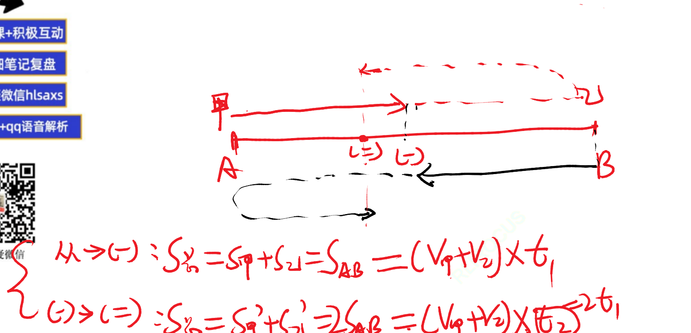
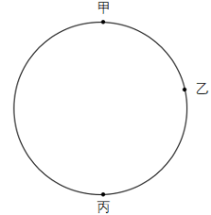
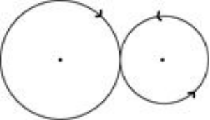

# Table of Contents

* [火车过桥问题](#火车过桥问题)
* [行程之比例份数关系](#行程之比例份数关系)
* [等比](#等比)
* [九阳](#九阳)
* [接送问题](#接送问题)
  * [车速不一样](#车速不一样)
  * [人速度不一样](#人速度不一样)
* [等距离平均公式](#等距离平均公式)
* [匀加速](#匀加速)
* [多次相遇问题](#多次相遇问题)
* [0参照思维 理解](#0参照思维-理解)
* [综合刷题](#综合刷题)


# 火车过桥问题

例题1:【2019广东事业】
一列火车穿过一条隧道，已知火车长450米，隧道长750米，火车行驶的平均速度为30米/秒，则火车通过隧道需要（    ）秒。
A.10
B.15
C.25
D.40

```
1200/30=40
```

例题2:【2019浙江统考】
一列火车要通过两座大桥，已知完全通过第一座大桥用时30秒，桥长650米，之后为了尽快到达目的地，火车将速度提升了25%，随后完全通过第二座大桥用时40秒，桥长1250米。问火车的长度为多少米？
A.150
B.175
C.200
D.250
```
感觉可以公式比列
v=4:5
t=3：4
s=12:20 8f->600 f=75
20*75-1250=250
```
例题3:【2023浙江事业统考】
一辆客车和一辆货车相向而行，两车车头正好在铁路桥的东端相遇；当客车车头到达铁路桥的西端时，正好遇到货车的车尾；而当客车车尾到达铁路桥的东端时，与货车的车尾相遇。已知货车的长度是客车的2倍，那么货车的长度是铁路桥的长度的多少倍？
A.1.5  
B.2  
C.3  
D.4

```
猜题的话 B d倍关系 火车
这个题目好难读懂
客车走了a-b  货车走了b
b=0.5a
```
例题4:【2024江苏省考】
一列长为210米的动车以180千米/小时的速度行驶。小李拍窗外风景视频时，恰好拍到平行铁轨上一列长420米、相向而行的高速列车，该列车经过窗户的时间是3.6秒。若窗户长度忽略不计，则该高速列车的速度为： 
A. 200千米/小时 
B. 260千米/小时 
C. 240千米/小时 
D. 320千米/小时

```
注意单位转换 3.6 
420/1000
---       =420  -180=240
3.6/3600

看哪个车 就是那个车的S/距离和=时间

420=（180+答案）*3.6
7倍数   7倍数 选C 

当然简单题可以直接做


```


# 行程之比例份数关系

例题1:【2020上海事业】
甲乙两地相距19千米，某人从甲地去乙地先步行7千米，然后改骑自行车，共用了2小时到达乙地，已知这个人骑自行车的速度是步行速度的4倍，求此人步行速度是每小时（）千米。
A.3
B.4
C.5
D.6
```
v=1:4
s=7：12
t=28:12=7:3  10f=2 f=0.2
7/1.4=5 选C 注意单位

```
例题2.【2019 浙江】 
小王从单位开车去省城，如果他把车速提高 20%，可以比原定时间提前 15 分钟到达；如果按 原速行驶 30 千米后再将车速提高 25%，也比原定时间提前 15 分钟到达。问小王单位距离省 城多少千米？ 
A.60 
B.120 
C.180 
D.240

```
标准的 局部变化
v=5:6 t=6:5 90 75 其实这里问法突破直接C了
30千米后
v=4:5 t=5;4=75 
15分钟30千米
30/15*90=180
```
例题3.【2021 江苏】 
甲、乙两人从湖边某处同时出发，沿两条环湖路各自匀速行走。甲恰好用 2 小时回到出发点， 比乙晚到 20 分钟，多走了 2800 米。若甲每分钟比乙多走 10 米，则甲行走的速度是： 
A.4.2 千米／小时 
B.4.5 千米／小时 
C.4.8 千米／小时 
D.5.4 千米／小时

```
2个小时 120*10=1200
2800-1200=1600
1600 /1000
----    =1.6*3=4.8
20分钟 
------------
乙走了100分钟 甲100分钟 多走1000
甲自己走的 
180
---=5.4  选D
1/3
```
例题4.【2018 四川】 
一战斗机从甲机场匀速开往乙机场，如果速度提高 25% ，可比原定时间提前 12 分钟到达； 如果以原定速度飞行 600 千米后，再将速度提高 1/3 ，可以提前 5 分钟到达。那么甲乙两机 场的距离是多少千米？ 
A. 750 
B. 800 
C. 900 
D. 1000
```
同样的题型
选C

```
例题5.【2024联考】 
c 地为 a、b 两地直线道路上的一点，甲、乙两人 9：00 分别自 a、b 两地同时出发匀速相向而行，甲的速度是乙的 1.5 倍，甲 9：40 到达 c 地休息 10 分钟后继续向 b 地前进；乙全程不休息，在 10：40 到达 c 地，问甲、乙相遇的时间为：
A.10：00 
B.10：10
C.10：20 
D.10：30
```

3:2
120+100*2=320
320-20 10分钟乙走的=300
300/5=60
60+10 记得要加回来 选B
```
例题6.【2018 联考】 
周末小芳和妹妹打算分别以坐出租车、骑自行车的方式去离家 10 千米的电影院看电影，小 芳坐出租车的速度是妹妹骑自行车速度的 2 倍。小芳比妹妹晚 15 分钟从家里出发，结果与 妹妹同时到达电影院。据此可知，妹妹骑自行车的速度为每小时： 
A.10 千米 
B.15 千米 
C.20 千米 
D.40 千米
```
v=2:1
t=1:2 f=15 
 15 30 
10
-- =20 选C
1/2

```
例题7.【2018 辽宁】 
上午 8 点甲、乙二人同时从 A 地出发前往 B 地，甲骑电动车，乙步行。40 分钟后甲到达 B 地，此时乙距离两地的中点处还需走 10 分钟，于是乙停下来等待甲返回接他。若甲立刻原 速返回，当甲到达乙处接上乙立刻前往 B 地，速度保持不变。则甲、乙到达 B 地时甲共骑 行（ ）分钟。 
A.88 
B.44
C.80 
D.94

```
甲、乙到达 B 地
甲 40 20+20
甲 把乙的10分钟来回转化就是 8分钟
40+40+8=88

```
例题8.【2021 北京】 
小张开车经高速公路从甲地前往乙地。该高速公路限速为 120 千米/小时。返程时发现有 1/3 的路段正在维修，且维修路段限速降为 60 千米/小时。已知小张全程均按最高限速行驶，且 返程用时比去程用时多 30 分钟，则甲、乙两地距离为多少千米？ 
A.150 
B.160 
C.180 
D.200
```
老题了
对变化的做处理
v=2:1
t=1：2 
  30 60  
2/3是60  原来就是90 
```
例题9.【2018 联考】 
甲、乙、丙、丁四人同时同地出发，绕一椭圆形环湖栈道行走。甲顺时针行走，其余三人逆时 针行走。已知乙的行走速度为 60 米/分钟，丙的速度为 48 米/分钟。甲在出发 6、7、8 分钟 时分别与乙、丙、丁三人相遇，求丁的行走速度是多少？ 
A.31 米/分钟 
B.36 米/分钟 
C.39 米/分钟 
D.42 米/分钟

```
甲v
6(v+60)=7(v+48) v=24
s=504 丁=39

比例法
t=6;7:8
v=28：24：21

```
**例题10.【2018 深圳】** 
**清晨，爷爷、爸爸和小磊在同一条笔直跑道上朝同一方向匀速晨跑，某一时刻，爷爷在前， 爸爸在中，小磊在后，且三人之间的间距正好相等。跑了 12 分钟后小磊追上了爸爸，又跑 了 6 分钟后小磊追上了爷爷，则再过（ ）分钟，爸爸可追上爷爷。** 
**A.12** 
**B.15** 
**C.18** 
**D.36**

```
猜题选C 因为还要加
S=1:2
t=12：18
v=3:4
这里的速度就是 (小-爸)
差值1份 就是爸爸减爷爷
--------------- 后面没想到
S一样 小追爸 爸追爷
v=3:1 【追击差速度】
t=1:3 f=12 3f=36
36-18=18
```
例题11.【2019 北京】 
小王和小张分别于早上 8：00 和 8：30 从甲地出发，匀速骑摩托车前往乙地。10：00 小王 到达两地的中点丙地，此时小张距丙地尚有 5 千米。11：00 时小张追上小王。则甲、乙两 地相距多少千米？ 
A.50 
B.75 
C.90 
D.100

```
10点做为起点的话，差距5千米
5=(张-王)*1
8点半到10点 1个半小时 在1小时 2.5
12.5 就是王提前 30分钟走的 
25*4=100

是不是可以直接看4倍数。。。
```
**例题12.【2020 深圳】** 
**小王和小李从甲地去往相距 15km 的乙地调研。两人同时出发且速度相同。15min 后，小王 发现遗漏了重要文件遂立即原路原速返回，小李则继续前行；小王取到文件后提速 20%追赶 小李，在小李到达乙地时刚好追上，假设小王取文件的时间忽略不计，则小李的速度为（ ） km/h。**
**A. 4** 
**B. 4.5** 
**C. 5** 
**D. 6**

```
猜题就猜C
------------- 用时间算很麻烦，还错了。，。。
v=5：6
t=6:5 6f=15 5f=12.5
追击差可以得到时间
15*5=1*t
t=75
15/75+15
------------------
v=5：6
A----b----C----D
当小王回到A点，小李在C点，且AB=BC
Tad=Tcd 时间相等
s=5：6  6f=15km 1f=2.5
2.5/（1/2）=5 千米/h
```
**例题13.【2020 国考】** 
**一条圆形跑道长 500 米，甲、乙两人从不同起点同时出发，均沿顺时针方向匀速跑步。已 知甲跑了 600 米后第一次追上乙，此后甲加速 20%继续前进，又跑了 1200 米后第二次追 上乙。问甲出发后多少米第一次到达乙的出发点？** 
**A.100** 
**B.120** 
**C.150** 
**D.180**

```
环形追一圈，多走一圈
从不同点出发的，就从追上后，就是同一点出发了
追上时，t相同，s=vt
s=12:(12-5)=7
v=12：7
没提升前
v=10:7 相同速度
s=10：7 10f=600 3f=180

```


# 等比

例题1.【2018 浙江】 
甲、乙各自驾驶汽车匀速相向行驶，且同时进入双向公路隧道的两端，30 秒后两车相遇。 甲车继续行驶 20 秒到达隧道出口时，乙车距离出口还有 200 米。问隧道的长度为多少米？ 
A.450 
B.500 
C.600 
D.800

```
900=20*45 
25s->200
75s->600
--------比例推出来
t=30:20
v=3：2
    3          2
A----------B------------C

30t->2
20t-》5/3-》200
f=120 5f=600
```
例题2.【2019 联考】 
甲从邮局出发去图书馆，乙从图书馆出发去邮局。两人 12 点同时出发，相向而行。12 点 40 分两人相遇并继续以原速度前行。13 点 12 分甲到达图书馆后立刻返回邮局。假定两人速度 不变，甲返回邮局时，乙已到邮局多长时间了? 
A.40 分钟 
B.50 分钟 
C.54 分钟 
D.64 分钟
```

40*40=32*50 
72+72=144
144-90=54 选C

```
# 九阳

母题：【2020江苏】
在统计某高校运动会参赛人数时，第一次汇总的结果是1742人，复核的结果是1796人，检查发现是第一次计算有误，将某学院参赛人数的个位数字与十位数字颠倒了。已知该学院参赛人数的个位数字与十位数字之和是10，则该学院的参赛人数可能是
A.64人    
B.73人    
C.82人    
D.91人

```

1796-1742=54  6 直接选C

```
例题1.【2019 深圳】 
小孟驾驶汽车沿一条笔直公路匀速行驶。某一时刻，小孟先看到路边的第一个里程碑，上面刻 的公里数 X 为两位数。半小时后，他又看到第二个里程碑，上面刻的公里 数 Y 恰好由 X 的 十位数和个位数交换位置所成。又过了半小时，他看到第三个里程碑，上面刻的 Z 恰 好 由 X 的两位数中间添一个 0 所成。再过一小时，小孟自看到第一个里程碑起共驾驶了（ ）公里。 
A.120 
B.150 
C.180 
D.200

```
直接9的倍数 选C
```

例题2.【2023全国事业】 
一出租车的计价器出现故障，显示屏上保留了一个两位数，无法清除，但还能按行驶路程准确地将应付的车费累加上去。一旅客乘坐该车匀速行驶了2小时，当行驶1小时的时候，计价器上的两位数刚好交换了位置，在2小时的时候，计价器上的两个数又交换了位置，但他们中间多了一个0。如车费按里程计，问该旅客应付多少元车费？ 
A.82 
B.86 
C.90 
D.95

```
9的倍数 选C
```


# 接送问题

```
直接记结论

    第二批人   
        ----------          
A-------b--------C------D
    人       车        人
                第一批
V人：C车=1：5
Sab：Sbc=1：(5-1)/2=2
人速度不变的情况下
Scd=1
```

例题1:某团体从甲地到乙地，甲、乙两地相距 100 千米，团体中一部分人乘车先行，余下 的人步行，先坐车的人到途中某处下车步行，汽车返回接先步行的那部分人，已知步行速度 为 8 千米/小时，汽车速度为 40 千米/小时。问使团体全部成员同时到达乙地需要多少时间？ 
A.5.5 小时 
B.5 小时 
C.4.5小时 
D.4 小时

```
4f=100 

车的时间+人走时间
3f=75/40+25/8=5小时
```

例题2.小张，小王和小李三人同时从价低前往乙地，按计划小张开车载小王行驶1小时到达，小李步行7小时达到。经过t小时后，小王下车按小李的步行速度继续前进，小张驾车折返载上小李后再前往乙地，最终三人同时到达乙地，则t为：
A.0.5
B.0.6
C.0.8
D.0.9

```
猜题直接4倍数 
1:7 
7-1/2=3
总距离就是1：3：1 5f
V车=5f=1*v =5f
经过t小时后，同时到达【注意 不是全部时间 而是车回去接人的时间】
4f/5f=0.8

```
## 车速不一样

+ 车速不一样，取估算值，也就是混合值

例题3.【2019 辽宁】 
有两个班的学生从南部校区到北部校区参加活动，但只有一辆车接送，第一班的学生坐车从 学校出发的同时，第二班学生开始步行；车到途中某处，让第一班学生下车步行，车立刻返 回接第二班学生上车并直接开到北部校区。学生步行速度为每小时 4 公里，载学生时车速每小时 40 公里，空车时车速为每小时 50 公里。问：要使两班学生同时到达北部校区，第二班 学生步行全程的________。 
A.1/6 
B.1/7 
C.1/10 
D.1/8

```
V=1：10  10-1 /2=4.5
1 4.5  1
1/6.5 =2/13 

这里2个车速不一样，怎么转换？
估算一下 取 44的话 就是B 
```

## 人速度不一样

+ 

例题4.甲班与乙班同学同时从学校出发去某公园，甲班步行的速度是每小时4千米，乙班步行的速度是每小时3千米。学校有一辆汽车，它的速度是每小时48千米，这辆汽车恰好能坐一个班的学生。为了使这两班学生在最短的时间内到达，那么，甲班学生与乙班学生需要步行的距离之比是（    ）。   
A. 15：11      
B. 17：22     
C. 19：24     
D. 21：27

``` 
要让走的快的人多走点
   乙   车     x     甲
A-----d-----C-----B
v=3:48=1:16  15/2=7.5

7.5+7.5+x       x
----------- = ----
V车             V甲
x=15:11


```


# 等距离平均公式

+ 注意平均速度

+ 等距离平均速度：**等距离是前提** ，体现的是混合速度

   

  ```
  
  Ab=bc
    v1     v2
  A-----B-------C
  
  Vac=2v1v2/v1+v2
  ```

  

母题.某人开车从A镇前往B镇，在前一半路程中，以每小时10公里的速度前进;而在后一半的路程中，以每小时15公里的速度前进。则此人从A镇到达B镇的平均速度是每小时多少公里?
A. 12
B. 12.5
C. 14
D. 14.5

```
直接带公式
15*10*2 / 25=12
```
例题1：小明从家到学校有两条一样长的路，一条是平路，另一条是一半上坡路、一半下坡路。小明上学走两条路所用的时间一样多。已知下坡的速度是平路的1.5倍，那么上坡的速度是平路的多少倍？

```
两条一样长的路 小明上学走两条路所用的时间一样多 意思是平均速度一样
下坡3:2
代入等距离平均公式 
3x*2/3+x =2
```

例题2：【2020 联考】 
小明每天从家中出发骑自行车经过一段平路，再经过一道斜坡后到达学校上课。某天早上， 小明从家中骑车出发，一到校门口就发现忘带课本，马上返回，从离家到赶回家中共用了 1 个小时，假设小明当天平路骑行速度为 9 千米/小时，上坡速度为 6 千米/小时，下坡速度为 18 千米/小时，那么小明的家距离学校多远？ 
A. 3.5 千米 
B. 4.5 千米 
C. 5.5 千米 
D. 6.5 千米

```

    平路         上坡
A---------b--------C

上坡下坡取平均速度 AB
12*18
-----=9
24
2s=9 s=4.5
```

例题3：【2021 广东】 
某天，自行车运动员小吴训练了 3 个小时，他先匀速骑行了一段上坡路程，又以 2 倍的 速度匀速骑行了一段下坡路程，最终共骑行 60 千米，则（  ）。 
A．如果上坡路程大于下坡路程，他上坡的时速必然小于 15 千米 
B．如果上坡路程大于下坡路程，他上坡的时速必然大于 20 千米 
C．如果下坡路程大于上坡路程，他下坡的时速必然小于 30 千米 
D．如果下坡路程大于上坡路程，他下坡的时速必然大于 25 千米

```
平均速度：60/3=20
先假设上下坡距离相等，构造等距离平均公式
v=1：2
t=2:1 
速度：30/2=15 30/1=30 排除BD

15 20 30 
如果上坡大，速度肯定要大于15，你s变大，速度变小，时间不更多吗

```

# 匀加速

```
加速度a 初速度v0
Vt=V0+at    时间相成等差
V0 V0+a V0+2a V0+3a 等差数列，公差就是a

Vt^2-V0^2=2as
V0 不会变
Vt^2 也是成等差 距离相等的话
```

例题1.【2020全国事业】 
甲从A地骑车前往B地，出发时的速度为x千米/小时，出发后均匀加速，到达B地时的速度为1.5x千米/小时。如甲到达B地后，立刻保持原加速度持续均匀加速返回A地，其到达A地时的速度比从B地返程时快
A.不到0.4x千米/小时 
B.0.4x-0.5x千米/小时之间 
C.0.5x-0.6x千米/小时之间 
D.0.6x千米/小时以上 

```
x 1.5x  这里能是2x吗 
不行的 因为x走1.5的时间，跟1.5到2的时间不是一回事。

距离相等，速度平方等差
假设x=2 1.5x=3
4  9  14 
      回去的速度就是根号14 大概3.8左右
3.8-3=0.8 选A
```

例题2.【2023国考】 
一辆汽车从甲地开往乙地，先以 40 千米/小时的速度匀速行驶一半的路程，然后均匀加速;行驶完剩下路程的一半时，速度达到 80 千米/小时;此后均匀减速，到达乙地时的速度正好降为 0。问其全程的平均速度在以下哪个范围内? 
A.不到 44 千米/小时 
B.在 44~45 千米/小时之间
C.在 45~46 千米/小时之间 
D.超过 46 千米/小时

```
40         40   80   0
A----------B----C----D
AB匀速
BC匀加速
cd匀减速
40 80 60 平均速度 
80  0 40 平均速度 

60 40  48 平均速度
ab=bd 等距离平均速度 看到等距离就要想到等距离平均公式
40*48*2/（40+48） 不到44 
```

例题3.【2024四川】 
小李开车去某单位办事，计划全程匀速行驶2小时到达目的地。出发后头30分钟按计划速度行驶，此后50分钟交通拥堵，行驶的路程和前面30分钟相同。最后40分钟小李匀加速行驶，最终全程用时2小时到达。问他最后10分钟的平均车速是计划行驶速度的多少倍？ 
A.不到1.8倍 
B.不低于1.8倍但低于2.0倍 
C.不低于2.0倍亦不高于2.2倍 
D.高于2.2倍 

```
难题 放弃
```


# 多次相遇问题

+ 默认迎面相遇

两端出发相遇问题：
结论：对于单个对象甲来说，第一次相遇甲走路程为a，时间t，则以后每次相遇甲走2a，时间为2t



一端出发相遇问题：
结论：对于单个对象甲来说，第一次相遇甲走路程为a，时间t，则以后每次相遇甲走a，时间为t。

```

```

母题1：货车 A 由甲城开往乙城，货车 B 由乙城开往甲城，他们同时出发，并以各自恒定 速度行驶。在途中第一次相遇，他们离甲城 35 千米，相遇后两车继续以原速行驶到目的城 市立即返回，途中再一次相遇，这时他们离乙城为 25 千米，则甲、乙两城相距（ ）千米。 
A.80 
B.85 
C.90 
D.95

```
秒A
  35
A----C--d--B
第一次35 第二次肯定是70 
cb+bd=70
cb=70-25=45
45+35=80 
```

母题2 ：小王和小李沿着绿道往返运动，绿道总长度为 3 公里。小王每小时走 2 公里；小李每小时跑 4 公里。如果两人同时从绿道的一端出发，则当两人第 7 次相遇时，距离出发点（）公里。 
A.0 
B.1 
C.1.5 
D.2

```
同一段出发
6/6=1
2 4 *6  26

3*8=24..2
```

例题1：甲、乙两人同时从 A、B 两地相向出发，甲的速度是乙的速度的 1.5 倍，到达对方 出发点后立即返回，如果第一次相遇点和第二次相遇点相距 300 米，那么 A、B 两地的距离 为（ ）米。 
A.300 
B.450 
C.600 
D.750

```
3：2
A-------------B
3 第二次6分2+2+2=6
2f=300
5f=750
```

例题2：小赵和小李是两位竞走运动员，小赵从甲地出发，小李同时从乙地出发，相向而行，在两地之间往返练习。第一次相遇地点距甲地1.4 千米，第二次相遇地点距乙地0.6 千米。当他们两人第四次相遇时，地点距甲地有多远？
A.2.6 千米            
B.2.4 千米           
C.1.8 千米            
D.1.5 千米

```
作业题
2.8-0.6=2.2 +1.4=3.6 全程
1.4+2.8*3=9.8
3.6*3=7.2
9.8-7.2=2.6
```

例题3:【2020 国考】 
丙地为甲、乙两地之间高速公路上的一个测速点，其与甲地之间的距离是与乙地之间距离的 一半，A、B 两车分别从甲地和乙地同时出发匀速相向而行，第一次迎面相遇的位置距离丙 地 500 米，两车到达对方出发地后立刻原路返回，第二次两车相遇也为迎面相遇，问第二次 相遇的位置一定： 
A. 距离甲地 1500 米 
B. 距离乙地 1500 米
C. 距离丙地 1500 米 
D. 距离乙、丙中点 1500 米

```
如果甲的速度小于乙，那么第二次相遇的话就是追击相遇，不是迎面相遇了
所以甲的速度大于乙
a 2a
a+500-》2a+1000


这题要用0参照思维来做，问题是，什么时候考虑0参照思维呢

A---丙--------B
假设A为0  答案直接出来了 1500
```

例题4:【2017陕西】 
甲车从A地开往B地，乙车从B地开往A地。上午八点整，两车同时出发，相向而行，相遇后继续向前。甲车又行驶了2小时到达B地，乙车又行使了4.5小时到达A地。甲乙两车到达目的地后都立即返回，则在返程途中两车再次相遇时，时间为（    ） 
A.14点整     B.14点半     C.15点整     D.15点半   
E.16点整     F.16点半     G.17点整     H.17点半

```
先用等比求出相遇时间
3小时 第二次6小时 9小时  下午5点 选G
```

# 0参照思维 理解

+ 多对象之间的追击和相遇
+ 慢的为0

母题
某人畅游长江，逆流而上，在 A 处丢失一只水壶，他又向前游了 20 分钟后，才发现丢了水壶，立即返回追寻，在距离 A 处 2 千米的地方追到，他返回追寻用了多少分钟？

```
丢之前
S=( (人-水)+水 )*20分钟
括号内值的变化，只要不影响外面的值，是没关系的 这里不要理解为抵消 用0更好理解

追水壶
S=( (人+水)-水 )*20分钟

假设水流速度为0，那就是丢包后，包没动，丢之前和丢之后都是人走的距离。
所以来回距离和时间都是相等的。
```

例题1:【2021广东紧缺公务员招聘】
一艘维修快艇沿着河流逆流而上执行维修任务，快艇航行到途中某处时工具包掉进了河里，10分钟后，驾驶员到达目的地时发现工具包丢失后立即返回追寻。已知水的流速为每秒1米，如果工具包会浮在水面上漂流，那么驾驶员将在距离丢失处（    ）米的地方找回工具包。
A.640
B.900
C.1080
D.1200

```
直接带  丢之前+追 20分钟
1200米
```

例题2.【2023深圳】
老杨、老朱和小张三人开展社区巡防工作，巡防路线固定，三人同时同向出发，老杨开车，老朱骑自行车，小张走路。已知老杨每20分钟追上小张一次，每40分钟追上老朱一次，则老朱每（  ）分钟追上小张一次。
A.30
B.40
C.50
D.60

```
假设小张为0 站着原地不动
老杨一圈就是20分钟
40分钟追上老朱，老杨跑了2圈，领先老朱一圈，
老朱就是40分钟一圈
选B
```


例题3.【2021 浙江】 
甲、乙、丙从长 360 米的圆形跑道上的不同点同时出发，沿顺时针方向匀速跑步。3 分钟 后甲追上乙，又过 1 分 30 秒后丙也追上乙，又过 3 分 30 秒后丙追上甲，又过 5 分 30 秒后丙第二次追上乙。问出发时甲在乙身后多少米 
A.48 
B.84 
C.108 
D.144

```
假设乙为0
给出2次追乙，是在同一起点的基础上，算出丙的相对速度
丙追乙一圈是 9分钟 相对速度是 40 4.5
甲追乙 是3分钟 3V甲
甲追甲是 8(40-v甲)
3v+8(40-v)=40*4.5、
v=28


这题怎么理解呢？在最开始没有出发的是

丙---甲---乙 会有一个追击的过程，
那就是 甲丙追击的距离+甲乙追击距离= 丙乙的追击距离
```

例题4.【模考】 
如图，甲、乙、丙三人从长400米的圆形跑道上的不同点同时出发，沿顺时针方向匀速步行。已知甲、乙的出发点相距80米，乙、丙的出发点相距120米，甲、乙、丙三人的步行速度分别为100米/分钟、60米/分钟、50米/分钟。则三人出发多久后第二次相遇？
A.12分钟 
B.30分钟 
C.52分钟 
D.58分钟



```
这题要理解下最后问的，三人相遇基础一定是2人相遇

假设丙速度为0 
原来速度 100 60 50
        50  10
乙追丙就是 12分钟 下次就是400/10=40分钟 直接52 
```

# 综合刷题

例题1.【2018 山东】 
一艘船模出发后先逆流航行 1 分钟；掉头后顺流航行 2 分钟；再掉头后逆流航行 3 分钟…… 以此类推。已知船模顺流速度为 30 米/分钟，逆流速度为 10 米/分钟。问 10 分钟后船模的位 置和 20 分钟后船模的位置相距多少米 
A.0 
B.30 
C.50 
D.100

```

```

例题2.【2020 浙江】 
某公园雇佣一名小丑表演骑独轮车。独轮车车轮直径为 50 厘米，小丑沿如图所示 8 字形轨 迹骑行。轨迹为相切的两个圆，两个圆面积比是 16:9，小圆直径为 15 米。问小丑沿 8 字形 轨迹骑行一圈，车轮转动了多少圈? 
A.50 
B.60 
C.70 
D.90



```

```
例题3.【2020 广东】 
A、B 两座港口相距 300 公里且仅有 1 条固定航道，在某一时刻甲船从 A 港顺流而下前往 B 港，同时乙船从 B 港逆流而上前往 A 港，甲船在 5 小时之后抵达了 B 港，停留了 1 小时后 开始返回 A 港，又过了 6 小时追上了乙船。则乙船在静水中的时速为（ ）公里。 
A. 20 
B. 25 
C. 30 
D. 40

```
60-x=甲 
60-x-x= 甲逆水速度
12(b-x)=6（60-x-x）

```

例题4.【2020 深圳】 
深圳市民老李周末去郊游，他从家出发匀速骑行 2 小时到达梧桐山，游玩 4 小时后沿原路以 原速返回，已知老李离开家 5.5 小时后，其子小李驾车以 30 公里/小时的速度从家出发沿同 一路线接老李，两人在距离梧桐山 10 公里路程处相遇，则老李的骑行速度是（  ）公里/小时。 
A. 20 
B. 18 
C. 16 
D. 15

```

```

例题5.【2020 深圳】 
深圳市民老李周末去郊游，他从家出发匀速骑行 2 小时到达梧桐山，游玩 4 小时后沿原路以 原速返回，已知老李离开家 5.5 小时后，其子小李驾车以 30 公里/小时的速度从家出发沿同 一路线接老李，两人在距离梧桐山 10 公里路程处相遇，则老李的骑行速度是（  ）公里/小时。 
A. 20 
B. 18 
C. 16 
D. 15

```

```

例题6.【2020 江苏】 
甲、乙两人分别从 A、B 两地同时出发相向而行。当两人合计走完两地间路程的 1/4 时，甲 距 A 地的路程是 500 米；当两人合计走完两地间路程的 3/4 时，乙距 B 地的路程是 2400 米。 若两人的速度始终不变，则当速度较快者走完全程时，速度较慢者距走完全程还剩的路程是 
A.1350 米 
B.1600 米 
C.1800 米 
D.1950 米

```

```

例题7.【2022 国考】 
李某骑车从甲地出发前往乙地，出发时的速度为 15 千米/小时，此后均匀加速，骑行 25%的 路程后速度达到 21 千米/小时。剩余路段保持此速度骑行，总行程前半段比后半段多用时 3 分钟。问甲、乙两地之间的距离在以下哪个范围内？ 
A.不到 23 千米 
B.在 23~24 千米之间 
C.在 24~25 千米之间 
D.超过 25 千米

```

```

例题8.【2022 江苏】 
已知 A、B 两地相距 9 公里，甲、乙两人匀速从 A 地前往 B 地。甲每小时走 6 公里，每走半 小时休息 15 分钟；乙比甲早 15 分钟出发，中间不休息。若他们在途中（不含起点和终点） 相遇了 2 次，则乙从 A 地到 B 地所用的时间至少为： 
A.75 分钟 
B.120 分钟 
C.135 分钟 
D.150 分钟

```

```

例题9.【2022 广东】 
小李开车从甲市到乙市，需要走一段高速公路和一段国道。已知在高速公路上汽车油 耗为 0.05 升/公里，在国道上油耗比在高速公路上多 0.03 升/公里。小李在高速公路上行驶 了 200 公里，是在国道上行驶路程的 4 倍，则从甲市到乙市，小李汽车的油耗为（ ）升。 
A.15 
B.14
C.12
D.10

```

```

例题10.【2022 北京】 
甲和乙同时出发，在长 360 米的环形道路上沿同一方向各自匀速散步。甲出发 2 圈后第一次 追上乙，又走了 4 圈半第二次追上乙。则甲出发后走了多少米第一次到达乙的出发点？ 
A.160 
B.200 
C.240 
D.280

```

```

例题11.【2022 四川】 
甲、乙两辆货车同时从 A 地出发，到 B 地后立即卸载货物，并返回 A 地装运货物，如此往 返两个来回。已知 A、B 两地相距 30 千米，甲、乙两辆货车的速度分别为 100 千米/小时和 80 千米/小时。如装运、卸载货物时间忽略不计，问在整个过程中甲、乙两辆货车最远相距 多少千米? 
A.18 
B.20 
C.24 
D.30

```

```
