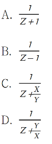

# 得分秒杀公式

例题1.某测验包含 10 道选择题，评分标准为答对得 3 分，答错扣 1 分，不答得 0 分，且分数可以为负数。如所有参加测验的人得分都不相同，问最多有多少名测验对象？ A.38 B.39 C.40 D.41

```


```

例题2.某次数学竞赛共有10道选择题，评分办法是答对一道得4分，答错一道扣1分，不答得0分. 设这次竞赛最多有N种可能的成绩，则 N 应等于多少 ?(  )
A. 45   
B. 47   
C. 49    
D. 51

```


```

# 空瓶换酒问题

例题1:12个啤酒空瓶可以免费换1瓶啤酒，现有101个啤酒空瓶，最多可以免费喝到的啤酒为：  
A.10瓶     
B.11瓶     
C.8瓶     
D.9瓶

```


```

例题2:“红星”啤酒开展“7个空瓶换1瓶啤酒”的优惠促销活动。现在已知张先生在活动促销期间共喝掉347瓶“红星”啤酒，问张先生最少用钱买了多少瓶啤酒？    
A.296瓶     
B.298瓶     
C.300瓶     
D.302瓶

```


```

# 平均数对调模型方法技巧

例题1:某单位有2个处室，甲处室有12人，乙处室有20人。现在将甲处室最年轻的4人调入乙处室，则乙处室的平均年龄增加了1岁，甲处室的平均年龄增加了3岁。问在调动之前，两个处室的平均年龄相差多少岁？ A. 8 B. 12 C. 14 D.
15

```


```

例题2:体操队有正式队员和候补队员共18人，候补队员比正式队员多4人，若将候补队员组中身高最高的3名队员调入正式队员组，则正式队员组的平均身高将提高2厘米，而候补队员组的平均身高则下降1厘米。那么调动后两组平均身高差多少厘米？（ ） A.1
B.2 C.3 D.4

```


```

# 计数杂题讲练

例题1: 【2021 浙江】 超市采购一批食用油，其中玉米油每桶进价比花生油低 20％，若花生油利润定为进价的 24％，玉米油利润定为进价的 30％，则花生油比玉米油每桶售价高 10 元。问玉米油每桶比花生油进价低多少元： A.10
B.15 C.24 	
D.25

```


```

例题2.【2021 浙江】 某工厂有甲、乙两个生产车间，每个工人的生产效率都相同。甲车间的总生产效率是乙车间的 1.5倍；从甲车间调派 30 名工人到乙车间之后，甲车间的生产效率是乙车间的 1.2
倍。问需要从甲车间再调多少名工人到乙车间，两个车间的生产效率才能相同： A.20 B.22 C.24 D.25

```


```

例题3.【2021 广东】 某单位本科、研究生学历的职工人数之比为 7∶5。上半年公开招聘本科毕业生若干人后， 本科与研究生之比为 3∶1；下半年通过引才计划引入研究生若干人后，本科与研究生之比 为
15∶8。已知该年度引进的本科生比研究生多 10 人，则该单位原有本科与研究生学历的 职工共（ ）人。 A.12 B.24 C.36 D.48

```


```

例题4.【2022 广东】 甲、乙两人计划分装会议材料，9 点多先后开始工作，且两人每分钟完成分装的份数相同。 9 点 38 分时，甲完成的份数是乙的 4 倍，9 点 53 分时，甲完成的份数是乙的 1.5 倍，那么，甲比乙早（
）分钟开始工作。 A.4 B.6 C.8 D.9

```


```

例题5.【2022 江苏】 某企业年终评选了 30 名优秀员工，分三个等级，分别按每人 10 万元、5 万元、1 万元给与奖励。若共发放奖金 89 万元，则获得 1 万元奖金的员工有： A.14人 B.19人 C.20人 D.21人

```


```

例题6.【2016山东】
某企业采购了一批文具和书本赠送给希望小学的学生。如果向每个学生捐赠2件文具和3本书，则剩下书的数量是文具的1.5倍；如果向每个学生再多捐赠1件文具和1本书，则剩下书的数量是文具的两倍。该企业最终决定向每个学生捐赠6件文具和10本书，则其还需要采购的书本数量是文具的多少倍（
） A.1                      
B.2                  
C.3                   
D.4

```


```

例题7.【2019重庆】 一工厂生产的某规格齿轮的齿数是一个三位数的质数（除了 1 和它本身之外，不能被其他 整数整 除的正整数），其个、十、百位数字各不相同且均为质数。若将该齿数的百位数字 与个位数字对调，所得新的三位数比该齿数大
495，则该齿数的十位数字为： A.7 B.5 C.3 D.2

```


```

例题8.【2018广西】 年终某大型企业的甲、乙、丙三个部门评选优秀员工，已知甲、乙部门优秀员工数分别占三 个部门总优秀员工数的1/3和2/5，且甲部门优秀员工数比丙部门的多12人，问三个部门共评选出优秀员工多少人？ A.120 B.150
C.160 D.180

```


```

例题9.【2017新疆】 甲、乙、丙三人，其中每两个人的年龄之和分别是 55 岁，58 岁，63 岁，那么这三个人中 年龄最小的是（ ）岁。 A.25 B.26 C.30 D.33

```


```

例题10.【2020山东】 甲、乙两人在一条400米的环形跑道上从相距200米的位置出发，同向匀速跑步。当甲第三次追上乙的时候，乙跑了2000米。问甲的速度是乙的多少倍？ A.1.2 B.1.5 C.1.6 D.2.0

```


```

例题11.【2023广东】 某辆货车载有20吨货物，上午卸了货物总重的20%，下午卸了剩余货物的30%,则下午卸货后,货车上的货物还剩 （ ）吨。 A.10 B.10.4 C.11.2 D.12.6

```


```

例题12.【2019 国考】 从 A 市到 B 市的机票如果打 6 折，包含接送机出租车交通费 90 元、机票税费 60 元在内的总乘机成本是机票打 4 折时总乘机成本的 1.4 倍。问从 A 市到 B
市的全价机票价格（不含税费）为多少元（ ） A.1200 B.1250 C.1500 D.1600

```


```

例题13.【2019 广东】 某企业销售洗碗机，第一季度平均每个月销售 800 台，上半年平均每个月销售 850 台。如果4 月份和 6 月份的销售总量是 5 月份的 2 倍，那么该企业 5 月份的洗碗机销售量为（ ）台。 A.800
B.900 C.1000 D.1100

```


```

例题14.【2019 浙江】 甲、乙两个单位人数相同，甲单位的党员占总人数的 20%，乙单位的党员占总人数的 25%。如果乙单位 20 名党员与甲单位 20 名群众互换单位，则两个单位党员占比相同。问两个单位共有党员多少人？ A.256
B.288 C.324 D.360

```


```

例题15.【2018 上海】 大小两个玻璃瓶装着芝麻，如果将小瓶子里的芝麻全部倒入大瓶子，大瓶子还可以装 45 克；如果将大瓶子里的芝麻倒入小瓶子，大瓶子里还剩下 455 克。已知大瓶子的容积是小瓶子的2 倍，则大瓶子最多可装芝麻（ ）克。
A.1000 B.850 C.750 D.500

```


```

例题16.【2018 广州】 某电影院根据放映时间将电影票分为 A.档、B.档和 C.档，票价分别为 30 元、 50 元和 80元。某天有 5200 名观众购票观影，电影院售票收入 25.5 万元。已知售出的 A 档电影票是 C
档电影票的 2 倍，则当天售出 B.档电影票（ ）张。 A.500 B.1000 C.3700 D.4600

```


```

例题17.【2021 联考】 某省在新冠疫情期间派出包括传染科医生、重症科医生和护士在内的三批援鄂医疗队。三批 医疗队中三者人数之比分别为 4:2:4,；5:2:3 和 4:3:3。已知第二批医疗队中医生比护士多
40人，且传染科医生数逐批增加并成等差数列，三批共派出护士 113 人。则三批医疗队共有多 少人： A.339 B.350 C.360 D.390

```


```

例题18.【2021 山东】 x 千克甲盐水和 y 千克乙盐水中的含盐量相同。将 x 千克乙盐水与 x 千克甲盐水混合，并蒸 发掉 x 千克水之后，得到的溶液浓度是乙盐水的 z 倍。问乙盐水的浓度是甲盐水的多少倍：



```


```

例题19.【2021 联考】 某公园鸟语林共饲养 180 只鸟类动物，为养护方便，园方将鸟语林分为 A、B、C 三个区。某日，A 区的一部分鸟飞至 B、C 两区，清点时，B、C 两区鸟的数量都增加一倍。次日， 一些鸟又从 B 区飞至 A、C
两区，清点时，A、C 两区鸟的数量也都增加一倍。第三日，一 部分鸟又从 C 区飞至 A、B 两区，清点时，A、B 两区鸟的数量同样增加一倍，而此时 C 区 剩余鸟的数量恰好是 A 区的 7/26，那么，最初 A 区有多少只鸟？ A.103
B.104 C.105 D.106

```


```

