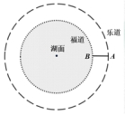

# Table of Contents

* [模型应用二：公式比例法之a=b*c](#模型应用二公式比例法之abc)
* [模型应用三：a=b*c模型之等比速解思维](#模型应用三abc模型之等比速解思维)
* [模型应用四：a=b*c模型之相对增减思维](#模型应用四abc模型之相对增减思维)


+ 局部比列会带来之前可能走过的数据

母题引入1：

某公司计划采购一批电脑，正好赶上促销期，电脑打9折出售，同样的预算可以比平时多买10台电脑。问该公司的预算在平时能买多少台电脑？  

A.60   

B.70   

C.80   

D.90

```
总金额=台数*单价
单价 10：9
数量 9:10 1f=10
9f=90 
```


母题引入2：

某植树队计划种植一批行道树，若每天多种25%，可提前9天完工，若种植4000棵树之后每天多种1/3，可提前5天完工，问共有（   ）棵树。

A.3600   

B.7200   

C.5400   

D.9800

```
V=4:5
t=5:4 1f=9  45 36  459 倍数 且后面大于4000 排除AD

局部比例，对变化的做处理
V=3:4
t=4：3 1f=5   20 15 
   4000
A-----C--------B

2000/25=80*2

80*2*45=7200
```

<div STYLE="page-break-after: always;"></div>


例题1:【2023广东】

某印刷厂原计划用全自动装订机花费4小时装订一批文件，但在还剩300份文件时装订机出现故障，无法装订。印刷厂立即安排了部分员工进行人工装订，由于人工装订的总效率仅为机器的20%，最终比原计划排迟1小时完成装订。则这批文件共有（  ）份。 

A.2400 

B.3600 

C.4800 

D.6000

```
局部比例
V=5:1
t=1:5 时间差都是最后导致的，4f=60 f=15
15->300
60->1200
1200*4=4800
```

例题2:【2024国考】

甲、乙分别从一个环形跑道的 A、B 两点同时出发，分别以顺时针、逆时针方向匀速跑步，甲跑 15 秒后与乙相遇，又跑了 20 秒后到达 B 点，又跑了 45 秒后回到 A点，问此时乙还要跑多久才能再次回到 B 点（   ）。 

A.40 秒 

B.50 秒 

C.20 秒 

D.30 秒

```
速度比3：4时间比4：3，甲一个全程80，乙一个全程60，所以这时候乙应该是跑了一个全程多20分钟，还需要再跑40分钟才能回到起点
```


<div STYLE="page-break-after: always;"></div>


例题3:【2023北京市考】

从A地到B地是下坡路，一辆车从A地开往B地需要三小时，从B地开往A地需要四小时。已知这辆车下坡速度比上坡速度快15千米/小时，则A、B两地之间的距离是多少千米？ 

A.120 

B.180 

C.240 

D.300

```
3：4
4：3 1f=15
4f=60*3=180
```

例题4:【2024江苏】

某银行引进机器人提高服务效率。某岗位小张、小邓和小曹完结一单任务分别需要 6 分钟、5 分钟和 4 分钟，3 个人一天最多可完结 259 单。机器人处理一单仅需 2 分钟，处理工单中的 80%可正常完结，剩余的 20%仍需人工重新办理。若某天小张出差，则当天小邓、小曹和机器人（机器人与人的工作时间相同）最多可完结的工单总量为：

A.357 单

B.370 单

C.430 单

D.459 单

```
这题很好奇 怎么比列做，之前都是因子做
t=6：5：4
V=10:12:15
259/37=7 每f都有7因子

比例法就是讲份数再分给机器人，单独求出来，在累加。
```


<div STYLE="page-break-after: always;"></div>


例题5:【2023国考】

商店销售某种商品，打八折销售时卖2件的利润与按定价销售时卖1件的利润相同，相当于降价120元/件销售时卖3件的利润。问该商品的定价为多少元/件？ 

A.360 

B.450 

C.540 

D.720

```
总利润相等
件数=2；1;3
利润=3：6：2
23 差值1f=120  定价720
```

例题6:【20221四川】

小王每天以v千米/小时的速度骑车到单位上班，如果速度提高20%，则可以提前10分钟到单位；如果以原速度骑行2千米后再提速30%，也可以提前10分钟到达。问小王家距离单位多少千米？

A.5.4 

B.7.2 

C.8.5 

D.9.6

```

```


<div STYLE="page-break-after: always;"></div>


例题7.【2018 江苏】

某新建农庄有一项绿化工程，交给甲、乙、丙、丁 4 人合作完成。已知 4 人的工作效率之比 为3：5：4：6，甲乙合作完成所需时间比丙丁合作多 9 天，则 4 人合作完成工程所需时间 是

A.17 天 

B.18 天 

C.19 天 

D.20 天

```

```

例题8.【2020 联考】 

某医疗器械公司为完成一批口罩订单生产任务，先期投产了 A 和 B 两条生产线，A 和 B 的工作效率之比是 2: 3，计划 8 天可完成订单生产任务。两天后公司又投产了生产线 C， A 和 C 的工作效率之比为 2: 1。问该批口罩订单任务将提前几天完成? 

A.1 

B.2 

C.3 

D.4

```

```


<div STYLE="page-break-after: always;"></div>


例题9.【2021 山东】 

某种商品有小箱和大箱两种包装，一大箱这种商品有 400 件，张和王同时开始制造这种商品， 制造一小箱和一大箱这种商品后，张比王多做 50 件。如果王此时的效率提高 100%，并与张 再共同制造一大箱这种商品，则王制造的总件数比张多 50 件。问一小箱这种商品有多少件？ 

A.50 

B.100 

C.150 

D.200

```

```

 <div STYLE="page-break-after: always;"></div>

#  模型应用二：公式比例法之a=b*c

母题：

2010年某种货物的进口价格是 15 元/公斤，2011 年该货物的进口量增加了一半，进口金额增加了20%。问2011年该货物的进口价格是多少元/公斤？

A.10   

B.12   

C.18   

D.24

```

```

例题1:【2022国考】

企业列出500万元设备采购预算，如用于购买x台进口设备，最后剩余20万元。经董事会研究后，决定购买质量更高的同类国产设备，单价仅为进口设备的75%。当前预算可购买x+3台，最后剩余5万元。问国产设备的单价在以下哪个范围内？

A.不到30万元/台 

B.30—40万元/台之间 

C.40—50万元/台之间 

D.50万元/台以上 

```

```


<div STYLE="page-break-after: always;"></div>


例题2:【2021浙江】

AB两地间有县道连接，BC两地间有高速公路连接，且AB间路程是BC间路程的3/4。郭某从A地开车匀速前往B地，到B地后以AB间2倍的速度开往C地，共用时2小时30分。由C地返回A地时高速公路行驶速度不变，县道行驶速度比去程降低1/3，则返程用时为:

A.2小时45分

B.2小时50分

C.3小时10分

D.3小时15分

```

```

例题3:【2022国考】

某单位办事大厅有3个相同的办事窗口，2天最多可以办理600笔业务，每个窗口办理单笔业务的用时均相同。现对该办事大厅进行流程优化，增设2个与以前相同的办事窗口，且每个办事窗口办理每笔业务的用时缩短到以前的2/3 。问优化后的办事大厅办理6000笔业务最少需要多少天？

A.8 

B.10 

C.12 

D.15

```

```


<div STYLE="page-break-after: always;"></div>


例题4.【2024联考】

某地人工湖景区开辟了沿湖福道和环湖乐道两条圆形观景道供市民休闲健身（如下图所示）。小李和他的妈妈分别沿乐道和福道从A、B两地同时同向而行（A、B两点间距离为50米），小李骑自行车的速度是妈妈步行速度的6倍，已知妈妈步行速度为每小时5千米，妈妈沿福道步行一周的时间是小李骑行乐道时间的4倍，那么这个湖面的面积约多少万平方米?（圆周率取3） 

A.2 

B.3 

C.4 

D.6


 

 

```

```


<div STYLE="page-break-after: always;"></div>


#  模型应用三：a=b*c模型之等比速解思维

母题引入：

甲、乙工程队需要在规定的工期内完成某项工程，若甲队单独做，则要超工期9天完成，若乙队单独做，则要超工期16天才能完成，若两队合做，则恰好按期完成。那么，该项工程规定的工期是： 

A.8天 

B.6天 

C.12天 

D.5天

```

```

例题1.【2023国考】

一项工作甲独立完成需要3小时，乙独立完成的用时比其与甲合作完成多4小时，且乙和丙合作完成需要4小时。问丙独立完成需要多少小时？

A.10

B.12

C.6

D.8

```

```

例题2.【2023北京】

甲、乙两个工程队被安排实施某个工程。甲工程队先施工，用了15天完成了一半，剩下部分甲、乙合作，比前一半的用时短了9天。则乙工程队独立完成整个工程需要多少天？

A.10

B.15

C.16

D.20

```

```


<div STYLE="page-break-after: always;"></div>


例题3.【2017国考】

工厂有5条效率不同的生产线。某个生产项目如果任选3条生产线一起加工，最快需要6天整，最慢需要12天整；5条生产线一起加工，则需要5天整。问如果所有生产线的产能都扩大一倍，任选2条生产线一起加工最多需要多少天完成？

A.11 

B.13 

C.15 

D.30

```

```

#  模型应用四：a=b*c模型之相对增减思维

母题引入：

王师傅要加工一批零件，若每小时多加工12个零件，则所用的时间比原计划少3小时;若每小时少加工16个零件，则所用的时间比原计划多用5小时。问：这批零件共有多少个?

A.3990       

B.4280       

C.4330        

D.4480

```

```


例题1：【2019联考】

A、B两地各有一批相同数量的货物箱需由某运输队用卡车完成交换，假设每辆卡车运送的货物箱数量相同，运输队首先从A地出发，中途10辆卡车因抛锚彻底退出这次运输，使得其余车辆必须每车再多运2箱，到达B地卸货后又有15辆卡车不返程，参与返程的卡车每辆都需比出发时多装运6箱。那么两地共有货物多少箱？

A. 2000

B. 1800

C. 3600

D. 4000

```

```

例题2:【2020浙江】

甲、乙两企业合作完成某订单需要x天。如果甲企业产能增加50%而乙企业不变，可提前2天完成；如果乙企业产能增加300%而甲企业不变，可提前4天完成。问x的值是：

A. 6

B. 8

C. 10

D. 12

```

```

例题3:【2021四川】

某工程队计划每天修路 560 米，恰好可按期完成任务。如每天比计划多修 80 米，则可以提 前 2 天完成，且最后 1 天只需修 320 米。问如果要提前 6 天完成，每天要比计划多修多少米？ 

A.160 

B.240 

C.320 

D.400

 ```

 ```

 

 

 

 

 

 
