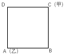
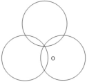

# Table of Contents

* [第一节7.10](#第一节710)
* [第二节7.13](#第二节713)
* [第三节7.15](#第三节715)
* [第四节7.17](#第四节717)
* [第五节](#第五节)
* [第六节 7.19](#第六节-719)
* [第七节](#第七节)
* [第八节](#第八节)

# 第一节7.10

1.甲乙两种产品原来价格比是3:5，将它们分别降价50元后，这时的价格比是4:7，甲乙两种商品分别多少元？

A.300元、500元   

B.375元、625元   

C.450元、750元   

D.525元、875元

 

2.甲、乙二人从同一地点同时出发，绕西湖匀速背向而行，35分钟后甲、乙二人相遇。已知甲绕西湖一圈需要60分钟，则乙绕西湖一圈需要（   ）分钟。  

A.25   

B.70   

C.80   

D.84

3.长途汽车首班车是7点整，第二班车是8点20分。首班车开走后，一位旅客急匆匆地赶到车站，问值班员现在是几点，值班员说：“首班车开走后经过的时间是现在到第二班车开车时间的3/5。”现在的时间是几点几分？

A.7点半   

B.7点40   

C.7点50   

D.8点

 

4.甲、乙两人生产零件，甲的任务量是乙的2倍，甲每天生产200个零件，乙每天生产150个零件，甲完成任务的时间比乙多2天，则甲、乙任务量总共为多少个零件？

A.1200      

B.1800     

C.2400      

D.3600

 

5.某海鲜档口出售一批总共150斤的鲜鱼，按原售价每卖出一斤可赚5元。由于较为畅销，在卖出三分之一后，档主将售价上调20%。卖完所有鲜鱼后，档主一共赚了1250元，则原售价是每斤（  ）元。   

A.20   

B.25   

C.30   

D.35

 

6.某楼盘的地下停车位，第一次开盘时平均价格为15万元/个；第二次开盘时，车位的销售量增加了一倍、销售额增加了60%。那么，第二次开盘的车位平均价格为：

A.10万元/个

B.11万元/个

C.12万元/个

D.13万元/个

 

7.甲、乙两人用相同工作时间共生产了484个零件，已知生产1个零件甲需5分钟、乙需6分钟，则甲比乙多生产的零件数是（  ）

A．40个   

B．44个   

C．45个  

D．46个

 

8.甲、乙两个烧杯中盛有盐酸，甲杯中的盐酸浓度是乙杯中的 1/4，但甲杯中盐酸的质量却为乙杯中的 3 倍，则将两个杯中的盐酸混合后，得到的盐酸浓度为乙杯浓度的多少倍? 

A. 4/7 

B. 3/8 

C. 7/16 

D. 7/4

 

9.小张每天固定时间骑摩托车从家里到乡镇的木材加工厂上班，如果他以30千米/小时的速度行驶，会比上班时间提前10分钟到达加工厂，如果他以20千米/小时的速度行驶，则会迟到12分钟。如果小张某天迟到了6分钟，则他的当天行驶速度是多少千米/小时？

A.22       

B.23       

C.24       

D.25

 

10.甲乙两个工程队修一条公路，甲工程队修了500米以后，乙工程队来修，以往资料显示，乙工程队的效率是甲工程队的2倍，乙工程队修600米公路所用的时间比甲工程队修500米公路的时间还少20天，甲工程队的效率是（ ）米/天

A.25           

B.15

B.20           

D.10

 

11.小王步行的速度比跑步慢50%，跑步的速度比骑车慢50%。如果他骑车从A 城去B 城，

再步行返回A 城共需要2 小时。问小王跑步从A 城到B 城需要多少分钟？

A.45 

B.48 

C.56 

12.企业列出 500 万元设备采购预算，如用于购买 x 台进口设备，最后剩余 20 万元。经董事会研究后，决定购买质量更高的同类国产设备，单价仅为进口设备的 75%。当前预算可购买x+3 台，最后剩余 5 万元。问国产设备的单价在以下哪个范围内？ 

A.不到 30 万元/台

B.30—40 万元/台之间 

C.40—50 万元/台之间 

D.50 万元/台以上

 

13.小红把平时节省下来的全部五分硬币先围成一个正三角形，正好用完，后来又改围成一个正方形，也正好用完。如果正方形的每条边比三角形的每条边少用5枚硬币，则小红所有五分硬币的总价值是（ ）。 

A.1元    

B.2元    

C.3元    

D.4元 

 

14.服装批发市场有一款衣服标价100元/件。小王原计划购买60件这样的衣服，但他对店老板说：“如果你肯减价，每减价1元，我多订购10件。”老板算了一下，如果减价4%，由于小王多购，便可获得比原来多一半的总利润。则这一款衣服的成本是（   ）元。

A.60   

B.68   

C.75   

D.81

 

15.小王、小李、小张三人决定各自开车自驾游从S市出发前往L市。小张最先出发，若小李比小张晚出发10分钟，则小李出发后40分钟追上小张；若小王又比小李晚出发20分钟，则小王出发后1小时30分钟追上小张；假设S市与L市相距足够远，且三人均匀速形式，则小王出发后（   ）小时追上小李。 

A.1   

B.2   

C.3   

D.5

 

# 第二节7.13

1.一群蚂蚁将食物从A处运往B处，如果它们的速度每分钟增加1米，可提前15分钟到达，如果它们的速度每分钟再增加2米，则又可提前15分钟到达，那么A处到B处之间的路程是 米。(   )
A .120     
B.180    
C.240     
D.270

2.工厂需要在规定工期内加工完一批零件，若师傅单独工作，则要超规定工期6天完成；若徒弟单独工作，则要超规定工期16天完成；若师徒两人合作，完成时间比规定工期少2天，则师傅与徒弟加工该批零件的效率之比为：
A.8:3 
B.3:2 
C.5:2 
D.9:4

3.一项工程甲乙两人合作完成需要6天时间，若由甲单独完成此项工程比乙单独做所需时间多5天，则甲单独完成需要（    ）天。
A.10    
B.12    
C.15   
D.18

4.一项工程由甲独立完成需要24天，由甲和乙合作完成需要10天，由甲和丙合作完成需要15天，问由乙和丙合作完成需要多少天？ 
A. 11天 
B. 12天 
C. 13天 
D. 14天 

5.甲乙两人从AB两地同时出发相向而行，按预定速度他们将在下午5时在途中相遇；如果他们每人每小时都比预定速度快1千米，则可在下午4时相遇；如果他们每人每小时都比预定速度慢1.5千米，则要在下午7时相遇；A,B两地点距离是多少千米？
A.180
B.300
C.600
D.800

6.A、B两地间有条公路，甲、乙两人分别从A、B两地出发相向而行，甲先走半小时后，乙才出发，一小时后两人相遇，甲的速度是乙的2/3。问甲、乙所走的路程之比是多少：
A. 5：6 
B. 1：1 
C. 6：5 
D. 4：3 

7.甲乙两人早上10点同时出发匀速向对方的工作单位行进，10点30分两人相遇并继续以原速度前行。10点54分甲到达乙的工作单位后，立刻原速返回自己单位。问甲返回自己单位时，乙已经到了甲的工作单位多长时间
A. 42分 
B. 40分30秒 
C. 43分30秒 
D. 45分

8.A、B两架飞机同时从相距1755公里的两个机场起飞相向飞行，经过45分钟后相遇，如果A机的速度是B机的1.25倍，那么两飞机的速度差是每小时： 
A. 250公里 
B. 260公里 
C. 270公里 
D. 280公里

9.甲乙两人分别从A、B两地同时出发，相向而行。甲的速度是8公里/小时，乙的速度是5公里/小时，甲乙两人相遇时，距离A/B两地的中点正好1公里，问当甲到达B地后，乙还需要多长时间才能到达A地？
A．39分钟            
B．31分钟           
C．22分钟           
D．14分钟

10.工厂有一批零件订单，甲生产线单独完成比乙生产线少用10天，甲、乙生产线共同生产需要12天。现决定先由甲、乙生产线共同生产一段时间后，再由乙生产线单独生产15天完成这批零件。问甲、乙生产线共同生产了多少天？
A.3
B.4
C.5
D.6

# 第三节7.15

1.甲乙两人各有一堆苹果，如果甲拿12个给乙，那么两个人的苹果数就一样多；如果乙拿12个给甲，那么甲的苹果数就是乙的2倍.则甲、乙共有 （ ）个苹果。 

A.120   

B.144   

C.148  

D.154

 

2.甲、乙、丙三人加工一种零件，三人每小时一共可以加工 70 个零件。如果甲乙两人每小时加工的零件数之比为 2:3，乙丙两人每小时加工的零件数之比为 4:5，则丙每小时比甲多加工（ ）个零件。 

A.8 

B.10 

C.14 

D.16 

 

3.某餐饮公司甲、乙两种外卖每份的售价分别为30元和50元，若该公司某天售出这两种外卖共500份，销售收入为21400元，则售出的两种外卖数量相差：

A.140份

B.160份

C.180份

D.200份

 

\4. 小明去某楼盘售楼部咨询售房情况。置业顾问告诉他，如果再卖出50套，则已卖出的数量与未卖出数量相等；如果再卖出150套，则已卖出的数量比未卖出的数量多一半，问该楼盘目前还剩下多少套房子未卖出：

A.350套

B.450套

C.550套

D.650套

 

5.某工厂有甲、乙两个生产车间，每个工人的生产效率都相同。甲车间的总生产效率是乙车间的1.5倍；从甲车间调派30名工人到乙车间之后，甲车间的生产效率是乙车间的1.2倍。问需要从甲车间再调多少名工人到乙车间，两个车间的生产效率才能相同：

A.20

B.22

C.24

D.25

 

6.某高校学生宿舍实行用电定额制,每个月定额内每度电0.5元,超过定额后每度电涨价60%。某寝室上月用电35度,交费22元。问每个宿舍的用电定额是每个月多少度：
A．16
B．20
C．26
D．30

 

7.李老板购进一款衣服，进价100元/件，加价30%出售，半年后将剩下的打7折全部售出，共盈利7410元。若成本利润率为19%, 则打7折售出的衣共有： 

A. 125 件 

C. 115 件 

B. 120 件 

D. 110 件

 

8.某体育训练中心，教练员中男占 90％，运动员中男占 80％，在教练员和运动员中男占 82％， 教练员与运动员人数之比是（ ）

A. 2：5	

B. 1：3	

C. 1：4

D. 1：5

 

9.在环保知识竞赛中，男选手的平均得分为80分，女选手的平均得分为65分，全部选手的平均得分为72分。已知全部选手人数在35到50之间，则全部选手人数为（ ）。

A. 48 

B. 45 

C. 43 

D. 40

 

10.校长去机票代理处为单位团购票 10 张，商务舱定价 1200 元/张，经济舱定价 700 元。由于买的数量多，代理商给予优惠，商务舱按定价的 9 折付钱，经济舱按定价 6 折付钱，如果他付的钱比按定价少 31%，那么校长一共买了经济舱几张?

A．6	

B．7	

C．8	

D．9

#  第四节7.17

1.一项工作，按原计划完成1/4时，将工效提高1/8 ，每天的工作时间增加1/3 ，结果共用18天完工，原计划工作时间是： 
A. 24天 
B. 27天 
C. 30天 
D. 36天

2.零件加工厂按照工人完成的合格零件和不合格零件支付工资，工人每做出一个合格零件能得到工资10元，每做一个不合格零件将被扣除5元，已知某人一天共做了12个零件，得工资90元，那么他在这一天做了多少个不合格零件？
A.2 
B.3 
C.4 
D.6

3.单独完成某项工作，甲需要16小时，乙需要12小时，如果按照甲、乙、甲、乙 的顺序轮流工作，每次1小时，那么完成这项工作需要多长时间： 
A. 13小时40分钟 
B. 13小时45分钟 
C. 13小时50分钟 
D. 14小时 

4.某人要到 60 千米外的农场去，开始他以 5 千米/时的速度步行，后来有辆速度 18 千米/时的拖拉机把他送到了农场，前后共用了 5.5 时，问：他步行了多远？
 A.15千米    
B.20千米    
C.25千米    
D.30千米

5.甲乙两个运输队向地震灾区运送一批救灾物资，甲队每天运送100吨，甲队比乙队每天多运40%，如果甲乙两队同时运送，当甲队运了全部救灾物资的一半时，比乙队多运了190吨。这些救灾物资一共多少吨： 
A. 900吨 
B. 950吨 
C. 1000吨 
D. 1330吨 

6.甲、乙、丙三个工程队的效率比为6:5:4，现将A、B两项工作量相同的工程交给这三个工程队，甲队负责A工程，乙队负责B工程，丙队参与A工程若干天后转而参与B工程。两项工程同时开工，耗时16天同时结束。问丙队在A工程中参与施工多少天： 
A.6 
B.7 
C.8 
D.9 

7.甲、乙两工厂共同完成某个生产订单需要12天。现两工厂共同生产8天后，再由乙单独生产7天，一共完成了订单总量的90%。若整个订单由乙单独生产，那么需要多少天完成？ 
A.20 
B.23 
C.26 
D.30 

8.某超市为回馈消费者，将举办购物抽奖活动。每人只能抽奖一次，奖金有三种：一等奖 888 元，二等奖 88 元，三等奖 8 元。若前 100 个中奖者的奖金总额为 2480 元，则其中获得三等奖的最少有：
A.95 人
B.89 人
C.79 人
D.65 人

9.运动会招募志愿者，第一次招募了不到100人，其中男女比例为11：7；补招若干女性志愿者后，男女比例变为4：3。问最多可能补招了多少名女性志愿者？ 
A.3 
B.5 
C.6 
D.10 

10.“元旦”期间，某超市开展促销活动，甲、乙两种商品的单价之和为 25元，购买甲商品 2 件及以上可享受 8 折优惠；购买乙商品 4 件及以上可享受 6折优惠，小王下单购买了 2 件甲商品和 4 件乙商品，共优惠 16 元，则甲商品的单价是：
A.5 元
B.10 元
C.15 元
D.20 元

11.从甲地到乙地的全价机票为2000元，购买全价或折扣机票，每张都要支付120元税费，从甲地到乙地的高铁票价为680元，企业要安排20人当日从甲地前往乙地出差，单程总预算不超过2万元，已知当日高铁票、机票都充足，2折、3折和5折机票分别还剩余2张、3张和5张，其余为全价机票，问在预算范围内最多能安排多少人乘飞机前往乙地？ 
A.11 
B.12 
C.13 
D.14 

12.为支持“一带一路”建设，某公司派出甲、乙两队工程人员出国参与一个高铁建设项目。如果由甲队单独施工，200天可完成该项目；如果由乙队单独施工，则需要300天。甲、乙两队共同施工60天后，甲队被临时调离，由乙队单独完成剩余任务，则完成该项目共需（ ）天。 
A.120 
B.150 
C.180 
D.210

13.某政务服务大厅开始办理业务前，已经有部分人在排队等候领取证书，且每分钟新增的人数一样多。从开始办理业务到排队等候的人全部领到证书，若同时开 5 个发证窗口就需要 1个小时，若同时开 6 个发证窗口就需要 40 分钟。按照每个窗口给每个人发证需要 1 分钟计算，如果想要在 20 分钟内将排队等候的人的证书全部发完，则需同时开（ ）个发证窗口。
A.7 
B.8 
C.9 
D.10

14.录入员小张和小李需要合作完成一项录入任务，这项任务小李一人需要 8 小时，小张一人需要 10 小时。两人在共同工作了 3 个小时后，小李因故回了趟家，期间小张一直在工作，小李返回后两个人又用了 1 个小时就完成了任务。在完成这项任务的过程中，小张比小李多工作了几个小时？ 
A.1 
B.1.5 
C.2 
D.2.5

15.完成同一块地的插秧，小刘需要10小时，小王需要12小时，小张需要15小时。把同样的两块地分别交给小刘和小王插秧，两人同时开始，小张一开始帮小刘，中途又去帮小王。最后，两块地的秧苗同时插完。问小张帮了小王多长时间？（ ） 
A.3小时 
B.4小时 
C.5小时 
D.8小时 

# 第五节

1.甲、乙两支工程队负责高校自来水管道改造工作，如果由甲队或乙队单独施工，预计分别需要20和30天完成。实际工作中一开始由甲队单独施工，10天后乙队加入。问工程从开始到结束共用时多少天( )
A.15     
B.16    
C.18    
D.25

2.某条道路的一侧种植了25棵杨树，其中道路两端各种有一棵，且所有相邻的树距离相等。现在需要增种10棵树，且通过移动一部分树(不含首尾两棵)使所有相邻的树距离相等，则这25棵树中有多少棵不需要移动位置： 
A. 3 
B. 4 
C. 5 
D. 6

3.为了解决环卫、市政、绿化等户外作业人员吃饭难、休息难的问题。某城市设置了若干个城管驿站。如果每个城管驿站服务80人，那么有1080名户外作业人员无法得到服务；如果每个城管驿站服务100人，那么就有四个驿站空置。若要满足全部需求，则每个城管驿站至少要服务多少人？
A.93 
B.94 
C.95 
D.96 

4.编制一批“中国结”，甲乙合作6天可完成；乙丙合作10天可完成；甲乙合作4天后，乙再单独做5天可完成，则甲、乙、丙的工作效率之比是
A. 3：2：1 
B. 4：3：2 
C. 5：3：1 
D. 6：4：3

5.甲乙两辆型号不同的挖掘机同时挖掘一个土堆，连续挖掘8小时即可将土堆挖平。现在先由甲单独挖，5小时后乙也加入挖掘队伍，又过了5小时土堆被挖平。已知甲每小时比乙能多挖35吨土，则如果土堆单独让乙挖，需要多少个小时？
A.10
B.12
C.15
D.20

6.车间接到一笔订单，若由60台机器加工刚好按期完成，现增加12台机器，可提前5天完工。若要再提前4天完成订单，至少还需要增加多少台机器？（    ）
A.9
B.10
C.13
D.14

7.某高校艺术学院分音乐系和美术系两个系别，已知学院男生人数占人数的30％，且音乐系男女生人数之比为1︰3，美术系男女生人数之比为2︰3，问音乐系和美术系的总人数之比为多少（  ）
A．5︰2               
B．5︰1                 
C．3︰1               
D．2︰1

8.年终时，某班组集体获得一笔奖金，班长决定平均分配这笔钱。如果每人5万元，则剩余m万元;如果每人6万元，则剩余n万元;如果每人7万元，则刚好够平均分配给m－n人。则下列关系正确的是：（)。
A.6m=5n
B.5m=6n
C.m=2n
D.2m=n

9.如果甲、乙、丙三个水管同时向一个空水池灌水，1小时可以灌满。甲、乙两个水管一起灌水，1小时20分钟灌满。丙单独，灌满这一池的水需要多少小时：
A.3
B.4	
C.5	
D.6

10.甲乙两个水池大小形状完全相同但排水口径不同，将两个装满水的水池内的水匀速排空分别需要2小时和3小时，早晨5点半两个装满水的水池同时开始排水，到什么时候乙水池中剩余的水量正好是甲水池剩余水量的2倍： 
A. 6点半 
B. 7点半 
C. 8点 
D. 7点

11.单独修筑某条乡村公路，甲工程队需18天，乙工程队需24天，丙工程队需30天。现甲、乙、丙按如下顺序轮流施工：甲、乙、丙、乙、丙、甲、丙、甲、乙……每个工程队工作一天换班，直到工程完成。当工程完成时，乙工程队干了多少天？ 
A. 8天 
B. 11天 
C. 9天 
D. 7天

12.有甲、乙、丙三个工作组，已知乙组2天的工作量与甲、丙共同工作1天的工作量相同。A工程如由甲、乙组共同工作3天，再由乙、丙组共同工作7天，正好完成。如果三组共同完成，需要整7天。B工程如丙组单独完成正好需要10天，问如由甲、乙组共同完成，需要多少天（  ）
A．不到6天        
B．6天多　　  
C．7天多                 
D．超过8天

13.甲乙两个工程队承担了精准扶贫村公路的修筑任务，先是甲工程队单独修了10天，完成了总工程的四分之一，接着乙工程队加入合作，完成剩余工程。在第14天完成到总工程的一半，则按照这种进度完成全部工程所用的天数比由甲单独完成这项工程少用的天数是
A.18天　　
B.16天　　
C.12天　　
D.20天

14.一个圆形花圃外围周长一共有108米，并且其边上等间隔共插有12根彩旗。现需要增加6根彩旗，但仍要求所有彩旗等间隔分布。问：原来的12根彩旗中最多能有几根不需要移动位置？
A.6
B.7
C.8
D.9

15.某工程计划由甲、乙合作10天完成，工程开始2天后，甲因故退出，乙单独工作3天。为保证工程按期完成，剩余工程由甲、乙、丙合作完成，已知丙完成工程总量的10%，问甲、乙、丙的效率之比为多少？
A.10:5:6
B.5:10:3
C.3:10:5
D.6:5:10

# 第六节 7.19

1.某人雇佣了甲、乙、丙三名工人加工一批零件，其中有87个零件不是甲加工的，有86个零件不是乙加工的，有85个零件不是丙加工的，那么甲加工的零件数是：
A.42个   
B.43个   
C.44个    
D.45个

2.某件刺绣产品，需要效率相当的三名绣工8天才能完成；绣品完成50%时，一人有事提前离开，绣品由剩下的两人继续完成；绣品完成75%时，又有一人离开，绣品由最后剩下的那个人做完。那么，完成该件绣品一共用了（）天。
A.10      
B.11    
C.12      
D.13

3.甲和乙两个工程队共同承担某项工程的施工任务。两队合作时各自的效率均比单独施工时高20%。已知两队合作施工需要25天完工；如甲先施工15天后乙加入，两队合作15天后剩余工作乙单独施工还需要10天完成。问甲队的效率是乙队的多少倍？
A. 3/2
B. 4/3
C. 1/2
D. 2/3

4.有两支蜡烛，粗细不同，长度相等，粗蜡烛燃尽需要2小时，细蜡烛燃尽需要1小时。一天晚上停电，同时点燃了这两支蜡烛，若干分钟后来电了，将两支蜡烛同时熄灭，此时，粗蜡烛的长度是细蜡烛的2倍。假如蜡油的燃烧速度（单位时间的蜡油燃量）恒定，则停电时长为多少分钟？
A.30       
B.35      
C.40       
D.45

5.某车间安排了若干工人加工甲、乙两种零件，每个工人每天可加工甲零件15个，或者加工乙零件10个。某种仪器每套需配有甲零件2个和乙零件3个。已知只安排8个工人加工甲零件。要使每天加工的零件恰好配套，该车间安排了（  ）个工人加工甲、乙两种零件。
A.18       
B.21      
C.23      
D.26

6.甲、乙两个工程队合作完成一项工程，甲每工作 3 天休息 1 天，乙每工作 5 天休息 2 天。若甲先工作，2 天后乙加入，则再用 21 天完工；若乙先工作，12 天后甲加入，则再用 15天完工。甲单独完成该项工程需要的天数是 
A. 43 
B. 44 
C. 47 
D. 48

7.某牧场的草，匀速生长。如果20头牛来吃，20天可将草吃光；如果10头牛和10只羊来吃，30天可以恰好吃光。已知一头牛每天的吃草量是一只羊的2倍，则30只羊吃该牧场的草，多少天可以吃光？ 
A.10 
B.20 
C.30 
D.40

8.浮雕银杯是我国古代常见的一种盛酒容器，有大银杯和小银杯之分。已知5个大银杯加1个小银杯，可以盛酒3斛（斛，是古代的一种容量单位），5个小银杯加1个大银杯，可以盛酒2斛，则1斛酒至多可以倒满小银杯的数量为： 
A.2个 
B.3个 
C.4个 
D.5个 

9.甲、乙两支工程队负责高校自来水管道改造工作，如果由甲队或乙队单独施工，预计分别需要20和30天完成。实际工作中一开始由甲队单独施工，10天后乙队加入。问工程从开始到结束共用时多少天( )
A.15     
B.16    
C.18    
D.25

10.某公司自主研发生产的A、B、C三种型号氢燃料电池，解决了该公司今年生产轿车所需电池数量的10%（按一辆车配一块电池计算）。其中A型号氢燃料电池的产量是B型号的2倍，C型号的产量比A、B两种型号的产量之和还多400块。预计该公司今年的轿车总产量是42.4万辆，那么B型号氢燃料电池的产量是： 
A.3500块 
B.7000块 
C.14000块 
D.21400块

11.甲、乙、丙三个工程队接到A、B两个工程的施工任务，若由甲单独完成B工程需要30天；若甲乙两队合作施工，则完成A工程需要30天，完成B工程需要20天；乙丙合作完成A工程则需要24天。现在三个工程队合作完成A、B两个工程，多少天可以完工？（不足1天按1天计算） 
A.24 
B.25 
C.26 
D.27

12.A工程队的效率是B工程队的2倍，某工程交给两队共同完成需要6天。如果两队的工作效率均提高一倍，且B队中途休息了一天，问要保证工程按原来的时间完成，A队中途最多可以休息几天（  ）
A．4            
B．3                
C．2                 
D．1

13.甲、乙、丙三个工厂每天共可以生产防水布2万平方米。现有一批救灾物资要生产，如果将防水布生产任务交给甲、乙联合或乙、丙联合或甲、丙联合完成，分别需要24、30和40天。如果三个工厂联合完成生产任务，且每个工厂每天的产能各增加1万平方米，问可以比在不增加产能的情况下提前几天完成（  ）
A．6          
B．8          
C．10          
D．12

14.甲、乙二人合作计划30天完成一项工程，甲的工作故率是乙的2倍。两人合作10天后，甲的效率提升25%，乙的效率提升50%。又工作10天后，乙因其他任务撤出，甲单独完成剩余任务。问最终工作比预计时间：
A.早2天
B.晚2天
C.早4天
D.晚4天

15.某运输公司组织甲、乙、丙三种型号的货车共30辆刚好把190吨货物从A地一次运往B地。已知甲货车数量和乙货车数量之和是丙货车数量的两倍，甲、乙、丙货车的载重量分别为5吨、7吨、8吨。车辆返程时需装载100吨货物从B地运到A地，则至少需要装载多少辆货车才能把货物全部运回A地？
A．13            
B．14              
C．15                 
D．16

# 第七节

1.小明和小方各走一段路，小明走的路程比小方多1/5 ，小方用的时间比小明多1/8 ，小明和小方的速度比是多少： 

A. 37：14

B. 21：4

C.24：9

D.27：20

 

2.某快速反应部队运送救灾物资到灾区。飞机原计划每分钟飞行12千米，由于灾情危急，飞行速度提高到每分钟15千米，结果比原计划提前30分钟到达灾区，则机场到灾区的距离是多少千米： 

A.1600 

B.1800 

C.2050 

D.2250 

 

3.一个周长300米的环形跑道上，甲和乙同时从起跑线起跑，甲每秒跑6米，乙每秒跑4米，问甲第二次追上乙时甲跑了几圈： 

A. 6 

B. 8 

C. 4 

D. 5

 

4.一架飞机飞行在A、B两个城市之间，当风速为28千米/小时，顺风飞行需2小时30分钟，逆风飞行需2小时50分钟，问飞机飞行的速度是多少千米/小时： 

A. 338 

B. 410 

C. 448 

D. 896

 

5.小王从家开车上班，汽车行驶10分钟后发生了故障，小王从后备箱中取出自行车继续赶路，由于自行车的车速只有汽车的3/5，小王比预计时间晚了20分钟到达单位，如果之前汽车再多行驶6公里，他就能少迟到10分钟，从小王家到单位的距离是多少公里： A. 12

B. 14

C. 15

D. 16 

6.大学生进行9天野营拉练，晴天每天走32千米，雨天每天走25千米，一共走了274千米，则拉练期间雨天的天数是: 

A. 1 

B. 4 

C. 5 

D. 2 

 

7.小车和客车从甲地开往乙地，货车从乙地开往甲地，他们同时出发，货车与小车相遇20分钟后又遇客车。已知小车、货车和客车的速度分别为75千米/小时、60千米/小时和50千米/小时，则甲、乙两地的距离是： 

A. 205千米 

B. 203千米 

C. 201千米 

D. 198千米

 

8.一辆动车组列车和一辆快速列车相向而行，动车组列车的车长是260米，快速列车的车长是455米。坐在动车组列车上的人看快速列车驶过的时间是7秒，那么坐在快速列车上的人看动车组列车驶过的时间是：

A. 3秒 

B. 4秒 

C. 5秒 

D. 6秒

 

9.小张每天固定时间骑摩托车从家里到乡镇的木材加工厂上班，如果他以 30 千米/小时的速度 

行驶，会比上班时间提前 10 分钟到达加工厂，如果他以 20 千米/小时的速度行驶，则会迟 

到 12 分钟。如果小张某天迟到了 6 分钟，则他的当天行驶速度是多少千米/小时？ 

A.22 

B.23 

C.24 

D.25 

 

10.某地举办铁人三项比赛，全程为 51.5 千米，游泳、自行车、长跑的路程之比为 3：80：20。 

小陈在这三个项目花费的时间之比为 3：8：4，比赛中他长跑的平均速度是 15 千米/小时，

且两次换项共耗时 4 分钟，那么他完成比赛共耗时多少？ 

A．2 小时 14 分 

B．2 小时 24 分 

C．2 小时 34 分 

D．2 小时 44 分 

# 第八节

1.黑脸琵鹭飞行速度较快，为55公里/小时，白琵鹭飞行速度为45公里/小时，黑、白两群琵鹭从距离深圳湾湿地3120公里的黑龙江出发南飞越冬，若不考虑途中停歇，白琵鹭先到达湿地需比黑脸琵鹭至少早起飞（ ）小时

A.11

B.12

C.13

D.14

 

2.小车和客车从甲地开往乙地，货车从乙地开往甲地，它们同时出发，货车与小车相遇 20 分钟后又遇客车。已知小车、货车和客车的速度分别为 75 千米/小时、60 千米/小时和 50 千米/小时，则甲、乙两地的距离是（ ） 

A．205 千米 

B．203 千米 

C．201 千米 

D．198 千米 

 

3.两辆汽车同时从两地相向开出，甲车每小时行驶 60 千米，乙车每小时行驶 48 千米，两车在离两地中点 48 千米处相遇。则两地相距（ ）千米 

A．192   

B．224   

C．416   

D．864 

 

4.小张从甲地出发匀速前往乙地，同时小李和小王从乙地出发匀速前往甲地，小张和小李在途中的丙地相遇，小张和小王在途中的丁相遇，已知小张的速度比小李快一 半，小王的速度比小李慢一半，则丙丁两地之间的距离与甲乙之间的距离之比为：

A.2：15	

B.1：4	

C.3：20	

D.1：15

 

5.甲、乙两人分别从 A、B 两地同时出发，6 小时后在 A、B 两地中点相遇，如果甲每小时多走8公里，乙提前2小时出发，则甲、乙两人仍在中点相遇，那么A、B 两地相距多少公里？

A.168	

B.192	

C.256	

D.304

 

6.甲、乙、丙三人沿着长为500米、宽为250米的长方形场地跑步，三人以2：1：3的速度之比匀速顺时针跑步。当甲进入场地时乙已跑完1/3圈，丙到场地时已落后甲100米。问当乙跑完2圈时，甲与丙的位置关系如何？

A.丙领先甲3000米　　

B.丙领先甲2900米

C.丙领先甲2450米  

D.丙领先甲2350米

 

7.一条客船往返于甲、乙两个沿海城市之间，由甲市到乙市是顺水航行，由乙市到甲市是逆水航行。已知船在静水中的速度是每小时25海里。由甲市到乙市用了8小时，由乙市到甲市所用的时间是由甲市到乙市所用时间的1.5倍，则甲乙两个城市相距多少海里： 

A. 240 

B. 260 

C. 270 

D. 280 

 

8.甲车从A地，乙车从B地同时出发匀速相向行驶，第一次相遇距离A地100千米。两车继续前进到达对方起点后立即以原速度返回，在距离A地80千米的位置第二次相遇。则AB两地相距多少千米?

A.170  

B.180   

C.190   

D.200

 

9.某地突发森林火灾，现有甲、乙两支消防队离火灾发生地距离相同，但路况不同，假设两支队伍接到命令后同时出发，并且按照一定速度匀速赶往火灾现场参与救援。已知当甲消防队走了1/3路程时，乙消防队走了9公里，当乙消防队走了1/3路程时，甲消防队走了16公里，问甲消防队到达目的地时，乙消防队距离目的地还有多少公里？

A.9

B.12

C.27

D.36

 

10.某宣讲团甲宣传员骑摩托车从红星村出发以20公里/小时的速度去相距60公里的八一村，1小时后由于路面湿滑，速度减少一半，在甲出发1小时后，乙宣传员以50公里/小时的速度开车从红星村出发追甲，当乙追上甲时，他们与八一村的距离为

A.25公里

B.30公里

C.35公里

D.40公里

 

11.小赵和小李是两位竞走运动员，小赵从甲地出发，小李同时从乙地出发，相向而行， 在两地之间往返练习。第一次相遇地点距甲地 1.4 千米，第二次相遇地点距乙地 0.6 千米。 当他们两人第四次相遇时，地点距甲地有多远？ 

A.2.6 千米 

B.2.4 千米 

C.1.8 千米 

D.1.5 千米

 

12.甲、乙两公司相距2000米，某日上午8：30小明从甲公司出发到乙公司，小华同时从乙公司出发到甲公司。两人到达对方公司后分别用8分钟时间办事，然后原路返回。假设小明的速度为4km/h，小华的速度为5km/h，则两人第二次相遇的时间是几点？

A.9:18

B.9:22

C.9:24

D.9:28

 

13.甲和乙两人8：00同时从A地出发前往B地，其中乙全程匀速，甲出发时的速度是乙的一半，但全程均匀加速。已知10：00甲追上乙，11：00甲到达B地。问乙什么时间到达B地？ 

A.11：30 

B.11：45 

C.12：00 

D.12：15 

 

14.甲、乙两人同时从A、B 两地相向出发，甲的速度是乙的速度的1.5 倍，到达对方出发点后立即返回，如果第一次相遇点和第二次相遇点相距300 米，那么A、B 两地的距离为（ ）米。

A.300          

B.450          

C.600         

D.750

 

15.A、B 两个连队同时分别从两个营地出发前往一个目的地进行演习，A 连有卡车可以装载正好一个连的人员，为了让两个连队的士兵同时尽快到达目的地，A 连士兵坐车出发一定时间后下车让卡车回去接 B 连的士兵，两营的士兵恰好同时到达目的地，已知营地与目的地之间的距离为 32 千米，士兵行军速度为 8 千米/小时，卡车行驶速度为 40 千米每小时，求两营士兵到达目的地一共要多少时间？

A.1.2小时

B.1.6小时

C.2小时

D.2.5小时

# 第九节 7.24

1.【2023山东省考】
一辆车从甲地行驶到乙地共20千米，用时20分钟，已知该车在匀加速到最大速度后开始匀减速，到乙地时速度恰好为0，问该车行驶的最大速度是多少千米/小时？ 
A.100 
B.108 
C.116 
D.120

2.【2016福建事业】
甲、乙二人在400米的环形跑道上练习跑步，甲出发一分钟后，乙同向出发，乙出发3分钟后第一次追上甲，又过了10分钟，乙第二次追上甲，此时乙比甲多跑了280米，问甲乙出发地相距多少米？（  ）
A.120米 
B.140米
C.150米 
D.160米

3.【2019天津事业】
若甲、乙、丙三人同时同向以同速度经过路标A，之后甲先加速后减速，乙一直保持速度不变，丙先减速后加速，若经过一段时间之后，甲、乙、丙又以相同的速度经过路标B，则三人中（    ）先到达路标B。
A、甲
B、乙
C、丙
D、同时到达

4.【2023模考】
在一个长度为400米的环形跑道上，甲、乙二人分别从A、B两点出发，均沿顺时针方向前进。已知甲的速度为5米/秒，乙的速度为3米/秒，若二人同时出发，265秒后甲第二次追上乙，那么从A点沿顺时针方向到B点的长度为：
A.130米 
B.160米
C.180米 
D.195米

5.【2018国考】
一辆汽车第一天行驶了5个小时，第二天行驶了600公里，第三天比第一天少行驶200公里，三天共行驶了18个小时。已知第一天的平均速度与三天全程的平均速度相同，问三天共行驶了多少公里？ 
A.800 
B.900 
C.1000 
D.1100

6.【2019国考】
甲车上午8点从A地出发匀速开往B地，出发30分钟后乙车从A地出发以甲车2倍的速度前往B地，并在距离B地10千米时追上甲车。如乙车9点10分到达B地，问甲车的速度为多少千米/小时（  ）
A.30                       
B.36
C.45                       
D.60

7.【2020国考】
一条圆形跑道长500米，甲、乙两人从不同起点同时出发，均沿顺时针方向匀速跑步。已知甲跑了600米后第一次追上乙，此后甲加速20%继续前进，又跑了1200米后第二次追上乙。问甲出发后多少米第一次到达乙的出发点？ 
A.180 
B.150 
C.120 
D.100

8.【2022国考】
李某骑车从甲地出发前往乙地，出发时的速度为15千米/小时，此后均匀加速，骑行25%的路程后速度达到21千米/小时。剩余路段保持此速度骑行，总行程前半段比后半段多用时3分钟。问甲、乙两地之间的距离在以下哪个范围内？
A.不到23千米 
B.在23~24千米之间 
C.在24~25千米之间 
D.超过25千米

9.【2022国考】
甲、乙、丙、丁、戊5名职工参加党史知识测验，每人得分均不相同。甲和乙的平均分比丙多2分，丁和戊的平均分比丁多5分，甲、乙的平均分比丙、丁、戊的平均分多3分。问丙、丁、戊三人得分的排序为： 
A.丙>丁>戊 
B.丙>戊>丁 
C.丁>丙>戊 
D.戊>丙>丁 

10.【2023国考】
从A地前往B地的道路前40%的路程为上坡路，其余为下坡路。张某驾驶满载的汽车从A地去B地卸货，然后空车返回A地。已知他满载时上坡的速度是下坡速度的一半，空车时上、下坡的速度分别是满载时的1.5倍和1.2倍。问他返程的用时是去程的多少倍？ 
A. 5/6
B. 5/7
C. 17/21
D. 19/24

11.【2024国考】
甲、乙分别从一个环形跑道的 A、B 两点同时出发，分别以顺时针、逆时针方向匀速跑步，甲跑 15 秒后与乙相遇，又跑了 20 秒后到达 B 点，又跑了 45 秒后回到 A点，问此时乙还要跑多久才能再次回到 B 点（ ）。 
A.40 秒 
B.50 秒 
C.20 秒 
D.30 秒

12.【2024浙江省考】
时钟的分针顶点距离圆心5厘米，现在时间为7:30那么接下来时针和分针第三次成直角的时候，分针顶点走过的长度累计为多少厘米？
A.156/11     
B.15π
C.47π/3     
D.33π/2

13.【2024浙江省考】
甲、乙两人以相同速度一起骑车从A地前往B地。同行1小时后，两人休息20分钟，然后甲继续原速出发，此时乙发现有重要物品未带，原速返回A地去取，到达A地后立即开车前往B地。最终乙比甲提前12分钟到达B地。已知开车速度是骑行速度的5倍，那么甲全程用了多少分钟？
A.165   
B.175
C.185   
D.195

14.【2022 北京】 
甲和乙同时出发，在长 360 米的环形道路上沿同一方向各自匀速散步。甲出发 2 圈后第一次 追上乙，又走了 4 圈半第二次追上乙。则甲出发后走了多少米第一次到达乙的出发点？ 
A.160 
B.200 
C.240 
D.280

15.【2024福建】
某校园围墙外的道路形成一个边长为300米的正方形（如图所示），甲、乙两人分别从正方形的两个对角沿逆时针方向同时出发，甲、乙的步行速度比为9：7。问甲、乙两人第一次处于同一条边是在哪一条边上？ 
A.AB 
B.BC 
C.CD 
D.DA 

# 第十节
1.甲与乙一起骑自行车从A地去B地，自行车的速度为每小时15千米。走了1/3的路程后，乙因故骑自行车返回A地而甲下车继续步行前行。乙在到达A地后立刻原路折返，在距离B地还有1/3的路程处追上甲。问甲步行的速度为每小时多少千米？
A.3   
B.4   
C.5   
D.6

2.上午 8 点甲、乙二人同时从 A.地出发前往 B 地，甲骑电动车，乙步行。40 分钟后甲到达 B地，此时乙距离两地的中点处还需走 10 分钟，于是乙停下来等待甲返回接他。若甲立刻原速返回，当甲到达乙处接上乙立刻前往 B 地，速度保持不变。则甲、乙到达 B 地时甲共骑行（ ）分钟。
A.88
B.44
C.80
D.94

3.甲、乙二人绕着圆形操场跑道散步，甲顺时针走，乙逆时针走，两人在跑道 A 处同时出发，甲每分钟走 90 米，乙每分钟走 60 米，当甲、乙两人在跑道 B 处相遇时，乙加快了速度，甲在原地停留 4 分钟后保持原来的速度继续往前走，最后甲、乙二人仍在 A 处相遇。已知该操场的周长为 1800 米，那么相遇后，乙的速度变为每分钟（ ）米
A. 70
B. 80
C. 90
D. 100

4.甲乙两车早上分别同时从 A.、B.两地出发驶向对方所在城市，在分别到达对方城市并各自花
费 1 小时卸货后，立刻出发以原速返回出发地。甲车的速度为 60 千米/小时，乙车的速度为
40 千米/小时，两地之间相距 480 千米。问两车第二次相遇距离两车早上出发经过了多少个
小时？
A.13.4  
B.14.4  
C.15.4  
D.16.4

5.马拉松组委会在赛道中设置18个水站，将赛道平均分为19段。送水车下午14：00从起点出发匀速行驶，每到一个站点停1分钟时间卸下瓶装水，到达终点之后原速返回起点且不再停站。已知14：27，送水车卸完第9个站的瓶装水，问如果其到达终点后立刻返回，什么时间能重新回到起点？
A.15:30
B.15:32
C.15:34
D.15:36

6.三个游泳运动员一起练习，当甲游1圈时，乙正好超过甲半圈，丙超过甲1/4圈，按此速度三人共游了15圈。问丙游了多少圈？
A.7圈
B.6圈
C.5圈
D.4圈

7.如下图所示，长度均为六分之五千米的三个圆形跑道汇聚于点O，若甲、乙、丙三人分别以5千米/小时、8千米/小时、12千米/小时的速度同时从O点出发分别绕三个圈奔跑，则三人再次相聚于O点需经过多少分钟？

A.40
B.50
C.52
D.60

8.甲乙两人分别以不同速度在周长为500米的环形跑道上跑步，甲的速度是180米/分钟。若两人从同一地点同时出发，反向跑步，75秒时第一次相遇；若两人保持各自的速度从同一地点同时出发同向而行，那么乙第一次追上甲时跑的圈数是多少圈？
A.5
B.5.5
C.6
D.6.5

9.寒假第一天，骑行社团从学校出发去滑雪，他们以20公里/小时的速度骑行2个小时到达滑雪场，游玩4个小时后按原路以原速返回。骑行社团离开学校5.5小时后，辅导员派大客车以40公里/小时的速度沿相同路线迎接骑行社团，则大客车出发后与骑行社团相遇需要的时长是？
A.30分钟
B.40分钟
C.50分钟
D.60分钟

10.小张从甲地出发匀速前往乙地，同时小李和小王从乙地出发匀速前往甲地，小张和小李在途中的丙地相遇，小张和小王在途中的丁相遇，已知小张的速度比小李快一 半，小王的速度比小李慢一半，则丙丁两地之间的距离与甲乙之间的距离之比为：
A.2：15
B.1：4
C.3：20
D.1：15

11.水文工作人员小张和小刘同时乘坐相同的船，分别从下游的A码头和上游的B码头出发前往对方所在码头，并沿途采集水样。两人出发时各采集第一份水样，往后每行驶1.31千米采集一份水样。两船相遇时，小张正好采集第16份水样。已知船在静水中的速度是水流速度的5倍，那么两人全程一共采集了多少份水样？
A.38
B.39
C.76
D.78

12.甲、乙两艘巡逻艇同时从河流的某处出发，沿河道开展巡查，甲船逆流而上，乙船顺流而下。1 小时后，甲、乙两艘船同时掉头，甲船比乙船早 1 小时返回出发点。已知甲船的静水速度是水流速度的 5 倍，那么乙船的静水速度是水流速度的（ ）倍。
A.3
B.4
C.5
D.6

13.甲地突发洪涝灾害，从乙地紧急运送救灾物资。已知救灾物资通过 17 列火车从乙地运到甲地，两地火车站相距 800 千米，列车车速 160 千米/小时，根据安全规定，相邻两列火车运行间隔不得小于 20 千米，那么这批物资全部到达甲地最少需要多少个小时?
A.6.875
B.7
C.7.125
D.7.25

14.一支车队共有 20 辆大拖车，每辆车的车身长 20 米，两辆车之间的距离是 10 米，行进的速度是 54 千米/小时。这支车队需要通过长 760 米的桥梁（从第一辆车头上桥到最后一辆车尾
离开桥面计时），以双列队通过与以单列队通过花费的时间比是（ ）
A．7∶9
B．29∶59
C．3∶5
D．1∶2

15.甲、乙两名游泳运动员同时从下游A点出发，游向900米外的上游B点并立刻原路返回。甲游了200米时，乙游了120米。已知甲顺流游泳的速度是逆流的1.8倍，问两人迎面相遇的地点距离A点多少米？
A.270
B.390
C.510
D.630

 