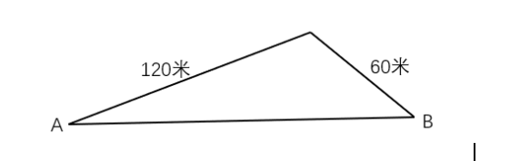
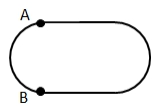
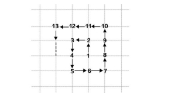
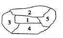

# Table of Contents

* [第一章：数论](#第一章数论)
  * [第一节（4.1）](#第一节41)
  * [第二节（4.3）](#第二节43)
  * [第三节（4.5）](#第三节45)
* [第二章：十大模型](#第二章十大模型)
  * [第四节（4.8）](#第四节48)
  * [第五节（4.10）](#第五节410)
  * [第六节（4.12）](#第六节412)
  * [第七节（4.15）](#第七节415)
  * [第八节（4.17）](#第八节417)
  * [第九节（4.19）](#第九节419)
  * [第十节（4.22）](#第十节422)
* [第三章：三大核心突破思维](#第三章三大核心突破思维)
  * [第十一节（4.24）](#第十一节424)
  * [第十二节（4.26）](#第十二节426)
  * [加练](#加练)
  * [第十三节（4.29）](#第十三节429)
  * [第十四节（5.1）](#第十四节51)
  * [五一加练综合复习题](#五一加练综合复习题)
  * [第十五节（5.5）](#第十五节55)
  * [第十六节（5.6）](#第十六节56)
  * [第十七节（5.8）](#第十七节58)
  * [第十八节（5.10）](#第十八节510)
  * [第十九节（5.12）](#第十九节512)
  * [第二十节（5.13）](#第二十节513)
  * [第二十一节（5.15）](#第二十一节515)
  * [第二十二节（5.17）](#第二十二节517)
* [第四章：计数专题](#第四章计数专题)
  * [第二十三节（5.19）](#第二十三节519)
  * [第二十四节（5.20）](#第二十四节520)
  * [第二十五节（5.22）](#第二十五节522)
  * [第二十六节（5.24）](#第二十六节524)
  * [第二十七节（5.26）](#第二十七节526)
  * [第二十八节（5.27）](#第二十八节527)
  * [第二十九节（5.29）](#第二十九节529)
* [第五章: 行程问题](#第五章-行程问题)
  * [第三十节（5.31）](#第三十节531)
  * [第三十二节（6.3）](#第三十二节63)
  * [第三十三节 (6.5)](#第三十三节-65)
  * [第三十四节 (6.7)](#第三十四节-67)
  * [第三十五节 (6.9)](#第三十五节-69)
  * [第三十六(6.13)](#第三十六613)
  * [第三十七(6.14)](#第三十七614)
* [第六章: 工程问题](#第六章-工程问题)
  * [第三十九(6.17)](#第三十九617)
  * [第四十(6.20)](#第四十620)
* [第七章：销售](#第七章销售)
  * [第四十一(6.21)](#第四十一621)
  * [第四十三(6.24)](#第四十三624)
  * [第四十四(6.26)](#第四十四626)
* [第八章：溶液](#第八章溶液)
  * [第四十五(6.28)](#第四十五628)
* [第九章：排列组合](#第九章排列组合)
  * [第四十七（7.1）](#第四十七71)
  * [第四十八（7.3）](#第四十八73)
  * [第四十九（7.5）](#第四十九75)
  * [第五十（7.12）](#第五十712)


# 第一章：数论

## 第一节（4.1）

1.【2018上海】

现有甲、乙、丙三种货物，若购买甲1件、乙3件、丙7件共需200元；若购买甲2件、乙5件、丙11件共需350元。则购买甲、乙、丙各1件共需（）元。

A.50

B.100

C.150

D.200

2.【2018全国事业统考】

某公司有甲、乙、丙、丁四个事业部，甲和丁事业部人数之和是乙和丙人数之和的2倍，甲事业部人数是乙的5倍，丙事业部人数是丁的3倍。问丁事业部人数相当于四个事业部总人数的：

A.1/12

B.1/14

C.1/16

D.1/18

<div STYLE="page-break-after: always;"></div>

3.【2021广东紧缺公务员招聘】

一艘维修快艇沿着河流逆流而上执行维修任务，快艇航行到途中某处时工具包掉进了河里，10分钟后，驾驶员到达目的地时发现工具包丢失后立即返回追寻。已知水的流速为每秒1米，如果工具包会浮在水面上漂流，那么驾驶员将在距离丢失处（    ）米的地方找回工具包。

A.640

B.900

C.1080

D.1200

4.【2023模考】

甲骑摩托艇、乙划船从上游的泊位同时出发前往下游的露营地，10分钟后甲到达露营地时，乙还需再划5分钟才能到泊位和露营地的中点，但因船桨掉落，只能等待甲返回迎接。已知水速与乙在静水中的船速一致，则甲从露营地出发到接到乙用时多久？（  ）

A.4分钟

B.6分钟

C.8分钟

D.10分钟

<div STYLE="page-break-after: always;"></div>

5.【国家2009】

甲买了3支签字笔、7支圆珠笔和1支铅笔，共花了32元，乙买了4支同样的签字笔、10支圆珠笔和1支铅笔，共花了43元。如果同样的签字笔、圆珠笔、铅笔各买一支，共用多少钱?  

A. 21元          

B. 11元        

C. 10元         

D. 17元 

6.【吉林2014】

某学校组织一次教工接力比赛，共准备了25件奖品分发给获得一、二、三等奖的职工，为设计获得各级奖励的人数，制定两种方案：若一等奖每人发5件，二等奖每人发3件，三等奖每人发2件，刚好发完奖品；若一等奖每人发6件，二等奖每人发3件，三等奖每人发1件，也刚好发完奖品，则获得二等奖的教工有多少人？  

A.  6          

B.  5          

C.  4           

D.  3

<div STYLE="page-break-after: always;"></div>

7.【2024四川】

在一块玉米地中使用甲、乙两台自动播种机进行播种。如只使用甲播种机需要12小时，只使用乙播种机需要20小时，计划同时使用两台播种机完成播种任务。两台播种机共同播种3小时后，乙播种机出现故障用时2小时维修，修好后的效率降低了20%，之后两台播种机共同工作直到任务完成。问实际播种时间比原计划多多长时间？

A.不到1小时

B.1小时-1小时20分之间

C.1小时20分-1小时40分之间

D.1小时40分以上

8.【2018北京】

老张购买学习和生活用品捐赠给山区贫困小学生。3个笔盒、2个皮球和4个杯子一共89元，4个笔盒、3个皮球和6个杯子一共127元。则一个笔盒多少元？

A.10

B.11

C.12

D.13

<div STYLE="page-break-after: always;"></div>

9.【2021浙江】

某俱乐部选拔优秀选手参加游泳比赛，选手在规定时间内游完全程，就能获得参赛资格。

已知有四分之一的选手获得了参赛资格，获得参赛资格选手的平均完成时间比规定时间快 6

秒，未获得参赛资格选手的平均完成时间比规定时间慢 10 秒，所有选手的平均完成时间为

140 秒，则本次选拔的规定时间为多少秒：

A.116

B.125

C.134

D.139

<div STYLE="page-break-after: always;"></div>

## 第二节（4.3）

1.教室里有若干个学生，走了10名女生后，男生人数是女生的2倍，又走了9名男生后，女生人数是男生的5倍，问最初教室有多少人？

A.15

B.20

C.25

D.30

2.某市服务行业举行业务技能大赛，其中东区参赛人数占总人数的1/5 ，西区参赛 人数占总人数的2/5，南区参赛人数占总人数的1/4，其余的是北区的参赛人员。结果东区 参赛人数的1/3获奖，西区参赛人数的1/12获奖，南区参赛人数的1/9获奖。已知参赛总人 数超过100人，不到200人，则参赛总人数为（ ）。

A.120

B.140

C.160

D.180

<div STYLE="page-break-after: always;"></div>

3.甲、乙两个仓库共有货物102吨。如果从甲仓库调出3吨到乙仓库，那么甲仓库的货物正好是乙仓库的2倍。则甲仓库原有货物（  ）吨。

A.31

B.37

C.70

D.71

4.某学院2016级新生男女人数均为三位数，辅导员发现，男生人数的十位数字恰好是百位与个位的乘积，若调换十位和个位，得到的刚好是女生人数。新生男生比女生多63人 ，则该学院2016级新生总人数是多少？

A.1598

B.1699

C.1791

D.1888

<div STYLE="page-break-after: always;"></div>

5.大型体育竞赛开幕式需要列队，共 10 排。导演安排演员总数的一半多一个在第一排，安排剩下演员人数的一半多一个在第 2 排..依次类推。如果在第 10 排拍好将演员排玩，那么参与排队列的演员共有（ ）名。

A.2000

B.2008

C.2012

D.2046

6.姐弟俩相差 3 岁，2000 年姐弟两人年龄之和是妈妈年龄的四分之一，2006 年姐弟两人年龄之和是妈妈年龄的二分之一。问：哪一年姐弟两人年龄之和等于妈妈的年龄?

A.2012

B.2018

C.2024

D.2027

<div STYLE="page-break-after: always;"></div>

7.甲、乙两个单位人数相同，甲单位的党员占总人数的 20%，乙单位的党员占总人数的 25%。如果乙单位 20 名党员与甲单位 20 名群众互换单位，则两个单位党员占比相同。问两个单位共有党员多少人？

A.256

B.288

C.324

D.360

8.办公室有一些黑色和红色的签字笔，最近由于工作需要，每周都会用掉 6 支黑色签字笔和 3支红色签字笔。3 周后整理剩余物资时发现，剩下的红色签字笔的数量是黑色签字笔的 2倍。则办公室原有签字笔至少 （ ）支。

A.27

B.28

C.29

D.30

<div STYLE="page-break-after: always;"></div>

9.年终某大型企业的甲、乙、丙三个部门评选优秀员工，已知甲、乙部门优秀员工数分别占三个部门总优秀员工数的1/3和2/5，且甲部门优秀员工数比丙部门的多12人，问三个部门共评选出优秀员工多少人？

A.120

B.150

C.160

D.180

10.大型体育竞赛开幕式需要列队，共10排。导演安排演员总数的一半多一个在第一排，安排剩下演员人数的一半多一个在第2排..依次类推。如果在第10排拍好将演员排玩，那么参与排队列的演员共有（）名。

A.2000

B.2008

C.2012

D.2046

<div STYLE="page-break-after: always;"></div>

11.某电商网站推出免息分期购物活动，购买某件商品的消费者第一个月只用支付总金额的一半加10元，第二个月支付剩余金额的一半加20元，第三个月支付剩余金额的一半加30元，第四个月付清剩余未支付的10元。问这件商品的价格为多少元（）。

A.400

B.410

C.420

D.460

12.车间领到一批电影票和球票发放给车间工人，电影票是球票数的2倍。如果每个工人发3张球票，则富余2张，如果每个工人发7张电影票，则缺6张。问车间领到多少张球票？

A.32
B.30
C.64
D.60

13.张、王、李三人总共有120本书，张、王的书分别是李的2倍和5倍，则王有多少本书？

A.65

B.70

C.75

D.80

<div STYLE="page-break-after: always;"></div>

14.企业销售甲、乙、丙三种不同的机械，单价分别为 33 万元、17 万元和 13 万元，某月三种设备共销售53台，甲设备的销量是丙设备的 3 倍，且乙设备的销售额比甲、丙设备的销售额之和高1万元，问当月，丙设备的销售额比乙设备少多少万元？

A.385

B.415

C.466

D.496

15.林华全家是阅读爱好者，家里有各种书籍，版本也多。已知他家有五分之三的书是 中文版的,六分之一是英文版的，八分之一是中英文互译版的，还有多于 11 本但少于 17 本是其它版本的， 问他家有多少本英文版书？

A.72 本

B.20 本

C.15 本

D.13 本

<div STYLE="page-break-after: always;"></div>

16.某中学高一至高三年级的学生参加某项社区服务，如果高三年级与高一年级，高三年级与高二年级参加此活动的人数之比分别为5：3、8：5。则该中学高一至高三年级最少共有（ ）人参加该项社区服务。

A. 40

B. 55

C. 79

D. 89

17.某次数学竞赛准备了22支铅笔作为奖品发给一、二、三等奖的学生，原计划一等奖每人发6支，二等奖每人3支，三等奖每人发2支。后来又改为一等奖每人发9支，二等奖每人4支，三等奖每人1支，获总共有多少人获奖？\
A.5    

B.6    

C.7    

D.8

<div STYLE="page-break-after: always;"></div>

## 第三节（4.5）

1.【2011国考】

某公司去年有员工830人，今年男员工人数比去年减少6%，女员工人数比去年增加5%，员工总数比去年增加3人。问今年男员工有多少人?

A.329

B.350

C.371

D.504

2.【2024联考】

某单位为解决职工暑期"带娃难"的问题，开设了暑托班。开班时男孩与女孩的比例为3：4，后来有2个男孩、1个女孩退出暑托班，此时男孩与女孩的比例为2：3。那么开班时女孩有多少人?

A.10

B.12

C.14

D.16

<div STYLE="page-break-after: always;"></div>

3.【2023模考题】

M=2\*4\*6\*8\...\....\*n,已知数M的末尾连续有4个"0"，则数n的最小值是（）

A.40

B.60

C.80

D.90

4.王师傅要加工一批零件，若每小时多加工12个零件，则所用的时间比原计划少1/9；若每小时少加工16个，则所用的时间比原来多3/5小时.这批零件有多少个？

A.250

B.288

C.350

D.420

<div STYLE="page-break-after: always;"></div>

5.【2012联考】

3\^2010+4\^2011+8\^2012的个位数为：

A.9

B.8

C.6

D.4

6.【2023天津事业】

某大型赛事的开幕式需要列队，共8排。导演安排演员总数的一半多一个在第一排，安排剩下演员人数的一半多一个在第2排······依此类推。如果在第8排恰好将演员排完，那么参与排队列的演员共有多少名？（    ）

A.504

B.510

C.615

D.522

<div STYLE="page-break-after: always;"></div>

7.【2024浙江省考】

甲、乙两个施工队共同完成一项工程需要20天。甲乙两队合作4天后，乙队因故退出6天后回归，回归时工程总量已完成40%。为保证按时完工，乙队回归时带来了丙施工队，甲、乙、丙三队共同工作10天后刚好完成工程。问甲、乙、丙队的效率比为多少？

A.3:6:10   

B.4:8:15

C.6:3:2   

D.10:5:3

8.【2024江苏省考】

一列长为210米的动车以180千米/小时的速度行驶。小李拍窗外风景视频时，恰好拍到平行铁轨上一列长420米、相向而行的高速列车，该列车经过窗户的时间是3.6秒。若窗户长度忽略不计，则该高速列车的速度为：

A. 200千米/小时

B. 260千米/小时

C. 240千米/小时

D. 320千米/小时

<div STYLE="page-break-after: always;"></div>

9.【2011联考安徽】

1\^2+2\^2+3\^2+\.....+123456789\^2的个位数字是：

A.3

B.4

C.5

D.6

10.【2024浙江省考】

某公司招聘员工，来应聘的男女人数比是18:17,最后被录取的有280人，其中男女人数比是3:4,未被录取的男女人数比是6:5。问来应聘的共有多少人？

A.630   

B.720

C.1050   

D.1400

<div STYLE="page-break-after: always;"></div>

11.【2024广东】

某家政公司承诺以低于市场价20％的价格为小区业主提供服务。如果有业主向该公司支付了服务费4000元，则与市场价相比优惠了（ ）元。

A.400

B.600

C.800

D.1000

12.【2024江苏省考】

某银行引进机器人提高服务效率。某岗位小张、小邓和小曹完结1单任务分别需要6分钟、5分钟和4分钟，3个人1天最多可完结259单。机器人处理一单仅需2分钟，处理工单中的80%可正常完结，剩余的20%仍需人工宣新办理。若某天小张出差，则当天小邓、小曹和机器人（机器人与人的工作时间相同）最多可完结的工单总量为：

A.357单

C.430单

B.370单

D.459单

<div STYLE="page-break-after: always;"></div>

13.【2017联考】

某企业在软件园区的分公司有甲、乙2个开发团队，现从乙团队调走25人，此时甲、乙团队人数比为4:3，然后又从甲团队调走42人，此时甲、乙团队人数比为2:5。问两次调动之前，甲、乙团队人数比为：

A.3:4

B.6:7

C.1:2

D.2:5

14.【2020江苏】

某企业按三个等级给员工发放奖金，一、二、三等奖的获奖人数之比为 1：3：10，奖金总额之比为 2：3：1。已知获奖员工总数 126 人，发放奖金总额 16.2 万元，则三等奖的奖金是

A.250 元

B.300 元

C.350 元

D.400 元

15.【2020浙江事业】

有一堆玻璃珠,若按2个一组分开,最后剩下1个;若按3个一组分开,最后剩下2个;若按5个一组分开,最后剩下4个;若按6个一组分开,最后剩下5个;若按7个一组分开,最后一个也不剩。问这堆玻璃珠至少有多少个? 

A.105

B.119

C.126

D.133

<div STYLE="page-break-after: always;"></div>

# 第二章：十大模型

## 第四节（4.8）

1.甲、乙工程队需要在规定的工期内完成某项工程，若甲队单独做，则要超工期9天完成，若乙队单独做，则要超工期16天才能完成，若两队合做，则恰好按期完成。那么，该项工程规定的工期是：

A. 8天

B. 6天

C. 12天

D. 5天

2.小张每天固定时间骑摩托车从家里到乡镇的木材加工厂上班，如果他以 30 千米/小时的速度行驶，会比上班时间提前 10 分钟到达加工厂，如果他以 20 千米/小时的速度行驶，则会迟到 12 分钟。如果小张某天迟到了 6 分钟，则他的当天行驶速度是多少千米/小时？

A.22

B.23

C.24

D.25

<div STYLE="page-break-after: always;"></div>

3.将一个三位数的个位数字和百位数字调换后所得的三位数与原三位数的和是 1070，差是 198，这个三位数是：

A.218

B.327

C.436

D.524

4.一个工程由甲单独完成需4天，如果甲、乙两人一起工作3天完成，则乙单独完成此工程需要（    ）天。

A.6    

B.8    

C.10   

D.12

<div STYLE="page-break-after: always;"></div>

5.一辆汽车从A地运货到B地，若该车的速度增加20千米/小时，可以提前45分钟到达B地，若该车的速度减少12千米/小时，到达B地的时间将延迟45分钟，则A地与B地之间的距离为多少千米？

A.164

B.176

C.180

D.196

E.200

F.212

G.244

H.256

6.某单位本科、研究生学历的职工人数之比为 7∶5。上半年公开招聘本科毕业生若干人后，

本科与研究生之比为 3∶1；下半年通过引才计划引入研究生若干人后，本科与研究生之比

为 15∶8。已知该年度引进的本科生比研究生多 10 人，则该单位原有本科与研究生学历的

职工共（ ）人。

A.12

B.24

C.36

D.48

<div STYLE="page-break-after: always;"></div>

7.一工厂生产的某规格齿轮的齿数是一个三位数的质数（除了 1 和它本身之外，不能被其他整数整 除的正整数），其个、十、百位数字各不相同且均为质数。若将该齿数的百位数字与个位数字对调，所得新的三位数比该齿数大 495，则该齿数的十位数字为：

A.7

B.5

C.3

D.2

8.一项工程甲乙两人合作完成需要6天时间，若由甲单独完成此项工程比乙单独做所需时间多5天，则甲单独完成需要（    ）天。

A.10    

B.12    

C.15   

D.18

<div STYLE="page-break-after: always;"></div>

9.有一行人和一骑车人都从A向B地前进，速度分别是行人3.6千米／小时，骑车人为10.8千米／小时，此时道路旁有列火车也由A地向B地疾驶，火车用22秒超越行人，用26秒超越骑车人，这列火车车身长度为( )米。

A.232

B.286

C.308

D.1029.6

10.社区工作人员小吴在统计辖区人口的年龄时，不小心将某人年龄的十位数字与个位数字交换了位置，则以下可能为其错误年龄与实际年龄的差值的是：

A.45

B.46

C.47

D.48

<div STYLE="page-break-after: always;"></div>

11.李明国庆节假期要做若干道英语试题，第一天做了这些试题的一半多1道，第二天做了剩下的一半多1道，第三天又做了剩下的一半多1道后，还剩1道试题。那么李明国庆节假期总共要做( )道英语试题。

A.12

B.16

C.22

D.24

12.两辆汽车同时从两地相向开出，甲车每小时行驶 60 千米，乙车每小时行驶 48 千米，两车在离两地中点 48 千米处相遇。则两地相距（ ）千米

A．192

B．224

C．416

D．864

<div STYLE="page-break-after: always;"></div>

13.甲、乙二人分别从A、B两地驾车同时出发，匀速相向而行，甲车的速度是乙车的2/3,两车开出6小时后相遇，相遇后以原速继续前进。问甲比乙晚几个小时到达目的地:

A.2

B.3

C.4

D.5

14.工厂有一批零件订单，甲生产线单独完成比乙生产线少用10天，甲、乙生产线共同生产需要12天。现决定先由甲、乙生产线共同生产一段时间后，再由乙生产线单独生产15天完成这批零件。问甲、乙生产线共同生产了多少天？

A.3

B.4

C.5

D.6


15.某工程队承担一项工程，由于天气原因，工期将延后 10 天。为了按期完工，需增加施工人员。若增加 4 人，工期会延后 4 天；若增加 10 人，工期将提前 2 天。假设每人工作效率相同，为确保按期完工，则工程队最少应增加的施工人员数是（）

A.6

B.7

C.8

D.9

<div STYLE="page-break-after: always;"></div>

## 第五节（4.10）

1.某体育训练中心，教练员中男占 90％，运动员中男占 80％，在教练员和运动员中男占 82％， 教练员与运动员人数之比是（ ）

A. 2：5

B. 1：3

C. 1：4

D. 1：5

2.某高校今年计划招收各类学生6630人，比去年增长2%，其中本科生比去年减少4%，研究生的招生计划数比去年增加9%。那么，该校今年研究生的招生计划数为：

A.3052人

B.3161人

C.3270人

D.3379人

<div STYLE="page-break-after: always;"></div>

3.现有AB两辆车，其中A装有12件商品，B装有8件商品。后将A车最轻的4件商品放入B车，B车平均每件商品重量增加了2公斤，A车平均每件商品重量增加了1公斤.在商品调动之前，A,B两车平均每件商品重量相差多少公斤？

A.2

B.4

C.6

D.8


4.在环保知识竞赛中，男选手的平均得分为80分，女选手的平均得分为65分，全部选手的平均得分为72分。已知全部选手人数在35到50之间，则全部选手人数为（  ）。

A. 48

B. 45

C. 43

D. 40

<div STYLE="page-break-after: always;"></div>

5.校长去机票代理处为单位团购票 10 张，商务舱定价 1200 元/张，经济舱定价 700 元。由于买的数量多，代理商给予优惠，商务舱按定价的 9 折付钱，经济舱按定价 6 折付钱，如果他付的钱比按定价少 31%，那么校长一共买了经济舱几张?

A．6

B．7

C．8

D．9

6.一项工程，甲工作20天后，若乙来帮忙，可提前6天，若是丙来帮忙，可提前8天，丙工效是乙工效的1.5倍。如果从一开始就是甲、乙、丙一起做，需要多少天完成？\
A.24    

B.25    

C.28    

D.30

<div STYLE="page-break-after: always;"></div>

7.某单位依据笔试成绩招录员工，应聘者中只有 1/4 被录取。被录取的应聘者平均分比录取分数线高 6分，没有被录取的应聘者平均分比录取分数线低 10 分，所有应聘者的平均分是 73 分。问录取分数线是多少分?

A.80

B.79

C.78

D.77

8.甲、乙两种糖果的单价分别为20元/千克和24元/千克，将两种糖果按一定的比例混合销售．在两种糖果混合比例保持不变的情况下，将甲种糖果的售价上涨8%，乙种糖果的售价下跌10%，使调整前后混合糖果的单价保持不变，则甲乙两种糖果的混合比例应为：

A.1：2

B.3：2

C.4：3

D.5：3

<div STYLE="page-break-after: always;"></div>

9.某单位共有 A.B.C.三个部门，三部门人员平均年龄分别为 38 岁，24 岁，42 岁，A 和 B 两部门人员平均年龄为 30 岁，B 和 C 两部门人员平均年龄为 34 岁，该单位全体人员的平均年龄为多少岁？

A.34

B.36

C.35

D.37

10.烧杯中装了100克浓度为10%的盐水。每次向该烧杯中加入不超过14克浓度为50%的盐水，问最少加多少次之后，该烧杯中盐水浓度能达到25%？（    ）（假设烧杯中盐水不会溢出）

A.3           

B.4           

C.5           

D.6 

<div STYLE="page-break-after: always;"></div>

11.某高校艺术学院分音乐系和美术系两个系别，已知学院男生人数占人数的30％，且音乐系男女生人数之比为1︰3，美术系男女生人数之比为2︰3，问音乐系和美术系的总人数之比为多少（ ）

A．5︰2

B．5︰1

C．3︰1

D．2︰1

12.小喜去中关村批发商品，买了笔记本和 iPhone 手机共 110 件。笔记本定价为每台 3600 元，iPhone手机的定价为每部 5000 元，由于买的数量较多，商店给予优惠，笔记本打 9 折，iPhone手机打九八折，最后支付的金额比定价少 5%，那么他买了笔记本（ ）件。

A.30

B.40

C.50

D.60

<div STYLE="page-break-after: always;"></div>

13.现有若干支铅笔，若只平均分给一年级一班的女生，每名女生可以得到15支，若只平均分给该班的男生，每名男生可以得到10支。现将这些铅笔平均分给该班的所有同学，则每名同学可以得到（ ）支铅笔。

A. 4　　

B. 5　　

C. 6

D. 7　　

E. 8　　

F. 9　　

G. 10　　

H. 11

14.某俱乐部选拔优秀选手参加游泳比赛，选手在规定时间内游完全程，就能获得参赛资格。已知有四分之一的选手获得了参赛资格，获得参赛资格选手的平均完成时间比规定时间快 6秒，未获得参赛资格选手的平均完成时间比规定时间慢 10 秒，所有选手的平均完成时间为140 秒，则本次选拔的规定时间为多少秒：

A.116

B.125

C.134

D.139

15.浓度分别为 68%、72%、78%的三种酒精溶液的总质量为 240 克。若将它们全部混合，则可得浓度为 74%的酒精溶液；若只将浓度为 72%和 78%的酒精溶液混合，则得浓度为 76%的酒精溶液。这三种酒精溶液中，浓度为 72%的酒精溶液质量为

A. 30 克

B. 40 克

C. 48 克

D. 60 克

<div STYLE="page-break-after: always;"></div>

## 第六节（4.12）

1.甲和乙两个企业2020年的销售额共3200万元，2021年甲乙企业的销售额分别增长10%和30%，两企业销售额总计增长800万元，问2021年甲企业的销售额比乙企业？

A.低2000万元以上

B.低不到2000万元

C.高不到2000万元

D.高2000万元以上

2.某地劳动部门租用甲、乙两个教室开展农村实用人才培训。两教室均有5排座位，甲教室每排可坐10人，乙教室每排可坐9人。两教室当月共举办该培训27次，每次培训均座无虚席，当月培训1290人次。问甲教室当月共举办了多少次这项培训?

A.8

B.10

C.12

D.15

3.某幼儿园的育才班和育人班两个班级的图书数量为7：9，当育人班拿出18本书给育才班后，育才班和育人班两个班级的图书数量比为9：7，问两个班级共有图书多少本？（ ）

A.144

B.153

C.171

D.189

4.某单位有甲、乙两个部门，甲部门的男女人数之比为3：2。现将甲部门的5名男员工调到乙部门，同时乙部门的5名女员工调到甲部门，此时甲部门的男女人数之比为4：3，且甲、乙两个部门的男员工人数之比为5：3。问乙部门原有男员工多少人？

A.45

B.55

C.60

D.65

5.某公司研发出了一款新产品，当每件新产品的售价为3000元时，恰好能售出15万件。若新产品的售价每增加200元时，就要少售出1万件。如果该公司仅售出12万件新产品，那么该公司新产品的销售总额为：

A.4.72亿元

B.4.46亿元

C.4.64亿元

D.4.32亿元

6.某水果商按6元/斤的价格购进一批水果，每天都比前一天降价1元/斤进行销售，最后一天的销售价格为进价的1.5倍。每天销售24斤，最后剩余60斤水果因腐烂无法售卖。若总利润与总进货成本相等，则这批水果共有多少斤？

A.288

B.312

C.348

D.408

7.有红、黄、白三种球共160 个。如果取出红球的1/3，黄球的1/4，白球的1/5，则还剩120 个；如果取出红球的1/5，黄球的1/4，白球的1/3，则剩116 个，问原有黄球几个？

A.48

B.40

C.60

D.20

8.某工作室需要烧制一批杯子和杯盖，要求按照1：1的数量之比配套，共需要330套。师傅每天可烧制30个杯子或36个杯盖，徒弟每天可烧制20个杯子或25个杯盖。师徒二人同时工作若干天后，完成全部烧制工作，其中师傅烧制的杯子比杯盖多30个。问全部烧制完成用了多少天？

A.12

B.13

C.14

D.15

9.甲、乙、丙三人在2018年的年龄（周岁）之和为75，两年后甲的年龄是乙的年龄的两倍，三年后丙的年龄是乙的年龄的两倍，问丙是哪一年出生的？（ ）

A.1987

B.1988

C.1989

D.1990

10.某市徒步协会组织了一项"清洁海岸线"公益活动。志愿者早上 7 点从市区集合出发。 徒步前往市郊海岸线起点，然后沿海岸线捡拾垃圾。到达海岸线终点后立即沿原路折返。下午 1 点到达集合点一起收垃圾，已知志愿者正常的徒步速度为 8km/h，捡拾垃圾的徒步速度为 4km/h，返程负重的徒步速度为 6km/h。去程与返程所用时间相同，则该段海岸线长（ ） km。

A.4

B.6

C.12

D.18

11.工厂有5条效率不同的生产线。某个生产项目如果任选3条生产线一起加工，最快需要6天整，最慢需要12天整；5条生产线一起加工，则需要5天整。问如果所有生产线的产能都扩大一倍，任选2条生产线一起加工最多需要多少天完成？

A.11

B.13

C.15

D.30

12.甲和乙共同完成一项生产任务，若甲单独干，比原定工期提前一天完成；若乙单独干，则超原定工期9天才可完成。实际生产时，乙单独干了任务的一半，之后甲加入生产，刚好如期完工。求原定工期为（ ）天？

A.21

B.20

C.27

D.30

13.商店做促销活动，购买店内商品第一件原价，第二件（价格不高于第一件）4 折，第三件（价 格不高于第二件）1 折。小刘买了 1 件 A 和 2 件 B 商品，优惠后的总价格相当于定价的 56.25%。 已知 A 商品比 B 商品贵，则按原价买 10 件 A 商品的钱最多可以按原价买多少件 B 商品？

A.20

B.16

C.14

D.12

14.超市进了两批调料，第二批调料的进价比第一批提高了10%，进货量是第一批的2倍。已知第一批调料按照19%的利润率售完，为了保证第二批售完时两批调料的总利润率不低于30%，则第二批调料的利润率至少为多少？（ ）

A.32%

B.33%

C.34%

D.35%

15.甲乙两人同时从A沿直线去B地，甲每小时比乙多走1公里，比乙早3小时到达；如果两人都将时速提高1公里，那么甲只能比乙早2小时到达，两地间距多少公里？

A.30

B.60

C.90

D.120

## 第七节（4.15）

1.零件加工厂按照工人完成的合格零件和不合格零件支付工资，工人每做出一个合格零件能得到工资10元，每做一个不合格零件将被扣除5元，已知某人一天共做了12个零件，得工资90元，那么他在这一天做了多少个不合格零件？

A.2

B.3

C.4

D.6

2.邮递员派送平邮和EMS各一件分别可以得到7元和10元的补助，某邮递员一天派送了14件快递，共得到补助119元，则该邮递员当天派送了平邮( )件。

A.7

B.8

C.9

D.10

3.12个啤酒空瓶可以免费换1瓶啤酒，现有101个啤酒空瓶，最多可以免费喝到的啤酒为：

A.10瓶

B.11瓶

C.8瓶

D.9瓶

4.甲乙两队举行智力抢答比赛，两队平均得分为92分，其中甲队平均得分为88分，乙队平均得分为94分，则甲乙两队人数之和可能是:

A.20

B.21

C.23

D.25

5.小赵承包了一项装修水电改造工程。他先用时5天完成全部工程量的1/5 ，接着与自己的徒弟小钱合作2t天完成了剩余工程量的一半。为了赶工期，又请到自己的师傅老孙加入，三人又花了t天完成剩余所有工作。已知小钱和老孙的效率之比为2:5，则整个工程共耗时多少天？（ ）

A.12

B.14

C.15

D.16

6.铺设一条自来水管道，甲队单独铺设8天可以完成，而乙队每天可铺设50米。如果甲、乙两队同时铺设，4天可以完成全长的2/3 ，这条管道全长是多少米：

A. 1000米

B. 1100米

C. 1200米

D. 1300米

7.一家商店在世界杯期间搞促销，凭5个空瓶可以换一瓶啤酒。晚上，小王邀请了5个朋友一起看球赛，问至少买多少瓶啤酒，才能保证他们每人都能喝到三瓶啤酒？

A.12

B.14

C.15

D.19

8.昨天，某服装店正装与休闲装的总销售额为7000元，今天，该店正装销售额增长10%，休闲装限售额减少8%，总销售额减少110元，那么昨天正装销售额为（）元。

A.2500

B.3000

C.4000

D.4500

9.老张购进一批商品，共 20 件。销售时，每件合格的商品可以赚 50 元，不合格的商品一件亏20元。他卖出的这20件商品中有几件是不合格的，那么卖出这批商品可能赚：

A.690 元

B.720 元

C.780 元

D.850 元

10.已知 2017 年、2018 年和 2019 年全球共发射卫星 1132 颗，2019 年发射的卫星数量是 2017 年的 1.5 倍还多 2 颗，2018 年比 2017 年多 31 颗，则 2019 年全球共发射卫星：

A.314 颗

B.345 颗

C.452 颗

D.473 颗

11.某单位员工中，75%的人为党员，其余为群众，60%的员工拥有资格证书。已知群众和党员分别有x%和y%的人拥有资格证书，且y-x=20，问x的值为：

A.40

B.45

C.60

D.65

12.某高校学生宿舍实行用电定额制，每个月定额内每度电0.5元，超过定额后每度电涨价60%。某寝室上月用电35度，交费22元。问每个宿舍的用电定额是每个月多少度？

A.16

B.20

C.26

D.30

13.某浇水装置可根据天气阴晴调节浇水量，晴天浇水量为阴雨天的 2.5 倍。灌满该装置的水 箱后，在连续晴天的情况下可为植物自动浇水 18 天。小李 6 月 1 日 0︰00 灌满水箱后，7 月 1 日 0︰00 正好用完。问 6 月有多少个阴雨天（ ）

A．10

B．16

C．18

D．20

14.某水站计划向干旱地区送水。已知该水站有载水量为18和25的中、大型水车各若干辆。现将31辆水车全部装满出发，运送总水量不到750，问最多出动了多少辆大型水车?

A.26

B.27

C.28

D.29

15.某企业在软件园区的分公司有甲、乙2个开发团队，现从乙团队调走25人，此时甲、乙团队 人数比为4:3，然后又从甲团队调走42人，此时甲、乙团队人数比为2:5。问两次调动之前， 甲、乙团队人数比为：

A.3:4

B.6:7

C.1:2

D.2:5

## 第八节（4.17）

1.一个盒子里有乒乓球 100 多个，如果每次取 5 个出来最后剩下 4 个，如果每次取 4

个最后剩 3 个，如果每次取 3 个最后剩 2 个，那么如果每次取 12 个最后剩多少个？

A.11

B.10

C.9

D.8

2.某机关事务处集中采购了一批打印纸，分发给各职能部门。如果按每个部门 9 包分发，则多 6 包；如果按每个部门 11 包分发，则有 1 个部门只能分到 1 包。这批打印纸的数量是

A.87 包

B.78 包

C.69 包

D.67 包

3.甲乙两个办公室的员工都不到20人，如果从甲办公室调到乙办公室若干人，则甲的人数是乙的人数的2倍；如果乙调到甲办公室相同的人数，则甲的人数就是乙的3倍，则原来甲办公室有多少人？

A. 16

B. 17

C. 18

D. 19

4.甲杯中有浓度为15%的盐水若干克，乙杯中有浓度为25%的盐水若干克。现要配置

100克的盐水，方案一是用甲杯中的全部盐水和乙杯中的部分盐水，配置出浓度为17%

盐水；方案二是用乙杯中的全部盐水和甲杯中的部分盐水，配置出浓度为21%盐水。则

甲杯和乙杯中的盐水一共有多少克？

A.140

B.120

C.160

D.150

5.桌面上有若干个黑色棋子，若每8个黑色棋子排成一排，则多出5个黑色棋子；若每13

个黑色棋子排成一排，则多出10个黑色棋子。现将黑色棋子从左到右排成一排，从左边

第1个黑色棋子开始（第一个也需要替换），每隔5个黑色棋子，将1个黑色棋子替换为2

个白色棋子。最终桌面上至少有多少个白色棋子？

A.32

B.34

C.16

D.42

6.袋子中有红笔、蓝笔若干支。若每次拿出1支红笔和1支蓝笔，最后袋子中会只剩蓝笔150支；若每次拿出1支红笔和4支蓝笔，最后袋子中会只剩红笔30支。那么袋子中原来共有红笔和蓝笔多少支？

A.180

B.240

C.300

D.330

7.吕某回乡开办土鸡养殖基地, 某天他收获一筐土鸡蛋。 每 4 个一组取出则多 2 个; 每 5 个一组取出则少 1 个; 每 6 个一组取出则刚好; 每 7 个一组取出多 1 个。 已知 一筐最多能装 500 个土鸡蛋, 如果每 6 个一组取出, 需要多少次刚好取完?

A.67

B.69

C.70

D.72

8.李老板购进一款衣服，进价100元/件，加价30%出售，半年后将剩下的打7折全部售出，共盈利7410元。若成本利润率为19%, 则打7折售出的衣共有：

A. 125 件

C. 115 件

B. 120 件

D. 110 件

9.某牧民饲养公羊和母羊共140只，一次共剪羊毛160斤。若每只公羊平均剪毛1斤2两，每只母羊平均剪毛8两，问公羊比母羊多多少只？

A.120

B.100

C.80

D.75

10.不超过100名的小朋友站成一列。如果从第一人开始依次按1，2，3，\...，9的顺序循环报数，最后一名小朋友报的是7；如果按1，2，3，\...，11的顺序循环报数，最后一名小朋友报的是9，那么一共有多少名小朋友：

A.98

B.97

C.96

D.95

11.三个运动员跨台阶，台阶总数在100〜150级之间，第一位运动员每次跨3级台阶，最后一步还剩2级台阶。第二位运动员每次跨4级，最后一步还剩3级台阶。第三位运动员每次跨5级台阶，最后一步还剩4级台阶。则这些台阶总共有多少级

A.119

B.121

C.129

D.131

12.在某公司年终晚会上，所有员工分组表演节目。如果按7男5女搭配分组，则只剩下8名男员工；如果按9男5女搭配分组，只剩下40名女员工。该公司员工总数为（ ）。

A.446

B.488

C.508

D.576

13.某单位组织员工外出活动，所有员工刚好坐满10辆客车。已知大客车每辆乘坐50人，小客车每辆车坐30人，大客车比小客车一共多做了260人。则大客车有（ ）辆。

A.3

B.4

C.6

D.7

14.在一次马拉松比赛中，某国运动员包揽了前四名，他们佩戴的参赛号码很有趣：运动员甲的号码加 4，乙的号码减 4，丙的号码乘 4，丁的号码除以 8，所得的数字都一样。这四个号码中有 1 个三位数号码，2 个两位数号码，1 个一位数号码，且其中一位运动员在比赛中取得的名次也与自己的号码相同。那么其中三位数的号码为：

A.120

B.128

C.256

D.512

15.某老旧写字楼重新装修，需要将原有的窗户全部更换为单价 90 元的新窗户，已知每 7 扇换下来的旧窗户可以跟厂商兑换一个新窗户，全部更换完毕后共花费 16560 元且剩余 4 个旧窗户没有兑换，那么该写字楼一共有多少扇窗户？

A.214

B.218

C.184

D.188

## 第九节（4.19）

1.一群大学生进行分组活动，要求每组人数相同，若每组 22 人，则多出一人未分进组;若少分一组，则恰好每组人数一样多，已知每组人数最多只能 32 人，则该群学生总人数是( )

A.441

B.529

C.536

D.528

2.3个质数的和是80，这3个质数的乘积最大是多少？

A.1517

B.3034

C.1668

D.3336

3.在一堆桃子旁边住着 5 只猴子。深夜，第一只猴子起来偷吃了一个， 剩下的正好平均分成 5 份，它藏起自己的一份，然后去睡觉。过了一会儿，第二只猴子起来也偷吃了一个，剩下的也正好平均分成 5 份，它也藏起自己的一份，然后去睡觉，第三、第四、第五只猴子也都依次这样做。问那堆桃子最少有多少个？(  )

A.4520

B.3842

C.3121

D.2101

4.学生在操场上列队做操，只知人数在90-110之间。如果排成3排则不多不少：如果排成5排则少2人，排成7排则少4人。则学生人数是多少？

A.102      

B.98    

C.104   

D.108

5.踢毽子有内踢、直踢、外踢、膝击、叉踢、背踢、倒勾和踹毽八种基本动作。在一次踢毽子比赛中规定：前五种基本动作每次记1分；后三种基本动作由于难度较高，每次记3分。方华在1分钟内完成了35个基本动作，总分为69分。那么方华完成了多少个3分动作。

A.16

B.17

C.18

6.元旦晚会上，将本年级的 100 名同学用 1---100 个自然数进行编号，每位同学手持若干朵鲜花，每个人要拿出一朵赠送给编号为自己倍数的小伙伴，那么第 84 号同学最终会收到多少朵鲜花：

A.9

B.10

C.11

D.12

7.一停车场停了250辆车，包括四轮汽车、三轮摩托车、两轮摩托车，共有680个轮子，四轮汽车比三轮摩托多30辆。问两轮摩托有多少辆？

A.50

B.75

C.100

D.140

8.现有一个程序作用于编号为 1\~1000 的盒子，程序运行规则如下：第 n 次运行，

在所有编号为 n 的倍数的盒子中添加 1 个彩球。如果程序运行了 1000 次，此时编号

360 的盒子里有多少个彩球：

A.24

B.115

C.1005

D.4725

9.某创业团队为方便员工通勤，在单位福建租赁了公寓供员工休息，租赁费用为每月280元/人，今年新招聘4名员工，在租赁费用总额不变的情况下。租赁费用降至每月240元/人，问该团队租赁公寓每月花费多少元？

A.1120

B.3360

C.6720

D.7840

10.对一批编号为1---100的，全部为打开状态的灯，按如下顺序操作：凡是编号为1的倍数的拨动一次开关，凡是2的倍数的再拨动一次开关，凡是3的倍数的再拨动一次......凡是100的倍数的再拨动一次，问最后为关灯状态的灯一共有几盏？

A.8

B.10

C.12

D.13

11.甲、乙两种商品成本共2000元，商品甲按50%的利润定价，商品乙按40%的利润定价，后来打折销售，两种商品都按定价的80%出售，结果仍可得利润300元，甲种商品的成本是（）。

A.700元

B.750元

C.800元

D.850元

12.某水果店批发了若干哈密瓜，第一天卖出总数的一半，第二天卖出余下的一半后还剩6个，则该水果店共批发了几个哈密瓜。

A.42

B.36

C.30

D.24

13.十一"期间某游乐园推出儿童免门票的活动，成人和儿童入园数量都比"十一"前翻一番，入园总人数达到3000人，门票收入则增加了六成。已知成人票每张200元，儿童票每张100元，问"十一"期间门票收入为多少？（    ）

A.32万元

B.40万元

C.48万元

D.54万元

14.某测试共有100道题，答对一道题得3分，不答或答错一道题扣2分，小张测试成绩为285分，则他一共答对了多少道题？

A.85

B.90

C.95

D.97

15.车间里要加工的手套副数是口罩个数的2倍，如果每位工人加工3个口罩，则还需额外生产2个口罩；如果每位工人加工7副手套，则会超额完成6副手套。如每位工人每5分钟可生产1副手套或1个口罩，且车间内的工人数减少一半。问至少需要多少分钟才能完成全部生产任务：

A.85

B.90

C.95

D.100

## 第十节（4.22）

1.一块由两个正三角形拼成的菱形土地 ABCD 周长为 800 米，土地周围和中间的道路如图所示， 其中 DE、BF 分别与 AB 和 CD 垂直。如要从该土地上任何一点出发走完每一段道路，问需要 行进的距离最少是多少米?

{width="5.0784722222222225in" height="2.002083333333333in"}

2.一人爬有20个阶梯的楼梯，假定每次向上爬5个阶梯，又下走3个阶梯，问该人需几次能跑到楼梯顶部?

A.7

B.8

C.9

D.10

3.有四位小朋友的体重都是整数千克,他们两两合称体重,共称了5次,称得的千克数分别为99、113、125、130、144.其中有两人没有一起称过,那么这两人中体重较重的人的体重是多少?

A.66

B.67

C.68

D.69

{width="2.4159722222222224in" height="1.1680555555555556in"}4.小赵从家出发去单位上班要经过多条街道（如下图），假如他只能向西或向南行走，则他上班有多少种不同的走法？

A.6

B.24

C.32

D.35

5.某年级有甲、乙、丙三个班级，三个班级的期末考试平均成绩分别为70分、88分和74分。若甲班和乙班的平均成绩为78分，乙班和丙班的平均成绩为82分。问该年级的期末考试平均成绩为多少分？

A.75

B.77

C.79

D.81

6.软件园投入一笔资金用于奖励园内优秀企业。如果评出的优秀企业占总企业数的10%，每家奖励100万元，资金将结余150万元；如果评出的优秀企业占25%，每家奖励50万元，则还需额外投入200万元。问软件园共有多少家企业？（    ）

A.100

B.120

C.140

D.160

7.某人决定从西安到北京自驾游，可供他选择的道路如下图所示，如果他每次只能由西南向东北方向行驶，则他到北京有多少种不同的行驶路线？

{width="3.5229166666666667in" height="1.698611111111111in"}A.8

B.9

C.10

D.11

{width="2.1277777777777778in" height="1.5729166666666667in"}8.燃气公司欲在某新建楼盘内铺设天然气管道连通所有住宅楼，楼与楼之间可铺设管道的路线如图所示，圆圈表示各住宅楼，线段及线上数字表示路线及其长度（单位：百米），则铺设的管道最短长度是：

A.1800米

B.1850米

C.1950米

D.2000米

9.有100个编号为1―100的罐子，第1个人在所有编号为1的倍数的罐子中倒入1毫升水，第2个人在所有编号为2的倍数的罐子中倒入1毫升水，......，第100个人在所有编号为100的倍数的罐子中倒入1毫升水，问此时第92号罐子中装了多少毫升的水？

A.2

B.6

C.46

D.92

10.如图所示，小田从家出发去会展中心要经过多条街道，他和小鹏约好先到M地汇合，然后再一起去。若小田只能向正北或正东方向前进，则小田从家到会展中心的走法有多少种？

{width="2.2916666666666665in" height="1.5666666666666667in"}A.20

B.30

C.55

D.105

11.某单位有不到 100 人参加远足活动，如将该单位人员平均分成 N 组（N\>1 且每组人数\>1），则每组的人数有且仅有 6 种不同的可能性。则该单位参加活动的人数可能的最小值和最大值之间相差多少人？

A.32

B.48

C.56

D.64

```
坐这题先要知道一个前提条件
假设人数为8
1 8
8 1
4 2
2 4   是不是又4个符合的，但是大于1的话只有2个
代入题目
符合条件数就是应该为约数的数量减掉2=6
那么原来约数就是8 
根据质数的约数的情况 就是 2*4
最小的质数是2 
最小的数：那就是2^3 * 3^1 
最大的数：那就是2^3 * x  x 最大是多少？ 8*13 大了 只能是11

88-24=64 【其实也可以直接看8倍数，但是全都是 坑】

```

12.小明参加迷宫游戏，迷宫设在圆形区域内（布局如下图所示），游戏规定只能向正东或正南方向行走，那么小明从迷宫入口到出口共有（    ）种走法。

A.2

{width="2.8131944444444446in" height="1.7201388888888889in"}B.4

C.6

D.8

13.某年级有甲、乙、丙三个班级，三个班级的期末考试平均成绩分别为70分、88分和74分。若甲班和乙班的平均成绩为78分，乙班和丙班的平均成绩为82分。问该年级的期末考试平均成绩为多少分？

A.75

B.77

C.79

D.81

14.【附加难题思考】

在整数中，有用2个以上的连续自然数的和来表达一个整数的方法．例如9：9=4+5，9=2+3+4，9有两个用2个以上连续自然数的和来表达它的方法．

请写出只有3种这样的表示方法的最小自然数．

请写出只有6种这样的表示方法的最小自然数．

15.【附加难题思考】

某展览使用了序号为1---100的100盏灯，现在有两个开关，开关A能切换所有序号为偶数的灯的开关状态，开关B能切换所有序号为3的倍数的灯的开关状态，若在100盏灯都打开的状态下，先后按下开关A和B，则还有多少盏灯处于打开状态。

A.33

B.34

C.49

D.50

# 第三章：三大核心突破思维

## 第十一节（4.24）

1.【2015山东】

某企业前5个月的销售额为全年计划的3/8，6月的销售额为600万，其上半年销售额占全年计划的5/12，问其下半年平均每个月要实现多少万元的销售额才能完成全年的销售计划？

A．1600

B．1800

C．1200

D．1400

2.【2018江苏】

已知正月初六从某火车站乘车出行旅客人数恰好是正月初五的8.5倍，且恰好比正月初七少9%，则正月初七从该火车站乘车出行的旅客人数至少是：

A.850人

B.1300人

C.1700人

D.3400人

3.【2019联考】

调酒师调配鸡尾酒，先在调酒杯中倒入120毫升柠檬汁，再用伏特加补满，摇匀后倒出80毫升混合液备用，再往杯中加满番茄汁并摇匀，一杯鸡尾酒就调好了。若此时鸡尾酒中伏特加的比例是24%，问调酒杯的容量是多少毫升?

A.160

B.180

C.200

D.220

4.【2019广东】

甲、乙、丙三人加工一种零件，三人每小时一共可以加工 70 个零件。如果甲乙两人每小时

加工的零件数之比为 2:3，乙丙两人每小时加工的零件数之比为 4:5，则丙每小时比甲多加

工（ ）个零件。

A.8

B.10

C.14

D.16

5.【2020北京】

劳务费计税方式为：总额不高于 4000 元时，应纳税额＝（总额-800）×20％；高于 4000元时，应纳税额＝（总额-总额×20％）×20％。某单位甲、乙两部门在同一月份要为某专家发放劳务费，金额均不超过 4000 元，如果两笔劳务费分别计税，应纳税额之和为 780 元，但按照规定，两笔劳务费应合并计税，则该专家实际应纳税额为：

A. 780 元

B. 815 元

C. 880 元

D. 940 元

6.【2021北京】

为实现精准扶贫，某县政府工作人员对辖区内所有贫困户进行走访。已知第一周走访的户数为贫困户总户数的46%，第二周走访的户数是两周后剩余未走访户数的1.2倍。问两周后最少还有多少户贫困户未走访：（ )

A.45

B.90

C.135

D.180

7.【2022模考】

某单位有甲、乙两个部门，甲部门的男女人数之比为3：2。现将甲部门的5名男员工调到乙部门，同时乙部门的5名女员工调到甲部门，此时甲部门的男女人数之比为4：3，且甲、乙两个部门的男员工人数之比为5：3。问乙部门原有男员工多少人？

A.45

B.55

C.60

D.65

8.【2023广东】

某社区计划组建多支社工团队，为此招幕了一批社工。如果每支团队由3名社工组成，则剩余2名社工；如果每支团队由4名社工组成，同样剩余2名社工，则该社区可能招募了（）名社工。

A.32

B.34

C.36

D.38

9.【2023浙江】

将一叠文件分为若干组，每组正好有10份文件。已知其中2组文件中有18份通知，其余每组文件中最多有5份通知，且所有文件中通知占比正好为60%。那么这叠文件最多可能有多少份?

A.50

B.60

C.70

D.80

10.【2024广东事业】

购买某商品可享满 100 元减 30 元的优惠。小李计算后发现，购买 4 件该商品的花费与购

买 3 件的相同，则该商品的单价为（ ）元。

A.30

B.40

C.50

D.60

11.【2024联考】

某单位为解决职工暑期"带娃难"的问题，开设了暑托班。开班时男孩与女孩的比例为3：4，后来有2个男孩、1个女孩退出暑托班，此时男孩与女孩的比例为2：3。那么开班时女孩有多少人?

A.10

B.12

C.14

D.16

12.【2024江苏】

某厂推出含酒新品种巧克力，每颗的质量为 10 克，其中含酒 2%，售价为17.5 元，若酒的密度为 0.9 克/毫升，则 500 毫升酒做成的巧克力销售额为（ ）

A.35675元

B.37768元

C.42525元

D.39375元

13.【2024浙江】

某公司招聘员工，来应聘的男女人数比是18:17,最后被录取的有280人，其中男女人数比是3:4,未被录取的男女人数比是6:5。同来应聘的共有多少人？

A.630   

B.720

C.1050   

D.1400

14.【2024江苏】

一列长为210米的动车以180千米/小时的速度行驶。小李拍窗外风景视频时，恰好拍到平行铁轨上一列长420米、相向而行的高速列车，该列车经过窗户的时间是3.6秒。若窗户长度忽略不计，则该高速列车的速度为：

A. 200千米/小时

B. 260千米/小时

C. 240千米/小时

D. 320千米/小时

15.【2021联考】

某公园鸟语林共饲养180只鸟类动物，为养护方便，园方将鸟语林分为A、B、C三个区。某日，A区的一部分鸟飞至B、C两区，清点时，B、C两区鸟的数量都增加一倍。次日，一些鸟又从B区飞至A、C两区，清点时，A、C两区鸟的数量也都增加一倍。第三日，一部分鸟又从C区飞至A、B两区，清点时，A、B两区鸟的数量同样增加一倍，而此时C区剩余鸟的数量恰好是A区的7/26，那么，最初A区有多少只鸟：

A.103

B.104

C.105

D.106

## 第十二节（4.26）

**1.****【2009广东】**

教室里有若干个学生，走了10名女生后，男生人数是女生的2倍，又走了9名男生后，女生人数是男生的5倍，问最初教室有多少人？

A.15

B.20

C.25

D.30

 

**2.【****2018辽宁****】** 

某工程50人进行施工。如连续施工20天，每天工作10小时，正好按期完成。但施工过程中遭遇原料短缺，有5天时间无法施工。工期还剩8天时，工程队增派15人并加班施工。若工程队想按期完成，则平均每天需工作（ ）小时。

A. 12.5 

B. 11 

C. 13.5 

D. 11.5

 

**3****.【2015联考】**

有A和B两个公司想承包某项工程，A公司需要300天才能完工，费用为1.5万元/天，B公司需要200天就能完工，费用为3万元/天，综合考虑时间和费用问题，在A公司开工50天后，B公司才加入工程，按以上方案，该项工程的费用为多少？ 

A. 475万元 

B. 500万元 

C. 525万元 

D. 615万元

 

**4****.【2024联考】**

某公园绿化管理部门采购了100片围栏，每片长1米且不可弯折。现拆分拟围成5块周长相等且互不相邻的矩形花卉区域。若不考虑拼接间隙，那么这5块区域的最大与最小面积最多可相差多少平方米？ 

A.10 

B.12 

C.16 

D.25

 

**5.****【****2016山东****】**

校的科研经费按来源分为纵向科研经费和横向科研经费，某高校机械学院2015年前4个月的纵向科研经费和横向科研经费的数字从小到大排列为20、26、27、28、31、38、44和50万元。如果前4个月纵向科研经费是前3个月横向科研经费的2倍，则该校机械学院2015年第4个月的横向科研经费是多少万元（  ）

A．26                

B．27                

C．28                

D．31

 

6.甲、乙、丙三人购买钢笔、铅笔共100支，甲购买铅笔的数量占其购买总数的4/5，乙购买铅笔的数量占其购买总数的5/6，丙购买铅笔的数量占其购买总数的2/3，甲、乙、丙购买的钢笔数量之比为4:3:4，三人一共购买了多少铅笔？

A.22

B.44

C.56

D.78

 

**7****.【2019联考】**

某饮料厂生产的 A、B 两种饮料均需加入某添加剂，A 饮料每瓶需加该添加剂 4 克，B 饮料每瓶需加 3 克。已知 370 克该添加剂恰好生产了两种饮料共计 100 瓶， 则 A、B 两种饮料各生产了多少瓶?

A.30、70	

B.40、60	

C.50、50	

D. 70、30

 

**8****.****【2021浙江事业】**

玩具公司将原来标价为120元的模型飞机增加配件并重新包装后提价了10%。为了促销，打九折销售。已知原模型飞机的利润率是20%，则现在的利润率是多少？（配件、包装成本不计）

A.10%

B.11%

C.17%

D.18.8%

 

**9****.****【2023天津事业】**

某工厂内有甲乙两个车间，甲车间有14人，乙车间有26人，现将甲车间中最年轻的2人调入乙车间，则乙车间的平均年龄增加1岁，甲车间的平均年龄增加1岁，问在人员调动之前，两个车间的平均年龄差是（    ）岁

A.14

B.16

C.18

D.20

 

 

 

**10.【2023全国统考】**

A、B两地之间的道路如下图实线所示。张某从A地前往B地，且途中只能向正东，东北或者东南方向行进，问有多少种不同的行进路线可供选择？（  ）

A.12

B.15

C.18

D.20

 

 

 

**11.【2018浙江选调】**

小王购买甲、乙两种特价商品。甲商品打八折后每件 52 元，乙商品打八五折后每件 34 

元，小王购买这些商品总共比打折前节省了 83 元。问他购买这两种特价商品总共支出了多 

少元？ 

A.544 

B.445 

C.427 

D.362

 

**12.【2022浙江】**

某方舱医院配有 1000 张床位，现已接收新冠确诊患者 200 名，并按床护比（护士数

与床位数的比值）0.6：1 配齐了护士人员。因疫情发展迅速，该医院又收治了 700 名患者，此时床护比下调为 0.2：1，那么还需增加护士：

A.80 人 

B.60 人

C.40 人 

D.20 人

 

 

 

**1****3****.****【2020江苏】**

下图为某市一段地下水管道的分布图，箭线表示管道中水的流向，数值表示箭线的长度(单位：千米)。水从 S 点流到 T 点最短的距离是：

A.20 千米 

B.22 千米 

C.23 千米 

D.24 千米

 

 

**14.【2021浙江】**

某工厂有甲、乙两个生产车间，每个工人的生产效率都相同。甲车间的总生产效率是乙车间的1.5倍；从甲车间调派30名工人到乙车间之后，甲车间的生产效率是乙车间的1.2倍。问需要从甲车间再调多少名工人到乙车间，两个车间的生产效率才能相同：

A.20

B.22

C.24

D.25

 

**15.【2022四川】**

某网店同时针对A、B两种商品开展促销活动，A商品只按组销售，每组的价格保持10元不变，但每组商品由4件增加到5件；B商品的优惠活动则为买一送一。张某以55元的价格购买了原价总计80元的A、B商品各若干件，其中A商品的件数为B商品的2倍。问B商品原价为多少元/件？ 

A.1.5 

B.2 

C.2.5 

D.3

 

## 加练

1.某公司组织员工游湖，共使用六条游船分三批出发。已知游船分别搭载了15、16、18、20、21和30人，前两批共使用了五艘游船，且第一批出发的人数是第二批的2倍。则最后出发的有多少人?

A.16

B.18

C.20

D.21

2.林华全家是阅读爱好者，家里有各种书籍，版本也多。已知他家有五分之三的书是 中文版的,六分之一是英文版的，八分之一是中英文互译版的，还有多于 11 本但少于 17 本是其它版本的， 问他家有多少本英文版书？

A.72 本

B.20 本

C.15 本

D.13 本

3.某商店购进了140 支铅笔和115 支钢笔，每天售出10 支铅笔和15 支钢笔，问多少天后，剩余铅笔数是钢笔的7 倍？

A.5

B.6

C.7

D.8

4.某车站在检票前若干分钟就开始排队，每分钟来的旅客人数一样多。从开始检票到等候检票的队伍消失，同时开4个检票口需30分钟，同时开5个检票口需20分钟。如果同时打开7个检票口，那么需多少分钟？

A.16

B.14

C.10

D.12

5.甲乙两人分别从AB两地同时同向出发，乙在前，甲在后，两人均匀速运动，结果甲在C地追上乙。如果甲每小时多行1千米，则会在距离C地12千米的地方追上乙；如果甲每小时少行0.5千米，则会在距离C地24千米地方追上乙；如果甲每小时多行0.5千米，则甲会在距离C地多少千米地方追上乙？

A.8

B.9

C.10

D.12

6.校长去机票代理处为单位团购票 10 张，商务舱定价 1200 元/张，经济舱定价 700 元。由于买的数量多，代理商给予优惠，商务舱按定价的 9 折付钱，经济舱按定价 6 折付钱，如果他付的钱比按定价少 31%，那么校长一共买了经济舱几张?

A．6

B．7

C．8

D．9

7.工厂有 5 条效率不同的生产线。某个生产项目如果任选 3 条生产线一起加工，最快 需要 6 天整，最慢需要 12 天整；5 条生产线一起加工，则需要 5 天整。问如果所有生产 线的产能都扩大一倍，任选 2 条生产线一起加工最多需要多少天完成？

A.11

B.13

C.15

D.30

## 第十三节（4.29）

1.王师傅要加工一批零件，若每小时多加工12个零件，则所用的时间比原计划少1/9；若每小时少加工16个，则所用的时间比原来多3/5小时.这批零件有多少个？

A.250

B.288

C.350

D.420

2.水果店销售果篮，每个果篮中水果数量相同，均为10多个，由苹果和橙子两种水果搭配而成。现有4个果篮，其中苹果总数比橙子多1.2倍，问至少有多少个苹果？

A.48

B.33

C.24

D.11

3.某班举行大合唱，要求全员参加，分小组进行训练，若每组分4个男生、4个女生，则只有女生有剩余且剩余人数为质数；若每组分5个男生、6个女生，则只有男生有剩余且剩余人数为3人，问该班共有多少人？

A.36

B.50

C.52

D.58

4.某店铺年初进购一批耳机，其进价为200元，上半年按照定价的9折出售，下半年在定价的基础上打8折。已知下半年出售的耳机数量恰好比上半年多2倍，且利润比上半年多4000元。若今年店铺耳机的利润率为32%，则今年耳机的销售额为多少元？

A.12800

B.24500

C.31500

D.52800

5.某舞蹈培训机构有133名学员和若干名老师，现将所有师生按舞种分为爵士舞、民族舞两组。已知爵士舞师生之比为1：17，民族舞师生之比为1：9，且两个舞种的老师人数均为质数，则该舞蹈培训机构共有多少名老师？

A.12

B.13

C.14

D.15

6.A公司第一季度营业收入比B公司低 20%，第二季度营业收入比第一季度增长了5%；B公司第二季度营业收入比第一季度减少了10%。那么A、B两家公司第二季度营业收入之比是（ ）。

A.10:11

B.14:15

C.35:36

D.17：18

7.一双球鞋，第一天按100%的利润定价，没有售出；第二天降价10%，还是没有售出；第三天再降价480元，终于售出。已知售出的价格是进价的1.5倍，则这双球鞋的进价是多少元？（ ）

A.1200

B.1400

C.1600

D.1800

8.甲.乙、丙 3 杯浓度不同的同种溶液,取 150 克甲溶液与 50 克乙溶液,混合后浓度与丙溶液相同;取 100 克乙溶液与 200 克丙溶液,混合后浓度是甲溶液浓度的 1.5 倍。问甲.乙,丙三种溶液的浓度之比是多少?

A.4:8:5

B.4:5:8

C.5:10:8

D.5:8:10

9.冰城迎来一场大雪，某部门组织清雪车清理主干路上的雪。假设冰城每分钟降雪量相同，各区域降雪均匀，且每台清雪车效率相同，经测算：若出动28辆清雪车，2.5小时后主干路清理完毕；若出动31辆清雪车，2小时后主干路清理完毕。那么为保证40分钟后清理完主干路，需出动清雪车的数量至少为：

A.60辆

B.61辆

C.62辆

D.63辆

10.某公司职员25人，每季度共发放劳保费用15000元，已知每个男职员每季度发580元，每个女职员比每个男职员每季度多发50元，该公司男女职员之比是多少？（）

A. 2:1

B. 3:2

C. 2:3

D. 1:2

11.某幼儿园的育才班和育人班两个班级的图书数量为 7：9，当育人班拿出 18 本书给育才班后，育才班和育人班两个班级的图书数量比为 9：7，问两个班级共有图书多少本？（ ）

A.144

B.153

C.171

D.189

12.甲、乙、丙三人在 2018 年的年龄（周岁）之和为 75，两年后甲的年龄是乙的年龄的两倍，三年后丙的年龄是乙的年龄的两倍，问丙是哪一年出生的？（ ）

A.1987

B.1988

C.1989

D.1990

13.超市进了两批调料，第二批调料的进价比第一批提高了 10%，进货量是第一批的 2 倍。

已知第一批调料按照 19%的利润率售完，为了保证第二批售完时两批调料的总利润率不低于30%，则第二批调料的利润率至少为多少？（ ）

A.32%

B.33%

C.34%

D.35%

14.某村采购一批柴油供A、B两种农机使用。已知所有的柴油可供3台A农机工作140小时，可供所有的B农机工作32小时，可供A、B农机各8台工作28小时。问该村有多少台B农机？

A.10

B.12

C.15

D.18

15.某高校学生宿舍实行用电定额制,每个月定额内每度电0.5元,超过定额后每度电涨价60%。某寝室上月用电35度,交费22元。问每个宿舍的用电定额是每个月多少度：\
A．16\
B．20\
C．26\
D．30

## 第十四节（5.1）

1.1520 千克的盐水中，含盐率为 25%，要使这些盐水变为含盐率为 50%的盐水．需要蒸发掉多少千克水？

A.700

B.720

C.760

D.800

2.甲和乙两家高科技公司合并，持有甲公司30%股份的陈先生在合并后持有新公司股份的12%，赵先生拥有甲公司15%的股份和乙公司5%的股份，他在合并后的公司中拥有多少比例的股份？

A.9%

B.10%

C.11%

D.12%

3.某水站计划向干旱地区送水。已知该水站有载水量为18和25的中、大型水车各若干辆。现将31辆水车全部装满出发，运送总水量不到750，问最多出动了多少辆大型水车?

A.26

B.27

C.28

D.29

4.小李为办公室购买了红、黄、蓝三种颜色的笔若干支，共花费 40.6 元。已知红色 笔单价为 1.7 元、黄色笔为 3 元、蓝色笔为 4 元，则小李买的笔总数最多是

A.19 支

B.20 支

C.21 支

D.22 支

5.小龙和小佳两个小伙伴合伙开了一家公司，其中小佳的股份是小龙的 2/3。现一投资者要入股此公司，协议由投资者出资 1100 万元购买小龙、小佳两人的部分股份，使得三人所持有的股份相等，问小龙可取回多少万元？（ ）

A.880

B.660

C.440

D.220

6.某锻造厂要生产一定比例的镁铝合金，第一次加入一定量的金属镁，此时铝的比重为 x，第二次加入同样多的金属镁后，铝的比重降为 6%，第三次再加入同样多的金属镁后，金属铝的比重降为 4.8%。由此可知，x 为：

A.8%

B.7.2%

C.6.6%

D.9.1%

7.甲、乙为浓度不同的糖水，若将 20 克甲糖水与 10 克乙糖水混合可得到浓度为 12%的糖水，若将 12 克甲糖水与 60 克乙糖水混合可得到浓度为 15%的糖水，则甲、乙糖水的浓度分别为多少？（）

A.8%，12%

B.10%，16%

C.12%，16%

D.16%，14%

8.某游乐园提供打折的团体门票。当团队人数低于50时，票价为10元/人；团队人数在51-100时，票价为8元/人；团队人数超过100时，票价为5元/人。某校甲班有50多人，乙班不足50人，如果以班为单位分别购买门票，两个班一共应付944元；如果两个班联合起来作为一个团体购票，一共要付530元。问乙班有多少人？

A.46

B.47

C.48

D.49

9.某自助餐饮店推出了两种自助方案：甲方案成人每人 90 元，小孩每人 60 元；乙方

案无论大人小孩，每人均为 70 元。现有 m 人组团就餐，并规定 1 个大人至多带 2 个小孩就餐。那么，对这些顾客来说：

A.只要选择甲方案都不会吃亏

B.甲方案总是比乙方案更优惠

C.只要选择乙方案都不会吃亏

D.甲方案和乙方案一样优惠

10.枣园每年产枣 2500 公斤，每公斤固定盈利 18 元。为了提高土地利用率，现决定明年在枣树下种植紫薯（产量最大为 10000 公斤），每公斤固定盈利 3 元。当紫薯产量大于400 公斤时，其产量每增加 n 公斤将导致枣的产量下降 0.2n 公斤。则该枣园明年最多可能盈利多少元（ ）

A.46176

B.46200

C.46260

D.46380

11.超市采购一批食用油，其中玉米油每桶进价比花生油低 20％，若花生油利润定为进价的 24％，玉米油利润定为进价的 30％，则花生油比玉米油每桶售价高 10 元。问玉米油每桶比花生油进价低多少元：

A.10

B.15

C.24

D.25

12.甲、乙两人计划分装会议材料，9 点多先后开始工作，且两人每分钟完成分装的份数相同。9 点 38 分时，甲完成的份数是乙的 4 倍，9 点 53 分时，甲完成的份数是乙的 1.5 倍，那么，甲比乙早（ ）分钟开始工作。

A.4

B.6

C.8

D.9

13.M 和 N 分别为 3 个连续自然数的积,两者差为 468。已知这两组自然数的和的差为 3，那么两组自然数中位数的和为多少?

A.21

B.23

C.25

D.27

14.一座水电站水库上游每天有一定量的水流入，同时水库按照一定流量向下排水发电，水库里的水是够 A 设施用电 40 天。因最近降雨多，水库上游水流入量增加 20% ，于是每天多排掉原排水量的 10% ，但不用作发电，则仍够 A 设施用电 40 天。如果仍按照原排水量发电且不多排水，那么可供 A 设施使用多少天?

A.45

B.48

C.50

D.60

15.企业引入投资人甲注入资金5000万元，投资完成后原企业董事长所持有的股份从60%下降到40%。又过了一段时间后董事长将自己所持股份的一半卖给投资人乙，同时投资人乙为企业注入资金1.2亿元，此时董事长所持有的股份下降到15%。问此时投资人甲如果卖出所持股份，能获利多少亿元：

A.0.9

B.0.8

C.0.7

D.0.6

## 五一加练综合复习题

1.大小两个数字之差为 2345，其中大数是小数的 8 倍，求两数之和：

A.3015

B.3126

C.3178

D.3224

2.满足等式 1983=1982x-1981y 的一组自然数是：

A.x=12785，y=12768

B.x=12784，y=12770

C.x=11888，y=11893

D.x=1947，y=1945

3.学校准备了 1152 块正方形彩板，用它们拼成一个长方形，有多少种不同的拼法：

A.52

B.36

C.24

D.12

4.如果 a、b 均为质数，且 3a+7b=41，则 a+b=？

A.5

B.6

C.7

D.11

5.小李用 150 元钱购买了 16 元一个的书包、10 元一个的计算器和 7 元一支的钢笔寄给灾区儿童，如果他买的每一样物品数量都不相同，且书包数量最多而钢笔数量最少，那么他买的计算器数量比钢笔多多少个：

A.1

B.2

C.3

D.4

6.一个小型公司准备发放月度奖金，公司有员工 100 人，领导想出一个新颖的发放方式，他准备编号 1～100 共 100 个箱子，发放时向所有编号为 1 的倍数的箱子各放一个 300 元红包，向所有编号为 2 的倍数的箱子各放一个 300 元红包，依此类推，最后向所有编号为 100 的倍数的箱子各放一个 300 的红包，那么编号为 72 的箱子里共有多少元钱：

A.1800

B.3600

C.900

D.4500

7.苗苗有一堆草莓，乐乐也有一堆草莓。苗苗的草莓五个五个地数，最后剩两个，七个七个地数，最后还是剩两个；乐乐的草莓五个五个地数，最后剩四个，六个六个地数，最后剩三个。已知苗苗比乐乐多 8 个草莓，则苗苗的草莓数为：

A.37

B.62

C.72

D.77

E.87

F.92

G.102

H.107

8.甲乙丙丁四个人分 6 袋食物。它们的重量分别为 12，16，20，24，28，36 公斤，甲先取走一袋，剩下的由乙、丙、丁取走，已知乙和丙取走的重量恰好一样多，而且都是丁取走的 2 倍，每袋食物不能拆分，那么甲先取走的为多少：

A.20kg

B.24kg

C.28kg

D.36kg

9.一袋糖里装有奶糖和水果糖，其中奶糖的颗数占总颗数的 60%。现在又装进 10颗水果糖，这时奶糖的颗数与总颗数的比为 4∶7，那么，这袋糖里有多少颗奶糖：

A.100

B.112

C.120

D.122

10.在一次有四个局参加的工作会议中，土地局与财政局参加的人数比为 5∶4，国税局与地税局参加的人数比为 25∶9，土地局与地税局参加人数的比为 10∶3，如果国税局有 50 人参加，土地局有多少人参加：

A.25

B.48

C.60

D.63

11.某工厂生产的零件总数是一个三位数，平均每天车间生产了 35 个，统计员在记录时粗心地将该三位数的百位与十位数字对调了，结果统计的零件总数比实际总数少 270 个。问该工厂所生产的零件总数最多可能有多少个：

A.525

B.630

C.855

D.960

12.某人有 350 万元遗产，在临终前，他对怀孕的妻子写下这样的一份遗嘱：如果生下来是个男孩，男孩得三分之二，妻子得三分之一。如果生下来是个女孩，就把遗产的三分之一给女儿，三分之二给妻子。结果他的妻子生了双胞胎（一男一女），按遗嘱的要求，妻子可以得到多少万元：

A.90

B.100

C.120

D.150

13.1981\^2007+2983\^2007+3765\^2007+2957\^2007+8179\^2007的值的个位数是：

A.5

B.6

C.8

D.9

14.校长去机票代理处为单位团购票 10 张，商务舱定价 1200 元/张，经济舱定价 700 元。由于买的数量多，代理商给予优惠，商务舱按定价的 9 折付钱，经济舱按定价 6 折付钱，如果他付的钱比按定价少 31%，那么校长一共买了经济舱几张?

A.6

B.7

C.8

D.9

15.某书店开学前新进一批图书，原计划按40%的利润定价出售，售出80%的图书后，剩下的图书打折出售，结果所得利润比原计划少14%，则剩下的图书销售时按定价打了几折？

A.7

B.8.5

C.8

D.7.5

## 第十五节（5.5）

1.有4个数，它们的和是180，且第一个数是第二个数的2倍，第二个数是第三个数的2倍，第三个数又是第四个数的2倍，问第三个数应是（ ）。

A.42

B.24

C.21

D.12

2.一把小刀售价3元。如果小明买了这把小刀，那么小明与小强剩余的钱数之比是2:5；如果小强买了这把小刀，那么两人剩余的钱数之比变为8:13。小明原来有多少钱？

A.12

B.15

C.24

D.30

3.某校六年级由甲乙两个班，甲班人数是乙班人数的5/7，如果从乙班调三人到甲班，甲班人数就是乙班人数的4/5，甲乙两班原来各有多少人？

A.49

B.63

C.72

D.84

4.甲乙两人各有一堆苹果，如果甲拿12个给乙，那么两个人的苹果数就一样多；如果乙拿12个给甲，那么甲的苹果数就是乙的2倍.则甲、乙共有 （ ）个苹果。

A.120

B.144

C.148

D.154

5.小刚和小强租一条小船，向上游划去，不慎把空塑料水壶掉进江中，当他们发现并调过头时，水壶与船已经相距2千米。假定小船的速度是每小时4千米，水流速度是每小时2千米，那么他们追上水壶需要多少时间：

A. 0.2小时

B. 0.3小时

C. 0.4小时

D. 0.5小时

6.甲、乙两人沿直线从A地步行至B地，丙从B地步行至A地。已知甲、乙、丙三人同时出发，甲和丙相遇后5分钟，乙与丙相遇。如果甲、乙、丙三人的速度分别为85米/分钟、75米/分钟、65米/分钟。问A、B两地距离为多少米：

A. 8000米

B. 8500米

C. 10000米

D. 10500米

7.甲、乙、丙三人加工一种零件，三人每小时一共可以加工 70 个零件。如果甲乙两人每小时加工的零件数之比为 2:3，乙丙两人每小时加工的零件数之比为 4:5，则丙每小时比甲多加工（ ）个零件。

A.8

B.10

C.14

D.16

8.小张每天固定时间骑摩托车从家里到乡镇的木材加工厂上班，如果他以30千米/小时的速度行驶，会比上班时间提前10分钟到达加工厂，如果他以20千米/小时的速度行驶，则会迟到12分钟。如果小张某天迟到了6分钟，则他的当天行驶速度是多少千米/小时？

A.22

B.23

C.24

D.25

9.甲乙两个工程队修一条公路，甲工程队修了500米以后，乙工程队来修，以往资料显示，乙工程队的效率是甲工程队的2倍，乙工程队修600米公路所用的时间比甲工程队修500米公路的时间还少20天，甲工程队的效率是（）米/天

A.25                     

B.15

C.20                  

D.10

10.小王每天以v千米/小时的速度骑车到单位上班，如果速度提高20%，则可以提前10分钟到单位；如果以原速度骑行2千米后再提速30%，也可以提前10分钟到达。问小王家距离单位多少千米？

A.5.4

B.7.2

C.8.5

D.9.6

## 第十六节（5.6）

1.甲和丙的年龄和是乙的2倍，今年甲的年龄是丙的3倍，9年后甲的年龄是丙的2.4倍，则多少年后丙的年龄是乙的4/7？

A.7   

B.9    

C.12    

D.14

2.由A地发往B地的火车共有甲乙两趟，甲的时速为300千米，乙的时速为200千米，甲乙两车所经历路程相同，甲乙同时从A地发往B地，快车所花费的时间比慢车少40分钟，则该路线车程为（）千米。

A.200

B.300

C.400

D.500

3.小王从家开车上班，汽车行驶10分钟后发生了故障，小王从后备箱中取出自行车继续赶路。由于自行车的速度只有汽车速度的3/5，小王比预计时间晚了20分钟到达单位，如果之前汽车再多行驶6公里，他就能少迟到10分钟，问小王从家到单位的距离是多少公里。

A.12

B.14

C.15

D.16

4.某房地产公司今年受市场环境影响，售出房屋时每平方米成本较去年不变，每平方米售价却下降10%。若今年销售面积能上涨40%，该公司总利润就能达到去年的水平。则去年每平方米售价中利润的占比为多少？（不考虑未售出部分的成本）

A.24%

B.28%

C.32%

D.35%

5.2010年某种货物的进口价格是 15 元/公斤，2011 年该货物的进口量增加了一半，进口金额增加了20%。问2011年该货物的进口价格是多少元/公斤？

A.10

B.12

C.18

D.24

6.为降低碳排放，企业对生产设备进行改造，改造后日产量下降了10%，但生产每件产品的能耗成本下降了50%，其他成本和出厂价不变的情况下每天的利润提高了10%。已知单件利润=出厂价-能耗成本-其他成本，且改造前产品的出厂价是单件利润的3倍，则改造前能耗成本为其他成本的：

A.不到1/4

B.1/4-1/3之间

C.1/3-1/2之间

超过1/2

7.一只木箱内有白色乒乓球和黄色乒乓球若干个。小明一次取出5个黄球、3个白球，这样操作N次后，白球拿完了，黄球还剩'8个；如果换一种取法：每次取出7个黄球、3个白球，这样操作M次后，黄球拿完了，白球还剩24个。问原 木箱内共有乒乓球多少个?\
A.246个

B.258个

C.264个

D.272个

8.哥哥现在的年龄是妹妹当年年龄的4倍，哥哥当年的年龄是妹妹现在年龄的1.5倍，现在哥哥与妹妹年龄和为30岁，则哥哥现在的年龄是多少岁？

A.18

B.20

C.22

D.24

9.企业列出500万元设备采购预算，如用于购买x台进口设备，最后剩余20万元。经董事会研究后，决定购买质量更高的同类国产设备，单价仅为进口设备的75%。当前预算可购买x+3台，最后剩余5万元。问国产设备的单价在以下哪个范围内？

A.不到30万元/台

B.30---40万元/台之间

C.40---50万元/台之间

D.50万元/台以上

10.2003年，甲与丙的年龄之和正好是乙年龄的2倍。2008年，甲的年龄是丙年龄的3倍。2017年，甲的年龄是丙年龄的2.4倍。问2015年，乙的年龄是甲年龄的

A.3/4

B.5/9

C.7/10

D.11/15

11.某单位办事大厅有3个相同的办事窗口，2天最多可以办理600笔业务，每个窗口办理单笔业务的用时均相同。现对该办事大厅进行流程优化，增设2个与以前相同的办事窗口，且每个办事窗口办理每笔业务的用时缩短到以前的2/3 。问优化后的办事大厅办理6000笔业务最少需要多少天？

A.8

B.10

C.12

D.15

12.若甲乙两车从AB两地同时出发，相向而行，经过4小时后两车相遇，甲车再行驶2小时后到达B地；若甲车先从A地出发1.5小时后，乙车再从B地出发，当两车相遇时，甲车比乙车多行驶300千米，问乙车行驶了多少千米？

A.150

B.200

C.450

D.600

13.甲乙两人分别从 A、B 两地同时出发，相向而行。甲的速度是 8 公里/小时，乙的速度是 5公里/小时，甲乙两人相遇时，距离 A/B 两地的中点正好 1 公里，问当甲到达 B 地后，乙还需要多长时间才能到达 A 地？

A．39 分钟

B．31 分钟

C．22 分钟

D．14 分钟

14.某宿舍4个舍友的体重是互不相同的整数，将他们的体重两两相加，得到五个不同的和值，从小到大依次是：89,101,106，111,123公斤，问四人中体重最重与最轻的两人体重之和为多少公斤？

A.106公斤

B.101公斤

C.111公斤

D.无法计算

15.某块面积为30亩的稻田，种满了产量相同的水稻。若将其中9亩换成亩产525公斤的水稻品种进行种植，则整片稻田产量将提升15%；若继续将剩余部分中的9亩稻田换成亩产为700公斤的品种，则整片稻田产量较原始产量提升了多少？（ ）

A.25%

B.30%

C.40%

D.45%

## 第十七节（5.8）

1.某市针对虚假促销的专项检查中，发现某商场将一套茶具加价4成再以8折出售，实际售价比原价还高24元，问这套茶具的原价是多少元？

A.100　 　

B.150　　

C.200　 　

D.250

2.一批商品，按期望获得50%的利润来定价。结果只售出 70%的商品，为尽早售完剩下的

商品，商店决定按定价打折销售，这样所获得的全部利润是原来的期望利润的 82%， 问打

了几折？

A.7

B.7.5

C.8

D.8.5

3.服装店买进一批童装，按每套获利50%定价卖出这批童装的80%后，按定价的八折将剩下 的童装全部卖出，总利润比预期减少了390，问服装店买进这批童装总共花了的多少元？

A. 5500

B. 6000

C. 6500

D. 7000

4.甲、乙两辆清洁车执行东、西城间的公路清扫任务。甲车单独清扫需要6小时，乙车单独清扫需要9小时，两车同时从东、西城相向开出，相遇时甲车比乙车多清扫15千米。问东、西两城相距多少千米：

A. 60千米

B. 75千米

C. 90千米

D. 135千米

5.为规范和平衡进口行业，国家对跨境电商进口施行新的税收政策，因此海外代购成本大幅上涨，代购商也相应提高了零售价。若某种代购商品国内零售价格上涨的额度是其海外采购成本上涨额度的2倍，这样消费者花6000元所能购买的这种商品数量比之前减少了20件，代购 商的利润率则从原先的25%上升到三分之一，那么税改后该代购商出售此种商品每件的利润是多少元？

A.15

B.20

C.25

D.30

6.玩具公司将原来标价为120元的模型飞机增加配件并重新包装后提价了10%。为了促销，打九折销售。已知原模型飞机的利润率是20%，则现在的利润率是多少？（配件、包装成本不计）

A.10%

B.11%

C.17%

D.18.8%

7.某商品的成本比原来增加 10%, 但是仍保持原售价, 致使商品的成本占售价的百分比高达82. 5%, 那么该商品的利润下降了多少?

20%

25%

30%

35%

8.一堆棋子中，黑棋子的数量是白棋子的4倍。从这堆棋子中每次取出黑棋子6颗，白棋子4颗，当黑棋子剩42颗时，白棋子还剩3颗。问这堆棋子中黑棋子比白棋子多多少颗？

A.30

B.35

C.40

D.45

9.某单位员工中，75%的人为党员，其余为群众，60%的员工拥有资格证书。已知群众和党员分别有x%和y%的人拥有资格证书，且y-x=20，问x的值为：

A.40

B.45

C.60

D.65

10.某学校运动队在国际比赛上成绩优异，该校教师每人自发捐款为参赛学生购买了50件运动服，恰好每个学生两件，其中有五分之一的学生受到感召，决定将自己获得的运动服捐给山区，同时每人再捐款购买一双运动鞋一并捐出，如果运动服和运动鞋的单价均是300元，问教师捐款是学生捐款的多少倍？（ ）

A.4

B.6

C.8

D.10

11.有20名工人修筑一段公路，计划15天完成。动工3天后抽出5人去其他工地，其余人继续修路。如果每人工作效率相同且不变，那么修完这段公路实际用：

A. 19天

B. 18天

C. 17天

D. 16天

12.某项工程，小王单独做需15天完成，小张单独做需10天完成。现在两人合作，但中间小王休息了5天，小张也休息了若干天，最后该工程用11天完成。则小张休息的天数是：

A. 6

B. 2

C. 3

D. 5

13.某工厂原来每天生产100个零件，现在工厂要在12天内生产一批零件，只有每天多生产10%才能按时完成工作，第一天和第二天由于部分工人缺勤，每天只生产了100个，那么以后10天平均每天要多生产百分之几才能按时完成工作（ ）

A.12%

B.13%

C.14%

D.15%

14.机械厂加工某器件，需依次进行 3 道工序，工作量的比依次是 3:2:4。甲完成 1 个工件后又完成了第 2 个工件的前两道工序，正好用时1小时。已知甲和乙的加工效率比是 7:9，问乙完成 1 个工件需要多长时间？

A.30分钟

B.36分钟

C.42分10秒

D.46分40秒

15.甲乙丙三员工共同修剪6060平方米草地，甲的修剪效率为30平方米/分钟，乙的修剪效率为40平方米/分钟，丙的效率为60平方米/分钟。上午，甲7点30分开始修剪，乙7点45分开始，丙8点15分开始，他们同一时间完成工作，乙用了（ ）分钟。

A．56

B．57

C．58

D．59

## 第十八节（5.10）

1.老张购买学习和生活用品捐赠给山区贫困小学生。3个笔盒、2个皮球和4个杯子一共89元，4个笔盒、3个皮球和6个杯子一共127元。则一个笔盒多少元？

A．10

B．11

C．12

D．13

2.一项工作，按原计划完成1/4时，将工效提高1/8 ，每天的工作时间增加1/3 ，结果共用18天完工，原计划工作时间是：

A. 24天

B. 27天

C. 30天

D. 36天

3.某单位技术支持和售后服务两个部门的男职工人数之和与女职工人数之和相同。技术支持部门的男性职工人数是女性的1.5倍，售后服务部门的女性职工比男性职工多10人。问技术支持部门有多少人？

A.25

B.30

C.35

D.50

4.某县政府组织干部职工开展党建知识竞赛，其中甲、乙两镇参赛人数之比为4∶3，甲镇有8人、乙镇有24人没有参加竞赛。已知甲、乙两镇干部职工人数之比为5∶6，则乙镇的干部职工比甲镇多（    ）人。

A.8

B.7

C.6

D.5

5.某酒店的双人间标价每天140元，三人间标价每天150元。为吸引顾客，酒店给团体五折优惠。一个50人的旅游团在优惠期间到酒店入住，住了一些双人间和三人间，若每间客房正好住满且住了两天，共花费住宿费3020元，则该旅游团住了多少间双人间？

A.8间

B.10间

C.13间

D.21间

6.小张的孩子出生的月份乘以 29，出生的日期乘以 24，所得的两个乘积加起来刚好等于900。问孩子出生在哪一个季度？

A.第一季度

B.第二季度

C.第三季度

D.第四季度

7.某超市购入每瓶200毫升和500毫升两种规格的沐浴露各若干箱，200毫升沐浴露每箱20瓶，500毫升沐浴露每箱12瓶，定价分别为14元/瓶和25元/瓶。货品卖完后，发现两种规格沐浴露销售收入相同，那么这批沐浴露中，200毫升的最少有几箱？

A.3

B.8

C.10

D.15

8.有一批汽车零件由A和B负责加工，A每天比B少做三个零件。如果A和B两人合作需要18天才能完成，现在让A 先做12天，然后B 再做17天，还剩这批零件的1/6没有完成。这批零件共有多少个？

A.240

B.250

C.270

D.300

9.小陆去奶厂订牛奶，如果自带容器，每装500毫升奶，价格6元；如果用奶厂原装奶瓶，每瓶450毫升，价格8元，且每3个空奶瓶可兑换1瓶牛奶。本月小陆订牛奶共花费300元，家里剩余1个空奶瓶。则小陆最多可得到（    ）升牛奶。

A.24.85

B.25.9

C.25

D.24.45

10.某企业采购 A 类、B 类和 C 类设备各若干台，21 台设备共用 48 万元。已知 A、B、C 类设备的单价分别为 1.2 万元、2 万元和 2.4 万元。问该企业最多可能采购了多少台 C 类设备？

A.16

B.17

C.18

D.19

11.商店购入一批某种水果，如按定价销售，每千克盈利23 元。销售总量的 5/9 后，每千克降价 8 元卖出剩余部分，销售这批水果共盈利 2275 元。问按原定售价卖出了多少千克水果？

A.60

B.65

C.75

D.80

12.大型体育竞赛开幕式需要列队，共10排。导演安排演员总数的一半多一个在第一排，安排剩下演员人数的一半多一个在第2排..依次类推。如果在第10排拍好将演员排玩，那么参与排队列的演员共有（）名。

A.2000

B.2008

C.2012

D.2046

13.现有100升、120升和150升三种容积的油桶共16个，总容积为2030升，其中150升规格的油桶有x个。现将若干个150升规格的油桶换为同样数量的100升油桶，使得100升规格的油桶达到x个，此时所有油桶的容积为1880升，问x值是多少？

A.2

B.4

C.5

D.9

14.文具店的圆珠笔每支4元，签字笔每支6元，钢笔每支7元。甲、乙、丙三人带的钱数相等且不都不超过100元，三人分别购买一种笔。已知甲买完圆珠笔后还剩15元，乙买完签字笔后还剩21元，丙买完钢笔后还剩17元。如果三人的钱相加，最多能买多少支笔？

A.60

B.65

C.72

D.87

15.某建材专卖店进购了一批新款防水卷材，预期按每卷获利 20%的价格销售， 在销售了这批材料的 60%后店家决定加价销售，在原售价的基础上提价 25%。销售完毕后，总利润比预期增加了 780 元，问店家进购这批材料总共花了多少元？（ ）

A.6500

B.5400

C.7800

D.4600

## 第十九节（5.12）

1.【2018国考】

甲商店购入400件同款夏装。7月以进价的1.6倍出售，共售出200件；8月以进价的1.3倍出售，共售出100件；9月以进价的0.7倍将剩余的100件全部售出，总共获利15000元。则这批夏装的单件进价为多少元（  ）

A.125       

B.144       

C.100       

D.120

2.【2019广东】

某公司组织员工义务献血，有一半的员工都参与了献血。该公司员工中男性与女性的比例为

3：2，参与了献血的员工中男性与女性的比例是 7：3.则未参与献血的员工中，男性与女性

的比例为：

A.1：1

B.2：1

C.3：2

D.2：3

3.【2022安徽】

植树节期间，学校组织 ABC 三个班依次所领树苗比是 7:4:3。若把树苗重新分配，使其比依次为 5:3:2，则其中一个班会比原来所得树苗多 4 棵。问该班原来所分配种植的树苗有多少棵？（ ）

A.28

B.60

C.70

D.80

4.【2021广东】

某县政府组织干部职工开展党建知识竞赛，其中甲、乙两镇参赛人数之比为4：3，甲镇有8人、乙镇有24人没有参加竞赛。已知甲、乙两镇干部职工人数之比为5：6，则乙镇的干部职工比甲镇多（ ）人。

A.8

B.7

C.6

D.5

5.【2023联考】

某地交警大队原有甲、乙两个中队，随着城区的扩张，现在需要改编为3个新的交警中队。改编的方案是将原来甲中队的1/3队员与乙中队的1/4队员组成新的一中队，原甲中队的1/4队员和原乙中队的1/3队员组成新的二中队，余下的30人组成新的三中队。如果新组建的一中队人数比二中队人数多10%，那么新组建的三中队有多少名队员来自原甲中队？

A.12

B.15

C.18

D.20

6.【2020河北】

小猴子和小熊猫分别有一些苹果，如果小猴子将自己的 10 个苹果给小熊猫，则小熊猫的苹

果是小猴子的两倍。如果小熊猫将自己的 10 个苹果分给小猴子，小猴子的苹果比小熊猫多

1/3。则小猴子和小熊猫最开始分别有几个苹果（）

A.38,46

B.38,47

C.37,46

D.37,47

7.【2021事业单位联考】

生产每台甲设备需要 A 零件 3 个，B 零件 5 个，不需要 C 零件，生产每台乙设备需要 A 零

件 2 个，B 零件 4 个，C 零件 12 个，现生产两种设备各若干台，用到的 C 零件个数正好占三种零件总个数的一半，问 B 零件的用量是 A 零件的多少倍？（ ）

A.不到 2 倍

B.2-2.2 倍之间

C.2.2-2.4 倍之间

超过 2.4 倍

8.【2022模考】

某社区医院库存中，A、B、C三类医疗物资的数量之比为1：2：3，使用过程中其消耗比例为1：3：4。当某类医疗物资用完时，发现另外两类医疗物资共剩下40箱，此时又购进三类医疗物资总共120箱。若要让三类医疗物资刚好可以同时用完，则新购进C类医疗物资多少箱？

A.20

B.40

C.60

D.80

## 第二十节（5.13）

1.某矿业产品公司支付了一批货款，一半用于购进每吨400元的A型石英矿，另一半用于

购进每吨600元的B型石英矿，则A、B两种石英矿的平均价格是每吨多少元？

A．480  

B．490  

C．500  

D．510

2.某件刺绣产品，需要效率相当的三名绣工8天才能完成；绣品完成50%时，一人有事提前离开，绣品由剩下的两人继续完成；绣品完成75%时，又有一人离开，绣品由最后剩下的那个人做完。那么，完成该件绣品一共用了（）天。

A.10

B.11

C.12

3.甲、乙两工厂接到一批成衣订单，如一起生产，需要20天时间完成任务，如乙工厂单独生产，需要50天时间才能完成任务。已知甲工厂比乙工厂每天多生产100件成衣，则订单总量是多少件成衣？（ ）

A.8000

B.10000

C.12000

D.15000

4.某新款手机上市时单价是 2598 元，销售一段时间后，厂家采取降价促销策略，手机单价直降 300 元，于是每月销量提升为原来的 2 倍，每月利润提升为原来的 1.5 倍，则该款手机的成本价是（ ）元。

A.1698

B.1598

C.1498

D.1398

5.甲、乙两个工程队被安排实施某个工程。甲工程队先施工，用了15天完成了一半，剩下部分甲、乙合作，比前一半的用时短了 9 天。则乙工程队独立完成整个工程需要多少天?

A. 10

B. 15

C. 16

D. 20

6.一客船往返于 A、B 两地，已知 A、B 相距 36 千米，客船一往一返分别需要 2 小时和 3 小时，假设水流速度保持不变，求水流速度及船速分别是多少千米/小时？

A.5，13

B.4，14

C.3，15

D.2，16

7.2016 年某电子产品定价为 n 元/台，2017 年由于技术升级成本降低，定价降低10%。每台产品利润提升 10%，2017 年全年销售这种产品的总利润较 2016 年增加了21%，2017 年的销量比 2016 年（ ）。

A.提升了不到 20%

B.提升了20%或以上

C.降低了不到 20%

D.降低了20%或以上

8.一个工程的实施有甲、乙、丙和丁四个工程队供选择。已知甲、乙、丙的效率比为 5:4:3，如果由丁单独实施，比由甲单独实施用时长 4 天，比由乙单独实施用时短 5 天。问四个队共同实施，多少天可以完成（不足 1 天的部分算 1 天）：

A.10

B.11

C.12

D.13

9.一支600米长的队伍行军，队尾的通讯员要与最前面的连长联系，他用3分钟跑步追上了连长，又在队伍休息的时间以同样的速度跑回了队尾，用了2分24秒，如队伍和通讯员均匀速前进，则通讯员在行军时从最前面跑步回到队尾需要多长时间？  

A.48秒   

B.1分钟   

C.1分48秒   

D.2分钟

10.收割一片稻田，可选择甲、乙、丙3台农机。用丙收割的用时比用甲短4小时，比用乙长2小时。已知甲、乙的收割速度分别为5亩/小时和9亩/小时，那么丙的收割速度在以下哪个范围内？

A.小于6亩/小时

B.6\~7亩/小时

C.7\~8亩/小时

D.大于8亩/小时

11.小明步行从家去学校，如果每分钟走45米，则迟到6分钟；如果每分钟走75米，则迟到3分钟；如果小明要准时到校，则速度为多少？\
A.60米/分     

B.90米/分   

C.135米/分    

D.225米/分

12.如图ABCD是一个梯形，E是AD的中点，直线CE把梯形分成甲、乙两部分，其面积之比是15∶7。问上底AB与下底CD的长度之比是

{width="1.832638888888889in" height="1.4631944444444445in"}

A.5:7

B.6:7

C.4:7

D.3:7

13.为了解决环卫、市政、绿化等户外作业人员吃饭难、休息难的问题。某城市设置了若干个城管驿站。如果每个城管驿站服务80人，那么有1080名户外作业人员无法得到服务；如果每个城管驿站服务100人，那么就有四个驿站空置。若要满足全部需求，则每个城管驿站至少要服务多少人？

A.93

B.94

C.95

D.96

14.一个车间需要生产模具256个，每小时生产32个可按时完成，但是生产期间机器发生了故障，修理了1.5个小时，后来只能加派人手使得每小时生产的模具提高到48个，这样恰好按时完成任务。机器在生产了（ ）个零件后发生了故障。

A. 112

B. 108

C. 96

D. 72

15.某幼儿园为学生采购苹果和香蕉两种水果。在三月份采购的苹果是香蕉的1.5倍，四月份采购的苹果是香蕉的2.5倍。已知四月份采购的水果总数是三月份的1.2倍。求三，四两个月采购的苹果和香蕉总数比是多少？

A.2:1

B.6:5

C.7:5

D.51:26

## 第二十一节（5.15）

1.【2021联考】

小明每天从家中出发骑自行车经过一段平路，再经过一道斜坡后到达学校上课。某天早上，小明从家中骑车出发，一到校门口就发现忘带课本，马上返回，从离家到赶回家中共用了1个小时，假设小明当天平路骑行速度为9千米/小时，上坡速度为6千米/小时，下坡速度为18千米/小时，那么小明的家距离学校多远？

A.3.5千米

B.4.5千米

C.5.5千米

D.6.5千米

2.【2024江苏省考】

某超市为回馈消费者，将举办购物抽奖活动。每人只能抽奖一次，奖金有三种；一等奖888元，二等奖88元，三等奖8元。若前100个中奖者的奖金总颗为2480元，则其中获得三等奖的最少有：

A. 95 人

B. 79 人

C. 89 人

D. 65 人

3.【2017河南选调】

小张、小赵购物习惯不同，小张每次购买固定量的面粉，小赵每次购买固定金额的面粉。有两次小张、小赵同时购买同一种面粉，但两次面粉的价格不同，从这两次面粉的均价角度分析：

A.小张的均价低

B.小赵的均价低

C.若价格先高后低，小张的均价低

D.无法得知

4.【2018全国联考】

从A地到B地为上坡路。自行车选手从A地出发按A-B-A-B的路线行进，全程平均速度为从B地出发，按B-A-B-A的路线行进的全程平均速度的4/5，如自行车选手在上坡路与下坡路上分别以固定速度匀速骑行，问他上坡的速度是下坡速度的：

A.1/2

B.1/3

C.2/3

D.3/5

5.【2024广东省考】

档案室需要整理300份档案，要求每天整理的档案数量相同，且规定了完成的期限。如果要提前一天完成，那么每天需要多整理10份档案。则规定的期限为（ ）天。

A.6

B.7

C.8

D.9

6.【2024全国联考】

某旅游公司定制甲、乙两种纪念品，第一次共定制50个。试销后根据反馈，第二次定制两种纪念品共70个，其中乙纪念品个数是第一次的1/4 。已知甲纪念品单价为15元，第一次定制花费1150元，那么第二次定制花费多少元?

A.1150

B.1725

C.2300

D.2875

7.【2024深圳市考】

小朗和小峰每晚都会绕着体育场跑步。某晚，小朗、小峰分别从体育场的一号门、三号门同时出发匀速跑步，6分钟后，两人迎面相遇，相遇后，两人继续匀速前进。小峰又跑了5分钟到达一号门并由此进入体育场，横穿体育场从三号门跑出，沿与小朗相同的方向继续跑。已知小朗跑到三号门时，小峰距三号门还有180米，小峰又经过6分钟追上了小朗。则小朗的跑步速度为（ ）千米/小时。

A.6

B.7.2

C.9

D.10.8

8.【2024广东事业】

某单位共有 250 名员工，其中全体党员人数比女性非党员人数多 68%，男性非党员不超

过 100 名，则该单位可能有（ ）名党员。

A.67

B.75

C.116

D.126

9.【2020浙江选调】

小芳驾车往返于甲、乙两地，两地之间只有上坡和下坡，已知上坡时的行驶速度为

20km/h，下坡时的行驶速度为40km/h。小芳7时30分从甲地出发，到达乙地后停留了一个小时，而后返程，回到甲地的时间为11时。若返程时间比去程时间多半个小时，那么从甲地到乙地上坡路比下坡路：

A.少20千米

B.少10千米

C.多10千米

D.多20千米

10.【2024全国联考】

商店销售甲、乙、丙、丁四种商品，每件分别盈利 15 元、9 元、4 元和 1 元。某日销售这四种商品共 40 件，共盈利 201 元。四种商品每种至少销售 1 件，且甲、丁商品销量相同。问当天丙商品的销量为多少件?

A.21

B.27

C.29

D.31

11.【2024浙江事业单位】

某省少年游泳队 2020 年时男生人数占全队人数的 45%,2021 年与 2022 年分别选拔了相同人数的男生进入游泳队,女生人数没有变化,这时男生人数占全队人数的 75% 。 问 2021年,男生选拔进队后,女生人数占全队人数的多少?

A.34.375%

B.40%

C.60%

D.65.625%

12.【2024深圳市考】

某单位制定了年度部门预算，但年中进行了预算调整，行政管理费及人员经费压缩了50万元，这笔钱占原行政管理费及人员经费预算的40%，而原行政管理费及人员经费预算占原部门总预算的25%。则当前该单位部门预算是（ ）万元。

A.450

B.125

C.500

D.75

13.【2024浙江事业单位】

某条路从 3 月 1 日开始施工， 由甲公司单独修建可在 5 月 14 日完成全长的 5/8， 由乙公司单独修建可在 30 天完成全长的 3/8 。如果两公司一起施工，几天能完成全长的 2/3？

A.24

B.28

C.30

D.32

14.【2024全国联考】

高校管理学院某期培训班有不到 100 名学员参加，期中、期末两次考试平均分分别为 68 分和 75 分，期中考试不及格学员平均分为 53 分，及格学员平均分为 74 分；期末考试不及格学员平均分为 47 分、及格学员平均分为 83 分。问这期培训班有多少名学员参加？

A.42

B.54

C.63

D.77

15.【2024深圳市考】

老刘家有100亩草场，平均每亩草场年产草料4吨。草场上饲养了羊、驴、牛共252头，平均每头羊年需草料1吨，每头驴年需草料2吨，每头牛年需草料5吨。去年老刘家草场恰好能满足草料需求，今年老刘没有饲养羊，但驴和牛的数量都翻了一倍，草场仍恰好满足草料需求，则老刘家去年饲养了（ ）头牛。

A.32

B.33

C.34

D.35

## 第二十二节（5.17）

1.【2023四川省考】

某次投篮训练中，小王一共投篮45次，前25次命中率为64%，前20次和后20次的命中率相同，中间5次全部投中，则他最终命中的次数是：

A.23

B.25

C.27

D.29

2.【2023联考】

某公司自主研发生产的A、B、C三种型号氢燃料电池，解决了该公司今年生产轿车所需电池数量的10%（按一辆车配一块电池计算）。其中A型号氢燃料电池的产量是B型号的2倍，C型号的产量比A、B两种型号的产量之和还多400块。预计该公司今年的轿车总产量是42.4万辆，那么B型号氢燃料电池的产量是：

A.3500块

B.7000块

C.14000块

D.21400块

3.【2023浙江事业】

A、B、C三个分数分子之比是1: 1: 4，分母之比是7: 1: 9。其中分数A为 4/35，那么分数C是多少?

A.16/45

B.20/49

C.4/5

D.23/70

4.【2023国考】

一项工作甲独立完成需要 3 小时，乙独立完成的用时比其与甲合作完成多 4 小时，且

乙和丙合作完成需要 4 小时。问丙独立完成需要多少小时?

A.10

B.12

C.6

D.8

5.【2023联考】

为了保护生态环境，某单位需要购买一批污水处理设备，总的预算不超过120万元。现有甲、乙两种类型设备可供选择，如果购买2台甲型设备和3台乙型设备，将超出预算10万元；若购买3台甲型设备和2台乙型设备，将结余10万元。若该单位最终购买5台污水处理设备，问共有几种购买方案？

A.1

B.2

C.3

D.4

6.【2023江苏省考】

小王经营一家鲜花网店，每位顾客均随机获赠一个装有一支康乃馨、玫瑰花或百合花的

盲盒，3 种盲盒的成本分别为 3 元、5 元、8 元。某日该鲜花网店共有顾客 24 人，赠送盲盒的总成本为 127 元，则获赠玫瑰花盲盒的顾客最多有

A. 19 人

B. 20 人

C. 21 人

D. 22 人

7.【2023北京市考】

从A地到B地是下坡路，一辆车从A地开往B地需要三小时，从B地开往A地需要四小时。已知这辆车下坡速度比上坡速度快15千米/小时，则A、B两地之间的距离是多少千米？

A.120

B.180

C.240

D.300

8.【2023浙江事业单位】

一项工程由甲、乙两种设备完成，2台甲设备的工作量是5台乙设备的工作量。5台甲设备和10台乙设备工作4天后，剩余的工作量恰好是2台乙设备5天的工作量。那么10台甲设备和5台乙设备工作2天，可完成总工作量的比例是多少？

A.40%

B.50%

C.60%

D.70%

9.【2023国考】

单位将 10 个培训名额分配给 4 个分公司，要求在每个分公司至少分配 1 个名额的所有分配方案中，随机选择 1 个方案实施，问 4 个分公司中有 3 个分配名额数量相同的概率为多少?

A.3/50

B.1/10

C.2/25

D.1/7

10.【2023北京】

某种农作物原来亩产为600千克，改进种植技术后，亩产增加100千克，且由于品质改善，每千克的售价提高1元，每亩产值比之前增加1100元。则原来每亩产值是多少元?

A.1800

B.2100

C.2400

D.2700

11.【2023浙江省考】

某商品上月售价为进价的1.4倍，销售m件。本月该商品进价下降20%，售价不变，销售利润为上月的1.8倍。那么本月的销量为多少件?

A.1.3m

B.1.25m

C.1.2m

D.1.15m

12.【2023国考】

从A地前往B地的道路前40%的路程为上坡路，其余为下坡路。张某驾驶满载的汽车从A地去B地卸货，然后空车返回A地。已知他满载时上坡的速度是下坡速度的一半，空车时上、下坡的速度分别是满载时的1.5倍和1.2倍。问他返程的用时是去程的多少倍？

A. 5/6

B. 5/7

C. 17/21

D. 19/24

13.【2023江苏省考】

某高校机械学院有甲、乙、丙三个专业，学生人数之比是 8：7：5。已知该学院三个专业学生的男女总人数之比是 3：1，甲、乙两个专业学生的男女人数之比分别是 7：3 和 6：1，则丙专业学生的男女人数之比是

A.7：2

B.4：1

C.15：4

D.17：8

14.【2023联考】

浮雕银杯是我国古代常见的一种盛酒容器，有大银杯和小银杯之分。已知5个大银杯加1个小银杯，可以盛酒3斛（斛，是古代的一种容量单位），5个小银杯加1个大银杯，可以盛酒2斛，则1斛酒至多可以倒满小银杯的数量为：

A.2个

B.3个

C.4个

D.5个

15.【2023广东省考】

某印刷厂原计划用全自动装订机花费4小时装订一批文件，但在还剩300份文件时装订机出现故障，无法装订。印刷厂立即安排了部分员工进行人工装订，由于人工装订的总效率仅为机器的20%，最终比原计划排迟1小时完成装订。则这批文件共有（）份。

A.2400

B.3600

C.4800

D.6000

# 第四章：计数专题

## 第二十三节（5.19）

1.要在长为500米的公路一旁种树，如果每隔5米种一棵，公路的一端因为有标识牌所以不种树，另一端无标识牌需要种树，共要种( )棵树。

A.99

B.100

C.101

D.102

2.广场上的大钟6时敲6下，15秒敲完，12时敲响12下，需要用多长时间?

A.30秒

B.33秒

C.36秒

D.39秒

3.在某淡水湖四周筑成周长为8040米的大堤，堤上每隔8米栽柳树一棵，然后在相邻两棵树之间每隔2米栽桃树一棵，应准备桃树多少棵？（ ）

A.1005

B.3015

C.1010

D.3020

4.道路两旁种树，5米间隔种树正好种完，但剩下20颗树，4米间隔种时，最后段3米间隔，正好种完，问道路长度（）\
A.195    

B.205  

C.375  

D.395

5.某学生会计划在 400 米长的环形跑道上，每隔 40 米插一面旗子，则一共需要（ ）面旗子。

A.8

B.9

C.10

D.11

5.为了把2008年北京奥运办成绿色奥运，全国各地都在加强环保，植树造林。某单位计划在通往两个比赛场馆的两条路的（不相交）两旁栽上树，现运回一批树苗，已知一条路的长度是另一条路长度的两倍还多6000米，若每隔4米栽一棵，则少2754棵；若每隔5米栽一棵，则多396棵，则共有树苗（）\
A.8500棵         

B.12500棵         

C.12596棵          

D.13000棵

6.铁路旁每隔 50 米有一棵树，小明在火车上从第 1 棵数到第 55 棵为止，恰好过了 3 分钟。那么火车的时速是多少千米?

A.54

B.56

C.59

D.61

7.某学生会计划在 400 米长的环形跑道上，每隔 40 米插一面旗子，则一共需要（ ）面旗子。

A.8

B.9

C.10

D.11

8.在一条新修的道路两侧各安装了 33 座路灯，每侧相邻路灯之间的距离相同。为提高照明亮度，有关部门决定在该道路两侧共加装 16 座路灯，要使加路灯后相邻路灯之间的距离也相同，最多有（）座原来的路灯不需要挪动。

A.9

B.10

C.18

D.20

9.在一段公路上摆有一排间距为 45 米的标志物，共 25 个，现需要调整间距，第一个标志物不动，此外还有 6 个标志物不用挪动，则新的间距可为（）米。

A.50

B.60

C.70

D.80

10.小明匀速在公路上散步，公路两旁每隔相同的距离就会有一棵树，小明从第一棵树走到第 8颗树用了 21 分钟，如果小明以同样的速度，从第一颗树开始，走了 27 分钟，应该走到第（ ）棵树。

A.9

B.10

C.11

D.12

## 第二十四节（5.20）

1.某学校学刚好排成一个方队，最外层每边的人数是 32 人，这个方阵共有多少学生？

A.1089

B.1024

C.964

D.900

2.祖父今年65岁，3个孙子的年龄分别是15岁、13岁与9岁，问多少年后3个孙子的年龄之和等于祖父的年龄：

A.23

B.14

C.25

D.16

3.若干学校联合进行团体操表演，参演学生组成一个方阵，已知方阵由外到内第二层有104人，则该方阵共用多少人？

A.625

B.841

C.1024

D.1369

4.两年前甲的年龄是乙的两倍，五年前乙的年龄是丙的三分之一，丙今年11岁，问今年甲多少岁：

A. 12

B. 10

C. 7

D. 5

5\. 10年前爸爸的年龄是他女儿的7倍，15年后爸爸的年龄是女儿的2倍，请问女儿的年龄是多少：

A. 12岁

B. 13岁

C. 14岁

D. 15岁

6.某灯光秀表演中，无人机群先排列成红、绿两个正方形实心方阵，然后融合并变换灯光，形成一个黄色的正方框形空心方阵。原红方阵最外侧每边有8架无人机，且原红方阵恰好可填满黄方阵的空心，原绿方阵最外侧每边的无人机数量比黄方阵少4架。则参加灯光秀表演的无人机共有（ ）架。

A.260

B.233

C.196

D.185

7.赵先生34岁，钱女士30岁，一天，他们碰上了赵先生的三个邻居，钱女士问起了他们的年龄，赵先生说：他们三人的年龄各不相同，三人的年龄之积是2450，三人的年龄之和是我俩年龄之和。问三个邻居中年龄最大的是多少岁：

A. 42

B. 45

C. 49

D. 50

8.某高校军训阅兵要求每个学院组成一支队伍，每只队伍由两名排头兵和一个方阵组成，其中某学院有 10 名学生因身体不适退出了阅兵式，剩下的学生刚好能按要求组成队伍，已知该学院方阵最外层共有 92 名学生，问该学院共有多少名学生？

A.539

B.541

C.578

D.588

9.汽车修理厂整齐停放着一些待修理车辆，恰好组成一个实心方阵，现开出一行和一列的车辆共计十五辆，则还剩（ ）辆车等待修理。

A.42

B.49

C.56

D.54

10.一个圆形花圃外围周长一共有108米，并且其边上等间隔共插有12根彩旗。现需要增加6根彩旗，但仍要求所有彩旗等间隔分布。问：原来的12根彩旗中最多能有几根不需要移动位置？

A.6

B.7

C.8

D.9

11.爸爸对小华说："当我的岁数和你现在的一样时，你才 7 岁"；小华对爸爸说："当我到您现在的这个岁数时，您将有 82 岁"。则小华和爸爸现在的年龄分别是（ ）岁和（ ）岁。

A.31；56

B.32；57

C.32；58

D.34；59

12.某条长300米的公路计划每侧各等距离安装16个路灯，其中公路每侧的两端各有1个路灯。施工前，经会议研讨决定加装路灯以保证该路段达到合适的亮度，经测绘人员画出方案后，发现等距离安装后每侧有6个路灯不需要移动，则第二次可能间隔几米安装1个路灯？

A.12

B.16

C.18

D.30

13.某条道路的一侧种植了25棵杨树，其中道路两端各种有一棵，且所有相邻的树距离相等。现在需要增种10棵树，且通过移动一部分树(不含首尾两棵)使所有相邻的树距离相等，则这25棵树中有多少棵不需要移动位置？

A.3

B.4

C.5

D.6

14.将某年级若干名学生排成一个方阵学习太极拳，已知方阵由外到内第三层有 76人，则该方阵共有学生（ ）人。

A.484

B.529

C.576

D.625

15.用原味和海鲜味两种口味的罐装薯片组成一个实心方阵（所有罐装薯片大小完全相同），最外层都是原味罐装薯片，从外往内每层按原味罐装薯片、海鲜味罐装薯片相间摆放。如果最外一圈的正方形有原味罐装薯片 44 罐，那么摆成这个实心方阵共需海鲜味罐装薯片（ ）

罐。

A.60

B.62

C.64

D.70

16.甲、乙两个联络站相距 10 千米。一条道路与甲、乙联络站连线相平行，且与两联络站连线的垂直距离为 12 千米。现需紧邻该道路建一个工作站，问工作站距离甲、乙联络站距离之和最小为多少千米？

A.20

B.22

C.24

D.26

17.甲、乙、丙三人的年龄之比为 3∶4∶5。8 年之后，甲、乙的年龄之和是丙的 1.5 倍，且这一年甲、乙、丙、丁四人的平均年龄为 43 岁。问再过 15 年，甲、乙、丙、丁中有几人将超过 60 岁？

A.4

B.3

C.2

D.1

## 第二十五节（5.22）

1.【2019广东事业】

今天的前4天是周二的前3天，则明天的后两天是（    ）。

A.周四

B.周五

C.周六

D.周日

2.【2018深圳事业】

甲乙两位室友2015年大学毕业，且于2015年6月的最后一个星期日（6月28日）离校，乙离校时约定2016年6月的最后一个星期日相聚，那么相聚的日期是（    ）。

A.6月25日

B.6月26日

C.6月27日

D.6月28日

3.【2021上半年全国联考】

若某月周六、周日共9天，并且这个月的最后一天为周六，那么该月可能是（）。

A.第一天为周四的9月

B.第一天为周四的5月

C.第一天为周五的7月

D.第一天为周三的2月

4.【2019浙事下半年】

已知周某生日的月份数乘以2，加上10，再把和乘以5，加上他家人数，结果是143。如果周某家人数不到10人，则他生日在几月？

A.9

B.10

C.11

D.12

5.【2013联考】

孙儿孙女的平均年龄是10岁，孙儿年龄的平方减去孙女年龄的平方所得的数值，正好是爷爷出生年份的后两位，爷爷生于上个世纪40年代。则孙儿孙女的年龄差是多少岁：

A. 2

B. 4

C. 6

D. 8

6.【2017山东】

小张的孩子出生的月份乘以29，出生的日期乘以24，所得的两个乘积加起来刚好等于900。问孩子出生在哪一个季度？

第一季度

第二季度

第三季度

第四季度

7.【2015山东】

一家三口人的属相和生日都相同，父母的岁数之和是儿子的6倍，而儿子尚未满15岁，问妈妈可能多少岁？

A．30

B．36

C．40

D．42

8.【2020上半年全国联考】

小张每周一、周三、周五和周日各写1篇日记，其余时间不写日记，从不间断。某年第三季度，他写的日记数量与第四季度相同。问当年劳动节是周几？（ ）

A.周一

B.周二

C.周三

D.周四

9.【2017吉林】

已知张先生的童年占去了他年龄的1/14，再过了1/7他进入成年，又过了1/6他结婚了，婚后3年他的儿子出生了，儿子7岁时，他们的年龄和为某个素数的平方，则张先生结婚时的年龄是：

A.38岁　

B.32岁　

C.28岁　

D.42岁

10.【2023深圳市考】

博物馆员工周二至周六上班，周日、周一休息。某月有31天，员工小王工作了22天，则该月的4号是周几？

A.周一

B.周二

C.周一或周四

D.周四或周日

11.【2009联考】

在一个家庭，现在所有的家庭成员年龄加在一起是73岁，家庭成员有父亲、母亲、女儿、儿子。父亲比母亲大3岁，女儿比儿子大2岁，四年前家庭年龄总和是58岁，问现在儿子多少岁？

A.4

B.3

C.5

D.6

12.【2011北京】

一个三口之家的年龄之和为99，其中，母亲年龄比父亲年龄的3/4大7岁，儿子年龄比母亲年龄的1/5大7岁。问多少年后，父亲年龄是儿子年龄的2倍：

A. 12

B. 14

C. 15

D. 10

13.【2024国考副省级】

甲和乙两辆车同时从 A 地出发匀速开往 B 地，甲车出发时的速度比乙车快 20%，但乙车行驶2小时后速度 加快 30 千米/小时继续匀速行驶，又用了 3 小时与甲车同时抵达，问 A，B 两地相距多少千米？

A．540

B．510

C．600

D．570

14.【2024浙江省考】

某公司招聘员工，来应聘的男女人数比是18:17,最后被录取的有280人，其中男女人数比是3:4,未被录取的男女人数比是6:5。同来应聘的共有多少人？

A.630   

B.720

C.1050   

D.1400

15.【2024国考】

小张每周二、周五和周日固定参加骑行社团活动。某年 9 月和 10 月，小张分别参加了 13 次和 14 次活动。问当年他最后一次参加活动是在哪一天？

A.12 月 31 日

B.12 月 30 日

C.12 月 29 日

D.12 月 28 日

## 第二十六节（5.24）

1.【2013山东】

某天办公桌上台历显示是一周前的日期，将台历的日期翻到当天，正好所翻页的日期加起来是168。那么当天是几号？

A.20

B.21

C.27

D.28

2.【2019四川事业】

某公司科长看日历时发现，该年的3月份有5个星期三，已知该月的星期四的日期之和为80，那么这个月11日是星期（    ）。

A.一

B.三

C.五

D.六

3.【2013江苏】

2013年是中国农历蛇年。在本世纪余下的年份里，农历是蛇年的年份还有（ ）

A．5个

B．6个

C．7个

D．8个

4.【2018浙事上半年】

某单位有男员工15人，女员工10人，周一到周日每天晚上安排一名男员工值班，15人轮流；周六、周日白天每天安排一名女员工值班，10人轮流。A男和B女恰好分别安排在7月5日值班，若不考虑调休，则下一次两人被安排在同一天值班是：

A.9月15日

B.10月18日

C.11月21日

D.12月2日

5.【2024广东事业】

某单位共有 250 名员工，其中全体党员人数比女性非党员人数多 68%，男性非党员不超

过 100 名，则该单位可能有（ ）名党员。

A.67

B.75

C.116

D.126

6.【2017联考】

小张每周一到周五都要去健身房锻炼。某年小张每个季度去健身房锻炼的天数相同，问当年的国庆节是星期几？

A.星期一

B.星期五

C.星期六

D.星期日

7.【2017浙江下半年】

小李、小张6月底在健身房办了健康卡，小李每周六19：00至21：00去健身，小张每月逢日期为7的倍数的日子19：00至21：00去健身，问7月份小李与小张同时出现在健身房的日子最多可能有几天？

A.1天

B.2天

C.3天

D.4天

8.【2024江苏】

某班 6 个小组共 192 名学生，其中 5 个小组的学生人数之比为 2:3:4:5:6。现将 6 个小组合并成 3 个，每个小组都由原来的两个小组合并而成。若合并后3个小组的学生人数之比为 3:4:5，则合并前人数最少的小组的学生有：

A.16 人

B.17 人

C.18 人

D.19 人

9.【2024国考】

甲、乙、丙三个研发团队共有研发人员 300 多人，其中甲的人数比乙多 26%。现丙调 3 人去乙后，两个团队人数相同。问此时甲至少调多少人去丙后，才能保证丙的人数是甲的 2 倍以上？

A.49

B.35

C.50

D.40

10.【2016江苏】

小明、小红、小桃三人定期到某棋馆学围棋，小明每隔3天去一次，小红每隔4天去一次，小桃每隔5天去一次。若2016年2月10日三人恰好在棋馆相遇，则下次三人在棋馆相遇的日期是（ ）

A．2016年4月8日

B．2016年4月11日

C．2016年4月9日

D．2016年4月10日

11.【2024联考】

某餐饮店接到一份粽子订单，张师傅与李师傅同时工作8小时可完成。现张师傅先独自包粽子3小时，李师傅接着独自包了1小时，还剩订单总数的11/16没完成。已知张师傅每小时比李师傅多包14个粽子。问这份订单粽子的总数是多少个？

A.224

B.296

C.320

D.416
```
把张师傅做的1小时给李师傅
```

12.【2015北京】

某工厂有甲、乙两个车间，其中甲车间有15名、乙车间有12名工人。每个车间都安排工人轮流值班，其中周一到周五每天安排一人、周六和周日每天安排两人。某个星期一甲车间的小张和乙车间的小赵一起值班，则他们下一次一起值班是星期几？

A.周一、周二或周三中的一天

B.周四或周五中的一天

C.周六

D.周日

13.【2008联考】

一个三口之家，爸爸比妈妈大3岁，现在他们一家人的年龄之和是80岁，10年前全家人的年龄之和是51岁， 则女儿今年多少岁：

A. 7

B. 8

C. 9

D. 10

14.【2024国考】

某企业招聘笔试参考人员均来自甲、乙、丙三所高校。笔试结束后，在进入面试的 100 人中，来自甲高校人员占比从笔试时的 50%下降至当前的 40%，乙高校人员占比下降了 15 个百分点，丙高校的有 50 人。问笔试时来自甲、乙、丙三所高校的人员比例是多少？

A.2∶1∶1

B.2∶3∶2

C.3∶1∶2

D.3∶2∶1

15.【2023国考】

甲、乙二人合伙成立公司，约定每年利润的60%留作公司发展用途，40%按二人投资比例分配。已知公司成立第三年的利润比第二年高300万元，是第一年利润的3倍；甲第二年分配的金额是第三年的一半，且比第一年多20万元。问乙的投资额占比为多少？

A.40%

B.50%

C.60%

D.75%

【2015联考】

小王与父亲属相相同，小王的母亲比他父亲小4岁，某个蛇年小王的母亲年龄正好是小王的3倍（年龄按阴历年份计算，出生当年算0岁），则小王的属相可能是（）

A. 蛇

B. 马

C. 羊

D. 猴

## 第二十七节（5.26）

1.某学校组织活动进行队列训练，学生们组成一个25排的队列，后一排均比前一排多4个人，最后一排有125个学生。则这个队列一共有多少学生？（ ）

A. 1925

B. 1875

C. 2010

D. 1765

2.10个连续偶数之和为2030，则第一个偶数为：

A. 190

B. 192

C. 194

D. 196

3.设有三个自然数，分别是一位数、两位数和三位数，这三个数的乘积为 2004，则三数之和是：

A.100

B.180

C.179

D.178

4.1992 是24个连续偶数的和，则这 24 个连续偶数中最大的一个是：

A.84

B.106

C.108

D.130

5.合唱团成员排练时站在一个五级的台阶上，最上面一级站N个人。若上面一级比下面一级多站一个人，则多了7个人；若上面一级比下面一级少站一个人，则少多少个人：

A. 4

B. 7

C. 10

D. 13

6.某一楼一户住宅楼共17层，电梯费按季交纳，分摊规则为：第一层的住户不交纳；第三层及以上的住户，每层比下一层多交纳10元。若每一季度该住宅楼某单元的电梯费共计1904元，则该单元第7层住户一季度应交纳的电梯费是：

A. 72元

B. 82元

C. 84元

D. 94元

7.小王到某单位办事，只有一个窗口在办理业务，小王排在第6位，第一位客户开始办理业务的时间为9:02。假如每单业务的办理时间为6分钟，而且排在小王前面的人不会提前离开。那么小王在什么时候可以开始办理业务？

A. 9:32

B. 9:38

C. 9:45

D. 9:52

8.一个暗箱装有12个编号从1到12的乒乓球，甲、乙、丙三人轮流从暗箱中摸球，每人每次摸一个球且不放回。将所有球摸完后，三人所摸出的球上的编号之和相等，并且甲摸出了1号球和3号球，乙摸出了6号球和11号球。丙摸出的球编号最大为多少？

A. 7

B. 8

C. 9

D. 10

9.三个自然数成等差数列，公差为20，其和为4095。这三个数中最大的是：

A. 1345

B. 1365

C. 1385

D. 1405

10.某公司2017年每个月的销售额都比上个月高x万元。其9月的销售额是1月的2倍，11月的销售额为900万元。问该公司2017年全年的销售额是多少万元?

A. 7200

B. 7650

C. 8100

D. 8550

## 第二十八节（5.27）

1.如果一个等差数列共有25项，和为3700，而且它的每一项都是自然数，那么这个等差数列的第13项的值是多少？

A.74

B.8

C.148

D.160

2.部队组织新兵到野外进行拉练，行程每天增加2千米。已知去时用了4天，回来时用了3天。目的地距离营地多少千米：

A.54

B.72

C.84

D.92

3.小明买了 7 本书共花去 100 元，后发现有一本书质量有问题，故补了若干元换了另外一本书，回来后发现，退换后 7 本书的价格成等差数列且均为整数元，而最贵的书价格为 26元，问最便宜的书多少钱?

A.2元

B.6元

C.8元

D.14元

4.某金融机构向9家"专精特新"企业共发放了4500万元贷款，若这9家企业获得的贷款额从少到多排列，恰好为一个等差数列，且排第3的企业获得420万元贷款，排第8的企业获得的贷款额为：

A.620万元

B.660万元

C.720万元

D.760万元

5.4位小朋友为灾区人民献爱心，一共捐出了 115 元。已知每个人所捐的钱各不相同且均为整数，其中小明捐的钱数比其他人都多，那么小明所捐的钱至少为多少元？（）

A.30

B.31

C.32

D.33

6.某公司2017年每个月的销售额都比上个月高x万元。其9月的销售额是1月的2倍，11月的销售额为900万元。问该公司2017年全年的销售额是多少万元?

A.7200

B.7650

C.8100

D.8550

7.某金融机构向9家"专精特新"企业共发放了4500万元贷款，若这9家企业获得的贷款额从少到多排列，恰好为一个等差数列，且排第3的企业获得420万元贷款，排第8的企业获得的贷款额为：

A.620万元

B.660万元

C.720万元

D.760万元

8.思思是一名爱思考的优秀中学生，一次满分是一百分的测验结束后，她看到自己的成绩和排名之后，对同桌聪聪说道："这次考试我的成绩乘以我的排名再乘以我的年龄，得到的结果是 5044，你能猜到我这次测验的名次吗？"假如你是聪聪，你能猜到思思的名次吗：

A.6

B.4

C.2

D.1

9.某单位2011年招聘了65名毕业生，拟分配到该单位的7个不同部门。假设行政部门分得的毕业生人数比其他部门都多，问行政部门分得的毕业生人数至少为多少名( )

A.10

B.11

C.12

D.13

10.商场6月6日开始销售某种电器，从6月7日起，每天这种电器的销量都比前一天多1台。已知6月16日卖了22台这种电器，问其6月共卖了多少台这种电器？

A.555

B.600

C.645

D.690

11.在连续奇数1，3，...，205，207中选取N个不同数，使得它们的和为2359，那么N的最大值是:

A. 47

B. 48

C. 50

D. 51

12.一个班里有30名学生，有23人会跳拉丁舞，有18人会跳肚皮舞，有25人会跳芭蕾舞。问至多有几人会跳两种舞蹈？

A.20

B.22

C.24

D.26

13.小明、小刚和小红三人一起参加一次英语考试，已知考试共有 100 道题，且小明做对了 68题，小刚做对了 58 题，小红做对了 78 题。问三人都做对的题目至少有几题？

A.4题

B.8题

C.12题

D.16题

14.一学生在期末考试中6门课成绩的平均分为92.5分，且6门课的成绩是互不相同的整数，最高分是99分，最低分是76分，则按分数从高到低居第三的那门课至少得分为：

A.93

B.95

C.96

D.97

15. 【2022国考】

    某水果种植特色镇创办水果加工厂，从去年年初开始通过电商平台销售桃汁、橙汁两种

产品。从去年2月开始，每个月桃汁的销量都比上个月多5000盒，橙汁的销量都比上个月多2000盒。已知去年第一季度桃汁的总销量比橙汁少 4.5万盒，则去年桃汁的销量比橙汁：

A.少不到5万盒

B.少 5 万盒以上

C.多不到 5 万盒

D.多 5 万盒以上

16.工厂从某周第一天开始生产某种零件，每周生产 7 天，从第二天开始每一天都比前一天多生产 200 件。已知工厂第三周的产量是第一周的 2 倍，问第几天其日产量第一次达到 1 万件？

A.37

B.38

C.39

D.40

## 第二十九节（5.29）

1.【2024联考】

部队射击比赛中，5名参赛的战士共击中了88次目标。已知任意2人击中的目标数量均互不相同，问射击成绩排前两名的战士至少击中了多少次目标？

A.37

B.39

C.58

D.82

2.【2019下半年全国联考D】

某运输企业有大、中、小三个型号的卡车共n辆，总最大载货量为20n吨。已知大型卡车、中型卡车和小型卡车的载重量分别为36吨/辆、30吨/辆和16吨/辆，且小型卡车数量是中型卡车的6倍。问中型卡车数量是大型卡车数量的（    ）

A.不到1倍

B.1-1.5倍之间

C.1.5-2.5倍之间

D.2.5倍以上

3.【2020联考】

从某物流园区开出6辆货车，这6辆货车的平均装货量为62吨。已知每辆货车载重量各不相同且均为整数，最重的装载了71吨，最轻的装载了54吨。问这6辆货车中装货第三重的卡车最少要装多少吨？

A.59

B.60

C.61

D.62

4.【2020下半年事业C】

6月某中学6名教师评上高级职称后，拥有高级职称的教师占教师总人数比例较之前提高2.5个百分点。7月学校有5名拥有高级职称的教师退休，并新招聘15名尚未评定职称的应届毕业生，这样未拥有高级职称的教师正好是拥有高级职称的教师数量的1.5倍。问该中学6月之前，未拥有高级职称的教师比拥有高级职称的教师多（ ）

A.不到40人

B.40-50人之间

C.51-60人之间

超过60人

5.【2023浙江事业】

商场电视机销售人员每月销售电视的台数都不相同。2022年下半年他共销售电视150台，已知2022年他的销售量逐月递增，且12月的销量是7月的2倍，那么他8月的销售量最少可能是多少台?

A.16

B.17

C.18

D.19

6.【2021上半年事业D】

某次考试每名考生的成绩都不一样，已知张的名次比李高10名，且成绩比张好的人比成绩比李差的人少10人，王比张、李的成绩都好，且比王成绩好的人比成绩位于王、李之间的人多。问这次考试最少有多少人参加？

A.42

B.43

C.44

D.45

7.【2022模考】

同一个小组的5人查询了百分制的期末成绩，小组的平均成绩为84.4分，只有小贾一人没及格。所有人的分数都是整数，且小刘96分的成绩比其他人都高。则分数在该小组中排第三的小王的成绩最低是多少分？

A.86

B.87

C.88

D.89

8.【2021下半年事业B】

某水站计划向干旱地区送水。已知该水站有载水量为18和25的中、大型水车各若干辆。现将31辆水车全部装满出发，运送总水量不到750，问最多出动了多少辆大型水车?

A.26

B.27

C.28

D.29

9.【2021下半年全国联考】

某连锁餐馆共有9家店面，平均每家店面每年客流量为5万人次。由于疫情影响，今年客流量降到原来的20%，公司决定趁着租金减少迅速新开10家餐馆抢占市场，新开餐馆明年可以正常投入使用。假设明年客流量回升到疫情前的60%。那么，今年和明年的总客流量可以达到多少万人次？

A.19

B.39

C.48

D.66

10.【2021上半年事业C】

企业年初为甲，乙和丙三个研发团队分配总计1亿元的研发预算，其中甲团队分配的预算是乙团队的1.5倍。但全年甲、乙、丙团队实际使用研发资金分别为其预算额的1.1倍、1.6倍和1.8倍，实际使用研发资金1.4亿元。问实际使用资金最多和最少的团队，实际使用资金相差多少万元？

A.1440

B.1520

C.1600

D.1680

11.【2022上半年全国联考】

某工厂冰墩墩生产线以20个/分钟的速度生产，每满60个装一箱。该生产线启动30分钟后，雪容融生产线以40个/分钟的速度生产，每满80个装一箱，问再过多少分钟二者装箱的箱数相同？

A.30

B.40

C.50

D.60

12.【2022下半年全国联考】

某街道在A、B、C三个社区进行核酸检测。三个社区核酸检测数第一天共计3000人次。第二天共计4500人次。其中A社区第二天检测人数是第一天的1.5倍。B社区和C社区第二天检测人数均比第一天多500人，则A社区第一天核酸检测的人数为多少人？

A.500

B.800

C.1000

D.1200

13.【2022下半年全国联考】

食品厂加工某件产品，需要使用特定的包装袋，包装袋有大小两种规格，大的包装袋每袋能装23件产品，小的包装袋每袋能装6件产品。把133件产品装入包装袋内，要求每个包装袋都恰好装满。则最少需要的包装袋为多

少个？

A.7

B.8

C.9

D.10

14.从1开始的连续自然数求和的时候某一个自然数多算了1次，和为558，则重复计算的那个数字是多少？

A．24

B．28

C．30

D．32

15.【2010黑龙江】

某工厂11月份工作忙，星期日不休息，而且从第一天开始，每天都从总厂陆续派相同人数的工人到分厂工作，直到月底，总厂还剩工人 240 人。如果月底统计总厂工人的工作量是 8070 个工作日（一人工作一天为 1 个工作日），且无人缺勤，那么，这月由总厂派到分厂工作的工人共多少人：

A.2

B.60

C.240

D.298


# 第五章: 行程问题


## 第三十节（5.31）

1.甲、乙两车分别从 P、Q 两地同时出发，相向而行。相遇时，甲车比乙车多行驶 36 千米，乙车所行驶路程为甲车所行驶路程的 4/7，则 P，Q 两地相距（ ）千米

A.72

B.96

C.112

D.132

2.一辆汽车往返共用13.5小时，去时用的时间是回来时用的时间的1.25倍，去的速度比返回时的速度每小时慢6千米。A、B两地之间距离为多少？

A.150

B.160

C.170

D.180

3.甲乙两人分别从 A、B 两地同时出发，相向而行。甲的速度是 8 公里/小时，乙的速度是 5公里/小时，甲乙两人相遇时，距离 A/B 两地的中点正好 1 公里，问当甲到达 B 地后，乙还需要多长时间才能到达 A 地？

A．39 分钟

B．31 分钟

C．22 分钟

D．14 分钟

4.甲乙两人分别从A、B两地同时出发，相向而行，当他们第一次相遇时甲离B地相距104米，然后两人继续向前走，当到达目的地后都立即返回，当第二次相遇时，乙离B地相距40米。问AB两地相距多少米？

124米

144米

168米

176米

5.一辆车从甲地开往乙地，如果提速 20%，可以比原定时间提前 1 小时到达，如果以原速行驶120 千米后，再将速度提高 25%，则可提前 40 分钟到达。问甲乙两地相距多少千米？

A．240

B．250

C．270

D．300

6.小张每天固定时间骑摩托车从家里到乡镇的木材加工厂上班，如果他以 30 千米/小时的速度行驶，会比上班时间提前 10 分钟到达加工厂，如果他以 20 千米/小时的速度行驶，则会迟到 12 分钟。如果小张某天迟到了 6 分钟，则他的当天行驶速度是多少千米/小时？

A.22

B.23

C.24

D.25

7.老吴从家里出发乘车到银行办理业务，回程时步行，往返共用了45分钟。如果老吴往返都乘车，则只需花30分钟。那么，如果老吴往返时都选择步行，需要花（ ）分钟。

A.45

B.50

C.55

D.60

8.某工人的步行速度为每小时5公里，如果他先步行上班路程的1/10，然后乘上速度为每小时25公里的汽车，最后再行1公里刚好到厂，那么他可以比完全步行上班早二小时到厂。问他的上班路程有多少公里？

A.12

B.13

C.14

D.15

9.已知 A、B 两地相距 600 千米。甲、乙两车同时从 A、B 两地相向而行，3 小时相遇。若甲的速度是乙的 1.5 倍，则甲的速度是（ ）

A．80 千米/小时

B．90 千米/小时

C．100 千米/小时

D．120 千米/小时

10.一列货运火车和一列客运火车同向匀速行驶，货车的速度为 72 千米/时，客车的速度为 108千米/时。已知货车的长度是客车的 1.5 倍，两列火车由车尾平齐到车头平齐共用了 20 秒，则客运火车长（ ）米。

A.160

B.240

C.400

D.600

11.李大夫去山里给一位病人出诊，他下午1点离开诊所，先走了一段平路，然后爬上了半山腰，给那里的病人看病。半小时后，他沿原路下山回到诊所，下午3点半回到诊所。已知他在平路步行的速度是每小时4千米，上山每小时3千米，下山每小时6千米。请问李大夫出诊共走了多少路（ ）\
A.5千米           

B.8千米            

C.10千米            

D.l6千米

12.甲、乙两人分别从 A、B 两地同时出发，6 小时后在 A、B 两地中点相遇，如果甲每小时多走 8 公里，乙提前 2 小时出发，则甲、乙两人仍在中点相遇，那么 A，B 两地相距多少公里？

A.168

B.192

C.256

D.304

13.某长途汽车从甲市到乙市正常行驶需要6小时，某天该长途汽车从甲市出发走了72千米之后提速20%；为了尽快到达乙地，在走完剩余路程的一半时，再次提速1/3，最终到达乙地所用时间比正常行驶少用了78分钟。则甲、乙两地之间相距多少千米？

A.360

B.288

C.400

D.472

14.甲乙两车分别从A、B两地出发，并在A、B两地间不间断往返行驶，已知甲车的速度是15千米/小时，乙车的速度是每小时35千米，甲乙两车第三次相遇地点与第四次相遇地点差100千米，求A、B两地的距离\
A.200千米

B.250千米

C.300千米

D.350千米

15.甲乙两人分别从ab两地同时出发相向而行，乙的速度是甲的2/3，二人相遇后继续前行，甲到B地，乙到A地后立即返回，已知两人第二次相遇的地点距第一次相遇的地点是3000米，那么A、B两地相距多少千米

A.4500

B.6500

C.7500

D.8650

16.甲车从 A 地，乙车从 B 地同时出发匀速相向行驶，第一次相遇距离 A 地 100 千米。两车继续前进到达对方起点后立即以原速度返回，在距离 A 地 80 千米的位置第二次相遇。则 AB两地相距多少千米?

A.170

B.180

C.190

D.200

## 第三十二节（6.3）

1.【2021广东】

上午7点，A、B市干部同时乘车前往省城参观学习，汽车时速均为每小时80公里。但由于突发状况，B市干 部在路上停留了2个小时。最终，A市干部于当天上午9点到达省城；B市干部于当天下午3点到达。则如果从A市 出发，途经省城到达B市，总路程为（ ）公里。

A. 720

B. 640

C. 320

D. 280

2.【2017广东】

老林和小陈绕着周长为720米的小花园匀速散步，小陈比老林速度快。若两人同时从某一起点同向出发，则每隔18分钟相遇一次；若两人同时从某一起点相反方向出发，则每隔6分钟相遇一次。由此可知，小陈绕小花园散步一圈需要多少分钟？

A. 6

B. 9

C. 15

D. 18

3.【2021联考】

张三与李四骑马观光，从东方村开始，途经幸福村到胜利村。从东方村骑行1小时后，张三:"已经走了多远？"李四:"刚好是到幸福村的一半。"两人又骑行20公里后，张三:"到胜利村还有多远？"李四:"刚巧是离幸福村的一半那样远。"则东方村到胜利村的距离是多少公里？

A. 30

B. 35

C. 40

D. 45

4.【2017陕西】

甲车从A地开往B地，乙车从B地开往A地。上午八点整，两车同时出发，相向而行，相遇后继续向前。甲车又行驶了2小时到达B地，乙车又行使了4.5小时到达A地。甲乙两车到达目的地后都立即返回，则在返程途中两车再次相遇时，时间为（ ）

A. 14点整 B. 14点半 C. 15点整 D. 15点半

E. 16点整 F. 16点半 G. 17点整 H. 17点半

5.【2022联考】

ABCD四个学校分布在矩形的四个顶点上，小李早上骑自行车从A校出发去D校学习，半个小时后到达D校，学习3个小时后立即由D校去C校，小李离开A校4个小时后妈妈驾车沿A B C的路线去C校接小李，已知小李骑车速度为15千米/小时，妈妈驾车速度为50千米/小时，最终二人同时到达C校。若妈妈11点出发，那么到达C校的时间在以下哪个范围内？

A.11：25之前

B.11：25～11：30之间

C.11：30～11：35之间

D.11：35之后

6.【2018深圳】

"梦想号"和"启航号"两列火车在两条平行轨道上匀速相向而行，"梦想号"的车长为270米，"启航号"的车长为360米。若"梦想号"的乘客从车窗看见"启航号"驶过的时间是8秒，则"启航号"的乘客从车窗看见"梦想号"驶过的时间是（ ）秒。

A. 10

B. 8

C. 6

D. 4

7.【2021北京】

小张开车经高速公路从甲地前往乙地。该高速公路限速为120千米/小时。返程时发现有1/3的路段正在维修，且维修路段限速降为60千米/小时。已知小张全程均按最高限速行驶，且返程用时比去程用时多30分钟，则甲、乙两地距离为多少千米？

A. 150

B. 160

C. 180

D. 200

8.【2020深圳】

深圳市民老李周末去郊游，他从家出发匀速骑行2小时到达梧桐山，游玩4小时后沿原路以原速返回，已知老李离开家5.5小时后，其子小李驾车以30公里/小时的速度从家出发沿同一路线接老李，两人在距离梧桐山10公里路程处相遇，则老李的骑行速度是（）公里/小时。

A.20

B.18

C.16

D.15

9.【2020广东】

一艘维修快艇沿着河流逆流而上执行维修任务，快艇航行到途中某处时工具包掉进了河里，10分钟后，驾驶员到达目的地时发现工具包丢失后立即返回追寻。已知水的流速为每秒1米，如果工具包会浮在水面上漂流，那么驾驶员将在距离丢失处（ ）米的地方找回工具包。

A. 640

B. 900

C. 1080

D. 1200

10.【2020江苏】

甲、乙两人从湖边某处同时出发，沿两条环湖路各自匀速行走。甲恰好用2小时回到出发点，比乙晚到20分钟，多走了2800米。若甲每分钟比乙多走10米，则甲行走的速度是：

A. 4.2千米／小时

B. 4.5千米／小时

C. 4.8千米／小时

D. 5.4千米／小时

11.【2020浙江】

一辆汽车第一天和第二天的行驶时间之比为3:4，第二天与第三天行驶路程相同，第三天行驶5小时，第一天行驶400km，三天全程的平均速度为80km/h，问第二天的平均速度是多少km/h？

A.70

B.75

C.80

D.85

12.【2018陕西】

上午9点整，甲从A地出发，骑自行车去B地，乙从B地出发，开车去A地。两人第一次相遇时为9点半，甲乙到达目的地后都立即返回，若甲乙的速度比为1:3，则他们第二次相遇时为（ ）。

A. 9:40 B. 9:50 C. 10:00 D. 10:10

E. 10:20 F. 10:30 G. 10:40 H. 10:50

13.【2020国考】

一条圆形跑道长500米，甲、乙两人从不同起点同时出发，均沿顺时针方向匀速跑步。已知甲跑了600米后第一次追上乙，此后甲加速20%继续前进，又跑了1200米后第二次追上乙。问甲出发后多少米第一次到达乙的出发点？

A.180

B.150

C.120

D.100

14.【2019辽宁】

甲乙2艘帆船从A地到B地。无风时，甲需要12小时，乙需要15小时。如果逆风，甲的速度下降40%，乙的速度下降10%。两船同时从A地出发，中途遇逆风，但同时到达B地。那么行船过程逆风行驶（ ）小时。

A. 10

B. 8

C. 6

D. 5

15.【2019广东】

甲、乙二人绕着圆形操场跑道散步，甲顺时针走，乙逆时针走，两人在跑道A处同时出发，甲每分钟走90 米，乙每分钟走60米，当甲、乙两人在跑道B处相遇时，乙加快了速度，甲在原地停留4分钟后保持原来的速度 继续往前走，最后甲、乙二人仍在A处相遇。已知该操场的周长为1800米，那么相遇后，乙的速度变为每分钟（ ）米。

A. 70

B. 80

C. 90

D. 100

16.【2019浙江】

一个山丘的形状如下图所示。甲、乙两人同时从A点出发匀速前往B点，到达B点后立刻返回。甲上坡速度为3米/秒，下坡速度为5米/秒；乙上坡速度为2米/秒，下坡速度为3米/秒。问两人首次相遇时，距A点的路程为多少米？


A. 108

B. 138

C. 150

D. 162

17.【2019陕西】

小明的步行速度为1米/秒，从A地到B地步行需要3小时，骑自行车需要1小时，电动车的速度是自行车的两倍。现在小明从A地出发，步行1.5小时后骑自行车到B地，然后返回途中先骑电动车走完一半路程，再步行返回A地，则小明的往返平均速度为（ ）千米/小时。

A. 4.75 B. 5.76 C. 5.96 D. 6.25

E. 6.75 F. 7.24 G. 8.18 H. 9.20

18.【2023国考】

从A地前往B地的道路前40%的路程为上坡路，其余为下坡路。张某驾驶满载的汽车从A地去B地卸货，然后空车返回A地。已知他满载时上坡的速度是下坡速度的一半，空车时上、下坡的速度分别是满载时的1.5倍和1.2倍。问他返程的用时是去程的多少倍？

A. 5/6

B. 5/7

C. 17/21

D. 19/24


## 第三十三节 (6.5)

1.甲、乙二人同时从A地去B地，甲每分钟行60米，乙每分钟行90米，乙到达B地后立即返回，并与甲相遇，相遇时，甲还需行3分钟才能到达B地，问A、B两地相距多少米： 

A. 1350米 

B. 1080米 

C. 900米 

D. 720

 

2.一个人乘车去旅行，车走了1/3路程他就睡着了，当他醒来时车还需继续行驶他睡着时的1/3距离，则他睡着时车行驶了全程的几分之几： 

A. 3/8 

B. 3/7 

C. 1/2 

D. 3/5

 

3.小刚和小强租一条小船，向上游划去，不慎把空塑料水壶掉进江中，当他们发现并调过头时，水壶与船已经相距2千米。假定小船的速度是每小时4千米，水流速度是每小时2千米，那么他们追上水壶需要多少时间： 

A. 0.2小时 

B. 0.3小时 

C. 0.4小时 

D. 0.5小时 

 

4.在400米环形跑道上，A、B两点最近相距100米（如图）。甲乙两位运动员从A、B两点同时出发，按逆时针方向跑步，甲每秒跑9米，乙每秒7米，他们每跑100米都停5秒，那么追上乙要多少秒： 

A. 70 

B. 65 

C. 75 

D. 80

 

 

5.小李3月1日上午9点出发，步行前往100公里外的终点，已知小李每小时可以前进4公里，每步行90分钟需休息15分钟，问小李第二天什么时候可以到达终点？ 

A.10点 

B.10点15分 

C.14点 

D.14点15分

 

6.两辆完全相同的汽车沿水平公路一前一后匀速行驶，A车在前，B车在后，速度均为V。若A车突然以恒定的加速度刹车，在它刚停住时，B车以A车刹车时的加速度开始刹车。已知A车在刹车过程中所行驶的路程为S，若要保证两车在上述过程中不相撞，则两车在匀速行驶时保持的距离至少应为： 

A. S 

B. 2S 

C. 3S 

D. 4S

 

7.有甲、乙两只蜗牛，它们爬树的速度相等。甲蜗牛爬树24尺，然后乙蜗牛开始爬树；甲蜗牛爬到树顶，回过头来又往回爬，当它爬到距离顶点3/8树高处，恰好碰到乙蜗牛。树的高度是多少尺： 

A. 30 

B. 36 

C. 42 

D. 32 

 

8.某人登山，上山时每走30分钟，休息10分钟；下山时每走30分钟，休息5分钟；下山的速度是上山速度的1.5倍。如果下山用了2小时15分，那么上山用的时间是： 

A. 3小时40分 

B. 3小时50分 

C. 4小时 

D. 4小时10分

 

9.从A地到B地，要先行120千米的下坡路，然后再行80千米的上坡路，最后行150千米的平路后到达。甲车从A地到B地，乙车从B地到A地。甲车在任何路上速度相同，乙车在平路上速度与甲车相同，上坡路和下坡路的速度分别是平路的0.8和1.2倍。则乙车用时比甲车： 

A.少不到2% 

B.少2%以上 

C.多不到2% 

D.多2%以上 

 

10.甲、乙两人同时从A、B两地出发，相向前行，甲到达B地后，立即往回走，回到A地后，又立即向B地走去；乙到达A地后，立即往回走，回到B地后，又立即向A地走去。两人如此往复，行走速度不变。若两人第二次迎面相遇的地点距A地450米，第四次迎面相遇的地点距B地650米，则A、B两地相距： 

A. 1020米 

B. 950米 

C. 1150米 

D. 1260米

 

11.甲、乙同时从400米环形跑道的某个点出发，沿相反方向匀速跑步。甲保持4米/秒的速度，乙第一次与甲相遇时跑了150米，且每次与甲相遇后，其速度都提高0.2米/秒。问两人第五次和第六次相遇的位置在跑道上的距离在以下哪一个区间？（ ） 

A.160～170米 

B.170～180米 

C.180～190米 

D.190～200米

 

12.小张骑自行车上坡、下坡、平路的速度分别为10千米/小时、20千米/小时和 15千米/小时。他骑自行车从甲地出发前往乙地，先上坡一段距离再骑一段距离的平路到两地中点然后直接下坡，全程平均速度为15千米/小时。如小张10：00出发，12：00到达乙地，则他在平地上骑行了多少千米？

A.6.0 

B.7.5 

C.9.0 

D.12.0

 

13.a大学的小李和b大学的小孙分别从自己学校同时出发，不断往返于a、b两校之间。现已知小李的速度为85米/分钟，小孙的速度为105米/分钟，且经过12分钟后两人第二次相遇。问a、b两校相距多少米： 

A. 1140米 

B. 980米 

C. 840米 

D. 760米

 

14.甲、乙两人从运动场同一起点同向出发，甲跑步速度为200米/分钟，乙步行，当甲第5次超越乙时，乙正好走完第三圈，再过1分钟时，甲在乙前方多少米： 

A. 105 

B. 115 

C. 120 

D. 125

 

15.汽车从静止开始以2米/秒^2的加速度加速到72千米/小时，然后以1米/秒^2的加速度加速到108千米/小时，随后保持匀速行驶。问汽车行驶1千米时，用时多少？

A.不到40秒 

B.40～42.5秒 

C.42.5～45秒 

D.超过45秒

## 第三十四节 (6.7)

1.轮船顺流航行时的速度是24公里/小时，逆流时航行的速度是18公里/小时。那么水流的速度为（ ）？ 

A.8公里/小时 

B.3公里/小时 

C.6公里/小时 

D.2公里/小时

 

2.一艘海军的训练船上共有60人，其中有驾驶员、船员、见习驾驶员、见习船员、还有一些陆战队员。已知见习人员的总人数是驾驶员和船员总数的四分之一，船员（含见习船员）总人数是驾驶员（含见习驾驶员）总数的7倍，则船上有（  ）个陆战队员。

A.12    

B.15    

C.20   

D.25

 

3.一艘轮船先顺水航行 40 千米，再逆水航行 24 千米，共用了 8 小时。若该船先逆水航行 20千米，再顺水航行 60 千米，也用了 8 小时。则在静水中这艘船每小时航行（ ）千米 

A．11 

B．12 

C．13 

D．14 

 

4.有 46 名学生需要到河对岸去参观明清时期的古民居。现只有一条船，每条船最多载 6 人（其中 1 人划船），往返一次需要 7 分钟，如果早晨 8 点钟准时开始渡河，到 8 点 38 分时，至少还有多少人在等待渡河： 

A. 10 

B. 15 

C. 20 

D. 25

 

5.孙某共用24000元买进甲、乙股票若干，在甲股票升值15%、乙股票下跌10%时全部抛出，共赚到1350元，则孙某最初购买甲、乙两支股票的投资比例是(  )。

A.5∶3  			

B.8∶5					

C.8∶3   			

D.3∶5

6.A、B两站之间有一条铁路，甲、乙两列火车分别停在 A站和 B站，甲火车4 分钟走的路程等于乙火车 5分钟走的路程，乙火车上午 8 时整从 B 站开往 A 站，开出一段时间后，甲火车从 A 站出发开往 B 站，上午 9 时整两列火车相遇，相遇地点离 A、B 两站的距离比是15∶16，那么，甲火车在什么时刻从 A站出发开往 B站。

A.8时12分  

B.8时15 分  

C.8时 24 分  

D.8时 30分 

 

7.公园内有长度为200米的直线型跑道，甲、乙二人同时分别从跑道的两端出发沿跑道往复运动，甲慢跑的速度为3米/秒，乙以某固定速度散步，已知两人出发50秒后第一次相遇，那么两人第十次相遇时乙距离其出发点多少米？（所有相遇均为迎面相遇） 

A.50 

B.100 

C.120 

D.150 

 

8.元旦晚会上，将本年级的 100 名同学用 1—100 个自然数进行编号，每位同学手持若干朵鲜花，每个人要拿出一朵赠送给编号为自己倍数的小伙伴，那么第 84 号同学最终会收到多少朵鲜花： 

A.9 

B.10 

C.11 

D.12

 

9.环保部门对一定时间内的河流水质进行采样，原计划每41分钟采样1次，但在实际采样过程中，第一次和最后一次采样的时间与原计划相同，每两次采样的间隔变成20分钟，采样次数比原计划增加了1倍。问实际采样次数是多少次： 

A. 22 

B. 32 

C. 42 

D. 52

 

10.汽车在平直的公路上运动，它先以速度V行驶了2/5的路程，接着以30km/h的速度驶完余下的3/5路程，若全程平均速度是40km/h，则V是多少？

A.60km/h

B.70km/h

C.80km/h

D.90km/h

 

11.甲乙两人在一条椭圆型田径跑道上练习快跑和慢跑，甲的速度为3m/s，乙的速度为7m/s，他们在同一点同向跑步，经过100s第一次相遇，若他们反向跑，多少秒后第一次相遇： 

A. 30 

B. 40 

C. 50 

D. 70 

 

12.鲜花队准备排成一个正方形队列，由于服装不够，只好减少 27 人，使横竖各减少了一排，鲜花队现在的人数是： 

A. 169 人 

B. 144 人 

C. 196 人 

D. 225 人 

 

13.某条道路的一侧种植了25棵杨树，其中道路两端各种有一棵，且所有相邻的树距离相等。现在需要增种10棵树，且通过移动一部分树(不含首尾两棵)使所有相邻的树距离相等，则这25棵树中有多少棵不需要移动位置： 

A. 3 

B. 4 

C. 5 

D. 6

 

14.有一种细菌，经过1分钟，分裂成2个，再过1分钟，变成4个，这样把一个细菌放在瓶子里到充满为止，用了2个小时，如果一开始时，将2个这种细菌放入瓶子里，那么充满瓶子要多长时间： 

A. 30分钟 

B. 59分钟 

C. 119分钟 

D. 60分钟

 

15.一果农想将一块平整的正方形土地分割为四块小的正方形土地，并将果树均匀整齐地种植在土地的所有边界上，且在每块土地的四个角上都种上一棵果树。该果农未经细算就购买了60颗果树，如果仍按上述想法种植，那么他至少多买了多少棵果树： 

A. 0 

B. 3 

C. 6 

D. 15 

 

16.搬运工负重徒步上楼，刚开始保持匀速，用了30秒爬了两层楼（中间不休息），之后每多爬 一层多花5秒，多休息10秒，那么他爬到七楼一共用了多少秒： 

A. 220 

B. 240 

C. 180 

D. 200

## 第三十五节 (6.9)

1.某工地有一定数量的砖，且每天供应量相等，若每天消耗27万块砖，则6天全部用完，若每天消耗24万块，则9天全部用完，若每天消耗20万块，问工地上的砖可以用多少天？

A.12  

B.15  

C.24  

D.27

 

2.小张，小王和小李三人同时从价低前往乙地，按计划小张开车载小王行驶1小时到达，小李步行7小时达到。经过t小时后，小王下车按小李的步行速度继续前进，小张驾车折返载上小李后再前往乙地，最终三人同时到达乙地，则t为：

A.0.5

B.0.6

C.0.8

D.0.9

 

3.某政务服务大厅开始办理业务前，已经有部分人在排队等候领取证书，且每分钟新增的人数一样多。从开始办理业务到排队等候的人全部领到证书，若同时开 5 个发证窗口就需要 1 个小时，若同时开 6 个发证窗口就需要 40 分钟。按照每个窗口给每个人发证需要 1 分钟计算，如果想要在 20 分钟内将排队等候的人的证书全部发完，则需同时开（ ）个发证窗口。 

A.7 

B.8 

C.9 

D.10

 

3.甲、乙两班同学同时去离学校12.1千米的陵园，甲班先乘车后步行，乙班先步行，当送甲班同学的车回来时乙即乘车前去。两班步行速度都是每小时5千米，车速度都是每小时40千米，已知两班同时到达陵园，那么甲在离陵园多远地方下车？（ ）

A.2千米

B.2.2千米

C.2.5千米

D.3千米

 

4.1987 年6 月14 日用870614 这样一个6 位数表示，小王在2013 年9 月的某日买了一件衣服，但是具体哪天买的忘了，只知道表示一周后的日期的6 位数是3 的倍数，请问小王在哪一天买的衣服？

A.130901        

B.130902       

C.130903      

D.130905

5.某政务服务大厅开始办理业务前，已经有部分人在排队等候领取证书，且每分钟新增的人数一样多。从开始办理业务到排队等候的人全部领到证书，若同时开 5 个发证窗口就需要 1 个小时，若同时开 6 个发证窗口就需要 40 分钟。按照每个窗口给每个人发证需要 1 分钟计算，如果想要在 20 分钟内将排队等候的人的证书全部发完，则需同时开（ ）个发证窗口。

A.7 

B.8 

C.9 

D.10

 

6.甲乙两人分别从ab两地同时出发相向而行，乙的速度是甲的2/3，二人相遇后继续前行，甲到B地，乙到A地后立即返回，已知两人第二次相遇的地点距第一次相遇的地点是3000米，那么A、B两地相距多少千米

A.4500  

B. 6500  

C.7500  

D.8650

 

7.甲、乙两班学生到离校24千米的飞机场参观，有一辆汽车，一次只能乘坐一个班的学生．为了尽快地到达机场，两个班商定，由甲班先坐车，乙班先步行，同时出发，甲班学生在中途下车步行去飞机场，汽车立即返回接在途中步行的乙班学生．已知甲、乙班步行速度相同，汽车的速度是步行的7倍．问汽车应在距机场多少千米处返回接乙班学生，才能使两班学生同时到达机场．

A.1.5

B.2.4

C.3.6

D.4.8

 

\8. 某河道由于淤泥堆积影响到船只航行安全，现由工程队使用挖沙机进行清淤工作，清淤时上游河水又会带来新的泥沙。若使用1台挖沙机300天可完成清淤工作，使用2台挖沙机100天可完成清淤工作。为了尽快让河道恢复使用，上级部门要求工程队25天内完成河道的全部清淤工作，那么工程队至少要有多少台挖沙机同时工作？

A.4

B.5

C.6

D.7

 

9.某疫苗接种点市民正在有序排队等候接种。假设之后每小时新增前来接种疫苗的市民人数相同，且每个接种台的效率相同，经测算：若开8个接种台，6小时后不再有人排队；若开12个接种台，3小时后不再有人排队。如果每小时新增的市民人数比假设的多25%，那么为保证2小时后不再有人排队，需开接种台的数量至少为：

A.14个

B.15个

C.16个

D.17个 

10.博物馆员工周二至周六上班，周日、周一休息。某月有31天，员工小王工作了22天，则该月的4号是周几？ 

A.周一 

B.周二 

C.周一或周四 

D.周四或周日 

 

11.“数艺杯”绘画比赛的决赛规则如下：由3位评委对11件作品进行投票，每位评委对每件作品可以投一票或者不投票；得3票的作品为一等奖，得2票的作品为二等奖；得1票的作品为三等奖，不得票的作品为鼓励奖。已知三位评委分别投出了6票、7票、8票。且有3件作品为鼓励奖，那么

A．一等奖作品比三等奖作品多5件

B．一等奖作品比二等奖作品多2件

C．二等奖作品比一等奖作品多5件

D．二等奖作品比三等奖作品多3件

 

12.某牧场的草，匀速生长。如果20头牛来吃，20天可将草吃光；如果10头牛和10只羊来吃，30天可以恰好吃光。已知一头牛每天的吃草量是一只羊的2倍，则30只羊吃该牧场的草，多少天可以吃光？ 

A.10 

B.20 

C.30 

D.40

 

13.画展 9 点开门，但 8 点 15 分就有第一个观众提前到来排队等候入场。假设观众不停的来，且每分钟来的观众一样多，如果开 5 个入场口，9 点 5 分就没有人来排队。如果开3 个入场口，不再有人排队的时间是（ ） 

A.9 点10分 

B.9 点 8 分 

C.9 点 7 分 

D.9 点 9 分 

 

14.假设某地森林资源的增长速度是一定的，且不受到自然灾害等原因影响。那么若每年开采110万立方米，则可开采90年，若每年开采90万立方米则可开采210年。为了使这片森林可持续开发，则每年最多开采多少万立方米林木： 

A. 30 

B. 50 

C. 60 

D. 75

 

15.一条生产流水线上有甲、乙两位工人，流水线上有400个零件尚未装配。其中甲每分钟装配9个零件，乙每分钟装配7个零件。而流水线上也在不断地增加新的零件。在第50分钟结束的时候，甲、乙两人刚好把流水线上的零件装配完。则流水线上每分钟增加的零件有()个。

A. 8 

B. 10 

C. 14 

D. 18

## 第三十六(6.13)

1.某人沿电车线路匀速行走，每12分钟有一辆电车从后面追上，每4分钟有一辆电车迎面开来。假设两个起点站的发车间隔是相同的，求这个发车间隔？  

A.2分钟   

B.4分钟   

C.6分钟   

D.8分钟

 

2.电车发车站每隔固定的时间发出一辆电车。小王骑自行车每隔15分钟遇到一辆迎面开来的电车；如果小王车速提高20％，则每隔14分钟就遇到一辆迎面开来的电车，那么相邻两辆电车的发车时间相差多少分？

A.52/3   

B.32   

C.70/3   

D.82/3

 

3.有 A.、B.两家工厂分别建在河流的上游和下游，甲、乙两船分别从 A.、B.港口出发前往两地中间的 C.港口。C.港与 A.厂的距离比其与 B.厂的距离远 10 公里。乙船出发后经过 4 小时到达 C.港，甲船在乙船出发后 1 小时出发，正好与乙船同时到达。已知两船在静水中的速度都是 32公里/小时，问河水流速是多少公里/小时？

A.4 

B.5 

C.6 

D.7

 

4.30个人围坐在一起轮流表演节目。他们按顺序从1到3依次不重复地报数，数到3的人出来表演节目，并且表演过的人不再参加报数，那么在仅剩一个人没表演过节目的时候，共报数多少人数 

A. 87 

B. 117 

C. 57 

D. 77 

 

5.从1开始的自然数在正方形网格内按如图所示规律排列，第1个转弯数是2，第2个转弯数是3， 第3个转弯数是5，第4个转弯数是7，第5个转弯数是10，…，则第22个转弯数是 

A. 123 

B. 131 

C. 132 

D. 133

 

6.某医疗器械公司为完成一批口罩订单生产任务，先期投产了 A 和 B 两条生产线，A 和 B 的 工作效率之比 是 2: 3，计划 8 天可完成订单生产任务。两天后公司又投产了生产线 C，A和 C 的工作效率之比为 2: 1。问该批口罩订单任务将提前几天完成? 

A.1 

B.2 

C.3 

D.4

 

7.某电影院根据放映时间将电影票分为 A.档、B.档和 C.档，票价分别为 30 元、50 元和 80 

元。某天有 5200 名观众购票观影，电影院售票收入 25.5 万元.已知售出的 A 档电影票是 

C 档电影票的 2 倍，则当天售出 B.档电影票（ ）张。 

A.500 

B.1000 

C.3700 

D.4600

 

8.在荔枝成熟的季节，某果园雇人采摘荔枝。已知从第二天起，每天的采摘量比前一天少 

50 千克：从第十天起，每天的采摘量都是前一天的一半。如果第十三天的采摘量为 10 千克，则果园第一天采摘了（ ）千克荔枝。 

A.540 

B.560 

C.580 

D.600 

 

9.某知识竞赛共有 60 人参加，其中答对第一题的有 45 人，答对第二题的有 36 人，答对第三题的有 54 人，答对第四题的有 48 人，答对第五题的有 52 人。如果有 4 人一道题都没有答对，则至少有（ ）人五道题都答对了。 

A.7 

B.9 

C.11 

D.13 

 

10.甲、乙、丙、丁四人共做零件325 个。如果甲多做10 个，乙少做5 个，丙做的个数乘以2，丁做的个数除以3，那么，四个人做的零件数恰好相等。问：丁做了多少个？

A.180        

B.158       

C.175       

D.164

 

11.某校参加数学竞赛的同学有100 多人，考试成绩在90~100 分的恰好占参赛总人数的1/5，得80~89 分的占参赛总人数的1/7，得70~79 分的恰好占参赛总人数的1/3，那么70 分以下的有（ ）。

A.28 人         

B.34 人        

C.36 人       

D.39 人

 

12.某单位组织职工参加团体操表演，表演的前半段队形为中间一组5 人，其他人按8 人一组围在外圈；后半段队形变为中间一组8 人，其他人按5 人一组围在外圈。该单位职工人数150 人，则最多可有多少人参加？

A.149          

B.148          

C.138        

D.133

 

13.某事业单位为灾区募捐，按捐款数额排名前五位的依次是甲、乙、丙、丁、戊，五人共捐款1 万元，且数额都不相同。如果甲的捐款刚好是乙、丙之和，乙的捐款刚好是丁、戊之和，那么丙的捐款最多为（ ）元。（捐款金额均是100 元的整数倍）

A.1700         

B.1800         

C.1900        

D.2000

 

14.缅甸一周有8天，不过他们是把星期三上午和下午拆分成了两天，星期三上半天依然叫星期三，而星期三的下半天则称为“罗侯”。已知2022年1月1日是周六，那么2020年上半年和下半年“罗侯”的天数相差多少个?

A.0  

B.1  

C.2  

D.3

 

15.某企业采购A、B、C三种原料共2吨，其中A原料50千克/袋，B原料80千克/袋，C原料100千克/袋。三种原料的单价是A原料5000元/袋，B原料4000元/袋，C原料2500元/袋。已知该企业所采购的A原料总价是B原料总价的75%，采购B原料总价比C原料总价高17500元，那么采购A原料的总重量比B原料：

A. 高300千克  

B. 低300千克  

C. 高500千克  

D. 低500千克


## 第三十七(6.14)

1.3点19分时，时钟上的时针与分针所构成的税角为几度?

A.14度       

B.14.5度       

C.15度      

D.15.5度

 

2.甲乙两地有公共汽车，每隔3分钟就从两地各发一辆汽车，30分驶完全程。如果车速均匀，一个人坐上午9点的车从甲地开往乙地，一共遇上多少辆从乙地开往甲地的公共汽车?

A.15

B.18

C.19

D.20

 

3.王先生中午12点开始午睡，当时针与分针第4次垂直时起床。王先生睡了多长时间?(　　)

A.54.5分   

B.1小时54.5   

C.1小时21.8分    

D.2小时27.3分

 

4.某路公交车单程共10个车站，从始发站出发时，车上共有乘客20人，之后中间每站新上5人，且车上所有乘客最多坐3站下车。问最多会有多少名乘客在终点站下车？  

A.20     

B.10     

C.5     

D.15

 

5.小王早上看到挂钟显示8点多，急忙赶往公司上班。但是到了公司却发现时间和自己出门看到的挂钟时间一样，才明白是自己出门前误把挂钟的时针看成分针、分针看成时针。已知小王平时上班路程不超过1.5小时，今天上班他花费了（  ）

A．48分钟            

B．55分钟          

C．1小时            

D．1小时3分钟

 

6.小峰沿公交车的路线从终点站往起点站走，他出发时恰好有一辆公交车到达终点，在路上，他又遇到了14辆迎面开来的公交车，并于1小时18分后到达起点站，这时候恰好又有一辆公交车从起点开出。已知起点站与终点站相距6000米，公交车的速度为500米/分钟，且每两辆车之间的发车间隔是一定的。求这个发车间隔是几分钟？

A.7      

B.6      

C.13      

D.2

 

7.甲、乙两辆车同时从A地出发驶向B地，甲车匀速行驶，乙车出发时的速度与甲车相同且均匀加速，1小时后其行驶的距离是甲车的1.5倍，此后乙车均匀减速，又过了1小时到达B地时，其速度是从A地出发时的0.5倍。问甲车还要多长时间到达B地？（  ）

A.30分钟

B.40分钟

C.45分钟

D.60分钟

 

8.某景区仅可凭身份证或购票二维码进园参观。某日上、下午共进园3700人次，其中使用二维码进园2000人次；当日上午进园1800人次，其中凭身份证进园的正好是凭二维码进园人数的一半，问当天下午凭身份证进园的有多少人次？

A.800

B.900

C.1000

D.1100

 

9.学校举办教师趣味运动会，教师自行分为甲、乙两队，甲队20人，乙队12人。为均衡两队实力，现将甲队中最年轻的4人调入乙队，则乙队平均年龄减少了1岁，甲队平均年龄增加了2岁。问调动之前，两队平均年龄相差多少岁？

A.4

B.5

C.6

D.7

 

10.一条环形道路上沿顺时针方向依次有A、B、C三个点，从B到C的道路长度是从C到A的1.5倍，是从A到B长度的2倍。甲、乙两车从A点同时出发，甲沿顺时针、乙沿逆时针方向匀速行驶。甲到达B点时，乙离C点还有200米。甲到达C点时，乙已经过B点200米。问这条环形道路总长多少米？（ ）

A.3900

B.5200

C.6500

D.7800

 

11.企业花费600万元升级生产线，升级后能耗费用降低了10%，人工成本降低了30%。如每天的产量不变，预计在400个工作日后收回成本。若升级前人工成本为能耗费用的3倍，则升级后每天的人工成本比能耗费用高多少万元（  ）

A.1.2       

B.1.5        

C.1.8       

D.2.4


12.某工厂有4条生产效率不同的生产线，甲、乙生产线效率之和等于丙、丁生产线效率之和。甲生产线月产量比乙生产线多240件，丙生产线月产量比丁生产线少160件，问乙生产线月产量与丙生产线月产量相比： 

A.乙少40件 

B.丙少80件 

C.乙少80件 

D.丙少40件 

 

13.高架桥12：00～14：00每分钟车流量比9：00～11：00少20%，9：00～11：00、12：00～14：00、17：00～19：00三个时间段的平均每分钟车流量比9：00～11：00多10% 

。问17：00～19：00每分钟的车流量比9：00～11：00多： 

A.40%

B.50%

C.20%

D.30%

 

14.某单位从理工大学、政法大学和财经大学总计招聘应届毕业生三百多人。其中从理工大学招聘人数是政法大学和财经大学之和的80%，从政法大学招聘的人数比财经大学多60% 

。问该单位至少再多招聘多少人，就能将从这三所大学招聘的应届生平均分配到7个部门？ 

A.6 

B.5 

C.4 

D.3 

 

15.某农产品基地对外供应一批农副产品。假设这批农副产品每天都有定量的自然损耗，如果提货方每天运走1.5吨产品，则50天运完；如果提货方每天运走2吨产品，则40天运完。那么这批农副产品有多少吨?

A.75

B.80

C.100

D.110

 

 # 第六章: 工程问题

## 第三十九(6.17)

1.小刚的手表出现了故障，每小时快3分钟。为了第二天早上六点上课不迟到，他在当晚十一点调好了表，第二天小刚按照自己手表上六点的时间准时到达教室，则实际上他提前了多少分钟

A.19 

B.20 

C.21 

D.22

 

2.若甲、乙、丙三个工厂同时开工，完成某个订单需要60天，且乙的产量只有甲的一半。现乙厂在甲、丙两厂开工时停产25天升级生产线，升级后产能增加了2倍，订单提前5天完成。问甲厂的产能是丙厂的多少倍？

A.0.5 

B.0.8 

C.1.25 

D.2

 

3.十个连续偶数的和是以 1 开始的十个连续奇数和的 2.5 倍，其中最大的偶数是多少?

A.34	

B.38	

C.40	

D.42

 

4.甲外卖员上午所送订单数比乙外卖员少 4 单。甲下午比上午多完成1/3的订单，乙下午比上午少完成了 4%，两人全天完成订单数相同。若每单送达外卖员可获得 4元的报酬，则这一天甲获得多少报酬？（   ） 

A.224 

B.196 

C.160 

D.144

 

5.甲时钟每天走快2分钟，乙时钟每天走慢3分钟，星期一正午12点，两时钟都准确，则当两时钟相差20分钟时，是在（ ） 

A.星期二上午11点

B.星期三下午6点

C.星期四下午9点

D.星期五中午12点 

 

6.甲乙两辆型号不同的挖掘机同时挖掘一个土堆，连续挖掘8小时即可将土堆挖平。现在先由甲单独挖，5小时后乙也加入挖掘队伍，又过了5小时土堆被挖平。已知甲每小时比乙能多挖35吨土，则如果土堆单独让乙挖，需要多少个小时？

A.10
B.12
C.15
D.20

 

7.一项工作，按原计划完成1/4时，将工效提高1/8 ，每天的工作时间增加1/3 ，结果共用18天完工，原计划工作时间是： 

A. 24天 

B. 27天 

C. 30天 

D. 36天

 

8.甲乙两个运输队向地震灾区运送一批救灾物资，甲队每天运送100吨，甲队比乙队每天多运40%，如果甲乙两队同时运送，当甲队运了全部救灾物资的一半时，比乙队多运了190吨。这些救灾物资一共多少吨： 

A. 900吨 

B. 950吨 

C. 1000吨 

D. 1330吨 

 

9.甲、乙两人加工一批零件，由甲单独做需36小时，由乙单独做需27小时；现由乙先开始做6小时，然后甲、乙两人同时做，完成任务时，甲加工的零件个数是600个，由乙加工零件的个数是： 

A. 1200 

B. 1800 

C. 2000 

D. 2100

 

10.小顾去文具店买办公用品，经费恰好可以买 18 个计算器或者 30 个笔记本或者 50 个文件夹，若购买了 6 个计算器，8 个笔记本，剩下的钱全都买了文件夹，请问购买的文件夹个数是：

A.10

B.14

C.20

D.26

 

11.为支持“一带一路”建设，某公司派出甲、乙两队工程人员出国参与一个高铁建设项目。如 果由甲队单独施工，200 天可完成该项目；如果由乙队单独施工，则需要 300 天。甲、乙两队共同施工 60 天后，甲队被临时调离，由乙队单独完成剩余任务，则完成该项目共需（ ）天。

A.120 

B.150 

C.180 

D.210 

 

12.一项工程，甲、乙合作需要36天完成，乙、丙合作需要18天完成。实际工作中，甲、乙、丙三人先合作完成这项工程的3/4后，乙退出工作，甲、丙继续合作6天完成了全部工程。问乙单独完成这项工程需要多少天？ 

A.192 

B.96 

C.48 

D.32

 

13.一项工程由甲、乙工程队单独完成，分别需50天和80天。若甲、乙工程队合作20天后，剩余工程量由乙、丙工程队合作需12天完成，则丙工程队单独完成此项工程所需的时间是：

A.40天

B.45天

C.50天

D.60天

 

14.甲、乙两个工程队，甲队的人数是乙队的70%。根据工程需要，现从乙队抽出40 人到甲队，此时乙队比甲队多136 人，则甲队原有人数是（ ）。

A.504 人        

B.620 人        

C.630 人      

D.720 人

 

15.孙某共用24000元买进甲、乙股票若干，在甲股票升值15%、乙股票下跌10%时全部抛出，共赚到1350元，则孙某最初购买甲、乙两支股票的投资比例是(  )。

A.5∶3  			

B.8∶5					

C.8∶3   			

D.3∶5


## 第四十(6.20)

1.甲乙两个工程队承担了精准扶贫村公路的修筑任务，先是甲工程队单独修了 10 天，完成了总工程的四分之一，接着乙工程队加入合作，完成剩余工程。在第 14 天完成到总工程的一半，则按照这种进度完成全部工程所用的天数比由甲单独完成这项工程少用的天数是 

A.18 天 

B.16 天 

C.12 天 

D.20 天

 

2.A、B 两台高性能计算机共同运行 30 小时可以完成某个计算任务，如两台计算机共同运行18 小时后，A、B 计算机分别抽调出 20% 和 50%的计算资源去执行其他任务，最后任务完成的时间会比预计时间晚 6 小时，如两台计算机共同运行 18 小时后，由 B 计算机单独运行，还需要多少小时才能完成该任务？ 

A.22 

B.24 

C.27 

D.30

 

3.一项工程由甲、乙、丙三个工程队共同完成需要15天，甲队与乙队的工作效率相同，丙队3天的工作量与乙队4天的工作量相同，三队同时开工2天后，丙队被调往另一工地，甲、乙两队留下继续工作。那么，开工22天以后，这项工程： 

A. 已经完工 

B. 余下的量需甲乙两队共同工作1天 

C. 余下的量需乙丙两队共同工作1天 

D. 余下的量需甲乙丙三队共同工作1天 

 

4.单独完成某项工作，甲需要16小时，乙需要12小时，如果按照甲、乙、甲、乙 的顺序轮流工作，每次1小时，那么完成这项工作需要多长时间： 

A. 13小时40分钟 

B. 13小时45分钟 

C. 13小时50分钟 

D. 14小时 

 

5.有一项工作任务，小明先做 4 小时，小方接着做 8 小时可以完成，小明先做 6 小时，小方接着做 4 小时也可以完成，如果小明先做 2 小时后再让小方接着做，那么小方可以完成工作还需要几个小时： 

A. 8 

B. 10 

C. 11 

D. 12 

 

6.有20名工人修筑一段公路，计划15天完成。动工3天后抽出5人去其他工地，其余人继续修路。如果每人工作效率相同且不变，那么修完这段公路实际用： 

A.19天 

B.18天 

C.17天 

D.16天

 

7.赵、钱、孙3人共同完成一项工程，赵、钱合作8天完成工程的40%，钱、孙合作2天完成工程的20%，然后3人合作3天完成剩余工程，3人工作效率由高到低的排序是： 

A. 孙、赵、钱 

B. 钱、赵、孙 

C. 赵、孙、钱 

D. 孙、钱、赵

 

# 第七章：销售


## 第四十一(6.21)

1.【2021浙江事业】
玩具公司将原来标价为120元的模型飞机增加配件并重新包装后提价了10%。为了促销，打九折销售。已知原模型飞机的利润率是20%，则现在的利润率是多少？（配件、包装成本不计）
A.10%
B.11%
C.17%
D.18.8%

2.【2020桂林】
一商品的进价比上月低了5%，但超市仍按上月售价销售，其利润率提高了6个百分点，则超市上月销售该商品的利润率为：
A.12% 
B.13% 
C.14% 
D.15%

3.【2019辽宁】
单位小王前年买了一套房，今年由于工作变动要将房屋出售，房价较购买时上涨了20%，扣除交易价的1%手续费后，小王发现赚了15.04万元，那么前年小王购买时花费了（    ）万元。
A.70
B.75
C.80
D.85

4.【2020 江苏】 
某企业预计今年营业收入增长 15%，营业支出增长 10%，营业利润增加 600 万元。已知该企业 
去年的营业利润为 1000 万元，则其今年的预计营业支出是 
A.9000 万元 
B.9900 万元 
C.10800 万元 
D.11500 万元

5.【2021 江苏】 
某科技公司向银行申请甲、乙两种一年期的贷款总计 5000 万元，两种贷款的年利率分别为 5.6% 
和 6.2%。若该公司向银行支付的总贷款利息为 295.6 万元，则甲种贷款的金额是： 
A.2250 万元 
B.2400 万元 
C.2650 万元 
D.2800 万元

6.【2023江苏省考】
小王经营一家鲜花网店，每位顾客均随机获赠一个装有一支康乃馨、玫瑰花或百合花的 
盲盒，3 种盲盒的成本分别为 3 元、5 元、8 元。某日该鲜花网店共有顾客 24 人，赠送盲盒的总成本为 127 元，则获赠玫瑰花盲盒的顾客最多有 
A. 19 人 
B. 20 人 
C. 21 人 
D. 22 人 

7.【2022 国考】 
企业列出 500 万元设备采购预算，如用于购买 x 台进口设备，最后剩余 20 万元。经董事会 
研究后，决定购买质量更高的同类国产设备，单价仅为进口设备的 75%。当前预算可购买 
x+3 台，最后剩余 5 万元。问国产设备的单价在以下哪个范围内？ 
A.不到 30 万元/台
B.30—40 万元/台之间 
C.40—50 万元/台之间 
D.50 万元/台以上

8.【2023江苏】
甲、乙、丙三个家庭去年的年收入比五年前分别增长了 50%、60%、150%。这三个家庭去年的年收入总和为 84 万元，比五年前多 35 万元。若去年丙家庭的年收入为 20 万元，则五年前乙家庭的年收入为
A.16 万元 
B.20 万元 
C.25 万元 
D.36 万元 

9.【2023上海】
某公司生产A、B两种产品，其中B是A的升级产品。经过调研，预判2022年市场对A产品的需求比2021年下降30%（A产品的价格不变）。因此公司决定增加对B产品营销，使B产品在2022年的销售收入比2021年增长70%，这样恰好使公司2022年的总销售收入比2021年增长10%。则2021年B产品的销售额占总销售额的比例是：
A.40% 
B.50% 
C.60% 
D.70%


10.【2023北京】
某种农作物原来亩产为600千克，改进种植技术后，亩产增加100千克，且由于品质改善，每千克的售价提高1元，每亩产值比之前增加1100元。则原来每亩产值是多少元? 
A.1800 
B.2100 
C.2400 
D.2700 

11.【2008浙江】
若商品的进货价降低 8%  ，而售价不变，那么利润（按进货价而定）可由目前的P%增加到（P+10）% 。问P的值是：
A.20
B.15
C.10
D.5

12.【2013联考】
某产品售价为67.1元，在采用新技术生产节约10%成本之后，售价不变，利润可比原来翻一番。则该产品最初的成本为多少元：
A.51.2
B.54.9
C.61
D.62.5

13.【2023联考】
某商品的利润率是20%。如果进货价降低20%，售价保持不变，此时利润率是多少?
A.40%
B.30%
C.60%
D.50%

14.【2022模考】
某厂家生产线技术升级后，每件产品的生产成本下降了20%，月产量提高了20%，在售价不变的情况下，利润率提高了40个百分点，每月可比原来多获利3600元。问技术升级前每月利润为多少？
A.4400元
B.8000元
C.6000元
D.9600元

15.【2019重庆选调】
一咖啡厅实际销售时常将A、B两种咖啡以x：y之比（以质量计）混合，A的原价为50元/千克，B的原价为40元/千克，近来A的价格增加10%，而B的价格减少15%，在销售价格不变的情况下，为了成本不变，那么x：y应等于：
A.2:3
B.5:6
C.6:5
D.3:2


## 第四十三(6.24)


1.有A、B两种商品，如果A的利润增长20%，B的利润减少10%，那么，A、B两种商品的利润就相同了。问原来A商品的利润是B商品利润的百分之几： 
A. 80% 
B. 70% 
C. 85% 
D. 75% 

2.服装店买进一批童装，按每套获利50%定价卖出这批童装的80%后，按定价的八折将剩下的童装全部卖出， 总利润比预期减少了390元，问服装店买进这批童装总共花了多少元：
A. 5500                 
B6000                 
C.6500                 
D.7000

3.商店购进甲、乙、丙三种不同的糖，所用费用相等，已知甲、乙、丙三种糖每千克费用分别为4.4元，6元和6.6元。如果把这三种糖混在一起成为什锦糖，那么这种什锦糖每千克成本多少元： 
A. 4.8 
B. 5 
C. 5.3 
D. 5.5

4.某商场举行周年让利活动，单件商品满300返180元，满200返100元，满100返40元，如果不参加返现金的活动，则商品可以打5.5折。小王买了价值360元、220元、150元的商品各一件，问最少需要多少钱： 
A. 401.5元 
B. 410元 
C. 360元 
D. 382.5元 

5.某企业前5个月的销售额为全年计划的3/8，6月的销售额为600万，其上半年销售额占全年计划的5/12，问其下半年平均每个月要实现多少万元的销售额才能完成全年的销售计划？
A.1600   
B.1800   
C.1200  
D.1400

6.甲、乙两种商品，其成本价共100元，如甲乙商品分别按30%和20%的利润定价，并以定价的90%出售，全部 售出后共获得利润14.3元，则甲商品的成本价是：
A. 55元                 
B. 60元                 
C. 70元                 
D. 98元

7.老王两年前投资的一套艺术品市价上涨了50%，为尽快出手，老王将该艺术品按市价的八折出售，扣除成 交价5%的交易费用后，发现与买进时相比赚了7万元。问老王买进该艺术品花了多少万元：
A. 84                    
B. 42                    
C. 100                   
D. 50

8.某商场在售的月饼有铁盒装和纸盒装。铁盒装售价 80 元/盒，纸盒装售价 50 元/盒，每购买 20 盒铁盒装赠送 1 盒纸盒装。若某单位花了 12100 元购买了 200 盒（含赠送的纸盒装）月饼。则其中铁盒装有：
A.75 盒
B.77 盒
C.79 盒
D.81 盒

9.2001年，某公司所销售的计算机台数比上一年度上升了20%，而每台的价格比上一年度下降了20%。如果2000年该公司的计算机销售额为3000万元，那么2001年的计算机销售额大约是多少：  
A. 2900万元
B. 3000万元
C. 3100万元
D. 3300万元

10.某书店开学前新进一批图书，原计划按40％的利润定价出售，售出80％的图书之后，剩下的图书打折促销 ,结果所得利润比原计划少14％，则剩下的图书销售时按定价打了几折
A. 7                     
B. 8.5                   
C. 8                     
D. 7.5

11.2014年某种中药材的价格是17.3元/公斤，2015年药农老黄的该种药材预计产量比上年增加25%，总收入预计能比上年增加50%，老黄决定将药材存放到2016年再销售，如2016年该种中药材的价格涨幅与2015年相同，那么预计老黄销售这批药材的收入能比2014年中销售该种药材的收入增加:
A.60%   
B.80%   
C.100%   
D.120%

12.某人将一套房屋以购入价的 3 倍在房产中介处放盘。他告诉中介，一周内签约的买家其 
成交价能比放盘价再便宜 5 万元，并愿意支付成交价 3%的中介费基础上，再多支付 1 万元给中介。若该房屋在一周内以 100 万元的价格成交，那么，此人在这套房屋上盈利（）万元。 
A.66 
B.65 
C.61 
D.58 

13.玩具公司将原来标价为120元的模型飞机增加配件并重新包装后提价了10%。为了促销，打九折销售。已知原模型飞机的利润率是20%，则现在的利润率是多少？（配件、包装成本不计）
A.10%
B.11%
C.17%
D.18.8%

14.小张去机票代理处为单位团购机票10张。商务舱定价每张1200元，经济舱定价每张700元，由于买的数量较多，代理商就给予了优惠，商务舱按定价的9折付钱，经济舱按定价的6折付钱，如果他付的钱比按定价少31%，那么小张共买经济舱票的张数是： 
A. 9 
B. 6 
C. 7 
D. 8

15.某种商品打九折出售，每天的销量增加1/3，每天的利润总额与原价销售时相同。如果这种商品的成本降低25%，每天的销量比原价销售时增加150%，每天的总利润比原价销售时高25%。问此时每天的销售额比原价销售时（  ）。
A.低20%以内
B.低20%以上
C.高50%以内
D.高50%以上

16.张平将150000元在银行分别办理了五年和三年期整存整取业务，三年期的存款到期后，把本金再办理两年期整存整取业务，张平一共获得利息39400元。已知五年、三年和两年整存整取的年利率分别为5.5%、5%和4.4%，问张平办理了多少元的五年期整存整取业务？
A.60000      
B.100000      
C.120000      
D.50000


##  第四十四(6.26)

 

1.【2008联考】
祖父今年65岁，3个孙子的年龄分别是15岁、13岁与9岁，问多少年后3个孙子的年龄之和等于祖父的年龄：
A.23 
B.14 
C.25 
D.16 

2.【2024山东】
若干职员参加某次强国知识竞赛，每个人的得分均不相同且为整数，分数排名相邻的 2 人分差均为 5 分。已知有 3 人成绩低于 70 分，且超过 70 分的职员平均分为82 分。问所有职员中竞赛成绩超过 70 分的人数占比在下列哪个范围内？ 
A.低于 50% 
B.50%-60%之间 
C.60%-70%之间 
D.高于 70%

3.【2022联考】
北京冬奥会期间，冬奥会吉祥物“冰墩墩”纪念品十分畅销。销售期间某商家发现，进价为每个 40 元的“冰墩墩”，当售价定为 44 元时，每天可售出 300 个，售价每上涨 1 元，每天销量减少 10 个。现商家决定提价销售，若要使销售利润达到最大，则售价应为：
A.51 元 
B.52 元
C.54 元 
D.57 元

4.【2024山东】
某线上店铺将进货单价为 8 元的商品按每件 10 元出售，每天可销售 100 件。店铺计划提高售价增加利润，若每件商品售价提高 1 元，每天销售量就要减少 10 件，为保证每天至少获利 350 元，问该商品售价应为多少？ 
A.不到 13 元 
B.13~15 元之间 
C.15~17 元之间 
D.17 元以上

5.【2013江苏】
2013年是中国农历蛇年。在本世纪余下的年份里，农历是蛇年的年份还有（  ）
A.5个        
B.6个          
C.7个          
D.8个

6.现有一个程序作用于编号为 1~1000 的盒子，程序运行规则如下：第 n 次运行， 在所有编号为 n 的倍数的盒子中添加 1 个彩球。如果程序运行了 1000 次，此时编号360 的盒子里有多少个彩球： 
A.24 
B.115 
C.1005 
D.4725

7.【2020山东】
某公司2017年每个月的销售额都比上个月高x万元。其9月的销售额是1月的2倍，11月的销售额为900万元。问该公司2017年全年的销售额是多少万元? 
A. 7200
B. 7650
C. 8100
D. 8550

8.【2022深圳】
某公司共有60人参加行业考试，考试共设5道必答题，满分为100分，每题答对得20分，答错不扣分，总分60分即为合格。经统计，第1至5题分别有52人、56人、48人、42人、30人答对，则该公司至少有（   ）人及格。
A.30
B.36
C.38
D.39

9.【2019浙江省考】
某企业4个分公司今年的销售额之和是去年的1.2倍。其中，甲分公司的销售额增长了50%，乙分公司的销售额与去年相同，丙和丁分公司的销售额均增长了25%。已知去年甲、丙、丁三个分公司的销售额之比为2:3:5，则乙分公司今年的销售额占4个分公司总量的：
A.1/3
B.2/7
C.4/13
D.5/18

10.【2018浙江选调】
汽车销售店本周共卖出36辆小汽车，其中燃油动力汽车销量比混合动力汽车销量的2倍少3辆，比纯电动汽车销量的3倍多1辆。每辆混合动力汽车和纯电动汽车分别可以获得政府补贴3万元和9万元，问该销售店本周卖出的混合动力汽车和纯电动汽车总共可以获得多少万元政府补贴？
A．72
B．75
C．81
D．87

11.【2023江苏】
某网店销售一款衬衫，进价为 100 元，售价为 150 元。为回馈顾客，该网店开展一天的促销活动：每购买两件优惠 20 元，每购买三件优惠 50 元。已知促销当天的销售量是前一天的 2倍，利润是前一天的 1.5 倍，每位顾客购买衬衫的数量均为两件或三件。促销当天，购买两件与购买三件衬衫的顾客人数比是（ ） 
A.5:2 
B.5:3 
C.3:2 
D.3:1

12.【2024国考】
甲，乙，丙三种农产品价格分别为 30 元/包，24 元/包和 20 元/包。某日销售三种农产品共 240 包，总销售额为 6000 包，已知甲的销量是乙的 2 倍，问丙销售了多少包？
A.90 
B.75 
C.60 
D.45

13.【2024广东】
档案室需要整理300份档案，要求每天整理的档案数量相同，且规定了完成的期限。如果要提前一天完成，那么每天需要多整理10份档案。则规定的期限为（ ）天。 
A.6 
B.7 
C.8 
D.9

14.【2024浙江选调】
某工厂有2个车间，A车间有2名师傅和7名学徒，学徒效率是师傅的60%，B车间有3名师傅9名学徒，学徒的效率是师傅的70%，两个车间每天都能完成372件产品。某天工厂组织所有师傅培训半天，那么这天两个车间的总产量比平时下降的比例在以下哪个区间？
A.不到20%
B.20%-25%
C.25%-30%
D.超过30%

15.【2024四川】
小周早上8点多开始处理公文，此时发现时钟的时针和分针夹角不超过30度。处理完公文时，发现已经上午10点多，时钟的时针和分针正好重合。那么小周处理公文的时长可能为以下哪个结果？ 
A.2小时5分钟 
B.2小时15分钟 
C.2小时25分钟 
D.2小时35分钟


# 第八章：溶液

## 第四十五(6.28)

1.从一瓶浓度为52%的酒精溶液中倒出1/3 ，加满纯净水，再倒出1/3 ，又加满纯净水，此时酒精溶液的浓度是多少？ 
A.5.8% 
B.23.1% 
C.17.3% 
D.31.5% 

2.某地实行分时电价政策，平时执行基础电价，每度电0.5元；高峰时段基础电价上浮60%；低谷时段按基础电价下调60%。某户居民某月用电恰好100度，应付电费38元。问该月该用户在低谷时段至少用电多少度？    
A.40     
B.50     
C.60     
D.70

3.某厂推出含酒新品种巧克力，每颗的质量为 10 克，其中含酒 2%，售价为17.5 元，若酒的密度为 0.9 克/毫升，则 500 毫升酒做成的巧克力销售额为（ ） 
A.35675元
B.37768元
C.42525元
D.39375 元

4.李亮和刘纯两人采购同一款录音笔，如果一次购买数量不足50个，每个售价176元；如果一次购买50—99个，每个售价160元；如果一次购买100个及以上，每个售价144元。如果李亮和刘纯分别购买，共要付18688元，如果两人合买，可以节省2416元。问两人中购买录音笔数量较少者买了多少个录音笔？    
A.52     
B.56     
C.20     
D.38

5.甲种容器中有8%的食盐水300千克，乙容器中有12.5%的食盐水120千克，往甲乙两个容器中倒进等量的水，使两个容器的食盐水浓度一样，问倒入水多少千克？
A.300   
B.210   
C.180   
D.150

6.一只猫每天吃由食品A和食品B搅拌成的食物300克，食品A的蛋白质含量为10%，食品B的蛋白质含量为15%。如果该猫每天需要38克蛋白质，问食物中食品A的比重是百分之几?
A.7/15	
B.40%	
C.1/3		
D.50%

7.现有装有相等重量纯水的红白蓝三个桶和装有不知浓度与重量的酒精溶液的黑桶。将红桶中水全部倒入黑桶，此时酒精浓度变为22.5%；再将白桶的水全部倒入黑桶，此时酒精浓度变为18%；再将蓝桶的水全部倒入黑桶，此时酒精浓度变为： 
A.13.5% 
B.15% 
C.15.5% 
D.16%

8.瓶中装有浓度为20%的酒精溶液1000克，现在又分别倒入200克和400克的A、B两种洒精溶液，瓶里的溶液浓度变为15%，已知A种酒精溶液的浓度是B种酒精溶液浓度的2倍。那么A种酒精溶液的浓度是多少?
A.5%        
B.6%         
C.8%        
D.10%

9.现有一杯浓度为20%的糖水200克，加入6克糖，再加入24克水后，此时的糖水与原来相比: 
A. 不如原来甜 
B. 比原来甜 
C. 一样甜 
D. 无法确定

10.某商场举行促销活动，规定：一次购物不超过 100 元的，不给优惠；超过 100 元而不超过300 元的，一律 9 折优惠；超过 300 元的，其中 300 元及以内部分仍让 9 折优惠，超过部分按 8 折优惠。小王两次购物分别用了 90.9 元和 295.6 元，现小李决定一次买小王分两次购买的同样的物品，那么小李应付款（ ） 
A.368.32 元 
B.352.4 元 
C.352.4 元或 368.32 元 
D.368.32 元或 376.4 元

11.某游乐园提供打折的团体门票。当团队人数低于50时，票价为10元/人；团队人数在51-100时，票价为8元/人；团队人数超过100时，票价为5元/人。某校甲班有50多人，乙班不足50人，如果以班为单位分别购买门票，两个班一共应付944元；如果两个班联合起来作为一个团体购票，一共要付530元。问乙班有多少人？  
A.46      
B.47      
C.48      
D.49

12.烧瓶中装有浓度为20%的盐水1000g，先向瓶中倒入甲盐水200g，再倒入乙盐水400g，然后进行加热蒸干。已知甲盐水的浓度是乙盐水的3倍，水分蒸干后总重量减轻至加热前的四分之一，则甲盐水的浓度为（ ）。 
A. 60% 
B. 45% 
C. 20% 
D. 15%

13.有甲、乙两个瓶子，甲瓶里装了200毫升清水，乙瓶里装了200毫升纯酒精。第一次把20毫升纯酒精由乙瓶倒入甲瓶，第二次把甲瓶中20毫升溶液倒回乙瓶，此时甲瓶里含有纯酒精的量（ ）乙瓶里含水的量。 
A. 大于 
B. 小于 
C. 等于 
D. 不能确定

14.甲、乙和丙三种不同浓度、不同规格的酒精溶液，单瓶重量分别为3公斤、7公斤和9公斤，如果将甲乙各一瓶、甲丙各一瓶和乙丙各一瓶分别混合，得到的酒精浓度分别为50%、50%和60%。如果将三种酒精各一瓶混合，得到的酒精中要加入多少公斤纯净水后，其浓度正好是50%： 
A. 1.9 
B. 1.6 
C. 1.3 
D. 1 

15.一碗芝麻粉，第一次吃了半碗，然后用水加满搅匀；第二次喝了1/3用水加满搅匀；第三次喝了1/6碗，用水加满搅匀；最后一次全吃完。则最后一次吃下的芝麻糊中芝麻粉含量是____。 
A. 1/6
B. 5/6
C. 1/18
D. 5/18

# 第九章：排列组合

## 第四十七（7.1）

1.有颜色不同的4张卡片，每次使用一张、两张、三张或四张，并按一定的次序摆在桌子上表示暗号，问共有多少种不同的暗号？（）
A.42           
B.56          
C.64          
D.75

2.林辉在自助餐店就餐，他准备挑选三种肉类中的一种肉类，四种蔬菜中的两种不同蔬菜，以及四种点心中的一种点心。若不考虑食物的挑选次序，则他可以有多少种不同的选择方法?(    )
A.4             
B.24                
C.72                    
D.144

3.【2017联考】
某单位有职工750人，其中青年职工350人，中年职工250人，老年职工150人。为了解该单位职工的健康情况，计划用等比例分层抽样的方法从中抽取样本。若样本中的青年职工为7人，则会抽取职工总人数为（  ）
A．7            
B．15           
C．25          
D．35

4.【2019联考】
正值毕业季，306宿舍有A、B、C、D四位男同学，他们准备找班主任宋老师合影，若要求宋老师坐正中间，A、B两位同学不能挨着坐，那么总共有多少种坐法？    
A、8种    
B、12种    
C、16种    
D、24种    

5.【2017山东】
某部门从8名员工中选派4人参加培训，其中2人参加计算机培训，1人参加英语培训，1人参加财务培训，问不同的选法有多少种？
A.256         
B.840         
C.1680         
D.5040

6.【2018联考】
单位 3 个科室分别有 7 名、9 名和 6 名职工。现抽调 2 名来自不同科室的职工参加调研活动，问有多少种不同的挑选方式？
A.146	
B.159	
C.179	
D.286

7.【2018吉林】
一位女士为了寻找曾经帮助她的司机，向新闻媒体提供了她记得的车牌信息。女士看到的车 
牌号为“吉AC****”，最后一位是字母，其他三位全是奇数，且数字逐渐变大，那么符合要求的 
车牌有 
A.380个 
B.260个 
C.180个 
D.460个

8.【2019广东】
乡镇干部小李今天有 3 项不同的工作要完成，则他今天完成工作的顺序有（ ） 种。
A.3  
B.4  
C.5  
D.6

9.【2019河南司法】
某市从市儿童公园到市科技馆有6种不同路线,从市科技馆到市少年宫有5种不同路线,从市儿童公园到市少年宫有4种不同路线,则从市儿童公园到市少年宫的路线共有: 　　
A.24种
B.36种
C.34种
D.38种

10.【2021 国考】
某商场开展“助农销售”活动，凡购买某种农产品满 300 元者可获得一个礼盒，其中装有 6种干货中的随机 3 种各 1 小袋，以及 1 袋小米或红豆。问内容不完全相同的礼盒共有多少种可能？
A.30	
B.40	
C.45	
D.50

11.【2021联考】
A、B、C三个社区需要建设若干个5G基站，三个社区可供选择的建设基站地点分别有2个、4个、5个，现从A、B、C三个社区分别选取1、2、3个地点随机分配给甲、乙、丙三个施工队进行建设，要求每个施工队只能承接一个社区，则承建方式有： 
A.720种 
B.480种 
C.360种 
D.120种

12.【2022联考】
某市举办世界遗产大会，开幕式会场需要从6组志愿者中选出4组分别从事防疫协助、嘉宾引导、英语翻译、物资发放四项不同的工作，其中甲、乙组不能从事英语翻译工作，丙组只能从事防疫协助工作，则派选方案有：
A.36种 
B.72种 
C.108种 
D.144种

13.【2022青海】 
张师傅从事自行车、电动车、摩托车三种类型的车辆维修工作，每辆维修工时费分别为3元、6元和9元。若张师傅某时段维修工时费共收入15元，那么该时段张师傅维修车辆类型及相应数量的情况有：
A.4种 
B.5种 
C.6种 
D.7种

14.【2023广东】
某公司向餐馆订购盒饭，要求每份盒饭包含2种荤菜、2种素菜。如果餐馆共准备了6种荤菜和4种素菜,则最多有 （）种盒饭。 
A.42 
B.60 
C.72 
D.90

15.【2023联考】
像中国的回文联“洞帘水挂水帘洞，山果花开花果山”一样，如果将一个数的数字倒排后所得的数仍是这个数，这样的数称为回文数，例如11，22，343，565，1881，20102等，在所有三位数中回文数共有：
A.81个
B.90个
C.99个
D.100个


## 第四十八（7.3）

1.小明将一枚硬币连抛3次，观察向上的面是字面还是画面，请你帮他计算出所有可能的结果有 

几种： 

A. 4 

B. 6 

C. 8 

D. 10

 

2.小王在商店消费了 90 元，口袋里只有 1 张 50 元、4 张 20 元、8 张 10 元的钞票，他共有几种付款方式，可以使店家不用找零钱?

A.5  

B.6  

C.7  

D.8

 

3.为了支持乡村教育，某市派出6名优秀教师前往该市农村的三所学校支教，一所1名，一所2名，一所3名，不同的选派方法共有:

A.60种

B.120种

C.360种

D.720种

 

4.两对夫妇各带一个小孩乘坐有 6 个座位的游览车，游览车每排只有 1 个座位。为安全起见，车的首尾两座一定要坐两位爸爸；两个小孩一定要排在一起。那么，这 6 人的排座方法有：

A.12 种	

B.24 种	

C.36 种	

D.48 种

 

5.在一次“互联网+现代农业”培训会后，为了交流拓展农村电商产业路径，要求各地参会代表一周内每两人互通一次电话，已知他们一周内共打了120次电话，这次参与培训交流的人数是：

A.20

B.18

C.16

D.15

 

6.世界非物质文化遗产高峰论坛召开记者会，共有10家国内媒体和4家国外媒体参加。组委会从中选出3家媒体回答他们的问题，要求这3家媒体中既有国内媒体又有国外媒体，且国内外媒体交叉提问，则不同的提问方式有： 

A.240种 

B.360种 

C.480种 

D.1440种 

 

7.在一排10个花盆中种植3种不同的花，要求每3个相邻的花盆中花的种类各不相同，问有多少种不同的种植方法？ 

A.6 

B.12 

C.18 

D.24

 

8.扶贫干部某日需要走访村内 6 个贫困户甲、乙、丙、丁、戊和己。已知甲和乙的走访次序要相邻，丙要在丁之前走访，戊要在丙之前走访，己只能在第一个或最后一个走访。问走访顺序有多少种不同的安排方式？ 

A.24   

B.16  

C.48  

D.32

 

9.公司有六个编号依次为 1-6 的研发团队，现安排这 6 个团队参与甲、乙两个科研课题，要求每个团队参与一个课题。每个课题最少安排 2 个团队，每个课题安排一个团队负责，且负责团队不能是该课题所有参与团队中编号最小的团队。问有多少种不同的安排方式？ 

A.300 

B.340 

C.150 

D.170

 

10.某公司派出 5 名人力资源专员去 2 个一线城市和 2 个二线城市参加秋季招聘会。若每名专员只去其中一个城市，每个一线城市至少排一名专员，每个二线城市只派 1 名专员，则不同的派出方法共有(  ) 

A.60

B.72

C.120 

D.144 种

 

11.小陆参加植树活动，他到达植树地点时，第一排预设点位中的 9 个已有人在植树，若他 

在第一排剩余的任意点位上植树，都恰好有一个相邻点位有人在树，则该植树点第一排的预设点位最多有(  ) 

A.27 个 

B.28 个 

C.29 个 

D.30 个

 

12.某场学术论坛有6家企业作报告，其中A企业和B企业要求在相邻的时间内作报告，C企业作报告的时间必须在D企业之后，在E企业之前，F企业要求不能第一个，也不能最后一个作报告。如满足所有企业的要求，则报告的先后次序共有多少种不同的安排方式？ 

A.12  

B.24  

C.72   

D.144

 

13.某场科技论坛有5G、人工智能、区块链、大数据和云计算5个主题，每个主题有2位发言嘉宾。如果要求每个主题的嘉宾发言次序必须相邻，问共有多少种不同的发言次序？ 

A. 120 

B. 240 

C. 1200 

D. 3840

 

14.餐厅需要使用9升食用油，现在库房里库存有15桶5升装的，3桶2升装的，8桶1升装的。问库房有多少种发货方式，能保证正好发出餐厅需要的9升食用油： 

A. 4 

B. 5 

C. 6 

D. 7 

15.教育平台的网络课程由阅读资料、观看视频、论坛交流、练习作业和问卷考试五部分学习内容组成。学员需先后完成这五部分学习内容，其中论坛交流与练习作业均不能在最先和最后完成，则学员安排学习的顺序共有： 

A.120种 

B.72种 

C.36种 

D.24种

## 第四十九（7.5）

1.因电路改造，电力公司计划未来十天对某小区选择三天停电，要求不能连续两天停电，则共有多少种停电方案？ 
A. 35 
B. 56 
C. 84 
D. 120

2.一个地区分为如图所示的五个行政区域，现在有4种颜色可供选择，给地图着色，要求相邻区域不同色，那么则有多少种染色方法？



A.72

B.60

C.48

D.24

3.两公司为召开联欢晚会，分别编排了 3 个和 2 个节目，要求同一公司的节目不能连续出场，则安排节目出场顺序的方案共有（	）
A．12 种	
B．18 种	
C．24 种	
D．30 种

4.【2023联考】
712934856是一个包含1至9每个数字恰好一次的九位数，它具有以下特征：数字1至6在其中是从小到大排列的，但是数字1至7不是从小到大排列的。则符合这种特征的九位数共有多少个？ 
A.12 
B.336 
C.432 
D.504 

5.【2022北京】
将张、王、李、陈、赵五名应届毕业生分配到甲、乙、丙3个不同的科室，要求每个科室至少分配1人，甲科室分配的人数多于乙科室，且张和王不能去丙科室。则有多少种不同的分法？
A.12
B.21
C.35
D.72

6.【2023北京】
现有6根钢筋，长度分别为4尺、7尺、8尺、9尺、10尺和12尺。现每次抽取3根首尾相连组成一个三角形，则一共能组成多少个不同的三角形？
A.20
B.19
C.18
D.17

7.【2023国考】
某次会议邀请4所高校每所各2位学者作报告。在某日上午、下午和晚上的三个时间段分别安排3位、3位和2位学者依次作报告，且同一所高校的2位学者不安排在同一时间段内作报告。问8人的报告次序有多少种不同的安排方式？
A.不到5000种
B.5000-10000种之间
C.10001-20000种之间
D.超过20000种

8.【2020联考】
某美术馆计划展出12幅不同的画，其中有3幅油画、4幅国画、5幅水彩画，排成一行陈列，要求同一种类的画必须连在一起，并且油画不放在两端，问有多少种不同的陈列方式？
A.不到1万种
B.1万-2万种之间
C.2万-3万种之间
D.超过3万种

9.【2020浙江事业】
有6把钥匙和6把锁一一对应。问最多需要尝试开锁多少次能把所有的钥匙和锁对应上?
A.6 
B.12 
C.15 
D.21

10.【2020浙江事业】
某单位共有36人,女性比男性多4人。党员占全体员工的1/3，男性中党员占25%。现要任选男性党员和群众各1名、女性党员和群众各2名参加会议,共有多少种不同的选取方式
A.不到30000种 B.30000~50000种
C.50001~8000种 D.超过80000种

11.【2024联考】
为弘扬耕读文化，某校打造多样化“校外+校内”耕读文化教育基地，有种植、绘画、编织、美食四个主题基地供同学们选学。假设每位学生选择1个主题基地参与学习，那么甲、乙、丙、丁4名学生中至少有3名学生选择不同主题基地的方法有多少种？ 
A.24 
B.60 
C.144 
D.168 

12.【2018上半年全国联考】
某庆典仪式上准备表彰5位先进工作者。5人排成一排依次上台，张洁不能排在最后一个，李豪不能和张洁相邻，问可能有多少种上台顺序？（    ）
A.18
B.30
C.42
D.54

13.有五根仅长度和颜色不同的木棍，长度分别为19厘米、49厘米、26厘米、55厘米和22厘米，现将其中若干木棍拼接起来，在地面树一根高度大于0.9米且不到1米的旗杆。假设木棍间连接没有缝隙，问可组成多少根不同的旗杆？
A.12 
B.18 
C.24 
D.30

14.勘探院为6名地质工作者采购户外防护设备。现有两种不同的防护装备，单价分别为800元和2500元。已知购买防护设备的总成本不能超过1万元，且如果有人购买2500元的防护设备，则小张必须包含在内。问共有多少种不同的防护设备配备方式？ 
A.不超过10种 
B.11～20种之间 
C.21～35种之间 
D.超过35种

15.将11车相同的扶贫物资发往甲、乙、丙、丁和戊五个乡。要求至少送往其中的4个乡，每个乡送整数车且不超过3车。问共有多少种不同的发放方式？ 
A.不到100种 
B.100～200种之间 
C.201～400种之间 
D.超过400种


## 第五十（7.12）

1.由1、2、3、4四个数字组成的四位数共有24个，将它们从小到大排列起来，第18个数是以下哪项： 

A. 3241 

B. 3421 

C. 3412 

D. 3214 

2.单位 3 个科室分别有 7 名、9 名和 6 名职工。现抽调 2 名来自不同科室的职工参加调研活动，问有多少种不同的挑选方式？

A.146	 

B.159	

C.179	

D.286

 

3.自然数N是一个两位数，它是—个质数，而且N的个位数字与十位数字都是质数，这样的自然数有多少个： 

A. 4 

B. 6 

C. 8 

D. 12

 

4.某单位拟开展3场文化交流活动,安排给3个部门进行策划。若每个部门最多承担2场活动的策划，每场活动只安排给1个部门，则不同的安排方法共有：

A.16种

B.48种

C.32种

D.24种

 

5.用数字0、1、2（即可全用也可不全用）组成的非零自然数，按从小到大排列，问“1010”排在第几个： 

A. 30 

B. 31 

C. 32 

D. 33

 

6.某家电维修公司的职工每人每天最多完成5次修理任务。维修工小张上个月工作了20天，总计完成修理任务98次，则他上个月每天完成的修理任务次数有多少种不同的可能? 

A. 190 

B. 210 

C. 380 

D. 400 

 

7.某单位有两个对口扶贫地，每月需安排10人到两地参与扶贫工作，要求每个对口扶贫地区至少要有4人参与工作。问共有多少种不相同的分配方案？

A.210

B.252

C.420

D.672

 

8.有三个居委会的居民共订600份《华西都市报》，每个居委会至少订199份，最多订201份，则不同的订报方式有多少种： 

A. 3 

B. 5 

C. 6 

D. 7

 

9.小王的手机通讯录上有一手机号码，只记下前面8个数字为15903428。但他肯定，后面3个数字全是偶数，最后一个数字是6，且后3个数字中相邻数字不相同，请问该手机号码有多少种可能： 

A. 15 

B. 16 

C. 20 

D. 18

 

10.用5种不同颜色为图中ABCDE五个部分染色，相邻部分不能同色，但同一种颜色可以反复使用，也可以不使用，则符合要求的不同染色方法有多少种？


11.一个地区分为如图所示的五个行政区域，现在有4种颜色可供选择，给地图着色，要求相邻区域不同色，那么则有多少种染色方法？

、

12.甲、乙、丙3个单位订阅同一款报刊，已知3个单位共订了12份，其中，每个单位订阅数量不少于3份，但不超过5份，则这3个单位的报刊订阅数量可能有（）种组合。 

A.2 

B.6 

C.7 

D.9 

 

13.有5支足球队进行单循环比赛，每场比赛胜者得3分，负者不得分，平局双方各得1分。比赛结束后，若5支球队的总得分为25分，冠军得12分，则亚军得

A.5分

B.6分

C.7分

D.8分

 

14.某公司人事部门，拟将新招聘的10名实习生分配给3个部门，问这3个部门分到的实习生人数相差不超过2人的方案有多少种？

A.4200

B.7350

C.22050

D.44100

 

15.某智能停车场泊车的泊车位置由电脑随机派位生成。现有两排车位，每排 4 个，有 4

辆不同的车需要泊车。泊车要求至少有一车与其它车不同排，且甲乙两车在同一排。则电脑可生成几种派位方式？

A.672 

B.480

C.384 

D.288
