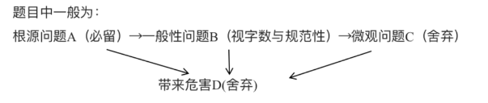

# Table of Contents

* [概括题](#概括题)
  * [2024 申论二](#2024-申论二)
  * [2024 申论1](#2024-申论1)
* [对策题](#对策题)
  * [对策积累](#对策积累)
  * [24 申论二](#24-申论二)
  * [24 申论1](#24-申论1)


# 概括题

+ **找主体，问谁答谁**
+ 分逻辑：区分一级、二级、三级【根据是否着重保留】
  + 保留文意：**省略后的答案是否和原句表达一致**
  + 懂得取舍:
    + 总分要**总**
    + 舍弃举例子等 
    + 找主要措施、**去除措施带来的效果**【字数足够，可以保留】
    + **舍弃**包含关系的**被包含要素**
+ 根据划分段落，确定每个段落要提炼的字数【200字 5个重点的话，每段就是40个字】

[广东省考申论连续两年80分经验分享_哔哩哔哩_bilibili](https://www.bilibili.com/video/BV1SW9qY8EXo/?spm_id_from=333.1391.0.0&vd_source=44d93b70850a7f4ce188ceb0f0305535)

## 2024 申论二

　**问题一**

　　根据材料2，概括2024年全省高质量发展大会上广东就“推进产业科技创新、发展新质生产力”提出的主要举措。（20分）

　　要求：概括全面、准确、条理清晰，不超过200字。

```
问的是【广东就“推进产业科技创新、发展新质生产力”提出的主要举措】
主语:广东
主题：推进产业科技创新、发展新质生产力
问做法
200个字
```


​	岭南处处是春天，一年四季好干活。广东把习近平总书记的殷殷嘱托转化为做好新发展阶段广东工作的强大动力，深入开展“大学习、深调研、真落实”，坚持从总书记重要讲话和重要指示精神中找方向、找方法，融会贯通转化为广东走在全国前列的发展思路、战略目标和政策举措，以“再造一个新广东”的意志和干劲奋力开拓、攻坚克难，奏响推动粤港澳大湾区建设向纵深推进的“集结号”。

```
没有
```

　　2023年春节后上班第一天，广东首次召开全省高质量发展大会，向全社会释放苦干实干、聚力前行的鲜明信号。2024年2月18日，也是春节后上班第一天，广东再度召开全省高质量发展大会，聚焦产业科技话创新、谋未来，持续推动高质量发展。

```
没有
```

　　以下内容摘自广东省委书记黄坤明同志在2024年广东省高质量发展大会上的讲话实录。

```
没有
```

　　推进产业科技创新、发展新质生产力是广东的战略之举、长远之策，也必将是一场艰苦的竞速赛、耐力赛、接力赛。我们要沿着习近平总书记指引的方向加速前进，向着产业科技高峰全力攀登，加快打造具有全球影响力的产业科技创新中心，不断增强高质量发展“硬实力”。

```
推进产业科技创新、发展新质生产力 的意义 不用管
```

　

> 1.先大概看有几段，好划分字段
> 2.列出每一段的做法，在精简


　要视人才为珍宝。推进产业科技创新，人才是决定性因素。要真心爱才、悉心育才、倾心引才、精心用才，携手港澳加快建设大湾区高水平人才高地，吸聚全球高层次创新型人才，以人才工作的主动，更好掌握创新的主动、发展的主动。我省产业科技创新所需人才数量庞大，要坚持高标准精准引进和高质量自主培养两手抓，优化实施省市重大人才工程，推进高等教育“冲一流、补短板、强特色”，让广东的人才金字塔“塔基更实、塔身更强、塔尖更高”。视人才为珍宝，关键是要让人才有用武之地，让珍宝绽放光彩。我们既要创造更多的平台和机会，更要打通人才价值实现的通道，让各类人才在研究探索创新时拥有足够舞台，在成果转移转化中获得应有收益。省里已经出台方案，赋予事业单位科研人员科技成果转化更大受益权。今天参会的有不少专家和领军人才，感谢大家为广东作出的贡献，也希望大家弘扬科学家精神，“十年磨一剑”潜心研究，把论文写在广袤大地上，在推进产业科技创新中贡献智慧、成就事业、收获幸福。

```
要视人才为珍宝
要真心爱才、悉心育才、倾心引才、精心用才
携手港澳加快建设大湾区高水平人才高地
要坚持高标准精准引进和高质量自主培养两手抓，优化实施省市重大人才工程
创造更多的平台和机会，更要打通人才价值实现的通道
赋予事业单位科研人员科技成果转化更大受益权

文段划分后，我们可以看到一共4个中心段，每个重点大概就是50字左右
1.重视人才:打造大湾区高水平人才高地、实施高标准精准引进和高质量自主培养重大人才工程、创造平台和机会、打通人才价值实现通道、赋予科研人员科技成果受益权 【有点超了】
```

```
重视人才。建设人才高地，精准引进和自主培养，为人才创造平台机会与价值实现通道，促成果转化。
```

```
点都找到了，但是概括性不强，字数会超
```


​		广东企业敢于创新、百折不挠，华为、美的、比亚迪等在长期的市场洗礼中成长为世界级创新型企业，一系列专精特新企业如雨后春笋般茁壮成长，这是我们推进产业科技创新的厚实家底和强大底气。要全力支持企业做创新的主角，推动创新资源向优质企业集聚，政产学研协同发力，攻克“卡脖子”技术，锻造“撒手锏”技术，研发更多“根技术”，让企业把腰杆子挺起来。质量就是生命，效率就是生命。要支持企业积极运用新技术、新设备、新材料、新工艺，提升产品品质，提高生产效率，在市场竞争中立于不败之地。要以企业生产技术的整体提升，带动产业转型升级，实现传统产业老树新花，新兴产业竞相发展，未来产业孕育孵化。省里今年将推出一批新的重大科研项目，推动9000家工业企业开展技术改造，推动9200家规上工业企业数字化转型。今天来了很多企业，广东的产业科技创新主要靠你们，希望大家积极参与进来，与广东高质量发展同频共振。

```
要全力支持企业做创新的主角
政产学研协同发力
攻克“卡脖子”技术，锻造“撒手锏”技术，研发更多“根技术”
要支持企业积极运用新技术、新设备、新材料、新工艺，提升产品品质

企业做创新主角:政产学研协同发力、攻克核心技术、支持运行四新提升质效
```
```
2.支持创新。为企业集聚创新资源，政产学研协同发力支持运用新技术，提升质效与生产技术，带动产业转型升级。
```
```
推动创新资源向优质企业集聚 【推动 人在做，也是做法，没有找出来】
推动9200家规上工业企业数字化转型 【同理 找动词】
```

　　市场是产业科技创新最重要的孵化器、加速器、放大器。拥有规模庞大的市场，才能为各类新技术、新业态提供试验场，才能容纳多条技术路线竞争成长，让真正具备发展优势、符合产业升级方向的技术和产品脱颖而出。我们要深刻把握产业科技创新的演进逻辑，把超大规模市场这一独特优势，切实转化为加快创新发展的优势、胜势。要根据市场需求凝练科研问题，依托市场优势吸聚创新资源，运用市场机制兑现创新价值，让市场力量激发出更加澎湃的创新动能。我们将推出一批新的应用场景，让更多新技术、新产品在广东市场率先应用推广，加速迭代升级。我们还将积极发展科技金融、技术、数据等创新要素市场，促进创新链产业链资金链人才链深度融合，营造更好的创新生态。
```
超大规模市场
市场需求凝练科研问题
将推出一批新的应用场景
积极发展科技金融、技术、数据等创新要素市场

发挥超大规模市场：市场需求凝练科研问题、推出新场景、发展创新要素市场
```
```
3.把握市场。利用超大规模市场优势，凝练科研问题，吸聚创新资源，兑现创新价值，推出新应用场景，发展创新要素市场。
```
```
依托市场优势吸聚创新资源，运用市场机制兑现创新价值 【同第二个点】
```

　　科技创新和体制创新如车之双轮、鸟之两翼，互为促进、缺一不可。要着眼发展新质生产力，下好改革“先手棋”，抓紧推进地方科技管理机构改革，带动科技体制改革向纵深和具体处发展，切实打通制约产业科技创新的卡点堵点。在这方面，我们要特别感谢国家部委给予的指导，港澳各方大力的支持，海外华侨华人提供的帮助，省各民主党派、工商联和无党派人士的积极参与。新型举国体制是攻克关键核心技术的利器，要积极探索具体路径，促进有为政府和有效市场紧密结合，推进“有组织的科研”“有组织的转化”，更好实现从科技强到企业强、产业强、经济强。要持续营造有利于创新的政策和制度环境，实施包容审慎监管，加强知识产权保护，让每一个创新行为都得到市场尊重，让每一份创新成果都能够形成市场价值。“脱钩断链”“小院高墙”是小伎俩，国际科技产业合作是大趋势。要坚持以开放促改革、促创新，在更广阔的空间布局产业科技创新，在开放合作中提升科技自立自强能力。
```
抓紧推进地方科技管理机构改革 
新型举国体制是攻克关键核心技术的利器，要积极探索具体路径
要持续营造有利于创新的政策和制度环境
要坚持以开放促改革、促创新

创新改革:推进科技管理机构改革、探索新型举国体制、营造创新政策和制度环境、坚持开放合作
```
```
4.创新改革。推进科技管理机构改革，探索新型举国体制，营造利于创新的政策和制度环境，坚持开放合作。
```
```
这个是找全了
```

## 2024 申论1

请根据材料2，概括2024年全省高质量发展大会上，广东就“推进产业科技创新、发展新质生产力”提出的主要举措。（20分）

　　要求：概括全面、准确，条理清晰。篇幅不超过200字。

```

```


岭南处处是春天，一年四季好干活。广东把习近平总书记的殷殷嘱托转化为做好新发展阶段广东工作的强大动力，以“再造一个新广东”的意志和干劲奋力开拓、攻坚克难，奏响进军高质量发展的“集结号”。

　　2023年春节后上班第一天，广东首次召开全省高质量发展大会，向全社会释放苦干实干、聚力前行的鲜明信号。2024年2月18日，农历新春第一个工作日，广东再度召开全省高质量发展大会，聚焦产业科技话创新、谋未来，持续推动高质量发展。
```

```
　　以下内容摘自中央政治局委员，广东省委书记黄坤明同志在2024年广东省高质量发展大会上的讲话实录：
```

```
　　推进产业科技创新、发展新质生产力是广东的战略之举、长远之策，也必将是一场艰苦的竞速赛、耐力赛、接力赛。我们要沿着习近平总书记指引的方向加速前进，向着产业科技高峰全力攀登，加快打造具有全球影响力的产业科技创新中心，不断增强高质量发展“硬实力”。
```

```
　　推进产业科技创新，人才是决定性因素。要真心爱才、悉心育才、倾心引才、精心用才，携手港澳加快建设大湾区高水平人才高地，吸聚全球高层次创新型人才，以人才工作的主动，更好掌握创新的主动、发展的主动。我省产业科技创新所需人才数量庞大，要坚持高标准精准引进和高质量自主培养两手抓，优化实施省市重大人才工程，推进高等教育“冲一流、补短板、强特色”，让广东的人才金字塔“塔基更实、塔身更强、塔尖更高”。视人才为珍宝，关键是要让人才有用武之地，让珍宝绽放光彩。我们既要创造更多的平台和机会，更要打通人才价值实现的通道，让各类人才在研究探索创新时拥有足够舞台，在成果转移转化中获得应有收益。省里已经出台方案，赋予事业单位科研人员科技成果转化更大受益权。今天参会的有不少专家和领军人才，感谢大家为广东作出的贡献，也希望大家弘扬科学家精神，“十年磨一剑”潜心研究，把论文写在广袤大地上，在推进产业科技创新中贡献智慧、成就事业、收获幸福。
```

```
　　广东企业敢于创新、百折不挠，华为、美的、比亚迪等在长期的市场洗礼中成长为世界级创新型企业，一系列专精特新企业如雨后春笋般茁壮成长，这是我们推进产业科技创新的厚实家底和强大底气。要全力支持企业做创新的主角，推动创新资源向优质企业集聚，政产学研协同发力，攻克“卡脖子”技术，锻造“撒手锏”技术，研发更多“根技术”，让企业把腰杆子挺起来。质量就是生命，效率就是生命。要支持企业积极运用新技术、新设备、新材料、新工艺，提升产品品质，提高生产效率，在市场竞争中立于不败之地。要以企业生产技术的整体提升，带动产业转型升级，实现传统产业老树新花，新兴产业竞相发展，未来产业孕育孵化。省里今年将推出一批新的重大科研项目，推动9000家工业企业开展技术改造，推动9200家规上工业企业数字化转型。今天来了很多企业，广东的产业科技创新主要靠你们，希望大家积极参与进来，与广东高质量发展同频共振。
```

```
　　市场是产业科技创新最重要的孵化器、加速器、放大器。拥有规模庞大的市场，才能为各类新技术、新业态提供试验场，才能容纳多条技术路线竞争成长，让真正具备发展优势、符合产业升级方向的技术和产品脱颖而出。我们要深刻把握产业科技创新的演进逻辑，把超大规模市场这一独特优势，切实转化为加快创新发展的优势、胜势。要根据市场需求凝练科研问题，依托市场优势吸聚创新资源，运用市场机制兑现创新价值，让市场力量激发出更加澎湃的创新动能。我们将推出一批新的应用场景，让更多新技术、新产品在广东市场率先应用推广，加速迭代升级。我们还将积极发展科技金融、技术、数据等创新要素市场，促进创新链产业链资金链人才链深度融合，营造更好的创新生态。
```

```
　　科技创新和体制创新如车之双轮、鸟之两翼，互为促进、缺一不可。要着眼发展新质生产力，下好改革“先手棋”，抓紧推进地方科技管理机构改革，带动科技体制改革向纵深和具体处发展，切实打通制约产业科技创新的卡点堵点。在这方面，我们要特别感谢国家部委给予的指导，港澳各方大力的支持，海外华侨华人提供的帮助，省各民主党派、工商联和无党派人士的积极参与。新型举国体制是攻克关键核心技术的利器，要积极探索具体路径，促进有为政府和有效市场紧密结合，推进“有组织的科研”“有组织的转化”，更好实现从科技强到企业强、产业强、经济强。要持续营造有利于创新的政策和制度环境，实施包容审慎监管，加强知识产权保护，让每一个创新行为都能够得到市场尊重，让每一份创新成果都能够形成市场价值。“脱钩断链”“小院高墙”是小伎俩，国际科技产业合作是大趋势。要坚持以开放促改革、促创新，在更广阔的空间布局产业科技创新，在开放合作中提升科技自立自强能力。
```

```


# 对策题

+ 总体原则：问题要核心、对策要能**落地**【**具体可以操作的**】

+ 

+ 核心落在对策，字数要多，问题要简练 【37开】

+ 错误对策

  + 问题：宣传力度不足【加强宣传力度，这明显就是一句废话太虚了】

    

+ A导致B,B导致C，C导致D..... 【问题是A,对策就是要解决BCD】

  > 概括总性问题，其他间接问题都要提出对策
  
+ 回答形式：先问题，在对策，分别列出来。

+ 总结这几年常见对策，需要背诵，**总结高频对策**


[广东省考80分申论思路分享——问题与对策归纳题_哔哩哔哩_bilibili](https://www.bilibili.com/video/BV1RKRNY1EFB?spm_id_from=333.788.videopod.sections&vd_source=44d93b70850a7f4ce188ceb0f0305535)


## 对策积累

对策:

1.加强常态化巡逻，打击违规行为，落实整改回头看机制。
2.增设公共配套设施，促进县镇教育交流，利用直播培训送优质教育下乡。
3.政府以信用为企提供贷款担保，给予优惠政策，发展集约规模化生产。
4.委派专家团队提供规划指导，加快编制新规划，划拨专项资金。
5.调研文化资源情况，打造特色文化景区，定期保护修缮。
6.探索多元化发展模式，盘活固定资产，引进优势产业夯实经济。


## 24 申论二

材料5中反映了Z市推进“百县千镇万村高质量发展工程”中的一些问题。调研组拟向领导汇报调研发现的问题，并提出对策建议。假如你是调研组成员，请草拟汇报的主要内容。（30分）

　　要求：

　　（1）汇报内容包括问题和对策建议；

　　（2）紧扣材料，梳理全面准确，所提对策建议有针对性、合理性；

　　（3）表达准确，条理清晰；

　　（4）不超过300字。

为更实更细推进“百千万工程”，充分发挥乡镇连接城市与农村的节点和纽带作用，近期Z市“百千万工程”指挥部办公室深入部分镇街开展专题调研。总体来看，这次走访的10个镇街自实施“百千万工程”以来，已取得阶段性成果。但调研组发现有的地方在推进“百千万工程”的过程中碰到一些问题。
```
点题
```
　　在E镇，调研组发现沿街存在占道经营、乱摆乱卖、路边随意晾晒衣物等现象，E镇周边有一些乱搭乱建的临时铁皮房、铁皮围挡，这些现象与美丽E镇建设的相关要求不符。有居民反映：“之前镇里集中整治过，刚整治完还好，但平时没人管，不知道什么时候又乱糟糟了。”
```
违规乱建
```
　　有居民还反映，他虽然在镇上产业园工作，但住在县城，这是因为小孩要上学，镇上的学校教学质量不如县里，也没有像样的图书馆，公园、医院等公共配套也不行。
```
公共资源不均衡
```
　　来到F镇现代农业产业园，冷清的园区景象引起了调研组的注意。产业园负责人告诉调研组：“今年，产业园发展遇到困难。园区最大的企业是一家粮油食品有限公司，目前面临经营困难，其他一些企业也不同程度受到了影响。”调研组在走访中进一步了解到，产业园的其他主要生产单位，如花卉产业园、粮食储备仓库、水稻生产基地等，规模偏小，抗风险能力不强，服务带动周边片区农户的能力有限。产业园负责人说：“产业园建立很不容易，下一步还是要想想办法帮助企业渡过难关，促进产业园更好发展。”
```
规模偏小，抗风险能力不强，服务带动周边片区农户的能力有限
```
　　在G镇园墨村，独具岭南特色的历史文化建筑风格让调研组眼前一亮。
```
无
```
　　“村里拥有区内现存规模最大、保存最好的古建筑群，前些年我们成立文化公司对古建筑群进行了开发运营，吸引了不少游客来参观旅游，村里的小商铺、农家乐多了起来。”一见到调研组，园墨村古建筑群运营公司负责人就迫不及待地反映，“现在我们正响应‘百千万工程’号召，积极扩大规模，丰富产业形态，正准备申报国家AAA级旅游景区，但土地使用、道路建设、产业布局等都受到规划制约，影响了工作进展。”
```
土地使用、道路建设、产业布局等都受到规划制约，影响了工作进展
```
　　调研组深入了解到，村里的规划还是十多年前的一个简单规划，已经不能适应目前高质量发展要求。村里有加强规划的意愿，但没有规划专项资金，也不知道怎么推进规划工作，非常需要上级指导支持。
```
规划落后
```
　　在调研过程中，调研组发现，其他一些镇的文化资源也比较丰富，但没有像园墨村那样利用起来。如H镇廊下村有一座近400年历史的客家围屋，非常气派。据村里老人介绍，这么大的围屋，在全县都是数一数二的，县里也曾派专家过来了解这座建筑的历史，后来就没有下文了。遗憾的是，这里因常年无人居住，年久失修，屋顶早已破损。
```
资源没有利用起来
```
　　I镇徐家村也存在类似情况。该村徐书记介绍，村里至今仍留存着一批富有特色的古建筑群，其中最具特色的是清代一名将官的故居。多年前，村里就曾考虑过挖掘利用这么好的文化资源，但同样让人感到可惜的是，目前未能进行更有效、更充分利用，更别说转化为资产了。
```
没有 挖掘利用这么好的文化资源
```
　　推动“百千万工程”，资金的要素保障是大家关心的问题之一，也是较为突出的矛盾之一。调研组发现，像J镇这种以自然保护区为主要功能的零工业镇，在这次建设乡村振兴示范带时，尽管上级部门有安排专项资金，但因地处偏僻，村集体经济不发达，经济基础薄弱，历史欠账较多，在建设经费上仍存在较大的缺口，村里压力非常大。
```
专项资金不够
```

```
问题其实挺好早，现在需要总结提炼下问题
1.违规乱建
2.公共资源不均衡
3.企业规模偏小，抗风险能力不强
4.规划落后
5.没有挖掘好历史文化资源
6.专项资金缺口大 【找根本原因！！！ 因地处偏僻，村集体经济不发达，经济基础薄弱，历史欠账较多】
但是没有对策 。。。这种题就难搞

问题:1.乱搭乱建，违规占道，整治不到位。
2.公共配套不完善，教育资源不均。
3.企业经营困难，规模小，抗风险与带动能力弱。
4.村规划落后，缺乏专项资金与指导，
5.未能有效利用文化资源，建筑失修
6.村集体经济不发达，经济基础薄弱，欠账多，资金缺口大。
```


## 24 申论1

　假如你是G市高质量发展座谈会组织人员，请根据材料8中的与会代表发言，梳理问题并提出相应对策建议。（30分）

　　要求：

　　（1）紧扣材料，梳理全面，对策建议具有针对性、合理性。

　　（2）表达准确，条理清晰。篇幅不超过300字

科技是第一生产力，人才是第一资源，创新是第一动力。科技创新催生新产业、新业态、新模式，是高质量发展的新动能，是制胜未来的关键变量。

　　近期，G市召开高质量发展座谈会，围绕产业科技互促，持续推动高质量发展，来自各行各业的代表踊跃建言献策。
```

```
　　某生物技术公司创始人刘先生：我市生物医药行业能够蓬勃发展，离不开政府的大力支持。我们刚落户的时候，政府给了很多优惠政策，也希望我们能够吸引更多的上下游企业，形成产业聚集，为此我们也作出了很大努力。但如何吸引更多相关企业落户，还是需要政府部门加大力度去推动。而且，产业聚集度不高，会影响到人才的就业选择。这也不利于企业在起步阶段组建研发团队。
```

```
　　某人工智能研究院李研究员：人工智能基础研究领域具有高成本、长周期的特点，创新的核心在于人才。我市拥有丰富的高校资源，但人工智能专业高等教育起步时间不长，多以本科生培养为主，硕士博士培养占比偏低。缺乏顶级科研人才，组建顶级科研团队有难度，研发周期就会变得很长，科研机构在研发资金投入上压力也增大了。
```

```
　　某大数据科技公司总经理吴女士：数字技术已成为新一轮科技革命的主导技术，在我市数字化建设过程中，部分平台供应商出于自身利益最大化考虑，往往不愿共享数据端口，结果导致不同部门不同层级之间的数据对接存在隐形壁垒，数据的跨系统流通渠道不畅。省级与市级开发系统提出的数据对接需求存在重复，造成开发费用高，也导致大量“数据孤岛”出现，数据无法进行联合分析或建模，数据价值无法充分发挥。
```

```
　　某大学科研处陈处长：近年省里为推进省内高校高质量发展出台了多项宏观性、指导性政策，促进产学研一体化，鼓励高校高水平科技成果转化，支持鼓励高校科研人员兼职创新或离岗创业。但在实践中，有些高校对兼职创新、离岗创业等方面约束性条件较多、政策稳定性不足，高校现有的绩效考核评价体系仍然以项目、论文、教学情况等为主要依据，使得大多数高校科研人员对科技成果转化持谨慎态度。
```

```
　　市科技局许局长：科技研发与成果转化两者协同推进、“螺旋式上升”，才能促进传统产业转型升级、塑造新兴产业新动能、开辟未来产业新领域，进而形成新质生产力，持续推动高质量发展。
```

```
　　某医药科技公司技术部文经理：研制创新药需要大量资源和研发资金持续投入，过程漫长，业内许多公司很难承受，导致产品以生物仿制药为主。现在癌症种类很多，真正做到精准治疗的药物很有限，市场对精准治疗的创新药物需求很大，但行业内聚焦这个研究方向的科研力量很薄弱。根据市场需求凝练科研问题，才能加快新技术、新产品在市场应用推广。我们坚持研制创新药，一经验证，推出后立刻收到了市场的良好反应。
```

```
　　某银行分行行长肖先生：研发资金匮乏的短板需要金融活水的赋能。今年我行计划向全市投放信贷资金6000万元，其中约2/3通过科创中心平台、科创金融特色产品、科技金融服务投向市场。我行努力构建“股、贷、债、保”联动的金融服务支撑体系，助力我市构建现代化产业体系，促进高质量发展。
　　
```

```
