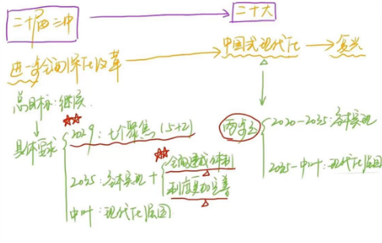

# Table of Contents

* [整体思维导图](#整体思维导图)
* [总诉](#总诉)
  * [必要性(为什么)](#必要性为什么)
    * [改革开放](#改革开放)
    * [六必然](#六必然)
  * [总要求](#总要求)
    * [指导思想](#指导思想)
    * [总目标(根本任务)](#总目标根本任务)
    * [六大原则](#六大原则)
* [系统部署(怎么做)](#系统部署怎么做)
  * [核心任务(2大范畴)](#核心任务2大范畴)
    * [市场-社会主义市场经济制度](#市场-社会主义市场经济制度)
    * [政府-宏观经济治理](#政府-宏观经济治理)
  * [重大领域(5位一体)](#重大领域5位一体)
  * [2个条件(安全稳定)](#2个条件安全稳定)
  * [根本保证(党的领导)](#根本保证党的领导)


[toc]

<span style="color: red">重点</span>

<span style="color: red;">这是红色文字</span>

# 整体思维导图

[思维导图](/main/二十大/二十届三中全会思维导图.pdf)


# 总诉

## 必要性(为什么)

+  二十届中全会和二十大


### 改革开放

<span style="color: red">改革开放</span>是党和人民事业大踏步赶上时代的<span style="color: red">重要法宝</span>。党的**十一届三中全会**是划时代的，开启了改革开放和社会主义现代化建设新时期。党的**十八届三中全会**也是划时代的，开启了新时代全面深化改革、系统整体设计推进改革新征程，开创了我国**改革开放全新局面**。


### 六必然

面对纷繁复杂的国际国内形势，面对新一轮科技革命和产业变革，面对人民群众新期待，必须继续把改革推向前进。这是坚持和完善中国特色社会主义**制度**、推进国家治理**体系**和治理**能力**现代化的**必然要求**，是贯彻**新发展理念**、更好适应我国**社会主要矛盾变化**的必然要求，是坚持以**人民为中心**、让现代化建设成果**更多更公平惠及全体人民**的必然要求，是应对**重大风险挑战**、推动**党和国家事业行稳致远**的必然要求，是推动构建**人类命运共同体**、在百年变局加速演进中**赢得战略主动**的必然要求，是深入推进新时代**党的建设**新的伟大工程、建设**更加坚强有力的马克思主义政党**的必然要求。

> 6必然
>
> <span style="color: red">致力发展人民事业，主动建设党人命运</span>


## 总要求

###  指导思想

(**<font color="red">一个总坚持</font>**)坚持**马**克思**列**宁主义、**毛**泽东思想、**邓**小平理论、“**三**个代表”重要思想、**科学发展观**，(**三个贯彻**)全面贯彻习近平**新**时代中国特色社会主义**思想**，深入学习贯彻习近平总书记关于**全面深化改革**的一系列新思想、新观点、新论断，完整准确全面贯彻**新发展理念**，坚持**稳中求进**工作总基调，(**2坚持**)坚持**解放思想、实事求是、与时俱进、求真务实**，进一步解放和发展社会生产力、激发和增强社会活力，(**2统筹**)统筹**国内国际**两个大局，统筹推进“**五位一体**”总体布局，协调推进“**四个全面**”战略布局

> 2个统筹：国内国际 5+4


以**经济体制改革**为牵引，以促进**社会公平正义**、**增进人民福祉为出发点和落脚点**，更加注重**系统集成**，更加注重**突出重点**，更加注重**改革实效**(**新提法**)，推动生产关系和生产力、上层建筑和经济基础、国家治理和社会发展更好相适应，为中国式现代化提供强大动力和制度保障。

> <span style="color: red">三注重：统重效</span>


### 总目标(根本任务)


<span style="color: red">**继续**完善和发展中国特色社会主义**制度**，推进国家治理**体系**和治理**能力**现代化。</span>


> 考点延伸
>
> **全面深化改革总目标**是完善和发展中国特色社会主义**制度**、**推进**国家治理**体系**和治理**能力**现代化

```
制度形成体系、体系形成治理能力
差别：【继续】
【易错点 推进 不是 全面建成】
```


1.**到二〇三五年，全面建成高水平社会主义市场经济体制**，中国特色社会主义**制度更加完善**，基本实现国家**治理体系和治理能力现代化**，**基本实现**社会主义现代化，


为到**本世纪中叶全面建成社会主义现代化强国**奠定坚实基础。


聚焦构建高水平社会主义市场**经济**体制，聚焦发展全过程人民**民主**，聚焦建设社会主义**文化**强国，聚焦提高人民**生活**品质，聚焦建设**美丽中国**，聚焦建设更高水平**平安中国**，聚焦提高**党**的领导水平和长期执政能力。（**新提法**）

> <span style="color: red">7个聚焦： 经济、政治、文化、社会、生态 【平安中国、党领导】2029</span>
>
> 5+2

2.到**二〇二九**年中华人民共和国成立八十周年时，完成本决定提出的改革任务。





> 三目标
>
> 1. 2029 80周年完成改革任务
> 2. 2035  全面建成高水平社会主义市场经济体制**，中国特色社会主义**制度更加完善**，基本实现国家**治理体系和治理能力现代化**，**基本实现**社会主义现代化
> 3. **本世纪中叶全面建成社会主义现代化强国**

### 六大原则

总结和运用改革开放以来特别是新时代全面深化改革的宝贵经验，贯彻以下原则：

坚持**党**的全面领导，坚持以**人**民为中心，坚持**守正创新**，坚持以**制度建设为主线**，坚持**全面依法治国**，坚持系**统观念**。

> 【口诀】党人守创新、法制观念


【考点延伸】

坚持**守正创新**，坚持中国特色社会主义不动摇，紧跟时代步伐，顺应实践发展，突出问题导向，在新的起点上**推进理论创新、【实践】创新、制度创新、文化创新**以及其他各方面创新。

```
改革的本质要求
守正：坚持中国特色社会主义道路，方向不能歪-》举什么旗帜，走什么道路
创新：

实践创新：容易替换成其他的，理论来源自实践
```


坚持以**制度建设为主线** (**首次提出**)，加强顶层设计、总体谋划，**破立并举、先立后破**，筑牢根本制度，完善基本制度，创新重要制度。

```
制度、体系、能力

先立后破: 不能先破后力，逻辑上先破后立也不对
```


坚持**系统观念**，处理好经济和社会、政府和市场、效率和公平、活力和秩序、发展和安全等重大关系，增强改革系统性、整体性、协同性。

```
 同指导思想连接起来了【统重效】

```


# 系统部署(怎么做)

## 核心任务(2大范畴)

### 市场-社会主义市场经济制度

### 政府-宏观经济治理


## 重大领域(5位一体)
## 2个条件(安全稳定)
## 根本保证(党的领导)


