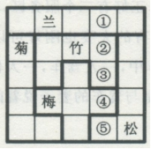

# Table of Contents

* [总结](#总结)
* [三人成众](#三人成众)
* [只对一半](#只对一半)
  * [肯定无重复](#肯定无重复)
  * [不肯定](#不肯定)
  * [重复](#重复)
  * [全部都有人对](#全部都有人对)
  * [真假都有-最大](#真假都有-最大)
* [列表](#列表)
* [重复](#重复-1)
* [择优选人](#择优选人)
  * [不确定](#不确定)
  * [确定](#确定)
  * [奇数型 (n和n+1)](#奇数型-n和n1)
  * [配对型](#配对型)
  * [其他](#其他)
* [数量](#数量)
  * [极限型](#极限型)
  * [最多最少](#最多最少)
  * [多种元素杂糅](#多种元素杂糅)
* [比较型](#比较型)
* [提及未提及](#提及未提及)
* [其他](#其他-1)
* [一推五](#一推五)


# 总结


- 排除优先

- 最大信息

- 确定信息：本质就是稳定性强

- 不确定信息代入

  


# 三人成众

1. 最大信息
2. 找确定条件

题型

三个人，不同职业、不同城市 进行选择。

--------


例题：在一个大学生宿舍有3个同学，她们的名字是：小梅．小红和小利。一个学英语，一个学法语，一个学德语；一个来自北京，一个来自上海，一个来自重庆。来自北京的不是学英语的，小红不学法语，小利来自上海，来自重庆的学法语。由此可知：

A．小红来自北京，学英语 

B．小梅来自重庆．学法语

C．小利来自上海，学德语 

D．小利来自上海，学法语

```
最大信息 法语
小红不学法语，来自重庆的学法语 小红不是重庆
小利来自上海 小红只能是北京
北京的不是学英语   德语

小梅．小红 小利
重庆     北    上
  法   德语  英
  选B
```

------

例题：甲、乙、丙、丁是思维天资极高的艺术家，他们分别是舞蹈家．画家．歌唱家和作家，尚不能确定其中每个人所从事的专业领域。已知：
（1）有一天晚上，甲和丙出席了歌唱家的首次演出。
（2）画家曾经为乙和作家两个人画过肖像。
（3）作家正准备写一本甲的传记，他所写的丁的传记是畅销书。
（4）甲从来没有见过丙。
下面哪一选项正确的描述了每个人的身份？
A． 甲是歌唱家，乙是作家，丙是画家，丁是舞蹈家
B． 甲是舞蹈家，乙是歌唱家，丙是作家，丁是画家
C． 甲是画家，乙是作家，丙是歌唱家，丁是作家
D． 甲是作家，乙是画家，丙是舞蹈家，丁是歌唱家

```
1 甲丙不是歌唱家 排除AC
2 乙不是画家 排除D

```

-----

例题：甲、乙、丙三人来自学校足球队、乒乓球队和篮球队。下列说法只有一种是对的：
（1）甲是足球队的；（2）乙不是足球队的；（3）丙不是篮球队的。         
则 甲、乙、丙三人分别是哪个队的？ 
A．甲是足球队的；乙是篮球队的；丙是乒乓球队的  
B．甲是篮球队的；乙是足球队的；丙是乒乓球队的  
C．甲是乒乓球队的；乙是足球队的；丙是篮球队的 

D．甲是乒乓球队的；乙是篮球队的；丙是足球队的 

```
足
-足
-篮
12 1对2也对 1假 
23 一真一假  足球的时候不能是篮球
            -足 不能是 篮球  排除CD
```

----------

例题：新一届中国科幻小说大赛“星座奖”结果发布，来自广东、上海、四川的甲、乙、丙三人位列三甲，已知：
（1）乙不来自四川
（2）乙不是第三名
（3）丙不是第一名
（4）来自广东的作者不是第二名
（5）来自四川的作者夺得第一名
由此可得知（   ）
A．甲不是第一名

B．乙获得第一名

C．丙来自四川

D．乙来自上海

```
四川   乙不来自四川 23 乙不是第三名
甲、乙、丙
1    2  3
四川  上海  广东
选D
```

例题：乒乓球单打决赛在甲、乙、丙、丁四位选手中进行，赛前，有些人预测比赛的结果，
A说：甲第4。
B说：乙不是第2，也不是第4。
C说：丙的名次在乙的前面。
D说：丁将得第1。
比赛结果表明，四个人中只有一个人预测错了。那么，甲、乙、丙、丁四位选手的名次分别为
A．2、3、4、1                      
B．1、2、4、3
C．1、3、4、2                      
D．4、3、1、2

```
观察选项 乙3 排除B 
看ACD   １４错　都不符合 只能是D 

```

例题：有甲、乙、丙三种花卉，分别是玫瑰、郁金香、风铃草，这三种花卉是从三个不同的国家运来的，分别是A国、B国和C国。下列条件是已知的：  
(1)花卉乙不是风铃草；
(2)花卉乙不是从C国运来的；
(3)花卉丙不是从A国运来的；
(4)玫瑰不是从B国运来的；
(5)风铃草是从A国运来的。 
根据上述条件，可以推出花卉乙是( )。 
A．玫瑰         B．郁金香       C．玫瑰或郁金香      D．无法判断

```
花卉乙 　风铃草
秒Ｂ
```

---

例题：学校操场有6条环形跑道，从外向内分别为1至6道，王伟、李明、刘平、张强、钱亮、孙新6人分别占据其中一道。已知：
（1）王伟的两侧是单数跑道，张强的两侧是双数跑道；
（2）李明与张强隔着两个跑道，钱亮在王伟和李明中间的那个跑道；
（3）刘平在单数跑道，孙新在双数跑道；
（4）王伟不在第二跑道；
（5）如果张强在第三跑道，那么王伟不在第四跑道。
根据以上陈述，可以得出以下哪项（  ）
A．在刘平和孙新之间隔着4个跑道
B．在钱亮和张强之间隔着2个跑道
C．在钱亮和孙新之间隔着3个跑道
D．在刘平和王伟之间隔着1个跑道

```
　1　2　3　4　5　　6
　　　　　王伟　
　　　　　　　张强
　　李明　
　　　　钱亮
  刘平　　　　　　孙新
  Ａ
```


例题：梅兰竹菊是张老汉的四个女儿。有一次，某客人问起四姐妹的年龄，得到不同的回答
梅说：“兰比竹小。”兰说：“我比梅小。”竹说：“兰不是三姐。”菊说：“我是大姐。
”憨厚的张老汉在旁补充道：“大女儿和三女儿撒谎呢，二女儿和小女儿说得对。
”据此，按年龄从大到小的顺序，可以判断四姐妹依次为
A．梅、兰、竹、菊           
B．梅、兰、菊、竹
C．兰、菊、梅、竹          
 D．菊、兰、梅、竹

```
大女儿说假话　老大不可能说自己是老大　只能是老三　秒B
```


# 只对一半

## 肯定无重复


+ 肯定无重复，唯一为真

  怎么理解无重复？没有相同的话

  

----

例题：A、B、C三人从政法大学毕业后，一个当了律师，一个当了法官，一个当了检察官。但究竟谁担任什么具体工作，人们还不清楚，于是有了以下猜测：
甲：A当了律师，B当了法官
乙：A当了法官，C当了律师
丙：A当了检察官，B当了律师
后来证实，甲 ．乙．丙三人的猜测都是只对了一半
以下哪项是对三人工作的正确描述？
A．A是法官，B是律师，C是检察官
B．A是法官，B是检察官，C是律师
C．A是律师，B是检察官，C是法官
D．A是检察官，B是法官，C是律师

```
常规思路：
A 左边 1真2假  右边就是2真1假 出现2个B一真一假，C真 A不是法官 选D

C一次 检察官一次
```

----

幼儿园马老师和三个小朋友倩倩、可可和安安一起玩“猜一猜，我最棒”游戏，马老师对小朋友们说：“我把手中的红球、黄球和蓝球分别放在这个柜子的三个抽屉里，请你们猜一猜每只抽屉里放的是什么颜色的球？猜对了奖励小红花！”然后，她请小朋友们闭上眼睛，把三只球分别放在三个抽屉里，小朋友猜的情况如下：

　　倩倩说：“红球在最上层的抽屉，黄球在中间抽屉。”

　　可可说：“红球在中间抽屉，蓝球在最上层的抽屉。”

　　安安说：“红球在最底层的抽屉，黄球在最上层的抽屉。”

　　老师告诉她们，每人都只猜对了一半。

　　请问：红球、黄球和蓝球各在哪一层抽屉里？

　　A.红球在中间抽屉，黄球在最上层的抽屉，蓝球在最底层的抽屉

　　B.红球在中间抽屉，黄球在最底层的抽屉，蓝球在最上层的抽屉

　　C.红球在最上层的抽屉，黄球在最底层的抽屉，蓝球在中间抽屉

　　D.红球在最底层的抽屉，黄球在中间抽屉，蓝球在最上层的抽屉

```
秒D 
```

---

例题：甲、乙、丙三人大学毕业后选择从事各不相同的职业：教师、律师、工程师。其他同学做了如下猜测：
小李：甲是工程师，乙是教师。
小王：甲是教师，丙是工程师。
小方：甲是律师，乙是工程师。
后来证实，小李、小王和小方都只猜对了一半。那么，甲、乙、丙分别从事何种职业？  （  ）
A．甲是教师，乙是律师，丙是工程师
B．甲是工程师，乙是律师，丙是教师
C．甲是律师，乙是工程师，丙是教师
D．甲是律师，乙是教师，丙是工程师

```
秒D
```


## 不肯定

例题：丹丹、小颖、淑珍去参加奥林匹克竞赛。奥林匹克竞赛有数学、物理和化学三种，每人只参加一种。建国、小杰、大牛作了以下猜测：
建国：丹丹参加数学竞赛，小颖参加了物理竞赛。
小杰：淑珍没参加物理竞赛，小颖参加了数学竞赛。
大牛：丹丹没参加数学竞赛，小颖参加了化学竞赛。
如果他们的猜测都对了一半，则以下哪项为真?
A．丹丹、小颖、淑珍分别参加数学、物理和化学竞赛。
B．丹丹、小颖、淑珍分别参加物理、数学和化学竞赛。
C．丹丹、小颖、淑珍分别参加数学、化学和物理竞赛。
D．丹丹、小颖、淑珍分别参加化学、物理和数学竞赛。

```
常规思路：最右边 一真2假 左边2真一假 13矛盾 左2真 答案就出来了

```


## 重复

+ 看重复

例题：A、B、C、D参赛，其成绩各不相同，有甲、乙、丙三人对此作了猜测。
甲说：“A得第一名，B得第二名”，
乙说：“C得第二名，D得第四名”；
丙说：“A得第二名，D得第四名”。
实际情况是三人都猜对了一半。则下列哪项是正确的？  （  ）
A．A第二，D第四                       
B．A第一，C第三      
C．B第一，D第三                       
D．C第一，D第四

```.

c2 d4
a2 d4
c2 d4  不能同时为真，那只能D为真了 
D 真 C不是2 A不是2 B是2 a不是1  a是3 选D

```

----

甲、乙、丙、丁四个人年龄不同。 
甲说：我最大，乙第二； 
乙说：我最大，甲最小； 
丙说：我最大，乙最小； 
丁说：我最小，丙最大。 
四个人都说对了一半，则这四个人的年龄从大到小排列是（）。
A. 甲、乙、丙、丁
B. 乙、丙、丁、甲
C. 丙、甲、丁、乙
D. 丙、乙、丁、甲

```
 甲1 乙2
 乙1  甲4
 丙1 乙4
 丁4  丙1
 
 丙1为真 乙不是4 丁不是4 甲最小  选D
```

----

某次幼儿园的课堂上，老师拿出五种水果，并依次编号为①—⑤，然后要求小朋友说出其中任意两种水果的名称。
小李说：③是苹果，②是龙眼。
小赵说：④是香蕉，②是猕猴桃。
小钱说：①是香蕉，⑤是梨子。
小孙说：④是梨子，③是猕猴桃。
小王说：②是苹果，⑤是龙眼。
结果是他们每人只说对了一半，根据以上条件下列正确的是：
A.  ①是香蕉，②是苹果
B.  ②是猕猴桃，③是梨子
C.  ③是苹果，④是梨子
D.  ④是龙眼，⑤是梨子

```
用最小信息 1香蕉 是错的

③是苹果，②是龙眼
②是苹果，⑤是龙眼
2可能是龙眼，是的话 小王没有对的
选C

还是找相同，不过要找【都是】一样的
```

-----

阿根廷大学的一位老师让五位留学生看校史上的五位大数学家的画像，让每位学生任意挑选两幅画像说出名字。 
张说：“2号是高斯，3号是黎曼。” 
倪说：“1号是希尔伯特，2号是闵可夫斯基。” 
朱说：“3号是闵可夫斯基，5号是希尔伯特。” 
韦说：“2号是高斯，4号是外尔。” 
方说：“4号是外尔，1号是黎曼。” 
老师发现每位学生都只说对了一半，那么1号画像是 。 
A . 黎曼 B . 闵可夫斯基 C . 希尔伯特 D . 高斯  

```
韦说：“2号是高斯，4号是外尔。” 
方说：“4号是外尔，1号是黎曼。
倪说：“1号是希尔伯特，2号是闵可夫斯基。” 

4是外尔 2号不是高斯 1号不是是黎曼 3号是黎曼 5号是希尔伯特 2号是闵可夫斯基 选D

```


## 全部都有人对

档案室有五个柜子，分别放着教育学院、体育学院、人文学院、管理学院和信息学院五个学院的资料，现在由甲、乙、丙、丁、戊五位同学来猜这五个柜子和五个学院的对应关系：甲：第二个柜子是教育学院的，第三个柜子是体育学院的。乙：第二个柜子是人文学院的，第四个柜子是管理学院的。丙：第一个柜子是管理学院的，第五个柜子是信息学院的。丁：第三个柜子是人文学院的，第四个柜子是信息学院的。戊：第二个柜子是体育学院的，第五个柜子是教育学院的。打开柜子后发现，每个人都只猜对了一半，而且每个柜子都有一个人猜对。由此可以推出：A.  第一个柜子里放着人文学院的资料B.  第二个柜子里放着教育学院的资料C.  第三个柜子里放着管理学院的资料D.  第四个柜子里放着信息学院的资料

```
直接看一个的，比较简单
```


## 真假都有-最大

甲、乙、丙三人对一块花田里种植的花朵品种做了两次猜测：
甲：①“它是月季”;②“它不是玫瑰”。
乙：①“它不是月季”;②“它是玫瑰”。
丙：①“它不是月季”;②“它不是牡丹”。
工作人员听到后表示：“你们三人中，只有一个人两次都猜对了，一个人猜对了一次，还有一个人完全猜错了。”
如果工作人员的说法是对的，则该花田里种植的是()。
A.玫瑰
B.月季

C.牡丹

D.玫瑰、月季和牡丹之外的花种

```
甲乙矛盾 一真一假 但是题目只有一个，丙就是一真一假。月季或牡丹，前面没有提到牡丹，是月季

秒杀：直接看最大 选B
```


变形题

14、几位同事在小王家喝茶聊天。他们讨论正在喝的这种茶是什么茶。
 小刘说：“不是龙井，不是碧螺春”， 
小赵说：“不是龙井，是乌龙茶”， 
小李说：“不是乌龙茶，是龙井。” 
最后，经小王确认，三人中有一人的判断完全正确，一个人只说对了一半，另外一个人则完全说错。 据此，可以推出：

 A．小刘的判断完全正确，他们喝的是乌龙茶 

B．小赵的判断完全正确，他们喝的不是龙井 

C．小李的判断完全正确，他们喝的是龙井 

D．小李只说对了一半，他们喝的是碧螺春 

```
最大信息 龙井 是 喝 

小赵说：“不是龙井，是乌龙茶”， 
小李说：“不是乌龙茶，是龙井。
2真2假
小刘说：“不是龙井，不是碧螺春”，  一真一假 同步

```


# 列表

例题：小明忘记了今天是星期几，于是他去问O、P．Q三人。O回答：“我也忘记今天是星期几了，但你可以去问P、Q两人。”P回答：“昨天是我说谎的日子。”Q的回答和P一样。已知：
①O从来不说谎；
②P在星期一、星期二、星期三这三天说谎，其余时间都讲真话；
③Q在星期四、星期五、星期六这三天说谎，其余时间都讲真话。
根据以上条件，今天是星期几？
A．星期一       B．星期二         C．星期四        D．星期天

|      | 今真昨假 | 今假昨真 |
| ---- | -------- | -------- |
| P    | 4        | 1        |
| Q    | 7        | 4        |

-----

例题：有赵、钱、孙、李、刘五位同学，他们所穿衣服颜色不同，有红、白、蓝、绿、黄，喝的饮料种类不同，有茶水、牛奶、可乐、咖啡、果汁。已知：蓝衣服在赵同学旁边；钱同学穿红色衣服；站中间的同学喝牛奶；喝果汁的不与喝可乐的相邻，绿衣服紧邻在白衣服左边；绿衣服喝咖啡；孙同学喝茶水；赵同学在最左边；刘同学喝果汁。由此可以推出？  （  ）                                            
A．孙同学穿的蓝衣服喝的是茶水
B．赵同学穿的绿衣服喝的是可乐
C．钱同学穿的红衣服喝的是果汁
D．最右边的同学穿红衣服喝的茶水

```
直接根据选项判断

A．孙同学穿的蓝衣服喝的是茶水
B．赵同学穿的绿衣服喝的是可乐   [绿衣服喝咖啡]
C．钱同学穿的红衣服喝的是果汁  【刘同学喝果汁】
D．最右边的同学穿红衣服喝的茶水 【钱同学穿红色衣服  孙同学喝茶水】
```

-----------

例题：甲、乙、丙三名学生参加一次考试，试题一共十道，每道题都是判断题，每题10分，判断正确得10分，判断错误得零分，满分100分。他们的答题情况如下：


考试成绩公布后，三个人都是70分，由此可以推出，1－10题的正确答案（  ）                                   A．×、×、√、√、√、×、√、×、√、×                                                                                                     
B．×、×、√、√、√、√、√、×、√、×                                                                                                          C．×、×、√、√、√、√、√、√、√、×                                                                                                     
 D．×、×、√、×、√、√、√、√、√、×

```
找选项相同的
1 23 5 7 9 10

三个人都是70分 
```


# 重复

例题：张三、李四得知，共有甲、乙、丙、丁等4支代表队分别获了15个项目（分别以序数表示）的奖牌，其中，甲队获得第1，4，12项目的奖牌：乙队获得第2，4，7，8，11项目的奖牌：丙队获得第4，5，6，12，13项目的奖牌：丁队获得1，5项目的奖牌。王五从四支代表队获奖的15个项目中挑一个单独告诉了李四，而将获得该项目奖牌的代表队名称单独告诉张三。王五对他们分别讲完，李四就说：“我不知道是那支代表队获得得这个项目的奖牌。”张三听了，就说：“我知道那个项目了。”李四马上说：“我也知道那支代表队了。”
据此，可以推出王五挑出的代表队和项目分别是（ ）  
A．甲队，第1项目             
 B．乙队，第4项目 
C．丙队，第12项目             
D．丁队，第5项目

```
李四　项目　不知道说明有重复的
1　4　12
2　4　7　8　11　　划掉　２　7　8　11　　为什么　不划掉　独立就能知道是谁了　
4　5　6　12　13
1　5

张三　他知道了说明只有一个了　选Ｂ
```


例题：老师和甲、乙、丙三个小朋友在一起做一个游戏。老师告诉小朋友们，共有五顶帖子，两顶黑色，三顶白色。拿出其中三顶，不告诉什么颜色，每人一顶，分别戴在每个人的头上。每个人都看不到自己头上的帽子。乙坐在丙的背后，甲坐在乙的背后。乙只能看到丙头上的帽子；甲能看见乙和丙头上的帽子；丙看不到任何人头上的帽子。老师问，谁能看到自己头上帽子的颜色？甲回答：“我不知道。”乙接着回答：“我也不知道。”丙略一思考，说：“我知道自己头上帽子的颜色。
”假设以上信息为真并且每一个小朋友都是聪明人，可以判断下面说法正确的一项是？  （  ）
A．丙头上为黑色帽子         
B．甲看到了两顶白帽子
C．甲看到了一顶白帽子和一顶黑帽子
D．乙看到了一顶白帽子

```
２黑３白
甲不知道：　如果是黑肯定知道，说明前面至少一白　或者２白
乙不知道：　如果甲是黑，乙肯定是白　违背，　甲肯定白乙不确定
选Ｄ
```


# 择优选人


## 不确定

+ 没有明确告诉你谁是做什么的
+ **去选共同条件【讲一件事】涉及的那个人**

----

例题：甲、乙、丙、丁四名青少年拥有手机、电脑、相机三种电子产品的情况如下： 

①只有一个同时拥有手机、电脑、相机 

②有三个人拥有手机，有两个人拥有电脑，只有一个人拥有相机； 

③每个人至少拥有三种电子产品中的一种； 

④甲和乙是否拥有电脑的情况相同（要么两个都有，要么两人都没有）； 

⑤乙和丙是否拥有手机情况相同； 

⑥丙和丁是否拥有手机的情况不同。 

拥有相机的是（）

A．甲     B．乙     C．丙   D．丁

```
手机 共同丙
选C
```

-----

某高校选派甲、乙、丙、丁4位专家组成乡村振兴调研小组，担任组长的专家为男性、党员、教授。已知这4位专家中：

　　（1）每位专家都至少具有组长的一个特征；

　　（2）有党员3人，男性2人，教授1人；

　　（3）甲和乙性别相同；

　　（4）乙是党员当且仅当丙是党员；

　　（5）丙和丁不全是党员。

　　由此推出，担任组长的是

　　A．甲

　　B．乙

　　C．丙

　　D．丁

```
党员 选丙 C
```

----

例题：某公司年终评选优秀员工，张幸、王福、李康、刘安是入选的四个候选人。该公司规定的评选条件是：一．有硕士研究生学历；二．岗位业务熟练；三．有两次内缺勤。现在已知：

1．张幸和李康两人中有一人只上过本科。

2．李康和刘安的最后学历相同。

3．王福和刘安岗位业务熟练程度相仿。

4．每个人至少符合一个条件，有三人符合条件一，二人符合条件二，一人符合条件三。经考核，四人中只有一人被选评为优秀员工。

这个人是 

A．张幸       B．李康      C．王福      D．刘安     

```
李康 
```

----

航天局认为优秀宇航员应具备三个条件：第一，丰富的知识；第二，熟练的技术；第三，坚强的意志。现在至少符合条件之一的甲、乙、丙、丁四位优秀飞行员报名参选，已知：①甲、乙意志坚强程度相同；②乙、丙知识水平相当；③丙、丁并非都是知识丰富；④四人中三人知识丰富，两人意志坚强，一人技术熟练。航天局经过考察，发现其中只有一人完全符合优秀宇航员的全部条件。

他是：

- A甲
- B乙
- C丙
- D丁

```
23相同 秒丙
```


## 确定

+ 有人是什么，明确告诉了
+ **在确定条件中剔除不符合条件的那个人**


例题：唯唯作为女性嘉宾参加了某电视台举办的相亲节目，她择偶的条件是：高个子．相貌英俊．博士。在赵威、吴刚、李强、刘大伟4位男性嘉宾中，只有一位符合她所要求的全部条件。已知：

(1)、4位男性嘉宾中，有3个高个子，2名博士，1人长相英俊； 

(2)、赵威和吴刚都是博士； 

(3)、刘大伟和李强身高相同； 

(4)、李强和赵威并非都是高个子。 

谁符合李娜要求的全部条件?

A．刘大伟。 

B．李强。 

C．吴刚。 

D．赵威。

```
赵威和吴刚都是博士，去掉不符合的 条件4
吴刚
```


## 奇数型 (n和n+1)

+ 人数奇数
+ 相同做排除，不同找交集


光高科技公司在进行人才招聘时，有小张、小李、小王、小赵、小钱等5人入围。 从学历看，这5人中有2人为硕士，3人为博士； 从年龄看，这5人中有3人小于30岁，2人大于30岁。 已知，小张、小王属于相同的年龄段，而小赵、小钱属于不同的年龄段； 小李与小钱的学位相同，小王和小赵的学位不同。 最后，只有一位年龄大于30岁的硕士应聘成功。 据此，可以推出应聘成功者是： A . 小张 B . 小王 C . 小赵 D . 小钱 

```
小张、小王属于相同的年龄段
而小赵、小钱属于不同的年龄段
小王和小赵的学位不同
选C
```

----

某校招聘专任教师时有张强、李颖、王丹、赵雷、钱萍5名博士应聘。3人毕业于美国高校，2人毕业于英国高校；2人发表过SSCI论文，3人没有发表过SSCI论文。已知，张强和王丹毕业院校所在国家相同，而赵雷和钱萍毕业院校所在国家不同；李颖和钱萍发表论文的情况相同，但王丹和赵雷发表论文的情况不同。最终，英国高校培养的一位发表过SSCI论文的博士被录取。

由此可以推出：

- A张强没发过SSCI论文
- B李颖发表过SSCI论文
- C王丹毕业于英国院校
- D赵雷毕业于英国院校

```
赵雷和钱萍毕业院校所在国家不同
王丹和赵雷发表论文的情况不同
选D
```

## 配对型

例题：某公司招录一名高级销售人员，有4个条件：口才好，有两年工作经验，本科以上学历，具有本地户口。但是前来应聘的甲乙丙丁四人没有一人全部符合。于是公司最终录取了符合条件最多的一人。现已知：
1．任何两个条件配成一对都恰好有且只有一人符合
2．甲和乙本科
3．丙和丁本地户口
4．乙丙口才好，丁两年以上相关经验
据此可判断被录取的是？  （  ）                                        |

A．乙       B．丙         C．丁       D．根据以上条件不足以推出结论 

```
口才好，有两年工作经验，本科以上学历，具有本地户口 ABCD
AB AC AD BC BD  CD

甲 C
乙 AC
丙 AD
丁 BD

缺啥补啥  AB BC CD

乙可以放D吗 不行 AD有重复
放B可以 直接AB BC D给A
```


## 其他


例题：赵、钱、孙、李四个人中既有大人也有小孩。给他们称体重时，赵、钱两人的体重几乎等于孙、李两人的体重；将钱、李对换一下，赵、李两人的体重明显大于孙、钱两人的体重，并且赵、孙两人的体重还小于钱的体重。

根据题干信息，下面哪项是赵、钱、孙、李的体重的正确顺序（由重到轻）

A．李、钱、赵、孙         B．李、钱、孙、赵

C．钱、孙、李、赵	        D．钱、赵、李、孙

 ```
赵+钱=孙+李
赵+李>孙+钱
相加
赵>孙  钱<李 
选A
 ```

例题：大学生小王参加研究生入学考试，一共考了四门科目：政治、英语、专业科目一、专业科目二。政治和专业科目一的成绩之和与另外两门科目的成绩之和相等。政治和专业科目二的成绩之和大于另外两门科目的成绩之和。专业科目一的成绩比政治和英语两门科目的成绩之和还高。

根据上以条件，小王四门科目的成绩从高到低依次是：	

A．专业科目一、专业科目二、英语、政治

B．专业科目二、专业科目一、政治、英语

C．专业科目一、专业科目二．政治、英语

D．专业科目二、专业科目一、英语、政治

```
政治+专业科目一 =英语+ 专业科目二
政治+专业科目二 =英语+专业科目一
政治>英语  专业科目一<专业科目二
B
```


# 数量 

## 极限型

+ 总数分为2部分，2部分在各自分为2部分

---

例题：某单位共有18名员工，因缺乏科学管理，人浮于事和分配不合理的现象十分严重，工资只分高．低两类。单位中不干事的比干事的还多，干事者中工资低的人比不干事者中工资低的人还多。令人感到欣慰的是，在不干事的人中，工资高的只占少数；另外，毕竟还有工资不低的干事者。最近，小张和小王离开了这个单位，但是该单位人员的上述结构并未因此而改变。 　　

据此，可以推断小张或小王原来在单位中不可能是： 　　

A．工资高的干事者 　　

B．工资低的干事者 　　

C．工资高的不干事者 　　

D．工资低的不干事者

```
极限思维
    18
 10     8   不干事  干事
6  4    7 1    干事者中工资低的人比不干事者中工资低的人还多
低  高  

最近，小张和小王离开了这个单位，但是该单位人员的上述结构并未因此而改变。 　　
1个的不可能 
选A
```


例题：医院里的医生和护士，包括我在内，总共是16名，下面讲到的人员情况，无论是否把我计算在内，都不会有任何变化。在这些医护人员中， 
（1）护士多于医生；（2）男医生多于男护士；（3）男护士多于女护士；（4）至少有一位女医生。”请问这位说话者是什么性别和职务？（ ）

A．男医生       B．女护士     C．男护士        D．女医生

```
   16 
 9    7   护士 医生
5  4  6  1
男 女  男 女

选B  无论是否把我计算在内，都不会有任何变化 不可能是女医生 只能是第二少
```


## 最多最少

+ 题型识别：最多有几个，最少有几个
+ 最少能合并则合并，最多不能合并不合并

例题：某宿舍住着若干个研究生。其中，1个大连人，2个北方人，1个云南人，2个人这学期只选修了逻辑哲学，3个人这学期选修了古典音乐欣赏。

假设以上的介绍涉及了此寝室中所有的人，那么，该寝室中最少可能是几个人？最多可能是几个人？

A．最少可能是3人，最多可能是8人     

B．最少可能是5人，最多可能是8人

C．最少可能是5人，最多可能是9人

D．最少可能是3人，最多可能是9人

```
2个人这学期【只】选修了逻辑哲学，3个人这学期选修了古典音乐欣赏
没法合并 就是2+3=5
总共出现 1+2+1+2+3 但是大连和北方可以合并 8个人

选B
```


## 多种元素杂糅

+ 答案一定是少于
+ ABC
  + 例题

例题：某市实行人才强省战略，2010年从国内外引进各类优秀人才1000名。其中，管理类人才361人，非管理类不具有博士学位的人才250人，国外引进的非管理类人才206人，国内引进的具有博士学位的252人。根据以上陈述，可以得出（  ）                                
 A．国内引进的具有博士学位的管理类人才少于70人            
B．国内引进的具有博士学位的管理类人才多于70人            
C．国外引进的具有博士学位的管理类人才少于70人            
D．国外引进的具有博士学位的管理类人才多于70人

 ```
答案一定少于 排除BD 看AC 区别在国内还是国外

管理类 A  单独出现的
B  与A在一起
C  与A或B在一起的

非管理类 -A 
国外引进的非管理 -B  B 就是 国内 选A [看选项所以先看国外]

非管理类不具有博士学位  -C  C就是博士
 ```


例题：据统计，去年在某校参加高考的文理科考生一共385人，女生189人，文科男生41人，非应届男生28人，应届理科考生 256人。           由此可见，去年在该校参加高考的考生中                
 A．非应届文科男生多于20人                     
 B．应届理科女生少于130人                    
  C．应届理科女生多于130人                      
D．非应届文科男生少于20人

```
少于 排除AC
这个怎么看A 感觉都是单独的 看选项是女生 那单独就是男生

男生A 
非应届男生 —B  B就是应届 选B
```


# 比较型

```

a》b
c+d
只能得出 ac>cd
```


例题：某综合性大学只有理科和文科，理科学生多于文科学生，女生多于男生。如果上述断定为真，则以下哪项关于该大学学生的断定也一定为真？

1．文科的女生多于文科的男生

2．理科的男生多于文科的男生

3．理科的女生多于文科的男生 　

A．只有1和2 　 B．只有3     C．只有2和3 　D．1．2和3  

 ```
直接套 选B
 ```


例题：在世界总人口，男女比例相当，但黄种人是大大多于黑种人的，在其它肤色的人种中，男性比例大于女性，由此可见                
A．黄种女性多于黑种男性 　
B．黄种男性多于黑种女性         
 C．黄种男性多于黑种男性 　
D．黄种女性多于黑种女性 

```
在世界总人口，男女比例相当
在其它肤色的人种中，男性比例大于女性
说明黄种人 女>男
黄种人是大大多于黑种人
黄种女性多于黑种男性
```

例题：某地区中小学教师中，毕业于师范类院校的女教师多于毕业于非师范类院校的男教师，________所以，该地区中小学女教师比男教师多。        要使上述推理成立，最适合填入画横线位置的是：

A．毕业于师范类院校的教师少于毕业于非师范类院校的教师

B．毕业于师范类院校的教师多于毕业于非师范类院校的教师

C．毕业于师范类院校的女教师比毕业于非师范类院校的男教师多

D．毕业于非师范类院校的女教师比毕业于非师范类院校的男教师多

```
师范类 a  女教师c  非师范类院b 男教师d
题目：a+c>b+d
补充就要 a<b  选A
结论：c>d


1+3>2+1
假如大于，A可以无限大，c就不一定大了
```


# 提及未提及

+ 正常情况下，题干都是一个模式，**不涉及真假话**，选项都是去找关于人的


例题：某调研公司调查方舟子．韩寒．王思聪．李开复四人使用杀毒软件的情况，据了解，他们用着四种不同的杀毒软件：金山．360，瑞星．卡巴斯基。      针对他们使用的软件情况，他们做出了如下评论：

方舟子：韩寒使用的杀软不是360                    
韩寒：李开复没用卡巴斯基                       
王思聪：方舟子没用瑞星                        
李开复：韩寒一定没用卡巴斯基                     
通过粉丝们的反馈，该调研公司得出，他们的评论对象如果是金山的使用者，就是假的，如果是其他软件的使用者，就是真的。
由此可见，使用金山的是

A．方舟子   B． 韩寒   C． 王思聪    D．李开复

 ```
常规思路：
他们的评论对象如果是金山的使用者，就是假的
韩寒如果是金山  韩寒使用的杀软不是360  是360 矛盾了
同理  李开复 方舟子都不是 
选C

提及未提及
评论的人中，王思聪没提及到
 ```


例题：某开发区发展委员会召开环境工作专题圆桌会议，参加会议的有委员会主任和副主任，以及委员会所属的开发区环保局．工业局和农业局的局长和副局长。他们八个人均匀地坐在一张会议圆桌旁，只有一个同部门的正职和副职的座位被分隔开了。并且：

(1) 委员会副主任对面的人是坐在环保局局长左边的一位局长；

(2)工业局副局长左边的人是坐在农业局局长对面的一位副局长；

(3)农业局局长右边的人是一位副局长，这位副局长坐在委员会主任左边第二个位置上的副局长的对面。

则座位一定被隔开的是：

A．环保局的局长和副局长

B．工业局的局长和副局长

C．农业局的局长和副局长

D．委员会的主任和副主任

 ```
常规思路：画图。。。。

提及到：
环保局局长
农业局局长
委员会主任
选B
 ```


# 其他


例题：有身高为1.65米．1.68米．1.70米和1.72米的四人，其中有两人体型偏瘦，两人体型偏胖。关于身高体型，这四个人有如下陈述：

甲：我身高不到1.70米

乙：丙身高1.72米，偏瘦

丙：丁身高1.68米，偏胖

丁：乙身高1.65米，偏瘦

如果体型偏瘦的说真话，体型偏胖的说假话，那么可以推出以下哪项？

A．甲身高1.65米，偏胖

B．乙身高1.70米，偏瘦

C．丙身高1.72米，偏瘦

D．丁身高1.68米，偏胖

 ```
观察选项，CD在题目中出现，肯定有一假
如果C真 乙真 丙真 丁假 乙胖 矛盾了 C 错 
如果D真 丁胖 假话 乙胖 假话 丙瘦真话 丁对 


 ```


例题：某班级拟更换班主任，甲、乙、丙、丁、戊五位同学分别从不同渠道打听到这位新班主任的情况。五人打听到的情况如下：

甲：姓王，女老师，33岁，来自于铁一中

乙：姓张，男老师，31岁，来自于高新一中

丙：姓李，女老师，33岁，来自于铁一中

丁：姓刘，男老师，31岁，来自于交大附中

戊：姓张，男老师，32岁，来自于铁一中

事实上，这位新班主任的情况已经涵盖在以上五位同学的陈述中，而且这五位同学的消息都仅有一项是正确的。

那么，这位新班主任的姓是：(   )

A． 王

B． 张

C． 李

D． 刘

```
直接找 
32是破题点 开始划线就好了

```

例题：在以下5×5矩形阵中，每个小方格可填入一个汉字，要求每行．每列及每个由粗线条围成的小区域内均含有松．菊．梅．兰．竹5个汉字，不能重复也不能遗漏。根据已经给定的条件，可以推出矩阵中①②③④⑤方格中依次填入的汉字是（  ）

 

A．松兰梅竹菊  B．菊梅松竹兰   C．松兰菊竹梅  D．梅菊竹兰松

```
注意题目问法： [每行．每列及每个由粗线条围成的小区域内]
2列2行 松  
23为 兰梅 选A
直接做
```


# 一推五

例题：某次历史．地理知识竞赛规定，每个参赛队必须由3名选手组成。参赛队每场回答7道题，其中3道地理题．4道历史题。同类题目均不连续出现，并依次编号。比赛时按顺序答题，每道题只能由一名选手当场作答。

“镇美”队在某场比赛中派出了陈佳．赵义．王冰三名选手参赛。赛前约定：

（1）赵义只回答历史题；

（2）王冰只回答其中1题；

（3）赵义．陈佳答题总数均不少于2题；

（4）每个选手连续回答不能超过2题。


1．“镇美”队每个选手完成自己最少的答题任务之后，剩下的题目依次是：

A．地理题、历史题

B．历史题、地理题

C．地理题、历史题、地理题

D．历史题、地理题、历史题

 ```
3道地理题．4道历史题。同类题目均不连续出现
只能是 
历 地 历 地 历  地 历

赵 陈 赵 王 陈  选A

 ```


2．如果在该场比赛中，陈佳和赵义均答对了一半的题目，则该场比赛“镇美”队答对的总题数最少为：

A．1题

B．2题

C．3题

D．4题

 ```
历 地 历 地 历  地 历

3 
 ```


3．如果有两名选手答题总数相同，则可以得出：

A．赵义回答了所有历史题

B．陈佳回答的都是地理题

C．陈佳和王冰每人各答了一道历史题

D．陈佳．王冰中的一人回答了一道历史题

 ```
历 地 历 地 历  地 历

（1）赵义只回答历史题；

（2）王冰只回答其中1题；
赵 陈  选D
 ```


4．如果在该场比赛中，所有的历史题都答对了，而所有的地理题都答错了，假定每题1分，则以下哪项中选手的得分情况是不可能的？

A．陈佳=1；赵义=2；王冰=1

B．陈佳=2；赵义=1；王冰=1

C．陈佳=1；赵义=3；王冰=0

D．陈佳=2；赵义=2；王冰=0

 ```
历 地 历 地 历  地 历

赵义起码2分
 ```


5．补充以下哪项，可以确定该场比赛中3名选手各自的答题编号？

A．赵义回答的是第1．第7题

B．陈佳答了4道题

C．赵义回答的是第3．第5题

D．陈佳回答的是第2．第4和第6题

```
历 地 历 地 历  地 历

赵

```

