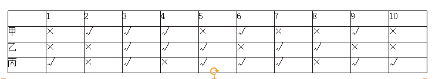

# Table of Contents

* [三人成众](#三人成众)
* [只对一半](#只对一半)
  * [肯定无重复](#肯定无重复)
  * [不肯定](#不肯定)
  * [重复](#重复)
  * [全部都有人对](#全部都有人对)
  * [真假都有](#真假都有)
* [列表](#列表)
* [重复](#重复-1)


- 排除优先

- 最大信息

- 确定信息：本质就是稳定性强

- 不确定信息代入

  


# 三人成众

1. 最大信息
2. 找确定条件

题型

三个人，不同职业、不同城市 进行选择。

--------


例题：在一个大学生宿舍有3个同学，她们的名字是：小梅．小红和小利。一个学英语，一个学法语，一个学德语；一个来自北京，一个来自上海，一个来自重庆。来自北京的不是学英语的，小红不学法语，小利来自上海，来自重庆的学法语。由此可知：

A．小红来自北京，学英语 

B．小梅来自重庆．学法语

C．小利来自上海，学德语 

D．小利来自上海，学法语

```
最大信息 法语
小红不学法语，来自重庆的学法语 小红不是重庆
小利来自上海 小红只能是北京
北京的不是学英语   德语

小梅．小红 小利
重庆     北    上
  法   德语  英
  选B
```

------

例题：甲、乙、丙、丁是思维天资极高的艺术家，他们分别是舞蹈家．画家．歌唱家和作家，尚不能确定其中每个人所从事的专业领域。已知：
（1）有一天晚上，甲和丙出席了歌唱家的首次演出。
（2）画家曾经为乙和作家两个人画过肖像。
（3）作家正准备写一本甲的传记，他所写的丁的传记是畅销书。
（4）甲从来没有见过丙。
下面哪一选项正确的描述了每个人的身份？
A． 甲是歌唱家，乙是作家，丙是画家，丁是舞蹈家
B． 甲是舞蹈家，乙是歌唱家，丙是作家，丁是画家
C． 甲是画家，乙是作家，丙是歌唱家，丁是作家
D． 甲是作家，乙是画家，丙是舞蹈家，丁是歌唱家

```
1 甲丙不是歌唱家 排除AC
2 乙不是画家 排除D

```

-----

例题：甲、乙、丙三人来自学校足球队、乒乓球队和篮球队。下列说法只有一种是对的：
（1）甲是足球队的；（2）乙不是足球队的；（3）丙不是篮球队的。         
则 甲、乙、丙三人分别是哪个队的？ 
A．甲是足球队的；乙是篮球队的；丙是乒乓球队的  
B．甲是篮球队的；乙是足球队的；丙是乒乓球队的  
C．甲是乒乓球队的；乙是足球队的；丙是篮球队的 

D．甲是乒乓球队的；乙是篮球队的；丙是足球队的 

```
足
-足
-篮
12 1对2也对 1假 
23 一真一假  足球的时候不能是篮球
            -足 不能是 篮球  排除CD
```

----------

例题：新一届中国科幻小说大赛“星座奖”结果发布，来自广东、上海、四川的甲、乙、丙三人位列三甲，已知：
（1）乙不来自四川
（2）乙不是第三名
（3）丙不是第一名
（4）来自广东的作者不是第二名
（5）来自四川的作者夺得第一名
由此可得知（   ）
A．甲不是第一名

B．乙获得第一名

C．丙来自四川

D．乙来自上海

```
四川   乙不来自四川 23 乙不是第三名
甲、乙、丙
1    2  3
四川  上海  广东
选D
```

例题：乒乓球单打决赛在甲、乙、丙、丁四位选手中进行，赛前，有些人预测比赛的结果，
A说：甲第4。
B说：乙不是第2，也不是第4。
C说：丙的名次在乙的前面。
D说：丁将得第1。
比赛结果表明，四个人中只有一个人预测错了。那么，甲、乙、丙、丁四位选手的名次分别为
A．2、3、4、1                      
B．1、2、4、3
C．1、3、4、2                      
D．4、3、1、2

```
观察选项 乙3 排除B 
看ACD   １４错　都不符合 只能是D 

```

例题：有甲、乙、丙三种花卉，分别是玫瑰、郁金香、风铃草，这三种花卉是从三个不同的国家运来的，分别是A国、B国和C国。下列条件是已知的：  
(1)花卉乙不是风铃草；
(2)花卉乙不是从C国运来的；
(3)花卉丙不是从A国运来的；
(4)玫瑰不是从B国运来的；
(5)风铃草是从A国运来的。 
根据上述条件，可以推出花卉乙是( )。 
A．玫瑰         B．郁金香       C．玫瑰或郁金香      D．无法判断

```
花卉乙 　风铃草
秒Ｂ
```

---

例题：学校操场有6条环形跑道，从外向内分别为1至6道，王伟、李明、刘平、张强、钱亮、孙新6人分别占据其中一道。已知：
（1）王伟的两侧是单数跑道，张强的两侧是双数跑道；
（2）李明与张强隔着两个跑道，钱亮在王伟和李明中间的那个跑道；
（3）刘平在单数跑道，孙新在双数跑道；
（4）王伟不在第二跑道；
（5）如果张强在第三跑道，那么王伟不在第四跑道。
根据以上陈述，可以得出以下哪项（  ）
A．在刘平和孙新之间隔着4个跑道
B．在钱亮和张强之间隔着2个跑道
C．在钱亮和孙新之间隔着3个跑道
D．在刘平和王伟之间隔着1个跑道

```
　1　2　3　4　5　　6
　　　　　王伟　
　　　　　　　张强
　　李明　
　　　　钱亮
  刘平　　　　　　孙新
  Ａ
```


例题：梅兰竹菊是张老汉的四个女儿。有一次，某客人问起四姐妹的年龄，得到不同的回答
梅说：“兰比竹小。”兰说：“我比梅小。”竹说：“兰不是三姐。”菊说：“我是大姐。
”憨厚的张老汉在旁补充道：“大女儿和三女儿撒谎呢，二女儿和小女儿说得对。
”据此，按年龄从大到小的顺序，可以判断四姐妹依次为
A．梅、兰、竹、菊           
B．梅、兰、菊、竹
C．兰、菊、梅、竹          
 D．菊、兰、梅、竹

```
大女儿说假话　老大不可能说自己是老大　只能是老三　秒B
```


# 只对一半

## 肯定无重复


+ 肯定无重复，唯一为真

  怎么理解无重复？没有相同的话

  

----

例题：A、B、C三人从政法大学毕业后，一个当了律师，一个当了法官，一个当了检察官。但究竟谁担任什么具体工作，人们还不清楚，于是有了以下猜测：
甲：A当了律师，B当了法官
乙：A当了法官，C当了律师
丙：A当了检察官，B当了律师
后来证实，甲 ．乙．丙三人的猜测都是只对了一半
以下哪项是对三人工作的正确描述？
A．A是法官，B是律师，C是检察官
B．A是法官，B是检察官，C是律师
C．A是律师，B是检察官，C是法官
D．A是检察官，B是法官，C是律师

```
常规思路：
A 左边 1真2假  右边就是2真1假 出现2个B一真一假，C真 A不是法官 选D

C一次 检察官一次
```

----

幼儿园马老师和三个小朋友倩倩、可可和安安一起玩“猜一猜，我最棒”游戏，马老师对小朋友们说：“我把手中的红球、黄球和蓝球分别放在这个柜子的三个抽屉里，请你们猜一猜每只抽屉里放的是什么颜色的球？猜对了奖励小红花！”然后，她请小朋友们闭上眼睛，把三只球分别放在三个抽屉里，小朋友猜的情况如下：

　　倩倩说：“红球在最上层的抽屉，黄球在中间抽屉。”

　　可可说：“红球在中间抽屉，蓝球在最上层的抽屉。”

　　安安说：“红球在最底层的抽屉，黄球在最上层的抽屉。”

　　老师告诉她们，每人都只猜对了一半。

　　请问：红球、黄球和蓝球各在哪一层抽屉里？

　　A.红球在中间抽屉，黄球在最上层的抽屉，蓝球在最底层的抽屉

　　B.红球在中间抽屉，黄球在最底层的抽屉，蓝球在最上层的抽屉

　　C.红球在最上层的抽屉，黄球在最底层的抽屉，蓝球在中间抽屉

　　D.红球在最底层的抽屉，黄球在中间抽屉，蓝球在最上层的抽屉

```
秒D 
```

---

例题：甲、乙、丙三人大学毕业后选择从事各不相同的职业：教师、律师、工程师。其他同学做了如下猜测：
小李：甲是工程师，乙是教师。
小王：甲是教师，丙是工程师。
小方：甲是律师，乙是工程师。
后来证实，小李、小王和小方都只猜对了一半。那么，甲、乙、丙分别从事何种职业？  （  ）
A．甲是教师，乙是律师，丙是工程师
B．甲是工程师，乙是律师，丙是教师
C．甲是律师，乙是工程师，丙是教师
D．甲是律师，乙是教师，丙是工程师

```
秒D
```


## 不肯定

例题：丹丹、小颖、淑珍去参加奥林匹克竞赛。奥林匹克竞赛有数学、物理和化学三种，每人只参加一种。建国、小杰、大牛作了以下猜测：
建国：丹丹参加数学竞赛，小颖参加了物理竞赛。
小杰：淑珍没参加物理竞赛，小颖参加了数学竞赛。
大牛：丹丹没参加数学竞赛，小颖参加了化学竞赛。
如果他们的猜测都对了一半，则以下哪项为真?
A．丹丹、小颖、淑珍分别参加数学、物理和化学竞赛。
B．丹丹、小颖、淑珍分别参加物理、数学和化学竞赛。
C．丹丹、小颖、淑珍分别参加数学、化学和物理竞赛。
D．丹丹、小颖、淑珍分别参加化学、物理和数学竞赛。

```
常规思路：最右边 一真2假 左边2真一假 13矛盾 左2真 答案就出来了

```


## 重复

+ 看重复

例题：A、B、C、D参赛，其成绩各不相同，有甲、乙、丙三人对此作了猜测。
甲说：“A得第一名，B得第二名”，
乙说：“C得第二名，D得第四名”；
丙说：“A得第二名，D得第四名”。
实际情况是三人都猜对了一半。则下列哪项是正确的？  （  ）
A．A第二，D第四                       
B．A第一，C第三      
C．B第一，D第三                       
D．C第一，D第四

```.

c2 d4
a2 d4
c2 a2  不能同时为真，那只能D为真了 
D 真 C不是2 A不是2 B是2 a不是1  a是3 选D

```

----

甲、乙、丙、丁四个人年龄不同。 
甲说：我最大，乙第二； 
乙说：我最大，甲最小； 
丙说：我最大，乙最小； 
丁说：我最小，丙最大。 
四个人都说对了一半，则这四个人的年龄从大到小排列是（）。
A. 甲、乙、丙、丁
B. 乙、丙、丁、甲
C. 丙、甲、丁、乙
D. 丙、乙、丁、甲

```
 甲1 乙2
 乙1  甲4
 丙1 乙4
 丁4  丙1
 
 丙1为真 乙不是4 丁不是4 甲最小  选D
```

----

某次幼儿园的课堂上，老师拿出五种水果，并依次编号为①—⑤，然后要求小朋友说出其中任意两种水果的名称。
小李说：③是苹果，②是龙眼。
小赵说：④是香蕉，②是猕猴桃。
小钱说：①是香蕉，⑤是梨子。
小孙说：④是梨子，③是猕猴桃。
小王说：②是苹果，⑤是龙眼。
结果是他们每人只说对了一半，根据以上条件下列正确的是：
A.  ①是香蕉，②是苹果
B.  ②是猕猴桃，③是梨子
C.  ③是苹果，④是梨子
D.  ④是龙眼，⑤是梨子

```
用最小信息 1香蕉 是错的

③是苹果，②是龙眼
②是苹果，⑤是龙眼
2可能是龙眼，是的话 小王没有对的
选C

还是找相同，不过要找【都是】一样的
```

-----

阿根廷大学的一位老师让五位留学生看校史上的五位大数学家的画像，让每位学生任意挑选两幅画像说出名字。 
张说：“2号是高斯，3号是黎曼。” 
倪说：“1号是希尔伯特，2号是闵可夫斯基。” 
朱说：“3号是闵可夫斯基，5号是希尔伯特。” 
韦说：“2号是高斯，4号是外尔。” 
方说：“4号是外尔，1号是黎曼。” 
老师发现每位学生都只说对了一半，那么1号画像是 。 
A . 黎曼 B . 闵可夫斯基 C . 希尔伯特 D . 高斯  

```
韦说：“2号是高斯，4号是外尔。” 
方说：“4号是外尔，1号是黎曼。
倪说：“1号是希尔伯特，2号是闵可夫斯基。” 

4是外尔 2号不是高斯 1号不是是黎曼 3号是黎曼 5号是希尔伯特 2号是闵可夫斯基 选D

```


## 全部都有人对

档案室有五个柜子，分别放着教育学院、体育学院、人文学院、管理学院和信息学院五个学院的资料，现在由甲、乙、丙、丁、戊五位同学来猜这五个柜子和五个学院的对应关系：甲：第二个柜子是教育学院的，第三个柜子是体育学院的。乙：第二个柜子是人文学院的，第四个柜子是管理学院的。丙：第一个柜子是管理学院的，第五个柜子是信息学院的。丁：第三个柜子是人文学院的，第四个柜子是信息学院的。戊：第二个柜子是体育学院的，第五个柜子是教育学院的。打开柜子后发现，每个人都只猜对了一半，而且每个柜子都有一个人猜对。由此可以推出：A.  第一个柜子里放着人文学院的资料B.  第二个柜子里放着教育学院的资料C.  第三个柜子里放着管理学院的资料D.  第四个柜子里放着信息学院的资料

```
直接看一个的，比较简单
```


## 真假都有

甲、乙、丙三人对一块花田里种植的花朵品种做了两次猜测：
甲：①“它是月季”;②“它不是玫瑰”。
乙：①“它不是月季”;②“它是玫瑰”。
丙：①“它不是月季”;②“它不是牡丹”。
工作人员听到后表示：“你们三人中，只有一个人两次都猜对了，一个人猜对了一次，还有一个人完全猜错了。”
如果工作人员的说法是对的，则该花田里种植的是()。
A.玫瑰
B.月季

C.牡丹

D.玫瑰、月季和牡丹之外的花种

```
甲乙矛盾 一真一假 但是题目只有一个，丙就是一真一假。前面没有牡丹

秒杀：直接看最大 选B
```


# 列表

例题：小明忘记了今天是星期几，于是他去问O、P．Q三人。O回答：“我也忘记今天是星期几了，但你可以去问P、Q两人。”P回答：“昨天是我说谎的日子。”Q的回答和P一样。已知：
①O从来不说谎；
②P在星期一、星期二、星期三这三天说谎，其余时间都讲真话；
③Q在星期四、星期五、星期六这三天说谎，其余时间都讲真话。
根据以上条件，今天是星期几？
A．星期一       B．星期二         C．星期四        D．星期天

|      | 今真昨假 | 今假昨真 |
| ---- | -------- | -------- |
| P    | 4        | 1        |
| Q    | 7        | 4        |

-----

例题：有赵、钱、孙、李、刘五位同学，他们所穿衣服颜色不同，有红、白、蓝、绿、黄，喝的饮料种类不同，有茶水、牛奶、可乐、咖啡、果汁。已知：蓝衣服在赵同学旁边；钱同学穿红色衣服；站中间的同学喝牛奶；喝果汁的不与喝可乐的相邻，绿衣服紧邻在白衣服左边；绿衣服喝咖啡；孙同学喝茶水；赵同学在最左边；刘同学喝果汁。由此可以推出？  （  ）                                            
A．孙同学穿的蓝衣服喝的是茶水
B．赵同学穿的绿衣服喝的是可乐
C．钱同学穿的红衣服喝的是果汁
D．最右边的同学穿红衣服喝的茶水

```
直接根据选项判断

A．孙同学穿的蓝衣服喝的是茶水
B．赵同学穿的绿衣服喝的是可乐   [绿衣服喝咖啡]
C．钱同学穿的红衣服喝的是果汁  【刘同学喝果汁】
D．最右边的同学穿红衣服喝的茶水 【钱同学穿红色衣服  孙同学喝茶水】
```

-----------

例题：甲、乙、丙三名学生参加一次考试，试题一共十道，每道题都是判断题，每题10分，判断正确得10分，判断错误得零分，满分100分。他们的答题情况如下：



考试成绩公布后，三个人都是70分，由此可以推出，1－10题的正确答案（  ）                                   A．×、×、√、√、√、×、√、×、√、×                                                                                                     
B．×、×、√、√、√、√、√、×、√、×                                                                                                          C．×、×、√、√、√、√、√、√、√、×                                                                                                     
 D．×、×、√、×、√、√、√、√、√、×

```
找选项相同的
1 23 5 7 9 10

三个人都是70分 
```


# 重复

例题：张三、李四得知，共有甲、乙、丙、丁等4支代表队分别获了15个项目（分别以序数表示）的奖牌，其中，甲队获得第1，4，12项目的奖牌：乙队获得第2，4，7，8，11项目的奖牌：丙队获得第4，5，6，12，13项目的奖牌：丁队获得1，5项目的奖牌。王五从四支代表队获奖的15个项目中挑一个单独告诉了李四，而将获得该项目奖牌的代表队名称单独告诉张三。王五对他们分别讲完，李四就说：“我不知道是那支代表队获得得这个项目的奖牌。”张三听了，就说：“我知道那个项目了。”李四马上说：“我也知道那支代表队了。”
据此，可以推出王五挑出的代表队和项目分别是（ ）  
A．甲队，第1项目             
 B．乙队，第4项目 
C．丙队，第12项目             
D．丁队，第5项目

```
李四　项目　不知道说明有重复的
1　4　12
2　4　7　8　11　　划掉　２　7　8　11　　为什么　不划掉　独立就能知道是谁了　
4　5　6　12　13
1　5

张三　他知道了说明只有一个了　选Ｂ
```


例题：老师和甲、乙、丙三个小朋友在一起做一个游戏。老师告诉小朋友们，共有五顶帖子，两顶黑色，三顶白色。拿出其中三顶，不告诉什么颜色，每人一顶，分别戴在每个人的头上。每个人都看不到自己头上的帽子。乙坐在丙的背后，甲坐在乙的背后。乙只能看到丙头上的帽子；甲能看见乙和丙头上的帽子；丙看不到任何人头上的帽子。老师问，谁能看到自己头上帽子的颜色？甲回答：“我不知道。”乙接着回答：“我也不知道。”丙略一思考，说：“我知道自己头上帽子的颜色。
”假设以上信息为真并且每一个小朋友都是聪明人，可以判断下面说法正确的一项是？  （  ）
A．丙头上为黑色帽子         
B．甲看到了两顶白帽子
C．甲看到了一顶白帽子和一顶黑帽子
D．乙看到了一顶白帽子

```
２黑３白
甲不知道：　如果是黑肯定知道，说明前面至少一白　或者２白
乙不知道：　如果甲是黑，乙肯定是白　违背，　甲肯定白乙不确定
选Ｄ
```

