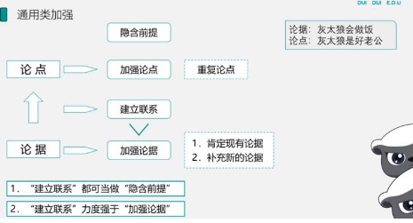

# Table of Contents

* [做题思路](#做题思路)
  * [如何找关键词](#如何找关键词)
* [基本结构](#基本结构)
  * [论证的有效性](#论证的有效性)
  * [偷换概念和类比不当](#偷换概念和类比不当)
* [因果](#因果)
  * [加强](#加强)
    * [例题](#例题)
  * [削弱](#削弱)
  * [伪他因](#伪他因)
    * [例题](#例题-1)
* [搭桥和拆桥](#搭桥和拆桥)
* [方法](#方法)
  * [方法唯一](#方法唯一)
  * [方法不唯一](#方法不唯一)
* [占比](#占比)
* [争论型-本因](#争论型-本因)
* [实验型](#实验型)
* [通用题型](#通用题型)
* [时态问题](#时态问题)
* [其他](#其他)
* [刷题](#刷题)
  * [刷题2](#刷题2)


加强型  削弱型   解释型   前提型  评价型  结论型


# 做题思路

1. 看清题目是加强还是削弱，圈出来

2. 找到论点和论据

3. 提取论据推导论点的【关键词】

   > 加强直接看关键词就ok

4. 锁定关键词的选项,一般可以排除2个。

5. 分析重点选项

   1. 关键词，同一律  偷换概念

   2. 量度改变力度

      > 可能 也许 少数 大部分 

      


## 如何找关键词


# 基本结构

论点：是作者在一个论证中想要表达和证明的观点和思想。

论据：用来证明作者的结论真实性或可靠性的理由和根据。

论证方式：是指证据得出结论之间的方式，即论证过程中所采用的推理形式。

> 一定要找准论点和论据，如何找？后面具体说

论点常用引导词：

因此，表明．由此可知．由此得同．因此可以断定．证明．告诉我们．意味着．说明等等 

论据常用引导词：

由于，因为．鉴于．由以下材料支撑．因为证据是．研究显示．或者大背景．事例．定义等等


## 论证的有效性

最开始不好理解。后面结合题目来。


1. 概念的有效性——切忌偷换概念（结论型，削弱型题目）

eg：中国人是勤劳勇敢的，小明是中国人，所有小明是勤劳勇敢的。

```
鲸鱼是动物，所以小鲸鱼是小动物 【错】
```

2. 语言的有效性——语言必须清楚明确

+  非黑即白（评价型）存在灰色区 【是否有第三者】

+   稻草人，通过歪曲对方来反驳对方或强加极端观点来丑化对方（三观不正）

  eg：你真丑，你也不漂亮啊

3. 论据的有效性

  a．应当是已知为真的判断，切忌论据虚假和预期理由

eg：因为将来有地震的可能，所以我们要提前做好撤离的准备。


  b．论据的真实性不应该靠论点的真实性来论证，“循环论证”

eg：小明是音乐神童，他很懂音乐，你怎么知道小明懂音乐，因为他是音乐神童。

4. 论证方式的有效性（论点和论据之间有必然的逻辑联系）

  a．违反推理规则        b．无关推论

  c．以偏概全            d．论据不充分

  e．以人为据，诉诸权威．诉诸无知．诉诸众人

  f．数据不可比

eg：你幸福吗，我不姓福，我姓王

eg：我们班女生都很瘦，所以我们班所有学生都很瘦

eg：小小老师说，学好逻辑就能上岸，所以我们要好好学习逻辑，因为这是小小老师说的。

eg：某专家（权威机构）说，吃白菜可以减肥，所以为了可以变瘦，我们大家都要吃白菜。

eg：既然你没有见过鬼，那么鬼就是不存在的。

eg：大多数都认为这题选C，所以这题的答案应该就是C。


（5）强制因果（空间的共存性和时间的先后性）

eg：小明感冒后吃了感冒药，然后就发烧了，所以是感冒药导致的发烧。

 

（6）类比不当（类比推理是根据事物A具有某种属性推出事物B也具有此种属性，想到使类比推理合理，必须使进行类比的事物必须具有某种相关的共同性本质性规定。如果这种本质性规定不一致，这样的类比则称为不当类比。）

eg：小明整天只顾着看书，不知道挣钱养家，妻子无法忍受与他离婚，后来小明考上了公务员，妻子要求和他复合，小明把水泼在地上说，我们的关系就跟这水一样，再也收不回来了。

 

（7）平均数陷阱．数据样本不科学

eg：为了调查我们班所有同学学习逻辑怎么样，我决定抽取上课经常互动，天天按时上课的的人做为实验样本。

eg：我们公司招聘行政人员，因为我公司人均月收入6000，所以我公司应聘人员应该很多。

 

（8）不当同一替换

若A=B，在有些断定中用B替代A，有时是成立的，有时是不成立的。

eg：我知道数字123456789，而小明的手机号码是123456789，所以我知道小明的手机号码。


## 偷换概念和类比不当

https://www.offcn.com/sydw/2018/0806/399199.html

+ 偷换概念：将一些貌似相同的概念进行偷换，实际上改变了概念的修饰语、适用范围、所指对象等具体内涵。


+ 类比不当：类比不当（类比推理是根据事物A具有某种属性推出事物B也具有此种属性，想到使类比推理合理，必须使进行类比的事物必须具有某种相关的共同性本质性规定。如果这种本质性规定不一致，这样的类比则称为不当类比

  > 其他情况一样。。。。。


# 因果

## 加强


```
题目：大叔造谣->讨厌
大叔没有造谣我，我不讨厌 【无因无果】
SCE没有造谣我，我不讨厌

```

无因无果排除类比不当
**想要排除类比不当，则需要在主体前面加上与XX本质相同的或者其他条件相同的情况下**

----------


```
题目：大叔造谣->讨厌
没有其他原因让我讨厌大叔 【排除他因】
```

---------------

### 例题

> 加强就是看关键词，待补充

例题：一位医生给一组等候手术的前列腺肿瘤患者服用他从西红柿中提取的番茄红素制成的胶囊每天两次，每次15毫克，3周后发现这组患者的肿瘤明显缩小，有的几乎消除，医生由此推测：番茄红素有缩小前列腺肿瘤的功效。     以下哪项，如果为真，最能支持医生的结论？

A．服务番茄红素的前列腺肿瘤患者的年龄在45～65岁。

B．服用番茄红素的前列腺肿瘤患者中有少数人的病情相当严重。

C．还有一组相似的等候手术的前列腺肿瘤患者，没有服用番茄红素胶囊，他们的肿瘤没有缩小。

D．番茄红素不仅存在于西红柿中，也存在于西瓜．葡萄等水果中。

```
题目关键词;
加强
因果 
无因无果 选C
```

----

例题：壳牌石油公司连续三年在全球500家最大公司净利润总额排名中位列第一，其主要原因是该公司比其他公司有更多的国际业务。

下列哪项如果为真，则最能支持上述说法？  

A．与壳牌公司规模相当但国际业务少的石油公司的利润都比壳牌石油公司低。

B．近三年来全球最大的500家公司都在努力走向国际化。

C．近三年来石油和成品油的价格都很稳定。

D．壳牌石油公司是英国和荷兰两国所共同拥有的。

```
题目关键词：利润 国际业务 
A 无因无果
```


## 削弱


题目：大叔造谣->讨厌

+ 讨厌->大叔造谣  【因果最强】
+ 因为拖欠工资导致我因导致我讨厌 【另有他因:  **没有排除本因**】
+ **仅仅是因为**拖欠工资导致我因导致我讨厌 【另有他因:  **排除本因**】
+ 大叔造谣->不讨厌 【有因无果】
+ 大叔**不**造谣->讨厌  【无因有果】

> 也要排除类比不当


+ 程度

1. 【因果最强】=【另有他因:  **排除本因**】

> 如果同时出现，肯定偷换概念了

2. 【有因无果】>【无因有果】


## 伪他因

> 小明报了四海，他上岸了，所以说报四海可以上岸。
>
> 他因削弱:小明报了四海的同时也报了小p公考。
>
> 不是他因:上岸的人中（这里不是说小明，没有贴合对方的论据）报了四海也报了小p公考 


《英国医学杂志》发表了一篇研究成果：吃白米饭最多的人和最少的人相比，患糖尿病的风险会增加55%。有人据此得出结论，多吃白米饭易患糖尿病。

　　以下哪项如果为真，最能削弱上述结论?

　　A.白米饭缺少人体每天所需的膳食纤维等营养素

　　B.吃白米饭多的人，其他类型食物的摄入量也高

　　C.遗传等其他多种因素，也会增加患糖尿病的风险

　　D.长期不吃或者少吃主食的人，也容易患糖尿病

　　【解析】答案选B。题干根据吃白米饭多的人患糖尿病的风险更高，得出结论“多吃白米饭容易患糖尿病”。A项，说明的是白米饭与营养素之间的关系，没有提及糖尿病，属于无关项。B项，说明的是吃白米饭多的人同时吃别的食物也多，那么就可能是因为吃别的食物患糖尿病，而不是因为多吃白米饭，即吃别的是食物才是患糖尿病的原因，属于“另有他因”，削弱结论。C项，说明的是遗传等原因也会导致糖尿病，没有提及白米饭，属于无关项。D项，不吃或少吃主食的人也容易患糖尿病，不能说明多吃白米饭是否易患糖尿病，不能削弱。故选B。

　　【点拨】本题易错选C。部分考生可能把遗传当成了“他因”，认为C项是“另有他因”。但是，选项仅说明遗传能导致糖尿病，并未体现出“遗传”与“多吃白米饭的”主体是否一致。若主体不一致则不能说明遗传是多吃白米饭的人患糖尿病的“他因”。所以，C项只能说明遗传也能导致糖尿病，不能说明吃白米饭多的人是不是因为遗传而患糖尿病。**而B项指出的“他因”与题干中“多吃白米饭”这一原因发生在同一主体身上，则能说明吃别的食物才是患糖尿病的原因，属于“另有他因”，能削弱。**

```
快速识别：就是看是不是同一话题内讨论
```


### 例题


近年来，立氏化妆品的销量有了明显的增长，同时，该品牌用于广告的费用也有同样明显的增长。业内人士认为，立氏化妆品销量的增长，得益于其广告的促销作用。

以下哪项如果为真，最能削弱上述结论？

- A立氏化妆品的广告费用，并不多于其他化妆品
- B立氏化妆品的购买者中，很少有人注意到该品牌的广告
- C注意到立氏化妆品广告的人中，很少有人购买该产品
- D近年来，化妆品的销售总量有明显增长

```
广告的促销作用-》立氏化妆品销量的增长
AD肯定排错了
B 无因有果
C 有因无果

选C 
```

----


近年来，参加某公务员辅导班的人数有明显增加，同时，该辅导班也加大了在各高校的宣传力度。所以可以得出结论：该辅导班报名人数的增加得益于其大力宣传。

以下哪项如果为真，最能削弱上述结论？

A. 参加公务员辅导班对提升公务员考试的成绩有一定的作用

B. 很多参加该公务员辅导班的人，没有注意到辅导班的宣传

C. 因为就业形势不乐观，很多大学生都选择参加公务员考试

D. 注意到辅导班的宣传的大学生中，很少有人报名参加该辅导班

```
大力宣传-》辅导班报名人数的增加
AC肯定错
这题坑在类比不当 以及 很少 【2坑】
B 无因有果
```

例题：一家全国连锁珠宝店的H分店，去年在当地投放大量电梯促销广告。广告投放后，客流量激增，净利润和前一年同期相比增长了 30%。可见电梯促销广告对于提高企业利润十分有效。假设G、M、R、S是与H分店规模、位置等具有可比性的其他4家分店，则下列最能削弱上述论证的是∶

A．G分店，去年没有投放电梯广告，利润比H分店更高

B．M分店，去年选择投放了报纸广告，销售额同比提升了 30%

C．R分店，去年投放大量电梯广告，销售额却比H分店低

D．S分店，去年投放大量电梯广告，利润同比下降了10%

 ```
大量电梯促销广告->H分店净利润和前一年同期相比增长了 30%

B 偷换概念
C 有因无果 但是 说的是利润
D 有因无果 
 ```

例题：一位长期从事醉酒及酒精中毒研究的医生发现，一般情况下，醉酒者的暴力倾向远远高于未饮酒或适度饮酒者。据此，该医生断定，具有暴力倾向的人容易喝醉酒。 

以下哪项最严重削弱了这位医生的断定？(  ) 

A．一些从未喝过酒的人也具有很强的暴力倾向 

B．在喝酒喝上瘾时，人们往往会行为失控并出现暴力行为 

C．当人们喝醉酒时经常会采用暴力行为发泄心中的不满 

D．当一个人醉酒程度很高时，已经无法控制自己的行为，即使有暴力行为发生，也不会造成严重后果 

```
具有暴力倾向->喝醉酒

A  未喝过酒 【  喝醉酒  】
B  喝酒喝上瘾
C  因果倒置
D 后果 有什么关系?
```

# 搭桥和拆桥

补漏和指出漏洞

+ 搭桥：论点和论据直接建立联系   **关键词**

我们班今年报名人数达到高峰，所以小小是优秀的推广师。

我们班所有报名同学都是因为小小的宣传和推广【是哪个选项是把关键词连接起来的】

+ 拆桥：论点和论据桥梁断掉

补漏 【加强】

指出漏洞 【削弱】

```
我们班女生学习特别认真，所以我们班同学都很牛
指出漏洞:【少男 】
补漏:【1.没男  2.男生也认真】
```


例题：人工合成食用色素，使用煤焦油中分离出来的苯胺染料为原料制成的，故又称煤焦油色素或苯胺色素，如合成苋菜红．胭脂红及柠檬黄等等。偶尔食用添加一定量的人工合成食用色素的食品，并不会引发中毒．泻泄等状况。因此，人们可以放心食用添加少量人工合成色素的食品。

以下哪项如果为真，最能削弱上述论证？  

A．食用添加少量人工合成食用色素的食品不利于人体健康

B．经常食用和偶尔食用对人体的影响不同

C．苯胺染料含对人体有害的物质

D．食用添加少量天然食用色素的食品不会影响人体健康

```
题目 以偏概全  偶尔 推出结论 【局部推整体】
A 直接告诉你不行
B  经常食用 无
CD  无
```

例题：今天的美国人比1965的美国人运动量减少了32%，预计到2030年将减少46%；在中国，与1991年相比，人们运动量减少45%，预计到2030年将减少51%。缺少运动已经成为一个全球性问题。                   以下哪项如果为真，最能支持上述观点?( )

A．其他国家人们的运动量情况和中国、美国大致相同

B．人们保持健康的方式日益多样化，已不仅局限于运动

C．中国和美国都是运动量缺乏这一问题较为严重的国家

D．在运动量方面，中国和美国分别是亚洲和美洲最有代表性的国家

```
漏洞：补充其他国家 选A
```

例题：肖群一周工作五天，除非这周内有法定休假日。除了周五在志愿者协会上班外，其余四天肖群都在太平保险公司上班。上周没有法定休假日。因此，上周的周一．周二．周三和周四肖群一定在太平保险公司上班。

以下哪项是上述论证所必须假设的？

A．一周内不可能出现两天以上的法定休假日。

B．太平保险公司实行每周四天工作日制度。

C．上周的周六和周日肖群没有上班。

D．肖群在志愿者协会的工作与保险业无关。

```
上周没有法定休假日。因此，上周的周一．周二．周三和周四肖群一定在太平保险公司上班。

漏洞：上周的周六和周日肖群没有上班。
```


# 方法

## 方法唯一

eg: 只有通过报班的方式才能够进面

加强：只有这个方法

削弱：还有其他方法


## 方法不唯一

题干中没有出现只有等绝对关键词


+ 加强：方法可行

+ 削弱：方法不可行


# 占比

**同比削弱，差比加强**

eg： 上课女生比男生多【上箭头】，所以女生比男生认真【上箭头】

+ 加强： 女生比男生少     【 下箭头 差比  箭头相反 】

+ 削弱： 女生比男生大   【上箭头   同比  箭头一样 】

  > 换种表达方式
  >
  > 女生占总人数的比例2/3   上箭头 同比削弱

+ 注意：题干出现占比时，选项中必须要要有某个量【占总人数】的百分比才能得到答案


----

例题：某高校针对去年起图书馆的图书借阅情况做了调查，数据显示，文学类书籍的借阅量大大超过了科技类书籍。因此，文学类书籍的受欢迎程度要高于科技类书籍。

以下哪项如果为真，最能削弱上述论证？

A．科技类书籍学习难度较大

B．文学类书籍占该校图书馆馆藏一半以上

C．该校就读文科专业的学生接近三分之二

D．除了文学类书籍，法律．哲学类书籍也很受欢迎

 ```
题型：占比
同比削弱 直接B
文学类书籍占该校图书馆馆藏一半以上【总数也有】
 ```


# 争论型-本因

一个人说A是B的原因，另外一个人说，不对，C才是B的原因

削弱： A是C的原因       A-C-B 肯定第一个，否定后一个


# 实验型

+ 单一 【样本要科学  样本不能太少】
+ 对比  【**单因子变量**】
  + 加强：同一起跑线
  + 削弱： 不同起跑线

> 实验性最大的削弱就是变量不一致


# 通用题型




# 时态问题

eg： 未来5年，国考报名人数会逐年递增

```

```

# 其他

+ 主观意愿**不选**，就事论事 【例题 提高能源使用效率】

+ 能有钱解决的困难都不是困难

+ 政府推行政策，个人支持不支持没有什么影响

+ **政府的政策，法律对策 都不会选**

  

# 刷题

【错题】张女士特别爱美,多年来喜欢在冬天穿裙子以显示她婀娜多姿的身材。从去年冬天起,每到阴冷天,她都感觉到膝关节疼痛。后经医生诊断,她得了关节炎。于是张女士认为,阴冷天穿得少是导致关节炎的原因。 以下哪项如果为真,最能质疑张女士的观点( )。

A. 日本一些年轻女士喜欢冬天穿裙子,却并没有因为阴冷天穿得少而患上关节炎

B. 现代医学研究表明导致关节炎的根本原因是劳损、感染或创伤,阴冷天穿得少关节炎易发作

D. 阴冷天穿得多的人群中也有很多得了关节炎,而且以中老年人居多

C. 张女士的姐姐和她生活在一个城市,多年来也喜欢在冬天穿裙子,但没得关节炎

```
A  一些年轻女士  类比不当
B 另有他因，排除本因
C  张女士的姐姐  类比不当  【改：其他情况一样的姐姐，阴冷天穿得少没有锝导致关节炎】
D   中老年人    类比不当
```

【错题】生活中有时候可以看到一些人会反复地洗手，反复对餐具进行高温消毒，反复地检查门锁等，重复这类无意义的动作并使自己感到十分烦恼和苦闷，这就是神经症中的一种，称为强迫症。王强每天洗手次数超过普通人的20倍，看来，王强是得了强迫症 。

以下哪项如果为真，最有力地削弱上述结论（  ）

A．王强在洗手时并没有感到任何的烦恼和苦闷。

B．王强的工作性质是需要洁净卫生的。

C．王强的家里人的洗手次数都比普通人高。

D．王强并没有检查门锁的习惯，甚至有一次还忘记了锁门，结果被盗。

 ```
结论：他有强迫症   重复这类无意义的动作并使自己感到十分烦恼和苦闷
关键词：洗手 强迫症
A 我很开心 我没有强迫症
B 卫生一定要洗手吗  偷换概念
C 无关
D 无关
 ```

----

R行星是位于太阳系的一颗小行星，质量不大，平均直径不足500米。在对R行星进行长达一年的观测后，人们发现其表面长期漂浮着砂粒，且砂粒在漂浮一段时间后，还会重新落在行星表面。由于R行星表面没有稳定的大气层，因此人们认为砂粒漂浮的现象主要来自静电，原因是太阳风进入行星表面产生电场时，砂粒会因静电力的作用离开行星表面漂浮游动起来，当没有太阳风时，砂粒又会回落下来。以下哪项如果为真，没有质疑上述观点？

A．R行星与彗星组成类似，彗星靠近太阳时，受太阳风产生的静电影响，其表面砂粒将会漂浮

B．R行星表面存在一氧化碳、干冰等挥发性物质，其升华会带动砂粒的释放与漂浮

C．R行星质量小，静电作用只能扬起毫米级的砂粒，但目前其表面漂浮的砂粒尺寸都很大

D．R行星自转速度快，星球上的物体受到离心作用强，其表面尘埃与石块会脱离引力束缚，剥落散逸

```
原因是太阳风进入行星表面产生电场时，砂粒会因静电力的作用离开行星表面漂浮游动起来

A R行星与彗星组成类似[排除类比不当] 加强
```

例题：在某市学生运动会上，男女100米短跑冠军均来自第一中学的体育班，而不是市体育学院，很多家长都在说：“第一中学比市体育学院的训练质量高”。

下列______项最能反驳这些家长们的结论。

A．本次运动会上第一中学的冠军数量比市体育学院少很多

B．有没有出现短跑冠军并不是衡量学校训练质量的唯一标准

C．因为第一中学的老师待遇好，很多老师离开市体育学院去第一中学

D．第一中学的学生都住宿，所以他们在校训练的时间比市体育学院多

 ```
关键词：短篇冠军
选B
 ```

例题：某年全市的文理科高考状元都是志远私立高中的学生，于是很多家长得出结论说：“志远中学比市重点高中——一中的教学质量都高”。以下哪项最能反驳这些家长们的结论？

A．有没有出现文理科高考状元并不是衡量学校教学水平高低的唯一标准    
B．该年志远中学学生高考平均分比市一中学生的低很多         
C．因为志远中学的教师待遇好，有不少教师离开市一中来志远教书      
D．志远中学的学生都住宿，所以他们在校学习时间比市一中学生长

```
关键词 高考状元
A 
```

例题：交管局要求司机在通过某特定路段时，在白天也要像晚上一样使用大灯，结果发现这条路上的年事故发生率比从前降低了15％。他们得出结论说，在全市范围内都推行该项规定会同样地降低事故发生率。

最能支持上述论断的一项是？

A．该测试路段在选取时包括了在该市驾车时可能遇见的多种路况

B．由于可以选择其他路线，因此所测试路段的交通量在测试期间减少了

C．在某些条件下，包括有雾和暴雨的条件下，大多数司机已经在白天使用了大灯

D．司机们对在该测试路段使用大灯的要求的了解来自于在每个行驶方向上的三个显着的标牌

```
补漏 选A
```

碳纳米管材料具有重量轻．强度高等优点，被广泛应用于自行车和球拍等产品生产中。但是近日研究发现，长期从事生产碳纳米管工作或利用该材料制造其他产品的工人，有可能因吸入碳纳米管而致癌。              以下哪项如果为真，最能支持上述研究发现？               
A．研究表明，容易引发癌症的是一些较长的碳纳米管，这可能是因为它们更容易卡在肺部或腹部细胞间的空腔中                    B．在使用体外培养的人体皮肤细胞进行实验时显示，碳纳米管可以进入细胞内部，降低细胞自身的免疫能力                      C．动物实验显示，如果碳纳米管大量进入实验鼠的腹部，约有10%的实验鼠会在一年内腹腔炎症                           D．石棉是国际癌症组织确认的致癌物质，而碳纳米管在化学分子结构上和石棉存在一些相似之处

```
碳纳米管  致癌
A 对
B  免疫能力   和癌症有什么关系
C 动物不对 腹腔炎症   
D  石棉 一些相似之处
```

【错题】很多家长认为，孩子不听话，“打屁屁”惩罚一下，至少能让孩子注意到自己的行为不当，变得更听话一些。还有一些人坚持“不严加管教会惯坏孩子”的传统信念，认为“打屁屁”是为孩子好。研究者对16万名儿童在过去5年里的经历进行研究，通过收集“打屁屁”行为的元数据加以分析，发现：打屁股会在儿童成长过程中造成智商低．攻击性行为高等多种负面影响。         
  以下哪项如果为真，最能支持上述结论？                 

A．最新调查显示，智商相对较低的孩子大多数经常被家长打屁股       

B．本身不听话且更容易惹祸的孩子更有可能受到父母的严厉惩罚       

C．研究报告称全球大约80%的父母都有以打屁股管教孩子的经历       

D．被打屁股而困惑的孩子只懂得按家长要求去做而不会独立思考

```
打屁股会在儿童成长过程中造成智商低．攻击性行为高等多种负面影响

选快就是A A是削弱
BC 无关
D  补充论据
```

例题：一项研究显示，先让受试者参加消除某项偏见的学习，并给受试者播放该偏见学习相关联的声音。之后，让受试者进入深度睡眠状态，同时重复播放那些相关联的声音，以重新激活消除该偏见的学习。结果发现，该偏见比睡眠前大大减少，且睡眠质量越高，偏见减少的越多。研究人员据此推测，睡眠干预可减少社会偏见与歧视。以下哪项如果为真，最能支持上述论证？         
A．普通民众难以得到消除偏见学习的睡眠干预              
B．睡眠充足、睡眠质量高的人比其他人更不易产生偏见与歧视        
C．有身高歧视、相貌歧视的人经过睡眠干预后，歧视程度明显降低      
D．在接受睡眠干预的受试者中，有一部分人并不存在明显的偏见与歧视

```
睡眠干预可减少社会偏见与歧视 关键词
B 产生
C  减少
```

例题：一直以来，高楼大厦被视为城市的象征，甚至很多地方以建筑高度作为城市现代化的象征。越来越多的摩天大楼拔地而起，竞相突破城市天际线的纪录。根据我国《民用建筑设计统一标准》，建筑高度大于100米的即为超高层建筑。这些摩天大楼虽然看起来“挺拔壮观”，但背后的隐患不容忽视。因此，“限高”势在必行。以下哪项如果为真，最能支持上述观点?(  )

A．超高层建筑工程造价和运维成本更高，建造施工难度更大

B．中国150米、200米、300米以上建筑的数量均保持全球第一

C．超高层建筑安全风险更大，逃生疏散时间长，消防设施、抗震技术复杂，管理运维要求更高

D．城市建筑风貌是城市外在形象和内质精神的有机统一，限高有利于打造更多符合城市风貌的建筑

 ```
C
 ```


例题：提高能源使用效率．鼓励能源灵活利用是英国减少温室气体排放政策的一个必要环节，它需要采用智能技术，包括通过智能表将能源使用信息从需求方或客户发送到能源公司等。该信息可用于制定和实施更高效的能源使用条例。但英国消费者对此态度不一，因为将该技术用于监控和支持能源高效率使用行为时，居民个人及家庭的能源数据不得不被动分享。所以，个人使用能源相关数据的被动分享有可能成为推广智能技术的主要障碍。               以下哪项如果为真，最能支持上述结论？               

A．60%的被调查者表示，不愿意因数据被动分享而降低个人能源使用比例    

B．60%的被调查者认为，数据的被动分享大大增加个人隐私被侵犯的风险 

C．60%的被调查者表示，那些关心气候变化的人更可能接受数据被动分享 

D．60%的被调查者认为，数据不可能不被分享，否则智能技术不可能应用

 ```
关键词：被动分享
不愿意 主观意愿
B 
 ```


例题：研究发现，一种被称为EPASI的特殊基因能调节机体生理状态，使人类适应缺氧环境。考古研究表明这种特殊基因最早可追潮至16万年前已居住于青藏高原的古人类。由于16万年前全球同时生活着尼安德特人、丹尼索瓦人及古老的直立人，其中只有丹尼素瓦人拥有这一基因，考古学家推测丹尼索瓦人很可能在16万年前居住于青藏高原。

以下除哪项外，均能支持考古学家的推测？

A．分析青藏高原人骨化石中的蛋白质序列，发现这些人类与丹尼素瓦人同属一类

B．考古人员在青藏高原东北部的白石崖溶洞遗址提取到丹尼素瓦人的线粒体DNA

C．丹尼素瓦人曾在亚洲广泛分布，他们曾在西伯利亚生活过，可耐受高寒环境

D．通过对牙齿形态的扫描，发现青藏高原古人类的牙齿齿列和丹尼索瓦人最为相似

 ```
关键词：青藏高原
C
 ```


例题：在过去，药物的研发主要来自于陆地生物，这与陆地生物更被熟知且容易获得有关。近几十年来，越来越多的药物开始从海洋生物中产生，海洋生态环境极具复杂性，因而海洋生物相比陆地生物有着更为广泛的多样性。有人据此认为，海洋生物产业潜力巨大，海洋生物更有可能是未来新型抗生素、抗癌药物的来源。

以下除哪项外，均能支持上述观点？

A．借助计算工具，人们已将庞大的生物基因组库和具有生物活性的化合物库进行关联，用以探索新药物

B．一些海洋生物如鲸、鲨等终生不得癌症，有近 300 种海洋生物含有抗肿瘤物质，它们是研究抗癌药物的重要资源

C．当前已发现的3.5万个海洋天然产物中有一半以上都具有生物活性，还有更多数以万计的未知海洋天然产物亟待开发

D．日前抗生素都来源于陆地微生物，病菌耐药性不断上升，而海洋微生物药物已经对一些感染性疾病提供了替代疗法

```
除哪项外，均能支持上述观点？
A  没有海洋生物

```

例题：地方政府对经济的干预不仅表现在直接通过财政投资拉动经济增长，还表现为通过财政补贴．税收优惠．信贷优惠和降低土地等要素成本诱导性地干预企业的投资决策。国有企业因为与政府具有密切的产权关系，其控制权主要掌握在政府手中，这就造成国有企业往往成为政府干预和调控经济的手段。     以下各项如果为真，最能支持上述结论的是？               

A．钢铁、水泥和电解铝等产能过剩行业中既有国有企业，也有民营企业    

B．房地产行业前三强都是民营企业，它们多数都享受了信贷优惠      

 C．国有企业的投资决策通常会受到地方政府的直接指导和干预      

 D．部分大中型国有企业被政府遴选为“重点企业”，享受税收、信贷优惠

 ```
C
D 量度不够 部分
 ```


例题：在对一种健脑产品的测试实验中，第一组被试者每天服用该种保健产品，第二组则没有服用。结果发现，第一组被试者的大脑认知能力果然比第二组被试者好。因此，实验证明这种保健产品确实对大脑具有明显的保健效果。     以下哪项如果为真，最能支持上述结论                  

A．在测试实验前两组被试者的大脑认知能力是相当的           

B．该健脑产品所含的成分在一些日常食物中也存在             

C．两组被试者的人数相等，且家庭经济能力类似              

D．该健脑产品已经许可生产和销售，并取得很好的市场份额

 ```
对照 单因子变量
A
 ```


例题：甲校学生的英语考试成绩总比乙校学生的英语考试成绩好，因此，甲校的英语教学方法比乙校好。                        下列选项能够加强题干的是？                     

A．甲校英语考试题总比乙校的容易。                   

B．甲校学生的英语基础比乙校学生好。                  

C．乙校选用的英语教材比甲校选用的教材要难。             

 D．乙校的英语教师比甲校教师工作更勤奋。

 ```
加强 差比 
D
 ```

## 刷题2 


例题：威尔和埃克斯这两家公司，对使用他们字处理软件的顾客，提供24小时的热线电话服务。既然顾客在使用软件有困难时才打电话，并且威尔接到的热线电话比埃克斯接到的热线电话多四倍，因此，威尔的字处理软件一定是比埃克斯的字处理软件难用。以下哪顶如果为真，最能有效地支持上述论证？　

A．平均每个埃克斯热线电话的时间比威尔热线电话的时间长两倍。

B．拥有埃克斯字处理软件的顾客数比拥有威尔字处理软件的顾客数多三倍。  

 C．埃克斯收到的关于字处理软件的投诉信比威尔多两倍。          

D．威乐热线电话的号码比埃克斯的号码更公开。

 ```
关键词 热线电话
差比加强 
CD 排除  B
 ```


例题：键盘手．手机手．鼠标手等新型“现代病”流行，在腱鞘炎患者中，在20-40岁年龄段且经常操作手机．电脑等新型器材的人占了大多数。研究者据此推测，现代人反复操作电脑．手机等新型器材让特定的几个手指长时间．重复．用力地屈伸，使手部的肌腱出现过度的摩擦可能是导致腱鞘炎发病的重要因素。

如果以下各项为真，哪项不能质疑上述推论（ ）

A．手机．电脑等新型器材都有较大的辐射量，而大剂量辐射也易对人体健康尤其是较脆弱的关节腱鞘部位造成影响

B．隔离与手机．电脑等新型器材的接触并不能使腱鞘炎患者恢复健康

C．现在手机．电脑等新型器材非常普及，绝大多数20-40岁年龄段的人都有使用，而20-40岁正是腱鞘炎的最高发年龄段

D．研究数据表明，大多数20-40岁年龄段的经常操作手机．电脑等新型器材的人并没有得腱鞘炎

```
关键词： 肌腱出现过度的摩擦可能是导致腱鞘炎发病的重要因素
A  
B 恢复健康，题目说发病  选他
C 加强论据 [另有他因]
D 有因无果

A其实说影响 但是B更离谱
```

例题：传统污水处理，或通过重力沉降、混凝澄清、浮力浮上、离心力分离、磁力分离等物理方法对不溶态污染物进行分离，或通过酸碱中和法、化学沉淀法、氧化还原法等化学方法让污染物发生转化，而新兴的微生物治理技术则是通过水体微生物来净化污水。有专家认为，与传统手段相比，微生物治理技术是一种处理污水的更佳手段。

以下哪工页如果为真，不能支持上述观点?

A．近年来，微生物技术的科研投入持续扩大，相关技术成果在土壤改良等领域已经得到了有效转化

B．物理方法进行污水治理的处理厂，通常占地面积大、基建费、运行费高、能耗大，易出现污泥膨胀现象

C．化学方法进行污水治理运行成本高，需消耗大量的化学试剂，易产生二次污染

D．微生物技术污水治理的能耗低，效率高，剩余污泥量少，操作管理方便

```
微生物治理技术是一种处理污水的更佳手段
A 跟土壤没关系  选A

```

例题：壳牌石油公司连续三年在全球500家最大公司净利润总额排名中位列第一，其主要原因是该公司比其他公司有更多的国际业务。

下列哪项如果为真，则最能支持上述说法？  

A．与壳牌公司规模相当但国际业务少的石油公司的利润都比壳牌石油公司低。

B．近三年来全球最大的500家公司都在努力走向国际化。

C．近三年来石油和成品油的价格都很稳定。

D．壳牌石油公司是英国和荷兰两国所共同拥有的。

 ````
加强 因果 
无因无果 A
 ````


例题：日前，某区物价管理部门修改了停车费收费方案和标准，将机动车停车位收费价格上调了50％，并把部分原来免费的车位也纳入收费管理，同时对新能源车免收停车费。这样能够增加车位的流动性，根治部分车主久占车位的乱象，有效缓解交通压力。
以下哪项如果为真，最能支持上述方案？

A．该方案通过网络征求了广大市民的意见和建议

B．停车费收费方案调整后大大提升了车位空置率

C．增加后的停车费标准仅与相邻城市的标准持平

D．提高燃油机动车使用成本市民会购买新能源车

  ````
关键词： 有效缓解交通压力
B 方法可行
  ````

例题：某国人口统计机构预测，到2031年，该国人口将降到1.27亿以下，在今后40年内人口将减少2400万，为此，该国政府出台一系列鼓励生育的政策。近年来，该国人口总数趋于稳定，截至2014年6月1日，人口数量为1.461亿，2014年1至5月人口增长量为5.91万，增长率为0.04%。因此，有专家认为该国实施的鼓励生育政策达到了预期的效果                 

下列选项如果为真，最能加强上述论点的是?   (  )                     

A．如果该国政府没有出台鼓励生育的政策，儿童人口总数会持续下降            

B．如果该国政府出台更加有效的鼓励生育政策，就可以提高人口数量             

C．近年来该国人口总数出现缓慢上升的趋势                         

 D．该国政府出台的鼓励生育政策是一项长期国策

  ````
方法本可行

A  不用会更差 
  ````

例题：针对癌症患者，医生常采用化疗手段将药物直接注入人体杀伤癌细胞，但这也可能将正常细胞和免疫细胞一同杀灭，产生较强的副作用。近来，有科学家发现，黄金纳米粒子很容易被人体癌细胞吸收，如果将其包上一层化疗药物，就可作为“运输工具”，将化疗药物准确地投放到癌细胞中。科学家由此断言，微小的黄金纳米粒子能改善癌症化疗的效果，并能减轻化疗的副作用。      

以下哪项如果为真，能支持科学家所做出的诊断？             

A．黄金纳米粒子用于癌症化疗有待大量临床检验。              

B．在体外用红外线加热已进入癌细胞的黄金纳米粒子，可以从内部杀死癌细胞

C．因为黄金所具有的特殊化学物质，黄金纳米粒子不会与人体细胞发生反应。

 D．现代医学手段已经能实验黄金纳米粒子的精准投送，让其所携带的化疗药物只作用于癌细胞，并不伤及其他细胞。

  ````
微小的黄金纳米粒子能改善癌症化疗的效果，并能减轻化疗的副作用
d 比C 好
  ````

例题：应激本身没有致痛能力，但是流行病学调查发现，长期应激与疼痛慢性化的发生正相关，即长期处于巨大压力下的人群，其疼痛症状更易迁延，进而发展为慢性疼痛。
以下哪项如果为真，最能支持上述调查结果？   (  )
A．具有焦虑倾向的人，其应激水平往往较高，疼痛慢性化的发生率也会更高
B．长期应激可影响神经内分泌系统，使人的疼痛抑制系统的功能被削弱
C．吸烟使人体神经内分泌系统发生紊乱，对疼痛感知的影响与应激相似
D．如果能有效缓解应激，保持心态平和，疼痛慢性化的发生率将会降低

  ````
关键词：长期应激  慢性疼痛
B  

  ````

例题：目前，手机及大多数电动汽车内使用的锂离子电池都由一个阴极和一个阳极组成，使用传统方式生产的阴极材料对稀土元素钴有强烈的依赖。研究人员开发了一种水热合成法，制造出一款新型无钴高容量阴极材料。此外，新方法使用溶解在乙醇中的金属使阴极结晶，而传统方式使用的是氨。研究人员认为，这种方法制造出的阴极材料更清洁、更具成本竞争力，同时也提升了生产效率。

以下除哪项外，均能支持上述结论?

A．与氨相比，乙醇的储存和处理更安全，且可重复使用

B．新方法制备阴极材料的时间从几天缩减到12小时

C．使用新方法制造的锂离子电池完全可以匹配现有手机和汽车

D．新方法使用毒性更低、价格更低廉的材料制备阴极材料

 ````
这种方法制造出的阴极材料更清洁、更具成本竞争力，同时也提升了生产效率 
C
 ````

## 削弱

例题：某市为了发展文化强市战略，在2008年．2010年先后建成了两个图书馆，2008年底共办理市民借书证7万余个，到2010年底共办理市民借书证13万个，2011年，该市又在新区建立了第三个图书馆，于2012年初落成开放，截止2012年底，全市共计办理市民借书证20余万个。市政府由此认为，该项举措是有实效的，因为在短短的4年间，光顾图书馆的市民增加了近两倍。

以下哪项如果为真，最能削弱上述结论（  ）

A．图书馆要不断购置新书，维护成本也很高，这会影响该市其他文化设施建设

B．该市有两所高等学校，许多在校生也办理了这3个图书馆的借书证

C．很多办理了第一个图书馆借书证的市民又办理了另外两个图书馆的借书证

D．该市新区建设发展迅速，4年间很多外来人口大量涌入新区

 

```
指漏  图书馆的人并没有变多 
C
```

例题：相比那些不踢足球的大学生，经常踢足球的大学生的身体普遍健康些。由此可见，足球运动能锻炼身体，增进身体健康。 

以下哪项为真，最能削弱上述论断？ 

A．大学生踢足球是出于兴趣爱好，不是为了锻炼身体 

B．身体不太好的大学生一般不参加激烈的足球运动 

C．足球运动有一定的危险性，容易使人受伤 

D．研究表明，长跑比踢足球更能达到锻炼身体的目的

 ```
B
 ```


例题：某消费导向杂志在读者中做了一项调查，以预测明年的消费趋势。在被调查者中，有57%的人在明年有奢侈品项目消费的计划。该杂志由此推测：明年消费者的消费能力会很强。

以下哪项如果为真，最能削弱该杂志的推测?

A．该刊物的读者要比一般消费者富有

B．并非所有该刊物的读者都对调查作了回答

C．大多没有奢侈品项目消费计划的人都打算存钱买房

D．计划购买的奢侈品大多是进口的，并不能刺激国内市场

 ```
A 
 ```


例题：近年来，学术不端甚至学术腐败现象愈演愈烈。有些人剽窃他人研究成果，有些人编造实验数据，有些人私自拿患者做实验，不仅丧失了学者的底线，甚至是连最起码做人底线都没有了，身为学者的李教授对此感到非常痛心，他认为学术腐败已经到了非惩治不可的地步，但是同样身为学者的妻子说：“我不同意你的观点，我们学院的张教授治学严谨，他从来没有学术不端的行为   

以下哪项最能反驳李教授妻子的观点

A．惩治学术腐败光靠榜样的力量是不够的，更需要法律的约束

B．张教授也可能存在学术不端行为，只是没有被发现而已

C．作为一名公共知识分子，张教授要注意自己在公众面前的正面形象

D．张教授的情况属于个别案例，并不能反驳带有普遍性的某种规律

  ```
D
B 可能 量词 
  ```

例题：研究中，实验组小鼠每天晚上接受两小时的蓝光照射，对照组小鼠白天接受两个小时的蓝光照射三周之后，所有小鼠进行“强迫游泳”和“糖水偏好”测试。这两项测试常用来检测小鼠是否出现了类似抑郁的症状。结果发现，相比于白天接受光照的小鼠，夜间接受光照的小鼠明显表现出类似抑郁的症状。研究者认为，长期在夜间暴露于蓝光下，人们出现抑郁情绪的风险会提高。

以下除哪项外，均能削弱研究者的观点（  ）

A．小鼠与人的生活习性完全不同，小鼠昼伏夜出，而人类基本是白天活动晚上休息

B．光对于小鼠是厌恶型刺激，小鼠回避光以降低被发现和捕食的风险，而人通常在光明的环境感觉更加安全

C．行为测试是否能够测试主观情绪体验，类似抑郁的症状是否等同于出现抑郁的情绪体验尚存在争议

D．相比白天，夜间的光照更容易通过视网膜神经节细胞激活伏隔核，该脑区与负性情绪的产生有关

  ```
均能削弱研究
A 类比不当
B 类比不当
C 否论点
D 不明确 无关
  ```

例题：9月初大学入学报到时，有多家手机运营商到某大学校园进行产品销售宣传。有好几家运营商推出了免费套餐服务。但是其中一家运营商推出了价格优惠的套餐，同时其业务员向学生宣传说：其他运营商所谓的“免费”套餐是通过出售消费者的身份信息来获得运营费用的。

以下哪项如果为真，最能质疑该业务员的宣传?

A．免费套餐运营商所提供的手机信号质量很差

B．免费套餐运营商是通过广告来获得运营费用的

C．有法律明确规定，手机运营商不得出售消费者的身份信息

D．很难保证价格优惠的运营商不会同样出售消费者的身份信息

  ```

B 他因
  ```

例题：软件通常存在漏洞，攻击者为接近并操控目标主机、往往会主动寻找漏洞。攻击者会花费 大量时间区分软件中“真正危险的漏 ”和“ 良性漏洞 ”，并在找到前者后实施攻击。因此有观点认为：如果添加大量良性箱洞欺骗攻击者，使其耗尽资源去寻找和测试那些毫无攻击用途的漏洞，将会减少对软件“真正危险的漏洞 ”的攻击，从而保证软件不被攻击者恶意控制。

以下哪项如果为真，最能削弱上述观点?

A．与软件中“真正危险的漏洞 ”相比，良性漏洞被攻击后只会导致程序崩溃

B．许多军用飞机、舰艇都配有假目标系统，与此类似，良性漏洞也将起到干扰作用

C．大量添加良性漏洞会让其呈现很多人为特征，攻击者可利用其识别并忽略良性漏治

D．添加漏洞意味着要更改代码，有时代码运行不良可能会影响软件的功能

 ```
C 方法不可行
 ```

【错题】例题：计算机程序员长时间对着电脑屏幕工作很容易患近视眼。为了帮助这部分人预防和缓解近视，公司为员工印发了宣传册，教大家预防和治疗近视的一些方法。                                  

以下哪项如果为真，最能对上述宣传的效果提出质疑：

A．不经常对着电脑工作的人也可能患近视

B．预防和治疗近视的方法因人而异

C．预防和治疗近视需要眼科医生指导

D．近视很难进行自我预防和治疗

  ```
B 方法不可行

D  
  ```

例题：也许令许多经常不刷牙的人感到意外的是，这种不良习惯已使他们成为易患口腔癌的高危人群。为了帮助这部分人早期发现口腔癌，市卫生部门发行了一个小册子，教人们如何使用一些简单的家用照明工具，如台灯、手电等，进行每周一次的口腔自检。

以下哪项如果为真，最能对小册子的效果提出质疑？

A．有些口腔疾病的病症靠自检难以发现。

B．预防口腔癌的方案因人而异。

C．经常刷牙的人也可能患口腔癌。

D．经常不刷牙的人不大可能作每周一次的口腔自检

  ```
A 错在哪里 偷换概念
D 
  ```

例题：近来，国际大宗商品市场中，原油和天然气价格达到近十年以来的高位，锌矿价格也上涨了7%左右，有分析人士认为，大宗商品市场将进入”超级周期”大宗商品价格高于长期平均价格的时期).从宏观层面看，大宗 商品进入"超级周期"是全球经济出现新的增长动力的结果。历史上大宗商品进入”超级周期"往往会带动全 球经济复苏，这也预示着当下全球经济正在复苏。

以下哪项如果为真，最能削弱上述论证？

A．地缘政治的风险加剧了大宗商品供应的紧张局势，引发本轮大宗商品价格上涨

B． 飙升的天然气价格推高了化肥的主要成分——氨的价格，进而推高全球粮食价格

C．全球经济将更注重环保，碳中和与碳达峰将改变能源产业格局，进而影响金属和原油产业的发展远景

D．全球主要经济体正在加紧出台强有力的救市计划，以寻求本国新的经济增长动力

  ```
A 另有他因
  ```

例题：硕鼠通常不患血癌。在一项实验中发现，给300只硕鼠同等量的辐射后，将它们平均分为两组，第一组可以不受限制地吃食物，第二组限量吃食物。结果第一组75只硕鼠患血癌。因此，通过限制硕鼠的进食量，可以控制由实验辐射导致的硕鼠血癌的发生。

以下哪项如果为真，最能削弱上述实验结论？

A．硕鼠与其他动物一样，有时原因不明就患有血癌。

B．第一组硕鼠的食物易于使其患血癌，而第二食物不易使其患血癌。

C．第一组硕鼠体质较弱，第二组硕鼠体质较强。

D．对其他种类的实验动物，实验辐射很少导致患血癌。

  ```
B 样本不科学
  ```

例题：冰雪旅游是利用冰雪气候资源体验冰雪文化的旅游活动，包括冰雪观光演艺、运动竞技等内容。H地区冰雪旅游开展了五年，调查显示：在近万名受访者中，有90%的人曾以不同形式体验过冰雪旅游，平均每年有65%的人体验过1~2次冰雪旅游，有25%的人体验过3~4次，且这一比例逐年升高。这说明H地区冰雪旅游的需求较高，常态化多次消费正成为H地区越来越多人的选择。

以下哪项如果为真，最能削弱上述结论?

A．参与调查的受访者几乎都是了解或喜爱冰雪旅游的年轻人

B．近五年，H 地区冰雪旅游产业的年均投资额接近，没有增加

C．H 地区位于北半球北部，冬季较长，许多游客会来此体验冰雪旅游

D．为扩大宣传，H 地区许多冰雪项目会推出优惠组合套餐，吸引人们多次消费

  ```
A 样本不科学
  ```

【错题】例题：占星术是根据天象来预卜人间事物的一种方术。占星术在世界各地很流行，即使是在科学昌明的21世纪。有人认为：有些占星术的预测是正确的，否则不会有上百万的人相信。

以下哪项如果为真，最能反驳上述有关人士的观点?（  ）

A．流行的未必都是正确的

B．占星术大部分的预测是模糊的

C．会有上百万的人相信非常荒唐的事情

D．世界上有上千万甚至数亿的人不相信占星术

  ```
D

这题选C  直接否论点
  ```

例题：调查显示，某地区第二产业从业人员与五年前相比减少了 10.4%，对于第二产业从业人员减少的原因，一种观 点认为，产业优化升级是第二产业从业人员减少的原因，第二产业在实现产业规模快速扩大的同时，不断加快 技术改造，实现“机器换工”，客观上降低了工业企业的用工需求。另一种观点则认为，这与第二产业的优化 升级无关，第三产业的蓬勃发展发挥了就业”蓄水池"的功能，吸纳了大量第二产业从业人员。

以下哪项如果为真，最能削弱第二种观点？

A．第二产业优化升级拉动了第三产业蓬勃发展

B．该地区第三产业的整体规模比第二产业要小

C．第三产业的发展得益于持续优化的营商环境

D．第二产业和第三产业都对吸纳就业作出贡献

  ```
三 ->二

A 二->三  因果倒置
  ```

例题：最近一项调查显示，近年来在某市高收入人群中，本地人占70%以上，这充分说明外地人在该市获得高收入相当困难。以下哪项如果为真，才能支持上述结论？

A．外地人占该市总人口的比例高达40%

B．外地人占该市总人口的比例不足30%

C．该市中低收入人群中，外地人占40%

D．该市中低收入人群中，本地人占不足30%

  ```
排除CD 总人数不对
看AC 加强 差比 也就是要小 

  ```

例题：今年上半年，即从1月到6月间，全国大约有300万台录像机售出。这个 数字仅是去年全部录像机销售量的35%。由此可知，今年的录像机销售量一定会比去年少。 

以下哪项如果为真，最能削弱以上的结论? 

A．去年的录像机销售量比前年要少。 

B．大多数对录像机感兴趣的家庭都已至少备有一台。 

C．一般说来，录像机的全年销售量70%以上是在年末两个月中完成的。

D．去年销售的录像机中有 6 成左右是在1月售出的。 

  ```

选D 
  ```

例题：广告：世界上最好的咖啡豆产自哥伦比亚。在咖啡的配方中，哥伦比亚咖啡豆的含量越多，则配制的咖啡越好。克力莫公司购买的哥伦比亚咖啡豆最多，因此，有理由相信，如果你购买了一罐克力莫公司的咖啡，那么，你就买了世界上配制最好的咖啡。

以下哪项如果为真，最能削弱上述广告中的论证？

A．克力莫公司配制及包装咖啡所使用的设备和其他咖啡制造商的不一样。

B．不是所有克力莫公司的竞争者在他们销售的咖啡中，都使用哥伦比亚咖啡豆

C．克力莫公司销售的咖啡比任何别的公司销售的咖啡多得多。

D．大部分没有配制过的咖啡比最好配制的咖啡好。

   ```
同比削弱 
选C
   ```

例题：在人们的印象中，生物燃料是一种可再生的绿色能源，而最新公布的研究成果颠覆了人们的这一传统印象。研究人员发现，生物燃料可能因其未完全燃烧而转化为乙醛，进而污染空气，这种污染会导致M国每年有1400人早亡。因此，有M国医疗机构人员认为现阶段应该暂缓推广生物燃料，限制其使用。以下哪项如果为真，会对医疗机构人员的观点提出最有力的质疑？

A．现阶段M国科学家已研制出使生物燃料充分燃烧的新技术

B．目前M国正在使用的其他燃料的污染每年会导致超过3000人早亡

C．石油等传统燃料已经得到技术改善，由燃料所带来的污染大幅降低

D．科学家预计，随着研究工作的推进，5年后新型生物燃料将不会再产生乙醛

 ```
有M国医疗机构人员认为现阶段应该暂缓推广生物燃料

A
B 类比不当
C 偷换概念
D 将来时态
 ```


# 逻辑缺环


电商直播可以为农产品的营销提供一条有效的渠道，在农产品供应链的运作上要明显优于传统的“农户批发商分销商消费者”模式。但目前在很多地方，电商直播营销模式并没有有效解决农产品卖难买难的问题。有从业者认为只要完善农产品物流配送体系，提高直播人员素质，就能有效解决这一问题。

以下哪项如果为真，不能支持上述从业者的观点？

- A直播内容重复单调，易引起消费者审美疲劳，不利于树立起良好的产品形象，影响了农产品直播的效果

- B部分地区没有对农产品的生产、包装、运输以及销售等环节制定统一的标准，对农产品的质检投入不足

- C在电商直播模式下，对物流的需求会增加，现有的冷链物流水平无法满足日益增长的农产品消费需求

- D许多地区的农户居住比较分散，农产品出村进城“最先一公里”的物流运输难题，始终未能完全得到解决

  ```
  电商直播营销模式并没有有效解决农产品卖难买难的问题 【提出问题】
  有从业者认为只要完善农产品物流配送体系，提高直播人员素质，就能有效解决这一问题。【解决问题】
  是不是缺了一环，需要建立练习，就是【分析对策怎么解决问题】
  b 无关
  ```

  


# 经典题目分析

W 国对咖啡领域的调查显示,过去W国咖啡领域的融资金额高达5 亿元,该国许多知名企业跨界进入咖啡领域,本土咖啡品牌在快速崛起。然而经过去年一年的销售发现,W国线下咖啡门店的总数量虽然有所增加,但咖啡销量与往年相比并未明显增加,因此有人认为：咖啡在 W 国居民中不是很受欢迎。

以下哪项如果为真,最能削弱上述观点?

A. W 国个别线下门店提供的速溶咖啡添加了植癌末、白砂糖等成分,摄入过多不利于身体健康。

B. 与一些咖啡销量高的国家相比, W国咖啡的单价过高,在一定程度上阻碍了消费欲望。

C. W 国的一些企业开始倾向咖啡液、速溶咖啡、袋泡咖啡等全品类进军。

D. 当前，W 国的咖啡文化并不成熟，作为消费主体的年轻人喝咖啡也大多是赶潮流。

```
观点： 咖啡在 W 国居民中不是很受欢迎。  论据：销量不好

```

