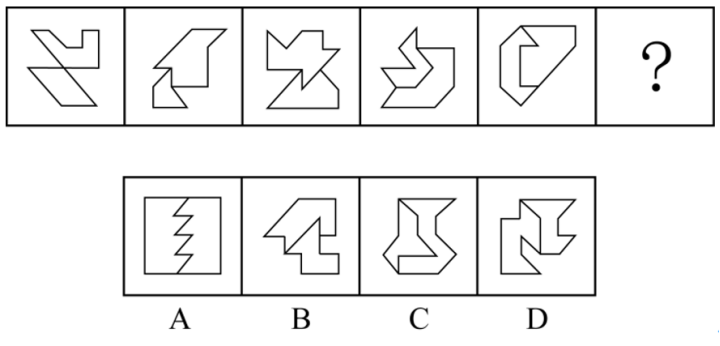

# Table of Contents

* [图推本质](#图推本质)
  * [例题](#例题)


# 图推本质

+ 找共同点 【先整体、后局部】
+ 找共同变化趋势【位置、数量】
+ 数数量


## 例题


```
先看整体，圆相交,排除AB
在观察趋势:交切。。。。 选C
```


A.①②③，④⑤⑥	B.①④⑤，②③⑥
C.①④⑥，②③⑤	D.①③④，②⑤⑥

```
1.都有三角形 圆 正方形
2.在看确实 145 套娃
选B
```

【例3】从所给的四个选项中，选择最合适 的一个填入问号处，使之呈现一定的规律性：


```
1.第一组图都有三角 第二组有正方形 秒D
-------
1.相交 如果你是出题人你考什么？ 边数 345 678 还是选D
```


【例4】把下面的六个图形分为两类，使每一类图形都有各自的共同特征或规律，分类正确的一项是：


A.①②⑥，③④⑤		B.①③④，②⑤⑥
C.①④⑤，②③⑥		D.①④⑥，②③⑤

```
边交 点交 A
```

【例5】每道题包含一套图形和四个选项，请从四个选项中选出最恰当的一项填在问号，使图形呈现一定的规律性。



```
整体2部分组成  哪里特殊 3这个点特殊 

这题看边也可以
```


【例6】把下面的图形分为两类，使每一类图形都有各自的共同特征或规律，分类正确的一项是：


A.①④⑥，②③⑤	B.①③⑤，②④⑥
C.①②④，③⑤⑥	D.①⑤⑥，②③④

```
整体看  对角线斜着 146
```

-------------

【例1】把下面的六个图形分为两类，使每一类图形都有各自的共同特征或规律，分类正确的一项是：


A.①④⑤，②③⑥	B.①④⑥，②③⑤
C.①②④，③⑤⑥	D.①⑤⑥，②③④

```
有黑点 在外面或者里面 356
```

【例2】下列选项中最符合所给图形规律的是：


```
交点都是黑点 选C
```

【例3】将下列六个图形按一定规律分为两大类，正确的是：

A.136，245			B.135，246
C.156，234			D.124，356

```
平行 是相交 234
```

【例4】把下面的六个图形分为两类，使每一类图形都有各自的共同特征或规律，分类正确的一项是：


A.①③⑥，②④⑤ 	B.①③⑤，②④⑥
C.①②④，③⑤⑥ 	D.①②③，④⑤⑥

```
黑点隔着  124 
```

【例5】把下面的六个图形分为两类，使每一类图形都有各自的共同特征或规律，分类正确的一项是：


A.①③④，②⑤⑥	B.①②⑤，③④⑥
C.①③⑥，②④⑤	D.①④⑤，②③⑥

```
134
```

【例6】从所给四个选项中，选择最合适的一个填入问号处，使之呈现一定规律性：


```
整体：方向位置一样 排除BD
位置 数量：都是斜的
```

【例7】从所给四个选项中，选择最合适的一个，使之呈现一定的规律性：


```
没看出来

都有箭头 且是锐角
```

【例8】把下面的六个图形分为两类，使每一类都有各自的共同规律或特征，分类正确的一项是：


A.①②④，③⑤⑥	B.①④⑤，②③⑥
C.①③④，②⑤⑥	D.①②⑥，③④⑤

```
平行 134 
```

【例9】从所给的四个选项中，选择最合适的一个填入问号处，使之呈现一定的规律性：


````
1.都是一根线连着面 考啥 尾巴

竖 横 斜  选C
````

------


```
第一反应 面积 
共：都有黑 白 
白>黑
```

【2022年】64、把下面的六个图形分为两类，使每一类图形都有各自的共同特征或规律，分类正确的一项是（    ）。


A、①②③，④⑤⑥				B、①②⑤，③④⑥
C、①④⑥，②③⑤				D、①④⑤，②③⑥

```
交点在那个位置

```


# 命题形式


```
4-5 连续
7-8 隔项
```


```

```

+ 九宫格

+ 找 验证 应用
+ 24为肩 68为足 5居中
+ 米 对称


+ 分组分类


