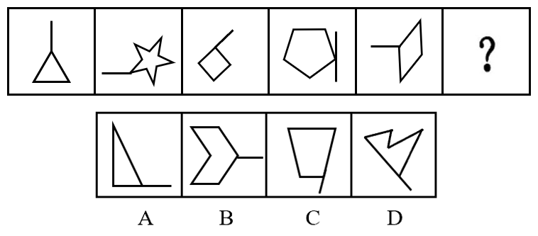
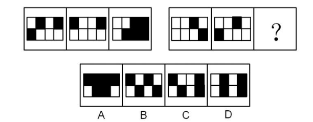
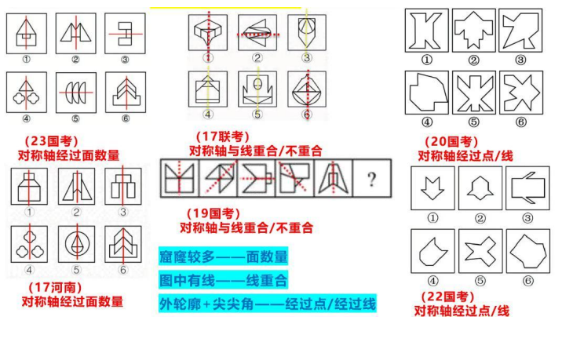
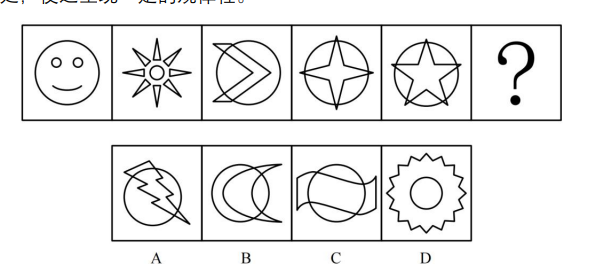
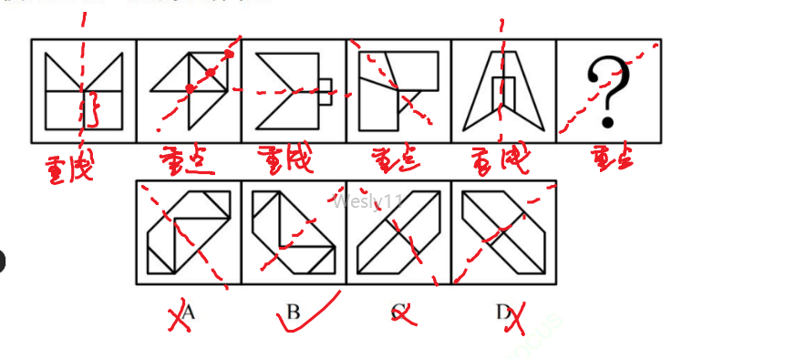
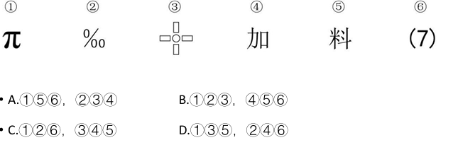
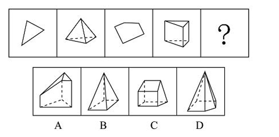
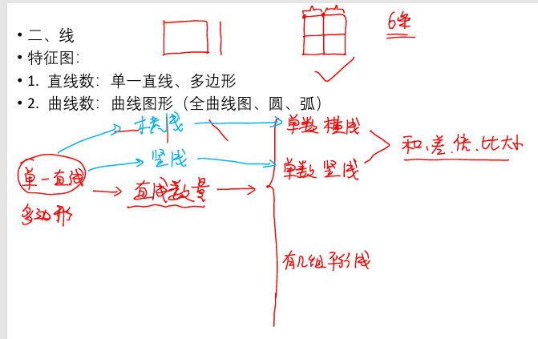
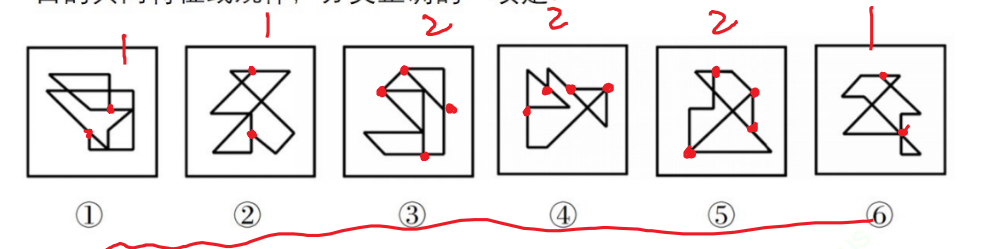
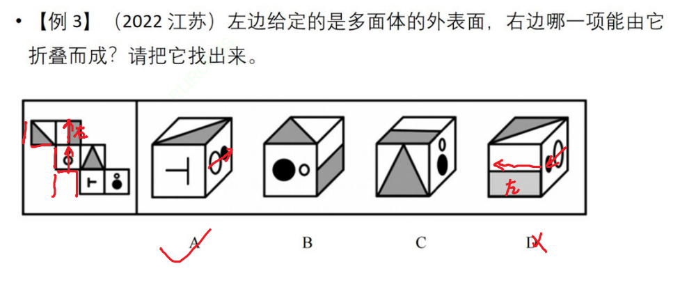

# Table of Contents

* [图推本质](#图推本质)
  * [例题](#例题)


# 图推本质

+ 找共同点 【先整体、后局部】
+ 找共同变化趋势【位置、数量】
+ 数数量


## 例题


```
先看整体，圆相交,排除AB
在观察趋势:交切。。。。 选C
```


A.①②③，④⑤⑥	B.①④⑤，②③⑥
C.①④⑥，②③⑤	D.①③④，②⑤⑥

```
1.都有三角形 圆 正方形
2.在看确实 145 套娃
选B
```

【例3】从所给的四个选项中，选择最合适 的一个填入问号处，使之呈现一定的规律性：


```
1.第一组图都有三角 第二组有正方形 秒D
-------
1.相交 如果你是出题人你考什么？ 边数 345 678 还是选D
```


【例4】把下面的六个图形分为两类，使每一类图形都有各自的共同特征或规律，分类正确的一项是：


A.①②⑥，③④⑤		B.①③④，②⑤⑥
C.①④⑤，②③⑥		D.①④⑥，②③⑤

```
边交 点交 A
```

【例5】每道题包含一套图形和四个选项，请从四个选项中选出最恰当的一项填在问号，使图形呈现一定的规律性。


```
整体2部分组成  哪里特殊 3这个点特殊 

这题看边也可以
```


【例6】把下面的图形分为两类，使每一类图形都有各自的共同特征或规律，分类正确的一项是：


A.①④⑥，②③⑤	B.①③⑤，②④⑥
C.①②④，③⑤⑥	D.①⑤⑥，②③④

```
整体看  对角线斜着 146
```

-------------

【例1】把下面的六个图形分为两类，使每一类图形都有各自的共同特征或规律，分类正确的一项是：


A.①④⑤，②③⑥	B.①④⑥，②③⑤
C.①②④，③⑤⑥	D.①⑤⑥，②③④

```
有黑点 在外面或者里面 356
```

【例2】下列选项中最符合所给图形规律的是：


```
交点都是黑点 选C
```

【例3】将下列六个图形按一定规律分为两大类，正确的是：

A.136，245			B.135，246
C.156，234			D.124，356

```
平行 是相交 234
```

【例4】把下面的六个图形分为两类，使每一类图形都有各自的共同特征或规律，分类正确的一项是：


A.①③⑥，②④⑤ 	B.①③⑤，②④⑥
C.①②④，③⑤⑥ 	D.①②③，④⑤⑥

```
黑点隔着  124 
```

【例5】把下面的六个图形分为两类，使每一类图形都有各自的共同特征或规律，分类正确的一项是：


A.①③④，②⑤⑥	B.①②⑤，③④⑥
C.①③⑥，②④⑤	D.①④⑤，②③⑥

```
134
```

【例6】从所给四个选项中，选择最合适的一个填入问号处，使之呈现一定规律性：


```
整体：方向位置一样 排除BD
位置 数量：都是斜的
```

【例7】从所给四个选项中，选择最合适的一个，使之呈现一定的规律性：


```
没看出来

都有箭头 且是锐角
```

【例8】把下面的六个图形分为两类，使每一类都有各自的共同规律或特征，分类正确的一项是：


A.①②④，③⑤⑥	B.①④⑤，②③⑥
C.①③④，②⑤⑥	D.①②⑥，③④⑤

```
平行 134 
```

【例9】从所给的四个选项中，选择最合适的一个填入问号处，使之呈现一定的规律性：



````
1.都是一根线连着面 考啥 尾巴

竖 横 斜  选C
````

------


```
第一反应 面积 
共：都有黑 白 
白>黑
```

【2022年】64、把下面的六个图形分为两类，使每一类图形都有各自的共同特征或规律，分类正确的一项是（    ）。


A、①②③，④⑤⑥				B、①②⑤，③④⑥
C、①④⑥，②③⑤				D、①④⑤，②③⑥

```
交点在那个位置

```


# 命题形式


```
4-5 连续
7-8 隔项
```


```

```

+ 九宫格

+ 找 验证 应用
+ 24为肩 68为足 5居中
+ 米 对称


+ 分组分类


+ 空间重构


# 平面

+ 形状、大小、数量，但**位置不同**

  + 平移
  + 翻转
  + 旋转

+ 形状、大小、数量，但**数量不同** 【样式规律】

+ 元素遍历

+ 图形之间有线条相同，也有线条不相同

  + 去同存异
  + 去异存同
  + 简单叠加

  > 先看图形有没有相同，或者不同的，看最后在还是不在，

+ 图形之间格子相同，但黑白颜色不同

  + 黑白快


## 平移 翻转 旋转


```
先整体：组成相同
再看有没有位置和数量规律

元素组成相同，旋转  一个顺时针 一个逆时针
```


这样考，太简单了，如何升级呢？

三个问题

+ 谁在动----决定主体是谁

+ 在哪动---- 决定了范围

  > 内圈外圈
  >
  > 什么时候需要分内外圈？
  >
  > 扒皮：
  >
  > + 圈内黑的个数相等--------------需要分内外圈 【列题2】
  > + 不相等  普通平移

+ 往哪动----决定了方向

+ 动多远

  + 等距离
  + 等差   1 3 5 7 9


【例1】下列问号处最适合填入的一项是：


```
组成相同 选C  基本不会考
```


```
考虑内圈 排除CD 
空白也算一种元素
选A
```


【例 4】（2022 江苏）从所给的四个选项中，选择最合适的一个填入问号处，使之呈现一定的规律性。


```
不用扒皮都一样 
左上1  对角线移动
2  逆时针3   重合了 A
```

【例 5】（2022 广东）下列选项中最符合所给图形规律的是


```
直接扒皮  选D
```


【例5】从所给的四个选项中，选择最合适的一个填入问号处，使之呈现一定的规律性：


```
第一反应 旋转 180 
直接卷子旋转 刻画下来 
```


### 翻转例题

细节点

+ 线条粗细
+ 阴影方向
+ 边框


【例 2】（2020 安徽）从所给的四个选项中，选择最合适的一个填入问号处，使之呈现一定的规律性。


```
可以看到二三 是翻转的 那就 在BC 选，这个时候注意阴影线得方向
```


【例 3】（2020 国考）从所给的四个选项中，选择最合适的一个填入问号处，使之呈现一定的规律性。


```
白色不动 黑色翻转
循环 最后是 白色不动 黑色翻转  AC选 C 翻转没了，排除 选A
```


## 元素遍历

+ 比较简单， 就是遍历下

【例1】下列选项中，符合所给图形的变化规律的是:


```
看下面 AD 选   选D
```


## 去同存异


```
怎么判断是不是 去同或去异

有线条相同，也有线条不相同。看最后结果。
```

但是也太简单了，会结合翻转和旋转来考 ！！


【例 2】（2019 国考）从所给的四个选项中，选择最合适的一个
填入问号处，使之呈现一定的规律性。


----

```
先找出共同或者不同之处，标出来，再看怎么翻转或者旋转
```


【例 4】（2023 国考）从所给的四个选项中，选择最合适的一个
填入问号处，使之呈现一定的规律性。


```
看第一行  不同的留下来了，应该是去同存异
直接C
```


【例 4】（2021 江苏）从所给的四个选项中，选择最合适的一个
填入问号处，使之呈现一定的规律性。


```

```


# 黑白运算

网上规律

整体: 对称、移动、叠加

部分： 部分、个数、相邻比较


+ 格子多 >=9  优先考虑

  + 【串起来黑白】 【 特征：黑色相连】【一笔画成不是一笔画】

  + 对称  【白色对称】【黑色对称】

    > 残缺的九宫格/16/25 基本都是考对称

  + 相邻比较 【变或不变】

  + 数黑的个数

+ 格子少 <=9  优先考虑

  + 平移:  【黑色个数基本不变】
  + 黑白叠加
  
+ 残缺916 优先考虑对称


【例 2】（2022 江苏）从所给的四个选项中，选择最合适的一个
填入问号处，使之呈现一定的规律性。


```
第一行只有4格 且元素个数不太一样 只能考黑白

本质：一分为2  什么意思？就是分为 黑色和白色 2种元素，考察黑色和白色之间的规律
```


【例 3】（2023 广东）下列选项最符合所给图形规律的是：


```
黑黑=白 AC选
白白=黑 选A
```


## 练习

 1.从所给的四个选项中，选择最合适的一个填入问号处，使之呈现一定的 规律性：


```
扒皮 中间相同 选A
```

 2.从所给的四个选项中，选择最合适的一个填入问号处，使之呈现一定的 规律性：


```
扒皮不行， 看移动
```

3.从所给的四个选项中，选择最合适的一个填入问号处，使之呈现一定的 规律性


```
扒皮不行 看平移 行没规律 看竖

1上 2下 选C
```

 4.从所给的四个选项中，选择最合适的一个填入问号处，使之呈现一定的 规律性：


```
扒皮 选D
```

 5.从所给的四个选项中，选择最合适的一个填入问号处，使之呈现一定的 规律性：


```
扒皮不行
数量都不一样，平移不行。 黑白运算
```

6.【2018年新建建设兵团】从所给四个选项中，选择最合适的一个填入问 号处，使之呈现一定的规律性



```
数量都不一样，平移不行。 黑白运算

```

 7.【2018年辽宁】从所给四个选项中，选择最合适的一个填入问号处，使 之呈现一定的规律性


```
明显黑白
```

8.下列选项中，与所给图形规律相同的是（ ）


```
一笔画成
```

 9.把下面的六个图形分为两类，使每一类图形都有各自的共同特征或规律， 分类正确的一项是：


```
一笔画成 125
```

• 10.【2023 广东 


```
一笔画成 2
```

 14.【2022四川下】从所给的四个选项中，选择最合适的一个填入问号处， 使之呈现一定的规律性：


```
明显对称
```

 【错题】15.【2020 江苏】从所给的四个选项中，选择最合适的一个填入问号处，使 之呈现一定的规律性：


```
对称C
```

16.把下面的六个图形分为两类，使每一类图形都有各自的共同特征或规律， 分类正确的一项是：


```

```

17.【2023国考 】从所给的四个选项中，选择最合适的一个填入问号处，使 之呈现一定的规律性


```
对称 A
```

• 18.【2022 国考 】


```
A
```


 23.把下面的六个图形分为两类，使每一类图形都有各自的共同特征或规律， 分类正确的一项是：


```
部分 白色
```

24.从所给的四个选项中，选择最合适的一个填入问号处，使之呈现一定的 规律性：


```
部份 3 2 1

```

【错题】25.【2022 北京】


```
的确没想到 个数 
8 910 11 12 13 A
```

【错题】• 26.【2022 国考】


```
9 10 9 10 9 10 
```

 27.从所给的四个选项中，选择最合适的一个填入问号处，使之呈现一定的 规律性：


```
相邻比较 C
```

【错题】 28.从所给的四个选项中，选择最合适的一个填入问号处，使之呈现一定的 规律性：


```
面积相等 选B
```

【错题】 29.【2023年国考】从所给的四个选项中，选择最合适的一个填入问号处， 使之呈现一定的规律性：


```
1.共同点：黑色 4个空白 1个不相邻

---------------
2.黑色发出几条线  4条
-----------
第三种考法
黑边与边重复的公共边数 
```

 31.【2023年国考】从所给的四个选项中，选择最合适的一个填入问号处， 使之呈现一定的规律性：


```
相邻比较  B
```


```
面积 245 
```


# 差异大

考点太多，需要通过特征图来区别


## 属性

### 对称 

1. 图形出现箭头、“Z”字变形图、等腰三角形等，优先考虑对称性
2. 对称轴 数量（面或者其他z）、方向、与点或者线重合


但是一般不会考这么简单


三条对称，一般都是考等边三角形





 【例 1】（2023 广东）从所给的四个选项中，选择最合适的一个填入问号 处，使之呈现一定的规律性。



```
对称 中心 对称 中心 

```

【例 2】（2019 山东）从所给的四个选项中，选择最合适的一个填入问号 处，使之呈现一定的规律性


```
对称轴数量
```

• 【例 3】（2019 国考）从所给的四个选项中，选择最合适的一个填入问号 处，使之呈现一定的规律性。



 【例 4】（2021 浙江）把下面的六个图形分为两类，使每一类图形都有各 自的共同特征或规律，分类正确的一项是：


```
2个图形对称轴
```


### 曲直

要么最开始试试 要么最后试试 

- 考曲直之间的数量关系。交点、曲线数量、直线数量

### 开闭

+ 全封闭
+ 全开
+ 半开半闭

生活化图形


【例1】（2024 山东网友回忆版）把下面的六个图形分为两类，使每一类 图形都有各自的共同特征或规律，分类正确的一项是


• 【例2】从所给四个选项中，选择最合适的一个填入问号处，使之呈现一 定规律性：


 【例3】把下面的六个图形分为两类，使每一类都有各自的共同特征或规 律，分类正确的一项是：



## 数量

### 点 

什么都能考等于什么都不能考  X   【对称 开闭 线条 交点 】

那么延申，加一个特殊的边 【开闭 交点】


重点


圆一分为3 ，见例题4

 【例 4】（2023 事业单位）从所给的四个选项中，选择最合适的一个填入 问号处，使之呈现一定的规律性。


```
会考园内吗？看几幅图共同点 ，园内有的太多有的太少可能，园外也是，那只能圆上了
园内 一个简单 一个复杂

234 
567
```

【例 5】（2021 国考）从所给的四个选项中，选择最合适的一个填入问号 处，使之呈现一定的规律性。


```
这题就比较明显了 圆上都有切点
```

【例6】从所给的四个选项中，选择最合适的一个填入问号处，使之呈现 一定的规律性：


```
看最后2副图 交点
2345678
```

不要一个一个点数，容易漏，画行数


例7】从所给的四个选项中，选择最合适的一个填入问号处，使之呈现 一定的规律性：


```
曲直交点  234 234
看圆上交点好像也可以
```

【例8】从所给的四个选项中，选择最合适的一个填入问号处，使之呈现 一定的规律性：


```
比较明显 园内交点
```


【例9】从所给的四个选项中，选择最合适的一个填入问号处，使之呈现 一定的规律性：



```
共同点 立体和平面共同点，是交点 或者 线条
34567
```

【例 1】（2020 山东）从所给的四个选项中，选择最合适的一个填入问号 处，使之呈现一定的规律性。


```
电话卡 这题2种
线  但是线没规律 
点 357  357  选C
```


【例 2】（2020 江苏）从所给的四个选项中，选择最合适的一个填入问号 处，使之呈现一定的规律性。


```
线 点 三角形感觉都会考
345678
```

【例 3】（2024 浙江网友回忆版）从所给的四个选项中，选择最合适的一 个填入问号处，使之呈现一定的规律性


```
特征图 第一个 
面的个数 直曲交点 
```


### 线



单一直线是什么？就暗示考什么

和差倍比：考差和比最多

平行线会有干扰线，看到有平行的线

出现4条平行线不会考平行。


```
猜题：
看共同 都有直曲排除AB
直线产生干扰 选D

第三提醒我们单数横线

```

【例 1】（2019 江苏）从所给的四个选项中，选择最合适的一个填入问号 处，使之呈现一定的规律性。


```
直线个数
```

【例 2】（2022 联考）从所给的四个选项中，选择最合适的一个填入问号 处，使之呈现一定的规律性。


```
643
544
和差倍比 1 0 -1
7 5
6 5 白比黑多

```

【例 3 】（2022 四川）从所给的四个选项中，选择最合适的一个填入问号 处，使之呈现一定的规律性。


```
曲线
```

【例4】下列选项中最符合所给图形规律的是：


```
直线 4
```


【例5】下列选项中最符合所给图形规律的是：


```
中间一个圆 曲线
```

 6.（2022 江苏）从所给的四个选项中，选择最合适的一个填入问号处，使 之呈现一定的规律性。


```
直接平行线 1 23 
```


### 角


【例1】从所给的四个选项中，选择最合适的一个填入问号处，使之呈现 一定的规律性


```
看第二个图 
点不行 
面不行
线不行
直接角个数 3 5 7
```


```

```

【例3】从所给四个选项中，选择最合适的一个填入问号处，使之呈现一 定规律性：


```
小红旗
```


### 面

特征图

1. 图形被分割，封闭区域明显
2. 生活化或粗线条中明显有空白区域
3. 部分数： 黑色的连在一起的就是一部分，分开的就是另外一部分 【经常一起考】


面数基本相等，一定考二级辨析


```
234  345 选A  基本不会考了
```


```
直接数面
876543 排除CD
都是三角形 选A
```


```
最大面 边数
```


````
最大面 最小面 相似
````


### 素

+ 元素种类
+ 元素数量

先种类在数量

小图形换算->等差数列


```
用等差中项来做题
```


【例 1】（2023 事业单位）从所给的四个选项中，选择最合适的一个填入 问号处，使之呈现一定的规律性。


```
4个种类 共同 红心
```

【2019浙江C


```
5三角+3圆=4圆+2三角
1 圆=3角
6 7 8 9 10  选B
```


# 一笔画-必考

某一点出发，不间断、不重复画出整个图形的图形。

数奇点： n=0 或 2 一笔画成   N>2  n/2有几笔


 


• 【例 1】（2021 江苏）从所给的四个选项中，选择最合适的一个填入问号 处，使之呈现一定的规律性。


```
第三个 日字变形图
```

【例 2】（2023 四川）把下面的六个图形分为两类，使每一类图形都有各 自的共同特征或规律，分类正确的一项是：


```
16 日变形
3 田变形  直接D
```

【例 3】（2023 国考）把下面的六个图形分为两类，使每一类图形都有各 自的共同特征或规律，分类正确的一项是：


```
没思路

乱糟糟的一团线 126 
这题用数奇数点就不容易错
```



【例4】从所给的四个选项中，选择最合适的一个填入问号处，使之呈现 一定的规律性：


```
D 
```


# 立体图推

+ 都是向内折叠
+ 相对面不相邻
  + 在一条线上的面，中间隔着一个面的面就是相对面
+ 相邻面的相对位置保持不变
  + 互相垂直且等长的2条边是同一条边 【见图推补充 公共边延长边也是同一条边】
  + 利用箭头确定方向和位置


+ 141形的 是可以直接移动过来的

​     

+ 





# 猜题-最后猜


```
A 对称 D 平移怎么选？

甲找到规律1 排除BC 有2个规律，做不出来
乙找到规律2 排除AC  2个人合起来 选D

图推本质，共同点、数量 位置
排除BC,看BC是跟A像 还是跟D 像，就选谁
【】

这题排除BC，C是干扰选项。为什么有人选B? B也是平移，但是移动的有问题。
说明命题者想考平移
```


```
所有题都是内外，排除A 干扰是外圈，找相同 选C
```


```
方向左右 B错，那就是颜色产生干扰性 选C
```


```
共性 曲直
排除AB 选D 为什么不C  像的不够
```


```
排除B  选D
```


```
共： 曲线直线
A 错 选C
```

