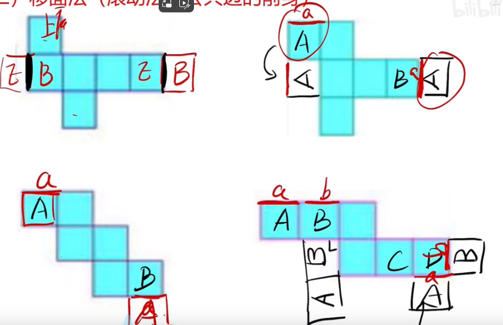

# Table of Contents

* [一笔画](#一笔画)
* [六面体解法（移面+双箭头）](#六面体解法移面双箭头)
  * [例题](#例题)
* [六面体- 公共边延长法](#六面体--公共边延长法)
* [不规则斜切](#不规则斜切)
  * [例题](#例题-1)
  * [坑题](#坑题)
* [拼合 -平行等长](#拼合--平行等长)


# 一笔画

+ 数奇点

对于规则的图形来说，只要奇点的个数为**零个或两个**，这个图形就一定能一笔画出来。

**奇点：**从一个点出发引发线的条数为奇数条，这个点为奇点 

> 快速判断办法： **端头线都是奇点**

**偶点：**从一个点出发引发线的条数为偶数条，这个点为偶点


+ 去框

> 任意一个联通图形（一部分图形）去掉不影响封闭框内笔画数

1. 一般去最外边框最简单
2. 若去完一个【框】，还有其他框，需要继续去
3. 点相交直接去，需要注意【线相交】的情形


+ 如何用

1. 简单直接去框
2. 有些复杂图形，去框不一定好用，可以用奇点


+ 什么时候一笔画

  1. 万般无奈一笔画
  2. 特质图  日 田 五角星 端点比较多
  3. 多部分必多笔

  

# 六面体解法（移面+双箭头）

+ 相对面

  

+ 移面

1. 成直角的边可以滚动

   1. 2次：中心对称
   2. 3次：反向一次
   3. 4次：保持不变

   

2. 小结论
   1. 141可以直接移动
   2. 其他都可以转化为141进行移动

   


+ 双箭头法


## 例题


A 三次就是反向一次，就是右边一次


B 移动2次 中心对称


C 要用到双箭头了


----------------------

第二题


A 双箭头

-------------------------


#  六面体- 公共边延长法

移动面的时候 还是容易错，但是知道公共变得的话，基本是不会错的

**相邻的两条边是公共边。公共边的延长线是公共边。前提是不互相垂直的情况下。**


注意 222的是一个特殊情况


+ 全部图形


# 不规则斜切


```
1*1
2*2
3*3
```


## 例题


```
bbk

hbb

hkb    
2个k 排除BD 2个h选A
```


```
hhb   
kbb 5个h
kkb
2个h排除AD 至少3个空 选B
```


```
hbk
khk
bbh
三个黑排除Ad C是2个空排除 选B
```


## 坑题


```
常规解法
bkk
bbk
bbh
发现BC都符合，正方体是斜着切的，斜着的边是大于原来边的
```


# 拼合 -平行等长


