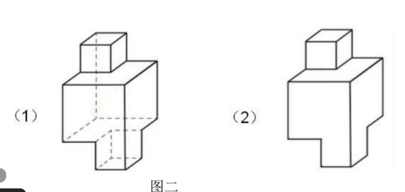
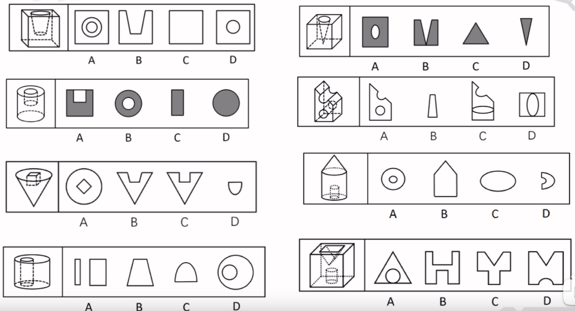

# Table of Contents

* [三视图](#三视图)
  * [注意点](#注意点)
  * [做题步骤](#做题步骤)
  * [刷题](#刷题)
* [截面图](#截面图)
  * [做题思路-反向代入](#做题思路-反向代入)
  * [六面体](#六面体)
  * [圆柱](#圆柱)
  * [圆锥](#圆锥)
  * [圆台](#圆台)
  * [例题](#例题)
  * [例题合集](#例题合集)
* [立体拼合体](#立体拼合体)


# 三视图


```
题目一定要认真读，问的是视图 就不要看截面图
```



```
虚线就是看不到的地方
```


## 注意点

+ 观察到三视图都是平面图
+ **原图有线就有线、原图没线就没线**
+ **当被遮挡的时候，看不见遮挡的地方**【可以是虚线】
+ 有些角度下弧会被压平


```
图二原图没有线
```


```
被遮挡了 那就是虚线 也可能是3
但是绝对不是2
```


## 做题步骤

+ 对比选项差异，找到不同的线条
+ 从某个视角来看，**确认这个线能不能看到**


## 刷题


```
俯视图 有线 排除AB
看CD  直接能看得到吗  在里面看不到 选D
```


```
BC选
中间是一个空 看不到 选B
```


```
俯视图 有线 ab选
看不到  选A

```


```
选D  太细了
```


```
直接看第三个图
选D 不是平分的
```


-------------------


```
BCD 选
中间没有线 选C
```


```
CD选 左视图 有线 选C
```


```
C 中间有线
```


# 截面图


## 做题思路-反向代入

1. 六面体切不出直角三角形
2. 圆柱切斜是弧形、圆柱切不出梯形
3. 圆锥斜切的圆是不规则的
4. 挖空的地方不是实线
5. 正切和斜切不共存
6. 视图一般都是可以切出来的，优先排除


## 六面体


能不能切菱形呢？可以的


-----------------------------


这是等腰梯形，也可以不是等腰梯形


------------


```
直角是切不出来了
因为如果是直角  这个时候只能是矩形了
```

**直角三角形切不出来了，钝角更不可能了**


## 圆柱


```
斜切经常考
半个椭圆也可以截取
```


## 圆锥


```
斜着切 不规则椭圆
```


## 圆台


## 例题


```
注意 C为什么没有上面横线，竖着切一刀 我们看的是【截面图】不是【视图】
选D
```


```
A 跟上题一样 是截面 不是视图 
```


```
选B 空着截面 不会有线
```


```
注意b 切出来 也是看截面 可以切出

不可能就是D
D 不可能切除直角三角形
```


```
AC肯定可以 
B 三角形必须斜着切 圆只能是椭圆 
```


```
直接C 切不出

```


```
选C  三角形要斜着切 六面体斜着这个角度 只能是梯形 选C
```


```
A 切出长方形了

立方体，也称正方体
```


```
圆柱 椭圆 直接D
```


```
这个菱形 只能是梯形了 

```


```
圆锥斜着切 不可能是圆 是不规则的椭圆
A
```


## 例题合集




# 立体拼合体
