# Table of Contents

* [综述](#综述)
* [相关总结](#相关总结)
* [做差-考点最多](#做差-考点最多)
  * [题目](#题目)


* [综述](#综述)
* [做差-考点最多](#做差-考点最多)


# 综述

数字推理，并不是纯纯的计算，也是有其他规律可寻的。只要能做出的规律都是好规律

**利用数字特性**

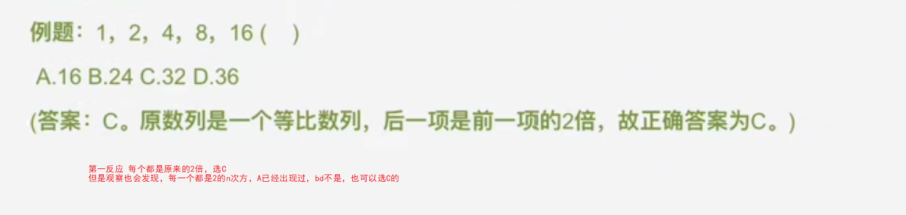

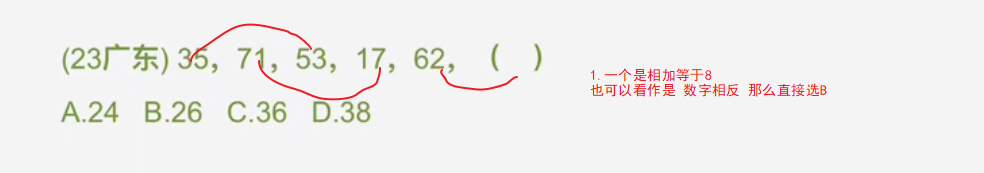


# 相关总结

9  要反映两点，3的平方和2的三次方
64。要想到四的三次方和八的平方


# 做差-考点最多

+ 题目特征

  + 整个数列的递增不明显 幅度小（ 2-3倍）

  + 根据等差性质快速判断

    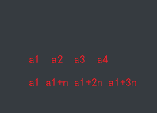

    大约实在3到5倍之间
    
    ```
    a1 a2  a3 a4
    4  7   12  20
    12-7=5
    20-4=16
    
    a3-a2=n  
    a4-a1 =3n
    
    ```

+ 关注
  + 质数列 1 3 5 7 11 13 17 19  
  
  > 1 3 5 7 9 正常来说，但是没有9，就基本是质数列了
  
  + 平方差
  
+ 解决方法

  + 如果满足三倍关系，直接利用计算
  + 否则
    + 优先考虑做差
    + 考虑二次做差
  + 如果()在中间，可以利用【隔项差】来实现


## 题目

1. 1，-2，-3，-2，1 （）      A.6  B.3  C.-1 D.-4

    ```
    可以看到a3-a2=n  a4-a1 =3n 
    
    思路1：-3 -1 1 3 5  推出为6
    
    思路2： -2 - -3=1  那么-3-? 应该等于6
    ```

    

2.  2,7,14,25,38（）            A.54  B.55  C.57 D.58

   ```
   做差 5 7 11 没有9，这个时候就是质数列了
   ```

   

3.  -7，-5，-1，5，（  ），23     A.10  B.11  C.13 D.20

   ```
   可以看到 4 12 满足3倍
   
   思路1： 直接用  x-5=24/3 x=13
   
   思路2：利用隔项差  6 10 x+1  18 -> x+1=14 ->x=13
   
   思路3： 2 4 6 8  直接13
   ```

   

4. -2，-2，0，4，10，（  ）    A.18 B.16  C.15 D.12

   ```
   6  18  
   ```

   

5. 4，7，12，20，33，（  ），88     A.54  B.42  C.49 D.40

   ```
   5 16 3倍关系
   3 5 8 11 19  54 
   ```

   

6. -26，-6，2，4，6，（  ）     A.16  B.12  C.14 D.6

   ```
   8 30 3倍关系
                14
   20 8 2 2 8
     12 6 0 -6
     
     符合三倍关系 做差看出特征
   ```

   

7. 2.6.11.18.29.()   A.41  B.48  C.45 D.59

   ```
   4 5 7 11 19 
    1 2 4  8 
   ```

   

8. 2，5，10，21，（  ），77     A.30  B.42  C.56 D.65

   ```
   隔
   8 16 32  56 选B
   
   难
   ```

9. 262，264，267，272，280（  ）     A.309  B.282  C.292 D.302

    ```
     2 3 5 8 13？ 没答案
      1 2 3 4  选B
    难
    ```

10. 8，11，18，34，66（  ）     A.97  B.89  C.154 D.123

    ```
    3 7 16 32  57  尾数是3
     4 9  16  25
    ```

11. 1，8，21，40，（  ），96      A.55 B.60  C.65 D.70

     ```
     13 39 三倍
     19*3 57 +8=65
     ```

12. 2，14，34，62，（  ）     A.90  B.98  C.108 D.116

     ```
     3倍 28*3=84  尾数8 选C
     ```

13.   27,29,33,41,57,?     A.87  B.88  C.89 D.91

     ```
     2 4 8 16 32  C
      
     ```

14. 5，7，10，15，22（） A.28 B.30 C.33 D.35

```
2 3 5 7  9没答案 那就是11 选C
```


# 多项数列-超过7

超过7个的

1. 隔项
2. 分组
3. 递推


## 隔项

1. 23，24，22，25，21，26，（  ），（  ） A.19 28 B.20 27 C.26 21 D.32 39

   ```
   直接b
   ```

   

2. 3，2，0，3，7，2，-4，3，（  ） A.2 B.7 C.11 D.14

   ```
   3 0  7 -4 ？ 11 选C
   
   -3 -7 -11 -15    
   
   
   ```

   

3. 16，23，9，30，2，（ ）  A.37 B.41 C.45 D.49

4. 0，2，7，4，26，6，63，8，（  ）

   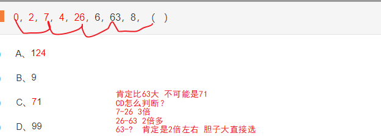

   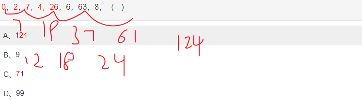

5. 2，3，4，9，16，45，（  ），315

   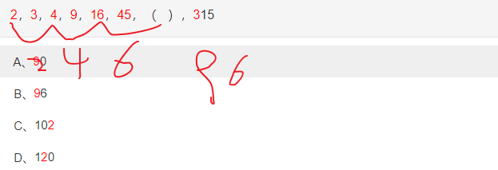

6. 38，24，62，12，74，28，（  ） A.74 B.75 C.80 D.102

   ```
   第一项+第二项=第三项，第三项+第四项=第五项，即奇数项等于它的前两项之和；
   空缺项为第7项，所以空缺项=第5项+第6项=74+28=102。
   ```

   

7. 2，3，7，10，19，26，45，60，（  ）

   由于题干数列较长，可将数列划分为奇数项和偶数项；
   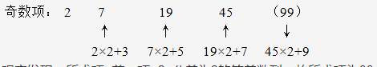
   观察发现：所求项=前一项×2+公差为2的等差数列，故所求项为99。

8. 31，29，28，26，25，23，（ ）

   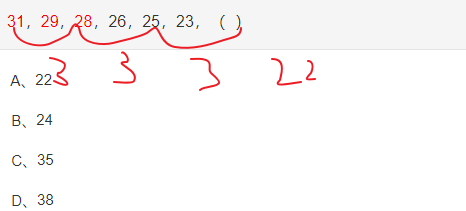

## 分组

+ 可以22分组
+ 可以前后分组

1. 5，24，6，20，4，（），40，3     A.28 B.30 C.36 D.42

   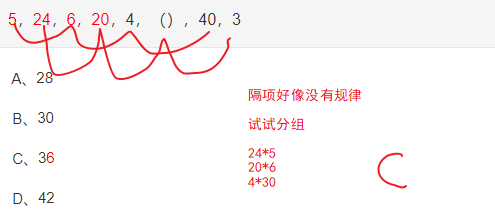

2. 1，2，4，4，7，6，（ ），8

    A、7  B、8  C、9  D、10

   ```
   3 8 13 18 D
   ```

   

3. 1，9，7，4，8，5，（  ），11

   ```
   10 11 13 16 选C  坑。。。
   ```

   

   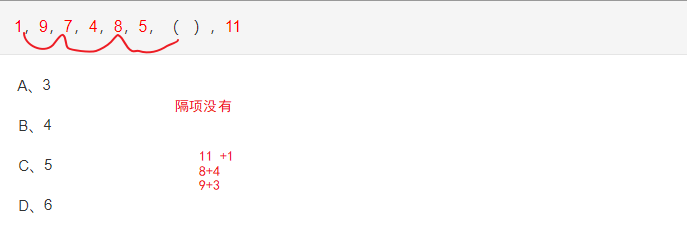

4. 8，3，17，5，24，9，26，18，30，（  ）

   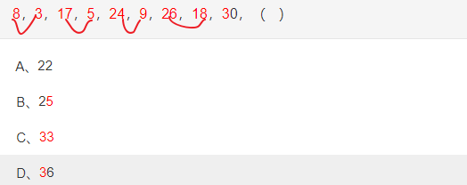

5. 

##  递推

待补充


# 分数

1. 要么约分，要么反约分

   1. 看题目项差距

      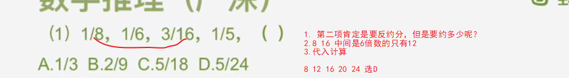

      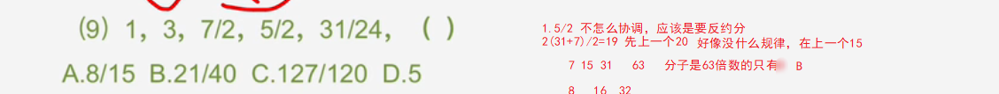

   2. 观察选项，带入

2. 前后有乘积关系


# 幂次列

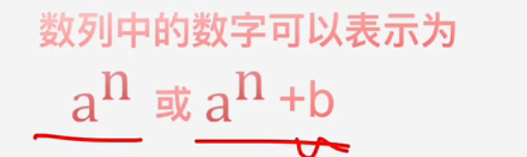

常考：8 9 16 27 64 125   16 64最突出

当一个数列出现2次以上数字附近，且数字波动比较大的情况下。基本就是幂次。

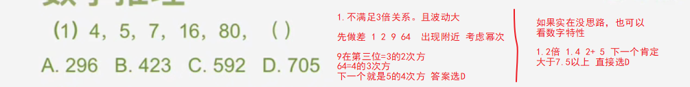

主要直接观察或者做差后，看数列是否在常见幂数列附近

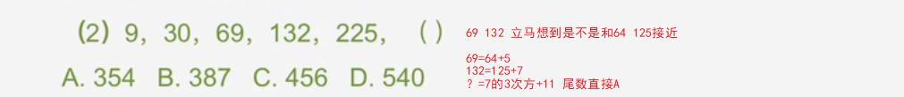

一般不是考平方就是立方

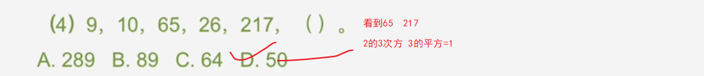

# 递推

1. 前n项都是整数，忽然出现小数
2. 做差、做和都没什么规律
3. 数列形成新的构造对应

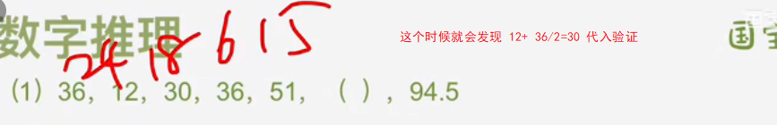
