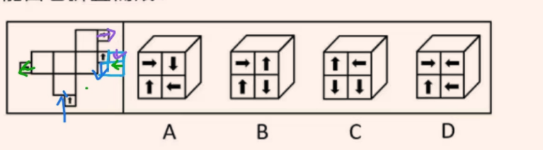
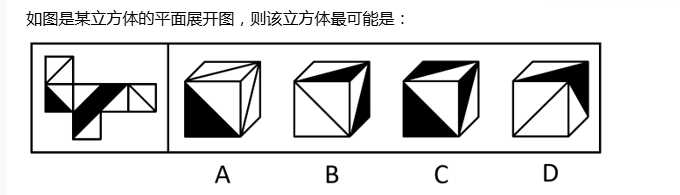
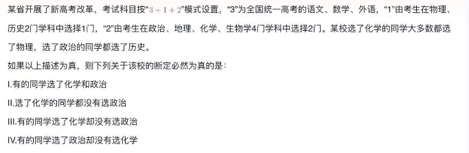

# Table of Contents

* [图推](#图推)
  * [直角](#直角)
  * [截面图](#截面图)
    * [是截面不是视图](#是截面不是视图)
  * [相交 相连 相离](#相交-相连-相离)
  * [六面体](#六面体)
  * [对立面](#对立面)
  * [公共点，公共边](#公共点公共边)
  * [不细心](#不细心)
* [类比](#类比)
  * [成语 **字面意思和本义**](#成语-字面意思和本义)
  * [种属细化-特指 泛指](#种属细化-特指-泛指)
  * [常识](#常识)
* [定义](#定义)
* [逻辑](#逻辑)
  * [翻译推理](#翻译推理)
    * [翻译成自己的话](#翻译成自己的话)
  * [逆否](#逆否)
    * [有的有的 不能逆否](#有的有的-不能逆否)
  * [对当关系](#对当关系)
  * [下反对和恒真](#下反对和恒真)
  * [直言命题](#直言命题)
  * [加强削弱](#加强削弱)
    * [伪他因](#伪他因)
    * [政策 对策不选](#政策-对策不选)
    * [降低 不代表不行](#降低-不代表不行)
  * [单独实验](#单独实验)
  * [样本数据比工具重要](#样本数据比工具重要)
  * [反对反对者](#反对反对者)
  * [解释](#解释)
  * [平行结构](#平行结构)
    * [偷换概念](#偷换概念)
    * [根据一个错误，得到一个结论](#根据一个错误得到一个结论)
    * [对比择优](#对比择优)
    * [提取主体-因为 所以](#提取主体-因为-所以)
  * [串串题+ 32](#串串题-32)


# 图推

## 直角


```
第一反应是面，但其实是直角，为什么？

特征：从端点发射的，且会制造一些直角
```


## 截面图

### 是截面不是视图


## 相交 相连 相离


## 六面体


```
D 需要移动才行，不然少一个面
```


```
1. 纸盒向内折叠，但是要注意 从上方看的是内表面不是外表面，所以翻转下
2. 不脑海想也是移动，但是注意 这里看的也是内表面
```




## 对立面


```
根据12可以知道 3和 1245是相邻的 3对立面6 
同理23知道  42356相邻 4对立面 1  排除ab
选C
```

## 公共点，公共边



```

```


```

```


## 不细心


```

```


# 类比
[笔记](/./main/判断/11类比.md)


+ 反义+并列


和风细雨：暴风骤雨

- A年富力强：风烛残年
- B如沐春风：如履薄冰
- C耀武扬威：扬眉吐气
- D雪中送炭：落井下石

```
B项：如沐春风指的是像坐在春风中间，比喻同品德高尚且有学识的人相处并受到熏陶；如履薄冰指的是像走在薄冰上一样，比喻行事极为谨慎，存有戒心；二者不是反义关系

D项：雪中送炭指的是在下雪天给人送炭取暖，比喻在别人急需时给以物质上或精神上的帮助；落井下石指的是看见人要掉进陷阱里，不伸手救他，反而推他下去，又扔下石头，比喻乘人有危难时加以陷害；二者是反义关系，但“雪中”和“送炭”、“落井”和“下石”均不是并列关系
```

-----------------


## 成语 **字面意思和本义**

一望无垠:辽阔

A人云亦云:重复

B耳提面命:教导
C方兴未艾:失败
D厉兵秣马:战斗

```
最容易选A A是字面意思 本义是： 意思是指没有主见，只会随声附和。
```

缄口不言对于()相当于 ()对于 虚怀若谷
A三缄其口;大智若愚
B畅所欲言;放荡不羁
C守口如瓶;礼贤下士
D口若悬河;矜功伐善

```
守口如瓶: 本意 守口如瓶
```


+ 比喻义

珍珠:珍珠婚
A蘑菇:蘑菇云B母亲:母亲河C面包:面包树D槐花:槐花蜜

```
“珍珠婚”指的是像“珍珠”般珍贵的婚姻，二者属于语义关系中的比喻关系。
```


----------------


+ 属性


感想：主观性：体会

- A典范：示范性：表率
- B发明：创造性：方法
- C泥土：可塑性：材料
- D规律：普适性：定理

```
感想和体会均具有主观性，与第二个词构成必然属性对应关系。
```

------------


+ 数学运算

小计：总计

- A平均值：总值
- B被乘数：总数
- C单科分：总分
- D分目录：总目

```
“小计”是数字列表中一部分数字的总和，“总计”是数字列表中所有数字的总和，因此，所有“小计”相加可以得到“总计”，二者是对应关系。
```


+ 场所+必然

质证：法庭

- A缴费：窗口
- B监狱：拘役
- C监考：考场
- D采访：现场

```
对比A、C、D三项，题干“质证”一定发生在“法庭”，且“法庭”是“质证”的指定地点，C项“监考”一定发生在“考场”，且“考场”是“监考”的指定地点，而A项“缴费”并不一定发生在“窗口”，还可以线上缴费，D项“采访”并不一定发生在“现场”，还可以在摄影棚里采访，故C项与题干逻辑关系更为一致，当选。
```


## 种属细化-特指 泛指

理智：情感：悲伤

- A冷漠：热情：热点

- B科学：艺术：雕塑

- C蓝天：白云：云霞

- D陆地：河流：黄河

  ```
  理智和情感并列  悲伤属于情况的一种
  排除AC
  BD 怎么区分  黄河是一个特指
  ```

  

  

## 常识


海豚：肺

- A直升机：尾桨
- B蝙蝠：羽毛
- C电脑：主板
- D细胞核：细胞

```
内部
```

+ 防空演习不是军事演习
+ 八爪鱼/章鱼--软体动物；鳄鱼--爬行动物；鲸鱼--哺乳动物；娃娃鱼--两栖动物———— 常见的不是鱼


# 定义

# 逻辑

## 翻译推理

自隋唐科举取士以来，中国古代的文人官员都是会吟诗作文章的读书人。吟诗作文章对于有些文人官员来说只是业余之事，事实上，他们每天都要将大量的时间用在处理繁忙公务上。所有处理繁忙公务的官员都不会有时间去捕鱼狩猎;但是，如果所有会吟诗作文章的读书人都不参加科举考试，则他们就有时间去捕鱼狩猎。
根据以上陈述，可以得出以下哪项?()
有些参加了科举考试的读书人也会吟诗作文章
有些去捕鱼狩猎的人是会吟持作文章的读书人
有些会吟诗作文章的读书人不会处理繁忙公务
有些去捕鱼狩猎的人不是中国古代的文人官员

```
破题点:直言入手

所有处理繁忙公务的官员都不会有时间去捕鱼狩猎

如果所有会吟诗作文章的读书人都不参加科举考试，则他们就有时间去捕鱼狩猎
逆否: -(就有时间去捕鱼狩猎)-> -(所有会吟诗作文章的读书人都不参加科举考试)


```

今天，我们比历史上任何时期都更接近中华民族伟大复兴的目标，要实现这个目标，就必须坚定不移走科技强国之路。踔厉奋发、奋起直追，不断提升我国发展独立性、自主性、安全性，只有催生更多新技术新产业，才能形成国际竞争新优势。
由此可以推出:

A如果没有形成国际竞争新优势，就无法催生更多新技术新产业

B我国可以形成国际竞争新优势，除非催生了更多新技术新产业

C要接近中华民族伟大复兴的目标，就要坚定不移走科技强国之路

D或者没有实现中华民族伟大复兴，或者坚定不移走科技强国之路

```
题目：只有后推前 
国际竞争新优势->催生更多新技术新产业
A 否前不行
B 否后没否前    否则我国可以形成国际竞争新优势，除非催生了更多新技术新产业
C 题目是实现
D -中华民族伟大复兴 或 坚定不移走科技强国之路
 中华民族伟大复兴->坚定不移走科技强国之路 符合题意
```


子曰：“名不正，则言不顺；言不顺，则事不成；事不成，则礼乐不兴；礼乐不兴，则刑罚不中；刑罚不中，则民无所措手足。”

根据以上论述，下列推断必然正确的是（ ）。

①名正则言顺

②礼乐兴则事已成

③名不正，则民无所措手足

④只有名正言顺才事可成

```

```


### 翻译成自己的话

快递企业在激烈的市场竞争中会被迫大幅下调收费单价，而特色快递企业能够避免卷入激烈的市场竞争。快递员都愿意在收费单价高的快递企业工作，但某国的快递员并没有为特色快递企业工作的强烈愿望。由此可以推断( )。
A该国快递市场竞争不激烈
B该国快递企业很难招到快递员
C该国快递行业收费单价普遍不高
D该国特色快递企业的快递员收入不高


​		

```

```


## 逆否

【错题】7、甲乙丙三人择偶标准： 甲：只要他有钱，就嫁给他。乙：只有他有钱，才嫁给他。丙：只要他人好，就嫁给他。若一男没钱但人好，则一定不愿意嫁给他的人是：

A．甲       B．乙       C．丙     D．甲和乙

 ```
-有钱 或 嫁
-嫁  或 有钱
人 或 嫁 

没钱  不嫁 只有2了 ，否后必否前 。也就是乙
------------------
有钱->嫁人
嫁人->有钱
人好->嫁人

没钱 是对2的逆否，能推出

 ```

```
这题考的就是逆否命题的知识点，
1.不是真假命题的时候，不必要写等价信息
2.只有逆否才是等价  其他无必然结论
```

----------------

【错题】8、人民是创作的源头活水，只有扎根人民创作才能取得取之不尽。用之不竭的源泉。文化文艺工作者要走进实践深处、观照人民生活、表达人民心声，用心用情用功抒写人民、描绘人民、歌唱人民。哲学社会科学工作者要多到实地调查研究，了解百姓生活状况，把握群众思想脉搏，着眼群众需要解疑释惑、阐明道理。把学问写进群众心坎儿里。由此可以推出( )

A．文化文艺工作者只有走进实践深处才能观照人民生活。

B．如果不扎根人民、创作就不能获得取之不尽、用之不竭的源泉。

C．哲学社会科学工作者只有到实地调查研究才能了解百姓生活状况，把握群众思想脉搏

D．如果哲学社会科学工作者没有着眼群众需要解疑释惑、阐明道理。就说明他们没有进行实地调查研究。

```
A 并列
B 逆否
C 没有逻辑关系 
D 没有逻辑关系
```


### 有的有的 不能逆否




## 对当关系

张．王．李三人是某小学英语教师，他们对甲．乙两个班学生的英语状况如下：

张：如果甲班所有学生都爱学英语，那么乙班有的学生不爱学英语

王：甲班有的学生不爱学英语，而乙班所有学生都爱学英语

李：或者甲班所有学生都爱学英语，或者乙班所有学生都爱英语

如果上述三人的判断中只有一假时，则下列除了哪项其余判断均不能必然推出：

A．甲班所有学生爱学英语，乙班所有学生都爱学英语

B．甲班有的学生不爱学英语，乙班有的不爱学英语

C．甲班有的学生不爱学英语，乙班所有学生都爱学英语

D．甲班所有学生都爱学英语，乙班有的学生不爱学英语

```
甲有的 或 乙有些非
甲所有 或  乙所有
【复言命题 对当关系】
13矛盾 2假
甲所有爱 乙有些非
```


## 下反对和恒真

某次体操比赛之前，有甲、乙、丙、丁四人预测红队、黄队、绿队、蓝队的出场顺序，四人的预测如下：

甲说：只有黄队第二个出场，红队才第一个出场。

乙说：如果红队第三个出场，那么蓝队第四个出场。

丙说：蓝队不是第四个出场。

丁说：黄队第二个出场。

比赛结束后，发现四人中只有一人预测为真，那么绿队是第几个出场？

- A第一个
- B第二个
- C第三个
- D第四个

```
红->蓝四
-蓝四
推出关系的【单独肯前】 单独否后 下反对 必有一真

甲丁都是假  黄不是2  红1  黄不是2

红1 
红三->蓝四    -红三 整个命题恒真  蓝四


红1  黄不是2  蓝四 所以绿是2
```


## 直言命题

某城市选拔志愿者，已知情况如下： 

（1）只有小红报名，小白、小黑和小花才会都跟着报名； 

（2）如果小白不报名，则小黑也不报名； 

（3）如果小黑不报名，则小灰也不报名； 

（4）小红没报名； 

（5）小灰报名了。 

由此可以推出（  ）。

A．小白、小黑和小花都报名了

B．小白和小黑都报名了

C．小黑和小花都报名了

D．小白和小花都报名了

```
(-小白 或 -小黑 -或 -小花 ) 或 小红

小白 小黑为真 
或命题 否一推一   -小花 为真 选B
```


## 加强削弱

### 伪他因


研究人员调查了女性晚年体重变化与健康状况的关系，发现60岁以上仍保持体重稳定的女性更容易活到90~100岁。研究显示，与体重减轻5%或更多的老年女性相比，体重保持稳定的老年女性健康状况更好，其长寿的可能性高出1.2至2倍。与体重稳定的女性相比，体重至少减轻5%的女性健康状况相对较差，研究人员由此认为，老年女性体重减轻会导致其健康状况受损。

以下除哪项外，均能削弱上述结论：

- A研究中活到90岁以上的老年女性，其家族成员寿命也普遍较高

- B生活习惯不良或情绪状态不佳等也会导致老年女性健康状况受损

- C老年女性在不想减肥的时候却体重减轻，是健康状况不佳导致的

- D如果医生建议老年女性减轻体重以改善健康那么其应谨遵医嘱

  ```
  B 是伪他因，怎么改，改为研究中，放到同一个主体
  ```

  ```
  重点：就是看是不是同一话题内讨论
  ```

  


### 政策 对策不选

5、动物药理实验表明，白黎芦醇具有明显的软化血管作用，可以抗血栓，对冠心病、高血脂有防治作用。而葡萄生长过程中，为防止灰色霉菌感染导致葡萄腐烂，会产生白黎芦醇。在葡萄酒发酵生产过程中，由于葡萄汁酶的作用，酒中白黎芦醇的数量明显增加。因此，葡萄酒具有保健功效。

以下哪项如果为真，最能质疑上述论证?

A．白黎芦醇想要发挥软化血管的作用，理论上需要连续两个月每天喝1斤葡萄酒

B．乙醇是一级致癌物，任何酒精饮料不论是否真有诸如软化血管之类的养生作用，最后都会明显降低饮用者的预期寿命

C．偏爱奶酪、芝士、黄油等高脂肪食物的法国人，因常饮富含白黎芦醇的葡萄酒，其冠心病发病率却低于其他西方国家

D．即便在动物实验中能确定白整芦醇物质对动物有用，要证实白整芦醇对人体健康的作用和安全性，还必须进行大规模的人体试验

```
小小解析：题干通过葡萄酒中有白黎芦醇，白黎芦醇对软化血管有作用。所以葡萄酒有用，A题干没提到量，说明方法不可行，B类比不当，C发病，偷换概念，D还需要，对策。


事后分析
1、对策 政策法规不选
```


### 降低 不代表不行

6、人体的大脑与血液之间有一道“血脑屏障”，指的是脑毛细血管壁与神经胶质细胞形成的血浆与脑细胞之间的屏障和由脉络丛形成的血浆和脑脊液之间的屏障，这些屏障能够阻止某些物质(多半是有害的)由血液进入脑组织。任何起安眠作用的物质首先都必须能穿过这个屏障才能起效。牛奶中含有一种名为色氨酸的氨基酸能够穿过血脑屏障，制造诱发睡眠的荷尔蒙5-羟色胺，因此人们认为睡前喝牛奶是促进睡眠非常有效的方法。以下哪项如果为真，最能削弱上述结论? 
A．皮肤温度上升，入睡速度就快，故而喝一杯热牛奶就如同洗热水浴一样，能够加快入睡速度。 B．小份的牛奶所含的色氨酸总量不足以让身体的激素水平发生较大的波动，只有喝大量的牛奶助眠效果才会好。 
C．米饭等碳水化合物助眠效果更好，它们会刺激胰岛素的合成，让色氨酸以外的氨基酸进入肌肉组织，从而使色氨酸更易进入大脑。 
D．牛奶中蕴含许多种类的氨基酸，这些物质进入血液后，会争抢穿过血脑屏障的通道，从而降低色氨酸穿过血脑屏障的能力

```
小小解析：结论是喝牛奶对睡眠非常有好处，A说的是热牛奶，力度较弱，B说的是大量的效果才好，削弱了效果，C类比不当，D降低能力，不代表不行，选B。

事后分析
1、降低能力，不代表不行  经常考到，还有不稳定 
```

16、星座预测就是根据星辰的位置及其各种变化来预测人世间的各种事物。有很多人相信并依照星座预测制定每天的日程。因此，有人认为星座预测是正确的，否则也不会有这么多人相信。

以下哪项如果为真，最能反驳上述观点？

A．星座确实存在

B．有更多的人不相信星座预测

C．未成年人才相信星座预测

D．会有很多的人相信非常不科学的事情

```
小小解析：题干通过很多人相信，所以是正确的，诉诸众人，选D。
```

## 单独实验

.某研究团队让两批测试者分别进入睡眠实验室里睡上一夜，第一批被安排睡得很晚，从而减少总睡眠时间；第二批被安排睡得早，但在睡眠过程中多次被吵醒。第二晚过后，结果就已经显现：第二批测试者的积极情绪受到严重影响。他们的精力水平较低，同情心和友善度等积极情绪指数有所下滑。部分研究者据此认为，被吵醒导致了测试者无法得到足够的慢波睡眠，而慢波睡眠是恢复精力感的关键，但也有研究者对此项研究的可信度提出质疑。
以下哪项如果为真，最能反驳质疑者：
A.第一批测试者积极情绪的指数下滑程度不太明显
B.第二批测试者中大部分人长期以来情绪不够积极
C.两批测试者的健康状况和心理素质原本就很接近
D.两批测试者在参与睡眠实验前精力水平参差不齐

```
[分别]进入睡  支持也是自己跟自己比 
```


## 样本数据比工具重要

研究人员从分析受试者的呼吸开始，筛选可用于生物识别认证的化合物，共发现了28种可行的化合物。在此基础上，他们开发了一个有16个通道的嗅觉传感器阵列，每个通道都可识别特定范围的化合物。传感器数据随后被传递到机器学习系统中，分析每个人的呼吸组成，并以此区分个人的特征。研究人员根据结果表示，呼吸可作为身份验证的识别信号。
以下哪项如果为真，最能削弱上述观点？
A实验受试者仅20人，样本量太少
B呼吸样本波动性极高，很容易受饮食、环境甚至情绪影响
C16个嗅觉传感器通道较少，识别呼吸的个人特征时准确率并不稳定
D即使患呼吸道疾病，一个人呼吸运动的独特性也会在很长时间内保持不变

```
B 是样本数据 C是工具  样本数据大于工具
```


## 反对反对者

近日，一则关于延迟退休的消息在网上引发了大家的关注和讨论，就是否要实施延迟退休，人们争论的焦点集中于:支持延迟退休的人认为，延迟退休可以减轻人口老龄化带来的社会保障压力，反对延迟退休的人主要是担心会挤压年轻人的就业机会。
以下哪项如果为真，最能支持实施延迟退休?()

A.青年人的就业问题应靠经济转型和产业升级来推动解决
B.退休人员在精力和身体条件允许的情况下依旧可以迎来职业“第二春“
C.有些青年人就业难不是因为没有岗位而是在于自身就业观念的问题
D.人口老龄化是一种社会发展趋势，但有些西方国家老龄化问题比我国更严峻

```
正方是这个观点，但是现在出现了反方，你不解决这个争议，你怎么算支持正方呢
【反对反方 或者如果对反对意见进行辩论】
知道这个就很容易选C了

```


## 解释

> 不是让你去说其中一个为啥
> 而是解释两种矛盾其实不矛盾
> 要兼顾二者


过去，直播带货中虚假宣传、销售假冒伪劣产品等违法现象层出不穷。最近，针对直播“乱象”，相关部门拓宽了消费者的投诉渠道，因此，直播带货中违法现象将有所减少。

要使上述推理成立，需要补充的前提条件是（ ）。

- A拓宽消费者投诉渠道有助于遏制直播带货中的违法现象
- B投诉能促使直播带货平台严格把关上架产品的质量
- C从事直播带货经营活动需要承担相应的法律责任
- D所有消费者都能准确识别侵权行为

```
关键词  违法现象  选A

D 错哪里  不是侵权行为
```

```
为什么错？
没有抓住关键词
```


在青崖山区，商品通过无线广播电台进行密集的广告宣传将会迅速获得最大程度的知名度。                                     上述断定最可能推出以下哪项结论?   

A．在青崖山区，无线广播电台是商品打开市场的最重要途径。          
B．在青崖山区，高知名度的商品将拥有众多消费者。                
C．在青崖山区，无线广播电台的广告宣传可以使商品的信息传到每户人家。       
D．在青崖山区，某一商品为了迅速获得最大程度的知名度，除了通过无线广播电台进行密集的广告宣传外，不需要利用其他宣传工具做广告。

```
C  传到每户人家 不等于 知名度
选D
```

```
为什么错？
1.脑补了
2.看到C 就没有选D  做快了 
```


22、虎山长城遗址除一号台址发现很少的残砖之外，其他地方均没有发现城砖。虎山村及附近村庄也没有从长城上拆下城砖用于民房建筑的情况。

由此可以推测，虎山长城用砖是极少的。                        上述推测还需要隐含哪一项假设( )。                   A．虎山长城遗址附近没有发现古砖窑                  B．当地县志记载虎山长城是夯土筑成                    C．此地山高坡陡，城砖难以运进运出                   D．此地土质极差，不适宜烧制长城用砖

```
这种题 不能加强和削弱题目
D 削弱题目了
C 解释了没有其他途径
```


## 平行结构

###  偷换概念


### 根据一个错误，得到一个结论

  

### 对比择优


### 提取主体-因为 所以

有人认为，网络社交互动并不会减少人们与他人面对面交流的时间，因为性格内向的人即使停止网络社交也不会增加他们与人面对面交流的时间。
以下选项与题干的逻辑最为相近的是
A保护野生动物的意义不大，因为再怎么加大保护力度，自然界中也会有物种自然灭绝
B即使不打击盗版，购买正版的人数依然众多，所以盗版产品并不会影响正版产品的销量
C不喜欢锻炼的人即使不接触电子产品也不会成为运动员，所以，电子产品并不会妨碍人们成为运动员
D文体活动对学生的学习不会产生影响，因为喜欢学习的人即使参加了文体活动也不会减少自己的学习时间 

```
翻译题目  
1.公共的主体  网络社交互动 他人面对面交流的时间，性格内向是一个新主体
2.因为放前面 和 因为放后面的区别
3. 因为 -a 不影响 b  所以  a 不影响 b

A 明显错误
B 
```


## 串串题+ 32

某大学毕业班甲、乙、丙、丁、戊、己、庚7位同学对于未来的打算包括就业、考研、留学3种情况，每位同学只选择了其中一种，且每种情况都有上述7位同学中的2~3人选择。已知:
(1)如果甲、丙两人中至少有一人选择就业或留学，则乙和戊选择考研;
(2)如果乙、丁两人中至少有一人选择就业或考研，则己和庚选择留学:
(3)如果戊、己两人中至少有一人选择考研或留学，则乙和丙选择就业。根一上述信息可以得出，选择留学的同学有:
甲和乙
丙和戊
乙和丁
丁和庚

```
1 串 3 
如果甲、丙两人中至少有一人选择就业或留学   则乙和丙选择就业
原来1 
如果甲、丙两人中至少有一人选择就业或留学，则乙和戊选择考研 
题目
每位同学只选择了其中一种,1前件错

1前不对  甲 丙考研 
否3  戊、己 就业 
否2  乙丁 留学 
```

