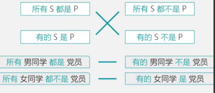
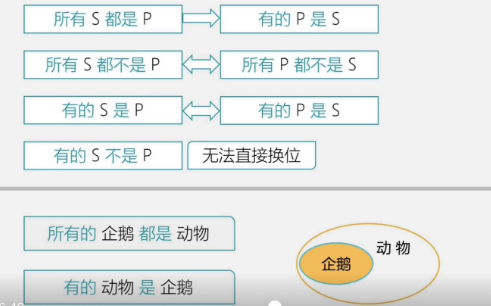
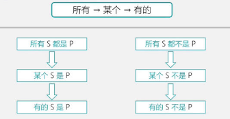

# Table of Contents

* [定义](#定义)
* [结构](#结构)
* [直言命题的种类](#直言命题的种类)
* [对当关系-4个基本](#对当关系-4个基本)
  * [分析](#分析)
  * [真假题](#真假题)
  * [课前复习](#课前复习)
* [直言命题的换位 -三个换位](#直言命题的换位--三个换位)
* [直言命题的非标](#直言命题的非标)
  * [构造否定](#构造否定)
  * [约分情况-一些误区](#约分情况-一些误区)
  * [例题](#例题)
* [三段论](#三段论)
  * [四概念](#四概念)
  * [周延](#周延)
  * [使用场景](#使用场景)
* [作业复盘](#作业复盘)
  * [对当作业复盘](#对当作业复盘)
  * [周延复盘](#周延复盘)
* [2个推理](#2个推理)


# 定义

直言判断主要是针对特定范围内的某个对象是否具有某种属性的判断

# 结构

所有的直言命题都是由四个部分组成。量项+主项+联项+谓项

例：【大叔】是【江西人】

1．主项。表示命题对象的概念，也就是主词，主语，如上例中的大叔。

2．谓项。表示命题对象具有或者不具有的性质的概念，也就是宾语，例如上例中的江西人。

3．量项（全称．特称．单称）表示命题中主项数量的概念，一般也称为命题的量。

4．联项（肯定．否定）表示性质命题的“质”，即联结主项和谓项的概念。

# 直言命题的种类

1．全称肯定命题：所有人都很优秀

2．全称否定命题：所有人都不优秀

3．特称肯定命题：有些人优秀

4．特称否定命题：有些人不优秀

> 有的 无言下之意，不能确定有多少，最多为所有

5．单称肯定命题：小明优秀

6．单称否定命题：小明不优秀

# 对当关系-4个基本

对当关系是A，E，I，O四种主谓词相同的[直言命题](https://baike.baidu.com/item/直言命题/2403400?fromModule=lemma_inlink)之间的真假关系的统称。A，E，I，O分别为全称肯定、全称否定、特称肯定、特称否定命题的记号


+ 包含关系：同频道

  > 从“所有事物是运动变化的”真，推出“有的事物是运动变化的”真。
  >
  > 一真前假  一假后真
  >
  
+ 矛盾：不同频道,一软一硬

  > 不能同真，不能同假
  >
  > 硬: 所有  软：有些

+ 上反对：不同频道 ，硬+  除软 至少一假

  > 除了A、B之外，还存在其他情况，且A、B是不相交的，此时A、B为上反对关系。
  >
  > 

+ 下反对；不同频道 ，没硬，至少一真

  > 只分A、B两种情况，且A、B有交集，此时A、B为下反对关系。
  
  + 有些是：有些非/某个非
  + 有些非：有些是/某个是

## 分析

我们班所有同学参加国考考试，小小是其中一个，现在出现两种情况　　

I：所有人都进面了  　　  II：小小没进面

 ```
什么关系？矛盾吗 并不是 还有可能有其他情况比如 鸿哥进面了
 ```

例：我们班所有同学参加国考笔试考试，成绩有几种情况

```
3种情况
1.所有人都进面->有的人进面  【包含关系】
2.有些人进面，有些人没进面
3.所有人都不进面  ->有的人没进面  【包含关系】

1 和 23矛盾 ----------- 所有是 和 有些非
3 和 12矛盾 ----------- 所有非 和 有些是
```



出现所有不可能是下反对

出现有对不可能是上反对

某个是 某个不是----------矛盾


## 真假题 

+ 找矛盾、看其他，没矛盾看上下反对
+ 真假性是针对说的话。不是针对人 【尤其注意】

甲乙丙三个盒子，一个小球藏在其中一个盒子里，旁边有一张纸条，上面的提示是①小球在甲盒中②小球不在乙盒子中③小球不在甲盒子中这三句话只有一句话是真的，根据以上条件，小球藏在哪个盒子中？（ ）

A.小球在甲盒子中

B.小球在乙盒子中

C.小球在丙盒子中

D.无法确定

```
13矛盾 2必假 选B
```


例题：在年终考核时，某高校陈教授获得优秀。如果上述陈述为真，则以下不能确定真假的是：

①该校所有教授都获得了优秀

②该校有教授荣获了优秀

③该校教授都没有获得优秀

④该校有教授没有获得优秀

A． ①②                 B． ①④

C． ②④                 D． ②③

```
13 上反对 至少一假，题目说了真，3为假，1不确定
24 下反对 至少一真， 2为真， 4不知道  某个推出有的
选B
```

例题：甲．乙．丙．丁是同班同学。甲说：“我班同学考试都及格了。”乙说：“丁考试没及格。”丙说：“我班有人考试没及格。”丁说：“乙考试也没及格。”

已知只有一人说假话，则可推断以下哪项断定是真的？

A．说假话的是甲，乙考试没及格

B．说假话的是乙，丙考试没及格

C．说假话的是丙，丁考试没及格

D．说假话的是丁，乙考试及格了

```
甲丙矛盾 
丁考试没及格 乙考试也没及格
乙考试也没及格 ->甲 假
选A

选项直接乙出现最多
```

例题：实验室有四个烧杯，每个烧杯下放置一张小纸条：第一个写着“所有的烧杯中都有硫酸”；第二个写着“本杯是氯化钠”；第三个写着“本杯不是水”，第四个写着“有些烧杯中没有硫酸”。 如果这四个烧杯对应的话只有一句是真的，那么以下哪项必定为真?（  ）

A． 第一个烧杯中是硫酸

B． 第二个烧杯中是氯化钠

C． 第三个烧杯中是水

D． 第四个烧杯中不是硫酸

```
14矛盾 选C
```

例题：这个单位已发现有育龄职工违纪超生。                如果上述断定是真的，那么在下述三个断定中不能确定真假的是（ ）      Ⅰ 这个单位没有育龄职工不违纪超生。                   Ⅱ 这个单位有的育龄职工没违纪超生。                  Ⅲ 这个单位所有的育龄职工都未违纪超生。

A． 只有Ⅰ和Ⅱ            B．Ⅰ．Ⅱ和Ⅲ          

C．只有Ⅰ和Ⅲ            D．只有Ⅱ   

```
13矛盾 根据题目 3假 1真 2不确定 选D
```

例题：一起盗窃案发生，经调查共有二人合伙作案。警察逮逋了甲．乙．丙．丁四名嫌疑人，罪犯必是其中二人。经询问，甲说：“丁是罪犯。”乙说：“甲是罪犯。”丙说：“我不是罪犯。”丁说：“我也不是罪犯。”

经调查，四人中二人说了假话，二人说了真话。则下列哪项可能为真？

A．甲、丁二人合伙作案       B．丙、丁二人合伙作案

C．甲、丙二人合伙作案       D．甲、乙二人合伙作案

```
甲丁矛盾 乙丙一真一假
看选项都有甲 
代入B  丙 假 乙真 不符合
代入甲  乙真 丙假 丙是罪犯 选C
--------------
甲 -丙   一真一假， 同真同假

```

例题：甲．乙．丙．丁四人驾车外出，遇到交警排查酒驾，四人因司机酒后驾车害怕受到惩罚而弃车逃跑，很快被交警擒获。当询问谁是驾驶员时，甲说：“不是我。”乙说：“是甲。”丙说：“不是我。”丁说：“是乙。”若四人中有且仅有两人说了假话，那么谁一定说了假话？

A．甲     B．乙     C．丙     D．丁

```
-甲
 甲   一真一假
-丙  一真一假  同步 同时出现
 乙
 只有一个人酒驾，且后面2个条件不能同时出现，那就是丁说假话
 选D
```


例题：关于某公司人员会使用互联网的情况有以下断定：

（1）该公司所有人员都会使用互联网。

（2）该公司的赵云会使用互联网。

（3）该公司有些人会使用互联网。

（4）该公司有些人不会使用互联网。

经过详细考察，发现上述断定中只有两个是对的。

以下哪项结论可以从上述条件必然推出?

A．该公司的赵云会使用互联网

B．该公司的有些人不会使用互联网

C．该公司所有人都会使用互联网

D．该公司没有一个人会使用互联网

```
14矛盾 23一真一假 
某个推出有的
2推出3  2为假 4为真

```

例题：考入蓝天外国语学校的学生，一般都被认为是学霸级人物。虽然聪明．勤奋的同学未必都能成为蓝天外国语学校的学生．但是蓝天外国语学校的学生多半聪明或勤奋。根据以上陈述，可以得出以下哪项?

A．有的聪明、勤奋的同学必然不会成为蓝天外国语学校的学生

B．有的聪明、勤奋的同学可能不会成为蓝天外国语学校的学生

C．大多数蓝天外国语学校的学生既聪明又勤奋

D．有少数蓝天外国语学校的学生既聪明又勤奋

```
CD 同构，排除
选项中出现大多数、绝大多数、少数等范围词直接排除
A 对情况下 B也对 选B
```

例题：某地住着甲．乙两个部落，甲部落总是讲真话，乙部落总是讲假话。一天，一个旅行者来到这里，碰到一个土著人A。旅行者就问他：“你是哪一个部落的人?”A回答说：“我是甲部落的人。”这时又过来一个土著人B，旅行者就请A去问B属于哪一个部落。A问过B后，回来对旅行者说：“他说他是甲部落的人。”

根据这种情况，对A．B所属的部落，旅行者作出的正确的判断是下列的哪一项? 

A．A是甲部落的人，B是乙部落的人

B．A是乙部落的人，B是甲部落的人

C．A是甲部落的人，B所属部落不明

D．A所属部落不明，B是乙部落的人

 ```
说假话的人不会说自己是骗子，找转述的
甲：甲 真话
乙：甲 假话

”A回答说：“我是甲部落的人  无法断定
A问过B后，回来对旅行者说：“他说他是甲部落的人。 不管AB都会说甲，说明A转过的话是真话
选C
 ```


例题，有3种人，老实人总是讲真话，骗子总是讲假话，正常人有时讲真话，有时讲假话。甲、乙、丙3人中，有一个老实人，有一个骗子，有一个正常人。

甲说：我是正常人。

乙说：甲说的是真话。

丙说：我不是正常人。

根据以下信息可以判断下面关于甲．乙．丙的身份说法正确的一项是？

A．甲是正常人           B．乙是骗子

C．甲不是骗子           D．乙是正常人

```
骗子不会说自己是骗子
看题目，乙不正常 ？为什么 别人都在说正常人
 
乙为真 甲正常人 乙老实 跟丙就矛盾了
乙为假  甲不是正常人 甲是骗子 选D
```


例题：某珠宝店失窃，三个职员涉嫌被拘审。假设参与作案的人说的都是假话，无辜者说的都是真话。这三个职员分别有以下供述：

张说：“王是作案者。王说过他作的案。”

王说：“张不是作案者。”

李说：“王没作案。”

依据以上的叙述，能推断出以下哪项结论？

A．张作案，王没作案，李没作案      B．张没作案，王作案，李没作案

C．三个职员都参与作案          D．三个职员都没作案

```
作案得人会说：我没作案
张假 是作案
王假 
李假
选C
```

例题：今年春运对全市中巴客运车的安全检查后，甲．乙．丙三名交警有如下结论： 甲：所有中巴客运车都存在超载问题。 乙：所有中巴客运车都不存在超载问题。 丙：S公司的中巴客运车和T公司的中巴客运车都存在超载问题。 如果上述三个结论只有一个错误，则以下哪项一定为真( )。

A．T公司的中巴客运车存在超载问题，但S公司的中巴客运车不存在超载问题

B．S公司的中巴客运车和T公司的中巴客运车都存在超载问题

C．S公司的中巴客运车存在超载问题，但T公司的中巴客运车不存在超载问题

D．S公司的中巴客运车和T公司的中巴客运车都不存在超载问题

 ```
所有所有至少一假
丙真 选B
 ```


例题：某公司包括总经理在内总共20名员工，有关这20名员工，以下三个断定中只有一个是真的：                          1．有人在该公司入股。                         2．有人没在该公司入股。                          3．总经理没在该公司入股。                       根据以上事实。则以下哪项是真的？                   A．20名员工都入了股        B．20名员工都没入股               C．有些人没入股           D．只有1个人入了股

```
有得 有的 至少一真 
3假 1真 2假 所有都在 A
```

例题：这个单位已发现有育龄职工违纪超生。                如果上述断定是真的，那么在下述三个断定中不能确定真假的是（ ）      Ⅰ 这个单位没有育龄职工不违纪超生。                   Ⅱ 这个单位有的育龄职工没违纪超生。                  Ⅲ 这个单位所有的育龄职工都未违纪超生。

A． 只有Ⅰ和Ⅱ            B．Ⅰ．Ⅱ和Ⅲ          

C．只有Ⅰ和Ⅲ            D．只有Ⅱ        

```
有些是 所有非 3肯定错
看1  这个单位没有育龄职工不违纪超生 所有都  有些是 不能推出 所有是  不确定
选A
```


## 课前复习

所有是 某个非  上

有些是 有些非  下

有些是 某个是  包含 

所有是 有些些  矛盾

有些是 有些非  下

某个是 某个非 矛盾


# 直言命题的换位 -三个换位



换位规则非常简单，就是将直言命题中的S和P调换位置。

知乎连接：[无聊的逻辑学：直言命题的换位和换质 - 知乎 (zhihu.com)](https://zhuanlan.zhihu.com/p/122306581)


+ 有的S不是P,无法直接换位，但是可以换项来换位

  ```
  有些美丽的人不【善良】
  1.把不善良看作一个整体
  2.加一个是 不会改造命题意思
  2.有些美丽的人【不善良】==有些美丽的人是【不善良的】
  
  有的S不是P=有的S是【不是P】=有的【不是P】是S
  ```

  

+ 注意图表重的箭头方向，**所有S都是P 是不可逆的**

+ 一般都是结合非标来考

```
题目：没有一个同学不是造谣的人 
选项：有些不造谣的不是我们班的人

1.翻译题目：我们班都是造谣的人
2.选项出现否定，把题目加上否定
3.所有我们班【不是不】造谣的人----构造否定
4.换位 有些【不造谣的人】【不是】【我们班的人】
```


# 直言命题的非标

什么是非标，就是不是很标准的对当关系，我们需要进行转化，喜欢考这个，因为转换会有点绕

先了解下面2个词的区别

+ 没有：无
+ 不： 代表否定
+ 并非： 矛盾命题

看下例子

1．没有……不是……

例：没有人不喜欢吃肉。

 ```
1.所有人都喜欢吃肉
2.没有变所有 加个不 约掉 推荐这个
 ```

2．没有……

例：这个班的学生没有人是江苏的。

 ```
所有人都不是江苏的
没有人是好人- 所有人都不是好人
 ```

3．……不都是……

例：我们班的男生不都是帅哥。
 ```
不都是=不是全部  (不对应否定 )=有些非

不是所有同学都不是好人-有些同学是好人

 ```

4．不P不S

例：不善于思考的学生不是好学生。
 ```
1.所有S是P 
2.换位 所有【不P】是【不S】
 有的【不s】是【不p】
 ```

5．没有……都不是……

例：没有来上课的学生都不是我的学生

 ```
都=所有
【所有】没有来上课的学生都不是我的学生
所有A都不是B=所有B都不是A

我的学生不是没有来上课的
约分 不是 没有
所有我的学生是来上课的

例题：9、没有来参加我生日宴会的人都不是我的朋友
所有没有来参加我生日宴会的人都不是我的朋友
我的朋友都不是没有来参加我生日宴会的  都不是没有约掉
我的朋友都参加生日宴会
 ```

6.并非

并非否定整个命题，先单独领出来

```
并非我们班的同学不都不是造谣者 【三个否 结果肯定一个否定】
我们班的同学有的是造谣者
并非加上 我们班同学没有造谣者
---------------------------------
并非没有来上课的同学都不是好同学 【三个否 结果肯定一个否定】
上课的都是好同学
有些上课的不是好同学
-----------------------------
并非我们班的学生没有人不是浙江人
我们所有人都是浙江人
有的学生不是浙江人
```


## 构造否定

```
所有善良的人是美丽的 ==所有善良的人【不是】【不】美丽的

为什么 构造否定 是加上后面 而不是前面呢?

因为两个不字中间没有任何词语的时候，我才能去直接约分啊，如果我两个不字中间有词语的时候，我就不能去直接约分啊，因为你想如果是。不所有式，它相当于是所有式的矛盾命题啦，所以就是变成有些啦，那这个时候两个不不可以去约分。

```

例题：有许多美丽的人并不善良，但没有一个善良的人是不美丽的。以下不能从上述论断中推出的是(   )。

A．没有一个不美丽的人是善良的

B．有些美丽的人是善良的

C．有些善良的人不是美丽的

D．有些不善良的人是美丽的

```
翻译题干
有许多美丽的人并不善===== 有些美丽的人不善良
没有一个善良的人是不美丽的== 所有善良的人是美丽的

A．没有一个不美丽的人是善良的
1.所有不美丽的人不是善良的 题干2有 可以变吗
2.所有善良的人是美丽的 ==所有善良的人【不是】【不】美丽的
3.换位可得 所有不美丽的人不是善良的

B．有些美丽的人是善良的
根据题干2换位可得

C．有些善良的人不是美丽的
得不到

D．有些不善良的人是美丽的
根据题干1可得
有些美丽的人【不善良】==有些美丽的人是【不善良的】

```


古罗马的西塞罗曾说：“优雅和美不可能与健康分开。”意大利文艺复兴时代的人道主义者洛伦佐巴拉强调说，健康是一种宝贵的品质，是“肉体的天赋”，是大自然的恩赐。他写道：“很多健康的人并不美，但没有一个美的人是不健康的。”
以下各项都可以从洛伦佐巴拉的论述中推出，除了？
A.有些不美的人是健康的
 B.有些美的人不是健康的
C.有些健康的人是美的
 D.没有一个不健康的人是美的

```
很多健康的人并不美=有的健康的人不美
但没有一个美的人是不健康的=所有美的人是健康的

A.没有一个不健康的人是美的
1.所有不健康不是美的
2.题干 所有美的人是健康的=所有美的人不是不健康的

B.有些健康的人是美的
题干2换位

C.有些美的人不是健康的
否定只能看题干1
推不出

D.有些不美的人是健康的
题干1换位可得 

E.有些美的人是健康的
题干2 推出关系
所有A是B 有些A是B

```


## 约分情况-一些误区

+ 2个不中间没有任何逻辑关联词，才可以约分
+ 看选项换题干
+ 推不出是可真可假


```
并非所有同学都不是好同学

```


## 例题

例题：请将下列直言命题转换为标准式。

1．没有人不喜欢宫斗剧。= 所有人都喜欢宫斗剧

2．没有金属不导电。=所有金属都导电

3．所有人都不是不犯错误的。= 约分 所有人都犯错误

4．无商不奸。= 没有商不奸

5．没有做作业的同学都不是好同学。 = 所有好同学都做作业

6．不是所有的冰川杯都有毒。 有些冰川杯无毒

7．红颜不都薄命 


# 三段论

## 四概念

一个三段论中有且只有三个不同的项，大、中、小。

​     四概念错误                     万能法则

  例：人是宇宙间最宝贵的，我是人，所以我是宇宙间最宝贵的。

比较：中国人平均每天吃两千公斤大米，我是中国人，所以我每天要吃两千公斤大米

> 两千公斤大米是平均  集合概念错误

中国的大学是遍布全国各地的，清华大学是中国的大学，所以清华大学遍布全国各地。

> 也是概念错误  中国的大学是遍布全国各地的是整体

党员是为人民服务的，我是党员，所以我要为人民服务。

> 对的 每一个党员都是为人民服务 我是党员，属于每一个 是对的


解题技巧：

在主语前面加一个【每一个】。看意思是否改变，如果改变，错误，没改变，正确。


## 周延


中项：前提中出现2次，结论中不出现

周延：对一个词语的范围是否作全部断定的判断

https://mp.weixin.qq.com/s/QsyBz71vHZiT4l7rqyYT_Q

**词项的周延性是由直言命题的联项和量项来决定的。**具体来说：

***主项的周延性由量项来决定***，量项是全称的则主项周延，量项是特称的则主项不周延。

**谓项的周延性由联项来决定**，联项是否定的则谓项周延，联项是肯定的则谓项不周延。

```
主项：所有
      谓项：否定
```


注意：所有非标转换为标准形式后，在判断是否进行周延

```

以下都是三段论来说

一特得特，一否得否，2特2否得不出
什么是一否得否: 【也就是一句话里面 只能出现一个否定  主项 和 谓项】
中项在两个前提中至少周延一次：
前提中不周延的项在结论中不得周延：决定了推出结论周延的位置

```

2．**中项在两个前提中至少周延一次** 。  **中项两次不周延错误**        例：奥运冠军爱吃辣条，我爱吃辣条，所以我是奥运冠军

```
中项 辣条  无周延 怎么改

1.所有奥运冠军都不爱吃辣条  我爱吃辣条  所以我不是奥运冠军
2，所有爱吃辣条得是奥运冠军，我爱吃辣条，我是奥运冠军
```

3．**前提中不周延的项在结论中不得周延**                 例：所有的女生都是漂亮的，小明不是女生，所以小明不漂亮

```
漂亮 中项 无周延 
```


## 使用场景


+ 推出什么样的结论，

前提不周延，结论不周延

一特得特，一否得否

+  补充条件

补充中项且周延

----------------


例题：有些德国啤酒是纯生的，因此，有些纯生啤酒口感好。         要推出上述结论，需要的前提是（  ）。

A．不是所有纯生啤酒口感都好

B．所有口感好的啤酒都是德国啤酒

C．有些德国啤酒口感好

D．所有德国啤酒口感都好

```
一特得特，排除AC
中项：结论中不出现得项，为什么？被置换掉了
补充中项且周延 选D
```

例题：有些参加语言学暑期高级讲习班的学生获得过青年语言学奖。所有中文专业的三年级硕士生都参加了语言学暑期高级讲习班。所有中文专业的一年级硕士生都没有参加语言学暑期高级讲习班。                  如果以上陈述为真，可以推出：

A．有些获得过青年语言学奖的学生是中文专业的三年级硕士生

B．有些中文专业的三年级硕士生获得过青年语言学奖

C．有些获得过青年语言学奖的学生不是中文专业的一年级硕士

D．有些中文专业的一年级硕士生获得过青年语言学奖

```
AB 换位，直接排除
中项：暑期高级讲习班周延 
根据一否得否，答案必定是否定 选C
```

例题：所有物理学院的学生都获得“学霸”称号 ，但有的化学学院的学生却没获得“学霸”称号 。                           如果上述断定为真，以下哪项一定为真？

A．有的获得“学霸”称号的学生不是物理学院的学生

B．有的获得“学霸”称号的学生不是化学学院的学生

C．所有获得“学霸”称号的学生都是物理学院的学生

D．有的没获得“学霸”称号的学生是化学学院的学生

```
选项有中项 考换位，不是三段论

选D 换位
```

例题：有些福建人不爱吃辣椒。因此，有些爱吃甜食的人不爱吃辣椒。     要推出上述结论，需要的前提是（  ）。

A．有些福建人爱吃辣椒

B．有些爱吃甜食的福建人爱吃辣椒

C．所有的福建人都爱吃甜食

D．所有爱吃甜食的人都是福建人

```
中项：福建人 且周延 选C

```

例题：所有西宁人都是青海人；所有西宁人都喜欢吃面食；有些青海人喜欢旅游。如果以上断定成立，那么下列哪项能够从中推出?(  )

Ⅰ．有些青海人不是西宁人。

Ⅱ．有些青海人不喜欢旅游。

Ⅲ．有些青海人喜欢吃面食。

A． 仅仅Ⅰ

B． 仅仅Ⅱ

C． 仅仅Ⅲ

D． 仅仅Ⅰ和Ⅲ

```
题干中无否定，12错 只能3 
```

例题：所有的五星级志愿者都受到表彰，有的教师是五星级志愿者，于老师是教师。若以上陈述为真，则以下哪项也一定为真?

A． 于老师是五星级志愿者

B． 于老师受到表彰

C． 有的教师受到表彰

D． 所有受到表彰的都是五星级志愿者

 ```
中项：所有的五星级志愿者  选C
 ```


例题：某省开展了新高考改革，考试科目按“3+1+2”模式设置，“3”为全国统一高考的语文、数学、外语，“1”由考生在物理、历史2门学科中选择1门，“2”由考生在政治、地理、化学、生物学4门学科中选择2门。某校选了化学的同学大多数都选了物理，选了政治的同学都选了历史。

如果以上描述为真，则下列关于该校的断定必然为真的是：

I．有的同学选了化学和政治

II．选了化学的同学都没有选政治

Ⅲ．有的同学选了化学却没有选政治

IV．有的同学选了政治却没有选化学

A．I和Ⅱ

B．Ⅲ和IV

C．只有Ⅲ

D．I和Ⅲ

```

1.选了物理不选历史
2.化学的同学大多数都选了物理
3.选了政治的同学都选了历史

12推出4 有些选化学都没选历史
观察34 
【历史周延、 一否得否、前提没周延结论无周延】
推出5有些选了化学全部没选政治
```


# 作业复盘

## 对当作业复盘

在某次税务检查后，四个工商管理人员有如下结论：

甲：所有个体户都没纳税。   

乙：服装个体户陈老板没纳税。　

丙：个体户不都没纳税。   

丁：有的个体户没纳税。

如果四人中只有一人断定属实，则以下哪项是真的？  

A．甲断定属实，陈老板没有纳税。   

B．丙断定属实，陈老板纳了税。

C．丙断定属实，但陈老板没纳税。   

D．丁断定属实，陈老板未纳税。

```
甲丁矛盾  乙丙为假  选B

选项分析： 都在说陈，且BC矛盾，必有一真一假，丙肯定为真，题目说一真

那乙就是假，选B
正常做法：

13矛盾，24假 陈老板纳税了

个体户不都没纳税=有些是纳税的 【不都没 有些非】
```

------

有一个岛上住着两种人，一种是说真话的人，一种是说假话的人。一天，一个人去岛上旅游，遇到甲、乙、丙三个岛上居民，便问起他们谁是说真话的人，谁是说假话的人。

甲说∶“乙和丙都是说假话的人。”

乙说∶“我是说真话的人。”

丙说∶“乙是说假话的人。”

这三个人中有(  )个是说假话的人。  

A．0       B．1       C．2      D．3

```
说假话的人不会说自己的话是假话 ，三句话都有乙。 

假设 乙是假话 甲是真话 丙是真话  矛盾

乙是真话  甲丙假话 选C
-----------------------------------------------------解析
乙真

乙假  一真一假，甲说:乙和丙都是说假话的人 说明甲是说假话的人
说明丙是假 选C
不要随便假设，假设就输了
```

--------------

国王要为自己的女儿挑选一个最聪明勇敢的女婿，他向所有的求婚者宣称他已经把公主和两只狮子分别关进了三间房子，然后在三间房子门上分别写了一句话，让求婚者们去打开自己认为可以打开的门。第一间房上写着：“这间房子里有狮子。”第二间房门上写着：“公主在第一间房子里。”第三间房门上写着：“这间房子里有狮子。”其实这三句话中，只有一句话是真的。

据此可以推断：（  ）

A．公主在第一间房子里					B．公主在第二间房子里

C．公主在第三间房子里					D．三间房子里关的都是狮子

```
1狮子  公主1  3狮子
13并不是矛盾，主体都不一样
12才是矛盾，3假 直接选C

```

----

从前，有一个奇怪的岛屿，岛屿上只住着M族人和N族人。M族人从不说真话，N族人总是说真话。有一天，小张来到这个岛屿，碰到该岛屿上的三个人。小张问甲：“你是M族人吗？”甲做了回答。乙根据甲的回答说：“甲不是M族人。”丙说：“甲确实是M族人。”根据以上陈述，可推出小张碰到的三个人中，有几个M族人？

A. 0  B. 1      C. 2     D. 3

```
M说假话 N说真话

如果甲是M 甲会说不是，如果甲是N 会说不是 

乙说的是真话 是N 
丙和甲矛盾 必有M或者N【是M  不是M】

选B
```

----

有一天,甲、乙、丙、丁、戊五个外国商人坐在一起聊天。甲说:“我们五个人中有一个人在撒谎。”乙说:“我们五个人中有两个人在撒谎。”丙说:“我们五个人中有三个人在撒谎。”丁说:“我们五个人中有四个人在撒谎。”戊说:“我们五个人全都在撒谎。” 由此,可推出他们之中说真话的是:

A．甲和戊

B．丁

C．乙和丙

D．戊

```
有说真话的，戊说的是假话，不可能。
排除戊 AD排除

排除C 2个人说真话的也不对
```


## 周延复盘

1．在本届运动会上，所有参加4×100米比赛的运动员都参加了100米比赛，再加入以下哪项陈述，可以合乎逻辑地推出“有些参加200米比赛的田径运动员没有参加4×100米比赛”？
A．有些参加200米比赛的田径运动员也参加了100米比赛
B．有些参加4×100米比赛的田径运动员没有参加200米比赛
C．有些没有参加100米比赛的田径运动员参加200米比赛
D．有些没有参加200米比赛的田径运动员也没有参加100米比赛

 ```
结论不会出现中项，中项就是100 且是周延 选D
[错在一否得否 ]
解析:

看结论，需要一个否定，排除A肯定  D 2否肯定
结论 400 不可能出现中项，排除B 直接选c
 ```

----

所有桥牌爱好者都爱好台球，有些围棋爱好者爱好台球，所有游泳爱好者都不爱好台球。由此可以推出（ ）
A．有围棋爱好者不爱游泳        

B．有围棋爱好者爱好桥牌
C．有桥牌爱好者爱好围棋        

D．有游泳爱好者不爱好围棋

 ```
 Bc同构排除 

台球中项 且围棋不是周延 选A


解析：

选项4个都是围棋，题干第2句有些围棋，结论不可能周延
直接排除D 

Bc同构排除
 ```

----

5．环球旅游团中，所有去三亚的游客都去过五指山【1】，所有去丽江的游客都没有去过五指山【2】，所有自驾车游客都去了丽江【3】。 由此推出（ ）
A．有些自驾车游客去了三亚。       

B．有些自驾车游客没有去三亚。 
C．有些去三亚的游客去了丽江。      

D．所有去丽江的都是自驾车游客。

 ```
AB 矛盾 必有一真一假

23 有些自驾车都没去过五指山 

结合1 有些自驾车没去三亚 选B 【一否得否 且三亚周延】

解析:

选项中三亚出现最多，12是否定，一否得否排除AC

所有去丽江没去三亚，结合3，中项丽江 

也可以：D 所有丽江换位后应该是有些去丽江，因为自驾车换位了

所有自驾车都没去三亚 【三句话一个否定】
 ```

-----

5．某中学的教师都很有爱心。有些经常志愿献血的教师免费为学习困难学生补课【1】，凡是资助了贫困生的教师都和困难家庭结成了帮困对子【2】，但所有免费为困难学生补课的教师都没有和困难家庭结成帮困对子【3】。
根据以上前提，下列（ ）项一定为真。        
A．有些资助了贫困生的教师没有志愿献血
B．有些经常志愿献血的教师没有资助贫困生
C．有些资助了贫困生的教师经常志愿献血
D．有些经常志愿献血的教师跟困难家庭结成了帮困对子

 ```
23推出凡是资助了贫困生的教师都没有免费为困难学生补课

结合1  有些经常志愿献血的教师没有资助贫困生
解析
选项都出现献血，只有第一句出现，看3否定，排除CD[根据123推出 所以可以一否得否排除]

再看[志愿献血无周延] 排除A 
选B
 ```

-----

学习优秀的都有很强的逻辑思维能力【1】，但李东却没有很强的逻辑思维能力【2】，小王由此判断，李东是受老师喜欢的，以下哪项如果为真，最能反驳小王的观点？

A．有的受老师喜欢的学生有很强的逻辑思维能力。

B．所有受到老师喜欢的学生都没有很强的逻辑思维能力。

C．所有学习优秀的学生都受到老师喜欢

D．所有受老师喜欢的学生都学习优秀

 ```
反驳：李东不是老师喜欢的

12推出 李东学习不优秀

中项 优秀  老师周延 选D
解析：结论否定，前提否定，缺一个肯定，排除B
 ```

----

9．五洲外贸集团职员中，精通的语言除母语外，所有从事欧美贸易的都只精通英语，所有从事日韩贸易的都只精通日语，有些从事亚太地区贸易的也只精通日语。如果上述断定为真，由此可以推出
A．所有从事日韩贸易的都不从事亚太贸易。
B．有些从事亚太贸易的都不从事日韩贸易。
C．有些从事亚太贸易的都不从事欧美贸易。
D．有些从事日韩貿易的也从事欧美贸易。

 

```
看周延的话 AD错误，c 亚太 欧美没有中项 选B

解析：

1 说英语，但是选项都没英语，说明要转化下。不精通日语

否定 排除D

亚太没有周延排除A 

23 欧美为否 排除B
```


-----


某知名跨国公司的总部员工中,所有懂英语的都不精通印尼语。有些懂英语的不精通西班牙语,有些懂韩语的精通印尼语,所有懂韩语的都精通西班牙语,有些懂韩语的精通英语。如果以上陈述为真,以下除哪项外也一定为真?

A．有些懂韩语的员工不精通印尼语

B．有些懂印尼语的不精通西班牙语

C．有些懂韩语的员工不精通英语

D．有些懂英语的不精通韩语

```
12345 12是否定
选项都是否定，必须用到1或2

A: 必须有1  15三段论可得

B：必须有2 1 2否是肯定，选

C: 13

D: 24 可推出
```


 


# 2个推理



