# Table of Contents

* [光](#光)
  * [光的直线传播](#光的直线传播)
  * [光的反射](#光的反射)
  * [平面镜成像](#平面镜成像)
  * [折射](#折射)
    * [例题](#例题)
  * [凸透镜 和 凹透镜](#凸透镜-和-凹透镜)
  * [光的色散](#光的色散)
* [声音](#声音)
  * [声音产生和传播](#声音产生和传播)
  * [声音特征](#声音特征)
  * [声音利用](#声音利用)
* [力](#力)
  * [重力](#重力)
  * [弹力](#弹力)
  * [压强](#压强)
    * [固体压强](#固体压强)
    * [液体压强 【常考】](#液体压强-常考)
    * [气体压强](#气体压强)
  * [浮力-常考](#浮力-常考)
    * [例题](#例题-1)
    * [易错点](#易错点)
  * [摩擦力](#摩擦力)
* [生物](#生物)
  * [生态系统](#生态系统)
  * [细胞](#细胞)
  * [血型](#血型)
  * [酶](#酶)
* [地理](#地理)
  * [地图](#地图)
  * [自转和公转](#自转和公转)
    * [自转](#自转)
    * [公转](#公转)
  * [地形地貌](#地形地貌)
    * [等高线](#等高线)
    * [地壳运动](#地壳运动)
  * [气候](#气候)


# 光


## 光的直线传播

1. **同种介质**，都是直线传播的


## 光的反射

1. 三线并列
2. 分居2侧
3. 2角相同
4. 法线**垂直**平面镜


## 平面镜成像

+ 物体关于镜面对称【左右颠倒 **上下还是一样**】
+ 平面镜是**虚像**【不能在光屏上呈现】

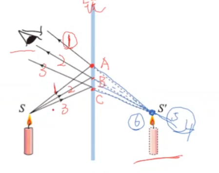

右边的蜡烛是【平面镜的像】


## 折射

1. 光从空气**斜射**入【水中或者其他介质】，折射光线向法线**偏折** 【空气角度大，水和玻璃小】

2. 入射角**大**，折射角大 
3. 光从一种介质**垂直**一种介质，传播方向不变
4. 光路是**可逆的**

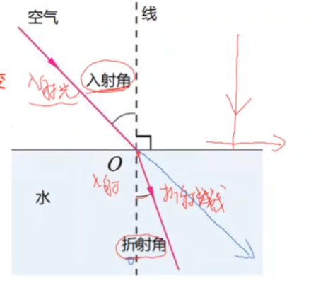

### 例题

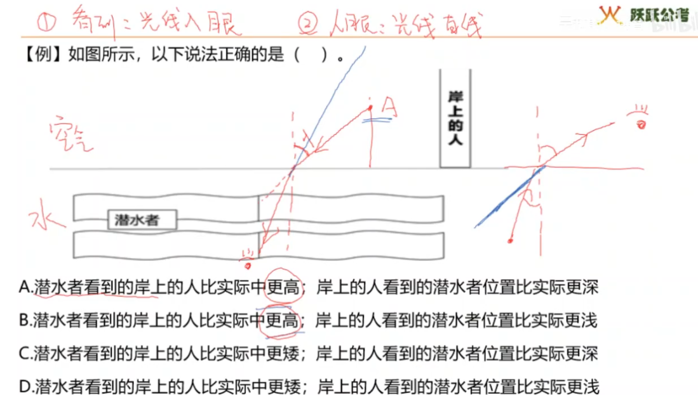

```
这题有点要注意，谁看谁，【1.光线从被看得人发射出来 2.人眼睛看的就是直线】

岸高 水浅
```


## 凸透镜 和 凹透镜

1. 中间厚 2边薄 凸透镜 
2. 中间薄 2边厚 凹透镜 
3. 凸透镜 汇集 凹透镜 发散

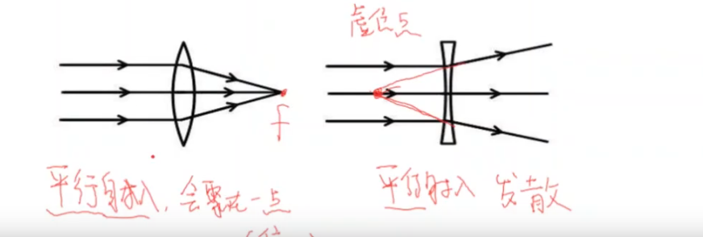


## 光的色散

如一细束**白色**阳光可被棱镜分为红、橙、[黄](https://baike.baidu.com/item/黄/0?fromModule=lemma_inlink)、[绿](https://baike.baidu.com/item/绿/0?fromModule=lemma_inlink)、[蓝](https://baike.baidu.com/item/蓝/0?fromModule=lemma_inlink)、[靛](https://baike.baidu.com/item/靛/0?fromModule=lemma_inlink)、[紫](https://baike.baidu.com/item/紫/0?fromModule=lemma_inlink)七色光。这是由于[复色光](https://baike.baidu.com/item/复色光/0?fromModule=lemma_inlink)中的各种色光的[折射率](https://baike.baidu.com/item/折射率/0?fromModule=lemma_inlink)不相同

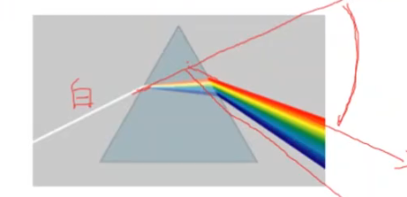

**红光偏折最小，紫光偏折最大** 【这个偏折长度是相对原来直线传播的】

+ 偏折 小大
+ 频率 下大
+ 波长 大小


# 声音

## 声音产生和传播

+ 产生:声音是由**物体的振动**产生的。

+ 传播:声音的传播需要**介质**;传声的介质既可以是气体、固体，也可以是液体，**真空不能传声**
+ 声速:声音在不同的介质中传播的快慢不同。声音的传播还会受温度的影响一般情况下，气体的声速小于液体和固体中的速度。15℃时空气中的声速是340m/s.

> 固 液 气


## 声音特征

+ 音调：频率
+ 响度： 幅度
+ 音色：特色 材料不同

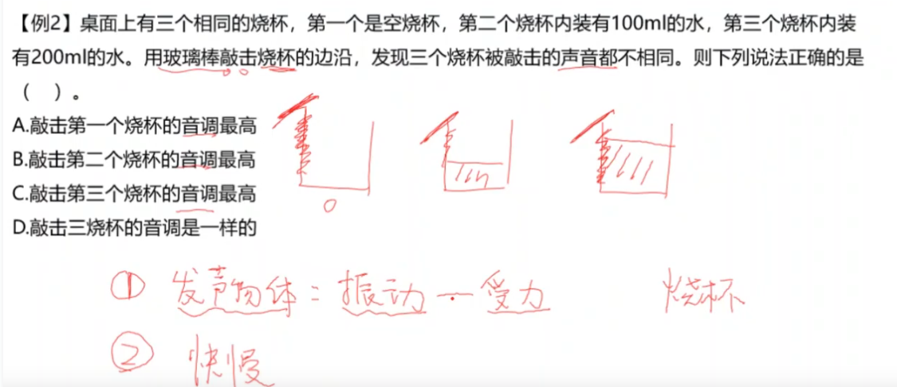

## 声音利用

传递信息 传递能量


# 力

F  N

+ 力的三要素

1. 大小：线段长度
2. 方向：箭头方向
3. 作用点：一般在重心或者接触

## 重力

+ G=mg    【只跟质量相关】
+ 竖直向下
+ 作用点：物体的中心

注意

+ 重心一般在几何中心
+ 有可能在物体上有可能在物体外
+ **重心越低越稳**


## 弹力

1. 物体由于发生**弹性形变**而产生的力。

如:放在桌面上的水杯受到桌面对它的支持力，桌面受到水杯的压力。绳子拉物体绳子对物体的拉力。我们常说的**压力、支持力、拉力就是弹力。**

2. 产生的条件:**相互接触的两个物体互相挤压。**

3. 方向:**与施力物体发生形变的方向相反**,

   **压力**指向**被压得物**体，**支持力**指向**被支持的物体**。**拉力**也是弹力，绳的拉力方向总是沿着绳而压力指向被压的物体，指向绳收缩的方向。**弹簧的弹力与弹簧形变方向相反**


4. 弹力方向判断

   弹力方向**垂直与面**

5. 弹力大小：弹力的大小跟形变的大小有关系，**在弹性范围内，形变越大，弹力越大**。弹簧的弹力**F = k x(K为弹性系数，  x为弹簧的形变量)**

## 压强

### 固体压强

1. 物体所受的压力的大小与受力面积之比叫做压强，用来比较压力的作用效果。
2. 如果用**p表示压强、F表示压力、S表示物体的受力面积，那么有p=F/S**，压强单位为帕斯卡简称帕，符号Pa


### 液体压强 【常考】

液体压强产生原理:**液体的重力及液体具有流动性**

1. 深度为h处液体的压强为**p=pgh**  【p液体密度  h 液体深度】
2. 液体内部压强的大小与深度h和液体的密度p有关,
3. 在液体内部的同一深度，向各个方向的压强大小都相等。

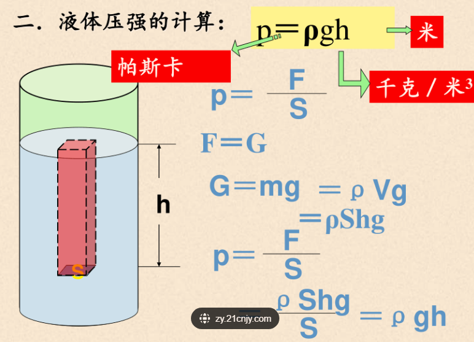


**【m=PV】 质量=密度*体积   【易忘点】**


+ 连通器：液面高度相同.
+ **伯努利原理**：等高流动时，流速越大，压强越小

### 气体压强

理想气体状态方程:pV =nRT，其中p为气体压强，v为气体体积，、R为常数，T为温度


## 浮力-常考

1. 浸在液体中的物体受到**竖直向上**的浮力，**浮力的大小等于它排开的液体所受的重力。这就是著名的阿基米德原理**。

2. 浮力的方向:总是竖直向上

3. 公式: F浮 =G排 = P液gV排

   ```
   G排=MG=密度*体积*G
   【这里得体积就是水下得体积】
   ```

4. 浮力产生的原因:物体上下表面由于处于液体(或气体)的深度不同，受到液体(或气体)的压力也不等，**下表面受到的向上的压力【大于】上表面受到的向下的压力**，这两个压力之差形成了浮力。

   > 有上下的压强差才会有浮力

5. 几个条件下 重力和浮力得关系

   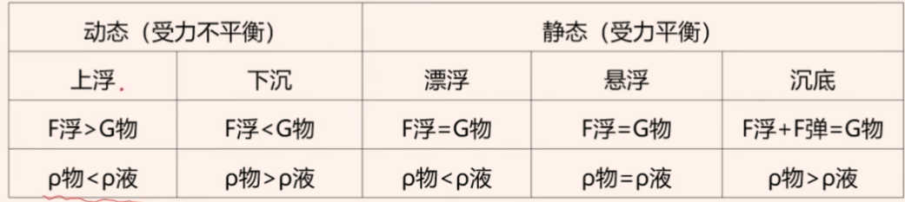

6. 


### 例题

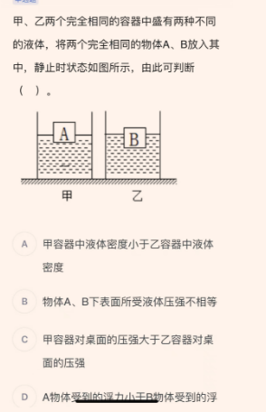

```
质量相同都是漂浮说明F浮=G
1.ρ甲>ρ乙
2.F浮=P*S s一定 p一定
3.液体压强=ρgh   ρ甲大 h一定 选C
```


### 易错点

+ 浮力就是等于=ρgv  跟其他无关
+ 漂浮和悬浮  F浮=G

## 摩擦力

1. 定义:两个互相接触的物体，在接触面上产生**阻碍其相对运动(或相对运动趋势)**的力叫做摩擦力，一般用f表示。

2. 条件 【重要】

   1. 物体接触之间存在**压力**
   2. 接触面**不光滑**
   3. 接触物体之间有相对**运动或相对运动趋势**

3. 方向

   沿接触面切线方向，**与物体相对运动或相对运动趋势的方向相反**

   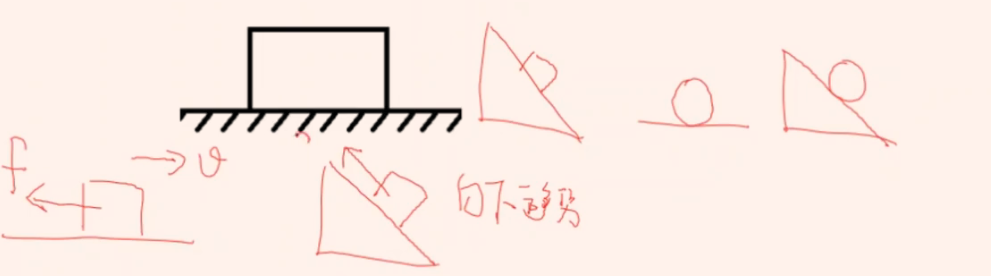

4. 作用点:**接触面**

   

# 生物

## 生态系统

1. 定义:生态系统指在自然界的一定的空间内，生物与环境构成的统一整体，在这个统一整体中，生物与环境之间相互影响、相互制约，并在一定时期内处于**相对稳定的动态平衡状态**。

2. 组成部分:**非生物的物质和能量、生产者、消费者、分解者。**

   > **生态系统=生物和非生物** 【易错点】

3. **无机环境**是生态系统的非生物组成部分，包含阳光以及其它所有构成生态系统的基础物质:**水、无机盐、:空气、有机质、岩石**等。

4. 生产者：能够进行**光合作用**产生**有机物**的生物

   > 有机物：含碳
   >
   > 菟丝子是消费者

5. 分解者:又称“还原者”，以各种细菌(寄生的细菌属于消费者，腐生的细菌是分解者)和真菌为主，也包含屎壳郎、蚯蚓等腐生动物。

   > 释放到环境中原理:它们能把动植物残体中复杂的**有机物分解成简单的无机物**，供生产者再一次利用。

6. 消费者:指以动植物为食的生物。

7. **一个生态系统只需要生产者和分解者就可以维持运作**，数量众多的消费者在生态系统中起加快能量流动和物质循环的作用。

8. 地表的生态系统的能量**最终来源是太阳**，地层深处极少数微生物的来源是**地热能。**

```
下列不属于生态系统的是()
A.一个池塘
B.一块草地
C.生物圈
D.森林里所有的树 [只有生物]
```


+ 食物链 ： 生产者、消费者

1. 只**包含生产者、消费者** 【易错点】
2. 生产者开头、消费者结尾
3. 箭头指向“嘴里”
4. 总能量沿食物链减少
5. 有毒物质沿食物链增多
6. **种群数量一般沿食物链减少**

> 生物富集作用:有毒物质会随着食物链逐级积累营养等级越高的动物有毒物质积累越多。

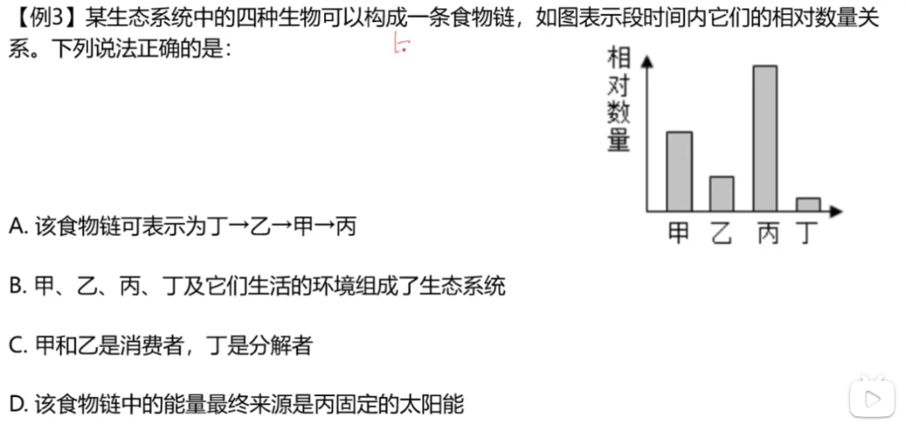

```
食物链只有生产者和消费者
生态系统=生物+非生物
```


## 细胞

## 血型

## 酶


# 地理

## 地图

+ 维度

地球上某个点随**地球自转**产生的轨迹。从形状来看，是一个个**圆圈**，**纬线指示东西方向**。分**南北**

1. **赤道最长，往两极递减。**

2. 赤道往北叫北纬(N)，越往北纬度越大(0°~90°N)

3. 赤道往南叫南纬(S)，越往南纬度越大(0°~90°S)
4. 0-30 低 30-60 中 60-90 高

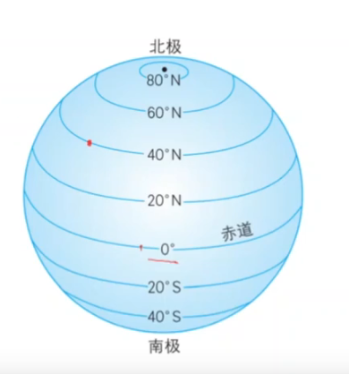


+ 经度

经线:**与纬线垂直，连接南北极的线**。经线也叫做子午线。经线指示南北方向,**是一个半圆弧**

经度:人为指定了一条0°经线，作为经度的起始线，称为本初子午线(通过英国格林威治天文台旧址)本初子午线以东为东经(E)(0°~180°)，以西为西经(W)(0°~180°)

+  东西半球划分

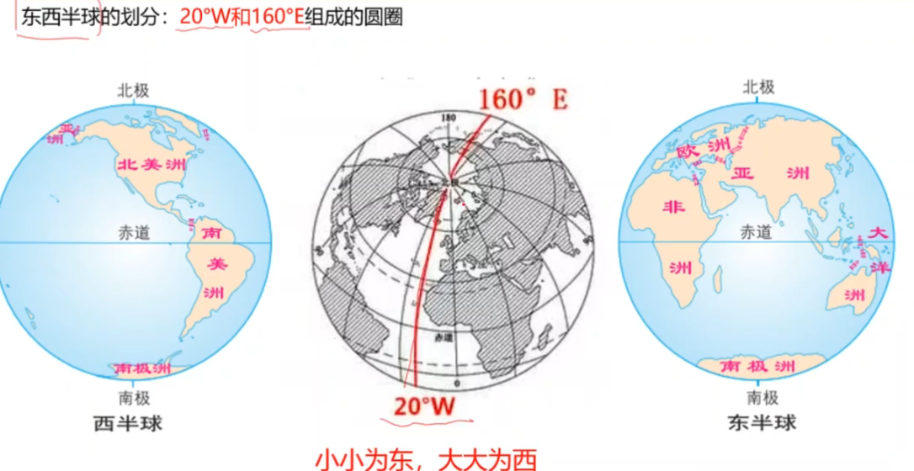

20W 160E  都是海

+ 地图

  上北下南 左西右东


## 自转和公转

### 自转

地球绕着一条**假想的线**在**自西向东**转动，这种运动叫做自转。**假想的线叫做地轴**。自转的周期是24小时。地轴与地球表面的**两个交点就是南北极**

产生： 昼夜交替、时差、地转偏向力

+ 昼夜交替

  这个没啥说的。。

+ 时差和时区

  360/24=15°一个时区

  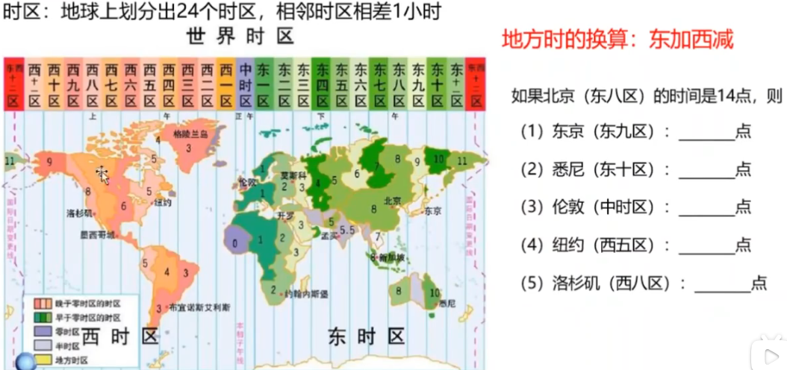

  

+ 地转偏向力

由于地球不停自转，导致地球表面运动的物体发生方向偏转，就好像受到了一个力一样这个力就称为地转偏向力。**(北半球的地转偏向力向右，南半球的向左)**

偏向力只改变**水平方向的速度方向**，不改变速度大小。

> 直接偏向赤道  就这么记就好了


### 公转

公转都是**斜着转**，斜着转就会有太阳**垂直照射**的问题

春分-夏至-秋分-东芝

**赤道-北回归线-赤道-南回归线**

+ 四季更替

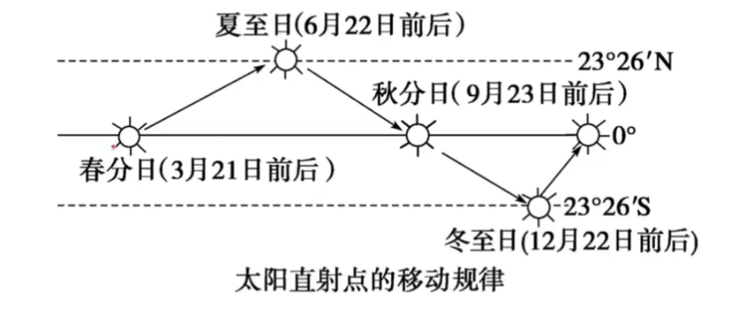

**北半球与南半球季节相反**


+ 极昼极夜

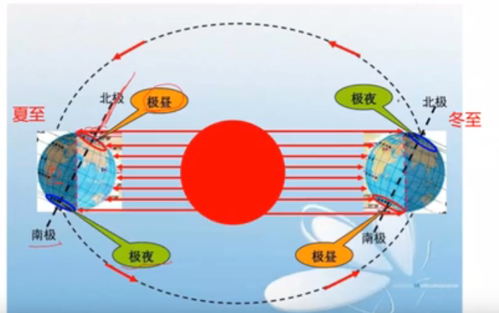

其实也很好理解，夏至北回归线，北极是极昼......

> 注意地轴的方向！

+ 五带划分

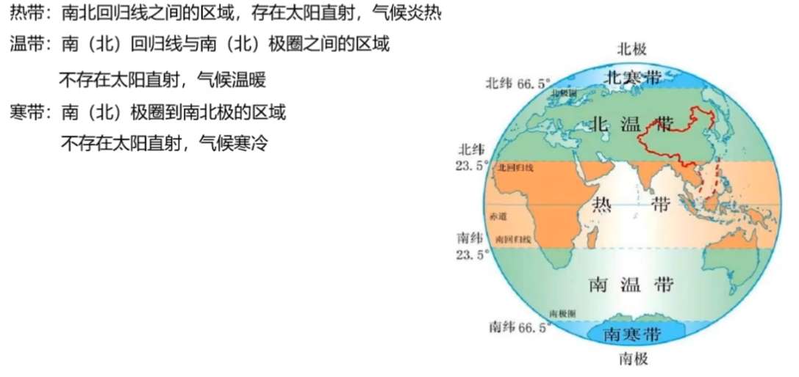

热带：不管怎么转 赤道附近一直是太阳照射的到


## 地形地貌

### 等高线

特点：**(1)封闭曲线(2)同线等高(3)同图同距**

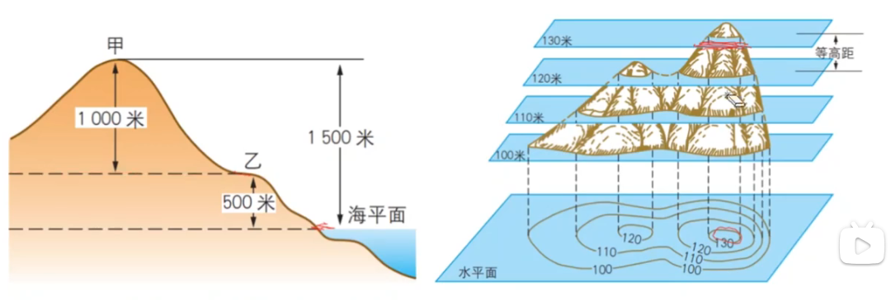


1. 判断坡度的陡与缓--**密陡 疏缓**
2. 山脊：等高线地形图中，等高线由**高处向低处弯曲**的地方。
3. 山谷：等高线地形图中，等高线由**低处向高**处弯曲的地方。
4. 鞍部：等高线地形图中，两个相邻的山岭之间**相对较低处。**
5. 陡崖：等高线地形图中，**等高线相交的地方**

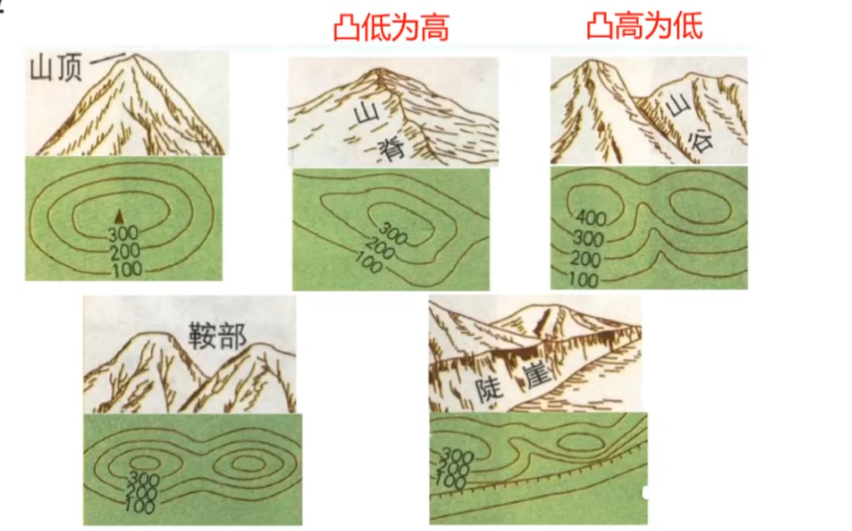


### 地壳运动

在板块的边缘处，由于板块运动，它们相互之间可能存在碰撞挤压或张裂，形成各种地形地貌
**碰撞形成的典型地形:山脉**
**张裂形成的典型地形:海洋、裂谷**

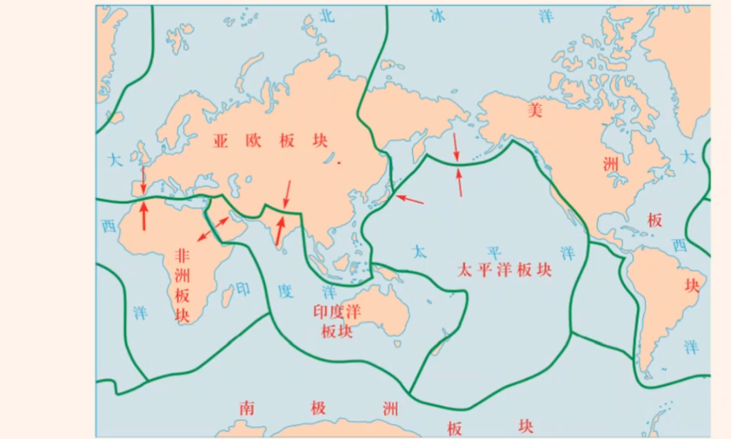


## 气候

+ 等温线

地图上**温度相同**的各点的连线，称为等温线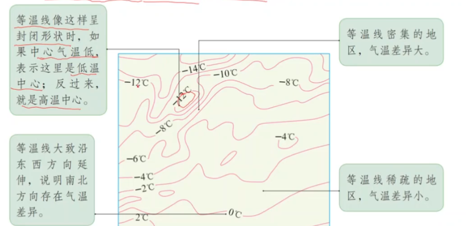

> 密集 温差大
>
> 稀疏 温差小


+ 影响气温因素

1. 纬度:气温大致由**低纬度向高纬度递减**(五带分布)

2. 海拔高度:**气温随海拔升高而降低**。大致每升高100米，气温约下降0.6℃℃。

3. 海陆位置:**水域的温度变化比陆地更小**，因此靠近海洋、大型湖泊的地区显得冬暖夏凉。

   

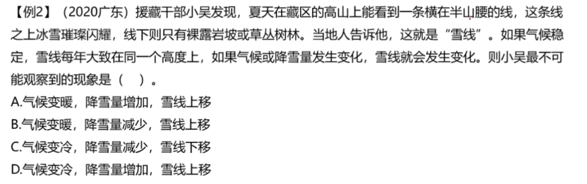

```
D 雪线下移动
```


+ 降水

1. 海陆位置:距海近，降水多;距海远，降水少

2. 山脉走向:山脉走向对海洋水汽有阻挡作用和引导作用。

   **如果山脉走向与海洋水汽来向垂直，就会阻挡水汽的进入，使大陆内侧降水明显减少**

3. 地形:迎风坡、背风坡:迎风坡降水多，背风坡降水少。


+ 风

1. 风:风是指水平方向的大气运动。

2. 风向:指风吹来的方向。一般用八个基本方位来描述，

3. 风的形成:在气压差的作用下，**大气由高气压区向低气压区**作水平运动，形成了风。

4. 等压线: 把地图上气压相等的地点连接起来所成的封合曲线,

   在同一幅地图上，**等压线越密集，单位距离的气压差越大**，风速越大

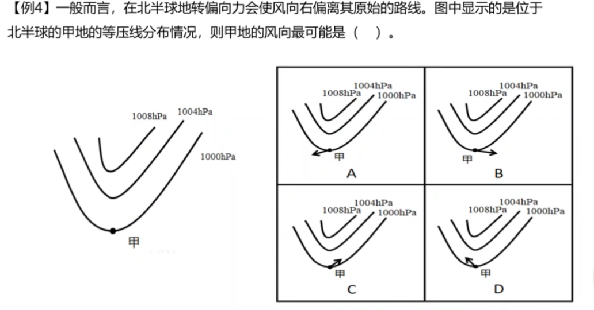

> 风也是流体，收到地转偏向力的作用
>
> 北半球向右 选A   注意风向是从高到底，站在箭头 A才是对的

