# Table of Contents

* [光](#光)
  * [光的直线传播](#光的直线传播)
  * [光的反射](#光的反射)
  * [平面镜成像](#平面镜成像)
  * [折射](#折射)
    * [例题](#例题)
  * [凸透镜 和 凹透镜](#凸透镜-和-凹透镜)
  * [光的色散](#光的色散)
* [声音](#声音)
  * [声音产生和传播](#声音产生和传播)
  * [声音特征](#声音特征)
  * [声音利用](#声音利用)
* [力](#力)
  * [重力](#重力)
  * [弹力](#弹力)
  * [压强](#压强)
    * [固体压强](#固体压强)
    * [液体压强 【常考】](#液体压强-常考)
    * [气体压强](#气体压强)
  * [浮力-常考](#浮力-常考)
    * [例题](#例题-1)
    * [易错点](#易错点)
  * [摩擦力](#摩擦力)
    * [摩擦力分类](#摩擦力分类)
  * [受力分析](#受力分析)
    * [如何进行受力分析](#如何进行受力分析)
    * [例题](#例题-2)
    * [多个物体受力分析](#多个物体受力分析)
  * [力的合成与分解](#力的合成与分解)
  * [简单机械](#简单机械)
    * [滑轮组](#滑轮组)
* [运动](#运动)
  * [牛顿第一定律-惯性](#牛顿第一定律-惯性)
  * [牛顿第二定律](#牛顿第二定律)
  * [超重和失重](#超重和失重)
  * [物体运动-重点](#物体运动-重点)
    * [位移时间图形-斜率是速度](#位移时间图形-斜率是速度)
    * [速度时间图形-加速度](#速度时间图形-加速度)
    * [平抛运动](#平抛运动)
    * [圆周运动](#圆周运动)
* [功和机械能](#功和机械能)
* [电学](#电学)
  * [基础概念](#基础概念)
  * [串联 并联](#串联-并联)
  * [欧姆定律](#欧姆定律)
  * [电压表和电流表](#电压表和电流表)
  * [串反并同](#串反并同)
* [化学](#化学)
* [生物](#生物)
  * [生态系统](#生态系统)
  * [细胞](#细胞)
  * [血型](#血型)
  * [酶](#酶)
  * [光合作用和呼吸作用](#光合作用和呼吸作用)
    * [光合作用](#光合作用)
    * [呼吸作用](#呼吸作用)
* [地理](#地理)
  * [地图](#地图)
  * [自转和公转](#自转和公转)
    * [自转](#自转)
    * [公转](#公转)
    * [北回归线补充](#北回归线补充)
  * [地形地貌](#地形地貌)
    * [等高线](#等高线)
    * [地壳运动](#地壳运动)
  * [气候](#气候)


# 光


## 光的直线传播

1. **同种介质**，都是直线传播的


## 光的反射

1. 三线并列
2. 分居2侧
3. 2角相同
4. 法线**垂直**平面镜


## 平面镜成像

+ 物体关于镜面对称【左右颠倒 **上下还是一样**】
+ 平面镜是**虚像**【不能在光屏上呈现】


右边的蜡烛是【平面镜的像】


## 折射

1. 光从空气**斜射**入【水中或者其他介质】，折射光线向法线**偏折** 【空气角度大，水和玻璃小】

2. 入射角**大**，折射角大 
3. 光从一种介质**垂直**一种介质，传播方向不变
4. 光路是**可逆的**


### 例题


```
这题有点要注意，谁看谁，【1.光线从被看得人发射出来 2.人眼睛看的就是直线】

岸高 水浅
```


## 凸透镜 和 凹透镜

1. 中间厚 2边薄 凸透镜 
2. 中间薄 2边厚 凹透镜 
3. 凸透镜 汇集 凹透镜 发散


## 光的色散

如一细束**白色**阳光可被棱镜分为红、橙、[黄](https://baike.baidu.com/item/黄/0?fromModule=lemma_inlink)、[绿](https://baike.baidu.com/item/绿/0?fromModule=lemma_inlink)、[蓝](https://baike.baidu.com/item/蓝/0?fromModule=lemma_inlink)、[靛](https://baike.baidu.com/item/靛/0?fromModule=lemma_inlink)、[紫](https://baike.baidu.com/item/紫/0?fromModule=lemma_inlink)七色光。这是由于[复色光](https://baike.baidu.com/item/复色光/0?fromModule=lemma_inlink)中的各种色光的[折射率](https://baike.baidu.com/item/折射率/0?fromModule=lemma_inlink)不相同


**红光偏折最小，紫光偏折最大** 【这个偏折长度是相对原来直线传播的】

+ 偏折 小大
+ 频率 下大
+ 波长 大小


# 声音

## 声音产生和传播

+ 产生:声音是由**物体的振动**产生的。

+ 传播:声音的传播需要**介质**;传声的介质既可以是气体、固体，也可以是液体，**真空不能传声**
+ 声速:声音在不同的介质中传播的快慢不同。声音的传播还会受温度的影响一般情况下，气体的声速小于液体和固体中的速度。15℃时空气中的声速是340m/s.

> 固 液 气


## 声音特征

+ 音调：频率
+ 响度： 幅度
+ 音色：特色 材料不同


## 声音利用

传递信息 传递能量


# 力

F  N

+ 力的三要素

1. 大小：线段长度
2. 方向：箭头方向
3. 作用点：一般在重心或者接触

## 重力

+ G=mg    【只跟质量相关】
+ 竖直向下
+ 作用点：物体的中心

注意

+ 重心一般在几何中心
+ 有可能在物体上有可能在物体外
+ **重心越低越稳**


## 弹力

1. 物体由于发生**弹性形变**而产生的力。

如:放在桌面上的水杯受到桌面对它的支持力，桌面受到水杯的压力。绳子拉物体绳子对物体的拉力。我们常说的**压力、支持力、拉力就是弹力。**

2. 产生的条件:**相互接触的两个物体互相挤压。**

3. 方向:**与施力物体发生形变的方向相反**,

   **压力**指向**被压得物**体，**支持力**指向**被支持的物体**。**拉力**也是弹力，绳的拉力方向总是沿着绳而压力指向被压的物体，指向绳收缩的方向。**弹簧的弹力与弹簧形变方向相反**


4. 弹力方向判断

   弹力方向**垂直与面**

5. 弹力大小：弹力的大小跟形变的大小有关系，**在弹性范围内，形变越大，弹力越大**。弹簧的弹力**F = k x(K为弹性系数，  x为弹簧的形变量)**

## 压强

### 固体压强

1. 物体所受的压力的大小与受力面积之比叫做压强，用来比较压力的作用效果。
2. 如果用**p表示压强、F表示压力、S表示物体的受力面积，那么有p=F/S**，压强单位为帕斯卡简称帕，符号Pa


### 液体压强 【常考】

液体压强产生原理:**液体的重力及液体具有流动性**

1. 深度为h处液体的压强为**p=pgh**  【p液体密度  h 液体深度】
2. 液体内部压强的大小与深度h和液体的密度p有关,
3. 在液体内部的同一深度，向各个方向的压强大小都相等。


**【m=PV】 质量=密度*体积   【易忘点】**


+ 连通器：液面高度相同.
+ **伯努利原理**：等高流动时，流速越大，压强越小

### 气体压强

理想气体状态方程:pV =nRT，其中p为气体压强，v为气体体积，、R为常数，T为温度


## 浮力-常考

1. 浸在液体中的物体受到**竖直向上**的浮力，**浮力的大小等于它排开的液体所受的重力。这就是著名的阿基米德原理**。

2. 浮力的方向:总是竖直向上

3. 公式: F浮 =G排 = P液gV排

   ```
   G排=MG=密度*体积*G
   【这里得体积就是水下得体积】
   ```

4. 浮力产生的原因:物体上下表面由于处于液体(或气体)的深度不同，受到液体(或气体)的压力也不等，**下表面受到的向上的压力【大于】上表面受到的向下的压力**，这两个压力之差形成了浮力。

   > 有上下的压强差才会有浮力

5. 几个条件下 重力和浮力得关系

   

6. 


### 例题


```
质量相同都是漂浮说明F浮=G
1.ρ甲>ρ乙
2.F浮=P*S s一定 p一定
3.液体压强=ρgh   ρ甲大 h一定 选C
```


### 易错点

+ 浮力就是等于=ρgv  跟其他无关
+ 漂浮和悬浮  F浮=G

## 摩擦力

1. 定义:两个互相接触的物体，在接触面上产生**阻碍其相对运动(或相对运动趋势)**的力叫做摩擦力，一般用f表示。

2. 条件 【重要】

   1. 物体接触之间存在**压力**
   2. 接触面**不光滑**
   3. 接触物体之间有相对**运动或相对运动趋势**

3. 方向

   沿接触面切线方向，**与物体相对运动或相对运动趋势的方向相反** 【易错点】

   

4. 作用点:**接触面**


### 摩擦力分类


+ 滑动摩檫力

两个物体之间**有相对运动**时，受到的阻碍其运动的力;
大小:计算公式 **f=μN**，**N为压力**，μ为动摩擦因数，是物体本身的属性，反映粗糙程度，通常0<μ<1。

> n为压力 【易错点】

+ 静摩檫力

两个物体之间只有**相对运动趋势**，**没有相对运动**，
大小:静摩擦力大小可在0与**最大静摩擦力**之间变化。

> 动起来就是滑动摩檫力

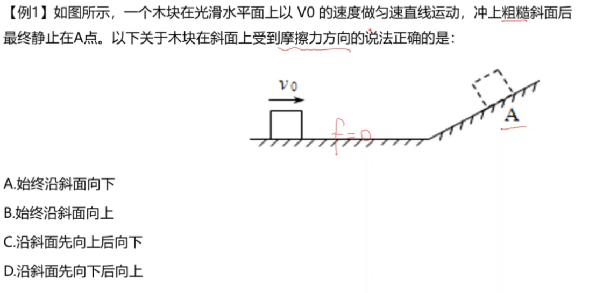

```
光滑没有
先上去的时候拉力向上，摩檫力向下
静止 重力向下 摩檫力向上
```

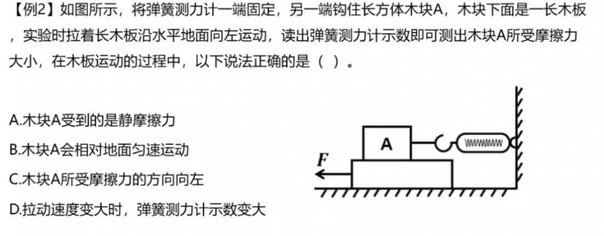

```
A 相对运动  滑动摩檫力
B  受摩檫力 f=μn  压力不变  = kx  弹力也不变  【相对地面静止】
C 对
D 跟运动速度无关 参考B
```


## 受力分析

+ 受力平衡

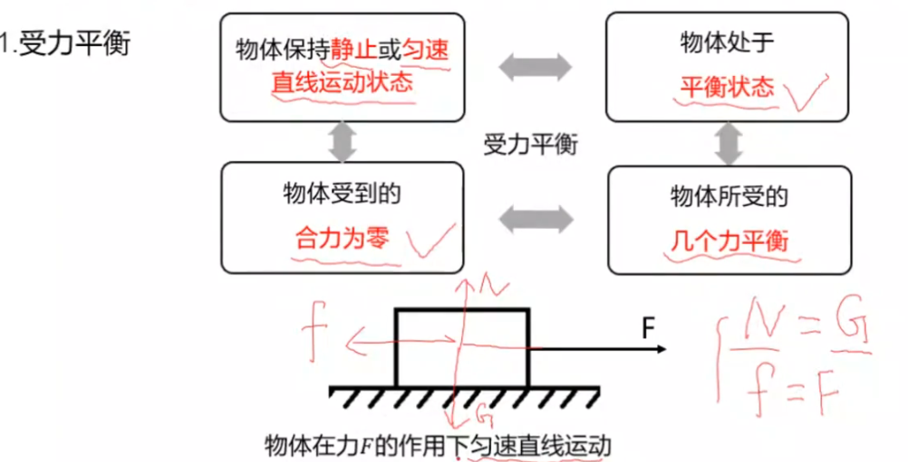


> 受力平衡=静止=匀速运动 【】


+ 概念区分

1. **平衡力** 特点:大小相等，方向相反，同一直线，作用于**同一物体**。
2. **作用力与反作用力** 特点:大小相等，方向相反，同一直线**，作用于两个物体**。(相互乍用力)
   对于地面静止的木块:

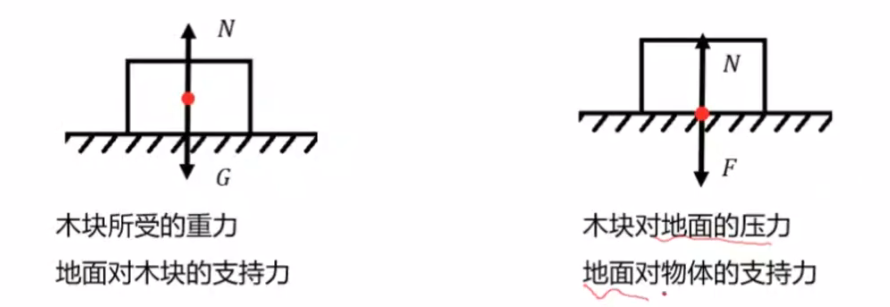


### 如何进行受力分析

①重力、浮力
②题目给出的已知力
③接触面上的力(弹力、摩擦力等)


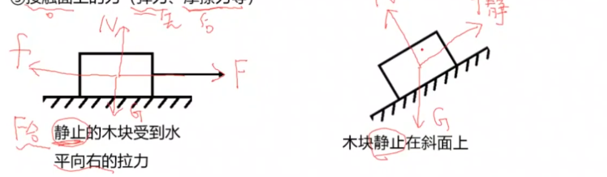

> 静止 受力平衡 


### 例题

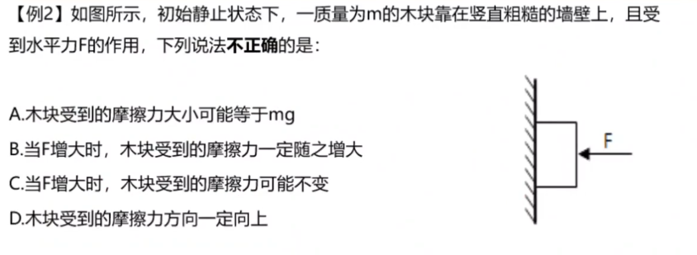

```
 静止=受力平衡 粗糙 摩檫力 
 摩檫力=重力  B 错误
```


### 多个物体受力分析

先整体，在内部

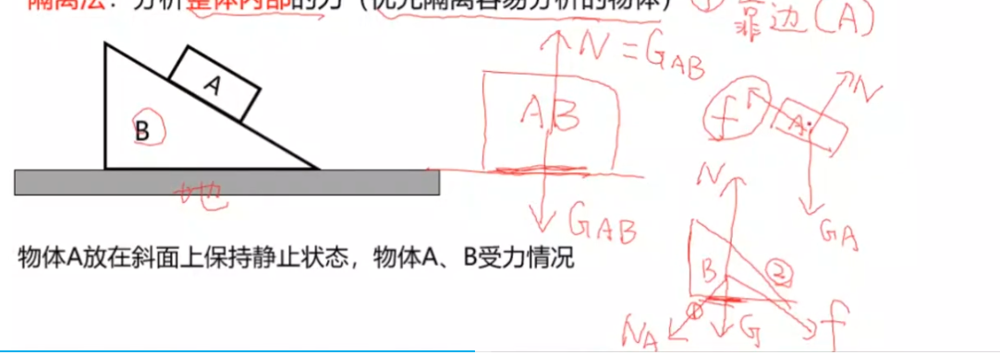


+ 例题

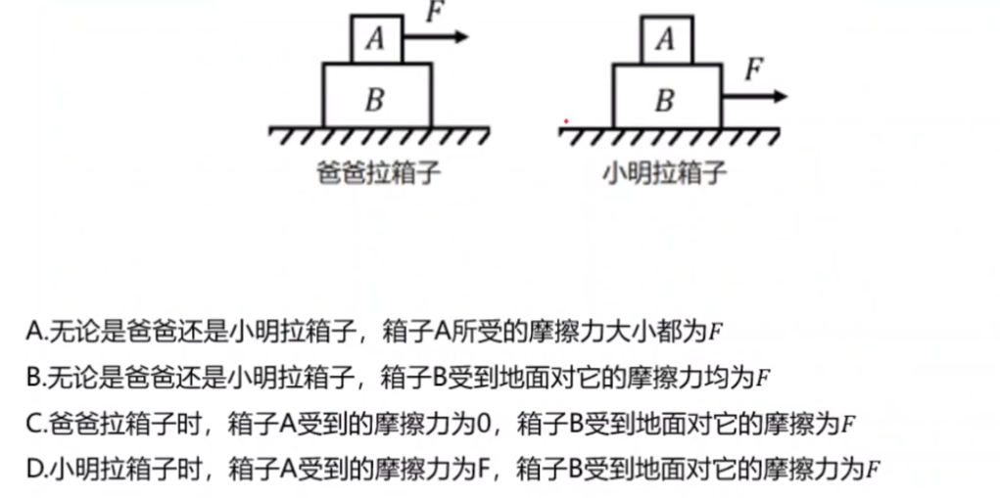

好题 

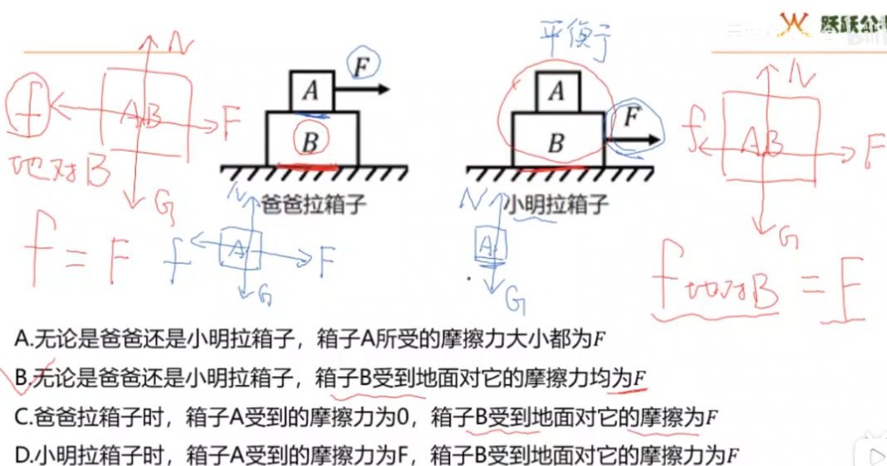


```
先整体分析  小明拉箱子时 A物体只有重力和支持里 没有摩檫力
```


## 力的合成与分解

+ 力的合成

求几个力的合力的过程叫做力的合成，它遵循平行四边形定则或三角形定则。

1. 平行四边形定则:两个力合成时，以表示这两个力的线段为邻边作平行四边形，这两个邻边之间的对角线就代表合力的大小和方向。
2. 三角形定则:把两个力首尾相接从而求出合力的方法。


## 简单机械

+ 杠杆及其平衡条件

  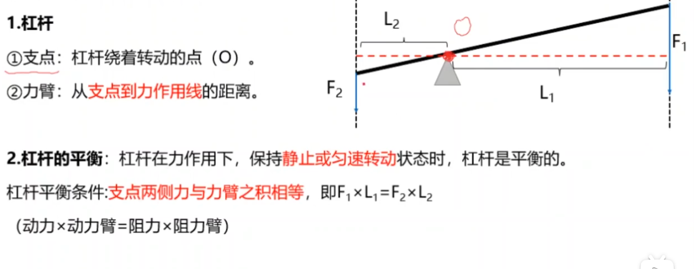
  
  > 力臂：o到F 做**垂线**的距离   【力垂直的时候最省力】

+ 省力杠杆和费力杠杆

1. 动力臂 >阻力臂 →省力杠杆

2. 动力臂 <阻力臂 → 费力杠杆

3. 动力臂 =阻力臂 →等臂杠杆


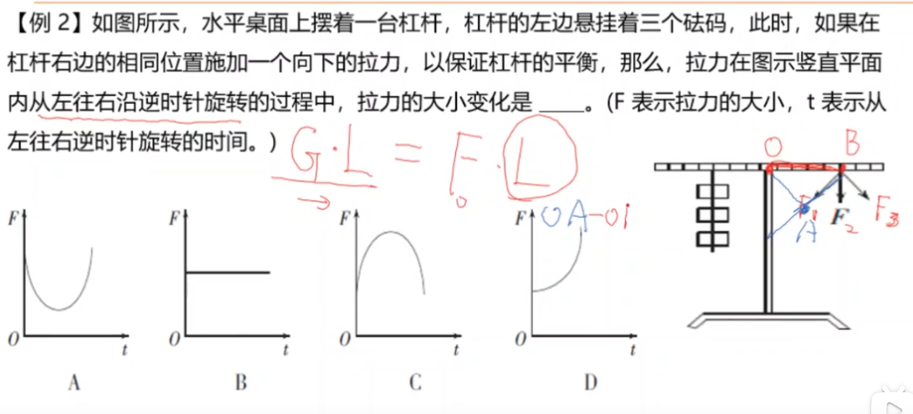

```
垂直做直线 是力臂 
所以F2的时候 力臂最长，最省力  【易错点】
```


### 滑轮组

1. 定滑轮:使用滑轮时，轴的位置固定不动的滑轮称之为定滑轮。**改变用力方向，不省力**。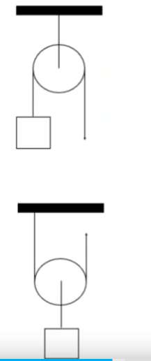
2. 动滑轮:使用滑轮时，轴的位置随被拉物体一起运动的滑轮称为动滑轮。**不改变用力方向，省一半力。**

> 动滑轮有**几个线吊着物体**，就省几分之几的力 【易错点】

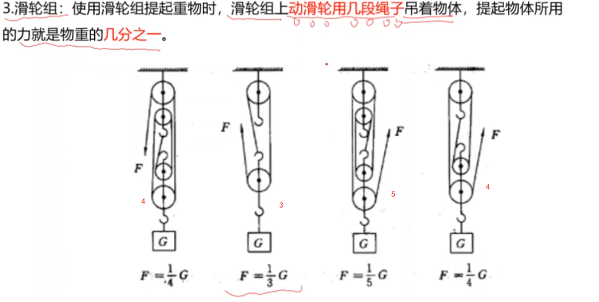


+ 例题


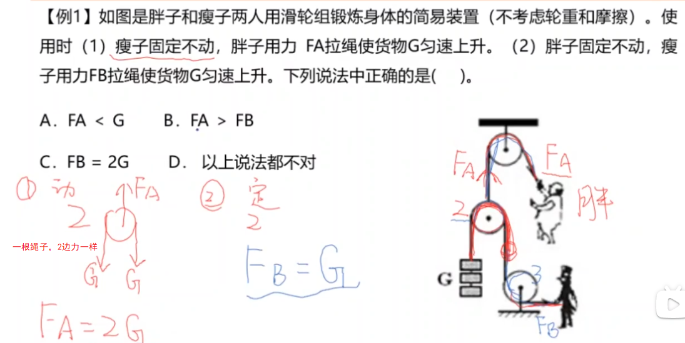

```
胖子拉 动滑轮 改变力
廋字拉 定滑轮 不改变力
```

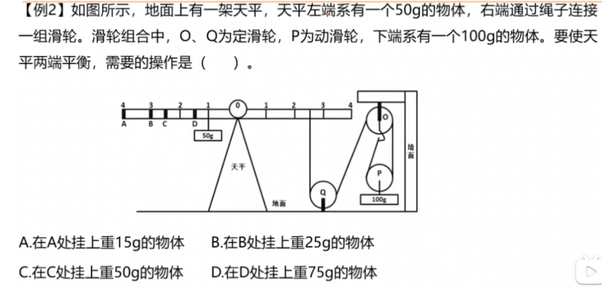

```
动滑轮 力一半 50*2.5= 125
50*x1 +F*L= 125
 F*l=75
 选B
```


# 运动

+ 基础

  1. **参照物**:研究运动时，作为基准的物体叫做参照物。参照物不同，描述运动的结果可能不同。

  2. **质点**:代表一个有质量的物体的点。当物体的形状、大小对研究问题的影响不大时可以忽略时，可将物**体看成质点。**

  3. 位移:由初位置到末位置的有向线段。**包括大小和方向，**

     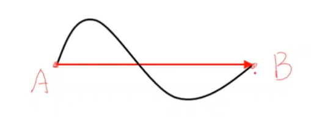

  4. 速度:描述物体运动快慢的物理量 

  5. 加速度：

     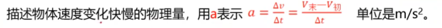

  > 加速度与速度**方向相同**时，**[速度]逐渐变大** 【末速度大于初速度】
  > 与速度方向**相反**时，**速度逐渐变小**。 【初速度大于末速度】

## 牛顿第一定律-惯性

1. 惯性:物体保持**原有静止状态**或**匀速直线运动**状态不变的性质。
2. 惯性定律(牛顿第一定律):任何物体在不受力作用时，总保持静止或匀速直线运动状态，
3. **一切物体**都具有惯性。惯性只与**物体的质量**有关，质量越大惯性越大

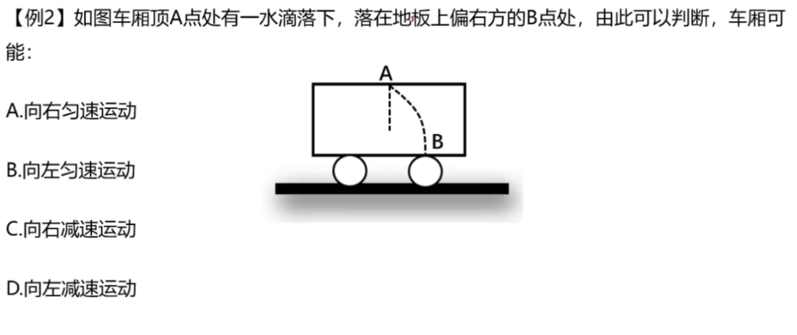

```
直接常识做 选C
```


## 牛顿第二定律

物体的加速度跟物体所受的力【**合外力 易错点**】成正比，跟物体的质量成反比。

**F=ma，a与F方向相同。 (力是改变物体运动的原因)**

> F是矢量  m标量  a矢量
>
> a和f的方向相同

**主要是用来分析加速度和速度的正反方向！！！！！！！！！！！！！**

+ 第三定律：反作用力和作用力

## 超重和失重

**超重**:物体所受的**支持力或拉力大于物体所受重力**的情况。  

> N>G 合力向上，加速度a方向向上

**失重**:物体所受的**支持力或拉力小于物体所受重力**的情况。 加速度a方向向下

**完全失重**：N=0，只有G  加速度=重力加速度

【例 1】某次实验，先在电梯内平放一个磅秤，然后小明站在磅秤上观察示数为 600N在电梯运动过程中，小明再次观察磅秤，发现示数为 540N，则下列解释正确的是:

A.小明处于超重状态，电梯可能在做向上的加速运动
B.小明处于超重状态，电梯可能在做向上的减速运动
C.小明处于失重状态，电梯可能在做向下的加速运动
D.小明处于失重状态，电梯可能在做向下的减速运动

```
第一次 G=600
第二次  540 压力小于重力 失重  加速度向下  CD 告诉你速度下 相同 加速 选C
```


## 物体运动-重点

+ 直线运动

  1. 匀速直线运动，S=VT
  2. 匀变速直线运动，【加速度不变】就是自由落体运动

+ 自由落体运动

  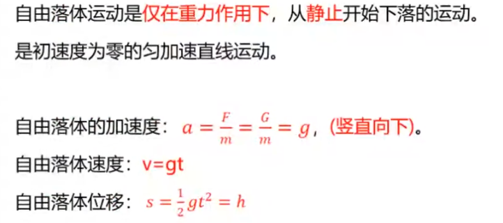

> V=gt
>
> S=h=1/2gt^2  【t只跟h相关，跟质量无关】


### 位移时间图形-斜率是速度

斜率=纵轴/横轴=S/t=V

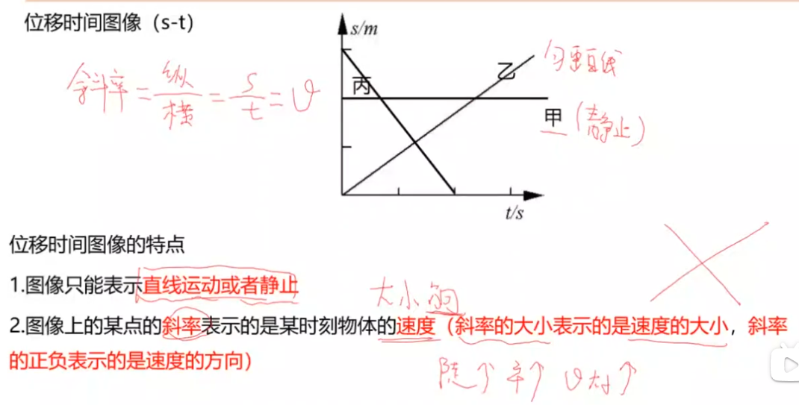


### 速度时间图形-加速度

斜率=纵轴/横轴=v/t=a

面积表示的是位移

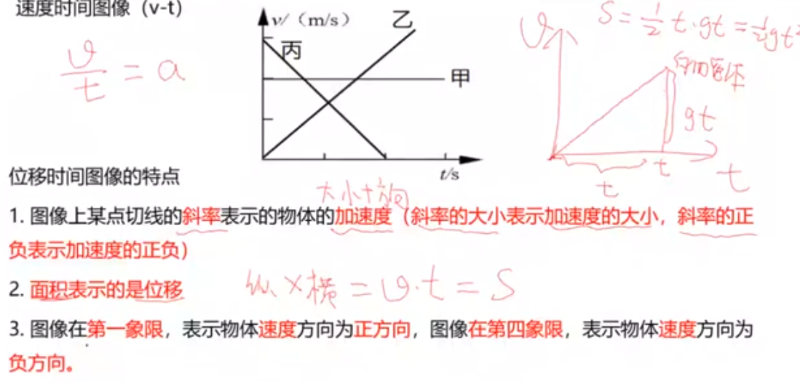


### 平抛运动

1.定义:质点以**一定的初速度**沿水平方向抛出，仅在**重力作用**下所做的运动。
2.性质:初速度沿水平方向的匀变速曲线运动，a=g.

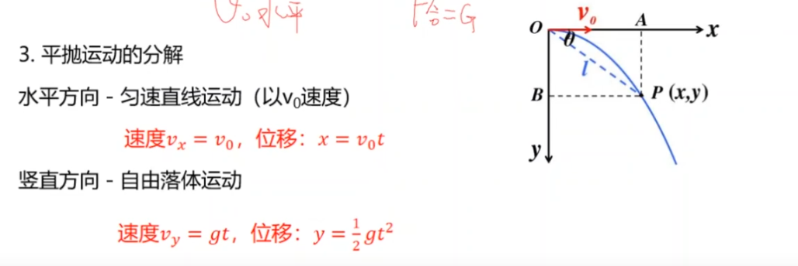


### 圆周运动

物体沿着圆周的运动是一种常见的运动。

1. 定义:物体沿着圆周运动，并且线速度的大小处处相等，这种运动叫做匀速圆周运动

2. 线速度(v)
   **线速度为通过的弧长与所用时间的比值**，就是圆周运动的瞬时速度，用符号v表示，单位是m/s(米每秒)
   注意:匀速圆周运动，线速度大小不变，**方向时刻改变**，

3. **角速度(ω)**
   做圆周运动的物体，与圆心连线扫过**角度的和所用时间的比值**，叫做圆周运动的角速度，用符号w表示，单位是rad/s(弧度每秒)
   注:匀速圆周运动是角速度不变的圆周运动，

4. .线速度与角速度的关系

   线速度与角速度的关系圆周运动中，**线速度的大小等于半径与角速度大小的乘积，**

​      V=rω


+ 向心力

F=m * ω * v     v=ω * r   就可以写成2个不同的表达式

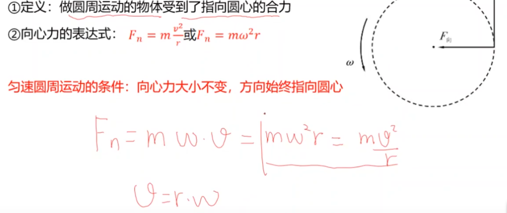


+ 例题

【例】在赛车比赛中，赛车在水平直道转入弯道时，常常在弯道上冲出跑道。下列分析正确的是:
A. 赛车的速度越快，赛车的惯性越大
B.赛车的速度越快，转弯所需的向心力越大
C.赛车的转角越大，发动机对抗的离心力越大
D.赛车的转角越大，轮胎与地面之间的摩擦系数越小

```
C 错哪里  转角 不代表角速度
```


# 功和机械能

+ 功

1. 一个物体在力的作用下**作了一段位移**我们就说这个力对物体做了功。
2. 功的单位是焦耳，简称焦，符号是」。
3. 功的公式为:W=FS。

注意点

1. **力的方向与位移的方向垂直时力不做功** 【易错点】
2. 力的方向与位移的方向在0-90°时，力做正功;在90-180°时力做负功。


+ 机械能

1. 动能
   物体由于**运动**而具有的能，叫做动能。:动能 Ek =-mv2
2. 势能
   (1)物体由于被举高而具有的能叫做重力势能。重力势能 E,=mgh
   (2)物体由于发生**弹性形变【就是压缩】**而具有的势能叫弹性势能。
   同一弹性物体在一定范围内形变越大，具有的弹性势能就越多。
3. **机械能=动能+重力势能+弹性势能** 【易错点】

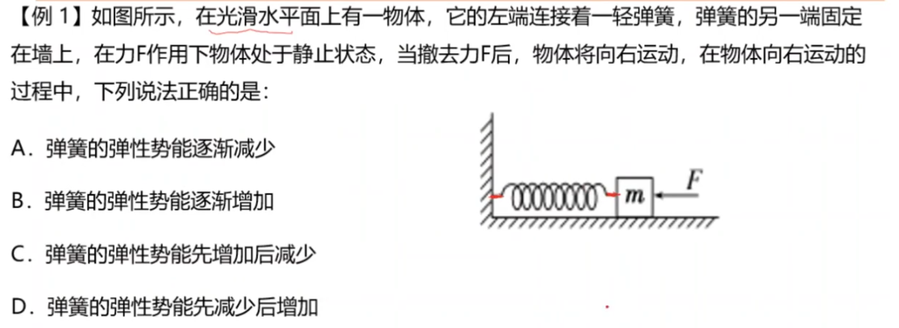

```
撤去后，恢复原来 形变量会减少
然后 行变量扩大 增加 选D
```


+ 能量守恒

1. 能量既不会凭空产生，也不会凭空消失，它只能从一种形式转化为另一种形式，或者从一个物体转移到别的物体，在转化或转移的过程中，能量的总量保持不变，

2. 机械能守恒定律
   在只有**重力或弹力做功**的物体系统内，**动能与势能可以相互转化**，而总的机械能保持不变这叫做机械能守恒定律。

   > 外力： G重力
   >
   > 内部：弹力 【有弹力 要放在内部，机械能才能守恒  易错点】


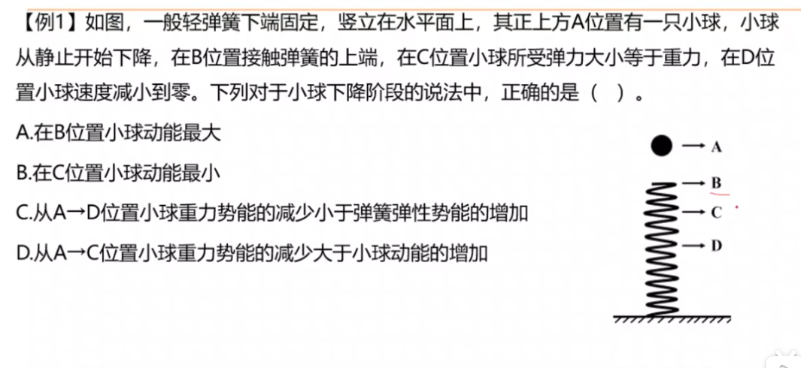

```
b点时  重力大于弹力 合外力  加速度向下，加速运动
c点时  G=T速度最大
A-D  整体（物体+弹簧一起看）问的是A-D 只用分析整体  G=V+T   G下降 速度不变 G=T
A-C   G ⬇ V ⬆  弹力 ⬆  整体守恒，减小=增加的 
```


# 电学

## 基础概念

1.通路:正常接通,用电器工作。
2.断路:是某处断开(亦作“开路”)，用电器不工作。
3.短路:直接用导线将电源的正、负极连接起来
**如果电路接通，但用电器两端被导线直接连通，叫做该用电器被短接(被短路)。被短路的用电器不工作。**

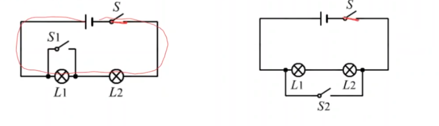

4. 电流**优先导线**，上面短路时，优先走S1  【易错点】


## 串联 并联

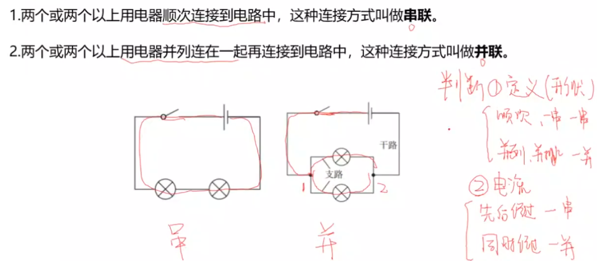


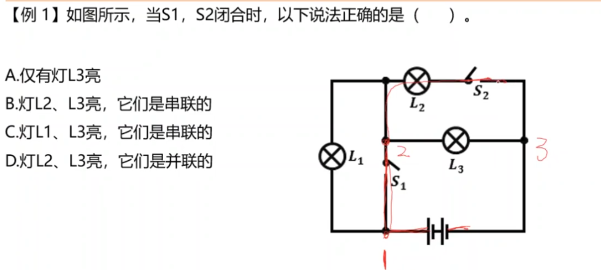

```
优先导线 选D
```


## 欧姆定律

1.电流，用!表示，单位是安培，
2.电压，用U表示，单位是伏特，简称伏，符号是 V。
3.电阻，用R表示，单位是欧姆，简称欧，符号是Q。

欧姆定律:通过导体的电流跟导体两端的电压成正比，跟导体的电阻成反比。
用公式表示为 I=U/R


+  串联电路公式

1. 电流处处相等，即 I总=l1= 12 =.
2. 总电压等于各用电器两端的电压之和，即 U= U1+ U2+…
3. 总电阻等于各串联电阻之和，即 R„= R+ R₂+ .


+ 并联电路公式

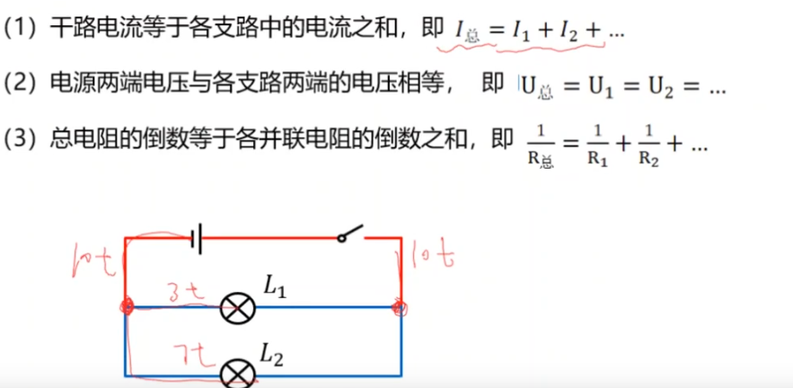

> 并联电路中，单个电阻增大会带来整体电阻变小， 因为是导数


## 电压表和电流表

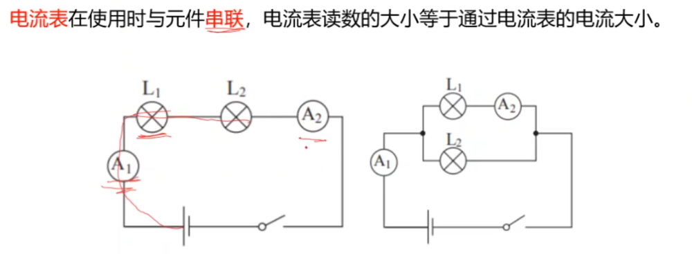


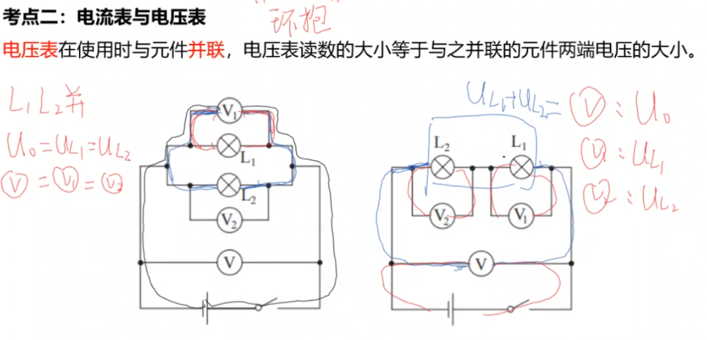

+  电流表导线 电压表断路  【易错点】

+ 串联：大阻分大压 ，小阻分小压  【易错点】
+ 电压表【环抱】 

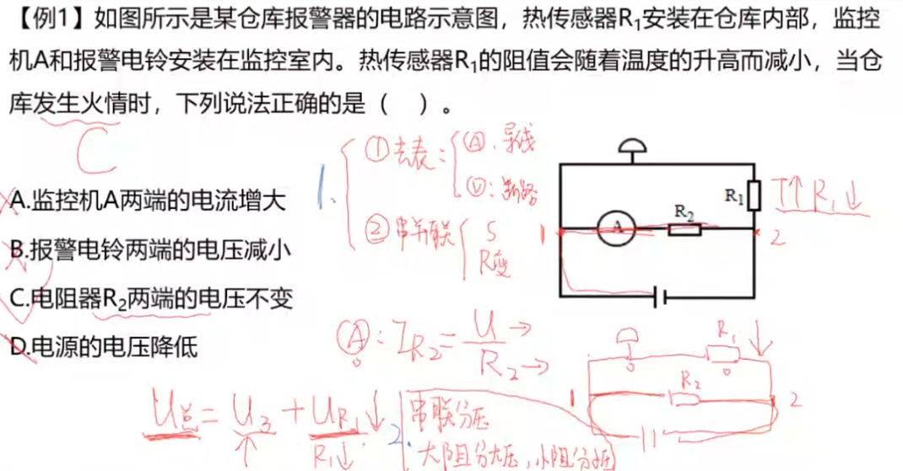


```
R2直接环抱电源 电压不变

```

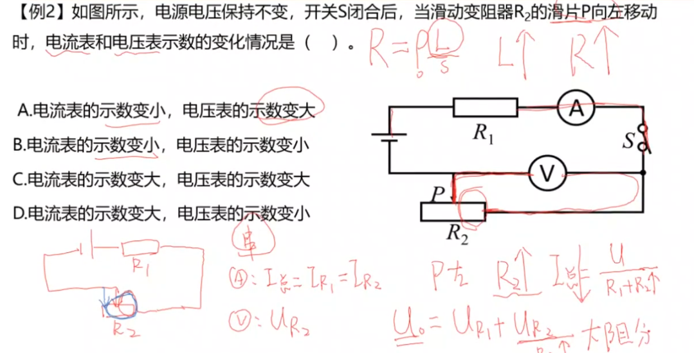


## 串反并同

https://mp.weixin.qq.com/s/JqxXLu8R2C-HesHgDVxjuw

“串反”是指【某一电阻增大】时，与它串联或间接串联的电阻中的电流、两端电压、电功率都将减小；某一电阻减小时，与它串联或间接串联的电阻中的电流、两端电压、电功率都将增大。

“并同”是指【某一电阻增大】时，与它并联或间接并联的电阻中的电流、两端电压、电功率都将增大；某一电阻减小时，与它并联或间接并联的电阻中的电流、两端电压、电功率都将减小。


+ 凡通过R变的电流有可能通过（不管是全部还是部分）导体RX，则RX与R变为串；凡通过R变的电流一定不通过RX，则RX与R变为并。


> 注意! 不是所有的都适用


# 化学


# 生物

## 生态系统

1. 定义:生态系统指在自然界的一定的空间内，生物与环境构成的统一整体，在这个统一整体中，生物与环境之间相互影响、相互制约，并在一定时期内处于**相对稳定的动态平衡状态**。

2. 组成部分:**非生物的物质和能量、生产者、消费者、分解者。**

   > **生态系统=生物和非生物** 【易错点】

3. **无机环境**是生态系统的非生物组成部分，包含阳光以及其它所有构成生态系统的基础物质:**水、无机盐、:空气、有机质、岩石**等。

4. 生产者：能够进行**光合作用**产生**有机物**的生物

   > 有机物：含碳
   >
   > 菟丝子是消费者

5. 分解者:又称“还原者”，以各种细菌(寄生的细菌属于消费者，腐生的细菌是分解者)和真菌为主，也包含屎壳郎、蚯蚓等腐生动物。

   > 释放到环境中原理:它们能把动植物残体中复杂的**有机物分解成简单的无机物**，供生产者再一次利用。

6. 消费者:指以动植物为食的生物。

7. **一个生态系统只需要生产者和分解者就可以维持运作**，数量众多的消费者在生态系统中起加快能量流动和物质循环的作用。

8. 地表的生态系统的能量**最终来源是太阳**，地层深处极少数微生物的来源是**地热能。**

```
下列不属于生态系统的是()
A.一个池塘
B.一块草地
C.生物圈
D.森林里所有的树 [只有生物]
```


+ 食物链 ： 生产者、消费者

1. 只**包含生产者、消费者** 【易错点】
2. 生产者开头、消费者结尾
3. 箭头指向“嘴里”
4. 总能量沿食物链减少
5. 有毒物质沿食物链增多
6. **种群数量一般沿食物链减少**

> 生物富集作用:有毒物质会随着食物链逐级积累营养等级越高的动物有毒物质积累越多。


```
食物链只有生产者和消费者
生态系统=生物+非生物
```


## 细胞


1. 细胞是生物体**基本的结构和功能单位**。

   **已知除病毒之外的所有生物均由细胞所组成，但病毒生命活动也必须在细胞中才能体现。**

   **病毒:蛋白质外壳和内部的遗传物质组成。**寄生在活细胞内，在寄主细胞内繁殖。病毒在体外存活时间不久，采用紫外灯照射、喷洒消毒液、高温消毒等方式都可以有效防范。按寄主不同，划分为植物病毒、动物病毒以及细菌病毒(噬菌体)。

+ 动物细胞

包括细胞膜、细胞核、细胞质。 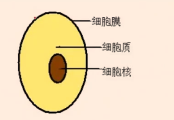

1. 细胞膜:是细胞表面的一层膜，主要作用是保护细胞和**控制物质进出细胞**
2. 细胞质:细胞膜以内，细胞核以外的黏稠透明的物质，细胞质内有线粒体，
3. **线粒体是细胞呼吸**的场所，主要作用是分解有机物，释放二氧化碳和水。
4. 细胞核:细胞核内储存大量的**遗传信息**。


+ 植物细胞

植物细胞的基本结构:包括**细胞壁**、细胞膜、细胞质和细胞核。
(1)**细胞壁**:主要功能是对细胞膜及其以内结构起**支持、保护**的作用。
(2)细胞膜:主要功能为控制物质的进出，接受、传递外界信号等。
(3)细胞质:细胞核以外液态的、可流动的物质。细胞质内有液泡、叶绿体和线粒体。
(4)液泡:在幼小的植物细胞内，液泡小而分散，在成熟植物细胞内，只有一个大的中央液泡。液泡的功能主要是**维持渗透压、储存营养物质**等。
(5)叶绿体:细胞质中的绿色小颗粒，是植物进行**光合作用**的场所。叶绿体含有叶绿素故含叶绿体的细胞大多呈绿色。
(6)细胞核:细胞核的功能主要是储存和**传递遗传信息**,

## 血型

+ 基因

1. 定义:带有遗传讯息的 **DNA 片段**称为基因，是控制生物性状的遗传物质的基本结构单位和功能单位。基因通过复制把遗传信息传递给下一代，使后代出现与亲代相似的性状。
2. 显性基因和隐性基因:
   **控制显性性状的基因，称显性基因**，通常用大写英文字母表示(如D)。控制隐性性状的基因，称隐性基因，通常用小写英文字母表示(如 d)。

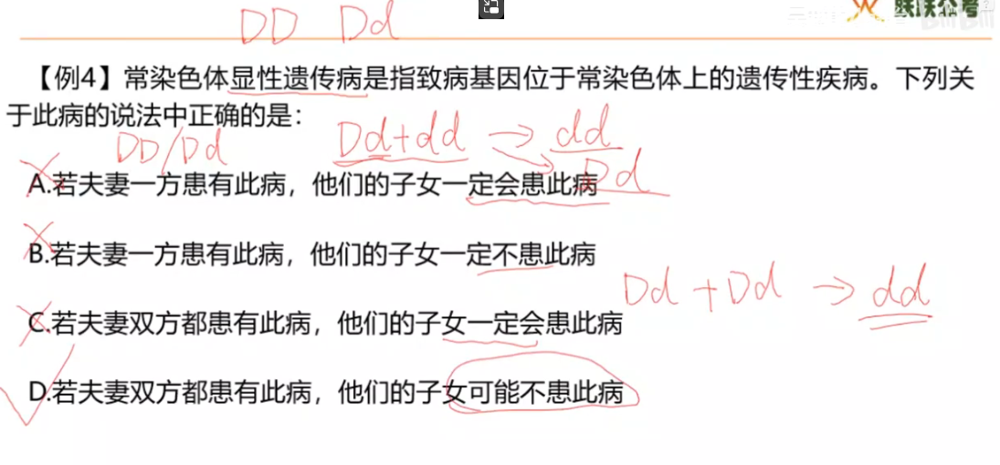

+ 男女染色体

**男性 Xy  女性 XX**

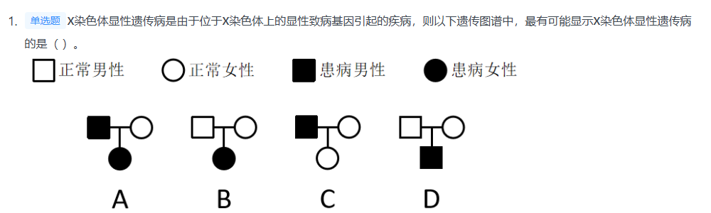

```
x染色体 显性

Xd Y   Xd Xd    XD y    [XD XD  XDXd]

直接A
```


+ 血型

1. 血型的区分:ABO 血型系统是根据**红细胞上A、B 凝集原**的不同将血型分为 O、A、B 及AB 血型。

   **注意:不同血型之间输血有凝血的风险**。

2. 


## 酶

1. 定义:酶是活细胞产生的具有**催化作用**的有机物(**绝大多数是蛋白质**)
2. 特性:酶具有**高效性、专一性**，作用条件比较温和。
3. 主要影响因素:**温度和pH**

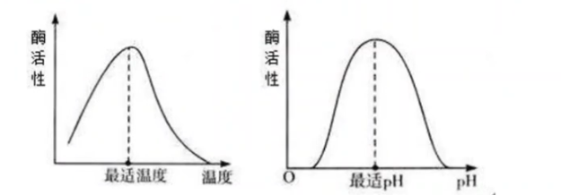

> 温度太高 和ph太高 会导致 酶失活

为了研究唾液对淀粉的消化作用，实验员往装有5ml淀粉液的试管1和试管2中分别加入2ml清水和2ml唾液，再将试管1和试管2同时放入的温水中水浴10分钟，冷却后往两支试管中滴入等量的碘液，则可以观察到（ ）。

- A两支试管的溶液均为蓝色
- B两支试管的溶液均为无色
- C试管1的溶液为无色，试管2的溶液为蓝色
- D试管1的溶液为蓝色，试管2的溶液为无色

```
唾液 里面有 唾液淀粉酶 会分解 淀粉
选D
```


## 光合作用和呼吸作用

> 光合产生有机物 呼吸消耗有机物
>
> 平时吃的水果，吃的就是有机物


### 光合作用

光合作用是指，绿色植物通过**叶绿体**，利用**太阳的光能**，把**二氧化碳和水**转化成储存着能量的**有机物(如淀粉)**并释放**氧气**的过程。

> 二氧化碳+水-光能--有机物+氧气


+ 影响因素

1. 光照强度：**达到一定强度，光合不在增加，但还是有光合作用**
2. **温度**: 植物在10℃~35℃条件下正常进行光合作用，35℃℃以上光合作用强度开始下降甚至停止。
3. **二氧化碳浓度**:二氧化碳是光合作用的原料，其浓度影响光合作用的强度。温室种植蔬可**适当提高**大棚内二氧化碳的浓度，以提高产量。


【例1】在有光的条件下，植物会吸收空气中的二氧化碳，并将其合成有机物储存起来关于植物合成并储存有机物的过程，以下说法不正确的是:
A.植物是通过光合作用储存有机物的
B.植物在储存有机物的过程中放出氧气
C.昼夜温差越小的地区植物储存有机物的速度越快
D.在温室大棚夜间将热空气放出有利于有机物的积累

```
A 对
B 对
C 这里注意 温差小代表呼吸作用强，消耗的有机物也快 选C
D 对
```


### 呼吸作用

**有机物**在细胞内经过**氧化分解**最终生成**二氧化碳**、**水或其他产物能量**的总过程，叫做呼吸作用。


+ 有氧呼吸

生物在有氧条件下，把有机物【**彻底**】氧化分解，产生水和二氧化碳，同时释放出**大量能量**的过程。

> 有机物+氧气→二氧化碳+水+能量

呼吸作用在农业生产上的应用
(1)农田松土:可以增加土壤中氧气的含量，呼吸作用旺盛。
(2)降低环境温度、减少氧气含量，可延长水果、蔬菜的储藏时间。

+ 无氧呼吸

生物在**无氧条件**下，把有机物分解成**不彻底**的氧化产物，同时释放出**少量能量**的过程。
(1)对于**高等植物和酵母菌**等生物，进行无氧呼吸一般产生**酒精**

> 有机物→酒精+少量能量

(2)对于**高等动物、高等植物的某些器官**(马铃薯块茎、甜菜块根、玉米胚等)细胞、乳酸菌进行无氧呼吸一般产生**乳酸**

> 有机物→乳酸+少量能量


【例5】呼吸作用的原理在生产中具有广泛的应用。下列相关叙述正确的是
A. 晒干后的种子在贮存时不进行细胞呼吸
B.稻田定期排水的主要目的是防止水稻根系因缺氧而变黑腐烂
C.可以采用低氧、零下低温和干燥的方法来保存水果
D.提倡慢跑的原因之一是体内不会因剧烈运动产生大量的酒精对细胞造成伤害

```
A 呼吸
B 对
C 零下低温都死了
产生乳酸 D 错
```

【例6】一颗种子在地下生根发芽，最终破土而出，长成一株小树苗。在这个过程中，其有机物总量()。
A.逐渐增加
B.先增加后减少
C.先减少后增加
D.先保持不变，后逐渐增加

```
先呼吸消耗有机物 在光合生长 C
```

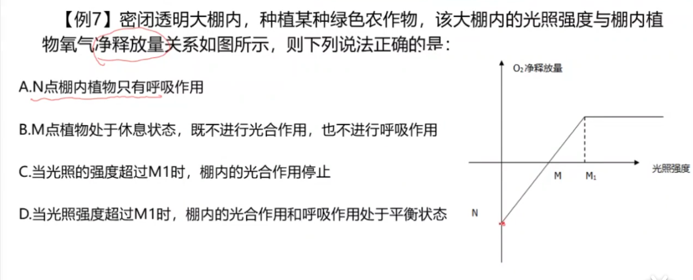

```
n 没有光照 只有呼吸对
M 光合 呼吸平衡
M1 光合不在增强 不是停止
超过M1  没有平衡  平衡市M
```


# 地理

## 地图

+ 维度

地球上某个点随**地球自转**产生的轨迹。从形状来看，是一个个**圆圈**，**纬线指示东西方向**。分**南北**

1. **赤道最长，往两极递减。**

2. 赤道往北叫北纬(N)，越往北纬度越大(0°~90°N)

3. 赤道往南叫南纬(S)，越往南纬度越大(0°~90°S)
4. 0-30 低 30-60 中 60-90 高


+ 经度

经线:**与纬线垂直，连接南北极的线**。经线也叫做子午线。经线指示南北方向,**是一个半圆弧**

经度:人为指定了一条0°经线，作为经度的起始线，称为本初子午线(通过英国格林威治天文台旧址)本初子午线以东为东经(E)(0°~180°)，以西为西经(W)(0°~180°)

+  东西半球划分


20W 160E  都是海

+ 地图

  上北下南 左西右东


## 自转和公转

### 自转

地球绕着一条**假想的线**在**自西向东**转动，这种运动叫做自转。**假想的线叫做地轴**。自转的周期是24小时。地轴与地球表面的**两个交点就是南北极**

产生： 昼夜交替、时差、地转偏向力

+ 昼夜交替

  这个没啥说的。。

+ 时差和时区

  360/24=15°一个时区

  

  

+ 地转偏向力

由于地球不停自转，导致地球表面运动的物体发生方向偏转，就好像受到了一个力一样这个力就称为地转偏向力。**(北半球的地转偏向力向右，南半球的向左)**

偏向力只改变**水平方向的速度方向**，不改变速度大小。

> 直接偏向赤道  就这么记就好了


### 公转

公转都是**斜着转**，斜着转就会有太阳**垂直照射**的问题

春分-夏至-秋分-东芝

**赤道-北回归线-赤道-南回归线**

+ 四季更替


**北半球与南半球季节相反**


+ 极昼极夜


其实也很好理解，夏至北回归线，北极是极昼......

> 注意地轴的方向！

+ 五带划分


热带：不管怎么转 赤道附近一直是太阳照射的到


### 北回归线补充

北回归线在我国自西向东穿过云南、广西、广东、台湾，从云南墨江、广西桂平、广东从化、汕头到台湾嘉义、花莲，共建立了多座北回归线标志塔。

**夏至时，太阳直射北回归线，此时太阳可以照到北回归线以南的城市房屋的北面**


## 地形地貌

### 等高线

特点：**(1)封闭曲线(2)同线等高(3)同图同距**


1. 判断坡度的陡与缓--**密陡 疏缓**
2. 山脊：等高线地形图中，等高线由**高处向低处弯曲**的地方。
3. 山谷：等高线地形图中，等高线由**低处向高**处弯曲的地方。
4. 鞍部：等高线地形图中，两个相邻的山岭之间**相对较低处。**
5. 陡崖：等高线地形图中，**等高线相交的地方**


### 地壳运动

在板块的边缘处，由于板块运动，它们相互之间可能存在碰撞挤压或张裂，形成各种地形地貌
**碰撞形成的典型地形:山脉**
**张裂形成的典型地形:海洋、裂谷**


## 气候

+ 等温线

地图上**温度相同**的各点的连线，称为等温线

> 密集 温差大
>
> 稀疏 温差小


+ 影响气温因素

1. 纬度:气温大致由**低纬度向高纬度递减**(五带分布)

2. 海拔高度:**气温随海拔升高而降低**。大致每升高100米，气温约下降0.6℃℃。

3. 海陆位置:**水域的温度变化比陆地更小**，因此靠近海洋、大型湖泊的地区显得冬暖夏凉。

   


```
D 雪线下移动
```


+ 降水

1. 海陆位置:距海近，降水多;距海远，降水少

2. 山脉走向:山脉走向对海洋水汽有阻挡作用和引导作用。

   **如果山脉走向与海洋水汽来向垂直，就会阻挡水汽的进入，使大陆内侧降水明显减少**

3. 地形:迎风坡、背风坡:迎风坡降水多，背风坡降水少。


+ 风

1. 风:风是指水平方向的大气运动。

2. 风向:指风吹来的方向。一般用八个基本方位来描述，

3. 风的形成:在气压差的作用下，**大气由高气压区向低气压区**作水平运动，形成了风。

4. 等压线: 把地图上气压相等的地点连接起来所成的封合曲线,

   在同一幅地图上，**等压线越密集，单位距离的气压差越大**，风速越大


> 风也是流体，收到地转偏向力的作用
>
> 北半球向右 选A   注意风向是从高到底，站在箭头 A才是对的

