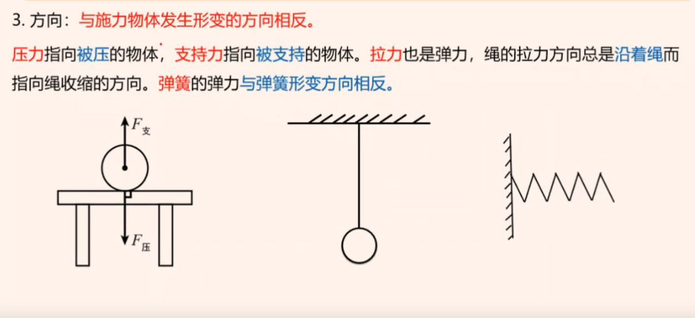

# Table of Contents

* [光](#光)
  * [光的直线传播](#光的直线传播)
  * [光的反射](#光的反射)
  * [平面镜成像](#平面镜成像)
  * [折射](#折射)
    * [例题](#例题)
  * [凸透镜 和 凹透镜](#凸透镜-和-凹透镜)
  * [光的色散](#光的色散)
* [声音](#声音)
  * [声音产生和传播](#声音产生和传播)
  * [声音特征](#声音特征)
  * [声音利用](#声音利用)
* [力](#力)
  * [重力](#重力)
  * [弹力](#弹力)
  * [压强](#压强)
    * [固体压强](#固体压强)
    * [液体压强 【常考】](#液体压强-常考)
    * [气体压强](#气体压强)
  * [浮力-常考](#浮力-常考)
    * [例题](#例题-1)
    * [易错点](#易错点)
  * [摩擦力](#摩擦力)


# 光


## 光的直线传播

1. **同种介质**，都是直线传播的


## 光的反射

1. 三线并列
2. 分居2侧
3. 2角相同
4. 法线**垂直**平面镜


## 平面镜成像

+ 物体关于镜面对称【左右颠倒 **上下还是一样**】
+ 平面镜是**虚像**【不能在光屏上呈现】


右边的蜡烛是【平面镜的像】


## 折射

1. 光从空气**斜射**入【水中或者其他介质】，折射光线向法线**偏折** 【空气角度大，水和玻璃小】

2. 入射角**大**，折射角大 
3. 光从一种介质**垂直**一种介质，传播方向不变
4. 光路是**可逆的**


### 例题


```
这题有点要注意，谁看谁，【1.光线从被看得人发射出来 2.人眼睛看的就是直线】

岸高 水浅
```


## 凸透镜 和 凹透镜

1. 中间厚 2边薄 凸透镜 
2. 中间薄 2边厚 凹透镜 
3. 凸透镜 汇集 凹透镜 发散


## 光的色散

如一细束**白色**阳光可被棱镜分为红、橙、[黄](https://baike.baidu.com/item/黄/0?fromModule=lemma_inlink)、[绿](https://baike.baidu.com/item/绿/0?fromModule=lemma_inlink)、[蓝](https://baike.baidu.com/item/蓝/0?fromModule=lemma_inlink)、[靛](https://baike.baidu.com/item/靛/0?fromModule=lemma_inlink)、[紫](https://baike.baidu.com/item/紫/0?fromModule=lemma_inlink)七色光。这是由于[复色光](https://baike.baidu.com/item/复色光/0?fromModule=lemma_inlink)中的各种色光的[折射率](https://baike.baidu.com/item/折射率/0?fromModule=lemma_inlink)不相同


**红光偏折最小，紫光偏折最大** 【这个偏折长度是相对原来直线传播的】

+ 偏折 小大
+ 频率 下大
+ 波长 大小


# 声音

## 声音产生和传播

+ 产生:声音是由**物体的振动**产生的。

+ 传播:声音的传播需要**介质**;传声的介质既可以是气体、固体，也可以是液体，**真空不能传声**
+ 声速:声音在不同的介质中传播的快慢不同。声音的传播还会受温度的影响一般情况下，气体的声速小于液体和固体中的速度。15℃时空气中的声速是340m/s.

> 固 液 气


## 声音特征

+ 音调：频率
+ 响度： 幅度
+ 音色：特色 材料不同


## 声音利用

传递信息 传递能量


# 力

F  N

+ 力的三要素

1. 大小：线段长度
2. 方向：箭头方向
3. 作用点：一般在重心或者接触

## 重力

+ G=mg    【只跟质量相关】
+ 竖直向下
+ 作用点：物体的中心

注意

+ 重心一般在几何中心
+ 有可能在物体上有可能在物体外
+ **重心越低越稳**


## 弹力

1. 物体由于发生**弹性形变**而产生的力。

如:放在桌面上的水杯受到桌面对它的支持力，桌面受到水杯的压力。绳子拉物体绳子对物体的拉力。我们常说的**压力、支持力、拉力就是弹力。**

2. 产生的条件:**相互接触的两个物体互相挤压。**

3. 方向:**与施力物体发生形变的方向相反**,

   **压力**指向**被压得物**体，**支持力**指向**被支持的物体**。**拉力**也是弹力，绳的拉力方向总是沿着绳而压力指向被压的物体，指向绳收缩的方向。**弹簧的弹力与弹簧形变方向相反**



4. 弹力方向判断

   弹力方向**垂直与面**

5. 弹力大小：弹力的大小跟形变的大小有关系，**在弹性范围内，形变越大，弹力越大**。弹簧的弹力**F = k x(K为弹性系数，  x为弹簧的形变量)**

## 压强

### 固体压强

1. 物体所受的压力的大小与受力面积之比叫做压强，用来比较压力的作用效果。
2. 如果用**p表示压强、F表示压力、S表示物体的受力面积，那么有p=F/S**，压强单位为帕斯卡简称帕，符号Pa


### 液体压强 【常考】

液体压强产生原理:**液体的重力及液体具有流动性**

1. 深度为h处液体的压强为**p=pgh**  【p液体密度  h 液体深度】
2. 液体内部压强的大小与深度h和液体的密度p有关,
3. 在液体内部的同一深度，向各个方向的压强大小都相等。


**【m=PV】 质量=密度*体积   【易忘点】**


+ 连通器：液面高度相同.
+ **伯努利原理**：等高流动时，流速越大，压强越小

### 气体压强

理想气体状态方程:pV =nRT，其中p为气体压强，v为气体体积，、R为常数，T为温度


## 浮力-常考

1. 浸在液体中的物体受到**竖直向上**的浮力，**浮力的大小等于它排开的液体所受的重力。这就是著名的阿基米德原理**。

2. 浮力的方向:总是竖直向上

3. 公式: F浮 =G排 = P液gV排

   ```
   G排=MG=密度*体积*G
   【这里得体积就是水下得体积】
   ```

4. 浮力产生的原因:物体上下表面由于处于液体(或气体)的深度不同，受到液体(或气体)的压力也不等，**下表面受到的向上的压力【大于】上表面受到的向下的压力**，这两个压力之差形成了浮力。

   > 有上下的压强差才会有浮力

5. 几个条件下 重力和浮力得关系

   

6. 


### 例题


```
质量相同都是漂浮说明F浮=G
1.ρ甲>ρ乙
2.F浮=P*S s一定 p一定
3.液体压强=ρgh   ρ甲大 h一定 选C
```


### 易错点

+ 浮力就是等于=ρgv  跟其他无关
+ 漂浮和悬浮  F浮=G

## 摩擦力

1. 定义:两个互相接触的物体，在接触面上产生**阻碍其相对运动(或相对运动趋势)**的力叫做摩擦力，一般用f表示。

2. 条件 【重要】

   1. 物体接触之间存在**压力**
   2. 接触面**不光滑**
   3. 接触物体之间有相对**运动或相对运动趋势**

3. 方向

   沿接触面切线方向，**与物体相对运动或相对运动趋势的方向相反**

   

4. 作用点:**接触面**

   
