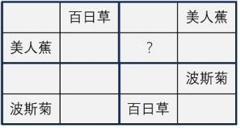

 

# 直言命题和三段论 

1、开学初，中国劳动关系学院发现有新生未到网络中心办理注册手续。

如果上述断定是真的，则以下哪项不能确定真假（ ）   

（1）该学院所有新生都未到网络中心办理注册手续。

（2）该学院所有亲自都到网络中心办理了注册手续。

（3）该学院有的新生到网络中心办理了注册手续。

（4）该学院的新生王伟到网络中心办理了注册手续。

A．1．2．3和4    B．1．3和4   C．1和3    D．1和4    

 

题干翻译：有的新生未到网络中心办理注册手续
矛盾 所有是

 2可以确定为假 排除A
134推不出选B

 

2、[卡塔尔](https://zhida.zhihu.com/search?q=卡塔尔)世界杯期间，有球迷对比赛结果进行了下述预测：

　　甲：冠军是欧洲国家

　　乙：法国是冠军

　　丙：冠军是南美洲国家

　　丁：阿根廷不会进四强

假设上述预测中只有一句为假，可以得出以下哪项?

A．甲说了假话

B．冠军不是法国

C．冠军不是南美国家 

D．阿根廷会进四强

甲丙矛盾 

法国是冠军  甲说了真话  阿根廷不会进四强

选C

 

3、所有商品都有商标。已知上述断定为假，下列不能确定真假的是：

Ⅰ 并非有的商品有商标

Ⅱ 有些商品没有商标

Ⅲ 所有商品都没有商标，这不可能

A． Ⅰ、Ⅱ           B． Ⅰ、Ⅲ

C． Ⅱ、Ⅲ          D． Ⅰ、Ⅱ、Ⅲ

不能确定真假 

题干翻译：有的商品没有商标 为真  2对

选B

 

4、桌子上有4个箱子，每个箱子上写着一句话：

第一个杯子：“所有的箱子中都有伊丽莎白的照片。”

第二个杯子：“本箱子中有沙拉•布莱曼的唱片。”

第三个杯子：“本箱子中没有多明戈的签名CD。”

第四个杯子：“有些箱子中没有伊丽莎白的照片。”

如果其中只有一句真话，那么以下哪项为真（　　）。

A.所有的箱子中都有伊丽莎白的照片   

B.所有的箱子中都没有伊丽莎白的照片  

C.所有的箱子中都没有沙拉•布莱曼的唱片

D.第三个箱子中有多明戈的签名CD
所有是  有些非 14矛盾  其他为假  选D

 

5、期末考试过后，四位老师对六年级（1）班的英语课成绩有如下结论：         
甲：所有学生没有及格的。                            
乙：英语课代表王萌萌没有及格。                         
丙：学生并不是都没有及格。                           
丁：有的学生没有及格。                             
如果四位老师中只有一人断定属实，那么判断属实的是（）   

A．甲      B．乙     C．丙      D．无法判断

 

所有非 有的是 甲丙矛盾  乙丁假话

 王及格 所有学生都及格 

丙对 选C

 

6、某家有爸爸妈妈，哥哥和妹妹四口人。一天家里突然出现了一份为奶奶准备的神秘生日礼物，对于生日礼物是谁准备的四人有如下说法。 
爸爸说：我们四人都没准备。
妈妈说：不是我准备的。
哥哥说：妈妈和妹妹至少有一人没准备。
妹妹说：这是我们四人中有人准备的。
已知四人中有两人说的真话，两人说的是假话。由此可以推出：

A．爸爸和妈妈说的是真话

B．爸爸和妹妹说的是真话

C．哥哥和妈妈说的是真话

D．哥哥和妹妹说的是真话

 

所有非 有些是 爸爸妹妹矛盾  妈妈哥哥矛盾  
妈妈哥哥 一真前假，妈妈假话，哥哥真话。爸爸假话。选D

7、国王要为自己的女儿挑选一个最聪明勇敢的女婿，他向所有的求婚者宣称他已经把公主和两只狮子分别关进了三间房子，然后在三间房子门上分别写了一句话，让求婚者们去打开自己认为可以打开的门。
第一间房上写着：“这间房子里有狮子。
”第二间房门上写着：“公主在第一间房子里。
”第三间房门上写着：“这间房子里有狮子。
”其实这三句话中，只有一句话是真的。

据此可以推断：（  ）  

A．公主在第一间房子里					B．公主在第二间房子里

C．公主在第三间房子里					D．三间房子里关的都是狮子

 

12矛盾 3假 选C

 

8、某慈善组织号召企业向受暴雨袭击的某地区捐赠帐篷。某地区为表谢意向该组织询问是哪些企业进行了捐赠。经调查，了解到以下情况：(1)四家企业都没有捐赠；(2)丁企业没有捐赠；(3)乙企业和丁企业至少有一家企业没有捐赠；(4)四家企业中确有企业捐赠。后来得知上述四种情况两种为真，两种为假。

由此可以推出：

A．甲企业没有进行捐赠

B．乙企业进行了捐赠

C．丙企业没有进行捐赠

D．丁企业进行了捐赠

 

所有非 有些是  14 23 矛盾

23 一真前假 2假 选D

 

 

9、甲乙丙丁四名学生在讨论四瓶溶液的酸碱度。

甲说：所有溶液都是酸性的                       
乙说：红瓶中的溶液是碱性的                      
丙说：有些溶液不是酸性的                       
丁说：蓝瓶中的溶液是酸性的。                      
测试结果表明：甲乙丙丁四人只有一个人的说法是正确的，由此可以推出?（　　）。

A．甲的说法正确，红瓶中的溶液是酸性的	              
B．丙的说法正确，蓝瓶中的溶液不是酸性的               
C．乙的说法正确，红瓶中的溶液不是碱性的	               
D．丁的说法正确，蓝瓶中的溶液是碱性的

所有是 有些非 甲丙一真一假  乙丁假  排除CD 

A错 选B

 

 

10、三个人A．B．C打扮得一模一样，排成一排。A从不说假话，B从不说真话，C既说真话也说假话。                                 
测试者问第一个人：“你是谁？”回答是“我是C”。                  
测试者问第二个人：“第一个人是谁？”回答是“他是B”。               
测试者问第三个人：“第一个人是谁？”回答是“他是A”。                 
根据这些回答，以下哪项为真？                          
A．第一个人是A，第二个人是B，第三个人是C                  

 B．第一个人是A，第二个人是C，第三个人是B                    
C．第一个人是B，第二个人是A，第三个人是C                  
D．第一个人是C，第二个人是A，第三个人是B

 

23矛盾 

假设第一个人是A 不符合 排除AB

分析cd  第二个人是Ａ　那第三个人是Ｃ　　C既说真话也说假话

选Ｃ

 

11、某校管理学院会计班有38名学生，关于这38名学生，甲乙丙三人有如下讨论：                                 甲说：“有些同学是河北人。”                         
乙说：“葛强不是河北人。”                       
丙说：“有些同学不是河北人。”                       
事实上，甲乙丙三人的话只有一句为真，以下哪个选项为真（ ）？                  A．38个同学都不是河北人                        
B．有些同学不是河北人                         
C．葛强不是河北人                           
D．38个同学都是河北人
有些有些至少一真　　乙为假　　甲真　丙假　选Ｄ

 

12、某些公务员是行政管理专业的。因此，某些行政管理专业的人做管理工作。上述推理如果成立．必须补充以下哪项作为前提?

A．所有公务员都做管理工作

B．某些公务员不是做管理工作的

C．某些行政管理专业的人不是公务员

D．所有行政管理专业的人都是公务员

 

 

中项周延　公务员　　+ 管理 直接秒A

 

13、品学兼优的学生不都读研究生。如果以上论述为真，则下列命题能判断真假的有几个?                               Ⅰ．有些品学兼优的学生读研究生 

Ⅱ．有些品学兼优的学生不读研究生 

Ⅲ．所有品学兼优的学生都读研究生 

Ⅳ．所有品学兼优的学生都不读研究生

A． 1个

B． 2个

C． 3个

D． 4个

品学兼优的学生不都读研究生　矛盾命题  有些品学兼优的学生不读研究生

有些非　所有是　　Ⅳ　为假　　　Ⅱ　为真　选Ｂ

 

 

14、在2017年大众电影百花奖评选中中，我国演员中有人入围了最佳男主角

已知上述命题为真，则下列不能确定真假的是(   ) 

①所有演员都入围了最佳男主角

②李易峰入围了最佳男主角

③我国演员中有人没入围最佳男主角

④我国演员中没有人入围最佳男主角

A．①②③④

B．①②③

C．②③④

D．只有④

题干翻译：有的演员是最佳男主角

所有非　４假　　排除４的　选Ｂ

 

15、一起诈骗案经过侦查将目标锁定在赵．李二人身上，赵．李二人都可能是诈骗犯或目击者。已经诈骗犯只说假话，而目击者则只说真话，审讯人员问赵：“你们两人中肯定有一个目击者？”赵回答：“没有。”则赵和李分别是（ ）                

A．赵是目击者，李是诈骗犯       B．赵和李都是目击者            C．赵是诈骗犯，李是目击者       D．赵和李都是诈骗犯。

 

目击者回答：有

诈骗犯说：没有　

赵是诈骗　选Ｃ

 

16、某研究所的员工构成情况是：所有的工程师都是男性，并非所有工程师都是研究生，并非所有研究生都是男性。由此可以推出：

A．有的男性不是工程师

B．有的男研究生是工程师

C．有的研究生是男性

D．有的男性不是研究生

先翻译题干

并非所有工程师都是研究生＝有的工程师不是研究生

并非所有研究生都是男性＝有的研究生不是男性　　
工程师 周延 选A

17、某单位准备举办一年一度的春季运动会，甲科室的所有成员都参加了50米或者100米的短跑项目，该科室的一些年轻成员还参加了一万米的长跑项目，有人推论，该单位里一些参加短跑项目的成员是长期长跑锻炼者。 以下哪项是上述推论正确的前提条件?（  ）

A．所有甲科室没有参加一万米长跑项目的成员都不是长期长跑锻炼者

B．一些甲科室没有参加一万米长跑项目的成员不是长期长跑锻炼者

C．一些参加了一万米长跑项目的成员是长期长跑锻炼者

D． 所有参加了一万米长跑项目的成员都是长期长跑锻炼者

 

中项：一万米的长跑项目　选Ｄ

 

18、所有犯罪行为都会受到刑法制裁，有的违法行为是犯罪行为，黄涛的行为是违法行为。

如果上述断定为真，则以下哪项必定为真？

A．有的违法行为会受到刑法制裁

B．黄涛的行为是犯罪行为

C．黄涛的行为会受到刑法制裁

D．所有受到刑法制裁的行为都是犯罪行为


中项：犯罪行为　选Ａ

 

19、所有来自澳大利亚的留学生，都住在东区留学生公寓【１】，所有住在东区留学生公寓内的学生，都必须参加今年的国际交流会【２】；有些来自澳大利亚的留学生加入了汉语俱乐部；有些土木工程专业的学生也加入了汉语俱乐部；所有土木工程专业的学生都没有参加今年的国际交流会。

 由此不能推出以下哪项结论

A．所有澳大利亚留学生都参加了今年的国际交流会

B．没有一个土木工程专业的学生住在东区留学生公寓

C．有些澳大利亚留学生是学土木工程专业的

D．有些汉语俱乐部成员没有参加今年的国际交流会

 

选Ｄ　　　
有些来自澳大利亚的留学生加入了汉语俱乐部　＝　有些汉语俱乐部成员是澳大利亚的留学生
结合　１２　可以推出　有些汉语俱乐部成员参加了今年的国际交流会　

复习做法
国际交流会为否，A错 B题干都为肯定 b错 

C 没有周延，无法推出  直接选D

 

20、所有的五星级志愿者都受到表彰，有的教师是五星级志愿者，于老师是教师。若以上陈述为真，则以下哪项也一定为真?

A．于老师是五星级志愿者

B．于老师受到表彰

C．有的教师受到表彰

D．所有受到表彰的都是五星级志愿者

 

五星级志愿者　中项　　选Ｃ

 

21、某外贸公司中有许多懂英语的人不懂法语【１】，但是所有懂法语的都懂英语【２】，由此，不能推出该公司中：

A．有些懂英语的人也懂法语

B．有些懂法语的人不懂英语

C．没有一个懂法语的人不懂英语

D．有些不懂法语的人懂英语

 

Ｂ　１推出
Ｃ　是２的非标

Ｄ　是　１的换位　
选　Ａ

 

 

‍‍22、某中学甲班学生中，所有喜欢奥数的同学也都喜欢下围棋。若以上陈述为真，再加上以下哪项，则可以合乎逻辑地推出：有些喜欢看话剧的同学不喜欢奥数‍‍

A．有些喜欢看话剧的同学也喜欢下围棋

B．有些喜欢奥数的同学不喜欢看话剧

C．有些不喜欢下围棋的同学喜欢看话剧

D．有些不喜欢看话剧的同学喜欢下围棋

 

中项不会出现结论　排除Ｂ　　话剧和围棋
一否得否 排除A

围棋是中项　选Ｃ

 

23、某学院共有42名员工，他们或者做教学科研工作，或者做行政工作。在该学院中，教授都不担任行政工作，而30岁以下的年轻博士都在做行政工作，学院中有不少人是从海外招聘来的，他们都具有博士学位，李明是该学院最年轻的教授，他只有29岁。 根据以上陈述，可以得出以下哪项？

A．该学院从海外招聘来的博士大多是教授

B．该学院从海外招聘来的博士都不做行政工作

C．该学院教授大多是30岁以上的海外博士

D．该学院有的教授不是从海外招聘来的

 

教授和博士 通过中项进行转换，一否得否 排除AC

教授都不做行政工作 排除B 

选D

 

24、某单位购买了一批影像资料，有科幻片、故事片、战争片等；有国内的、欧美的、印度的；有中文的，也有英文原版的。其中，所有的科幻片都不是英文原版的，所有的故事片都是英文原版的，所有的故事片都是印度的。战争片既有印度的，也有欧美的；既有中文的，也有英文原版的。

根据以上陈述，关于这批影像资料可以得出项。

A．有些印度片不是科幻片

B．有些战争片也是故事片

C．有些科幻片不是欧美的

D．有些故事片是中文的

 

所有的科幻片都不是英文原版的【1】，所有的故事片都是英文原版的【2】，所有的故事片都是印度的【3】

直接根据周延 排除BD  故事周延

23 有些印度是英文原版本

结合1 中项 英文原版 一否得否  有些印度片不是科幻片 选A

 


# 复言命题

 

1、王颖：感情是婚姻的基础。

  剑锐：我不同意，    

以下哪项能够很好地将剑锐的话补充完整？

A．结婚了，但没有感情。

B．没结婚，也没有感情。

C．没结婚，但有感情。

D．结婚了，并且有感情。

 ```
婚姻->感情 等价 -婚姻 或 感情 矛盾 婚姻 且 -感情

选A 
 ```

2．某次体操比赛之前，有甲．乙．丙．丁四人预测红队．黄队．绿队．蓝队的出场顺序，四人的预测如下：

甲说：只有黄队第二个出场，红队才第一个出场。

乙说：如果红队第三个出场，那么蓝队第四个出场。

丙说：蓝队不是第四个出场。

丁说：黄队第二个出场。

比赛结束后，发现四人中只有一人预测为真，那么绿队是第几个出场?

A．第一个

B．第二个

C．第三个

D．第四个

```
-红1 或 黄2
-红3  或 蓝4  矛盾命题  红3且 -蓝4
-蓝四
黄2

23 矛盾  14为假

 红1  黄不是2，可能是34  蓝是4 绿是2 
----------------
复言命题中，最喜欢考包含了 
 -红1 或 黄2    黄2 是包含关系  一真前假   黄2是假
 ---------------------
 绿队没出现，且第二个比较特殊
```


3、某饭店对配菜有如下要求：

(1)只要配豆腐，就要配肉饼；

(2)只有配鱿鱼，才要配黄瓜；

(3)红烧肉和红烧鱼不能同时都配；

(4)如果不配豆腐也不配黄瓜，那么一定要配红烧肉。

如果某次配菜里有红烧鱼，那么关于该次配菜的断定一定为真的是

A．配有豆腐或者肉饼

B．配有肉饼或者鱿鱼

C．配有鱿鱼或者黄瓜

D．配有豆腐或者黄瓜

 ```
-豆腐 或 肉

-黄瓜 或 鱿鱼

要么红烧肉，要么红烧鱼

(豆腐且黄瓜)  或 红烧肉
有红烧鱼，那就没有红烧肉，有豆腐或 黄瓜
 选D
 ```

4、当小张．小李．小王和小贾在公园里打棒球时，田老师家的玻璃恰好被人打破了，田老师怀疑这与他们有关．于是分别找他们询问，四人的回答如下：小张说：“您家的玻璃不是我们打破的，和我们压根无关。” 小王说：“小李和小贾中，至少有一个肯定是无辜的。” 小李说：“我只能告诉您．打破您家玻璃的人肯定在我们之中。” 小贾说：“田老师，您千万要相信我啊，真的不是我打破的。” 如果四个人中．有两个人说的是假话，两个人说的是真话，可以推出：

A．说真话的是小张和小王

B．说真话的是小贾和小张

C．说真话的是小李和小王

D．说真话的是小贾和小李

```
小张小李矛盾 

小王 小贾一真一假 一真前假，小贾说假话，是他打破 排除BD
小张假话 选C
```

 

5、吴老师、张老师、孙老师、苏老师都是某校教师，每位只教授语文、生物、物理、化学中的一门课程。

已知：

①如果吴老师教语文，那么张老师不教生物

②或者孙老师教语文，或者吴老师教语文

③如果张老师不教生物，那么苏老师也不教物理

④或者吴老师不教化学，或者苏老师教物理

下列哪项如果为真，可以推出孙老师教语文：

A．吴老师教语文

B．张老师不教生物

C．吴老师教化学

D．苏老师不教物理

```
先翻译题干

-吴语  或  -张生

孙语  或  吴语

张生 或  -苏物

-吴化 或  苏语文


孙老师教语文,吴老师不教语文、张生物 苏物理 选C

 
```


6、某单位聘了甲．乙．丙．丁．成 5 名新员工，每位员工被分配到不同的 部门，并且满足以下条件： (1) 如果甲去销售部，那么乙不去设计部； (2) 或者丙去生产部，或者甲去销售部； (3) 或者丁去后勤部，或者成不去财务部； (4) 如果乙不去设计部，那么丁也不去后勤部。 以下哪项为真，可以推出“丙去生产部”?

A．戊去财务部

B．甲去销售部

C．乙不去设计部

D．丁不去后勤部

```
-甲销  或 -乙设

丙生  或  甲销

丁后  或 -戊财

乙设 或  -丁后

丙去生  -甲销  乙设 丁后 选A
```


 

【错题】7、甲乙丙三人择偶标准： 甲：只要他有钱，就嫁给他。乙：只有他有钱，才嫁给他。丙：只要他人好，就嫁给他。若一男没钱但人好，则一定不愿意嫁给他的人是：

A．甲       B．乙       C．丙     D．甲和乙

 ```
-有钱 或 嫁

-嫁  或 有钱

人 或 嫁 

没钱  不嫁 只有2了 ，否后必否前 。也就是乙

 ```

【错题】8、人民是创作的源头活水，只有扎根人民创作才能取得取之不尽。用之不竭的源泉。文化文艺工作者要走进实践深处、观照人民生活、表达人民心声，用心用情用功抒写人民、描绘人民、歌唱人民。哲学社会科学工作者要多到实地调查研究，了解百姓生活状况，把握群众思想脉搏，着眼群众需要解疑释惑、阐明道理。把学问写进群众心坎儿里。由此可以推出( )

A．文化文艺工作者只有走进实践深处才能观照人民生活。

B．如果不扎根人民、创作就不能获得取之不尽、用之不竭的源泉。

C．哲学社会科学工作者只有到实地调查研究才能了解百姓生活状况，把握群众思想脉搏

D．如果哲学社会科学工作者没有着眼群众需要解疑释惑、阐明道理。就说明他们没有进行实地调查研究。 

```
d直接逆否 
```

9、要是不学习二胡演奏，徐平就做不了民乐理论研究。如果他喜欢民族乐器，那么他会选择学习二胡演奏作为专业。如果他不喜欢民族乐器，他就会做民乐理论研究。 由此可推出徐平将（）。

A．研究民乐理论            B．学习二胡演奏      

C．不学二胡演奏            D．不研究民乐理论

```
学习二胡演奏 或 不民乐理论研究
不民族乐器 或 学习二胡演奏
喜欢民族乐器 或 民乐理论研究

正负抵消

选B
```

10、只要引进知名教练并投入充足的运营费用，就能够使一个俱乐部的球队在联赛的排名显著提升。只有对现行的买卖球员制度和奖金分配制度进行改革，才能引进到知名教练并获得充足的运营经费。某俱乐部经过几年的建设，其球队在联赛的排名并未得到显著提升。 上述断定如果为真，可以推出下列哪项为真?()

A．过去几年，该俱乐部由于招商不利，未能获得充足的运营经费

B．过去几年，该俱乐部更换了多名教练，没有一位是知名教练

C．过去几年，该俱乐部可能没有引进到知名教练，也可能没有获得充足的运营经费

D．过去几年，该俱乐部继续沿用了原来的买卖球员制度和奖金分配制度

 ```
逆否命题倒推
排名并未得到显著提 ->C
 ```

 

11、班主任说：并非张三和李四都考不上清华大学。下列选项最为准确地表达了班主任意思的是（ ）

A．张三和李四至少有一个能考上清华

B．张三和李四至多有一个能考上清华

C．张三和李四都考不上清华大学

D．张三和李四都能考上清华大学

 ```
-(张且李)  张或李  选A
 ```

12、某公司要提拔部门经理。总经理说：“在小王和小孙中至少提拔一人。”董事长说：“我不同意。”

据此，下列哪项判断最为准确地表达了董事长实际同意的意思?(   )

A ．小王、小孙都提拔

B．小王、小孙都不提拔

C．不提拔小王、就提拔小孙

D．要么提拔小王、要么提拔小孙

```
王或孙  -王 且 -孙 选B 
```

13、即将毕业时，某班要评选优秀毕业生，班级内部进行讨论中。班长：要么李雪被评为优秀毕业生，要么王磊被评为优秀毕业生。团支书：我不同意。以下哪项准确表达了团支书的意见？

A．李雪和王磊都被评为优秀毕业生

B．李雪和王磊都不能评为优秀毕业生

C．要么李雪和王磊都被评为优秀毕业生，要么李雪和王磊都不能评为优秀毕业生

D．李雪被评为优秀毕业生，王磊不能评为优秀毕业生

```
都选 都不选 选C
```

14、张老师和李老师是某高校管理学院的教师，该学院的所有教职工都是运动爱好者。他们或喜欢游泳，或者喜欢跑步；张老师喜欢游泳，李老师不喜欢跑步。如果上述论述为真，下列哪项必然为真?

Ⅰ．李老师喜欢游泳。

Ⅱ．张老师不喜欢跑步。

Ⅲ．管理学院的教职工不喜欢游泳的人喜欢跑步。

Ⅳ．管理学院的教职工一半喜欢游泳，一半喜欢跑步。

A．仅I

B．仪I．Ⅱ

C．仅I． Ⅲ

D．仅Ⅱ．Ⅲ．Ⅳ

 

```
游泳 或 跑步 

-李跑 -> 李游泳  1对 3对 2不确定 选C

```


15、在一次运动会中，对四百米接力赛的人员选拔有如下要求∶

（1）或者选拔肖光或者选拔李航。

（2）如果选拔肖光，则不能选拔郑林。

（3）只有选拔郑林，才能选择黄青。

（4）李航和黄青只能选拔一人。

由此可见，下列哪项正确体现了这次运动员选拔方案?

A．不选拔肖光，选拔黄青

B．不选拔李航，选拔郑林

C．不选拔黄青，选拔李航

D．不选拔郑林，选拔黄青

```
肖 或 李

-肖 或 -郑

-黄 或 郑

要么李 要么黄 [不参与抵消，自身会约掉]

选 李  选C 
```


16、小刘是某大学计算机科学专业的大四学生。

小张说：如果小刘喜欢离散数学，那么他会报考计算机科学专业的研究生。

小王说：如果小刘不喜欢离散数学，那么他会成为算法程序员。

小赵说：如果小刘不报考计算机科学专业的研究生，那么他不能成为算法程序员

如果小张、小王、小赵的论断均为真，那么以下哪项一定为真?

A．小刘报考了计算机科学专业的研究生

B．小刘没有报考计算机科学专业的研究生

C．小刘喜欢离散数学

D．小刘不喜欢离散数学

 ```
-离 或 研

离  或 算法
研 或 - 算法
研究生 选A
 ```


16、要使中国足球走出亚洲，关键是要有科学的精神。如果没有科学的精神，物质激励再多，也不可能在世界强队面前有好的突破。

请指出下面选项中与上面划线部分含义不等值的命题?

A．只有发扬科学精神，才能取得好的突破

B．除非有科学的精神，否则他不能取得好的突破

C．只要有了科学的精神，就能有好的突破

D．如果取得了好的突破，一定树立了科学的精神

 ```
科学->走出
不科学且物质 -> 不突破

选C
 ```


18、小赵、小李、小周、小孙、小钱五人一起参与“谁是卧底”的游戏。已知五人中有两人是卧底，且存在以下情

况：

①小赵、小李两人中至少有一人是卧底

②如果小李是卧底，小周一定是卧底

③只有在小孙是卧底时，小钱才是卧底

④如果小钱不是卧底，那么小赵也不是卧底

⑤小孙不是卧底

则卧底是：

A．小赵和小钱   B．小钱和小李   C．小李和小周   D．小赵和小周

 ```
赵或李

-李 或 周

-钱 或 孙

钱 或 -赵 

-孙

周是 那李也是 选C
 ```

19、某学院今年继续执行出国资助计划，拟从刘老师、张老师、王老师、马老师、牛老师、周老师6位教师中选派几位出国访学。由于受到资助经费．学院学科发展需要．课程安排．各人访学地和访学时间等诸多因素限制，选拔时要符合如下条件：

（1）刘老师是学院的后备学科带头人，此次必须得派出去。

（2）如果选刘老师，那么周老师也要选，但不能选张老师。

（3）只有牛老师选不上，王老师和马老师中才至少有1人能选上。

（4）如果不选王老师，那么也不选周老师。

若以上陈述为真，下面哪项一定为真？

A．牛老师没选上，周老师选上了

B．刘老师选上了，马老师没选上

C．王老师和马老师都选上了

D．王老师和牛老师都没选上

 ```
刘去 
周去 -张 
根据4逆否  王去  排除CD

根据 3 马老师在前面，不能推出  选A
 ```

20、课间休息时，一位同学帮老师擦了黑板，老师回到教室后询问是谁擦的黑板。他问了四位同学，得到以下回答：

（1）或者班长擦了，或者学习委员擦了；

（2）如果纪律委员没擦，那么班长也没擦；

（3）如果卫生委员没擦，那么班长擦了；

（4）班长和学习委员都没擦。

实际上，四位同学的回答中只有一句是假的。

据此可以推出擦黑板的是：

A．纪律委员

B．学习委员

C．卫生委员

D．班长

```
班长 或 学习委员

-纪律 或 -班长

-卫生 或  班长

-班长且 -学习委员

14 矛盾 一真一假

只有一位同学帮忙擦了 

2 班长擦了->纪律擦了 

3 班长没擦-> 卫生  选C 
```


 

21、罐子里有水果糖和奶糖两种，幼儿园老师把双手伸进罐子里，然后双手握拳各拿出一块糖。然后老师说了四句话： 

①右手肯定不是水果糖。 

②或者左手是水果糖，或者右手是水果糖。 

③如果左手是水果糖，则右手就不是水果糖。 

④左手、右手都是水果糖。 

假设老师说的四句话中有三句是真的一句是假的，则下列选项正确的是： 

A．左手水果糖，右手奶糖        B．左手水果糖，右手水果糖  

B．左手奶糖，右手奶糖         D．左手奶糖，右手水果糖 

```
34矛盾  12真  对2逆否  右手奶糖 左手水果糖 选A 
```

22、如果有谁不支持这个郊游计划，那么或者是他对郊游的地点不感兴趣，或者是他的时间安排不开。如果上述断定为真，则下面(  )也一定为真。

I支持这个郊游计划的人，一定既对郊游的地点感兴趣，又时间安排得开

Ⅱ．一个时间安排得开并且对郊游的地点感兴趣的人，一定支持这个郊游计划
Ⅲ．一个时间安排得开但对郊游的地点不感兴趣的人，一定不支持这个郊游计划

A． I                B． I和Ⅱ

C． Ⅱ               D． Ⅱ和Ⅲ

 ```
不支持->-(不感兴趣或没时间)

逆否： 感兴趣 且 有时间 ->支持   2对 选C 
 ```

23、某扶贫产业基地计划种植紫薯．红薯．南瓜以及玉米四种农作物。四种农作物的种植面积大小不一，且需要满足以下条件：

①要么紫薯种植面积最大，要么南瓜种植面积最大；

②如果紫薯的种植面积最大，红薯的种植面积便最小；

如果红薯的种植面积大于玉米，可以推出的是：

A．南瓜种植面积大于玉米种植面积

B．紫薯种植面积大于玉米种植面积

C．紫薯种植面积小于红薯种植面积

D．玉米种植面积大于南瓜种植面积

```
红薯 大于 玉米  2逆否  红不最小->紫不最大 结合1 南瓜最大
```


 

24、某单位邀请7位评标专家甲、乙、丙、丁、戊、己、庚参加评标工作，7位评标专家随机被分成两组，其中第一 组3人，第二组4人，但分组须符合以下要求：

①甲和丙不能在同一个小组

②如果乙在第一组，那么丁必须在第一组

③如果戊在第一组，那么丙必须在第二组

④己必须在第二组

如果丙．戊在同一组，那么不可能在同一组的是：

A．甲和乙              B．甲和丁 

C.乙和庚              D．丙和庚

```
丙戊同一组  对3 逆否  丙可能不在第二->戊 不再第一  说明丙戊在二组

乙丁  丙戊  甲丙不能一起 甲只能在一组

甲乙丁  丙戊  选C
```


 

25、某地发生一起重大诈骗案，警方通过调查抓获五个犯罪嫌疑人。面对警方的讯问，五人的供述如下：

甲：“不是我，也不是丁。”

乙：“如果是我，那么丙就没参与诈骗。”

丙：“乙和丁中必有一人参与。”

丁：“只有甲参与了，戊才会参与诈骗。”

戊：“至少有三个人参与了此次诈骗。”

经证实，甲只说了一半真话，其他人说的都是真话，则罪犯是（  ）。

A．甲、乙、戊

B．乙、丁、戊

C．甲、丙、丁

D．甲、乙、丙、戊

 ```
-甲 且 -丁

-乙 或 -丙

要么乙 要么丁

-戊 或 甲

至少3


根据3 乙丁不能同时出现，排除B

根据4 有甲必有戊 排除C
剩下都有甲，甲对  -甲错  -丁对 ，那就是乙去了 丙没去 选A
 ```


26、某机关拟在全民国防教育日举办专项国防教育活动。至于采用何种形式，组织者甲乙丙三人意见如下：

甲：如果搞读书演讲、知识竞赛，那就不搞文艺演出和专题展览。

乙：如果不搞文艺演出和专题展览，那么就搞读书演讲、知识竞赛。

丙：不搞读书演讲、知识竞赛。

上述三人意见只有一个人和最后结果相同，最后结果是（   ）

A．搞读书竞赛、知识竞赛，也搞文艺演出和专题展览。

B．搞读书竞赛、知识竞赛，不搞文艺演出和专题展览。

C．搞文艺演出和专题展览，不搞读书竞赛、知识竞赛。

D．不搞读书竞赛、知识竞赛，也不搞文艺演出和专题展览。

 ```
-A 或 B
B 或 A
- A
12下反对

3真 1也真  所以3假 所以 A 所以 B或A 真 选A
 ```


27、滨海市政府决定上马一项园林绿化工程，政府有关部门在调研论证的基础上，就特色树种的选择问题形成如下几项决定：

(1)、樟树、柳树至少选择一样；

(2)、如果不种桂树，那么就要种雪松；

(3)、如果种柳树，那么就要种桃树；

(4)、桃树、雪松至少要舍弃一样。

据此，可以推出该市应选择的特色树种是（   ）

A．柳树或者桃树

B．樟树或者桂树

C．雪松或者柳树

D．雪松或者樟树

```
樟 或 柳

桂 或 雪

-柳 或 桃

-桃 或 -雪


樟 桂  选B
```


 

28、有以下几个条件成立：

（1）如果小王是教师，那么小张不是医生。

（2）或者小李是教师，或者小王是教师。

（3）如果小张不是医生，那么小赵不是运动员。

（4）或者小赵是运动员，或者小周是经理。

以下哪项如果为真，可得出“小李是教师”的结论？

A．小周不是经理

B．小王是教师

C．小赵不是运动员

D．小张不是医生


 ```
A
 ```


29、三个人准备去爬山。天气预报说，今天可能下雨，围绕天气预报，三个人争论起来：

甲说：“今天可能下雨，那并不排斥今天也可能不下雨，我们还是去爬山吧。”乙说：“今天可能下雨，那就表明今天要下雨，我们还是不去爬山了吧。”

丙说：“今天可能下雨，只是表明今天不下雨不具有必然性，去不去爬山由你们决定。”

对天气预报的理解，三个人中，(   )。

A．甲和丙正确，乙不正确	       B．甲正确，乙和丙不正确	

C．乙正确，甲和丙不正确	       D．丙正确，甲和乙不正确	

 

```
可能 不等于必然 乙错 选A
```


 

[错题]30、张．王．李三人是某小学英语教师，他们对甲．乙两个班学生的英语状况如下：

张：如果甲班所有学生都爱学英语，那么乙班有的学生不爱学英语

王：甲班有的学生不爱学英语，而乙班所有学生都爱学英语

李：或者甲班所有学生都爱学英语，或者乙班所有学生都爱英语

如果上述三人的判断中只有一假时，则下列除了哪项其余判断均不能必然推出：

A．甲班所有学生爱学英语，乙班所有学生都爱学英语

B．甲班有的学生不爱学英语，乙班有的不爱学英语

C．甲班有的学生不爱学英语，乙班所有学生都爱学英语

D．甲班所有学生都爱学英语，乙班有的学生不爱学英语

```
只有一假

张李矛盾 王真  C对，问的是不能必然推出

李假  甲所有学生都不爱英语


乙班有的学生不爱学英语 推不出 选D
```


31、甲专家针对我国国内的煤炭市场结构已经供大于求的局面。提出：“要么限产以保价，要么降价。”乙说：“我不同意”。如果乙坚持自己的意见，哪个可以断定乙在逻辑上必需同意。(   )

A．限产来保价但不降价

B．如果既不限产来保价也不降价不行的话，就必需既降产又降价

C． 既降产又降价

D．降价但不降产来保价

```
要么 要么  直接B
```

# 分析推理

 

 

1、已知一次英语考试甲．乙．丙．丁的成绩如下：甲．乙的成绩之和等于丁．丙的成绩之和，如果把乙和丁的成绩互换，甲和丁的成绩之和大于乙和丙的成绩之和，乙的成绩比甲．丙的成绩都高。

根据以上所知，下列哪项为真?

A．甲的成绩最高

B．乙的成绩最高

C．丙的成绩最高

D．丁的成绩最高

 ```
甲+乙=丁+丙

甲+丁>乙+丙
甲>丙 乙<丁  选D
 ```

 

2、在一起事件中的四名被调查者分别是受害者．目击者．救助者和旁观者。他们在接受调查时分别作了如下陈述：①孝：诚不是旁观者。②诚：义不是目击者。③敢：孝不是救助者。④义：诚不是目击者。 进一步调查得知：他们四人的陈述如果是关于受害者的就是假的，如果是对其他人的就是真的。由此可见，受害者是（  ）。

A．孝         B．诚      C．敢         D．义 

 ```
提及未提及

选C
 ```


3、甲．乙．丙三人对一块花田里种植的花朵品种做了两次猜测：

甲：①“它是月季”；②“它不是玫瑰”。

乙：①“它不是月季”；②“它是玫瑰”。

丙：①“它不是月季”；②“它不是牡丹”。

工作人员听到后表示：“你们三人中，只有一个人两次都猜对了，一个人猜对了一次，还有一个人完全猜错了。”

如果工作人员的说法是对的，则该花田里种植的是（  ）。

A．玫瑰

B．月季

C．牡丹

D．玫瑰、月季和牡丹之外的花种 

 

```
最大信息 选B
```

4、某届奥运会赛场上，跳水项目的决赛正在紧张进行中，3位电视观众对该项目的亚军进行了预测。
小陈不是澳大利亚队，是英国队；小吴不是英国队，不是美国队；小郑不是英国队，是澳大利亚队。
最后，经确认，三个人中只有一个人的预测完全正确，一个人只预测对了一半，另外一个人则完全预测错误。据此，可以推出

A．小陈的预测完全错误，澳大利亚队夺得亚军 

B．小陈的预测完全正确，英国队夺得亚军 

C．小吴只预测对了一半，美国队夺得亚军 

D．小郑的预测完全正确，澳大利亚队夺得亚军

 ```
最大信息 英国
 ```


5、A县的大学生村官中，本科学历的人数多于研究生学历的人数，女性人数多于男性人数。如果上述论述为真，则下列判断一定正确的有（ ）。

①A县研究生学历的女大学生村官人数多于本科学历的男大学生村官人数

②A县本科学历的男大学生村官人数多于研究生学历的男大学生村官人数

③A县本科学历的女大学生村官人数多于研究生学历的男大学生村官人数

A．①和②

B．②和③

C．只有②

D．只有③

 

```
女本大于南 研  选D
```

6、小赵．小钱．小孙他们有不同的兴趣爱好，分别是打篮球、滑旱冰、踢足球，甲、乙、丙分别有如下猜测：

甲：小赵喜欢滑旱冰，小钱喜欢打篮球；

乙：小赵喜欢打篮球，小孙喜欢滑旱冰；

丙：小赵喜欢踢足球，小钱喜欢滑旱冰。

已知他们的猜测都对了一半，可以推出：

A．小赵喜欢打篮球，小钱喜欢踢足球，小孙喜欢滑旱冰

B．小赵喜欢滑旱冰，小钱喜欢踢足球，小孙喜欢打篮球

C．小赵喜欢踢足球，小钱喜欢滑旱冰，小孙喜欢打篮球

D．小赵喜欢踢足球，小钱喜欢打篮球，小孙喜欢滑旱冰

 

```
肯定无重复 唯一为真  小孙喜欢滑旱冰 小赵不喜欢打篮球 选D

左边都是小赵 一真2假 右边2真一假 小钱一真一假 小孙真 
```

5、甲、乙、丙三人大学毕业后选择从事各不相同的职业：教师、律师、工程师。其他同学做了如下猜测：

小李：甲是工程师，乙是教师。

小王：甲是教师，丙是工程师。

小方：甲是律师，乙是工程师。

后来证实，小李，小王和小方都只猜对了一半。 

那么，甲、乙、丙分别从事何种职业?（   ）

A．甲是教师，乙是律师，丙是工程师

B．甲是工程师，乙是律师，丙是教师

C．甲是律师，乙是工程师，丙是教师

D．甲是律师，乙是教师，丙是工程师

 

```
丙是工程师  甲不是教师 选D
```

8、某公司新聘用甲、乙、丙三名管培生，为了让三人更快熟悉公司的运营体系，将三人分别派到人事部、行政部、财务部进行轮岗工作。关于去哪个部门工作，三人作出如下猜测

甲：我去人事部工作，乙去行政部工作；

乙：甲去行政部工作，丙去人事部工作；

丙：甲去财务部工作，乙去人事部工作。

公布结果后，三人都只猜对了一半。由此可以推出
A．甲去人事部工作，乙去行政部工作，丙去财务部工作 

B．甲去行政部工作，乙去人事部工作，丙去财务部工作 

C．甲去财务部工作，乙去人事部工作，丙去行政部工作 

D．甲去财务部工作，乙去行政部工作，丙去人事部工作

```
丙去人事部工作 甲不去行政部工作 选D
```


9、某市教育局派出由甲乙丙丁戊5名优秀教师组成的支教团支援西部。已知：

（1）有3人为青年教师，2人为中年教师

（2）语文教师有2人，数学教师有3人

（3）甲与丙同龄，丁与戊年龄相差最大

（4）乙与戊所教课程相同，丙与丁所教课程不同

（5）担任组长的是一名中年语文教师

根据以上陈述，可以推出以下哪项？

A．甲是组长

B．乙是组长

C．丙是组长

D．丁是组长

```
择优选人 奇数型   排除相同 不同找交集 选丁  选D
```

 

【错题】10、赵甲、钱乙、孙丙、李丁和周戊分别住在赵楼、钱屯、孙家堡、李庄和周店五个村中。已知： 

（1）每人的姓氏与所在村庄的第一个字不同； 

（2）赵甲和孙丙不住在李庄； 

（3）钱乙不住在孙家堡或周店； 

（4）李丁不住在赵楼或钱屯； 

（5）周戊不住在钱屯或赵楼； 

（6）除非赵甲住李庄，钱乙才住李庄； 

（7）若赵甲住孙家堡，则孙丙住李庄。 

（8）根据以上信息可以得出以下哪项： 

A．李丁住孙家堡           B．钱乙住李庄    

B．孙丙住周店           D．赵甲住钱屯 

```
没什么思路 李庄出现最多，猜一个B

从李庄入手 
```


 

11、某城市选拔志愿者，已知情况如下： 

（1）只有小红报名，小白、小黑和小花才会都跟着报名； 

（2）如果小白不报名，则小黑也不报名； 

（3）如果小黑不报名，则小灰也不报名； 

（4）小红没报名； 

（5）小灰报名了。 

由此可以推出（  ）。

A．小白、小黑和小花都报名了

B．小白和小黑都报名了

C．小黑和小花都报名了

D．小白和小花都报名了

 ```
(-小白 或 -小黑 -或 小花 ) 或 小红
小白 或  -小黑
小黑 或  小灰
-小红
小灰

小黑没报名 选D
 ```


 

12、新一届中国科幻小说大赛“星座奖”结果发布，来自广东．上海．四川的甲．乙．丙三人位列三甲，已知：

（1）乙不来自四川

（2）乙不是第三名

（3）丙不是第一名

（4）来自广东的作者不是第二名

（5）来自四川的作者夺得第一名

由此可得知（  ）

A．甲不是第一名

B．乙获得第一名

C．丙来自四川

D．乙来自上海

 

```
乙不是第三名 是 12  乙不来自四川 来自四川的作者夺得第一名 乙是2

丙不是第一名 是23 丙是3

甲  乙  丙

1  2  3  

四   广东  选D
```

 

13、某高中只有文科班和理科班，男生人数比女生多，理科班人数比文科班多。根据以上条件，可以判断下列说法必定为真的是：

A．文科班的男生总人数多于文科班的女生总人数

B．理科班的男生总人数多于理科班的女生总人数

C．文科班的男生总人数多于理科班的女生总人数

D．理科班的男生总人数多于文科班的女生总人数

```
男理>文女
```

  

14、几位同事在小王家喝茶聊天。他们讨论正在喝的这种茶是什么茶。 小刘说：“不是龙井，不是碧螺春”， 小赵说：“不是龙井，是乌龙茶”， 小李说：“不是乌龙茶，是龙井。” 最后，经小王确认，三人中有一人的判断完全正确，一个人只说对了一半，另外一个人则完全说错。 据此，可以推出：

 A．小刘的判断完全正确，他们喝的是乌龙茶 

B．小赵的判断完全正确，他们喝的不是龙井 

C．小李的判断完全正确，他们喝的是龙井 

D．小李只说对了一半，他们喝的是碧螺春 

 

```
最大信息 喝龙井里
```


 

15、甲、乙、丙、丁、戊、己、庚七人表演配乐诗朗诵，为确保表演效果，需要安排朗诵顺序。已知：
(1)甲要么第一个朗诵，要么最后一个朗诵；
(2)乙和丙之间有三人；
(3)丁和戊之间有三人，且丁先朗诵；
(4)丁在乙之前朗诵。根据上述条件，以下哪项可能为真?

A．丙第二个朗诵

B．乙第四个朗诵

C．庚第二个朗诵

D．丁第四个朗诵

 ```
丁 1  2 3 戊 

   乙   丙 甲

b 可能为真 甲1 乙4 丙最后
 ```

 

15、四月中旬，某省召开了文化馆建设会议，各市文化馆都派出了一名骨干参会。在进行了全体大会后，会议又组织了小组讨论，其中甲．乙．丙．丁．戊五人被分到同一小组，关于他们，有如下的信息：
（1）他们来自A、B、C、D、E五个市的文化馆。
（2）甲只与其中两人认识。
（3）来自B．C．E三市的三人之前一起参加过会议，相互熟悉。
（4）D市的与会者认识三人。
（5）乙不是B市的，并且和B市与会者头次见面。
（6）C市与会者和丙相识。
（7）丁只与一个人见过面。根据以上信息，可以推断，戊来自哪座城市的文化馆？

A．B市       B．C市       C．D市      D．E市

 

这个只会慢慢推 

（7）（3） 丁 只能来自A
由（5）乙与B第一次见面，结合（3）B、C、E三人相互熟悉，可知乙是D。
由（4）（5）可知乙认识3人但不认识B，可知乙认识A、C、E，又因为（2）甲只认识两人，所以甲是B。
由（6）C与丙认识，可知C不是丙，所以C是戊。 

 

 

 

17、球赛即将进入决赛阶段，五个球迷对决赛队伍做了预测。
甲：如果法国无法进入决赛，那么意大利也不会进入决赛；
乙：法国没戏，意大利会进决赛； 
丙：或者法国进入决赛，或者葡萄牙进入决寒； 
丁：法国和葡萄牙都不可能进入决赛； 
戊：意大利和葡萄牙进入了决赛。 
结果只有两个球迷预测错误，那么预测错误的球迷是： ( )

A．甲和丁

B．甲和丙

C．丙和戊

D．丁和戊

```
丙丁矛盾一真一假  甲乙矛盾一真一假

戊对 排除CD 

丁错 选A
```


 

18、某分公司组织员工前往总部参加年终晚会，所有员工要么选择乘高铁，要么选择乘飞机， 经统计，乘高铁的员工多于乘飞机的员工，女员工人数多于男员工人数，则下列断定一定为真的是(   )。 

(1)乘飞机的女员工多于乘飞机的男员工 

(2)乘高铁的男员工多于乘飞机的男员工 

(3)乘高铁的女员工多于乘飞机的男员工

A．(1)(2)

B．只有(3)

C． (2)(3)

D．一个都没有

 ```
女高> 飞机男  选B
 ```

19、某部门新录用甲、乙、丙三名工作人员，他们各自的籍贯为江苏、安徽、浙江中的某个省。张红、李梅和王芹对他们的籍贯有如下猜测：

张红：甲是浙江人，乙是安徽人，丙也是浙江人；

李梅：甲是浙江人，乙是江苏人，丙不是江苏人；

王芹：甲是江苏人，乙是浙江人，丙也是江苏人。

已知，对甲、乙、丙的籍贯，上述三人均猜对1个，猜错2个。

根据以上信息，以下哪项是可能的？（  ）

A．甲是江苏人，乙是安徽人，丙是浙江人

B．甲是浙江人，乙是江苏人，丙是江苏人

C．甲是安徽人，乙是浙江人，丙是江苏人

D．甲是江苏人，乙是安徽人，丙是安徽人

 ```
那就是三真6假

甲要么是浙江要么是江苏 排除C

选项甲江苏比较多  AD 那丙是安徽 选D
 ```

20、有三位见习医生，他们在同一家医院中担任住院医生。

(1)一星期中只有一天三位见习医生同时值班。

(2)没有一位见习医生连续三天值班。

(3)任两位见习医生在一星期中同一天休假的情况不超过一次。        

第一位见习医生在星期日．星期二和星期四休假。             

第二位见习医生在星期四和星期六休假。                 

第三位见习医生在星期日休假。                     

三位见习医生星期几同时值班?

A．星期一     B．星期三       C．星期五      D．星期日

 ```
 1 3 5 6

12357

123456

选C
 ```

[错题]21、某地召开有关《红楼梦》的小型学术研讨会。与会者中，4个是北方人，3个是黑龙江人，1个是贵州人；3个是作家，2个是文学评论家，1个是教授；以上提到的是全体与会者。 

根据以上陈述，参加该研讨会的最少可能有几人? 最多可能有几人?

A．最少可能有4人，最多可能有6人。

B．最少可能有5人，最多可能有11人。

C．最少可能有6人，最多可能有14人。

D．最少可能有8人，最多可能有10人。

```
最少能合并就合并 321  最多不能合并就不合并 431321  选C

黑龙江合并到北方 5个人  选B
```

【错题】22、某高校选派甲、乙、丙、丁4位专家组成乡村振兴调研小组，担任组长的专家为男性、党员、教授。已知这4位专家中：

（1）每位专家都至少具有组长的一个特征；

（2）有党员3人，男性2人，教授1人；

（3）甲和乙性别相同；

（4）乙是党员当且仅当丙是党员；

（5）丙和丁不全是党员。

由此推出，担任组长的是

A．甲      B．乙     C．丙    　D．丁

 ```
不确定题型 找同一件事  选丙
 ```

22、甲、乙、丙、丁4位同学参加学校运动会。已知他们4人每人都至少获得1个奖项，4人获奖总数为10。关于具体获奖情况，4人还有如下说法： 

甲：乙和丙获奖总数为5； 

乙：丙和丁获奖总数为5； 

丙：丁和甲获奖总数为5； 

丁：甲和乙获奖总数为4。 

后来得知，获得2个奖项的人说了假话，而其他人均说了真话。 

根据以上信息，甲．乙．丙．丁4人具体的获奖数分别应是：(   )

A．2、3、2、3

B．2、4、1、3

C．2、2、2、4

D．2、2、3、3 

```
观察选项 甲2  甲是假话  直接选C
```

 

24、 将校园里一块空地划分成4行4列共计16个小格再将其整理成如下图的4个田字格，每个小格中分别摆放百日

草．鸾尾花．美人蕉和波斯菊四种花卉中的一种。要求：

（1）每一行和每一列都要用到四种花卉；

（2）每个田字格中也都要用到四种花卉；

（3）图中花卉的位置不能移动。

 

则图中问号处摆放的花卉应当是：

A．百日草     B．鸾尾花       C．美人蕉      D．波斯菊

```
注意三个条件 左上，右下都是  鸾尾花 
13 就是 波斯菊 24 百日草 

答案 鸾尾花
```

25、有甲、乙、丙、丁、戊、己 6 个城市，其中的两个城市在2021年结成一对友好城市，其余 4 个城市中的两个在2022年结成一对友好城市，剩余的两个城市在 2023 年也结成一对友好城市。已 知

(1)、乙的结对城市不是丁 ；

(2)、甲的结对城市不是乙就是丙 ；

(3)、甲和乙均不是在 2021 年结对的 ；

(4)、丁和戊均不是在 2023 年结对的。

　　

（1）下列哪项是可能的先后依次结对的城市名单?

　A．甲和丙，丁和戊，乙和己

　B．丙和丁，甲和乙，戊和己

　C．丙和戊，甲和丁，乙和己

　D．丁和己，丙和戊，甲和乙

 ```
根据23 排除AC  

根据4排除B  选D
 ```


（2）如果己是2023年结对的，那么戊一定是和哪个城市结对的?

　A．甲

　B．乙

　C．丙

　D．丁

 ```
根据24  已不和 丁和戊 甲结对  是 乙或 丙  甲2022年  乙或 丙  只能和丁了
 2021  2022  2023 

选D
 ```

（3）如果丁是2022年结对的，那么下列各项中，哪两个城市可能结对?

 A．甲和丙   B．丙和戊   C．乙和己     D．乙和戊

 ```
丁是2022  甲是2023 乙或丙 戊是2021

 

已和丁  甲乙  丙 戊 选B
 ```

（4）如果甲和丙结对，下列哪项一定为真? 

A．丁是 2021 年结对的 

B．戊是 2021 年结对的 

C．丙是 2023 年结对的 

D．己是 2023 年结对的 

 ```
甲丙

乙  戊或己

丁  戊或己  

丁和戊均不是在 2023  丁戊没在一起
甲和乙均不是在 2021

甲丙  2023

乙  戊  2022

丁  己  2021  选A
 ```


 

（5）有几个城市可能是在 2022 年与其他城市结对的?

　A．3 个

　B．4 个

　C．5 个

　D．6 个

 

放弃

 

26、张研究员要在甲、乙、丙、丁、戊、己、庚7个村中选取4个进行乡村文明建设调研。因为地点、时间、经费等原因，选择还要符合以下条件：

（1）如果不选择甲，就要选乙；

（2）如果选丙，则不能选乙；

（3）如果选丁，则不能选庚；

（4）如果选戊，则要选丁；

（5）已和庚有且只有一个入选。

 

（1）根据以上信息，以下哪项可能是张研究员选择的4个村？

A．甲、丙、丁、戊

B．甲、乙、丁、己

C．丙、丁、戊、己

D．乙、丙、戊、庚

 

1 排除C  2 排除D 
5排除A  选B

 

 

（2）如果张研究员选择了乙，再得知以下哪个村入选就可以确定4个要调研的村？

A．甲       B．丁       C．己      D．庚

 

***\*选乙 没甲 排除A\****

***\*选B\****

# 加强削弱

 

1、人们普遍认为适量的体育运动能够有效降低中风的发生率，但科学家还注意到有些化学物质也有降低中风风险的效用。番茄红素是一种让番茄．辣椒．西瓜和番木瓜等果蔬呈现红色的化学物质。研究人员选取一千余名年龄在46至55岁之间的人，进行了长达12年的跟踪调查，发现其中番茄红素水平最高的四分之一的人中有11人中风，番茄红素水平最低的四分之一的人中有25人中风。他们由此得出结论：番茄红素能降低中风的发生率。（  ）

以下哪项如果为真，最能对上述研究结论提出质疑（ ）

A．被跟踪的另一半人中有50人中风

B．番茄红素水平较低的中风者中有三分之一的人病情较轻

C．如果调查56至65岁之间的人，情况也许不同

D．番茄红素水平高的人约有四分之一喜爱进行适量的体育运动

 ```
B 
 ```


2、最近热播的电视剧涉及教育资源争夺战，不仅把观众的心弦绷紧到了低龄教育阶段，而且暴露了一个更为深层次的问题，即究竟什么才是好的教育。一些剧中人以为，只要孩子能够考到高分进入好的学校，就是最好的教育。以下哪项如果为真，最能质疑上述观点?

A．应试教育是教育资源长期相对匮乏、社会选拔标准相对单一的后遗症

B．仅仅以分数作为单一评判标准，早已不能满足市场对各种人才的需要

C．近年来，相关部门开展了校外培训机构专项治理，已取得阶段性成效

D．个别孩子以很高的分数考入国内著名高校，最终却走上了犯罪的道路

  ```
D
  ```

3、对某高校本科生的某项调查统计发现：在因成绩优异被推荐免试攻读硕士研究生的文科专业学生中，女生占有70%，由此可见，该校本科生专业的女生男生优秀。

以下哪项如果为真，能最有力地削弱上述结论？

A．在该校本科生专业学生中，女生占30%以上

B．在该校本科生专业学生中，女生占30%以下

C．在该校本科生专业学生中，男生占30%以下

D．在该校本科生专业学生中，女生占70%以下

  ```
同比削弱 选D
  ```

4、前不久，广药集团董事长宣布：喝王老吉可以延长寿命大约10%。据称，通过对576只大鼠样本为期两年的安全性实验，发现实验组给出王老吉凉茶的雌性大鼠的统计存活时间为708.2天，而对照组雌性大鼠统计存活时间为675.1天，实验组比对照组高出33.1天，显示王老吉凉茶具有延长动物寿命的作用。因此得出该结论。 以下哪项如果为真，最能够推翻上述结论?

A．动物实验中得出的结论不能直接推广到人身上

B．实验中只用雌性大鼠，缺少雄性大鼠的数据支持

C．对照组的食谱中缺乏碳水化合物，而实验组摄取的王老吉含有大量糖

D．王老吉凉茶含糖量很高，长期饮用将会摄入大量糖分，不利于健康

  ```
A 不能类比到人
  ```

5、动物药理实验表明，白黎芦醇具有明显的软化血管作用，可以抗血栓，对冠心病、高血脂有防治作用。而葡萄生长过程中，为防止灰色霉菌感染导致葡萄腐烂，会产生白黎芦醇。在葡萄酒发酵生产过程中，由于葡萄汁酶的作用，酒中白黎芦醇的数量明显增加。因此，葡萄酒具有保健功效。

以下哪项如果为真，最能质疑上述论证?

A．白黎芦醇想要发挥软化血管的作用，理论上需要连续两个月每天喝1斤葡萄酒

B．乙醇是一级致癌物，任何酒精饮料不论是否真有诸如软化血管之类的养生作用，最后都会明显降低饮用者的预期寿命

C．偏爱奶酪、芝士、黄油等高脂肪食物的法国人，因常饮富含白黎芦醇的葡萄酒，其冠心病发病率却低于其他西方国家

D．即便在动物实验中能确定白整芦醇物质对动物有用，要证实白整芦醇对人体健康的作用和安全性，还必须进行大规模的人体试验

  ```
AD纠结 选D

  ```

6、人体的大脑与血液之间有一道“血脑屏障”，指的是脑毛细血管壁与神经胶质细胞形成的血浆与脑细胞之间的屏障和由脉络丛形成的血浆和脑脊液之间的屏障，这些屏障能够阻止某些物质(多半是有害的)由血液进入脑组织。任何起安眠作用的物质首先都必须能穿过这个屏障才能起效。牛奶中含有一种名为色氨酸的氨基酸能够穿过血脑屏障，制造诱发睡眠的荷尔蒙5-羟色胺，因此人们认为睡前喝牛奶是促进睡眠非常有效的方法。以下哪项如果为真，最能削弱上述结论?

A．皮肤温度上升，入睡速度就快，故而喝一杯热牛奶就如同洗热水浴一样，能够加快入睡速度。

B．小份的牛奶所含的色氨酸总量不足以让身体的激素水平发生较大的波动，只有喝大量的牛奶助眠效果才会好。

C．米饭等碳水化合物助眠效果更好，它们会刺激胰岛素的合成，让色氨酸以外的氨基酸进入肌肉组织，从而使色氨酸更易进入大脑。

D．牛奶中蕴含许多种类的氨基酸，这些物质进入血液后，会争抢穿过血脑屏障的通道，从而降低色氨酸穿过血脑屏障的能力。

  ```
BD b感觉还是有加强的效果 选D
  ```

7、动物实验发现，和处于寒冷环境的同等大小的小鼠相比，温暖环境小鼠的骨密度明显增强，很少出现骨质疏松。与此同时温暖环境中小鼠的肠道菌群更为活跃，当把这些小鼠的肠道菌群移植到寒冷环境的小鼠肠道后，后者骨密度也增强了。由此可见，只要改善肠道菌群活性就可以增强骨密度。

以下哪项如果为真，最能削弱上述论证?

A．肠道中不是所有的细菌都会引起成骨细胞的增加，从而增加骨密度

B．改善肠道菌群活性还须与生活环境和饮食习惯相结合才能增强骨密度

C．改善肠道菌群活性对于年老小鼠增加骨密度的作用不十分明显

D．接受菌群移植的小鼠若持续处于寒冷环境，骨密度会很快再次降低至原有水平

  ```
D 说明温度是关键因素
  ```

8、有研究声称：癌细胞怕热，高体温可以抗癌。人体最容易罹癌的器官包括肺、胃、大肠、乳腺等都是体温较低的部位，心脏之类的“高温器官”不容易得癌症。因此，可以用运动、喝热水、泡澡等方法提高体温来抗癌。

以下哪项如果为真，最能反驳上述论断？

A．受呼吸、饮食等影响，人的口腔温度一般比直肠温度低，而世界范围内直肠癌的发生率要高于口腔癌

B．人的体温存在精准的调控机制，基本保持平稳状态，体内各个脏器之间并没有什么明显的温度差异

C．热疗或许可以帮助放疗或一些化疗发挥更好的作用，但证明其可靠性的研究数据依然不足

D．心脏很少发生恶性肿瘤，是因为这里的心肌细胞不再进行分裂增殖，而与温度高低无关

  ```
A B 
A 更好 
B 说明还是有效果 只是温度起不来 
  ```

9、对某市第二中学初中部学生的调查发现，拥有数学学习机人数最多的班也是数学成绩最好的班。因此，利用数学学习机可以提高数学成绩。

以下哪项如果为真，最能加强上述结论？

A．拥有数学学习机的学生学习数学的积极性和主动性明显提高

B．拥有数学学习机人数最多的班也是最会利用数学学习机的班

C．随着数学学习机性能的不断改善，对提高学生数学成绩的作用越来越明显

D．拥有数学学习机人数最多的班里的同学，更多地利用数学学习机学习数学

  ```
D
  ```

10、张先生的孩子简直就是一个“麻烦制造者”，在学校上课经常与身旁同学交头接耳，不时还与老师唱反调；在家里边写作业边听音乐，不到10分钟就又开始上蹿下跳；批评两句他根本不放在心上，反而嘻皮笑脸对你做个鬼脸。张先生觉得自家的孩子浑身上下到处是缺点，对他的未来充满了焦虑。

以下哪项如果为真，最有助于缓解张先生目前的焦虑？

A． 每个孩子都有自己的行为和性格特点，这些特点可能与其父母或他人不尽相同，但不一定是真正的缺点

B．孩子思维活跃、行动自在，敢于打破常规、表达自我，恰恰是其充满活力、有创新潜能的表现

C．孩子不把家长批评放在心上，是因为在他们看来，家长的批评实际上是关心爱护自己的表现

D．如果孩子过于安静，不喜欢结交同学，对家长的批评总保持沉默，家长也会感到焦虑

  ```
没有也会焦虑
选D
  ```

11、一位地铁安检员声称，他通过长期的地铁安检工作养成了一种特殊技能。即，他能够准确地识别一位乘客是否在欺骗他。他的根据是，在地铁安检入口检查时，他只需要与乘客进行短短的几句对话就能断定对方是否可疑；而在他认为可疑的乘客身上，无一例外地都查出了违禁物品。

下列哪项如果为真，最能削弱上述地铁安检员的论证？

A．在他认为不可疑而未经检查的乘客中有人无意地携带了违禁物品

B．在他认为可疑而进行检查的乘客中大部分有意地携带了违禁物品

C．在他认为可疑并查出违禁物品的乘客中有人无意地携带违禁物品

D．在他认为不可疑而未经检查的乘客中大部分都没有携带违禁物品

  ```
A  
  ```

12、某手机厂商推出一款手机的新款，与旧款相比，除续航时间大大提升以外，新款手机的其他样式与配置均未发生变化。在旧款手机与新款手机同时销售的三个月内，旧款手机的销量超过了新款手机。于是，该手机厂商得出一个结论，认为续航时间并非顾客的首要考虑因素。

以下哪项如果为真，最能削弱上述结论？

A．旧款手机的续航时间足以满足消费者的需要

B．越来越多的消费者趋向于购买充电宝以延长手机的续航时间

C．消费者对新款手机的续航时间缺乏足够的认识

D．新款手机延长续航时间的同时提高了销售价格

  ```
A 
  ```

13、世界上一些棉花种植区域的虫害导致全球棉花价格大幅上涨，相比之下，大豆的价格长期保持稳定，由于棉花成熟快，甲国许多大豆种植者计划停止大豆种植而改种棉花。所以，至少在未来几年内，棉花价格的高涨将大幅提高棉花种植者的收入。

以下哪项如果为真，最能削弱上述论证？

A．过去几年大豆种植成本显著增加，预计将继续攀升

B．很少有消费者愿意为棉织品支付比现在更高的价格

C．甲国新研发的杀虫剂价格低廉，还能有效杀死棉花害虫

D．未来几年，甲国的棉花和棉花制品需求量不会急剧增加

  ```
D
  ```

14、某高速路段管理处决定招聘10名道路辅助管理人员，以解决正式管理人员不足的问题，但是这一建议招致某人士的反对。该人士认为，增加这10名道路辅助管理人员后，将会有更多的道路违规、违纪行为被发现，而后期处理这些问题需要占用更多的正式管理人员，这将导致本已紧张的正式管理人员更加不足。

以下哪项如果为真，最能削弱该人士的观点？

A．新招聘的道路辅助人员工作起来未必能尽心尽职

B．有许多道路违规、违纪行为问题当场就可解决，不需要拖到后期处理

C．道路辅助管理人员也可以对道路违规、违纪行为进行后期处理

D．增加道路辅助管理人员将有效减少该路段道路违规、违纪行为的发生

  ```
C
  ```

15、澳大利亚研究人员称，桉树在吸收水分的同时，会将水中微量的金元素吸收进树体。通过分析桉树落叶中金的含量，可指示金矿的位置，不用钻探就能了解地表以下是否有矿藏。因此桉树探矿法对矿产勘探具有重要意义。

以下哪项如果为真，最能削弱上述结论？

A．金矿一般都埋藏于砂石层之下，普通土壤层在砂石层上面，植物的根生长在土壤层

B．澳洲西南部的新南威尔士州富含金矿，当地的桉树叶中含金量与其它地区并无显著差异

C．桉树探矿法的实施周期较长，需要等待桉树成材之后才能有效

D．澳洲西南部有大片的桉树林，澳洲最早发现的金矿也在那里

  ```
A
  ```

16、星座预测就是根据星辰的位置及其各种变化来预测人世间的各种事物。有很多人相信并依照星座预测制定每天的日程。因此，有人认为星座预测是正确的，否则也不会有这么多人相信。

以下哪项如果为真，最能反驳上述观点？

A．星座确实存在

B．有更多的人不相信星座预测

C．未成年人才相信星座预测

D．会有很多的人相信非常不科学的事情

  ```
A
  ```

17、调查显示，我国脱发人群数量达3亿，其中69.8%是30岁以下人群。有一种流行观点认为，脱发与身体内缺乏维 生素B6有关，只要在脱发处涂抹维生素B6就能治愈脱发。调查显示，许多30岁左右的年轻患者对此深信不疑， 纷纷采用这种方法试图治愈脱发。 

以下哪项如果为真，最能质疑上述流行观点?()

A．有专家指出，引起脱发的原因有很多，并不都是缺乏维生素

B．有研究表明，B族维生素对治疗由缺铁引起的脱发没有作用

C．大量的临床试验证明，外用维生素B6治疗脱发并没有明显疗效

D．患者应通过检查弄清脱发原因，再根据诊断结果进行针对性治疗

  ```
C
  ```

18、一项针对某高校学生的调查显示： 90%考试不及格的同学喜欢打游戏。有人据此认为，打游戏更容易导致学生考试不及格。

以下哪项如果为真，最能削弱上述结论?

A．不打游戏的学生只占全体学生的一成

B．有研究表明，打游戏会促进智力发展

C．小张不喜欢打游戏，但经常考试不及格

D．题目难度大，也是考试不及格的一个原因

  ```
A
  ```

19、互联网公司从社会招聘成熟的计算机人才，往往需要提供相当高的薪酬福利，并且难以挖掘到核心人才。而毕业生初入社会，大部分都踏实肯干，前期成本也不高，后期还可以进行优胜劣汰的选择。因此，互联网公司更愿意培养这些新人。以下选项如果为真，最能质疑上述判断的是（ ）。

A．在互联网行业，毕业生也存在流动的可能性

B．相较于工作经验，互联网公司更关注薪酬成本和人员的稳定性

C．成熟的计算机人才进入互联网公司后带来的收益要远远高于毕业生

D．需要接受大量培训，毕业生才能具备接近成熟计算机人才的工作能力

  ```
D
  ```

20、某国际连锁超市的中国大陆首店开业第一天，生意火爆程度令人瞠目结舌。当天新售会员卡即超16万张，因进店购物人数太多，超市入口处排起了长队，停车位至少要等3个小时。开业不到1小时，部分货架已挂上了商品售罄的牌子，分析人士认为，超市商品的低廉价格是引发抢购热潮的原因。

若以下各项为真，则最能削弱上述结论的是（   ）。

A． 该超市实行会员制，必须购买会员卡才能购物

B．开业首日所售会员卡中，有相当部分是由超市管理层及其员工购入

C．低成本策略几乎是所有商家都会选择的经营策略，力求在价格上吸引消费者

D．大多数客人都是被超市开业首日的巨大优惠广告吸引而来

  ```
C
  ```

21、某科学家在一个宇宙科学网站上刊载了一项成果，该成果宣称找到了地球生命来自彗星的“证据”，引发了广泛关注。他声称在一块坠落到斯里兰卡的陨石里找到了微观硅藻化石，该石头有着疏松多孔的结构，密度比在地球上找到的所有东西都低。他推断这是一颗彗星的一部分，并指出样本中找到的微观硅藻化石与恐龙时代留存下来的化石中的微观有机体类似，从而为彗星胚种论提供了强有力的证据。 以下哪项如果为真，最能反驳该科学家的观点?

A．发表该成果的网站缺乏可信性，所载论文良莠不齐，有些曾论为笑柄

B．该科学家是彗星胚种论的狂热支持者，曾宣称SARS和流感来自彗星

C．该成果配图中被标示成“丝状硅藻”的东西实际上只是硅藻细胞断片

D．该成果根本无法证明该石头是碳质球粒陨石，甚至难以确定其是陨石

  ```
D
  ```

22、有人认为，师范院校的拟聘教师应该先到中小学任教一段时间，通过考核后，才可以正式聘任。这是因为师范院校的教师如果连中小学生都教不好，他们又如何能培养好中小学校的教师呢？ 

以下选项为真，最能质疑上述结论的是： 

A．师范院校的教师并非全都参与中小学教师的培养 

B．优秀的中小学教师不一定能胜任师范院校的教师岗位 

C．一名好的中小学教师是在中小学教育实践中成长起来的 

D．对中小学生的教育要求和对中小学教师的培养要求是不同的 

  ```
D
  ```

23、教育部出台“双减”政策后，某市教育部门对中小学课外补习制定了具体规定：针对义务教育阶段的学科类补习只能在工作日晚上9点之前进行，周末可以进行艺术类补习。

根据上述陈述，以下哪项陈述的情况违反了该市教育部门的规定?

A．四年级同学小明在周三放学之后参加了两个艺术类辅导班

B．初三学生小红在工作日晚上九点之后仍在刻苦学习各学科知识

C．某培训机构针对上班族推出英语口语培训班，吸引了许多学员

D．某培训机构在国庆假期为小升初学生补上因疫情耽搁的数学课程

  ```
D
  ```

24、人们常说，读书可以增长知识、陶冶性情。有专家指出，读书还可以治病，特别是对于一些社会因素引起的心理疾病，如抑郁、压抑、恐慌、烦恼等，读书有很好的疗效。以下哪项如果为真，最能支持上述专家的观点?

A． 读书能够促使患者转变思维方式，提高认识能力，重新认识世界和认识自己

B．患者能够从阅读中有意无意获得情感上的认同和慰藉，释放内心的焦虑和不安

C． 汉代大学问家刘向十分重视读书的医疗作用，认为书犹药也，善读之可以医愚

D．阅读能使大脑中产生一种神经肽，可以增强细胞免疫力，有益于人的身体健康

  ```
B
  ```

25、一般来说，塑料极难被分解，即使是较小的碎片也很难被生态系统降解，因此它造成的环境破坏十分严重。近期科学家发现，一种被称为蜡虫的昆虫能够降解聚乙烯，而且速度极快。如果使用生物技术复制蜡虫降解聚乙烯，将能够帮助我们有效清理垃圾填埋厂和海洋中累积的塑料垃圾。                      

  以下哪项如果为真，不能支持上述结论？
A．世界各地的塑料垃圾的主要成分是聚乙烯
B．蜡虫的确能够破坏聚乙烯塑料的高分子链
C．聚乙烯被蜡虫降解后的物质对环境的影响尚不明确
D．现有科技手段能够将蜡虫降解聚乙烯的酶纯化出来

  ```
A
  ```

26、甲国生产了一种型号为su-34的新型战斗机，乙国在是否要引进这种战斗机的问题上，出现了两种不同的声音。支持者认为su-34较以往引进的su-30有更加强大的对地攻击作战能力。以下哪项如果为真，最能削弱支持者的声音？（ ）

A．目前市场上有比su-34性能更好的其他型号战斗机

B． su-30足以满足对地攻击的需要，目前乙国需要提升的是对空攻击作战能力

C．目前还没有实际数据显示究竟是su-34有更大强大的对地攻击作战能力

D．甲乙两国目前在双边贸易中存在诸多摩擦，引入su-34会有很多实际困难

  ```
C 错了
B 
  ```

27、自从前年甲航运公司实行了经理任期目标责任制之后，公司的经济效益也随之逐年上升。可见，只有实行经理任期目标责任制，才能使甲公司经济效益稳步增长。以下哪项如果为真，最能削弱上述论证？

A．近两年国家经济发展速度较快，航运行业的整体形势大好

B．没实行任期目标责任制的乙航运公司，近两年的经济效益也稳步增长

C．前年甲公司开始实行职工薪酬管理制度改革，极大地调动了公司员工的积极性

D．如果甲航运公司没有实行任期目标责任制，近两年的经济效益会增长得更快

  ```
D
  ```

28、哺乳动物在衰老过程中，大脑中的小胶质细胞会转变为促炎表型，出现过度活化，进而产生损害认知和运动功能的化学物质。这是为什么人到老年大脑功能会衰退的原因之一。实验表明，多补充膳食纤维，可以平衡与年龄有关的肠道微生物群失调，从而提高血液中丁酸盐的水平。研究人员据此建议老年人多吃富含膳食纤维的食物，称这有助于他们延缓大脑功能衰退的进程。

下列（  ）项如果为真，最能支持上述研究人员建议。

A．膳食纤维会促进肠道中有益细菌的生长，产生多种短链脂肪酸

B．丁酸盐可以减轻大脑中的小胶质细胞的促炎表型，增强细胞抗炎能力

C．多吃富含膳食纤维的食物需要增加牙齿的咀嚼，这增加了口腔的运动量

D．老年人吸收功能降低，多吃富含膳食纤维的食物可以增加肠道蠕动

  ```
B
  ```

29、一项对某企业基层工作人员的研究报告显示，使用社交软件的基层工作人员罹患糖尿病、精神疾病、缺血性心脏疾病的概率均显著低于不使用社交软件的，据此，该企业管理人员认为，社交软件的使用有利于基层工作人员的健康。
以下哪项如果为真，最能削弱上述管理人员的结论?

A．长时间使用电脑或者手机会引发包括精神疾病在内的多种健康问题

B．该企业基层工作人员没有足够多的时间和精力锻炼身体

C．该企业基层工作人员压力大，身心健康的人才在工作之余使用社交软件

D．该企业基层工作人员普遍在四十岁以上，相当一部分人不使用社交软件

  ```
C
  ```

30、一项最新研究发现，脑部DNA的变异是使人们患上抑郁症和焦虑症，而且这种变化会传递给后代，但是，有反对者认为，脑部杏仁核活动会使应对恐慌的大脑区域的活动增强，这是引发抑郁症的原因。以下哪项如果为真，最能削弱反对者的观点？

A．DNA的变异是人类许多疾病的罪魁祸首

B．不健康的生活习惯也会引发抑郁症和焦虑症

C．脑部DNA的变异是使杏仁核活动增加的原因

D．有些抑郁症和焦虑症患者的脑部DNA会发生变异

  ```
C
  ```

31、有研究人员认为，胶原蛋白保持皮肤年轻的说法并不科学，他们认为，皮肤得以保持年轻应归功于表皮干细胞。哺乳动物的表皮细胞会持续更新，细胞来源于表皮干细胞。这些干细胞会通过一种特定分化的多元蛋白结构——半桥粒附着在基膜上。表皮干细胞会不断复制分化，产生新细胞，取代受损的老细胞，这一更新有利于维持皮肤的年轻，因此表皮干细胞的更新才是保持皮肤年轻的原因。

以下哪项如果为真，最能削弱上述结论？

A．表皮干细胞的更新还需要其他化合物的促进

B．表皮干细胞的再生能力会随着年龄的增长而衰退

C．胶原蛋白对促进表皮干细胞的更新至关重要

D．胶原蛋白的表达在不同干细胞之间存在很大差异

  ```
C
  ```

32、树木枝干和许多植物的茎秆通常含有大量难以分解的木质素，因此利用它们来提炼生物燃料的效率会大打折扣。目前，人们发现了一种名为红球菌的细菌。它具有分解木头和其他植物中木质素的能力，因此，人们认为可以将红球菌广泛用于以往大都废弃的茎秆，从而大大提高生物燃料的利用率。　　 

以下哪项如果为真，最能支持上述结论？（ ）　　 

A．红球菌能分泌一种酶，这种酶具有分解木质素的能力，但是其分泌能力呈现周期性变化　　 

B．一些真菌也具有分解木质素的能力，研究发现，这些真菌的生长需要特定的温度和湿度　　 

C．红球菌易于培养，目前对红球菌已完成基因测序，因此可以利用红球菌大规模地生产分解木质素的酶　　 

D．木质素是一种优质高分子材料，迄今为止，超过95%的木质素都是直接排入江河或浓缩后烧掉，很少有效利用 

  ```
C
  ```

33、某段时间内，在经历了较长时间的持续下跌后，全球范围内的原油价格出现了明显的反弹，但是原油价格在突破了每桶70美元大关后，其反弹势头突然中止了。对于此次原油价格反弹中止的原因，有学者认为，这是由主要市场需求疲软造成的。但是，有反对人士指出，并非是主要市场需求疲软导致了此次原油价格反弹中止，而是由全球原油库存增加导致的。
以下哪项如果为真，最能削弱反对人士的观点？

A．主要市场需求疲软是导致原油库存增加的原因

B．随着经济提振，原油库存增加不可能持续下去

C．部分国家实际上正面临着原油库存不足的局面

D．主要生产国的产能过剩导致全球原油库存增加

  ```
A
  ```

34、乐乐的体育成绩一直不太好。四年级第一学期体育考试，乐乐成绩不及格。为提高乐乐的体育成绩，乐乐妈妈给他报了一个课外体能训练班，每周上课一个半小时。一个学期过去了，在期末考试中，乐乐的体育成绩依然不及格。于是，乐乐妈妈认为：课外体能训练班对提高乐乐的体育成绩没起什么作用。

以下哪项如果为真，最能削弱乐乐妈妈的结论?

A．体育成绩的提高非常缓慢，仅仅一个学期的训练确实起不了什么作用

B．如果不报这个课外体能训练班，乐乐期末考试的体育成绩会更差

C．乐乐的体能教练毕业于某著名体育大学，有着丰富的体育教学经验

D．同年级的小刘和乐乐参加了同一个体能训练班，期末体育成绩及格了

  ```
B
  ```

35、某研究机构对上千名中年人进行了40年的跟踪调查，结果显示，平均每年休假时间超过 3 个星期的那些人，死亡率要比休假时间少于3个星期的低 37%，因此，在今后的工作中，我们应尽量让自己享受每年3个星期以上的休假。

下列各项最能削弱上述论断的是（ ）。

A．并不是所有人都有条件每年享受超过3个星期的休假

B．在这40年中，人们的工作，生活方式都发生了巨大变化

C．长时间休假的人往往更为关注自己的身体健康状况

D．长时间休假可能会影响工作业绩，进而影响职业生涯发展

  ```
B
  ```

36、开车是一项有风险的交通行为，驾驶员行车时的心理、生理和行为特性对驾驶安全影响很大，往往决定着潜在事故是否可能发生。研究认为，女驾驶员对复杂交通环境的辨别能力低，且在应激环境下反应不如男性积极，对突发事件不能应付。此外，男女驾驶员还有显著的身体条件方面的差异，视野、体力、空间能力等方面，男女间的平均差距都相当明显。由此，有人提出，相比男司机，女司机确实更有“马路杀手”的一面，即更容易造成严重的交通事故。

以下各项如果为真，哪项不能驳斥上 述观点？

A．女司机造成重大事故的几率远低于男司机，女司机肇事事故中死亡人数约为男司机的1/50

B．相比男司机，女司机拥有更为良好的驾驶习惯，也更加注重不要超速，有利于行车安全

C．领取驾驶证的女司机数量虽多，但真正开车的人并不多，以北京为例，男女司机的比例为7：3

D．平均来说，同样里程的驾驶，男司机负全责的交通事故的发生率要远高于女司机

  ```
不能
C
  ```

# 前提评价解释结论

 

1、今年4月18日，某城市日报刊发消息称，目前大部分西红柿使用催熟剂，而过量使用催熟剂会给人体带来较大危害。该消息刊发后，对该城市消费者产生的影响极其有限，几乎没有消费者想改变购买西红柿的习惯。但到了五月中旬，该城市生鲜食品超市的西红柿销量大幅度下降了。

以下哪项如果为真，能最好地解释上述现象？

A．4月25日，该城市的电视台也播出了这则消息

B．5月份时，很多消费者选择在家门口的菜摊上购买西红柿

C．5月份时，大部分生鲜食品超市为树立自身良好形象，不再销售西红柿

D．该城市周边的菜农们认为这条消息会使西红柿的销量大幅度萎缩，主动降低了产量

  ```

  ```

2、农科院在一档农业电视节目中介绍了一种经济价值高的养殖动物——肉兔，强调肉兔有易于养殖、繁殖速度快等优点，节目播出后受到了大家的关注。但是，某村在养殖肉兔之后，发现肉兔在当地市场销路并不理想。
以下选项如果为真，最能解释这一现象的是（ ）。

A．电视节目播出后，当地许多大型养殖企业都开始养殖肉兔
B．该村的其他养殖企业同期推出了市场价格更高的黑毛乌骨鸡
C．虽然当地有食用兔肉的习俗，但在全国范围内兔肉并不被广泛接受
D．由于养殖技术成熟，肉兔养殖已成为最具经济效益的养殖产业之一

  ```

  ```

3、有的上位者缺乏主动性、创造性，因为他们不愿真正动脑筋想问题。 要使以上论证有效，必要的前提是：()

A．缺乏主动性，创造性的人很难上位

B．某些不愿真正动脑筋想问题的人具有主动性、创造性

C．某些缺乏主动性、创造性的人不愿真正动脑筋想问题

D．不愿真正动脑筋想问题的人都缺乏主动性、创造性

  ```

  ```

4、人人都是可以不普通的。如果你认为自己是最优秀的人，你就会按照最优秀人的标准来要求自己。如果你相信自己能够成功，你就一定能成功。只有先在心里肯定自己，你才能在行动上充分地展现自己。 根据以上陈述，可以得出以下哪项?(  )

A．如果你不认为自己最优秀，你就不会按照最优秀人的标准来要求自己

B．如果能在行动上充分地展现自己，那么一定是先在心里肯定了自己

C．有的人虽然自信能够成功，但实际上未必能够成功

D．你只有相信自己能够成功，才可能取得成功

  ```

  ```

5、胼胝体是人类大脑的重要部分，是连接大脑左右半球的主要通道。研究表明，专业打击乐演奏者的大脑中，胼胝体中的纤维比一般人少且更粗壮。因此，练习打击乐能够有效刺激甚至改变大脑结构。补充以下选项作为前提，最有助于使上述结论成立的是（ ）。

A．专业打击乐演奏者的大脑左右半球与一般人相比也存在差异

B．其他类型乐手的胼胝体纤维也存在与专业打击乐演奏者相似的特征

C．专业打击乐演奏者在练习打击乐之前的胼胝体纤维与一般人并无区别

D．打击乐业余爱好者胼胝体纤维粗细程度介于专业演奏者和普通人之间

  ```

  ```

6、气象研究团队开发出一种基于人工智能的计算模型，用以检测云的旋转运动。研究人员鉴定并标记了逗点状云系的形态和运动，并利用计算机视觉和机器学习技术，“教会”计算机自动识别和检测卫星图像中的逗点状云系，以帮助人们更高效地在海量天气数据中及时发现恶劣天气的“端倪”。该计算模型有助于更快、更准确地预测恶劣天气。 

以下各项如果为真，不属于上述结论必要前提的是：(  )

A．该计算模型能检测出逗点状云系，准确率达99%，甚至在其完全形成前就能检测到

B．从卫星图像中看，逗点状云系因其外形类似于逗号而得名，与气旋的形成密切相关

C．该计算模型如与其他天气预报模型相结合，将能有效地预测出64%的恶劣天气事件

D．气象学认为气旋的形成可导致冰雹、雷暴、大风和暴风雨等各种恶劣天气事件发生

  ```

  ```

5、新信息技术的不断发展，使生产要素配置发生变化；生产要素配置的变化又使企业运营模式发生变化，进而使市场对人才的需求发生变化；而市场对人才的需求发生了变化，就会促使高校重新制定人才培养方案。 

以上陈述如果为真，可以推出以下哪项？

A．市场对人才的需求发生变化会导致企业运营模式发生变化

B．如果高校没有重新制定人才培养方案，说明市场对人才的需求没有什么变化

C．如果没有新信息技术的不断发展，市场对人才的需求就不会发生变化

D．企业运营模式的变化不一定会导致高校重新制定人才培养方案

  ```

  ```

8、据估计，可能有数以百万吨的塑料漂浮在海洋中。但是一项新研究发现，这些塑料有99%都消失不见了，研究人员认为大部分消失的塑料可能是被海洋生物吃掉了，并随之进入海洋食物链。                     

下列哪项最能对上述结论的正确与否进行评价？   (  )           

A．海洋中除了塑料是否还有其他垃圾                   

B．除了被海洋生物吃掉，漂浮在海洋中的塑料是否会以其他形式消失      

C．是否能说进入海洋食物链的塑料就是“消失”了              

D．消失的塑料最可能集中在哪些海域

  ```

  ```

9、过去，直播带货中虚假宣传、销售假冒伪劣产品等违法现象层出不穷。最近，针对直播“乱象”，相关部门拓宽了消费者的投诉渠道，因此，直播带货中违法现象将有所减少。

要使上述推理成立，需要补充的前提条件是（  ）。

A．拓宽消费者投诉渠道有助于遏制直播带货中的违法现象

B．投诉能促使直播带货平台严格把关上架产品的质量

C．从事直播带货经营活动需要承担相应的法律责任

D．所有消费者都能准确识别侵权行为

  ```

  ```

10、对于城市街头小摊贩占道经营影响交通的问题，有学者认为应当在不影响城市交通的特定区域设置面向小摊贩的集中营业区，这样就能够缓解小摊贩随意占道经营产生的交通堵塞问题。要使上述论证成立，必须补充的前提是：(  )
A．集中营业区不会向入驻的小摊贩收取管理费用
B．集中营业区不会产生噪音、环境污染等其他城市问题
C．设置集中营业区后占道经营的小摊贩会前往该处摆设摊位
D．集中营业区的交通位置便利，小摊贩能够在该处获得更高利润

  ```

  ```

11、小王经营着一家打印店，他发现，店内员工都很忙，大部分精力都花在了文件排版上。为了节省人力，他给店里的电脑安装了能自动完成常规排版操作的新款软件。然而，软件安装几个月后，店内员工反而更忙了。
以下选项如果为真，最能解释这一现象的是（  ）

A．部分文档有特殊的排版要求，依然需要人工操作完成

B．能自动排版文档后，该店的文印装订等业务量也因此大涨

C．新软件操作有一定难度，员工需要接受培训才能熟练掌握

D．安装软件后，该店并没有相应地调整排版和打印的收费标准

  ```

  ```

12、建设生态公园可以保护生态环境，保护生态环境有利于经济社会的绿色发展，所以建设生态公园有利于经济社会的绿色发展。

以下选项的逻辑结构与题干最为相似的是（  ）。

A．诚实的人被尊敬，虚伪的人被疏远，所以，诚实的人不会被疏远

B．运动有利于身体健康，跑步有利于身体健康，所以跑步是一种运动

C．新能源汽车使用清洁能源，使用清洁能源是绿色环保的，所以新能源汽车是绿色环保的

D．正直的人做的事都是合法的，不正直的人才会做不合法的事，所以，做事是否合法是判断正直与否的标准

  ```

  ```

13、为降低景区人流量负荷，某景区从原先的窗口售票制改为网上预约制，每个时段限量放票，游客仅可在网上预约的时段进入景区。实行网上预约制一段时间后，许多时间段里景区依然拥挤，游客的旅游体验并未得到明显改善。

以下各项如果为真，最不能解释这一现象的是（  ）。

A．该景区各时段放票数量过多，超过了景区承载能力

B．该景区门票预约系统操作繁琐，许多游客反映预约体验不佳

C．该景区未规定游客离开的时间，许多游客在景区内长时间逗留

D．游客预约的时段过于集中，一些时段人满为患、一些时段无人预约

  ```

  ```

14、在一次选拔赛中，有评委给所有参赛者都投了通过票，由此可以必然推出的是（ ）。

A．所有参赛者都至少得了一张通过票

B．所有的参赛者都通过了

C．有评委没有投参赛者通过票

D．对所有的参赛者投通过票不只一个评委

  ```

  ```

15、在青崖山区，商品通过无线广播电台进行密集的广告宣传将会迅速获得最大程度的知名度。                                     上述断定最可能推出以下哪项结论?   

A．在青崖山区，无线广播电台是商品打开市场的最重要途径。           B．在青崖山区，高知名度的商品将拥有众多消费者。                C．在青崖山区，无线广播电台的广告宣传可以使商品的信息传到每户人家。       D．在青崖山区，某一商品为了迅速获得最大程度的知名度，除了通过无线广播电台进行密集的广告宣传外，不需要利用其他宣传工具做广告。

  ```

  ```

16、小红说：如果中山大道只允许通行轿车和不超过10吨的货车，大部分货车将绕开中山大道。

  小兵说：如果这样的话，中山大道的车流量将减少，从而减少中山大道的撞车事故。

  以下哪项是小红的断定所假设的?   

A．轿车和10吨以下的货车仅能在中山大道行驶。

B．目前行驶在中山大道的大部分货车都在10吨以上。

C．货车司机都喜欢在中山大道行驶。

D．大小货车在中山大道外的马路行驶十分便利。

  ```

  ```

17、一本书要成为畅销书，必须有可读性或者经过精心的包装。

如果上述断定成立，则以下哪项一定为真?

A．大多数人喜欢有可读性的畅销书

B．没经过精心包装的书一定不是畅销书

C．有可读性的书一定是畅销书

D．没有可读性又没有精心包装的书一定不是畅销书

  ```

  ```

18、我国的佛教寺庙分布于全国各地，普济寺是我国的佛教寺庙，所以普济寺分布于我国各地。 下列选项中所犯逻辑错误与上述推理最为相似的是(  )。 
A．人是世间最为宝贵的；我是人；所以，我是世间最为宝贵的。
B．优秀律师都精通法律；王律师精通法律；所以，王律师是优秀律师。
C．共产党员都应奉公守法；我不是共产党员；所以，我不应奉公守法。
D．强迫学习的东西是不会记忆在心的；逻辑学不是强迫学习的东西；所以，逻辑学是会记忆在心的。

  ```

  ```

19、通常情况下，报刊的记者和编辑在文章的措辞上极其小心，但在基于激发读者好奇心与报刊发行量的压力下，“体面”的报刊与“垃圾”报刊之间的品味差异似乎在缩小。加之，人们的注意力持久度似乎也很短暂，这使得上述困境加剧。

下列各项判断不能从上述文字中推出的是：                A．报刊迫于销售压力在尽量准确报道的同时还要吸引读者的注意力      B．记者和编辑对怎样才能在文章中激发读者的好奇心更在意了        C．如果人们对报刊报道的注意力持久度并不短暂，则“体面”报刊的品味会提升 D．记者和编辑在文章措辞上的极其小心，不能与其应怎样吸引读者注意力相提并论   

  ```

  ```

20、最近，新西兰恒天然乳业集团向政府报告，发现其一个原料样本含有肉毒杆菌。事实上，新西兰和中国的乳粉检测项目中均不包括肉毒杆菌，也没有相关产品致病的报告。恒天然自曝家丑，可能是出于该企业的道德良心，也可能是担心受到处罚，因为在新西兰，如果企业不能及时处理食品安全问题，将受到严厉处罚。由此可见，恒天然自曝家丑并非真的出于道德良心。以下哪个推理与上述推理有相同的逻辑错误（）                         A．鱼和熊掌不可兼得，取熊掌而舍鱼也。                  B．作案人或者是甲或者是乙。现已查明作案人是甲，所以，作案人不是乙。    C．如果一个人沉缅于世俗生活，就不能成为哲学家。所以，如果你想做哲学家，就应当放弃普通人的生活方式。                      D．衣食足知荣辱，故衣食不足不知荣辱。  

  ```

  ```

21、如果向大气排放的CO2累积超过32000亿吨，那么到本世纪末，将升温控制在20C以内的门槛就守不住了。有科学家认为，为了达到将升温幅度控制在20C以内的目标，仅仅限制CO2排放是不够的，必须在全球范围内大规模开展大气CO2的回收行动，使大气污染程度得到有效控制和缓解。           若要使上述科学家的想法成立，最需要补充以下哪项作为前提?       A．全球范围内普及关于气候变化的科学知识                B．各国政府推出有效政策来控制CO2排放量                C．科学界整合资源来支持发展地球工程技术                D．各地都建立能有效回收和储存CO2的机制                

  ```

  ```

22、美国于1976年发生了注射疫苗导致更严重疫情的事件。在甲流流行的时期，不少人认为，注射疫苗是一种危险行为，可是专家认为注射疫苗是一种有效的保护自己不受甲流传染的手段。专家观点的假设前提是（）。          A．与注射疫苗导致疫情发生的可能性相比，甲流对人的威胁更大     B．1976年美国发生注射疫苗导致的严重疫情是由于注射过量所致       C．甲流疫苗研发过程严谨，质量可靠，安全性受到权威专家认可        D．与以往的季节性流感疫苗相比，甲流疫苗的质量标准并未降低          

  ```

  ```

22、虎山长城遗址除一号台址发现很少的残砖之外，其他地方均没有发现城砖。虎山村及附近村庄也没有从长城上拆下城砖用于民房建筑的情况。

由此可以推测，虎山长城用砖是极少的。                        上述推测还需要隐含哪一项假设( )。                   A．虎山长城遗址附近没有发现古砖窑                  B．当地县志记载虎山长城是夯土筑成                    C．此地山高坡陡，城砖难以运进运出                   D．此地土质极差，不适宜烧制长城用砖

  ```

  ```

24、激光技术可用于辅助演示、制造灯光效果等，但激光笔作为一种高能量设备，潜在的危险不容忽视。因此专家呼吁出台法律禁止激光笔的销售和使用。
以下陈述如果为真，哪项无法支持专家的呼吁?

A．某国多架飞机曾遭到高功率激光笔的攻击，飞行员瞬间出现了视觉障碍

B．有些国家未禁止激光笔的销售，但对使用方式做了严格的规定

C．用激光笔照射火柴或香烟，短时间内可以将火柴或香烟点燃

D．激光笔的功率越高，亮度越高，5毫瓦的激光笔3秒内可照瞎眼睛

  ```

  ```

25、要想扶持实体书店，让书店可以生存和盈利，必须引导更多的社会公众去买书、读书。否则如果已经没有什么人会去实体店买书了，即使通过免去店租的方式来大幅减少书店的经营成本，书店也不可能生存得下去。以下最可能是上述论证潜在假设的是：

A．城市读书人群的数量正逐渐减少

B．图书零售是实体书店的主要收入来源

C．实体书店能否持续经营取决于到店的人数

D．扶持实体书店有助于鼓励更多的公众买书阅读

  ```

  ```

26、对于要不要读《红楼梦》，许多学者认为：读《红楼梦》有助于了解中国传统文化，因此年轻人都应该读《红楼梦》。

以下属于这一推论暗含前提的是（   ）。

A．《红楼梦》是中国古典文学著作

B．年轻人都应该了解中国传统文化

C．大部分学者都读过《红楼梦》

D．《红楼梦》与中国文化相辅相成

  ```

  ```

27、水火是无情的，人不是水火，所以人不是无情的。

下列选项所犯的逻辑错误与题干最相似的是（  ）。

A．所有羊都是白色的，羊毛是白色的，所以羊毛是羊

B．蛋糕都是圆的，蛋糕里面添加了鸡蛋，所以鸡蛋也是圆的

C．水星是星球，水星上没有人类；地球是星球，所以地球上也没有人类

D．所有不遵守规则的司机都会被处罚，司机小陈一直遵守规则，所以他不会被处罚

  ```

  ```

28、科特迪瓦原始森林中的黑猩猩用木头或石头充当“锤子”。然后把核桃放在一个可作为砧板的石头上，用力砸开，吃到里面的果仁。因此，黑猩猩是会使用工具的动物。 以上结论是建立在哪项假设的基础上的?

A．某学者观察了一些猩猩，发现这些黑猩猩都会使用工具        B．把一些黑猩猩分成了两组，给他们不同的食物，最后发现这两组的黑猩猩都能吃到食物

C．科特迪瓦原始森林中的黑猩猩能代表全世界所有的黑猩猩

D．大部分黑猩猩可以吃到充足的食物，如果不是十分饥饿就不会去吃麻烦又费事的核桃

  ```

  ```

 