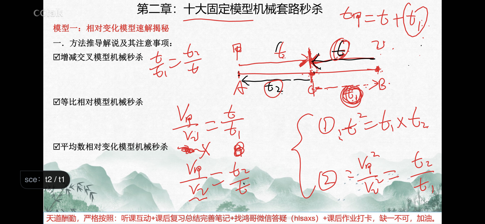
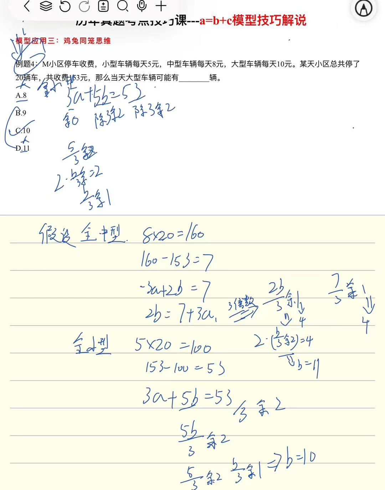
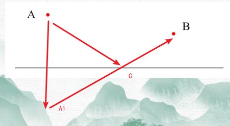
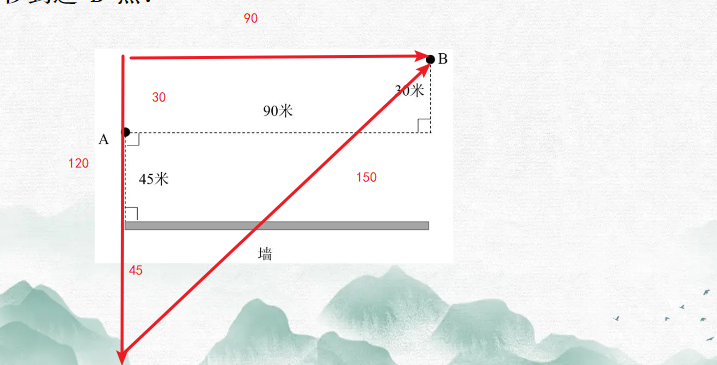
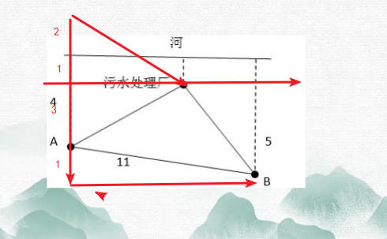

# Table of Contents

* [总结](#总结)
  * [相对变化模型](#相对变化模型)
  * [十字交叉-难点](#十字交叉-难点)
* [相对变化模型](#相对变化模型-1)
  * [交叉模型](#交叉模型)
  * [等比相对(a^2=b*c)](#等比相对a2bc)
  * [平均数相对](#平均数相对)
* [十字交叉模型](#十字交叉模型)
  * [实战](#实战)
* [鸡兔同笼](#鸡兔同笼)
  * [R两者常规型](#r两者常规型)
  * [R两者和差型](#r两者和差型)
  * [R多者鸡兔型](#r多者鸡兔型)
  * [鸡兔实战](#鸡兔实战)
  * [鸡兔坑点 注意点](#鸡兔坑点-注意点)
* [抢答](#抢答)
* [空瓶换酒](#空瓶换酒)
* [青蛙爬井](#青蛙爬井)
  * [相对变化爬](#相对变化爬)
* [中国剩余定理](#中国剩余定理)
  * [基本模型](#基本模型)
  * [剩余其他模型](#剩余其他模型)
  * [R老题回顾](#r老题回顾)
  * [单对象与整体对象盈亏思维](#单对象与整体对象盈亏思维)
* [质数及其扩展应用(9)](#质数及其扩展应用9)
  * [质数在约数个数求法中的应用](#质数在约数个数求法中的应用)
  * [约数实战](#约数实战)
  * [抢答](#抢答-1)
* [22称重模型(10)](#22称重模型10)
  * [常规解法](#常规解法)
  * [速解二类公式](#速解二类公式)
* [将军饮马](#将军饮马)


# 总结

## 相对变化模型

+ 增减/交叉：
  +  参照系一样
  +  注意正负**变化量** 
  +  比值差值的份数就是变量：5:3,差值2份对应32
  +  这样可以得到原来参照系的速度
  
+ 相遇模型：
  +   特征点：合作或者相遇
  + t^2=t1*t2 
  + （V1/V2）^2 =t2/t1
  
+ 平均数变化模型

  


## 十字交叉-难点

 一个整体两个部分：A=B+C 

含有公有属性，且公有属性可以表示成比值形式 

公有属性的分子和分母都要满足A=B+C条件


注意点！！

1. 任何题型，只要满足上面条件的，都可以用十字交叉，比如 倍数、时间等


# 相对变化模型

+ R增减交叉模型机械秒杀 
+  R等比相对模型机械秒杀  
+ R平均数相对变化模型机械秒杀

## 交叉模型

+ a=b*cb和c相对变化 

+  参照系必须统一

   > 注意参照系的选择，只要目标相对现在增加或者减少，都是可以的

+ 只写变换量不看正负

  > 注意是全部都是变化量

+ 十字相乘

  > 1. 左上角是先写的什么，比值就先是什么
  >
  > 2. 这里得到的都是真是速度的比值。为什么？因为参照系都被消掉了，见例题1

+ 求出真实值后，就可以得到真实参考的值，见例题6

母题1：王师傅要加工一批零件，若每小时多加工12个零件，则所用的时间比原计划少3小时;若每小时少加工16个零件，则所用的时间比原计划多用5小时。问：这批零件共有多少个? A.3990 B.4280 C.4330 D.4480


```
S不变的情况下，交叉是解题形式, 以下都是相对参照系的变化量
12   3

16   5
对角相乘，得出比值，
变化量先写的速度的变量，2个变化过程中真实的速度比值，V原+12:v原-16

V =60:48 = 5:4 差值也就是真实速度的差值 1f=28 【真实速度之间的差值，好好理解】
T=4:5 1f=8

V=28*5= 140
T=4*8=32 
S=140*32=4480 选D
```

 母题2：小王、小张、小李三人从甲地步行到乙地，已知小王每小时比小张多走100米，比小 李每小时多走150米。三人同时从甲出发。已知小王13:00到达，小张14:00到达，小李16:00 到达。请问他们是几点从甲地出发的？（ ） A.10:00 B.10:30 C.11:00 D.12：00

```
以小李为参照物
150 3
50  2 
300:150
V=2:1 
t=1:2
1份就是1  那就是12点出发 直接选D
```


例题 1：【2019 上海】 一群蚂蚁将食物从 A 处运往 B 处，如果它们的速度每分钟增加 1 米，可提前 15 分钟到达，如果它们的速度每分钟再增加 2 米，则又可提前 15 分钟到达，那么 A 处到 B 处之间的路程是____米。 A.120 B.180 C.240 D.270

```
1 15
3 30
V=30:45=2:3  2个变化速度的比值
1份相差量：3-1-2
2份就是4 
t=3:2
3份就是45
45*4=180 直接选B
```

例题 2：【2020 浙江】 甲、乙两企业合作完成某订单需要 x 天。如果甲企业产能增加 50%而乙企业不变，可提前 2天完成；如果乙企业产能增加 300%而甲企业不变，可提前 4 天完成。问 x 的值是： A.6 B.8 C.10 D.12

```
0.5V甲 2
3V乙   4
V=1:3 T=3V乙:1V甲

3V乙 时间等于可提前 2天完成
x-2=3VV乙
直接选B
---- 这题有意思
```

例题 6: 【2019 联考】 A、B 两地各有一批相同数量的货物箱需由某运输队用卡车完成交换，假设每辆卡 车运送的货物箱数量相同，运输队首先从 A 地出发，中途 10 辆卡车因抛锚彻底退出这次 运输，使得其余车辆必须每车再多运 2 箱，到达 B 地卸货后又有 15 辆卡车不返程，参 与返程的卡车每辆都需比出发时多装运 6 箱。那么两地共有货物多少箱？ A.2000 B.1800 C.3600 D.4000

```
-10+2-25+6
V=60:50=6:51f=156f=90
那真实值就是
90:75T=5:61f=45f=20
那就是
90*20=1800
最开始
100
辆车每辆
18
箱
90+10=10020-2=18
```


例题 4:【2019 江苏】 某工程队承担一项工程，由于天气原因，工期将延后 10 天。为了按期完工，需增加施工人员。若增加 4 人，工期会延后 4 天；若增加 10 人，工期将提前 2 天。假设每人工作效率相同，为确保按期完工，则工程队最少应增加的施工人员数是 A.6 B.7 C.8 D.9

```

4    6
10  12

48:60 12:15 4:5
v=4:5  1f=6 4f=24
t=5:4 1f=6 5f=30
原来就是 24*30=720
24-4=20
30-4=26
720/26=28-20=8

```

### 难题


5.甲乙两人分别从AB两地同时同向出发，乙在前，甲在后，两人均匀速运动，结果甲在C地追上乙。如果甲每小时多行1千米，则会在距离C地12千米的地方追上乙；如果甲每小时少行0.5千米，则会在距离C地24千米地方追上乙；如果甲每小时多行0.5千米，则甲会在距离C地多少千米地方追上乙？

A.8

B.9

C.10

D.12

```
追击=(甲-乙)*T  甲在变等价于(甲-乙)在变
怎么转换为t的变化
--------12----C------24
这里的12就是甲速度+1，乙还没走到C就被追上了
1 12/乙
0.5 24/乙
V=4:1  这里的速度是追击速度  3f=1.5  4f=2 2f=0.5 原来就是1 

速度2：0.5：1.5=4：1：3
时间t=3:12:4    【这里路程不一样，为什么可以直接 速度比得到时间比？我觉得还是用了2次增减】
时间差9f=36 f=4 
12-4=8

2次增减
1   12/乙
0.5 x/乙
x：6=2：1.5=4：3
x=6
```


## 等比相对(a^2=b*c)

+ 等比相对模型合作时间以及多花的时间
+   特征点：合作或者相遇
+ t^2=t1*t2 
+ （V1/V2）^2 =t2/t1



R等比相对模型机械秒杀 母题3：甲骑自行车，已走路，同时从 AB 两地出发，相向而行，中午12时整、甲已两人在途 中相遇，相遇后，他们都没有停留继续前进，12时10分甲到 B 地，13时30分已走到 A 地，如 果甲已两人速度不变，那么他们出发的时间是： A.10:30 B.11:30 C.12:00 D.12：30

```
t^2=900
t=30
12-30=11:30 直接选B
```

例题 3：【2017 陕西】 甲车从 A 地开往 B 地，乙车从 B 地开往 A 地。上午八点整，两车同时出发，相向而行，相遇 后继续向前。甲车又行驶了 2 小时到达 B 地，乙车又行使了 4.5 小时到达 A 地。甲乙两车到 达目的地后都立即返回，则在返程途中两车再次相遇时，时间为（ ） A.14 点整   B.14 点半   C.15 点整   D.15 点半    E.16 点整    F.16 点半   G.17 点整   H.17 点半

```
再次相遇 放弃 后面讲到

```


例题 5：【2018 广东】 甲、乙各自驾驶汽车匀速相向行驶，且同时进入双向公路隧道的两端，30 秒后两车相遇。甲车继续行驶 20 秒到达隧道出口时，乙车距离出口还有 200 米。问隧道的长度为多少米？ A.450 B.500 C.600 D.800

```
900=20x
x=45
45-20=25
200/25=8
75*8=600 选C
```

例题7: 【2017山东】 小王和小刘两人分别从甲镇和乙镇同时出发，匀速相向而行，1 小时后他们在甲镇和乙镇之间的丙镇相遇，相遇后两人继续前进，小刘在小王到达乙镇之后 27 分钟到达甲镇，那么小王和小刘的速度之比为： A. 5：4 B. 6：5 C. 3：2 D. 4：3

```
相遇后两人继续前进，小刘在小王到达乙镇之后 27 分钟到达甲镇
小王和小刘的速度之比 直接套用第二个公式

（V1/V2）^2 =t2/t1
=x/x+27
27是9的倍数 只有A符合
```


## 平均数相对

+ 调换前平均数：（各自平均数变化*变换后人数） / 变化人数
+ 调换后平均数：（各自平均数变化*变换前人数） / 变化人数
+ 注意正负号是要带进去的

母题1：某单位职工技能竞赛原定一等奖10人、二等奖20人,现在将一等奖中最后4人调整为二等奖,这样得二等奖的职工的平均分提高了1分,得一等奖的职工的平均分提高了3分,那么原来一等奖平均得分比二等奖平均得分多( )分。 A.10 B.10.5 C.11 D.11.5

```
求原来 就要用变化后的人数 
10-4=6*3
20+4=24*1

18+24=42/4=10.5
```

 母题2：体操队有正式队员和候补队员共18人，候补队员比正式队员多4人，若将候补队员组中身高最高的3名队员调入正式队员组，则正式队员组的平均身高将提高2厘米，而候补队员组的平均身高则下降1厘米。那么调动后两组平均身高差多少厘米？（ ） A.1 B.2 C.3 D.4

```
求调动后 就要用原来的
正式队员和候补队员共18人，候补队员比正式队员多4人
18+4 /2 =11
原来是 正式11 7

7*2+11*(-1) / 3  =1 选A

```


例题 8: 【2019 国考】 某单位有 2 个处室，甲处室有 12 人，乙处室有 20 人。现在将甲处室最年轻的 4 人调入乙处室，则乙处室的平均年龄增加了 1 岁，甲处室的平均年龄增加了 3 岁。问在调动之前，两个处室的平均年龄相差多少岁（  ） A.8 B.12 C.14 D.15

```
调动之前 

8*3 +24*1 / 4 直接选B
```


# 十字交叉模型


一个整体两个部分：A=B+C 

含有公有属性，且公有属性可以表示成比值形式 

公有属性的分子和分母都要满足A=B+C条件

+ 十字交叉要注意增长率的正负 
+ 注意为０的特殊情况
+ 鸡兔给的都是具体值 十字是相对值

+ 易错点
  + 利润 相关 分子=利润 分母=总价 见实战


母题 1：甲乙两个班级在一次数学模拟测试中平均成绩为 80 分，已知甲班的平均成绩为 72分，乙班的平均成绩为 86 分。则甲班人数与乙班人数之比为（ ） A.3:1 B.1:3 C.3:4 D.4:3

```
甲 a 乙 b

Sa= a*72
Sb= b*80
a*72 + b*86=(a+b)*80   ------------------- 一个整体两个部分：A=B+C 
a/b=(86-80)/(80-72)       

72    86-80   a  3
   80       = -  
86    80-72   b  4

如何知道比值关系，看如何构造的
        总分
平均数= ----
        人数
比值关系，一定是分母之比。 -------------------- 构造十字交叉 一定是可以写成比值

        总分
平均数= ----
        人数
总分=Sa+Sb
人数=a+b           --------------------------- 公有属性的分子和分母都要满足A=B+C条件

```

母题 2：老张在跑步机上跑了 8 公里，已知前 4 公里以 8 千米/小时的速度跑，后 4 公里以 10 干米/小时的速度跑，则老张全程的平均速度为（ ）千米/小时 A.9.00 B.8.89 C.8.50 D.8

```
速度=路程/时间  满足 123条件
8    10-x   5
   x        ---
10    x-8   4

10-x   5
---- = -
x-8     4
这里有一个技巧 直接消去x  
10-x +(x-8)=9份
2=9份 
1份就是2/9

```

母题 3：小赵从单位出发，依次前往甲村和乙村调研。从单位到甲村开车和骑车的速度分别为 3x 和 x；从甲村到乙村开车和骑车的速度分别为 1.5x 和 0.8x。如全程骑车，用时为开车的2倍。问从单位到甲村的路程是甲村到乙村路程的（ ）。 A.不到 0.5 倍 B. 0.5 到 1 倍之间 C.1 到 2 倍之间 D.2 倍以上

```
是否是整体和2个部分 是 
是否有构造关系  V开/V骑 可以吗？ 不行违背了第三个，不能相加 那些因素不能叠加呢？课后问鸿哥
那么时间可以吗  t开/t骑  时间可以叠加

1/3      
     1/2  = 1/5  这里是分母之比 也就是骑车时间之比 共有属性应该是 t倍数= t开/t骑 那么真正混合混的是 时间倍数关系 ！！！
8/15


单价 速度 平均数 都不能叠加
```

母题 4:超市采购两种不同口味的散装巧克力共 x 斤，售价分别为 30 元/斤和 50 元/斤，预计总收入为 y 元。如将其混合后以 40 元/斤的价格销售，总收入将为 1.25y 元。问采购了30 元/斤的巧克力多少斤？ A.0.9x B.0.95x C.0.75x D.0.8x

```
这里首先看有没有部分和整体 有 
有没有共有属性有 售价=总价/数量 且都是可以叠加，不过这里总价需要调整下
 40 元/斤 1.25y
32 y

30     18 
   32     = 1/9 这里的比例就是数量之比 9的倍数 直接选A
50     2

```

母题 5：企业年初为甲，乙和丙三个研发团队分配总计 1 亿元的研发预算，其中甲团队分配的预 算是乙团队的 1.5 倍。但全年甲、乙、丙团队实际使用研发资金分别为其预算额的 1.1 倍、1.6 倍和 1.8 倍，实际使用研发资金 1.4 亿元。问实际使用资金最多和最少的团队，实际使用资金 相差多少万元？ A.1440 B.1520 C.1600 D.1680

```
出现三个对象 一般需要混合2次
倍数=实际/预算
1.1        1.6-x
    x 3/2= x-1.1
1.6

0.5份=5
x=1.3 也就是甲乙混合后 

1.3
    1.4  4 甲乙 和丙 预算之比 
1.8

3:2 4:1

12:8 20:5
甲:乙:丙 =12:8:5  7的倍数 直接选D 

```

母题6：沈阳某公司欲派出 18 人的考察团到深圳观摩学习，向机票代理商团购机票，商务舱定价为 1600 元/张，经济舱定价为 880 元/张。由于买的数量较多，代理商给予优惠，商务舱按定价的 9 折优惠，经济舱按 6 折优惠，结果付的钱比按定价少 32%，他们一共买了（ ）商务舱机票。 A.2 张 B.3 张 C.4 张 D.5 张

```
优惠=打折/总计
9      
  6.8   4/11 的4/11总价之比 
6

1600m/880n= 4/11

m/n =1/5 一共18人

直接选B

```

例题 1：【2020 山东】 由于改良了种植技术，农场 2017 年种植的 A 和 B 两种作物，产量分别增加了 10%和 25%。已 知 2017 年两种作物总产量增加了 18%，问 2017 年 A 和 B 两种作物的产量比为： A.7∶8 B.8∶7 C.176∶175 D.77∶100

```
增长率=增长/基期

10      7
	18  
25      8

7/8是去年的比值

7*1.1  
-----    上面是77的倍数 直接选D
8*1.25
```

例题 2：【2019 浙江】 小张去年底获得一笔总额不超过 5 万的奖金，她将其中的 60%用来储蓄，剩下的用来购买理 财产品，一年后这笔奖金增值了 5%。已知储蓄的奖金增值了 3.3%，问购买理财产品的奖金 增值了多少？ A.5.35% B.6.45% C.7.55% D.8.65%
```
3.3    x-5  
	5      =3/2
x      1.7 

x=
```
例题 3：【2021 江苏】 某科技公司向银行申请甲、乙两种一年期的贷款总计 5000 万元，两种贷款的年利率分别为 5.6%和 6.2%。若该公司向银行支付的总贷款利息为 295.6 万元，则甲种贷款的金额是： A.2250 万元 B.2400 万元 C.2650 万元 D.2800 万元
```
 295.6/5000 =5.912

5.6        0.288
    5.912  
6.2        0.312

说明甲比总金额的一半少一点 直接选b

```
例题 4：【2019 广东】 某企业销售洗碗机，第一季度平均每个月销售 800 台，上半年平均每个月销售 850 台。如果 4 月份和 6 月份的销售总量是 5 月份的 2 倍，那么该企业 5 月份的洗碗机销售量为（ ） 台。 A.800 B.900 C.1000 D.1100
```
平均每个月=总销售/总月份

800
   850 =1:1
x
x=900 

4 月份和 6 月份的销售总量是 5 月份的 2 倍
4 5 6 是等差数列
直接选B
```
例题 5：【2023 国考】 甲、乙、丙三家科技企业 2021 年的收入之和比 2020 年提升了 20%。其中甲企业的收入上升 了 400 万元，乙企业的收入下降了 100 万元且是甲企业收入的一半，丙企业的收入上升了 30%且其 2020 年的收入与甲、乙两企业同年收入之和相同。问 2020 年甲企业的收入比乙企 业高多少万元? A.900 B.400 C.1100 D.600
```

```
例题 6：【2019 联考】 汽车在平直的公路上运动，它先以速度 V 行驶了 2/5 的路程，接着以 30km/h 的速度驶完余 下的 3/5 路程，若全程平均速度是 40km/h，则 V 是多少？ A.60km/h B.70km/h C.80km/h D.90km/h
```

```
例题 7:【2021 联考】 100 亩实验田中种植了 A、B、C 三种作物，三种作物亩产量分别为 300、500 和 600 千克， 总产量为 45 吨。已知 A 作物的种植面积是 B 作物的 3 倍，问 C 作物的种植面积是 B 作物的 多少倍： A.2 B.2.5 C.7/3 D.8/3
```

```
例题 8:【2021 浙江】 某俱乐部选拔优秀选手参加游泳比赛，选手在规定时间内游完全程，就能获得参赛资格。已知有四分之一的选手获得了参赛资格，获得参赛资格选手的平均完成时间比规定时间快 6秒，未获得参赛资格选手的平均完成时间比规定时间慢 10 秒，所有选手的平均完成时间为140 秒，则本次选拔的规定时间为多少秒： A.116 B.125 C.134 D.139
```

```

例题9：【2014 浙江省考】 商店进了 100 件同样的衣服，售价定为进价的 150%，卖了一段时间后价格下降 20%继续销售，换季时剩下的衣服按照售价的一半处理，最后这批衣服盈利超过 25%。如果处理的衣服不少于 20 件，问至少有多少件衣服是按照原售价卖出的？ A.7 件 B.14 件 C.34 件 D.47 件
```

```
例题10：【2021 联考】 甲单位职工人数是乙单位的 2 倍，两个单位所有职工中正好有一半是党员。其中甲单位职工 中党员占比比乙单位高 15 个百分点，且甲单位的职工中群众人数比乙单位多 18 人。问甲单 位职工中，党员比群众多多少人： A．6 B．8 C．10 D．12
```

```
例题 11：【2021 浙江】 商场有大、小两种果篮销售，每个小号果篮由 500 克火龙果、300 克葡萄和 700 克橙子组成， 每个大号果篮由 700 克火龙果、1300 克葡萄和 1000 克橙子组成。某日通过果篮方式销售水 果超过 300 千克，其中 1/3 是葡萄。问当日至少销售了多少千克火龙果： A.不到 85 千克 B.85—87 千克 C.87—89 千克 D.超过 89 千克
```

```
例题12：【2021 国考】 某地调派 96 人分赴车站、机场、超市和学校四个人流密集的区域进行卫生安全检查，其中公共卫生专业人员有 62 人。已知派往机场的人员是四个区域中最多的，派往车站和超市的人员中，专业人员分别占 64%和 65%，派往学校的人员中，非专业人员比专业人员少 30%，问派往机场的人员中，专业人员的占比在四个区域中排名： A.第 1 B.第 2 C.第 3 D.第 4
```

```


## 实战

2.某高校今年计划招收各类学生6630人，比去年增长2%，其中本科生比去年减少4%，研究生的招生计划数比去年增加9%。那么，该校今年研究生的招生计划数为：

A.3052人

B.3161人

C.3270人

D.3379人

14.甲、乙两种糖果的单价分别为20元/千克和24元/千克，将两种糖果按一定的比例混合销售，在两种糖果混合比例保持不变的情况下，将甲种糖果的售价上涨8%，乙种糖果的售价下跌10%，使调整前后混合糖果的单价保持不变，则甲乙两种糖果的混合比例应为:
A.1:2
B.3:2
C.4:3
D.5:3

```
单价不变，意思就是混合后增长率为０

```

例题11:【2022 北京】 
商店做促销活动，购买店内商品第一件原价，第二件（价格不高于第一件）4 折，第三件（价 格不高于第二件）1 折。小刘买了 1 件 A 和 2 件 B 商品，优惠后的总价格相当于定价的 56.25%。 已知 A 商品比 B 商品贵，则按原价买 10 件 A 商品的钱最多可以按原价买多少件 B 商品？ 
A.20 B.16 C.14 D.12

```
先BB混合
1


在 A bb混合
```

商店以相同的单价购进A、B两种商品共100件，A商品的定价为进价的120%，B商品的定价为进价的130%，若A、B两种商品全部按定价售出，则总利润率为28%。实际销售时A、B两种商品均打折出售，B商品在定价的基础上打九折，A、B两种商品全部售出后的总利润率为12.8%，则实际销售时A商品在定价的基础上打几折?
六五折
七五折
八折
九折

```
看到题第一反应就是十字，给你部分 总量
先第一次求出件数比，分母是总定价
这里20 30 是相对于定价100而言
20      2
   28     1/4   A 20 B 80
30     8
第二次十字交叉，求打折的 分母还是总价
定价基础 130*0.9=117 -100 =17

x         4.2   1
    12.8           x= -4 说明打折后亏本了
17             4  

96/120=8
```


# 鸡兔同笼


+ 头的总数：鸡+兔

+ 脚的总数: 有【共有属性】但是不同

  > 十字交叉是比值，。且能相加
+ 具体数字鸡兔，相对量十字交叉


## R两者常规型


母题 1：有若干只鸡兔同在一个笼子里，头共 46，足共 128 只。问笼中各有几只鸡和兔？

```
(鸡脚+兔脚) 128
一只鸡 2
一只兔 4
相差 2 
这样不管按鸡还是兔，先算出来与总数的差值，就是多少或者少算的鸡或兔


全部按照鸡来算
46*2=92 
(92+0)=128
128-92=36 少算的兔子多的2倍
36/2=18
46-18=29

全部按照兔子算
46*4=184
(0+184)=128
184-128=56 多算的鸡 按照4条腿来算 
56/2=28
```


母题：有大小两个瓶，大瓶可以装水 5 千克，小瓶可装水 1 千克，现在有 100 千克水共装了 52 瓶。问大瓶和小瓶相差多少个？ A.26 个 B.28 个 C.30 个 D.32 个


例题 1：【2017 联考】 小明负责将某农场的鸡蛋运送到小卖部。按照规定，每送达 1 枚完整无损的鸡蛋，可得运费 0.1 元；若有鸡蛋破损，不仅得不到该枚鸡蛋的运费，每破损一枚鸡蛋还要赔偿 0.4 元。小明 10 月份共运送鸡蛋 25000 枚，获得运费 2480 元。那么，在运送过程中，鸡蛋破损了： A.20 枚 B.30 枚 C.40 枚 D.50 枚

```
有没有告诉全部的数量 25000 
有没有分类型且有腿 破损 正常 0.1 0.5
整的钱数  2480
25000 *  0.1=2500
2500-2480=20
20/0.5=40 直接选C

```

例题 2：【2017 江苏】 玻璃厂委托运输公司运送 400 箱玻璃。双方约定：每箱运费 30 元，如箱中玻璃 有破损，那么该箱的运费不支付且运输公司需赔偿损失 60 元。最终玻璃厂向运输公司共支 付 9750元，则此次运输中玻璃破损的箱子有： A.25 箱 B.28 箱 C.27 箱 D.32 箱

```
有没有告诉全部的数量 400
有没有分类型且有腿 破损 正常 -90 30
整的钱数  9750

全部按照正常算 
30*400=12000-9750=2250
90n=2250
n25

```


例题 3：【2018 联考】 某高校组织 200 名学生植树 198 棵，其中有一人植 1 棵，其余的 199 人分成甲乙两组，甲组每人植 3 棵，乙组每两人植 1 棵。那么，甲乙两组各有多少名学生? A.49，140 B.39，160 C.29，170 D.19，180

```
第一反应 代入 3 倍数 2倍数 只能选B

199 197 

如果都看作3 199*3=599
599-197=400

400/2.5 多算的 =160

```


##  R两者和差型


1. 有鸡兔共 30 只，鸡脚比兔脚多 30 只，问兔子有多少只？ A.5 B.10 C.15 D.25


```
(鸡脚-兔脚)=30 共有属性
一只鸡：2-0=2
一只兔: 0-4=-4

假设都是鸡
(60-0)=30
说明多算30 是因为把兔子看成了鸡
30/6=5


假设都是兔
0-120=30
发现少算了150
150/6=25

```


例题 6：【2012 广州】 某单位组织员工外出活动，所有员工刚好坐满 10 辆客车。已知大客车每辆乘坐 50 人，小客车每辆车坐 30 人，大客车比小客车一共多做了 260 人。则大客车有（ ）辆。 A.3 B.4 C.6 D.7

```
满不满足总数 满足 10辆车
有没有共有属性 有都是客车 腿
共有属性不相同 大 50 小 30

大-小=260 求大 假设都是大

大：50
小：-30

500-0=260
说明多算了240
240/80 =3 
那么大客车是7 

假设都是小
0-300=260
少算560
-560/80=7


```

例题 5：【2016 广东】 甲乙两人需托运行李。托运收费标准为 10kg 以下 6 元/kg，超出 10kg 部分每公斤收费标准略低一些。已知甲乙两人托运费分别为 109.5 元、78 元，甲的行李比乙重了 50%。那么，超出 10kg 部分每公斤收费标准比 10kg 以内的低了（ ）元。 A.1.5 B.2.5 C.3.5 D.4.5

```
比较难 暂时放弃
```


##  R多者鸡兔型


蜘蛛有 8 条腿，蜻蜓有 6 条腿和 2 对翅膀，蝉有 6 条腿和 1 对翅膀，现在这三种小虫共 18 只，有 118 条腿和 18 对翅膀，蜘蛛，蜻蜓，蝉各几只？ A.5、5、8 B.5、5、7 C.6、7、5 D.7、5、6

```
出现三个其实也是22混合求出，先找共有属性 腿 
蜘蛛 8 
蜻蜓蝉6 看作一个整体
共有118条腿
(a+b)=118
18*8+0=118
144-118=26 
26/2=13 说明多13个整体

直接选C
```


例题 4：【2021 广东】 某货运公司承运一批工艺品，每件运费 20 元。如果运输途中出现破损，那么每件破损的工艺品不仅收不到运费，还要赔偿 30 元。运输完成后发现，工艺品的破损率为 6.4%， 最终货运公司收到 16800 元运费，则运输途中破损的工艺品有（ ）件。 A.64 B.96 C.128 D.156

```
这题没有告诉总体 直接列方程
x  6.4%x
125x 8x
117x*20-8x*30=16800

```


## 鸡兔实战

+ 结合四大维度考的比较多
+ 鸡兔是具体值，十字是相对值

杂货店打烊后，收银机中有1元、10元和100元的纸币共60张，问这些纸币的总面值可能为多少元？ A、2100     B、2400     C、2700     D、3000 

```
这题出的很妙，就是看你对鸡兔识别出来不
全部看着10元的 60*10=600
9a-90b=答案-600
答案-600是9倍数 选B
```

例题1：某餐饮公司甲、乙两种外卖每份的售价分别为30元和50元，若该公司某天售出这两种外卖共500份，销售收入为21400元，则售出的两种外卖数量相差： 
A.140 
B.160 
C.180 
D.200 

 

```

```

**例题2：某工厂有熟练工、技术工、学徒共33人，熟练工每人每天工资250元，技术工380元，学徒100元。工厂每天需结工资8480元。问学徒有多少人？**
A.14
B.11
C.8
D.5

 

```
250*33=8250
8480-8250-=230 【真实值-假设值 可能为负数 会影响前面】

少算加 多算就要减去
130a-150b=230
余数定理做
13a=23+15b
```

例题3：某单位向希望工程捐款，其中部门领导每人捐50元，普通员工每人捐20元，某部门所有人员共捐款320元。已知该部门部门总人数超过10人，问该部分可能有几名部门领导？
A.1
B.2
C.3
D.4

  

```
总共n个人
假设全是普通员工   20n
320-20n= 30 * x
奇数偶数

其实也可以直接
50a+20b=320
```

例题4：M小区停车收费，小型车辆每天5元，中型车辆每天8元，大型车辆每天10元。某天小区总共停了20辆车，共收费153元，那么当天大型车辆可能有________辆。
A.8
B.9
C.10
D.11

 

```
全是小车
3a+5b=53 尾数 
    0 选C
    也可以用余数来做
53/3  余2
5/3 余2 
b/3 余1 b-1是3倍数
```

例题5：老张购进一批商品，共 20 件。销售时，每件合格的商品可以赚 50 元，不合格的商品一件亏20元。他卖出的这20件商品中有几件是不合格的，那么卖出这批商品可能赚：
A.690 元 
B.720 元 
C.780 元 
D.850 元


```
全部看作合格
1000-70b 选B
```

例题5：某企业采购A类、B类和C类设备各若干台，21台设备共用48万元。已知A、B、C类设备的单价分别为1.2万元、2万元和2.4万元。问该企业最多可能采购了多少台C类设备?
A.16
B.17
C.18
D.19

  

```
全部都是1.2 
1.2*21=25.2
2a+3b=57 
3b是奇数 排除AC 排除D 太大
代入B符合
```

 

 例题7：某商场在售的月饼有铁盒装和纸盒装。铁盒装售价 80 元/盒，纸盒装售价 50 元/盒，每购买 20 盒铁盒装赠送 1 盒纸盒装。若某单位花了 12100 元购买了 200 盒（含赠送的纸盒装）月饼。则其中铁盒装有：
A.75 盒
B.77 盒
C.79 盒
D.81 盒

 ```
问法突破
80a+50b=12100
尾数是0 
8a为0 选A

----- 
先全部看作是标准的，
但是赠送的可以看作是0元，你却当成了付费，所以要减去
20*50=1000
30a-50b=2100
 ```


## 鸡兔坑点 注意点



**上图时错误例子**

真实值-假设值是负数的时候
3a 多算要减
2b  少算要加

正常时 2b-3a 但是这里时负数，需要转换为
3a-2b=7

# 抢答


抢答1: 为响应建设“绿色城市”的号召，某社区党员义务植树300棵，由于参加植树的全体党员植树的积极性高涨，实际工作效率提高为原来的1.2倍，结果提前20分钟完成任务，则原来每小时植树多少棵  A.120  B.150  C.135  D.125


抢答2: 小龙和小佳两个小伙伴合伙开了一家公司，其中小佳的股份是小龙的 2/3。现一投资者要入股此公司，协议由投资者出资 1100 万元购买小龙、小佳两人的部分股份，使得三人所持有的股份相等，问小龙可取回多少万元？（ ） A.880          B.660          C.440          D.220


抢答3: 有一个三位数,如果把百位数字与个位数字对调，得到的新数字比原数字大495；如果把十位数字与个位数字对调，得到的新数字比原数字大9；如果把百位数字与十位数字对调，得到的新数字比原数字大360.原来的三位数是多少？ A.321 B.165 C.156 D.256


抢答4: 某公司职员25人，每季度共发放劳保费用15000元，已知每个男职员每季度发580元，每个女职员比每个男职员每季度多发50元，该公司男女职员之比是多少？（   ） A. 2:1 B. 3:2 C. 2:3 D. 1:2

抢答5: 某餐饮公司甲、乙两种外卖每份的售价分别为30元和50元，若该公司某天售出这两种外卖共500份，销售收入为21400元，则售出的两种外卖数量相差：  A.140  B.160  C.180  D.200


抢答6: 如果甲、乙、丙三个水管同时向一个空水池灌水，1小时可以灌满。甲、乙两个水管一起灌水，1小时20分钟灌满。丙单独，灌满这一池的水需要多少小时： A.3 B.4	 C.5	 D.6


抢答7: 某工厂有甲、乙两个生产车间，每个工人的生产效率都相同。甲车间的总生产效率是乙车间的 1.5倍；从甲车间调派 30 名工人到乙车间之后，甲车间的生产效率是乙车间的 1.2 倍。问需要从甲车间再调多少名工人到乙车间，两个车间的生产效率才能相同：  A.20  B.22  C.24  D.25


抢答8: 甲乙两人骑自行车从环形公路上同一点同时出发，背向而行，现在已知甲走一圈的时间是70分钟，如果在出发后45分钟甲，乙两人相遇，那么乙走一圈的时间是多少分钟？（ ） A.120         B.122      C.124       D.126

抢答9: 某人要到 60 千米外的农场去，开始他以 5 千米/时的速度步行，后来有辆速度 18 千米/时的拖拉机把他送到了农场，前后共用了 5.5 时，问：他步行了多远？ A.15千米   B.20千米   C.25千米   D.30千米


抢答10: A、B 两台高性能计算机共同运行 30 小时可以完成某个计算任务，如两台计算机共同运行 18 小时后，A、B 计算机分别抽调出 20% 和 50%的计算资源去执行其他任务，最后任务完成的时间会比预计时间晚 6 小时，如两台计算机共同运行 18 小时后，由 B 计算机单独运行，还需要多少小时才能完成该任务？  A.22  B.24  C.27  D.30

```
第六讲
十字交叉

```

# 空瓶换酒

R“1”元技法速解喝酒模型 


+ 假设空瓶是1 元，算出 瓶和水的价格 
+ 喝的是水 买的是瓶+水


例题 2:四个空的矿泉水瓶子可以换一瓶矿泉水喝，小明有十五个空的矿泉水瓶子，那么小 明最多能喝几瓶水？ A.3 B.4 C.5 D.6

```
空瓶=1元

4空=1瓶+1空
3空=1瓶

15/3=5
```


例题 3:【山东 2019】 某啤酒厂为促销啤酒，开展 6 个空瓶换 1 瓶啤酒的活动，孙先生去年花钱先后买了109 瓶该品牌啤酒，期间不断用空啤酒瓶去换啤酒，请问孙先生去年一共喝掉了多少瓶啤酒？ A.127 B.128 C.129 D.130

```
空 6
瓶 1
水 5

喝的酒 
190*6 /5

一共花了多少钱，喝了多少水

```

例题 1：啤酒 2 元一瓶,四个瓶盖可换一瓶啤酒,2 个空瓶也可换一瓶啤酒,10 元最多可以喝 多少瓶啤酒？

```
空瓶1 瓶盖0.5 水 0.5 

10/0.5=20
```


例题 1：“红星”啤酒开展“7 个空瓶换 1 瓶啤酒”的优惠促销活动。现在已知张先生在活 动促销期间共喝掉 347 瓶“红星”啤酒，问张先生最少用钱买了多少瓶啤酒？ A.296 瓶 B.298 瓶 C.300 瓶 D.302 瓶

```
空瓶 7 
水 6 

347*6  喝的是酒 买的是瓶+酒

347*6/7=297.多

```

例题 2：6 个空瓶可以换一瓶汽水，某班同学喝了 157 瓶汽水，其中有一些是用喝剩下来的空瓶换的，那么他们至少要买多少瓶汽水？ A.131 B.130 C.128 D.127

```
 6 1 5

157* 5/6=130.多 选131

喝了这么多水 要花多少钱买
```


# 青蛙爬井

+ n个s1 -n个s2+最终跳出的距离<=s1
+ 总的-最后一次的> 周期距离 *n


母题：青蛙在井底向上爬，井深 10 米，青蛙每次跳上 5 米，又滑下来 4 米，象这样青蛙需跳几次方可出井？ A.6 次 B.5 次 C.9 次 D.10 次

```
10-5 最后一次
10-5<=n [这里周期的距离就是1]
5<=n
n=6 
```

例题 1：有 37 名红军战士渡河，现在只有一条小船，每次只能载 5 人，需要几次才能渡完? (   ) A.7 B.8 C.9 D.10

```
记住这里人是要回来的 周期是4 最后是5

37-5=4n
8+1=9 选C
```

例题 2：一人爬有20个阶梯的楼梯，假定每次向上爬5个阶梯，又下走3个阶梯，问该人需几次能跑到楼梯顶部？ A.7      B.8      C.9      D.10

```
20-5=2n
n=7.5+1 8.5
选C
```

例题 3：49 名探险队员过一条小河，只有一条可乘 7 人的橡皮船，过一次河需 3 分钟。全体队员渡到河对岸需要多少分钟？（） A.54 B.48 C.45 D.39

```
42/6n n=8 *6= 48 但是最后一次不回来了 C
```

例题 4：蜗牛沿着15米高的柱子往上爬，每天从清晨道傍晚向上爬6米，夜间又滑下来4米，像这样从某天清晨开始，第几天爬到柱顶？（） A.10           B.5        C.6          D.9

```
15-6=9=2n 选C
```

例题 5：【2022 广东事业】 老张每个月 1 号都会往银行卡里存入 1500 元，每个月不定时取 1000 元作为生活费，在某个月末，达到 8 万元，不考虑其他因素，则在之后的第（  ）个月，老张的银行卡里将第一次有10 万元。 A.37 B.38 C.39 D.40

```
20000-1500>=500n
18500/500=37
37+1-38
直接选B
----------------------

```


## 相对变化爬

甲乙两人计划从 A 地步行去 B 地，乙早上 7：00 出发，匀速步行前往，甲因事耽误，9：00才出发，为了追上乙，甲决定跑步前进，跑步的速度是乙步行速度的 2.5 倍，但每跑半小时都需要休息半小时，那么甲什么时候才能追上乙? A.10:20 B.12:10 C.14:30 D.16:10

```
减去青蛙爬的

```

抢答4:甲、乙两人骑车在路上追逐，甲的速度为27千米/小时，每骑5分钟休息1分钟，乙的速度是300米/分，现在已知乙先行1650米，甲开始追乙，追到乙所需的时间是：  A. 10分钟  B. 15分钟  C. 16分钟  D. 17分钟

```java

```


# 中国剩余定理

## 基本模型


+ 余数太大，可以放到除数里面

  > 4n+15 ---->4n+3

+ 和同取和 余同取余 差同取差

  > 本质是进行余数陪同
  >
  > 4n+15  除数可以拿出来  4n+19
  >
  > 4n+15    余数可以拿进去4n+11

+ 5a+2、7b+6  怎么快速配余数呢

  > 5a+2 代入a 看那个数满足 ➗7余6 就是相同的余数
  >
  > 7 不行
  >
  > 12 17 ..发现27可以
  >
  > 那就是 35n+27

例题 1:三个自然数 N 满足：除以 6 余 3，除以 5 余 3，除以 4 也余 3，则符合条件的自然数有几个?

```
 6 5 4的最小公倍数 30 30N+3
```

例题 2：某市场调查公司 3 个调查组共 40 余人，每组都有 10 余人且人数各不相同。2017年重新调整分组时发现，若想分为 4 个人数相同的小组，至少需要新招 1 人；若想分为 5个人数相同的小组，至少还需要新招 2 人。问原来 3 个组中人数最多的组比人数最少的组至少多几人？

例题 3：某企业员工组织周末自驾游。集合后发现，如果每辆小车坐 5 人，则空出 4 个座位； 如果每辆小车少坐 1 人，则有 8 人没坐上车。那么，参加自驾游的小车有：

例题 1：三个自然数 N 满足：除以 6 余 3，除以 5 余 3，除以 4 也余 3，则符合条件的自然数有几个? A.8 B.9 C.15 D.16


## 剩余其他模型

例题 15：【2017 新疆兵团】 李明国庆节假期要做若干道英语试题，第一天做了这些试题的一半多 1 道，第二天做了剩下的一半多 1 道，第三天又做了剩下的一半多 1 道后，还剩 1 道试题。那么李明国庆节假期总共要做( )道英语试题。 A.12 B.16 C.22 D.24

```
不是4的倍数 
选C
```


例题 16：【2020 广东】 中秋节前夕，某商品采购了一批月饼礼盒，此后第一周售出了总数的一半多 10 份，第二周售出了剩下的一半多 5 份，若此时还剩下 20 份月饼礼盒，则商品最初采购了（ ）份月饼礼盒。 A.60 B.80 C.100 D.120

```
倒推
25 50 60  120 选D
```

例题 17：【2018 联考】 一群有若干人的寻宝团队，在一小岛上发现一处宝藏，经商议按如下规则分配宝藏： 首先，第 1 人分得 1 百万和剩余部分的 1/6；其次，第 2 人分得 2 百万和剩余部分的 1/6；接下去第 3 人分得 3 百万和剩余部分的 1/6，依次类推，最后剩余的部分全给了最后一个人。结果每人都 得到了同样价值的宝藏。那么，该寻宝团队共有多少人？ A.5 B.6 C.7 D.8

```

最后一个人肯定是n百万

剩下的是 a5/6 一定是5的倍数 选A
```

## R老题回顾

 一群学生分小组在户外活动，如 3 人一组还多 2 人，5 人一组还多 3 人，7 人一组还多 4 人，则该群学生的最少人数是： A.23 B.53 C.88 D.158

```
3n+2  15N+8 
5N+3
7N+4 
代入选B
```


## 单对象与整体对象盈亏思维

具体见 刷题班 专题课

+ 这里的整体是A整体和B整体的差=a b单个差* ab个数
+ 个数不变，整体量不变

例题 1:【2020 联考】 某企业员工组织周末自驾游。集合后发现，如果每辆小车坐 5 人，则空出 4 个座位；如果每辆小车少坐 1 人，则有 8 人没坐上车。那么，参加自驾游的小车有： A.9 辆 B.10 辆 C.11 辆 D.12 辆

```
这里有一个前提，车不变
整体对象相差多少  -4  +8  12
单个对象相差多少  5-4=1
那么需要多少个才能满足 1*n=12 n=12
```


例题 2:【2019 联考】  林先生要将从故乡带回的一包泥土分成小包装送给占其朋友总数 30%的老年朋友。 在分包过程中发现，如果每包 200 克，则少 500 克；如果每包150克，则多250克。那么， 林先生的朋友共有多少人? A.15 B.30  C.50  D.100

```
同理 人不变

750/50=15 选C
```

例题 3:【2019 上半年全国联考 C】 年终时，某班组集体获得一笔奖金，班长决定平均分配这笔钱。如果每人 5 万元，则剩余 m万元;如果每人 6 万元，则剩余 n 万元;如果每人 7 万元，则刚好够平均分配给 m－n 人。则下列关系正确的是：（ )。 A.6m=5n B.5m=6n C.m=2n D.2m=n

```
m-n/6-5=m-n 人

5(m-n)+m=7(m-2)
m=2n
```

例题 4:【 2018联考】  老师拿来一箱笔记本让班长负责给同学们分发，如果每人发 2 本，还剩 22 本，如果每人发 3 本，就少 15 本，该班共有多少学生？  A.37     B.34    C.23     D.17 

```
人不变
37/1=37 
```

例题 5:【2022深圳】 某公司举行爱心捐赠活动，经初步统计，平均每人捐款92.35，复核时发现，因笔误将某人捐款100误写成10元，实际平均每人捐款96.85元，则该公司共有（  ）人捐款。 A.18 B.20 C.25 D.30

```
整体差90
部分差4.5 
90/4.5=20
```

例题6:袋子中有红笔、蓝笔若干支。若每次拿出1支红笔和1支蓝笔，最后袋子中会只剩蓝笔150支；若每次拿出1支红笔和4支蓝笔，最后袋子中会只剩红笔30支。那么袋子中原来共有红笔和蓝笔多少支？ A.180 B.240 C.300 D.330

```
-30是5的倍数  
-150是2的倍数  排除不了
-----------------

这里次数不相等 是不能用的
但是可以转化 
第二次是剩下红笔，在那30次， 蓝笔剩余-120

270/3=90 

2*90+150=330
```

某训练基地有男队员若干名。若8人住一间房则恰好空2个房间;若6人住一间房，则又少2个房间。如果每个房间住5人，则至少需要()间房。

```
房间固定 m
8m-16=6m=12
2m=28
m=14

```


#  质数及其扩展应用(9)

+ 2 3 5 7 11 13 
+ 只有一个2偶数


例题 1：一个质数的三倍与另一个质数的两倍之和等于 200，这两个质数的和是多少？ A.96 B.97 C.98 D.99

```
3a+2b=200
a只能是2
b97
```

例题 2：有 7 个不同的质数，它们的和是 58，其中最小的质数是多少？ A.7 B.5 C.3 D.2

```
7个奇数相加 肯定有偶数 最小的质数就是2
```

## 质数在约数个数求法中的应用

+ 平方数一定有**奇数**个约数

+ 非平方数一定有**偶数**个约数

  ```
  一个数表示【质数次方的形式】
  10=2*5 (1+1)*(1+1)=4    1 2 5 10 
  
  先把数字拆成质数次方的乘积，再用次方数+1的乘积 就是约数
  
  12=3*2^2  2*3=6个约数
  9=3^2   2+1 等于3
  
  100=2^2 * 5^2   3*3=9
  ```
  
  

例题 1.从 360 到 630 的自然数中有奇数个约数的数有（  ）个？ A.25 B.23 C.17 D.7
```


2016=4*4*6*21
   =2^5*3^2*7
   =6*3*2=36
```


## 约数实战

3.学校准备了 1152 块正方形彩板，用它们拼成一个长方形，有多少种不同的拼法：

A.52 

B.36 

C.24 

D.12

```
长*宽 都是面积的约数 需要除以2 
1152=128*9
=2^7 *3^2 =8*3=24

24/2=12
```

6.一个小型公司准备发放月度奖金，公司有员工 100 人，领导想出一个新颖的发放方式，他准备编号 1～100 共 100 个箱子，发放时向所有编号为 1 的倍数的箱子各放一个 300 元红包，向所有编号为 2 的倍数的箱子各放一个 300 元红包，依此类推，最后向所有编号为 100 的倍数的箱子各放一个 300 的红包，那么编号为 72 的箱子里共有多少元钱： 

A.1800 

B.3600 

C.900 

D.4500

```
72=8*9
 =2^3+3^2  (3+1)*(2+1)=12
72约数有12个，所以答案=12*300=3600元。
```


## 抢答

某科技创新项目有 6 人投资，共筹资 110 万元。投资额度有 10 万元、20 万元和 30 万元三种。已知投资 10 万元的比投资 20 万元的多 2 人，问投资 30 万元的有多少人？  A.2  B.3  C.4  D.5

```
30肯定是偶数 直接选A
```

大学生创业主要集中在高科技、智力服务、连锁加盟和自媒体运营四个领域。某学院今年选择创业的大学毕业生不到50人，其中选择智力服务领域、连锁加盟领域和自媒体运营领域的分别占1/7，1/2 和1/3 。那么该学院今年选择高科技领域创业的大学毕业生有多少人?  A.1  B.3  C.5  D.7 
```
不到50 半模糊  3 7 2的倍数 只能是42 选A
半模糊需要转换位具体值
```
小王去超市买办公用品，经费恰好可以买 18 个计算器或者买 30 个订书机或者 50 个档案盒，若购买了 6 个计算器、8 个订书机后，剩下的经费全部购买了档案盒，则他购买档案盒的个数是() C.20 D.24
```
工程占比
6/18=1/3=5/15
8/30=4/15

还有6/15 =2/3 * 50 =20
```
某市举办高校足球比赛，每所高校都要与其余所有参赛高校各进行一场比赛。积分规则为：胜一场积 3 分，平一场积 1 分，负一场积 0 分。已知此次比赛的冠军积分为 14 分，其中取胜场次比平局多 2 场，平局场次是告负场次的 2 倍。问参加这次足球比赛的高校有多少所？  A.7  B.8  C.9  D.10
```
我这里不知道 又多少高校 跟场次的关系 

x+2x+2x+2=5x+2  冠军的场次 要跟其他学校比较的场次  
查看选项 n只能位1 那就是8场  选B
```
运动会招募志愿者，第一次招募了不到100人，其中男女比例为11：7；补招若干女性志愿者后，男女比例变为4：3。问最多可能补招了多少名女性志愿者？  A.3  B.5  C.6  D.10 
```
单对象定值思维

11:7  4:3

44:28 44:33 5的倍数  18n 小于100 n小于6 选B


```
某企业去年全年收入 1200 万元，支出 960 万元。今年上半年和下半年，企业支出比去年同期分别减少 20%和 15%，且全年收入与去年相同，总体盈余（收入-支出）比去年增加172 万元。问今年上半年支出比下半年：  A.少 160 万元  B.多 160 万元  C.少 108 万元  D.多 108 万元 
```
留着在做一遍 看涨不涨急性
```
疫情期间，爱心人士向某街道捐赠了两箱防疫物资，内装物资件数相同。街道将两箱物资分别给了甲、乙两个工作组，其中甲工作组除1人拿到4件物资外，其余每人各分得5件；乙工作组除1人拿到6件物资外，其余每人各分得7件。已知每箱物资数量在50到100件之间，则每箱装有防疫物资（ ） A.58 B.62 C.69 D.74
```

```
甲，乙，丙三种农产品价格分别为 30 元/包，24 元/包和 20 元/包。某日销售三种农产品共 240 包，总销售额为 6000 包，已知甲的销量是乙的 2 倍，问丙销售了多少包？ A.90  B.75  C.60  D.45
```

```
抢答8:【2024联考】 从甲地到乙地的全价机票为2000元，购买全价或折扣机票，每张都要支付120元税费，从甲地到乙地的高铁票价为680元，企业要安排20人当日从甲地前往乙地出差，单程总预算不超过2万元，已知当日高铁票、机票都充足，2折、3折和5折机票分别还剩余2张、3张和5张，其余为全价机票，问在预算范围内最多能安排多少人乘飞机前往乙地？  A.11  B.12  C.13  D.14
```

```


# 22称重模型(10)

## 常规解法


例题 1：【2017 联考】
甲、乙、丙三人，其中每两个人的年龄之和分别是 55 岁，58 岁，63 岁，那么这三个人中年龄最小的是（ ）岁。
A.25
B.26
C.30
D.33

```
甲+乙=55
甲+丙=58
乙+丙=63 
把上面三个式子进行叠加就是 2(甲+乙+丙)
问年龄最小
（55+58+63）/2 -乙+丙 =25 选C

简单排列组合 3个人会产生3个结果，每个对象算了2次
如果是4个人 就是2C4=6种结果，每个对象算了3次

如果有n个对象，n个对象相加，对象相加/n-1

```

例题 2：年级有 4 个人数不同的班级，张老师在纸上统计了其中任意 3 个班级人数之和，分别为 134 人、129 人、127 人、（ ）人。最后一个数字因沾到墨水，字迹模糊不清，问括号内数字可能为：
A.122
B.129
C.132
D.136

```
4个班级 任选3个，那就是4种情况，加起来就是3倍数
3倍数=134+129+127+x 
x是3倍数 排除AD b出现了选C
```

例题 3：【2013 深圳】
五个各不相等的自然数分别两两相加，10 种相加组合共得到 8 个不同的结果，分别是 17、22、25、28、31、33、36 与 39，则五个数中最大的数与最小的数之和为（）。
A.25
B.28
C.31
D.33

```
太麻烦 直接看下面 速算

估算公式
最大=28-25+39 /2
最小=28+25-39/2 

```


## 速解二类公式

**五个对象由小到大依次是A B C D E**，那么两两称重就会产生10种结果：**A+B ,A+C** ,A+D, A+E, B+C, B+D, B+E, C+D, **C+E, D+E** 。

```
最小的是A+B
次小是A+C

次大是C+E
最大是D+E
公式一(精算)：   最重的对象=最大数据+次大数据+最小数据-n个对象之和
               
                            最轻的对象=最小数据+次小数据+最大数据-n个对象之和   

                         注:n个对象之和=所有数据之和/(n-1)
弊端就是要知道所有数据之和

```

重要，大部分题目不会告诉你所有的数据

```
n个对象，22相加，从小到大排好
5个对象就是，会产生很多结果，但是只要 第4个和第三个

为什么会有这样的公式，根据上面举的例子，你会发现都消除了，只剩下了最大和最小

公式二（估）：最重的对象=【第（n-1）个数据-第（n-2）个数据+最大数据】/2

              
              最轻的对象=【第（n-1）个数据+第（n-2）个数据-最大数据】/2

最大就是加最大数据 前面就是减
最小就是减最大数据，前面就是加
```

例题 1：食堂买来 5 只羊，每次取出两只合称重量，得到 10 种不同重量（单位：千克）：47，50， 51，52，53，54，55，57，58，59。最重一只是多少千克？
A.25
B.28
C.30
D.32

```
估算公式 已经排序好了
52-51+59=-60/2=30
```

例题 2：A、B、C、D、E 是 5 个不同的整数，两两相加的和共有 8 个不同的数值，分别是 17、25、28、31、34、39、42、45，则这 5 个数中能被 6 整除的有几个？
A.0
B.1
C.2
D.3

```
最大=28-25+45=42
最小=25+28-45=8
这样就可以把所有的数字都算出来了
8   42 
-----------
最大=31-28+45 /2=24
最小=31+28-45 /2=7

**A+B ,A+C** ,A+D, A+E, B+C, B+D, B+E, C+D, **C+E, D+E** 。

7 10 18   21  24 

选2
```

例题 3：【2014 深圳】
玩具店的橱窗里有四种玩具，把四种玩具的价格（均为整数）两两相加得到 6 各不同的数字，已知其中五个数字为：144、130、125、113、99，则四种玩具中，价格最高的比价格最低的
贵（ ）元。
A.26
B.31
C.45
D.57

```
直接带公式
99 113 125 130 144
最大=130-125+144=149
最小=130+125-144=111
---------- 这个n-1 老是搞错
最大=125-113+144=156/2   【别忘记除以2】
最小=125+113-144= 

答案31
```

例题 4：有4个盒子装有红白蓝绿四色粉笔各有若干支。任意2个盒子的粉笔的支数和分别为12、23、35、42、54、65，粉笔支数最多的盒子有(      )支
A.40
B.42
C.50 
D.52

```

```

例题 5：【2022 安徽事业】
现有 ABCD 四种商品，价格是互不相同的整数。已知 A,B 两款价格之和为 1080 元，B,C 两款价格之和为 1490 元，C，D 两款价格之和为 1210 元，并知道最贵的型号价格是第三贵的型号的 2 倍，那么价格第二贵的款型多少元一台？
A.670
B.690
C.700
D.720

```

```


# 将军饮马

+ 广东不会考，跳过


传说亚历山大城有一位精通数学和物理的学者，名叫海伦。一天，一位罗马将军专程去拜访 他，向他请教一个百思不得其解的问题：将军每天从军营 A 出发，先到河边饮马，然后再去 河岸同侧的 B 地开会，应该怎样走才能使路程最短?

 【思考】若河岸上饮马地点记为 O，即求得点 O 的位置，使得 AO＋OB 的长度最短。



S1+S2=  AC+CB=A1B


例题 1：【2019 浙江】 A 点、B 点与墙的位置如图所示，现从 A 点出发以 5 米/秒的速度跑向墙，接触到墙后再跑到 B 点，问最少要多少秒到达 B 点? A.30 B.34 C.38 D.42



150/5=30


例题 2：【2017 联考】 如下图所示，某条河流一侧有 A、B 两家工厂，与河岸的距离分别为 4km 和 5km，且 A与 B 的直线距离为 11km。为了处理这两家工厂的污水，需要在距离河岸 1km 处建造一个污水处理厂，分别铺设排污管道连接 A、B 两家工厂。假定河岸是一条直线，则排污管道总长最短是： A.12km B.13km C.14km D.15km



11^2-1=120
120+49=169   选B


例题 4：【2017 吉林】 悟空与二郎神在离地面 1 米的空中决斗，两人相距 2 米，悟空想用分身直接偷袭二郎神，为 了不引起对方的警觉，分身必须在地面反弹一次再进行攻击，则分身到达二郎神的位置所走 的最短距离为( ) A.2√2 米 B.√3 米 C.√2 米

直接A
