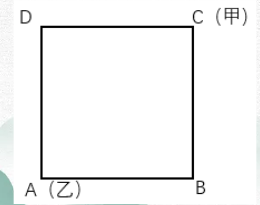
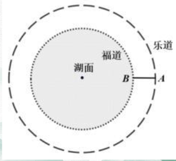
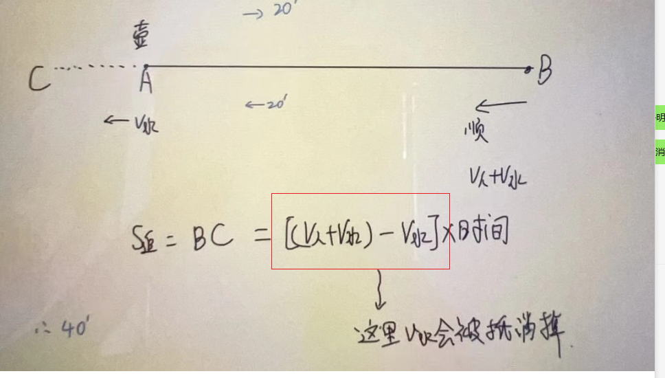
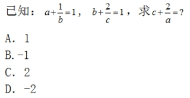
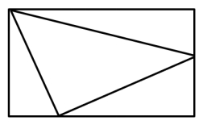
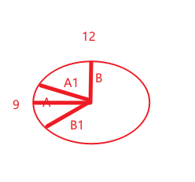
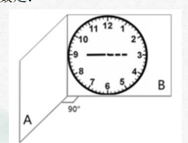

# Table of Contents

* [总结](#总结)
* [基本行程问题](#基本行程问题)
* [迎面相遇问题](#迎面相遇问题)
  * [同一端出发](#同一端出发)
  * [不同端出发](#不同端出发)
  * [多次相遇次数问题](#多次相遇次数问题)
* [追击前补充](#追击前补充)
* [追击问题](#追击问题)
* [抢答（31）](#抢答31)
* [环形相遇-迎面](#环形相遇-迎面)
  * [同一点出发的环形行程问题](#同一点出发的环形行程问题)
  * [不同点出发的环形行程问题](#不同点出发的环形行程问题)
* [2个对象走走停停](#2个对象走走停停)
* [0参照思维](#0参照思维)
* [刷题](#刷题)
* [综合刷题【多刷】](#综合刷题多刷)
* [流水行船](#流水行船)
* [来回接送-冷门考点](#来回接送-冷门考点)
* [牛吃草](#牛吃草)
  * [草速度变化](#草速度变化)
  * [草比牛大](#草比牛大)
  * [亩数不一样](#亩数不一样)
* [扶梯问题-冷门考点](#扶梯问题-冷门考点)
* [公车模型-冷门考点](#公车模型-冷门考点)
  * [发车间隔](#发车间隔)
  * [抢答](#抢答)
  * [发车相遇求车辆数问题](#发车相遇求车辆数问题)
  * [上下车求人数问题](#上下车求人数问题)
* [时钟问题](#时钟问题)
  * [追击](#追击)
  * [时钟相遇](#时钟相遇)
  * [交换时针和分针位置](#交换时针和分针位置)
  * [垂直](#垂直)
  * [重叠-冷门](#重叠-冷门)
  * [快慢钟](#快慢钟)
* [相对速度行程问题](#相对速度行程问题)
* [收集题目](#收集题目)


# 总结

+ 行程问题本质就是对S=VT 的运用，找到不变的量，进行比列
+ 进行真实值匹配，这里题目肯定会给出多个隐藏条件，需要自己推出来。
  + 看题目给出的条件。再看跟比列的关系怎么匹配。【这一步很关键】
+ 一旦份数匹配真实值了，其他都出来了

#  基本行程问题 

+ 基础知识
```
什么是行程 
S=VT  速度指的是平均速度

最重要的就是比例法 也就是积定值 
S 不变 VT 反比
V 不变 TS 正比
T 不变 VS 正比
抓住题目给出不变的量 

S不变的情况下
V1：V2：V3=1：2:3  三个要用最小公倍数6 那时间 V=6：3：2
V1：V2=1：2  t1：t2=2:1

```

+ 如何转化为千米 

  > 转化为千米
  > 6        3600
  > ----  x  ----  =6*3.6 千米/小时  【这种换算方式更好理解下】
  > 1000       1

+ 相向就是对面走


例题 1：小明从甲地到乙地去，去时每小时走 5 千米，回来时每小时走 7 千米，去时比回来时多用了 4 小时。那么小明去的时候用了多少时间？  A.12 小时  B.13 小时  C.14 小时  D.15 小时

```
S不变
V=5;7
t=7;5 差值是2f=4  原来就是14 选C
```

例题 2：一列火车途经两个隧道和一座桥梁，第一个隧道长 600 米，火车通过用时 18 秒； 第二个隧道长 480 米，火车通过用时 15 秒；桥梁长 800 米，火车通过时速度为原来的一半， 则火车通过桥梁所需的时间为（ ）  A.20 秒  B.25 秒  C.40 秒  D.46 秒
```
时间=S/v  
火车过桥 需要先知道火车长度，火车过桥时 火车+桥  以车头为参照系的话，火车尾出来后，才是过了桥

速度一定 t=18;15=6;5  【为什么会这么做，同一个对象，速度不变，TS成正比】
s也是6：5 差值一份  也就是600+s-480-s= 120  原来就是720 火车就是120

920/(720/18/2)=46 选D
```
例题 3：A 地到 B 地的道路是下坡路。小周早上 6:00 从 A 地出发匀速骑车前往 B 地，7:00 时到达两地正中间的 C 地。到达 B 地后，小周立即匀速骑车返回，在 10:00 时又途经 C 地。 此后小周的速度在此前速度的基础上增加 1 米/秒，最后在 11:30 回到 A 地。问 A、B 两地间 的距离在以下哪个范围内？ A.小于 30 公里  B.30-40 公里  C.40-50 公里  D.大于 50 公里
```
   V1    
A------C------B
   V3       V2
Ac=1小时 CB=1小时

bC=2小时   V1=2V2

t2:t3=4:3  V2：v3=3:4 1f是1 V2=3
V1=6米/秒

转化为千米
6        3600
----  x  ----  =6*3.6 千米/小时  【这种换算方式更好理解下】
1000       1

S=vt=6*3.6*2= 选C

```
  **例题 4**：甲、乙两人分别从 A、B 两地同时出发相向而行。当两人合计走完两地间路程的 1/4 时，甲距 A 地的路程是 500 米；当两人合计走完两地间路程的 3/4 时，乙距 B 地的路程 是 2400 米。若两人的速度始终不变，则当速度较快者走完全程时，速度较慢者距走完全程 还剩的路程是 A.1350 米  B.1600 米  C.1800 米  D.1950 米
```
A-------B
题目没有固定变化量，尝试转化下，甲乙一起看
合计走完两地间路程的 3/4 时，乙距 B 地的路程 是 2400 米 变为 1/4是  800
【为什么？因为速度一样
甲乙速度不变，变化的是时间，
】
然后能做什么呢？
A---甲------乙---B
相同的时间 S=5;8 V=5：8

1/4S=1300 总S=5200 

8f=5200 差值3f =3的倍数  3f=1950
---- 尽量寻找相同的量
```
例题 5：AB 两地间有县道连接，BC 两地间有高速公路连接，且 AB 间路程是 BC 间路程的 3/4。郭某从 A 地开车匀速前往 B 地，到 B 地后以 AB 间 2 倍的速度开往 C 地，共用时 2 小时 30 分。由 C 地返回 A 地时高速公路行驶速度不变，县道行驶速度比去程降低 1/3， 则返程用时为: A.2 小时 45 分 B.2 小时 50 分  C.3 小时 10 分  D.3 小时 15 分
```
   3    4
A-----B----C
S=3：4  V=1:2  t=3：2  也就是 90 60 分
返回
CB不变 BA V=3：2 T=2:3  原来90 现在 135分  195分钟 选D

```
例题 6：小张和小王 18:00 分别从甲、乙两地同时出发，沿相同道路匀速相向而行。18:20 小张到达丙地停留，18:40 两人在丙地碰面并均以出发时速度继续行进。18:50 小王到达甲地，问小张在几点到达乙地？ A.20:00  B.20:40  C.19:00  D.19:40
```
   王
甲---丙----乙
   张

Twan:T张=1：2 V=2:1
后面S固定 T=1:2 
王是40 张就是80分钟  18：40+80分钟=20:00 选A

```
**例题 7**：小张家距离工厂 15 千米，乘坐班车 20 分钟可到工厂。一天，他错过班车，改乘出 租车上班。出租车出发时间比班车晚 4 分钟，送小张到工厂后出租车马上原路返回，在距离工厂 1.875 千米处与班车相遇。如果班车和出租车都是匀速运动且不计上下车时间，那么小 张比班车早多少分钟到达工厂？  A.3  B.4  C.5  D.6

```
0.75千米/分
这题没什么思路 
 A-----------C----B

1.875/0.75 =2.5分钟 相遇后班车走了2.5分钟 
那么小 张比班车早多少分钟，这句话怎么理解？

出租车到达工厂后返回遇到班车+班车相遇时间到达工厂
T出+2.5 T出肯定小于2.5 那就是时间肯定小于5 选B

为什么不选A，选A的话，时间0.5 出租车哪有跑那么快的

```
例题 8：甲乙两车的出发点相距 360 千米，如果甲乙在上午 8 点同时出发，相向行驶，分别在 12 点和 17 点到达对方出发点。 但两车在到达对方出发点后，分别将速度降低到原来的 三分之一和一半，再返回各自出发点，那么在当日 18 点时，甲 乙相距： A.120 千米  B.160 千米  C.200 千米  D.240 千米
```
这题直接就告诉时间了
4   9
90  40 

30   20     

30*6-20=160 选B
```
例题 5：某人开车从A镇前往B镇，在前一半路程中，以每小时10公里的速度前进;而在后一半的路程中，以每小时15公里的速度前进。则此人从A镇到达B镇的平均速度是每小时多少公里? A. 12 B. 12.5 C. 14 D. 14.5
```
10*15*2/25=A选

等距离平均公式 
```
例题 6：小明每天从家中出发骑自行车经过一段平路，再经过一道斜坡后到达学校上课。某 天早上，小明从家中骑车出发，一到校门口就发现忘带课本，马上返回，从离家到赶回家中 共用了 1 个小时，假设小明当天平路骑行速度为 9 千米/小时，上坡速度为 6 千米/小时， 下坡速度为 18 千米/小时，那么小明的家距离学校多远？  A.3.5 千米  B.4.5 千米  C.5.5 千米  D.6.5 千米

```
全程的平均速度9千米

来回
9*1/2=4.5 千米
```

# 迎面相遇问题

## 同一端出发

```
甲 乙  甲速度大于乙速度
A----------------B
甲跑的快，到B点返回c相遇
A----C----------B

甲乙2人第一次相遇时，合走了2个全程。AC+AB+BC=2S

然后甲继续跑，这里可以理解为 在C点重新出发【回归原点】，继续跑
那么下次相遇时，肯定还是2s
A----C---D------B
AC+CD+db+AB=2s
---
1.第一次相遇后，可以理解为回归原点了，重新走,甲乙速度都不变，路程不变，相遇时间肯定是每次相等的
2.在距离不变的情况下，2个人每次相遇都是合走2S，且每次相遇时间相等，距离相等。

！！！重点，只看一个对象。方便做题
如果只看甲

1.每次相遇所有时间相等->每次相遇所走路程相等。
```


例题 1：小王和小李沿着绿道往返运动，绿道总长度为 3 公里。小王每小时走 2 公里；小李每小时跑 4 公里。如果两人同时从绿道的一端出发，则当两人第 7 次相遇时，距离出发点（）公里。 A．0 B．1 C．1.5 D．2

```
第一相遇是2s 就是6公里
会发现 小王每次走2 小李走4 就相遇
一共相遇7次。走了14公里
14/3.。。2  选D

```


例题 3：小张、小王二人同时从甲地出发，驾车匀速在甲乙两地之间往返行驶。小张的车速比小王快，两人出发后第一次和第二次相遇都在同一地点，那么小张的车速是小王的多少倍： A. 1.5   B. 2   C. 2.5   D. 3 

```

甲
乙
甲快 乙慢

A------C-----B


第一次相遇  甲走了AB+BC  乙走了AC

第二次相遇 甲走了2AC    乙走了2BC

这里犯了一个错，要用同一个对象相同时间段来看

AC=2BC  2:1 总共就是3  

那么第一次乙就是2 甲就是 4 
相遇时间相等，SV正比

```


## 不同端出发 

```
甲          乙
A-----------B

第一相遇,甲乙合走一个全程。

甲          乙
A-----C-----B   Sab=(V甲+V乙) *T1

第二次相遇，合走了2s

甲          乙
A---C-D-----B
AC+AB+cd+BD=2S   2Sab=(V甲+V乙) *T2

结论：不同端，第一次相遇，合走一个s，以后每次相遇，就要多走2S，且后面相遇的时间是第一次的2倍

还是单个对象。
1.第一次相遇走S，以后每一次相遇所走都是2s，且时间也是2倍 


```

例题 2：货车 A 由甲城开往乙城，货车 B 由乙城开往甲城，他们同时出发，并以各自恒定 速度行驶。在途中第一次相遇，他们离甲城 35 千米，相遇后两车继续以原速行驶到目的城 市立即返回，途中再一次相遇，这时他们离乙城为 25 千米，则甲、乙两城相距（ ）千米。  A.80  B.85  C.90  D.95

```

A           B
甲---C-------乙
第一次相遇 35 说明A走了35
第二次相遇 就是总距离是70 这个时候总距离能不能是35+70+25 明显是不行的的【立即返回，途中再一次相遇】

A           B
甲--C-------乙
       D----乙
       
CB+BD=70 CB=70-25=45

AB=35+45=80
```


例题 4：甲、乙两人同时从 A、B 两地相向出发，甲的速度是乙的速度的 1.5 倍，到达对方 出发点后立即返回，如果第一次相遇点和第二次相遇点相距 300 米，那么 A、B 两地的距离 为（ ）米。  A.300  B.450  C.600  D.750

```
A    2    1   B
甲---D---C--乙

V=3:2 
第一次相遇 距离s5倍数 排除不了
第二次相遇 差距300  
-------------
AC=3F BC=2f
那么加第二次相遇就要走6f，
    3       2
A -------C-- B
      2f
A --D----C-- B
甲---D---C--乙

2f=300 1f=150 5F=750
```

例题 5：小赵和小李是两位竞走运动员，小赵从甲地出发，小李同时从乙地出发，相向而行， 在两地之间往返练习。第一次相遇地点距甲地 1.4 千米，第二次相遇地点距乙地 0.6 千米。 当他们两人第四次相遇时，地点距甲地有多远？  A.2.6 千米  B.2.4 千米  C.1.8 千米  D.1.5 千米

```
先求出总距离，
小赵 4次 1.4*2*3+1.4=9.8
  1.4       0.6
A----C----D--B
2.8-1.2=1.6 总长就是 3.6

9.8-3.6*2=2.6 选A


```


## 多次相遇次数问题


例题 6：某学校为了提高学生身体素质开展体育锻炼活动，某班两名同学 A 和 B 在 100 米 的直线跑道上来回跑步，A 的速度为 5.5 米/秒，B 的速度为 4.5 米/秒，他们同时从跑道 两端出发，连续跑了 10 分钟。在这段时间内，他们迎面相遇了多少次？  A.26  B.29  C.30  D.31

```
第一次相遇：100/10=10 s
第二次相遇  20 
总时间 600S/20 =30次 ，余数是0 
余数小于t1 答案就是 30
余数大于等于t1 答案就是30+1
```

例题 7：在一次航海模型展示活动中，甲乙两款模型在长 100 米的水池两边同时开始相向匀 速航行，甲款模型航行 100 米要 72 秒，乙款模型航行 100 米要 60 秒，若调头转身时间略去 不计，在 12 分钟内甲乙两款模型相遇次数是（ ）。  A.9  B.10  C.11  D.12

```
第一次相遇： 100/（100/72+100/60）=72*60/132
其他相遇就是  72*60/66 

12*60/72*60/66=11
```

例题 8：某高校两校区相距 2760 米，甲，乙两同学从各自校区同时出发到对方校区，甲的 速度为 70 米每分钟，乙的速度为 110 米每分钟，在路上二人第一次相遇后继续行进，到达 对方校区后马上回返，那么两人从出发到第二次相遇需要多少分钟？  A.32  B.46  C.61  D.64


例题 9：甲、乙两车往返于 A、B 两地,两车的速度分别是 60、40 干米每小时,到达目的地后 两车都用了一个小时卸货,两地距离 480,问这两个车第第二次相遇的时间? A.14.4 小时  B.15.4 小时  C.16.4 小时  D.13.4 小时


# 追击前补充


甲公司的马经理从本公司坐车去乙公司洽谈，以30千米/时的速度出发20分钟后，马经理发现文件忘带了，便让司机以原来1.5倍的速度回甲公司拿，而他自己则以5千米/时的速度步行去乙公司。结果司机和马经理同时到达乙公司。甲乙两公司的距离是（   ）千米。
A. 12.5             
B. 13                 
C. 13.5               
D. 14

```

A----C------B
司机走的距离是CA+AB 问法突破
CA=30* 1/3 =10
10+答案=3倍数   【为什么是3倍数 30*1.5倍】
选A
这里容易有一个坑，是先走CA再走AB,不能直接看3倍数的。
-----
V=45：5=1:9
S=9:1
差值8f 对应2AC 1f=20/8=2.5 也就是马老板走的

总共就是AC+BC=12.5
```

14.甲乙两车分别从A、B两地出发，并在A、B两地间不间断往返行驶，已知甲车的速度是15千米/小时，乙车的速度是每小时35千米，甲乙两车第三次相遇地点与第四次相遇地点差100千米，求A、B两地的距离 
A.200千米 
B.250千米 
C.300千米 
D.350千米

```
这题秒就秒在速度给7:3
路程总共就是10f
看甲
第一次相遇 3
第三次相遇  3+3*2*2=15 距离A B都是5
第四次相遇 21 距离A 1 相差4f=100 f=25
10f=250
```

例题 8：某高校两校区相距 2760 米，甲，乙两同学从各自校区同时出发到对方校区，甲的 速度为 70 米每分钟，乙的速度为 110 米每分钟，在路上二人第一次相遇后继续行进，到达 对方校区后马上回返，那么两人从出发到第二次相遇需要多少分钟？ 
A.32 
B.46 
C.61 
D.64

```
问法突破
第二次相遇等于第一次相遇时间的2倍
总数就是3 T1
2762/180 *3=2760/60=4 开头 选B
-----
如果计算复杂，可以先保留，在计算！！！！
```

例题 9：甲、乙两车往返于 A、B 两地,两车的速度分别是 60、40 干米每小时,到达目的地后 两车都用了一个小时卸货,两地距离 480,问这两个车第第二次相遇的时间?
A.14.4 小时 
B.15.4 小时 
C.16.4 小时 
D.13.4 小时

```
减1是3倍数 
-----
2个人，注意是2个人，遇到这种目的地休息，可以都提前到开始的时候，相当于没走路
```


# 追击问题

+ 一般来说都是默认迎面相遇，追击相遇考的很少。
+ 同一点出发的，第二次追击后相差都是2S
+ 追击距离=（速度差）*时间  【主要是这个公式】
  + 什么是追击距离，就是最开始追的时候2个人相差的距离
+ 相遇就是 =（速度和）*时间 


例题 1：在一条笔直的高速公路上，前面一辆汽车以 90 千米/小时的速度行驶，后面一辆汽 车以 108 千米/小时的速度行驶。后面的汽车刹车突然失控，向前冲去（车速不变）。在它 鸣笛示警后 5 秒钟撞上了前面的汽车，那么这辆车鸣笛时两车相距（ ）米。 
A.3.6 
B.20 
C.25 
D.30

```
追击相差=速度差*时间  注意这里时间有坑
18*5/3600 =25 选C
```

例题 2：甲、乙两地相距 100 千米，一辆汽车和一台拖拉机都从甲开往乙地，汽车出发时， 拖拉机已开出 15 千米；当汽车到达乙地时，拖拉机距乙地还有 10 千米。那么汽车是在距 乙地多少千米处追上拖拉机的？ 
A.60 
B.50 
C.40 
D.30

```
追击距离15
当汽车到达乙地时
那拖拉机就是100-15-10=75 汽车100
V=4:3
在追击这一时间段，时间相等【理解这个答案就出来了】
S=4：3 差值f 就是追击的距离
4f=60 答案问的是距离乙 选C 【来不及的话，直接猜题 】
```

例题 3：甲车上午 8 点从 A 地出发匀速开往 B 地，出发 30 分钟后乙车从 A 地出发以甲车 2 倍的速度前往 B 地，并在距离 B 地 10 千米时追上甲车。如乙车 9 点 10 分到达 B 地，问甲车的速度为多少千米/小时（    ）
A.30 
B.36 
C.45 
D.60

```
乙车8点半 到9：10  走了40分钟

速度差=V甲
追击路程=（2v甲-V甲）*30分钟
乙车走剩下的用了10分钟，10km 
----
哪么每小时就是60千米 甲就是30千米

```

例题 4： 甲、乙两人分别沿铁轨反向而行，此时，一列火车匀速地向甲迎面驶来，列车在 甲身旁开过，用 15 秒，然后在乙身旁开过，用 17 秒，已知两人的步行速度都是 3.6 千米/ 小时，这列火车有多长？ 
A.225米 
B.255米 
C.275米 
D.300米

```
问法突破
15 17倍数 
V车+V人 *15
```

一列货运火车和一列客运火车同向匀速行驶，货车的速度为 72 千米/时，客车的速度为 108千米/时。已知货车的长度是客车的 1.5 倍，两列火车由车尾平齐到车头平齐共用了 20 秒，则客运火车长（ ）米。 
A.160 
B.240 
C.400 
D.600

```
这题简单 作业题目
0.5x=108-72 * 20/3600 
x=200
2x=400 选C
```


# 抢答（31）

1.某条道路进行灯光增亮工程，原来间隔35米的路灯一共有21盏，现要将路灯的间隔缩短为25米，那么有（ ）盏路灯无需移动。
A.2 
B.3 
C.4 
D.5

```
间隔数最大公约数
```

2.快递员小张在A、B、C三个小区送快递，已知小张走三条线路A→B→C、B→C→A和C→A→B所花的时间分别为15分钟、17分钟和18分钟。那么距离最近的两个小区之间的路程要花（ ）分钟。 
A.7 
B.8 
C.9 
D.10

```
22称重
```

3.某集团旗下有量贩式超市和便民小超市两种门店，集团统一采购的 A 商品在量贩式超市和便民小超市的单件售价分别为 12 元和 13.5 元。4 月 A 商品在两种门店分别售出了 600 件和400 件，共获利 5000 元，问该商品进价为多少元？
A. 7.2
B. 7.6
C. 8.0
D. 8.4
```

```
4.黑脸琵鹭飞行速度较快，为55公里/小时，白琵鹭飞行速度为45公里/小时，黑、白两群琵鹭从距离深圳湾湿地3120公里的黑龙江出发南飞越冬，若不考虑途中停歇，白琵鹭先到达湿地需比黑脸琵鹭早起飞（ ）小时。 
A.11 
B.12 
C.13 
D.14 
```

```
5.某书的页码是从1开始的连续自然数，1，2，3，4，......莎莎将该书页码全部相加时，不小心将其中某页码多加了1次，结果和为2003，则被多加的页码为（ ）
A.45 
B.50 
C.56 
D.62 
```

```
6.有甲、乙两种咖啡豆，按照质量比a：b相混合制成一种拼配豆，已知甲咖啡豆每公斤60元，乙咖啡豆每公斤80 元，现因产量变化，甲咖啡豆单价上涨15%，乙咖啡豆单价下降15%，以致该拼配咖啡豆的成本上调了5%，则 a：b为（ ）。 
A.1：1 
B.5：3 
C.8：3 
D.2：1 

```

```
7.作曲人阿伟不久前创作了一首歌，甲、乙两个音乐平台均获得其使用权，甲平台根据该歌曲播放数乘以0.01元给予收益；乙平台除给予10万元基础收益外，另计每次播放收益0.006元，现从甲平台获得的收益比乙平台多10000元，且此时该歌曲在甲平台的播放量比在乙平台高500万次，那么该歌曲在甲平台的播放量为（ ）万次。 
A.1800 
B.2000 
C.2200 
D.2400 
```

```
8.某商城停车场实行按时长阶梯式收费，收费规则如下：不超出某一基础时长的，按5元/小时收费。超出该基础时长的，超出的部分每小时收费增加3元；停车时长达基础时长3倍以上时，则超出基础时长3倍的部分，每小时收费再增加3元。若甲某次停车离场时超出基础时长11小时，共交费116元，则基础时长为（    ）小时。（该基础时长为整数，停车时长不满1小时的按1小时计）
A.6
B.5
C.4
D.3

```
全部看作是基础时长
5a+3倍数=116-55=61
四大维度 /3.。1
```
9.小王从图书馆借了一本书，书共204页，阅读时，他发现书的前半部分有连续的4个页码被墨水污染，将其余200个页码加总，其和刚好可以被85整除，则被污染的4个页码中最小的数是：
A.100
B.95
C.75
D.41
```

```
10.某公司共有60人参加行业考试，考试共设5道必答题，满分为100分，每题答对得20分，答错不扣分，总分60分即为合格。经统计，第1至5题分别有52人、56人、48人、42人、30人答对，则该公司至少有（   ）人及格。
A.30
B.36
C.39
D.40
```
浇水
```
11.甲、乙两船分别从A、B两地同时匀速出发相向而行，一个救生圈在甲船出发时从甲船上掉落浮于水面，并从A地向B地漂流。出发5小时后，甲船与漂浮的救生圈相距75千米；又经过7小时，乙船与漂浮的救生圈相遇。已知甲船在静水中航行的速度是乙船在静水中航行的3/5 ，则A、B两地相距多少千米？
A.108 
B.180 
C.210 
D.300
```
静水行船
```

# 环形相遇-迎面


## 同一点出发的环形行程问题

+ 每次相遇，2人合走一圈，且每个人走的时间相等。
+ 追击的话，路程差都是一圈
+ 相遇：速度和*时间
+ 追击：速度差*时间

例题 1：甲、乙二人从同一地点同时出发，绕西湖匀速背向而行，35 分钟后甲、乙二人相 遇。已知甲绕西湖一圈需要 60 分钟。则乙绕西湖一圈需要（  ）分钟。 
A.25 
B.70 
C.80 
D.84

```
等比模型：35*35=25 x

全程来看的话，距离是一样的 【运用结论，圆形同端点出发的，相遇时一圈】
t=35:60=7:12 这个12是合计的
V甲:V乙=7：5

7*60/5=84

```

例题 2：在一个 400 米的跑道上，甲乙两人从跑道上的 A 点反向而行，甲走路速度为 2 米/ 秒，乙骑车速度为 10 米/秒，两人相遇后沿各自的方向继续前行，当两人第六次相遇时，相遇点在距 A 点（ ）米处。 
A.50 
B.100 
C.150 
D.0

```
还是用结论做，先看在哪里相遇
400/12=100/3
对于甲来说 2* 100/3 * 6 相遇6次

对于乙来说 10  为什么答案不是400？？？ 距离2000 走了5圈刚好也是起点

```


## 不同点出发的环形行程问题

```
原则，把不同点转化为相同点，根据题目具体分析，见例题

```

例题 3：在一个圆形跑道上，甲从 A 点、乙从 B 点同时出发反向而行，8 分钟后两人相遇，再过 6 分钟甲到 B 点，又过 10 分钟两人再次相遇，则甲环行一周需要多长时间？
A.24 分钟
B.26 分钟
C.28 分钟
D.30 分钟

```
先看第一次相遇的地点，假设为C

A     B   【这里这里AB 不一定在一起】
   
   C
 乙BC 8分钟
 甲CB 6分钟
 速度比为V甲:V乙=4：3  总距离就是 7*16【为什么是16 第一次相遇后，走完一圈回到原点是16】
 
 7*16 /4 
```

例题 4：王大妈与李大妈两人分别从小区外围环形道路上 A、B 两点出发相向而行。走了 5 分
钟两人第一次相遇，接着走了 4 分钟后，李大妈经过 A 点继续前行，又过了 26 分钟两人第
二次相遇。问李大妈沿小区外围道路走一圈需要几分钟？
A.54
B.59
C.60
D.63

```
一模一样的题型
V李：V王=5:4

9*30 【26+4】
----  9因子选A
5
```

例题 5：环形跑道的周长为 400 米，甲乙两人骑车同时从同一地点出发，匀速相向而行，16 秒后甲乙相遇。相遇后，乙立即调头，6 分 40 秒后甲第一次追上乙，问甲追上乙的地点距 原来的起点多少米？ 
A.8 
B.20 
C.180 
D.192

```
相遇后，掉头变为追击，差值就是一圈
----这题就比较经典了，相遇后在追击
结论：相遇和追击都是距离S
V1+v2=400/25
v1-v2=400、400
V1=13 V2=12

这里设计的很好，6 分 40 秒后甲第一次追上乙 ,刚好是400分钟，不管是单独看甲还是单独看乙，都是在第一次
相遇点追上了，
那么问甲追上乙的地点距 原来的起点多少米，其实就是甲乙第一相遇到起点的距离。

13*16=208 没答案
12*16=192 选D
```

例题 6：甲、乙、丙三人沿着长为 500 米、宽为 250 米的长方形场地跑步，三人以 2：1： 3 的速度之比匀速顺时针跑步。当甲进入场地时乙已跑完 1/3 圈，丙到场地时已落后甲 100 米。问当乙跑完 2 圈时，甲与丙的位置关系如何？ 
A.丙领先甲 3000 米 
B.丙领先甲 2900 米 
C.丙领先甲 2450 米 
D.丙领先甲 2350 米

```
问当乙跑完 2 圈时  当甲进入场地时乙已跑完 1/3 圈
那么甲就是 5/3 圈 一圈是1500  甲就是2500
---- 路程还是要找不变的量，这里不变的是时间，【这才是行程关键破题】

这里乙实际跑了5/3圈，跟速度成正比，那么甲就是10/3  就是5000米 减去最开始跑的就是4900
同理 丙跑了 10/3 * 3/2 =5圈 等于7500 【这里分别算 实际上是不好做的】

---------
丙= 4900 * 3/2 =7350
7350-4900=2350 选D
```

# 2个对象走走停停

+ 直接代入，看差值 【一般来说代入最小的】

例题 7：甲、乙两人从湖边某处同时出发，反向而行，甲每走 50 分钟休息 10 分钟，乙 每走 1 小时休息 5 分钟。已知绕湖一周是 21 千米，甲、乙的行走速度分别为 6 千米/ 小时和 4 千米/小时，则两人从出发到第一次相遇所用的时间是:
A.2 小时 10 分钟 
B.2 小时 22 分钟 
C.2 小时 16 分钟 
D.2 小时 28 分钟

```
代入A 130分钟
甲走了110分钟 休息10分钟，后面还要再走50分钟 距离就是 6*110/60=11Km
乙走了120分钟 休息了10分钟 后面还要走一个小时 距离是 8Km
21-11-8=2Km 速度和
2/10=0.2 km/时 =12分钟 
加上原来 答案选B
```

例题 8：甲工程队每工作5天休息1天，乙工程队每工作6天休息2天。一项工程由甲工程队单独完成需要65天，由乙工程队单独完成需要86天。甲、乙两个工程队合作，从7月5日开始动工，则完工日期是8月几日？
A.3 
B.7 
C.10 
D.11

```
这题比较经典，融合了很多知识
1. 告诉你工作，求效率，这里融合了休息， 65 86包含了休息时间，需要求出真正工作的时间
65/6（周期）=10。6 =11个周期 55天干活
86/8=11个周期 66天干活
最小公倍数为330 V=6：5
2.根据日期，计算天数
走走停停，代入A，7.5--8.5时过了31天，就是32天，到8.3号就是过了30天，这里也容易错
3.代入计算
一起要工作30，这里总共30天肯定不可能，直接排除AB 代入C C是37天
37/6=6  5*6+1=31天
37/8=4...5  4*6+5=29天
31*6+29*5=186+145= 331 选C

```

例题 9：如下图所示，A、B 两点是圆形体育场直径的两端，两人从 A、B 点同时出发，沿环形跑道相向匀速而行。他们在距 A 点弧形距离 80 米处的 C 点第一次相遇，接着又在距 B 点弧形距离 60 米处的 D 点第二次相遇。问这个圆形体育场的周长是多少米？
A.240
B.300
C.360
D.420

```
   C

A -------------  B
          
         D
         
把AB拉直，就是直线2端相遇问题了【点在直径的2端，就是往回走，可以拉直】
aC=80 BD=60
160-120 /2 =40

80+60+40=180 
总的就是360
```

# 0参照思维

```
对于速度合成的的问题，好好理解速度合成
S=(V1-V2)*t  V1=6 V2=2 
此时把V1-V2 看做是4-0 是不影响计算结果的，
同理相遇问题
S=(V1+V2)*t
同理水流问题
```

+ 一般假设速度最慢的 相对速度

例题 10：老杨、老朱和小张三人开展社区巡防工作，巡防路线固定，三人同时同向出发，老杨开车，老朱骑自行车，小张走路。已知老杨每20分钟追上小张一次，每40分钟追上老朱一次，则老朱每（ ）分钟追上小张一次。 
A.30 
B.40 
C.50 
D.60

```
这里有速度和，假设小张速度为0，也就是在原地不动
已知老杨每20分钟追上小张一次  走一圈20分钟
每40分钟追上老朱一次  追击差等于一圈=老杨2圈-老朱一圈 也就是老朱40分钟一圈
选B
```

例题 11：甲、乙、丙从长360米的圆形跑道上的不同点同时出发，沿顺时针方向匀速跑步。3分钟后甲追上乙，又过1分30秒后丙也追上乙，又过3分30秒后丙追上甲，又过5分30秒后丙第二次追上乙。问出发时甲在乙身后多少米
A．48
B．84
C．108
D．144

   丙

​         甲

   乙

```
假设乙不动 【这里用的是速度是相对速度-追击速度】
丙  又过1分30秒后丙也追上乙 又过5分30秒后丙第二次追上乙 从开始到现在9分 360/9=40
【用追击距离来列出一个公式】
甲乙+丙甲=丙乙
3V甲+8（V丙-V甲）=4.5V丙
V丙=40  V甲=28

问出发时甲在乙身后多少米 .3分钟后甲追上乙 就是追击距离=28*3=84
```

# 刷题


例题 12：甲、乙两人在一条 400 米的环形跑道上从相距 200 米的位置出发，同向匀速跑步。当甲第三次追上乙的时候，乙跑了 2000 米。问甲的速度是乙的多少倍？
A.1.2
B.1.5
C.1.6
D.2.0

```
追击问题
追上表示时间相等
当甲第三次追上乙的时候，乙跑了 2000 米 表示 每次都差400
2000+200+400+400【追击距离】
S=2000:3000=2:3 
```

例题 13：一条圆形跑道长500米，甲、乙两人从不同起点同时出发，均沿顺时针方向匀速跑步。已知甲跑了600米后第一次追上乙，此后甲加速20%继续前进，又跑了1200米后第二次追上乙。问甲出发后多少米第一次到达乙的出发点？
A.180　　
B.150　　
C.120　　
D.100

```
环形不同点，先看第一次相遇的，，又跑了1200米后第二次追上乙
时间相等 S=1200:700 [差值1圈]
V=12：7  原来的速度就是10:7 
看第一次追击
V=10：7
S=10：7  差值就是追击的距离 10f=600
差值3f =180

```

例题 14：小王乘坐匀速行驶的公交车，和人行道上与公交车相对而行、匀速行走的小李相遇，30 秒后公交车到站，小王立即下车与小李同一方向匀速快步行走。已知他行走的速度比小李的速度快一倍但比公交车的速度慢一半，则他多久之后追上小李？
A.3 分钟
B.2 分钟 30 秒
C.2 分钟
D.1 分钟 30 秒

```

小李1 返回2 公交4
30秒到站后，小李走了30 公交走了120
150/（追击速度）=150秒 =2分钟30秒 选b
--- 牢记追击公式 追击距离=（速度差）* 时间
```

例题 15：甲、乙、丙、丁四人同时同地出发，绕一椭圆形环湖栈道行走。甲顺时针行走，其余三人逆时针行走。已知乙的行走速度为 60 米/分钟，丙的速度为 48 米/分钟。甲在出发6、7、8 分钟时分别与乙、丙、丁三人相遇，求丁的行走速度是多少？
A.31 米/分钟
B.36 米/分钟
C.39 米/分钟
D.42 米/分钟

```
相遇距离是s
根据距离相同，求出甲为24 为504
504/8=63 -24=39分钟
-------
总距离相等，时间速度成反比
6；7；8
28；24；21

60+x  48+x   28 24  4f=12  3f=9

48+x x+?  ？=39 才满足3f=9的要求，
```

例题 17：甲乙两车分别以 96 千米/小时、24 千米/小时的速度在一长 288 千米的环形公路上行驶。如果甲乙两车在同一地点、沿同一方向同时出发，甲每次追上乙时甲减速 1/3，而乙增速 1/3，则当甲乙速度相等时甲所行驶的路程是
A.950 千米
B.960 千米
C.970 千米
D.980 千米

```
每次追上
96-24= 72  288/72=4  
64-32=32   288/32=9
后面还要算吗？是分数了。。
这样做好麻烦，看鸿哥有什么好思路没
---------------------------------------

96(2/3)^2=(4/3)^224
2^n=4
n=2  所以上面的是不用算的
96t+64t 都有8因子 选B
-------- 算相遇几次是难点。。。
```
例题 18：甲乙两人绕着周长为 600 米的环形跑道跑步，他们从相同的起点同时同向起跑。已知甲的速度为每秒 4 米，乙的速度为每秒 3 米，则当甲第一次回到起点时，乙距离起点还有（ ）米。
A.100
B.150
C.200
D.250

```
150秒
450 150 选b
```
例题 19：如右图，正方形的迷你轨道边长为 1 米，1 号电子机器人从点 A 以 1 米/秒的速度顺时针绕轨道移动，2 号电子机器人 从点 A 以 3 米/秒的速度逆时针绕轨道移动，则它们的第 2017 次相遇在：
A.点 A
B.点 C
C.点 B
D.点 D

```
第一次相遇D 第二次相遇C BA D 循环 2017/4.。。1 还是在D点
```


# 综合刷题【多刷】

+ 谁比谁提前几分钟，抓住提前的时间体现在哪里【例题3】
  + 假设2人从同一点出发
+  追击三个对象中 S都是成正比的 S追 S甲 S乙 因为时间相等，S与速度成正比
+ 

一个山丘的形状如下图所示。甲、乙两人同时从A点出发匀速前往B点，到达B点后立刻返回。甲上坡速度为3米/秒，下坡速度为5米/秒；乙上坡速度为2米/秒，下坡速度为3米/秒。问两人首次相遇时，距A点的路程为多少米？  A. 108  B. 138  C. 150  D. 162

```
          C
    120_            60-
A-----------------------B

这题先看选项都是100多米，说明大概率是甲跑BC这段路程。
120/3 40 60/5 12
120/2=60 
也就是多跑8秒 24 这个时候，乙刚好在C点
36/3+6 =6s  18
120+18=138 米
```

2.【2023国考】 从A地前往B地的道路前40%的路程为上坡路，其余为下坡路。张某驾驶满载的汽车从A地去B地卸货，然后空车返回A地。已知他满载时上坡的速度是下坡速度的一半，空车时上、下坡的速度分别是满载时的1.5倍和1.2倍。问他返程的用时是去程的多少倍？  A. 5/6 B. 5/7 C. 17/21 D. 19/24

```

```

例题 3：【2024浙江省考】 甲、乙两人以相同速度一起骑车从A地前往B地。同行1小时后，两人休息20分钟，然后甲继续原速出发，此时乙发现有重要物品未带，原速返回A地去取，到达A地后立即开车前往B地。最终乙比甲提前12分钟到达B地。已知开车速度是骑行速度的5倍，那么甲全程用了多少分钟？ A.165  B.175 C.185  D.195

```
猜题的话从CD猜，因为题目给了陷阱20分钟
   1  
 -------C  
A-------C-----------B
1.根据题目找关键信息
开车速度是骑行速度的5倍 V=5:1 T=1:5
所以乙回来A在到C 时间就是 60+(60 * 1/5)=72分钟
2.后面怎么做呢？乙回来的时候，甲也在走？【假设在同一点出发,后面这种提前出发的，都可以假设在同一点出发】
就让甲在乙等72分钟，BC相等 t=1:5
最终还是是提前12分钟【这里卡顿了】
如果从同一点出发，应该是提前12+72 为什么？【把72算进去，是提前了12分钟，不算进去就是提前了84分钟】
时间差4f=84 f=21
甲就是105+60+20(休息的时间)=185
```

例题 4：【2024全国联考】 某校园围墙外的道路形成一个边长为300米的正方形（如图所示），甲、乙两人分别从正方形的两个对角沿逆时针方向同时出发，甲、乙的步行速度比为9：7。问甲、乙两人第一次处于同一条边是在哪一条边上？  A.AB  B.BC  C.CD  D.DA 



```
问甲、乙两人第一次处于同一条边是在哪一条边上？
现在在2条边，追击距离变为1条边就是符合条件
追击距离=（速度差=9-7）*T
【我们会发现 追击三个对象中 S都是成正比的 S追 S甲 S乙 因为时间相等，S与速度成正比】
S追=2
S乙=7
S追=1 表示追击了一条边，那么S乙走了几条边？ 3.5条 也就是AD
------------刷题补充，这种做法更好理解
假设一边为a
追击距离a=2*t
7*t /a=7*t/2*t=3.5 代表3.5条边长，也就是ad中点。
```


例题 5：【2024国考】 甲和乙两辆车同时从 A 地出发匀速开往 B 地，甲车出发时的速度比乙车快 20%，但乙车行驶2小时后速度 加快 30 千米/小时继续匀速行驶，又用了 3 小时与甲车同时抵达，问 A，B 两地相距多少千米？  A．540  B．510  C．600  D．570

```
速度比
V甲:V乙=6:5 
虽然乙慢，但是是同时到达
S=6:5 本来应该有1f差值，但是乙走了3*30=90 给补齐了 【盈亏思想，前面缺的 等于后面补的 盈亏也是归元的一种】
说明6f=540 选A
```

例题 7：【2024深圳市考】 小朗和小峰每晚都会绕着体育场跑步。某 晚，小朗、小峰分别从体育场的一号门、三号门同时出发匀速跑步，6分钟后，两人迎面相遇，相遇后，两人继续匀速前进。小峰又跑了5分钟到达一号门并由此进入体育场，横穿体育场从三号门跑出，沿与小朗相同的方向继续跑。已知小朗跑到三号门时，小峰距三号门还有180米，小峰又经过6分钟追上了小朗。则小朗的跑步速度为（ ）千米/小时。 A.6  B.7.2  C.9  D.10.8

```

A------C-------B
6分钟相遇，5分钟到1号门
时间5:6
V峰：V郎=6：5
------------------------------------ 后面这个要理解题目意思
A------C-------B
-----------180 ---
小峰又经过6分钟追上了小朗，说明追击距离是180 【这个是关键】
180/6=30=速度差
5f=150 米/分钟

150
---   * 60 =9千米/小时
1000
```

例题 8：【2024广东省考】 小李从山脚开始登顶，匀速走了1小时后到达一个凉亭，并在凉亭休息了半小时。继续走500米后，恰好完成登顶路程的一半。从山顶沿原路匀速返回时，他走了1小时又到了这个凉亭，继续走半小时回到了山脚。则登顶路程为（ ）米。 A.2000  B.3000  C.3600  D.4000
```
A-----凉亭--500-中点-----B
A-----凉亭---------------B
先看题目给出的条件，匀速走了1小时后到达一个凉亭，，继续走半小时回到了山脚
V上:V下=1:2 
这个时候怎么做？其实题目给了条件，那就是中点和凉亭【也就是看到中点的时候，要利用中点和同走一个小时带来的路程差】
上山一个小时：中点-500
下山一个小时：中点-500
V=1:2 S=1:2 差值1f=1000 所以上山A-凉亭就是1000 A-中点就是1500 总的就是3000


第二种做法，TA凉：TB凉=2:1 V一定，S成正比=1:2 Sa凉=1/3 那么凉亭到中点=2/3-1/2=1/6 全程=3000

---寻找题目条件，进行关系匹配，答案就出来了
```
例题 10：【2024联考】 c 地为 a、b 两地直线道路上的一点，甲、乙两人 9：00 分别自 a、b 两地同时出发匀 速相向而行，甲的速度是乙的 1.5 倍，甲 9：40 到达 c 地休息 10 分钟后继续向 b 地前进； 乙全程不休息，在 10：40 到达 c 地，问甲、乙相遇的时间为： A.10：00  B.10：10 C.10：20  D.10：30
```
A-------C-------B
相遇问题 速度和 速度：3:2
甲 9点50从C出发，同CB情况下
100*2=200 相遇距离 【】
200/5=40
9.50+40=10:30 选D
------甲9.50的时候，乙已经走了100了 【这就是一个坑点】
所以200-100=100/5=20
选B

```
例题 11：【2024四川】 小李开车去某单位办事，计划全程匀速行驶2小时到达目的地。出发后头30分钟按计划速度行驶，此后50分钟交通拥堵，行驶的路程和前面30分钟相同。最后40分钟小李匀加速行驶，最终全程用时2小时到达。问他最后10分钟的平均车速是计划行驶速度的多少倍？  A.不到1.8倍  B.不低于1.8倍但低于2.0倍  C.不低于2.0倍亦不高于2.2倍  D.高于2.2倍
```
第一段距离 t=3:5 V=5:3  【这里改为1:0.6】
本来是2个小时，前面多走了20分钟
后面40分钟就是原来60分钟
速度比=3：2 这个时候就是V平均=1.5

经过40分钟，其实是40项，第一项就是0.6 匀加速到 3

A21就是1.5 求最后10分钟，就是A31-A41 中间项 也就是A36

```
例题 12：【2024山东】 小王和小李同时从山脚 A 点出发匀速登山，小王距山顶还有 1/2 路程时小李刚走完上山路程的 3/8，小王到达山顶后立即原路返回，10 分钟后遇到上山途中的小李。已知两人下山的速度为各自上山速度的 1.5 倍，问小李比小王晚多少分钟到达山脚 A点？  A.30  B.40  C.50  D.60
```
小王距山顶还有 1/2 路程时小李刚走完上山路程的 3/8，小王到达山顶后立即原路返回
s为8份 V=4：3
  4     4
A----C-----B
        [也就是小王回来的时候 还有2份]
 3   3  ---
 
 小王下山为 6 小李上山为3
 相遇 距离2份 速度比2:1   小王2/3路程用了10分钟 1f路程就是15分钟-- 这里写错
-----------[这里 小李的路程是1/3 但是时间是2/3  2/3对于10分钟 1f路程就是15分钟] 

8*15=120分钟
下坡速度是原来的1.5倍 80
120+80=200分钟
速度比3:4 时间比4:3   差值1f就是50 选C
```
例题 13：【2024浙江事业】 甲地突发洪涝灾害，从乙地紧急运送救灾物资。已知救灾物资通过 17 列火车从乙地运到甲地，两地火车站相距 800 千米，列车车速 160 千米/小时，根据安全规定，相邻两列火车运行间隔不得小于 20 千米，那么这批物资全部到达甲地最少需要多少个小时?  A.6.875  B.7  C.7.125  D.7.25
```
先看第一列火车什么时候到
800/160=5
再看有多少间隔 16*20=320 
320/160=2
最后一个火车进站就是7小时
```


小明和一名老先生爬一座小山，小明比老先生快。二人同时从山下起点出发，到达山顶后立刻返回，且下山的速度都各是自身上山速度的1.5倍。小明和老先生相遇时老先生已出发40分钟。老先生到达山顶时，小明正好在半山腰。求小明往返用()分钟。 【**经典题目**】
A.120 
B.90
C.60 
D.50

```
同样找行程的变和不变，这里什么不变，时间
老先生到达山顶时，小明正好在半山腰,题目告诉我们什么时间不变，是不是可以得出路程之比，和速度之比？
假设全程S
老先生 S
小明呢 先上山S 在下山1/2 但是速度变为原来的1.5 
这里有一个难点，速度在变，怎么转化为原来的速度和老先生比呢

时间相等：V=2:3 S=2:3  1/2s * 2/3 =1/3s 这句话就是如果小明还是以原来速度走
会走1/3S

也就是小明走了 4/3S 
速度比=3:4
求小明下山，什么不变,S不变，但是小明下山速度变了 V=3:6
【这里小明要走老先生之前2小时要走的路】
t=2:1 原来是40 现在是20 
总共就是40+20=60

```


例题 14：【2024浙江事业】 甲、乙两位同学在周长为 400 米的正方形小道上跑 1000 米。两人起点均位于正方形小道某一端点且出发方向一致，甲绕着小道循环跑，乙沿着小道的一条边 100 米往返跑。已知甲的速度为 4 米/秒，乙的速度为 5 米/秒，那么甲、乙第三次相遇的位置与第一次相遇的位置之间的距离是多少米?(不考虑出发时相遇的情况)  A.0  B.400/9  C.200/3  D.800/9

```
A--X---B
|     |
|     |
C------D

甲从A出发BCD，乙在AB来回跑，乙的速度大于甲，则第一次相遇肯定在AB，200/9 第一次相遇时间，
A相遇后继续出发，第二次相遇肯定是第一次相遇后，又跑了一圈，
题目问第三次相遇，甲至少跑2圈，是至少，不是2圈，我们先看甲跑2圈要多久，
800/4=200m
乙跑200s已经跑完了，回答了A点，即使甲跑完2圈没有相遇，再跑，第三次相遇还是A，因为乙已经
跑完了，【这题如果把距离改长点，就更难了】

问的第三次和第一次，其实就是A到第一次，也就是
200/9 * 4= 800/9 【为什么是乙，一般来说，相遇用最慢的速度求距离】
```

例题 15：【2024省考联考】 某地人工湖景区开辟了沿湖福道和环湖乐道两条圆形观景道供市民休闲健身（如下图所示）。小李和他的妈妈分别沿乐道和福道从A、B两地同时同向而行（A、B两点间距离为50米），小李骑自行车的速度是妈妈步行速度的6倍，已知妈妈步行速度为每小时5千米，妈妈沿福道步行一周的时间是小李骑行乐道时间的4倍，那么这个湖面的面积约多少万平方米?（圆周率取3） A.2  B.3 C.4  D.6


```
问法突破 
面积=3R^2  答案/3 是平方数
-------------题干突破
V李：V妈=6：1
T李：T妈=1：4
都在变，公式比例法
S李：S妈=3:2
这里的S是圆的周长比 2TR ,其实就是半径之比
差值1f=50 内圆就是100
锁定答案B 
```
例题 16：【2024成都事业】 甲、乙两人分别从相距27公里的A、B两地同时骑车匀速相向而行，甲的骑行速度为6米/秒、乙的骑行速度为4米/秒。在甲、乙两人出发后5分钟，有一辆长度为120米的动车由A向B出发，车速为180千米/小时，与甲同向。则当乙与动车尾相遇时，甲距离B地有（  ）。 A.22320米 B.22332米 C.24120米 D.24132米
```
这题坑点比较多，且计算量大
1.单位不同，一般来说是将大单位换算为小单位  180千米/小时 直接除以1000/3600 3.6 也就是50
2.与动车尾相遇 这里需要加上车的距离120米
3.甲乙先出发5分钟 甲就是3000*6=1800 会有陷阱
---- 正常思路
1.求出 相遇时间，算出甲走了多少
2.在用总距离-甲先走的-相遇时间走的，就是甲到B
----份数关系
27公里 3倍数
6米/秒 3倍数
27-答案=3倍数
所以答案是3倍数，观察都是3倍数。骂了下出题人
-----因子进阶
出发5分钟后 5*60 含有因子3 
27公里 9倍数
6米/秒 3数 *5分钟 9倍数
27-答案=9数
答案就是9倍数，观察答案，排除DB
再结合上面坑点3 1800 选C 
```
例题 17：【2016山东】 一支车队共有 20 辆大拖车，每辆车的车身长 20 米，两辆车之间的距离是 10 米，行进的速 度是 54 千米/小时。这支车队需要通过长 760 米的桥梁（从第一辆车头上桥到最后一辆车尾 离开桥面计时），以双列队通过与以单列队通过花费的时间比是（ ） A．7∶9  B．29∶59 C．3∶5  D．1∶2
```
遇到这种题，第一反应，选项突破，看一个因子就可以了，发现双列因子特征更明显
双利 10排一起 9个间隔
10*20+10*9=200+90=290 +760=1050=5*3*70 含有因子70
   S    5*3*70 
t=--- = --     会发现7因子没发抵消，直接选A
   V     54

------ 正规做法
都算出来，太麻烦了
```
例题 18：【2019北京】 小王和小张分别于早上 8：00 和 8：30 从甲地出发，匀速骑摩托车前往乙地。10：00 小王到达两地的中点丙地，此时小张距丙地尚有 5 千米。11：00 时小张追上小王。则甲、乙两地相距多少千米？ A.50  B.75  C.90  D.100
```
看见追击，眼镜一亮，找找有没有相同的量。
10：00 小王到达两地的中点丙地，此时小张距丙地尚有 5 千米。11：00 时小张追上小王。

追击距离=追击速度*时间
5=V追*1  
小张追小王，小王先出发，到10点的时候
小张追了1.5小时 7.5
加上后面追的 5  总共追了12.5千 才追上【全局追击】
    B----------------C
A--------------------C
也就是说 A-B就是小王提前走的
12.5/0.5=25
25*2=50 总距离就是50*2=100
【破题点：追击公式】
```
例题 19：【2019国考】 甲车上午8点从A地出发匀速开往B地，出发30分钟后乙车从A地出发以甲车2倍的速度前往B地，并在距离B地10千米时追上甲车。如乙车9点10分到达B地，问甲车的速度为多少千米/小时（ ） A.30             B.36 C.45             D.60
```

    乙---------C
A------------------B
C点说明时间相等
追击距离=速度差*时间 =V甲*时间=V甲*30分钟 
乙是8点半出发 9点10分到 走了40分钟
也就是说乙10分钟走了10千米   1米/分钟 =60 千米/小时 甲就是30 选A
【破题点：追击公式】
```
例题 20：【2023北京】 从A地到B地是下坡路，一辆车从A地开往B地需要三小时，从B地开往A地需要四小时。已知这辆车下坡速度比上坡速度快15千米/小时，则A、B两地之间的距离是多少千米？ A.120  B.180  C.240  D.300
```
简单题
S不变 t=3:4 V=4:3
A----------------B
1f=15 4f=60
60*3=180 选B
```


# 流水行船

+ 0参照思维应用

  + 抵消

    ```
    V顺=V船+V水
    V逆=V船-V水
    
    追击的时候，V顺1-V顺2 V水会被抵消
    ```

    

  + 相对速度，时间路程不变

    ```
    S=(V船-V水)*T
    只要括号内值不变，TS成定值
    ```

    

+ 简单题直接做，实在不行再用0参照思维

+ 用份数实现来表示 V船+V水  V船-V水

  ```
  知道比例关系
  V顺   3
  -- = 
  V逆   2
  
  V船+V水=3F    之前小技巧，相加/2 是左边
  V船-V水=2F
  V船=2.5f
  V水=0.5F
  做起题来更快
  ```


+ 水速度拐弯，上游是顺流，下游到上就是逆流

例题 1：一客船往返于 A、B 两地，已知 A、B 相距 36 千米，客船一往一返分别需要 2 小 时和 3 小时，假设水流速度保持不变，求水流速度及船速分别是多少千米/小时？  A.5，13  B.4，14  C.3，15  D.2，16

```
S不变 VT
t=2：3
V=3:2

3+2/2=2.5 3-1/2=0.5 5 倍关系 选C
------常规做法
36/2=18
36/3=12
18+12 /2 =15 选C
```

例题 2：一条执行考察任务的科考船，现从 B 地沿河驶入海口，已知 B 地距入海口 60 千 米，水速为每小时 6 千米，若船顺流而下，则用 4 小时可以到达入海口，该船完成任务从 入海口返回并按原速度航行 4 小时后，由于海水涨潮，水流方向发生变化，水速变为每小 时 3 千米，则该船到达 B 地还需再航（ ）小时。  A.5  B.4  C.3  D.2
```
V顺=60/4=15 V水=6 V=9
V逆=3 
3*4=12 60-12=48 
V顺=9+3=12  水流方向发生变化，水速变为每小 时 3 千米
48/12=4 小时
```
例题 3：甲、乙两名游泳运动员同时从下游A点出发，游向900米外的上游B点并立刻原路返回。甲游了200米时，乙游了120米。已知甲顺流游泳的速度是逆流的1.8倍，问两人迎面相遇的地点距离A点多少米？ A.270 B.390 C.510 D.630
```
T不变 SV
S=200:120
V=5：3

A------------------B 乙
A------------------B 甲
         C--相遇----
其实就是相遇问题 
甲游了900时， 乙与游了540 ，相遇肯定在540之后，选D
----具体做法

CB=900-540=360 相遇距离360
速度比：9：3 这个时候要注意是 甲是顺流了
时间一定
S=3:1  90
540+90=630

【这其实就是爬山，回来速度增加，这里就不用考虑水的速度了】
-------用流水行船来做
V甲顺   9
----= ---   V甲=7 V水=2
V甲逆   5

S=5:3 可以知道V乙就是 5 因为V乙-V水=3


```
例题 4：甲、乙两港相距 720 千米，轮船往返两港需 35 小时，逆流航行比顺流航行多花 5 小时，帆船在静水中每小时行驶 24 千米，问帆船往返两港要多少小时？  A.58 小时  B.60 小时  C.64 小时  D.66 小时
```
正常算就行
35+5 /2= 20
35-5 /2=15

720/20=36
720/15=48

48-36 /2=6 V水

720/30=24
720/18=40 
40+24=64 选C
```
例题 5：甲、乙两船同时从 A 地出发，甲船逆流前往 B 地，乙船顺流前往 C 地，1 小时后两 艘船同时掉头航向 A 地，甲船比乙船早 1 小时返回，已知甲船的静水速度是水流的 3 倍，那 么甲船的静水速度和乙船的静水速度之比是：  A.3:5  B.2:3  C.3:4  D.2:5
```
V水=1 V甲=3
对于甲船来说S不变
V=2:4
t=1：2 
原来1 现在0.5 那么乙回去就是1.5 

T=1:1.5=2:3
V=3:2  V乙=2.5 V水=0.5  5的倍数 或者配同  选A
```
例题 6：有 A.、B.两家工厂分别建在河流的上游和下游，甲、乙两船分别从 A.、B.港口出 发前往两地中间的 C.港口。C.港与 A.厂的距离比其与 B.厂的距离远 10 公里。乙船出发后 经过 4 小时到达 C.港，甲船在乙船出发后 1 小时出发，正好与乙船同时到达。已知两船在 静水中的速度都是 32 公里/小时，问河水流速是多少公里/小时？ A.4  B.5  C.6  D.7
```
甲船在乙船出发后 1 小时出发，正好与乙船同时到达 

A---------C-----------B

甲3小时-10=乙4小时  设V水=x

（32-x）*3-10=（32+x）*4
7x=42
x=6

```
例题 7：A、B 两座港口相距 300 公里且仅有 1 条固定航道，在某一时刻甲船从 A 港顺流而下 前往 B 港，同时乙船从 B 港逆流而上前往 A 港，甲船在 5 小时之后抵达了 B 港，停留了 1 小时后开始返回 A 港，又过了 6 小时追上了乙船。则乙船在静水中的时速为（ ）公里。 A.20  B.25  C.30  D.40
```
甲6小时 走完了乙12小时的距离
t=6：12
V=2:1  V甲=V+V水=300/5=60 V甲逆=60-2水
    V乙逆=30-水  V乙就是30  选C
```


# 来回接送-冷门考点

```
A-------------C
     D--------
A--------------------B
              C------
     D--------         
在c点把第一批放下来，在步行速度一样的情况下，AD=BC

V人：V车=1：5
CD=5-1/2  当人走到AD 1f，ACD是5f，

```

例题 1：某团体从甲地到乙地，甲、乙两地相距 100 千米，团体中一部分人乘车先行，余下 的人步行，先坐车的人到途中某处下车步行，汽车返回接先步行的那部分人，已知步行速度为 8 千米/小时，汽车速度为 40 千米/小时。问使团体全部成员同时到达乙地需要多少时间？  A. 5.5 小时  B. 5 小时 C. 4.5 小时  D. 4 小时

```

```

例题 2：甲班与乙班同学同时从学校出发去某公园，甲班步行的速度是每小时4千米，乙班步行的速度是每小时3千米。学校有一辆汽车，它的速度是每小时48千米，这辆汽车恰好能坐一个班的学生。为了使这两班学生在最短的时间内到达，那么，甲班学生与乙班学生需要步行的距离之比是（    ）。    A. 15：11       B. 17：22      C. 19：24      D. 21：27
```
A--------------------B
              C------
     D-------- 

步行速度不同

```

例题 3：有两个班的学生从南部校区到北部校区参加活动，但只有一辆车接送，第一班的学 生坐车从学校出发的同时，第二班学生开始步行；车到途中某处，让第一班学生下车步行， 车立刻返回接第二班学生上车并直接开到北部校区。学生步行速度为每小时 4 公里，载学 生时车速每小时 40 公里，空车时车速为每小时 50 公里。问：要使两班学生同时到达北部校 区，第二班学生步行全程的 ________。  A.1/6  B.1/7  C.1/10  D.1/8
```
车速不同
混合 ，这个。。。 44 

```
例题 4：100名学生要到离校33千米处的少年宫活动．只有一辆能载25人的汽车，为了使全体学生尽快地到达目的地，他们决定采取步行与乘车相结合的办法．已知学生步行速度为每小时5千米，汽车速度为每小时55千米．要保证全体学生都尽快到达目的地，所需时间最少是?  A、2小时    B、2.6小时    C、2.5小时    D、3小时
```
分多次运送

----------------

```
# 牛吃草

```
（牛吃-草长）*t=  基本公式 要牢记
```


+ 公式法

  ```
      牛1*t1-牛2*t2
  V草=-------------
      t1-t2
      （牛吃-草长）*t=  基本公式
  ```

  

+ 倒数法 其实是基本公式变形而来 ，牢记 时间倒数 倒数 倒数

  ```
  （牛吃-草长）*t=  草总量
  
  1
  --
  t
  ```
  
+ 一般来说：是倒数法结合公式法更快


例题1：有－块牧场，可供3头牛吃36天，或者5头牛吃20天。则它可供8头牛吃多少天?(      )  A．9  B．12  C．15  D．18

```
    牛1*t1-牛2*t2
V草=-------------
    t1-t2
 这个有缺陷，必须告诉你牛和草的变量

（V牛-V草）* t=原有草量
 
 ----倒数法
 
 1   （V牛-V草）
 --=  --------
 T    原有草量
 
 3    5
 
 5    9
 -   --   上面差值2 下面差值4 除2 
 180  180
```


例题 2：有一块牧场,可供 10 头牛吃 20 天,15 头牛吃 10 天,草每天匀速生长，那么它可供几 头牛吃 4 天？ A．20  B．25  C．30  D．35
```
10*20-15*10=50/(20-10)=5
(10-5)*20=100
（x-5）*4=100
x=30

---------- 比例法
（V牛-V草）* t=原有草量 
积定值， 原有草量不变，V和t成反比
t1:t2:t3=10:5:2
V1：V2：V3：=1：2：5

10-x:15-x=1：2 差值 1f=5  后面差值3f 那就是15+15=30

1.一定先按时间求反比
2.速度比是合成速度
-------倒数法

```
例题 3：火车站售票窗口一开始有若干乘客排队购票，且之后每分钟增加排队购票的乘客人 数相同。从开始办理购票手续到没有乘客排队，若开放 3 个窗口,需耗时 90 分钟，若开放 5 个窗口，则需耗时 45 分钟。问如果开放 6 个窗口，需耗时多少分钟?  A.36  B.38  C.40  D.42
```
 窗口就是牛 人就草 一进一出
 
 3     5    6 
 
2      4    5
---   ---  -- =36
180   180   180


```

例题 4：如果 22 头牛吃 33 公亩草，54 天吃尽，17 头牛吃 28 公亩草，84 天吃尽，那么要在 24 天内吃尽 40 公亩草，需要多少头牛？  A.50  B.46  C.38  D.35
```
这题草不变，转化一样的  【基本不考】


```
例题 5：某河段中的沉积河沙可供 80 人连续开采 6 个月或 60 人连续开采 10 个月。如果 要保证该河段河沙不被开采枯竭，问最多可供多少人进行连续不间断的开采？（假定该河段 河沙沉积的速度相对稳定）  A.25  B.30  C.35  D.40
```

```
例题 6:某轮船发生漏水事故，漏洞处不断地匀速进水，船员发现险情后立即开启抽水机向 外抽水。已知每台抽水机每分钟抽水 20 立方米，若同时使用 2 台抽水机 15 分钟能把水抽完， 若同时使用 3 台抽水机 9 分钟能把水抽完。当抽水机开始向外抽水时，该轮船已进水（ ） 立方米。  A.360  B.450  C.540  D.600
```
原有草
```


## 草速度变化

在春运高峰时，某客运中心售票大厅站满等待买票的旅客，为保证售票大厅的旅客安全，大厅入口处旅客排队以等速度进入大厅按次序等待买票，买好票的旅客及时离开大厅。按照这种安排，如果开出10个售票窗口，5小时可使大厅内所有旅客买到票；如果开12个售票窗口，3小时可使大厅内所有旅客买到票，假设每个窗口售票速度相同。由于售票大厅票窗口，大厅入口处旅客速度增加到原速度的1.5倍，在2小时内使大厅中所有旅客买到票，按这样的安排至少应开售票窗口数为（ ）。
A. 15 
B. 16 
C. 18 
D. 19 

```
倒数法 
10  12

3   5
-  --  
15  15
V草=7 
现在就是10.5 
代入基本公式
15=(x-10.5)*2 x=18
```


假设一片牧场的青草都是“匀速”自然生长的，该牧场3月初放养有1000只羊，30天后青草的总量变为3月初的90%，此时牧场又一次性增加了300只羊。12天后青草的总量变为3月初的80%，如果要让青草在接下来4个月内（每月按30天计算）回到3月初的总量，则这4个月间该牧场至多放（ ）羊。
A. 800 
B. 750 
C. 700 
D. 600

```
V草不变，总草不变，根据基本公式求值
S=(V牛-V草)* t

```

## 草比牛大


例题 11：由于连日暴雨，某水库水位急剧上升，逼近警戒水位。假设每天降雨量一致，若 打开 2 个水闸放水，则 3 天后正好到达警戒水位；若打开 3 个水闸放水，则 4 天后正好到达 警戒水位。气象台预报，大雨还将持续七天，流入水库的水量将比之前多20%。若不考虑水的蒸 发、渗透和流失，则至少打开几个水闸，才能保证接下来的七天都不会到达警戒水位？ A.5  B.6  C.7  D.8

```
 2  3

4   3
-  --   绝对值相等 正负号相反
12  12 

说明V草大于V牛
V牛+(V草-V牛)=6

6*(1+20%)=7.2

12=(7.2-x)* 7
x=7.2-1.7=5.5 选B
```


## 亩数不一样

例2.20头牛，吃30公亩牧场的草15天可吃尽，15头牛吃同样牧场25公亩的草，30天可吃尽。请问几头牛吃同样牧场50公亩的草，12天可吃尽?

```

```


# 扶梯问题-冷门考点


+ 上：V梯+V人

+ 下：V人-V梯 

+ 不动：V梯

+ 一般会给2个等量关系，直接列方程解决

+ 相同时间内 梯子走的路程和人走的路程是相加还是相减

  > S梯+S女=S男-S梯
  >
  > V梯*T1+S女=S男-SV梯 * T2
  >
  > 如果告诉你时间了，直接代公式，如果没告诉时间，肯定会告诉你速度和路程 用公式比列

例题 1：商场的自动扶梯以匀速由下往上行驶，两个孩子在行驶的扶梯上上下走动，女孩由下往上走，男孩由上往下走，结果女孩走了 40 级到达楼上，男孩走了 80 级到达楼下。如果男孩单位时间内走的扶梯级数是女孩的 2 倍。则当该扶梯静止时，可看到的扶梯梯级有：
A．40 级
B．50 级
C．60 级
D．70 级

```
对于女孩 S梯+S女
对于男孩 S男-S梯 
楼上楼下S是相等的
S梯+S女=S男-S梯
80-Vt男=40+Vt女

。如果男孩单位时间内走的扶梯级数是女孩的 2 倍 
V=2:1
S=2：1
T=1:1
80-x=40+x
2x=40 x=20   
80-20=60【静止时也就是男孩或者女孩走的距离】
```

例题 2：商场的自动扶梯以匀速由下往上行驶，两个孩子嫌扶梯走得太慢，于是在行驶的扶梯上，男孩每秒钟向上走 2 个梯级，女孩每 2 秒钟向上走 3 个梯级。结果男孩用 40 秒钟到达，女孩用 50 秒钟到达。则当该扶梯静止时，可看到的扶梯梯级有：
A.80 级
B.100 级
C.120 级
D.140 级

```
男孩 80 
女孩 75 

速度比：4:3  S=80:75=16：15
t=3:1 
80+3x=75+x
2x=
=---- 想太多 老实列公式
80+V40=75+50v 【这里是时间已经告诉你了，第一题是没告诉你时间】
10V=5
v=0.5

80+40*0.5=100
```

例题 3：某商场一楼到二楼有一部自动扶梯匀速上行，甲、乙二人共同乘梯上楼。甲在乘扶梯同时匀速登梯，乙在恰好半程后，也开始匀速登梯，但登梯速度是甲的1/2。甲乙二人分别登了36级、12级到达二楼，问这部扶梯静止时一楼到二楼的级数是多少？ 
A.48 
B.60 
C.66 
D.72 

```
这里没告诉你全程，但是告诉你半程了
首先时间没告诉你，但是速度 路程告诉你了，公式比列求时间

V甲:V乙=2:1 
S甲：S乙=18：12=3：2
T=3:4
18+3t=12+4t
t=6
一半=18+3*6=36
全部 36*2=72

```


# 公车模型-冷门考点

## 发车间隔 

```

A-|-|-|-|-|-人----------B

每隔5分钟发一辆车，这里需不需要加1？不用，只有日期才用加
1.每辆车距离相等【发车间隔】速度和时间相等
2.每隔5分钟，有车追上这个人，第二辆车距离第一辆车的距离就是5V
  S=(V车-V人)*t追
  S=V车*t发
  ------------------------------------
如果没这2个前提  2个S为什么相等，没太明白.
鸿哥解答：跟时间无关 
当第一辆车追上这个人的时候，第二辆车和第一辆车的距离就是S，所以会得到上面2个公式
 S=(V车-V人)*t追
 S=V车*t发
----------
3. 同理 相遇也会有这个的
当第一辆车跟这个人相遇的，第二辆车和第一辆车的距离就是S，所以会得到上面2个公式
 S=(V车+V人)*t相
 S=V车*t发
```


例题 1：小明匀速行走在公路上，公路两端的车站每隔相同的时间开出一辆公共汽车，结果， 小明发现每隔 15 分钟就会有一辆公共汽车追上他，每隔 10 分钟就有一辆公共汽车迎面开来，问：车站每隔多少分钟发出一辆公共汽车？ 
A.5 
B.10 
C.12 
D.15

```
小明发现每隔 15 分钟就会有一辆公共汽车追上他
S=(V车-V人)*15  追击
S=V车*t发  
S=(V车+V人)*10  相遇
这不标准调和
t发=12
【公路两端的车站每隔相同的时间开出一辆公共汽车 如果没有这句话是构造不了这三个等式的】
---------比列法
t=3:2
V=2:3
V车-V人   2
-------= --
V车+V人    3
V车=2.5 V人=0.5
都是比例后
S=15*2 =30
t=30/2.5=12
```

例题 2：一条公路上，有一个骑车人和一个步行人，骑车人速度是步行人速度的 3 倍，每隔 6 分钟有一辆公共汽车超过步行人，每隔 10 分钟有一辆公共汽车超过骑车人，如果公共汽 车始发站发车的时间间隔保持不变，那么间隔（  ）分钟发一辆公共汽车。 
A.3 
B.4 
C.5 
D.6

```
同理
(V车-1)*6=（V车-3）*10【中间有一个公式替用了】
V车=6
S=30
t=30/6=5
---- 同理也可以用比例法

```

例题 3：一条街上，一个骑车人和一个步行人同向而行，骑车人的速度是步行人的 3 倍，每 隔 10 分钟有一辆公交车超过一个行人。每隔 20 分钟有一辆公交车超过一个骑车人，如果 公交车从始发站每隔相同的时间发一辆车，那么间隔几分钟发一辆公交车？ 
A.6 
B.8 
C.10 
D.12

```
一样的做法
(V车-1)*10=（V车-3）*20
V车=5
S=40
t=40/5=8

```


## 抢答

1.


|      |                                 |
| ---- | ------------------------------- |
|      |  |

 

```
直接特值代入
a=2 b= -1 C=1
1+1=2 选C
```

 

2.【2022四川】

张某参加甲、乙、丙三门课程的网络在线培训，培训学时分别为28学时、36学时、40学时。已知每门课程每天最多学习2学时，张某每天最多学习2门课程，问他最少需要多少天完成3门课程的培训？ 

A.24 

B.26 

C.28 

D.30

 

```
28+36+40/4=7+9+10=26 选B
```

3.【2022江苏】

某机构对全运会收视情况进行调查，在1000名受访者中，观看过乒乓球比赛的占87%，观看过跳水比赛的占75%，观看过田径比赛的占69%。这1000名受访者中，乒乓球、跳水和田径比赛都观看过的至少有：

A.310人 

B.440人 

C.620人 

D.690人 

```java
浇花
870 +750+690 总人次
三种至少，假设都是0
哪看的都是2种
870 +750+690-2*1000
87 +75+69-2*100=310人 选A
```


 

4.【2022四川】

商场6月6日开始销售某种电器，从6月7日起，每天这种电器的销量都比前一天多1台。已知6月16日卖了22台这种电器，问其6月共卖了多少台这种电器？ 

A.555 

B.600 

C.645 

D.690 

```
等差数列 等差中项
6月7到6月30 25天 25倍数 选B
```

5.【2022国考】

高校某专业70多名毕业生中，有96%在毕业后去西部省区支援国家建设。其中去偏远中小学支教的毕业生占该专业毕业生总数的20%，比任职大学生村官的毕业生少2人，比在西部地区参军入伍的毕业生多1人，其余的毕业生选择去国有企业西部边远岗位工作。问去国有企业西部边远岗位工作的毕业生有多少人？ 

A.32 

B.29 

C.26 

D.23

 

```
半模糊状态
96/100 =24/25 
25倍数 只能是75 那总共就是去了72人 这里要注意
去偏远中小学支教的毕业生占该专业毕业生总数的20% 15
比任职大学生村官的毕业生少2人 17
比在西部地区参军入伍的毕业生多1人 14

72-15-17-14 尾数是6 选C
```

6.【2022四川】

某零件生产车间每天产量固定且目前有一定库存，车间用货车将库存零件运往买方仓库。如每天运24车，5天刚好运完；如每天运18车，8天刚好运完。现每天运x车，4天后车间生产效率提高了50%，又用了7天运完存货。问x可能的最小值为： 

A.18 

B.19 

C.20 

D.21

```
标准牛吃草
24  18

16    10
-    --
80   80
S=80 Vc=8

(x-8)*4+(x-12)*7=80
x=17.. 选A
```

7.【2022国考】

某市举行庆典活动，将依次升空 105 架无人机，升空方式如下：每架无人机间距均相等，第一次升空 n 架，第二次升空 n-1 架，以此类推，最终在夜空中组成一个近似等边三角形背景的灯光秀，那么第 10 次升空的无人机数量是：

A.3 架 

B.5 架

C.8 架 

D.10 架

```
等差数列 等差中项
105=5*21 21次和5次都不能
   =5*3*7  最小因子
   =15*7  7是中项 15是次数
   
   15项的话 中项是8  8=7  那么10就是 7-2=5
-------常规思路

```

8.【2022国考】

某地引进新的杂交水稻品种，今年每亩稻谷产量比上年增加了20%，且由于口感改善，每斤稻谷的售价从1.5元提升到1.65元。以此计算，今年每亩稻谷的销售收入比上年高660元。问今年的稻谷亩产是多少斤？

A.2200 

B.1980 

C.1650 

D.1375

 

```
看到分数转换为份数 
原来5 现在6 
5*0.15+1.65=2.4f=660 
1f=1650  直接选C

```

9.【2022浙江】

某镇卫生院 50 多名医生被平均分配到 13 个基层诊所参与工作，其中男医生比女医生多 4 人。工作结束后，25%的男医生和一部分女医生继续到邻镇 4 个医疗点支援工作，这批人员中任意 6 人必有男医生，且保证必有一个医疗点的女医生多于 1 人。那么该卫生院到邻镇支援工作的医生共有：

A.12 人 

B.14 人

C.16 人 

D.18 人

```
半模糊 那只能是52
其中男医生比女医生多 4 人 小技巧
男 28 女 24
25%的男医生 7
这批人员中任意 6 人必有男医生，且保证必有一个医疗点的女医生多于 1 人
【意思就是女生是5个人】
7+5=12人 选A
```

10.【2022国考】

某企业职工筹款给甲村学龄儿童购买学习用具，如按100元/人的标准执行则资金剩余550元，如按120元/人的标准执行则还需筹集630元。现额外筹集2510元，且最终按80元/人的标准，正好能给甲、乙两村的学龄儿童购买学习用具。问乙村学龄儿童有多少人？

A.50 

B.53 

C.56 

D.59

 

```
剩余定理-单对象
550+630=1180/20=54
总的就是 54*100+550
x
(54+x)*80-2510=54*100+550
80x=54*200+550+2510
x=53
```

11.【2022安徽】

某商场为庆祝开业三周年，制作了一个长方形大蛋糕，并切成四块，如图所示。假设这个蛋糕可供350人享用，左下角那块蛋糕平均可供50人享用，右上角那块蛋糕平均可供70人，则中间最大块蛋糕平均可供多少人享用？

A.150 

B.155 

C.175 

D.180

 

 

```
特值代入 
50*2* 1/2=50

350-50-70-75=155
```

 

 

##  发车相遇求车辆数问题


例题 1：有甲、乙两汽车站，从甲站到乙站与从乙站到甲站每隔 6 分同时各发车一辆，且都是 1 小时到达目的地。问某旅客乘车从甲站到乙站，在途中可看到几辆从乙站开往甲站的汽车？ 
A.18 
B.21 
C.20 
D.19 

```
有几个需要注意的点
1.问的是途中，不是全部，注意问法的区别，途中不包含首位可能发出的车
2.题目没有说甲出发的时候，乙发车正好到甲地 【题目中没说不可以的都可以】
3.乙刚好到甲地时，已经有：每6分钟发一趟，一个小时到。那就是有10个间隔，11辆车，因为已经
	发出，甲一定会遇到
4.甲在出发的时候，也会有10个间隔车次，因为甲是坐在公交车上，速度一样，也是60分钟
  但是要注意，甲出发后的10个间隔，第一辆车已经算在前面10个间隔里面了。也就是10辆车
5.总车次就是 11+10=21辆车,但是问的是途中，2端不植树。20-1=19辆车

A----------------------B

总结做法
1.假设出发的时候，对面刚好有到达的。
2.直接看间隔数量，20个间隔 21辆车，但是问的是途中，2端不植树。20-1=19辆车

```

例题 2：某环线地铁每 5 分钟从始发站沿顺时针与逆时针各发一趟车，每趟车行驶 60 分钟 回到始发站。问一辆车在途中会与几辆车迎面相遇？ 
A.12 
B.11 
C.23 
D.24

```
1.假设出发，对面刚好有到达的。
2.60/5*2=24个间隔
3.24-1=23个间隔 途中
```
例题 3：往返 A 市和 B 市的长途汽车以同样的发车间隔从两个城市分别发车，以每小时 40 公里的速度前往目标城市。上午 9 点多，李先生以每小时 50 公里的速度开车从 A 市长途汽 车站前往 B 市长途汽车站，路途中总共追上了 3 辆从 A 市开往 B 市的长途汽车。问他在路途 中最多能迎面遇到多少辆从 B 市开往 A 市的长途汽车？ 
A.27 
B.25 
C.36 
D.34

```

A|--|--|--|---|B

1.路途中总共追上了 3 辆 如果出发的时候B刚好到一辆，A刚好发一辆车，那总共就是5辆车，4个间隔

每个间隔的距离是相等的，因为公交速度一样
以每个间隔来看的话，S是相等的，因为发车间隔一样
S追击=（50-40）* t  
S相遇=(50+40) *t
V=1：9
t=9：1

也就是1个追击间隔，会有9个相遇间隔。那总共就是36个，那应该就是37辆车，但是答案没有

说明车不一定是完美状态。
这里要注意李先生的速度比较快。37辆车有可能还没开出来。

算出37 要么是36 要么是35 不会是34
【36间隔  答案选一个最接近的】
```


## 上下车求人数问题

例 1：某公交线路共有 15 站，假设一辆公交车从起点站出发，从起点站起，每一站都会有到前方每一站下车的乘客各一名上车，那么在第九站和第十站之间，车上有多少人？ 
A.48 
B.54 
C.56 
D.60

``` 
这种题首先要理解，从起点站起，每一站都会有到前方每一站，下车的乘客各一名【】

上车的这么多人，到前面的每个站，会下去一个，对于第一站来说的话，后面有14个站要上来14个人，才能保证
这个站上来的14个人，在后面每一个站都下去。下去多少呢 0
   1   2  3  4  5  6 7
上 14  13 12 11 10 9 8   等差数列 15项 公差为 1
下 0   1  2  3  4  5 6
      这一个人就是第一站要下去的
      
      
那么在第九站和第十站之间，问的是第九站
上来-下去 ，各成等差，
上来9 下来9 相差也是9 答案就是9倍数 选B

如果问8 4的倍数  中间项目是.5 不能看成8的倍数 因为会被消除掉
如果问7 还是7的倍数
```

例 2：某条公交线路上共有 10 个车站，一辆公交车在始发站上了 12 个人，在随后每一站上 车的人数都比上一站少 1 人。到达终点站时，所有乘客均下了车。如果每个车站下车乘客数相同，那么有多少人在终点站下车？ 
A.7 
B.9 
C.10 
D.8

```
12 11 10 9 8 7 6 5 4 
就是求总人数 
12-8=4 第9站 总共72人 
下了9站，第一站都是上车，没有下车
72/9=8 人

上车的时候不看第十站，下车的时候 不看第一站
```
例3：某公共汽车从起点开往终点站，途中共有 13 个停车站。如果这辆公共汽车从起点站开出，除终点站外，每一站上车的乘客中，正好各有一位乘客从这一站到以后的每一站下车。为了使每位乘客都有座位，那么，这辆公共汽车至少应有多少个座位？
A.48
B.52
C.56
D.54

```
至少也就是上来和准备下最多的
坑点：途中共有 13 个停车站 总共14

    起点  1
上  14  13 12    0
下  0   1  2     14

最多其实就是上来人数=下去人数
我们会发现每项之和等于14 
14=7+7 最接近 

7项上-7项下=7的倍数  选C 跟例题1一样

--------------总结版本
中间项 上来人数和下去人数

如果题干告诉你站数为N,拆成最接近的2个数相加。
15= 7+8  7*8=56
14=7+7  7*7=49
```


# 时钟问题

要明白几个常识

1. 1分钟内 分针走 6度 ，时针走0.5度

   > 60分钟360 1分钟就是6
   >
   > 1小时走30度（12个间隔30度 360） ，一分钟就是0.5度

2. 一分钟速度差就是5.5度

## 追击

```
     甲
     12
  	 |
乙    |
9----
  

问9点10分，相差多少度？
转化为一个追击问题，不过追击的是角度。
甲跑的快，乙跑的慢
追击距离=270  360-90=270
追击速度=6-0.5 =5.5

10分钟=10*5.5=55
这个时候就是270-55=215度。
外圈减少55度，同理内圈增加90+55=145度

```

 

例1 8点28分，时钟的分针和时针的夹角(小于180)是多少度 

```
我们先看8点是多少°
8点是120°=90+30  (12个间隔)
28分钟=28*5.5=154 外围走了154，内部增加154

原来是120+154  根据尾数选360-274=8 6 
```


 ## 时钟相遇

①与“n”等距离：路程和=整点时顺时针的角度

例：9 点过几分时，时针和分针离“9”的距离相等，并且分别在“9”的两边？

 

```
都是分钟追时针怎么会考相遇?
A-A1
B-B1 2个夹角相等，既然相等，距离也是相等，就转化为 A+B合走270

270/6.5

```

 

## 交换时针和分针位置

+ 交换位置走了一圈的倍数

  > 时针走到分针+分针走到时针

  

例题 ：小李开了一个多小时会议，会议开始时看了手表，会议结束又看了手表，发现时针 与分针恰好互换了位置，问这个会议大约开了 1 小时多少分？

```
交换位置，画个图，我们就会发现，每次交换位置会走一圈
时针走到分针+分针走到时针 不正是一圈

360n/速度和6.5 
n可能是一圈吗 如果是一圈的话，大概是50多分钟，不符合题目要求，那就是

360*2 / 6.5 
```

## 垂直

1小时内分针和时针垂直的次数有几次？

```
分针每个小时都要夸过时针一次,过程中肯定会与时针有垂直的时刻,且在时针的左边和右边各有一次,

这里有特列， 3点和9点，画个图就明白了

```

例题 ：一昼夜（0点到24点）时针与分针互相垂直的次数为多少？

```
这题如果不知道常识的话，就会选错。

3点和9点 
2-3 3-4 这里面会重复一次垂直
同理 8-9 9-10

12小时 12*2-2=22次
一昼夜就是 22*2=44
```

例题 2：李主任在早上 8 点 30 分上班之后参加了一个会议，会议开始时发现其手表的时针 和分针呈 120 度角，而上午会议结束时发现手表的时针和分针呈 180 度角。问在该会议举行 的过程中，李主任的手表时针与分针呈 90 度角的情况最多可能出现几次？
A.4 
B.5 
C.6 
D.7

```
进行分析 会议开始时发现其手表的时针 和分针呈 120 度角
画图发现 8点半是90度，分针再走，只能是9点后是120 ，那就变成了9点几分后是120
9点是90 ，那就是几分钟追击了30
t=30/5.5

分析上午会议结束时发现手表的时针和分针呈 180 度角,那只能是11点后
11点是30度，再走150度
t=150/5.5

9-10-11 
9-10 9点垂直已经浪费一次垂直了，1
10-11 2次
11点 可能2次吗？ 不可能，只能一次 【且在时针的左边和右边各有一次,】

1+2+1 选A
```

例题 4：小张工作的时间是 12 点到 19 点，某天小张在上班时间先后参加了两个时长为半小 时的讨论会，两个讨论会开始时小张手表上的时针和分针都呈 90 度角。则两个会议的开始 时间最多间隔（ ）。

 A.6 小时 
B.6 小时 4 分 
C.6 小时 30 分 
D.6 小时 35 分

```
则两个会议的开始 时间最多间隔,那就是最早开 和最晚
12点 0度  跑90度
90/5.5

最晚6点开，最开始是180读
90/5.5 
那最多间隔就是6小时
```


## 重叠-冷门

+ 一个小时分针和时针只会重叠一次

例题7：3 点 23 分时刻开始再过多久时针和分针第一次重叠（  ） 
A.61 
B.59 
C.57 
D.55

```
还是先看3点的角度，是90度。
重叠的话
追击距离=追击时间*追击速度差
90/5.5 大概看了下不会超过20分钟，
那就是4点以后了【注意这里会有坑】
同理
4点是120 120/5.5=22 左右
22+37=59 选b

```

例题8：电子计时器一天显示的时间是从 00：00 到 23：59，每一时刻都由四个数字组成， 问一天中显示的四个数字之和为 24 的时刻一共会出现多少次？
A.24 
B.12 
C.1 
D.0

```
ab:cd
1-2  0-9  0-5 0-9

abcd有很多种，告诉你数字之和等于一个数，大部分情况就是取极限值
1 9 5 9 = 24  取最大情况，

为什么取极限？因为极限值等于24 说明没有其他人比他更大了
```

例题9：某市民中心广场钟楼上东、西、南、北四面各有一个挂钟，则每日早 8 点至晚 8 点， 任意相邻两个钟的时针互相垂直的次数是：
A.2 
B.3 
C.4 
D.5



```
这题要用到立体几何的知识
垂直与面垂直，垂直面上的一条线

3点和9点

忽略
```


## 快慢钟

+ 解题方法就是：找**标准时间**为参照系
  

例1：一个钟每小时慢 3 分，照这样计算，早上 5 时对准标准时间后，当晚上这个钟指着 12 时的时候，标准时间是几时几分？

```
什么是标准时间：1小时是60分钟

每小时慢 3 分，比标准慢3分钟就是60-3=57
早上 5 时对准标准时间后，就是同时开始
当晚上这个钟指着 12 时的时候 那就是12+7=19小时
60     x
--    ---  x=20  为什么？ 19*3=57 
57     19

这里为什么比例相等，因为同等时间的比值相等，再走同等时间，比值也是相等的
[虽然慢3分钟，但是不影响坏的钟一小时也是60分钟]

20+5-24=1 凌晨1点
```

例题 2：一个时钟每小时慢 4 分钟，照这样计算，早上 6:00 对准标准时间后，当日晚上该 时钟指向 8:00 时，标准时间是多少？
A.20:56 
B.21:00 
C.21:30 
D.21:56

```

60   15
--   --   选B
56   14

```
例题 3：一个快钟每小时比标准时间快 3 分钟，一个慢钟每小时比标准时间慢 2 分钟。如 果将两个钟同时调到标准时间，结果在 24 小时内，快钟显示 11 点整时，慢钟显示 9 点半。 则此时的标准时间是： 
A.10 点 35 分 
B.10 点 10 分 
C.10 点 15 分
D.10 点 06 分

```
这题就跟上面不一样了，是2个钟 还是标准时间
快:3
慢:2
快比慢：5分钟
快钟显示 11 点整时，慢钟显示 9 点半 90分钟
90/5=18个标准时间

在单独看，18个标准时间，慢车慢36分钟
9.30+36=D 
```
例题 4：一个快钟每小时比标准时间快 1 分钟，一个慢钟每小时比标准时间慢 3 分钟。如 将两个钟同时调到标准时间，结果在 24 小时内，快钟显示 10 点整时，慢钟恰好显示 9 点 整。则此时的标准时间是（ ） 
A.9 点 15 分 
B.9 点 30 分 
C.9 点 35 分 
D.9 点 45 分

```
标准时间
1 3
快比慢：4分钟
60/4=15 
15个标准时间
9+15*3=D
```
例题 5：小王将新买的时钟调准使用，60 天后，时钟走慢了 5 分钟。那么，该时钟平均每 天慢（）秒 
A.5 
B.10 
C.15 
D.20
```
5*60/60 =5 直接A
```
例题 6：小张的手表和闹钟走时都不准，手表比标准时间每 9 小时快 3 分钟，闹钟比标准 时间每 6 小时慢 5 分钟。一天，小张发现手表指示 9 点 27 分时，闹钟刚好指示 9 点 41 分， 那么至少要经过（ ）小时，手表和闹钟才能指示同一时刻。 
A.6 
B.9 
C.12 
D.15

```
这个不统一，转化为最小公倍数来做
9->3 
6->5 
18->6
18->15
手表指示 9 点 27 分时，闹钟刚好指示 9 点 41 分 相差 14分钟
18个周期相差21分钟 【注意这里是相差】
6个周期相差7分钟  这不就对上了
那就是12个周期 选C
```
☛快慢钟问题（难）
例题 7：王叔叔家有一只手表，他发现手表比家里的闹钟每小时快 30 秒。而闹钟却比标准 时间每小时慢 30 秒，那么王叔叔的手表一昼夜比标准时间差（ ）秒。 
A.4 
B.5 
C.6 
D.7

```
放弃
```
# 相对速度行程问题

+ 找同时间，找出相同时间的步数
+ 再看步数之间的比例
+ 可以得到速度，再根据题目条件求解

例题 1：猎犬发现在离它 9 米远的前方有一只奔跑着的兔子，立刻追赶，猎犬的步子大，它 跑 5 步的路程，兔要跑 9 步，但兔子动作快，猎犬跑 2 步的时间，兔子跑 3 步。猎犬至少 跑多少米才能追上兔子？ 
A.54
B.67 
C.49 
D.34

```
速度:单位时间的距离
一个告诉了你相同时间 一个告诉你路程不变的情况下的关系

猎犬跑 2 步的时间，兔子跑 3 步 【单位时间】
V1=2a a 每步距离
V2=3b b 每步距离
猎犬的步子大，它 跑 5 步的路程，兔要跑 9 步 
5a=9b  a直接取9 b取5 【这里是份数关系，不是真实值】

V1=2*9=18 这里其实都是份数
V2=3*5=15
追击距离=9米
9/(18-15)=3 
18*3=54f 选A
--- 也可以直接用18的因子 9 9倍数 选A
```
例题 2：甲乙两人各坐一游艇在湖中划行,甲摇浆 10 次时乙摇浆 8 次,而乙摇浆 70 次,所走 的路程等于甲摇浆 90 次所走的路程,现甲先摇浆 4 次,则乙摇浆多少次才能追上? 
A.14 
B.16 
C.112 
D.124

```
甲摇浆 10 次时乙摇浆 8 次,而乙摇浆 70 次
V1=10 a
V2=8 b
90a=70b

V1=10 *70
V2=8 * 90
,现甲先摇浆 4 次,则乙摇浆多少次才能追上?
追击距离= 4*10*70
速度差=8 * 90 -10 *70 =20
单位时间=14  【求出的时间是单位时间，牢记】
乙单位时间乙摇浆 8 次 
14*8=124 选D


```
例题 3：学校运动会 4×400 米比赛，甲班最后一名选手起跑时，乙班最后一名选手已经跑 出 20 米。已知甲班选手跑 8 步的路程乙班选手只需要跑 5 步，但乙班选手跑 2 步的时间甲 班选手能跑 4 步，则当甲班选手跑到终点时，乙班选手距离终点（ ）米。
A.30 
B.40 
C.50 
D.60

```
直接写了

a乙=2*8
b甲=4*5
总共400
400/20=20
看乙跑了多少
16*20=320 加上原来20=340
400-340=60

```
例题 4：小李带女儿在健身步道上比赛，他让女儿先跑24步，然后他出发去追她，已知女儿跑12步的距离等于小李跑8步的距离，女儿跑4步的时间小李只能跑3步，则小李要跑（ ）步才能追上女儿。
A.18
B.36
C.72
D.144
```
24步 注意  
```


# 收集题目

在周长为240米的环形跑道上对甲、乙两款机器人进行性能测试。甲的速度为10米/秒，乙的速度为6米秒。两机器人从一条直径两端同时出发、同向而行，系统设置甲第3次追上乙时，乙立刻调头，直至两机器人第3次相遇，测试完毕。则测试完成时甲偏离其起点的距离为（）米。
A、30
B、60
C、90
D、120

```
这题有个坑点
两机器人从一条直径两端同时出发、同向而行 这里的追击距离是120 不是240，
第一次追击后，在同一起点，追击距离就是一圈
120+240+240=600
v=5:3 t不变 s=5:3 差值2f=600
5f=1500 也就是甲走的距离
后面相遇 240/(10+6)=15 *3=45*10=450
1500+450=1950 /280*8+30
```

