# Table of Contents

* [计数原理](#计数原理)
* [排列与组合](#排列与组合)
* [特优法](#特优法)
  * [特优分类 (48)](#特优分类-48)
  * [组不同](#组不同)
  * [49补充-梯子必看](#49补充-梯子必看)
* [捆绑法](#捆绑法)
* [插空 (49)](#插空-49)
  * [逐步插空法](#逐步插空法)
* [插板法](#插板法)
  * [**插板法变形1**](#插板法变形1)
  * [**插板法变形2**](#插板法变形2)
  * [插板法变形3](#插板法变形3)
* [49 作业](#49-作业)
* [平均分组问题 （50）](#平均分组问题-50)
  * [平均分组总结](#平均分组总结)
* [排列组合逆向思维](#排列组合逆向思维)
  * [刷题](#刷题)
* [排列与组合多对象限制类解题思路](#排列与组合多对象限制类解题思路)
* [排列与组合经典“大坑”，千万别掉进去](#排列与组合经典大坑千万别掉进去)
* [错位重排](#错位重排)
* [环形排列 (51)](#环形排列-51)
* [染色问题-难点](#染色问题-难点)
* [传球问题](#传球问题)
* [直线染色问题](#直线染色问题)
* [正方形染色](#正方形染色)
* [抽屉原理](#抽屉原理)
* [补球思维 52](#补球思维-52)
* [比赛类](#比赛类)
  * [得分种类秒杀公式](#得分种类秒杀公式)
  * [比赛公式－冷门](#比赛公式冷门)
* [牛顿台阶模型固定套路](#牛顿台阶模型固定套路)
* [排列与组合8大类型总结 53 ---重点！！！](#排列与组合8大类型总结-53----重点)
* [综合刷题](#综合刷题)
* [分数占比概率](#分数占比概率)
  * [11](#11)
* [错题回顾](#错题回顾)
* [份数占比剩下 55](#份数占比剩下-55)
* [乘积概率](#乘积概率)


# 计数原理

+ 加法原理-分类

> 每种情况都能单独完成一件事情
>
> 或 来理解 

+ 乘法原理-分步

  > 不能独立完成一件事，就需要用乘法

+ Cnn=1  Cnm=Cn n-m

 分类用加法，分步用乘法

+ 排列组合是一个计数工具，只是帮助更好算出数值

```
1.从6个人里面选3个人来跑步，有几种方法。
C63 
6*5*4
----  
3*2*1  分母从小的开始*到1

2.从6个人里面选3个人出来->C63
3.从6个人里面选3个人出来排队，有几种方法。
先把3个人选出来， 在去排队.排队是有顺序
C63*A33
我们会发现，约分后就是A63
6A3=6*5*4  小数有几项 就乘以几项
```

+ 如何判断有没有顺序

   假设有顺序，看有没有影响。
   
+ 人坐椅子模型

   >1. 分类还是分步
   >
   >2. 数量少的当椅子，椅子摆好就不能动，用人来决定顺序，椅子需要不同
   >
   >3. 每把椅子都需要人做 
   >
   >4. .把人选出来 按在椅子上 
   >
   >   借用
   >   这个椅子就是简化过程，找好椅子也就不需要再次排列了，只把组合做好就行了！一招鲜吃遍天，鸿哥的东西要吃透，基本要把以前的观念全部打碎
   >


# 排列与组合

例题 1：一条铁路线上共有 18 个站点（包括两端的站点），请问需设计多少种不同的票价？

```
首先看票价跟顺序是否有关？顺序不影响结果 
江苏-浙江 票价是一样的，不管谁到谁
没有关系那就直接18C2
```


例题 2：一条铁路线上共有 18 个站点（包括两端的站点），请问需设计多少种不同的车票？

```
问的是车票，A-B B-A 顺序不同是影响结果的
18A2

先选站点，在排序
18C2 2A2
```

例题 1：有颜色不同的四盏灯，每次使用一盏、两盏、三盏或四盏，并按一定的次序挂在灯杆上表示信号，问共可表示多少种不同的信号？ 
A.24 种 
B.48 种 
C.64 种 
D.72 种

```
或 表示是分类 那就是加法
按一定的次序 说了要按照顺序
4A1 + 4A2+4A3+4A4

```

例题2：【2017浙江】
某公司销售部拟派3名销售主管和6名销售人员前往3座城市进行市场调研，每座城市 派销售主管1名，销售人员2名。那么，不同的人员派遣方案有（）种：
A.540 
B.1080 
C.1620 
D.3240

```
人坐椅子模型
前提条件：椅子固定不动 
1.数量少的当椅子
2.顺序体现在哪里？人的顺序

 A           B           C  【椅子先固定，就是一个参照系，保证不重复，一换就会有重复 】
3C1 6C2 *   2C1 4C2  *  1C1 2C2          【完成一件事情，是分步】

椅子摆好就不能动
```
例题 3：【2019 广东】
小李今天上午有 A、B、C、D 这 4 项工作要完成，下午有 e、f、g 这 3 项工作要完 成，每半天内各项工作的顺序可以随意调整，则他今天有（ ）种完成工作的顺序。 
A.30 
B.60 
C.72 
D.144

```
今天 说明是分步完成一件事情 
把上午和下午看作是椅子

4A4*3A3 =24*6=144
```
例题 4：【2018 浙江】 
某班共有 8 名战士，现在从中挑出 4 人平均分成两个战斗小组分别参加射击和格斗考核，问共有多少种不同的方案？
A.210 
B.420 
C.630 
D.840

```
分别射击和格斗 是分步
射击和格斗作为椅子
挑除4个人 没说有顺序

8C4*4C4=

-----这里有坑 4个人平均分成2个小组 每个小组2个人
8C2*6C2=
```
例题 5：【2020 广东】
某单位的两个部门计划订阅报纸。每个部门需要在指定的 5 种报纸中选择其中的 3种，且这两个部门在选择时应做好沟通，做到 5 种报纸都有部门订阅，则订阅报纸的方案共有（ ）种。
A.20
B.30
C.60
D.100

```
两个部门计划订阅报纸 ，那就是分步
没说不能重复，也就是有一个报纸都选了
部门是椅子

先从5个里面选一个公共的的，剩下4个再分。
5C1*4C2*2C2=30
-------------
5C3     先从5个里面选3个
3C1*2C2 再从甲的3中选一个 
 也是30 
```

例题 6：【2020 安徽】
某公司现有 6 箱不同的水果，安排三个配送员送到 A、B、C 三个不同的仓储点，其中 A 地 1 箱，B 地 2 箱，C 地 3 箱，问配送方式有：
A.60 种
B.180 种
C.360 种
D.420 种

```
问配送方式 分步
把水果安排给仓储点
仓储是椅子
    先选水果 在选人
A   6C1 3C1    18
B   5C2 2C1    20
C   3C3 1C1     1

18*20*1=360

```


# 特优法

+ 先让特殊的优先进行排列

+ 一般来说是从大数据到小数据，不容易漏 例题13

  

例题 7：【2017 四川】 
某交警大队的 16 名民警中，男性为 10 人，现要选 4 人进行夜间巡逻工作，要 求男性民警不得少于 2 名，问有多少种选人方法？
A.1605 
B.1520 
C.1071 
D.930

```
2男2女=10C2 *6C2
3男1女=10C3 * 6C1
4男0女=10C4 
进行相加 因为是分类，每个都可以独立完成任务

但是不是特优法吗？只能这么一个一个加？
按照男生特殊来先排列
```
例题 8：【2018 联考】 
某单位要从 9 名同学中选出 4 名同学去四个不同的乡镇甲、乙、丙、丁参加三下乡 活动，其中有两名同学不能去乡镇丁，则分配方案共有多少种？
A.2352 
B.2452 
C.2552 
D.2652

```
这题是有区别的，有限制条件
乡镇就是椅子，先让特殊的排
分步完成一件事
丁：2名不能去，是知道的， 7C1
甲：还剩下8个 8C1
乙 7C1
丙 6C1

7*8*7*6=
```
例题 9：【2021 联考】
随着人们生活水平的提高，汽车拥有量迅速增长，汽车牌照号码需要扩容。某地级 市交通管理部门出台了一种小型汽车牌照组成办法，每个汽车牌照后五位的要求必须是：前 三位为阿拉伯数字，后两位为两个不重复的英文字母（除 O、I 外），那么这种方法可以给 该地区汽车上牌照的数量为： 
A．397440 辆 
B．402400 辆 
C．552000 辆 
D．576000 辆

```
数字安排到车牌号上去
后面5位是椅子

0-9 数字
10*10*10*24*23
题目没说不可以重复 后面字母不可以重复
```
例题 10：【2018 广 州】
某部门开展年终评选工作，需从 11 名员工评选出一名优秀员工和两名积极员工， 且优秀员工与积极员工不能为同一人，则可能会出现的评选结果共有（ ）种。
A.495 
B.990 
C.1210 
D.1980

```
分步
优秀员工是椅子
优秀：11C1
积极：10C2

反过来也一样
积极：11C2
优秀：9C1
```

例题 12：【2020 联考】
某小学组织 6 个年级的学生外出参观包括 A 科技馆在内的 6 个科技馆，每个年级任选一个科技馆参观，则有且只有两个年级选择 A 科技馆的方案共有：
A.1800 种
B.18750 种
C.3800 种
D.9375 种

```
这个选谁当椅子呢？科技馆？ 
每个年级任选一个科技馆参观，会存在没选的情况
那么就是学生当椅子，因为学生是必须要去一个科技馆的
特优：只有两个年级选择 A 科技馆 反过来就是A先给2个年纪
问题来了，这2个年纪确定吗？ 不确定
6C2 
后面每个年级都可以选5个科技馆
6C2 *5*5*5*5*5=  尾数是5
```


## 特优分类 (48)

12.【2022联考】
某市举办世界遗产大会，开幕式会场需要从6组志愿者中选出4组分别从事防疫协助、嘉宾引导、英语翻译、物资发放四项不同的工作，其中甲、乙组不能从事英语翻译工作，丙组只能从事防疫协助工作，则派选方案有：
A.36种 
B.72种 
C.108种 
D.144种

```
丙组只能从事防疫协助工作，没说 防疫协助 只能让丙来做，意思是不一样的【理解错了 就做错了】
谁是椅子 工作是椅子 ，少且必须有人

       防  英   嘉宾  物资
有丙    1  3C1  4C1  3C1
 无丙的意思是 丙不做防疫
无丙   5c1 但是这个时候英语很难选，第一个人 到底包含甲乙不？
------------------用英语做特殊元素，更特殊
	  英  防     嘉宾  物资
有丙  3C1  1    4C1  3C1

无丙  3C1 4C1   3C1  2C1 [丙不做防疫，相当于从6个人中剔除了]
         因为英语选了，丙不能选 只有4个人了
         
36+72=108
-------- 还有一种不分类的情况
英： 3C1 {甲乙丙都不行}
嘉：4C1 [第一个和丙]
物：3C1 
防：3C1 最后3个人的话 随便一个都可以做
```

例题 11：【2021 山东】 
将 5 个相同的圆锥体零件表面涂上红、黄、蓝三种颜色。要求同一个零件的底面 只能用一种颜色，同一个零件的斜面也只能用一种颜色，且 5 个零件的颜色彼此不完全相同， 问总共有多少种不同的涂色方式： 
A．84 
B．126 
C．172 
D．180

```
面涂颜色 是颜色多还是面多
面做梯子 然后怎么做
猜题 5的倍数 选D
-------
一个圆锥体总共有多少涂法？
把颜色涂到面上，通俗表达
底面: 3C1 三种颜色
斜面：3C1 三种颜色
3*3=9 一个圆锥可以有9种涂法
9C5=126
```

例题 13：【2017国考】
小张需要在 5 个长度分别为 15 秒、53 秒、22 秒、47 秒、23 秒的视频片段中选取若干个，合成为一个长度在 80~90 秒之间的宣传视频。如果每个片段均需完整使用且最多使用一次，并且片段间没有空闲时段，问他按照要求可能做出多少个不同的视频（ ）
A.12
B.6
C.24
D.18

```
分类讨论最容易漏掉
一般来说是从大数据到小数据，不容易漏
1.53+【22 15 】  只有才满足
2.47+【23 15】【22 15】
3.23+ 没有搭配

3个片段合成一个视频，3A3=6种 但是每个内部都可以互相排
3个3A3相加就是 18 这里不容易就会错。。。
```

例题 14：【2019国考】
某单位要求职工参加 20 课时线上教育课程，其中政治理论 10 课时，专业技能 10课时。可供选择的政治理论课共 8 门，每门 2 课时；可供选择的专业技能课共 10 门，其中2 课时的有 5 门，1 课时的有 5 门。问可选择的课程组合共有多少种（ ）
A.5656
B.5600
C.1848
D.616

```
课程是椅子，政治和专业技能

政治的话8门选5个 8C5=56 倍数 AB选一个 选项偏移选B
----具体做法
专业10课时 5*2  2*3+4  4*2+2*1
【5C3*5C4 】*2 =100+1=101
101*56 尾数是6 选A

```


例题 16：【2018 联考】
五个图相连,总共有三个颜色,相相连的两个图形颜色不可以一样,问有多少种排列 的方法?
A.36 
B.72 
C.112 
D.144

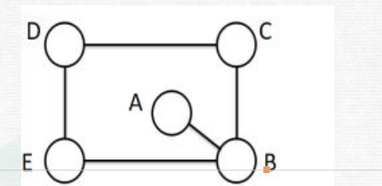

```
先涂那个？3的倍数猜B
----


```

例题 17：【2021 联考】
A、B、C 三个社区需要建设若干个 5G 基站，三个社区可供选择的建设基站地点分 别有 2个、4 个、5 个，现从 A、B、C 三个社区分别选取 1、2、3 个地点随机分配给甲、乙、 丙三个施工队进行建设，要求每个施工队只能承接一个社区，则承建方式有： 
A.720 种 
B.480 种 
C.360 种 
D.120 种

```

```

例题 18：【2019 联考】 
正值毕业季，306 宿舍有 A、B、C、D 四位男同学，他们准备找班主任宋老师合影， 若要求宋老师坐正中间，A、B 两位同学不能挨着坐，那么总共有多少种坐法？
A.8 种 
B.12 种 
C.16 种 
D.24 种

```

```

## 组不同

例题 19：某单位组织志愿者参加公益活动，有 8 名员工报名，其中 2 名超过 50 岁。现 将他们分成 3 组，人数分别为 3、3、2，要求 2 名超过 50 岁的员工不在同组，则不同分 组的方案共有:
 A.120 种 
B.150 种 
C.160 种 
D.210 种

```
分类，判断50岁员工在哪一个组
这题组数是不存在椅子的。组与组之间是没有，椅子是不同的。
只是选出来，没有特殊性，有特殊的才是椅子

超过50岁的人当椅子 甲 乙 对组进行一个区分

2 3 3 排法 
甲 6C1
乙 5C2
剩下椅子
3 2 3 排法
甲 6C2
乙 4C1
剩下椅子
 3 3 2 
 6C2 4C2
 全部加起来 210种
 -----49讲补充
 人坐椅子，椅子一定要是不同的，
```


例题 21：【2020 广东】
县公安局计划举办篮球比赛，6 支报名参赛的队伍将平均分为上午组和下午组进行 小组赛。其中甲队与乙队来自同部门，不能分在同一组，则分组情况共有（）种可能。 
A.6 
B.8 
C.10 
D.12

```
这题就有区别了，这是不同的组
上午组和下午组

上午 2C1 *4C2 甲乙选一个，4个选一个
下午 

 2C1 *4C2 =12人
```


## 49补充-梯子必看

```
6个人 ABC三把椅子每个椅子一个人
6c1*5c1*4c1
什么时候可以直接分给椅子，每个椅子都是均衡。

6个人 分给三个班级 一个班级1个人 2 个人 3个人
1.先找类别
2.然后再把类别给椅子
```


奶奶有6颗口味各不相同的糖，现分给3个孙子，其中1人得1颗，1人得2颗，1人得3颗，则共有

多少种分法： 

A. 60 

B. 120 

C. 240 

D. 360

```


当椅子代表的东西不一样的时候，

比如说这椅子中第一个孙子能三颗糖，一个孙子一颗糖，一个孙子两颗糖

那这三个孙子三张椅子是不一样的，所以他们也是有顺序可以排


先分好三堆，在把三堆给椅子。

6C1*5C2=60 先分好三堆，在给椅子
60*3A3=60*6=360
```


# 捆绑法

```
4个人排队，甲乙一起，有几种排法？

先排丙丁，没有先后顺序 2A2
丙丁排序后，有3个空隙，然后选一个放进去 3C1
但是甲乙内部也可以排序 2A2
2A2* 3C1* 2A2

也可以捆绑到一起 变为3个人 直接3A3 在内部排序


```

```
做题步骤：
1.先把相邻对象做为一个对象和其他对象进行排列
2.注意相邻对象内部有无顺序
```


例题 1：由数字 1、2、3、4、5、6、7 组成无重复数字的七位数，求三个偶数必相邻的七位 数的个数。

```
 2 4 6 相邻就是放在一起
变成5个数 5A5 *3A3 
```

例题 3：【2017 联考】 
甲、乙、丙三所学校的学生被安排在周一至周五参观某革命纪念馆。纪念馆每天最多只能安排一所学校，其中甲学校连续参观两天，其余学校均只参观一天，那么共有多少种 安排方法？
A.12 种 
B.24 种 
C.36 种 
D.60 种
```
这里谁做椅子 应该是学校，把天数给学校
天数 甲的2天合为1天 总共是4天
把4天分给3个椅子
3A2*2= 12种【4C1*3C1*2C1=4*3*2=24 】

甲 4C1
乙 3C1
丙 2C1


=========== 不用椅子的做法
甲 乙 丙
从4天里面选3天 4A3
```

例题 2：【2017 云南】
某兴趣组有男女生各 5 名，他们都准备了表演节目。现在需要选出 4 名学生各自 表演 1 个节目，这 4 人中既要有男生、也要有女生，且不能由男生连续表演节目。那么， 不同的节目安 排有多少种（ ）
A.3600 
B.3000 
C.2400 
D.1200

```

```

例题 5：【2024联考】
某公司开展迎新春三分球投篮比赛。3个部门分别派出2、4、4个选手共计10人参加。规则要求同一个部门的选手顺序相连、全部投完再安排另一个部门的人员，则这10人不同的投篮顺序种数的范围是： 
A.小于1000 
B.1000~5000 
C.5001~10000 
D.10000以上 
```
3A3*2A2*4A4*4A4
正常做法，内部排序
```


例题 4：【2019 浙江】
小王想报名英语、计算机和会计三个培训班，要求每个培训班都在每周固定时间的 晚上上课，且一个晚上只能参加一个培训班。已知小王周一晚上需要值班，且他不希望一周 内连续两个晚上不上课也不值班，也不希望把英语和会计课程安排在连续两个晚上。问有几 种不同的安排方式？
A.12
B.20 
C.24 
D.36
```

```

例题 15：【2020国考】
扶贫干部某日需要走访村内 6 个贫困户甲、乙、丙、丁、戊和己。已知甲和乙的走访次序要相邻，丙要在丁之前走访，戊要在丙之前走访，己只能在第一个或最后一个走访。问走访顺序有多少种不同的安排方式？
A.24
B.16
C.48
D.32

```
  戊  丙  丁    甲乙捆绑 己只能在第一个和最后一个
先首位，在中间
己只能在第一个或最后一个走访  2C1
  己+ 除甲乙外 变成4个空 4C1内部 还要排序 2A2

2C1*4c1*2A2

```
某场学术论坛有6家企业作报告，其中A企业和B企业要求在相邻的时间内作报告，C企业作报告的时间必须在D企业之后，在E企业之前，F企业要求不能第一个，也不能最后一个作报告。如满足所有企业的要求，则报告的先后次序共有多少种不同的安排方式？ 

A.12   

B.24    

C.72    

D.144

```
Ab 捆绑  D C E   注意上面2题的区别 一个只能 一个不能
不能的话就不能先排了，因为你不知道哪里是第一个或者最后一个

DCE本身会产生3个空 4C1 放捆绑
AB 排列完后，产生了3个空，头尾F不能 
4C1*2A2 *3C1=24

```


例题3:四对情侣排成一队买演唱会门票，已知每对情侣必须排在一起，问共有多少种不同的排队顺序： 

A. 24种 

B. 96种 

C. 384种 

D. 40320种

```
4A4*每对内部都是可以排序 *2*2*2*2=
```


例题 20：【2022 江苏】
某企业举行职业技能大赛，3 个下属分公司均选 2 名员工参赛。若同一分公司的员 工比赛时出场顺序不能相邻，则参赛的 6 名员工不同的出场顺序共有： 
A.80 
B.120 
C.160 
D.240

```
要求不能相邻，没有特殊元素了，
人椅合一
```


# 插空 (49)

+ 不相邻就是插空
+ 先把不相邻对象之外的元素进行排列
+ 把不相邻的元素插入其他对象的空中，注意有无顺序

**例题 1：由数字 1、2、3、4、5、6、7 组成无重复数字的七位数，求三个偶数互不相邻的七 位数的个数。**

```
3个偶数不相邻，排其他对象
1 3 5 7 
1357 排 4A4
产生5个空 5A3
```


例题 2：小区内空着一排相邻的 8 个车位，现有 4 辆车随机停进车位，恰好没有连续空位的 停车方式共有多少种？ 

A.48 

B.120 

C.360 

D.1440

```
车辆4个车 4A4
形成5个空位 5C4 为什么不是A 因为空位自己没有顺序
24*5=120
----课后解析
不相邻的是空位，排其他对象，那就是车
车排序 4a4
会产生5个空 ，一共有8个空位，4辆车还有4个空位，从车产生的5个空位中，取4个
5C4 
----个人理解，都不懂题，如果把题目换成 恰好4个空位不相邻都好做。
```

例题 3：【2020 联考】

某学习平台的学习内容由观看视频、阅读文章、收藏分享、论坛交流、考试答题五 个部分组成。某学员要先后学完这五个部分，若观看视频和阅读文章不能连续进行，该学员 学习顺序的选择有： 

A.24 种 

B.72 种 

C.96 种 

D.120 种

```
先排其他三个 3A3
产生4个空 4A2
3A3*4A2=6*4*3=72
```

例题 4：【2017 联考】

某兴趣组有男女生各 5 名，他们都准备了表演节目。现在需要选出 4 名学生各自表 演 1 个节目，这 4 人中既要有男生,也要有女生，且不能由男生连续表演节目。那么，不同 的节目安排有多少种？ 

A.3600 

B.3000 

C.2400 

D.1200

```
题目没有给出明确女生人数，需要分类讨论
4个人 2+2 3+1
                     3个空
2女 2男 5C2 *5C2 *2A2*3A3

女生3 男生1 5C3*4A4

分类需要加 
```

例题 5：【2021 江苏】 难题 放弃

某单位开设 abcdef 等六门培训课程，员工自愿报名参加，经统计，员工选择的课 程组合共有四种，a+f，d+f，a+c+e，b+c+f，所有培训结束后，统一安排考试，为不影响工 作要求，在 1 月 4 日至 10 日中的连续六天考完，每天只考一门，且每位员工都不会连续两 天参加考试，则安排这六门课程考试日期的不同方法共有： 

A.2 种 

B.4 种 

C.8 种 

D.12 种

```

```

例题 6：【2018 广东】

某条道路一侧共有 20 盏路灯。为了节约用电，计划只打开其中的 10 盏。但为了不 影响行路安全，要求相邻的两盏路灯中至少有一盏是打开的，则共有（ ）种开灯方案。  

A.2 

B.6 

C.11 

D.13

```
先找不相邻，灭掉的 先排其他对象

10灯形成11个空， 选10个没掉的排进去

11C10 灯是一样的
```

[2023辽宁]

712934856是一个包含1至9每个数字恰好一次的九位数，它具有以下特征:数字1至6在其中是从小到大排列的，但是数字1至7不是从小到大排列的。则符合这种特征的九位数共有多少个?

```
这题就是换了个马甲，本质就是插空法
先排123456 会产生7个空，但是7不能放在最后一个
8放入7个数字的8个空
9放入8个数字的9个空
7*8*9
```


## 逐步插空法

+ 插空法解决不相邻问题
逐步插空法，有多个对象需要进行排列，可以解决相邻问题和不相邻问题
先把其他无关对象排好，再把有关的一个排进去，形成新的空，再把另一个排进去


例题 7：一张节目表上原有3个节目，如果保持这3个节目的相对顺序不变，再添进去2个新节目，有多少种安排方法？

A.20    

B.12    

C.6    

D.4

```
4c1*2 =8 为什么没答案。。

-------------逐步插空法
3个  4个空   选一个节目加进去 4C1
产生了5个空 5C1

4C1*5C1=20
```

击了10枪，命中7枪,其中有一个“5连贯”,其余2枪不成连贯，有多少种不同的可能情况
A、6
B、12
C、24
D、36

```
只有一个5连贯，看做一个整体
3没中 先处理，  4个空  选一个中的加进去
```


# 插板法

```
6个相同的苹果，分给3个不同的小朋友，没人至少分一个，有几种分法。
n=6
m=3

n个东西，他会形成n减一个空,就跟植树问题一样 

公式是C n -1,m -1

3个限定条件
1.相同苹果
2.不同小朋友
3.每人至少一个 【喜欢在这里改造】

插板法：插板呢？他只是一个工具一个媒介，
他不是一个具体的东西，就是用于把这一堆东
西切割分割出来

```

​	例题 1：有 10 个相同的篮球，分给 7 个班，每班至少一个，有多少种分配方案？ 

A.36 

B.64 

C.84 

D.210

```
直接带公式
9C6
```

例题 2：某城市一条道路上有 4 个十字路口，每个十字路口至少有一名交通协管员，现将 8 个协管员名额分配到这 4 个路口，则每个路口协管员名额的分配方案有：【2020 联考】 

A.35 种 

B.70 种 

C.96 种 

D.114 种
```
直接带公式
7c3
```


## **插板法变形1**

例题 1：把 20 台相同的电脑分给 8 个部门，每个部门至少 2 台，问共有几种分法？ 

A.165 

B.330 

C.792 

D.1485
```
违背第三个条件，转化下
每个部门至少 2 台-》先给每个部门一台
20-8=12
11C7=11C3=11*10*9/3*2=165
```

## **插板法变形2**


例题 2：将 7 个相同的苹果，分给 3 个小朋友，任意分，分完即可，有多少种不同分法？ 

A.2187 

B.343 

C.72 

D.36
```
这是固定的模型直接套就可以了，不要想太多
任意分->至少分2个 
先从小朋友借一个，7+3=10 ，还回去的时候，至多还一个，就可以套公式了。
9C2=36

```

## 插板法变形3

```
解题思路：
一定要先认识到分苹果，给别人跟别人分苹果给你是一回事，分进去跟拿出来是一回事， 
只是对象不一样，但是都是第一对应，相对而言的。 

就如六个人中，选三个人出来排队，要选出去人的方法跟留下人的方法是一样的，因为是相对应
相对而言的

--------但是要注意会有不满足情况的产生

```

例题3:将 10 个完全相同的球放到 3 个不同的盒子中，要求每个盒子至少放一个、至多放四 个球，一共有多少种方法？ 

A.3 

B.6 

C.12 

D.21

```
第一步，先极限分配到快要溢出的那个数最多的+1 则能够转化成至少分到一个给
我，以此来满足插板法的第三个条件
先给每个人5个球，总共15个，但是题目给了10个，那么就转化为了从5个对象里面至少拿一个

4C2


```

例题 3：甲、乙、丙 3 个单位订阅同一款报刊，已知 3 个单位共订了 12 份，其中，每个单 位订阅数量不少于 3 份，但不超过 5 份，则这 3 个单位的报刊订阅数量可能有（ ）种组合。 【2022 广东】 

A.2 

B.6 

C.7 

D.9
```
最大3*6=18-12=6

从ABC中拿6分，每个对象至少拿1分
5C2 这是总情况

A  B  C
6  6  6   
5  5  5   先每个都拿一个，变成了5. 还有3个需要拿出来
每个单 位订阅数量不少于 3 份 ，如果都在A，A就不符合要求了。
同理BC也是，会有3个不满足情况的。
10-3=7
```


某单位将11本《党员学习手册》分发给甲、乙.丙共3个党支部。已知甲支部至少分得3本，乙支部至少分得2本，丙支部至少分得4本，问一共有多少种不同的分配方式?()
```
先分别给 甲 2 乙1 丙 3 6 还有5本
转化为插板
4C2=6
```


# 49 作业

2.一个地区分为如图所示的五个行政区域，现在有4种颜色可供选择，给地图着色，要求相邻区域不同色，那么则有多少种染色方法？

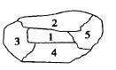

A.72
B.60
C.48
D.24

4.【2023联考】
712934856是一个包含1至9每个数字恰好一次的九位数，它具有以下特征：数字1至6在其中是从小到大排列的，但是数字1至7不是从小到大排列的。则符合这种特征的九位数共有多少个？ 
A.12 
B.336 
C.432 
D.504 

```
逐步插板法
不过题目还是很没看懂
1-6 按照顺序排列，产生7个空
7不能放在最后，那就是6C1
7放进去后，8个空选一个 选8
8放进去后，9个空选一个放 9 
6C1*8C1*9C1=6*8*9=432
```

5.【2022北京】
将张、王、李、陈、赵五名应届毕业生分配到甲、乙、丙3个不同的科室，要求每个科室至少分配1人，甲科室分配的人数多于乙科室，且张和王不能去丙科室。则有多少种不同的分法？
A.12
B.21
C.35
D.72

```
进行分类
甲科室分配的人数多于乙科室
甲 乙 丙
3  1  1 张王不能去丙  ，先给丙一个3c1，甲从剩下4个选一个，4c1 *3c1=12个
甲 乙 丙
2  1 2  张王不能去丙  ，先给丙2个 3C2,甲从剩下3个选一个，3c1  3*3=9

12+9=21个

```

6.【2023北京】
现有6根钢筋，长度分别为4尺、7尺、8尺、9尺、10尺和12尺。现每次抽取3根首尾相连组成一个三角形，则一共能组成多少个不同的三角形？
A.20
B.19
C.18
D.17
```
三角形2边之和大于第三边
总共有6c3=20种选法
但是 4 7 12 【4 8 12】 是不满足的
20-2=18种

```
7.【2023国考】
某次会议邀请4所高校每所各2位学者作报告。在某日上午、下午和晚上的三个时间段分别安排3位、3位和2位学者依次作报告，且同一所高校的2位学者不安排在同一时间段内作报告。问8人的报告次序有多少种不同的安排方式？
A.不到5000种
B.5000-10000种之间
C.10001-20000种之间
D.超过20000种

```
上午 下午 晚上 三把椅子
先看上午，3个坑
先从4个学校选3个出来 4C3
每个学校选一个人 2C1 2C1 2C1
在进行排序 3a3
 4C3*2C1*2C1*2C1*3a3= 192
 在看下午，还是3位，需要从剩下的学校+上午的3个选3个
 剩下的学习2C1
 上午的三个 3C1 排序3a3
 2C1* 3C1 *3a3=2*3*6=36
 晚上的，没法选了，只能排序了
 2a2 =4
 分步用乘法
 192*36*4=13824 选C
```
10.【2020浙江事业】
某单位共有36人,女性比男性多4人。党员占全体员工的1/3，男性中党员占25%。现要任选男性党员和群众各1名、女性党员和群众各2名参加会议,共有多少种不同的选取方式
A.不到30000种 B.30000~50000种
C.50001~8000种 D.超过80000种

```
这题不注意 容易错[这里群众的理解]
男 16 女20 党员12 男4 女 8  男群12 女群 12

现要任选男性党员和群众各1名、女性党员和群众各2名参加会议
3c1*12c1         8c2*12c2  = 88704
```
11.【2024联考】
为弘扬耕读文化，某校打造多样化“校外+校内”耕读文化教育基地，有种植、绘画、编织、美食四个主题基地供同学们选学。假设每位学生选择1个主题基地参与学习，那么甲、乙、丙、丁4名学生中至少有3名学生选择不同主题基地的方法有多少种？ 
A.24 
B.60 
C.144 
D.168 

```
4名同学全部不一样 4*3 *2*1=24
3名同学不一样 2个一起捆绑
先从4个学生选2个 4c2
在从4个主题选3个 4c3
在进行排序 3a3
4c2* 4c3*3a3 + 24 = 168

```
13.有五根仅长度和颜色不同的木棍，长度分别为19厘米、49厘米、26厘米、55厘米和22厘米，现将其中若干木棍拼接起来，在地面树一根高度大于0.9米且不到1米的旗杆。假设木棍间连接没有缝隙，问可组成多少根不同的旗杆？
A.12 
B.18 
C.24 
D.30

```
大于0.9米且不到1米  90-100厘米
55+22+19 
49+19+22
49+19+26
3* 3A3=18
```
14.勘探院为6名地质工作者采购户外防护设备。现有两种不同的防护装备，单价分别为800元和2500元。已知购买防护设备的总成本不能超过1万元，且如果有人购买2500元的防护设备，则小张必须包含在内。问共有多少种不同的防护设备配备方式？ 
A.不超过10种 
B.11～20种之间 
C.21～35种之间 
D.超过35种

```
直接算钱是否少于1万即可
从大的开始算
6*800
5*800+2500
4*800+2*2500
3*800+3*2500
1+1+5c1+5c2++5c3
```
15.将11车相同的扶贫物资发往甲、乙、丙、丁和戊五个乡。要求至少送往其中的4个乡，每个乡送整数车且不超过3车。问共有多少种不同的发放方式？ 
A.不到100种 
B.100～200种之间 
C.201～400种之间 
D.超过400种

```
给极限值 每个乡 4辆  4*5=20
20-11=9 
转化为 
5个乡，从9辆车中，至少拿一个，那是否有不满足的情况呢？
8C4 总共70

甲、乙、丙、丁和戊  拿9个 【假设4个乡都送了 有一个是可以为0】
这种情况是存在的额，就是某一个乡为0，其他分9辆车拿出去。

甲、乙、丙、丁和戊  拿9个 【假设5个乡都送了】
1   1  1  1  1  先每个拿一个 还要在拿4辆，但是甲、乙、丙、丁和戊都只有3辆了，如果全部拿某一个乡是不满足的

```


# 平均分组问题 （50）

1.把6本不同的书分给甲乙两人，每人3本，有几种分法？

```
人坐椅子的问题
6c3 *3c3  用不用排序呢？不用因为没人都是3本


把6本不同的书分给甲乙两人，1人2本，1人4本，有几种分法？
在从类别种选出一个放到甲 2c1 *1c1
```


2.把6个不同的书本平均分成2组，每组3本，有几种分法？

```
椅子是不同对象
组和组之间没有区分度。

因为组之间没有顺序
6c3*3c3
------
2a2  这里的是看分成几组，就是 nAn
```

3.把6个不同的书本平均分成2组，一组2本一组4本，有几种分法？

```
虽然是分组，但是因为数字不一样，有区分度，直接分配
6c2*4c4
组之间没有顺序 不用a22
```
4.零售企业在某城市有10家门店，其中A、B、C区分别有5家、3家和2家，现选择其中的5家门店开展促销活动，要求每个区至少选择1家，问有多少种不同的选择方式?A.不到 200 种
B.200~399 种之间
C.400~799 种之间
D.不少于 800种

```
搭配方式为（1，1，3）或者（1，2，2）.如果（1，1，3）方法数=C53*C31*C21+C33*C51*C21=70;如果是（1，2，2）方法数=C51*C32*C22+C31*C52*C22+C21*C52*C32=105,所以总方法数就是 105+70=175,A。

这题没有平均分组就是 
组不同，是在不同对象
```

## 平均分组总结


```
什么是平均分组？平均分组要除以顺序
2个条件
1.平均
2.分组 组相同

只有分组没有平均也是不行的，见上面列题3 
分组且平均才可以 见例题2

后面补充，同一个对象才能平均分组
```

3.把6个不同的书本平均分成3组，一组1本，一组1本一组4本，有几种分法？

```
6c1*5c1*4c4  但是这里注意，只有2组满足平均分组
-----
2A2
```


某班共有8名战士，现在从中挑出4人平均分成两个战斗小组分别参加射击和格斗考核，问共有多少种不同的方案？
A.210        
B.420　     
C.630　      
D.840

```
直接套公式了
8c4*4c4
-------=
2a2
但是这题有坑，因为不满足，为什么？射击和格斗是可以是可以识别的
 
 8c2*6c2
```

10.小王等6名学生参与了某展览会志愿者活动。他们被安排到两个不同的会场服务。如果要求每个会场都至少有2名志愿者，则对小王等人共有_______种不同的安排方式。 
A. 20 
B. 30 
C. 50 
D. 360 

```
先分人
2 4  
6c2*4c4 先选人 在把人放在椅子上
6c2*4c4 *2c1*1c1

33
人数相同， 6c3*3c3
```

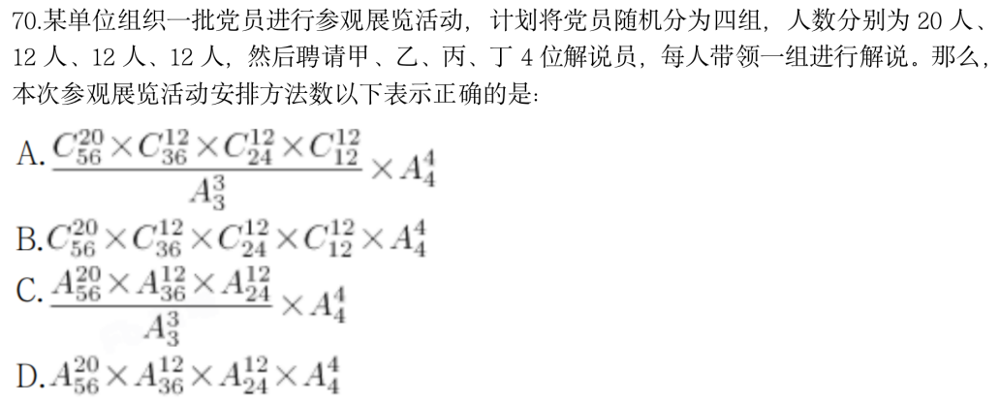

```
首先排除BD  选A
```


# 排列组合逆向思维

+ 正难则反
+ 一般出现至少一个，用反向思维

例题 1：由 1-9 组成一个 3 位数，3 位数肯定有数字重复的组合有多少种？ 
A.220 
B.255 
C.280 
D.225

```
总情况数 9c1*9c1*9c1
不重复数字 9*8*7
9c1*9c1*9c1 -9*8*7 尾数5 排除ac
选D
```

例题 2：某高校开设 A 类选修课四门，B 类选修课三门。小刘从中共选取四门课程，若要求 两类课程各至少选一门，则选法有： 
A.18 种 
B.22 种 
C.26 种 
D.34 种

```
若要求 两类课程各至少选一门  反面就是都不选
总共7C4
都不选，只选A 或者 只选B？
这个时候B是不满足4 ，反面就是只选a 4c4
35-1=34
```

例题 3：单位工会组织拔河比赛，每支参赛队都由 3 名男职工和 3 名女职工组成。假设比赛 时要求 3 名男职工的站位不能全部连在一起，则每支队伍有几种不同的站位方式？
A.432 
B.504 
C.576 
D.720

```
假设比赛 时要求 3 名男职工的站位不能全部连在一起
反面就是 全部站在一起 直接捆绑
总共6a6
捆绑一起，变为4个人 4a4*3a3
尾数6 选C
```


## 刷题

11.某交警大队的16名民警中，男性为10人，现要选4人进行夜间巡逻工作，要求男性民警不得少于2名，问有多少种选人方法？
A.1605          
B.1520            
C.1071          
D.930

```
所有的选人方法数是C16 4=1820,全为女的总数就是C64=15,一男3女总数是C10 1*C63=200,答案就是1820-15-200=1605，A。

这里想说的就是 不少于2个人，反面就是 X<=1
正面做也可以，就是数据比较大
```


# 排列与组合多对象限制类解题思路

+ 很多个限制条件.范围估算
+ 满足2个限制条件，第一个10，第二个就是小于10

例题 1：某博物馆拟举办一次为期 4 天的文物展览活动，展出的文物共有 5 类：青铜器、瓷器、 玉器、书法、国画。若要求每天仅展出 2 类文物，每类文物都要展出但不能连续 2 天展出，且玉器和国画这 2 类文物不在第 1 天展出，则不同的展出方式共有 
A. 72 种 
B. 120 种 
C. 216 种 
D. 360 种 

```
第一天3c2
第二天3c2
第三天3c2
第三天3c2
但是这样，会有一种极端情况，2个 另外2个 2个 重复展出，
不满足题目要5类，这类情况其实不用的，需要排除

也就是每天从3个里面选2个，会有重复的，不满足5类的需要剔除，
因此答案小于81

```

例题 2：某单位随机安排张、王、刘、李、陈 5 名职工去甲、乙、丙三个地方开展调研。要求甲、乙两地各去 2 人，且张、王两人不能同组，刘、陈二人必须同组，则共有多少种不同的安排方式？
A.4	
B.6	
C.12	
D.24

```
限制条件多
满足 1 3 的
2c1*3c2=2*3=6 
包含了 13 同时满足2 
```

例题 3：某单位要从9名同学中选出4名同学去四个不同的乡镇甲、乙、丙、丁参加三下乡活动，其中有两名同学不能去乡镇丁，则分配方案共有多少种？
A.2352
B.2452
C.2552
D.2652

```
先看总的
9c4=9*8*7*6/4*3*2*1=146
在排序 4a4=24
-------------
特优法：7个里面选一个去丁，答案必然有7因子 选A
因为是乘法，不会约去
```

例题 4：某三甲医院派甲、乙、丙、丁四名医生到A、B、C、D四个社区义诊，每个医生只负责一个社区。已知甲不去A社区，且如果丙去C社区，那么丁去D社区，则不同的派法共有： 
A.15种 
B.18种 
C.21种 
D.24种 

```
3c1*3a3=18 答案小于18 选A
满足1 同时满足2 满足1 不满足2 
答案肯定比1小
```


# 排列与组合经典“大坑”，千万别掉进去

例题 1：安排4名护士护理3个病房，每个病房至少一名护士，每名护士固定护理一个病房，则共有___种安排方法。 
A. 24 
B. 36 
C. 48 
D. 72

```
 把m个[不同]元素，分给n个不同对象，每个对象至少分a个。

错误做法
4个选一个 3个选一个 2个选一个，最后一个随便选一个
这种做法会有重复的。

正确做法
人坐椅子
[先分堆，在分人]
 1 1 2 
 4c1*3c1*2c2 在排序 3a3
 12*6=72
 --------又掉坑了，平均分组 1 1
  4c1*3c1*2c2 / 2A2 在排序 3a3
 3*4*3=36


```

例题 2：小王等6名学生参与了某展览会志愿者活动。他们被安排到两个不同的会场服务。如果要求每个会场都至少有2名志愿者，则对小王等人共有_______种不同的安排方式。 
A. 20 
B. 30 
C. 50 
D. 360 

```
同理 注意平均分组
分类
2 4 6c2*4c4*2a2 =30
3 3 6c3*3c3*2a2 /2a2=20  -- 要么就排序，要么就平均分组
30+20=50
```

例题 3：为弘扬耕读文化，某校打造多样化“校外+校内”耕读文化教育基地，有种植、绘画、编织、美食四个主题基地供同学们选学。假设每位学生选择1个主题基地参与学习，那么甲、乙、丙、丁4名学生中至少有3名学生选择不同主题基地的方法有多少种？ 
A.24 
B.60 
C.144 
D.168 

```
4个选不同 4a4

3个选不同 那就是2个相同
先选2个相同的 4c2
4个主题选一个 4c1
剩下的3a3
```

例题5:公司有六个编号依次为 1-6 的研发团队，现安排这 6 个团队参与甲、乙两个科研课题，要求每个团队参与一个课题。每个课题最少安排 2 个团队，每个课题安排一个团队负责，且负责团队不能是该课题所有参与团队中编号最小的团队。问有多少种不同的安排方式？ 
A.300 
B.340 
C.150 
D.170

```
还是先分组，在分人
2 4
6c2*4c4*2c1
选队长 4个人 剩下3个选一个 3c1

3 3 
6c3*3c3 后面选队长2c1*2c1

这里也可以用平均分组，但是没必要，消掉了
```

# 错位重排

+ 0 1 2 9 44 265 
+ (n-1)*(An-1 +An-2)

例题 1：编号 1、2、3 的三封信装入编号为 1、2、3 的三个信封，要求每个信封和信的编号 不同，问共有几种装法？ 
A.2 
B.6 
C.9
D.12

```
直接套 2 
```

例题 2：相邻的4个车位中停放了4辆不同的车，现将所有车开出后再重新停入这4个车位，要求所有车都不得停在原来的车位中，则一共有多少种不同的停放方式？
A.9　    　   
B.12　       　
C.14　      
D. 16

```
3*(2+1)=9
```

例题 3：编号为 1 至 6 的 6 个小球放入编号为 1 至 6 的 6 个盒子里，每个盒子放一个小球， 其中恰有 2 个小球与盒子的编号相同的放法有（ ）种。 
A.9 
B.35 
C.135 
D.265

```
 其中恰有 2 个小球与盒子的编号相同
 那就是4个不相同
 0 1 2 9
 3*（1+2）=9
 
 这里会多一步，是哪个不同呢 6C4*9=15*9=135
```

例题 4：科技协会在上午举办的研讨会上，安排赵、钱、孙、李、周、吴、郑、王8位教授按顺序坐在环绕圆桌的1-8号座位。在下午的研讨会上，主办方重新安排了座位。已知只有3位教授的座位没有改变，且这3位教授互不相邻，则下午一共有多少种不同的座位安排方式？
A.144 
B.704 
C.384 
D.1056

```
8c5*44
但是 且这3位教授互不相邻 还有这个限制条件
11因子

```

# 环形排列 (51)

+ 环形没有方位的情况下就是A[n-1, n-1]，注意没有方位！！！

例题 1：5 个人手拉手围成一个圆圈，问共有多少种不同的方法？ 
A.120 
B.24 
C.60 
D.30

```
5个人排成一排 A55
环形就是 A44 没有参照系的情况下，需要找一个参照系,但是参照系不参与运算！
直线型排列是有方位的
A44=4*3*2*1=
```

改编：5个珠子穿成一串，有多少种方法

```
这个可以A44吗 不行 
因为珠子是相同的，需要除以2，人是不同

人是不能翻转的！
```

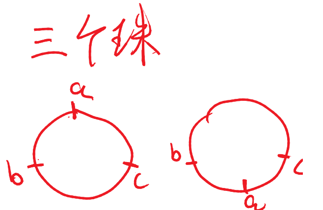


例题 2：四对夫妇坐在圆桌旁，如果要每对夫妇都坐在一起的话，有几种排列他们座位的方 式？
A.384 
B.268 
C.186 
D.96

```
A33*2*2*2*2=
也可以直接看8的倍数 选B
```

例题 3：编号为 1 到 5 的 5 张椅子顺时针均匀地绕围圆桌一圈摆放，5 个人入座，不同的入 座方式有几种？ 
A.90 
B.100 
C.120 
D.150

```
注意，这里已经有参照物了，就不能直接用公式了
A55=5*4*3*2*1=120
```


# 染色问题-难点

+ 染色公式

  ```
  前提 每个都有2个相邻对象，有且仅有2个
  
  (颜色种类-1)^m+(颜色的种类-1)*（-1）^m
  m=对象
  ```

+ 

例题1:从4种不同的颜色中选取若干种颜色给图中A、B、C、D、E五个封闭区域涂色，相邻两个区域不同色。问：涂色方法总共有多少种？ 
A. 144 
B. 106 
C. 98 
D. 96

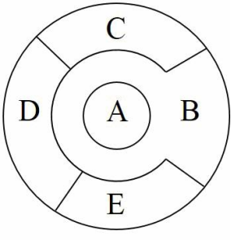

```
特殊元素优先处理 A
A 4
b 3
c 3
d 2 bc不同
e 2 ad不同
-------

```
例题2:小明家门前有一块形状如图所示的花园，他想在花园里种花，发现家里有5种花的种子。他对花园的唯一要求是相邻的两块地不能种植同样的花，那么一共有（ ）种不同的种植方案。

A. 180     
B. 240    
C. 260     
D. 280 

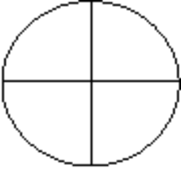

```
AB   AB线连接 才是相邻
CD
A 5 B 4  C 这个时候就要分类了
--- 什么时候要分类，当前位置对后面的结果会产生影响，就需要分类了。
C和A同色     d 4
C和A不一样 同时也要和B不一样 那就是C3   d 3
5*4*13=260
---------------
前提 每个都有2个相邻对象，有且仅有2个

(颜色种类-1)^m+(颜色的种类-1)*（-1）^m
m=对象
4^4+4=265+4=260

```
例题3:一环形花坛分成A，B，C，D四块，现有四种 不同的花供选择，要求要每块里种1种，且相邻的2块种不同的花，则不同的种法总数为（）
A.96 
B.84 
C.60 
D.48

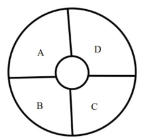

```
直接用公式
3^4+3=84
```
例题4:一个地区分为如图所示的五个行政区域，现在有4种颜色可供选择，给地图着色，要求相邻区域不同色，那么则有多少种染色方法？
A.72
B.60
C.48
D.24

 

```
这题 1比较特殊，但是把1拿出来，其他就可以使用公式了
问题是，拿掉1 是先算1 还是先算其他？
确定1后，2345颜色是确定的。不会影响ABC公式选择的颜色，每个对象选择颜色的可能性是一样的

先选1 在选其他 还有3个颜色
C41*(2^4+2 )=72

```
例题5:将一个四棱锥的五个顶点染色，使同一条棱的2个端点不同色，且只由五个颜色可以使用，有多少种染色方法？

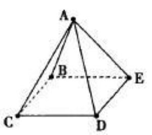

```
同理 A点是和其他点不满足公式的 先给A
A 5 还剩下4个颜色
3^4+3
5*（84）
```
例题6:用5种不同颜色为图中ABCDE五个部分染色，相邻部分不能同色，但同一种颜色可以反复使用，也可以不使用，则符合要求的不同染色方法有多少种？

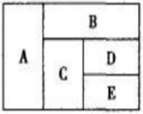


```
这题就有意思了 这题拿掉DE 剩下就满足了，
问题是先公式 在DE了 还是反过来呢？

先排de 会影响ABC公式选择的颜色，每个对象选择颜色的可能性是一样的

(4^3-4)*D 3种*E 3
=60*3*3=540

拿出的对象，跟其他都有关系，先这个对象 例题4
拿出对象不是跟其他都有关系，先公式  例题5
```

# 传球问题

n 个人经过 k 次传球，球回到发球人手上的传球方式有几种？ 直接套传球公式：

N 人传接球 M 次公式：次数=（N-1）的 M 次方/N 最接近的整数为末次传他人次数，第二接近的整数为末次传给自己的次数。


例题 1：四人进行篮球传接球练习，要求每人接球后再传给别人。开始由甲发球，并作为第 一次传球，若第五次传球后，球又回到甲手中，则共有传球方式（   ）。 
A.60 种 
B.65 种 
C.70 种 
D.75 种

```
因为是在回到甲手中，其实就是环形染色
------好好体会理解下
四人：甲乙丙丁 是颜色
传球次数：是种类
-------------
3^5-3=240 为什么每答案呢
因为染色我们最开始是不固定颜色了，但是这里固定是先为甲所以
240/4 4是颜色数字=60 选A

-----------------------------------------
因为是回到甲，所以用染色公式，如果不是甲呢，这个时候要用传球公式了

用传球公式来做的话
243/4=60.7 第一接近的是61 那就是不传回甲
第二接近甲的就是60
```


# 直线染色问题

例题7:将3种作物种植在如图所示的5块试验田里，每块种植一种作物，且相邻的试验田不能种同一种作物，不同的种植方法共有（ ）种．

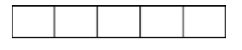

```
3*2*2*2*2=48 种 

这里没有要求3种必须全部种完

AE 不同色   转换为环形 2^5-2 30
AE 同色 就是同一个对象了 2^4+2=18

```
例题8:将3种作物全部种植在如图所示的5块试验田里，每块种植一种作物，且相邻的试验田不能种同一种作物。则有多少种种植方法？
A.42    
B.48   
C.56   
D.81
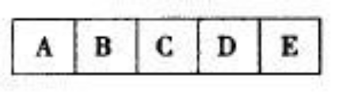


```
这里注意是3种全部都要 注意跟例题7的区别

方法1
3种颜色全部都有 小于48
方法2
48-C31*C21*1*1*1
   只能选2种
 正规做法

```

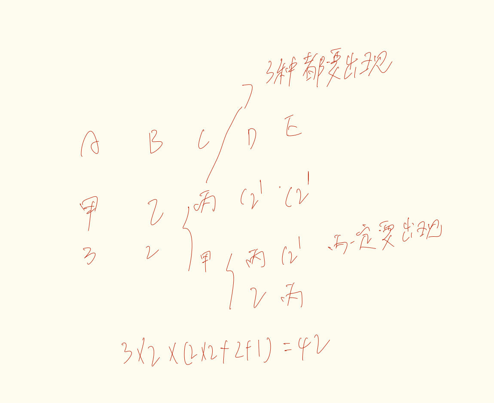

例题9:某企业国庆放假期间，甲、乙和丙三人被安排在10月1号到6号值班。要求每天安排且仅安排1人值班，每人值班2天，且同一人不连续值班2天。则有多少种不同的安排方式
A.15             
B.24        
C.30         
D.36

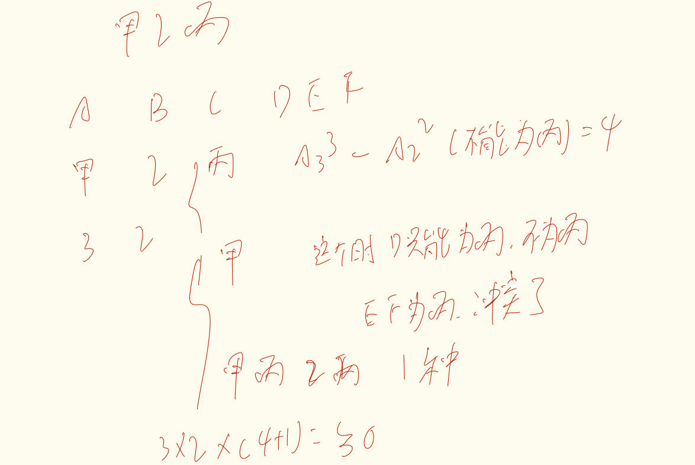

```

```
例题10:某企业举行职业技能大赛，3个下属分公司均选2名员工参赛。若同一分公司的员工比赛时出场顺序不能相邻，则参赛的6名员工不同的出场顺序共有： 
A.80 
B.120 
C.160 
D.240

```
这题关键就是 先不分人，先用公司当颜色
30*2C1*2C1*2C1=240 错误做法

在每一个分类中继续选人数

```
# 正方形染色

正方形边长为n，表面涂色后以边长1切割划分为若干小正方体，此时：
R有0个面涂色：（n-2）^3
R有一个一面涂色的个数：（n-2）^2 *6
R有两个面涂色的个数：（n-2） *12
R有三个面涂色的个数：8


例题11:将一个边长为整数的正立方体外表面涂色，然后分割成若干个边长为1的小立方体，一面涂色的小立方体个数是两面涂色的小立方体的3倍，问未涂色的小立方体有多少个？
A.84
B.88
C.216
D.220


```
直接带公式
 一面涂色的小立方体个数是两面涂色的小立方体的3倍
（n-2）^2 *6  = 3 * (（n-2） *12)
n=8
6*6*6=216
```

例题12:【2019天津定向】
一个边长为8的正立方体，由若干个边长为1的立方体组成，现在要将大立方体表面涂成黄色，问一共有多少个小立方体涂上了黄色？
A.384
B.328
C.324
D.296

```
全部减去一个没涂到
8^3-6^3
```
例题13:【2022山东】
将一个立方体的表而涂黑，用刀片平行于立方体各面，将其切割成若干个棱长为1的小立方体，如果只有一个面涂黑的小立方体的个数与没有一个面涂黑的小立方休的个数相等，那么原立方的棱长为多少（  ）
A.4       
B.6
C.16      
D.8

```
一个面=没有一个面

（n-2）^2 *6  =   （n-2）^3
n-2=6
n=8
```
# 抽屉原理

+ 最不利原理，就是把所有最糟糕的情况都用完，+1就是想要的
+ 题型：至少那几次，保证能拿到白球！！
+ 先把无关元素，全部拿掉，快达到但是没达到。

例题 1：【北京应届2007-15】  
在一个口袋里有10个黑球，6 个白球，4 个红球，至少取出几个球才能保证其中有白球？
A.14     
B.15     
C.17     
D.18

```
白球 最坏的情况就是 黑球和红球+1=15
```
例题 2：【2020 联考】
某会展中心布置会场，从花卉市场购买郁金香、月季花、牡丹花三种花卉各 20 盆， 每盆均用纸箱打包好装车运送至会展中心，再由工人搬运至布展区。问至少要搬出多少盆花 卉才能保证搬出的鲜花中一定有郁金香？ 
A.20 盆 
B.21 盆 
C.40 盆 
D.41 盆

```
同样的
20+20+1=41
```
例题 3：某职工餐厅有主食3种，热菜4种，凉菜3种，若每个职工均打1种主食、1种热菜和1种凉菜，问至少有多少个职工在餐厅用餐，就会有2人的用餐组合是一样的？ 
A.36 
B.37 
C.72 
D.73

```
先看总共有多少个+1 就至少有2个
3*4*3=36+1=37
```
例题 4：某旅行社推出了去张家界、凤凰古城、洪江古商城、高椅古村四地旅游，可选其中的一个或者多个旅游。其中张家界和凤凰不能同时去，每个旅行团选择一种方案。问至少要有多少旅行团才能使得有两个旅行团的旅游方案相同？
A.16      
B.15      
C.12      
D.11

```
先看有多个个方案，这样+1 就会有2个旅游团一样了
分类
去1个 4
2个   2*2=4 这里错了 4c2-1=5
去3个 2*2=4 这里也错了 2

5+4+2+1=12

```
例题 5：某贸易公司有三个销售部门，全年分别销售某种重型机械 38 台、49 台和 35 台，问 该公司当年销售该重型机械数量最多的月份，至少卖出了多少台？ 
A.10 
B.11 
C.12 
D.13

```
等差 无限逼近原则 这里没说不同，可以一样都是x
38+49+35=122
122/12= 10.1 余数+1 选B
```


# 补球思维 52

慎用！不熟悉就是坑

```
5个人分给3个班
常规做法
1 2 2  
A B C
C51 *C42* C22
-------------- * A33  常规做法 先分组 在排序
 A22

先补一个人给5个人
C62*C42*C22　问题来了，怎么还原回去了？

分完了，球就固定了，把球拿出去，但是方法数不变。因为你知道是那个球了

１　１　３　如果补球，　１＋２　１＋２　３　但是Ｃ９３　会选择３个假人　情况更复杂！！
```


```java
补球的本质就是先均分，通过均分，假球跟着真球会分到所有可能的情况。这里就会有一点需要注意的是，假假球所在的。那个数量是不能大于当前椅子里面所能容纳的数量，不然的话，均分的情况就有可能分的全是假球
```


例题 1：工厂食堂午餐时准备了六种不同的水果各若干个，每名来吃午餐的工人可从中任意挑选1-3个水果。问每名工人一共有多少种不同的选择水果的方案？
A.83 
B.53 
C.47 
D.41

```
分类讨论
１种水果
Ｃ６１
２种水果　同一种　不同种
Ｃ６１＋Ｃ６２
３种水果　１个相同　２个相同　３个相同　　这题真坑
Ｃ６１＋Ｃ６１＊Ｃ５１＋Ｃ６３

－－－－－－－
对于第三种情况来说，可以用补球，怎么补？　补２个　为什么？
Ｃ８３
那么补的球是什么？
２个球可以满足上面最开始的所有可能性　
补球个数　不能大于存在情况，这里就是３，超过　就是选的全是补的球

个人感觉这是总结的一种规律
１.补球不能大于情况数
２.
```

例题 2：某单位组织志愿者参加公益活动，有 8 名员工报名，其中 2 名超过 50 岁。现将他们分成3 组，人数分别为 3、3、2，要求 2 名超过 50 岁的员工不在同组，则不同分组的方案共有:
A.120 种 
B.150 种 
C.160 种 
D.210 种 

```
补一个球，每组３个人
甲　　　　乙　　第三组
Ｃ７２　　Ｃ５２　＝２１０
```

例题 3：中国空间站主体由天和核心舱、问天实验舱、梦天实验舱构成。某次实验需要5名宇航员同时在三个舱中开展，每个人只能去一个舱，每个舱至少安排1名宇航员，其中甲宇航员只能去问天实验舱和梦天实验舱中的一个，则不同的安排方法有多少种？ 
A.72 
B.88 
C.100 
D.144 

```
１　２　２　　正常来说要进行分类
如果补球熟练的话，直接补一个球 C62*C42=15*6=90 【不要忘了 * 概率 90*2/3=60】
3把椅子
1.先分甲，甲只能从问 梦选一个， C21
1比较特殊，我们先处理1
1.1如果甲在1这把椅子，直接 C21*C42*C22=12
1.2如果甲不再这个椅子，先从4个人选一个C41,再从剩下3个人C31，但是椅子有2吧*2
C21*C41*C31*2=48


１　１　３　
3把椅子
1.先分甲，甲只能从问 梦选一个， C21
1.1这个时候就要考虑，甲这个椅子 是不是有3个人，如果有3个人
从剩下的4个人选一个C42
在看其他椅子，C21 或者全排列A22
C21*C42*C21
1.2 如果甲这个椅子没有3个人，从剩下4个人选3个C43 
选出来放那个椅子呢 C21
C21*C43*C21
```


# 比赛类

## 得分种类秒杀公式


- 得分种类情况计算


例题1:某测验包含10道选择题，评分标准为答对得3分，答错扣1分，不答得0分，且分数可以为负数。如所有参加测验的人得分都不相同，问最多有多少名测验对象？
A.38    
B.39   
C.40   
D.41

```
１.求出答对和答错比值　３：１　份数必须最简
２.不答得０分
3. 首项为题目总数+1，等差为-1

有ｎ道题　，这里有几份，就加几项
ｎ＋１　＋ｎ＋（ｎ－１）＋。。。。
１１＋１０＋９＋８＝３８

这里算的是得分情况
```

例题2:某校举办一场答题活动，总共10道题，每人基础分10分，答对得3分，答错
扣1分，不答不得分也不扣分。问至少需要多少人参加答题，才能保证有三个人得分相同？
A.41     
B.75    
C.77    
D.83 

```
３：１
３８＊２＋１＝７７
```


## 比赛公式－冷门

比赛问题考察的知识主要涉及到比赛场次以及得分问题。比如n人参赛：
①淘汰赛出冠亚军的场次 n-1；
②淘汰赛需要决出前四名 n；
③单循环的场次 C (n 2) ；
④双循环比赛的场次 A (n 2) 。


例题1：有 101 位乒乓球运动员在进行冠军争夺赛。通过比赛，将从中产生一名冠军。这次比 赛实行捉对淘汰制，在一轮比赛全部结束后，失败者失去继续比赛的资格，而胜利者再次抽 签，参加下一轮的比赛。问一共要进行多少场比赛才能最终产生冠军? 
A.32 
B.63 
C.100 
D.101

```
冠军赛就是ｎ－１
１０１－１＝１００
```

例题2：某次比赛共有32名选手，先被平均分为8组，以单循环的方式进行比赛每组前两名队员再进行淘汰赛，直到决出冠军。请问共需要安排几场比赛？ 
A.48     
B.63     
C.64     
D.65

```
每组４人　单循环　Ｃ４２＝６
６＊８＝４８
８各组　８＊２＝１６－１＝１５
４８＋１５＝６３
```

例题3：某足球赛决赛，共有24个队参加，它们先分成六个小组进行单循环赛，决出16强，这16个队按照确定的程序进行淘汰赛，最后决出冠、亚军和第三、四名。总共需要安排多少场比赛？  
A.48     
B.51     
C.52     
D.54

```
每组４个人　Ｃ４２＝３６
１６
３６＋１６＝５２
```

例题4：：8支足球队参加单循环比赛，胜者得2分，平者得1分，负者得0分，比赛结束后，8支足球队的得分各不相同，且第2名的得分与后4名的得分总和相等，第3名的得分是第5名的两倍，第4名的得分是第6名的两倍。问第一名比第四名多拿了多少分？    
A.3     
B.4     
C.5     
D.6

难题

```
Ｃ８２＝２８种
２８＊２＝５６分　总分

３是偶数　４是偶数　
２　５６７８　是偶数　１是偶数　排除ＡＣ

代入４看下
ａ　ａ－１　ａ－２　ａ－４　后面都是ａ－４　总和　５６　ａ不是偶数
```


# 牛顿台阶模型固定套路

+ 本质就是递推公式，前提是要找到前面的规律，后面就是递推出来，在相加
+ 题型识别：分类特别复杂

例题 1：12 级阶梯，每次可以登上 1 级或者 2 级，请问有多少种走法？ 
A.233 
B.300 
C.350 
D.364

```
一般是从小的开始
只有1台阶  1种走法
2台阶  2种  【1 1】【2】
3台阶  3种 【1 1 1 】 【1 2】【2 1】
4台阶  4种    可以看做是在第二个台阶到4 也可以先3在4 2+3=4
5台阶  3+2 4+1 中国 3+4

列举找规律
```

12 级阶梯，每次可以登上 1 级或者 2 级或 3 级，请问有多少种走法？

```
同理
1  1
2  2 【11】【2】
3  4种 【111】 【1 2】 【21】【3】
4  1+2+4=7  【在1的基础上】
后面同理

1 2 4  7 13 24 44

其实我们可以发现，
台阶1+最大能走的=台阶n
```

例题 2：一个楼梯共有9级台阶，每步可以迈一级或二级台阶，问走完这个楼梯共有多少种不同的走法？（ ） 
A.13 
B.32 
C.55 
D.86

```
1  1
2  2  【11，2】
3  3  【111，12，21】
4  2+3=5

1 2 3 5 8 13 21 34 55 这里问的是走完楼梯有多少种走法，不是所有走法相加
```

例题 3：余梅今年 4 岁，爱吃泡泡糖，她现有 10 颗完全相同的泡泡糖，妈妈只允许她每次吃一颗或两颗，则她共有（ ）种不同的组合方法吃完这些泡泡糖。
A.72 B.89 C.95 D.107 
E.112 F.124 G.136 H.144

```
一样的做法，
1 2 3 5 8 13 21 34 55 89 选B
```

例题 4.【2023 浙江】 
12 个人排成 1 列纵队，从前到后编为 1~12 号。现要将他们排成另个与原来不同的纵队并从 前到后重新编号，要求每个人的新号码与原始号码相差不超过 1。那么有多少种重新编队的 方法? 
A.155 
B.227 
C.232 
D.239

```
总排法
1个人  1
2个人  ab ba 2种  其实告诉了我们只能相邻的互相换
3个人  abc  bac acb 3种
4个人  2+3=5  其实要识别每次跨一个台阶
1 2 3 5 8 13 21 34 55 89 144 233 
```

例题 5.【2024浙江】 
某自助餐厅提供羊肉串，小王怕浪费每次最多只拿3串。已知他正好吃了10串，那么他共有多少种不同的拿法？
A.44 
B.81
C.149 
D.274

```
反培训
 1  1
 2  11 2 
 3  111 21 12 3
 4  1+2+4=7
 1 2 4 7 13 24 44 81 149  274
```

# 排列与组合8大类型总结 53 ---重点！！！

+ 同素均分
  例题1：将15个相同的苹果平均分给3个小朋友，有多少种分法？

```


同种元素 就是一种

```


例题2：将15个相同的苹果平均分成3堆，有多少种分法？

```他


同种元素 就是一种

```

+ 同素随意分
  例题1：将15个相同的苹果分给 3 个小朋友，每人都拿到苹果，有多少种分法？

```


这就是标准插板法了

```

例题2：将15个相同的苹果分成3堆，每堆都要有苹果，有多少种分法？

```
注意三个人，和三堆区别，人要排序 堆不要，  1 3 11 分好后，人是有顺序的。

分给三个人 1 2 12 先分堆，在排序 A33
但是三堆的话， 不需要A33

C142/A33

1.但是 1 1 13 这种情况 只有3 种 就会多除掉，
所以我们要加上 
2 2 11
3 3 9 总共有6种2堆相同的

加上 6*3 
2.还有 555 这种情况的,不需要排序，但还是多算了，需要+6
C142+6*3+5
------- 
A33

```

+ 异素均分
  例题1：将15辆各有编号的自行车平均分给 3 位师傅修理，有多少种分法？

```
人坐椅子问题  注意不同元素

C155*C105*C51  师父有顺序

也可以是这样的理解。同时也推荐下面这种做法，这样对

先平均分组，在分给师傅
C155*C105*C51
---------    *  A33
A33
```

例题2：将 15 辆各有编号的自行车平均分成 3 堆，有多少种分法？

```
平均分组问题 不同元素的平均分组

C155*C105*C51
-------------
A33
```

+ 异素随意分


  例题1：将 15 辆各有编号的自行车分成 3 组，每组数量分别为 4、5、6，再将 3 组分配给 3 位师傅修理，有多少种分法？

```
C154 C115 C66 这个时候选出来，要放椅子了，怎么做呢

先从3把椅子选一个  C31*C21*C11 
```


​	例题2：将 15 辆各有编号的自行车分成 3 堆，每堆数量分别为 4、5、6，有多少种分法？

```
这题直接选出来就行 不用分椅子

```

# 综合刷题

1.某电影公司准备在1—10月中选择两个不同的月份，在其当月的首日分别上映两部电影。为了避免档期冲突影响票房，现决定两部电影中间相隔至少3个月，则有（）种不同的排法。
A.21
B.28
C.42
D.56

```
1  从剩下6月选一个
1-4 6
2-5 5
3-6 4
4-7 3
5-8 2
6-9 1
3*7=21 但是注意 这里有2部电影 21*2=42
```

2.将5个相邻的铺位出租给2家餐厅和2家水果店。要求租完不能有空余铺位，每家餐厅可以租用1个铺位，也可以租用并打通2个相邻的铺位作为其营业场所，每家水果店只能租用1个铺位，且相同类型的两个租户之间至少要间隔1个铺位。问有多少种不同的安排方式？ 
A.24 
B.48 
C.8 
D.16 

```
水果情况比较少 先排水果  插空法
先排水果 A22 
2个餐厅选一个 C21   餐厅确定下来，因为餐厅不一样。一个餐厅给1个铺位，一个餐厅给2个铺位
水果的空也不能相邻 中间必须有一个餐厅 C21 
剩下的2个空给一个餐厅选 C21

```
3.某班级有6名学生坐在一排，上课铃响后慌乱中回到座位上，结果只有2人坐到了自己的位置，只有2个相邻的同学坐到了对方的位置。问有多少种这样的情况？
A.12   
B.18
C.24   
D.36

```
错位重排 
0 1 2 9 44 可是为什么没答案？

看到相邻想到捆绑 
只有2个相邻的同学坐到了对方的位
2个不相邻的也坐到对方位置

先排其他对象 A33/A22 捆绑 就是3种

4个空 C42 
```
4.某智能停车场泊车的泊车位置由电脑随机派位生成。现有两排车位，每排 4 个，有 4辆不同的车需要泊车。泊车要求至少有一车与其它车不同排，且甲乙两车在同一排。则电脑可生成几种派位方式？
A.672 
B.480
C.384 
D.288

```
分类
甲乙在同一排 这个车也在同一排
(1,3) 2排选一个 安排甲乙 4个位置选2 在安排一个人 还有2个位置 剩下一排 C41
C21*A42*C21*C21*C41
(2,2) 2拍选一个 4个位置选2个 给甲乙  剩下4个位置选2个 
C21*A42*A42
```
5.某公司派出 5 名人力资源专员去 2 个一线城市和 2 个二线城市参加秋季招聘会。若每名专员只去其中一个城市，每个一线城市至少排一名专员，每个二线城市只派 1 名专员，则不同的派出方法共有( ) 
A.60种
B.72种
C.120种 
D.144种

```

```
6.小丽和小宋拟从2023年12月1 日（星期五）起实施健身计划。小丽的计划是当天的日期为质数就跑步.小宋的计划是每周一、三、五跑步。按小丽和小宋的计划，他们2023年12月同日跑步的天数是： 
A. 5 
B. 4 
C. 3 
D. 2

```
简单列举即可
1 2 3 5 7 11 13  17 19  23  29 31 
下个星期一就是4号 直接加7天
11 13 15

18 20  22
25  27  29  3天
 
```
7.科技协会在上午举办的研讨会上，安排赵、钱、孙、李、周、吴、郑、王8位教授按顺序坐在环绕圆桌的1-8号座位。在下午的研讨会上，主办方重新安排了座位。已知只有3位教授的座位没有改变，且这3位教授互不相邻，则下午一共有多少种不同的座位安排方式？
A.144 
B.704 
C.384 
D.1056

```
互不相邻 第一反应 插空 先排其他 
错位重排 01 29 44  11倍数 排除AC
限制条件多 数据越少
```


# 分数占比概率

例题 1：某单位有 50 人，男女性别比为 3:2，其中有 15 人未入党。如从中任选 1 人，则此 人为男性党员的概率最大为多少？【国家 2015】 
A.3/5 
B.2/3 
C.3/4 
D.5/7

```

分母 C501  看因子5倍数 A

分子 男性尽可能多 30 
```
例题2：一个纸箱里装有大小及材质完全相同的 10 个小球，其中 3 个黑色，2 个白色，1 个 红色，2 个黄色，1 个绿色，1 个紫色。如果不放回地依次随机取出 3 个小球，则取出的小 球依次是黑色，红色，白色的概率为：【2020 广东】
A.1/120
B.1/240
C.1/250
D.3/500

```
分支 C31C11C21=6
分母 10*9*8=720 720因子
```
例题 3：某人想要通过掷骰子的方法做一个决定：他同时掷 3 颗完全相同且均匀的骰子，如 果向上的点数之和为 4，他就做此决定，那么，他能做这个决定的概率是： 
A.1/36 
B.1/64 
C.1/72 
D.1/81

```

6*6*6=216   排除BD 看因子 
分子  112 121 211 3种
```
例题 4：一个办公室有 2 男 3 女共 5 个职员，从中随机挑选出 2 个人参加培训，那么至少有 一个男职员参加培训的可能性有多大？ 
A.60% 
B.70% 
C.75% 
D.80%

```
分母  C52= 10
分子  10-C32=7
7/10=70%
```
例题 5：从两双完全相同的鞋中，随机抽取一双鞋的概率是：【2017 联考】
A.2/3 
B.1/2 
C.1/3 
D.1

```
常识来说是1/2

2双鞋 左左 右 右  C42
分子：C21 C21 

```
例题 6：南部某战区一个 10 人小分队里有 6 人是特种兵，某次突击任务需派出 5 人参战， 若抽到 3 名或 3 名以上特种兵可成功完成突击任务，那么成功完成突击任务的概率有多大？ 【2020 联考】 
A.3/5 
B.2/3 
C.29/42 
D.31/42
```
分母：C105=252 
分子反面：C61 C44+C62*C43
1-66/252
```
例题 7：一副卡牌上面写着 1 到 10 的数字，甲和乙从中分别随机抽取三张牌，并比较其中 较大的两张牌的牌面之积，数字大的人获胜。甲先抽出三张牌，上面的数字分别是 2、6 和 8，问乙从剩下的牌中抽取三张牌的话，其胜过甲的概率：【2017 广州】 
A.高于 60%
B.在 50%~60%之间 
C.在 40%~50%之间 
D.低于 40%

```
分类讨论  并比较其中 较大的两张牌的牌面之积，数字大的人获胜
10 9 【13457 5】
10 7 【1345 4】
10 5 【134 3】
9 7 【1345 4】
9 5 【134 3】

17/35 接近1/2 选C
```
**例题 8：在 ATM 机上输入银行卡密码时，若连续三次输入错误则会吞卡，老李忘了银行卡密 码的末两位数，只记得是两个不相同的奇数，若他在末两位上随意输入两个不同奇数，能在 吞卡前猜中正确密码的概率是：【2020 山东】** 
**A.3/20** 
**B.1/5** 
**C.1/9** 
**D.2/9**

这题太经典了

```
第一次对 1
第二次对 19 1
第三次对 19*18*1
错误做法，不是方法数相乘,选对的基础是建立在选错的基础概率上，每一类的公分母是不一样的
分类概率：每一类必须要用概率来计算。

第一次对 1  1/20
第二次对 19/20 错误的概率*1/19=1/20
第三次对 19/20*18/19*1/18 =1/20

```
例题 9：某单位工会组织桥牌比赛，共有 8 人报名，随机组成 4 队，每队 2 人。那么，小王 和小李恰好被分在同一队的概率是：【2018 联考】 
A.1/7 
B.1/14 
C.1/21 
D.1/28
```
异元素均分
C62*C42*C22
----
A33
--------         = 1/7
C828C62*C42*C22
----
A44
```
例题 10：【2019 联考】 
甲乙两人相约骑共享单车运动健身。停车点现有 9 辆单车，分属 3 个品牌，各有 2、 3、4 辆。假如两人选择每一辆单车的概率相同，两人选到同一品牌单车的概率约为：
A.1/6 
B.2/9                                  
C.5/18 
D.1/3
```
分母=C92
分子：C22C32C42=5
110/36=5/18


为什么这个不写概率，这个公分母没有变化
```
## 11

例题 11.植树节期间，某单位购进一批树苗，在林场工人的指导下组织员工植树造林。假设 植树的成活率为 80%，那么，该单位职工小张种植 3 棵树苗，至少成活 2 棵的概率是：【2020 联考】 
A.27/125 
B.48/125 
C.64/125 
D.112/125

```
后面讲

```
例题 12：受新冠疫情影响，某高校某专业开展在线教育，在同一上课时间开设 3 门选修课 A， B 和 C，每个学生可任选其中 1 门，但每门课程限选 30 人。已知该专业共有 90 人，问该专 业学生小李能选中课程 A 的概率是：【2021 联考】 
A.1/9 
B.1/6 
C.1/3 
D.2/3

```

90个位置 30个满足

如果A改为20人 就是 20/90
```
例题 13：小波通过往圆圈里投掷米粒（米粒本身长度不计，视为一个点）的方式决定自己 的周末活动。经过试验，他将米粒投进圆圈内的成功率达到 100%，但投掷在圆内的位置随 机。如果米粒到圆心的距离大于圆半径的一半，那么他周末去看电影；若米粒到圆心的距离 小于半径的 1/4，他会去打篮球；否则，他将在家看书。据此可知小波周末不在家看书的概 率为：【2018 联考】 
A.13/16 
B.2/5 
C.3/5 
D.1/16

```
在家看书的=看书面积-篮球=4-1=3
反过来16-3=13
```
例题 14：某公司将在本周一至周日连续七天举办联谊会，某员工随机地选择其中的连续两 天参加联谊会，那么他在周五至周日期间连续两天参加联谊会的概率为：【2018 联考】 
A.1/2 
B.1/3 
C.1/4 
D.1/6

```
直线n连续2天，就是n-1 环形就是n
56 67
2
--=1/3
6
```
【2017 国考】 

例题 15：某次知识竞猜试卷包括 3 道每题 10 分的甲类题，2 道每题 20 分的乙类题以及 1 道 30 分的丙类题。参赛者赵某随机选择其中的部分试题作答并全部答对，最终得分为 70 分。问赵某未选择丙类题的概率为（ ）
A.1/3 
B.1/5 
C.1/7 
D.1/8

```
没有丙 2*20+3*10 
有丙  1丙+2乙
有丙  1丙+1乙+2甲  但是这样做对吗 不对 因为题目不一样

没有丙 2*20+3*10 
有丙  1丙+2乙
有丙  1丙+1乙+2甲 C32*C31=6种 所以应该是 1/8
```


例题 16：某单位的会议室有 5 排共 40 个座位，每排座位数相同。小张和小李随机入座，则 他们坐在同一排的概率（ ）【2018 国考】 
A.不高于 15% 
B.高于 15%但低于 20%
C.正好为 20% 
D.高于 20%

```
每排8个 总共40个 怎么算呢 

分母：C402
分子：C51 5排选一个 C82= 7/39
```
例题 17：小张和小王在同一个学校读研究生，每天早上从宿舍到学校有 6:40、7:00、7:20 和 7:40 发车的 4 班校车。某星期周一到周三，小张和小王都坐班车去学校，且每个人在 3 天中乘坐的班车发车时间都不同。问这 3 天小张和小王每天都乘坐同一趟班车的概率在 （ ）【2019 国考】 
A.3%以下 
B.3%~4%之间 
C.4%~5%之间 
D.5%以上

```
总方法数：A43*A43 因为是2个人的选择
一起 先选一个人，再让另外一个人跟随就可以了
A43
```
例题 18：某企业选拔 170 多名优秀人才平均分配为 7 组参加培训。在选拔出的人才中，党 员人数比非党员多 3 倍。接受培训的党员中的 10%在培训结束后被随机派往甲单位等 12 个 基层单位进一步锻炼。已知每个基层单位至少分配 1 人，问甲单位分配人数多于 1 的概率在 以下哪个范围内？【2021 国考】 A.不到 14%
B.14%~17%之间
C.17%~20%之间 
D.超过 20%

```

分子：先给甲一个：C12 11
```
例题 19：小王从编号分别为 1、2、3、4、5 的 5 本书中随机抽出 3 本，那么，这 3 本书的 编号恰好为相邻三个整数的概率为：【2017 联考】 
A.1/2 
B.2/5 
C.3/10 
D.3/5
```
C52
123 234 345、
3/10
```
例题 20：幼儿园老师设计了一个摸彩球游戏，在一个不透明的盒子里混放着红、黄两种颜 色的小球，它们除了颜色不同，形状、大小均一致。已知随机摸取一个小球，摸到红球的概 率为三分之一。如果从中先取出 3 红 7 黄共 10 个小球，再随机摸取一个小球，此时摸到红 球的概率变为五分之二，那么原来盒中共有红球多少个?【2019 联考】 
A.5 
B.10 
C.15 
D.20

```
x/n=1/3  n=3x
x-3     2
---  = --  
3x-10   5
  x=5
```
例题 21：【2021 联考】 
两个大人带四个孩子去坐只有六个位置的圆型旋转木马，那么两个大人不相邻的 概率为：
A.2/5 
B.3/5 
C.1/3 
D.2/3

```
注意 这是环形 跟直线是有区别的
6个人直线全排列是A66  圆形是A55
4个孩子直线是5个空 圆形4个空
A33*C42 还要排序 A22
------
A55
```
例题 22：【2017 联考】
某商场搞抽奖促销，限每人只能参与一次，活动规则是：一个纸箱里装有 5 个大 小相同的乒乓球，其中 3 个是白色 2 个是红色，参与者从中任意抽出 2 个球，如果两个都是 白色可得抵用券 100 元，一白一红可得抵用券 200 元，两个都是红色可得抵用券 400 元。若 小李和小林两人分别参加抽奖，那么两人获得抵用券之和不少于 600 元的概率是多少？  
A.0.12 
B.0.22 
C.0.13 
D.0.30
```
总方法数 C52C52=10*10=100

400+400=C22 C22
400+200=C22*（C32+C31*C21）C21=12
```
例题 23：【2019 联考】
一家早餐店只出售粥、馒头和包子。粥有三种：大米粥、小米粥和绿豆粥，每份 1 元；馒头有两种：红糖馒头和牛奶馒头，每个 2 元；包子只有一种三鲜大肉包，每个 3 元。 陈某在这家店吃早餐，花了 4 元钱，假设陈某点的早餐不重样，问他吃到包子的概率是多少？  
A.30% 
B.35% 
C.40% 
D.45%
```
2+2  1
3 1 C31 =3
2 +2 C21C31=6
3/10
```
例题 24：【2020 联考】 
物业派出小王、小曾、小郭三名工作人员负责修剪小区内的 6 棵树，每名工作人 员至少修剪 1 棵（只考虑修剪的棵数），问小王至少修剪 3 棵的概率为：
A.3/10 
B.3/7 
C.1/4 
D.3/5
```

C32  先给甲 2棵 还有 4棵
----= 3/10
C52
```
例题 25：【2018 联考】 
A、B 两地间有三种类型列车运行，其中高速铁路动车组列车每天 6 车次，普通动 车组列车每天 5 车次，快速旅客列车每天 4 车次。甲、乙两人要同一天从 A 地出发前往 B 地，假设他们买票前没有互通信息，而且火车票票源充足，问他们买到同一趟列车车票的概 率有多大？
A.小于 10% 
B.10%到 20%之间 
C.20%到 25%之间 
D.25%到 30%之间
```
这个跟班车是一样的

C151 另外一个人跟随
------
C15*C15
```
例题 26：【2019 江苏】 
已知一个箱子中装有 12 件产品，其中有 2 件次品。若从箱子中随机抽取 2 件产 品进行检验，则恰好抽到一件次品的概率是 
A.13/22 
B.10/33 
C.7/11 
D.8/11

```

C21*C101
----- == 10/33
C122
```
例题 27：【2021 江苏】 
某次圆桌会议共设 8 个座位，有 4 个部门参加，每个部门 2 人，排座位时，要 求同一部门的两人相邻，若小李和小王代表不同部门参加会议，则他们座位相邻的概率是： 
A.1/48 
B.1/24 
C.1/12 
D.1/6

```
捆绑
总共 4组 圆形
A33*2^4

分子 在捆绑  3组
A22*2^4 【这里注意小李和小王一起了 只能是2^3】
------  = 1/6
A33*2^4

```
例题 28：【2022 江苏】
某公益组织登记在册的男、女志愿者人数之比为 2：3，男性志愿者中 20%为教师， 女性志愿者中 25%为教师。现从该公益组织登记在册的志愿者中随机选出 1 人，恰好为教师， 则该志愿者为男性的概率是： 
A.2/5 
B.3/7 
C.9/16 
D.8/23

```
2:3 1/5 1/4
40:60
8 15 分母23 直接秒
```
例题 29：【2022 广东】
某街道对辖内 6 个社区的垃圾分类情况进行考核评估，结果显示，有 2 个社区的 垃圾分类考核不通过。如果从 6 个社区中随机抽取 3 个进行现场检查，则抽取的社区中，既 有考核通过的又有考核不通过的社区的概率为（ ）。 
A.1/5 
B.1/2 
C.2/3 
D.4/5

```
C21*C42+C22*C41
---------------- =4/5
  C62
```
例题 30：【2021 浙江】 
小李有一张银行卡，他忘记了密码的后 3 位，只记得这 3 个数全是奇数且有 2 个 相同。问他尝试不超过两次就输入正确密码的概率为多少：
A.1/30 
B.1/50
C.2/59 
D.2/57
```

```
例题 31：【2021 浙江】 
研究人员在 A、B、C、D、E 五块试验田中种植甲、乙、丙、丁、戊五种作物，每 块试验田只种一种作物，每年都在所有的安排中随机挑选一种进行种植。问在连续的 3 年中， A 试验田至少 2 年种植同一种作物的概率为:
A.36% 
B.48% 
C.52% 
D.64%
```

```


# 错题回顾

+ 4个位置 2个空，怎么排？A42 见例题2
+ 2个2个排着，直线就是n-1，环形就是n  见例题3
+ 6个人直线全排列是A66  圆形是A55   见例题6 8

1.某班级有6名学生坐在一排，上课铃响后慌乱中回到座位上，结果只有2人坐到了自己的位置，只有2个相邻的同学坐到了对方的位置。问有多少种这样的情况？
A.12   
B.18
C.24   
D.36

```
原来那两个人他不是坐在自己的位置上吗？

如果他不考虑限定条件是回归到自己位置上，

这两个人就是A22。

但是他们坐到自己位置上就要把这种排列给去掉，
他们只有一种情况，

所以要除以A22
```

2.某智能停车场泊车的泊车位置由电脑随机派位生成。现有两排车位，每排 4 个，有 4辆不同的车需要泊车。泊车要求至少有一车与其它车不同排，且甲乙两车在同一排。则电脑可生成几种派位方式？
A.672 
B.480
C.384 
D.288

```
错误1 4个位置 2个空，怎么排
1.全排列 A42
2.C42*A22
2种都是可以的
----正确答案
总共4个
1，3
甲乙在一起，先选一排C21
在从剩下的2个选一个C21 
一共三个人，4个空，A43
另外一排就是C41
2，2
甲乙在一起，先选一排C21
4个空 2个位置 A42
剩下一排也是4个空 2个位置 A42

```

例题 3：某公司将在本周一至周日连续七天举办联谊会，某员工随机地选择其中的连续两 天参加联谊会，那么他在周五至周日期间连续两天参加联谊会的概率为：【2018 联考】 
A.1/2 
B.1/3 
C.1/4 
D.1/6

```
分母=6
分子=56 67
2/6=1/3
```

例题 4:小张和小王在同一个学校读研究生，每天早上从宿舍到学校有 6:40、7:00、7:20 和 7:40 发车的 4 班校车。某星期周一到周三，小张和小王都坐班车去学校，且每个人在 3 天中乘坐的班车发车时间都不同。问这 3 天小张和小王每天都乘坐同一趟班车的概率在 （ ）【2019 国考】 
A.3%以下 
B.3%~4%之间 
C.4%~5%之间 
D.5%以上

```
没读懂题目
```

例题 5：幼儿园老师设计了一个摸彩球游戏，在一个不透明的盒子里混放着红、黄两种颜 色的小球，它们除了颜色不同，形状、大小均一致。已知随机摸取一个小球，摸到红球的概 率为三分之一。如果从中先取出 3 红 7 黄共 10 个小球，再随机摸取一个小球，此时摸到红 球的概率变为五分之二，那么原来盒中共有红球多少个?【2019 联考】 
A.5 
B.10 
C.15 
D.20

```

```

例题 6：【2021 联考】 
两个大人带四个孩子去坐只有六个位置的圆型旋转木马，那么两个大人不相邻的 概率为：
A.2/5 
B.3/5 
C.1/3 
D.2/3

```
注意圆形 

A33 C42*a22
----
A55
```

例题 7：【2017 联考】
某商场搞抽奖促销，限每人只能参与一次，活动规则是：一个纸箱里装有 5 个大 小相同的乒乓球，其中 3 个是白色 2 个是红色，参与者从中任意抽出 2 个球，如果两个都是 白色可得抵用券 100 元，一白一红可得抵用券 200 元，两个都是红色可得抵用券 400 元。若 小李和小林两人分别参加抽奖，那么两人获得抵用券之和不少于 600 元的概率是多少？  
A.0.12 
B.0.22 
C.0.13 
D.0.30

```

```

例题 8：【2021 江苏】 
某次圆桌会议共设 8 个座位，有 4 个部门参加，每个部门 2 人，排座位时，要 求同一部门的两人相邻，若小李和小王代表不同部门参加会议，则他们座位相邻的概率是： 
A.1/48 
B.1/24 
C.1/12 
D.1/6

```

```


# 份数占比剩下 55

例题 29：【2022 广东】

某街道对辖内 6 个社区的垃圾分类情况进行考核评估，结果显示，有 2 个社区的 垃圾分类考核不通过。如果从 6 个社区中随机抽取 3 个进行现场检查，则抽取的社区中，既 有考核通过的又有考核不通过的社区的概率为（ ）。 

A.1/5 

B.1/2 

C.2/3 

D.4/5

```
C63
C21*C42+C22*C41

反面：全部都是通过

```

 

例题 30：【2021 浙江】 

研究人员在 A、B、C、D、E 五块试验田中种植甲、乙、丙、丁、戊五种作物，每 块试验田只种一种作物，每年都在所有的安排中随机挑选一种进行种植。问在连续的 3 年中， A 试验田至少 2 年种植同一种作物的概率为:

A.36% 

B.48% 

C.52% 

D.64%

```
至少2年种植一种，就是至少一年有重复，方面就是全部不相同

1- 1*4/5*3/5  【为什么把每年的概率求 出来？ 用单个步骤相加/所有总数 结果是一样的】

1- 5*4*3/（5*5*5）

为什么每步的概率求出来相乘和相加 
```

例题 31：【2021 浙江】 

**小李有一张银行卡，他忘记了密码的后 3 位，只记得这 3 个数全是奇数且有 2 个 相同。问他尝试不超过两次就输入正确密码的概率为多少：**

**A.1/30** 

**B.1/50**

**C.2/59** 

**D.2/57**

```
1 3 5 7 9
分类
1次就正确
分子：1
分母：C52*C21*C31 5个奇数选2个，再选一个重复，在从3个位置选一个 60
也可以换种思路【】

分子：59/60 *1/59 【也可以不拆开 直接写总分母 总分子】
```


例题 32：【2024山东】

山东手造精品众多，某展览会有叶雕、皮影、风筝、麦秸画、柳编、葫芦画、 锡雕、鲁班枕 8 个展厅。因时间原因，一名参观者决定从 8 个展厅中随机选取 3 个进行参观。问叶雕和皮影展厅至少一个被选中的概率是多少？

A.5/14

B.15/28

C.9/14

D.19/28

```
至少一个 方面
1- C63/C83
```

例题 33：【2024天津】

中秋节前夕，小赵买了6个外观相同的月饼，其中有3个是蛋黄馅的。回到家后，小赵从中任取3个月饼，里面恰好有1个是蛋黄馅的概率是：

A.9/20 

B.1/2 

C.3/5 

D.11/20

```
反面

```


# 乘积概率

+ 题型识别：看题目有没有给概率
+ 比值概率区别，乘积概率已经给概率数据了
+ 一定要注意，先选对象，对象在干事
+ 比赛的话，分类打满三场时候，最后一场一定赢，


例题 1：小王开车上班需经过 4 个交通路口，假设经过每个路口遇到红灯的概率分别为 0.1、 0.2、0.25、0.4，则他上班经过 4 个路口至少有一处遇到绿灯的概率是： 

A.0.899 

B.0.988 

C.0.989 

D.0.998

```
反面 
分步结果
1-0.1*0.2*0.25*0.4=0.998
```

例题 2：【2017 四川】 

某杂志为每篇投稿文章安排两位审稿人，若都不同意录用则弃用；若都同意则录用； 若两人意见不同，则安排第三位审稿人，并根据其意见录用或弃用。如每位审稿人录用某篇 文章的概率都 60%，则该文章最终被录用的概率是：

A.36% 

B.50.4% 

C.60% 

D.64.8%

 ```
若都同意则录用

最开始想法 666尾数6 怎么没答案?
注意是2位

2同 1不同
0.6*0.6*0.4=144
3同
0.6*0.6*0.6=216
选A
------ 为什么不考虑3个人相同的情况？
2 同  [第三个人不用了 已经过了]
0.6*0.6=0.36
2同 1不同  [先选人，让他同意，不选人 会少一个步骤，完不成这个事情]
C21 选一个人让他录用 
C21*0.6*0.4*0.6
尾数8 选D
 ```

 

例题 3：天气预报的正确概率为 0.8，则 3 天的天气预报恰有两天正确的概率是多少？ 

A.0.032 

B.0.128 

C.0.192 

D.0.384

```
恰有2天 
也要注意 先选2天
C32*0.8*0.8*0.2= 尾数4 选D
```

【经典题目】例题 4：已知在三次重复独立的化验中，至少有一次出现阳性反应的概率为 19/27，则在这 三次化验中恰好出现两次阳性反应的概率为 .

 A.2/9 

B.10/11 

C.7/9 

D.1/9
```
至少有一次出现阳性反应的概率为 19/27 【概率有重复】
反面就是 全部阴性就是 8/27
下面怎么办呢？
3次重复 求出每次阴性 2/3

然后再跟上面题目一样，先选2次
C32*1/3*1/3*2/3=2/9
```

例题 5:【浙江 2015】 

某场羽毛球单打比赛采取三局两胜制。假设甲选手在每局都有 80%的概率赢乙选手， 那么这场单打比赛甲有多大的概率战胜乙选手？

A.0.768 

B.0.8000 

C.0.896 

D.0.924

```
前2赢 最后一个也是不用算了 【为什么这里不选人了？因为只能甲赢】
0.8*0.8=0.64

1输 2赢
C31 选一个输的  C32 选2个赢得 结果一样 
C31*0.8*0.8*0.2=  尾数 4
尾数8 选a 
-----到处都是坑啊----------------------
打了3场 甲第三场肯定赢
C21*0.2*0.8*0.8 = 尾数6    【这里的0.2 是他自己输 】
尾数0 选B
```

例题 6：在某十字路口处，一辆汽车的行驶方向有 3 个：直行、左转弯、右转弯，且三种可 能性大小相同，则有 3 辆独立行驶的汽车经过该十字路口全部右转弯的概率是 

A.1/3 

B.1/6 

C.1/9 

D.1/27

```
这么简单 不会有坑吧？
1/3*1/3*1/3=1/27
```

例题 7：甲、乙两人进行乒乓球比赛，比赛规则为“3 局 2 胜”，即以先赢 2 局者为胜。根 据经验，每局比赛中甲获胜的概率为 0.6，则本次比赛甲获胜的概率是多少？

A.0.216 

B.0.36 

C.0.432 

D.0.648

```
也是分类
2赢
0.6*06
输 赢 赢
C21*0.6*0.4*0.6
尾数8 选D
```

例题 8：乒乓球比赛的规则是五局三胜制。甲.乙两球员的胜率分别是 60%和 40%。在一次比 赛中，若甲先连胜了前两局，则甲最后获胜的胜率： 

A. 为 60% 

B.在 81%~85 之间 

C.在 86%~90%之间

D.在 91%以上

 ```
改了下 5局三胜 一样的道理

赢
0.6
输赢
0.4*0.6
输 输 赢
0.4*0.4*0.6

正面比较麻烦，那就是乙全胜

 ```

 

例题 9：【2020 江苏】【经典中经典】

小张下班回家乘地铁 18:45 之前到家的概率为 0.8，乘公交为 0.7。已知小张下 班回家要么乘地铁，要么乘公交，且选择乘地铁的概率为 0.6，则他下班回家 18:45 之前 到家的概率是 

A.0.73 

B.0.74 

C.0.75 

D.0.76
```
题目都没怎么看懂！！！

符合概率
1.选择乘车方式 0.6 0.4
2.乘车回家   0.8  0.7

分类用加
0.6*0.8+0.4*0.7
```

例题 10：【2021 山东】

进入某比赛四强的选手通过抽签方式随机分成 2 组进行半决赛，已知小王在面对 任何对手时获胜的概率都是 60%，小张在面对任何对手时获胜的概率都是 40%。问小王和小 张均在半决赛中获胜的概率为： 

A.2/15 

B.4/15 

C.3/25 

D.4/25
```
3/5 2/5 都获胜 那就是不相遇

先分组，也要写成概率 -----------想不到
C42*C22/A22=3种  平均分组
3-1=2 减去2个在一起的
2/3 不在一组的概率

2/3*3/5*2/5=4/25
```


例题 11：【2020 联考】 

物业派出小王、小曾、小郭三名工作人员负责修剪小区内的 6 棵树，每名工作人 员至少修剪 1 棵（只考虑修剪的棵数），问小王至少修剪 3 棵的概率为：

A.3/10 

B.3/7 

C.1/4 

D.3/5

```
分母 =C52=10
分子 C62=C32 

3/10
```

例题 12：【2021 联考】 

两个大人带四个孩子去坐只有六个位置的圆型旋转木马，那么两个大人不相邻的 概率为：

A.2/5 

B.3/5 

C.1/3 

D.2/3

```
注意 不相邻问题
```

例题 13：【2018 联考】

在一个不透明的布袋中，有红色、黑色、白色的小球共 60 个。小明通过足够多次 摸球试验后发现其中摸到红色球、黑色球的概率分别为 15%、40%。那么，口袋中白色球的 个数最可能是： 

A.25 

B.26 

C.27 

D.29

```
总共1 15 40  45
60*0.45=27

15：40=3：8 
11f+答案=60 

```

例题 14：【2017 联考】 

某商店促销，购物满足一定金额可进行摸球抽奖，中奖率 100%。规则如下：抽奖 相中有大小相同的若干红球和白球，从中摸出两个球，如果都是红球，获一等奖；如果都是 白球，获二等奖；如果是一红一白，获三等奖。假定一、二、三等奖的概率分别为 0.1、0.3、 0.6，那么抽奖箱中球的个数为：

A. 5 

B. 6 

C. 7 

D. 8

 ```
代入更快

2/x * 1/x-1=10 x=5
 ```


例题 15：【2020 江苏】 

某单位要抽调若干人员下乡扶贫，小王、小李、小张都报了名，但因工作需要， 若选小李或小张，就不能选小王。已知三人入选的概率都是 0.2，但小李、小张同时入选的 概率是 0.1，则三人中有人入选的概率是

A.0.3 

B.0.4 

C.0.5 

D.0.6

 ```
已知三人入选的概率都是 0.2，独立 只能得到自己进不去是0.8 不能得到别人
 ```


例题 16：【2019 浙江】 

苹果有每盒 3 个、5 个和 8 个三种不同的包装。如果随机拿 4 盒，苹果总个数多于 20 个且为偶数的概率：

A.低于 25%

B.在 25%-30%之间 

C.在 30%-35%之间 

D.高于 35%

```

```
