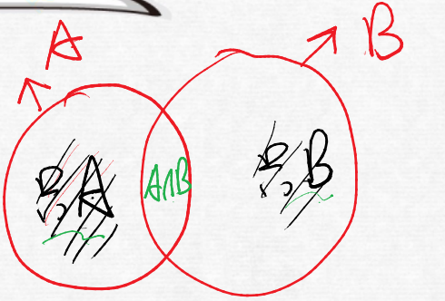
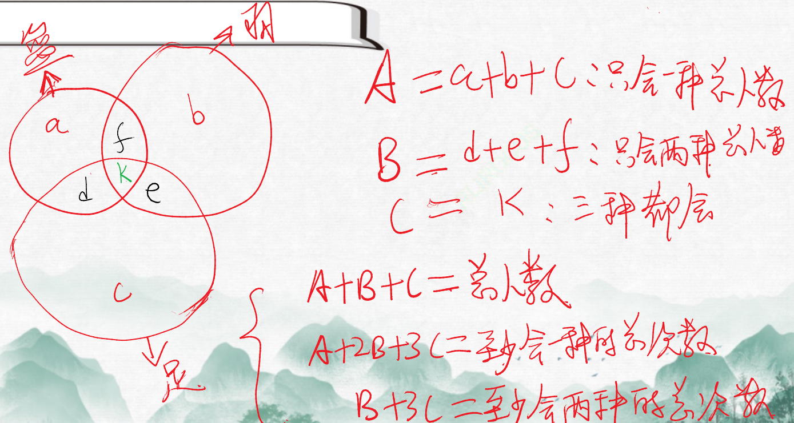

# Table of Contents

* [总结](#总结)
* [二元容斥-相对简单](#二元容斥-相对简单)


# 总结

+ 二元：套公式

  + A+B-AB =AB至少参加一项=A或B

+ 三元

  + A:只会一种
    B: 只会2种总人数
    C:  三种都会

    A+B+C =参加总人数
    A+2B+3C =至少会一种的总次数
    B+3C =至少会2种的总次数

+ 个体容斥

  + 只参加当面=总-问卷或电话 【反着来】

+ 极限容斥


# 二元容斥-相对简单



最外层是 不会A也不会B


```
打篮球有10人，打羽毛球8人，求得出总人数吗?
求不出！总人数=10+8 -AB

1.A+B-AB =AB至少参加一项=A或B
2.总人数=至少参加一项+2种都不会
3.AB至少有一个   A  B AB

为什么【A+B-AB =AB至少参加一项】
A+B-AB=只A只B表示只参加一项，A且B是2项都参加=至少参加一项

```

----


例题 1：某科研单位，会下象棋的有 59 人，会下围棋的有 48 人，两种棋都不会下的有 12 人，两种棋都会下的有 30 人，问该科研单位一共有多少人？
A.89 人
B.107 人
C.129 人
D.137 人

```
59+48-30+12
尾数 9 还是要算
119-30 89 选A
````


例题 2：某班共有 46 人参加了一次数学测验，其中 35 人做对了第一题，28 人做对了第二题，有 3 人都做错了这两道题，那么该班有（ ）人只做对了第二题。
A.8
B.11
C.15
D.18

```
46=35+28+3-x
x=20
28-20=8

```


例题 3：市电视台向 150 位观众调查前一天晚上甲、乙两个频道的收视情况，其中 108 人看过甲频道，36 人看过乙频道，23 人既看过甲频道又看过乙频道，则受调查观众中在前一天晚上两个频道均未看过的人数是
A.17
B.22
C.29
D.38

```

150=108+36-23+x
x= 尾数9 选C
```

例题 4：某单位有 107 名职工为灾区捐献了物资，其中 78 人捐献衣物，77 人捐献食品。该单位既捐献衣物，又捐献食品的职工有多少人？
A.48
B.50
C.52
D.54

```
107=78+77-x
尾数8 选A
```

例题 5：某单位计划从全部 80 名员工中挑选专项工作组成员，要求该组成员须同时有基层经历和计算机等级证书。已知，单位内有 40 人有基层经历，有 46 人有计算机等级证书，既没有基层经历又未获得计算机等级证书的有 10 人。那么能够进入工作组的员工有（   ）人。
A.16
B.40
C.46
D.54

```
80=40+46-x+10
尾数 0 选A
```

例题 6：有 100 名员工去年和今年均参加考核，考核结果分为优、良、中、差四个等次。今年考核结果为优的人数是去年的 1.2 倍，今年考核结果为良及以下的人员占比比去年低 15个百分点。问两年考核结果均为优的人数至少为多少人（  ）
A．55
B．65
C．75
D．85

```
没读懂题目，2年考核结果为优秀
份数
6：5
6+5-x=至少一年优的人=100-都不优秀的
------

这里总人数是100人 把今年优秀和去年优秀看成AB
------
x最小 右边最大=100
x=100+11f 是答案 选B
```


**例题 7：野生动物保护机构考查某圈养动物的状态，在 n(n 为正整数)天中观察到：(1)有 7个不活跃日(一天中有出现不活跃的情况)；(2)有 5 个下午活跃；(3)有 6 个上午活跃；(4)当下午不活跃时，上午必活跃；则 n 等于：
A.7
B.8
C.9
D.10**

```
5+6-x=n-7  都活跃的怎么求？
 11-x=n-7
-----------
全不活跃的怎么求？
5+6-x=n-0  0怎么来 当下午不活跃时，上午必活跃 没有不活跃的

难点：总天数=都活跃的+不都活跃的 根据四个条件
5+6-x=x+7
 x=2
 n=9
```


# 三元容斥

## 分析




```
A：只会一种
B: 只会2种总人数
C:  三种都会

A+B+C =参加总人数
A+2B+3C =至少会一种的总次数
B+3C =至少会2种的总次数

这里注意人数和次数的区别
一个人参加三次运动，总次数就是3 人数是1 
```


例题1:某乡镇举行运动会，共有长跑、跳远和短跑三个项目。参加长跑的有 49 人，参加跳远的有 36 人，参加短跑的有 28 人，只参加其中两个项目的有 13 人，参加全部项目的有9 人。那么参加该次运动会的总人数为（     ）。
A.75
B.82
C.88
D.95

```
参加长跑的有 49 人=至少会长跑
参加跳远的有 36 人=至少会跳远
参加短跑的有 28 人=至少会短跑
A+2B+3C=49+36+28= 尾3
A+B+C=A+2B+3C-B-2C=  3-3-8 尾数2 

```

例题2:某单位举办设有 A、B、C 三个项目的趣味运动会，每位员工三个项目都可以报名参加。经统计，共有 72 名员工报名，其中参加 A、B、C 三个项目的人数分别为 26、32、38，三个项目都参加的有 4 人，则仅参加一个项目的员工人数是？
A.48
B.40
C.52
D.44

```
A+B+C=72
A+2B+3C=26+32+38=96
C=4 B+2C=24  B=16
尾数C
```


例题3:某高校做有关碎片化学习的问卷调查，问卷回收率为 90%，在调查对象中有 180 人会利用网络课程进行学习，200 人利用书本进行学习，100 人利用移动设备进行碎片化学习，同时使用三种方式学习的有 50 人，同时使用两种方式学习的有 20 人，不存在三种方式学习都不用的人，那么，这次共发放了多少份问卷？
A.370
B.380
C.390
D.400

```
A+2B+3C=180+200+100
C=50
B=20
A+b+C=480-b-2c=360  x*0.9=360  x=400
```

例题4:联欢会上，有 24 人吃冰激凌、30 人吃蛋糕、38 人吃水果，其中既吃冰激凌又吃蛋糕的有 12 人，既吃冰激凌又吃水果的有 16 人，既吃蛋糕又吃水果的有 18 人，三样都吃的则有 6 人。假设所有人都吃了东西，那么只吃一样东西的人数是多少？
A.12
B.18
C.24
D.32

```
A+2B+3C=24+30+38=92
B+3C=12+16+18=46
C=6  B=28
A= 尾数8 选B

```

例题5:某出版社新招了 10 名英文、法文和日文方向的外文编辑，其中既会英文又会日文的小李是唯一掌握一种以上外语的人。在 10 人中，会法文的比会英文的多 4 人，是会日文人数的两倍，问只会英文的有几人？
A.3
B.1
C.2
D.0

```
日文x
x+ 2x +2x-4=10+1  至少一种+会2种
x=3
6-4=2  会英文 问的是只会英文 2-1=1

```

例题 6：工厂组织工人参加技能培训，参加车工培训的有 17 人，参加钳工培训的有 16 人，参加铸工培训的有 14 人，参加两项及以上培训的人占参加培训总人数的 2/3，三项培训都参加的有 2 人，问总共有多少人参加了培训？
A.24
B.27
C.30
D.33

```
A+2B+3C=17+16+14=47
3X
B+3C= 2x
c=2  B=2x-6
A+B+C=x=47-(2x-6)-4
3x=48 
-----参加两项及以上培训的人 说的不是次数 所以不是B+3C
----有重复就是人次
A+B+C=3f
A+2B+3C=A+2(B+C)+C
5f+2=47
3f=27
```


## 固定模型（全部不参与）

例题1:巡检员小刘负责甲、乙、丙三个机房的巡检工作，甲、乙和丙机房分别需要每隔 2天、4 天和 7 天巡检一次。3 月 1 日，小刘巡检了 3 个机房，问他整个 3 月有几天不用做机房的巡检工作？
A.12
B.13
C.14
D.15

```
转化为2元容斥
1号用了
甲次数=30/3=10
乙次数=30/5=6
甲乙次数=30/15=2
10+6-2=14 =至少一个巡检

丙 9 17 25 要去  25是和甲重复了
至少一个巡检=14+2=30
不巡检=30-16=14

```

例题2:小王负责甲、乙、两、丁四个采购基地的采购任务，甲、乙、丙、丁四基地分别需要每隔2天、4天、6天、7天去采购一次。7月1日，小王分别去了四个基地采购，问他整个7月有几天不用去采购基地采购？【青海2019】
A.10天
B.11天
C.12天
D.13天

```
7 31 天
3 5 7 8
甲次数  10
乙次数  6
甲乙次数  2
10+6-2=14  至少一天采购的
丙  7 14 21 28  【21】 重复了
乙  8 16 24    【24】 重复了

14+5=19 至少去了一天
30-19=11
```


# 极限容斥

在阳光明媚的一天下午，甲、乙、丙、丁四人给100盆花浇水，已知甲浇了30盆，乙浇了75盆，丙浇了80盆，丁浇了90盆，请问：恰好被3个人浇过的花最少有多少盆？
A.10     
B.12     
C.15     
D.20

```
问最少 n-1 就是2 
100*2=200
30+75+80+90=275
275-200=75
75/2=30多大于30 溢出了
30*2=60
75-60=15
 选C
```


甲、乙、丙同时给99盆花浇水，已知甲浇了75盆，乙浇了66盆，丙浇了58盆，那么三人都教过的花至少有（    ）盆。   
A.1     
B.2     
C.3     
D.4

```
先给2 
99*2=198
75+66+58=199 
1 直接选A

```

例题 1：小明、小刚和小红三人一起参加一次英语考试，已知考试共有 100 道题，且小明做对了 68 题，小刚做对了 58 题，小红做对了 78 题。问三人都做对的题目至少有几题？
A.4题
B.8题
C.12题
D.16题

```


```

例题 2：一个班里有 30 名学生，有 12 人会跳拉丁舞，有 8 人会跳肚皮舞，有 10 人会跳芭蕾舞。问至多有几人会跳两种舞蹈？
A.12 人
B.14 人
C.15 人
D.16 人

```


```

**例题 3：有 135 人参加某单位的招聘，31 人有英语证书和普通话证书，37 人有英语证书和计算机证书，16 人有普通话证书和计算机证书，其中一部分人有三种证书，而一部分人则只有一种证书。该单位要求必须至少有两种上述证书的应聘者才有资格参加面试。问至少有多少人不能参加面试？**
**A.50**
**B.51**
**C.52**
**D.53**

```
容斥条件比较多，直接套公式
B+C 最大值
A+B+C=135 总人数

B+3C=84 至少会2种
B+C=84-2C  不能为0 因为题目说了 AC都给1
 82=84-2

135-82= 尾数3 D

```


# 个体容斥求法

+ 只参加当面=总-问卷或电话  【反着来】

例题1：某校对五年级100名同学进行学习兴趣调查,结果有58人喜欢语文,有38人喜欢数学, 有52人喜欢外语.而且喜欢语文和数学(但不喜欢外语)的有6人,喜欢数学和外语(但不喜欢语文)的有4人,三科都喜欢的有12人,而且每人至少喜欢一科.问有多少同学只喜欢语文?
A.27
B.34
C.14
D.26

```
套三元公式
A+2B+3C=58+38+52=198 至少一个
C=12
A+B+C=100
求出B 在求出A 
-----转换做法
100-（38+52-4）=14 选C [错误]

100-（38+52-(4+12)）=26

数学且外语=只喜欢+三者都喜欢
```


例题2：厦门大学计算机系100名学生进行调查，结果发现他们喜欢看 NBA 和足球、赛车。其中58人喜欢看 NBA;38人喜欢看赛车，52人喜欢看足球，既喜欢看 NBA 又喜欢看赛车的有18人，既喜欢看足球又喜欢看赛车的有16人，三种都喜欢看的有12人，则只喜欢看足球的有( )。
A.22人
B.28人
C.30人
D.36人

```
只喜欢看足球=总人数-（nba或赛车）
100-(58+38-18)   nba且赛车=只喜欢2个 + 三个都喜欢

尾数2 选A
```


例题3：某单位派出80名职工参加三个项目的比赛：篮球、乒乓球、排球。其中有8个人只能参加乒乓球比赛，有52人能参加篮球比赛，62人能参加排球比赛。那么既能参加篮球比赛又能参加排球比赛的有多少人？ 
A. 42 
B. 28 
C. 78 
D. 34

```
80-8=52+62-x
只喜欢乒乓=总数- 篮球或排球=总数-（A+B-AB）
 尾数2 选A
```


例题4：在一项课题研究中，数据搜集方式有问卷调研、当面访谈与电话访谈三种。参加问卷调研的有27人，参加电话访谈的有21人。参加了三种数据搜集方式的有5人，既参加问卷调研又参加当面访谈的有9人，既参加问卷调研又参加电话访谈的有12人，既参加当面访谈又参加电话访谈的有7人。已知只参加当面访谈的人数占数据搜集人员总数的20%，则数据搜集人员共有（ ）人。 
A. 45  B. 50  C. 55  D. 60  E. 65  F. 70  G. 75  H. 80 


```
感觉要套公式
B+3C=9+12+7

只参加当面=总-问卷或电话
x=5x-（27+21-12）
4x=36
5x=45
```

