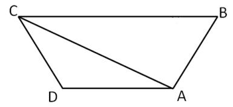

# Table of Contents

* [常用公式](#常用公式)
* [三角形等a看b模型思路](#三角形等a看b模型思路)
* [选项突破秒选思路](#选项突破秒选思路)
* [几何速解-蝴蝶定理](#几何速解-蝴蝶定理)
* [特值假设思维](#特值假设思维)
* [常考题型讲解---几何问题](#常考题型讲解---几何问题)


# 常用公式

+ 勾股数满足同比列放缩 3 45  6 8 10
+ 扇形面积公式：ntr^2 / 360度
+ 扇形弧长公式： ntr/180

# 三角形等a看b模型思路

```
三角形=底边*高*1/2
1.等高：看底边
2.等底：边看高

```


例题1:【2017广东】
如图所示，公园有一块四边形的草坪，由四块三角形的小草坪组成。已知四边形草坪的面积为480平方米，其中两个小三角形草坪的面积分别为70平方米和90平方米，则四块三角形小草坪中最大的一块面积为多少平方米？
A.120
B.150
C.180
D.210


```
等底边 h1：h2=7:9
同理也是 另外2个三角形高之比7:9
9的倍数 选C
16f=480-70-90=320
f=20
```


例题2:【2023江苏】
如图所示，纸片 ABC 的形状为直角三角形，AB=10 厘米，BC=8 厘米。若将纸片沿 AD折叠，直角边 AC 恰好与斜边 AB 重叠，则△ABD 的面积为 
A. 15 平方厘米 
B. 16 平方厘米 
C. 18 平方厘米 
D. 21 平方厘米


```
ABD CD 等高看底
6的倍数 选C 错误

BC=4 AC=6 等高 2:3 总共5倍数
```


例题3:【2023国考】
公园里有一片四边形草坪，沿对角线修建的小道相交于 0 点，0 到四个顶点 A、B、C、 D 的距离之比正好为 1：2：3：4，一名工人花费 1 天正好完成 AOB 区域的修剪，问第二天至少需要额外增加多少名效率相同的工人一起工作，才能在当天内完成剩余草评的修剪?
A.8 
B.10
C.11 
D.12


```
等a看b
1236 12
12-1-1=10
aob boc 1：3
aob aod 1：2
其他同理

```


# 选项突破秒选思路

+ 看选项整体构造推测正确答案

例题1：【2022国考】
一个圆柱体零件的高为1，其圆形底面上的内接正方形边长正好也为1。现将圆柱体零件切割4次，得到棱长为1的正方体，则切去部分的总表面积为：


```
最容易求得是正方形面 4个 4
一定要加个整数 选C
```


例题2：【2023浙江】
某地打算在绿地上建两个圆形花坛，如下图所示，大圆的直径为6米，小圆的直径为2米，修建期间暂时在外围设置围栏。已知围栏呈矩形，大圆与围栏的三条边相切，小圆与围栏的两条边相切，且两圆相切，那么矩形围栏的面积是多少平方米？ 
A.12（2+√3） 
B.12（1+2√3） 
C.12√13 
D.6（3+√13


```
S=长*宽
=6*(？)
对角线连接 4+根号
选A
```

例题3:【2023国考】
在一块正方形土地中，画一条经过某个顶点的规划线，将其分割为三角形和梯形两块土地，且梯形土地的面积正好是三角形土地的2倍。问三角形和梯形土地的周长之比是多少？ 
A.1：2 
B.5：7
C.（1+√5）：（2+√5）
D.（5+√13）：（7+√13）


```
 ed+ac =2be 地的2倍
 2ed=b3 整体就是3 
 ac 3 cd 3 ed 1  周长就是7+根号 秒D
```

例题4:【2024江苏省考】
如图所示，ABCDEF是一个边长为2的正六边形，圆O是三角形ACE的内切圆，则圆O的面积是（ ）。
A. π
B. 2π
C. 5π/4
D. 3π/2


```
怎么思考呢？
圆心和切点做垂直线
AO 为什么等于2？正三角形
秒A
```


例题5:【2024全国联考】


```
看选项猜测是减法，求扇形面积
一个扇形面积=ntr^2  60*t*25 / 360
三个* 3  选D

也可以猜，但是考试不一定想得到，答案要*3 因为是3个扇形
```


# 几何速解-蝴蝶定理


```
根据等a看b推导出来得
普通=1*3=2*4
特殊 平行线
满足 
1. 1*3=2*4
2. 1：3：2：4=a^2:b^2:ab：ab


```

例题1:【2019江苏】
某民营企业新建一个四边形的厂区，按对角线将整个厂区分为四个功能区，如图所示。已知生产、仓储和营销三个功能区的面积分别为26亩、18亩和13亩，若保留休闲区的12亩天然小湖泊，则休闲区可利用的陆地面积是： 
A.36亩 
B.26亩 
C.24亩 
D.23亩


```
13s=28*16
s=36
36-12=24 选B
```

例题2:【2023国考】
一个三角形公园ABC内的道路如下图中实线所示。已知AE=EF=FB，AD=DC，且黑色部分为人工湖。问公园总面积是人工湖面积的多少倍？ 
A.9 
B.12 
C.16 
D.18


```
de平行cf
1 4 2 2
6*3=18 
18/1=18
```

例题3:【2019江苏】
平行四边形ABCD如右图所示，E为AB上的一点，F、G分别为AC与DE、DB的交点。若AB=3AE，则四边形BEFG与ABCD的面积之比是
A.2∶7 
B.3∶13 
C.4∶19 
D.5∶24


```

```


# 特值假设思维

例题1:【2022联考】
某商场为庆祝开业三周年，制作了一个长方形大蛋糕，并切成四块，如图所示。假设这个蛋糕可供350人享用，左下角那块蛋糕平均可供50人享用，右上角那块蛋糕平均可供70人，则中间最大块蛋糕平均可供多少人享用？
A.150 
B.155 
C.175 
D.180


```

```

例题2:【2024浙江省考】
一块空地如右图所示，AD、BC均与底边垂直，三角形ACD为等腰直角三角形，且 AG、DE 、CF长度均相等。现在图中阴影部分种上草皮，已知DF长80米，BC长160米，那么草皮面积为多少平方米？
A.3200  
B.3600
C.4000   
D.4800


```

```

# 常考题型讲解---几何问题

野外生存需要用一个简易的圆锥型过滤器（如下图所示）装满溪水进行过滤。过滤 器的底面直径为 20 厘米，高为 6 厘米。问全部过滤完毕后，在不考虑损耗的情况下，可使 底面半径为 5 厘米，高为 15 厘米圆柱型容器的水面高度达到：
A.4 厘米 
B.6 厘米 
C.8 厘米 
D.12 厘米


```

```


例题 2：某工厂先从边长为 1 米的正方形铁皮切割掉一个半径 1 米、圆心角为直角的扇形， 再用剩余材料切割正方形。为充分利用原材料，希望所得正方形越大越好。若不考虑切割损 耗，问所切最大的正方形边长约为多少厘米：【2020 联考】 
A.22.6 
B.25.6 
C.27.6 
D.31.6


```

```

例题 3：某公园雇佣一名小丑表演骑独轮车。独轮车车轮直径为 50 厘米，小丑沿如图所示 8 字形轨迹骑行。轨迹为相切的两个圆，两个圆面积比是 16:9，小圆直径为 15 米。问小丑沿 8 字形轨迹骑行一圈，车轮转动了多少圈?【2020 浙江】
A.50 
B.60 
C.70 
D.90


```

```

例题 4：在屋内墙角处堆放稻谷（如图，谷堆为一个圆锥的四分之一），谷堆底部的弧长为 6 米，高为 2 米，经过一夜发现谷堆在重力作用下底部的弧长变为 8 米，若谷堆的谷量不变 那么此时谷堆的高为：【2020 联考】
A.9/8 
B.8/9 
C.9/16 
D.4/9


```

```

例题 5：甲乙丙丁四人通过手机的位置共享，发现乙在甲正南方向 2 公里处，丙在乙北偏西 60°方向 2 公里处，丁在甲北偏西 75°方向。若丁与甲、丙的距离相等，则该距离为：【2020 联考】 
A.1 公里 
B.√2 公里 
C.√3 公里 
D.2 公里


```

```

例题 6：小王在荡秋千，当秋千摆角为 30°时，它摆到最高位置与最低位置的高度差为 0.45 米。小王为寻求更大的刺激感，将秋千摆角增加 15°，则秋千能摆到的最高位置约上升了 多少米：（√2≈1.4,√3≈1.7）【2020 联考】 
A.0.15 米 
B.0.24 米 
C.0.37 米 
D.0.41 米

```

```

例题 7：如下图所示，A、B、C、D 为一块梯形田地的 4 个顶点。已知 BC 比 AD 长 16 米，三 角形 ACD 面积比 ABC 小 200 平方米。问 AD 到 BC 的距离是多少米？【2019 浙江】
A.12.5 
B.18.5 
C.20 
D.25



```

```

例题 8：小庄要制作一个工业模具。他在一个边长 4 厘米的正方体上表面正中心位置向下挖 掉一个直径 2 厘米、高 2 厘米的圆柱体，接着再向下挖掉一个直径 1 厘米、高 1 厘米的小圆 柱体（如右图所示）。那么，该模具的表面积约为多少平方厘米？【2018 联考】 
A.82.8 
B.108.6
C.111.7 
D.114.8


```

```

例题 9：某水渠长 100 米，截面为等腰梯形，其中渠面宽 2 米，渠底宽 1 米，渠深 2 米。因 突降暴雨，水深由 1 米涨至 1.8 米。则水渠水量增加了：【2018 联考】 
A.112 立方米 
B.136 立方米 
C.272 立方米 
D.324 立方米

```

```


例题10.【2023联考】
某餐馆承诺25分钟内上齐一桌菜，若超时则未上的菜品免单。每张餐桌上都有一个装满后正好25分钟漏完的圆锥形沙漏（如下图所示）。某位顾客在等待的过程中发现沙漏内上方沙子的高度为原先的一半，此时还差一道菜未上，则再过多久还未上菜，这位顾客将享受免单服务？
A.不到3分钟 
B.3-4分钟之间 
C.4-5分钟之间 
D.超过6分钟


例题11.【2023联考】
厦门鼓浪屿海滨覆鼎岩上屹立着一尊郑成功雕像。为了测量石像的高度，某测量小组选取的测量点A与覆鼎岩底部D在同一水平线上，如下图所示。已知覆鼎岩高CD为24米，在A处测得石像头顶部B的仰角为45度 ，石像底部C的仰角为31度 （参考数据：sin31度=0.52 ，cos31度=0.86 ，tan31度=0.60 ），则石像BC的高度约为：
A.20米 
B.18米 
C.16米 
D.14米


