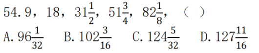

# Table of Contents

* [总结](#总结)
* [做差](#做差)
* [真题](#真题)
  * [24广东](#24广东)


# 总结

+  循环2次才能说规律
+  相邻2项之间(不一定是挨着)存在大于3倍，优先考虑倍数

   +  正负号先忽略 乘除法只是方向
+  单调数列：相邻2项都在3倍以内，优先考虑和差分析

   +  构造网格：和上一级有什么关系
+  九宫格： 看行看列
+ 7项以上，优先考虑分组
  + 间隔分组  a b c  d e f    【ace def】
  + 22分组  【ab】【 cd】【 ef】
  + 33分组  【abc 】【def】
+ 分数数列 【分子分母可以同比列放缩，没必要全部看】
  + 分子分母单独看
  + 分子分母四则运算与下一项的关系
+ 拆分：每项都是三位数

  + 四则运算看规律
+  忽大忽小间隔差
+  根号数列：怎么判断内到外还是外到内？看数字是否能
   1.外到内
   2.内到外
   3.单独看


# 做差

- 整个数列的递增不明显 幅度小（ 2-3倍）
- 根据等差性质快速判断


# 真题

## 24广东


31.2024广东真题（县乡合卷）

A.13 
B.14 
C.15 
D.16

```
看行看列 秒B
```

------------------


32.2024广东真题（县乡合卷） 1，11，23，33，45，55，67，（ ） 
A.66 
B.70 
C.73 
D.77

```
1 23  45 67  22
11 33 55   22
```

----------


````
分子分母单独看
5 10 40 x 640  x320
2 3 9 x 81  x 54

为什么不看第一位？
没有必要看每一项?为什么？分子分母可以同比列放缩
````

34. 21.98，18.77，17.49，14.55，（ ） 
A.12.26 
B.13.66 
C.14.26 
D.15.66 

```
21 18 17 14
  3  1 3  能是1 吗 不行，次数太少，看不出规律
98 77 49 55
  21 28 6
21-（9+8）=4
18-（7+7）=4
```


35. 5，-7，16，-50，202，（ ） 
A.1012 
B.-1012 
C.1122 
D.-1122

```
大于三倍关系，不看符号
50*4+2
202*4+2=1012 记住是负的
```


## 24浙江


51.3，-5，6，-9，11，-15，18，-23，（ ）
A.-33
B.27
C.35
D.45

```
7项以上 间隔
3 6 11 18  选B
```

52. 3,6,15,39,102,267,(  )
    A.666
    B.669
    C.696
    D.699

```
明显3倍关系
3 6 15 39 102 267
 3 9  24 63  165   构造网格
  6  15 39  102  267 反推
 267+165= 432
 432+267=699 选D
```

53.1/9，729，9，81，27，（ ）
A.27√3
B.36
C.36√3
D.45

```
3倍以上 且是次方 都是3的次方
只能选A
```



````
单独看分母分子
分母比较好看  2 4 8 16 排除ac

考场蒙一个D走人 为什么不蒙B 313 不成规律 ，应该是坑

从带分数尝试拆一个数字出来，看是否有规律
30+3/2 50+7/4 81+9/8 后面应该就是11 了，

为什么这么做，不太符合所有的规律？还是那句话，分数可以配同
````

55.1.4，4.2，21，147，1323，（ ）
A.12043
B.13042
C.14553
D.16048

```
这么大 明显倍数关系，
3 5 7 9 11 尾数3 排除AD  选C
```

## 24江苏


46.-6，-2，-10，6，-26，（ ） 
A.-90 
B.90 
C.-38 
D.38 

```
忽大忽小优先考虑间隔差

选D
```


47.81，27，18，18，24，（ ） 
A.36 
B.40 
C.44 
D.48 

```
3倍关系 有点想次方
都跟3有关  选A  错误

3 3/2 1 3/4 下一个应该是 3/5  选B

```

48.1.1，2.3，5.8，13.21，34.55，（ ） 
A.89.144 
B.89.151 
C.99.144 
D.99.151

```
拆分数列
89  144 A
构造网络也可以
1 3 5 13 34
 2 3  8  13  34
```


```
根号数列
1.外到内
2.内到外
3.单独看
3 18 81 324 1215 超出3倍
6 9/2 12/3 15/4   18/5  
1215* 18/5
243*18=81*3*18  27根号6
```


```
分母分子单独看 没规律
四则运算看下
3 6 12 24 48 96 选C
```


## 24深圳

46.250，296，346，400，（ ）
A.450 
B.458 
C.520 
D.586

```
单调递增
46  50  54 58  选B
```


47.1123，2436，3547，4759，（ ）
A.6880 
B.5879 
C.5970 
D.7327

```
拆分数列
11 23 24 36 35 47 47 59
7 15 19 25 
23-11
36-14
47-35
选A 
```


```
3倍关系 平方
选C
```


49.（3，4，5），（6，6，12），（12，8，28），（21，24，51），（ ） 
A.（33，48，63） 
B.（27，32，85） 
C.（36，48，108） 
D.（33，64，95） 

```
5+3=8
12+6=18
12+28=40
21+51=72
A可以
3 6 12  21
 3 6  9  12  33 排除BC
```


A 1/3 B 1/2 C 2/3 D 1/4

```
分数数列 单独看 先看分母
16 25  36
分子 6  9 13 18 24
24/36= 选A
```


# 课后作业

1. 4 7 10 16 34 106 （ ）
   A.466  

   B.428 　

   C.396　　

   D.374

```
3 3 6 18 72  360   466
 1 2 3 4 5 
```

2. 2 3 10 26 72 （ ）

   A.124  

   B.170  

   C.196  

   D.218

   ```
   98*2=196
   ```

3. 10 12 13 22 25 35 （ ）

A.60  

B.50  

C.47  

D.37

```

```


4. 5 7 4 9 25 （ ）

A.49  

B.121  

C.189  

D.256

 ```

 ```


5．1，1，5， 7，13 ， (  ) 

A．15       

B．17         

C．19     

D．21

 

6．11， 6 ， 21 ，-16 ， 1 ， 36 ， (  ) 

A.-53      

B.-21        

C．21      

D．53

 

\7. -3，3，6 ，30，240 ， (  ) 

A．480      

B．1200       

C．1920     

D．2640

 

8．3， 4， 6 ， 12，  36 ，  (  ) 

A．72       

B．108       

C．216      

D．288

 

\9. -23， -3 ，20 ， 44  ，72 ， 105 ， 147，  (  ) 

A．203      

B．218       

C．275      

D．296

 

\10.  2  ， 6  ， 21 ，  43  ， 82 ， (  ) 

A．130      

B．134        

C．144     

D．156

 

\11. 1 ， 2 ， 7 ，23 ，  76  ，(  ) 

A．206      

B．218        

C．239     

D．251

 

\12. 1，-2，-3，-2，1，（ ）

A.6

B.3

C.-1

D.-4

 

\13. 1，-5，10，10，40，（ ）

A.-35

B.50

C.135

D.280

 

14．4，5，7，16，80，（  ）

A．296

B．423

C．592

D．705

 

15．4.1，4.3，12.1，12.11，132.1，（  ）

A．120.8

B．124.12

C．132.131

D．132.12

 

16．，，，，，（  ）

A．

B．

C．

D．

 

17．1，，1，，，（  ）

A．

B．3

C．

D．

 

18．1/5，3/7，7/11，13/19，3/5，（  ）

A.11/47   

B．21/37  

C．31/67  

D．31/47


19．4.2，5.2，8.4，17.8，44.22，（  ）

A．125.62   

B．85.26   

C．99.44   

D．125.64

 

20．2，3，4，，，（  ）

A．81   

B.  

C.  

D.9

 

21．2，7，14，25，38，（  ）

A．54   

B．55   

C．57   

D．58

 

22．2.3， 4.8， 8.24， 16.51， 32.89， （  ）

A．64.138     

B．64.136     

C．128.138     

D．128.136

 

23．3， ， 4， ， ， （  ）

A.      

B．7     

C．6     

D．

 

24．4， 2， ， ， ， （  ）

A.      

B．4     

C.     

D．5

 

25．1， 121， 441， 961， 1681， （  ）

A．2401       

B．2601       

C．3721     

D．4961

 

26．9， 30， 69， 132， 225， （  ）

A．354       

B．387       

C．456      

D．540

 

27．2.1， 2.2， 4.1， 4.4， 16.1 （  ）

A．32.4       

B．32.16      

C．16.4      

D．16.16

 

28．， ， ， ， ，（  ）

A．       

B．      

C．     

D．

 

 

 

 

 

 
