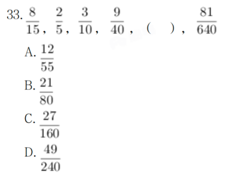

# Table of Contents

* [总结](#总结)
* [做差](#做差)
* [例题](#例题)


# 总结

+  循环2次才能说规律

+  相邻2项之间(不一定是挨着)存在大于3倍，优先考虑倍数

   +  正负号先忽略 

+  单调数列：相邻2项都在3倍以内，优先考虑和差分析

   +  构造网格：和上一级有什么关系

+  九宫格： 看行看列

+ 7项以上，优先考虑分组
  + 间隔分组  a b c  d e f    【ace def】
  + 22分组  【ab】【 cd】【 ef】
  + 33分组  【abc 】【def】
  
+ 分数数列 【分子分母可以同比列放缩，没必要全部看】
  + 分子分母单独看
  + 分子分母四则运算与下一项的关系
  
+ 拆分：每项都是三位数

  + 四则运算看规律

  


# 做差

- 整个数列的递增不明显 幅度小（ 2-3倍）
- 根据等差性质快速判断


# 例题


31.2024广东真题（县乡合卷）

A.13 
B.14 
C.15 
D.16

```
看行看列 秒B
```

------------------


32.2024广东真题（县乡合卷） 1，11，23，33，45，55，67，（ ） 
A.66 
B.70 
C.73 
D.77

```
1 23  45 67  22
11 33 55   22
```

----------




````
分子分母单独看
5 10 40 x 640  x320
2 3 9 x 81  x 54

为什么不看第一位？
没有必要看每一项?为什么？分子分母可以同比列放缩
````

34. 21.98，18.77，17.49，14.55，（ ） 
A.12.26 
B.13.66 
C.14.26 
D.15.66 

```
21 18 17 14
  3  1 3  能是1 吗 不行，次数太少，看不出规律
98 77 49 55
  21 28 6
21-（9+8）=4
18-（7+7）=4
```


35. 5，-7，16，-50，202，（ ） 
A.1012 
B.-1012 
C.1122 
D.-1122

```
大于三倍关系，不看符号
50*4+2
202*4+2=1012 记住是负的
```


51.3，-5，6，-9，11，-15，18，-23，（ ）
A.-33
B.27
C.35
D.45

```
7项以上 间隔
3 6 11 18  选B
```

52. 3,6,15,39,102,267,(  )
    A.666
    B.669
    C.696
    D.699

```
明显3倍关系
3 6 15 39 102 267
 3 9  24 63  165   构造网格
  6  15 39  102  267 反推
 267+165= 432
 432+267=699 选D
```

53.1/9，729，9，81，27，（ ）
A.27√3
B.36
C.36√3
D.45

```

```


````

````

55.1.4，4.2，21，147，1323，（ ）
A.12043
B.13042
C.14553
D.16048


46.-6，-2，-10，6，-26，（ ） 
A.-90 
B.90 
C.-38 
D.38 


47.81，27，18，18，24，（ ） 
A.36 
B.40 
C.44 
D.48 


48.1.1，2.3，5.8，13.21，34.55，（ ） 
A.89.144 
B.89.151 
C.99.144 
D.99.151


46.250，296，346，400，（ ）
A.450 
B.458 
C.520 
D.586


47.1123，2436，3547，4759，（ ）
A.6880 
B.5879 
C.5970 
D.7327


```

```


49.（3，4，5），（6，6，12），（12，8，28），（21，24，51），（ ） 
A.（33，48，63） 
B.（27，32，85） 
C.（36，48，108） 
D.（33，64，95） 


A 1/3 B 1/2 C 2/3 D 1/4
