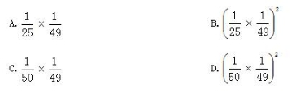

# Table of Contents

* [第十九](#第十九)


# 第十九

1.【2022 联考】

清朝乾隆皇帝曾出上联“客上天然居，居然天上客”，纪昀以“人过大佛寺，寺佛大过人” 

对出下联，这副对联既可以顺读也可以逆读，被称作回文联。数学中也有类似回文数，如 

212、37473 等，则三位数中回文数是奇数的概率为： 

A.2/9 

B.1/3 

C.4/9 

D.5/9

```


`
``````

 

2.【2022 江苏】 

双减”政策实施后，某小学下午 5:30 放学，小李 5:00 下班去接孩子回家，当不堵车时，5:30之前到校；当堵车时、5:30 之前到校的概率为 0.6。若 5:00-5:30 堵车的概率为 0.3，则小李5:30 之前到校的概率是 

A.0.78 

B.0.80 

C.0.88 

D.0.91

```


```

 

***\*3.【2021江苏】\****

某市举办足球邀请赛，共有9个球队报名参加，其中包含上届比赛的前3名球队。现将这9个球队通过抽签的方式平均分成3组进行单循环比赛，则上届比赛的前3名球队被分在同一组的概率是：

A.1/21

B.1/28 

C.1/63 

D.1/84

```


`````

 

4.【2022 联考】

某调研小组共有 5 人，需分配到 3 个不同的厂区进行调研工作，那么每个厂区至少分到一人的概率为：

A.40/81

B.20/27

C.70/81

D.50/81

```


```

 

5.【2020下半年全国联考】

某事业单位阅览室书架上有党建类书籍11本，专业书籍8本，内部学习材料汇编7本。现从中任取3本，三种类型图书恰好各一本的概率为

A.33/520

B.77/325

C.88/325

D.99/650

```


````

 

 

6.【2019四川选调】

某会议室共5排座位，每排的座位数依次为10、9、8、7、6个。甲、乙两人随机选择位置入座，则他们左右相邻的概率：

A.不到2%

B.在2%-5%之间

C.在5%-10%之间

D.高于10%

```


```

 

7.【2022 国考】

某企业将 5 台不同的笔记本电脑和 5 台不同的平板电脑捐赠给甲、乙两所小学，每所学校分配 5 台电脑。如在所有可能的分配方式中随机选取一种，两所学校分得的平板电脑数量均不超过 3 台的概率为：

A.50/63

B.125/126

C.25/63

D.125/252

```


````

 

8.【2020 浙江】

某公司对 10 个创新项目进行评选，选出最优秀的 3 个项目投入运行。小张随机预测 3个项目将会入选。问他至少猜对 1 个入选项目的概率在以下哪个范围内？

A.不到 50%

B.50%～60%

C.60%～70%

D.超过 70%

```


```

 

9.【2021联考】

英语小组成员小明、小红、小花、小白、小玲坐成一排，小玲和小红挨着坐，而小红和小花不挨着坐的概率是多少？

A.1/10

B.1/5

C.3/10

D.9/10

```


````

 

***\*10.【2019江西】\****

设袋中装有标着数字为 1, 2, …, 8 等 8 个签, 并规定标有数字 1, 4, 7 的 为中奖号。 甲、 乙、 丙、 丁 4 人依次从袋中随机抽取一个签、 已知丙中奖了、 则乙不 中奖的概率为多少?
A. 5/8
B. 3/7
C. 3/8
D. 5/7

```


```

 

# 第二十

1.【2022 广东】

某单位计划从行政部的 2 名员工和人事部的 3 名员工中，随机选择 2 人去参加在职培训，则选出的 2 人都来自人事部的概率是（ ）。

A.10%

B.20%

C.30%

D.40%

```


````

 

2.【2023江苏】

某公司实行弹性工作制，允许居家办公，但要求员工每周的周一到周五至少有两天在公司工作。小王、小李和小陈都是该公司的员工，若他们分别从下周的周一到周五中随机选 2 天、3 天、4 天去公司工作，则他们下周三都去公司工作的概率是（ ） 

A.1/25

B.6/125

C.24/125

D.3/250

```


```

 

3.【2020上海】

甲到飞机场坐飞机，飞机场的十二个登机口排成一条直线，相邻两个登机口之间相距50米。甲在登机口等待时被告知登机口更改了，那么甲走到新登机口的距离不超过200米的概率是：

A.1/2

B.4/11

C.8/11

D.19/33

```


````

 

***\**4\**\******\*.\*******\*【2023\*******\*浙江\*******\*】\****

某停车场有7个连成一排的空车位。现有3辆车随机停在这排车位中，则任意两辆车之间至少间隔一个车位的概率为： 

A.1/5

B.2/7

C.6/35

D.9/35

```


```

 

***\*5.\*******\*【2015\*******\*浙江选调\*******\*】\****

某个手机锁屏密码是三位数字,连续输错三次密码手机就会锁定5分钟。若密码的三位数字不重复,试图解锁的人也知道这一点,问他在五分钟内解锁成功的概率是多少？

A1/120

B1/240

C1/720

D1/1080

 

6.【2022 联考】

某调研小组共有 5 人，需分配到 3 个不同的厂区进行调研工作，那么每个厂区至少分到一人的概率为：

A.40/81

B.20/27

C.70/81

D.50/81

```


````

 

7.身高不同的6名老师站一排，若恰好从中间往两边看都依次变低，则身高排第3（身高按从高到低）的教师和最高的教师相邻的概率为

A.1/2

B.3/5

C.2/3

D.5/7

```


```

 

8.【2019 四川】

某知识竞赛共 50 道单项选择题，小李和小王从中各自随机选择 48 道题作答，他们未选择的2 道题相同的概率是：

 

9.【2019 黑龙江公检法】

某公交站台附近区域停放 A 型共享单车 4 辆，B 型共享单车 5 辆，C 型共享单车 6 辆。一公交车到站后，下车的乘客随机选择其中 13 辆单车骑走。问 B 型和 C 型单车全部被骑走的概率在以下哪个范围内？

A.在 10%以下

B.在 10%-15%之间

C.在 15%-20%之间

D.超过 20%

```


````

 

10.一种小狗由出生活到5岁的概率为0.8，活到10岁的概率为0.4，问现年5岁的这种动物活到10岁的概率是多少?

A.0.2 

B.0.3 

C.0.4 

D.0.5

```


```

 

11.【2020 四川】

桌上有 20 张正面向上的卡片，每次任选其中的 3 张翻面后放置于原位。问操作 2 次后，任一张卡片正面向上的概率为：

A.0.7225

B.0.745

C.0.825

D.0.85

```


````

 

12.【2020 深圳】

某款游戏共有 7 名英雄供玩家选择，7 名英雄的能力值恰好为 1-7 的不同整数。每局游戏开始前，玩家需要任选 3 名英雄进行组队。玩家阿坤在进行了无数次的组队尝试后发现，不能一味选择能力值高的英雄组队，只有当 3 名英雄的能力值平均数大于 3 且小于 5 时才能获胜。则阿坤在组队尝试过程中的胜率是：

A.20%

B.38%

C.50%

D.60%

```


```

 

13.【2021上半年全国联考】

五一劳动节将至，某单位为表彰劳模，特准备了6种奖品用于表彰先进个人。已知每种奖品都足够多，劳模们可以选择任意三种奖品，问两位劳模拿到的奖品种类完全一样的概率是多少。

A.5%

B.2.5% 

C.0.5% 

D.0.25% 

```


````

 

14.某品牌酸奶有芒果、草莓两种口味。为了促销推广，某销售人员连续三天，每天从中任选一瓶某种口味的酸奶赠送给某住户品尝，则该住户收到的三瓶酸奶中，至少有两瓶为芒果口味的概率是多少？（  ）

A.1/6

B.1/3

C.1/2

D.2/3

```


```

 

15.【2022辽宁事业】

某公司下午5:00下班，当不堵车时，张某6:20之前到家；当堵车时，6:20之前到家的概率为0.4。若5:00-6:20堵车的概率为0.4，则张某6:20之前到家的概率是（ ）。

A.0.74

B.0.76 

C.0.84

D.0.89

```


````

 

16.【2018 重庆】 

甲、乙两队进行一场排球比赛，根据以往经验，单局比赛甲队胜乙队的概率均为 0.6，本场 

比赛采用五局三胜制，即先胜三局的队获胜，且比赛到此结束。如果各局比赛相互间没有影 

响，现已知前两局双方战成平手，则甲队获得这场比赛胜利的概率为： 

A.9/25 

B.63/125 

C.81/125 

D.101/125

```


```

# 第二十一

1.如果 a、b 均为质数，且 3a+7b=41，则 a+b=？

A.5 

B.6 

C.7 

D.11

```


````

 

2.三个工程队完成一项工程，每天两队工作、一队轮休，最后耗时13天整完成了这项工程。问如果不轮休，三个工程队一起工作，将在第几天内完成这项工程？

A．6天　　

B．7天　　

C．8天　　

D．9天

 

3.某个社区老年协会的会员都在象棋、围棋、太极拳、交谊舞和乐器五个兴趣班中报名了至少一项。如果要在老年协会中随机抽取会员进行调查，至少要调查多少个样本才能保证样本中有4名会员报的兴趣班完全相同？

A．93　　

B．94　　

C．96　　

D．97

 

4.苗苗有一堆草莓，乐乐也有一堆草莓。苗苗的草莓五个五个地数，最后剩两个，七个七个地数，最后还是剩两个；乐乐的草莓五个五个地数，最后剩四个，六个六个地数，最后剩三个。已知苗苗比乐乐多 8 个草莓，则苗苗的草莓数为： 

A.37 

B.62 

C.72 

D.77 

```


```

E.87 

F.92 

G.102 

H.107

 

5.某公司甲、乙和丙三个销售部在2014年的销售额分别占公司总销售额的40%、35%和25%，其在2015年的销售额分别比上年增长了20%、300万元和16%，而总销售额增长了1800万元。问甲销售部的销售额比上年增长的数量比丙销售部高多少万元？

A．200　　

B．300　　

C．400   

D．500

 

6.某房间共有6扇门，甲、乙、丙三人分别从任一扇门进去，再从剩下的5扇门中的任一扇出来，问甲未经过1号门，且乙未经过2号门，且丙未经过3号门进出的概率为多少？

A．125/216　　

B．8/27　　

C．27/64　　

D．64/125

 

7.一袋糖里装有奶糖和水果糖，其中奶糖的颗数占总颗数的 60%。现在又装进 10颗水果糖，这时奶糖的颗数与总颗数的比为 4∶7，那么，这袋糖里有多少颗奶糖： 

A.100 

B.112 

C.120 

D.122

```


````

 

8.高校的科研经费按来源分为纵向科研经费和横向科研经费，某高校机械学院2015年前4个月的纵向科研经费和横向科研经费的数字从小到大排列为20、26、27、28、31、38、44和50万元。如果前4个月纵向科研经费是前3个月横向科研经费的2倍，则该校机械学院2015年第4个月的横向科研经费是多少万元？

A．26　　

B．27　　

C．28　　

D．31

 

9.某工厂生产的零件总数是一个三位数，平均每天车间生产了 35 个，统计员在记录时粗心地将该三位数的百位与十位数字对调了，结果统计的零件总数比实际总数少 270 个。问该工厂所生产的零件总数最多可能有多少个： 

A.525 

B.630 

C.855 

D.960

```


```

 

10.在一次有四个局参加的工作会议中，土地局与财政局参加的人数比为 5∶4，国税局与地税局参加的人数比为 25∶9，土地局与地税局参加人数的比为 10∶3，如果国税局有 50 人参加，土地局有多少人参加： 

A.25 

B.48 

C.60 

D.63

```


````

 

11.甲乙丙丁四个人分 6 袋食物。它们的重量分别为 12，16，20，24，28，36 公斤，甲先取走一袋，剩下的由乙、丙、丁取走，已知乙和丙取走的重量恰好一样多，而且都是丁取走的 2 倍，每袋食物不能拆分，那么甲先取走的为多少： 

A.20kg 

B.24kg 

C.28kg 

D.36kg

```


```

 

\12. 某一楼一户住宅楼共17层，电梯费按季交纳，分摊规则为：第一层的住户不交纳；第三层及以上的住户，每层比下一层多交纳10元。若每一季度该住宅楼某单元的电梯费共计1904元，则该单元第7层住户一季度应交纳的电梯费是： 

A.72元

B.82元

C.84元

D.94元

```


````

 

 

13.某高校需制作一份学院年鉴，计划由张、王、李三位教授共同完成，共需 20 天。已知张教授编纂的效率是王教授的 5/6，王教授 4 天的工作量是李教授 5 天工作量的 2/3。三人同时开工，但李教授临时接到其他任务，效率降低了 1/4，王教授也在工作了 13 天后退出任务，问整项任务最终需多少天才能完成？（ ）

A.21     

B.26      

C.28      

D.32

```


```

 

14.某社区开展绿化行动，现于某条道路两边每隔 8 米均匀放置一盆花，连两端在内共放了 32 盆。现接到通知，道路两边从两端开始需一共均匀栽种 14 棵树苗， 若与花重合可移除花，问新栽种的树苗每两棵之间应相距多少米？（ ）

A.10      

B.15     

C.18       

D.20

```


````

 

15.某单位施行 2.5 小长假，即周五下午和周末一起休息，其余日期正常工作。已知某月有 31 天，该单位小王在本月一共休息了 10.5 天， 且无请假情况， 问该月的第一个星期天为几号？（  ）

A.2      

B.3       

C.4       

D.5

```


```

  
