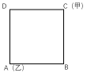
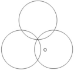
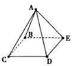
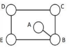

# Table of Contents

* [第一节7.10](#第一节710)


# 第一节7.10


1.甲乙两种产品原来价格比是3:5，将它们分别降价50元后，这时的价格比是4:7，甲乙两种商品分别多少元？

A.300元、500元   

B.375元、625元   

C.450元、750元   

D.525元、875元

```


````


 

2.甲、乙二人从同一地点同时出发，绕西湖匀速背向而行，35分钟后甲、乙二人相遇。已知甲绕西湖一圈需要60分钟，则乙绕西湖一圈需要（   ）分钟。  

A.25   

B.70   

C.80   

D.84

```


````


3.长途汽车首班车是7点整，第二班车是8点20分。首班车开走后，一位旅客急匆匆地赶到车站，问值班员现在是几点，值班员说：“首班车开走后经过的时间是现在到第二班车开车时间的3/5。”现在的时间是几点几分？

A.7点半   

B.7点40   

C.7点50   

D.8点

```


```


 

4.甲、乙两人生产零件，甲的任务量是乙的2倍，甲每天生产200个零件，乙每天生产150个零件，甲完成任务的时间比乙多2天，则甲、乙任务量总共为多少个零件？

A.1200      

B.1800     

C.2400      

D.3600

```


`````


 

5.某海鲜档口出售一批总共150斤的鲜鱼，按原售价每卖出一斤可赚5元。由于较为畅销，在卖出三分之一后，档主将售价上调20%。卖完所有鲜鱼后，档主一共赚了1250元，则原售价是每斤（  ）元。   

A.20   

B.25   

C.30   

D.35

```


```


 

6.某楼盘的地下停车位，第一次开盘时平均价格为15万元/个；第二次开盘时，车位的销售量增加了一倍、销售额增加了60%。那么，第二次开盘的车位平均价格为：

A.10万元/个

B.11万元/个

C.12万元/个

D.13万元/个

```


````


 

7.甲、乙两人用相同工作时间共生产了484个零件，已知生产1个零件甲需5分钟、乙需6分钟，则甲比乙多生产的零件数是（  ）

A．40个   

B．44个   

C．45个  

D．46个

```


```


 

8.甲、乙两个烧杯中盛有盐酸，甲杯中的盐酸浓度是乙杯中的 1/4，但甲杯中盐酸的质量却为乙杯中的 3 倍，则将两个杯中的盐酸混合后，得到的盐酸浓度为乙杯浓度的多少倍? 

A. 4/7 

B. 3/8 

C. 7/16 

D. 7/4

```


````


 

9.小张每天固定时间骑摩托车从家里到乡镇的木材加工厂上班，如果他以30千米/小时的速度行驶，会比上班时间提前10分钟到达加工厂，如果他以20千米/小时的速度行驶，则会迟到12分钟。如果小张某天迟到了6分钟，则他的当天行驶速度是多少千米/小时？

A.22       

B.23       

C.24       

D.25

```


```


 

10.甲乙两个工程队修一条公路，甲工程队修了500米以后，乙工程队来修，以往资料显示，乙工程队的效率是甲工程队的2倍，乙工程队修600米公路所用的时间比甲工程队修500米公路的时间还少20天，甲工程队的效率是（ ）米/天

A.25           

B.15

B.20           

D.10

```


````


 

11.小王步行的速度比跑步慢50%，跑步的速度比骑车慢50%。如果他骑车从A 城去B 城，

再步行返回A 城共需要2 小时。问小王跑步从A 城到B 城需要多少分钟？

A.45 

B.48 

C.56 

12.企业列出 500 万元设备采购预算，如用于购买 x 台进口设备，最后剩余 20 万元。经董事会研究后，决定购买质量更高的同类国产设备，单价仅为进口设备的 75%。当前预算可购买x+3 台，最后剩余 5 万元。问国产设备的单价在以下哪个范围内？ 

A.不到 30 万元/台

B.30—40 万元/台之间 

C.40—50 万元/台之间 

D.50 万元/台以上

```


```


 

13.小红把平时节省下来的全部五分硬币先围成一个正三角形，正好用完，后来又改围成一个正方形，也正好用完。如果正方形的每条边比三角形的每条边少用5枚硬币，则小红所有五分硬币的总价值是（ ）。 

A.1元    

B.2元    

C.3元    

D.4元 

```


````


 

14.服装批发市场有一款衣服标价100元/件。小王原计划购买60件这样的衣服，但他对店老板说：“如果你肯减价，每减价1元，我多订购10件。”老板算了一下，如果减价4%，由于小王多购，便可获得比原来多一半的总利润。则这一款衣服的成本是（   ）元。

A.60   

B.68   

C.75   

D.81

```


```


 

15.小王、小李、小张三人决定各自开车自驾游从S市出发前往L市。小张最先出发，若小李比小张晚出发10分钟，则小李出发后40分钟追上小张；若小王又比小李晚出发20分钟，则小王出发后1小时30分钟追上小张；假设S市与L市相距足够远，且三人均匀速形式，则小王出发后（   ）小时追上小李。 

A.1   

B.2   

C.3   

D.5

```


````


 

# 第二节7.13


1.一群蚂蚁将食物从A处运往B处，如果它们的速度每分钟增加1米，可提前15分钟到达，如果它们的速度每分钟再增加2米，则又可提前15分钟到达，那么A处到B处之间的路程是 米。(   )
A .120     
B.180    
C.240     
D.270

```


```


2.工厂需要在规定工期内加工完一批零件，若师傅单独工作，则要超规定工期6天完成；若徒弟单独工作，则要超规定工期16天完成；若师徒两人合作，完成时间比规定工期少2天，则师傅与徒弟加工该批零件的效率之比为：
A.8:3 
B.3:2 
C.5:2 
D.9:4

```


````


3.一项工程甲乙两人合作完成需要6天时间，若由甲单独完成此项工程比乙单独做所需时间多5天，则甲单独完成需要（    ）天。
A.10    
B.12    
C.15   
D.18

```


```


4.一项工程由甲独立完成需要24天，由甲和乙合作完成需要10天，由甲和丙合作完成需要15天，问由乙和丙合作完成需要多少天？ 
A. 11天 
B. 12天 
C. 13天 
D. 14天 

```


````


5.甲乙两人从AB两地同时出发相向而行，按预定速度他们将在下午5时在途中相遇；如果他们每人每小时都比预定速度快1千米，则可在下午4时相遇；如果他们每人每小时都比预定速度慢1.5千米，则要在下午7时相遇；A,B两地点距离是多少千米？
A.180
B.300
C.600
D.800

```


```


6.A、B两地间有条公路，甲、乙两人分别从A、B两地出发相向而行，甲先走半小时后，乙才出发，一小时后两人相遇，甲的速度是乙的2/3。问甲、乙所走的路程之比是多少：
A. 5：6 
B. 1：1 
C. 6：5 
D. 4：3 

```


````


7.甲乙两人早上10点同时出发匀速向对方的工作单位行进，10点30分两人相遇并继续以原速度前行。10点54分甲到达乙的工作单位后，立刻原速返回自己单位。问甲返回自己单位时，乙已经到了甲的工作单位多长时间
A. 42分 
B. 40分30秒 
C. 43分30秒 
D. 45分

```


```


8.A、B两架飞机同时从相距1755公里的两个机场起飞相向飞行，经过45分钟后相遇，如果A机的速度是B机的1.25倍，那么两飞机的速度差是每小时： 
A. 250公里 
B. 260公里 
C. 270公里 
D. 280公里

```


````


9.甲乙两人分别从A、B两地同时出发，相向而行。甲的速度是8公里/小时，乙的速度是5公里/小时，甲乙两人相遇时，距离A/B两地的中点正好1公里，问当甲到达B地后，乙还需要多长时间才能到达A地？
A．39分钟            
B．31分钟           
C．22分钟           
D．14分钟

```


```


10.工厂有一批零件订单，甲生产线单独完成比乙生产线少用10天，甲、乙生产线共同生产需要12天。现决定先由甲、乙生产线共同生产一段时间后，再由乙生产线单独生产15天完成这批零件。问甲、乙生产线共同生产了多少天？
A.3
B.4
C.5
D.6

```


````


# 第三节7.15

1.甲乙两人各有一堆苹果，如果甲拿12个给乙，那么两个人的苹果数就一样多；如果乙拿12个给甲，那么甲的苹果数就是乙的2倍.则甲、乙共有 （ ）个苹果。 

A.120   

B.144   

C.148  

D.154

```


```


 

2.甲、乙、丙三人加工一种零件，三人每小时一共可以加工 70 个零件。如果甲乙两人每小时加工的零件数之比为 2:3，乙丙两人每小时加工的零件数之比为 4:5，则丙每小时比甲多加工（ ）个零件。 

A.8 

B.10 

C.14 

D.16 

```


````


 

3.某餐饮公司甲、乙两种外卖每份的售价分别为30元和50元，若该公司某天售出这两种外卖共500份，销售收入为21400元，则售出的两种外卖数量相差：

A.140份

B.160份

C.180份

D.200份

```


```


 

\4. 小明去某楼盘售楼部咨询售房情况。置业顾问告诉他，如果再卖出50套，则已卖出的数量与未卖出数量相等；如果再卖出150套，则已卖出的数量比未卖出的数量多一半，问该楼盘目前还剩下多少套房子未卖出：

A.350套

B.450套

C.550套

D.650套

```


````


 

5.某工厂有甲、乙两个生产车间，每个工人的生产效率都相同。甲车间的总生产效率是乙车间的1.5倍；从甲车间调派30名工人到乙车间之后，甲车间的生产效率是乙车间的1.2倍。问需要从甲车间再调多少名工人到乙车间，两个车间的生产效率才能相同：

A.20

B.22

C.24

D.25

```


```


 

6.某高校学生宿舍实行用电定额制,每个月定额内每度电0.5元,超过定额后每度电涨价60%。某寝室上月用电35度,交费22元。问每个宿舍的用电定额是每个月多少度：
A．16
B．20
C．26
D．30

```


````


 

7.李老板购进一款衣服，进价100元/件，加价30%出售，半年后将剩下的打7折全部售出，共盈利7410元。若成本利润率为19%, 则打7折售出的衣共有： 

A. 125 件 

C. 115 件 

B. 120 件 

D. 110 件

```


```


 

8.某体育训练中心，教练员中男占 90％，运动员中男占 80％，在教练员和运动员中男占 82％， 教练员与运动员人数之比是（ ）

A. 2：5	

B. 1：3	

C. 1：4

D. 1：5

```


````


 

9.在环保知识竞赛中，男选手的平均得分为80分，女选手的平均得分为65分，全部选手的平均得分为72分。已知全部选手人数在35到50之间，则全部选手人数为（ ）。

A. 48 

B. 45 

C. 43 

D. 40

```


```


 

10.校长去机票代理处为单位团购票 10 张，商务舱定价 1200 元/张，经济舱定价 700 元。由于买的数量多，代理商给予优惠，商务舱按定价的 9 折付钱，经济舱按定价 6 折付钱，如果他付的钱比按定价少 31%，那么校长一共买了经济舱几张?

A．6	

B．7	

C．8	

D．9

```


````


#  第四节7.17

1.一项工作，按原计划完成1/4时，将工效提高1/8 ，每天的工作时间增加1/3 ，结果共用18天完工，原计划工作时间是： 
A. 24天 
B. 27天 
C. 30天 
D. 36天

```


```


2.零件加工厂按照工人完成的合格零件和不合格零件支付工资，工人每做出一个合格零件能得到工资10元，每做一个不合格零件将被扣除5元，已知某人一天共做了12个零件，得工资90元，那么他在这一天做了多少个不合格零件？
A.2 
B.3 
C.4 
D.6

```


````


3.单独完成某项工作，甲需要16小时，乙需要12小时，如果按照甲、乙、甲、乙 的顺序轮流工作，每次1小时，那么完成这项工作需要多长时间： 
A. 13小时40分钟 
B. 13小时45分钟 
C. 13小时50分钟 
D. 14小时 

```


```


4.某人要到 60 千米外的农场去，开始他以 5 千米/时的速度步行，后来有辆速度 18 千米/时的拖拉机把他送到了农场，前后共用了 5.5 时，问：他步行了多远？
 A.15千米    
B.20千米    
C.25千米    
D.30千米

```


````


5.甲乙两个运输队向地震灾区运送一批救灾物资，甲队每天运送100吨，甲队比乙队每天多运40%，如果甲乙两队同时运送，当甲队运了全部救灾物资的一半时，比乙队多运了190吨。这些救灾物资一共多少吨： 
A. 900吨 
B. 950吨 
C. 1000吨 
D. 1330吨 

```


```


6.甲、乙、丙三个工程队的效率比为6:5:4，现将A、B两项工作量相同的工程交给这三个工程队，甲队负责A工程，乙队负责B工程，丙队参与A工程若干天后转而参与B工程。两项工程同时开工，耗时16天同时结束。问丙队在A工程中参与施工多少天： 
A.6 
B.7 
C.8 
D.9 

```


````


7.甲、乙两工厂共同完成某个生产订单需要12天。现两工厂共同生产8天后，再由乙单独生产7天，一共完成了订单总量的90%。若整个订单由乙单独生产，那么需要多少天完成？ 
A.20 
B.23 
C.26 
D.30 

```


```


8.某超市为回馈消费者，将举办购物抽奖活动。每人只能抽奖一次，奖金有三种：一等奖 888 元，二等奖 88 元，三等奖 8 元。若前 100 个中奖者的奖金总额为 2480 元，则其中获得三等奖的最少有：
A.95 人
B.89 人
C.79 人
D.65 人

```


````


9.运动会招募志愿者，第一次招募了不到100人，其中男女比例为11：7；补招若干女性志愿者后，男女比例变为4：3。问最多可能补招了多少名女性志愿者？ 
A.3 
B.5 
C.6 
D.10 

```


```


10.“元旦”期间，某超市开展促销活动，甲、乙两种商品的单价之和为 25元，购买甲商品 2 件及以上可享受 8 折优惠；购买乙商品 4 件及以上可享受 6折优惠，小王下单购买了 2 件甲商品和 4 件乙商品，共优惠 16 元，则甲商品的单价是：
A.5 元
B.10 元
C.15 元
D.20 元

```


````


11.从甲地到乙地的全价机票为2000元，购买全价或折扣机票，每张都要支付120元税费，从甲地到乙地的高铁票价为680元，企业要安排20人当日从甲地前往乙地出差，单程总预算不超过2万元，已知当日高铁票、机票都充足，2折、3折和5折机票分别还剩余2张、3张和5张，其余为全价机票，问在预算范围内最多能安排多少人乘飞机前往乙地？ 
A.11 
B.12 
C.13 
D.14 

```


```


12.为支持“一带一路”建设，某公司派出甲、乙两队工程人员出国参与一个高铁建设项目。如果由甲队单独施工，200天可完成该项目；如果由乙队单独施工，则需要300天。甲、乙两队共同施工60天后，甲队被临时调离，由乙队单独完成剩余任务，则完成该项目共需（ ）天。 
A.120 
B.150 
C.180 
D.210

```


````


13.某政务服务大厅开始办理业务前，已经有部分人在排队等候领取证书，且每分钟新增的人数一样多。从开始办理业务到排队等候的人全部领到证书，若同时开 5 个发证窗口就需要 1个小时，若同时开 6 个发证窗口就需要 40 分钟。按照每个窗口给每个人发证需要 1 分钟计算，如果想要在 20 分钟内将排队等候的人的证书全部发完，则需同时开（ ）个发证窗口。
A.7 
B.8 
C.9 
D.10

```


```


14.录入员小张和小李需要合作完成一项录入任务，这项任务小李一人需要 8 小时，小张一人需要 10 小时。两人在共同工作了 3 个小时后，小李因故回了趟家，期间小张一直在工作，小李返回后两个人又用了 1 个小时就完成了任务。在完成这项任务的过程中，小张比小李多工作了几个小时？ 
A.1 
B.1.5 
C.2 
D.2.5

```


````


15.完成同一块地的插秧，小刘需要10小时，小王需要12小时，小张需要15小时。把同样的两块地分别交给小刘和小王插秧，两人同时开始，小张一开始帮小刘，中途又去帮小王。最后，两块地的秧苗同时插完。问小张帮了小王多长时间？（ ） 
A.3小时 
B.4小时 
C.5小时 
D.8小时 

```


```


# 第五节

1.甲、乙两支工程队负责高校自来水管道改造工作，如果由甲队或乙队单独施工，预计分别需要20和30天完成。实际工作中一开始由甲队单独施工，10天后乙队加入。问工程从开始到结束共用时多少天( )
A.15     
B.16    
C.18    
D.25

```


````


2.某条道路的一侧种植了25棵杨树，其中道路两端各种有一棵，且所有相邻的树距离相等。现在需要增种10棵树，且通过移动一部分树(不含首尾两棵)使所有相邻的树距离相等，则这25棵树中有多少棵不需要移动位置： 
A. 3 
B. 4 
C. 5 
D. 6

```


```


3.为了解决环卫、市政、绿化等户外作业人员吃饭难、休息难的问题。某城市设置了若干个城管驿站。如果每个城管驿站服务80人，那么有1080名户外作业人员无法得到服务；如果每个城管驿站服务100人，那么就有四个驿站空置。若要满足全部需求，则每个城管驿站至少要服务多少人？
A.93 
B.94 
C.95 
D.96 

```


````


4.编制一批“中国结”，甲乙合作6天可完成；乙丙合作10天可完成；甲乙合作4天后，乙再单独做5天可完成，则甲、乙、丙的工作效率之比是
A. 3：2：1 
B. 4：3：2 
C. 5：3：1 
D. 6：4：3

```


```


5.甲乙两辆型号不同的挖掘机同时挖掘一个土堆，连续挖掘8小时即可将土堆挖平。现在先由甲单独挖，5小时后乙也加入挖掘队伍，又过了5小时土堆被挖平。已知甲每小时比乙能多挖35吨土，则如果土堆单独让乙挖，需要多少个小时？
A.10
B.12
C.15
D.20

```


````


6.车间接到一笔订单，若由60台机器加工刚好按期完成，现增加12台机器，可提前5天完工。若要再提前4天完成订单，至少还需要增加多少台机器？（    ）
A.9
B.10
C.13
D.14

```


```


7.某高校艺术学院分音乐系和美术系两个系别，已知学院男生人数占人数的30％，且音乐系男女生人数之比为1︰3，美术系男女生人数之比为2︰3，问音乐系和美术系的总人数之比为多少（  ）
A．5︰2               
B．5︰1                 
C．3︰1               
D．2︰1

```


````


8.年终时，某班组集体获得一笔奖金，班长决定平均分配这笔钱。如果每人5万元，则剩余m万元;如果每人6万元，则剩余n万元;如果每人7万元，则刚好够平均分配给m－n人。则下列关系正确的是：（)。
A.6m=5n
B.5m=6n
C.m=2n
D.2m=n

```


```


9.如果甲、乙、丙三个水管同时向一个空水池灌水，1小时可以灌满。甲、乙两个水管一起灌水，1小时20分钟灌满。丙单独，灌满这一池的水需要多少小时：
A.3
B.4	
C.5	
D.6

```


````


10.甲乙两个水池大小形状完全相同但排水口径不同，将两个装满水的水池内的水匀速排空分别需要2小时和3小时，早晨5点半两个装满水的水池同时开始排水，到什么时候乙水池中剩余的水量正好是甲水池剩余水量的2倍： 
A. 6点半 
B. 7点半 
C. 8点 
D. 7点

```


```


11.单独修筑某条乡村公路，甲工程队需18天，乙工程队需24天，丙工程队需30天。现甲、乙、丙按如下顺序轮流施工：甲、乙、丙、乙、丙、甲、丙、甲、乙……每个工程队工作一天换班，直到工程完成。当工程完成时，乙工程队干了多少天？ 
A. 8天 
B. 11天 
C. 9天 
D. 7天

```


````


12.有甲、乙、丙三个工作组，已知乙组2天的工作量与甲、丙共同工作1天的工作量相同。A工程如由甲、乙组共同工作3天，再由乙、丙组共同工作7天，正好完成。如果三组共同完成，需要整7天。B工程如丙组单独完成正好需要10天，问如由甲、乙组共同完成，需要多少天（  ）
A．不到6天        
B．6天多　　  
C．7天多                 
D．超过8天

```


```


13.甲乙两个工程队承担了精准扶贫村公路的修筑任务，先是甲工程队单独修了10天，完成了总工程的四分之一，接着乙工程队加入合作，完成剩余工程。在第14天完成到总工程的一半，则按照这种进度完成全部工程所用的天数比由甲单独完成这项工程少用的天数是
A.18天　　
B.16天　　
C.12天　　
D.20天

```


````


14.一个圆形花圃外围周长一共有108米，并且其边上等间隔共插有12根彩旗。现需要增加6根彩旗，但仍要求所有彩旗等间隔分布。问：原来的12根彩旗中最多能有几根不需要移动位置？
A.6
B.7
C.8
D.9

```


```


15.某工程计划由甲、乙合作10天完成，工程开始2天后，甲因故退出，乙单独工作3天。为保证工程按期完成，剩余工程由甲、乙、丙合作完成，已知丙完成工程总量的10%，问甲、乙、丙的效率之比为多少？
A.10:5:6
B.5:10:3
C.3:10:5
D.6:5:10

```


````


# 第六节 7.19

1.某人雇佣了甲、乙、丙三名工人加工一批零件，其中有87个零件不是甲加工的，有86个零件不是乙加工的，有85个零件不是丙加工的，那么甲加工的零件数是：
A.42个   
B.43个   
C.44个    
D.45个

```


```


2.某件刺绣产品，需要效率相当的三名绣工8天才能完成；绣品完成50%时，一人有事提前离开，绣品由剩下的两人继续完成；绣品完成75%时，又有一人离开，绣品由最后剩下的那个人做完。那么，完成该件绣品一共用了（）天。
A.10      
B.11    
C.12      
D.13

```


````


3.甲和乙两个工程队共同承担某项工程的施工任务。两队合作时各自的效率均比单独施工时高20%。已知两队合作施工需要25天完工；如甲先施工15天后乙加入，两队合作15天后剩余工作乙单独施工还需要10天完成。问甲队的效率是乙队的多少倍？
A. 3/2
B. 4/3
C. 1/2
D. 2/3

```


```


4.有两支蜡烛，粗细不同，长度相等，粗蜡烛燃尽需要2小时，细蜡烛燃尽需要1小时。一天晚上停电，同时点燃了这两支蜡烛，若干分钟后来电了，将两支蜡烛同时熄灭，此时，粗蜡烛的长度是细蜡烛的2倍。假如蜡油的燃烧速度（单位时间的蜡油燃量）恒定，则停电时长为多少分钟？
A.30       
B.35      
C.40       
D.45

```


````


5.某车间安排了若干工人加工甲、乙两种零件，每个工人每天可加工甲零件15个，或者加工乙零件10个。某种仪器每套需配有甲零件2个和乙零件3个。已知只安排8个工人加工甲零件。要使每天加工的零件恰好配套，该车间安排了（  ）个工人加工甲、乙两种零件。
A.18       
B.21      
C.23      
D.26

```


```


6.甲、乙两个工程队合作完成一项工程，甲每工作 3 天休息 1 天，乙每工作 5 天休息 2 天。若甲先工作，2 天后乙加入，则再用 21 天完工；若乙先工作，12 天后甲加入，则再用 15天完工。甲单独完成该项工程需要的天数是 
A. 43 
B. 44 
C. 47 
D. 48

```


````


7.某牧场的草，匀速生长。如果20头牛来吃，20天可将草吃光；如果10头牛和10只羊来吃，30天可以恰好吃光。已知一头牛每天的吃草量是一只羊的2倍，则30只羊吃该牧场的草，多少天可以吃光？ 
A.10 
B.20 
C.30 
D.40

```


```


8.浮雕银杯是我国古代常见的一种盛酒容器，有大银杯和小银杯之分。已知5个大银杯加1个小银杯，可以盛酒3斛（斛，是古代的一种容量单位），5个小银杯加1个大银杯，可以盛酒2斛，则1斛酒至多可以倒满小银杯的数量为： 
A.2个 
B.3个 
C.4个 
D.5个 

```


````


9.甲、乙两支工程队负责高校自来水管道改造工作，如果由甲队或乙队单独施工，预计分别需要20和30天完成。实际工作中一开始由甲队单独施工，10天后乙队加入。问工程从开始到结束共用时多少天( )
A.15     
B.16    
C.18    
D.25

```


```


10.某公司自主研发生产的A、B、C三种型号氢燃料电池，解决了该公司今年生产轿车所需电池数量的10%（按一辆车配一块电池计算）。其中A型号氢燃料电池的产量是B型号的2倍，C型号的产量比A、B两种型号的产量之和还多400块。预计该公司今年的轿车总产量是42.4万辆，那么B型号氢燃料电池的产量是： 
A.3500块 
B.7000块 
C.14000块 
D.21400块

```


````


11.甲、乙、丙三个工程队接到A、B两个工程的施工任务，若由甲单独完成B工程需要30天；若甲乙两队合作施工，则完成A工程需要30天，完成B工程需要20天；乙丙合作完成A工程则需要24天。现在三个工程队合作完成A、B两个工程，多少天可以完工？（不足1天按1天计算） 
A.24 
B.25 
C.26 
D.27

```


```


12.A工程队的效率是B工程队的2倍，某工程交给两队共同完成需要6天。如果两队的工作效率均提高一倍，且B队中途休息了一天，问要保证工程按原来的时间完成，A队中途最多可以休息几天（  ）
A．4            
B．3                
C．2                 
D．1

```


````


13.甲、乙、丙三个工厂每天共可以生产防水布2万平方米。现有一批救灾物资要生产，如果将防水布生产任务交给甲、乙联合或乙、丙联合或甲、丙联合完成，分别需要24、30和40天。如果三个工厂联合完成生产任务，且每个工厂每天的产能各增加1万平方米，问可以比在不增加产能的情况下提前几天完成（  ）
A．6          
B．8          
C．10          
D．12

```


```


14.甲、乙二人合作计划30天完成一项工程，甲的工作故率是乙的2倍。两人合作10天后，甲的效率提升25%，乙的效率提升50%。又工作10天后，乙因其他任务撤出，甲单独完成剩余任务。问最终工作比预计时间：
A.早2天
B.晚2天
C.早4天
D.晚4天

```


````


15.某运输公司组织甲、乙、丙三种型号的货车共30辆刚好把190吨货物从A地一次运往B地。已知甲货车数量和乙货车数量之和是丙货车数量的两倍，甲、乙、丙货车的载重量分别为5吨、7吨、8吨。车辆返程时需装载100吨货物从B地运到A地，则至少需要装载多少辆货车才能把货物全部运回A地？
A．13            
B．14              
C．15                 
D．16

```


```


# 第七节

1.小明和小方各走一段路，小明走的路程比小方多1/5 ，小方用的时间比小明多1/8 ，小明和小方的速度比是多少： 

A. 37：14

B. 21：4

C.24：9

D.27：20

```


````


 

2.某快速反应部队运送救灾物资到灾区。飞机原计划每分钟飞行12千米，由于灾情危急，飞行速度提高到每分钟15千米，结果比原计划提前30分钟到达灾区，则机场到灾区的距离是多少千米： 

A.1600 

B.1800 

C.2050 

D.2250 

```


```


 

3.一个周长300米的环形跑道上，甲和乙同时从起跑线起跑，甲每秒跑6米，乙每秒跑4米，问甲第二次追上乙时甲跑了几圈： 

A. 6 

B. 8 

C. 4 

D. 5

```


````


 

4.一架飞机飞行在A、B两个城市之间，当风速为28千米/小时，顺风飞行需2小时30分钟，逆风飞行需2小时50分钟，问飞机飞行的速度是多少千米/小时： 

A. 338 

B. 410 

C. 448 

D. 896

```


```


 

5.小王从家开车上班，汽车行驶10分钟后发生了故障，小王从后备箱中取出自行车继续赶路，由于自行车的车速只有汽车的3/5，小王比预计时间晚了20分钟到达单位，如果之前汽车再多行驶6公里，他就能少迟到10分钟，从小王家到单位的距离是多少公里： A. 12

B. 14

C. 15

D. 16 

```


````


6.大学生进行9天野营拉练，晴天每天走32千米，雨天每天走25千米，一共走了274千米，则拉练期间雨天的天数是: 

A. 1 

B. 4 

C. 5 

D. 2 

```


```


 

7.小车和客车从甲地开往乙地，货车从乙地开往甲地，他们同时出发，货车与小车相遇20分钟后又遇客车。已知小车、货车和客车的速度分别为75千米/小时、60千米/小时和50千米/小时，则甲、乙两地的距离是： 

A. 205千米 

B. 203千米 

C. 201千米 

D. 198千米

```


````


 

8.一辆动车组列车和一辆快速列车相向而行，动车组列车的车长是260米，快速列车的车长是455米。坐在动车组列车上的人看快速列车驶过的时间是7秒，那么坐在快速列车上的人看动车组列车驶过的时间是：

A. 3秒 

B. 4秒 

C. 5秒 

D. 6秒

```


```


 

9.小张每天固定时间骑摩托车从家里到乡镇的木材加工厂上班，如果他以 30 千米/小时的速度 

行驶，会比上班时间提前 10 分钟到达加工厂，如果他以 20 千米/小时的速度行驶，则会迟 

到 12 分钟。如果小张某天迟到了 6 分钟，则他的当天行驶速度是多少千米/小时？ 

A.22 

B.23 

C.24 

D.25 

```


````


 

10.某地举办铁人三项比赛，全程为 51.5 千米，游泳、自行车、长跑的路程之比为 3：80：20。 

小陈在这三个项目花费的时间之比为 3：8：4，比赛中他长跑的平均速度是 15 千米/小时，

且两次换项共耗时 4 分钟，那么他完成比赛共耗时多少？ 

A．2 小时 14 分 

B．2 小时 24 分 

C．2 小时 34 分 

D．2 小时 44 分 

```


```


# 第八节

1.黑脸琵鹭飞行速度较快，为55公里/小时，白琵鹭飞行速度为45公里/小时，黑、白两群琵鹭从距离深圳湾湿地3120公里的黑龙江出发南飞越冬，若不考虑途中停歇，白琵鹭先到达湿地需比黑脸琵鹭至少早起飞（ ）小时

A.11

B.12

C.13

D.14

```


````


 

2.小车和客车从甲地开往乙地，货车从乙地开往甲地，它们同时出发，货车与小车相遇 20 分钟后又遇客车。已知小车、货车和客车的速度分别为 75 千米/小时、60 千米/小时和 50 千米/小时，则甲、乙两地的距离是（ ） 

A．205 千米 

B．203 千米 

C．201 千米 

D．198 千米 

```


```


 

3.两辆汽车同时从两地相向开出，甲车每小时行驶 60 千米，乙车每小时行驶 48 千米，两车在离两地中点 48 千米处相遇。则两地相距（ ）千米 

A．192   

B．224   

C．416   

D．864 

```


````


 

4.小张从甲地出发匀速前往乙地，同时小李和小王从乙地出发匀速前往甲地，小张和小李在途中的丙地相遇，小张和小王在途中的丁相遇，已知小张的速度比小李快一 半，小王的速度比小李慢一半，则丙丁两地之间的距离与甲乙之间的距离之比为：

A.2：15	

B.1：4	

C.3：20	

D.1：15

```


```


 

5.甲、乙两人分别从 A、B 两地同时出发，6 小时后在 A、B 两地中点相遇，如果甲每小时多走8公里，乙提前2小时出发，则甲、乙两人仍在中点相遇，那么A、B 两地相距多少公里？

A.168	

B.192	

C.256	

D.304

```


````


 

6.甲、乙、丙三人沿着长为500米、宽为250米的长方形场地跑步，三人以2：1：3的速度之比匀速顺时针跑步。当甲进入场地时乙已跑完1/3圈，丙到场地时已落后甲100米。问当乙跑完2圈时，甲与丙的位置关系如何？

A.丙领先甲3000米　　

B.丙领先甲2900米

C.丙领先甲2450米  

D.丙领先甲2350米

```


```


 

7.一条客船往返于甲、乙两个沿海城市之间，由甲市到乙市是顺水航行，由乙市到甲市是逆水航行。已知船在静水中的速度是每小时25海里。由甲市到乙市用了8小时，由乙市到甲市所用的时间是由甲市到乙市所用时间的1.5倍，则甲乙两个城市相距多少海里： 

A. 240 

B. 260 

C. 270 

D. 280 

```


````


 

8.甲车从A地，乙车从B地同时出发匀速相向行驶，第一次相遇距离A地100千米。两车继续前进到达对方起点后立即以原速度返回，在距离A地80千米的位置第二次相遇。则AB两地相距多少千米?

A.170  

B.180   

C.190   

D.200

```


```


 

9.某地突发森林火灾，现有甲、乙两支消防队离火灾发生地距离相同，但路况不同，假设两支队伍接到命令后同时出发，并且按照一定速度匀速赶往火灾现场参与救援。已知当甲消防队走了1/3路程时，乙消防队走了9公里，当乙消防队走了1/3路程时，甲消防队走了16公里，问甲消防队到达目的地时，乙消防队距离目的地还有多少公里？

A.9

B.12

C.27

D.36

```


````


 

10.某宣讲团甲宣传员骑摩托车从红星村出发以20公里/小时的速度去相距60公里的八一村，1小时后由于路面湿滑，速度减少一半，在甲出发1小时后，乙宣传员以50公里/小时的速度开车从红星村出发追甲，当乙追上甲时，他们与八一村的距离为

A.25公里

B.30公里

C.35公里

D.40公里

```


```


 

11.小赵和小李是两位竞走运动员，小赵从甲地出发，小李同时从乙地出发，相向而行， 在两地之间往返练习。第一次相遇地点距甲地 1.4 千米，第二次相遇地点距乙地 0.6 千米。 当他们两人第四次相遇时，地点距甲地有多远？ 

A.2.6 千米 

B.2.4 千米 

C.1.8 千米 

D.1.5 千米

```


````


 

12.甲、乙两公司相距2000米，某日上午8：30小明从甲公司出发到乙公司，小华同时从乙公司出发到甲公司。两人到达对方公司后分别用8分钟时间办事，然后原路返回。假设小明的速度为4km/h，小华的速度为5km/h，则两人第二次相遇的时间是几点？

A.9:18

B.9:22

C.9:24

D.9:28

```


```


 

13.甲和乙两人8：00同时从A地出发前往B地，其中乙全程匀速，甲出发时的速度是乙的一半，但全程均匀加速。已知10：00甲追上乙，11：00甲到达B地。问乙什么时间到达B地？ 

A.11：30 

B.11：45 

C.12：00 

D.12：15 

```


````


 

14.甲、乙两人同时从A、B 两地相向出发，甲的速度是乙的速度的1.5 倍，到达对方出发点后立即返回，如果第一次相遇点和第二次相遇点相距300 米，那么A、B 两地的距离为（ ）米。

A.300          

B.450          

C.600         

D.750

```


```


 

15.A、B 两个连队同时分别从两个营地出发前往一个目的地进行演习，A 连有卡车可以装载正好一个连的人员，为了让两个连队的士兵同时尽快到达目的地，A 连士兵坐车出发一定时间后下车让卡车回去接 B 连的士兵，两营的士兵恰好同时到达目的地，已知营地与目的地之间的距离为 32 千米，士兵行军速度为 8 千米/小时，卡车行驶速度为 40 千米每小时，求两营士兵到达目的地一共要多少时间？

A.1.2小时

B.1.6小时

C.2小时

D.2.5小时

```


````


# 第九节 7.24

1.【2023山东省考】
一辆车从甲地行驶到乙地共20千米，用时20分钟，已知该车在匀加速到最大速度后开始匀减速，到乙地时速度恰好为0，问该车行驶的最大速度是多少千米/小时？ 
A.100 
B.108 
C.116 
D.120

```


```


2.【2016福建事业】
甲、乙二人在400米的环形跑道上练习跑步，甲出发一分钟后，乙同向出发，乙出发3分钟后第一次追上甲，又过了10分钟，乙第二次追上甲，此时乙比甲多跑了280米，问甲乙出发地相距多少米？（  ）
A.120米 
B.140米
C.150米 
D.160米

```


````


3.【2019天津事业】
若甲、乙、丙三人同时同向以同速度经过路标A，之后甲先加速后减速，乙一直保持速度不变，丙先减速后加速，若经过一段时间之后，甲、乙、丙又以相同的速度经过路标B，则三人中（    ）先到达路标B。
A、甲
B、乙
C、丙
D、同时到达

```


```


4.【2023模考】
在一个长度为400米的环形跑道上，甲、乙二人分别从A、B两点出发，均沿顺时针方向前进。已知甲的速度为5米/秒，乙的速度为3米/秒，若二人同时出发，265秒后甲第二次追上乙，那么从A点沿顺时针方向到B点的长度为：
A.130米 
B.160米
C.180米 
D.195米

```


````


5.【2018国考】
一辆汽车第一天行驶了5个小时，第二天行驶了600公里，第三天比第一天少行驶200公里，三天共行驶了18个小时。已知第一天的平均速度与三天全程的平均速度相同，问三天共行驶了多少公里？ 
A.800 
B.900 
C.1000 
D.1100

```


```


6.【2019国考】
甲车上午8点从A地出发匀速开往B地，出发30分钟后乙车从A地出发以甲车2倍的速度前往B地，并在距离B地10千米时追上甲车。如乙车9点10分到达B地，问甲车的速度为多少千米/小时（  ）
A.30                       
B.36
C.45                       
D.60

```


````


7.【2020国考】
一条圆形跑道长500米，甲、乙两人从不同起点同时出发，均沿顺时针方向匀速跑步。已知甲跑了600米后第一次追上乙，此后甲加速20%继续前进，又跑了1200米后第二次追上乙。问甲出发后多少米第一次到达乙的出发点？ 
A.180 
B.150 
C.120 
D.100

```


```


8.【2022国考】
李某骑车从甲地出发前往乙地，出发时的速度为15千米/小时，此后均匀加速，骑行25%的路程后速度达到21千米/小时。剩余路段保持此速度骑行，总行程前半段比后半段多用时3分钟。问甲、乙两地之间的距离在以下哪个范围内？
A.不到23千米 
B.在23~24千米之间 
C.在24~25千米之间 
D.超过25千米

```


````


9.【2022国考】
甲、乙、丙、丁、戊5名职工参加党史知识测验，每人得分均不相同。甲和乙的平均分比丙多2分，丁和戊的平均分比丁多5分，甲、乙的平均分比丙、丁、戊的平均分多3分。问丙、丁、戊三人得分的排序为： 
A.丙>丁>戊 
B.丙>戊>丁 
C.丁>丙>戊 
D.戊>丙>丁 

```


```


10.【2023国考】
从A地前往B地的道路前40%的路程为上坡路，其余为下坡路。张某驾驶满载的汽车从A地去B地卸货，然后空车返回A地。已知他满载时上坡的速度是下坡速度的一半，空车时上、下坡的速度分别是满载时的1.5倍和1.2倍。问他返程的用时是去程的多少倍？ 
A. 5/6
B. 5/7
C. 17/21
D. 19/24

```


````


11.【2024国考】
甲、乙分别从一个环形跑道的 A、B 两点同时出发，分别以顺时针、逆时针方向匀速跑步，甲跑 15 秒后与乙相遇，又跑了 20 秒后到达 B 点，又跑了 45 秒后回到 A点，问此时乙还要跑多久才能再次回到 B 点（ ）。 
A.40 秒 
B.50 秒 
C.20 秒 
D.30 秒

```


```


12.【2024浙江省考】
时钟的分针顶点距离圆心5厘米，现在时间为7:30那么接下来时针和分针第三次成直角的时候，分针顶点走过的长度累计为多少厘米？
A.156/11     
B.15π
C.47π/3     
D.33π/2

```


````


13.【2024浙江省考】
甲、乙两人以相同速度一起骑车从A地前往B地。同行1小时后，两人休息20分钟，然后甲继续原速出发，此时乙发现有重要物品未带，原速返回A地去取，到达A地后立即开车前往B地。最终乙比甲提前12分钟到达B地。已知开车速度是骑行速度的5倍，那么甲全程用了多少分钟？
A.165   
B.175
C.185   
D.195

```


```


14.【2022 北京】 
甲和乙同时出发，在长 360 米的环形道路上沿同一方向各自匀速散步。甲出发 2 圈后第一次 追上乙，又走了 4 圈半第二次追上乙。则甲出发后走了多少米第一次到达乙的出发点？ 
A.160 
B.200 
C.240 
D.280

```


````


15.【2024福建】
某校园围墙外的道路形成一个边长为300米的正方形（如图所示），甲、乙两人分别从正方形的两个对角沿逆时针方向同时出发，甲、乙的步行速度比为9：7。问甲、乙两人第一次处于同一条边是在哪一条边上？ 
A.AB 
B.BC 
C.CD 

```


```
D.D

A 

```


````




# 第十节
1.甲与乙一起骑自行车从A地去B地，自行车的速度为每小时15千米。走了1/3的路程后，乙因故骑自行车返回A地而甲下车继续步行前行。乙在到达A地后立刻原路折返，在距离B地还有1/3的路程处追上甲。问甲步行的速度为每小时多少千米？
A.3   
B.4   
C.5   
D.6

```


```


2.上午 8 点甲、乙二人同时从 A.地出发前往 B 地，甲骑电动车，乙步行。40 分钟后甲到达 B地，此时乙距离两地的中点处还需走 10 分钟，于是乙停下来等待甲返回接他。若甲立刻原速返回，当甲到达乙处接上乙立刻前往 B 地，速度保持不变。则甲、乙到达 B 地时甲共骑行（ ）分钟。
A.88
B.44
C.80
D.94

```


````


3.甲、乙二人绕着圆形操场跑道散步，甲顺时针走，乙逆时针走，两人在跑道 A 处同时出发，甲每分钟走 90 米，乙每分钟走 60 米，当甲、乙两人在跑道 B 处相遇时，乙加快了速度，甲在原地停留 4 分钟后保持原来的速度继续往前走，最后甲、乙二人仍在 A 处相遇。已知该操场的周长为 1800 米，那么相遇后，乙的速度变为每分钟（ ）米
A. 70
B. 80
C. 90
D. 100

```


```


4.甲乙两车早上分别同时从 A.、B.两地出发驶向对方所在城市，在分别到达对方城市并各自花
费 1 小时卸货后，立刻出发以原速返回出发地。甲车的速度为 60 千米/小时，乙车的速度为
40 千米/小时，两地之间相距 480 千米。问两车第二次相遇距离两车早上出发经过了多少个
小时？
A.13.4  
B.14.4  
C.15.4  
D.16.4

```


````


5.马拉松组委会在赛道中设置18个水站，将赛道平均分为19段。送水车下午14：00从起点出发匀速行驶，每到一个站点停1分钟时间卸下瓶装水，到达终点之后原速返回起点且不再停站。已知14：27，送水车卸完第9个站的瓶装水，问如果其到达终点后立刻返回，什么时间能重新回到起点？
A.15:30
B.15:32
C.15:34
D.15:36

```


```


6.三个游泳运动员一起练习，当甲游1圈时，乙正好超过甲半圈，丙超过甲1/4圈，按此速度三人共游了15圈。问丙游了多少圈？
A.7圈
B.6圈
C.5圈
D.4圈

```


````


7.如下图所示，长度均为六分之五千米的三个圆形跑道汇聚于点O，若甲、乙、丙三人分别以5千米/小时、8千米/小时、12千米/小时的速度同时从O点出发分别绕三个圈奔跑，则三人再次相聚于O点需经过多少分钟？

A.40
B.50
C.52
D.60

```


```





8.甲乙两人分别以不同速度在周长为500米的环形跑道上跑步，甲的速度是180米/分钟。若两人从同一地点同时出发，反向跑步，75秒时第一次相遇；若两人保持各自的速度从同一地点同时出发同向而行，那么乙第一次追上甲时跑的圈数是多少圈？
A.5
B.5.5
C.6
D.6.5

```


````


9.寒假第一天，骑行社团从学校出发去滑雪，他们以20公里/小时的速度骑行2个小时到达滑雪场，游玩4个小时后按原路以原速返回。骑行社团离开学校5.5小时后，辅导员派大客车以40公里/小时的速度沿相同路线迎接骑行社团，则大客车出发后与骑行社团相遇需要的时长是？
A.30分钟
B.40分钟
C.50分钟
D.60分钟

```


```


10.小张从甲地出发匀速前往乙地，同时小李和小王从乙地出发匀速前往甲地，小张和小李在途中的丙地相遇，小张和小王在途中的丁相遇，已知小张的速度比小李快一 半，小王的速度比小李慢一半，则丙丁两地之间的距离与甲乙之间的距离之比为：
A.2：15
B.1：4
C.3：20
D.1：15

```


````


11.水文工作人员小张和小刘同时乘坐相同的船，分别从下游的A码头和上游的B码头出发前往对方所在码头，并沿途采集水样。两人出发时各采集第一份水样，往后每行驶1.31千米采集一份水样。两船相遇时，小张正好采集第16份水样。已知船在静水中的速度是水流速度的5倍，那么两人全程一共采集了多少份水样？
A.38
B.39
C.76
D.78

```


```


12.甲、乙两艘巡逻艇同时从河流的某处出发，沿河道开展巡查，甲船逆流而上，乙船顺流而下。1 小时后，甲、乙两艘船同时掉头，甲船比乙船早 1 小时返回出发点。已知甲船的静水速度是水流速度的 5 倍，那么乙船的静水速度是水流速度的（ ）倍。
A.3
B.4
C.5
D.6

```


````


13.甲地突发洪涝灾害，从乙地紧急运送救灾物资。已知救灾物资通过 17 列火车从乙地运到甲地，两地火车站相距 800 千米，列车车速 160 千米/小时，根据安全规定，相邻两列火车运行间隔不得小于 20 千米，那么这批物资全部到达甲地最少需要多少个小时?
A.6.875
B.7
C.7.125
D.7.25

```


```


14.一支车队共有 20 辆大拖车，每辆车的车身长 20 米，两辆车之间的距离是 10 米，行进的速度是 54 千米/小时。这支车队需要通过长 760 米的桥梁（从第一辆车头上桥到最后一辆车尾
离开桥面计时），以双列队通过与以单列队通过花费的时间比是（ ）
A．7∶9
B．29∶59
C．3∶5
D．1∶2

```


````


15.甲、乙两名游泳运动员同时从下游A点出发，游向900米外的上游B点并立刻原路返回。甲游了200米时，乙游了120米。已知甲顺流游泳的速度是逆流的1.8倍，问两人迎面相遇的地点距离A点多少米？
A.270
B.390
C.510
D.630

```


```


 

# 第十二节 7.29


1.某企业预计今年营业收入增长 15%，营业支出增长 10%，营业利润增加 600 万元。已知该企业 
去年的营业利润为 1000 万元，则其今年的预计营业支出是 
A.9000 万元 
B.9900 万元 
C.10800 万元 
D.11500 万元

```


````


2.某企业前5个月的销售额为全年计划的3/8，6月的销售额为600万，其上半年销售额占全年计划的5/12，问其下半年平均每个月要实现多少万元的销售额才能完成全年的销售计划？
A．1600              
B．1800               
C．1200              
D．1400

```


```


3.玻璃厂委托运输公司运送 400 箱玻璃。双方约定：每箱运费30 元，如箱中玻璃有破损，那么该箱的运费不支付且运输公司需赔偿损失 60 元。最终玻璃厂向运输公司共支付9750 元，则此次运输中玻璃破损的箱子有（ ） 
A．25箱 
B．28箱 
C．27箱 
D．32箱

```


````


4.某种农作物原来亩产为600千克，改进种植技术后，亩产增加100千克，且由于品质改善，每千克的售价提高1元，每亩产值比之前增加1100元。则原来每亩产值是多少元? 
A.1800 
B.2100 
C.2400 
D.2700 

```


```


5.商店购入一批某种水果，如按定价销售，每千克盈利 23 元。销售总量的 5/9 后，每千克降价8 元卖出剩余部分，销售这批水果共盈利 2275 元。问按原定售价卖出了多少千克水果？ 
A.60 
B.65 
C.75 
D.80

```


````


6.企业列出 500 万元设备采购预算，如用于购买 x 台进口设备，最后剩余 20 万元。经董事会 
研究后，决定购买质量更高的同类国产设备，单价仅为进口设备的 75%。当前预算可购买 
x+3 台，最后剩余 5 万元。问国产设备的单价在以下哪个范围内？ 
A.不到 30 万元/台
B.30—40 万元/台之间 
C.40—50 万元/台之间 
D.50 万元/台以上

```


```


7.某商品的利润率是20%。如果进货价降低20%，售价保持不变，此时利润率是多少?
A.40%
B.30%
C.60%
D.50%

```


````


8.股民甲和乙分别持有同一家公司的股票。如果乙将自己的10000股转给甲，则此时甲持有该股票的份额是乙的3倍；如果甲将自己的1000股转给乙，则此时乙持有该股票的份额比甲多6倍。那么，甲乙二人共持有（   ）股该公司股票。
A. 6400     
B. 17600      
C. 17800       
D. 28800

```


```


9.某企业前5个月的销售额为全年计划的3/8，6月的销售额为600万，其上半年销售额占全年计划的5/12，问其下半年平均每个月要实现多少万元的销售额才能完成全年的销售计划？
A．1600           
B．1800           
C．1200            
D．1400

```


````


10.若商品的进货价降低 8%  ，而售价不变，那么利润（按进货价而定）可由目前的P%增加到（P+10）% 。问P的值是：
A.20
B.15
C.10
D.5

```


```


11.某企业有工人100名，平均每人每天创造利润50元。现企业准备扩大规模，拟招聘一批新员工。由于管理运营成本的提高，每增加一名新员工，平均每人每天创造的利润就会下降0.2元。问该企业招聘多少名新员工可以使得每天的利润最大？
A.50
B.150
C.75
D.175

```


````


12.小张、小赵购物习惯不同，小张每次购买固定量的面粉，小赵每次购买固定金额的面粉。有两次小张、小赵同时购买同一种面粉，但两次面粉的价格不同，从这两次面粉的均价角度分析： 
A.小张的均价低 
B.小赵的均价低 
C.若价格先高后低，小张的均价低 
D.无法得知 

```


```


13.某工厂生产冶金模具，去年按定价的 80%出售，获得了 20%的利润率;今年由于工厂迁址，使得成本下降，按原定价的 75%出售，可获得 25%的利润率。去年成本与今年成本之比为（ )。 
A.4：3 
B.10：9 
C.16：9 
D.75：64

```


````


14.某种商品的定价为成本的2倍，其价格如果在定价的基础上每降低1%，则单日销量将比定价销售时提升10%。已知该商品如果打八五折，单日利润将比按原价销售时高2250元。问该商品单日能获得的最高利润是多少元？ 
A.5400 
B.6000 
C.6600 
D.7200

```


```


15.某类商品按质量分为 8 个档次，最低档次商品每件可获利 8 元，每提高一个档次，则每件商品的利润增加 2 元。最低档次商品每天可产出 60 件，每提高一个档次，则日产量减少 5 件。若只生产其中某一档次的商品，则每天能获得的最大利润是（ ）元。
A.620	
B.630	
C.640	
D.650

```


````


16.某商品今年的成本比去年减少15％，由于售价不变，利润率比去年增加了24个百分点，则该商品去年的利润率为（ ）。
A.24％
B.30％
C.36％
D.42％

```


```


# 第十三节 7.31

1.某公司自主研发生产的A、B、C三种型号氢燃料电池，解决了该公司今年生产轿车所需电池数量的10%（按一辆车配一块电池计算）。其中A型号氢燃料电池的产量是B型号的2倍，C型号的产量比A、B两种型号的产量之和还多400块。预计该公司今年的轿车总产量是42.4万辆，那么B型号氢燃料电池的产量是： 

A.3500块 

B.7000块 

C.14000块 

D.21400块

```


````


 

2.小林因病入院需挂瓶输液，上午9点开始输液，输液袋上标有“容量300毫升，每毫升15滴”等药液信息。输液开始时，药液滴速为75滴/分钟。输液5分钟后小林感觉身体不适，护士帮忙调整了药液滴速（调整时间不计），又继续输液10分钟，药液还剩235毫升，那么输液结束的时间是： 

A.10点26分 

B.10点18分 

C.10点14分 

D.10点10分

```


```


 

3.甲、乙、丙三个工程队接到A、B两个工程的施工任务，若由甲单独完成B工程需要30天；若甲乙两队合作施工，则完成A工程需要30天，完成B工程需要20天；乙丙合作完成A工程则需要24天。现在三个工程队合作完成A、B两个工程，多少天可以完工？（不足1天按1天计算） 

A.24 

B.25 

C.26 

D.27

```


````


 

4.ABCD四个学校分布在矩形的四个顶点上，小李早上骑自行车从A校出发去D校学习，半个小时后到达D校，学习3个小时后立即由D校去C校，小李离开A校4个小时后妈妈驾车沿A B C的路线去C校接小李，已知小李骑车速度为15千米/小时，妈妈驾车速度为50千米/小时，最终二人同时到达C校。若妈妈11点出发，那么到达C校的时间在以下哪个范围内？

```


```


```


````


A.11：25之前 

B.11：25～11：30之间 

C.11：30～11：35之间 

D.11：35之后

```


```


 

5.某方舱医院配有1000张床位，现已接收新冠确诊患者200名，并按床护比（护士数与床位数的比值）0.6：1配齐了护士人员。因疫情发展迅速，该医院又收治了700名患者，此时床护比下调为0.2：1，那么还需增加护士： 

A.80名 

B.60名 

C.40名 

D.20名

```


````


 

6.某市举行庆典活动，将依次升空105架无人机，升空方式如下：每架无人机间距均相等，第一次升空n架，第二次升空n-1架，以此类推，最终在夜空中组成一个近似等边三角形背景的灯光秀，那么第10次升空的无人机数量是：

A.3架 

B.5架 

C.8架 

D.10架

```


```


 

7.一车救灾物资从早上8点起开始运往1900公里外的某地，白天平均车速80公里/小时，夜间60公里/小时（假定8：00到18：00为白天，其他时段为夜间），司机每驾驶2小时必须休息20分钟，且每名司机每天驾驶时间不能超过8小时（00：00后即为新的一天）。问车上至少应配备几名司机且至少要用多长时间才能抵达该地？

A.3名；27小时15分 

B.3名；27小时25分 

C.4名；33小时30分 

D.4名；33小时40分

```


````


 

8.某果蔬专业博士生一行8人，深入某贫困山区，为当地3个村的村民传授果树的种植技术，当年3个村的水果产量之比为3：2：5，第2年3个村的水果产量都有不低于20%的增加，且3村水果总产量增加50%，问3个村水果产量的最大增幅可能是多少？ 

A.80% 

B.120% 

C.150% 

D.170% 

```


```


 

9.送奶工人给11楼住户送牛奶，由于小区停电导致电梯无法使用。如果他走楼梯从第1层到第2层需要5秒，以后每多走一层需多花2秒，其中走到5层以后每多走一层需多休息5秒，那么他走到11层需要多少秒：

A．210

B．215

C．220

D．235

```


````


 

10.某医疗器械公司为完成一批口罩订单生产任务，先期投产了A和B两条生产线，A和B的工作效率之比为2：3，计划8天可完成订单生产任务，两天后公司又对这批订单投产了生产线C，A和C的工作效率之比为2：1，问该批口罩订单任务将提前几天完成？ 

A.1 

B.2 

C.3 

D.4

```


```


 

11.红星中学高二年级在本次期末考试中竞争激烈，年级前七名的三科（语文、数学、英语）平均成绩构成公差为1的等差数列，第七、八、九名的平均成绩既构成等差数列，又构成等比数列，张龙位列第十，与第九名相差1分，张龙的英语成绩为121分，但老师误登记为112分。那么，张龙的名次本该是： 

A.第四 

B.第五 

C.第七 

D.第八

```


````


 

12.某甜品店购入砂糖、蜂蜜各若干千克，第一天各消耗砂糖、蜂蜜总量的1/5，第二天消耗砂糖、蜂蜜各8千克，此时砂糖和蜂蜜剩余质量之比为4：3。第三天只消耗了剩余砂糖的1/6，此时砂糖和蜂蜜剩余质量之和为76千克。求购入时砂糖比蜂蜜多多少千克？

A.11

B.12

C.14

D.15

```


```


 

13.某地举办了“铁人三项”体育活动，先进行蛙跳，后游泳，最后竞走到达终点。一位选手在上午7点出发，9点到达了终点，全程未休息，其蛙跳、游泳和竞走的速度分别为每小时2千米、3千米和6千米。如果蛙跳和竞走的路程相同，则所有项目的总路程是（ ）。 

A.无法计算 

B.6千米 

C.8千米 

D.12千米

```


````


 

14.甲、乙、丙三人去超市买了100元的商品，如果甲付钱，那么甲剩下的钱是乙、丙两人钱数之和的2/13；如果乙付钱，则乙剩下的钱是甲、丙两人钱数之和的9/16；如果丙付钱，丙用他的会员卡可享受9折优惠，结果丙剩下的钱是甲、乙两人钱数之和的1/3；那么，甲、乙、丙三人开始时一共带了多少钱？

A.850元

B.900元

C.950元

D.1000元

```


```


 

15.某饮料厂生产的A、B两种饮料均需加入某添加剂，A饮料每瓶需加该添加剂4克，B饮料每瓶需加3克，已知370克该添加剂恰好生产了这两种饮料共计100瓶，则A、B两种饮料各生产了多少瓶？ 

A.30、70 

B.40、60 

C.50、50 

D.70、30 

```


````


# 第十四节 8.2


1.某公司研发出了一款新产品，当每件新产品的售价为3000元时，恰好能售出15万件。若新产 品的售价每增加200元时，就要少售出1万件。如果该公司仅售出12万件新产品，那么该公司新产品的销售总额为： 
A.4.72亿元 
B.4.46亿元 
C.4.64亿元 
D.4.32亿元 

```


```


2.某次竞赛共有6道选择题，答对得4分，不答0分，答错扣1分，成绩可以为负，则有多少种不同成绩？
A.20
B.25
C.28
D.30

```


````


3.某件商品如果打九折销售，利润是原价销售时的2/3；如果打八折后再降价50元销售，利润是原价销售时的1/4。该商品如果打八八折销售，利润是多少元？
A.240　  　         
B.300　             　
C.360   　　         
D. 480

```


```


4.某次田径运动会中，选手参加各单项比赛计入所在团体总分的规则为：一等奖得 9 分，二等奖得 5 分，三等奖得 2 分。甲队共有 10 位选手参赛，均获奖。现知甲队最后总分为 61 分，问该队最多有几位选手获得一等奖？ 
A.3 
B.4 
C.5 
D.6

```


````


5.2014年某种中药材的价格是17.3元/公斤，2015年药农老黄的该种药材预计产量比上年增加25%，总收入预计能比上年增加50%，老黄决定将药材存放到2016年再销售，如2016年该种中药材的价格涨幅与2015年相同，那么预计老黄销售这批药材的收入能比2014年中销售该种药材的收入增加:
A.60%   
B.80%   
C.100%   
D. 120%

```


```


6.某单位从理工大学、政法大学和财经大学总计招聘应届毕业生三百多人。其中从理工大学招聘人数是政法大学和财经大学之和的 80%，从政法大学招聘的人数比财经大学多 60%。问该单位至少再多招聘多少人，就能将从这三所大学招聘的应届生平均分配到 7 个部门？ 
A.6 
B.5 
C.4 
D.3

```


````


7.某企业四月的营业额比三月的营业额多三分之一，五月的营业额比四月多三分之一，则三月的营业额比五月的营业额少（ ）。 
A.1/6 
B.2/3 
C.7/9 
D.7/16

```


```


8.6个空瓶可以换一瓶汽水，某班同学喝了157瓶汽水，其中有一些是用喝剩下来的空瓶换的，那么他们至少要买多少瓶汽水？  
A.131    
B.130    
C.128    
D.127

```


````


9.某农场有 A、B、C 三个粮仓，原先粮食储量之比为 5:9:10，今年丰收后每个粮仓新增加的粮食储量相同，A、B 两个粮仓的储量之比变为 3:5，则今年丰收后三个粮仓的储存总量比原先增加： 
A.12.5% 
B.15% 
C.17.5% 
D.20%

```


```


10.某科技公司向银行申请甲、乙两种一年期的贷款总计 5000 万元，两种贷款的年利率分别为5.6 %和 6.2%。若该公司向银行支付的总贷款利息为 295.6 万元，则甲种贷款的金额是（ ）。 
A.2250 万元 
B.2400 万元 
C.2650 万元 
D.2800 万元

```


````


11.一工厂生产的某规格齿轮的齿数是一个三位数的质数（除了 1 和它本身之外，不能被其他整数整 除的正整数），其个、十、百位数字各不相同且均为质数。若将该齿数的百位数字与个位数字对调，所得新的三位数比该齿数大 495，则该齿数的十位数字为： 
A.7 
B.5 
C.3 
D.2

```


```


12.一扇玻璃门连门框玻璃共重80公斤，如果门框和玻璃的材质都不变但将玻璃厚度增加 
50%，重量将达到105公斤。则门框重多少公斤？ 
A.20 
B.25 
C.30 
D.35

```


````


13.为了解决环卫、市政、绿化等户外作业人员吃饭难、休息难的问题。某城市设置了若干个城管驿站。如果每个城管驿站服务80人，那么有1080名户外作业人员无法得到服务；如果每个城管驿站服务100人，那么就有四个驿站空置。若要满足全部需求，则每个城管驿站至少要服务多少人？
A.93 
B.94 
C.95 
D.96 

```


```


14.某高校艺术学院分音乐系和美术系两个系别，已知学院男生人数占人数的30％，且音乐系男女生人数之比为1︰3，美术系男女生人数之比为2︰3，问音乐系和美术系的总人数之比为多少（  ）
A．5︰2               
B．5︰1                 
C．3︰1               
D．2︰1

```


````


15.某俱乐部选拔优秀选手参加游泳比赛，选手在规定时间内游完全程，就能获得参 赛资格。已知有四分之一的选手获得了参赛资格，获得参赛资格选手的平均完成时间比规定 时间快 6 秒，未获得参赛资格选手的平均完成时间比规定时间慢 10 秒，所有选手的平均完 成时间为 140 秒，则本次选拔的规定时间为多少秒：
A.116 
B.125 
C.134 
D.139

```


```


# 第十五节 8.4

1.有颜色不同的4张卡片，每次使用一张、两张、三张或四张，并按一定的次序摆在桌子上表示暗号，问共有多少种不同的暗号？（）

A. 42      

B. 56     

C. 64     

D. 75

```


````


​     

2.有3个单位共订了300份<人民日报>,每个单位最少订99份,最多订101份,问一共有多少种不同的订法?

A.6  

B.7  

C.8  

D.9

```


```


 

3.某部门从8名员工中选派4人参加培训，其中2人参加计算机培训，1人参加英语培训，1人参加财务培训，问不同的选法有多少种？

A.256

B.840

C.1680

D.5040

```


````


 

4.年级有5个班，四年级有6个班，五年级有3个班，王老师可以从中选择不在同一年级不同的两个班上课，那么他有多少种选择方法？

A.45		

B.63		

C.120		

D.48

```


```


 

5.将6个相同的苹果，分给3个小朋友，要求每个小朋友至少得到一个苹果，问总共有多少种分配的方法？

A.10		

B.30		

C.45		

D.90

```


````


 

6.某公司销售部拟派3名销售主管和6名销售人员前往3座城市进行市场调研，每座城市派销售  主管1名，销售人员2名。那么，不同的人员派遣方案有（）种：

A.540	

B.1080	

C.1620	

D.3240

```


```


 

7.两公司为召开联欢晚会，分别编排了 3 个和 2 个节目，要求同一公司的节目不能连续出场， 则安排节目出场顺序的方案共有（	）

A．12 种	

B．18 种	

C．24 种	

D．30 种

```


````


 

8.某公司现有6箱不同的水果，安排三个配送员送到A、B、C三个不同的仓储点，其中A地1箱，B地2箱，C地3箱，问配送方式有：

A．60种

B．180种

C．360种

D．420种

```


```


 

9.某公司开展迎新春三分球投篮比赛。3个部门分别派出2、4、4个选手共计10人参加。规则要求同一个部门的选手顺序相连、全部投完再安排另一个部门的人员，则这10人不同的投篮顺序种数的范围是： 

A.小于1000 

B.1000~5000 

C.5001~10000 

D.10000以上 

```


````


 

10.某公司开展迎新春三分球投篮比赛。3个部门分别派出2、4、4个选手共计10人参加。规则要求同一个部门的选手顺序相连、全部投完再安排另一个部门的人员，则这10人不同的投篮顺序种数的范围是： 

A.小于1000 

B.1000~5000 

C.5001~10000 

D.10000以上 

```


```


# 第十六节 8.5

1.某快递公司从10位快递员中选出5名分别去5个不同的快递站点A、B、C、D、E参与快递配送工作，其中有3名快递员不能去快递站点E，则一共有多少种分配方式？

```


````


A.24356 

B.21168 

C.23231 

D.28534 

```


```


 

 

2.某交警大队的16名民警中，男性为10人，现要选4人进行夜间巡逻工作，要求男性民警不得少于2名，问有多少种选人方法？

A.1605

B.1520

C.1071

D.930

```


````


 

3.某自驾游车队由 6 辆车组成，车队的行车顺序有如下要求：甲车不能排在第一位，乙车必须排在最一位，丙车必须排在前两位，且任一车辆均不得超车或并行。该车队的行车顺序共有（ ）种可能。

A.36	

B.42	

C.48	

D.54

```


```


 

4.某小学派10人组队参加“大脑风暴”比赛。队中低年级8人，高年级2人，其中男女各5人，且高年级队员均为女生。已知比赛时每队派出5人参赛，其中女生不少于3人，高年级队员不超过1人，问一共有多少种上场方案？

A.80

B.160

C.170

D.190

```


````


 

5.某单位拟开展3场文化交流活动，安排给3个部门进行策划。若每个部门最多承担2场活动的策划，每场活动只安排给1个部门，则不同的安排方法共有： 

A.16种 

B.24种 

C.32种 

D.48种

```


```


 

6.数量在一次“互联网+现代农业”培训会后，为了交流拓展农村电商产业路径，要求各地参会代表一周内每两人互通一次电话，已知他们一周内共打了120次电话，这次参与培训交流的人数是：

A.20

B.18

C.16

D.15

```


````


 

7.从1，2，3，4，5，6，7，8，9中任意选出三个数，使它们的和为偶数，则共有多少种不同的选法?(  )

A.40

B.41   

C.44   

D.46

```


```


 

8.某话剧演出11名演员，演员身高各不相同，演出谢幕时，所有成员站成一横排，以个子最高的演员为中点，其两侧演员身高递减，则共有（  ）种排法。

A.32

B.252

C.462
D.504

```


````


 

9.自然数12321，90009，41014.....有一个共同特征：它们倒过来写还是原来的数，那么具有这种“特征”的五位数中有多少个偶数？

A.400

B.450

C.525

D.580

```


```


 

10.某软件研发小组有5个开发人员，每人完成一个模块的开发后进行测试，每个人只负责测试一个模块，且不能测试自己开发的模块。问有几种不同的测试方案？（  ）

A.24

B.115

C.40

D.44

```


````


 

11.一列队伍中共有10人，现新增3人要加入队伍，若要保持原队伍中的人员相对顺序不变，则有多少种站位顺序：

A.990

B.1000

C.1320

D.1716

```


```


 

12.某学校要从十名候选人中投票选出参加化学竞赛的选手，现规定每位投票人必须从这10人中任选两位投票，则至少要有（  ）位投票人参与投票，才能保证有不少于10位投票人投了相同两位候选人的票。

A.382

B.406

C.451

D.516

```


````


 

13.某顾客去商场购物，仅有面值10元、20元、50元的现金各四张，用其正好支付购物货款230元，有多少种不同的支付方法？

A.5

B.6

C.7

D.8

```


```


 

14.某公司推出4款杯子，分别为陶瓷杯、玻璃杯、木质杯和不锈钢杯，现将4个杯子放进展柜排成一排展示，要求玻璃杯不能放在两端，木质杯和不锈钢杯不能相邻，那么可能会出现多少种排列方式？（  ）

A.8

B.12

C.16

D.20

```


````


 

15.某学校为提高教学水平，从数学、语文教研室选出4名教师去参加培训，每个教研室至少1名教师，且所选的男教师比重不得低于一半。已知两个教研室各有4名老师，且都是男女各半。则有（  ）种不同的选法。

A.48

B.51

C.54

D.60

```


```


# 第十七节 8.7

1.【2023广东】
某印刷厂原计划用全自动装订机花费4小时装订一批文件，但在还剩300份文件时装订机出现故障，无法装订。印刷厂立即安排了部分员工进行人工装订，由于人工装订的总效率仅为机器的20%，最终比原计划排迟1小时完成装订。则这批文件共有（ ）份。 
A.2400 
B.3600 
C.4800 
D.6000

```


````


2.【2023广东】
某单位去年报名参加志愿活动的党员与非党员之比为1∶3。今年的报名总人数提高了20%，党员与非党员之比为1∶2，党员人数比去年多了6人。则今年该单位报名参加志愿活动的党员共有（ ）人。 
A.16 
B.24 
C.32 
D.48 

```


```


3.【2023国考】
一项工作甲独立完成需要3小时，乙独立完成的用时比其与甲合作完成多4小时，且乙和丙合作完成需要4小时。问丙独立完成需要多少小时？ 
A.10 
B.12 
C.6 
D.8

```


````


4.【2023江苏】
小王经营一家鲜花网店，每位顾客均随机获赠一个装有一支康乃馨、玫瑰花或百合花的 
盲盒，3 种盲盒的成本分别为 3 元、5 元、8 元。某日该鲜花网店共有顾客 24 人，赠送盲盒的总成本为 127 元，则获赠玫瑰花盲盒的顾客最多有 
A. 19 人 
B. 20 人 
C. 21 人 
D. 22 人 

```


```


5.【2023青海】
某高校学生会选拔乡村支教志愿者，初试合格者中，语文类5名，数学类6名，文体类4名，从中选取9名志愿者，但每类至少要选2名。问就9名志愿者的科目类别构成而言，共有几种选拔方式？
A.6
B.7
C.8
D.9

```


````


6.某单位有两个对口扶贫地，每月需安排10人到两地参与扶贫工作，要求每个对口扶贫地区至少要有4人参与工作。问共有多少种不相同的分配方案？
A.210
B.252
C.420
D.672

```


```


7.【2023全国事业联考A卷】
制作集团下属某工厂32%的工人为高级技工，在将40名工人（其中24名为高级技工）调往其他厂后，高级技工占工人的比重下降到25%。问该单位原有多少名高价技工？
A.48
B.64
C.80
D.96

```


````


8.【2019山东】
一个盒子里有乒乓球100多个，如果每次取5个出来最后剩下4个，如果每次取4个最后剩3个，如果每次取3个最后剩2个，那么如果每次取12个最后剩多少个?(  )
A.11
B.10
C.9
D.8

```


```


9.小王的手机通讯录上有一手机号码，只记下前面8个数字为15903428。但他肯定，后面3个数字全是偶数，最后一个数字是6，且后3个数字中相邻数字不相同，请问该手机号码有多少种可能： 
A. 15 
B. 16 
C. 20 
D. 18

```


````


10.【2022 联考】 
某市举办世界遗产大会，开幕式会场需要从 6 组志愿者中选出 4 组分别从事防疫协助、嘉宾 引导、英语翻译、物资发放四项不同的工作，其中甲、乙组不能从事英语翻译工作，丙组只 能从事防疫协助工作，则派选方案有： 
A.36 种 
B.72 种 
C.108 种 
D.144 种

```


```


11.某交警大队的16名民警中，男性为10人，现要选4人进行夜间巡逻工作，要求男性民警不得少于2名，问有多少种选人方法？
A.1605           
B.1520             
C.1071           
D.930

```


````


12.【2022 联考】 
滑雪和滑冰是冬奥会的两大项赛事，其中高山滑雪、自由式滑雪、单板滑雪、跳台滑雪、越 野滑雪和北欧两项是滑雪大项中的 6 个分项，短道速滑、速度滑冰和花样滑冰是滑冰大项中 的 3 个分项。小林打算去现场观看比赛，共选择 6 个项目，并且每个大项不少于 1 个，若所 有项目比赛时间均不交叉，则不同的观赛方式有： 
A.83 种 
B.84 种 
C.92 种 
D.102 种

```


```


13.由1、2、3、4四个数字组成的四位数共有24个，将它们从小到大排列起来，第18个数是以下哪项： 
A. 3241 
B. 3421 
C. 3412 
D. 3214 

```


````


14.某家电维修公司的职工每人每天最多完成5次修理任务。维修工小张上个月工作了20天，总计完成修理任务98次，则他上个月每天完成的修理任务次数有多少种不同的可能? 
A. 190 
B. 210 
C. 380 
D. 400 

```


```


15.某公司人事部门，拟将新招聘的10名实习生分配给3个部门，问这3个部门分到的实习生人数相差不超过2人的方案有多少种？
A.4200
B.7350
C.22050
D.44100

```


````


# 第十八 8.9

1.某企业前5个月的销售额为全年计划的3/8，6月的销售额为600万，其上半年销售额占全年计划的5/12，问其下半年平均每个月要实现多少万元的销售额才能完成全年的销售计划？

A．1600        

B．1800        

C．1200        

D．1400

```


```


 

2.某企业预计今年营业收入增长 15%，营业支出增长 10%，营业利润增加 600 万元。已知该企业去年的营业利润为1000 万元，则其今年的预计营业支出是 

A.9000万元 

B.9900万元 

C.10800万元 

D.11500万元 

```


````


 

3.小张将新买的手机开机密码设为由1、3、6、9组成的四位数，第二天，小张开机时忘了四位数的具体排序，只记得数字3和9相邻且1不在最后。问小张要试多少次才能确保打开手机？ 

A.6 

B.8 

C.10 

D.12

```


```


 

4.某单位组织职工参加周末培训，其中英语培训和财务培训均在周六，公文写作培训和法律培训均在周日。同一天举办的两场培训每人只能报名参加一场，但不在同一天的培训可以都参加。则职工小刘有多少种不同的报名方式？（ ） 

A. 4 

B. 8 

C. 9 

D. 16 

```


````


 

5.小王等6名学生参与了某展览会志愿者活动。他们被安排到两个不同的会场服务。如果要求每个会场都至少有2名志愿者，则对小王等人共有_______种不同的安排方式。 

A. 20 

B. 30 

C. 50 

D. 360 

```


```


 

6.将一个四棱锥的五个顶点染色，使同一条棱的2个端点不同色，且只由五个颜色可以使用，有多少种染色方法？


A. 420 

B. 480 

C. 500 

D. 520 

```


````


 

7.餐厅需要使用9升食用油，现在库房里库存有15桶5升装的，3桶2升装的，8桶1升装的。问库房有多少种发货方式，能保证正好发出餐厅需要的9升食用油： 

A. 4 

B. 5 

C. 6 

D. 7 

```


```


8.甲、乙、丙、丁、戊5门课安排在先后4个学期开课，每个学期至少1门。已知甲不与其他任何一门课安排在同一学期，乙和丙均不能在第一个学期或最后一个学期开课，丁必须在戊和甲之后的学期开课，那么这5门课有多少种不同的安排方式

A.5

B.6

C.7

D.8

```


````


 

9.公司有六个编号依次为 1-6 的研发团队，现安排这 6 个团队参与甲、乙两个科研课题，要求每个团队参与一个课题。每个课题最少安排 2 个团队，每个课题安排一个团队负责，且负责团队不能是该课题所有参与团队中编号最小的团队。问有多少种不同的安排方式？ 

A.300 

B.340 

C.150 

D.170

```


```


 

10.五个图相连,总共有三个颜色,相相连的两个图形颜色不可以一样,问有多少种排列 的方法?

A.36 

B.72 

C.112 

D.144

```


````


 

 

11.某庆典仪式上准备表彰5位先进工作者。5人排成一排依次上台，张洁不能排在最后一个，李豪不能和张洁相邻，问可能有多少种上台顺序？（  ）

A.18

B.30

C.42

D.54

```


```


 

12.科室中共有5 名科员，元旦节日，每人要送出一张贺卡，也会收到一张贺卡，共有多少种情况发生？

A.40        

B.44         

C.48          

D.56

```


````


 

13. 7∶03∶07 这个时间是一个很奇特的时间，它不管正读还是倒读都是“70307”，我们称之为“回文时间”。请问一天中，有多少个这样的“回文时间”？

A.360        

B.600        

C.660        

D.684

```


```


 

14.从1，2，3，……，30这30个数中，取出若干个数，使其中任意两个数的积都不能被4整除。问最多可取几个数?

A.14个    

B.15个    

C.16个    

D.17个

```


````


 

15.某书店开学前新进一批图书，原计划按40%的利润定价出售，售出80%的图书后，剩下的图书打折出售，结果所得利润比原计划少14%，则剩下的图书销售时按定价打了几折？

A.7   

B.8.5   

C.8   

D.7.5

```


```


# 第十九

1.【2022 联考】

清朝乾隆皇帝曾出上联“客上天然居，居然天上客”，纪昀以“人过大佛寺，寺佛大过人”

对出下联，这副对联既可以顺读也可以逆读，被称作回文联。数学中也有类似回文数，如

212、37473 等，则三位数中回文数是奇数的概率为：

A.2/9

B.1/3

C.4/9

D.5/9

```


`
``````


2.【2022 江苏】

双减”政策实施后，某小学下午 5:30 放学，小李 5:00 下班去接孩子回家，当不堵车时，5:30之前到校；当堵车时、5:30 之前到校的概率为 0.6。若 5:00-5:30 堵车的概率为 0.3，则小李5:30 之前到校的概率是

A.0.78

B.0.80

C.0.88

D.0.91

```


```


***\*3.【2021江苏】\****

某市举办足球邀请赛，共有9个球队报名参加，其中包含上届比赛的前3名球队。现将这9个球队通过抽签的方式平均分成3组进行单循环比赛，则上届比赛的前3名球队被分在同一组的概率是：

A.1/21

B.1/28

C.1/63

D.1/84

```


`````


4.【2022 联考】

某调研小组共有 5 人，需分配到 3 个不同的厂区进行调研工作，那么每个厂区至少分到一人的概率为：

A.40/81

B.20/27

C.70/81

D.50/81

```


```


5.【2020下半年全国联考】

某事业单位阅览室书架上有党建类书籍11本，专业书籍8本，内部学习材料汇编7本。现从中任取3本，三种类型图书恰好各一本的概率为

A.33/520

B.77/325

C.88/325

D.99/650

```


````


6.【2019四川选调】

某会议室共5排座位，每排的座位数依次为10、9、8、7、6个。甲、乙两人随机选择位置入座，则他们左右相邻的概率：

A.不到2%

B.在2%-5%之间

C.在5%-10%之间

D.高于10%

```


```


7.【2022 国考】

某企业将 5 台不同的笔记本电脑和 5 台不同的平板电脑捐赠给甲、乙两所小学，每所学校分配 5 台电脑。如在所有可能的分配方式中随机选取一种，两所学校分得的平板电脑数量均不超过 3 台的概率为：

A.50/63

B.125/126

C.25/63

D.125/252

```


````


8.【2020 浙江】

某公司对 10 个创新项目进行评选，选出最优秀的 3 个项目投入运行。小张随机预测 3个项目将会入选。问他至少猜对 1 个入选项目的概率在以下哪个范围内？

A.不到 50%

B.50%～60%

C.60%～70%

D.超过 70%

```


```


9.【2021联考】

英语小组成员小明、小红、小花、小白、小玲坐成一排，小玲和小红挨着坐，而小红和小花不挨着坐的概率是多少？

A.1/10

B.1/5

C.3/10

D.9/10

```


````


***\*10.【2019江西】\****

设袋中装有标着数字为 1, 2, …, 8 等 8 个签, 并规定标有数字 1, 4, 7 的 为中奖号。 甲、 乙、 丙、 丁 4 人依次从袋中随机抽取一个签、 已知丙中奖了、 则乙不 中奖的概率为多少?
A. 5/8
B. 3/7
C. 3/8
D. 5/7

```


```


# 第二十

1.【2022 广东】

某单位计划从行政部的 2 名员工和人事部的 3 名员工中，随机选择 2 人去参加在职培训，则选出的 2 人都来自人事部的概率是（ ）。

A.10%

B.20%

C.30%

D.40%

```


````


2.【2023江苏】

某公司实行弹性工作制，允许居家办公，但要求员工每周的周一到周五至少有两天在公司工作。小王、小李和小陈都是该公司的员工，若他们分别从下周的周一到周五中随机选 2 天、3 天、4 天去公司工作，则他们下周三都去公司工作的概率是（ ）

A.1/25

B.6/125

C.24/125

D.3/250

```


```


3.【2020上海】

甲到飞机场坐飞机，飞机场的十二个登机口排成一条直线，相邻两个登机口之间相距50米。甲在登机口等待时被告知登机口更改了，那么甲走到新登机口的距离不超过200米的概率是：

A.1/2

B.4/11

C.8/11

D.19/33

```


````


***\**4\**\******\*.\*******\*【2023\*******\*浙江\*******\*】\****

某停车场有7个连成一排的空车位。现有3辆车随机停在这排车位中，则任意两辆车之间至少间隔一个车位的概率为：

A.1/5

B.2/7

C.6/35

D.9/35

```


```


***\*5.\*******\*【2015\*******\*浙江选调\*******\*】\****

某个手机锁屏密码是三位数字,连续输错三次密码手机就会锁定5分钟。若密码的三位数字不重复,试图解锁的人也知道这一点,问他在五分钟内解锁成功的概率是多少？

A1/120

B1/240

C1/720

D1/1080


6.【2022 联考】

某调研小组共有 5 人，需分配到 3 个不同的厂区进行调研工作，那么每个厂区至少分到一人的概率为：

A.40/81

B.20/27

C.70/81

D.50/81

```


````


7.身高不同的6名老师站一排，若恰好从中间往两边看都依次变低，则身高排第3（身高按从高到低）的教师和最高的教师相邻的概率为

A.1/2

B.3/5

C.2/3

D.5/7

```


```


8.【2019 四川】

某知识竞赛共 50 道单项选择题，小李和小王从中各自随机选择 48 道题作答，他们未选择的2 道题相同的概率是：


9.【2019 黑龙江公检法】

某公交站台附近区域停放 A 型共享单车 4 辆，B 型共享单车 5 辆，C 型共享单车 6 辆。一公交车到站后，下车的乘客随机选择其中 13 辆单车骑走。问 B 型和 C 型单车全部被骑走的概率在以下哪个范围内？

A.在 10%以下

B.在 10%-15%之间

C.在 15%-20%之间

D.超过 20%

```


````


10.一种小狗由出生活到5岁的概率为0.8，活到10岁的概率为0.4，问现年5岁的这种动物活到10岁的概率是多少?

A.0.2

B.0.3

C.0.4

D.0.5

```


```


11.【2020 四川】

桌上有 20 张正面向上的卡片，每次任选其中的 3 张翻面后放置于原位。问操作 2 次后，任一张卡片正面向上的概率为：

A.0.7225

B.0.745

C.0.825

D.0.85

```


````


12.【2020 深圳】

某款游戏共有 7 名英雄供玩家选择，7 名英雄的能力值恰好为 1-7 的不同整数。每局游戏开始前，玩家需要任选 3 名英雄进行组队。玩家阿坤在进行了无数次的组队尝试后发现，不能一味选择能力值高的英雄组队，只有当 3 名英雄的能力值平均数大于 3 且小于 5 时才能获胜。则阿坤在组队尝试过程中的胜率是：

A.20%

B.38%

C.50%

D.60%

```


```


13.【2021上半年全国联考】

五一劳动节将至，某单位为表彰劳模，特准备了6种奖品用于表彰先进个人。已知每种奖品都足够多，劳模们可以选择任意三种奖品，问两位劳模拿到的奖品种类完全一样的概率是多少。

A.5%

B.2.5%

C.0.5%

D.0.25%

```


````


14.某品牌酸奶有芒果、草莓两种口味。为了促销推广，某销售人员连续三天，每天从中任选一瓶某种口味的酸奶赠送给某住户品尝，则该住户收到的三瓶酸奶中，至少有两瓶为芒果口味的概率是多少？（  ）

A.1/6

B.1/3

C.1/2

D.2/3

```


```


15.【2022辽宁事业】

某公司下午5:00下班，当不堵车时，张某6:20之前到家；当堵车时，6:20之前到家的概率为0.4。若5:00-6:20堵车的概率为0.4，则张某6:20之前到家的概率是（ ）。

A.0.74

B.0.76

C.0.84

D.0.89

```


````


16.【2018 重庆】

甲、乙两队进行一场排球比赛，根据以往经验，单局比赛甲队胜乙队的概率均为 0.6，本场

比赛采用五局三胜制，即先胜三局的队获胜，且比赛到此结束。如果各局比赛相互间没有影

响，现已知前两局双方战成平手，则甲队获得这场比赛胜利的概率为：

A.9/25

B.63/125

C.81/125

D.101/125

```


```

# 第二十一 8.17

1.如果 a、b 均为质数，且 3a+7b=41，则 a+b=？

A.5

B.6

C.7

D.11

```


````


2.三个工程队完成一项工程，每天两队工作、一队轮休，最后耗时13天整完成了这项工程。问如果不轮休，三个工程队一起工作，将在第几天内完成这项工程？

A．6天　　

B．7天　　

C．8天　　

D．9天


3.某个社区老年协会的会员都在象棋、围棋、太极拳、交谊舞和乐器五个兴趣班中报名了至少一项。如果要在老年协会中随机抽取会员进行调查，至少要调查多少个样本才能保证样本中有4名会员报的兴趣班完全相同？

A．93　　

B．94　　

C．96　　

D．97


4.苗苗有一堆草莓，乐乐也有一堆草莓。苗苗的草莓五个五个地数，最后剩两个，七个七个地数，最后还是剩两个；乐乐的草莓五个五个地数，最后剩四个，六个六个地数，最后剩三个。已知苗苗比乐乐多 8 个草莓，则苗苗的草莓数为：

A.37

B.62

C.72

D.77

```


```

E.87

F.92

G.102

H.107


5.某公司甲、乙和丙三个销售部在2014年的销售额分别占公司总销售额的40%、35%和25%，其在2015年的销售额分别比上年增长了20%、300万元和16%，而总销售额增长了1800万元。问甲销售部的销售额比上年增长的数量比丙销售部高多少万元？

A．200　　

B．300　　

C．400

D．500


6.某房间共有6扇门，甲、乙、丙三人分别从任一扇门进去，再从剩下的5扇门中的任一扇出来，问甲未经过1号门，且乙未经过2号门，且丙未经过3号门进出的概率为多少？

A．125/216　　

B．8/27　　

C．27/64　　

D．64/125


7.一袋糖里装有奶糖和水果糖，其中奶糖的颗数占总颗数的 60%。现在又装进 10颗水果糖，这时奶糖的颗数与总颗数的比为 4∶7，那么，这袋糖里有多少颗奶糖：

A.100

B.112

C.120

D.122

```


````


8.高校的科研经费按来源分为纵向科研经费和横向科研经费，某高校机械学院2015年前4个月的纵向科研经费和横向科研经费的数字从小到大排列为20、26、27、28、31、38、44和50万元。如果前4个月纵向科研经费是前3个月横向科研经费的2倍，则该校机械学院2015年第4个月的横向科研经费是多少万元？

A．26　　

B．27　　

C．28　　

D．31


9.某工厂生产的零件总数是一个三位数，平均每天车间生产了 35 个，统计员在记录时粗心地将该三位数的百位与十位数字对调了，结果统计的零件总数比实际总数少 270 个。问该工厂所生产的零件总数最多可能有多少个：

A.525

B.630

C.855

D.960

```


```


10.在一次有四个局参加的工作会议中，土地局与财政局参加的人数比为 5∶4，国税局与地税局参加的人数比为 25∶9，土地局与地税局参加人数的比为 10∶3，如果国税局有 50 人参加，土地局有多少人参加：

A.25

B.48

C.60

D.63

```


````


11.甲乙丙丁四个人分 6 袋食物。它们的重量分别为 12，16，20，24，28，36 公斤，甲先取走一袋，剩下的由乙、丙、丁取走，已知乙和丙取走的重量恰好一样多，而且都是丁取走的 2 倍，每袋食物不能拆分，那么甲先取走的为多少：

A.20kg

B.24kg

C.28kg

D.36kg

```


```


\12. 某一楼一户住宅楼共17层，电梯费按季交纳，分摊规则为：第一层的住户不交纳；第三层及以上的住户，每层比下一层多交纳10元。若每一季度该住宅楼某单元的电梯费共计1904元，则该单元第7层住户一季度应交纳的电梯费是：

A.72元

B.82元

C.84元

D.94元

```


````


13.某高校需制作一份学院年鉴，计划由张、王、李三位教授共同完成，共需 20 天。已知张教授编纂的效率是王教授的 5/6，王教授 4 天的工作量是李教授 5 天工作量的 2/3。三人同时开工，但李教授临时接到其他任务，效率降低了 1/4，王教授也在工作了 13 天后退出任务，问整项任务最终需多少天才能完成？（ ）

A.21

B.26

C.28

D.32

```


```


14.某社区开展绿化行动，现于某条道路两边每隔 8 米均匀放置一盆花，连两端在内共放了 32 盆。现接到通知，道路两边从两端开始需一共均匀栽种 14 棵树苗， 若与花重合可移除花，问新栽种的树苗每两棵之间应相距多少米？（ ）

A.10

B.15

C.18

D.20

```


````


15.某单位施行 2.5 小长假，即周五下午和周末一起休息，其余日期正常工作。已知某月有 31 天，该单位小王在本月一共休息了 10.5 天， 且无请假情况， 问该月的第一个星期天为几号？（  ）

A.2

B.3

C.4

D.5

```


```

  
