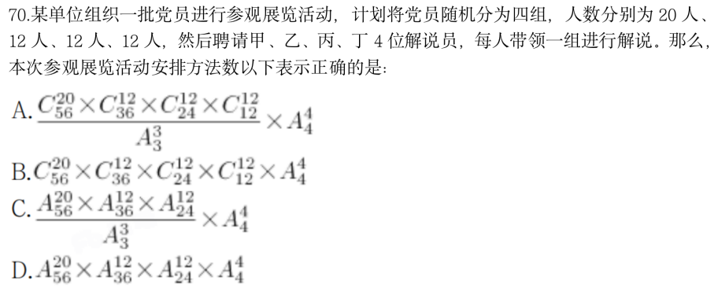

# Table of Contents

* [特优法](#特优法)
* [考点思维二：捆绑法](#考点思维二捆绑法)
* [考点思维三：插空法](#考点思维三插空法)
* [考点思维四：插板法](#考点思维四插板法)
* [考点思维五：分类做法](#考点思维五分类做法)
* [考点思维六：平均分组问题](#考点思维六平均分组问题)
* [考点思维七：排列与组合逆向思维](#考点思维七排列与组合逆向思维)
* [考点思维八：错位重排](#考点思维八错位重排)
* [考点思维九：环形排列](#考点思维九环形排列)
* [考点思维十：抽屉原理（最不利原则）](#考点思维十抽屉原理最不利原则)
* [排列组合真题综合刷题-必看](#排列组合真题综合刷题-必看)
* [排列组合思维技巧：范围估算速解思维](#排列组合思维技巧范围估算速解思维)
* [排列组合思维技巧：染色公式速解](#排列组合思维技巧染色公式速解)
* [排列组合思维技巧：环形排列与直线排列转换](#排列组合思维技巧环形排列与直线排列转换)
* [占比型概率](#占比型概率)
* [乘积型概率](#乘积型概率)
* [概率专项思维技巧：因子特征在分数概率中的应用](#概率专项思维技巧因子特征在分数概率中的应用)
* [相对参照概率模型（跟屁虫原理）](#相对参照概率模型跟屁虫原理)
* [抽奖模型秒杀应用](#抽奖模型秒杀应用)


# 特优法


母题：把4个同学分配给3个教室，每个教室至少1人且甲教室要分到2个同学，总共有几种分法？


例题1.【2018 吉林】
一位女士为了寻找曾经帮助她的司机，向新闻媒体提供了她记得的车牌信息。女士看到的车 牌号为“吉 AC****”，最后一位是字母，其他三位全是奇数，且数字逐渐变大，那么符合 要求的 车牌有
A.380 个
B.260 个
C.180 个
D.460 个


例题2.【2018 联考】
要求厨师从 7 种主料中挑选出 2 种、从 10 种配料中挑选出 3 种来烹饪一道菜肴，烹饪的方 式共有 6 种，那么该厨师最多可以做出多少道不一样的菜肴？
A. 10290
B. 18470
C. 19826
D. 15120

例题3.【2018 四川】
某场学术论坛有 6 家企业作报告，其中 A 企业和 B 企业要求在相邻的时间内作报告，C 企 业作报告的时间必须在 D 企业之后、在 E 企业之前，F 企业要求不能第一个，也不能最后 一个作报告。如满足所有企业的要求，则报告的先后次序共有多少种不同的安排方式？
A. 12
B. 24
C. 72
D. 144

例题4.【2019 联考】
某小学组织 6 个年级的学生外出参观包括 A 科技馆在内的 6 个科技馆，每个年级任选一个 科技馆参观，则有且只有两个年级选择 A 科技馆的方案有：
A. 1800 种
B. 18750 种
C. 3800 种
D. 9375 种

例题5.【2019联考】
正值毕业季，306 宿舍有 A、B、C、D 四位男同学，他们准备找班主任宋老师合影，若要求 宋老师坐正中间，A、B 两位同学不能挨着坐，那么总共有多少种坐法？
A.8 种
B.12 种
C.16 种
D.24 种

# 考点思维二：捆绑法

母题.由数字 1、2、3、4、5、6、7 组成无重复数字的七位数，求三个偶数必相邻的七位 数的个数。


例题1.【2020 国考】
扶贫干部某日需要走访村内 6 个贫困户甲、乙、丙、丁，戊和己。已知甲和乙的走访次序要 相邻，丙要在丁之前走访，戊要在丙之前走访，己只能在第一个或最后一个走访。问走访顺 序有多少种不同的安排方式？
A.24
B.16
C.48
D.32

例题2.【2018 联考】
两对夫妇各带一个小孩乘坐有 6 个座位的游览车，游览车每排只有 1 个座位。为安全起见， 车的首尾两座一定要坐两位爸爸；两个小孩一定要排在一起。那么，这 6 人的排座方法有：
A.12 种
B.24 种
C.36 种
D.48 种

例题3.某场科技论坛有5G、人工智能、区块链、大数据和云计算5个主题，每个主题有2位发言嘉宾。如果要求每个主题的嘉宾发言次序必须相邻，问共有多少种不同的发言次序？
A. 120
B. 240
C. 1200
D. 3840

# 考点思维三：插空法


母题：由数字 1、2、3、4、5、6、7 组成无重复数字的七位数，求三个偶数互不相邻的七 位数的个数。


例题1.【2020 联考】
某学习平台的学习内容由观看视频、阅读文章、收藏分享、论坛交流、考试答题五个部分组 成。某学员要先后学完这五个部分，若观看视频和阅读文章不能连续进行，该学员学习顺序 的选择有：
A.24 种
B.72 种
C.96 种
D.120 种


例题2.【2018 广东】
某条道路一侧共有 20 盏路灯。为了节约用电，计划只打开其中的 10 盏。但为了不影响行路 安全，要求相邻的两盏路灯中至少有一盏是打开的，则共有（ ）种开灯方案。
A. 2
B. 6
C. 11
D. 13

例题3.【2020 北京】
某单位随机安排张、王、刘、李、陈 5 名职工去甲、乙、丙三个地方开展调研。要求甲、 乙两地各去 2 人，且张、王两人不能同组，刘、陈二人必须同组，则共有多少种不同的安 排方式？
A.4
B.6
C.12
D.24

例题4.【2019 浙江】
小王想报名英语、计算机和会计三个培训班，要求每个培训班都在每周固定时间的晚上上课， 且一个晚上只能参加一个培训班。已知小王周一晚上需要值班，且他不希望一周内连续两个 晚上不上课也不值班，也不希望把英语和会计课程安排在连续两个晚上。问有几种不同的安 排方式？
A.12
B.20
C.24
D.36

例题5.一张节目表上原有3个节目，如果保持这3个节目的相对顺序不变，再添进去2个新节目，有多少种安排方法？
A.20    
B.12    
C.6    
D.4

# 考点思维四：插板法

母题：有 10 个相同的篮球，分给 7 个班，每班至少一个，有多少种分配方案？
A.36
B.64
C.84
D.210

例题 1：某城市一条道路上有 4 个十字路口，每个十字路口至少有一名交通协管员，现将 8 个协管员名额分配到这 4 个路口，则每个路口协管员名额的分配方案有：【2020 联考】
A.35 种
B.70 种
C.96 种
D.114 种

+ 考点思维四：插板法变形1

例题 1：把 20 台相同的电脑分给 8 个部门，每个部门至少 2 台，问共有几种分法？
A.165
B.330
C.792
D.1485

+ 考点思维四：插板法变形2

例题 2：将 7 个相同的苹果，分给 3 个小朋友，任意分，分完即可，有多少种不同分法？
A.2187
B.343
C.72
D.36

+ 考点思维四：插板法变形3

例题3:将 10 个完全相同的球放到 3 个不同的盒子中，要求每个盒子至少放一个、至多放四 个球，一共有多少种方法？
A.3
B.6
C.12
D.21


例题4:甲、乙、丙 3 个单位订阅同一款报刊，已知 3 个单位共订了 12 份，其中，每个单 位订阅数量不少于 3 份，但不超过 5 份，则这 3 个单位的报刊订阅数量可能有（ ）种组合。 【2022 广东】
A.2
B.6
C.7
D.9

# 考点思维五：分类做法

例题1.【2022 联考】
张师傅从事自行车、电动车、摩托车三种类型的车辆维修工作，每辆维修工时费分别为 3 元、6 元和 9 元。若张师傅某时段维修工时费共收入 15 元，那么该时段张师傅维修车辆类 型及相应数量的情况有： A.4 种
B.5 种
C.6 种
D.7 种

例题2.【2019 国考】
某单位要求职工参加 20 课时线上教育课程，其中政治理论 10 课时，专业技能 10 课时。可 供选择的政治理论课共 8 门，每门 2 课时；可供选择的专业技能课共 10 门，其中 2 课时的 有 5 门，1 课时的有 5 门。问可选择的课程组合共有多少种（ ）
A.5656
B.5600
C.1848
D.616


例题3.【2019 联考】
某农科院准备挑选 2 男 2 女 4 名科技人员分别去市郊的甲乙丙丁 4 个乡参加科技支农工作， 在报名的人员中有 3 男 4 女符合要求，在 4 名女性中有 1 位是农科院的副院长，考虑到工作 的具体需要，这名副院长不去甲乡，且去丁乡的是女性。符合条件的选法有________种。
A.198
B.216
C.378
D.432

例题4.【2019 联考】
小王在商店消费了 90 元，口袋里只有 1 张 50 元、4 张 20 元、8 张 10 元的钞票，他共有几 种付款方式，可以使店家不用找零钱
A. 5
B. 6
C. 7
D. 8


# 考点思维六：平均分组问题

1.把6本不同的书分给甲乙两人，每人3本，有几种分法？


2.把6个不同的书本平均分成2组，每组3本，有几种分法？


例题1：某班共有8名战士，现在从中挑出4人平均分成两个战斗小组分别参加射击和格斗考核，问共有多少种不同的方案？
A.210        
B.420　     
C.630　      
D.840

例题2:小王等6名学生参与了某展览会志愿者活动。他们被安排到两个不同的会场服务。如果要求每个会场都至少有2名志愿者，则对小王等人共有_______种不同的安排方式。
A. 20
B. 30
C. 50
D. 360




# 考点思维七：排列与组合逆向思维

例题 1：由 1-9 组成一个 3 位数，3 位数肯定有数字重复的组合有多少种？
A.220
B.255
C.280
D.225

例题 2：某高校开设 A 类选修课四门，B 类选修课三门。小刘从中共选取四门课程，若要求 两类课程各至少选一门，则选法有：
A.18 种
B.22 种
C.26 种
D.34 种

例题 3：单位工会组织拔河比赛，每支参赛队都由 3 名男职工和 3 名女职工组成。假设比赛 时要求 3 名男职工的站位不能全部连在一起，则每支队伍有几种不同的站位方式？
A.432
B.504
C.576
D.720

# 考点思维八：错位重排

例题 1：编号 1、2、3 的三封信装入编号为 1、2、3 的三个信封，要求每个信封和信的编号 不同，问共有几种装法？
A.2
B.6
C.9
D.12

例题 2：编号为 1 至 6 的 6 个小球放入编号为 1 至 6 的 6 个盒子里，每个盒子放一个小球， 其中恰有 2 个小球与盒子的编号相同的放法有（ ）种。
A.9
B.35
C.135
D.265

# 考点思维九：环形排列

例题 1：5 个人手拉手围成一个圆圈，问共有多少种不同的方法？
A.120
B.24
C.60
D.30

例题 2：四对夫妇坐在圆桌旁，如果要每对夫妇都坐在一起的话，有几种排列他们座位的方 式？
A.384
B.268
C.186
D.96

例题 3：编号为 1 到 5 的 5 张椅子顺时针均匀地绕围圆桌一圈摆放，5 个人入座，不同的入 座方式有几种？
A.90
B.100
C.120
D.150

# 考点思维十：抽屉原理（最不利原则）

例题1.某职工餐厅有主食3种，热菜4种，凉菜3种，若每个职工均打1种主食、1种热菜和1种凉菜，问至少有多少个职工在餐厅用餐，就会有2人的用餐组合是一样的？
A.36
B.37
C.72
D.73


例题2.某旅行社推出了去张家界、凤凰古城、洪江古商城、高椅古村四地旅游，可选其中的一个或者多个旅游。其中张家界和凤凰不能同时去，每个旅行团选择一种方案。问至少要有多少旅行团才能使得有两个旅行团的旅游方案相同？
A.16      
B.15      
C.12      
D.11

例题3.【2020 联考】
某会展中心布置会场，从花卉市场购买郁金香、月季花、牡丹花三种花卉各 20 盆，每盆均 用纸箱打包好装车运送至会展中心，再由工人搬运至布展区。问至少要搬出多少盆花卉才能 保证搬出的鲜花中一定有郁金香：
A.20 盆
B.21 盆
C.40 盆
D.41 盆

# 排列组合真题综合刷题-必看

例题1.【2018 联考】
某公司新近录用五名应聘人员，将分别安排到产品开发、管理、销售和售后服务这四个部门 工作，每个部门至少一人。若其中有两人只能从事销售或售后服务两个部门的工作，其余三 人均能从事四个部门的工作，则不同的选派方案共有：
A.12 种
B.18 种
C.36 种
D.48 种

```
特优法  这2个人已经是已知的，不用在从5个里面选一个了

1.甲乙在同一个 销售或者售后
C21 剩下3个人，A33 
2.甲乙不在同一个组
2个部门里面选一个 C21
2个人里面选一个C21
从剩下3个里面选一个组合为2个人 C31 
剩下2个人A22
------看了答案这里少了一种情况
2.1 2人组在甲乙 

2个部门里面选一个 C21
2个人里面选一个C21
从剩下3个里面选一个组合为2个人 C31 
剩下2个人A22

2.2 2人组不在甲乙
C32*A22 甲乙选位置


```

**例题2.【2018 国考】**
**某企业国庆放假期间，甲、乙和丙三人被安排在 10 月 1 号到 6 号值班。要求每天安排且仅 安排 1 人值班，每人值班 2 天，且同一人不连续值班 2 天。问有多少种不同的安排方式？**
**A.15**
**B.24**
**C.30**
**D.36**

```
1.C31 3个人选一个排 假设甲
2.C21 乙丙选一个 假设 乙
3.C21 这里就要分类讨论了
       4  5  6
  选甲  46只能丙
  选丙 随便排A33
  C31*C21*(1+A33-A22) A22 是丙排到一起的情况
  6*5=30

 为什么第二个是C21 第三个就要分类了？
 因为第三个分类会对后面结果造成影响

第二个之所以C21，是因为第二个可以随便选，他无所谓的呀，但是第三个他的选法就有问题了，因为前面比如说前面选到的是甲乙，那你第三个的话，你如果选甲，那就意味着后面没有甲了。你如果选饼，那说明后面还有一个角，所以这样的话肯定会对后面这个会有影响的，包括它的排法都不一样的啊。
```
例题3.【2019 深圳】
某自驾游车队由 6 辆车组成，车队的行车顺序有如下要求：甲车不能排在第一 位，乙车必须排在最后一位，丙车必须排在前两位，且任一车辆均不得超车或 并行。该车队的行车顺序共有（ ）种可能。
A.36
B.42
C.48
D.54

```

丙在第一位
C41*A33
丙在第二位
C31*A33
6*7=42
```
例题4.【2019 河南司法】
某市从市儿童公园到市科技馆有 6 种不同路线,从市科技馆到市少年宫有 5 种不同路线,从市 儿童公园到市少年宫有 4 种不同路线,则从市儿童公园到市少年宫的路线共有
A.24 种
B.36 种
C.34 种
D.38 种
```
5*6+4=34
```
例题5.【2019 辽宁】
中秋假期，小王请同在一个城市的 9 位大学同学聚餐。10 人围坐一桌，敬酒前小王提出一 个建议：每个人要同不相邻的同学喝一杯。如果小王的提议被通过，那么一共要准备________ 杯酒。
A.70
B.90
C.140
D.210

```
每个人要同不相邻的同学喝一杯 也就是一个人要跟7个人喝酒
10个人就是 10*7=70
```
例题6.【2021 联考】 
A、B、C 三个社区需要建设若干个 5G 基站，三个社区可供选择的建设基站地点分别有 2 个、 4 个、5 个，现从 A、B、C 三个社区分别选取 1、2、3 个地点随机分配给甲、乙、丙三个施 工队进行建设，要求每个施工队只能承接一个社区，则承建方式有： 
A.720 种 
B.480 种 
C.360 种 
D.120 种
```
施工队是椅子，
先分社区
C21 *C42*C53 
每个社区可以去不同施工队 A32
120*6=720
```

例题7.【2020 国考】 
环保局某科室需要对四种水样进行检测，四种水样依次有 5、3、2、4 份，检测设备完成四 种水样每一份的检测时间依次为 8 分钟、4 分钟、6 分钟、7 分钟。已知该科室日最多可使 用检测设备 38 分钟，如今天之内要完成尽可能多数量样本的检测，问有多少种不同的检测 组合方式？ 
A.20 
B.16 
C.10 
D.6

```
 用检测设备 38 分
 那就是用时最短
4*3+6*2+7*2
c33*c22*c42=6 
问题是这个8不用管吗？不用的，因为上面就是最多的检测方式了
注意这题没有问检测顺序，而是问的检测方式
```
例题8.【2020 浙江】 
从分别写着 1-9 数字的 9 张卡中选出 4 张并排列为一个四位数，其结果能被 75 整除的数字： 
A.不到 15 个 
B.15-20 个 
C.21-25 个 
D.超过 25 个

```
75=25*3
如何寻找这个数能被25和3整除？

末尾必须是25的倍数 或者75倍数 ，进行分类讨论
1.__ 25 前面加起来被3整除
2不可能 从
5【14】8【17】 11【47 38】 14【68】17【98】
6*2=12

2.__ 75 被3整除
3【1.2】6 9 12 15
7*2=14
12+14=26
```
例题9.【2020 广东】 
某单位的两个部门计划订阅报纸。每个部门需要在指定的 5 种报纸中选择其中的 3 种，且这 两个部门在选择时应做好沟通，做到 5 种报纸都有部门订阅，则订阅报纸的方案共有（ ） 种。
A.20 
B.30 
C.60 
D.100

```
C53 C31=30
```

例题10.【2020 深圳】 
某地方性体育彩票“10 选 4”的投注规则如下：投注者可以从 01—10（共 10 个号码）中投 选 1—4 个号码合成一组，称为“一注”（号码不区分排列顺序，如 02 06 03 和 02 03 06 是 由该 3 个号码组成的同一注）。当投注了（ ）注时，会出现至少 5 注相同号码。
A.1255 
B.1361 
C.1401 
D.1541
```
最不利原则
C101+C102+C103+C104=385
385*4+1=1541
```
例题11.【2020 四川】 
一批相同的 17 件产品，交给甲、乙、丙三人生产。已知甲、乙、丙三人生产一件产品所需 时间相同，每个人至少分到四件产品的生产任务，三人同时开始生产且完成各自的任务之前 不休息。问完成所有工作所需时长有多少种不同的可能性？ 
A.9 
B.8 
C.4 
D.3
```
四川题还是很难的 注意题目问的是时长 不是分配方式！！！
先每人给4件 还有5件
500  5分钟给甲乙丙 不影响时长
410
320
211  注意 这里都是时长 不是分配方式~~
```
例题12.【2021 江苏】 
某单位开设 abcdef 等六门培训课程，员工自愿报名参加。经统计，员工选择的课程组合， 共有四种，a+f，d+f，a+c+e，b+c+f，所有培训结束后，统一安排考试，为不影响工作要求， 在 1 月 4 日至 10 日中的连续六天考完，每天只考一门，且每位员工都不会连续两天参加考 试，则安排这六门课程考试日期的不同方法共有： 
A.2 种 
B.4 种 
C.8 种 
D.12 种

```
难题放弃
选B
```

例题13.【2021 浙江】 
商店销售某款橡皮，有每盒 3 块、每盒 5 块和每盒 10 块三种不同的包装，且只能整盒出 售而不能拆散。某日卖出这款橡皮不到 50 盒，且当日任意 2 名顾客购买的橡皮块数都不 相同。问当天最多有多少名顾客购买了这款橡皮 
A.17 
B.18 
C.19 
D.20

```
问最多，那就是购买3盒最多
难题 选择性放弃
```

例题14.【2021 广东】 
县公安局计划举办篮球比赛，6 支报名参赛的队伍将平均分为上午组和下午组进行小组赛。 其中甲队与乙队来自同部门，不能分在同一组，则分组情况共有（ ）种可能。 
A.6 
B.8 
C.10 
D.12
```
简单题 直接做
C21*C42=12
```


例题15.【2021 浙江】 
一块长方形土地的周长为 260 米，面积为 3600 平方米。将该土地划分成边长 10 米的小正方 形土地。现从中选取 3 块，使得任意两块既不同行也不同列。问有多少种不同的选取方式？
A.不到 200 种 
B.200—400 种 
C.400—800 种 
D.超过 800 种

```
先求出边长 3600=40*90
把那就是 长9 宽 4
重点理解：现从中选取 3 块，使得任意两块既不同行也不同列

不同和还好理解，既不同行也不同列怎么取？

1.先从4行里面选3行 C43
2.依次从9列里面选一列 C43*C91*C81*C71=4*9*8*7= 选D

```

例题16.【2022 国考】 
某县通过发展旅游业来实现乡村振兴，引进了甲、乙、丙、丁、戊和己 6 名专家。其中甲、 乙、丙是环境保护专家，丁、戊、己是旅游行业专家，甲、丁、戊熟悉社交媒体宣传。现要 将 6 名专家平均分成 2 个小组，每个小组都要有环境保护专家、旅游行业专家和熟悉社交媒 体宣传的人，问有多少种不同的分组方式？ 
A.12 
B.24 
C.4 
D.8

```
这题难再如何取进行分组
看题目要求，每个小组都要有环境保护专家，那么甲乙丙必须要分开

甲 乙丙  这里的组合就奇怪了 ，只能从丁、戊 2个身份都有的选一个
乙 甲丙 随便选一个旅游 C31
丙 甲乙  随便选一个旅游 C31
3+3+2=8
```

例题17.【2022 江苏】 
有 5 支足球队进行单循环比赛，每场比赛胜者得 3 分，负者不得分，平局双方各得 1 分。比 赛结束后，若 5 支球队的总得分为 25 分，冠军得 12 分，则亚军得： 
A.5 分 
B.6 分 
C.7 分 
D.8 分

```
C52=10 一共10场 
3a+2b=25
a=5
b=5  总共赢5场 平5场
【这里先明确一个前提，每个人都要跟别人打4场】
首先冠军12分 那就是全赢4场？为什么 看前提
亚 赢一场 输一场 平2 
3+2=5
```

例题18.【2022 联考】 
某市举办世界遗产大会，开幕式会场需要从 6 组志愿者中选出 4 组分别从事防疫协助、嘉宾 引导、英语翻译、物资发放四项不同的工作，其中甲、乙组不能从事英语翻译工作，丙组只 能从事防疫协助工作，则派选方案有： 
A.36 种 
B.72 种 
C.108 种 
D.144 种

```
分类

1.不选 丙 
从剩下3个人选一个去英语 C31
剩下4个人3个坑 A43

2.选丙
丙只能选防疫
从剩下3个人去英语C31
剩下4个人2个坑 A42
```


# 排列组合思维技巧：范围估算速解思维

例题1.【2023江苏】

某博物馆拟举办一次为期 4 天的文物展览活动，展出的文物共有 5 类：青铜器、瓷器、 玉器、书法、国画。若要求每天仅展出 2 类文物，每类文物都要展出但不能连续 2 天展出，且玉器和国画这 2 类文物不在第 1 天展出，则不同的展出方式共有 

A. 72 种 

B. 120 种 

C. 216 种 

D. 360 种 

 

```
范围估算，
1.每天展出2类文物
2.每类文物都要展出但不能连续 2 天展出
3.且玉器和国画这 2 类文物不在第 1 天展出

第一天就是C32
那么第二天呢 因为不能连续 第二天也是C32
C32*C32*C32*C32=81 只有4天 满足这几个情况就是81 答案肯定比81小

```

 

例题2.【2021下半年全国联考】

某公司推出4款杯子，分别为陶瓷杯、玻璃杯、木质杯和不锈钢杯，现将4个杯子放进展柜排成一排展示，要求玻璃杯不能放在两端，木质杯和不锈钢杯不能相邻，那么可能会出现多少种排列方式？

A.8 

B.12 

C.16 

D.20 

```
玻璃杯不能2端 
C21*A33=12 答案小于12
```

例题3.某单位随机安排张、王、刘、李、陈 5 名职工去甲、乙、丙三个地方开展调研。要求甲、乙两地各去 2 人，且张、王两人不能同组，刘、陈二人必须同组，则共有多少种不同的安排方式？

A.4	

B.6	

C.12	

D.24

```
正常分组
 221 
 特优法 
 C31  2 1组里面 从3个人选一个
 C21  刘、陈二人必须同组 选一个组
```

 

 

# 排列组合思维技巧：染色公式速解

+ 拿掉的和其他都有联系 先排拿掉的 例题3

例题1.小明家门前有一块形状如图所示的花园，他想在花园里种花，发现家里有5种花的种子。他对花园的唯一要求是相邻的两块地不能种植同样的花，那么一共有（ ）种不同的种植方案。

A. 180  B.240   

C. 260   

D. 280  

```
直接套用公式

5个颜色 4个对象
4^4+4=260
```

 

例题2.一环形花坛分成A，B，C，D四块，现有四种 不同的花供选择，要求要每块里种1种，且相邻的2块种不同的花，则不同的种法总数为（）

A.96 

B.84 

C.60 

D.48
  

```
3^4+3=84
```

例题3.一个地区分为如图所示的五个行政区域，现在有4种颜色可供选择，给地图着色，要求相邻区域不同色，那么则有多少种染色方法？

A.72

B.60

C.48

D.24  

  

 

```
1拿掉会对2345都有影响 先排拿掉的
1会用掉一种颜色 C41
剩下3中颜色 4个对象

2^4+2=18
4*18=72
```


例题4.用5种不同颜色为图中ABCDE五个部分染色，相邻部分不能同色，但同一种颜色可以反复使用，也可以不使用，则符合要求的不同染色方法有多少种？

 

```
拿掉de，但是不是影响全部，所以先排
5个颜色 3个对象
4^3-4=60 60的倍数
先排D 因为D挨着BC 只有3中
e 也是一样 也是3种
60*9=540
```

 

# 排列组合思维技巧：环形排列与直线排列转换


```
环形排列，他是环形当中是相对顺序就相对位置，那相对顺序， 
所以如三个人环形排列，你拿一个人来说，他的排列数另一个人的排列数，
【1.其实你在空间上去看，其实他就是一样的，所以说我们是重复算了三遍，因此我们要÷3 】
他就是每顺序反过来就是绝对顺序，那绝对顺序就指的是直线型的排列有标志
的，
【2.有编号就是有了绝对的顺序，唯一的标识类似打标签】
```


例题1.5 个人按顺时针均匀地绕围圆桌一圈入座，不同的入 座方式有几种？

 

```
A{n-1,n-1}
A44=24
```


例题2.编号为 1 到 5 的 5 张椅子顺时针均匀地绕围圆桌一圈摆放，5 个人入座，不同的入 座方式有几种？ 

A.90 

B.100 

C.120 

D.150

 

```
注意编号1到5 
A55=24*5=120
```

例题3.办公室 8 名员工围着一张圆桌就座准备用餐，此时又有 3 名加完班的员工在已就座的员工中间加座并参加用餐。已知加座后，3 名加完班的员工彼此都不相邻，且 8 名已就座的员工最多与 1 名加完班的员工相邻。问有多少种不同的加座方式？

A.336	

B.96	

C.48	

D.30

 

```

```


# 占比型概率

+ 0-99 数字和为奇数的有50个，偶数为50个

例题1:【2018 联考】
某种商品出厂编号的最后三位为阿拉伯数字。现有出厂编号最后三位为 001～100 的产品 100 件，从中任意抽取 1 件，出厂编号后三位数字之和为奇数的概率比其为偶数的概率：
A.高 2%
B.低 2%
C.高 0%
D.低 4%

```
套用公式
0-99 50偶数 50奇数
去掉1 加上100 奇数 
51奇数 29偶数 差2

```

例题2:【2019 吉林】
抽奖箱子里剩下 8 张奖券，其中 5 张有奖，3 张无奖，小王有两次抽奖机会，他不放回地依次抽取两张奖券，则这两张奖券中一张有奖一张无奖的概率是：
A.15/56
B.25/64
C.15/32
D.15/28

```java
5*3+3*5
--- =  30/56=15/28
7*8

```

例题3:【2020 联考】
南部某战区一个 10 人小分队里有 6 人是特种兵，某次突击任务需派出 5 人参战，若抽到 3名或 3 名以上特种兵可成功完成突击任务，那么成功完成突击任务的概率有多大？
A.3/5
B.2/3
C.29/42
D.31/42

```
正向情况比较多 ，考虑反向情况
X<=2
6特 4普通 但是发现特必须选一个
分子：C44*C61+C43*C62
分母 C105
```
例题4:【2020 广东】
一个纸箱里装有大小及材质完全相同的 10 个小球，其中 3 个黑色，2 个白色，1 个红色，2个黄色，1 个绿色，1 个紫色。如果不放回地依次随机取出 3 个小球，则取出的小球依次是黑色，红色，白色的概率为：
A.1/120
B.1/240
C.1/250
D.3/500
```

分母 10*9*8=720的倍数 排除CD
分子：3*2*1=6
6/720= A
```
例题5:【2021 上海】
小李抽盲盒，这类盲盒一共有 8 款，小李只要其中的 1 款，他一次买了两个盲盒,则抽中他想要的那款的概率是_____。
A.1/64
B.7/32
C.15/64
D.1/4

```
1.同一款
1/8*8=1/64
2.不同款
C21 2个盲选一个是他要的，剩余一个之只能选7种

2*7+1=15/64

```
例题6:【2021 联考】
受新冠疫情影响，某高校某专业开展在线教育，在同一上课时间开设 3 门选修课 A，B 和 C，每个学生可任选其中 1 门，但每门课程限选 30 人。已知该专业共有 90 人，问该专业学生小李能选中课程 A 的概率是：
A.1/9
B.1/6
C.1/3
D.2/3
```
30/90=1/3

```
#  乘积型概率

例题1:小王开车上班需经过 4 个交通路口，假设经过每个路口遇到红灯的概率分别为 0.1、 0.2、0.25、0.4，则他上班经过 4 个路口至少有一处遇到绿灯的概率是： 
A.0.899 
B.0.988 
C.0.989 
D.0.998


例题 2：【2017 四川】 
某杂志为每篇投稿文章安排两位审稿人，若都不同意录用则弃用；若都同意则录用； 若两人意见不同，则安排第三位审稿人，并根据其意见录用或弃用。如每位审稿人录用某篇 文章的概率都 60%，则该文章最终被录用的概率是：
A.36% 
B.50.4% 
C.60% 
D.64.8%

例题 3：天气预报的正确概率为 0.8，则 3 天的天气预报恰有两天正确的概率是多少？ 
A.0.032 
B.0.128 
C.0.192 
D.0.384

例题 4：已知在三次重复独立的化验中，至少有一次出现阳性反应的概率为 19/27，则在这 三次化验中恰好出现两次阳性反应的概率为 .
 A.2/9 
B.10/11 
C.7/9 
D.1/9

例题 5:【浙江 2015】 
某场羽毛球单打比赛采取三局两胜制。假设甲选手在每局都有 80%的概率赢乙选手， 那么这场单打比赛甲有多大的概率战胜乙选手？
A.0.768 
B.0.8000 
C.0.896 
D.0.924


例题 6:【2020 江苏】 
小张下班回家乘地铁 18:45 之前到家的概率为 0.8，乘公交为 0.7。已知小张下 班回家要么乘地铁，要么乘公交，且选择乘地铁的概率为 0.6，则他下班回家 18:45 之前 到家的概率是
A.0.73 
B.0.74 
C.0.75 
D.0.76


# 概率专项思维技巧：因子特征在分数概率中的应用


例题1:【2021 江苏】

某地举行募捐抽奖活动。每位捐赠者均有一次抽奖机会。活动设一二三等奖，获奖规则如下：抽奖时捐赠人在 0 到 9 这 10 个数字中一次随机抽取 4 个不同的数字，若与主办方开奖时随机抽取的 4 个不同数字完全相同，则获一等奖；若恰有 3 个相同，则获二等奖；若恰有 2个相同则获三等奖。则捐赠者获奖的概率是：

A.13/25

B.14/27

C.16/35

 

 

例题2:【2023国考】

单位将 10 个培训名额分配给 4 个分公司，要求在每个分公司至少分配 1 个名额的所有分配方案中，随机选择 1 个方案实施，问 4 个分公司中有 3 个分配名额数量相同的概率为多少? 

A.3/50

B.1/10

C.2/25

D.1/7

 


例题3:【2019事业统考】

某单位派甲、乙两名选手组队参加乒乓球比赛，其中甲每场比赛均有 40%的可能性获胜，乙每场比赛均有 70%的可能性获胜。现安排甲参加 1 场比赛，乙参加 2 场比赛，总计获胜 2场及以上即可出线。则该单位代表队出线的概率为。

A.48.8%

B.56.4%

C.61.4%

D.65.8%

# 相对参照概率模型（跟屁虫原理）

例题1.【2018 联考】
某单位工会组织桥牌比赛，共有 8 人报名，随机组成 4 队，每队 2 人。那么小王和小李恰好被分在同一队的概率是: 
A.1/7
B.1/14
C.1/21
D.1/28


例题2.【2018 国考】
某单位的会议室有 5 排共 40 个座位，每排座位数相同。小张和小李随机入座，则他们坐在同一排的概率（   ）
A.不高于 15%
B.高于 15%但低于 20%
C.正好为 20%
D.高于 20%


例题3:【2018 陕西】
胜利小学的 225 名同学与红旗小学的 256 名同学一起春游，将两所小学的同学混合在一起，随机组合，重新组织队伍，要求每队人数相同且队伍数尽可能少，那么胜利小学的张华与红旗小学的张明出现在同一队伍的概率约为（ ）
A.1.5%   B.2.5%   C.3.5%    D.4.5%   
E.5.5%   F.6.5%    G.7.5%    H.8.5%

例题4:【2019 联考】
甲乙两人相约骑共享单车运动健身。停车点现有 9 辆单车，分属 3 个品牌，各有 2、3、4辆。假如两人选择每一辆单车的概率相同，两人选到同一品牌单车的概率约为：
A.1/6
B.2/9
C.5/18
D.1/3

例题5.【2019 联考】
某学校举行迎新篝火晚会，100 名新生随机围坐在篝火四周，其中，小张与小李是同桌，他俩坐在一起的概率为：
A.2/97
B.2/98
C.2/99
D.2/100


# 抽奖模型秒杀应用

例题1:【2020 山东】
在 ATM 机上输入银行卡密码时，若连续三次输入错误则会吞卡，老李忘了银行卡密码的末两位数，只记得是两个不相同的奇数，若他在末两位上随意输入两个不同奇数，能在吞卡前猜中正确密码的概率是：
A.3/20
B.1/5
C.1/9
D.2/9


例题2:【2021 浙江】 
小李有一张银行卡，他忘记了密码的后 3 位，只记得这 3 个数全是奇数且有 2 个相同。问他尝试不超过两次就输入正确密码的概率为多少： 
A.1/30 
B.1/50 
C.2/59 
D.2/57

例题3:【2022国考】
甲、乙等16人参加乒乓球淘汰赛。每轮对所有未被淘汰选手进行抽签分组两两比赛，胜者进入下一轮。已知除甲以外，其余任意两人比赛时双方胜率均为50%。甲对乙的胜率为0%，对其他14人的胜率均为100%。则甲夺冠的概率为：
A.3/4
B.8/11
C.11/15
D.225/256
