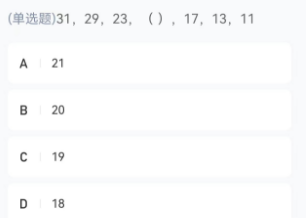
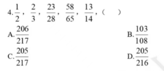
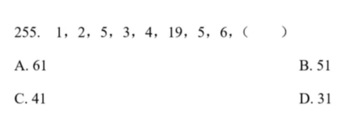
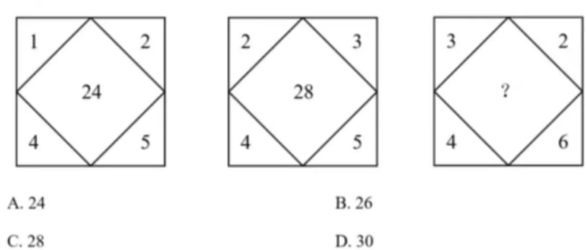
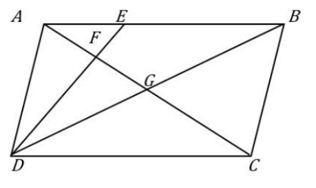

# Table of Contents

* [数推错题](#数推错题)
  * [质数列](#质数列)
  * [倍数关系](#倍数关系)
  * [递推关系](#递推关系)
  * [对角](#对角)
* [因子特征](#因子特征)
* [增减](#增减)
* [混合](#混合)
  * [等比例](#等比例)
* [销售](#销售)
* [和差转化](#和差转化)
* [追击](#追击)
* [概率](#概率)
* [概率-容斥](#概率-容斥)
* [容斥](#容斥)
  * [人次错题](#人次错题)
* [排列组合](#排列组合)
  * [分类](#分类)
* [平均速度](#平均速度)
* [等差](#等差)
  * [等差伸缩](#等差伸缩)
* [和差倍比](#和差倍比)
* [蝴蝶定理](#蝴蝶定理)
* [约数](#约数)
* [归元](#归元)
* [经典](#经典)
* [简单错题](#简单错题)


A.45

B.48

C.50

D.60

```
1.因最近降雨多，水库上游水流入量增加 20% ，于是每天多排掉原排水量的 10% ，但不用作发电，则仍够 A 设施用电 40 天
说明多的水等于排除的水
20/100 10/100 进行配同
20/100 20/200
即原来水100 排除水200
2.如果仍按照原排水量发电且不多排水，那么可供 A 设施使用多少天
水流增加，但是不排水，使用量必然大于40天，设n天
40*20 40天，每天增加的20
120n  多的天里面 每天多流入的
200n  原排水
40*20+120n=200n
n=10
```

-----

甲单位职工人数是乙单位的 2 倍，两个单位所有职工中正好有一半是党员。其中甲单位职工中党员占比比乙单位高 15 个百分点，且甲单位的职工中群众人数比乙单位多 18 人。问甲单位职工中，党员比群众多多少人：

```
十字交叉

```

--------------

 **一项工程，甲工作20天后，若乙来帮忙，可提前6天，若是丙来帮忙，可提前8天，丙工效是乙工效的1.5倍。如果从一开始就是甲、乙、丙一起做，需要多少天完成？**
 A.24
B.25
C.28
D.30 

```
这题注意，后面都是丙乙帮甲做的，
这题如果转化下，甲提高了..速度，提前，，几天 会更好识别
增减速模型
3 8
2 6
V=9:8=(6+3：6+2)
t=8:9=16:18 ->后面要24天
原来就是（20+24）*6  / （6+3+2）=24
```

----

**例题5:甲单位的党员人数是乙单位的2倍，党员占本单位职工的比重是乙单位的一半。如从乙单位调10名党员到甲单位，从甲单位调10名群众到乙单位，则两个单位党员分别占本单位职工的比重相同。问两个单位共有多少名党员？**
A.45 
B.60 
C.75 
D.90

```
问法突破 3倍数 解决不了
党员：2：1
占比：1：2
人数：4：1

原来党员2：1 后面比重相同党员4：1 党员总人数不变
10：5  12：3
2f->10  15f=75
```

-----

3.某个社区老年协会的会员都在象棋、围棋、太极拳、交谊舞和乐器五个兴趣班中报名了至少一项。如果要在老年协会中随机抽取会员进行调查，至少要调查多少个样本才能保证样本中有4名会员报的兴趣班完全相同？

A．93　　

B．94　　

C．96　　

D．97


-----

\12. 某一楼一户住宅楼共17层，电梯费按季交纳，分摊规则为：第一层的住户不交纳；第三层及以上的住户，每层比下一层多交纳10元。若每一季度该住宅楼某单元的电梯费共计1904元，则该单元第7层住户一季度应交纳的电梯费是： 

A.72元

B.82元

C.84元

D.94元

```
等差数列 17层但是第一层不算，那就是16
1904/16=119
等差中项就是 16+1=17/2=8.5 实际上是9.5
9.5-5=119-5=114
问第7层 114-20=94
```


----

M和N分别为3个连续自然数的积，两者差为468。已知这两组自然数的和的差为3，那么两组自然数中位数的和为多少?()
A21
B23
C25
D27

```
正常做法
M和N分别为3个连续自然数的积
a-1 a  a+1 a+2
 (a+2)a(a+1)- (a-1)a(a+1)=468
 a(a+1)3=468
 a(a+1)=156
 乘积为6 加和为3
 
 也可以直接带入数字做
 4*3*2- 1*2*3=3*(2*3)
 468/3=156
 x(x+1)=156
 x=12 13
 11 12 13  12 13 14 
 就可以得出答案了
```

-----

某羽毛球俱乐部推出充值会员优惠活动，具体为月卡会员费用打八折，年卡会员费用打七折，充值总时长1年的月卡比1年的年卡所需费用，打折前后分别多88元和100元，问打折后充值18个月的会员最少需要:
不到340元
340-400元之间
400-460元之间
460元以上

```
如果打折后得差值 * 8折 
88*0.8= 68.4
但是时间差值得是100 
100-68.4=29.6
说明这一折就是年卡会员得一折 全部就是296
月卡296+88=384

296*0.7+384/2*0.8

这里用到了几个思想，鸡兔 折数思维
```

----

7.某工程由甲、乙两家企业共同参与，甲企业的实际出资额是乙企业的3倍，乙企业投入的人力资源是甲企业的2倍。如将两家企业投入的人力资源按一定价格折算为出资额并依折算后的出资额分配利润，则甲企业分配的利润是乙企业的 1.2 倍。问如乙企业的出资额增加 50%而其他条件不变，其分得的利润为甲企业的多少倍?
A.0.90
B.0.95
C.1.00
D.1.05

```
        乙   甲
出资额   1(1.5)   3
人力资源 2    1

人力资源 甲+乙 三倍数
出资额 3倍数
所以总利润必然是3倍数
答案+1=3倍数 
选B
为什么会想到这个，看到人力资源乙是甲的2倍，那么合起来就是3倍数
```

-----

甲、乙两条生产线同时接到羽毛球、网球两种球拍的生产任务。已知甲要生产的球拍总数和乙相同，甲的网球拍生产任务是乙的三分之一，乙的羽毛球拍生产任务是甲的四分之一，如甲、乙工作效率相同，且单个羽毛球拍生产时间是网球拍的一半，问甲、乙完成任务用时之比为： A.7:10 B.10:7 C.13:19 D.19:13

```
已知甲要生产的球拍总数和乙相同
甲网+甲羽=乙网+乙羽
甲网-乙网=乙羽-甲羽

甲网：乙网=1：3
甲羽：乙羽=4:1
3:9
8:2

羽毛球1 网球2 
甲=3*2+8=14
乙=2*9+1*2=20

```

----

3.某件商品如果打九折销售，利润是原价销售时的2/3；如果打八折后再降价50元销售，利润是原价销售时的1/4。该商品如果打八八折销售，利润是多少元？
A.240　  　         
B.300　             　
C.360   　　         
D. 480

```
份数思维
2/3 1/4 原价利润为12f
9折  一折就是 4f  总共就是40f  成本就是28f
8折  3f+50=4f  1f=50 
40*8.8=35.2
35.2-28=7.2*50=360
```


# 数推错题

## 质数列

做为经常出现的，如果出现几个质数列，立马要想到就是考这个点



```

```



```
分子通分 1^2+1 2^3+1  3^3+1
```


## 倍数关系

特征：比较解决

分子分母之间 1/2 1.5 


81，27，18，18，24，()


## 递推关系



```
看到19 有点突兀 然后数列大于7  尝试间隔求和
1+2^2
3+4^2=19
```


## 对角



```
这种给了中间了就是凑中间
24=12*2
28=14*2
```


# 因子特征

有三条同心圆跑道，里圈跑道长1/5公里，中圈跑道长1/4公里，外圈跑道长3/8公里。甲、乙、丙三人分别在里、中、外圈同一起跑线同时同向跑步。甲每小时跑3.5公里，乙每小时跑4公里，丙每小时跑5公里，问何时后三人同时回到出发点？ 

A. 8小时 

B. 7小时 

C. 6小时 

D. 5小时

```
肯定回去了
```


# 增减

2.小张每天固定时间骑摩托车从家里到乡镇的木材加工厂上班，如果他以 30 千米/小时的速度行驶，会比上班时间提前 10 分钟到达加工厂，如果他以 20 千米/小时的速度行驶，则会迟到 12 分钟。如果小张某天迟到了 6 分钟，则他的当天行驶速度是多少千米/小时？ 

A.22 

B.23 

C.24 

D.25 

```
增减速时有参照系的，老是忘记
以30为参照系
10  22
x   16
V=160：22x =88:11x

第二种做法是直接比例
V=3:2
t=2:3  f=22  2f=44  
11 倍数
```


# 混合

+ 2部分  不明确的量  注意分母是什么


制造集团下属某工厂32%的工人为高级技工，在将40名工人（其中24人为高级技工）调往其他厂后，高级技工占工人的比重下降到25%。问该单位原有多少名高级技工？（ ） 

A. 48 

B. 64 

C. 80 

D. 96

```
混合
25     28
   32     4:1  1f=40 5f=200  200*0.32=64
60     7
```


 例题 5：【2023 国考】 甲、乙、丙三家科技企业 2021 年的收入之和比 2020 年提升了 20%。其中甲企业的收入上升 了 400 万元，乙企业的收入下降了 100 万元且是甲企业收入的一半，丙企业的收入上升了 30%且其 2020 年的收入与甲、乙两企业同年收入之和相同。问 2020 年甲企业的收入比乙企 业高多少万元? A.900 B.400 C.1100 D.600
```
30
   20
x
x=10 也就是甲乙加起来上升了10%
【注意这个时候要往条件上靠】
10% 增长了300 【说明原来是3000】 现在就是3300 2:1 2200 1100
2200-400-(1100+100)=600
```


## 等比例

2.【2025 江苏】
甲乙两瓶质量和浓度均相同的酒精溶液，在甲瓶中加入 20 克水，乙瓶中加入 50 克浓度为30%的酒精溶液后，浓度均相等。若继续在甲瓶中加入 30 克纯酒精，溶液又恢复到最初浓度，则乙瓶酒精最初的质量是（ ）
A.100 克
B.110 克
C.120 克
D.150 克

```
 a  b

a   a+15
--= ---       
b+20   b+50 
【一个溶液跟1/2浓度混合，浓度不变，说明原本浓度1/2啊   这里没想到 导致这题做不出来】
a+30
---  浓度不变 在a/b的基础上 加一个 3/5浓度不变的，原来a/b =3/5   
b+50

a/b=3/5  a/b+20=1/2    定值陪同 3/6    1f=20 原来5f=100
```


# 销售

某工厂生产瓷器，因原料采集出现问题，成本有所提高。一件瓷器成本上涨25%,为留住客户资源，售价只上涨了15%，利润率（利润/成本）比以前下降了12个百分点，则原来的利润率是:
A52%
B50%
C54%
D60%

```
利润率=售价/成本 公式比例
```


# 和差转化

某班共有40多名学生，其中男生人数和女生人数相等。老师在统计该班内学生报兴趣班的情况时发现，女生未报兴趣班的人数恰好是男生报兴趣班人数的1/4，男生未报兴趣班的人数恰
好是女生报兴趣班人数的1/3。。问该班共有多少名学生未报兴趣班?
15 12 10 8 

```
女未+女=男未+男
男-女未=女-男未  差量相同，差定值
4:1
3:1

8:2
9:3
22f =44 只有44  5f=10

```


# 追击

老张、老李和老高三人开车各以一定的速度匀速从A地前往B地，知老李比老高晚出发 20 分钟，出发后50分钟追上高;老张比老李又晚出发 10分钟，出发后 50 分钟追上老高，那么老张出发后需要()分钟能够追上老李。

A50←
B60←
C70←
D80←

```
找相同量 都是追击老高，追击距离以老高为主
时间相同
S=2:3
V=2:3 =李-高:张-高
所以张-李=1
多走了2*10/1=20 +50=70分
```

# 概率

3.【2017江苏】
两公司为召开联欢晚会，分别编排了3个和2个节目，要求同一公司的节目不能连续出场，则安排节目出场顺序的方案共有： 
A. 12种 
B. 18种 
C. 24种 
D. 30种


# 概率-容斥

财务部推荐本部门员工小王和小李参加公司最佳员工评选。若小王、小李成功入选的概率分别为0.6和0.5，两人都成功入选的概率为0.25，则财务部有员工被评为公司最佳员工的概率为：

- A0.6
- B0.75
- C0.8
- D0.85

```
利用容斥来做
0.6+0.5-0.25= 至少一个人 选D
```

# 容斥

2.【2016重庆下半年】
一旅行团共有50位游客到某地旅游，去A景点的游客有35位，去B景点的游客有32位，去C景点的游客有27位，去A、B景点的游客有20位，去B、C景点的游客有15位，三个景点都去的游客有8位，有2位游客去完一个景点后先行离团，还有1位游客三个景点都没去。那么，50位游客中有多少位恰好去了两个景点（  ）
A．29              
B．31              
C．35              
D．37

```
A+2B+3C=35+32+27=67+27=94
A+B+C=49  
B+2C=45  C=16 选A
```


## 人次错题

某单位组织45名员工参观第十五届中国国际航空航天博览会，其中，21人参观了新一代隐身战斗机-35A，22人参观了嫦娥六号取回的月背月壤样品，19人参观了大型无人机战舰“虎鲸”。所有员工中，这三种展览都未参观的有5人，至少参观两种的有12人，则这三种展览都参观的有（ ）

A.7人

B.8人

C.9人

D.10人

```
A+B+C=45-5=40  人数
A+2B+3C=21+22+19=62 人次
B+C=12人 【这里不是人次 人次是B+3C 至少2种的总人次】

B+2C=22 C=10 选D
```


甲、乙、丙3人参加专业测试，考试包含10道题，答对每题得10分，不答或答错不得分。已知每道题3人中至少有2人答对，没有人得100分且任意2人总分都不相同。则最多有（ ）道题3人都答对。
A.3
B.4
C.5
D.6

```
没有人全对
9+8+7=24
每道题3人中至少有2人答对
10*2=20
24-20=4

```


# 排列组合

## 分类

某早餐店推出“10元2件”套餐，顾客花费10元即可在白粥、豆浆、油条、蛋饼、叉烧包、云吞面6个品类中任选2件，既可以选相同的，也可以选不同的。则至少售出（ ）份该套餐时，一定有2份套餐的搭配完全一致。

A.15 

B.16 

C.21 

D.22

```
不相同C62
相同: C61*C11  6个里面选一个  【这里没有加】
```


# 平均速度

> 等距离平均速度注意等距离
>
> 平均速度=(a+b)/2

李某骑车从甲地出发前往乙地，出发时的速度为15千米/小时，此后均匀加速，骑行25%的路程后速度达到21千米/小时。剩余路段保持此速度骑行，总行程前半段比后半段多用时3分钟。问甲、乙两地之间的距离在以下哪个范围内？

- A不到23千米
- B在23~24千米之间
- C在24~25千米之间
- D超过25千米

```
15+21=36/2=18
V=18:21
t=7:6

```

# 等差

***\*9.\*******\*【\*******\*2024山东\*******\*】\****

若干职员参加某次强国知识竞赛，每个人的得分均不相同且为整数，分数排名相邻的 2 人分差均为 5 分。已知有 3 人成绩低于 70 分，且超过 70 分的职员平均分为82 分。问所有职员中竞赛成绩超过 70 分的人数占比在下列哪个范围内？ 

A.低于 50% 

B.50%-60%之间 

C.60%-70%之间 

D. 高于 70%

```
82是中项
等差数列，82 看成中间项，则超过 70 分的有 72，77,82,87,92，此时低于 70 分就是 57,62,67。答案=5/8，选 C。
```

10.【2025 国考副省级】
某种商品在定价基础上打八折销售，打折之前每天卖 40 件，开始打折第一天起，每天都比前一天多卖 10 件。打折销售 15 天的利润总额与打折之前销售 20 天的利润总额相同，问这种商品的成本是定价的：
A.60%
B.64%
C.70%
D.75%

```0
50  140  
190+50=240/2=120

120*15 9因子 分母分子减去 9倍数 选B
```


## 等差伸缩

某水果种植特色镇创办水果加工厂，从去年年初开始通过电商平台销售桃汁、橙汁两种产品。从去年2月开始，每个月桃汁的销量都比上个月多5000盒，橙汁的销量都比上个月多2000盒。已知去年第一季度桃汁的总销量比橙汁少4.5万盒，则去年桃汁的销量比橙汁：

- A少不到5万盒
- B少5万盒以上
- C多不到5万盒
- D多5万盒以上

```
差值5000 差值2000 减去也成等差 3000
一季度合起来 9 *0.3=2.7

```


# 和差倍比

.【2016 北京】
某工厂与订货商签订合同，约定订货商在订单生产完成 50%和 80%的时候分别支付两笔货款。在派 6 名工人生产 4 天后，完成了订单的 8% ，如增派 9 名工人加入生产，则订货商在支付第一笔和第二笔货款间的时间间隔为多少天？（假定所有工人工作效率相同）（ ）
A. 6
B. 10
C. 12
D. 15

```
【鸿哥解析】A
根据昨天等量交替思维知道 6 人做 1 天完成 2%，即 6 人做 15 天完成 30%，也就是 15 人做 6天，A。
```


# 蝴蝶定理

平行四边形ABCD.如右图所示，E为AB.上的一点，F、G分别为AC与ED.BD的交点。若AB=3AE,则四边形BEFG与ABCD的面积之比是

 

 

A.2:7

B.3:13

C.4:19

D.5:24

```
a^2：b2：cd:cd
1:9:9:9
afd=3 cfd=9 加起来12 总共24

错在：加错数据
```


# 约数

某学习软件要求使用字母和数字组成的 8 位密码。赵某使用 D、E、F、W4 个大写字母（不重复使用）和 4 个不同非零数字的组合作为自己的密码，要求数字放在后四位，且 4 个数字的乘积须是 320 的倍数。那么这样的密码有多少种不同的可能？
A.不到 1000 种
B. 1000-3000 种
C.3000-8000 种
D. 超过 8000 种

```
【鸿哥解析】B
320n=5*2^6*n，合并成 4 个数只能是（2,4,5,8）或者（4,5,6,8），方法就是 2*A44=48；大写字母方法数就是 A44=24，答案 48*24=1152

n=1  2  4 5 8
n=2  2 4 5 8 放2 4 就重复 放5 放8 就超10
n=3  3因子放6
n=4   
所以只能放1 3 
```


# 归元

某商店在母亲节前花费288元购进了120之康乃馨，计划按照50%的利润进行销售，在按照既定价格卖出了75%的量之后，进行了打折处理销售了剩下部分，共盈利112.5元，问康乃馨促销时打了几折？

A.7

B.7.5

C.8

D.8.5

```
288  计划按照50% 就是144 但是现在是112.5 
75/100  3/4  
30件少了 144-112.5=31.5
120件少了 31.5*4=126 【单个推出整体按照这个打折少了多少钱】

原来288+144=432    432-126=306 
```


# 经典

某公司春节 7 天假期安排员工值班，要求值班的员工每人任选不连续的 2 天值班，则至少需要安排( )人，才能保证每天至少有 4 人值班。
A. 14
B. 21
C. 45
D. 63

```
假设每天4个人 调换下位置
```


# 简单错题

某种蔬菜进价5元/斤，售价10元/斤，当天卖不完的蔬菜不再出售。过去7天里，菜商每天购进该种蔬菜100斤，其中有4天卖完，有2天各剩余20斤，有1天剩余10斤，这7天菜商共赚了多少元钱？ 

A. 2950 

B. 3000 

C. 3250 

D. 3500

````
没有减去成本
````

