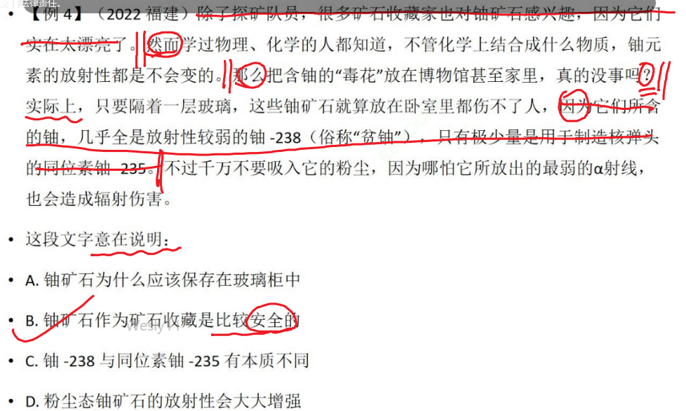
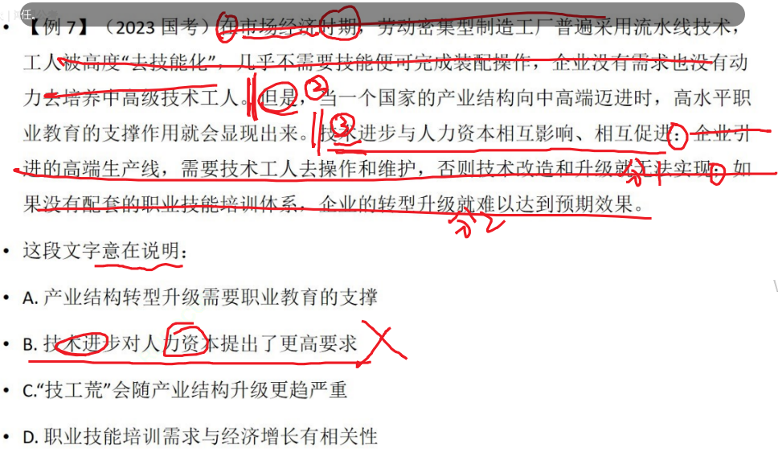

# Table of Contents

* [做题步骤](#做题步骤)
    * [读题目：属于哪个题型](#读题目属于哪个题型)
    * [读题干](#读题干)
    * [抽重点句核心成分（主谓宾）](#抽重点句核心成分主谓宾)
    * [对比选项](#对比选项)
    * [选项易错点](#选项易错点)
    * [例题](#例题)
* [标点符号-重点](#标点符号-重点)
    * [标点符号划分段落](#标点符号划分段落)
    * [句号错误示范](#句号错误示范)
    * [分号](#分号)
* [下定义](#下定义)
* [提出问题+分析问题+解决问题](#提出问题分析问题解决问题)
* [逻辑关联词](#逻辑关联词)
    * [转折](#转折)
        * [先立后驳](#先立后驳)
        * [丢掉转折前主体](#丢掉转折前主体)
    * [因果关系](#因果关系)
    * [条件关系](#条件关系)
    * [递进](#递进)
* [背景重不重要](#背景重不重要)
* [提出问题，答案要不要和问题有关系?-话题](#提出问题答案要不要和问题有关系-话题)
* [关联词不明显](#关联词不明显)
* [说明文 议论文](#说明文-议论文)
* [A与b](#a与b)
* [时间](#时间)
* [偷换概念](#偷换概念)
* [代词](#代词)
* [经典题目分析](#经典题目分析)

Table of Contents

* [做题步骤](#做题步骤)
    * [读题目：属于哪个题型](#读题目属于哪个题型)
    * [读题干](#读题干)
    * [抽重点句核心成分（主谓宾）](#抽重点句核心成分主谓宾)
    * [对比选项](#对比选项)
    * [选项易错点](#选项易错点)
    * [例题](#例题)
* [标点符号-重点](#标点符号-重点)
    * [标点符号划分段落](#标点符号划分段落)
    * [句号错误示范](#句号错误示范)
    * [分号](#分号)
* [逻辑关联词](#逻辑关联词)
    * [转折](#转折)
        * [先立后驳](#先立后驳)
        * [丢掉转折前主体](#丢掉转折前主体)
    * [因果关系](#因果关系)
        * [例题](#例题-1)
    * [递进](#递进)
* [如何判断提出一个问题?](#如何判断提出一个问题)
* [背景重不重要](#背景重不重要)
* [提出问题，答案要不要和问题有关系?-话题](#提出问题答案要不要和问题有关系-话题)
* [关联词不明显](#关联词不明显)
* [说明文 议论文](#说明文-议论文)
* [A与b](#a与b)
* [时间](#时间)
* [偷换概念](#偷换概念)
* [代词](#代词)
* [经典题目分析](#经典题目分析)

# 做题步骤

## 读题目：属于哪个题型

1. 这段文字旨在/意在？ 重点
2. 对文段概括准确全面的是？ 非重点+重点
3. 先不区分，先忠于原文，做不出来的时候才区分问法
    1. 意在：重点
    2. 概况：全面=重点+非重点

## 读题干

1. 根据标点符号梳理行文脉络 ，一般是句号，问号也可以，不能是逗号顿号

   > 个人认为这个最重要，段落结构出来了，答案就出来了

2. **边读边勾画 特殊标点、关联词、关键词**，并分析**之前还是之后重要**，找到**重点句/主旨句/中心**句

   > 遇到谁就分析谁

3. 无特殊标点、无关联词、无关键词【后面在讲 行文脉络、内容逻辑】

## 抽重点句核心成分（主谓宾）

1. 找到主题词/关键词，找话题

> 2. 主旨句/中心句/重点句，主要是主谓宾
> 2. 并列文段中->求同->找高频词
> 2. 非并列文段->主旨句->核心成分 【火山灰例题】

2. 如果4个选项都有主题词，就要找话题

   > 1. 主题词是一个词语，话题是一句话
   > 2. 话题可以理解为，我们在讨论什么问题？ 【外星人例题】

3. 细节

   > 1. 时态 将来 现在 已经
   > 2. 范围词不能丢
   > 3. 情态 （必然、可能）
   > 4. 偷换概念 【诗歌例题】

## 对比选项

1. 主题词
2. 话题
3. 细节理解

## 选项易错点

1. 分割谬误 【见广府人例题】

   > *分割谬误 是一种****非形式谬误\***
   *，是基于整体拥有某性质，而推论其中的部分或全部个体都具备该性质，这是一种以全概偏；相对地则有合成谬误：某物的某部分具有某性质，故某物具有某性质。*

2. 无中生有 原文没有

3.

## 例题

晚清以降,广府人在中国政治、经济、社会的演进中,一直扮演着引领潮头的重要角色。无论是康有为、梁启超和孙中山等人物在政治舞台，上的叱咤风云,还是改革开放之后港商港星们的风靡神州,抑或是世界各地唐人街.上的异彩纷呈,都会让我们对这些说粤语的人们多看一眼,也会对广府文化有着更深的认识。
这段文字的主要内容是( )。 A 广府名人遍布世界各地 B 广府文化在世界的传播 C 近代以来广府文化的影响力 D 广府人在近现代史上的地位

```
晚清以降,【广府人】在中国政治、经济、社会的演进中,一直扮演着引领潮头的重要角色。①
无论是康有为、梁启超和孙中山等人物在政治舞台，上的叱咤风云,还是改革开放之后港商港星们的风靡神州,抑或是世界各地唐人街.上的异彩纷呈,都会让我们对这些说粤语的人们多看一眼,也会对广府文化有着更深的认识。②

看行文脉络，总分结构。
①找主语 【广府人】
无论... 还是。。。 都是在举例子
A  广府名人遍布世界各地   X 广府名人!=广府人
直接选D
```

-----

（2023
北京）古时候手工制造皮纸，经过泡、蒸、煮、沤这几个环节后，仍然有些老树皮难以去除，总会在造纸的纸浆里留有一些残痕。在抄纸的时候，这些残留物还是浮在纸面上。没有一部书是完全找不出这种痕迹的。假如在看书时可以清楚地看到没有捣碎的桑树皮，甚至可以清楚看到它的颜色，就可以判断这是皮纸。
这段文字旨在说明： A. 古代造纸的流程 B. 皮纸的独特原料 C. 鉴定皮纸的方法 D. 手工造纸的优势

```
古时候手工【制造皮纸】，【经过】泡、蒸、煮、沤这几个环节后，【仍】然有些老树皮难以去除，总会在造纸的纸浆里留有一些残痕。||在抄纸的时候，这些残留物还是浮在纸面上。||没有一部书是完全找不出这种痕迹的。||假如在看书时可以清楚地看到没有捣碎的桑树皮，甚至可以清楚看到它的颜色，就可以判断这是【皮纸】。 
一定和皮纸有关，排除AD 
 皮纸的【独特】原料  无中生有
秒C
```

-----

（2023 国考）火山灰是指火山爆炸性喷发形成的，直径小于 2
毫米的喷发碎屑。在爆炸性火山活动中，围岩和岩浆被炸碎成细小的颗粒，形成火山灰。火山灰从火山口喷发到大气中，经过大气搬运再沉降到各类环境中，整个过程通常只有数年，从地质时间尺度来看，几乎只是瞬间。所以在各种地质记录中，火山灰是一种高精度的绝对时间标志层。火山灰年代学正是利用地质记录中的火山灰层来确定地质年代的科学，该学科可以解决一些重要的科学问题，比如大型火山喷发事件与气候变化、人类演化之间的关系，以及气候快速变化的区域差异等。
这段文字主要介绍了： A. 火山灰的形成过程与主要特点 B. 火山灰年代学的研究思路和价值 C. 火山灰在自然环境中的分布状态 D. 火山喷发对环境和人类的影响

```
火山灰是指火山爆炸性喷发形成的，直径小于 2 毫米的喷发碎屑。||在爆炸性火山活动中，围岩和岩浆被炸碎成细小的颗粒，形成火山灰。||火山灰从火山口喷发到大气中，经过大气搬运再沉降到各类环境中，整个过程通常只有数年，从地质时间尺度来看，几乎只是瞬间。||【所以】在各种地质记录中，火山灰【是】一种高精度的绝对时间标志层。||【火山灰年代】正是利用地质记录中的火山灰层来确定地质年代的科学，【该学科可以解决一些重要的科学问题】，比如大型火山喷发事件与气候变化、人类演化之间的关系，以及气候快速变化的区域差异等。 
1.主题词火山灰 排除D
2.xx是xxx理论+实践   火山灰年代 秒B
```

-----


（2023
四川）黄色与红色一样，是中华民族偏爱的颜色。在与“五行说”相对应的“五色论”里，黄色代表土，居于四方的中央。东汉的儒家为了抬高君权，突出了“五行”和“五方”中“土居中央”的观点，把土说成是一切元素的根本，因此中央是至高无上的，这也极大地提高了黄色的地位。三国时期的魏文帝曹丕也接受了这一说法，把黄色定为正色之首，随后的隋、唐王朝都加以效仿。从唐代起，正黄色成为皇室的专用色，滥用即会获罪。时隔千年，虽然黄色早已进入寻常百姓家，但金黄色那高贵庄严的气质依然存在。
对这段文字概括最恰当的一项是： A. 分析中华民族偏爱黄色的原因 B. 追溯土居中央观念的形成历史 C. 探讨颜色与五行观念的内在渊源 D. 强调皇权观念对色彩文化的影响

```
黄色与红色一样，是中华民族偏爱的颜色。||在与“五行说”相对应的“五色论”里，黄色代表土，居于四方的中央。【东汉的儒家】为了抬高君权，突出了“五行”和“五方”中“土居中央”的观点，把土说成是一切元素的根本，因此中央是至高无上的，这也极大地提高了黄色的地位。【三国时期】的魏文帝曹丕也接受了这一说法，把黄色定为正色之首，随后的隋、唐王朝都加以效仿。【从唐代起】，正黄色成为皇室的专用色，滥用即会获罪。【总】时隔千年，虽然黄色早已进入寻常百姓家，但金黄色那高贵庄严的气质依然存在
总分总

时间相关行文脉络
```

----

（2023
江苏网友回忆版）诗歌原本就是语言的艺术与游戏，最擅长的便是以简洁的话语勾勒复杂的图景，是一种在有限的措辞中努力实现无穷意蕴的文体。诗歌的创作与最终的呈现同样对其句子表达的精炼、准确，以及其中所使用的符号、修辞做出要求，与数字游戏对文字文本的要求不谋而合。因而从某种程度上来说，数字游戏与诗歌原本就是相互适配的：数字游戏适合以诗歌为其文字表达，诗歌也适合以数字游戏作为载体。
通过这段文字作者主要想表达： A. 数字游戏与诗歌之间有密不可分的关系 B. 诗歌写作其实可以说是一种语言的游戏 C. 数字游戏选用诗歌作文字文本是适宜的 D. 诗歌表达方式其实与数字游戏相反相成

```
【诗歌原本就是】语言的艺术与游戏，最擅长的便是以简洁的话语勾勒复杂的图景，是一种在有限的措辞中努力实现无穷意蕴的文体。诗歌的创作与最终的呈现同样对其句子表达的精炼、准确，以及其中所使用的符号、修辞做出要求，与数字游戏对文字文本的要求不谋而合。【因而】从某种程度上来说，【数字游戏与诗歌原本就是相互适配的】【：】数字游戏适合以诗歌为其文字表达，诗歌也适合以数字游戏作为载体。

冒号前面是总 后面是分
1.出现诗歌 A保留 B偷换概念，题目说的是数字游戏 
2.排除D  没有说相反
3.C 没有出现重点句 相互适配，2面。C片面了。


```

-----

（2022
江苏）獬豸，是中国古代神话传说中的“法兽”，据《论衡》中描述，其双目明亮有神，独角，能辨是非曲直，能识善恶忠奸，有勇猛、公正的寓意。在我国一些法院门口，往往能看到獬豸的雕像，象征着对公平正义的守护。公平正义是司法的灵魂，是人民群众感知法治建设的一把尺子。推进全面依法治国，要紧紧围绕保障和促进社会公平正义来进行，把这一价值追求贯穿到立法、执法、司法、守法的全过程和各方面。
这段文字意在强调： A. 古代典籍描述的獬豸是法治的象征 B. 司法公平是社会的底线公平 C. 法治建设要贯穿于法制工作的全过程 D. 公平和正义，是法治的生命线

```
獬豸，是中国古代神话传说中的“法兽”，据《论衡》中描述，其双目明亮有神，独角，能辨是非曲直，能识善恶忠奸，有勇猛、公正的寓意。【xx是xx 下定义 不用管】
在我国一些法院门口，往往能看到獬豸的雕像，象征着对【公平正义】的守护。【公平正义】是司法的灵魂，是人民群众感知法治建设的一把尺子。推进全面依法治国，要紧紧围绕保障和促进社会【公平正义】来进行，把这一价值追求贯穿到立法、执法、司法、守法的全过程和各方面。

```

----

（2024
国考网友回忆版）胜诉权益不能及时有效兑现，是影响人民群众感受司法公正的最后一道藩篱。自动履行率越高，意味着越多的案件无需进行执行程序就可兑现裁判，既减少了衍生案件，也能防止社会关系进一步撕裂。这要求通过建立自动履行正向激励机制，把司法信用融入企业生产、群众生活，推动形成守法践诺的良好风尚；建立“谁办理、谁负责”的案件履行督促机制，让承办法官引导和督促当事人自动履行裁判义务。加强反向惩戒、强化执行刚性，对有能力而拒不执行判决裁定的人，用足用好失信惩戒机制，使其主动履行裁判义务，提升执行到位率。
这段文字主要介绍： A. 着力强化案件裁判兑现的重要价值 B. 有效兑现胜诉权益对司法公正的意义 C. 失信惩戒对提升执行到位率的作用 D. 提升自动履行率保障胜诉权益的途径

```
【胜诉权益不能及时有效兑现】，是影响人民群众感受司法公正的最后一道藩篱。 -》这就是话题，有选项直接选
自动履行率越高，意味着越多的案件无需进行执行程序就可兑现裁判，既减少了衍生案件，也能防止社会关系进一步撕裂。
【这】要求通过建立自动履行正向激励机制，把司法信用融入企业生产、群众生活，推动形成守法践诺的良好风尚【；】建立“谁办理、谁负责”的案件履行督促机制，让承办法官引导和督促当事人自动履行裁判义务。
加强反向惩戒、强化执行刚性，对有能力而拒不执行判决裁定的人，用足用好失信惩戒机制，使其主动履行裁判义务，提升执行到位率

1.这代之前文，一般都是后文重要，根据话题排除AC
2.文章先提出问题再说对策，而不是意义，选D


```

---

（2023 内蒙古）1683
年，牛津大学阿斯莫林博物馆向公众开放，标志着现代博物馆的诞生。博物馆发展至今，其功能在收藏、研究的基础上，新增了教育功能。博物馆作为我国公共文化服务体系重要组成部分，其三大功能中，收藏是基础和前提，研究是手段和过程，教育是目的和结果。“一个博物馆就是一所大学校”。以博物馆为窗口和媒介，能实现研究成果从专业小众向普通大众的转化，坚定文化自信、传承中华文明，进而实现文明互鉴，繁荣文化事业和文化产业。教育功能的充分发挥是博物馆强国建设的核心要义之一。
这段文字主要说明： A. 教育功能是博物馆持续发展的核心关键 B. 博物馆具有收藏、研究和教育三大功能 C. 发挥好博物馆的教育功能具有重要意义 D. 博物馆发展的同时功能性也在不断丰富

```
1683 年，牛津大学阿斯莫林博物馆向公众开放，标志着现代博物馆的诞生。博物馆发展至今，其功能在收藏、研究的基础上，【新增了教育功能】。
博物馆作为我国公共文化服务体系重要组成部分，其三大功能中，收藏是基础和前提，研究是手段和过程，教育是目的和结果。
“一个博物馆就是一所大学校”。
以博物馆为窗口和媒介，能实现研究成果从专业小众向普通大众的转化，坚定文化自信、传承中华文明，进而实现文明互鉴，繁荣文化事业和文化产业。
【教育功能的充分发挥是博物馆强国建设的核心要义之一。】

1.答案一定出现教育 排除BC
2，A 没有说持续发展
```

-----

（2024
国考网友回忆版）大模型赋能，生成式人工智能正在引发新一轮智能化浪潮。得益于拥有庞大的数据、参数以及较好的学习能力，大模型增强了人工智能的通用性。从与人顺畅聊天到写合同、剧本，从检测程序安全漏洞到辅助创作游戏甚至电影，生成式人工智能本领加速进化。随着技术迭代，更高效、更聪明的大模型将渗透到越来越多的领域，有望成为人工智能技术及应用的新基座，变成人们生产生活的基础性工具，进而带来经济社会发展和产业的深刻变革。人工智能大模型强大的创新潜能，使其成为全球竞争的焦点之一。
这段文字意在说明： A. 人工智能在大模型赋能下正在快速发展 B. 加快发展新一代人工智能势在必行 C. 生成式人工智能的创新潜能亟待挖掘 D. 生成式人工智能已成为全球研究的焦点

```
【大模型赋能】，生成式人工智能正在引发新一轮智能化浪潮。
得益于拥有庞大的数据、参数以及较好的学习能力，大模型增强了【人工智能】的通用性。
从与人顺畅聊天到写合同、剧本，从检测程序安全漏洞到辅助创作游戏甚至电影，生成式【人工智能】本领加速进化。
随着技术迭代，更高效、更聪明的【大模型】将渗透到越来越多的领域，有望成为【人工智能】技术及应用的新基座，变成人们生产生活的基础性工具，进而带来经济社会发展和产业的深刻变革。
人工智能大模型强大的创新潜能，使其成为全球竞争的焦点之一。 

1.选A
```

-----

# 标点符号-重点

+ 逗号：分隔一句话中不同部分，注意是一句话。

  > 除非一逗号到底或重点句太长

+ 句号：划分句子的标准

  > 错的最多的情况
  >
  > 1—。1—。3—，但是—。
  >
  > 但是只是第三句话的转折，你并不知道12句的重要性。

+ 分号： 前分分>总分、分分后->分总、分中后->分总分

+ 冒号： 总分 解释

+ 顿号：、号表并列

+ 括号：

-----

## 标点符号划分段落

**根据句号把文章拆成小段**，再根据**逻辑关联词**，判断当前文章**话题**以及**主题词**，然后**对比择优**



## 句号错误示范

现代农业的发展不能脱离生态安全和产品安全两个基本要求，因此，农业污染防治应作为现代农业发展的重要任务之一。不同于工业污染和城市污染，农业污染涉及面广而隐蔽性强，评估难度大，不适合建立惩罚型机制。同时，由于农民收入水平相对较低，不可能进行“污染收费”。所以说，必须建立激励型经济补偿机制，从根本上提高农户防控污染的积极性。这种补偿机制实质上是对生态建设与保护所付出的成本（包括放弃发展机会
的损失）进行补偿。 对这段文字的主旨概括最准确的是（ ）。 A. 农业污染防治是现代农业发展的重要任务  
B. 治理农业污染与工业污染的方法有所不同  
C. 转变农业发展模式是治理农业污染的前提  
D. 现代农业污染防治应树立激励补偿型理念

```
现代农业的发展不能脱离生态安全和产品安全两个基本要求，因此，农业污染防治应作为现代农业发展的重要任务之一。||①
不同于工业污染和城市污染，农业污染涉及面广而隐蔽性强，评估难度大，不适合建立惩罚型机制。||②
【同时】，由于农民收入水平相对较低，不可能进行“污染收费”。||③
【所以说】，必须建立激励型经济补偿机制，从根本上提高农户防控污染的积极性。||④
这种补偿机制实质上是对生态建设与保护所付出的成本（包括放弃发展机会 的损失）进行补偿。 ⑤

1.可以看到第一句话的确是有【因此】，但是也只是第一句话而已。并不能代表文章中心句子。【局部总结】
2.在看第四句【所以说】->重点句：激励型经济补偿机制
3.查看答案只有D比较接近
4.如果有其他选项出现-激励型经济补偿机制-，是会一个更好的选项

```

## 分号

+ 前分分>总分、分分后->分总、分中后->分总分



```
1.根据标点符号划分全文来看，②前面都可以不要，③后面都可以不要
2.全文就只剩下② ③了,但是这2句没有关联词，怎么办？2句都要看！
3.分析选项，是否又不符合原文的 出现职业教育的只有A
4.万一选项都符合呢？一般都是总分或分总

```

# 下定义

下定义：

理论表述+实践 ：是为了引出实践

下定义：

1. xxx是xxxx
2. xxxx，这就是。。。。

一般位于首句，一般不是重点。

除非说明文

# 提出问题+分析问题+解决问题

整个议论文，基本都是这种思路

1. 正常来说提出问题，是问号，但是不一定，有很多词汇也可以表达问题

   > 如何、怎样、怎么
   >
   > 导致/带来/造成。。。。位于段首 引号问题
   >
   > 消极词语、负面的词汇
   >
   > 在基层治理中
   >
   > 我国处于社会主义初级阶段

2. 提+分+解决 一定都出现吗

    1. 提+分+解
        1. 意在：优先解决问题
        2. 概括：优先解决问题
    2. 提+分
        1. 意在：优先解决问题
        2. 概括：优先问题+分析内容
    3. 提
        1. 意在：优先解决问题
        2. 概括：优先问题

       > 怎么记呢？对策不到位的、概括都是问题，其他都是对策
       >
       > 对策不到位：我说解决A 你说如何解决B

3. 如果提对策有多个，如何处理？

   > 现在命题喜欢靠这个，多个对策，选一个 国考每年
   >
   > 只有 1 2 3，才能达到效果 4 5 6
   >
   > A 1+ 6 B 2+5  C 3+4
   >
   >  123 递进 选3
   >
   > 123 并列 选A 【条件先说的重要 结果后说的重要】

4. 对策：需要、必须、应该、应当、建议、通过。。方式、采取。。、借助

------

【例 2】（2024
深圳）如今，许多人将公共图书馆视为图书借阅室，甚至自习室，而实际上，图书馆同博物馆、美术馆一样，有文物存藏和展示展览的功能。因为古籍不仅是可供人们阅读研究的文献，还是必须收藏保护的文物，将古籍等同于一些当代文献，视为普通的“公版书”，正是忽视了古籍的文物属性。人们常说的“一页宋版一两金”，指的就是珍贵的宋版书。纸寿千年，绢寿八百，古籍的修复、存藏、复制，每个环节都是颇具难度的“技术活”。目前，学界公认的解决古籍“藏”与“用”矛盾的重要方式，就是古籍数字化。古籍数字化是文明传承的必由之路，更是需要徐徐图之的文化工程，需要全社会赋之信心、细心和耐心。
这段文字意在说明： A. 现代图书馆具有多重公共功能与属性 B. 应当重视古籍的文化价值和历史价值 C. 古籍数字化工程需要全社会久久为功 D. 要发挥图书馆存藏与展示古籍的功能

```
正是忽视了古籍的文物属性。----提出问题
目前，学界公认的解决古籍“藏”与“用”矛盾的重要方式，就是古籍数字化 -解决问题
答案一定要跟解决问题相关 直接秒C
```

-----

（2024
国考网友回忆版）村落形成是优胜劣汰、自我生长的过程。我们现在看到的村落，是经过历史“折叠”后的结果，当下呈现的只是其中一个切面。村落里的大部分遗留物中，都隐藏着不同历史阶段的痕迹，想要看清楚，需要将“折叠”展开，按照各种痕迹进行重新整理和立体化呈现。所谓“没有特色、没有传统的村落”，其实是因为信息残缺较为严重，但其中的历史印记不会完全消失。要发现这些信息，必须通过长时间的田野调查，与原住民进行深入交流，感受他们对艺术的认知与理解，找到他们能接受、认为美的形式，这才是艺术乡建最重要的切入点。
作者通过这段文字想说的是： A. 村落中的历史文化信息亟待发掘整理 B. 艺术乡建应以复原村落特色为着力点 C. 发现历史细节是振兴传统村落的基础 D. 扎实的田野调查对艺术乡建至关重要

```
所谓“没有特色、没有传统的村落” ---问题
要.... 对策 
必须通过长时间的田野调查，与原住民进行深入交流，感受他们对艺术的认知与理解，找到他们能接受、认为美的形式，这才是艺术乡建最重要的切入点。 
直接秒D
```

---------------------

（2024
深圳）经常听到国内许多专门家痛心疾首地抱怨各种走俏的传媒作品严重缺乏学术上的准确性和严肃性；但是专家学者们却往往又把自己的研究成果表述得过分艰涩干瘪而少趣味，使少数同行之外再不会有什么别的人愿意皱着眉头去读完它们。学术探索的过程本来应该是充满奇光异彩的。趣味从我们的学术著作中脱逸的现象，很可能表明一部分徒有其表的“学术著作”本身其实并不真正地具备“学术”一词所必须含有的基本品格。但确实也存在另一种情形，即作者缺乏下述这种充分意识：他应当尽可能地让读者与他共享的，乃是科学探索中的乐趣与喜悦，而不只是其中的艰辛与酸楚。
这段文字意在： A. 分析传媒作品与学术著作受众规模差异的原因

B. 鼓励学术著作向走俏的传媒作品借鉴表达

C. 批判趣味已经从大多数学术著作中脱逸的现状 D. 提倡撰写学术著作应将趣味性与学术性并重

```
经常听到国内许多专门家痛心疾首地抱怨各种走俏的传媒作品严重缺乏学术上的准确性和严肃性；【分号直接不看】【趣味】从我们的学术著作中脱逸的现象，很可能表明一部分徒有其表的“学术著作”本身其实并不真正地具备“学术”一词所必须含有的基本品格。【但】确实也存在另一种情形，即【作者缺乏下述这种充分意识】： 【分号直接不看】

读下来全是问题，选对策
```

-----

（2023
福建）互联网时代是人机交互的时代，视觉、听觉、触觉在接入互联网的过程中尤为重要，而老年人多感官的衰老都为“触网困难”埋下了伏笔。同时，任何一款新功能、任何一次灵活的界面转换都可能会造成他们在互联网中的“迷失”，成为阻拦他们“入网”的道道关卡。此外，软件更新频繁、无意中跳转到新页面、关不掉各类弹出式信息这三类情况均给不少老年人带来了“触网”难题。
这段文字意在说明： A. 数字时代如何助力老年人“老有所安” B. 入网障碍引发了老年人抵触入网心理 C. 互联网时代老年人上网面临多重困难 D. 互联网的适老化改造仍存在探索空间

```
没有对策，选问题
```

------

# 逻辑关联词

## 转折

1. 常见的转折词：但是/却/然而

2. 做转折也可以做解释：事实上、实际上、其实、当然

3. 弱转折：消极词 +的是

> 可惜的是
>
> 遗憾的是

4. 殊不知

5. 先立后驳： 一般认为、很多人认为

   > 1. 一般认为/很多人认为/传统的说法 引出观点
   > 2. 后面再提出更观点不一样的地方。这就是重点。

6. **易错点**：丢掉转折前的主体

   > 老王丑，但是性格好
   >
   > A 老王性格好
   >
   > B 鸿哥性格好
   >
   > C 性格好

------

### 先立后驳

垄断竞争理论认为，企业可以通过迎合消费者品味上的差异，在某种程度上降低竞争对企业所造成的影响。差异策略使其他企业的产品不能完美地替代本企业的产品。形成差异是要花钱的，使用差异策略的企业要提高产品价格来弥补其较高的生产成本。然而，即使采用差异策略的成本较高，处于寡头垄断市场中的企业，仍然可以通过提高产品的价格来赚取高额利润。
对这段文字的主旨概括最准确的是（ ）。 A.垄断竞争会对企业有很大影响  
B.企业通过提高价格来弥补生产成本  
C.垄断企业可通过差异策略获得利润  
D.差异策略难以提高企业竞争力

```
①垄断竞争理论认为，企业可以通过迎合消费者品味上的差异，在某种程度上降低竞争对企业所造成的影响。
||差异策略使其他企业的产品不能完美地替代本企业的产品。
||形成差异是要花钱的，使用差异策略的企业要提高产品价格来弥补其较高的生产成本。
||④然而，即使采用差异策略的成本较高，处于寡头垄断市场中的企业，仍然可以通过提高产品的价格来赚取高额利润。

①垄断竞争理论认为 ->引出观点
④ 然而表转折 说明是重点。垄断企业 关键词 直接选C
```

### 丢掉转折前主体

（2022
年国考41题）在传统基层治理中，缺乏社会组织、市场等各主体的共同参与、质询和监督，必然导致政府公共服务能力下降、权力垄断和滥用等问题，容易弱化公众信任程度，引发社会信任危机。区块链技术基于去中介信任机制、共识机制、协调共享机制，适用于多环节、多方协同参与且互不信任的场景。而信任是多元主体进行基层协同治理和互信规则建构的合作基础，区块链的算法信任机制与基层社会治理“公共性+信任”的价值追求相契合。借助区块链技术可以促进治理生态中双边信任向多边信任及社会公信的转变，突破传统国家治理体系所形成的认知固化和思维僵化。
这段文字意在强调： A.健全信任机制是基层协同治理的条件   
B.区块链技术有助于推进基层治理改革  
C.区块链技术的应用能够提升政府公信力  
D.治理生态离不开多元社会主体间的协作

```
①在传统基层治理中，缺乏社会组织、市场等各主体的共同参与、质询和监督，必然导致政府公共服务能力下降、权力垄断和滥用等问题，容易弱化公众信任程度，引发社会信任危机。
②区块链技术基于去中介信任机制、共识机制、协调共享机制，适用于多环节、多方协同参与且互不信任的场景。
③而信任是多元主体进行基层协同治理和互信规则建构的合作基础，区块链的算法信任机制与基层社会治理“公共性+信任”的价值追求相契合。
④借助区块链技术可以促进治理生态中双边信任向多边信任及社会公信的转变，突破传统国家治理体系所形成的认知固化和思维僵化。 

1.第一句：提出问题 主体 传统基层治理
2.第二句：提出解决办法 区块链技术
看到这里，答案必定有这个2个，直接秒B
```

-----

（2022
福建）传统戏曲具有悠久的发展历史，并以其独特的表演风格和大众审美取向，在很长一段时期都有着深厚的群众基础。随着社会的快速发展，人们的娱乐方式发生了较大变化，在多元文化形态的冲击下，传统戏曲自身存在的不足也被放大，致使观众群不断减少，剧目创作逐渐萎缩，优秀演员也逐渐流失，传统戏曲受到极大冲击，一度生存艰难，尽管近些年来在政府和社会各界的帮助与扶持下，传统戏曲艺术的生存状况有所好转，但仍旧比较弱势。
这段文字意在说明： A. 传统戏曲面临的生存困境 B. 传统戏曲发展的制约因素 C. 传承传统戏曲的现实意义 D. 传统戏曲生存状况的好转

```
度生存艰难，尽管近些年来在政府和社会各界的帮助与扶持下，传统戏曲艺术的生存状况有所好转，但仍旧比较弱势。 

1.转折后是重点 传统戏曲弱势 排除CD
2.转折前主语是？ 生存状况 选A


```

## 因果关系

+ 因为xxx所以xxx
+ 由于xxx因此xxx
    + **此是个代词**，所以答案会出现xxx的原因。
+ 倒装因果：之所以，，，是因为。。。
+ 造成/导致/带来/使/令。。。等


+ 例题

纵观各国货币发展历史，货币国际化虽然给所在国带来一定风险，但却远远低于所带来的好处。从老百姓的角度看，本国货币的国际化程度高，就意味着在出国旅行、消费、留学的过程中，可以较为便利地用本币进行支付，不必经过繁琐的汇兑程序；从政府的角度看，国际货币发行国，可以通过发行本国货币为国际赤字融资，相对于别的国家征收了“铸币税”，其中的好处不言而喻。因此，许多国家的货币都“争先恐后”
地走向国际化。 这段文字意在： A.揭示促使货币国际化的原因 B. 说明实现货币国际化的结果 C. 提醒货币国际化潜藏的危险 D. 剖析货币国际化的实现途径

```
纵观各国货币发展历史，【货币国际化】虽然给所在国带来一定风险，但却远远低于所带来的好处。
从老百姓的角度看，本国货币的国际化程度高，就意味着在出国旅行、消费、留学的过程中，可以较为便利地用本币进行支付，不必经过繁琐的汇兑程序【；】从政府的角度看，国际货币发行国，可以通过发行本国货币为国际赤字融资，相对于别的国家征收了“铸币税”，其中的好处不言而喻。
【因此】，许多国家的货币都“争先恐后” 地走向国际化。 

1.国际化排除不了
2.看尾句 【因此】，许多国家的货币都“争先恐后” 地走向国际化。 需要把原因也带出来
 选A
```

-----

（2021 国考）登陆火星并不是一件容易的事。地球和火星最近时，也有5600 万千米的距离，是地球和月亮距离的 140
倍，想要靠火箭的动力突破这一距离，目前是不可能的。因此，需借助地球的公转把探测器“甩”到火星，不过，需要合适的时机，这就是“发射窗口”。当火星探测器到达远日点，与火星轨道相切时，火星也正好运行到那里，探测器才能与火星交会。在这个时间窗口发射火星探测器，不仅是最省能量的，探测器的有效载荷也会相应增多。这种特定的时机和位置每隔26个月才出现一次。
这段文字主要： A. 强调探测器登陆火星的技术难点 B. 说明探测器“发射窗口”稍纵即逝的特点 C. 描述火星探测器的理想运行轨迹 D. 解释要抓住窗口期发射火星探测器的原因

```
因此 直接选D
```

------


【例 2】（2024
四川）日常生活中，我们每天早上都会“照镜子”，这是我们形成躯体自我认知的重要方式，我们也最习惯看到镜子中的自己。殊不知，基于平面镜成像原理，镜子中的影像是左右颠倒的，我们在镜子中看到的永远是左右脸对调后的自己。而拍摄的照片以及他人眼中的你，则是没有经过左右脸对调的。进一步说，我们在照片中看到的自我形象，与大脑内储存的、最习惯看到的自我形象是左右颠倒的，所以当我们最初看到自己的照片时，会不由自主地对比脑中的自己与照片中的自己，这种差异会让我们产生一种失调感；而这种感觉身边人则不会有，因为照片中我们的影像与平时他们眼中的是一致的。
这段文字主要介绍的是： A. 人最陌生的反而是自己的脸 B. 心理因素也易促使照片失真 C. 为何照片里的自己与镜子里的不同 D. 自我认知方式决定了个人的审美观

```
殊不知...
而拍摄的照片以及他人眼中的你。。。
进一步说
这种差异 代指前面照片 
```

----

【例 3】（2023
湖北选调）质检报告是产品质量的“体检证”、消费行为的“安全证”、市场经济的“信用证”。一些商家为提升销量伪造质检报告，一些电商平台不对质检报告真实性加以甄别，一些认证机构推出虚假认证服务，这些问题的存在并不意味着我们不需要质检报告。恰恰相反，随着人们对产品品质的要求更高，加上网购普及和虚拟交易的流行，科学严谨的质检报告成为消费者作出购买决策的重要参考，正因此，全社会都应更加重视质检报告，依法建立健全监管机制，确保整个行业规范运行在法治轨道上。
最适合作为上述语段标题的是： A. 质检造假，拿什么支撑群众的安全感 B. 激浊扬清，提高质检行业信誉度 C. 真伪难辨的“质检报告” D. 让“质检报告”经得起质检

```
提出问题+解决问题
只有D在解决问题
```

----

【例 4】（2022
重庆选调）在数字遗产涉及死者相关隐私问题上，网络运营商所承担的关于保护用户隐私的义务，是指使用相关技术等协助用户的使用，不得让用户的私人信息遭到泄露，这个义务不应该阻碍用户使用、转让及交易数字财产权利行使。所以，面对隐私权与继承权的冲突，可以在继承程序中制定一个充分保护隐私的规范，即在充分考虑死者个人意愿的前提下，继承前由网络运营商保护死者隐私，继承后由继承人保护死者隐私。继承者在继承数字遗产的同时需承担起保护相关隐私的义务，否则将承担相应的责任。这样分工明确，既可以不损害继承者的继承权，也不会损害死者的相关隐私。
这段文字意在强调： A. 网络运营商应主动承担保护死亡用户隐私的义务 B. 应在数字遗产的继承程序中制定保护隐私的规范 C. 数字遗产的继承应充分考虑死者的个人意愿 D. 数字遗产继承者应承担保护用户隐私的义务

```
在数字遗产涉及死者相关隐私问题上 ->点出话题 答案一定会有 遗产和隐私  排除AC
B解决问题 
```

----

【例 6】（2023 重庆）我们往往喜欢弄清楚某件事“到底是黑还是白”，这种思维方式称为“非黑即白的思维方式”。但是，“非 A 即
B”的思维方式从逻辑学来看是错误的。当陷入非黑即白的思维方式时，我们所看到的只有极端的选择，所以容易做出错误判断，甚至上当受骗。例如，“不买这个壶会招来不幸哦”，卖壶的骗子巧妙利用语言，让人陷入“买这个壶会招来好运，不买这个壶会招来不幸”的非黑即白的思维方式中。实际上，还有“不买壶会招来好运”“买了壶会招来不幸”的情况。因此，当你被迫做出“A
或 B”的选择时，不妨停下来思考一下所有的 4 个选择。 这段文字意在强调： A. 世界充满了非黑即白的思维方式 B. 要避免陷入非黑即白的思维误区 C.“非 A 即 B”从逻辑上讲是错误的 D.“非 A 即 B”易让人做出错误判断

```
我们往往喜欢弄清楚某件事“到底是黑还是白”，这种思维方式称为“非黑即白的思维方式”。 【下定义】
但是，“非 A 即 B”的思维方式从逻辑学来看是错误的。当陷入非黑即白的思维方式时，我们所看到的只有极端的选择，所以容易做出错误判断，甚至上当受骗。例如。。。。。因此，当你被迫做出“A 或 B”的选择时，不妨停下来思考一下所有的 4 个选择。 

提出问题+解决问题
选B
```

-----

【例 8】（2023
浙江）舰船类部队装备型号多，使得不同岗位的船员都有不同的学习训练需求，客观上加大了军事院校集中组织培训的难度。与此同时，船用装备结构复杂、构件精密，操作维修的技术含量高，人才培养周期较长。以机电岗位为例，从刚接触设备到能够单独操作设备、处理机械故障，一般要
3 ～ 5 年的培养期。如仅仅依靠军队系统培养人才，既会造成资源浪费，也会影响发展质量。因此只有把舰船类人才培养的眼光投向社会，充分借助地方平台载体，拓宽培养渠道，才能不断提升人才培养质量。 这段文字意在强调舰船类部队人才培养要： A.
提高培训质量 B. 缩短培养周期 C. 创新培养模式 D. 加大培训力度

```
...与此同时...
因此只有把舰船类人才培养的眼光投向社会，充分借助地方平台载体，拓宽培养渠道，才能不断提升人才培养质量。

只有 。。才 后面才是重点

提出问题+解决问题，有并列，选并列的 只有C

```

----

特殊题目
5、苏州曾经是经济兴盛、文化发达、人才荟萃之地。明末清初以后，苏州士绅除少数人发生身份和观念转化外，多数人的传统观念仍根深蒂固。而作为社会主流的士绅观念和意识往往通过各种渠道浸润展延，严重影响一般民众。正因如此，晚清苏州民风靡弱闲散，生活节奏缓慢，缺乏早期现代化必需的紧迫感与开拓精神。清末及民国初期，苏州人很少愿意将资本投入到现代实业中，以至于苏州钱庄吸收的存款在当地难以消纳，不得不转向外埠寻求出路。
这段文字主要介绍了（ ） A．清末苏州资金消纳的途径与方式 B．苏州民众在士绅观念影响下的转变 C．民国初期苏州实业发展衰落的原因 D．士绅观念制约了近代苏州的现代化进程

```
而作为社会主流的士绅观念和意识往往通过各种渠道浸润展延，严重影响一般民众。 【士绅观念】
正因如此，晚清苏州民风靡弱闲散，生活节奏缓慢，缺乏早期现代化必需的紧迫感与开拓精神 【现代化】
```

## 条件关系

**都是条件重要！！！**

+ 充分条件：只要A 就B 【A】
+ 必要条件：只有A 才B 【A】
    + ...... 才
    + A是b的前提/基础/假设
+ 周边条件： 无论A 还是B 都是C 【C】

-----

【例 1】（2022
四川下）现实主义美术以写实传统和真实性品格，追求真善美。但现实主义的真实性，并非对生活简单的模仿和照搬，也非生硬的逻辑推理和科学判断，而是通过真实地再现典型环境中的典型人物来描绘生活，是画家对社会生活内蕴的认识和感悟。现实主义追求的善，是指美术要反映对生命的尊重、对道德理想的追求、对幸福生活的向往。美术作品里没有善，就难以感动人。艺术创作者只有扎根人民生活和社会实践，通过对生活和人性的深度挖掘与全面观照，关怀人民群众乃至人类的命运，作品才能回应人民的期待，完成传递真善美的使命。
这段文字意在强调： A. 现实主义美术要有现实关怀与使命担当 B. 应提升现实主义美术的艺术和历史价值 C. 对真善美的表现是美术作品的真正的生命力 D. 良好的文化生态有助于文艺事业健康发展

```
现实主义美术以写实传统和真实性品格，追求真善美。
但现实主义的真实性，并非对生活简单的模仿和照搬，也非生硬的逻辑推理和科学判断，而是通过真实地再现典型环境中的典型人物来描绘生活，是画家对社会生活内蕴的认识和感悟。
现实主义追求的善，是指美术要反映对生命的尊重、对道德理想的追求、对幸福生活的向往。
美术作品里没有善，就难以感动人。
艺术创作者只有扎根人民生活和社会实践，通过对生活和人性的深度挖掘与全面观照，关怀人民群众乃至人类的命运，作品才能回应人民的期待，完成传递真善美的使命。 

1.主题词 现实主义 排除CD
2.只有....才能回应人民的期待，完成传递真善美的使命 条件关系 选A 

```

------

## 递进

+ 不仅/不但。。。 也/还/而且 表示递进

+ 特别是/尤其是

    + 解释说明

    + 递进

## 并列

+ 标点符合  ;
+ 相似句式  有的活着。。有的人死了。。
+ 关联词、关键词    一边。。一边

```
1.求异： 对比突出主题  不考
2.求同：找共同点
3.概括
  3.1 A和B和C 
  3.2 用抽象词来概括
```

----

（2023 国考）我国在经济快速发展的同时，培育和形成了全球少有的超 大规模内需市场。与小规模经济体相比，超大规模经济体在全球经济运行中通常 发挥着“锚”的作用。改革开放以来，我国之所以能够成功应对亚洲金融危机、 国际金融危机等的冲击，一定程度上就得益于此。另外，超大规模市场的多样性 意味着更强的内部稳定性。产业发展、区域发展的差异性可以减少冲击的影响， 局部的内部冲击不易在全国形成共振效应；部分行业、部分区域发展面临困境， 并不会对宏观经济总体稳定产生巨大冲击。 

这段文字意在说明： 

A. 我国既是经济全球化的受益者也是贡献者 

B. 多措并举对保障内需市场稳定有重大意义 

C. 超大规模市场有助于我国经济保持稳定 

D. 超大规模经济体助力全球经济平稳运行

```
。。。另外。。。。 
2个并列都出现超大规模 排除AB

```

------

甜菜的上部叶片垂直生长，叶簇呈漏斗形，这种生长方式所形成的叶面空间 的配制结构，极有力于光照的吸收，提高植株和群体的光合效率。而车前草的叶 片是轮生的，叶片夹角为 137.5 度，这正是圆的黄金分割的弦角，叶片按照这个 角度生长，可以充分利用光照。梨树随着树干长高，叶片沿对数螺旋上升，每个 叶片都不会遮蔽下面的叶片。 

这段文字意在说明： 

A.光照吸收率是影响植物生长的关键因素 

B.暗合数学规律的叶片结构对植物生长有利 

C.不同的生长环境造成了植物叶片生长的差异 

D.对光照的吸收影响叶片的生长角度

```
并列都出现叶片  排除A
选B
```

----

（2022 上海）单层石墨烯的透光率高达 97.7%，肉眼看过去几乎是完全 透明的。它有着绝佳的导热性，热传导能力是金刚石的两倍以上。石墨烯的机械 强度极大，比钢铁还要强 200 倍，如果把 1 平方米的单层石墨烯做成一张吊床， 区区 0.34 纳米的厚度便可以稳稳地承载一只猫。石墨烯的导电性比银和铜还强， 载流子迁移率比碳纳米管和硅还高。 

上面文字表明： 

A. 石墨烯的用途非常广泛 

B. 石墨烯有许多普通材料不具备的优异性质 

C. 人们对石墨烯的应用寄予厚望 

D. 人们对石墨烯的研究已取得重大突破

```
B 将 特性用 优异性质全部概括了
```


-----

（2023 安徽）人工智能在从事重复性、规则性、可编程的工作内容时更加快速、高效、精确，不仅可以替代体力劳动，而且可以替代大部分脑力劳动。随着人工智能的发展，翻译、导购、司机、会计等大量职业将可能被替代。同时，许多新职业被创造出来，促进了更高质量的就业发展。这些新职业主要集中在高新技术领域、新兴产业和现代服务业，如人工智能工程技术人员、数字化管理师等，大量劳动力从第一、第二产业转向第三产业，从传统职业转向新兴职业，从重复性、低价值的岗位转向创造性、高价值的岗位。
这段文字主要说明：
A. 人工智能促使就业结构深度调整
B. 人工智能重构社会再生产各环节
C. 人工智能推动了产业智能化升级
D. 人工智能要求大幅提升就业能力

```
如。。。举例子
。。。 同时。。。  促进就业发展
```


# 背景重不重要

+ 如果背景是问题表述，重要
+ 非问题表述 不重要

# 提出问题，答案要不要和问题有关系?-话题

> 问：打球累吗
>
> 肯定回答的是：打球累或者不累
>
> 也就是，提出问题，解决问题肯定也要带着问题的主语

（2022 福建）科学家抱着极大的期望，发射了许多太空望远镜，如哈勃望远镜、开普勒望远镜等。经过这几十年的努力，科学家用望远镜在银河系里找到了700 到 800
个比较像地球的行星。那上面是不是有外星人呢？这虽然引起了科学家极大的兴趣，但是很遗憾，由于距离太遥远了，无法进行探测。比如开普勒望远镜找到了一个地球的表兄弟——开普勒 186f。它离地球有 500 光年，这意味着我们用望远镜看到的形貌，是它
500 年前的情况，光从它那儿传到地球要经过 500 年的时间。 这段文字意在说明： A. 科学家发射了很多太空望远镜 B. 开普勒 186f 离地球有 500 光年 C. 外星人的发现受限于探测距离 D. 银河系里存在很多类地行星

```
科学家抱着极大的期望，发射了许多太空望远镜，如哈勃望远镜、开普勒望远镜等。||
经过这几十年的努力，科学家用望远镜在银河系里找到了700 到 800 个比较像地球的行星。||
那上面是不是有外星人呢？这虽然引起了科学家极大的兴趣，但是很遗憾，由于距离太遥远了，无法进行探测。|| 【注意这里引出话题：外星人，那答案一定和外星人相关,直接看选项】


```

# 关联词不明显

+ 对比选项，没有出现原文的就是错误项
+ 总分、分总，一般是总分。

----

+ 见分号例子

---

7、从人口的空间布局看，城镇化是农村人口向城镇转移，是农民向市民的转变。农民向市民的转变过程，是人的素质的现代化过程。而人的素质的现代化离不开接受现代化的教育。人的教育的现代化是城镇化的基础和支撑。城镇化还意味着人们的就业和生产从农业领域向工业和服务业的转移。人的生产方式的现代化，是城镇化的本质特征，更是人的现代化的本质体现。而支撑人的生产方式现代化的基础则是现代职业教育的普及。
这段文字意在强调： A.城镇化是人的生产方式的现代化 B.城镇化是人的素质教育的现代化 C.城镇化时代的农民需要职业教育 D.城镇化是进城农民身份的市民化

```
从人口的空间布局看，城镇化是农村人口向城镇转移，是农民向市民的转变。
农民向市民的转变过程，是人的素质的现代化过程。
而人的素质的现代化离不开接受现代化的教育。 
【逻辑关联词，不是很明显，看前面一句，人的素质现代化 秒b】


```

-----

# 说明文 议论文

下定义：

理论表述+实践 ：是为了引出实践

下定义：

1. xxx是xxxx
2. xxxx，这就是。。。。

一般位于首句，一般不是重点。

除非说明文

7、从人口的空间布局看，城镇化是农村人口向城镇转移，是农民向市民的转变。农民向市民的转变过程，是人的素质的现代化过程。而人的素质的现代化离不开接受现代化的教育。人的教育的现代化是城镇化的基础和支撑。城镇化还意味着人们的就业和生产从农业领域向工业和服务业的转移。人的生产方式的现代化，是城镇化的本质特征，更是人的现代化的本质体现。而支撑人的生产方式现代化的基础则是现代职业教育的普及。
这段文字意在强调： A.城镇化是人的生产方式的现代化 B.城镇化是人的素质教育的现代化 C.城镇化时代的农民需要职业教育 D.城镇化是进城农民身份的市民化

```

```

# A与b

A与b一样， A

与A相比 b

# 时间

1. 时间段+段内各个时间点 总分
2. 时间1+时间2+时间3 分1 分2 分3
3. 古+金 今天
4. 外+中 中
5. 【古 今 】 【 中 外】 求同

# 偷换概念

原文 错误

A对B有影响 b对a

a和b a导致b

a导致b b导致a

# 代词

# 思维认知

对于文章给的不要根据自己经历去加戏，要依法 依规办事！！ 就是不要自己过度脑补

你怎么看待重不重要，重要的是法律怎么说 （也就是文章）


# 方面论证

+ 明显主旨句：不重要
+ 无明显主旨句：方面论证就很重要


# 经典题目分析

认知地图是一种心智表征，它服务于个人获取、编码、存储、回忆和解码有关其日常或隐喻空间环境中现象的相对位置和属性的信息。海马体在人体中的存在，不但让我们建立起关于空间的认知地图，帮助我们记住位置并找到正确路线，还表明我们关于过去的记忆正是建立在认知地图上的。而空间认知和记忆对人类的意义远超日常生存，它们形成了我们的自我感知：过去的记忆就像我们个体身份的支柱，我们用它铸造了我们生活中的独特叙事;这些故事塑造了我们的行动和决策，也为我们描画出遐想未来的框架。

这段文字意在揭示：

A. 认知地图对人类的重要意义

B. 早期记忆对个体发展的影响

C. 空间认知与早期记忆之间的关系

D. 海马体如何影响人类的自我感知

```
不仅/不但。。。 也/还/而且  表示递进

而的含义太多，如何区分呢？
建议猜
1. ...,而.... 而前面是逗号， 大多都是表并列
2. ...。而.... 而前面是句号，大多都是转折/递进
太难分析，能不分析就不分析

A 句号 b句号 A和B  分分总
A和b  a 句号 b句号 总分分

①认知地图【是】一种心智表征，它服务于个人获取、编码、存储、回忆和解码有关其日常或隐喻空间环境中现象的相对位置和属性的信息。
下定义认知地图是什么

②海马体在人体中的存在，【不但】让我们建立起关于空间的认知地图，帮助我们记住位置并找到正确路线，【还】表明我们关于过去的记忆正是建立在认知地图上的。
③【而】空间认知和记忆对人类的意义远超日常生存，它们形成了我们的自我感知：【分号后面不重要】
1.可以这么样 注意而前面是句号，表转折
2.利用 不但。。 还。，。而  分分总也可以找到主旨句

这题考内容逻辑
```

-----------

10、传统家训家规是我国古代以家庭为范围的道德教育形式，也是中华道德文化传承的一种方式。我国历史上流传下来的家训家规，始作者多是文化名人或著名官宦，社会影响较为广泛。这些家训家规的功能远远超出对本家族的教育作用，而成为社会教育的一种独特形式，为社会提供了家庭教育范本和楷模。尤其是这些家训家规对其家族的繁衍发展起到了重要保障作用，容易引起后世更多人的关注和效法，从而使得这些家族内的训规成为道德教育的普遍教材。
这段文字意在说明： A.传统家训家规的社会功能 B.传统家训家规的历史渊源 C.传统家训家规的历史影响 D.传统家训家规的教育作用

```
特别是/尤其是

+ 解释说明 母子结构 前面是整体 后面是部分
+ 递进   非母子

①传统家训家规是我国古代以家庭为范围的道德教育形式，也是中华道德文化传承的一种方式。
我国历史上流传下来的家训家规，始作者多是文化名人或著名官宦，社会影响较为广泛。
③【这】些家训家规的功能远远超出对本家族的教育作用，而成为社会教育的一种独特形式，为社会提供了家庭教育范本和楷模。
这代词前面，忽略前面
超出对本家族的教育作用->社会
④【尤其是】这些家训家规对其【家族】的繁衍发展起到了重要保障作用，容易引起后世更多人的关注和效法，从而使得这些家族内的训规成为道德教育的普遍教材。 
  
母子结构，解释说明

```

-----------

常识告诉我们，越是高雅的艺术，越是经得起历史检验的经典，一开始接触都有点欣赏不了，要学会欣赏，得靠熏陶。从不懂到懂，从不会欣赏到学会欣赏，从无意识地懂得知识与道理，到有意识地进学堂接受传道授业，正是文明的台阶。审美的过程说到底，就是一个从审不懂到审得懂的过程。读书亦是如此，常识还告诉我们，读懂读透一本难懂的好书，特别是读进去一部经典作品，胜读很多本一般的书。传统的中国教育讲究记诵之学，读私塾要“念背打”。现在看来，除了“打”可以商榷之外，念书、背书的好处之多就不必多说了。
从以上文字可以推出作者的意图是：

A . 说明读书在精不在多 B . 劝导大家看点看不懂的东西 C . 肯定中国传统教育的“念背”之法 D . 指出文化修养的提升需要经典作品的熏陶

```
常识还告诉我们，读懂读透一本难懂的好书，【特别是】读进去一部经典作品，胜读很多本一般的书。传统的中国教育讲究记诵之学，读私塾要“念背打”。现在看来，除了“打”可以商榷之外，念书、背书的好处之多就不必多说了。

经典属于书的范围，母子结构，特别是 解释说明 

为什么要先找主题词，而不是找同义替换，容易过度脑补！！！
```

-------------


如果能够做好南极生态环境的承受力评估，并严格执行有关规定，南极旅游造成的生态影响就可以得到有效控制。因为与南极大陆极为广袤的地域相比，游客活动的地域仅为总面积的3%左右。而如何管理好长期设在南极的科考站，才是更为棘手的问题，尤其是一些被废弃的科考站，已对南极生态环境造成了新的威胁。

这段文字意在强调：

- A南极生态环境评估的意义
- B南极生态旅游的发展前景
- C南极生态环境管理机制的必要性
- D南极科考站对当地生态环境的影响

```
如何管理..... 提出问题，答案势必和管理相关直接选C
```

----

2022
迄今为止，国内外农业灾害史研究还未能建立一个全面记录历史时期世界各地自然灾害发生完整过程和灾情信息的综合性灾害史料数据库。在气候变化、灾害影响与适应防灾减灾应用等方面研究的资料需求无法得到满足，以致于不能全面地揭示灾害成因和环境后果。

上述文段主要讲了：

- A建立综合性灾害史料数据库的紧迫性
- B综合性灾害史料对于农业灾害研究的重要性
- C农业灾害史研究当前面临的问题
- D推动农业灾害成因和环境后果研究需加强国际合作

```
看题目：主要讲了，不是意在，应该找概括
国内外农业灾害史研究还未能......综合性灾害史料数据库
分析全文，全都是讲问题，没有提出任何对策
A
B
C 只有在概括问题
D
```

----------

君子所见无不善，小人所见无不恶。拾荒的陈阿姨并不像一些人那样，将帮助别人这种再简单不过的事情想象得那样复杂、可怕。作为一个真正富有正义感的人，不会在助人为乐之前就考虑自己做了好事是不是会被冤枉，为自己寻找一个不作为的借口。举手之劳怎么却变得如此艰难，要不要扶起倒地的弱者似乎成了今天一个重要的社会问题。

这段文字意在说明：

- A要积极营造助人为乐的社会环境
- B有正义感的人做好事时不会考虑得失
- C遇到弱者需要帮助时，我们应伸出援助之手
- D当今社会缺乏正义感，出现了道德危机

```
【重点句】举手之劳怎么却变得如此艰难，要不要扶起倒地的弱者似乎成了今天一个重要的社会问题。
为什么不选A 和C
问题： 
1.要不要扶起倒地的弱者
2.要积极营造助人为乐的社会环境  可以解决这个问题吗，并不能，没有针对性，环境好了，就会扶起弱者吗
3.遇到弱者需要帮助时，我们应伸出援助之手  可以解决这个问题吗
```

------


有人认为，“要强化制度执行力，加强制度执行的监督，切实把我国制度优势转化为治理效能”，就是深化监察与督查体制改革，以监察和督查提升治理效能。事实上，监察和督查只是强化制度执行的一种方式。将国家制度优势转化为治理效能是一个过程，至少包括制度创设、有效执行、监督和反馈等环节，强化制度执行力也不能局限于监察、督查和问责，还应采取法制保障、德治引领等手段。

这段文字意在：

- A分析提升制度执行力的必要路径和有效方法
- B说明如何将制度优势有效转化为国家治理效能
- C纠正对监察和督查在强化制度执行中的作用的错误认识
- D强调法制保障和德治引领在强化制度执行中的重要作用

```
事实上，监察和督查只是强化制度执行的一种方式。 
事实上，表转折， 只是 说明
为什么D错呢  还应采取法制保障、德治引领[等]手段。
A错在  其他手段一定是有效的吗 没说的就是不知道
```

------

受美国次贷危机的影响，全球的经济停止增长甚至倒退，无论发达国家还是发展中国家，跨境贸易都或多或少的呈现紧缩态势。在这种情况下，无论是国家还是企业的可利用资金都相对紧张，对资金周转率的要求也越来越高，这无疑使过去传统的大交易量、长账期的贸易模式难以为继，政府和企业为了规避资金风险，将原有的贸易模式分割成多笔小额贸易，同时缩短账期，加上互联网和便捷的物流，这种新兴的贸易模式在全球范围内越发流行开来。

这段文字主要说明：

- A

  互联网和物流是新兴贸易模式流行的前提

- B

  次贷危机直接影响了传统跨境贸易的规模

- C

  小额跨境贸易有利于企业和政府规避资金风险

- D

  经济危机成为小额跨境电子商务发展的助推剂

```
受美国次贷危机的影响，全球的经济停止增长甚至倒退 【问题】 答案会出现问题 排除 AC
政府和企业为了规避资金风险，将原有的贸易模式分割成多笔小额贸易，。。。。。全球范围内越发流行开来。
直接选D

C 其实还是推了一步，自己脑补了
```

----

村落形成是优胜劣汰、自我生长的过程。我们现在看到的村落，是经过历史“折叠”后的结果，当下呈现的只是其中一个切面。村落里的大部分遗留物中，都隐藏着不同历史阶段的痕迹，想要看清楚，需要将“折叠”展开，按照各种痕迹进行重新整理和立体化呈现。所谓“没有特色、没有传统的村落”，其实是因为信息残缺较为严重，但其中的历史印记不会完全消失。要发现这些信息，必须通过长时间的田野调查，与原住民进行深入交流，感受他们对艺术的认知与理解，找到他们能接受、认为美的形式，这才是艺术乡建最重要的切入点。

作者通过这段文字想说的是：

- A

  村落中的历史文化信息亟待发掘整理

- B

  艺术乡建应以复原村落特色为着力点

- C

  发现历史细节是振兴传统村落的基础

- D

  扎实的田野调查对艺术乡建至关重要

```

```

------


在数字经济时代，因为用工关系的多样化、灵活化、去组织体化、去劳动关系化等特征，市场配置劳动力资源的一面更加凸显，就更需要回到市场经济的一般法律体系，从数字经济协同治理的角度考虑新就业形态劳动者权益保护的问题。劳动法的制度和思路处于兜底保障的位置，是一种末端解决问题的思路；其他市场经济的法律处于优化产业和市场秩序的位置，是一种前端解决问题的思路。源头治理与兜底保障相结合，才能更好实现产业有序发展与新就业形态劳动者权益维护的平衡。

这段文字意在说明：

- A

  劳动法与市场经济的其他法律是相辅相成的

- B

  新就业形态下劳动者权益维护思路亟待更新

- C

  数字经济时代劳动保障需加强法律体系协同

- D

  维护劳动者权益才能更好促进数字经济发展

```
思路；其他  分1 分2 结合， 排除BD
a错在没有结合 选C

就更需要回到市场经济的一般法律体系，从[数字经济协同]治理的角度考虑新就业形态劳动者权益保护的问题。
总 分
。劳动法的制度 。。。；。。。。。  
总 

一般来讲，第一个更重要。

例子1
1.物价涨了
2.工资低
那我第三句说什么？ 大多数人都是想加钱 但是结果却是 我不干了 
开门见山 提出观点
```

----

（2022 江苏）经济全球化促进了各国的经济往来，必定会在一定程度上减少各民族文化的差异，在一定程度上使人类生存方式趋同。但是，一个民族的文化传统是几千年或更长的时间积累的结果。文化，是一个民族的灵魂和尊严，是一个民族区别于其他民族的标记。要将世界上各民族长期形成的、千差万别的文化变成单一的文化，是不可想象的。那种失去了多姿多彩的单调的文化，也是我们不愿意看到的。
这段文字主要强调：
A. 各民族之间最重要的区别在于其传统文化
B. 长期形成的民族文化传统是该民族的灵魂
C. 经济全球化中切不可丢失各民族文化传统
D. 警惕经济全球化导致所有人生存方式趋同

```

```

----

（2024 浙江网友回忆版）对于珊瑚礁来说，海水温度的上升会导致与之共生并提供食物的藻类的大量丧失，从而导致珊瑚礁“白化”甚至死亡。更糟糕的是，由于海洋吸收了大量的二氧化碳，海水酸化严重，珊瑚礁的生长进一步减缓。健康的珊瑚礁是 25% 以上的海洋生物的家园，并且可以保护海岸线免受风暴和侵蚀，还可以为当地社区提供经济收入和就业机会（比如旅游业）。虽然珊瑚礁在不受干扰的环境下具有较快的恢复能力，但在全球变暖的大进程下，珊瑚礁的总体数量呈现出逐年下降的趋势。据联合国环境规划署估计，世界上 25%至 50% 的珊瑚礁已经遭到破坏，如果不大幅减少温室气体排放，到 2100 年，所有海域内的珊瑚礁都将死亡。

这段文字意在强调：

A. 引发海洋热浪发生的直接原因是温室气体排放

B. 海水温度上升将严重威胁所有海洋生物的生存

C. 减少温室气体排放以保护珊瑚礁已经刻不容缓

D. 珊瑚礁对海洋环境和人类社会都具有重大影响

```
虽然珊瑚礁在不受干扰的环境下具有较快的恢复能力，但在全球变暖的大进程下，珊瑚礁的总体数量呈现出逐年下降的趋势
问题还是没有解决 ，选问题相关的
```

-----

（2023 国考）我国在改革开放后逐渐认识到保护民间文学艺术作品的 

重要性，并在 1990 年著作权法中规定保护办法另行规定。但时隔三十余年，保 

护办法仍未出台。尽管如此，在著作权法颁布后，学界就民间文学艺术作品法律 

保护展开研究讨论，提出多种保护方案，涉及权利客体、权利主体、权利内容、 

保护期限、权利限制等方面的问题。当然，也有个别学者反对用著作权法保护民 

间文学艺术作品，主张通过公法加以保护。与此同时，国家版权局也加快推进相 

关立法，但因质疑声音过大而夭折。 

作者可能赞同下列哪一观点？ 

A. 通过公法保护民间文学艺术作品是最可行的路径 

B. 围绕民间文学艺术作品法律保护的争议流于表面 

C. 国家版权局应就民间文学保护倾听多方面意见 

D. 民间文学艺术作品法律保护缺位状态亟需改变

```
说了那么多，就是再说一个事情，问题没有解决
A 最可行 没有说通过公法保护
B 没有说流于表面、
C 无中生有
D 只是强调了问题需要解决  【阿姨那道题、农业灾害】

```

