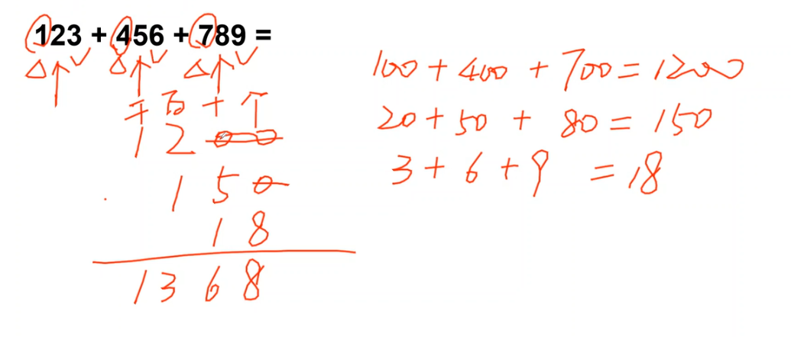

# Table of Contents

* [三不看原则](#三不看原则)
* [百化分](#百化分)
  * [142857](#142857)
  * [0.33](#033)
  * [0.11](#011)
* [划线法](#划线法)
  * [算误差](#算误差)
  * [知道误差算真实值](#知道误差算真实值)
  * [a/b](#ab)
  * [a*b](#ab-1)
  * [三位数除法](#三位数除法)
* [10%误差尽量不要出现，影响口算](#10误差尽量不要出现影响口算)
* [解决千分位两位数除法的一个思路](#解决千分位两位数除法的一个思路)
  * [减1](#减1)
  * [反向减](#反向减)
  * [划线](#划线)
* [乘法千分位](#乘法千分位)
* [5以及其他数值的应用](#5以及其他数值的应用)
* [高位叠加](#高位叠加)
* [划线 位数不同的加减](#划线-位数不同的加减)
* [次方解法](#次方解法)
* [分数比较大小](#分数比较大小)
* [2位数](#2位数)
* [错题练习](#错题练习)


资料分析需要的是什么

1. 快速估算能力
2. 分析总结


# 三不看原则

1. 不看小数点 小数点只是占位
2. 不看百分号
3. 不看0  0也是占位


```
1/32=25/8=3125 小数点其他都是占位符
1/4*1/8=25/8

1/2325=1/2.325=1/2.333=1/（2+1/3）

1856/3167
3167=3.167=3+1/6=19/6

2911/2348
2911/2.348=2+1/3=7/3
291*(3/7)

5516/1162 1162 1.167=7/6

```

```
11/5=110/15=22/3
分子加0是为了约分
分母加小数点是为了变为乘法好计算
```

# 百化分

```
1/2=0.5
1/3=0.33
1/4=0.25
1/6=0.167
1/8=0.125
1/9=0.111
```


##  142857

```
1/7 0.142857
1就是1开头
2就是2开头
-----------
3就是4开头
4就是5开头
--------------
5就是7开头
6就是8开头

348576/15678 
--------------------------
214/1573=1.4/7=11/7
214*7/11=144
[误差后面再补]

--------------
382/2287
2.2857 =16/7
545*16 怎么计算？

105*8  545拿个5出来 三不看 5就是0.5  16就是8 
---------------------------------------

```

```
1/9=0.11

1/11=0.9
```

## 0.33

0.33 =1/3

0.66=2/3


## 0.11

1/9=0.11

6/9=0.66=2/3

```
1/9=11 忽略小数点 1/11=9
```


# 划线法

1. 误差：分母方向与分母一致，分子相反

2. 同向抵消、异向叠加

3. 计算误差 看增量/差量与前2位，比较大小，小就是10%一下，反之。【但是10%尽量不要出现，会影响口算】

   > 1. 怎么看是不是小于百分之10，就是看增加/减少的数是不是小于基数，小于肯定使小于10%，这决定了是不是需要把分母划成1.
   > 2. 如果不化成1怎么做呢？找倍数、约分、分数关系 0.11 0.33 142857 等

4. 计算结果 160 上升2%  是3.2 ，163.2


## 算误差

```
1.截三位做差
2.差除以(1.2) 估算首位 就是百分之几

2356/1032 
103-100=3
3/1.0=首位是3  就是百分之3 【不要纠结为什么不是30%】


456 470 14/4.5= 首位3%+

756 700 56/7.5= 7+

125  145 20/1.2=10 多  X 误差不要超过10%，会导致口算速度下降

125/674 700 26/6.7 4+
178 4+ 6.8 7
178+7=185

```

要保证误差在10%以内，这个需要练习，才能保证精确度！！！

## 知道误差算真实值

```
247 误差下降7
前2位 2.4*7=17左右
230

如果减少/增加的值 大于 基数 （前12位） 基本就是10%以上

如果小于 就是 10%一下
```


## a/b

+ 【2个多叠加最好取个1】
+ 同向抵消、异向叠加

```
-------------------------------------------------------------
q
-- 最后修正结果看分母方向与分母一致，分子相反
b
例子
12345
-----
54321 43/54  下降8%

12345/5000=247 下降8% 20左右 227 
计算器答案：227
-------------------------------------------------------------------
586  600 上升 2% 结果下降2%
---               上下抵消 整体上升2% 0.66 比 66略大
865  900 上降 4% 结果上升4%
计算器结果：0.677

3156  300 15 下降4%多 结果上升4%多
----                             整体6%+1 取7最好  1/3=333 忽略小数位  353
8763  900 24 上升2%多 结果上升2%多

【2个多叠加最好取个1】

计算器结果 360
```
+ 如果有一个超过10%了，可以 用另外一个来抵消 【不建议出现】

```
3645  400 36 上升10% 计算会不精准
----
5632  600 37 上升6%  整体结果 下降4%   2/3 666  640
计算器：647
```


## a*b

```
a*b = a 上升1% b下降 4% 整体下降3%
```


## 三位数除法

```
增长率百分之13.2
1735
----- * 132
1132

正常来说，一般都是约分 1132->132  19 上升 1%多 接近2

1735  上升 1%多 173+17+10=200
计算器答案：202


```

```
增长率 32.5%

错误做法，直接划线
9135 900
---- * 325 300  在除1325 太慢了
1325

正确做法，先观察数字之间有没有规律
9135
---- * 325
1325
发现 91/13=7 直接325*7=224.5

或者三不看原则 1.325 325 之间约分掉
```


# 10%误差尽量不要出现，影响口算

```
396/163  这里 163 看成200 37 1.6已经有大于10的误差了
但是会影响3.9*10的误差，就不是2位数*1位数，而是2位数*2位数，影响口算

396/163 40/16=10/4=250-7.5=242
```

# 解决千分位两位数除法的一个思路

## 减1


+ 注意这里减1，有些题目并不是减1，看首位具体是多少

```
1754/157
A 1111.1
B 1121.3
C 1135.2
D 1146.8
三步看原则，把小数点左移动，选项减1
111
121
135
146
175     18
--  -1= ---   划线法 157-》180 100 上升1.4% 113左右 选A
157      157
```

```
1.670/39%=
A.1637.12
B.1648.26
C.1719.65
D.1826.37

------------------
1，选项看成1.多
670/390 -1=280/390
700 上升3 721 秒C
-----------------
670/4  167
分母上升2 
170
选C
```


## 反向减

```
28943/1489=
A.19420
B.19438
C.19452
D.19463

这个时候减1就没用了，因为前2为都是相同的，这个时候就要用最近的数字减选项
注意：是最近-选项
这里就是2
2-选项
58
567
48
37
同理公式也要用2减去
2978-2894 【为什么】 分母补0 
-----------
1489

84/1483 =8/14=4/7=571  下5 下5 基本抵消 就是 57 选B

```


## 划线

2017年，M省固定资产投资（不含农户）31328.1亿元，比上年增长13.1%。其中，民间投资18759.6亿元，增长14.5%，占固定资产投资的比重为59.9%。
2016年M省固定资产投资（不含农户）约为（    ）亿元。
A.27699.5
B.31328.1
C.27712.2
D.28233.6

```
答案AC太接近，千分位误差，划线误差要精准！

3132/1131 
    111 下降1.8  百分位直接下1+ 不用精准
[这里是4位]3132*9=  28188 下降1.8 =276  秒A
```

-----


# 乘法千分位

```
乘法拆分
2382*1566  
A 371 
B 373

```


# 5以及其他数值的应用

```
561.4*45.8%=
A.250.8
B.257.1
C.284.1
D.516.4

45.8看成45=5*9

561* 9/2
28*9= 252

---------------------
50      103   上9 
--      ----- 
1128     2.7  3*9

1/3=333

333*5/9=  165/9=18

----------------

```


# 高位叠加

```
有几个注意实现
1.千位对千位 后面同理
2.每一个位数的位置是前一个位数之和的最后一个位置
46589+35685
7
11
 11
  16
   14
82274
```




# 划线 位数不同的加减

```
2826/103 282-8=274
 897/120 897*8= 7176 上 75 注意保留三位数的时候897的位数和2826保留三位是算的不一样的
 2740+750
 =3490左右
```


出口服装 1137.9 亿美元，同比增长 24.5%，进口纺织品服装 131.6 亿美元同比增长 24.5%

```
先大概看下 1137/1.24 大概就是900多 
113*9=  917

131/1.24 大概就是100多 
131*9= 1179 那就是117  
```


8772/82% -4212/174%

```
8772/82% 分母小于1 且第一位是1 那就是10000万
4212/174% 分母小于2 2000 结果必然大于2000
这样划线后，算尾数差就比较好算了
```

# 次方解法

```
469*(1+3)^n》500
(1+3)^n》500/459 500下降8% 到1
(1+3)*(1+3)....
下3 下3 下3 才能达到8% 也就是3个月


2843*(1+12.7%)^n>3297*(1+7.2%)^n

(1+12.7%)^n    3297
----------  > -----  超过10精确就是下降14%
(1+7.2%)^n     2843

先要写成 (1+r)^2> a/b a下降多少的

先把分母化成1 下降7 分子也下降7 就是105左右，变成(1+r)^2形式


那么一个就是5% 要有3个才能赶上 选B
```


# 分数比较大小

+ 划线-水平

  ```
  205    208
  ---    ----   
  1145    1203
  
  分子 3 上升 1+
  分母 55 上升5+ 
  1.分母大  结果小 左边大
  
  
  188    995
  ---   ----
  299    1203
  
  940/1145  995/1203 
  分子 5+
  分母 5多
  所以要先拆分，在划线
  ```

-------

+ 划线-纵向比较

  ```
  a        c
  -- 上10  -- 上6 左边更大
  b        d
  
  b(1+10%)        d(1+6%)
  -- 上10         -- 上6 左边更大
  b               d
  
  ```

  

# 2位数

比如是 45/34 是 先看做450/340 然后 分母在+10 上 3 这样划线吗

截取前三位 补0 误差更准


# 错题练习

以下都是不好直接看出来或者没法约分的收集题目

```
367/261   261 2.66

116/374

116/175

125/674

5466 2588 选项 增长1112 1118
```


