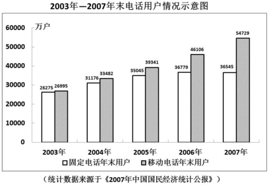

# Table of Contents

* [小知识点总结](#小知识点总结)
* [ABRX](#abrx)
  * [同比 环比](#同比-环比)
  * [例题](#例题)
* [混合原理](#混合原理)
* [分子比较大小-重](#分子比较大小-重)
  * [划线比较大小原理](#划线比较大小原理)
  * [例题](#例题-1)
  * [比较大小答疑](#比较大小答疑)
* [间隔基期计算](#间隔基期计算)
* [间隔和差计算](#间隔和差计算)
* [现期计算](#现期计算)
  * [作业](#作业)
  * [作业6](#作业6)
* [现期追赶-重](#现期追赶-重)
  * [增长量不变](#增长量不变)
  * [增长率不变](#增长率不变)
* [增长量](#增长量)
  * [模型五：增长量选项千分之几-重](#模型五增长量选项千分之几-重)
  * [作业7](#作业7)
  * [增长量比大小](#增长量比大小)
  * [年均增长量](#年均增长量)
  * [作业8](#作业8)


# 小知识点总结

+ 图标没给具体数据时，加起来看看是否等于总得

+ 找数字要一字不差

+ 顺差=

+ 百分数只能做加减不能做乘除，加减后读成**百分点！**

+ 题目给了2010，问2011-2016，那就是6年，没给2010就是5年

  


#  ABRX

A 基期

B 现期

R 增长率

X 增长量

```
     B
A= -----
   (1+r) 
   
```

## 同比 环比


```
2024年9月1 
同比： 2023年9月1日   最大时间上一期  2024年
环比： 2024年8月31    最小时间的上一期 9月
```


## 例题

例题1:【2021四川】
2019年，我国电信业务收入完成1.31万亿元，比上年增长0.8%。其中：固定数据及互联网业务收入完成2175亿元，比上年增长5.1%；移动数据及互联网业务收入6082亿元，比上年增长1.5%。
2018年我国电信业务收入约为多少万亿元？ 
A. 1.09 
B. 1.15 
C. 1.26 
D. 1.30

```
下降0.8
1.31/101 这不直接秒  131 选D
```


例题2:【2021联考】 
2020年全年，汽车产销降幅收窄至2%以内。汽车产量为2522.5万辆，销量为2531.1万辆，同比分别下降2.0%和1.9%，降幅分别比2020年上半年收窄14.8和15.0个百分点。2020年全年，新能源汽车销量为136.7万辆，同比增长10.9%。2019年汽车产量约为: 
A. 2548万辆 
B. 2354万辆 
C. 2563万辆 
D. 2574万辆

```
看题目 问2019汽车产量
2522/1-2%
2522/98
2522 上2 257 秒D
```


例题3:【2022国考】
2021年1—5月，全国共破获电信网络诈骗案件11.4万起，打掉犯罪团伙1.4万个，抓获犯罪嫌疑人15.4万名，同比分别上升60.4%、80.6%和146.5%。2021年5月，全国共立电信网络诈骗案件8.46万起，与4月相比下降14.3%。 2021年4—5月，全国共立电信网络诈骗案件约多少万起？ 
A. 12 
B. 14 
C. 16 
D. 18 

```
问2021年4—5月 是4月+5月

5月8.46 4月比5月大，2a>16 秒D
-------------
份数思维-感觉回到了数量
5月8.46 比4月下降14.3 1/7 
4月7 5月6  总共13
8.46
---- * 13
6
```


例题4:【2024浙江】


2021年上半年，全国彩票销售额约为多少亿元？
A.1780
B.1810
C.1840
D.1880

```
问2021 题目给的2022 先列式子
748     1072
---  +  ----
1106    1-3.2%=968
式子非常好 直接划
1072+748=1820
下9    上4 整体肯定是下的  看选项直接A
```


例题5:【2016深圳事业】
2014年末，某市各类专业技术人员98.58万人，其中具有中级以上技术职称的专业技术人员34.38万人，分别比上年增长4.9%和3.7%，全年科学研究与实验发展经费支出296.56亿元，比上年增长13.9%。2013年末，该市各类专业技术人员和具有中级及以上技术职称的专业技术人员分别为（   ）和（   ）万人。
A.93.98, 33.15
B.93.98, 33.11
C.93.75, 33.15
D.93.75, 33.11

```
误差这里小就要用到减1法了
9858    9858-9441   417
-----9=----      =  ----  = 417 下降5 397 排除AC  
1049   1049         1049

同理
3438   3438-  3111   327
---- =-----       =  ---   327下3  317 选A
1037   1037          1037
 
```

# 混合原理


2019年江苏省金融信贷规模扩大，保险行业发展较快。全年保费收入3750.2亿元，比上年增长13.1%。其中，财产险收入940.9亿元，增长9.6%；寿险收入2215.3亿元，增长11.6%；健康险收入508.8亿元，增长28.8%；意外伤害险收入85.2亿元，增长9.1%。全年保险赔付998.6亿元，比上年增长0.2%。其中，财产险赔付534.5亿元，增长4.3%；寿险赔付294.3亿元，下降17.3%，健康险赔付144.8亿元，增长38.7%；意外伤害险赔付25.0亿元，增长4.7%。

2018年江苏省财产险收入与赔付之差为： 

A. 346.0亿元 

B. 364.0亿元 

C. 396.6亿元 

D. 406.4亿元

```
a=b+C
2018
财产险：940/1096 9.6
赔付：534/1043  4.3

财产险=赔付+答案
答案r肯定在>9.6
940-534=406 假设是10 下10
406- 40=366 肯定小于366
选A 为什么不选B B不可能 因为r肯定>10以上比较多

------------直接划线法
940/1096  940 下9
534/104   534 下3 
```


# 分子比较大小-重

本质就是利用划线来缩进2个数进行配同，在进行比较


+ 差分----了解

  ```
  5/6 6/7
  1.分子分母做差得到差分数 1
  2.用差分数代替大分数(分子 分母都大的)和小分数比较比大小  1>5/6 【同大同小】
  
  26155÷87840和26349÷86715比较大小
  261/878    263/ 867
  2/11  5多
  261/878 3多 差分更多   ->后面分数更大
  
  但是这种方法，要先求差分，然后差分还要在比，速度确实堪忧
  ```

+ 直除

+ 拆分法 :选项很接近，可以拆出一个最接近的数字

  ```
  188    995
  ---   ----
  299    1203
  
  1-41/229  1-208/1208
  ```

+ 划线-水平

  ```
  205    208
  ---    ----   
  1145    1203
  
  分子 3 上升 1+
  分母 55 上升5+ 
  1.分母大  结果小 左边大
  
  
  188    995
  ---   ----
  299    1203
  
  940/1145  995/1203 
  分子 5+
  分母 5多
  所以要先拆分，在划线
  ```

-------

+ 划线-纵向比较

  ```
  a        c
  -- 上10  -- 上6 左边更大
  b        d
  
  b(1+10%)        d(1+6%)
  -- 上10         -- 上6 左边更大
  b               d
  
  ```

  


## 划线比较大小原理

  ```
  a   10%   C   a(1+10%)
  -- <     ---
  b    6%  d    B(1+6%)

  分子上升的幅度大于分母上升的幅度 右边大
  ```

  

----

  

  ## 例题

  例题1:【2011联考】
  2010年1～4月全国入境旅游部分市场客源情况统计表
  

2009年4月我国入境旅游的第三大客源市场是： 
A.美国 
B.日本 
C.俄罗斯 
D.马来西亚 

  ```
先看现期 
韩国 日本 美国 俄罗斯  问的是第三，肯定不是韩国日本 排除BD

1762/116   1762*9  
1603/140   1603*9  下降更多 直接选A
直接划线 不用比

比的话也可以
分子大 分母小 肯定韩国大

176/116  117/108
176下10   117下8
左边大
  ```

----

例题2:【2010江苏】
2009年江苏省实现地区生产总值34061.19亿元，比上年增长12.4%。其中，第一产业增加值2201.64亿元，增长4.5%；第二产业增加值18416.13亿元，增长12.5%；第三产业增加值13443.42亿元，增长13.6%。主要经济指标迈上新台阶，人均GDP按当年汇率（1美元=6.8282元人民币）折算超过6400美元，财政总收入突破8000亿元，城镇居民人均可支配收入突破2万元，农村居民人均纯收入突破8000元，社会消费品零售总额突破1万亿元，实际利用外资、专利授权量均继续居全国第一。
2008年江苏第一、第二、第三产业增加值之比是： 
A.10：51：39 
B.5：54：41 
C.7：54：39 
D.9：54：37

```
2201/104  220 下降4 212
18416/112 184 下降 10 176 是第一个的8倍左右 选 C
13443/113

```

----
例题3:【2019深圳】
2018年1-9月，乘用车累计产销分别完成1735.1万辆和1726.0万辆，同比分别增长0.1%和0.6%。其中，轿车产销分别完成841.3万辆和842.6万辆，同比分别增长0.2%和1.3%；SUV产销分别完成737.1万辆和723.5万辆，同比分别增长4.2%和3.9%；MPV产销分别完成124.4万辆和126.2万辆，同比分别下降15.2%和13.1%；交叉型乘用车产销分别完成32.2万辆和33.7万辆，同比分别下降18.2%和19.6%。中国品牌乘用车累计销售724.2万辆，同比下降1.5%。 
2017年1-9月，乘用车的四类车型按销量从高至低排列，依次为（ ）。 
A. 轿车> SUV> 交叉型乘用车> MPV 
B. SUV> 轿车> 交叉型乘用车> MPV 
C. 轿车> SUV> MPV> 交叉型乘用车 
D. SUV> 轿车> MPV> 交叉型乘用车

```
2017年 题目2018年  问销量 
8426  101
7235  103
1262  86.9
337   81.4  

肯定轿车最大 排除 BD 再看 1262明显大 直接A
```

----

例题4:【2019联考】


2018年1-3月，限额以上单位烟酒类、日用品类、中西药品类及通讯器材类零售总额最高的是： 
A.烟酒类 
B.日用品类 
C.中西药品类 
D.通讯器材类


```
公式写出来 答案就出来
2018年
1061/1059
1410/116
1440/110   比较第二个 第三个 分子大 分母小 选 C
1093/110   跟第二个也好比 分母下5 分子下5 137 配同后 还是第二个大

```

----

例题5：【2019广东】
2018年，我国全社会用电量68449亿千瓦时，同比增长8.5%，增幅同比提高1.9个百分点。具体来看，第一产业用电量728亿千瓦时，同比增长9.8%；第二产业用电量47235亿千瓦时，同比增长7.2%；第三产业用电量10801亿千瓦时，同比增长12.7%；城乡居民生活用电量9685亿千瓦时，同比增长10.4%。2018年，我国可再生能源发电量达1.87万亿千瓦时，同比增长约1700亿千瓦时；可再生能源发电量占全年发电总量比重为26.7%，同比上升0.2个百分点。
2017年，我国三大产业及城乡居民生活用电量大小排序正确的是：
A.第二产业用电＞第三产业用电＞城乡居民生活用电＞第一产业用电 
B.第三产业用电＞城乡居民生活用电＞第一产业用电＞第二产业用电 
C.第二产业用电＞城乡居民生活用电＞第三产业用电＞第一产业用电 
D.第一产业用电＞第二产业用电＞第三产业用电＞城乡居民生活用电

```
找材料 2017年
728/1098    第四
47235/1072  最大
10801/1127  第二大
9685/110   第三大
选A

```


## 比较大小答疑

```
1507   1170   1122   1033
----   ----  ---     ---
1340   1084   1038   1010

划线法，分母直接上升更分母相同  垂直
10上     9上   9上     2上
第一个最大 最后一个最小
比较第二个和第三个
分子 4 分母5 说明第二个更大

```


```
575/920  487/783
487-575  88  2倍多
783-920  157 没2倍 
左边大
--------------- 缩小误差
575/920  487/783
638/1022 695/1118
1022-1118 上9
638 上9 50多 大于695 分子大 左边大

```

```
289/379 253/325
253-289 上11多
325-379  小于379  右边大
划线法会有点大 超过10，那其实也可以做的

```

```
188/229 995/1203
差距这么大怎么办，扩大下
188/229 * 5 = 940/ 1145

940/1145 995/1203
分子 55 上 5+
分母 上5+ 大于1203 右边大
```

```
3516/6524      1620/2884      888/1661      1949/3620

先直除 都在5左右 那就 1/2+x 在比较大小 就是拆分

```

-----


2017年，M省固定资产投资（不含农户）31328.1亿元，比上年增长13.1%。其中，民间投资18759.6亿元，增长14.5%，占固定资产投资的比重为59.9%。
2016年M省固定资产投资（不含农户）约为（    ）亿元。
A.27699.5
B.31328.1
C.27712.2
D.28233.6

```
答案AC太接近，千分位误差，划线误差要精准！

3132/1131 
    111 下降1.8  百分位直接下1+ 不用精准
[这里是4位]3132*9=  28188 下降1.8 =276  秒A
```

-----


2017年，国内旅游人数50.01亿人次，比上年同期增长12.8％。入出境旅游总人数2.7亿人次，增长3.7%。
问：2016年，全国国内旅游人数约为入出境旅游总人数的多少倍？
A.17
B.19
C.21
D.23

```
2016 
50      103   上9 
--      -----
1128     2.7  3*9

333*5/9=  165/9=18  下9 秒A 

这里技巧 1/3 =333 直接化除为乘
```

2022年中国锂电池出货量658GWh，同比增长101.1%。2022年中国动力锂电池装车量达294.6GWh，同比增长90.7%，高于全球同比增速18.9个百分点，占全球动力锂电池装车量的56.9%。
2021年，全球动力锂电池装车量约为多少GWh？
A . 271.5
B . 295.6
C . 301.4
D . 323.6

```
90.7-18.9= 71.8
294
----- 
569 * 171  6*1/6  上5 下2
294 上3  选C

```


# 间隔基期计算

+ 间隔基期 求15年 给17年 和 2个增长率
+ 基本不用记住间隔增长率公式了，自己划线
+ 产业增加值 不是增长量，是一个名词。

例题1：【2018联考】
2017年第一季度，某省农林牧渔业增加值361.78亿元，比上年同期增长5.9% ，高于上年同期0.2个百分点。具体情况如下： 该省种植业增加值119.21亿元，比上年同期增长8.2% 。其中蔬菜种植面积358.80万亩，比上年同期增加18.23万亩，蔬菜产量471.42万吨，增长7.5% ；茶叶种植面积679.53万亩，比上年同期增加19.79万亩，茶叶产量2.30万吨，增长19.4% 。 
2015年第一季度，该省农林牧渔业增加值与下列哪一项最为接近？
A.320亿元 
B.340亿元 
C.360亿元 
D.380亿元

```
2015年
361
---
1059  1057  361 下 10 直接选A 
```

---


例题2：【2018江苏】
2016年江苏规模以上光伏产业总产值2846.2亿元，比上年增长10.8%，增速较上年回落3.5个百分点；主营业务收入2720.5亿元，增长9.9%，增速回落2.5个百分点；利润总额153.6亿元，增长11.6%，增速回落8.8个百分点。苏南、苏中、苏北地区规模以上光伏产业产值分别比上年增长10.2%、9.0%、39.0%。2016年江苏光伏发电新增装机容量123万千瓦，年末累计装机容量546万千瓦。
2014年江苏规模以上光伏产业利润总额为
A.114.3亿元 
B.127.6亿元 
C.133.9亿元 
D.137.6亿元

```
2014年
11.6  20.4

153.6/111/ 120
153*9
----  = 153*3/4=114 秒A
120
```

----


例题3：【2017联考】
2016年东部地区民间固定资产投资164674亿元，比上年增长6.8%；中部地区107881亿元，比上年增长5.9%，增速回落0.1个百分点；西部地区71056亿元，比上年增长2.4%，增速回落0.5个百分点；东北地区21608亿元，比上年下降24.4%，降幅收窄1.6个百分点。
东北地区2014年民间固定资产投资额为：
A.28582亿元 
B.29200亿元 
C.35864亿元 
D.38624亿元

```
东北地区2014
-24.4   -26

216 [21 下3]
---
75.6[下1] *74 [7 下5]

3/75 =400 下3 选D

```

----


例题4：【2020四川】
2015年，全国居民人均可支配收入为21966元，比上年增长8.9%，增长率比2014年下降1.2个百分点。按常住地分，城镇居民人均可支配收入为31195元，比上年增长8.2%，增长率比2014年下降0.8个百分点；农村居民人均可支配收入为11422元，比上年增长8.9%，增长率比2014年下降2.3个百分点。全年农村居民人均纯收入为10772元。全国农民工人均月收入为3072元，比上年增长7.2%。全国居民人均消费支出为15712元，比上年增长8.4%。按常住地分，城镇居民人均消费支出为21392元，增长7.1%；农村居民人均消费支出为9223元，增长10.0%。 
2013年，城镇居民人均可支配收入约为多少万元？ 
A.1.9 
B.2.2 
C.2.6 
D.3.0

```
2013年，城镇居民人均可支配收入
311
--- 
108 *109
311 下降 17 秒C
```

----


例题5：【2016国考】
截至2014年12月底，全国实有各类市场主体6932.22万户，比上年末增长14.35% ，增速较上年同期增加4.02个百分点；注册资本（金）129.23万亿元，比上年末增长27.7% 。其中，企业1819.28万户，个体工商户4984.06万户，农民专业合作社128.88万户。 
截至2012年12月底，全国实有各类市场主体户数最接近以下哪个数字？
A.6100万 
B.5500万 
C.5100万 
D.4500万

```
2012年12月底，全国实有各类市场主体户
6932
----
114 110
7*9*9=567
```


----


# 间隔和差计算

例题1：【2019联考】
从2017年全年赛事的覆盖区域来看，马拉松赛事地域分布更为广泛，中国境内马拉松及相关赛事已经涵盖了含西藏在内的全国31个省、区、市的234个城市，较上年增加了101个城市。在赛事类型方面，2017年1102场规模赛事中，全程马拉松参赛人次最高，突破了235万人次，其次为半程马拉松赛事，参赛人次超过134万人次。在中国田径协会认证的A类、B类赛事中，2017年全程马拉松项目完赛26.89万人次，同比增长10.61%；半程马拉松项目完赛45.29万人次，同比减少了0.03万人次。 
在中国田径协会认证的A类、B类赛事中，2016年全程马拉松项目完赛人次比同期半程马拉松项目完赛人次： 
A.多23万 
B.少23万 
C.多21万 
D.少21万


```
2016年全程马拉松项目完赛人次比同期半程马拉松项目完赛人次

2689/110 =2689*9=231

45。29+0.03=45.5
少21 选D
```

----


例题2：【2018山东】


2016年1～3月份，限额以上单位消费品零售额的绝对量约为多少万亿元？ 
A.3.0 
B.3.5 
C.4.0 
D.4.5


```
2016年1～3，但是题目给的是 4 1到4 所以要减去
122/109 = 112
497/108 = 457   345 选B
```

----


例题3.【2018广州】
2017年贫困地区农民家庭一产业经营净收入人均2826元，增长3.2%，增速比上年提高0.5个百分点。随着产业扶贫、旅游扶贫、电商扶贫等深入推进，贫困地区二三产业加快发展，一二三产业融合发展取得可喜进展。农民家庭二三产业经营净收入人均897元，增长20.4%，增速比上年提高6.5个百分点。
2016年贫困地区农民家庭一二三产业经营净收入人均（ ）元。
A.3483 
B.3608 
C.3723 
D.8483

```
2826/103 282-8=274
 897/120 897*8= 7176 上 75 注意保留三位数的时候897的位数和2826保留三位是算的不一样的
 274+75=349左右
```

----


例题4.【2018联考】
2016年，我国全年完成邮电业务收入总量43344亿元，比上年增长52.7%。其中，邮政业务收入7397亿元，增长45.7%；电信业务收入35947亿元，增长54.2%。邮政业全年完成邮政函件业务36.2亿件，包裹业务0.3亿件，快递业务量312.8亿件；快递业务收入3974亿元。电信业全年新增移动电话交换机容量7318万户，达到218384万户。2016年末全国电话用户总数152856万户（电话包括固定电话和移动电话两种），其中移动电话用户132193万户。移动电话普及率上升至96.2部/百人。
2015年我国电信业务收入比邮政业务收入多： 
A.14235亿元 
B.16235亿元 
C.18235亿元 
D.20235亿元

```
2015年我国电信业务收入比邮政业务收入多： 
359/154  739/145
359*6 = 2154 上7 230 
739*7= 5133 下2  503 注意位数
2300
 5030
18000 选C 
```

---


例题5.【2017联考】
2013年，全国共有工业企业法人单位241万个，从业人员14025.8万人，分别比2008年增长26.6%和19.5%。2013年，在工业企业法人单位中，采矿业8.9万个，比2008年下降1.4%；制造业225.2万个；电力、热力、燃气及水生产和供应业6.9万个，比2008年下降0.1%。在工业企业法人单位从业人员中，采矿业占7.4%，制造业占89.2%，电力、热力、燃气及水生产和供应业占3.4%。
2008年，全国制造业企业法人单位有约多少万个？ 
A.160 
B.174 
C.186 
D.200 


```
2008年，全国制造业企业法人单位有约多少万个？ 
题目没直接告诉，需要用总量减去其他的
241/126 -8.9/98.6-6.9/99.9  注意位数区别

241/126  241*8=  1928
8.9/98.6 上1 9
6.9/99.9  6.9
192-9-6.9= 秒B 【这里要记住位数区别 】

```

-----


# 现期计算

8081 152

按照 2019 年 7 月上旬的环比涨跌幅，2019 年 7 月中旬聚乙烯的价格约为：
A.7929.1 元/吨
B.8031.5 元/吨
C.8134.3 元/吨
D.8236.9 元/吨

```
8081+3*152  选D
这是题目比较良心，没出几个接近的。
```


----

## 作业

3.【2023广东】
 2021年，广东省财政科学技术支出为982.76亿元，占当年全省财政一般公共预算支出的比重为5.4%。其中，省本级财政科学技术支出为102.05亿元，占省本级财政一般公共预算支出的比重为6.6%，同比增加0.84个百分点。珠江三角洲核心区财政科学技术支出845.09亿元，同比增长2.6%。
2020年，广东省省本级财政科学技术支出为（    ）亿元。
A.83.96
B.102.64
C.122.32
D.132.67


```
省本级财政科+表格内容=全身
2020年就是 减去 秒A
```


12.【2023深圳】
2019年，东部地区众创空间数量占全国比重是
A.59.4%
B..58.5%
C.57.7%
D..55.6%


```
直接看斜率，，，，还在傻乎乎算，只有不会做的情况下使用
```


## 作业6

1.2010年，某省地区生产总值达到6835.7亿元，比去年同期增长14.9%。其中，第一产业增加值为483.5亿元，比去年同期增长25.8%，第二产业增加值为2985.6亿元，同比增长12.5%。
2010年，该省第一产业增加值同比增速比第二产业增加值增速高（    ）。
A．13.3%					
B．13.3个百分点
C．14.3%					
D．14.3个百分点

```
百分点只能做做差且结果为百分点
25.8-12.5=13.3 选b
```

4.若按照 2018 年238.2同比增长率56.6%，到 2019 年底中国人工智能市场规模约为：
A.363 亿元
B.371 亿元
C.373 亿元
D.383 亿元

```
238.2*(1+56.6%)
选项比较接近
乘法千分位要用拆分

```

6.2016 年，参加城乡居民基本养老保险人数 5.1 亿人，其中女性超过 1.7 亿人。2016 年全国参加失业保险的人数超过 1.8 亿人，其中女性 7551 万人，分别比 2010 年增加 4713 万人和2402 万人，增长约 35%和 47%；参加工伤保险人数 2.2 亿人，其中女性 8129 万人，分别比2010 年增加 5728 万人和 2429 万人，增长约 35%和 43%。
如 2017 年及以后年份同比增量保持不变，同比增量按照 2011—2016 年间同比增量的平均值计算，全国参加失业保险的女性将在哪年超过 1.2 亿人？
A.2024
B.2026
C.2028
D.2030

```
11-16 给了10 那就是6年
2402/6=401 
7500+401n>12000
n=12
```

15.
若按2007年的固定电话增长率保持不变，预计到2008年年末全国固定电话用户数是多少?
A.36779万户
B.36545万户
C.36311万户
D.36312万户

```
36779 - 36545=234 
07-08 增量小于234 
选D  这题出的很好！！
```


# 现期追赶-重

## 增长量不变

+ 增长量不变： 直接乘倍数
  + 如果负增长，增量也是逐渐减少
+ 增长率不变： 公式用划线去掉 见例题

```
基期=现期/(1+R)
r=现期/基期-1
r=现期-基期/基期
r=增长量/基期

1.保持R不变，就是保持 现期/基期 不变
2.R比大小，就是比较 现期/基期大小
```

```
今年增长5%
1.比去年同期增长3个百分点 有比，进行连接 5-3=2%
2.去年同期下降3%   R去= -3%
```

```
a   b  C
n1   n2 n3
b/a=c/b
a+n2   b+n3
---- = ---
 a      b

n2   n3
-- = --
a     b

增长量的比值=现期/基期 的比值 而且现期/基期是固定的
```

## 增长率不变

```
469*(1+3)^n》500
(1+3)^n》500/459 500下降8% 到1
(1+3)*(1+3)....
下3 下3 下3 才能达到8% 也就是3个月


2843*(1+12.7%)^n>3297*(1+7.2%)^n

(1+12.7%)^n    3297
----------  > -----  超过10精确就是下降14%
(1+7.2%)^n     2843

先要写成 (1+r)^2> a/b a下降多少的

先把分母化成1 下降7 分子也下降7 就是105左右，变成(1+r)^2形式


那么一个就是5% 要有3个才能赶上 选B
```

例题 1.【2019 上海】
截至 2015 年底，N 市汽车拥有量为 197.93 万辆，比 2014 年增长 14.9% ，增速较 2014 年回
落了 7.7 个百分点。扣除报废等因素，全市年净增汽车 25.73 万辆。
如按 2015 年汽车净增量计算，N 市汽车数量将在年底突破 400 万辆。
A.2023
B.2024
C.2025
D.2026

```
197/114 =197*9= 177.3 下3  172
197-172=25 
197/172=1.1
400-197= 203
至少8年 15+8=23 选A
```


例题 2.【2019 吉林】
若中国东北地区继续维持 2016-2017 年与亚洲大洋洲地区的贸易出口增长率，则中国东北地
区与亚洲大洋洲地区的贸易出口金额首次超过 2013 年贸易出口金额的年份是
A.2020
B.2021
C.2022
D.2023


```
141 153 差值 12 倍数大概是153/141=1.1
206-153= 53 总共53

12*1.1=13.2
13.2*1.1=14.5
14.5*1.11=15.9  还是没超过42多
在来一年就够了 2017+4=2021 选B
```

----

例题 3.【2018 辽宁】
如 AK 制造公司钻床订单数环比增长率为 3% ，若保持此环比增长率不变，AK 公司钻床订单
达到 500 件时间应在：
A.2018 年 7 月
B.2018 年 9 月
C.2018 年 11 月
D.2019 年 1 月


```
145+84+30+200=459
469*(1+3)^n》500
(1+3)^n》500/459 下降8%
(1+3)*(1+3)....
下3 下3 下3 才能达到8% 也就是3个月

```

例题 4.【2015 联考】
若保持 2014 年的增长速度，哪一年我国对中国台湾的货物出口额开始超过对俄罗斯的货物
出口额？
A.2015 年
B.2016 年
C.2017 年
D.2018 


```
2843*(1+12.7%)^n>3297*(1+7.2%)^n

(1+12.7%)^n    3297
----------  > -----  超过10精确就是下降14%
(1+7.2%)^n     2843

一个就是5% 要有3个才能赶上 选B

```


# 增长量

```
增长量=现期/1+r * R
```

```
模型一：增长率在10%以内

1593/105 * 530  =159*5= 795
鸿哥做法是分2步相乘 做差会放大误差，2步乘法

模型二：增长率在10%以上
其实还是划线
3567/130*305 直接划线  356*2= 712  上17 830

模型三：增长率近似常见分数

数量份数法
如果不是分数呢？可以划线成分数，在还原0

模型四：增长率可变常见分数

5673 31.5% 1/3 4f->567  1f->141 下降6 133
也可以根据第二步 直接划线也可以的


```


例题 1.【2022 广东】
截止 2020 年底，全国基层群众性自治组织共计 61.5 万个，同比减少 4.35%。其中，村委会
50.2 万个，占基层群众性自治组织的 81.63%，村民小组 376.1 万个，村委会成员 207.3 万
人；居委会 11.3 万个，占基层群众性自治组织的 18.37%，居民小组 123.6 万个，居委会成
员 61.6 万人。2016—2020 年，我国村（居）委会完成选举数分别为 9.7 万个、18.2 万个、
27.6 万个、8.8 万个、6.1 万个，其中，2020 年村（居）委会登记选民数为 1.1 亿人，参与
投票人数为 0.65 亿人。
2020 年，全国基层群众性自治组织较上年减少（ ）万个。
A.1.4
B.2.8
C.4.2
D.5.6

```
2020 年，国基层群众性自治组织
61.5/1-4.35 *435
64*435  254 上降5左右 秒B
```


+ 增长量计算：增长率近似常见分数

例题 2：2010 年 1-3 月，法国货物贸易进出口总额为 2734.4 亿美元，同比增长13.4%。 其中，出口 1264.7 亿美元，同比增长 14.5%；进口 1469.7 亿美元，同比增长 12.4%; 逆差 205.0 亿美元，同比增长 1.0%。 
2010 年 1-3 月，法国货物贸易出口额比上年同期增长了约多少？ 
A.140 亿美元 
B.120 亿美元 
C.160 亿美元 
D.180 亿美元

```
145  下2
126  上3 128
128/8=160 选C
```


例题 3.【2022 北京】
2019 年 A 市专利密集型产业实现增加值 6918.8 亿元，比上年增长 9.6%，分别高于战略性新兴产业、高技术产业增加值增速 2.3 个和 1.7 个百分点；专利密集型产业增加值占 GDP 的比重为 19.5%，比上年提高 0.4 个百分点。
2019 年 A 市专利密集型产业实现增加值比上年约增长多少亿元？
A.413
B.502
C.606
D.698

```
691/1096  6219 
621*960 621 下3 秒c
```

+ 增长量计算：增长率可变常见分数

例题 4.【2021 四川】
2017 年全年，上海口岸货物进出口总额 79211.40 亿元，比上年增长 15.1%。其中，进口33445.10 亿元，增长 18.9%；出口 45766.30 亿元，增长 12.5%。全年上海关区货物进出口总额59690.24亿元，比上年增长14.0%。其中，进口24684.20亿元，增长19.3%；出口35006.04亿元，增长 10.6%。
2017 年，上海口岸货物进出口总额比上年增加：
A.1 万亿元以上
B.0.7—1 万亿元之间
C.0.4—0.7 万亿元之间
D.不到 0.4 万亿元

```
2017 上海口岸货物进出口总额
792/115 *151 差距太大 直接干 
151-167  下降10 792-713
713/7=101 选A

直接划线
792/115 *151
上1  下4  下5
8*9*151=72*151 下3 
105 下2 103
```


## 模型五：增长量选项千分之几-重

+ 加减法有放大误差的作用

91950/1+10.8% *10.8%

A 8936

B 8963

C 9836

D 9863

```
91950-假设的增长量=基期
基期*R=真正增长量
1.如何判断假设增长量，91950/111 919*9= 89多 排除CD
2.代入一个好计算的 8950 
3.91950-8950=83000 *10.8=83*100+83*8=8964

带AB都是能算出来的正确答案的
原因：先放大做差，在缩小误差
```

+ 同理 基期也是可以用的

  8191/1-4.5%

  A 7822

  B 8559

  C 8577

  D 8898

  ```
  1. 假设基期 8191/95.5 上4 大概是840多 排除AD
  2.代入856*4.5  856*45=385 求增长量
  4.现期+增长量 这里是负 8191+385=857 选C
  
  ```

  例题6：年末生猪存栏 46767 万头，增长 0.7%；生猪出栏 66170 万头，下降 0.8%。牛奶产 量 3656 万吨，增长 2.2%。 
  2011 年末全国生猪存栏比 2010 年末多（ ） 
  A．325 万头 
  B．327 万头 
  C．330 万头 
  D．323 万头

  ```
  4个都接近，随便带一个
  46767-327=46440
  4644*0.7= 32468 选A
  ```

  

例题 5.【2021 联考】
2020 年下半年，天然气产量同比增量超过 10 亿立方米的月份有几个?
A.1
B.2
C.3
D.4


```
4.6
--    * 4.8 *31 
1+4.8

4.9
---  * 760*30
1076
5*9*8*30=360*30=108    大于10
上2  上5    下2左右 还是大于10  
上3        
9符合 后面都符合
```


## 作业7

 6.2018年C国全年粮食产量65789万吨，比上年减少371万吨，减产0.6%。其中，夏粮产量13878万吨，减产2.1%；早稻产量2859万吨，减产4.3%；秋粮产量49052万吨，增产0.1%。全年谷物产量61019万吨，比上年减产0.8%。2017年夏粮产量与2018年夏粮产量相差：

A.291万吨B.296万吨C.289万吨D.298万吨 

```
这题比较接近，直接代入
13878+296=14174
14174*2.1=297.6
选D
```

 \9. 文化及相关产业9个行业的营业收入均实现增长。其中，新闻信息服务营业收入3744亿元，比上年同期增长29.4%；创意设计服务5143亿元，增长15.1%；内容创作生产8820亿元，增长11.9%；文化传播渠道4501亿元，增长10.0%；文化辅助生产和中介服务7783亿元，增长8.2%。2018年上半年，文化传播渠道营业收入比上年同期增加了约（）亿元。A.410B.409C.408D.407 

```

```

 12.2016年电信业务收入完成11893亿元，同比增长5.6%，比上年回升7.6个百分点。电信业务总量完成35948亿元，同比增长54.2%，比上年提高25.5个百分点。2016年，电信业务收入结构继续向互联网接入和移动流量业务倾斜。2016年电信业务总量同比增长了约（）亿元。A.12653B.12635C.7340D.7304 

```

```


## 增长量比大小

```
现在
----* R
1+R

大大则大

1.r 是负数 不能用！！！！！！！ 误差很大


```

例题 1.【2022 国考】
将 2020 年 H 省秋粮机耕、机播、机收、排灌成本按同比增量从高到低的顺序排列，以下正
确的是：
                                                                                      A.机收、排灌、机耕、机播
                                                                                      B.机耕、机播、机收、排灌
                                                                                      C.机耕、机播、排灌、机收
                                                                                      D.机收、排灌、机播、机耕

```
秋粮 成本  只有机耕是正的
排除AD 在看排灌、机收
排灌 绝对值 > 机收 
反过来 小于 选B
```

例题 2.【2021 联考】       


2021 年 1—7 月，住宅投资额较去年同时期增长量最大的地区是：
A.东部地区
B.中部地区
C.西部地区
D.东北地区

```
住宅
直接A 大大大
```

例题 3.【2021 广东】  


2020 年前三季度，G 省智能机器人产业中，四大行业总产值的同比增量排序正确的是：①工
业机器人制造业②特殊作业工业机器人制造业③智能无人飞行器制造业④服务消费机器人
制造业
A. ①> ③> ②> ④
B. ④> ②> ①> ③
C. ③> ④> ②> ①
D. ③> ①> ②> ④

```
大大大
一眼4
```


----


例题 4.【2021 国考】  

以下折线图中，能准确反映 2015—2018 年间通用照明类 LED 应用市场产值同比增量变化趋势的是：


                           

```
问15-18
实际是14-17 

406 480 510  110
只看点，不要看线
```

-----

例题 5.【2020 深圳】
2018 年四大支柱产业中，金融业增加值 3067.2 1 亿元，增长 3.6%；物流业增加值 2541.58亿元，增长 9.4%；文化及相关产业（规模以上）增加值 15 60.52 亿元，增长 6.3%；高新技术产业增加值 8296.63 亿元，增长 12.7%。七大战略性新兴产业增加 值合计 9155.18 亿元，比上年增长 9.5%，占地区生产总值比重 37.8%。其中，新一代信息技术产业增 加值 4772.02亿元，增长 10.9%；数字经济产业增加值 1240.73 亿元，增长 3.8%；高端装备制造产业增 加值 1065.82 亿元，增长 10.7%；绿色低碳产业增加值 990.73 亿元，增长 11.7%；海洋经济产业增加值 421.69 亿元，下降 11.3%；新材料产业增加值 365.61 亿元，增长 8.6%；生物医药产业增加值 298.58 亿 元，增长 22.3%。
2018 年，从产业增加值的同比增量看，该市七大战略性新兴产业中，高端装备制造产业和（ ）最接近。
A. 新一代信息技术产业
B. 数字经济产业
C. 绿色低碳产业
D. 生物医药产业

```
106 10.7  
A 太远
B 1240 3.8 
C 990 117 这个要算 应该就是C
D 298 差距太大 

```


## 年均增长量

```
2012-2015 平均每年增长
2012  2013 2014   2015
567  678   796     857
      
公式= (末年-初年)/(增长的年份/间隔数)=(857-567)/（5-2）

关于是否往前推一年，一般来说，题目告诉你了就要往前推

```


例题 1.【2021 联考】 

  

 “十三五”时期，我国住房公积金实缴余额年均增量为：
A.0.39 万亿元
B.0.43 万亿元
C.0.54 万亿元
D.0.65 万亿元

```
7.3-4.07
---------- =3.23/5= B
5
```

----

例题 2.【2020 广东】
   

2014—2019 年间，全国农村网络零售额平均每年增长约（ ）亿元。
A.2183.3
B.2547.1
C.3056.6
D.3820.7

```
这题没有告诉你2013
17082-1800 / 5 选C

末-初=2019-2014
```

例题 3.【2019 江苏】
新中国成立 70 年来，我国人口由 1949 年末的 5.4 亿人增加到 2018 年末的近 14 亿人。其中，从 1949 年末到 1970 年末，我国人口由 5.4 亿人增加到 8.3 亿人；1971 年末至 1980 年末，我国人口由 8.5 亿人增加到 9.9 亿人，20 世纪 80 年代，全国人口由 1981 年末的 10.0 亿人增加到 1990 年末的 11.4 亿人，1991 年以来，我国人口增长率稳步下降，最终在 0.5%左右的增速上保持平稳，1991-2018 年，我国人口年均增加 878 万人，自 2001 年以来年均的增加 711 万人。
2000 年末全国人口为：
A.11.6 亿人
B.12.1 亿人
C.12.6 亿人
D.13.1 亿人

```
14-18*0.0711 
2018-2020 18年
选C
```

---

例题 4.【2019 山东】


2012-2015 年，我国 65 岁及以上人口年均增长量大约是多少万人？
A.414
B.425
C.531
D.553

```
告诉你2011了
14386-12261/4
2125/4=531 选C
```

例题 5.【2019 浙江】


2013~2017 年间，我国环境污染治理投资年均增长总额在以下哪个范围内？
A. 不到 55 亿元                                      B. 在 55-110 亿元之间
C. 在 110-145 亿元之间                        D. 超过 145 亿元

```
没有告诉12 
9539-9037=522
522/4=130 选C
```

## 作业8

5. 2009年蔬菜产量8937.2万吨，比上年增长3.5%，增速加快0.8个百分点。园林水果产量为1419.1万吨，比上年增长1.7%。 
2007年，该省蔬菜产量为多少万吨： 
A.8325.7 
B.8408.0 
C.8514.7 
D.8635.0 

```
注意BC有区别
893/103  866
866/1027 下2是849 但是2.7 比849小
选B 
```


7.2013年3月末，金融机构人民币各项贷款余额65.76万亿元，同比增长14.9%，增速比上年同期低0.8个百分点。2013年3月末，主要金融机构及小型农村金融机构，外资银行人民币小微企业贷款余额11.78万亿元，同比增长13.5%，比全部企业贷款余额增速高1.2个百分点。
2013年3月末，金融机构人民币各项贷款余额约是2011年同期的多少倍？ 
A. 1.1 
B. 1.2 
C. 1.4 
D. 1.3

```
65.76 14.9 15.7
R=14.9+15.7+14.9*15.7
R=30 0.3
0.3+1=1.3
```

8.2012年建材工业增加值同比增长11.5％，增速回落8个百分点，占全国工业增加值的6.6％。全年水泥产量21.8亿吨、同比增长7.4％，陶瓷砖92亿平方米、同比增长9.4％，天然花岗岩石材4.1亿平方米，同比增长27.2％。平板玻璃7.4重量箱、同比下降3.2％。卫生陶瓷产量1.6亿件、同比下降13.1％。
与2010年相比，2012年建材工业增加值约增长了：
A.3.5%
B.19.5% 
C.31.5% 
D.33.2% 

```
11.5 19.5  大于30 选D
```

10  乘积增长率 后面补


