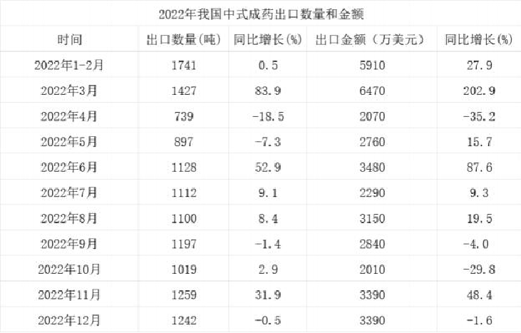

# Table of Contents

* [增长率](#增长率)
  * [混合增长率计算](#混合增长率计算)
    * [例题](#例题)
    * [混合接近处理](#混合接近处理)
    * [多者混合](#多者混合)
    * [作业](#作业)
  * [间隔](#间隔)
  * [乘积](#乘积)
    * [占比](#占比)
  * [作业](#作业-1)
  * [年均增长率-毛胚](#年均增长率-毛胚)
    * [年份一样，末/初](#年份一样末初)
  * [作业](#作业-2)


# 增长率

```
基期=现期/(1+R)
r=现期/基期-1  等于倍数-1 =多多少倍

```

-----


例题1： 2020年，全国职工基本医疗保险（以下简称职工医保）参保人数持续增加，基金收支规模基本稳定。参加职工医保34455万人，比上年同比增加1530万。其中在职职工25429万人，比上年增长5.
0%；退休职工9026万人，比上年增长3.7%。企业、机关事业、灵活就业等其他人员三类参保人员（包括在职职工和退休人员）分别为23317万人、6387万人、4751万人，分别比上年增加1050万人、155万人、325万人。
2020年，全国参加职工医保人数同比增长约：
A. 4.6%
B. 5.4%
C. 6.2%
D. 7.1%

```
153/344-153
153/329 不到5 选A
```


例题2： 2020年，我国农村乡镇卫生院卫生人员数达148.1万人，比上年增加3.6万人，社区卫生人员数达52.1万人，比上年增加3.3万人。
2020年，全国农村乡镇卫生院中，卫生人员数同比增长约：
A.1.4%
B.2.5%
C.3.6%
D.4.7%

```
3.6/148.1-3.6
3.6/144.5
3.6*2/3= 2.6 选B
```


例题3： 2020年12月，全国“12369环保举报联网管理平台”共接到环保举报31156件，环比下降23.2%，同比下降10.3%。其中，受理量23792件，较11月减少6316件；因举报线索不详或不属于生态环境部门职责范围而未受理7364件，较11月减少3119件。


2020年1月，全国“12369环保举报联网管理平台”接到环
保举报件数比上个月：
A.下降了不到30%
B.下降了30%以上
C.上升了不到30%
D.上升了30%以上

```
2020年1月比上个月 就是2019年12月
311/1-10.3=311/900=346
15123+4543=19666 
肯定下降 排除CD
150/346 选B
```

例题4：2021年上半年，我国进口集成电路3123亿块，同比增长28.4%；进口额1979亿美元，增长28.3%。出口集成电路1514亿块，增长34.5%；出口额664亿美元，增长32.0%。


2021年上半年，我国集成电路进口量的环比增速是：
A.1.8%
B.2.1%
C.3.5%
D.4.6%

```
2021年上半年 环比 就是2020下半年
3123
469+443+537+485+528+555

27
 28
  37
3017  3123 
115/3071=B
```

例题5：8月份，天然气产量129亿立方米，同比增长9.7%，增速比上月回落0.8个百分点；日均生产4.2亿立方米，与上月基本持平。1—8月份，天然气产量1040亿立方米，同比增长5.9%。天然气进口持续高速增长。8月份，进口天然气777万吨（1吨约为1380立方米），比上月增加39万吨，同比增长37.3%。1—8月份，进口天然气5718万吨，同比增长34.8%。
本年度8月份，进口天然气环比增长约：
A.5.28%
B.5.42%
C.5.73%
D.6.02%

```
777 -39= 738
39/738=400/8=500 上2 上8 上6 525左右 选A
```


## 混合增长率计算

+ 估计：混合居中偏向大---------平均值
+ 细算：具体步骤
    + 估算部分量之比，就是部分量份数差
    + 匹配真实值即可
+ 按照数量理解更佳！！！
+ 误差：把现期当作基期
+ r差别很大的，直接划线，不要混合


```
正常来做的话
28   32.5-x  1531
     ----- = ---  忽略1+R
32  x-28     3120

   s2     s1 
28-----X--------32.5
1531           3120
S1   1531
--=  ---
S2   3120
推出：混合居中偏向大

大于28小于32 排除AD
四川更大  28+32.5=60.5/2    选C

1531/3120=s1/s2  S1+S2是全部数据，也就是部分的全部距离
1:2=S1:S2  
3f=4.5 f=1.5
32.5-1.5=31 选C
```


```
A=B+C
  3567  4728  一般直接看首位比
   3     6
3:4  7f=3 f=0.4
3f=1.2 6-1.2=4.8
```

```
A=B+C
5678  2341  33
5      8
2:3 3f=3 2f=2
5-2=3
```


-----


### 例题


例题1： 2018年H市完成邮电业务总量108.2亿元。其中，邮政业务总量40.8亿元，同比增长26.5%;电信业务总量67.4亿元，同比增长56.7%。
2018年H市邮电业务总量同比增速在下列哪一个范围内？
A. 23%—41%
B. 41%—57%
C. 57%—71%
D. 高于71%

```
大于26.5 小于56.7 偏向56.7 
平均值为41 选B

也可以直接算 4:6 2:3
5f->30 2f=12
56-12=44

```


例题2：2018年7月份，餐饮收入3343亿元，同比增长9.4%；商品零售27391亿元，同比增长8.7%。1-7月份，餐饮收入22800亿元，同比增长9.8%；商品零售187951亿元，同比增长9.2%。
2018年1-6月，商品零售同比增长约为：
A.8.6%
B.9.2%
C.9.3%
D.9.5%

```
8.7  9.2 大于9.2 排除AB
   0.5 比0.5小 选C
```


例题3：2018年3月，国产品牌手机出货量2699.5万部，同比下降29% ；上市新机型78款，同比下降36.6% 。1～3月，国产品牌手机出货量7586.4万部，同比下降27.8% ；上市新机型190款，同比下降10.8%。
2018年1～2月，国产品牌手机出货量同比约下降了：
A.25.5%
B.26.6%
C.27.1%
D.28.4%

```
29  27.8  排除D
2699   7584  49
1:2 2f=1.2 f=0.6
27.1 秒C
```


例题4：合并计算2016年1季度营业收入最高的两个产业，

6422 6.3

3272 4.4

其营业收入总体增速最接近以下哪个数字？
A.4.4
B.5.1
C.5.7
D.6.4

```
4.4  x 6.3 BC 选
平均值 5.3 大于5.3 直接C
```

### 混合接近处理

例题5：“国家能源局发布2022年1-7月，全社会用电量累计49303亿千瓦时，同比增长3.4%。7月份，全社会用电量8324亿千瓦时，同比增长6.3%”。
2021年1-6月全社会用电量累计约多少亿千瓦时?
A. 38258
B. 39851
C. 40472
D. 41279

```
x 3.4  6.3
40979     49303 8324
5f=3 f=0.6
3.4-0.6=2.8
BC很接近怎么选

40979       49303    8324
 1+ 2.8     1+3.4   1+6.3 

现期之比5：1 基期之比大于1:5 每一份分得到更小了，那结果大于2.8更偏向B
40979/102= 401 选B
 
 a+b=C
 如果ra>rb 
 基期 a/b  1:2
 现期 a/b  1:3 现期更大，真实每一份分得到更多。

因为我们是先拿现期比，但是真实确实基期比
a    1+rb
-- * ------  ra>rb  说明现比基大 每一份真实更大
b    1+ra    ra<rb  说明基比现大 每一份真实值更小

```

### 多者混合

例题6：2015年江苏、浙江、江西三省的税收收入
平均增速是：
A.8.0%
B.8.5%
C.9.4%
D.10.5%

```
8.1<x<9.8 偏向8.1
8.1 10.1 偏向 10.1 比9大 选C
```


例题7：2022 年第四季度,我国中式成药出口金额同比增速约为:
A.-6%
B.-2%
C.2%
D.6%

```
10 11 12 月
出口金额
2010 3390 3390
      48.4 -1.6
          25
-29.8     23.4  
------- 这种差距大有误差
2:3
5f= 532 10 大一点
25-20=5 小于5 选C
------------
3390/148 231
3390/1-1.6 34
2:3 5f=50
48.4-30=18 左右
2010/710 300左右
注意这里混合后 是和混合的总数比
300:570=1：2
3f=48
f=16
18-16=2
```

### 作业

3.2013年3月末，金融机构人民币各项贷款余额65.76万亿元，同比增长14.9%，增速比上年同期低0.8个百分点。2013年3月末，主要金融机构及小型农村金融机构，外资银行人民币小微企业贷款余额11.78万亿元，同比增长13.5%，比全部企业贷款余额增速高1.2个百分点。2013年3月末，主要金融机构本外币工业中长期贷款余额6.46万亿元，同比增长3.2%。其中，轻工业中长期贷款余额6824亿元，同比增长7.6%；重工业中长期贷款余额5.77万亿元，同比增长2.7%，服务业中长期贷款余额16.55万亿元，同比增长8.9%。
2013年3月末，金融机构人民币各项贷款余额比2011年同期大约增长了多少万亿元：
A. 8.53
B. 16.29
C. 11.51
D. 25.91

```
2011年 100f
2012年 115.7
2013 115.7*114.9=133 ->65
问33f 选B
可以直接用间隔R
14.9+15.7+2.2=32左右
65.76/132 *32
```

12.2023年一季度，新疆外贸进出口总值680.7亿元，同比增长80.3%。其中，出口584.7亿元，同比增长86.9%。3月当月，新疆外贸进出口总值236.9亿元，同比增长70%。其中，出口203.4亿元，同比增长78.9%；进口33.5亿元，同比增长30.8%。
2023年一季度，新疆外贸进口值同比增长约：
A.26%
B.32%
C.48%
D.56%

```
584  680  96 大概6.6
86.9  80.3 80-36 40多
眼瞎 96算错了
```

15.2019年1至6月，全国发行地方政府债券28372亿元，同比增长101.09%，其中，发行一般债券12858亿元，同比增长23.21%，发行专项债券15514亿元，同比增长322.38%。
2018年1至6月，发行一般债券的占比较发行专项债券的占比约：
A.低9.36%
B.低52.81%
C.高47.93%
D.高53.43%

```
1.直接算
2.份数思维
一般 100 123
发行 100 422  40 152 2.5倍
60/140=47
```


## 间隔

```
2018比2017年R1 2017比2016年r2
问2018比2016年
R=r1+r2+r1+r1r2
```

```
如何计算r1*r2
先去掉一个百分号，乘完后在加上百分号
15%*15%=225 在加上就是2.25%
```


例题 1.【2017国考】
2015年全行业全年生产手表10.7亿只，同比增长3.9％，完成产值约417亿元，同比增长4.3％，增速提高1.9个百分点；生产时钟（含钟心）5.2亿只，同比下降3.7％，完成产值162亿元，同比下降4.7％
，降幅扩大1.3个百分点；钟表零配件、定时器及其他计时仪器产值96亿元，同比增长14.3％，增
速基本保持上年水平。
2015年我国钟表全行业生产时钟（含钟心）的产值与2013年相比约：
A. 上升了11%
B. 下降了11%
C. 上升了8%
D. 下降了8%

```
-4.7+ -3.4 +  4.7*3.4
-8.1 +1.5
选D
```


例题 2.【2017联考】
2017年上半年医药工业规模以上企业实现主营业务收入15314.40亿元，同比增长12.39% ，增速较上年同期提高2.25个百分点。各子行业中，增长最快的是中药饮片加工，化学药品制剂、中成药、制药设备的增速低于行业平均水平。
在医药工业规模以上企业实现主营业务收入上，2017年上半年约是2015年上半年的（ ）。
A. 1.13倍
B. 0.13倍
C. 1.24倍
D. 0.24倍

```
12.39  2.25   10.14
12.39+10.14+ xx
22.5
选C
```


例题 3.【2019山东】
虽然2014-2016年间全国医疗卫生机构床位数增长速度持续下滑，但2016年床位数仍然比2014
年增加了：
A.12.26%
B.10.87%  
C.13.21%  
D.9.69%


```
11.9左右 选A
```


例题 4.【2022江苏】
2021年1-7月，我国原油产量11561万吨，同比增长2.4%，比2019年同期增长3.9%。其中，7月我国原油产量1686万吨，增长2.5%，比2019年同期增长3.1%。
2020年1-7月，我国原油产量的同比增速是：
A.1.46%
B.1.90%
C.2.36%
D.3.15%

```
3.9=2.4
1.5 选A
```


例题5
2015年，我国服务业增加值为34.16万亿元，2013—2015年年均增长8.1%。服务业增加值在国内生产总值中的比重从2012年的45.5%提高到2015年的50.5%，连续三年保持国民经济第一大产业的地位。2015年我国服务业投资额为31.19万亿元，2012—2015年年均增长15.9%。

2015年我国服务业投资额相对于2012年的增长率约为：

A.48%       B.32%

C.16%       D.56%

```
(1+r)^3
116*116*116=2015/2012 倍数  记得减1
9*12*12=156

大于3*15.9=47.7 记住还有尾巴 选d
```

2014-2019年，我国农民工规模增加了约（ ）。


A.3.2%
B.4.8%
C.6.2%
D.7.8%

```
0.8+0.6+1.7+1.5+1.3=5.9 略大一点 只能选C
```


## 乘积

```
基 a=b*c
现 A=b(1+r1)c(1+r2)
   =a(1+r1)(1+r2)  A/a 倍数
   (1+r1)(1+r2)-1=r1+r2+r1*r2
```


例题1
2018年全国集成电路进口数量为4176万吨，同比增长10.8%；进口单价为4.93万元/吨,同比增长5.6%。
2018年全国集成电路进口额较上年同期约增长了（ ）
A.15%   
B.17%   
C.25%   
D.27%

```
进口额=进口数量*进口单价
10.8+5.6+10.8*5.6
16.4 选B
```


例题2
2016年，我国粮食种植面积达到10670万公顷，增长1%;粮食单产4.95吨/公顷，增长4.21%。请问我国2016年粮食总量增长率为多少?( )
A.5.17%
B.5.21%
C.5.25%
D.5.31%

```
1+4.21+4.21*1
比5.21大 0.04 选C
```


例题 3
2019 年 1—8 月，房地产开发企业土地购置面积 12236 万平方米，同比下降 25.6%，每平方
米土地价格同比上涨 4.5%，土地成交额 6374 亿元。
2019 年 1—8 月，房地产开发企业土地成交额与去年同期相比增长约为：
A.-17％
B.-22％
C.-27％
D.1.2％

```
面积*价格
-25.6+4.5 + -25.6*4.5
-21.1  选B
```

### 占比

例题 4
2014 年，某省全社会研发经费达 122.13 亿元，研发经费占 GDP 的比重为 0.68%，比 2013 年下降 0.02 个百分点。
若 2014 年该省 GDP 同比增速为 7.8%，则当年该省全社会研发经费同比增速约为：
A.1%
B.5%
C.10%
D.18%

```
研发经费/GDP=0.68
7.8+0.68+7.8*0.68
选C
---------------
研=研发/GDP*GDP
0.2/7=-2.8%  这里为什么要用0.2除
-2.8-7.8


14占比-13占比
--------
13占比 
这个是以占比为基础，求占比的增长率
```


## 作业


```
增长率细节题目
-17.7 x  -33.5
19.28     6
3:1 基期更小 每份更大
原来1f4 更大 22左右
```

10.2018~2022年，我国马铃薯单位面积产量同比增长的年份有几个？


A.2
B.3
C.4
D.5

```
乘积R
产量=单位面积*面积 求R单位面积
a=b*c
a=b+c+b*C
b>0  a-C大于0 

```


## 年均增长率-毛胚

```
2016  2017 2018 2019
2016-2019 年均增长为R
16(1+r)(1+r)(1+r)=19

(1+r)^3=19/16 

```

```
1.公式法
nR+n(n-1)/2 = （末-初）/初
3 3
4 6
5 10

要算右边的，有时候不好算
```

```
2.遍数法
见例题1
```

```
毛胚
增长量=基*r 
见例题1
不用算倍数，只用算增量
偶数见例题4
----------------总结
1.奇数选偏大，偶数选偏小
2.奇数 分子 年份+1/2
3.偶数  分支  年份/2  就是第几项目  16-20  4年  4/2=2 分子就是17年

```

例题 1:【2012 浙江】
2010年农村居民得到的转移性收入人均453元，比2005年增加305元，增长2.1倍。
求：十一五期间，我国农村居民人均转移性收入的年均增长率约为（）。
A、10%    
B、15%     
C、20%       
D、25%

```
公式
5R+10R^2=2.1
遍数
100 120 144 172 206 310 
                   这里大于20了 所以结果大于20
毛胚
平均增长量=305/6=61
2005 2006 2007 2008 2009 2010
148  209   270
基本等差 r成调和
调和平均数小于算术平均数  61/270=22 大于22
偶数项怎么办？ 
见例题4

```


例题 2:【2019 深圳】
2012-2017 年，深圳市进口总额的年均增长率约为（ ）。
A.-2.8%
B.-6.3%
C.-10%
D.-13.2%


```
追赶
(1+r)^5=1697/1954
        分子上 69 95 24 上15
  r在3左右选A
  
公式
( 1954-1697 )/1697 =1.3左右
5r+10R^2=1.3 选A

毛胚
1954-1697=26/5=5.1
5.1/181=3左右
```


例题 3.【2018 辽宁】
2015-2017 年三年，全国粮食总产量平均增长率约为：
A.0.08%
B.1.06%
C.1.14%
D.3.4%

```
看清是2014年
6616-6396=220/3=7.3
7.3/639+7.3
73/647 划线 12下降 11多 选C
```


例题 4.


```
891-497=394/4=98
偶数怎么办？
4+1/2=2.5 项
我们先按照2项来算,也就是 末项+1
985/497+98 =16   这里是+98 也就是2 项 不是2.5
但是2.5分母是大，结果比16小

---------偶数
年份/2 = 第几项  就是除数
```


例题5.【2017 深圳】
2012 年至 2015 年，治理噪声投资额的年均增长率约为：

A.23%
B.34%
C.44%
D.53%

```
27892 -21623 11年 没答案
27892 -11672 =162/3=54
54/116+54=54/160  选B

```


例题6.【2018 江西】
2013 一 2017 年移动宽带用户数的年均增长率为


A.28%
B.29%
C.30%
D.31%

```

```


例题 7.【2017 江苏】

2005年19.2，2015年52.5

自 2016 年起，若我国水风核电年产量均按 2006-2015 年平均增速增长，则 2025 年我国水风
核电产量将为
A.84.2 百万吨标准煤
B.85.8 百万吨标准煤
C.132.5 百万吨标准煤
D.143.6 百万吨标准煤

```
固定模型

1.年份差相同
2025/2015 =2015/2005

末期量平方/基 =15平方/05
 525*525/192 = 131 比131大不少 选D
```


比较题：2010 年 1～4 月全国入境旅游部分市场客源情况统计表
若保持同比增长率不变，预计哪一年 4 月入境旅游的法国游客人数将会超过英国：

A. 2011
B. 2012
C. 2013
D. 2014

```

```

### 年份一样，末/初


例题 9.【2016 四川】
以下各时间段中，该市非公有制经济增加值年均增速最快的是：
A. 1990—1995 年
B. 1995—2000 年
C. 2000—2005 年
D. 2005—2010 年


```
n 相等 比较 末/初
倍数A最大

（1+R）^2=末/初
```


## 作业

2016-2018年，我国国际重要湿地面积的年均增长率约为（ ）。


A.25
B.30
C.35
D.40

```
偶数 2/2=1 就是第一项
104-61=43/2=21.5
21.5/61  选A
```

