# Table of Contents

* [现期比重](#现期比重)
* [基期比重](#基期比重)
* [12作业](#12作业)
* [比重变化](#比重变化)
* [比重比大小](#比重比大小)
* [作业13](#作业13)
* [常规平均数计算](#常规平均数计算)
* [平均数变化](#平均数变化)
* [平均数比大小](#平均数比大小)


# 现期比重

+ 比重=A/B =部分/整体

----

例题 1.【2022 广东】
2020 年，全国职工基本医疗保险（以下简称职工医保）参保人数持续增加，基金收支规模基本稳定。参加职工医保 34455 万人，比上年同比增加 1530 万。其中在职职工 25429 万人，比上年增长 5.0%；退休职工 9026 万人，比上年增长 3.7%。企业、机关事业、灵活就业等其他人员三类参保人员（包括在职职工和退休人员）分别为 23317 万人、6387 万人、4751 万人，分别比上年增加 1050 万人、155 万人、325 万人。
2020 年，灵活就业等人员参保人数占职工医保参保总人数的比例约：
A.12.9%
B.13.8%
C.15.2%
D.16.1%

```
4751/34455= 47*3=141 下降1多 选B
```

例题 2.【2022 国考】
2020 年 12 月，全国“12369 环保举报联网管理平台”共接到环保举报 31156 件，环比下降23.2%，同比下降 10.3%。其中，受理量 23792 件，较 11 月减少 6316 件；因举报线索不详或不属于生态环境部门职责范围而未受理 7364 件，较 11 月减少 3119 件。
如同一个月内各类举报的彼此相同，则 2020 年 12 月通过电话的环保举报被受理的件数在以下哪个范围内？

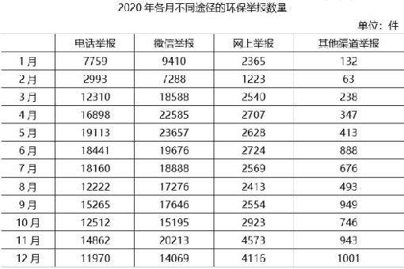
A. 低于 7501 件
B. 7501—8500 件之间
C. 8501—9500 件之间
D. 高于 9500 件

```
受理率 怎么求？？
237/311=79 下3 76左右
119*76= 选C
```

例题 3.【2021 联考】
“十三五”时期，我国航天发射次数占全球的比重为：

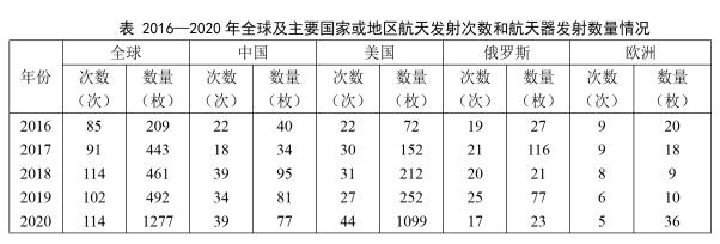
A.15%
B.20%
C.25%
D.30%

```
次数 中国 12 32  152
全球 3 19  500  选D 
```

例题 4.【2021 浙江】
2015 年 S 省交通运输、仓储和邮政业所有者权益占规模以上服务业企业所有者权益的比重在以下哪个范围内？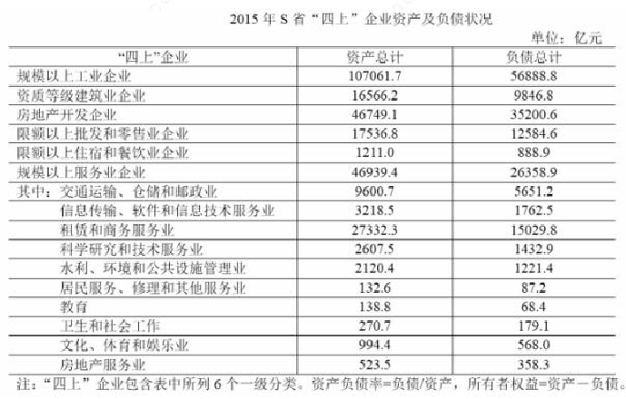


A.10%以下
B.10%—20%
C.20%—30%
D.30%以上

```
9600-5651
----------
46939-26358
395/206=19 选B


```

例题 5.【2021 国考】
在表中所列各类 LED 应用市场中，2013—2019 年产值年均增速（以 2013 年为基期）最快的应用市场，2019 年产值约占 LED 行业总产值的：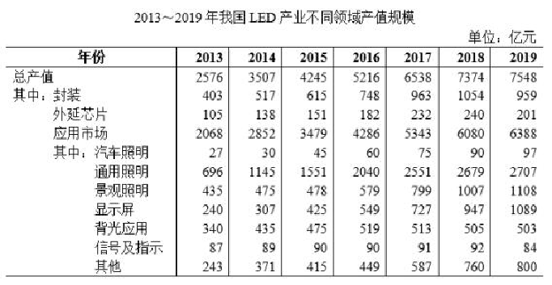


A.14%
B.17%
C.36%
D.85%

```
年份一样 看末/初的倍数 就是 显示屏
1089/7545=1/7 1428 大 还是A
```

# 基期比重

+ 基期部分/基期整体

但是题目一般不会这么直接告诉你

```
现部    1+r整
---  * ------  
现整    1+r现

对角相乘
```


例题1.【2021联考】
针叶原木从新西兰进口1729.4万立方米，增长23.2%，俄罗斯795.3万立方米，下降10.1%。美国502.8万立方米，增长2.3%，澳大利亚413.4万立方米，下降3.7%。乌拉圭209万立方米，同比增长175.4%，从日本进口针叶原木92.3万立方米，同比增长23%。2018年进口针叶锯材2488万立方米，金额49.91亿美元，分别下降0.7%和增长2.3%。其中来自俄罗斯针叶锯材1567.4万立方米，增长9.7%，占进口针叶锯材63%，从加拿大进口417.4万立方米，大幅下降18.2%，占进口针叶锯材的17%。
2017年从加拿大进口的针叶锯材占总进口的比重约为∶
A.62.70%
B.40.25%
C.34.68%
D.20.37%

```
2017年
417   1-0.7
-- * ----     = D
248   1-18.2
```

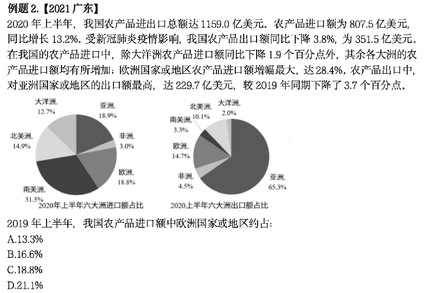

```
188* 1132/128  比188小 选B
```

例题3.【2020四川】
2015年，全国参加城镇职工基本养老保险人数为35361万人，比上年末增加1236万人，比2013年末增加3133万人；参加城乡居民基本养老保险人数为50472万人，增加365万人，比2013年末增加772万人；参加城镇基本医疗保险人数为66570万人，增加6823万人，比2013年末增加9525万人。其中，参加职工基本医疗保险人数为28894万人，增加598万人；参加城镇居民基本医疗保险人数为37675万人，增加6225万人。参加失业保险人数为17326万人，增加283万人。参加工伤保险人数为21404万人，增加765万人，其中参加工伤保险的农民工为7489万人，增加127万人。参加生育保险人数为17769万人，增加730万人。
2014年，参加城镇居民基本医疗保险的人数约占当年参加城镇基本医疗保险人数的：
A.59%
B.53%
C.42%
D.36%

```
376/665 选B
```

例题4.【2018江苏】
2016年江苏规模以上光伏产业总产值2846.2亿元，比上年增长10.8%，增速较上年回落3.5个百分点；主营业务收入2720.5亿元，增长9.9%，增速回落2.5个百分点；利润总额153.6亿元，增长11.6%，增速回落8.8个百分点。苏南、苏中、苏北地区规模以上光伏产业产值分别比上年增长10.2%、9.0%、39.0%。2016年江苏光伏发电新增装机容量123万千瓦，年末累计装机容量546万千瓦。

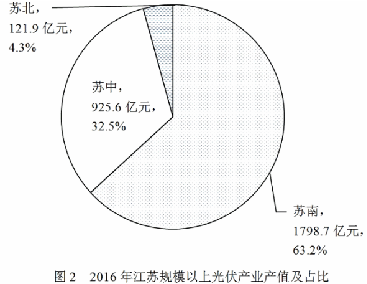

2015年苏中地区规模以上光伏产业产值占全省的比重为：
A.19.0%
B.23.5%
C.28.3%
D.33.1%

```
32.5* 110/109 选D 
```

例题5.【2018浙江】
2015年7月，京津冀区域13个城市空气质量超标天数平均占当月总天数的57.4% ，平均达标天数比上年同期下降6个百分点。与全国74个城市相比，京津冀区域平均重度污染天数占比高4.4个百分点。而与上年同期相比，74个城市平均达标天数占比也由80.5%下降到73.1% 。
2014年7月，京津冀区域13个城市空气质量超标天数占当月总天数的比重约比全国74个城市高多少个百分点？
A.51.4
B.37.9
C.31.9
D.19.5

```
57.4-6=51.4
19.5
这里超标要用达标带出来

```


# 12作业

2.2010年1—5月，该省社会消费品零售总额2660.9亿元，比上年同期增长17.8%，其中，批发业消费品零售额238.5亿元，增长14.2%；零售业消费品零售额2130.2亿元，比上年同期增长17.4%；住宿业消费品零售额22亿元，比上年同期增长16.3%；餐饮业消费品零售额270.3亿元，比上年同期增长25.2%。 
2009年1-5月，批发业消费品零售额比餐饮业消费品零售额： 
A.多约20亿元 
B.少约20亿元 
C.多约7亿元 
D.少约7亿元

```
238/114-270/125
210-216=6 选D
```

6.2019年，全国居民平均每百户拥有彩色电视机120.6台、洗衣机96.0台、电冰箱100.9台、空调115.6台、汽车35.3辆。城镇居民人均住房建筑面积为39.8平方米，比2002年增长62.1%；农村居民人均住房建筑面积为48.9平方米，比2000年增长97.2%。全国居民人均交通通信支出2862元，比2000年年均增长14.7%，占人均消费支出的比重较2000年提高6.1个百分点。全国居民人均医疗保健支出1902元，比2000年年均增长13.4%，占人均消费支出的比重较2000年提高2.9个百分点。 
按2001—2019年的年均增速估算，2021年全国居民人均医疗保健支出介于： 
A. 2320元和2370元之间 
B. 2370元和2420元之间 
C. 2420元和2470元之间 
D. 2470元和2520元之间

```
先划线，看看距离大概多少。大概是2420

1902*（1+13.4%)^2 = 2420/1902
2420
---- = 127 下降27% 但是13.4间隔已经是26.8 所以答案要比2420大
1920

```
8. 2017年，全国规模以上工业企业实现主营业务收入116.5万亿元，比上年增长11.1%；全国规模以上工业企业发生主营业务成本98.9万亿元，增长10.8%；全国规模以上工业企业实现利润总额75187.1亿元，比上年增长21%，增速比2016年加快12.5个百分点；全国规模以上工业企业主营业务收入利润率（利润总额/主营业务收入）为6.46%，比上年提高0.54个百分点。2017年，全国规模以上工业企业每百元主营业务收入中的成本为84.92元，比上年减少0.25元；每百元主营业务收入中的费用为7.77元，减少0.2元；每百元资产实现的主营业务收入（主营业务收入/总资产）为108.4元，增加3.7元；人均主营业务收入（主营业务收入/员工数量）为131.5万元，增加15万元。 
2017年全国规模以上工业企业实现利润总额比2015年增加了（ ）亿元。 
A. 13049 
B. 13409 
C. 17917 
D. 17971 

```
21  8.5  21*8.5
这里不算精确就不行29.5+1.6=31.2
751/131*31 大概在CD    千分位直接代入
75187-17917=57270
57270*312=17868 选C
```

11.某企业的主打产品A在2020年供不应求，因此2021年产量同比增长了15%，但销量同比下滑了20%。2021年产品A的成本单件上升了10%，售价提高了10%，那么不计未售出的库存，2021年产品A全年的总利润同比：
A.上升了6%
B.下降了6%
C.下降了12%
D.下降了15%

```
用数量做的，但是资料其实是乘积r
利润=单间利润*数量

单个利润=售价-成本 混合为10
10 -20  选C
```


#  比重变化


```
[绝对值]6比5多多少？ 多1 多20%

【相对值】6%比5%多多少 1个百分点 只能加减 百分点 

比重变化：相对值
平均数变化： 绝对值

```

```
现比-基比=

     (r部-r整)
现比*  --------
      1+r部

通过（R部-r整）>0 现比>基比
```

```
考察方式：
1.百分点 % 选百分点
2.其他都一样 计算
```


例题1.【2022广东】
2020年，受新冠肺炎疫情影响，我国民航全行业完成旅客运输量41777.81万人次，比上年下降36.7%。国内航线完成旅客运输量40921.30万人次，比上年下降30.3%，其中港澳台航线完成旅客运输量96.13万人次，比上年下降91.3%（不全），国际航线完成旅客运输量956.51万人次，比上年下降87.1%。尽管如此，我国国内航空运输市场在全球范围内恢复最快、运行最好。
相比2019年，2020年我国民航全行业完成旅客运输量中，国内航线完成旅客运输量占比约：
A. 降低了9%
B.降低15%
C.提高了9%
D.提高了15%

```
409/417 * (-30+36.7 )/（1-30） 整体为正的 排除AB
没有15 直接选C

```


例题2.【2022国考】
2020年，C市天然气用量为107.47亿立方米，同比增长3.83%。其中，中石油供应73.96亿立方米，同比增长1.72%；中石化供应33.51亿立方米，同比增长8.8%。从用气结构看：民用气为33.75亿立方米，同比增长5.4%；CNG用气6.99亿立方米，同比下降13.92%；工业用气66.73亿立方米，同比增长5.3%。
2020年，中石化供气量占C市天然气用量的比重比上年：
A.减少了不到3个百分点
B.增加了不到3个百分点
C.减少了3个百分点以上
D.增加了3个百分点以上

```
335/107 * (8.8-3.83)/(1+8.8)
3多  4多 1多 选B

```

例题3.【2021广东】
受疫情影响，2020年全国社会消费品零售总额391981亿元，同比下降3.9％，居家消费需求明显增长，“宅经济”带动新型消费模式加快发展。2020年，全国网上零售额比上年增长10.9％，增速比前三季度加快1.2个百分点。其中实物商品网上零售增长14.8％，占社会消费品零售总额的比重为24.9％。在线上消费快速增长带动下，全年快递业务量超过830亿件，比上年增长超过30%。G省消费市场受新冠肺炎疫情冲击更为明显，2020年全省社会消费品零售总额40207亿元，同比下降6.4％。一季度，消费市场受到疫情明显冲击，市场销售大幅下降19.0％。随着疫情防控形势不断好转及多项政策措施持续显效，市场主体加快复商复产，居民消费需求稳步释放。
与2019年相比，2020年G省社会消费品零售总额占全国的比重：
A.增加了2.7个百分点
B.增加了0.27个百分点
C.下降了2.7个百分点
D.下降了0.27个百分点


```
402    -6.4+3.9  2.5
--- *  ------  
391    1-6.4=94

0.1多   2多 

排除AB  选D

```


例题4.【2021联考】
2020年，我国规模以上互联网和相关服务企业（以下简称互联网企业）业务收入12838亿元，同比增长12.5%，增速低于上年同期8.9个百分点。
东部地区互联网业务收入11227亿元，同比增长14.8%，增速较上年同期回落9个百分点，中部地区互联网业务收入448.1亿元，同比增长3.4%，增速较上年同期回落53.1个百分点。西部地区互联网业务收入497.2亿元，同比增长6.9%，增速较上年同期回落15.2个百分点。东北地区互联网业务收入47.1亿元，同比增长9.1%。
在东部、中部、西部和东北四个地区中，2019年和2020年互联网业务收入占全国比重均高于上年水平的地区有几个？
A.0
B.1
C.2
D.3

```
高 直接看R部-r整体
2020  12.5
2019   21.4 

东部: 14.8  23.8  1
中： 3.4   
洗 6.9
北： 9.1
选B

```

例题 5.【2021 北京】
2018 年全球茶叶产量 585.6 万吨，同比增长约 3%，中国茶叶产量 261.6 万吨，同比增长 0.7
万吨。2018 年，中国茶叶国内销售量为 191 万吨，同比增长 5.1%，国内销售总额为 2661
亿元，出口量为 36.5 万吨，同比增长 2.8%。
2018 年中国茶叶产量占全球茶叶产量的比重与 2017 年相比：
A.上升了约 1 个百分点
B.上升了约 10 个百分点
C.下降了约 1 个百分点
D.下降了约 10 个百分点

```
191    5.1-3
--- *  ----
585     105

3多  2多 6多 
选B
```

# 比重比大小


将①肉制品、②乳制品和③蛋制品按 2021 年第一季度市场监管部门食品安全监督抽检合格率从高到低排列，以下正确的是：

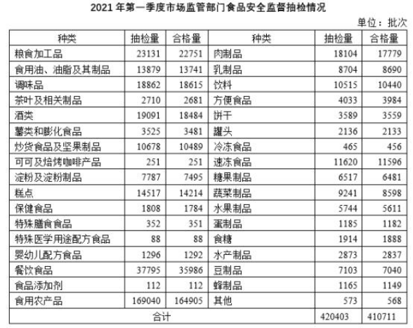A. ③②①
B. ②③①
C. ①②③
D. ①③②

```
1777/1810
8690/8704 拆分
1182/1185
2大选B
```


例题 2.【2021 联考】

M 市 2021 年 1—6 月的天气情况中，每月的晴天比率高于 45%的月份有多少个？

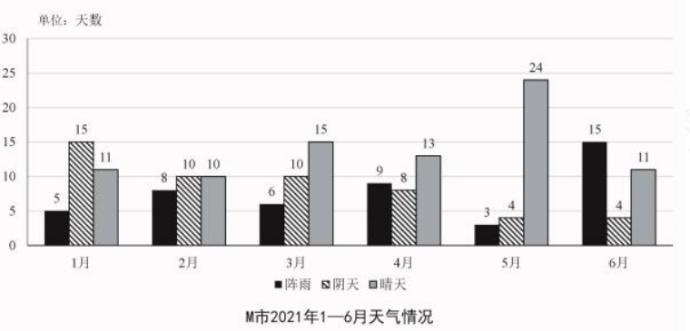A.1
B.2
C.3
D.4

```
11/31
10/28
15/31  1
13/40 
24/31  1
11/30
选B
```


例题 4.【2021 广东】
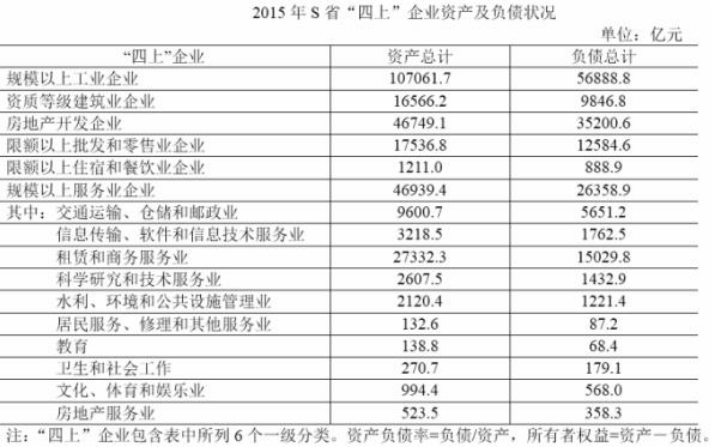2015 年 S 省规模以上服务业企业中，资产负债率高于 60%的行业有几个？
A.3
B.4
C.5
D.6

```
服务业企业
直接总*60 
3218*60  18
算下来是3个 选A
```


# 作业13

1.2015年国家自然科学基金委全年共接收173017项各类申请，同比增长约10%，择优资助各类项目40668项，比上年增加1579项，资助直接费用218.8亿元，平均资助强度（资助直接费用与资助项目的比值）53.8万元，各项工作取得新进展新成效。在研究项目系列方面，面上项目资助16709项，比上年增加1709项

2015年面上项目资助项目占总资助项目的比重较上一年增加约：
A.4.2个百分点　
B.3.8个百分点　
C.3.1个百分点　
D.2.7个百分点

```
比上一年

167/406 -150/390
下1
417 下4 412

划线大概是412-383=29  答案在CD，怎么选呢
需要算的更仔细点
406 下降1.5  给1  结果变大 ，应该比412小 选D
```

-----

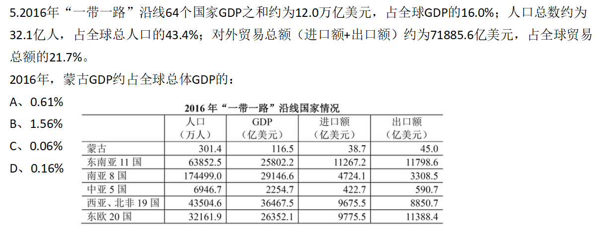

```
这题注意量级 
12万亿
116亿

```


# 常规平均数计算

平均数：**在一组数据中所有数据之和再除以数据的个数**

```
现平均数=总/份数

基期平均数= 现平均 *  r总-r份
                  --------
                   1+ r总
对角相乘
```


例题 1.【2020 北京】
2016 年末,A 自治区城镇人口为 1542.1 万人，城镇化率（城镇人口占总人口比重）为 61.2%。2016 年末 A 自治区城镇人均居住面积达 32.20 平方米，比 1978 年末增长了 5.5 倍；农村牧
区人均居住面积达 27.40 平方米，比 1985 年末增长 103%。
2016 年末 A 自治区城镇人口总居住面积约为多少亿平方米？
A.3
B.5
C.7
D.9

```
居住面积=人均*人
154* 32 = 5多 选B
```


例题 2.【2020 国考】
2018 年全国产茶省份中，有几个省份的茶园单位面积茶叶产量高于 1 吨/公顷?
A.4
B.5
C.6
D.7
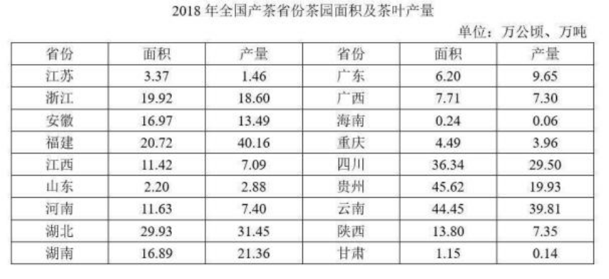

```
直接除
浙江 江西 河南 山东 4个
```


例题 3.【2019 联考】
传统纸质媒介中，2017 年我国成年国民人均每天阅读纸质图书时长为 20.38 分钟，人均每天阅读报纸时长为 12.00 分钟，人均每天阅读期刊时长为 6.88 分钟。
2017 年我国成年国民阅读一本纸质图书平均约需要：
A. 20.8 小时
B. 22.3 小时
C. 24.1 小时
D. 26.6 小时

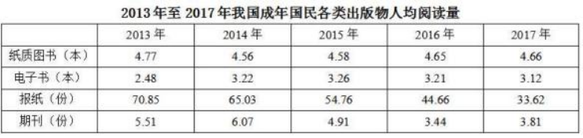

```
2017 年我国成年国民阅读一本纸质图书平均
20.38 *365 下1
----------
下 3 4.66*60

300 下1 选D


```


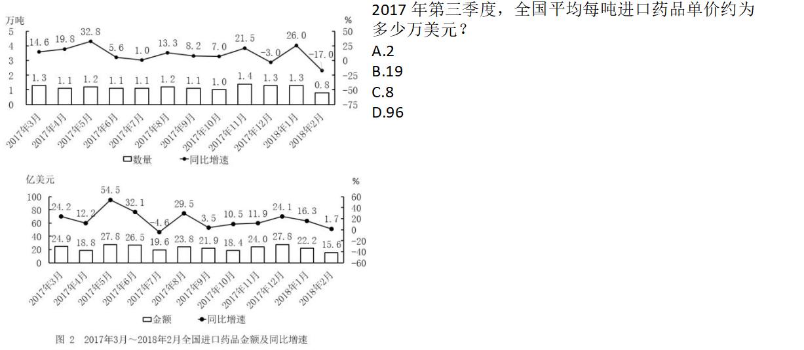

```
19.6+23.8+21.9/1.1+1.2+1.1

60/3=20
```


例题 5.【2019 江苏】
2018 年国家统计局组织开展了第二次全国时间利用的随机抽样调查，共调查 48580 人。结
果显示，受访居民在一天的活动中，有酬劳动平均用时 4 小时 24 分钟。其中，男性 5 小时
15 分钟，女生 3 小时 35 分钟；城镇居民 3 小时 59 分钟，农村居民 5 小时 1 分钟；工作日 4
小时50分钟，休息日3小时19分钟。受访居民有酬劳动的参与率为59%，其中城镇居民53.1%。
受访居民无酬劳动平均用时 2 小时 42 分钟。其中，女性 3 小时 48 分钟；农村居民 2 小时
39 分钟；工作日 2 小时 34 分钟。受访居民无酬劳动的参与率为 70.2%，其中男性 55.3%。
受访的男性居民约有
A. 2.38 万人
B. 2.43 万人
C. 2.65 万人
D. 2.91 万人

```
隐藏的十字交叉

也可以不用算，直接线段法
R 混合居中偏向大，男性人数要小一些 485/2=242 直接秒A
```

# 平均数变化

```
 绝对数是指事物的具体数量，而相对数则是指事物数量之间的比较关系

比重变化只有一个，相对量

平均数变化有2个， 绝对量

现平-基平 =平均数变化

平均数增长【量】公式= 现平均数 * （r总-r份）/（1+R总） 
平均数增长【率】公式= （r总-r份）/1+r份


```

```
就比如说男生占班上人数的比重是多少，那应该说是50%，你就不能说50个对吧，那50%它是一个相对量嘛，就相当于是全班人数100份。那么你男生占了50份，这才叫50%。所以它指的是一个相对过程，相对量。

平均值呢，是说，100个苹果分给10个人，每人多少个？那100÷10=10，那你回答应该是每人10个啊。虽然说表达式都是A÷B，但是它表达的意义不一样。
```


例题 1.【2015 联考】
在东部、中部、西部地区中，2014 年 1～2 月商品房平均销售价格高于上年同期水平的地区
有几个？

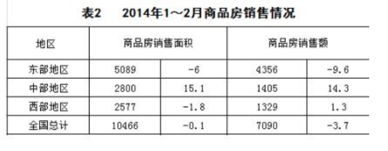
A. 0
B. 1
C. 2
D. 3

```
直接看R总>R份
```


例题 2.【2014 北京】
与上年同期相比，2012 年 1-10 月我国蔬菜和水果的平均出口单价：

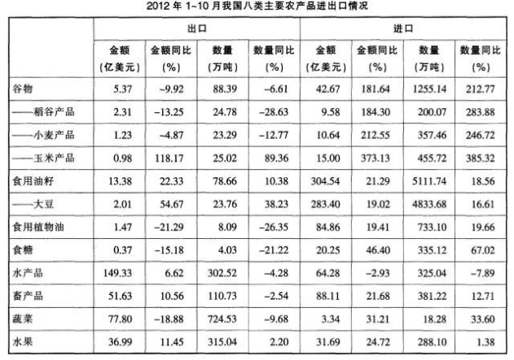
A.均有所提高
B.均有所下降
C.只有蔬菜价格提高
D.只有水果价格提高

```
直接看R总>R份
```

例题 3.【2020 国考】
2018 年我国平均每家海洋主题公园全年游客规模比 2010 年：

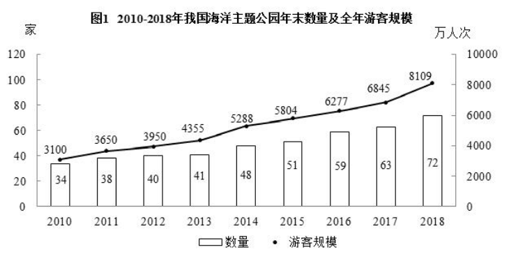A. 减少了 30 万人次以内
B. 减少了 30 万人次以上
C. 增加了 30 万人次以内
D. 增加了 30 万人次以上

```
8109/72 -3100/34
100多 9多 直接选C
```


例题 5.【2017 联考】
2014 年铁路旅客平均每人次周转距离比 2013 年多约多少公里？

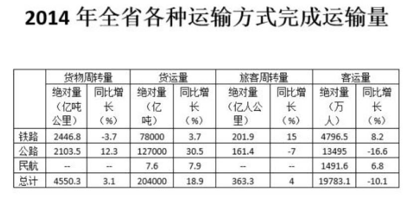
A.15
B.25
C.34
D.44

```
增长量
201/479 * （15-8.2）/(1+15%)
直接B
```


# 平均数比大小

例题 1.【2019 江苏】
2019 年上半年，东部地区各省（市）软件企业的软件业务平均利润的最大值是：

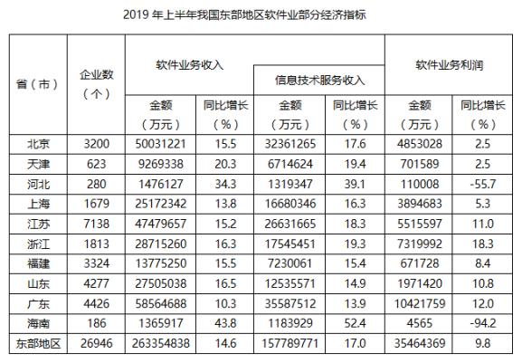
A. 2320 万元
B. 2355 万元
C. 4038 万元
D. 4969 万元

```
3546/269 求总的没答案 说明不是总的，求某一个

分母小 分子大 应该是浙江
731/181 365 上10  选C
```

例题 3.【2020 四川】
假设资料中的各个院校毕业生人数相同，
2016 年各专业类型毕业生平均薪酬，从
高到低排序为：

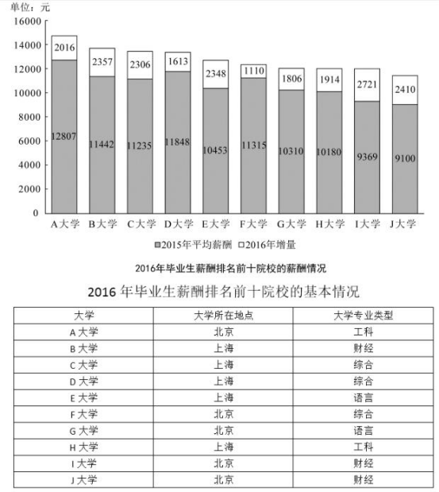
A. 工科> 语言> 财经> 综合
B. 财经> 工科> 综合> 语言
C. 工科> 综合> 财经> 语言
D. 综合> 工科> 财经> 语言

```
这题容易错，是要把 工科的所有加起来 在除以个数
12807+2016+10180+1914  / 2 

```


例题 5.【2021 广东】
2020 年前三季度，G 省下列行业中，平均每个企业产值最高的是：

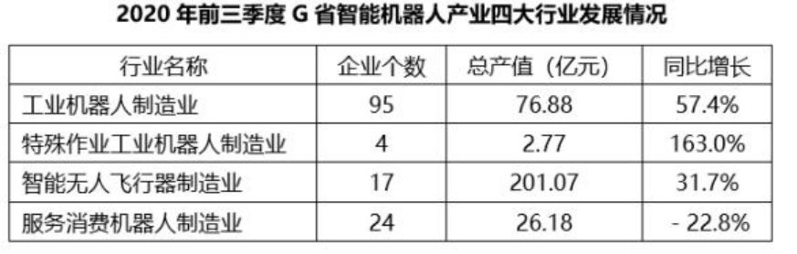
A. 工业机器人制造业
B. 特殊作业工业机器人制造业
C. 智能无人飞行器制造业
D. 服务消费机器人制造业

```
直接套公式
产值/个数
看首位 
A 0.8
B 0.5
C  这不直接C
```


