# Table of Contents

* [20国考](#20国考)
  * [1](#1)
  * [4](#4)
* [21国考](#21国考)
  * [3](#3)
  * [4](#4-1)
* [20年江苏](#20年江苏)


# 20国考

## 1

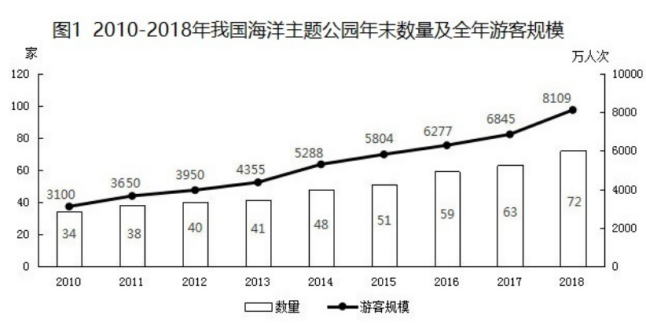

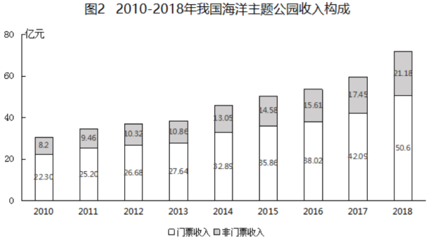

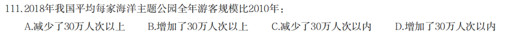

```
8109   3100
---- - ---
72      34
大概估算下 100 9多 直接选D
```

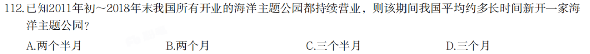

```
题目给了2010 
72-34=38 

96/38=2.5 选A
```


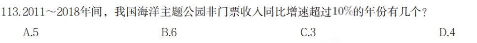

```
错位加 A
```

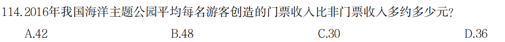

```
3802-1561/6277=2241/6277 划线选D
```


```
前4个 DAAD 缺一个B
直接看BC  2764/41  2668/40  B对
没时间就选B
```


## 4

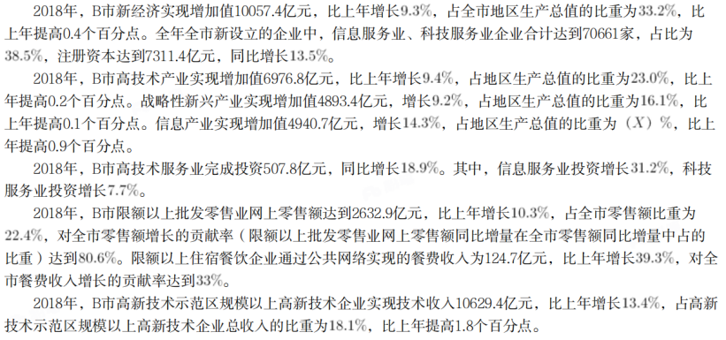

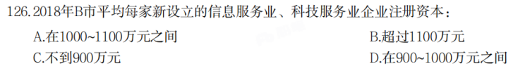
```
18年  731/706= 104 下降 选A
```

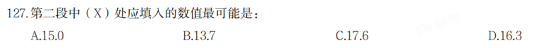

```
697/23

494 *23
-----   =163
697

也可以直接看 4893  16.1   4940高不了多少 直接选D
```


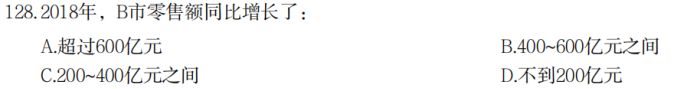.


```
错题 不知道怎么求
a对b的贡献率=a的增长量/b的增长量

2632   103
---- *----   300左右 选C
110    806

```

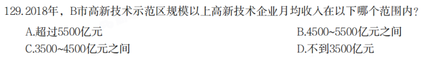

```
这题坑在 少了技术2个字 求得就是总得
10629
----       B
181 * 12
```

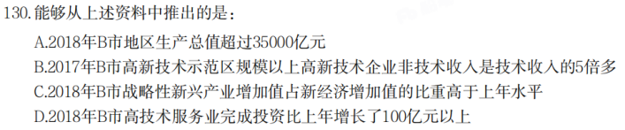

```
ADCC
先看C  9.2 9.3 小于
D  5078/1189 *189  错
B 不好看 先看A A错
B 18.1-1.8=16.3 1-16.3=83.7 5倍左右
```


# 21国考

## 3

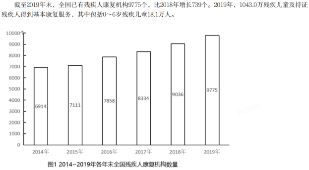

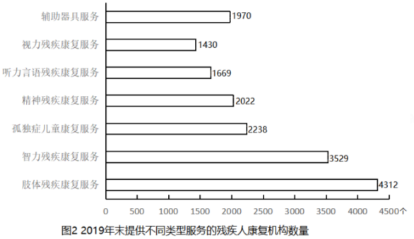

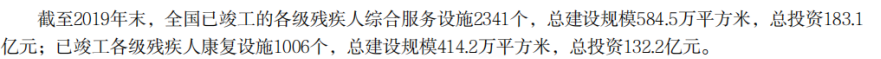

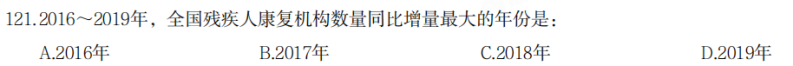

```
直接看图 算出增量 选A
```

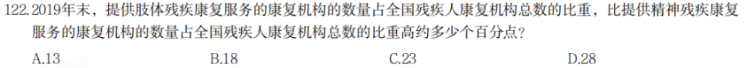

```
431/977-202/977
229/977=22 上一点 选C
```

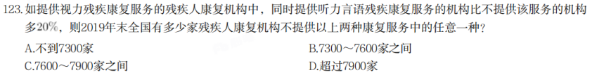

```
x+ 1.2x=1430 x=650
只提供650 
9775-650-1669  总-A-B =不在A和B   选B
```

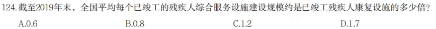

```
584/2341
---------  0.6 选A
412/1006
```

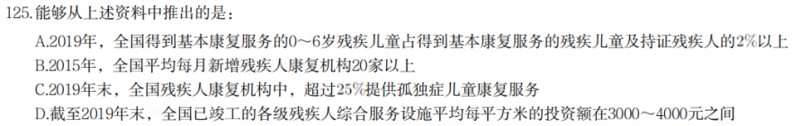

```
优先看D 就是D
183/584 
```

## 4

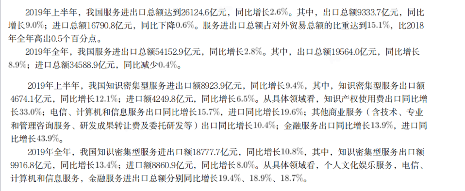


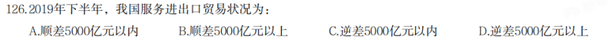

```
19564-9333=10300
进口>出口  贸易逆差 D
```

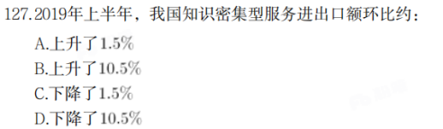

```
18777/110-8923/109=2018年下半年=9850/1+11 左右
8923-882左右 不会达到10 选A

```

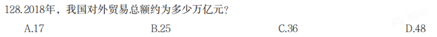

```
15.1-0.5=14.6
541/103/14.6
选C
```

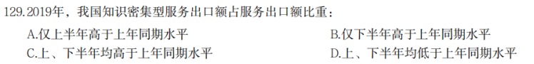

```
127做出来了 129也出来了 选C

这题要主题 是上半年比上半年 下半年比下半年，不然容易错
```

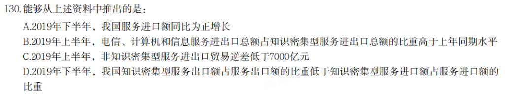

```
缺一个b 先看B 
直接选B 19.4 18.9 18.7 大于10.8
```


# 20年江苏

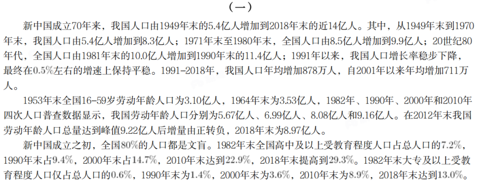

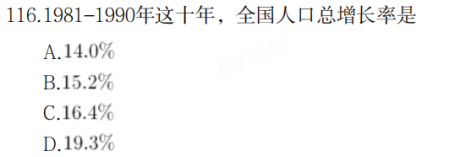

```
11.4-9.9 /9.9 = 15.2
这里题目告诉你十年 应该是1980年末 B
```

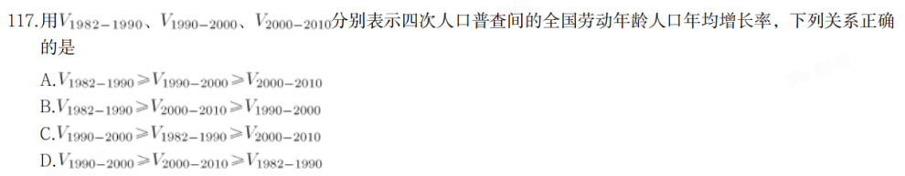

````
年均增长率 分子比较大小 A
````

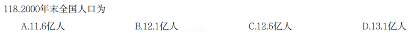

```
 14-8*0.711=12.5  C
```

119.全国大专及以上受教育程度人口占总人口比重提高最多的时期是

A.1981-1990年     B.1991-2000年 
C.2001-2010年     D.2011-2018年

```
直接R做差 C
```

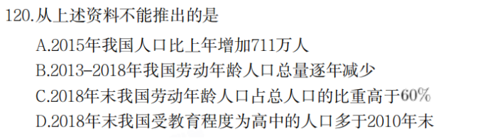

```
江苏比较坑 人家问的是 不能

每年增长不等于年均增长
```

