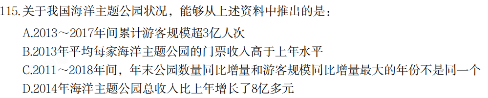

# Table of Contents

* [20国考](#20国考)
  * [1](#1)
  * [4](#4)
* [21国考](#21国考)
  * [3](#3)
  * [4](#4-1)


# 20国考

## 1


```
8109   3100
---- - ---
72      34
大概估算下 100 9多 直接选D
```


```
题目给了2010 
72-34=38 

96/38=2.5 选A
```


```
错位加 A
```


```
3802-1561/6277=2241/6277 划线选D
```



```
前4个 DAAD 缺一个B
直接看BC  2764/41  2668/40 
没时间就选B
```


## 4


```
18年  731/706= 104 下降 选A
```


```
697/23

494 *23
-----   =163
697

也可以直接看 4893  16.1   4940高不了多少 直接选D
```


.


```
错题 不知道怎么求
a对b的贡献率=a的增长量/b的增长量

2632   103
---- *----   300左右 选C
110    806

```


```
这题坑在 少了技术2个字 求得就是总得
10629
----       B
181 * 12
```


```
ADCC
先看C  9.2 9.3 小于
D  5078/1189 *189  错
B 不好看 先看A A错
B 18.1-1.8=16.3 1-16.3=83.7 5倍左右
```


# 21国考

## 3


```

```


```

```


```

```


```

```


```

```

## 4

