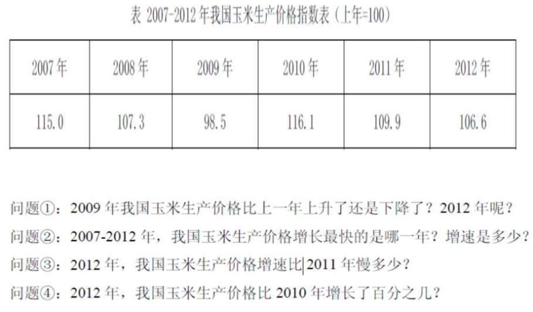

# Table of Contents

* [指数](#指数)
* [增长贡献率](#增长贡献率)
* [拉动增长](#拉动增长)
* [贡献率](#贡献率)
* [倍数与番数](#倍数与番数)


# 指数


+ 指数是一个相对值，不是具体值



```
注意题目说了【上年=100 也有可能不是100 是90,如果没给默认就是100 】
06  07
100 115  相对上一年  115-100/100=15%  告诉指数就是告诉你增长率

2011年 109.9-100/100=9.9
```


```
1.09年  -1.5% 12年6.6%
2.指数大 R大 10
3.9.9-6.6=3.3
4. 间隔R
```

# 增长贡献率

增长贡献率 
    =部分增长量/整体增长量
    =部分基期*R1 /整体基期*R2
   


# 拉动增长

拉动增长：拉动增长=部分增长量/整体**基期** *100%

例题 1：2012 年财政总收入 647 亿元，比去年同期增长 5.4%，其中公共财政预算收入拉动
财政总收入增长了 3.2 个百分点。
问题：2012 年公共财政预算收入的增长量是多少亿元?

```
3.2=x/（647/105） 192 上2 

```

例题 2：2014 年 1—11 月浙江省实现外贸进出口总值 1.98 万亿元人民币，比去年同期增长
5%，高于全国进出口增速 2.8 个百分点，占全国外贸进出口总值的 8.3%。其中，出口 1.52
万亿元，增长 9.1%，高于全国出口增速 4.7 个百分点;进口 4592 亿元，下降 6.6%，低于全
国进口增速 6.2 个百分点;实现贸易顺差 1.06 万亿元，扩大 17.6%。以美元计价，1—11 月
浙江省外贸进出口总值 3225.8 亿美元，增长 6.2%。
2014 年 1—11 月，浙江省外贸进出口拉动全国外贸进出口增长了约( )个百分点。
A. 8.3
B. 2.8
C. 0.6
D. 0.4

```
198/105 *5 
---   
19800/8.3/1+2.2   【注意是基期】 
```

例题 3：2010 年劳动者报酬是 6919.99 亿元，同比增长 13.9%，生产税净额是 2197.19 亿元，
同比增长 19.8%，劳动者报酬和生产税净额拉动北京市生产总值增长 9.7 个百分点，拉动北
京市消费品零售总额增长 3.7 个百分点。
问：2009 年北京市生产总值约为多少亿元?

```
3.7=[6919/113*139  +  2197/119 *198]/x   [2个量相加]
x=
```

# 贡献率

贡献率=部分增长量/**整体增长量** *100%

例题 1：2010 年，我国农村居民人均纯收入由 2005 年的 3255 元提高到 5919 元，增加
2664 元，其中农村居民家庭生产经营人均纯收入 2833 元，比 2005 年增加 988 元，增长
53.6%。
问题：2005-2010 年，我国农村居民家庭生产经营人均纯收入对农村居民人均纯收入增加的
贡献率为多少？

```
人均纯收入=5919-3255=2664

988/2664=329 下降
```

例题 2：2012 年全年江苏省粮食总产量达 3372.5，万吨，增长 2.0%。 其中， 夏粮 1143.5
万吨， 增长 2.4%，秋粮 2229.0 万吨，增长 1.8%。
问题：2012 年，江苏省夏粮产量对粮食总产量增产的贡献率是多少

```
直接求增量
1143/102*24
----------
3372/102*2
```


# 倍数与番数

n 番 = 2^n方

2番=4倍


例题 1：2010 年，各类企业投入 R&D 经费 5185.5 亿元，比上年增长 22.1%；政府属研究
机构投入 1186.4 亿元，增长 19.1%；高等学校投入 597.3 亿元，增长 27.6%。企业、政
府属研究机构、高等学校经费所占比重分别为 73.4%、16.8%和 8.5%。
分执行部门看，2010 年企业投入 R&D 经费约是政府属研究机构和高等学校经费总和的（ ）。
A．2.9 倍
B．2.6 倍
C．2.5 倍
D．2.2 倍

```

```

例题 2：2012 年，我国海关进出口贸易中，出口额 20489 亿美元，同比增长 7.9%；进口
额 18178 亿美元，同比增长 4.3%。
问题①：2011 年，我国海关出口额是进口额的多少倍
问题②：2011 年，我国海关出口额比进口额多多少倍
问题③：与上年相比，2012 年我国海关进出口贸易中出口额增长量是进口额增长量的多少
倍

```
204/107
------ =111 下2 
181/104

多多少倍=R =倍数-1


```

