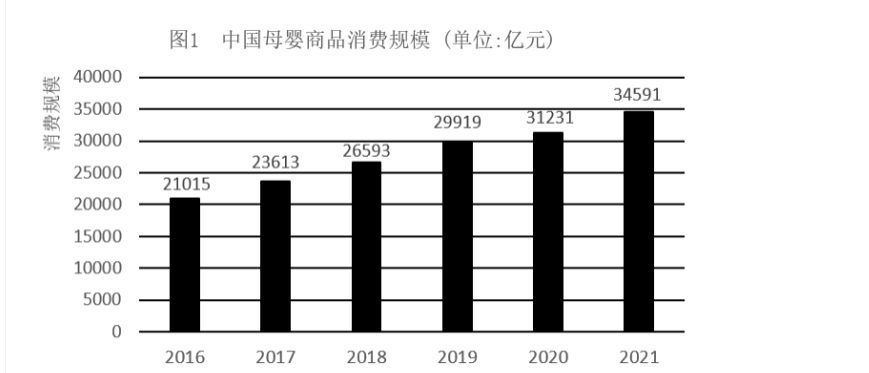
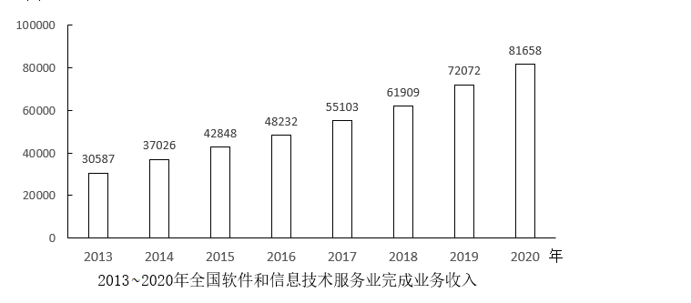
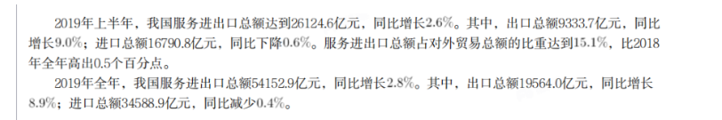

# Table of Contents

* [间隔R](#间隔r)
  * [给了平均和一部分R](#给了平均和一部分r)
* [比较4个数的增长率大小](#比较4个数的增长率大小)
* [贡献率](#贡献率)
* [都超10%的数据有几个](#都超10的数据有几个)
* [超15%有几个](#超15有几个)
* [折线图 看首尾](#折线图-看首尾)
* [容斥](#容斥)
* [贸易顺差/逆差](#贸易顺差逆差)
* [坑点](#坑点)
  * [少字](#少字)
* [年均增长](#年均增长)
* [每年增长不等于年均增长](#每年增长不等于年均增长)
* [月均](#月均)
* [增长量比大小](#增长量比大小)
* [基期比重](#基期比重)


```
选项均衡

前4个 DAAD 缺一个B
直接看BC  2764/41  2668/40 
没时间就选B

一般来说三简单一难， 先不看难得，先看其他得。
如果ABCD都有了 从D开始看
```


# 间隔R

## 给了平均和一部分R

2021年1~2月，全国网上零售额17587亿元，同比增长32.5%，两年平均增长13.3%。其中，实物商品网上零售额14412亿元，同比增长30.6%，两年平均增长16.0%，占社会消费品零售总额的比重为20.7%；在实物商品网上零售额中，吃类、穿类和用类商品分别增长41.6%、44.3%和25.1%，两年平均分别增长33.8%、8.7%和16.0%。

在2020年1~2月①全国网上零售额和②实物商品网上零售额中：

- A仅①同比正增长
- B仅②同比正增长
- C①和②均同比正增长
- D①和②均未同比正增长

```
题目问 2020
19 20 21   给了21年和2年平均

13.3+13.3+13.3*13.3=27左右
 27=32.5 +x
 
16+16+16*16=32+
32=30.6+x  x 为正数
```


# 比较4个数的增长率大小



2018-2021年，我国母婴商品消费规模增长率的变动趋势是：

```
直接用现期/基期 纵向比较
265/236
299/265

不要先减 265-236/236 计算量大，且麻烦
```


# 贡献率

a对b的贡献率=a的增长量/b的增长量


# 都超10%的数据有几个

2011～2018年间，我国海洋主题公园非门票收入同比增速超过10%的年份有几个


```
直接错位加
8.2+0.82=9.02  9.46 可
946+ 946=1036  不可 
```


# 超15%有几个



2014~2020年，我国软件和信息技术服务业完成业务收入同比增速超过15%的年份有几个？

- A2
- B3
- C4
- D5

```
本质还是划线 基*(1+15%) <现 
直接现/115 看成111 也就是现/9 还要在小一点
30587/9=338  370 符合
37026/9=411  428 符合
42848/9=4872 下4   482  这个很解决，要算误差了  【2016 不符合】
17 18 不符合
72072/9=8008  816 符合  

14 15 19 选B

其他方法： +10% + 5% 没有这个快的
```


# 折线图 看首尾


# 容斥

在什么中，同时怎么样 。带容斥公式


2019年春节期间消费支出在2000元以下的受访居民中，“发红包、给压岁钱”的至少占

A79.4

B61

C54.8

52.9

```
A=2000*3.67 =734
B=2000*82.7=1654
问的是 A 里面会B的  要先求出 同时都会的
734+1654-2000=388
388/734=52.9%
```


# 贸易顺差/逆差

+ 进口>出口  贸易逆差



2019年下半年，我国服务进出口贸易状况为：

A顺差5000亿元以内

B顺差5000亿元以上

C逆差5000亿元以内

D逆差5000亿元以上

```
19564-9333=10300
进口>出口  贸易逆差
```


# 坑点

## 少字

问：2018年，B市高新技术示范区规模以上高新技术企业月均收入在以下哪个范围内？

题目给得条件

```
2018年，B市高新技术示范区规模以上高新技术企业实现技术收入10629.4亿元，比上年增长，占高新技术示范区规模以上高新技术企业总收入的比重为，比上年提高1.8个百分点。
```

问法少了技术2个字，求得就是总得 ！


# 年均增长

1982年、1990年、2000年和2010年四次人口普查数据显示，我国劳动年龄人口分别为5.67亿人、6.99亿人、8.08亿人和9.16亿人


```
这题眼睛瞎，人家问的是劳动年龄人口，我就说题目怎么没数据
1990-2000 
2000-2010 都是十年，先比较
808   916   108 上10几
--   ---
699   808  下面上10几 700多更小  左边大


699/567 > 808/699  8年增长的量>10年增长的量 所以第一个最大

```

# 每年增长不等于年均增长


# 月均

月均题目可以不用做，一般都会设置陷阱选项直接选

 2017年1-4月，T地区批发和零售业商品销售总额为15220亿元，同比增长，其中，限额以上商品销售额达到11107亿元，同比增长；4月份，T地区批发和零售业商品销售总额和限额以上商品销售额分别为3339亿元和2554亿元。 

题

2017年一季度，T地区月均批发和零售业商品销售额约为多少亿元？

- A2851
- B3960
- C4591
- D11881

```
3个月  BD 3个月 选B
```


# 增长量比大小

```
1.4964*1.3%
2.810*21.1%
3.5333*17.8%

3肯定最大 比较1 2  4964是810的6倍多，但是21.1是1.3的20倍 2 大

```


# 基期比重

```
A    1+b
-- *----
B    1+a

不能看到右边是小于1的 直接选一个小于A/B的数字
```

