# Table of Contents

* [年均-到底算不算前一年](#年均-到底算不算前一年)
  * [其他情况 不看间隔 是全部的](#其他情况-不看间隔-是全部的)
  * [这里要注意5年计划](#这里要注意5年计划)
  * [题目明确告诉你几年的](#题目明确告诉你几年的)
  * [直接告诉上一期就按上一期，没告诉的就不要算上一期哦，哪怕可以算也不算](#直接告诉上一期就按上一期没告诉的就不要算上一期哦哪怕可以算也不算)
  * [奇数偏大 偶数偏小](#奇数偏大-偶数偏小)
* [间隔R](#间隔r)
  * [给了平均和一部分R](#给了平均和一部分r)
  * [给了总体和一部分](#给了总体和一部分)
* [比较4个数的增长率大小](#比较4个数的增长率大小)
* [贡献率](#贡献率)
* [拉动增长率](#拉动增长率)
* [都超10%的数据有几个](#都超10的数据有几个)
* [超15%有几个](#超15有几个)
* [折线图 看首尾](#折线图-看首尾)
* [容斥](#容斥)
* [贸易顺差/逆差](#贸易顺差逆差)
* [坑点](#坑点)
  * [少字](#少字)
  * [多几倍](#多几倍)
  * [增加了几倍](#增加了几倍)
  * [图表单位](#图表单位)
  * [加减求平均值，数值接近，基本有坑](#加减求平均值数值接近基本有坑)
  * [问增长率的【涨幅】](#问增长率的涨幅)
* [年均增长](#年均增长)
* [每年增长不等于年均增长](#每年增长不等于年均增长)
* [月均](#月均)
* [混合](#混合)
* [增长量比大小](#增长量比大小)
  * [同比增量带正负号](#同比增量带正负号)
* [基期比重](#基期比重)
  * [扩展题目](#扩展题目)
* [比重差 和 乘积占比](#比重差-和-乘积占比)
  * [看到 去年 今年占比 首先考虑比重差](#看到-去年-今年占比-首先考虑比重差)
* [同比例放缩](#同比例放缩)
* [乘法*百分数 相减](#乘法百分数-相减)
* [其他小知识点](#其他小知识点)


```
选项均衡

前4个 DAAD 缺一个B
直接看BC  2764/41  2668/40 
没时间就选B

一般来说三简单一难， 先不看难得，先看其他得。
如果ABCD都有了 从D开始看
柿子先从软的，如果都简单，那难的就是答案
如果都难，简单就是答案
```


# 年均-到底算不算前一年

+ 如果题目告诉了你前一年【直接告诉】就算，没告诉就不算
+ 2014~2021年间，全国实体药店市场药品年均销售额增长约为多少亿元?

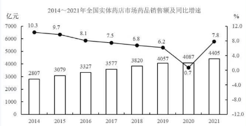

```
没有直接告诉2013 不用算！！！！！！！！
```


## 其他情况 不看间隔 是全部的

```
18-23 这里年份是6年，但是间隔是5年

这里补充下，因为年均【增量】是有一个比较的过程，所以要看间隔 /5

而年均量= 是没有比较过程，就是每一年的，所以直接除 /6

有年间直接除 其他题目给了前一年就往前推
```


## 这里要注意5年计划

```
5年计划 一半都是4个间隔 
比如十三五 16-20
```

## 题目明确告诉你几年的

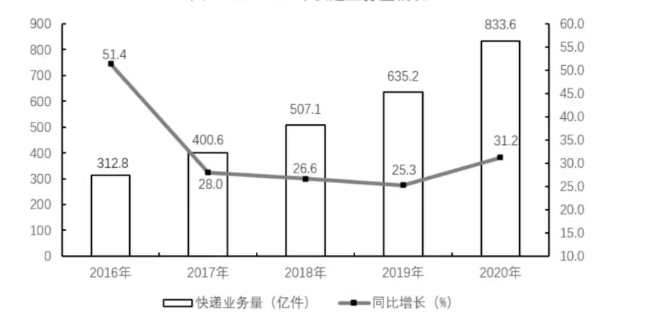

2016-2020年这五年，快递业务量年均增长约多少亿件?

```
312/151 =207 【5年所以2016 要求出来】
833-207=626
626/5=125
```


## 直接告诉上一期就按上一期，没告诉的就不要算上一期哦，哪怕可以算也不算


## 奇数偏大 偶数偏小


# 间隔R

## 给了平均和一部分R

2021年1~2月，全国网上零售额17587亿元，同比增长32.5%，【两年平均增长13.3%】。其中，实物商品网上零售额14412亿元，同比增长30.6%，两年平均增长16.0%，占社会消费品零售总额的比重为20.7%；在实物商品网上零售额中，吃类、穿类和用类商品分别增长41.6%、44.3%和25.1%，两年平均分别增长33.8%、8.7%和16.0%。

在2020年1~2月①全国网上零售额和②实物商品网上零售额中：

- A仅①同比正增长
- B仅②同比正增长
- C①和②均同比正增长
- D①和②均未同比正增长

```
题目问 2020
19 20 21   给了21年和2年平均

13.3+13.3+13.3*13.3=27左右
 27=32.5 +x
 
16+16+16*16=32+
32=30.6+x  x 为正数
```

```
错+1
两年平均增长 就是告诉你2年间隔是多少，在反推，
```


## 给了总体和一部分

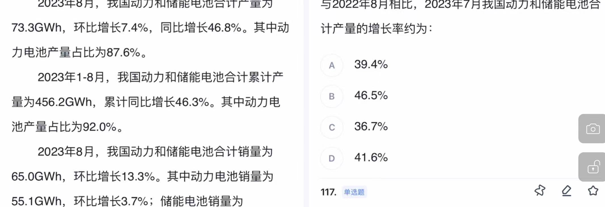


```
22.8 22.7 21.8
22.8-21.8 总体
22.8-22.7 部分
求22.7-21.8   

```


# 比较4个数的增长率大小

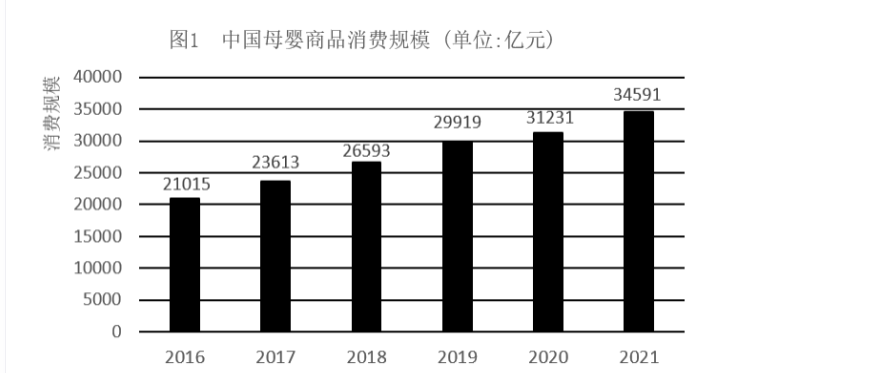

2018-2021年，我国母婴商品消费规模增长率的变动趋势是：

```
直接用现期/基期 纵向比较
265/236
299/265

不要先减 265-236/236 计算量大，且麻烦
```


# 贡献率

a对b的贡献率=a的增长量/b的增长量


# 拉动增长率

拉动增长率

=部分增长量/总体基期值
=部分基期值*R/总体基期值
= 基期比重 * R


# 都超10%的数据有几个

2011～2018年间，我国海洋主题公园非门票收入同比增速超过10%的年份有几个
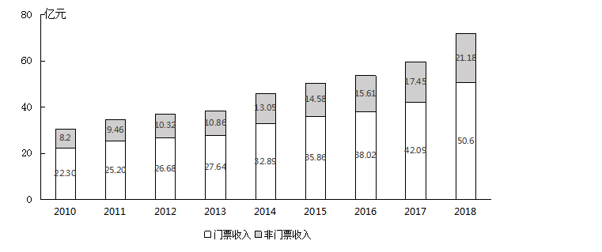

```
直接错位加
8.2+0.82=9.02  9.46 可
946+ 946=1036  不可 
```


# 超15%有几个

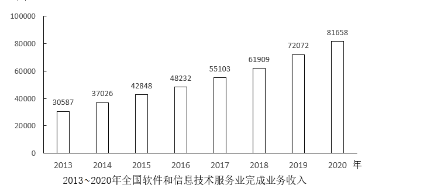

2014~2020年，我国软件和信息技术服务业完成业务收入同比增速超过15%的年份有几个？

- A2
- B3
- C4
- D5

```
本质还是划线 基*(1+15%) <现 
直接现/115 看成111 也就是现/9 还要在小一点
30587/9=338  370 符合
37026/9=411  428 符合
42848/9=4872 下4   482  这个很解决，要算误差了  【2016 不符合】
17 18 不符合
72072/9=8008  816 符合  

14 15 19 选B

其他方法： +10% + 5% 没有这个快的
```


# 折线图 看首尾


# 容斥

在什么中，同时怎么样 。带容斥公式

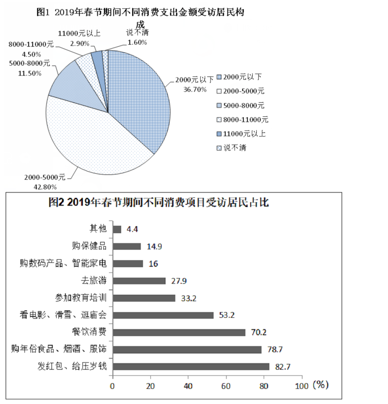

2019年春节期间消费支出在2000元以下的受访居民中，“发红包、给压岁钱”的至少占

A79.4

B61

C54.8

52.9

```
A=2000*3.67 =734
B=2000*82.7=1654
问的是 A 里面会B的  要先求出 同时都会的
734+1654-2000=388
388/734=52.9%
```


# 贸易顺差/逆差

+ 进口>出口  贸易逆差

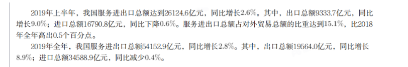

2019年下半年，我国服务进出口贸易状况为：

A顺差5000亿元以内

B顺差5000亿元以上

C逆差5000亿元以内

D逆差5000亿元以上

```
19564-9333=10300
进口>出口  贸易逆差
```


# 坑点

## 少字

问：2018年，B市高新技术示范区规模以上高新技术企业月均收入在以下哪个范围内？

题目给得条件

```
2018年，B市高新技术示范区规模以上高新技术企业实现技术收入10629.4亿元，比上年增长，占高新技术示范区规模以上高新技术企业总收入的比重为，比上年提高1.8个百分点。
```

问法少了技术2个字，求得就是总得 ！


## 多几倍 


## 增加了几倍 

## 图表单位 

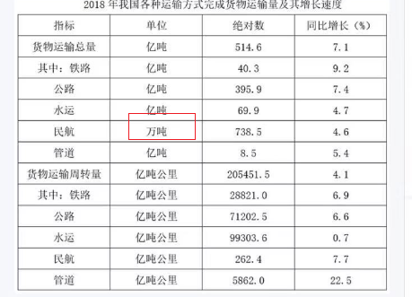


## 加减求平均值，数值接近，基本有坑

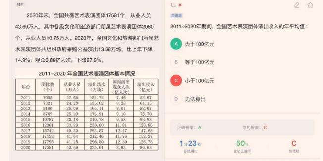

这题年份10年，答案在100，也就是说加起来在1000左右，如果你你只加了前面，那就是错的

```
坑就坑在 小数点一加会进位
```


## 问增长率的【涨幅】

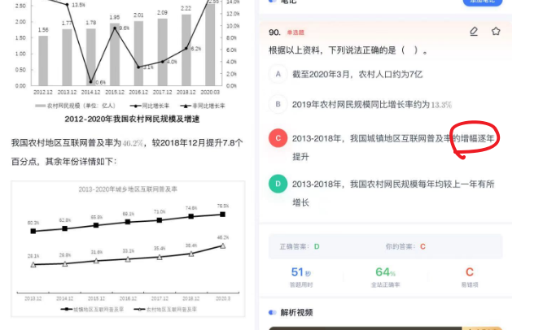

一不小心就掉坑了。。。。


# 年均增长

1982年、1990年、2000年和2010年四次人口普查数据显示，我国劳动年龄人口分别为5.67亿人、6.99亿人、8.08亿人和9.16亿人

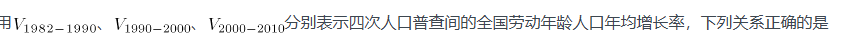

```
这题眼睛瞎，人家问的是劳动年龄人口，我就说题目怎么没数据
1990-2000 
2000-2010 都是十年，先比较
808   916   108 上10几
--   ---
699   808  下面上10几 700多更小  左边大


699/567 > 808/699  8年增长的量>10年增长的量 所以第一个最大

```

# 每年增长不等于年均增长


# 月均

月均题目可以不用做，一般都会设置陷阱选项直接选

 2017年1-4月，T地区批发和零售业商品销售总额为15220亿元，同比增长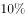，其中，限额以上商品销售额达到11107亿元，同比增长；4月份，T地区批发和零售业商品销售总额和限额以上商品销售额分别为3339亿元和2554亿元。 

题

2017年一季度，T地区月均批发和零售业商品销售额约为多少亿元？

- A2851
- B3960
- C4591
- D11881

```
3个月  BD 3个月 选B
```


# 混合

+ 看到加减就要想到混合

  ```
  当月累计=上月累计+当月
  问【当月产量同比增速低于当月累计产量同比增速】
  R当月<R当月累计<R上月累计【混合居中】
  也就是直接找 R当月累计<R上月累计
  
  ```

+ 计算方法

2023年S市完成固定资产投资6031.2亿元，比上年增长5.0%，其中第一产业投资4.6亿元，增长4.8%;第二产业投资1884.0亿元增长9.9%;第三产业投资4142.6亿元

选项 A:-1.1%  B 2.9%

```5-x
给出
4142        1884
x      5    9.9
9.9     5-x      9.9对应的小 
    5
x       9.9-5
5-x<4.9
x>0.1
```


+ 例二

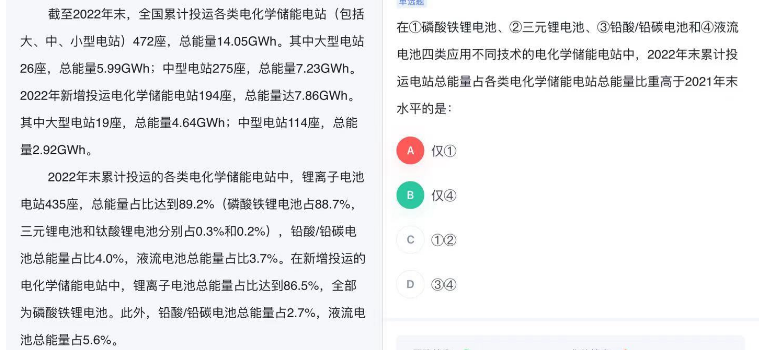

```
这题主要是没读懂题目，考的混合

以第一个为例子  86.5 和 x 混合成 88.7  哪x肯定大于88.7 
也就是21年大于22年 不选
```


# 增长量比大小

```
1.4964*1.3%
2.810*21.1%
3.5333*17.8%

3肯定最大 比较1 2  4964是810的6倍多，但是21.1是1.3的20倍 2 大


328*130
362*103

103上20% 362就要下20% 比328要小
本质就是
```


## 同比增量带正负号


# 基期比重

```
A    1+b
-- *----
B    1+a

不能看到右边是小于1的 直接选一个小于A/B的数字
```

【2】

```
已经很多次忘记A/B 在乘法了，本来就小，只要A/b 小于1，数量级，肯定还要在小于1
```


## 扩展题目


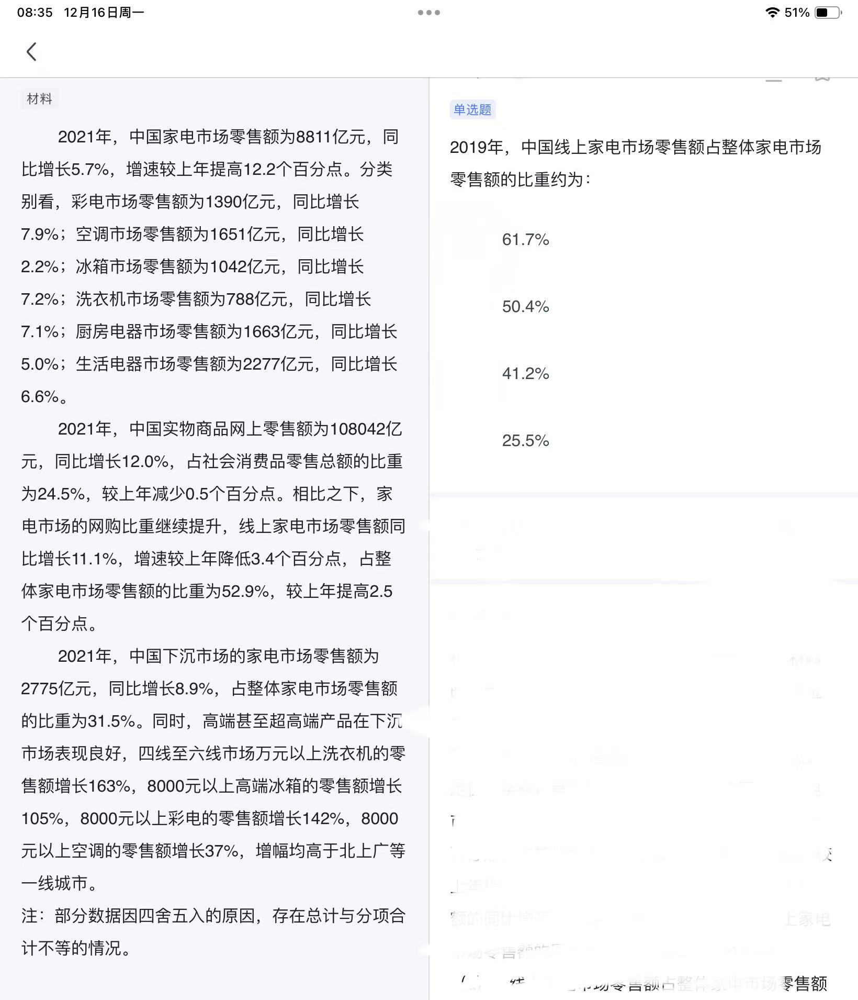

```
2019年，中国线上家电市场零售额占整体家电市场零售额的比重约为:
61.7%
50.4%
41.2%
25.5%

可以看到题目问的是2019年，但是材料给的是2021年
这里会出现三个年份 2021 2020 2019 
2020的占比给了 52.9-2.5=50.4   再代入公式
        1-6.5
50.4* ------ = 50.4* 93/114  选C
       1+14.5
```


----------------------

文化企业实现利润总额7903亿元，比上年同期增长“?”;营业收入利润率为7.93%，同比下降0.15个百分点。营业收入利润同比增长5.9%

```
基期比重逆运用

```


# 比重差 和 乘积占比

```
两期比重看升降，a＜b下降，排除c跟d，a-b＜a-b的绝对值2.4，秒A
```


2011年，全国全口径发电量47217亿千瓦时，比上年增长11.68%。其中水电发电量占全部发电量的14.03%，比2010年同期降低2.21个百分点；火电发电量占全部发电量的82.54%，比2010年同期提高1.73个百分点；核电、并网风电发电量占全部发电量的比重分别为1.85%和1.55%，比2010年同期分别提高了0.08个百分点和0.38个百分点

与2010年相比，2011年全国的水电发电量约：

- A上升6.5%

- B上升11.7%

- C下降2.2%

- D下降3.5%

  

```
基期比重
其中水电发电量占全部发电量的14.03%，比2010年同期降低2.21个百分点
-2.21 =14.03* (a-11.68)/1+a
代入答案 选D
```

```
乘积R=整体*占比
问的是2011相对2010
a=(-2.21/(2.21+14.03))=-2.21/16.2=-13.8
b=11.68
答案=a+b+a*b

```


## 看到 去年 今年占比 首先考虑比重差

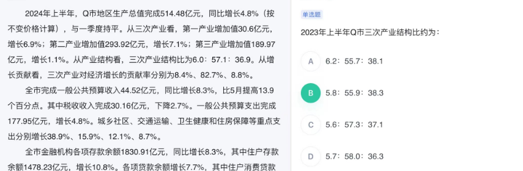


# 同比例放缩

2022年，风电、光伏年发电量首次突破1万亿千瓦时，达到1.19万亿千瓦时，较2021年增加2073亿千瓦时，同比增长21%，占全社会用电量的13.8%，同比提高2个百分点，接近全国城乡居民用电量。2022年，可再生能源发电量达到2.72万亿千瓦时，占全社会用电量的比重为31.6%，较2021年提高1.7个百分点，可再生能源在保障能源供应方面发挥的作用越来越明显。
2021年，除风电、光伏发电外的可再生能源发电量及其占全社会用电量的比重约为：

- A1.36万亿千瓦时，18.1%
- B1.36万亿千瓦时，14.2%
- C1.51万亿千瓦时，18.1%
- D1.51万亿千瓦时，14.2%

```

```


# 乘法*百分数 相减

```
8317*648 -4230*654

648 654 2个百分数很接近
（8317-4230）*650=265
前面变大 后面变小 整体结果变大 这样更精准数据
```


# 资料分析 变化幅度不看正负


# 其他小知识点

+ 1吨=1000公斤
+ 由于1吨=2000斤
+ 结余率=(收入-支出)/收入 【2】
+ 顺差=出口-进口
  + 逆差=进口-出口

