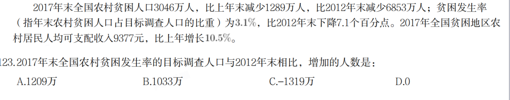

# Table of Contents

* [分数做差题型-误差接近用](#分数做差题型-误差接近用)


# 分数做差题型-误差接近用



```
3046     9899
---  -  ---- 
3.1      102

常规就是划钱法 
------进阶 
1.估首位
3046 310 首位9 
3046-310*9=256
256/310 大概在825 
总得就是9825
同理后面9705 结果120 很精确了
```


2.2017年贫困地区农村居民收入增速快于上年。其主要特点：一是粮食丰收，贫困地区农村居民出售农产品数量增加，粮食、肉羊等部分大宗农产品市场价格回升。农民家庭一产经营净收入人均2826元，增长3.2%，增速比上年提高0.5个百分点。二是随着产业扶贫、旅游扶贫、电商扶贫等深入推进，贫困地区二三产业加快发展，一二三产业融合发展取得可喜进展。农民家庭二三产业经营净收入人均897元，增长20.4%，增速比上年提高6.5个百分点。

2016年贫困地区农民家庭一二三产业经营净收入人均（ ）元。
A.3483
B.3608
C.3723
D.8483

```
2826   897
--- + ---
103    120

2826-20164=762  762/103=74  274
897-840=57  57/120=469   274 +75=3490 【注意位数】
选A
```

3.货物出口差额（出口减进口）28719亿元，对“一带一路”沿线国家进出口总额73745亿元，其中出口43045亿元，增长12.1%；进口30700亿元，增长26.8%。
与2016年相比，2017年我国对“一带一路”沿线国家出口增加额比进口增加额约少：
A.1623元
B.1842元
C.1915元
D.2012元

```
430       307
---121   - -- 268
112       126

增长量 直接划线就行：
上8 430 464
307*2=614 上650 
650-464 =1860 
但是实际上上8 少了，也就是464大 结果比1860小 选B
```

4. 2008年1—2月，房地产业城镇投资额比制造业多多少亿元： 
A. 104.36 
B. 118.25 
C. 127.17 
D. 148.29 

```
2729   3103
----  ----
1049    1254

2729- 2098= 631  631/104= 605  2605
3103- 2508= 593  593/125=  4744  2474

131 选C 
```

5. 从所给数据资料中可以推算，2017年末
全国人口总数比2016年末增加量最接近：
A.741
B.822
C.895
D.938

```
794/572 
741/537

794-572 =222  * 7/4=3885  13885
741-537= 204/537=408 下7 380  1384
13885 比实际小
13800
   85  选B
```

