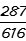
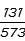

# Table of Contents

* [01](#01)

# 01

1.

     

A.29.7%

B.31.4%

C.32.8%

D.33.4%

 

***\*2.\****

   

A.43.2%

B.44.5%

C.46.6%

D.48.1%

 

3.

 

A.12.5%

B.13.2%

C.13.8%

D.14.5%

 

4.

 

A.22.9%

B.23.9%

C.24.9%

D.25.9%

 

5.

37.9×62.6

A.2236

B.2304

C.2373

D.2434

 

6.

82271/5960

A.12.5

B.13.8

C.15.3

D.17.1

 

 

 

7.

1245/（1+12.4%）

A.1107.7

B.1143.1

C.1163.6

D.1231.9

 

8.

3263/1458

A.2.45

B.2.39

C.2.24

D.2.07

 

9.

46.2×61.6

A.2703

B.2781

C.2846

D.2899

 

10.

（4785+7528）/13.52%

A.87245

B.91072

C.94691

D.98239

 

 
