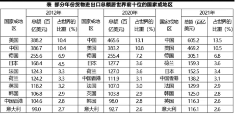

# Table of Contents

* [01](#01)
* [02](#02)
* [03 基期](#03-基期)

# 01

1.

     

A.29.7%

B.31.4%

C.32.8%

D.33.4%

 

***\*2.\****

   

A.43.2%

B.44.5%

C.46.6%

D.48.1%

 

3.

 

A.12.5%

B.13.2%

C.13.8%

D.14.5%

 

4.

 

A.22.9%

B.23.9%

C.24.9%

D.25.9%

 

5.

37.9×62.6

A.2236

B.2304

C.2373

D.2434

 

6.

82271/5960

A.12.5

B.13.8

C.15.3

D.17.1

 

 

 

7.

1245/（1+12.4%）

A.1107.7

B.1143.1

C.1163.6

D.1231.9

 

8.

3263/1458

A.2.45

B.2.39

C.2.24

D.2.07

 

9.

46.2×61.6

A.2703

B.2781

C.2846

D.2899

 

10.

（4785+7528）/13.52%

A.87245

B.91072

C.94691

D.98239

 

 # 02

***\*1.\****73/187= A.37.2%  B.38.2%  C.39.0%  D.40.4%

 

 

***\*2.\****345/831= A.37.9%

B.38.6% C.40.2% D.41.5%

 

 

***\*3.\****611/1083= A.56.4%

B.58.6% C.60.5% D.61.1%

 

 

***\*4.\****535/691= A.76.2%

B.77.4% C.78.7%

D.79.3%

 

 

 

***\*5.\****92/237= A.36.2%  B.37.4%  C.38.8%  D.39.5%

 

 

***\*6.\****61.7*57.3= A.2975

B.3212 C.3535 D.3783

 

 

***\*7.\****635/819= A.76.2%

B.77.5% C.78.7% D.79.3%

 

 

***\*8.\****83/237=

A.33.2%

B.34.4% C.35.0% D.36.5%

 

 

***\*9.\****82/293= A.25.1%  B.26.6%  C.28.0%  D.29.7%

 

 

***\*10.\****717/1374= A.48.9%

B.50.6% C.51.4% D.52.2%

 

 

***\*11.\*****136

A.53.8 B.55.3 C.56.5 D.57.8

**
**

***\*12.\****257/716= A.34.7%

B.35.9% C.36.8% D.37.4%

 

 

***\*13.\****61/284= A.19.5%

B.20.4% C.21.5% D.22.7%

 

 

14.*=

A.26.7% B.28%  C.29.5% D.30.8%

 

 

***\*15\****.=

A.13.8% B.14.6% C.15.7%

D.16.3%

 

 

 

***\*16\****.431*25 3

125     .

A.83.3 B.85.4 C.87.2 D.89.7

 

 

***\*17.\****157/279= A.54.6%

B.55.2% C.56.3% D.57.7%

 

 

18.*75.4

A.21.0 B.22.4 C.23.3 D.24.6

 

***\*19\****.*53.7=

A.15.6

B.16.4 C.18.8 D.20.5

 

 

***\*20\****.583/1473= A.39.6%

B.40.8% C.41.5% D.42.6%

# 03 基期

***\*1.\*******\*【2020\*******\*江苏\*******\*】\****

2019年江苏省金融信贷规模扩大，保险行业发展较快。全年保费收入3750.2亿元，比上年增长13.1%。其中，财产险收入940.9亿元，增长9.6%；寿险收入2215.3亿元，增长11.6%；健康险收入508.8亿元，增长28.8%；意外伤害险收入85.2亿元，增长9.1%。全年保险赔付998.6亿元，比上年增长0.2%。其中，财产险赔付534.5亿元，增长4.3%；寿险赔付294.3亿元，下降17.3%，健康险赔付144.8亿元，增长38.7%；意外伤害险赔付25.0亿元，增长4.7%。

2018年江苏省财产险收入与赔付之差为： 

A. 346.0亿元 

B. 364.0亿元 

C. 396.6亿元 

D. 406.4亿元

***\*2.\*******\*【2020\*******\*联考\*******\*】\****

2019年5月，全国12358价格监管平台受理价格举报、投诉、咨询共计37576件，同比下降40.70%，环比下降9.31%。其中，价格举报4192件，环比下降19.06%；价格投诉2059件，环比下降15.92%；价格咨询31325件，环比下降7.34%。

2019年4月，平台受理的价格咨询比价格举报约多： 

A. 26146件 

B. 27133件 

C. 28627件 

D. 29614件

3.***\*【2020\*******\*联考\*******\*】\****

2019年6月，全国发行地方政府债券8996亿元，同比增长68.37%，环比增长195.63%。其中，发行一般债券3178亿元，同比减少28.33%，环比增长117.08%，发行专项债券5818亿元，同比增长540.04%，环比增长268.46%；按用途划分，发行新增债券7170亿元，同比增长127.11%，环比增长332.71%，发行置换债券和再融资债券1826亿元，同比减少16.47%，环比增长31.75%。 

2018年6月，发行置换债券和再融资债券约为： 

A. 3157亿元 

B. 2186亿元 

C. 1657亿元 

D. 1386亿元

***\*4.\*******\*【2019\*******\*联考\*******\*】\****

2018年第一季度我国水产品进出口192.67万吨，同比减少7.27%，增速较上年同期减少21.97个百分点；进出口总额77.15亿美元，同比增加10.84%。贸易顺差19.66亿美元，同比减少2.15亿美元 。

2016年第一季度我国水产品进出口总量最接近以下哪个数字？ 

A. 140万吨 

B. 160万吨 

C. 180万吨 

D. 200万吨

***\*5.\*******\*【2019\*******\*上海\*******\*】\****

2017年1月17日国家能源局公布《能源发展“十三五”规划》《天然气“十三五”规划》，首次明确“发挥市场配置资源的决定性作用”，到2020年天然气综合保供能力应达到3600亿立方米以上，天然气消费占一次能源消费比例达到 8.3-10%。2017年，我国天然气消费总量2373亿立方米，同比增长15.3%；全年天然气进口量920亿立方米，同比增长27.6%。 

我国2016年天然气消费总量约为____亿立方米。 

A. 1172 

B. 2058 

C. 2373 

D. 30856

***\*6.\*******\*【2018\*******\*江苏\*******\*】\****

2017年末，全国民用汽车保有量21743万辆，比上年末增长11.8%。其中私人汽车保有量18695万辆，增长12.9%；民用轿车保有量12185万辆，增长12.0%，其中私人轿车保有量11416万辆，增长 12.5%；全国新能源汽车保有量153.0万辆，其中新能源汽车新注册登记65.0万辆，比上年增加15.6万辆。 

2016年末全国私人轿车保有量为 

A. 10148万辆 

B. 11006万辆 

C. 13879万辆 

D. 16559万辆

7.【2024陕西】

截至2022年底，全国共有278家银行机构和29家理财公司有存续的理财产品，共存续产品3.47万只，同比下降4.41%；存续规模27.65万亿元，同比下降4.66%。分机构类型来看，理财公司存续产品13947只，存续规模22.24万亿元，同比增长29.36%。

2021年银行机构存续的理财产品存续规模约为多少万亿元？

A.5.4

B.6.7

C.10.5

D.11.8

8.【2023陕西】

2021年，全国城市供水总量673.34亿立方米，同比增长6.96%；城市供水管道长度105.99万公里，同比增长5.26%。

2020年，全国城市供水总量约为：

A.600亿立方米

B.620亿立方米

C.630亿立方米

D.724亿立方米

9.【2021陕西】

公司2019年第一季度经营数据进行了统计，131家证券公司当期实现营业收入1018.94亿元，各主营业务收入分别为代理买卖证券业务净收入（含席位租赁）221.49亿元，同比增长13.77%，

2018年第一季度，131家证券公司代理买卖证券业务净收入（含席位租赁）约为：

A.184.6亿元

B.190.1亿元

C.194.7亿元

D.204.2亿元

 

\10. 【2019辽宁】

注：2019年表格信息

 

2018年8月通讯器材类实现消费品零售额比日用品类约多（ ）亿元。

A.2.6

B.2.4

C.2.2

D.2.0

 # 05 9.11基本公式

1.【2023联考】

2022年1\~7月，全国规模以上工业发电4.77万亿千瓦时，同比增长1.4%，增速比上半年加快0.7个百分点。7月份，全国发电量8059亿千瓦时，同比增长4.5%。

2021年7月份，全国发电量大约是多少亿千瓦时？

A.6570

B.6920

C.7712

D.7800

2.【2023联考】

2022年1\~7月，全社会用电量累计49303亿千瓦时，同比增长3.4%。分产业看，第一产业用电量634亿千瓦时，同比增长11.1%；第二产业用电量32552亿千瓦时，同比增长1.1%；第三产业用电量8531亿千瓦时，同比增长4.6%；城乡居民生活用电量7586亿千瓦时，同比增长12.5%。7月份，全社会用电量8324亿千瓦时，同比增长6.3%。

2021年1\~6月全社会用电量累计约多少亿千瓦时？

A.38258

B.39851

C.40472

D.41279

3.【2023广东】

2021年，广东省财政科学技术支出为982.76亿元，占当年全省财政一般公共预算支出的比重为5.4%。其中，省本级财政科学技术支出为102.05亿元，占省本级财政一般公共预算支出的比重为6.6%，同比增加0.84个百分点。珠江三角洲核心区财政科学技术支出845.09亿元，同比增长2.6%。

2020年，广东省省本级财政科学技术支出为（ ）亿元。

A.83.96

B.102.64

C.122.32

D.132.67

4.【2023广东】

2022年，全国居民人均可支配收入36883元，比上年增长（以下如无特别说明，均为同比名义增长）5.0%。2022年，全国居民人均消费支出24538元，比上年增长1.8%。

2022年，全国居民人均收支盈余比上一年（ ）。（注：收支盈余=收入-消费支出）

A.增加了约5%

B.减少了约5%

C.增加了约12%

D.减少了约12%

5.【2023江苏】

2021年，全国地级及以上城市平均空气质量优良天数占比为87.5%，比2015年提高6.3个百分点，PM2.5年均浓度为30毫克/立方米，比2015年下降34.8%；地表水考核断面中，水质优良（Ⅰ\~Ⅲ类）断面占比为84.9%，比2012年提高23.2个百分点。

2015年全国地级及以上城市PM2.5年均浓度为（ ）。

A.38毫克/立方米

B.42毫克/立方米

C.46毫克/立方米

D.49毫克/立方米

6.【2023江苏】

2021年，我国移动互联网接入流量2216亿GB，是2012年的252倍；互联网上网人数10.3亿人，比2012年增长83.0%。2021年末，累计建成并开通5G基站142.5万个，5G基站总量占全球的60.0%以上。

2021年我国互联网上网者人均移动互联网接入流量是2012年的（ ）。

A.105倍

B.114倍

C.126倍

D.138倍

7.【2023江苏】

2021年和2022年某市统计局通过两次调查，分别获取了该市1181位和1107位60岁以上老年人使用智能手机的有关情况。

表中所列智能手机的12个功能项中，2022年受访者中使用人数多于2021年的功能项数占比为

A.41.7%

B.50.0%

C.58.3%

D.75.0%

8.【2023江苏】

2021年，我国对外贸易总额为6.9万亿美元，比上年增长30.2%，比2012年多2.5万亿美元，连续两年成为世界第一大贸易国。其中，服务贸易总额82.1百亿美元，占世界的比重升至7.2%，较2012年提高1.8个百分点。

2020年我国对外贸易总额是：

A.5.8万亿美元

B.5.3万亿美元

C.4.9万亿美元

D.4.6万亿美元

9.【2023江苏】

表中所列的国家或地区中，2021年货物进出口总额增速最小的国家或地区是：

A.  英国

B.  德国

C.  日本

D.  意大利

10.【2023浙江】

2018\~2020年，我国中部地区规模以上文化及相关产业企业累计营业收入约比西部地区高多少万亿元？

A.1.0

B.1.5

C.2.0

D.2.5

11.【2023浙江】

2021年，全国零售药店终端药品销售额约为2013年的多少倍？

A.1.3

B.1.5

C.1.7

D.1.9

12.【2023深圳】

2019年，东部地区众创空间数量占全国比重是

A.59.4%

B..58.5%

C.57.7%

D..55.6%

12.【2023山东】

2019-2022年，我国发明专利产业化率同比增幅最大的年份是：

A.2019年

B.2020年

C.2021年

D.2022年

13.【2023国考】

2021年，中国向全球出口纺织纱线138亿美元，出口织物667亿美元，分别同比增长41.5%和34.3%。纺织制品当中，防疫类口罩出口额为129.5亿美元，出口金额、数量同比分别下降76.0%和13.0%。除防疫类口罩外，其他纺织制品出口额为517.2亿美元，同比增长27.5%。

2020年中国出口的纺织制品总额中，防疫类口罩出口额占比约为：

A.57%

B.72%

C.33%

D.45%

14.【2023国考】

2021年，中国向"一带一路"沿线国家出口纺织品服装1137.9亿美元，同比增长24.5%，较2019年增长17.3%；同时，中国自"一带一路"沿线国家进口纺织品服装131.6亿美元，同比增长24.5%

2020年，中国对"一带一路"沿线国家纺织品服装贸易顺差额约为多少亿美元？

A.1129

B.1253

C.808

D.1006

15.【2023四川】

国家能源局发布2022年1～7月，全国规模以上工业发电4.77万亿千瓦时，同比增长1.4%，增速比上半年加快0.7个百分点。7月份，全国发电量8059亿千瓦时，同比增长4.5%，增速比上月加快3.0个百分点。

2021年7月份，全国发电量大约是多少亿千瓦时？

A.6570

B.6920

C.7712

D.7800